# NVM Express®

# Base Specification

Revision 2.1 

August 5th, 2024 

Please send comments to info@nvmexpress.org 

NVM Express® Base Specification, Revision 2.1 is available for download at https://nvmexpress.org. The NVM Express Base Specification, Revision 2.1 incorporates NVM Express Base Specification, Revision 2.0, ratified on June 3, 2021, ECN 001, ECN102, ECN105, ECN106, ECN107, ECN109, ECN110, ECN111, ECN112, ECN113, ECN114, ECN 115, ECN116, ECN117, ECN118, ECN119, ECN120, ECN121, ECN122, TP4029a, TP4034a, TP4055, TP4058, TP4074a, TP4077, TP4094a, TP4095a, TP 4097a, TP 4099, TP4100, TP 4103, TP4104a, TP4109a, TP4110a, TP 4112, TP 4113a, TP 4114, TP4119b, TP 4124, TP4129, TP4130a, TP4135, TP4136, TP4142, TP4145, TP4146b, TP4150, TP4152, TP4155, TP4156a, TP4159, TP4160, TP4162a, TP4165, TP4167, TP4169, TP4170, TP4171, TP4181, TP4182, TP6011a, TP6021, TP6032, TP6034a, TP6036, TP6038, TP8009, TP8010a, TP 8013a, TP8012, TP 8014, TP8016, TP8017a, TP8018, TP8019a, TP8020, TP8021, TP8024a and TP8025 (refer to https://nvmexpress.org/changes-in-nvme-revision-2-1 for details). 

# SPECIFICATION DISCLAIMER

# LEGAL NOTICE:

$\circledcirc$ Copyright 2008 to 2024 NVM Express, Inc. ALL RIGHTS RESERVED. 

This NVM Express Base Specification, Revision 2.1 is proprietary to the NVM Express, Inc. (also referred to as “Company”) and/or its successors and assigns. 

NOTICE TO USERS WHO ARE NVM EXPRESS, INC. MEMBERS: Members of NVM Express, Inc. have the right to use and implement this NVM Express Base Specification, Revision 2.1 subject, however, to the Member’s continued compliance with the Company’s Intellectual Property Policy and Bylaws and the Member’s Participation Agreement. 

NOTICE TO NON-MEMBERS OF NVM EXPRESS, INC.: If you are not a Member of NVM Express, Inc. and you have obtained a copy of this document, you only have a right to review this document or make reference to or cite this document. Any such references or citations to this document must acknowledge NVM Express, Inc. copyright ownership of this document. The proper copyright citation or reference is as follows: $\mathfrak { s o }$ 2008 to 2024 NVM Express, Inc. ALL RIGHTS RESERVED.” When making any such citations or references to this document you are not permitted to revise, alter, modify, make any derivatives of, or otherwise amend the referenced portion of this document in any way without the prior express written permission of NVM Express, Inc. Nothing contained in this document shall be deemed as granting you any kind of license to implement or use this document or the specification described therein, or any of its contents, either expressly or impliedly, or to any intellectual property owned or controlled by NVM Express, Inc., including, without limitation, any trademarks of NVM Express, Inc. 

# LEGAL DISCLAIMER:

THIS DOCUMENT AND THE INFORMATION CONTAINED HEREIN IS PROVIDED ON AN “AS IS” BASIS. TO THE MAXIMUM EXTENT PERMITTED BY APPLICABLE LAW, NVM EXPRESS, INC. (ALONG WITH THE CONTRIBUTORS TO THIS DOCUMENT) HEREBY DISCLAIM ALL REPRESENTATIONS, WARRANTIES AND/OR COVENANTS, EITHER EXPRESS OR IMPLIED, STATUTORY OR AT COMMON LAW, INCLUDING, BUT NOT LIMITED TO, THE IMPLIED WARRANTIES OF MERCHANTABILITY, FITNESS FOR A PARTICULAR PURPOSE, TITLE, VALIDITY, AND/OR NONINFRINGEMENT. 

All product names, trademarks, registered trademarks, and/or servicemarks may be claimed as the property of their respective owners. 

The NVM Express® design mark is a registered trademark of NVM Express, Inc. 

PCI-SIG®, PCI Express®, and $\mathsf { P C l e } ^ { \otimes }$ are registered trademarks of PCI-SIG. 

InfiniBandTM is a trademark and servicemark of the InfiniBand Trade Association. 

Redfish® is a registered trademark of DMTF. 

NVM Express Workgroup 

c/o VTM, Inc. 

3855 SW 153rd Drive 

Beaverton, OR 97003 USA 

info@nvmexpress.org 

# Table of Contents

# 1 INTRODUCTION .............

1.1 Overview.. 

1.1.1 NVM Express® Specification Family ............. 

1.2 Scope................ .... 2 

1.3 Outside of Scope .. 

1.4 Conventions.. 2 

1.4.1 Keywords . .2 

1.4.2 Numerical Descriptions .......... ....3 

1.4.3 Byte, Word, and Dword Relationships.. .5 

1.5 Definitions .. . 5 

1.5.1 admin label... ....5 

1.5.2 admin label ASCII... ....5 

1.5.3 admin label UTF-8... .6 

1.5.4 Admin Queue ........ .....6 

1.5.5 Administrative controller . .6 

1.5.6 allocated namespace .. .6 

1.5.7 Allowed Host List.. .6 

1.5.8 arbitration burst . .6 

1.5.9 arbitration mechanism . .6 

1.5.10 association . .6 

audit .. .6 

authentication commands . .6 

cache.. .6 

candidate command.. .6 

capsule.. 

Centralized Discovery controller (CDC)... .7 

Channel.. 

1.5.18 command completion . 

command submission........ ....7 

controller ...... ....7 

1.5.21 Controller Reset . 

Directive .. 

Direct Discovery controller (DDC) .. 

Discovery controller... .8 

1.5.25 discovery information . .8 

Discovery Service.... .8 

dispersed namespace ......... ......8 

1.5.28 dynamic controller . .8 

1.5.29 Domain.. .8 

embedded management controller.... ......8 

1.5.31 emulated controller. .8 

Endurance Group ............. ......8 

1.5.33 Entry Key.... .8 

Exported Namespace.. .8 

1.5.35 Exported NVM Resources. .8 

1.5.36 Exported NVM Subsystem . .9 

Exported Port .. .9 

1.5.38 Exported Port ID.. .9 

fabric (network fabric).. .9 

1.5.40 Fabric Zoning . .9 

firmware/boot partition image update command sequence .. .9 

firmware slot .... ....9 

host ......... ....9 

host-accessible memory..... .9 

host management agent.. 9 

1.5.46 host memory.. .9 

idempotent command.. .9 

Identify Controller data structures.. 

Identify Namespace data structures .. ..10 

I/O command... .10 

I/O Completion Queue.. .10 

I/O controller... ..10 

I/O Submission Queue .... .10 

Media Unit .. .10 

memory-based controller........... ....10 

message-based controller ...... ....10 

1.5.57 metadata .10 

MMC..... ....10 

1.5.59 MMH.. .10 

MMHD.. .11 

MMHS .. .11 

1.5.62 namespace.. .11 

namespace ID (NSID) .. .11 

NVM .. .11 

NVM Set.. .11 

NVM subsystem . .11 

1.5.67 NVM subsystem port .. .11 

NVMe over Fabrics................. ...11 

NVMe Transport ................... ...11 

NVMe Transport binding specification.... .11 

participating NVM subsystem........ ..11 

physical fabric interface (physical ports)... .12 

Placement Handle ................ ..12 

Placement Identifier............... ..12 

1.5.75 Port ID .. .12 

Ports List .. .12 

Power Loss Acknowledge (PLA) . .12 

Power Loss Notification (PLN).. .12 

primary controller................ ...12 

private namespace...... .12 

property .... .12 

1.5.82 Reclaim Group (RG).. .12 

Reclaim Unit (RU) .... .12 

Reclaim Unit Handle (RUH) .... ..12 

1.5.85 rotational media. .13 

Runtime D3 (Power Removed)... .13 

1.5.87 sanitize operation . .13 

sanitization target ... ..13 

1.5.89 secondary controller .. .13 

1.5.90 shared namespace.. .13 

specified namespace.... ..13 

1.5.92 spindown . .13 

spinup....... .13 

static controller .................... ....13 

1.5.95 Underlying Namespace.. .13 

Underlying Namespace List . .13 

Underlying NVM Subsystem ........ ....14 

Underlying Port... .14 

1.5.99 user data .14 

1.6 I/O Command Set specific definitions used in this specification . . 14 

1.6.1 Endurance Group Host Read Command.. .14 

1.6.2 Format Index .. .14 

1.6.3 SMART Data Units Read Command. .14 

1.6.4 SMART Host Read Command . .14 

1.6.5 User Data Format.. ..14 

1.6.6 User Data Out Command.. .14 

1.7 NVM Command Set specific definitions used in this specification . . 14 

1.7.1 logical block.. .14 

1.7.2 logical block address (LBA) ........ ....14 

1.8 References . . 14 

1.9 References Under Development .. .16 

# 2 THEORY OF OPERATION ..... .... 17

2.1 Memory-Based Transport Model (PCIe) .. .. 19 

2.2 Message-Based Transport Model (Fabrics). .21 

2.2.1 Fabrics and Transports ........................................................................................................................21 

2.2.2 NVM Subsystem Ports for Fabrics . .22 

2.2.3 Discovery Service.. ..23 

2.2.4 Capsules and Data Transfer ........... ..23 

2.2.5 Authentication.. ..24 

2.3 NVM Storage Model . .. 24 

2.3.1 Storage Entities .......... ..24 

2.3.2 I/O Command Sets. .30 

2.3.3 NVM Subsystem Examples.. .30 

2.4 Extended Capabilities Theory .................. .. 32 

2.4.1 Multi-Path I/O and Namespace Sharing. .32 

2.4.2 Asymmetric Controller Behavior.. .35 

# 3 NVM EXPRESS ARCHITECTURE..... ..... 36

3.1 NVM Controller Architecture. .. 36 

3.1.1 Memory-Based Controller Architecture (PCIe) .. .36 

3.1.2 Message-Based Controller Architecture (Fabrics). ..36 

3.1.3 Controller Types. .37 

3.1.4 Controller Properties ... ..49 

3.2 NVM Subsystem Entities ......... ..... 75 

3.2.1 Namespaces ......... ....75 

3.2.2 NVM Sets . .77 

3.2.3 Endurance Groups ............ ....79 

3.2.4 Reclaim Groups, Reclaim Unit Handles, and Reclaim Units .81 

3.2.5 Domains and Divisions.. ..82 

3.3 NVM Queue Models . .. 85 

3.3.1 Memory-based Transport Queue Model (PCIe) . .85 

3.3.2 Message-based Transport Queue Model (Fabrics). .88 

3.3.3 Queueing Attributes......... ...97 

3.4 Command Processing ............. ...... 98 

3.4.1 Command Ordering Requirements... .98 

3.4.2 Fused Operations......... ...98 

3.4.3 Atomic Operations.. ..99 

3.4.4 Command Arbitration . ..99 

3.4.5 Outstanding Commands. .101 

3.5 Controller Initialization ......... ........ 102 

3.5.1 Memory-based Controller Initialization (PCIe).. .102 

3.5.2 Message-based Controller Initialization (Fabrics)..................... ....103 

3.5.3 Controller Ready Modes During Initialization .106 

3.5.4 Controller Ready Timeouts During Initialization .108 

3.6 Shutdown Processing.. .. 110 

3.6.1 Memory-based Controller Shutdown (PCIe).. .111 

3.6.2 Message-based Controller Shutdown (Fabrics) . ..112 

3.6.3 NVM Subsystem Shutdown.. ..113 

3.7 Resets... ... 117 

3.7.1 NVM Subsystem Reset .. .117 

3.7.2 Controller Level Reset. .118 

3.7.3 Queue Level Reset....... ....119 

3.8 NVM Capacity Model.. .. 119 

3.8.1 Overview .. ..119 

3.8.2 Media Unit Organization Examples ............. ....120 

3.8.3 Capacity Reporting...... .123 

3.9 Keep Alive . . 124 

3.9.1 Keep Alive Timer Configuration ........... .125 

3.9.2 Keep Alive Timer Activation . .125 

3.9.3 Command Based Keep Alive . .125 

3.9.4 Traffic Based Keep Alive .. .127 

3.9.5 Keep Alive Timeout Cleanup.. .129 

3.10 Privileged Actions .. . 130 

3.11 Firmware Update Process . . 130 

# 4 DATA STRUCTURES .......... ......... 133

4.1 Submission Queue Entry... . 133 

4.1.1 Admin Command and I/O Command Common SQE .133 

4.1.2 Fabrics Command Common SQE. .137 

4.2 Completion Queue Entry .. . 138 

Admin Command and I/O Command Common CQE .. 

4.2.2 Fabrics Command Common CQE. .139 

4.2.3 Status Field Definition . .139 

4.2.4 Phase Tag... ..149 

4.3 Data Pointer Layouts (PRPs and SGLs) .. . 151 

4.3.1 Physical Region Page Entry and List . .151 

4.3.2 Scatter Gather List (SGL) .. .153 

4.3.3 Metadata Region (MR).... .159 

4.4 Feature Values ... .. 159 

4.5 Identifier Format and Layout (Informative) .. . 161 

4.5.1 PCI Vendor ID (VID) and PCI Subsystem Vendor ID (SSVID) ....... .........161 

4.5.2 Serial Number (SN) and Model Number (MN)..... .162 

4.5.3 IEEE OUI Identifier (IEEE) . 

4.5.4 IEEE Extended Unique Identifier (EUI64).. .162 

4.5.5 Namespace Globally Unique Identifier (NGUID) . .163 

4.5.6 Universally Unique Identifier (UUID).................. ......................164 

4.6 List Data Structures . . 164 

4.6.1 Controller List . .164 

4.6.2 Namespace List.. ..164 

4.7 NVMe Qualified Names . . 165 

4.7.1 Unique Identifier .. .166 

4.8 UTF-8 String Processing . .. 167 

# 5 ADMIN COMMAND SET ........... ......... 169

5.1 Common Admin Commands . .. 172 

5.1.1 Abort command. .172 

5.1.2 Asynchronous Event Request command . .173 

5.1.3 Capacity Management command.. .181 

5.1.4 Controller Data Queue command.. .184 

5.1.5 Device Self-test command .188 

5.1.6 Directive Receive command. .190 

5.1.7 Directive Send command .. ......................191 

5.1.8 Firmware Commit command . 

5.1.9 Firmware Image Download command.. .194 

Format NVM command . .195 

5.1.11 Get Features command.. .198 

Get Log Page command .. ..201 

5.1.13 Identify command. ..295 

Keep Alive command . ..348 

Lockdown command .. .348 

Migration Receive command. .350 

Migration Send command . ..353 

NVMe-MI Receive command .... ......................361 

NVMe-MI Send command . ..361 

Namespace Attachment command . ..361 

Namespace Management command..................... .....................363 

Sanitize command.. .365 

Security Receive command.. .....................368 

Security Send command . .369 

Set Features command. ..370 

Track Receive command.. ..411 

Track Send command . ..414 

5.2 Memory-Based Transport Admin Commands (PCIe) . .. 418 

5.2.1 Create I/O Completion Queue command . ..419 

5.2.2 Create I/O Submission Queue command. ..420 

5.2.3 Delete I/O Completion Queue command.. ..422 

5.2.4 Delete I/O Submission Queue command . ..422 

5.2.5 Doorbell Buffer Config command . .423 

5.2.6 Virtualization Management command . ..424 

5.3 Message-Based Transport Admin Commands (Fabrics) . .. 426 

5.3.1 Clear Exported NVM Resource Configuration command . ...426 

5.3.2 Create Exported NVM Subsystem command. .426 

5.3.3 Discovery Information Management command .......... ...427 

5.3.4 Fabric Zoning Lookup command.. ..435 

5.3.5 Fabric Zoning Receive command.. ..435 

5.3.6 Fabric Zoning Send command ....... ......437 

5.3.7 Manage Exported Namespace command . ..438 

5.3.8 Manage Exported NVM Subsystem command. ...440 

5.3.9 Manage Exported Port command.. ..444 

Send Discovery Log Page command .. ..447 

# 6 FABRICS COMMAND SET ............... ........... 449

6.1 Authentication Receive Command and Response.. .. 449 

6.2 Authentication Send Command and Response . .. 450 

6.3 Connect Command and Response .. .. 451 

6.4 Disconnect Command and Response.. .. 456 

6.5 Property Get Command and Response . .. 457 

6.6 Property Set Command and Response.... .. 458 

# 7 I/O COMMANDS............... ................. 460

7.1 Cancel command.. .. 460 

7.1.1 Command Completion. .462 

7.2 Flush command . .. 463 

7.2.1 Command Completion.. ...463 

7.3 I/O Management Receive command.. .. 464 

7.3.1 I/O Management Receive Operations .. ..464 

7.3.2 Command Completion.. ...465 

7.4 I/O Management Send command . .. 465 

7.4.1 I/O Management Send Operations. .466 

7.4.2 Command Completion.. ...467 

7.5 Reservation Acquire command . .. 467 

7.5.1 Command Completion........... .....................468 

7.6 Reservation Register command .. .. 468 

7.6.1 Command Completion. ..470 

7.7 Reservation Release command .. 470 

7.7.1 Command Completion.. ..471 

7.8 Reservation Report command. .. 471 

7.8.1 Command Completion. ..474 

# 8 EXTENDED CAPABILITIES ............... ............... 475

8.1 Common Extended Capabilities . .. 475 

8.1.1 Asymmetric Namespace Access Reporting ...... ..475 

8.1.2 Asymmetric Namespace Access Reporting – Host Considerations (Informative) ..............................481 

8.1.3 Boot Partitions .. .483 

8.1.4 Capacity Management .. ..491 

8.1.5 Command and Feature Lockdown ................ ........494 

8.1.6 Controller Data Queue . .495 

8.1.7 Device Self-test Operations.. ..496 

8.1.8 Directives . .498 

8.1.9 Dispersed Namespaces . ..509 

Flexible Data Placement ....... 

Host-Initiated Refresh Operation.. ..521 

Host Managed Live Migration.. ..522 

Key Per I/O.. ..526 

Management Addresses ............ 

Namespace Management ....... 

Namespace Write Protection. ..531 

Power Management ....... .....................534 

Predictable Latency Mode. ..539 

Reachability Reporting architecture.. ..543 

Read Recovery Level.. ..546 

Replay Protected Memory Block . ..547 

Reservations ... ...558 

Rotational Media .. ..566 

Sanitize Operations . ..567 

Submission Queue (SQ) Associations . ...581 

Standard Vendor Specific Command Format. ..582 

Telemetry .... ..582 

Universally Unique Identifiers (UUIDs) for Vendor Specific Information .............. 

8.2 Memory-Based Transport Extended Capabilities (PCIe) . .. 589 

8.2.1 Controller Memory Buffer . ...589 

8.2.2 Doorbell Stride for Software Emulation ...591 

8.2.3 Host Memory Buffer . ..591 

8.2.4 Persistent Memory Region . ...591 

8.2.5 Power Loss Signaling.. ..593 

8.2.6 Virtualization Enhancements. ..600 

8.3 Message-Based Transport Extended Capabilities (Fabrics).. .. 604 

8.3.1 Automated Discovery of NVMe-oF Discovery Controllers for IP Based Fabrics. ..604 

8.3.2 Centralized Discovery for IP-based Fabrics . ..610 

8.3.3 Exporting NVM Resources . ...635 

8.3.4 NVMe over Fabrics Secure Channel and In-band Authentication ..639 

# 9 ERROR REPORTING AND RECOVERY ...... ..... 668

9.1 Command and Queue Error Handling. .. 668 

9.2 Media and Data Error Handling .............. ...... 668 

9.3 Memory Error Handling .... .. 668 

9.4 Internal Controller Error Handling.. .. 668 

9.5 Controller Fatal Status Condition . .. 668 

9.6 Communication Loss Handling... .. 669 

9.6.1 Host Communication Loss with a Controller.. ..669 

9.6.2 End of Controller Processing of Outstanding Commands . ..670 

9.6.3 Command Retry After Communication Loss . ..670 

# ANNEX A. SANITIZE OPERATION CONSIDERATIONS (INFORMATIVE)............ ...... 674

A.1 Overview.. .. 674 

A.2 Hidden Storage (Overprovisioning) . .. 674 

A.3 Integrity checks and No-Deallocate After Sanitize .. .. 674 

A.4 Bad Media and Vendor Specific NAND Use .. .. 675 

# ANNEX B. HOST CONSIDERATIONS (INFORMATIVE) ......... ..... 676

B.1 Basic Steps when Building a Command . .. 676 

B.2 Creating an I/O Submission Queue.. .. 676 

B.3 Executing a Fused Operation.. .. 677 

B.4 Asynchronous Event Request Host Software Recommendations .. .. 679 

B.5 Updating Controller Doorbell Properties using a Shadow Doorbell Buffer.. .. 680 

B.5.1. Shadow Doorbell Buffer Overview.... ..680 

B.5.2. Example Algorithm for Controller Doorbell Property Updates ......... ........680 

B.6 Examples of Incorrect Command Retry Handling After Communication Loss... ... 680 

B.6.1. Write after Write . ..680 

B.6.3. Retried Command Does Not Succeed . ..682 

B.6.4. Retried Command Affects Another Host .. .683 

ANNEX C. POWER MANAGEMENT AND CONSUMPTION (INFORMATIVE)......... . 684 

# Table of Figures

Figure 1: NVMe Family of Specifications 

Figure 2: Decimal and Binary Units.. 

Figure 3: Byte, Word, and Dword Relationships .................... ......5 

Figure 4: Taxonomy of Transport Models . .18 

Figure 5: Types of NVMe Command Sets..................... .....19 

Figure 6: Queue Pair Example, 1:1 Mapping ...... ..20 

Figure 7: Queue Pair Example, n:1 Mapping .. ..20 

Figure 8: NVMe over Fabrics Layering..................... ..22 

Figure 9: Command Capsule Format.. .23 

Figure 10: Response Capsule Format .. ..24 

Figure 11: Simple NVM Storage Hierarchy with NVM Sets. ..25 

Figure 12: Simple NVM Storage Hierarchy with One Reclaim Group . ..26 

Figure 13: Simple NVM Storage Hierarchy with Multiple Reclaim Groups ..................... ..27 

Figure 14: Complex NVM Storage Hierarchy with NVM Sets.... ..28 

Figure 15: Complex NVM Storage Hierarchy with Multiple Reclaim Groups ...................... ...29 

Figure 16: Single-Namespace NVM Subsystem .................... .....30 

Figure 17: Two-Namespace NVM Subsystem . .31 

Figure 18: Complex NVM Subsystem ...................... ...32 

Figure 19: NVM Express Controller with Two Namespaces.. .33 

Figure 20: NVM Subsystem with Two Controllers and One Port. ..33 

Figure 21: NVM Subsystem with Two Controllers and Two Ports . ..34 

Figure 22: PCI Express Device Supporting Single Root I/O Virtualization (SR-IOV) . ..35 

Figure 23: Controller Types....................... ....37 

Figure 24: NVM Subsystem with Three I/O Controllers.. ..38 

Figure 25: NVM Subsystem with One Administrative and Two I/O Controllers . ..40 

Figure 26: NVM Subsystem with One Administrative Controller . ..40 

Figure 27: Controller IDs FFF0h to FFFFh.. ..42 

Figure 28: Admin Command Support Requirements.. ..43 

Figure 29: Fabrics Command Support Requirements .................. .....44 

Figure 30: Common I/O Command Support Requirements .... ...45 

Figure 31: Log Page Support Requirements ..................... ......45 

Figure 32: Feature Support Requirements. .47 

Figure 33: Property Definition . ..49 

Figure 34: Memory-Based Property Definition ... ..51 

Figure 35: Message-Based Property Definition.. ..51 

Figure 36: Offset 0h: CAP – Controller Capabilities . ..52 

Figure 37: Specification Version Descriptor . .55 

Figure 38: NVM Express Base Specification Version Property Reset Values... ..55 

Figure 39: Offset Ch: INTMS – Interrupt Mask Set.. .56 

Figure 40: Offset 10h: INTMC – Interrupt Mask Clear.. ..56 

Figure 41: Offset 14h: CC – Controller Configuration.................. ..57 

Figure 42: Offset 1Ch: CSTS – Controller Status................... ....60 

Figure 43: Offset 20h: NSSR – NVM Subsystem Reset... ..63 

Figure 44: Offset 24h: AQA – Admin Queue Attributes... ..63 

Figure 45: Offset 28h: ASQ – Admin Submission Queue Base Address . .63 

Figure 46: Offset 30h: ACQ – Admin Completion Queue Base Address... ..64 

Figure 47: Offset 38h: CMBLOC – Controller Memory Buffer Location................ ....64 

Figure 48: Offset 3Ch: CMBSZ – Controller Memory Buffer Size.. ..65 

Figure 49: Offset 40h: BPINFO – Boot Partition Information. ..66 

Figure 50: Offset 44h: BPRSEL – Boot Partition Read Select . ..66 

Figure 51: Offset 48h: BPMBL – Boot Partition Memory Buffer Location .. .67 

Figure 52: Offset 50h: CMBMSC – Controller Memory Buffer Memory Space Control . ..67 

Figure 53: Offset 58h: CMBSTS – Controller Memory Buffer Status.. ..68 

Figure 54: Offset 5Ch: CMBEBS – Controller Memory Buffer Elasticity Buffer Size .. ..68 

Figure 55: Offset 60h: CMBSWTP – Controller Memory Buffer Sustained Write Throughput. ..68 

Figure 56: Offset 64h: NSSD – NVM Subsystem Shutdown . .69 

Figure 57: Offset 68h: CRTO – Controller Ready Timeouts .................... ....70 

Figure 58: Offset E00h: PMRCAP – Persistent Memory Region Capabilities . ..70 

Figure 59: Offset E04h: PMRCTL – Persistent Memory Region Control ................ ....71 

Figure 60: Offset E08h: PMRSTS – Persistent Memory Region Status ................. ..72 

Figure 61: Offset E0Ch: PMREBS – Persistent Memory Region Elasticity Buffer Size.... ...73 

Figure 62: Offset E10h: PMRSWTP – Persistent Memory Region Sustained Write Throughput .. ..73 

Figure 63: Offset E14h: PMRMSCL – Persistent Memory Region Memory Space Control Lower ......................... ..74 

Figure 64: Offset E18h: PMRMSCU – Persistent Memory Region Memory Space Control Upper . ..74 

Figure 65: NSID Types and Relationship to Namespace .. ..75 

Figure 66: NSID Types.. ..76 

Figure 67: NVM Sets and Associated Namespaces. ..78 

Figure 68: NVM Set Aware Admin Commands . ..78 

Figure 69: NVM Sets and Associated Namespaces. ..80 

Figure 70: Flexible Data Placement Logical View of Non-Volatile Storage .................... ...82 

Figure 71: Example 1 Domain Structure . .83 

Figure 72: Example 2 Domain Structure .. ..84 

Figure 73: Empty Queue Definition .. ..87 

Figure 74: Full Queue Definition.. ..88 

Figure 75: Command Capsule .. ..89 

Figure 76: Response Capsule.. ..89 

Figure 77: Data and SGL Locations within a Command Capsule . ..91 

Figure 78: SGL Example Using Memory Transactions .. ..91 

Figure 79: SGL Example Using In Capsule Data Transfer. ..92 

Figure 80: Round Robin Arbitration.. ..100 

Figure 81: Weighted Round Robin with Urgent Priority Class Arbitration..................... ........101 

Figure 82: Queue Creation Flow ... ..104 

Figure 83: Discovery Controller Initialization process flow .................. ......106 

Figure 84: Admin Commands Permitted to Return a Status Code of Admin Command Media Not Ready................107 

Figure 85: Shutdown Processing Interactions... .110 

Figure 86: Simple NVM Subsystem ....................... ..121 

Figure 87: Vertically-Organized NVM Subsystem . .122 

Figure 88: Horizontally-Organized Dual NAND NVM Subsystem.. .123 

Figure 89: Capacity Information Field Usage .. ..124 

Figure 90: Detecting Timeout Takes up to $2 ^ { \star }$ KATT.. .128 

Figure 91: Command Dword 0 .. .133 

Figure 92: Common Command Format.. ..134 

Figure 93: Common Command Format – Vendor Specific Commands (Optional).. .137 

Figure 94: Fabrics Command – Submission Queue Entry Format.............. ..137 

Figure 95: Fabrics Command – Command Dword 0... .138 

Figure 96: Common Completion Queue Entry Layout – Admin and All I/O Command Sets . .138 

Figure 97: Completion Queue Entry: DW 2.. .138 

Figure 98: Completion Queue Entry: DW 3.. .139 

Figure 99: Fabrics Response – Completion Queue Entry Format................... ........139 

Figure 100: Completion Queue Entry: Status Field. ..140 

Figure 101: Status Code – Status Code Type Values.............. ......140 

Figure 102: Status Code – Generic Command Status Values .............. .....141 

Figure 103: Status Code – Command Specific Status Values . ..144 

Figure 104: Status Code – Command Specific Status Values, I/O Commands . ..146 

Figure 105: Status Code – Command Specific Status Values, Fabrics Commands . ..147 

Figure 106: Status Code – Media and Data Integrity Error Values . .148 

Figure 107: Status Code – Path Related Status Values............... .....148 

Figure 108: Phase Tag bit Transition Example . .150 

Figure 109: PRP Entry Layout......................... ........151 

Figure 110: PRP Entry – Page Base Address and Offset .. .152 

Figure 111: PRP List Layout for Physically Contiguous Memory Pages ................... ..152 

Figure 112: PRP List Layout for Physically Non-Contiguous Memory Pages ..................... ..152 

Figure 113: SGL Segment . .154 

Figure 114: Generic SGL Descriptor Format.. ..154 

Figure 115: SGL Descriptor Type.. ..154 

Figure 116: SGL Descriptor Sub Type Values ... ..154 

Figure 117: SGL Data Block descriptor.... ..155 

Figure 118: SGL Bit Bucket descriptor .. .155 

Figure 119: SGL Segment descriptor.. ..156 

Figure 120: SGL Last Segment descriptor .. .156 

Figure 121: Keyed SGL Data Block descriptor... .157 

Figure 122: Transport SGL Data Block descriptor.. .157 

Figure 123: SGL Read Example ....... ..158 

Figure 124: Current Value after Reset with Scope of Entire NVM Subsystem . .160 

Figure 125: Current Value after Reset with Scope of Subset of the NVM Subsystem . ..160 

Figure 126: PCI Vendor ID (VID) and PCI Subsystem Vendor ID (SSVID).. .162 

Figure 127: Serial Number (SN) and Model Number (MN) ................. ....162 

Figure 128: IEEE OUI Identifier (IEEE) .. ...162 

Figure 129: IEEE Extended Unique Identifier (EUI64), MA-L Format...................... ....162 

Figure 130: IEEE Extended Unique Identifier (EUI64), OUI Identifier ..................... ......163 

Figure 131: IEEE Extended Unique Identifier (EUI64), Ext. ID (cont)... ...163 

Figure 132: MA-L similarity to WWN ............... ........163 

Figure 133: Namespace Globally Unique Identifier (NGUID) . ...163 

Figure 134: Namespace Globally Unique Identifier (NGUID), OUI.. ...163 

Figure 135: Namespace Globally Unique Identifier (NGUID), Extension Identifier (continued) ..................................163 

Figure 136: Namespace Globally Unique Identifier (NGUID), NGUID similarity to WWN .. ...164 

Figure 137: Controller List Format.. ..164 

Figure 138: Namespace List Format. ..164 

Figure 139: NQN Construction for Older NVM Subsystems.. .166 

Figure 140: UTF-8 Input Processing ................... ........168 

Figure 141: Opcodes for Admin Commands . .169 

Figure 142: Sanitize Operations and Format NVM Command – Admin Commands Allowed . ..171 

Figure 143: Abort – Command Dword 10.. ..172 

Figure 144: Abort Command – Completion Queue Entry Dword 0.. ..173 

Figure 145: Abort – Command Specific Status Values ....................... .......173 

Figure 146: Status Code – Command Specific Status Values . ..175 

Figure 147: Asynchronous Event Request – Completion Queue Entry Dword 0 . ..175 

Figure 148: Asynchronous Event Request – Completion Queue Entry Dword 1 .................... ......176 

Figure 149: Asynchronous Event Information – Error Status . ..176 

Figure 150: Asynchronous Event Information – SMART / Health Status ... ..176 

Figure 151: Asynchronous Event Information – Notice .. ..177 

Figure 152: Asynchronous Event Information – I/O Command Specific Status ..... ..179 

Figure 153: Asynchronous Event Information – Immediate.. ..180 

Figure 154: Asynchronous Event Information – One Shot . ..180 

Figure 155: Controller Data Queue Tail Pointer – Event Specific Parameter... ..180 

Figure 156: Capacity Management – Command Dword 10 .. ..181 

Figure 157: Capacity Management – Command Dword 11 .. ..181 

Figure 158: Capacity Management – Command Dword 12 ................ .....182 

Figure 159: Capacity Management – Command Specific Status Values .. .184 

Figure 160: Capacity Management – Completion Queue Entry Dword 0... ..184 

Figure 161: Controller Data Queue – Command Dword 10 . ..185 

Figure 162: Create Controller Data Queue – PRP Entry 1 ... ..186 

Figure 163: Create Controller Data Queue – Command Dword 11. ..186 

Figure 164: Create Queue – Command Dword 12.. .186 

Figure 165: Create Controller Data Queue – Management Operation Specific .. ...186 

Figure 166: User Data Migration Queue – Create Queue Specific ..187 

Figure 167: Delete Controller Data Queue – Command Dword 11 . ...187 

Figure 168: Controller Data Queue – Completion Queue Entry Dword 0..................... .....188 

Figure 169: Controller Data Queue – Command Specific Status Values .. ..188 

Figure 170: Device Self-test Namespace Test Action .. .188 

Figure 171: Device Self-test – Command Dword 10 ...................... .......188 

Figure 172: Device Self-test – Command Dword 15 . .189 

Figure 173: Device Self-test – Command Processing....................... ........189 

Figure 174: Device Self-test – Command Specific Status Values ..................... ......190 

Figure 175: Directive Receive – Data Pointer . .190 

Figure 176: Directive Receive – Command Dword 10 . ..191 

Figure 177: Directive Receive – Command Dword 11 . .191 

Figure 178: Directive Send – Data Pointer.. .191 

Figure 179: Directive Send – Command Dword 10.. ..191 

Figure 180: Directive Send – Command Dword 11. ..191 

Figure 181: Firmware Commit – Command Dword 10. ..192 

Figure 182: Firmware Commit – Completion Queue Entry Dword 0 ... ..193 

Figure 183: Firmware Commit – Command Specific Status Values..... ..194 

Figure 184: Firmware Image Download – Data Pointer ...................... ......195 

Figure 185: Firmware Image Download – Command Dword 10 .. ..195 

Figure 186: Firmware Image Download – Command Dword 11 . .195 

Figure 187: Firmware Image Download – Command Specific Status Values .. .195 

Figure 188: Format NVM – Operation Scope. .196 

Figure 189: Format NVM – Command Dword 10 ..................... .....197 

Figure 190: Format NVM – Command Specific Status Values.... ...198 

Figure 191: Get Features – Data Pointer ....................... ........199 

Figure 192: Get Features – Command Dword 10 ....................... .......199 

Figure 193: Get Features – Command Dword 14 . .199 

Figure 194: Get Features – Feature Identifiers ...................... .......199 

Figure 195: Completion Queue Entry Dword 0 when Select is set to 11b.. ..201 

Figure 196: Get Log Page – Data Pointer.. ..202 

Figure 197: Get Log Page – Command Dword 10 .................. ...202 

Figure 198: Get Log Page – Command Dword 11 . ..202 

Figure 199: Get Log Page – Command Dword 12 .. ..203 

Figure 200: Get Log Page – Command Dword 13 . ..203 

Figure 201: Get Log Page – Command Dword 14 .. .203 

Figure 202: Get Log Page – Log Page Identifiers ................... ...204 

Figure 203: Supported Log Pages Log Page ....... ..206 

Figure 204: LID Supported and Effects Data Structure ....................... ...206 

Figure 205: Error Information Log Entry Data Structure ...................... ...207 

Figure 206: SMART / Health Information Log Page....... ..209 

Figure 207: Temperature Sensor Data Structure ...................... ...212 

Figure 208: Firmware Slot Information Log Page.. ..213 

Figure 209: Commands Supported and Effects Log Page .. ..214 

Figure 210: Commands Supported and Effects Data Structure ....................... ...215 

Figure 211: Device Self-test Log Page.. ..217 

Figure 212: Self-test Result Data Structure.. ..218 

Figure 213: Telemetry Host-Initiated Log Specific Parameter Field . ..219 

Figure 214: Telemetry Host-Initiated Log Page.. ..221 

Figure 215: Telemetry Host-Initiated Log Page - LID Specific Parameter Field . .222 

Figure 216: Telemetry Controller-Initiated Log Page.. .223 

Figure 217: Endurance Group Identifier - Log Specific Identifier...................... ..224 

Figure 218: Endurance Group Information Log Page.. ..225 

Figure 219: NVM Set Identifier – Log Specific Identifier... .226 

Figure 220: Predictable Latency Per NVM Set Log Page ................... ..227 

Figure 221: Predictable Latency Event Aggregate Log Page...... .228 

Figure 222: Asymmetric Namespace Access Log Specific Parameter Field................. ..229 

Figure 223: Asymmetric Namespace Access Log Page ..................... ...229 

Figure 224: ANA Group Descriptor format . ..230 

Figure 225: Persistent Event Log Specific Parameter Field . ..233 

Figure 226: Persistent Event Log Page... .234 

Figure 227: Persistent Event Format..................... ...236 

Figure 228: Persistent Event LID Specific Parameter Field ......... ...238 

Figure 229: Persistent Event Log Event Types ...... ..238 

Figure 230: SMART / Health Log Snapshot Event Data Format (Event Type 01h)...................... .....239 

Figure 231: Firmware Commit Event Data Format (Event Type 02h) . ..239 

Figure 232: Timestamp Change Event Format (Event Type 03h).... ..239 

Figure 233: Power-on or Reset Event (Event Type 04h).................... .....240 

Figure 234: Controller Reset Information descriptor. ..240 

Figure 235: NVM Subsystem Hardware Error Event Format (Event Type 05h) .................... .....241 

Figure 236: NVM Subsystem Hardware Error Event Codes ..................... ....241 

Figure 237: Additional Hardware Error Information for Unexpected Power Loss Errors ..243 

Figure 238: Additional Hardware Error Information for correctable and uncorrectable PCIe errors ... ..243 

Figure 239: Additional Hardware Error Information for Controller Ready Timeout Exceeded errors . ..244 

Figure 240: Change Namespace Event Data Format (Event Type 06h). ..244 

Figure 241: Format NVM Start Event Data Format (Event Type 07h). ..246 

Figure 242: Format NVM Completion Event Data Format (Event Type 08h) . ..246 

Figure 243: Sanitize Start Event Data Format (Event Type 09h) . .247 

Figure 244: Sanitize Completion Event Data Format (Event Type 0Ah) . ..247 

Figure 245: Feature Persistent Event Logging Requirements... ..248 

Figure 246: Set Feature Event Data Format ....................... .....249 

Figure 247: Telemetry Log Create Event Data Format (Event Type 0Ch) .. ..250 

Figure 248: Thermal Excursion Event Data Format (Event Type 0Dh) . ..251 

Figure 249: Vendor Specific Event Format (Event Type DEh) . ..252 

Figure 250: Vendor Specific Event Descriptor Format . ..252 

Figure 251: Vendor Specific Event Data Type Codes .. ..252 

Figure 252: Endurance Group Event Aggregate Log Page.. ..253 

Figure 253: Domain Identifier – Log Specific Identifier........................ ...254 

Figure 254: Media Unit Status Log Page ..................... ...254 

Figure 255: Media Unit Status Descriptor . ..255 

Figure 256: Supported Capacity Configuration List Log Page . ..256 

Figure 257: Capacity Configuration Descriptor.. ..257 

Figure 258: Endurance Group Configuration Descriptor ....................... ...257 

Figure 259: Channel Configuration Descriptor .. ..258 

Figure 260: Media Unit Configuration Descriptor . ..259 

Figure 261: Feature Identifiers Effects Log Page.. ..259 

Figure 262: FID Supported and Effects Data Structure.. ..260 

Figure 263: NVMe-MI Commands Supported and Effects Log Page.. ..261 

Figure 264: NVMe-MI Commands Supported and Effects Data Structure . ..262 

Figure 265: Command and Feature Lockdown Log Specific Parameter Field . ..263 

Figure 266: Command and Feature Lockdown Log Page....................... ...264 

Figure 267: Boot Partition Log Specific Parameter Field..................... ....265 

Figure 268: Boot Partition Log Page ........ ..265 

Figure 269: Rotational Media Information Log Page ........................ .....265 

Figure 270: Dispersed Namespace Participating NVM Subsystems Log Page ....... ..266 

Figure 271: Management Address List – Log Page ...................... ...267 

Figure 272: Management Address Descriptor...................... .....267 

Figure 273: Reachability Groups Log Specific Parameter Field.. ..268 

Figure 274: Reachability Groups Log Page .. ..268 

Figure 275: Reachability Group Descriptor format . ..269 

Figure 276: Reachability Associations Log Specific Parameter Field.. ..270 

Figure 277: Reachability Associations Log Page . 

Figure 278: Reachability Association Descriptor format. ..271 

Figure 279: FDP Configurations Log Page .. ..272 

Figure 280: FDP Configuration Descriptor . .272 

Figure 281: Reclaim Unit Handle Descriptor .... ..273 

Figure 282: Placement Identifier Format without Reclaim Group Identifier ..................... ..274 

Figure 283: Placement Identifier Format with a non-zero RGIF . ..274 

Figure 284: Reclaim Unit Handle Usage Log Page..... ..275 

Figure 285: Reclaim Unit Handle Usage Descriptor. 

Figure 286: FDP Statistics Log Page ... ..276 

Figure 287: Command Dword 10 – Log Specific Field.. .277 

Figure 288: FDP Events Log Page.. .277 

Figure 289: FDP Event...................... ...277 

Figure 290: Reservation Notification Log Page ................ .....280 

Figure 291: Sanitize Status Log Page....... ..280 

Figure 292: Discovery Log Page – LID Specific Parameter Field..................... ...284 

Figure 293: Discovery Log Specific Parameter Field . .286 

Figure 294: Discovery Log Page Entry Data Structure..... ..286 

Figure 295: Extended Discovery Log Page Entry...................... ......289 

Figure 296: Discovery Log Page.. ..290 

Figure 297: Host Discovery – LID Specific Parameter Field ...................... ......291 

Figure 298: Host Discovery Log Specific Parameter Field ...................... ......291 

Figure 299: Host Extended Discovery Log Page Entry ...... ..292 

Figure 300: Host Discovery Log Page.................. ..292 

Figure 301: Get Log Page – AVE Discovery Log Page.. ..293 

Figure 302: Get Log Page – AVE Discovery Log Page Entry ..... ..294 

Figure 303: AVE Transport Record ................. .....294 

Figure 304: Pull Model DDC Request Log Page.. ..295 

Figure 305: Get Log Page – Command Specific Status Values.. ..295 

Figure 306: Identify – Data Pointer.. ..295 

Figure 307: Identify – Command Dword 10.. ..296 

Figure 308: Identify – Command Dword 11.. ..296 

Figure 309: Identify – Command Dword 14... ..296 

Figure 310: Identify – CNS Values. ..297 

Figure 311: Command Set Identifiers...................... ..298 

Figure 312: Identify – Identify Controller Data Structure, I/O Command Set Independent . .299 

Figure 313: Identify – Power State Descriptor Data Structure.. 

Figure 314: Time Scale Values . .331 

Figure 315: Identify – Namespace Identification Descriptor .. ..332 

Figure 316: Command Dword 11 - CNS Specific Identifier ................... ......333 

Figure 317: NVM Set List . .333 

Figure 318: NVM Set Attributes Entry ...................... ........333 

Figure 319: Identify – I/O Command Set Independent Identify Namespace Data Structure . ..335 

Figure 320: UUID List.. ..340 

Figure 321: UUID List Entry ... ..340 

Figure 322: Command Dword 11 - CNS Specific Identifier . ..340 

Figure 323: Domain List . ..340 

Figure 324: Domain Attributes Entry .. ..341 

Figure 325: Command Dword 11 - CNS Specific Identifier .. ..341 

Figure 326: Endurance Group List . ..341 

Figure 327: Identify I/O Command Set Data Structure. ..342 

Figure 328: I/O Command Set Vector.. ..343 

Figure 329: Supported Controller State Formats Data Structure . ..343 

Figure 330: Identify – Primary Controller Capabilities Structure.. ..344 

Figure 331: Secondary Controller List ..................... 

Figure 332: Secondary Controller Entry ... ..346 

Figure 333: Underlying Namespace List Data Structure . 

Figure 334: Underlying Namespace Entry Data Structure ................. ........347 

Figure 335: Ports List Data Structure .. ..347 

Figure 336: Underlying Fabrics Transport Entry Data Structure .. ..347 

Figure 337: Lockdown – Command Dword 10 .. ..348 

Figure 338: Lockdown – Command Dword 14 .. ..349 

Figure 339: Lockdown – Command Specific Status Values.. ..350 

Figure 340: Migration Receive – Command Dword 10.. ..350 

Figure 341: Migration Receive – Command Dword 12.. ..350 

Figure 342: Migration Receive – Command Dword 13.. ..350 

Figure 343: Migration Receive – Command Dword 14... ..351 

Figure 344: Migration Receive – Command Dword 15... ..351 

Figure 345: Get Controller State Management Operation – Management Operation Specific. .352 

Figure 346: Get Controller State Management Operation – Command Dword 11 . ..352 

Figure 347: Get Controller State Management Operation – Completion Queue Entry Dword 0 ................................352 

Figure 348: Migration Receive – Command Specific Status Values. ..353 

Figure 349: Migration Send – Command Dword 10 ................ ......353 

Figure 350: Migration Send – Command Dword 14 ................. .....353 

Figure 351: Suspend – Command Dword 11 . ..354 

Figure 352: Resume – Command Dword 11. ..355 

Figure 353: Set Controller State – Management Operation Specific Field.. ..357 

Figure 354: Set Controller State – Command Dword 11 .................. .....357 

Figure 355: Set Controller State – Command Dword 12. ..357 

Figure 356: Set Controller State – Command Dword 13.. ..357 

Figure 357: Set Controller State – Command Dword 15.. ..357 

Figure 358: Controller State Data Structure .. ..358 

Figure 359: NVMe Controller State Data Structure .. ..359 

Figure 360: I/O Submission Queue State Data Structure.. 

Figure 361: I/O Completion Queue State Data Structure .. ..360 

Figure 362: Migration Send – Command Specific Status Values.. ..361 

Figure 363: Namespace Attachment – Data Pointer.. ..362 

Figure 364: Namespace Attachment – Command Dword 10 . ..362 

Figure 365: Namespace Attachment – Command Specific Status Values.. ..362 

Figure 366: Namespace Management – Data Pointer . .363 

Figure 367: Namespace Management – Command Dword 10 . ..364 

Figure 368: Namespace Management – Command Dword 11 . ..364 

Figure 369: Namespace Management – Data Structure for Create . ..364 

Figure 370: Namespace Management – Command Specific Status Values . ..364 

Figure 371: Namespace Management – Completion Queue Entry Dword 0... ..365 

Figure 372: Sanitize – Command Dword 10 .. .367 

Figure 373: Sanitize – Command Dword 11 ................... ....368 

Figure 374: Sanitize – Command Specific Status Values .. .368 

Figure 375: Security Receive – Data Pointer . ..369 

Figure 376: Security Receive – Command Dword 10 . ..369 

Figure 377: Security Receive – Command Dword 11 . ..369 

Figure 378: Security Protocol EAh – Security Protocol Specific Field Values ....................... .....369 

Figure 379: Security Send – Data Pointer.. ..370 

Figure 380: Security Send – Command Dword 10 ....................... ......370 

Figure 381: Security Send – Command Dword 11. ..370 

Figure 382: Set Features – Data Pointer.. ..370 

Figure 383: Set Features – Command Dword 10.. ..371 

Figure 384: Set Features – Command Dword 14.. ..371 

Figure 385: Set Features – Feature Identifiers.. ..371 

Figure 386: Arbitration & Command Processing – Command Dword 11 . ..374 

Figure 387: Power Management – Command Dword 11 .. ..374 

Figure 388: Power Management – Completion Queue Entry Dword 0... ..374 

Figure 389: Temperature Threshold – Command Dword 11. ..376 

Figure 390: Volatile Write Cache – Command Dword 11.. ..377 

Figure 391: Asynchronous Event Configuration – Command Dword 11 . ..377 

Figure 392: Autonomous Power State Transition – Command Dword 11. ..379 

Figure 393: Autonomous Power State Transition – Data Structure Entry .. ..379 

Figure 394: Interactions between APSTE and NOPPME. ..379 

Figure 395: Timestamp – Data Structure for Set Features. ..380 

Figure 396: Timestamp – Data Structure for Get Features ....................... .....380 

Figure 397: Keep Alive Timer – Command Dword 11. ..381 

Figure 398: HCTM – Command Dword 11. ..382 

Figure 399: Non-Operational Power State Config – Command Dword 11 . .382 

Figure 400: Read Recovery Level Config – Command Dword 11. .383 

Figure 401: Read Recovery Level Config – Command Dword 12.. .383 

Figure 402: Predictable Latency Mode Config – Command Dword 11.. ..384 

Figure 403: Predictable Latency Mode Config – Command Dword 12.. ..384 

Figure 404: Predictable Latency Mode – Deterministic Threshold Configuration Data Structure.. .384 

Figure 405: Predictable Latency Mode Window – Command Dword 11 . ..385 

Figure 406: Predictable Latency Mode Window – Command Dword 12 ................ .....385 

Figure 407: Host Behavior Support – Data Structure. .386 

Figure 408: Sanitize Config – Command Dword 11 . ..387 

Figure 409: Asynchronous Event Configuration – Command Dword 11 ................. .....388 

Figure 410: I/O Command Set Profile – Command Dword 11 . ..388 

Figure 411: I/O Command Set Profile – Completion Queue Entry Dword 0.. .389 

Figure 412: Spinup Control – Command Dword 11..................... .....389 

Figure 413: Completion Queue Entry Dword 0 ..................... .....389 

Figure 414: Power Loss Signaling Config – Command Dword 11.. ..390 

Figure 415: Flexible Data Placement – Command Dword 11 . ..390 

Figure 416: Flexible Data Placement – Command Dword 12 . ..390 

Figure 417: FDP Events – Completion Queue Entry Dword 0 . ..391 

Figure 418: FDP Events – Command Dword 11 .. ..391 

Figure 419: Flexible Data Placement – Command Dword 12 . ..391 

Figure 420: FDP Events – Set Feature Data Structure .. ..392 

Figure 421: FDP Events – Get Feature Data Structure.. .392 

Figure 422: Supported FDP Event Descriptor.. ..392 

Figure 423: Namespace Admin Label – Data Structure. ..393 

Figure 424: Controller Data Queue – Command Dword 11 . .393 

Figure 425: Controller Data Queue – Command Dword 12 . ..394 

Figure 426: Controller Data Queue – Command Dword 13 . .394 

Figure 427: Controller Data Queue – Data Structure ... .394 

Figure 428: Set Features – Command Specific Status Values . ..394 

Figure 429: Host Management Agent Address . ..395 

Figure 430: Get Features – Command Dword 11 . ..395 

Figure 431: Set Features – Command Dword 11. .396 

Figure 432: Host Metadata Data Structure.. ..398 

Figure 433: Metadata Element Descriptor...... ..398 

Figure 434: Controller Metadata Element Types.. .398 

Figure 435: Namespace Metadata Element Types . ..400 

Figure 436: Software Progress Marker – Command Dword 11... ...400 

Figure 437: Host Identifier – Command Dword 11 ...................... ......401 

Figure 438: Host Identifier – Data Structure Entry........ ...401 

Figure 439: Reservation Notification Configuration – Command Dword 11 ................... ...402 

Figure 440: Reservation Persistence Configuration – Command Dword 11 ....................... ....403 

Figure 441: Write Protection – Command Dword 11.. ..403 

Figure 442: Boot Partition Write Protection Config - Command Dword 11..................... ...404 

Figure 443: Number of Queues – Command Dword 11. ..405 

Figure 444: Number of Queues – Completion Queue Entry Dword 0 .. ..406 

Figure 445: Interrupt Coalescing – Command Dword 11 .................... ....406 

Figure 446: Interrupt Vector Configuration – Command Dword 11 . ..407 

Figure 447: Host Memory Buffer – Command Dword 11 . ..408 

Figure 448: Host Memory Buffer – Command Dword 12 .................... ....409 

Figure 449: Host Memory Buffer– Command Dword 13 . ..409 

Figure 450: Host Memory Buffer – Command Dword 14 . ..409 

Figure 451: Host Memory Buffer – Command Dword 15 . ..409 

Figure 452: Host Memory Buffer – Host Memory Descriptor List ..................... .....409 

Figure 453: Host Memory Buffer – Host Memory Buffer Descriptor Entry ...................... ...410 

Figure 454: Host Memory Buffer – Completion Queue Entry Dword 0.... ...410 

Figure 455: Host Memory Buffer – Attributes Data Structure ........................ ...410 

Figure 456: Set Features – Command Specific Status Values . ..411 

Figure 457: Track Receive – Command Dword 10 .. ..411 

Figure 458: Track Receive – Command Dword 12 ............... ...411 

Figure 459: Tracked Memory Changes – Command Dword 11 .. ..412 

Figure 460: Tracked Memory Change Data Structure.. ..412 

Figure 461: Tracked Memory Changed Descriptor .. ..413 

Figure 462: Track Receive – Command Specific Status Values .. ..414 

Figure 463: Track Send – Command Dword 10.. ..414 

Figure 464: Log User Data Changes – Management Operation Specific Field.. ..415 

Figure 465: Log User Data Changes – Command Dword 11...................... ....415 

Figure 466: Track Memory Changes – Management Operation Specific Field .. ...416 

Figure 467: Track Memory Changes – Command Dword 11 .. ...416 

Figure 468: Track Memory Changes Data Structure..................... ....417 

Figure 469: Memory Range Tracking Descriptor.. ..417 

Figure 470: Track Memory Changes – Completion Queue Entry Dword 0 .. ..418 

Figure 471: Track Memory Changes – Completion Queue Entry Dword 1 .................... ...418 

Figure 472: Track Send – Command Specific Status Values. ..418 

Figure 473: Create I/O Completion Queue – PRP Entry 1 ..................... ....419 

Figure 474: Create I/O Completion Queue – Command Dword 10. ..419 

Figure 475: Create I/O Completion Queue – Command Dword 11 ...................... ...419 

Figure 476: Create I/O Completion Queue – Command Specific Status Values.. ..420 

Figure 477: Create I/O Submission Queue – PRP Entry 1.. ..420 

Figure 478: Create I/O Submission Queue – Command Dword 10. ..420 

Figure 479: Create I/O Submission Queue – Command Dword 11. ..421 

Figure 480: Create I/O Submission Queue – Command Dword 12. ..421 

Figure 481: Create I/O Submission Queue – Command Specific Status Values . ..422 

Figure 482: Delete I/O Completion Queue – Command Dword 10 .. ..422 

Figure 483: Delete I/O Completion Queue – Command Specific Status Values .. ..422 

Figure 484: Delete I/O Submission Queue – Command Dword 10.. ..423 

Figure 485: Delete I/O Submission Queue – Command Specific Status Values.. .423 

Figure 486: Doorbell Buffer Config – Shadow Doorbell and EventIdx. ..423 

Figure 487: Doorbell Buffer Config – PRP Entry 1 . ..424 

Figure 488: Doorbell Buffer Config – PRP Entry 2 ... ..424 

Figure 489: Virtualization Management – Command Dword 10.. ..424 

Figure 490: Virtualization Management – Command Dword 11.. ..425 

Figure 491: Virtualization Management – Command Specific Status Values.. ..425 

Figure 492: Virtualization Management – Completion Queue Entry Dword 0 .. ..426 

Figure 493: Create Exported NVM Subsystem – Data Pointer ..... ..427 

Figure 494: Create Exported NVM Subsystem – Command Dword 10...................... ..427 

Figure 495: Discovery Information Management – Data Pointer.... ..429 

Figure 496: Discovery Information Management – Command Dword 10.. .429 

Figure 497: Discovery Information Management – Data ..................... ...429 

Figure 498: Extended Discovery Information Entry .. ..432 

Figure 499: Extended Attribute.. ..433 

Figure 500: Extended Discovery Information Entry – Applicable Fields. ..434 

Figure 501: Discovery Information Management – Command Specific Status Values................................. ...435 

Figure 502: Fabric Zoning Lookup (FZL) – Data Pointer..................... ....435 

Figure 503: Fabric Zoning Lookup (FZL) – Command Specific Status Values. .435 

Figure 504: Fabric Zoning Lookup (FZL) – Completion Queue Entry Dword 0 ..................... ...435 

Figure 505: Fabric Zoning Receive (FZR) – Data Pointer.. .436 

Figure 506: Fabric Zoning Receive (FZR) – Command Dword 10 .. ..436 

Figure 507: Fabric Zoning Receive (FZR) – Command Dword 11 .. ..436 

Figure 508: Fabric Zoning Receive (FZR) – Command Dword 12 .. ..436 

Figure 509: Fabric Zoning Receive (FZR) – Command Specific Status Values.. ..436 

Figure 510: Fabric Zoning Receive (FZR) – Completion Queue Entry Dword 0 . ..437 

Figure 511: Fabric Zoning Send (FZS) – Data Pointer.. ..437 

Figure 512: Fabric Zoning Send (FZS) – Command Dword 10. ..437 

Figure 513: Fabric Zoning Send (FZS) – Command Dword 11. ..437 

Figure 514: Fabric Zoning Send (FZS) – Command Dword 12. ..437 

Figure 515: Fabric Zoning Send (FZS) – Command Specific Status Values. ..438 

Figure 516: Manage Exported Namespace – Data Pointer.. ..438 

Figure 517: Manage Exported Namespace – Command Dword 10.. ..438 

Figure 518: Associate Namespace Data Structure . .439 

Figure 519: Disassociate Namespace Data Structure.. ...440 

Figure 520: Manage Exported NVM Subsystem – Data Pointer .................... ....440 

Figure 521: Manage Exported NVM Subsystem– Command Dword 10 . ..441 

Figure 522: Management Operation Specific: Change Access Mode operation . ..441 

Figure 523: Subsystem Management Data Structure . ..443 

Figure 524: Host Entry Data Structure .. ..443 

Figure 525: Exported NVM Subsystem Entry Data Structure.. ..443 

Figure 526: Modify Host Access – Command Operation Specific Status Values. ..444 

Figure 527: Manage Exported Port – Data Pointer .. ..444 

Figure 528: Manage Exported Port Data Structure– Command Dword 10 . ..445 

Figure 529: Management Operation Specific: Create operation . ..445 

Figure 530: Create Data Structure ..................... ....445 

Figure 531: Create Completion Queue Entry Dword 0 Data Structure.. ..446 

Figure 532: Delete Data Structure.. ..446 

Figure 533: Send Discovery Log Page (SDLP) – Data Pointer ..................... ...447 

Figure 534: Send Discovery Log Page (SDLP) – Command Dword 10 .. .447 

Figure 535: Send Discovery Log Page (SDLP) – Command Dword 11 . ..447 

Figure 536: Send Discovery Log Page (SDLP) – Command Dword 12 . ..447 

Figure 537: Send Discovery Log Page (SDLP) – Command Dword 13 . ..447 

Figure 538: Send Discovery Log Page (SDLP) – Allowed Log Page Identifiers.. ..448 

Figure 539: Send Discovery Log Page (SDLP) – Completion Queue Entry Dword 0... ..448 

Figure 540: Fabrics Command Type ...................... ....449 

Figure 541: Authentication Receive Command – Submission Queue Entry . ..449 

Figure 542: Authentication Receive Response . ..450 

Figure 543: Authentication Send Command – Submission Queue Entry ... ..450 

Figure 544: Authentication Send Response. .451 

Figure 545: Connect Command – Submission Queue Entry...................... ...453 

Figure 546: Connect Command – Data...................... ...455 

Figure 547: Connect Response . .455 

Figure 548: Connect Response – Dword 0 Value Based on Status Code . ..456 

Figure 549: Disconnect Command – Submission Queue Entry .. .457 

Figure 550: Disconnect Response . ..457 

Figure 551: Property Get Command – Submission Queue Entry.. ..457 

Figure 552: Property Get Response.. .458 

Figure 553: Property Set Command – Submission Queue Entry .................... ...458 

Figure 554: Property Set Response. ..458 

Figure 555: Opcodes for I/O Commands .. ...460 

Figure 556: Cancel – Command Dword 10 ..................... ....461 

Figure 557: Cancel – Command Dword 11 .. ...462 

Figure 558: Cancel – Command Specific Status Values. ..462 

Figure 559: Cancel – Completion Queue Entry Dword 0 ................ ...463 

Figure 560: I/O Management Receive – Data Pointer.. ..464 

Figure 561: I/O Management Receive – Command Dword 10.. ..464 

Figure 562: I/O Management Receive – Command Dword 11.. ..464 

Figure 563: Reclaim Unit Handle Status .. ..465 

Figure 564: I/O Management Send – Data Pointer ..................... ....465 

Figure 565: I/O Management Send – Command Dword 10 .. ...465 

Figure 566: Management Operation Specific – Reclaim Unit Handle Update Operation ................................ ...466 

Figure 567: Reclaim Unit Handle Update – Data Buffer.. ..467 

Figure 568: Reservation Acquire – Data Pointer.. ..467 

Figure 569: Reservation Acquire – Command Dword 10 .............. ...467 

Figure 570: Reservation Acquire Data Structure.... ..468 

Figure 571: Reservation Type Encoding ................... ...468 

Figure 572: Reservation Register – Data Pointer................ ....469 

Figure 573: Reservation Register – Command Dword 10.. 

Figure 574: Reservation Register Data Structure................. ...470 

Figure 575: Reservation Release – Data Pointer.. ..470 

Figure 576: Reservation Release – Command Dword 10 .. ..470 

Figure 577: Reservation Release Data Structure.. ..471 

Figure 578: Reservation Report – Data Pointer . ..471 

Figure 579: Reservation Report – Command Dword 10 . ..472 

Figure 580: Reservation Report – Command Dword 11 . ..472 

Figure 581: Reservation Status Data Structure.. ..472 

Figure 582: Reservation Status Extended Data Structure.. ..473 

Figure 583: Registered Controller Data Structure . ..473 

Figure 584: Registered Controller Extended Data Structure ............... ..474 

Figure 585: Namespace B and C optimized through Controller 2 ............ ..476 

Figure 586: Namespace B optimized through Controller 1............... ..477 

Figure 587: Multiple Namespace groups...................... ..478 

Figure 588: ANA effects on Command Processing. ..480 

Figure 589: Boot Partition Overview.. ..484 

Figure 590: Set Features Boot Partition Write Protection State Machine Model .. ..486 

Figure 591: Set Features Boot Partition Write Protection State Definitions.. ..487 

Figure 592: RPMB Boot Partition Write Protection State Machine Model . ..488 

Figure 593: RPMB Boot Partition Write Protection State Definitions.. .488 

Figure 594: Boot Partition Write Protection State Machine Model .............. ...490 

Figure 595: Example Device Self-test Operation (Informative) . ..497 

Figure 596: Format NVM command Aborting a Device Self-Test Operation........ ..498 

Figure 597: Directive Types ........................ ....499 

Figure 598: Directive Specific Field Interpretation .................. ...499 

Figure 599: Identify Directive – Directive Operations .................. ....500 

Figure 600: Identify Directive – Return Parameters Data Structure ................ ....500 

Figure 601: Enable Directive – Command Dword 12 . ..502 

Figure 602: Enable Directive – Command Specific Status Values.. 

Figure 603: Directive Streams – Stream Alignment and Granularity ................ ...502 

Figure 604: Streams – Directive Operations . ..503 

Figure 605: Example Multi-Stream and NSSC. ..504 

Figure 606: Streams Directive – Command Specific Status Values. ..505 

Figure 607: Streams Directive – Return Parameters Data Structure.. 

Figure 608: Streams Directive – Get Status Data Structure.. 

Figure 609: Allocate Resources – Command Dword 12 . ..508 

Figure 610: Allocate Resources – Completion Queue Entry Dword 0.............. ....508 

Figure 611: Online Data Migration . ..510 

Figure 612: Data Replication Example 1 .................... ....511 

Figure 613: Data Replication Example 2 ................... ....511 

Figure 614: Data Replication Example 3.. ..512 

Figure 615: Dispersed Namespaces Command Restrictions - Prohibited Admin Commands ...................................515 

Figure 616: Flexible Data Placement Model . ....518 

Figure 617: Initially Isolated Reclaim Unit Handles . ..519 

Figure 618: Persistently Isolated Reclaim Unit Handle . ..519 

Figure 619: Host Managed Live Migration Host and Controller Naming . ..522 

Figure 620: CETYPE Definition.. ..527 

Figure 621: Namespace Write Protection State Definitions .. ..531 

Figure 622: Namespace Write Protection State Machine Model. ..532 

Figure 623: Commands Allowed when Specifying a Write Protected NSID . .533 

Figure 624: Dynamic Power Management ... ..534 

Figure 625: Example Power State Descriptor Table ..................... ......534 

Figure 626: Workload Hints....................... .......537 

Figure 627: HCTM Example.. ..539 

Figure 628: Deterministic and Non-Deterministic Windows ......................... ........540 

Figure 629: DTWIN Attributes and Estimates ..541 

Figure 630: Typical and Reliable Estimate Example.. ..542 

Figure 631: Reachability Associations Example.. ..545 

Figure 632: Read Recovery Level Overview.... ...547 

Figure 633: RPMB Device Configuration Block Data Structure.. ..548 

Figure 634: RPMB Request and Response Message Types . ..549 

Figure 635: RPMB Operation Result.... ..550 

Figure 636: RPMB Contents ....................... ......550 

Figure 637: RPMB Data Frame.. ..551 

Figure 638: RPMB – Authentication Key Data Flow.. ..552 

Figure 639: RPMB – Read Write Counter Value Flow ........................ ....553 

Figure 640: RPMB – Authenticated Data Write Flow ..... ..555 

Figure 641: RPMB – Authenticated Data Read Flow ......................... ...556 

Figure 642: RPMB – Authenticated Device Configuration Block Write Flow . ..557 

Figure 643: RPMB – Authenticated Device Configuration Block Read Flow.. .558 

Figure 644: Example Multi-Host System .................... ........559 

Figure 645: Command Behavior in the Presence of a Reservation. ..561 

Figure 646: Command Behavior in the Presence of a Reservation. ..561 

Figure 647: Sanitize Operations – Overwrite Mechanism . ..570 

Figure 648: Sanitize Operation State Machine.. ..573 

Figure 649: Idle State Transition Conditions .. ..574 

Figure 650: Restricted Processing State Transition Conditions . ..575 

Figure 651: Restricted Failure State Transition Conditions . ..576 

Figure 652: Unrestricted Processing State Transition Conditions . ..577 

Figure 653: Unrestricted Failure State Transition Conditions. ..578 

Figure 654: Media Verification State Transition Conditions......................... ...579 

Figure 655: Post-Verification Deallocation state Transition Conditions . ..579 

Figure 656: Telemetry Log Example – All Data Areas Populated . ..585 

Figure 657: Telemetry Log Example – Data Area 2 Populated ....................... ....586 

Figure 658: UUID Index Field.. ..587 

Figure 659: Power Loss Signaling Variables............... ......593 

Figure 660: Power Loss Signaling Processing State Machine . ..595 

Figure 661: PLS States ....................... .......596 

Figure 662: PLS Not Ready State Transition Conditions . ..596 

Figure 663: PLS Ready State Transition Conditions. ..597 

Figure 664: FQ Processing State Transition Conditions . ..597 

Figure 665: FQ Complete State Transition Conditions.. ..597 

Figure 666: EPF Processing Port Disabled State Transition Conditions . 

Figure 667: EPF Complete Port Disabled State Transition Conditions .. .598 

Figure 668: EPF Processing Port Enabled State Transition Conditions. ..598 

Figure 669: EPF Complete Port Enabled State Transition Conditions ....................... ....598 

Figure 670: Controller Resource Allocation..................... ........601 

Figure 671: Configuration A - Two IP Interfaces . ..605 

Figure 672: Configuration B – Multiple IP Interfaces without a CDC. ..605 

Figure 673: Configuration C – Multiple IP interfaces with a CDC. ..605 

Figure 674: mDNS Protocol Field.. ..606 

Figure 675: mDNS Subtype ..................... ........606 

Figure 676: mDNS Domain .. ..606 

Figure 677: Registration and Discovery Example .................... ......610 

Figure 678: Kickstart Discovery Request and Response Sequence . ..615 

Figure 679: Zoning DB Abstract Representation.... ...615 

Figure 680: ZoneDBActive Abstract Representation..................... ......616 

Figure 681: ZoneDBConfig Abstract Representation .... ...616 

Figure 682: ZoneGroup Detailed Representation.. ..616 

Figure 683: Zone Detailed Representation ................... .....617 

Figure 684: Zone Member Types.. ..618 

Figure 685: {NQN, Role} Zone Member Format. ..618 

Figure 686: {(NQN+IP+Protocol), Role} Zone Member Format. 

Figure 687: {(NQN+IP+Protocol+IP Protocol Port), Role} Zone Member Format. ..619 

Figure 688: {(NQN+IP+Protocol+IP Protocol Port+PortID), Role} Zone Member Format ..........................................620 

Figure 689: {(NQN+PortID), Role} Zone Member Format .. ..621 

Figure 690: {(NQN+Protocol+PortID+ADRFAM), Role} Zone Member Format ..................... ...621 

Figure 691: {(IP+Protocol), Role} Zone Member Format.. ..622 

Figure 692: {(IP+Protocol+IP Protocol Port), Role} Zone Member Format.. ..623 

Figure 693: {ZoneAlias} Zone Member Format . ..623 

Figure 694: Zone Property Types.. ..623 

Figure 695: Fabric Enforced Zone Property Format.. ..624 

Figure 696: ZoneAlias Detailed Representation. ..624 

Figure 697: GAZ for Push Model DDC.. ..625 

Figure 698: FZL Data for GAZ.. ..625 

Figure 699: FZR Data for GAZ.. ..626 

Figure 700: AAZ for Push Model DDC . ..627 

Figure 701: FZL Data for AAZ. ..627 

Figure 702: FZS Data for AAZ.. ..627 

Figure 703: RAZ for Push Model DDC .. ..628 

Figure 704: FZL Data for RAZ.. ..628 

Figure 705: GAZ for Pull Model DDC . ..629 

Figure 706: GAZ Operation Specific Parameters for Pull Model DDC Request Log Page.. ..629 

Figure 707: FZS Data for Pull Model GAZ . ..629 

Figure 708: AAZ for Pull Model DDC . ..631 

Figure 709: AAZ Operation Specific Parameters for Pull Model DDC Request Log Page . ..631 

Figure 710: FZR Data for Pull Model AAZ.. ..632 

Figure 711: FZS Data for Pull Model AAZ. ..632 

Figure 712: RAZ for Pull Model DDC . ..633 

Figure 713: RAZ Operation Specific Parameters for Pull Model DDC Request Log Page .. ..633 

Figure 714: FZS Data for Pull Model RAZ... ......633 

Figure 715: Pull Model DDC Zoning Operations Status Values . ..634 

Figure 716: Log Page Request Operation...................... ........634 

Figure 717: Log Page Request Operation Specific Parameters for Pull Model DDC Request Log Page... ...635 

Figure 718: Example reference for retrieving Underlying Namespaces and Underlying Ports. ..636 

Figure 719: Example reference for retrieving Underlying Namespaces and Underlying Ports ...................................637 

Figure 720: Example steps for retrieving underlying resources and configuring an Exported NVM Subsystem ........638 

Figure 721: Example steps for restricting access to an Exported NVM Subsystem to specific hosts. ..638 

Figure 722: Example steps for revoking specific hosts access to an Exported NVM Subsystem . ..639 

Figure 723: Example steps for removing an Exported NVM Subsystem.. ..639 

Figure 724: Example steps for clearing all Exported NVM Subsystems. ..639 

Figure 725: Example of TLS secure channel establishment . ..640 

Figure 726: Unique Discovery Service NQN retrieval for bidirectional authentication .. ..642 

Figure 727: Example of authentication transaction for NVMe/TCP . ..643 

Figure 728: Mapping of authentication messages to the Authentication Send command . ..643 

Figure 729: Mapping of authentication messages to the Authentication Receive command.. ..644 

Figure 730: Example of TLS secure channel concatenation with NVMe/TCP.. ..645 

Figure 731: AUTH_Negotiate message format . ..646 

Figure 732: Secure channel protocol identifiers .................... ........646 

Figure 733: Authentication protocol identifiers . ..647 

Figure 734: AUTH_Failure1 and AUTH_Failure2 message format . ..647 

Figure 735: AUTH_Failure reason codes. ..647 

Figure 736: AUTH_Failure reason code explanations.. ..648 

Figure 737: Example of DH-HMAC-CHAP authentication transaction . ..649 

Figure 738: Mathematical notations for DH-HMAC-CHAP. ..649 

Figure 739: Authentication protocol descriptor for DH-HMAC-CHAP. ..651 

Figure 740: DH-HMAC-CHAP hash function identifiers . ..651 

Figure 741: DH-HMAC-CHAP Diffie-Hellman group identifiers . ..651 

Figure 742: DH-HMAC-CHAP_Challenge message format .. ..652 

Figure 743: DH-HMAC-CHAP_Reply message format .... ..653 

Figure 744: DH-HMAC-CHAP_Success1 message format.. ..655 

Figure 745: DH-HMAC-CHAP_Success2 message format.. ..657 

Figure 746: DH-HMAC-CHAP Configurations.. ..659 

Figure 747: NVM Subsystem AUTHREQ Settings for DH-HMAC-CHAP........... ........659 

Figure 748: DH-HMAC-CHAP Host Behavior . ..660 

Figure 749: DH-HMAC-CHAP NVM Subsystem Behavior ....................... ......660 

Figure 750: DH-HMAC-CHAP with TLS Concatenation Configurations ....................... ....660 

Figure 751: NVM Subsystem AUTHREQ Settings for DH-HMAC-CHAP with TLS Concatenation. ..661 

Figure 752: DH-HMAC-CHAP with TLS Concatenation Host Behavior....................... ....661 

Figure 753: DH-HMAC-CHAP with TLS Concatenation NVM Subsystem Behavior . ..662 

Figure 754: Example of DH-HMAC-CHAP authentication transaction with AVE.. ..664 

Figure 755: DH-HMAC-CHAP_Access-Request PDU format . ..665 

Figure 756: DH-HMAC-CHAP_Access-Result PDU format . ..667 

Figure 757: PRP List Describing I/O Submission Queue .. ..677 

Figure 758: PRP List Describing Data to Compare.. ..678 

Figure 759: Write after Write ... ..681 

Figure 760: Non-Idempotent Command.. ..682 

Figure 761: Retried Command Does Not Succeed . ..682 

Figure 762: Retried Command Affects Another Host ...................... ........683 

# 1 Introduction

# 1.1 Overview

The NVM Express® (NVMe®) interface allows host software to communicate with a non-volatile memory subsystem (NVM subsystem). This interface is optimized for all storage solutions, attached using a variety of transports including PCI Express®, Ethernet, InfiniBandTM, and Fibre Channel. The mapping of extensions defined in this document to a specific NVMe Transport are defined in an NVMe Transport binding specification. The NVMe Transport binding specification for Fibre Channel is defined in INCITS 556 Fibre Channel – Non-Volatile Memory Express - 2 (FC-NVMe-2). 

For an overview of changes from revision 2.0 to revision 2.1, refer to https://nvmexpress.org/changes for a document that describes the new features, including mandatory requirements for a controller to comply with revision 2.1. 

# NVM Express® Specification Family

Figure 1 shows the relationship of the NVM Express specifications to each other within the NVMe® family of specifications. 

Figure 1: NVMe Family of Specifications 

# NVM Express

Management Interface 

Specification 

I/O Command Set Specifications 

(e.g., NVM, Key Value, Zoned Namespace) 

NVM Express Base Specification 

Transport Specifications 

(e.g., PCIe@, RDMA, TCP) 

Boot Specification 

The NVM Express specification family structure shown in Figure 1 is intended to show the applicability of NVM Express specifications to each other, not a hierarchy, protocol stack, or system architecture. 

The NVM Express Base Specification (i.e., this specification) defines a protocol for host software to communicate with an NVM subsystem over a variety of memory-based transports and message-based transports. 

The NVM Express Management Interface (NVMe-MI) Specification defines an optional management interface for all NVM Express Subsystems. 

NVM Express I/O Command Set specifications define data structures, features, log pages, commands, and status values that extend the NVM Express Base Specification. 

NVM Express Transport specifications define the binding of the NVMe protocol including controller properties to a specific transport. 

The NVM Express Boot Specification defines constructs and guidelines for booting from NVM Express interfaces. 

# 1.2 Scope

This specification defines a set of properties and commands that comprise the interface required for communication with a controller in an NVM subsystem. These properties are to be implemented by an instance of a controller using a specific NVMe Transport. This specification also defines common aspects of the NVMe I/O Command Sets that may be supported by a controller. 

There are three types of controllers with different capabilities (refer to section 3.1.3): 

a) I/O controllers; 

b) Discovery controllers; and 

c) Administrative controllers. 

In this document the generic term controller is often used instead of enumerating specific controller types when applicable controller types may be determined from the context. 

# 1.3 Outside of Scope

The property interface and command set are specified apart from any usage model for the NVM, but rather only specifies the communication interface to the NVM subsystem. Thus, this specification does not specify whether the NVM subsystem is used as a solid-state drive, a main memory, a cache memory, a backup memory, a redundant memory, etc. Specific usage models are outside the scope, optional, and not licensed. 

This specification defines requirements and behaviors that are implementation agnostic. The implementation of these requirements and behaviors are outside the scope of this specification. For example, an NVM subsystem that follows this specification may be implemented by an SSD that attaches directly to a fabric, a device that translates between a fabric and a PCIe NVMe SSD, or software running on a general-purpose server. 

This interface is specified above any non-volatile media management, like wear leveling. Erases and other management tasks for NVM technologies like NAND are abstracted. 

This specification does not contain any information on caching algorithms or techniques. 

The implementation or use of other published specifications referred to in this specification, even if required for compliance with the specification, are outside the scope of this specification (e.g., PCI, PCI Express, and PCI-X). This includes published specifications for fabrics and other technologies referred to by this document or any NVMe Transport binding specification. 

# 1.4 Conventions

# Keywords

Several keywords are used to differentiate between different levels of requirements. 

# mandatory

A keyword indicating items to be implemented as defined by this specification. 

# may

A keyword that indicates flexibility of choice with no implied preference. 

# obsolete

A keyword indicating functionality that was defined in a previous version of the NVM Express specification and that has been removed from this specification. 

# optional

A keyword that describes features that are not required by this specification. However, if any optional feature defined by the specification is implemented, the feature shall be implemented in the way defined by the specification. 

# 1.4.1.5R

“R” is used as an abbreviation for “reserved” when the figure or table does not provide sufficient space for the full word “reserved”. 

# reserved

A keyword referring to bits, bytes, words, fields, and opcode values that are set-aside for future standardization. Their use and interpretation may be specified by future extensions to this or other specifications. A reserved bit, byte, word, field, property, or register shall be cleared to 0h, or in accordance with a future extension to this specification. The recipient of a command or a register write is not required to check reserved bits, bytes, words, or fields. Receipt of reserved coded values in defined fields in commands shall be reported as an error. Writing a reserved coded value into a controller property field produces undefined results. 

# shall

A keyword indicating a mandatory requirement. Designers are required to implement all such mandatory requirements to ensure interoperability with other products that conform to the specification. 

# should

A keyword indicating flexibility of choice with a strongly preferred alternative. Equivalent to the phrase “it is recommended”. 

# Numerical Descriptions

A 0’s based value is a numbering scheme in which the number 0h represents a value of 1h, 1h represents 2h, 2h represents 3h, etc. In this numbering scheme, there is no method to represent the value of 0h. Values in this specification are 1-based (i.e., the number 1h represents a value of 1h, 2h represents 2h, etc.) unless otherwise specified. 

Size values are shown in binary units or decimal units. The symbols used to represent these values are as shown in Figure 2. 

Figure 2: Decimal and Binary Units

<table><tr><td colspan="2">Decimal</td><td colspan="2">Binary</td></tr><tr><td>Symbol</td><td>Power (base-10)</td><td>Symbol</td><td>Power (base-2)</td></tr><tr><td>kilo / k</td><td>103</td><td>kibi / Ki</td><td>210</td></tr><tr><td>mega / M</td><td>106</td><td>mebi / Mi</td><td>220</td></tr><tr><td>giga / G</td><td>109</td><td>gibi / Gi</td><td>230</td></tr><tr><td>tera / T</td><td>1012</td><td>tebi / Ti</td><td>240</td></tr><tr><td>peta / P</td><td>1015</td><td>pebi / Pi</td><td>250</td></tr><tr><td>exa / E</td><td>1018</td><td>exbi / Ei</td><td>260</td></tr><tr><td>zetta / Z</td><td>1021</td><td>zebi / Zi</td><td>270</td></tr><tr><td>yotta / Y</td><td>1024</td><td>yobi / Yi</td><td>280</td></tr></table>

The ^ operator is used to denote the power to which that number, symbol, or expression is to be raised. 

Some parameters are defined as an ASCII string. ASCII strings shall contain only code values (i.e., byte values or octet values) 20h through 7Eh. For the string “Copyright”, the character $" C '$ is the first byte, the character “o” is the second byte, etc. ASCII strings are left justified. If padding is necessary, then the string 

shall be padded with spaces (i.e., ASCII character 20h) to the right unless the string is specified as nullterminated. 

Some parameters are defined as a UTF-8 string. UTF-8 strings shall contain only byte values (i.e., octet values) 20h through 7Eh, 80h through BFh, and C2h through F4h (refer to sections 1 to 3 of RFC 3629). For the string “Copyright”, the character $" C '$ is the first byte, the character “o” is the second byte, etc. UTF-8 strings are left justified. If padding is necessary, then the string shall be padded with spaces (i.e., ASCII character 20h, Unicode character $\mathsf { U } + \mathsf { O } 0 2 0 \mathrm { \Omega }$ ) to the right unless the string is specified as null-terminated. 

If padding is necessary for a field that contains a null-terminated string then the field should be padded with nulls (i.e., ASCII character 00h, Unicode character $\mathsf { U } + 0 0 0 0 $ ) to the right of the string. 

A hexadecimal ASCII string is an ASCII string that uses a subset of the code values: “0” to “9”, “A” to “F” uppercase, and “a” to “f” lowercase. 

Hexadecimal (i.e., base 16) numbers are written with a lower case “h” suffix (e.g., 0FFFh, 80h). Hexadecimal numbers larger than eight digits are represented with an underscore character dividing each group of eight digits (e.g., 1E_DEADBEEFh). 

Binary (i.e., base 2) numbers are written with a lower case “b” suffix (e.g., 1001b, 10b). Binary numbers larger than four digits are written with an underscore character dividing each group of four digits (e.g., 1000_0101_0010b). 

All other numbers are decimal (i.e., base 10). A decimal number is represented in this specification by any sequence of digits consisting of only the Western-Arabic numerals 0 to 9 not immediately followed by a lower-case b or a lower-case h (e.g., 175). This specification uses the following conventions for representing decimal numbers: 

a) the decimal separator (i.e., separating the integer and fractional portions of the number) is a period; 

b) the thousands separator (i.e., separating groups of three decimal digits in a portion of the number) is a comma; 

c) the thousands separator is used in only the integer portion of a number and not the fractional portion of a number; and 

d) the decimal representation for a year does not include a comma (e.g., 2019 instead of 2,019). 

# Byte, Word, and Dword Relationships

Figure 3 illustrates the relationship between bytes, words and dwords. A qword (quadruple word) is a unit of data that is four times the size of a word; it is not illustrated due to space constraints. Unless otherwise specified, this specification specifies data in a little endian format. 

Figure 3: Byte, Word, and Dword Relationships

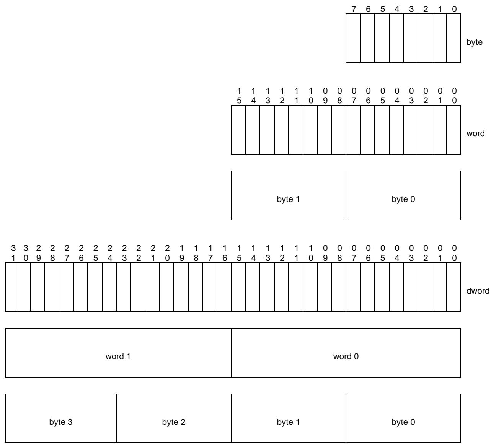

# 1.5 Definitions

# admin label

An admin label is an administratively configured ASCII or UTF-8 string (refer to section 1.4.2) that may be used to help identify specific NVMe entities (i.e., Hosts, NVM subsystems and namespaces). An admin label is capable of describing the entity’s physical location, DNS name or other information. 

# admin label ASCII

An ASCII string. Refer to section 1.4.2 for ASCII string requirements. Refer to section 1.5.1 for admin label usage. 

# admin label UTF-8

A UTF-8 string. Refer to section 1.4.2 for UTF-8 string requirements. Refer to section 1.5.1 for admin label usage. 

# Admin Queue

The Admin Queue is the Submission Queue and Completion Queue with identifier 0. The Admin Submission Queue and corresponding Admin Completion Queue are used to submit administrative commands and receive completions for those administrative commands, respectively. 

The Admin Submission Queue is uniquely associated with the Admin Completion Queue. 

# Administrative controller

A controller that exposes capabilities that allow a host to manage an NVM subsystem. An Administrative controller does not implement I/O Queues, provide access to data or metadata associated with user data on a non-volatile storage medium, or support namespaces attached to the Administrative controller (i.e., there are never any active NSIDs). 

# allocated namespace

A namespace that is associated with an allocated NSID. 

# Allowed Host List

A list of hosts (identified by Host NQN and Host Identifier) present in each Exported NVM Subsystem that are granted access to the Exported NVM Subsystem via an Exported Port. 

# arbitration burst

The maximum number of commands that may be fetched by an arbitration mechanism at one time from a Submission Queue. 

# arbitration mechanism

The method used to determine which Submission Queue is selected next to fetch commands for execution by the controller. Refer to section 3.4.4. 

# association

An exclusive communication relationship between a particular controller and a particular host that encompasses the Admin Queue and all I/O Queues of that controller. 

# audit

The process of accessing media to determine correct operation of a sanitize operation. Refer to section 8.1.24 and to ISO/IEC 27040. 

# authentication commands

Used to refer to Fabrics Authentication Send or Authentication Receive commands. 

# cache

A data storage area used by the NVM subsystem, that is not accessible to a host, and that may contain a subset of user data stored in the non-volatile storage media or may contain user data that is not committed to non-volatile storage media. 

# candidate command

A candidate command is a submitted command which has been transferred into the controller and the controller deems ready for processing. 

# capsule

An NVMe unit of information exchange used in NVMe over Fabrics. A capsule contains a command or response and may optionally contain command/response data and SGLs. 

# Centralized Discovery controller (CDC)

A Discovery controller that reports discovery information registered by Direct Discovery controllers and hosts. 

# Channel

A Channel represents a communication path between the controller and one or more Media Units in an NVM subsystem. 

# command completion

A command is completed when the controller has completed processing the command, has updated status information in the completion queue entry, and has posted the completion queue entry to the associated Completion Queue. 

# command submission

For memory-based transport model (e.g., PCIe) implementations, a command is submitted when a Submission Queue Tail Doorbell write has completed that moves the Submission Queue Tail Pointer value past the Submission Queue slot in which the command was placed. 

For message-based transport model (e.g., NVMe over Fabrics) implementations, a command is submitted when a host adds a capsule to a Submission Queue. 

# controller

A controller is the interface between a host and an NVM subsystem. There are three types of controllers: 

a) I/O controllers; 

b) Discovery controllers; and 

c) Administrative controllers. 

A controller executes commands submitted by a host on a Submission Queue and posts a completion on a Completion Queue. All controllers implement one Admin Submission Queue and one Admin Completion Queue. Depending on the controller type, a controller may also implement one or more I/O Submission Queues and I/O Completion Queues. When PCI Express is used as the transport, then a controller is a PCI Express function. 

# Controller Reset

Host modification of the CC property that clears CC.EN from ‘1’ to ‘0’ (refer to section 3.7.2). 

# Directive

A method of information exchange between a host and either an NVM subsystem or a controller. Information may be transmitted using the Directive Send and Directive Receive commands. A subset of I/O commands may include a Directive Type field and a Directive Specific field to communicate more information that is specific to the associated I/O command. Refer to section 8.1.8. 

# Direct Discovery controller (DDC)

A Discovery controller that is capable of registering discovery information with a Centralized Discovery controller. 

# Discovery controller

A controller that exposes capabilities that allow a host to retrieve a Discovery Log Page. A Discovery controller does not implement I/O Queues or provide access to a non-volatile storage medium. Refer to section 3.1.3.3. 

# discovery information

Information about a host or NVM subsystem that is used for discovery (e.g., NVMe Transport address, NQN, etc.). 

# Discovery Service

An NVM subsystem that supports Discovery controllers only. A Discovery Service shall not support a controller that exposes namespaces. 

# dispersed namespace

A shared namespace that may be concurrently accessed by controllers in two or more NVM subsystems (refer to section 8.1.9). 

# dynamic controller

The controller is allocated on demand with no state (e.g., Feature settings) preserved from prior associations. 

# Domain

A domain is the smallest indivisible unit that shares state (e.g., power state, capacity information). 

# embedded management controller

An embedded management controller is a Management Controller (refer to the NVM Express Management Interface Specification) that provides an external management interface (e.g., Redfish®), typically implemented via commands to the Management Endpoint. 

# emulated controller

An NVM Express controller that is defined in software. An emulated controller may or may not have an underlying physical NVMe controller (e.g., physical PCIe function). 

# Endurance Group

A portion of non-volatile storage in the NVM subsystem whose endurance is managed as a group. Refer to section 3.2.3. 

# Entry Key

A set of discovery information entry fields that allow for the unique identification of each discovery information entry registered with the CDC or DDC. Refer to the Entry Key Type (EKTYPE) field. 

# Exported Namespace

A namespace in an Exported NVM Subsystem. 

# Exported NVM Resources

NVM resources created to enable remote access to physical NVM resources that includes: 

a) Exported NVM Subsystems; 

b) Exported Namespaces; and 

c) Exported Ports. 

# Exported NVM Subsystem

A logical NVM subsystem that exports underlying NVM resources and that: 

a) contains zero or more Exported Namespaces; 

b) contains zero or more controllers; 

c) contains zero or more Exported Ports; and 

d) may contain an Allowed Host List. 

# Exported Port

A port used to export an NVMe subsystem over a specific fabrics transport and represented by an Exported Port ID. 

# Exported Port ID

A port identifier used to specify an Exported Port. 

# fabric (network fabric)

A network topology in which nodes pass data to each other. 

# Fabric Zoning

A technique to specify access control configurations between hosts and NVM subsystems. 

# firmware/boot partition image update command sequence

The sequence of one or more Firmware Image Download commands that download a firmware image or a boot partition image followed by a Firmware Commit command that commits that downloaded image to a firmware slot or a boot partition. 

# firmware slot

A firmware slot is a location in a domain used to store a firmware image. The domain stores from one to seven firmware images. Controllers in the same domain share the same firmware slots. 

# host

An entity that interfaces to an NVM subsystem through one or more controllers and submits commands to Submission Queues and retrieves command completions from Completion Queues. 

# host-accessible memory

Memory that the host is able to access (e.g., host memory, Controller Memory Buffer (CMB), Persistent Memory Region (PMR)). 

# host management agent

A host management agent is a part of the host that provides an external management interface (e.g., Redfish) to external managers, typically via Admin commands to the controller (refer to the NVM Express Management Interface Specification). 

# host memory

Memory that may be read and written by both a host and a controller and that is not exposed by a controller (i.e., Controller Memory Buffer or Persistent Memory Region). Host memory may be implemented inside or outside a host (e.g., a memory region exposed by a device that is neither the host nor controller). 

# idempotent command

A command that produces the same end state in the NVM subsystem and returns the same results if that command is resubmitted one or more times with no intervening commands. Refer to section 9.6.3.1. 

# Identify Controller data structures

All controller data structures that are able to be retrieved via the Identify command: 

• Identify Controller data structure (i.e., CNS 01h); and 

• each of the I/O Command Set specific Identify Controller data structure (i.e., CNS 06h). 

# Identify Namespace data structures

All namespace data structures that are able to be retrieved via the Identify command: 

• Identify Namespace data structures (i.e., CNS 00h, CNS 09h, and CNS 11h); 

• I/O Command Set Independent Identify Namespace data structures (i.e., CNS 08h and CNS 1Fh); and 

I/O Command Set specific Identify Namespace data structures (i.e., CNS 05h, CNS 0Ah, and CNS 1Bh). 

# I/O command

An I/O command is a command submitted to an I/O Submission Queue. 

# I/O Completion Queue

An I/O Completion Queue is a Completion Queue that is used to indicate command completions and is associated with one or more I/O Submission Queues. 

# I/O controller

A controller that implements I/O queues and is intended to be used to access a non-volatile storage medium. 

# I/O Submission Queue

An I/O Submission Queue is a Submission Queue that is used to submit I/O commands for execution by the controller (e.g., Read command and Write command for the NVM Command Set). 

# Media Unit

A Media Unit represents a component of the underlying media in an NVM subsystem. Endurance Groups are composed of Media Units. 

# memory-based controller

A controller that supports a memory-based transport model (e.g., a PCIe implementation). 

# message-based controller

A controller that supports a message-based transport model (e.g., a Fabrics implementation). 

# metadata

Metadata is contextual information related to formatted user data (e.g., a particular LBA of data as defined in the NVM Command Set Specification). The host may include metadata to be stored by the NVM subsystem if storage space is provided by the controller. Refer to the applicable I/O Command Set specification for details. 

# MMC

A Migration Management Controller. Refer to section 8.1.12. 

# MMH

A Migration Management Host. Refer to section 8.1.12. 

# MMHD

A Migration Management Host associated with a Migration Management Controller in a Destination NVM Subsystem. Refer to section 8.1.12. 

# MMHS

A Migration Management Host associated with a Migration Management Controller in a Source NVM Subsystem. Refer to section 8.1.12. 

# namespace

A set of resources that may be directly accessed by a host (e.g., formatted non-volatile storage). 

# namespace ID (NSID)

An identifier used by a controller to provide access to a namespace or the name of the field in the SQE that contains the namespace identifier (refer to Figure 92). Refer to section 3.2.1 for the definitions of valid NSID, invalid NSID, active NSID, inactive NSID, allocated NSID, and unallocated NSID. 

# NVM

NVM is an acronym for non-volatile memory. 

# NVM Set

A portion of NVM from an Endurance Group. Refer to section 3.2.2. 

# NVM subsystem

An NVM subsystem includes one or more domains, one or more controllers, zero or more namespaces, and one or more ports. An NVM subsystem may include a non-volatile storage medium and an interface between the controller(s) in the NVM subsystem and non-volatile storage medium. 

# NVM subsystem port

An NVMe over Fabrics protocol interface between an NVM subsystem and a fabric. An NVM subsystem port is a collection of one or more physical fabric interfaces that together act as a single interface. 

# NVMe over Fabrics

An implementation of the NVM Express interface that complies with either the message-only transport model or the message/memory transport model (refer to Figure 4 and section 2.2). 

# NVMe Transport

A protocol layer that provides reliable delivery of data, commands, and responses between a host and an NVM subsystem. The NVMe Transport layer is layered on top of the fabric. It is independent of the fabric physical interconnect and low-level fabric protocol layers. 

# NVMe Transport binding specification

A specification of reliable delivery of data, commands, and responses between a host and an NVM subsystem for an NVMe Transport. The binding may exclude or restrict functionality based on the NVMe Transport’s capabilities. 

# participating NVM subsystem

An NVM subsystem that participates in (i.e., contains controllers that provide access to) a dispersed namespace. 

# physical fabric interface (physical ports)

A physical connection between an NVM subsystem and a fabric. 

# Placement Handle

A namespace scoped handle that maps to an Endurance Group scoped Reclaim Unit Handle which references a Reclaim Unit in each Reclaim Group. 

# Placement Identifier

A data structure that specifies a Reclaim Group Identifier and a Placement Handle that references a Reclaim Unit. Refer to Figure 282 and Figure 283. 

# Port ID

An identifier that is associated with an NVM subsystem port. Refer to section 2.2.2. 

# Ports List

A list of ports that may be used to export an NVM subsystem. Entries in the Ports List are in the format specified by Underlying Fabrics Transport Entry data structure (refer to Figure 336). 

# Power Loss Acknowledge (PLA)

The transport-specific variable that is used by the controller to inform the host of the controller’s current Power Loss Signaling processing (refer to section 8.2.5). 

# Power Loss Notification (PLN)

The transport-specific variable that is used to inform the controller that a main power loss event is expected to occur (refer to section 8.2.5). 

# primary controller

An NVM Express controller that supports the Virtualization Management command. An NVM subsystem may contain multiple primary controllers. Secondary controller(s) in an NVM subsystem depend on a primary controller for dynamic resource management (refer to section 8.2.6). 

A PCI Express SR-IOV Physical Function that supports the NVM Express interface and the Virtualization Enhancements capability is an example of a primary controller (refer to section 8.2.6.4). 

# private namespace

A namespace that is only able to be attached to one controller at a time. Refer to the Namespace Multipath I/O and Namespace Sharing Capabilities (NMIC) field in Figure 319. 

# property

The generalization of memory mapped controller registers defined for NVMe over PCIe. Properties are used to configure low level controller attributes and obtain low level controller status. Refer to section 3.1.4. 

# Reclaim Group (RG)

An entity that contains one or more Reclaim Units. Refer to section 3.2.4. 

# Reclaim Unit (RU)

A logical representation of non-volatile storage within a Reclaim Group that is able to be physically erased by the controller without disturbing any other Reclaim Units. Refer to section 3.2.4. 

# Reclaim Unit Handle (RUH)

A controller resource that references a Reclaim Unit in each Reclaim Group. Refer to section 3.2.4. 

# rotational media

Media that stores data on rotating platters (refer to section 8.1.23). 

# Runtime D3 (Power Removed)

In Runtime D3 (RTD3) main power is removed from the controller. Auxiliary power may or may not be provided. For PCI Express, RTD3 is the D3cold power state (refer to section 8.1.17.4). 

# sanitize operation

Process by which all user data in the NVM subsystem is altered such that recovery of the previous user data from any cache or the non-volatile storage media is infeasible for a given level of effort (refer to IEEE 2883™-2022). 

# sanitization target

The target of a sanitize operation (i.e., an NVM subsystem). 

# secondary controller

An NVM Express controller that depends on a primary controller in an NVM subsystem for management of some controller resources (refer to section 8.2.6). 

A PCI Express SR-IOV Virtual Function that supports the NVM Express interface and receives resources from a primary controller is an example of a secondary controller (refer to section 8.2.6.4). 

# shared namespace

A namespace that may be attached to two or more controllers in an NVM subsystem concurrently. Refer to the Namespace Multi-path I/O and Namespace Sharing Capabilities (NMIC) field in Figure 319. 

# specified namespace

The namespace that is associated with the value specified by the Namespace Identifier (NSID) field in a command as defined by the Common Command Format (refer to Figure 92). 

# spindown

The process of changing a spindle from an operational power state to a non-operational power state, for an Endurance Group that stores data on rotational media (refer to section 8.1.23). 

# spinup

The process of changing a spindle from a non-operational power state to an operational power state, for an Endurance Group associated with rotational media (refer to section 8.1.23). 

# static controller

The controller is pre-existing with a specific Controller ID and its state (e.g., Feature settings) is preserved from prior associations. 

# Underlying Namespace

A namespace (defined in section 1.5.62) accessible through physical or virtual functions in an Underlying NVM Subsystem that may be used to associate with an Exported NVM Subsystem. Underlying Namespaces are identified by the Underlying Namespace Entry data structure (refer to Figure 334). 

# Underlying Namespace List

A list of namespaces (refer to section 5.1.13.4.1) in all underlying NVM subsystems that may be used to create an Exported Namespace. 

# Underlying NVM Subsystem

Defined as NVM subsystem. 

# Underlying Port

A port through which an NVMe subsystem is attached to a transport (e.g., Ethernet, InfiniBand, Fibre Channel) (refer to section 1.5.72). 

# user data

Data stored in a namespace that is composed of data that the host may store and later retrieve including metadata if supported. 

# 1.6 I/O Command Set specific definitions used in this specification

The following terms used in this specification are defined in each I/O Command Set specification. 

# Endurance Group Host Read Command

An I/O Command Set specific command that results in the controller reading user data, but may or may not return the data to the host. 

# Format Index

A value used to index into the I/O Command Set Specific Format table (i.e., the User Data Format number). 

# SMART Data Units Read Command

An I/O Command Set specific command that results in the controller reading user data, but may or may not return the data to the host. 

# SMART Host Read Command

An I/O Command Set specific command that results in the controller reading user data, but may or may not return the data to the host. 

# User Data Format

An I/O Command Set specific format that describes the layout of the data on the NVM media. 

# User Data Out Command

An I/O Command Set specific command that results in the controller writing user data, but may or may not transfer user data from the host to the controller. 

# 1.7 NVM Command Set specific definitions used in this specification

The following terms used in this specification are defined in the NVM Command Set Specification. These terms are used throughout the document as examples for a specific I/O Command Set. 

# logical block

The smallest addressable data unit for Read and Write commands. 

# logical block address (LBA)

The address of a logical block, referred to commonly as LBA. 

# 1.8 References

CNSA 1.0, “USE OF PUBLIC STANDARDS FOR SECURE INFORMATION SHARING”, CNSSP 15 ANNEX B “NSA-APPROVED COMMERCIAL NATIONAL SECURITY ALGORITHM (CNSA) SUITE”, 20 October 2016. Available from https://www.cnss.gov/CNSS/issuances/Policies.cfm. 

IEEE Std 2883™-2022, IEEE Standard for Sanitizing Storage. Available from https://standards.ieee.org. 

INCITS 502-2019, Information Technology – SCSI Primary Commands - 5 (SPC-5). Available from https://webstore.ansi.org. 

INCITS 556-2020, Information Technology – Non-Volatile Memory Express - 2 (FC-NVMe-2). Available from https://webstore.ansi.org. 

ISO 8601, Data elements and interchange formats – Information interchange – Representations of dates and times. Available from https://www.iso.org. 

ISO/IEC 27040:2024 Information technology – Security techniques – Storage security. Available from https://www.iso.org. 

JEDEC JESD218B-02: Solid State Drive (SSD) Requirements and Endurance Test Method standard. Available from https://www.jedec.org. 

NVM Express Boot Specification, Revision 1.1. Available from https://www.nvmexpress.org. 

NVM Express Management Interface Specification, Revision 2.0. Available from https://www.nvmexpress.org. 

NVM Express NVM Command Set Specification, Revision 1.1. Available from https://www.nvmexpress.org. 

NVM Express Zoned Namespace Command Set Specification, Revision 1.2. Available from https://www.nvmexpress.org. 

NVM Express Key Value Command Set Specification, Revision 1.1. Available from https://www.nvmexpress.org. 

NVM Express NVMe over PCIe Transport Specification, Revision 1.1. Available from https://www.nvmexpress.org. 

NVM Express RDMA Transport Specification, Revision 1.1. Available from https://www.nvmexpress.org. 

NVM Express TCP Transport Specification, Revision 1.1. Available from https://www.nvmexpress.org. 

PCI-SIG PCI Express® Base Specification, Revision 6.2. Available from https://www.pcisig.com. 

RFC 1952, P. Deutsch, “GZIP file format specification version 4.3”, May 1996. Available from https://www.rfc-editor.org/info/rfc1952. 

RFC 1994, W. Simpson, “PPP Challenge Handshake Authentication Protocol (CHAP)”, August 1996. Available from https://www.rfc-editor.org/info/rfc1994. 

RFC 2104, H. Krawczyk, M. Bellare, R. Canetti, “HMAC: Keyed-Hashing for Message Authentication”, February 1997. Available from https://www.rfc-editor.org/info/rfc2104. 

RFC 2631, E. Rescorla, “Diffie-Hellman Key Agreement Method”, June 1999. Available from https://www.rfc-editor.org/info/rfc2631. 

RFC 3629, F. Yergeau, “UTF-8, a transformation format of ISO 10646”, November 2003. Available from https://www.rfc-editor.org/info/rfc3629. 

RFC 3986, T. Berners-Lee, R. Fielding, L. Masinter, “Uniform Resource Identifier (URI): Generic Syntax”, January 2005. Available from https://www.rfc-editor.org/info/rfc3986. 

RFC 4086, D. Eastlake 3rd, J. Schiller, S. Crocker, “Randomness Requirements for Security”, June 2005. Available from https://www.rfc-editor.org/info/rfc4086. 

RFC 4088, D. Black, K. McCloghrie, J. Schoenwaelder, “Uniform Resource Identifier (URI) Scheme for the Simple Network Management Protocol (SNMP)”, June 2005. Available from https://www.rfceditor.org/info/rfc4088. 

RFC 4301, S. Kent, K. Seo, “Security Architecture for the Internet Protocol”, December 2005. Available from https://www.rfc-editor.org/info/rfc4301. 

RFC 4648, S. Josefsson, “The Base16, Base32, and Base64 Data Encodings”, October 2006. Available from https://www.rfc-editor.org/info/rfc4648. 

RFC 5869, H. Krawczyk, P. Eronen, “HMAC-based Extract-and-Expand Key Derivation Function (HKDF)”, May 2010. Available from https://www.rfc-editor.org/info/rfc5869. 

RFC 6234, D. Eastlake 3rd, and T. Hansen, "US Secure Hash Algorithms (SHA and SHA-based HMAC and HKDF)", May 2011. Available from https://www.rfc-editor.org/info/rfc6234. 

RFC 6520, R. Seggelmann, M. Tuexen, M. Williams, "Transport Layer Security (TLS) and Datagram Transport Layer Security (DTLS) Heartbeat Extension", February 2012. Available from https://www.rfceditor.org/info/rfc6520. 

RFC 7296, C. Kaufman, P. Hoffman, Y. Nir, P. Eronen, T. Kivinen, “Internet Key Exchange Protocol Version 2 (IKEv2)”, October 2014. Available from https://www.rfc-editor.org/info/rfc7296. 

RFC 7919, D. Gillmor, “Negotiated Finite Field Diffie-Hellman Ephemeral Parameters for Transport Layer Security (TLS)”, August 2016. Available from https://www.rfc-editor.org/info/rfc7919. 

RFC 8446, E. Rescorla, “The Transport Layer Security (TLS) Protocol Version 1.3”, August 2018. Available from https://www.rfc-editor.org/info/rfc8446. 

RFC 9562, K. Davis, B. Peabody, and P. Leach, “Universally Unique Identifiers, May 2024”. Available from https://www.rfc-editor.org/info/rfc9562. 

UEFI Specification Version 2.10, August 2022. Available from https://uefi.org. 

Advanced Configuration and Power Interface (ACPI) Specification, Version 6.5, August 2022. Available from https://www.uefi.org. 

TCG Storage Architecture Core Specification, Version 2.01 Revision 1.00. Available from https://www.trustedcomputinggroup.org. 

TCG Storage Interface Interactions Specification (SIIS), Version 1.11 Revision 1.18. Available from https://www.trustedcomputinggroup.org. 

TCG Storage Security Subsystem Class: Key Per I/O Version 1.00 Revision 1.41. Available from https://trustedcomputinggroup.org. 

# 1.9 References Under Development

None. 

# 2 Theory of Operation

The NVM Express scalable interface is designed to address the needs of storage systems that utilize PCI Express based solid state drives or fabric connected devices. The interface provides optimized command submission and completion paths. It includes support for parallel operation by supporting up to 65,535 I/O Queues with up to 65,535 outstanding commands per I/O Queue. Additionally, support has been added for many Enterprise capabilities like end-to-end data protection (compatible with SCSI Protection Information, commonly known as T10 DIF, and SNIA DIX standards), enhanced error reporting, and virtualization. 

The interface has the following key attributes: 

• Does not require uncacheable / MMIO register reads in the command submission or completion path; 

A maximum of one MMIO register write or one 64B message is necessary in the command submission path; 

Support for up to 65,535 I/O Queues, with each I/O Queue supporting up to 65,535 outstanding commands; 

Priority associated with each I/O Queue with well-defined arbitration mechanism; 

All information to complete a 4 KiB read request is included in the 64B command itself, ensuring efficient small I/O operation; 

Efficient and streamlined command set; 

• Support for MSI/MSI-X and interrupt aggregation; 

• Support for multiple namespaces; 

Efficient support for I/O virtualization architectures like SR-IOV; 

• Robust error reporting and management capabilities; and 

• Support for multi-path I/O and namespace sharing. 

This specification defines a streamlined set of properties that are used to configure low level controller attributes and obtain low level controller status. These properties have a transport specific mechanism for defining access (e.g., memory-based transports use registers, whereas message-based transports use the Property Get and Property Set commands). The following are examples of functionality defined in properties: 

• Indication of controller capabilities; 

• Status for controller failures (command status is provided in a CQE); 

• Admin Queue configuration (I/O Queue configuration processed via Admin commands); and 

• Doorbell registers for a scalable number of Submission and Completion Queues. 

There are two defined models for communication between the host and the NVM subsystem, a memorybased transport model and a message-based transport model. All NVM subsystems require the underlying NVMe Transport to provide reliable NVMe command and data delivery. An NVMe Transport is an abstract protocol layer independent of any physical interconnect properties. A taxonomy of NVMe Transports, along with examples, is shown in Figure 4. An NVMe Transport may expose a memory-based transport model or a message-based transport model. The message-based transport model has two subtypes: the messageonly transport model and the message/memory transport model. 

A memory-based transport model is one in which commands, responses, and data are transferred between a host and an NVM subsystem by performing explicit memory read and write operations (e.g., over PCIe). 

A message-based transport model is one in which messages containing command capsules and response capsules are sent between a host and an NVM subsystem (e.g., over a fabric). The two subtypes of message-based transport models are differentiated by how data is sent between a host and an NVM subsystem. In the message-only transport model data is only sent between a host and an NVM subsystem using capsules or messages. The message/memory transport model uses a combination of messages and explicit memory read and write operations to transfer command capsules, response capsules and data between a host and an NVM subsystem. Data may optionally be included in command capsules and response capsules. Both the message-only transport model and the message/memory transport model are 

referenced as message-based transport models throughout this specification when the description is applicable to both subtypes. 

An NVM subsystem is made up of a single domain or multiple domains as described in section 3.2.5. An NVM subsystem may optionally include a non-volatile storage medium, and an interface between the controller(s) of the NVM subsystem and the non-volatile storage medium. Controllers expose this nonvolatile storage medium to hosts through namespaces. An NVM subsystem is not required to have the same namespaces attached to all controllers. An NVM subsystem that supports a Discovery controller does not support any other controller type. A Discovery Service is an NVM subsystem that supports Discovery controllers only (refer to section 3.1). 

Figure 4: Taxonomy of Transport Models

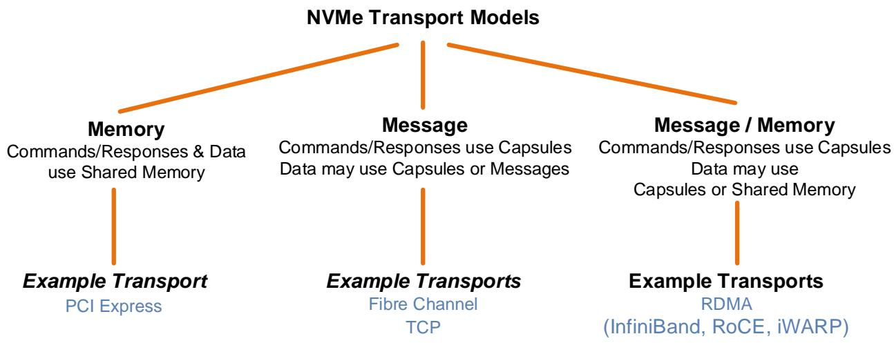

The capabilities and settings that apply to an NVM Express controller are indicated in the Controller Capabilities (CAP) property and the Identify Controller data structure (refer to Figure 312). 

A namespace is a set of resources (e.g., formatted non-volatile storage) that may be accessed by a host. A namespace has an associated namespace identifier that a host uses to access that namespace. The set of resources may consist of non-volatile storage and/or other resources. 

Associated with each namespace is an I/O Command Set that operates on that namespace. An NVM Express controller may support multiple namespaces. Namespaces may be created and deleted using the Namespace Management command and Capacity Management command. The Identify Namespace data structures (refer to section 1.5.49) indicate capabilities and settings that are specific to a particular namespace. 

The NVM Express interface is based on a paired Submission and Completion Queue mechanism. Commands are placed by host software into a Submission Queue. Completions are placed into the associated Completion Queue by the controller. 

There are three types of commands that are defined in NVM Express: Admin commands, I/O commands, and Fabrics commands. Figure 5 shows these different command types. 

Figure 5: Types of NVMe Command Sets

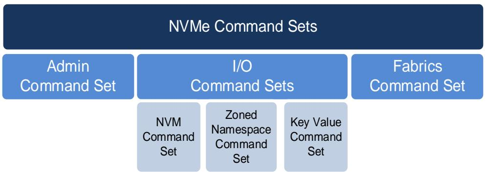

An Admin Submission Queue and associated Completion Queue exist for the purpose of controller management and control (e.g., creation and deletion of I/O Submission and Completion Queues, aborting commands, etc.). Only commands that are part of the Admin Command Set or the Fabrics Command Set may be submitted to the Admin Submission Queue. 

An I/O Command Set is used with an I/O queue pair. This specification defines common I/O commands. I/O Command Sets are defined in I/O Command Set specifications. The example I/O Command Sets shown in Figure 5 are the NVM Command Set, the Key Value Command Set, and the Zoned Namespace Command Set. Other I/O Command Sets include the Computational Programs Command Set and the SLM Command Set. 

The Fabrics Command Set is NVMe over Fabrics specific. Fabrics Command Set commands are used for operations specific to NVMe over Fabrics including establishing a connection, NVMe in-band authentication, and to get or set a property. All Fabrics commands may be submitted on the Admin Submission Queue and some Fabrics commands may also be submitted on an I/O Submission Queue. Unlike Admin and I/O commands, Fabrics commands are processed by a controller regardless of whether the controller is enabled (i.e., regardless of the state of CC.EN). 

# 2.1 Memory-Based Transport Model (PCIe)

In the memory-based model, Submission and Completion Queues are allocated in memory. 

Host software creates queues, up to the maximum supported by the controller. Typically, the number of command queues created is based on the system configuration and anticipated workload. For example, on a four core processor based system, there may be a queue pair per core to avoid locking and ensure data structures are created in the appropriate processor core’s cache. Figure 6 provides a graphical representation of the queue pair mechanism, showing a 1:1 mapping between Submission Queues and Completion Queues. Figure 7 shows an example where multiple I/O Submission Queues utilize the same I/O Completion Queue on Core B. Figure 6 and Figure 7 show that there is always a 1:1 mapping between the Admin Submission Queue and Admin Completion Queue. 

Figure 6: Queue Pair Example, 1:1 Mapping

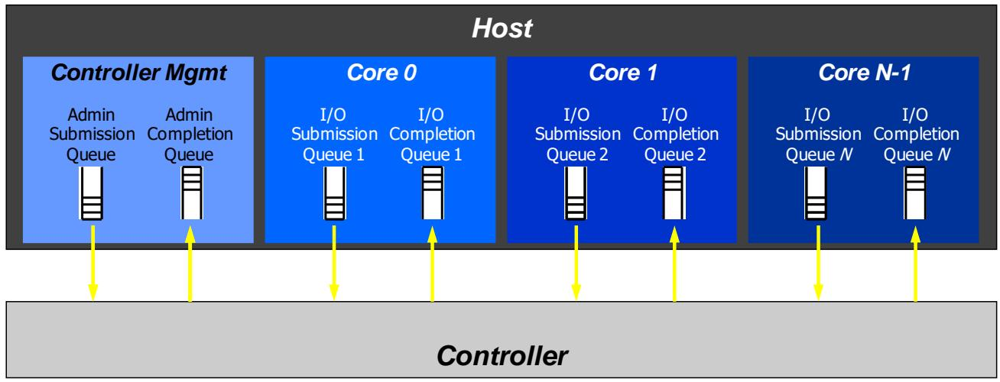

Figure 7: Queue Pair Example, n:1 Mapping

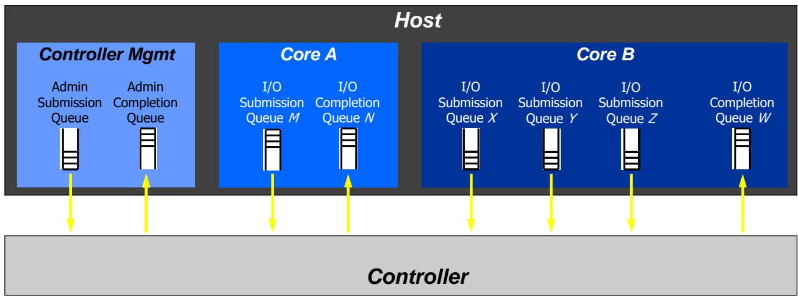

A Submission Queue (SQ) is a circular buffer with a fixed slot size that the host software uses to submit commands for execution by the controller. The host software updates the appropriate SQ Tail doorbell register when there are one to n new commands to execute. The previous SQ Tail value is overwritten in the controller when there is a new doorbell register write. The controller fetches SQ entries in order from the Submission Queue and may execute those commands in any order. 

Each submission queue entry is a command. Commands are 64 bytes in size. The physical memory locations in memory to use for data transfers are specified using Physical Region Page (PRP) entries or Scatter Gather Lists (SGL). Each command may include two PRP entries or one Scatter Gather List segment. If more than two PRP entries are necessary to describe the data buffer, then a pointer to a PRP List that describes a list of PRP entries is provided. If more than one SGL segment is necessary to describe the data buffer, then the SGL segment provides a pointer to the next SGL segment. 

A Completion Queue (CQ) is a circular buffer with a fixed slot size used to post status for completed commands. A completed command is uniquely identified by a combination of the associated SQ identifier and command identifier that is assigned by host software. In the memory-based transport model multiple Submission Queues may be associated with a single Completion Queue. A configuration with a single Completion Queue may be used where a single worker thread processes all command completions via one Completion Queue even when those commands originated from multiple Submission Queues. The CQ Head pointer is updated by host software after processing completion queue entries indicating the last free 

CQ slot. A Phase Tag (P) bit is defined in the completion queue entry to indicate whether an entry has been newly posted without the host consulting a register (refer to section 4.2.4). The Phase Tag bit enables the host to determine whether entries are new or not. 

# 2.2 Message-Based Transport Model (Fabrics)

The message-based transport model used for NVMe over Fabrics has the following differences from the memory-based transport model: 

There is a one-to-one mapping between I/O Submission Queues and I/O Completion Queues. NVMe over Fabrics does not support multiple I/O Submission Queues being mapped to a single I/O Completion Queue; 

NVMe over Fabrics does not define an interrupt mechanism that allows a controller to generate a host interrupt. It is the responsibility of the host fabric interface (e.g., Host Bus Adapter) to generate host interrupts; 

NVMe over Fabrics uses different mechanisms for I/O Submission Queue and I/O Completion Queue creation and deletion (refer to section 3.5); 

NVMe over Fabrics does not support transferring metadata from a separate buffer (e.g., does not support the Metadata Pointer field, refer to Figure 92); 

NVMe over Fabrics does not support PRPs but requires use of SGLs for Admin, I/O, and Fabrics commands. This differs from the memory-based transport model where SGLs are not supported for Admin commands and are optional for I/O commands; 

NVMe over Fabrics does not support Completion Queue flow control (refer to section 3.3.1.2.1). This requires that the host ensures there are available Completion Queue slots before submitting new commands; and 

NVMe over Fabrics allows Submission Queue flow control to be disabled if the host and controller agree to disable Submission Queue flow control. If Submission Queue flow control is disabled, the host is required to ensure that there are available Submission Queue slots before submitting new commands. 

# Fabrics and Transports

NVMe over Fabrics utilizes the protocol layering shown in Figure 8. This specification defines core aspects of the architecture that are independent of the NVMe Transport. An NVMe Transport binding specification is used to describe any NVMe Transport specific specialization as well as how the services required by the NVMe interface are mapped onto the corresponding NVMe Transport. The native fabric communication services and other functionality used by the NVMe interface and NVMe Transports (e.g., the Fabric Protocol and Fabric Physical layers in Figure 8) are outside the scope of the NVMe family of specifications. 

Figure 8: NVMe over Fabrics Layering

# NVM Subsystem Ports for Fabrics

An NVM subsystem presents a collection of one to (64Ki - 16) controllers which are used to access namespaces. The controllers may be associated with hosts through one to 64Ki NVM subsystem ports. 

An NVM subsystem port is a protocol interface between an NVM subsystem and a fabric. An NVM subsystem port is a collection of one or more physical fabric interfaces that together act as a single protocol interface. When link aggregation (e.g., Ethernet) is used, the physical ports for the group of aggregated links constitute a single NVM subsystem port. 

An NVM subsystem contains one or more NVM subsystem ports. 

Each NVM subsystem port has a 16-bit port identifier (Port ID). An NVM subsystem port is identified by the NVM Subsystem NVMe Qualified Name (NQN) and Port ID. The NVM subsystem ports of an NVM subsystem may support different NVMe Transports. An NVM subsystem port may support multiple NVMe Transports if more than one NVMe Transport binding specifications exist for the underlying fabric (e.g., an NVM subsystem port identified by a Port ID may support both iWARP and RoCE). An NVM subsystem implementation may bind specific controllers to specific NVM subsystem ports or allow the flexible allocation of controllers between NVM subsystem ports, however, once connected, each specific controller is bound to a single NVM subsystem port. 

A controller is associated with exactly one host at a time. NVMe over Fabrics allows multiple hosts to connect to different controllers in the NVM subsystem through the same NVM subsystem port. All other aspects of NVMe over Fabrics multi-path I/O and namespace sharing (refer to section 2.4.1) are equivalent to that of the memory-based transport model. 

# Discovery Service

NVMe over Fabrics defines a discovery mechanism that a host uses to determine the NVM subsystems that expose namespaces that the host may access. The Discovery Service provides a host with the following capabilities: 

• The ability to discover a list of NVM subsystems with namespaces that are accessible to the host; 

• The ability to discover multiple paths to an NVM subsystem; 

• The ability to discover controllers that are statically configured; 

• The optional ability to establish explicit persistent connections to the Discovery controller; and 

• The optional ability to receive Asynchronous Event Notifications from the Discovery controller. 

A Discovery Service is an NVM subsystem that supports only Discovery controllers (refer to section 3.1.3.3), and shall not support any other controller type. 

The method that a host uses to obtain the information necessary to connect to the initial Discovery Service is implementation specific. This information may be determined using a host configuration file, a hypervisor or OS property, or some other mechanism. 

# Capsules and Data Transfer

A capsule is an NVMe unit of information exchange used in NVMe over Fabrics. A capsule may be classified as a command capsule or a response capsule. A command capsule contains a command (formatted as a submission queue entry) and may optionally include SGLs or data. A response capsule contains a response (formatted as a completion queue entry) and may optionally include data. Data refers to any data transferred at an NVMe layer between a host and an NVM subsystem (e.g., logical block data or a data structure associated with a command). A capsule is independent of any underlying NVMe Transport unit (e.g., packet, message, or frame and associated headers and footers) and may consist of multiple such units. 

Command capsules are transferred from a host to an NVM subsystem. The SQE contains an Admin command, an I/O command, or a Fabrics command. The minimum size of a command capsule is NVMe Transport binding specific, but shall be at least 64B in size. The maximum size of a command capsule is NVMe Transport binding specific. The format of a command capsule is shown in Figure 9. 

Figure 9: Command Capsule Format

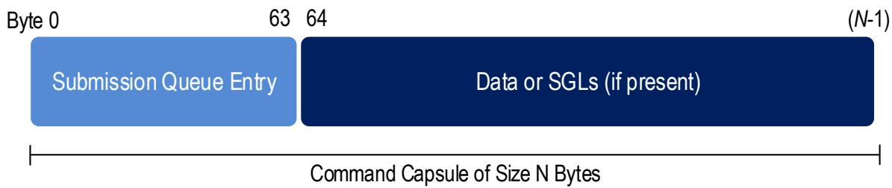

Response capsules are transferred from an NVM subsystem to a host. The CQE is associated with a previously issued Admin command, I/O command, or Fabrics command. The size of a response capsule is NVMe Transport binding specific, but shall be at least 16B in size. The maximum size of a response capsule is NVMe Transport binding specific. The format of a response capsule is shown in Figure 10. 

Figure 10: Response Capsule Format

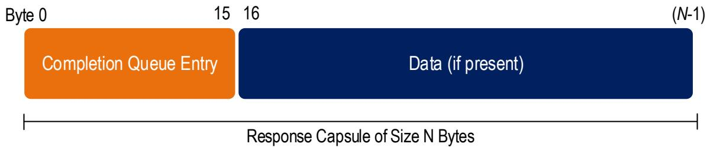

NVMe Transports using the message-only transport model and message/memory transport model require all SGLs sent from the host to the controller be transferred within the command. NVMe Transports may optionally support the transfer of a portion or all data within the command and response capsules. 

NVMe over Fabrics requires SGLs for all commands (Fabrics, Admin, and I/O). An SGL may specify the placement of data within a capsule or the information required to transfer data using an NVMe Transport specific data transfer mechanism (e.g., via memory transfers as in RDMA). Each NVMe Transport binding specification defines the SGLs used by a particular NVMe Transport and any capsule SGL and data placement restrictions. 

# Authentication

NVMe over Fabrics supports both fabric secure channel that includes authentication (refer to section 8.3.4.1) and NVMe in-band authentication. An NVM subsystem may require a host to use fabric secure channel, NVMe in-band authentication, or both. The Discovery Service indicates if fabric secure channel shall be used for an NVM subsystem. The Connect response indicates if NVMe in-band authentication shall be used with that controller. 

A controller associated with an NVM subsystem that requires a fabric secure channel shall not accept any commands (i.e., Fabrics commands, Admin commands, or I/O commands) on an NVMe Transport until a secure channel is established. Following a Connect command, a controller that requires NVMe in-band authentication shall not accept any commands on the queue created by that Connect command other than authentication commands until NVMe in-band authentication has completed. Refer to section 8.3.4. 

# 2.3 NVM Storage Model

# Storage Entities

The NVM storage model includes the following entities: 

• NVM subsystems (refer to 1.5.66); 

• Domains (refer to section 3.2.5); 

• Endurance Groups (refer to section 3.2.3); 

• Reclaim Groups and Reclaim Units (refer to section 3.2.4); 

• NVM Sets (refer to section 3.2.2); and 

Namespaces (refer to section 3.2.1). 

As illustrated below, 

each domain is contained in a single NVM subsystem; 

• each Endurance Group is contained in a single domain and may contain either: 

o one or more NVM Sets; or 

o one or more Reclaim Groups; 

each NVM Set is contained in a single Endurance Group and each namespace is contained in a single NVM Set. Each Media Unit is contained in a single Endurance Group; and 

each Reclaim Group is contained in a single Endurance Group, each Reclaim Unit is contained in a Reclaim Group, and each namespace is contained in an Endurance Group within one or more Reclaim Units of the Reclaim Groups in that Endurance Group. 

Each Endurance Group is composed of storage media, which are termed Media Units (refer to section 8.1.4.2) or Reclaim Units (refer to section 3.2.4). Reclaim Unit Handles reference a Reclaim Unit in each Reclaim group for writing user data. For clarity, Media Units, Reclaim Unit Handles, and Reclaim Units are not shown in the examples in this section that follow. 

Figure 11 shows the hierarchical relationships of these entities within a simple NVM subsystem, which has: 

one domain; 

one Endurance Group; 

one NVM Set; and 

• one namespace. 

Figure 11: Simple NVM Storage Hierarchy with NVM Sets

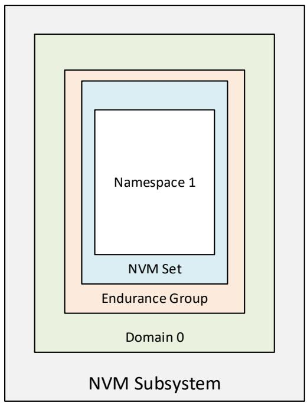

Figure 12 shows the hierarchical relationships in a simple NVM subsystem, which has: 

one domain; 

one Endurance Group; 

• one Reclaim Group; and 

one namespace with user data written to the single Reclaim Group. 

The placement (i.e., which Reclaim Group) of user data for a namespace is directed by each host write command to that namespace (refer to section 8.1.10). 

Figure 12: Simple NVM Storage Hierarchy with One Reclaim Group

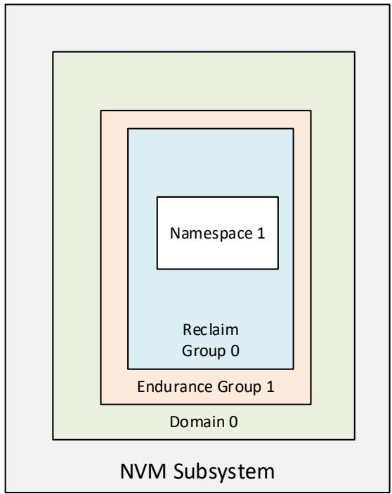

Figure 13 shows the hierarchical relationships in a simple NVM subsystem, which has: 

one domain; 

one Endurance Group; 

four Reclaim Groups; and 

one namespace with user data written to each Reclaim Group. 

The placement (i.e., which Reclaim Group) of user data for a namespace is directed by each host write command to that namespace (refer to section 8.1.10). 

Figure 13: Simple NVM Storage Hierarchy with Multiple Reclaim Groups

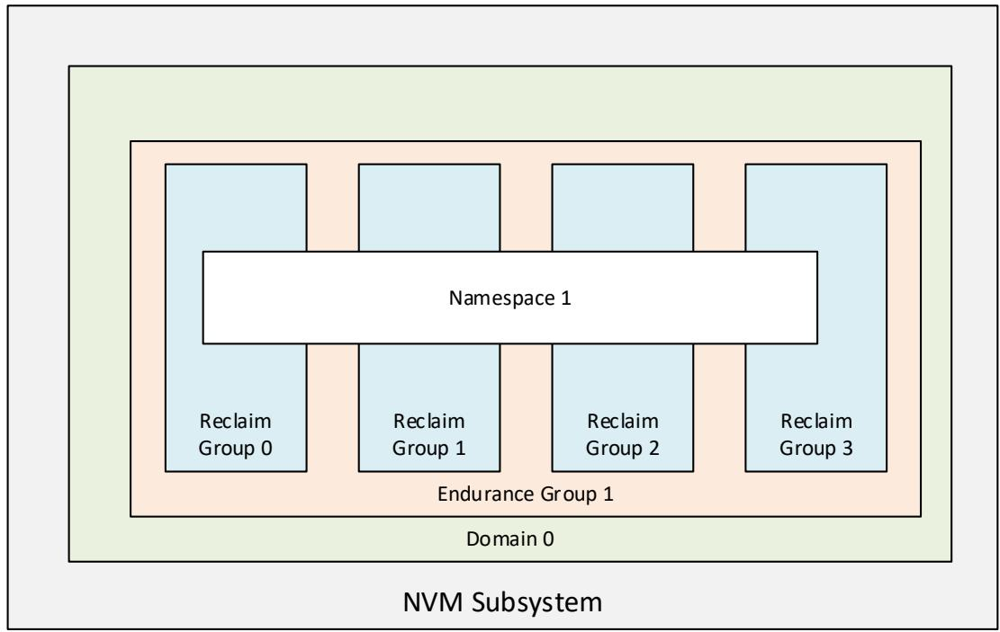

Figure 14 shows the relationships of these entities in a complex NVM subsystem, which has:

multiple domains; 

• multiple Endurance Groups per domain; 

multiple NVM Sets per Endurance Group; and 

multiple namespaces per NVM Set. 

Figure 14: Complex NVM Storage Hierarchy with NVM Sets

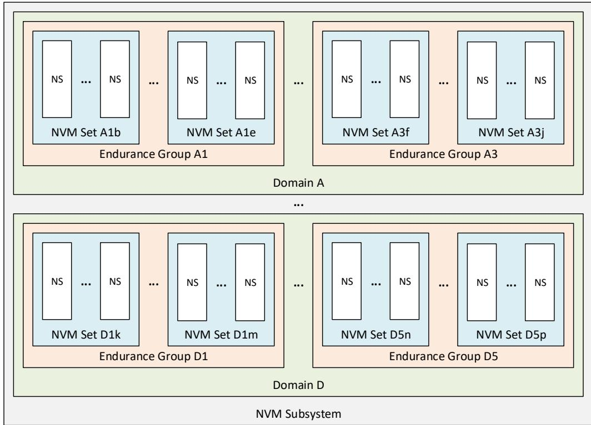

Entity naming key (Abc): 

A: Domain (capital letter) 

b: Endurance Group (digit) 

c: NVM Set (lower case letter) 

Figure 15 shows the relationships in a complex NVM subsystem, which has: 

multiple domains; 

• multiple Endurance Groups per domain; 

multiple Reclaim Groups per Endurance Group; and 

multiple namespaces per Endurance Group. 

The placement (i.e., which Reclaim Group) of user data for a namespace is directed by each host write command to that namespace (refer to section 8.1.10). 

Figure 15: Complex NVM Storage Hierarchy with Multiple Reclaim Groups

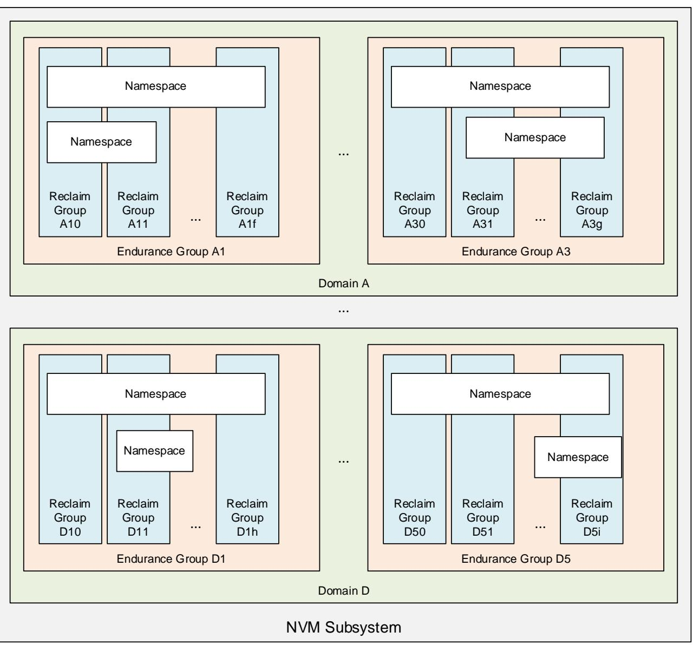

Entity naming key (Abc): 

A: Domain (capital letter) 

b: Endurance Group (digit) 

c: Reclaim Group (digit or lower-case letter for maximum number) 

The support of Endurance Groups, Reclaim Groups within an Endurance Group, or NVM Sets within an Endurance Group is optional, but the storage model supports these concepts. An NVM subsystem may be shipped by the vendor with storage entities configured, or an NVM subsystem may be configured or reconfigured by the customer. Typical changes to the configuration are creation and deletion of namespaces. 

An NVM subsystem that does not support multiple NVM Sets does not require reporting of NVM Sets. An NVM subsystem that does not support multiple Endurance Groups does not require reporting of Endurance Groups. 

# I/O Command Sets

I/O commands perform operations on namespaces, and each namespace is associated with exactly one I/O command set. For example, commands in the NVM Command Set access data represented in a namespace as logical blocks, and commands in the Key Value Command Set access data represented in a namespace as key-value pairs. 

The association of a namespace to an I/O command set is specified when the namespace is created and is fixed for the lifetime of that namespace. 

A controller may support one or more I/O command sets. Namespaces that are associated with the I/O command sets that are supported and enabled on a controller may be attached to that controller. A host issues commands to a namespace and those commands are interpreted based on the I/O command set associated with that namespace. 

# NVM Subsystem Examples

Figure 16 illustrates a simple NVM subsystem that has a single instance of each storage entity. 

Figure 16: Single-Namespace NVM Subsystem

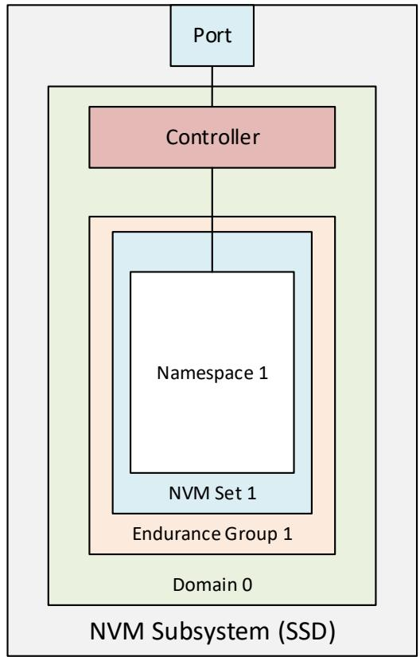

• The NVM subsystem consists of a single port and a single domain. 

• The domain contains a controller and storage media. 

• All of the storage media are contained in one Endurance Group. 

• All of the storage media in that Endurance Group are organized into one NVM Set. 

• That NVM Set contains a single namespace. 

Figure 17 shows an NVM subsystem with two namespaces.

Figure 17: Two-Namespace NVM Subsystem

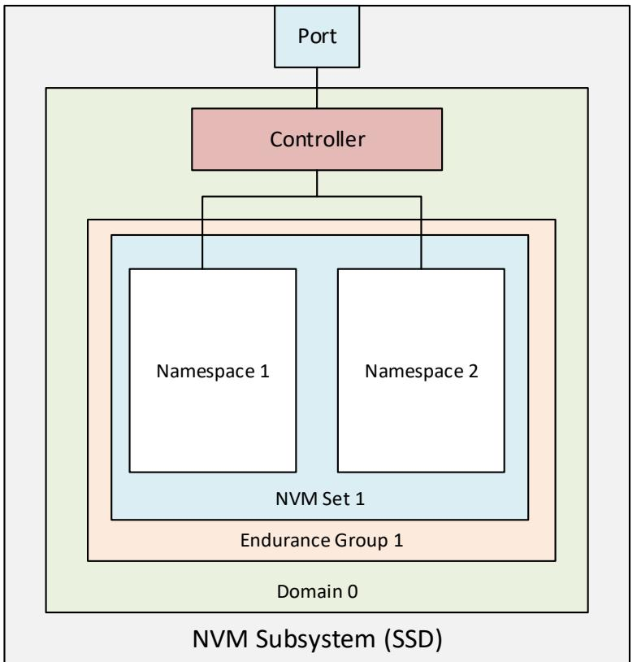

An NVM subsystem may have multiple domains, multiple namespaces, multiple controllers, and multiple ports, as shown in Figure 18. 

Figure 18: Complex NVM Subsystem

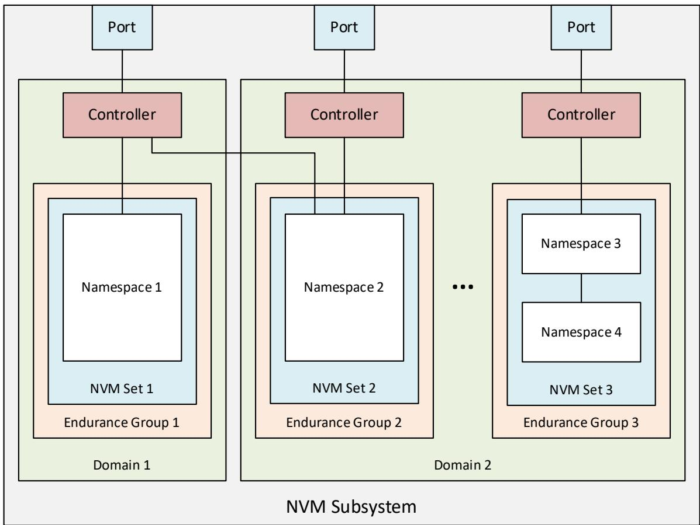

# 2.4 Extended Capabilities Theory

# Multi-Path I/O and Namespace Sharing

This section provides an overview of multi-path I/O and namespace sharing. Multi-path I/O refers to two or more completely independent paths between a single host and a namespace while namespace sharing refers to the ability for two or more hosts to access a common shared namespace using different NVM Express controllers. Both multi-path I/O and namespace sharing require that the NVM subsystem contain two or more controllers. NVM subsystems that support Multi-Path I/O and Namespace Sharing may also support asymmetric controller behavior (refer to section 2.4.2). Concurrent access to a shared namespace by two or more hosts requires some form of coordination between hosts. The procedure used to coordinate these hosts is outside the scope of this specification. 

Figure 19 shows an NVM subsystem that contains a single NVM Express controller implemented over PCI Express and a single PCI Express port. Since this is a single Function PCI Express device, the NVM Express controller shall be associated with PCI Function 0. A controller may support multiple namespaces. The controller in Figure 19 supports two namespaces labeled NS A and NS B. Associated with each controller namespace is a namespace ID, labeled as NSID 1 and NSID 2, that is used by the controller to reference a specific namespace. The namespace ID is distinct from the namespace itself and is the handle a host and controller use to specify a particular namespace in a command. The selection of a controller’s namespace IDs is outside the scope of this specification. In this example, NSID 1 is associated with 

namespace A and NSID 2 is associated with namespace B. Both namespaces are private to the controller and this configuration supports neither multi-path I/O nor namespace sharing. 

Figure 19: NVM Express Controller with Two Namespaces

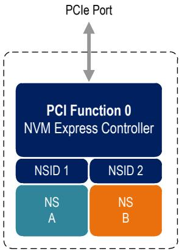

Figure 20 shows a multi-Function NVM subsystem with a single PCI Express port containing two controllers implementing NVMe over PCIe. One controller is associated with PCI Function 0 and the other controller is associated with PCI Function 1. Each controller supports a single private namespace and access to shared namespace B. The namespace ID shall be the same in all controllers that have access to a particular shared namespace. In this example, both controllers use NSID 2 to access shared namespace B.

Figure 20: NVM Subsystem with Two Controllers and One Port

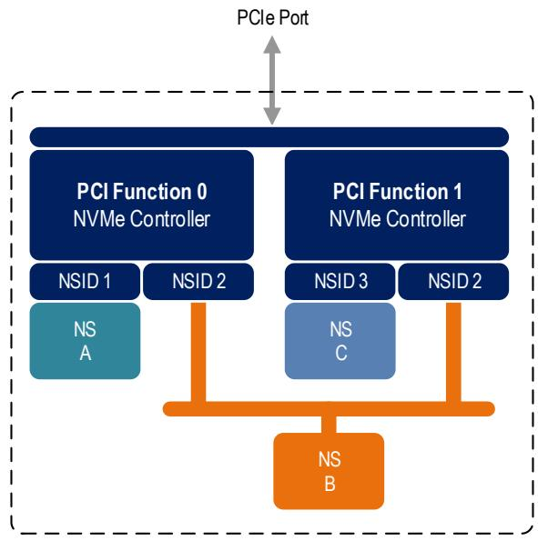

There is one or more Identify Controller data structures for each controller and one or more Identify Namespace data structures (refer to section 1.5.49) for each namespace (refer to Figure 310). Controllers with access to a shared namespace return the Identify Namespace data structure associated with that shared namespace (i.e., the same data structure contents are returned by all controllers with access to the same shared namespace). There is a globally unique identifier (refer to section 4.7.1) associated with the namespace itself and may be used to determine when there are multiple paths to the same shared namespace. 

Controllers associated with a shared namespace may operate on the namespace concurrently. Operations performed by individual controllers are atomic to the shared namespace at the write atomicity level of the 

controller to which the command was submitted (refer to section 3.4.3). The write atomicity level is not required to be the same across controllers that share a namespace. If there are any ordering requirements between commands issued to different controllers that access a shared namespace, then host software or an associated application, is required to enforce these ordering requirements. 

Figure 21 illustrates an NVM subsystem with two PCI Express ports, each with an associated controller implementing NVMe over PCIe. Both controllers map to PCI Function 0 of the corresponding port. Each PCI Express port in this example is completely independent and has its own PCI Express Fundamental Reset and reference clock input. A reset of a port only affects the controller associated with that port and has no impact on the other controller, shared namespace, or operations performed by the other controller on the shared namespace. Refer to section 4.4 for Feature behavior on reset. The functional behavior of this example is otherwise the same as that illustrated in Figure 20. 

Figure 21: NVM Subsystem with Two Controllers and Two Ports

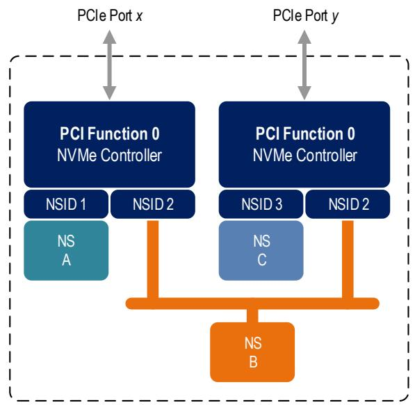

The two ports shown in Figure 21 may be associated with the same Root Complex or with different Root Complexes and may be used to implement both multi-path I/O and I/O sharing architectures. System-level architectural aspects and use of multiple ports in a PCI Express fabric are beyond the scope of this specification. 

Figure 22 illustrates an NVM subsystem that supports Single Root I/O Virtualization (SR-IOV) and has one Physical Function and four Virtual Functions. An NVM Express controller implementing NVMe over PCIe is associated with each Function with each controller having a private namespace and access to a namespace shared by all controllers, labeled NS F. The behavior of the controllers in this example parallels that of the other examples in this section. Refer to section 8.2.6.4 for more information on SR-IOV. 

Figure 22: PCI Express Device Supporting Single Root I/O Virtualization (SR-IOV)

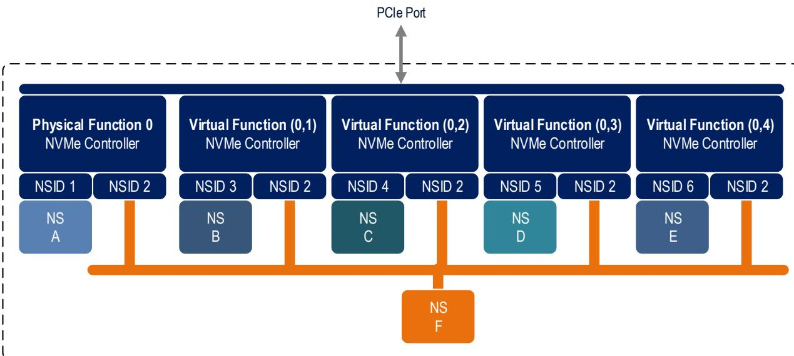

Examples provided in this section are meant to illustrate concepts and are not intended to enumerate all possible configurations. For example, an NVM subsystem may contain multiple PCI Express ports with each port supporting SR-IOV. 

# Asymmetric Controller Behavior

Asymmetric controller behavior occurs in NVM subsystems where namespace access characteristics (e.g., performance) may vary based on: 

the internal configuration of the NVM subsystem; or 

• which controller is used to access a namespace (e.g., Fabrics). 

NVM subsystems that provide asymmetric controller behavior may support Asymmetric Namespace Access Reporting as described in section 8.1.1. 

# 3 NVM Express Architecture

# 3.1 NVM Controller Architecture

A controller is the interface between a host and an NVM subsystem. This specification defines two controller models, the static controller model and the dynamic controller model. All controllers in an NVM subsystem shall support the same controller model. 

In an NVM subsystem that supports the static controller model, state (e.g., controller ID, saved Feature settings) is preserved: 

• across a Controller Level Reset for memory-based controllers and message-based controllers; and 

• from prior associations for message-based controllers. 

In an NVM subsystem that supports the dynamic controller model, the NVM subsystem allocates controllers on demand with no state preserved from prior associations. 

# Memory-Based Controller Architecture (PCIe)

Memory-based controllers shall support only the static controller model. 

# Message-Based Controller Architecture (Fabrics)

Message-based controllers, other than Discovery controllers, may support either the dynamic controller model or the static controller model. A Discovery controller shall support only the dynamic controller model. 

In an NVM subsystem that supports the static controller model, each controller that is allocated to a particular host may have different state at the time the association is established (e.g., each controller may have state that is preserved from a prior association). The controllers within such an NVM subsystem are distinguished by their controller identifier. The host may request a particular controller based on the Controller ID (refer to the CNTLID field in Figure 546). 

In an NVM subsystem that supports the dynamic controller model, each controller is allocated by the NVM subsystem on demand with no state (e.g., Controller ID, Feature settings) preserved from prior associations. In this model, all controllers allocated to a specific host have the same state at the time the association is established, including Feature settings. The initial set of attached namespaces should be the same for all controllers that are allocated to a specific host and accessed via the same NVM subsystem port. The initial set of attached namespaces may differ among controllers that are each accessed via a different NVM subsystem port. Changes to a dynamic controller (e.g., attached namespaces, Feature settings) after the association is established do not impact other dynamic controllers in that NVM subsystem. 

An association is established between a host and a controller when the host connects to a controller’s Admin Queue using the Fabrics Connect command (refer to section 6.3). Within the Connect command, the host specifies the Host NQN, NVM Subsystem NQN, Host Identifier, and may request a specific Controller ID (e.g., the static controller model is being used) or may request a connection to any available controller (e.g., the dynamic controller model is being used). A controller has only one association at a time. 

While an association exists between a host and a controller, only that host may establish connections with I/O Queues of that controller. To establish a new connection with I/O Queues of that controller, the host sends subsequent Connect commands using the same NVM subsystem port, NVMe Transport type, and NVMe Transport address and specifies the: 

same Host NQN; 

• same NVM Subsystem NQN; 

• same Controller ID; and 

either the: 

o same Host Identifier; or 

o a Host Identifier value of 0h, if supported (refer to section 5.1.12.3.1). 

An association between a host and controller is terminated if: 

• the controller is shutdown as described in section 3.6.2; 

• a Controller Level Reset occurs; 

• the NVMe Transport connection is lost between the host and controller for the Admin Queue; or 

an NVMe Transport connection is lost between the host and controller for any I/O Queue and the host or controller does not support individual I/O Queue deletion (refer to section 3.3.2.4). 

There is no explicit NVMe command that breaks the NVMe Transport association between a host and controller. The Disconnect command (refer to section 6.4) provides a method to delete an I/O Queue (refer to section 3.3.2.4). While a controller is associated with a host, that controller is busy, and no other associations may be made with that controller. 

To use the dynamic controller model, the host specifies a controller identifier of FFFFh when using the Fabrics Connect command (refer to section 6.3) to establish an association with an NVM subsystem. 

When using the static controller model with a fabric connected controller, the state that persists across associations is any state that persists across a Controller Level Reset. Additionally, different controllers may present different Feature settings or namespace attachments to the same host. The NVM subsystem may allocate particular controllers to specific hosts. 

While allocation of static controllers to hosts are expected to be durable (so that hosts can expect to form associations to the same controllers repeatedly (e.g., after each host reboot)), the NVM subsystem may remove the host allocation of a controller that is not in use at any time for implementation specific reasons (e.g., controller resource reclamation, subsystem reconfiguration). 

# Controller Types

As shown in Figure 23Figure 23, there are three types of controllers. An I/O controller (refer to section 3.1.3.1) is a controller that supports commands that provide access to user data stored on an NVM subsystem’s non-volatile storage medium and may support commands that provide management capabilities. An Administrative controller (refer to section 3.1.3.2) is a controller that supports commands that provide management capabilities, but does not support I/O commands that access to user data stored on an NVM subsystem’s non-volatile storage medium. A Discovery controller (refer to section 3.1.3.3) is a controller used in NVMe over Fabrics to provide access to a Discovery log page. 

Figure 23: Controller Types

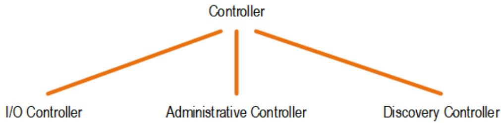

The Controller Type (CNTRLTYPE) field in the Identify Controller data structure indicates a controller’s type. Regardless of controller type, all controllers implement one Admin Submission Queue and one Admin Completion Queue. Depending on the controller type, a controller may also support one or more I/O Submission Queues and I/O Completion Queues. 

When using a memory-based transport implementation (e.g., PCIe), host software submits commands to a controller through pre-allocated Submission Queues. A controller is alerted to newly submitted commands through SQ Tail Doorbell register writes. The difference between the previous doorbell register value and the current register write indicates the number of commands that were submitted. 

A controller fetches commands from the Submission Queue(s) and processes them. Except for fused operations, there are no ordering restrictions for processing of commands within or across Submission Queues. Host software should not submit commands to a Submission Queue that may not be re-ordered 

arbitrarily by the controller. Data associated with the processing of a command may or may not be committed to the NVM subsystem non-volatile storage medium in the order that commands are submitted. 

Host software submits commands of higher priorities to the appropriate Submission Queues. Priority is associated with the Submission Queue itself, thus the priority of the command is based on the Submission Queue to which that command was submitted. The controller arbitrates across the Submission Queues based on fairness and priority according to the arbitration scheme specified in section 3.4.4. 

Upon completion of the command execution by the NVM subsystem, the controller presents completion queue entries to the host through the appropriate Completion Queues. Transport specific methods (e.g., PCIe interrupts) are used to notify the host of completion queue entries to process (refer to the appropriate Transport specification). 

There are no ordering restrictions for completions to the host. Each completion queue entry identifies the Submission Queue Identifier and Command Identifier of the associated command. Host software uses this information to correlate the completions with the commands submitted to the Submission Queue(s). 

Host software is responsible for creating I/O Submission Queues and I/O Completion Queues prior to using those queue pairs to submit commands to the controller. I/O Submission Queues and I/O Completion Queues are created using the Create I/O Submission Queue command (refer to section 5.2.2) and the Create I/O Completion Queue command (refer to section 5.2.1). 

# I/O Controller

An I/O controller is a controller that supports commands that provide access to user data stored on an NVM subsystem’s non-volatile storage medium using an I/O command set and may support commands that provide management capabilities. 

An I/O controller may simultaneously support multiple I/O Command Sets. The I/O Command Sets that the controller supports and which of these I/O Command Sets the controller simultaneously supports is reported in the Identify I/O Command Set data structure (refer to section 5.1.13.2.19). The contents of the Identify I/O Command Set data structure are not required to be the same for all controllers in an NVM subsystem. 

Figure 24 shows an NVM subsystem with three I/O controllers. I/O controller one has two attached namespaces, private namespace A and shared namespace B. I/O controller two also has two attached namespaces, private namespace C and shared namespace B. I/O controller three has no attached namespaces. At some later point in time shared namespace B may be attached to I/O controller three. 

Figure 24: NVM Subsystem with Three I/O Controllers

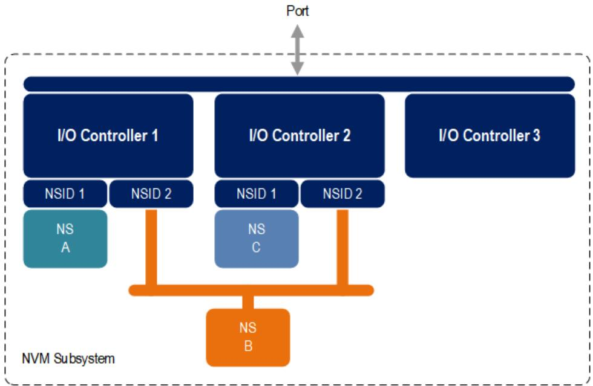

# Administrative Controller

An Administrative controller is a controller whose intended purpose is to provide NVM subsystem management capabilities. While an I/O controller may support these same management capabilities, an Administrative controller has fewer mandatory capabilities. Unlike an I/O controller, an Administrative controller does not support I/O commands that access to user data stored on an NVM subsystem’s nonvolatile storage medium. NVMe Transports may support a transport specific mechanism to allow an Administrative controller to load a dedicated NVMe management driver instead of a generic NVMe driver (refer to the applicable NVMe Transport binding specification for details). 

Examples of management capabilities that may be supported by an Administrative controller include the following. 

Ability to efficiently poll NVM subsystem health status via NVMe-MI using the NVMe-MI Send command and the NVMe-MI Receive command (refer to the NVM Subsystem Health Status Poll section in the NVM Express Management Interface Specification); 

Ability to manage an NVMe enclosure via NVMe-MI using the NVMe-MI Send command and the NVMe-MI Receive command; 

Ability to manage NVM subsystem namespaces using the Namespace Attachment command and the Namespace Management command; 

Ability to perform virtualization management using the Virtualization Management command; 

Ability to reset an entire NVM subsystem using the NVM Subsystem Reset (NSSR) register if supported; and 

Ability to shutdown an entire NVM subsystem using the NVM Subsystem Shutdown (NSSD) property, if supported. 

An Administrative controller shall not support I/O Queues. Namespaces shall not be attached to an Administrative controller. 

An Administrative controller is required to support the mandatory Admin commands listed in Figure 28. An Administrative controller may support one or more I/O Command Sets. If an Administrative controller supports an I/O Command Set, then only I/O Command Set specific Admin commands may be supported since an Administrative controller only has an Admin Queue and no I/O Queues. 

Figure 25 shows an NVM subsystem with one Administrative controller and two I/O controllers within an NVM subsystem that contains a non-volatile storage medium and namespaces. I/O controller one has two attached namespaces, private namespace A and shared namespace B. I/O controller two also has two attached namespaces, private namespace C and shared namespace B. An Administrative controller has no attached namespaces. The Administrative controller in this example may be used for tasks such as NVM subsystem namespace management and efficiently polling NVM subsystem health status via NVMe-MI. While this example shows a single Administrative controller, an NVM subsystem may support zero or more Administrative controllers. 

Figure 25: NVM Subsystem with One Administrative and Two I/O Controllers

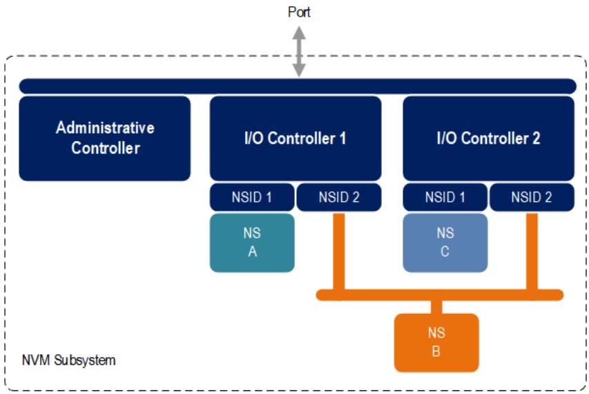

Figure 26 shows an NVM subsystem with one Administrative controller within an NVM subsystem that contains no non-volatile storage medium or namespaces. The Administrative controller in this example may be used to manage an NVMe enclosure using NVMe-MI. Since the Administrative controller is used for a very specific dedicated purpose, the implementer of such an Administrative controller may choose to implement only the mandatory capabilities along with the NVMe-MI Send and NVMe-MI Receive commands.

Figure 26: NVM Subsystem with One Administrative Controller

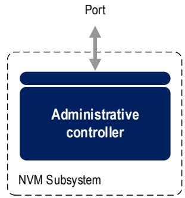

# Discovery Controller

A Discovery controller is a controller used in NVMe over Fabrics. A Discovery controller enables a host to discover other NVM subsystems or other Discovery subsystems. A Discovery controller only implements features related to Discovering other subsystems and does not implement I/O Queues, I/O commands, or expose namespaces. The features supported by the Discovery controller are defined in section 3.1.3.6. 

If the Discovery subsystem provides a unique Discovery Service NQN (i.e., the NVM Subsystem NVMe Qualified Name (SUBNQN) field in that Discovery subsystem’s Identify Controller data structure contains a unique Discovery Service NQN value), then that Discovery subsystem shall support both the unique Discovery Service NQN and the well-known Discovery Service NQN (i.e., nqn.2014- 08.org.nvmexpress.discovery) being specified in the Connect command (refer to section 6.3) from the host. 

If the Discovery subsystem does not provide a unique Discovery Service NQN (i.e., the SUBNQN field in that Discovery subsystem’s Identify Controller data structure contains the well-known Discovery Service NQN), then that Discovery subsystem shall support the well-known Discovery Service NQN being specified in the Connect command from the host. 

In the Connect command to a Discovery subsystem that provides a unique Discovery Service NQN, the host may use either of the following: 

the well-known Discovery Service NQN; or 

• the unique Discovery Service NQN of that Discovery subsystem. 

In the Connect command to a Discovery subsystem that does not provide a unique Discovery Service NQN, the host uses the well-known Discovery Service NQN. 

The method that a host uses to obtain the fabric information necessary to connect to a Discovery controller using the well-known Discovery Service NQN or the unique NQN via the NVMe Transport may be: 

a) implementation specific; 

b) fabric specific; 

c) known in advance (e.g., a well-known address); 

d) administratively configured; or 

e) for IP-based fabrics, Automated Discovery of Discovery Controllers for IP-based Fabrics (refer to section 8.3.1) may be used. 

The Discovery log page provided by a Discovery controller contains one or more entries. Each entry specifies information necessary for the host to connect to an NVM subsystem. An entry may be associated with an NVM subsystem that exposes namespaces or a referral to another Discovery Service. There are no ordering requirements for log page entries within the Discovery log page. 

Discovery controller(s) may provide different log page contents depending on the Host NQN provided (e.g., different NVM subsystems may be accessible to different hosts). The set of Discovery Log Page Entries should include all applicable addresses on the same fabric as the Discovery Service and may include addresses on other fabrics. 

Discovery controllers that support explicit persistent connections shall support both the Asynchronous Event Request command and the Keep Alive command (refer to sections 5.1.2 and 5.1.14 respectively). A host requests an explicit persistent connection to a Discovery controller and Asynchronous Event Notifications from the Discovery controller on that persistent connection by specifying a non-zero Keep Alive Timer value in the Connect command. If the Connect command specifies a non-zero Keep Alive Timer value and the Discovery controller does not support Asynchronous Events, then the Discovery controller shall return a status value of Connect Invalid Parameters (refer to Figure 548) for the Connect command. Discovery controllers shall indicate support for Discovery Log Change Notifications in the Identify Controller data structure (refer to Figure 312). 

Discovery controllers that do not support explicit persistent connections shall not support Keep Alive commands and may use a fixed Discovery controller activity timeout value (e.g., 2 minutes). If no commands are received by such a Discovery controller within that time period, the controller may perform the actions for Keep Alive Timer expiration defined in section 3.9.5. 

A Discovery controller shall not support the Disconnect command. 

A Discovery log page with multiple Discovery Log Page Entries for the same NVM subsystem indicates that there are multiple fabric paths to the NVM subsystem, and/or that multiple static controllers may share a fabric path. The host may use this information to form multiple associations to controllers within an NVM subsystem. 

Multiple Discovery Log Page Entries for the same NVM subsystem with different Port ID values indicates that the resulting NVMe Transport connections are independent with respect to NVM subsystem port hardware failures. A host that uses a single association should pick a record to attach to an NVM subsystem. A host that uses multiple associations should choose different ports. 

A transport specific method may exist to indicate changes to a Discovery controller. 

Controller IDs in the range FFF0h to FFFFh are not allocated as valid Controller IDs on completion of a Connect command, as described in section 6.3. Figure 27 defines these Controller IDs. 

Figure 27: Controller IDs FFF0h to FFFFh

<table><tr><td>Controller ID</td><td>Definition</td></tr><tr><td>FFF0h to FFFCh</td><td>Reserved. Use of this value in a Connect command results in a status code of Connect Invalid Parameters being returned, as described in section 6.3.</td></tr><tr><td>FFFDh</td><td>This value in the Controller ID (CNTLID) field of the Registered Controller data structure or Registered Controller Extended data structure for a dispersed namespace indicates that the controller is not contained in the same participating NVM subsystem as the controller processing the command (refer to section 8.1.9.6). Use of this value in a Connect command results in a status code of Connect Invalid Parameters being returned, as described in section 6.3.</td></tr><tr><td>FFFEh</td><td>This value is sent in a Connect command to specify that any available static controller is allowed to be allocated.</td></tr><tr><td>FFFFh</td><td>This value is sent in a Connect command to specify that any available dynamic controller is allowed to be allocated.</td></tr></table>

The Controller ID values returned in the Discovery Log Page Entries indicate whether an NVM subsystem supports the dynamic or static controller model. The controller ID value of FFFFh is used for NVM subsystems that support the dynamic controller model indicating that any available controller may be returned. The Controller ID value of FFFEh is used for NVM subsystems that support the static controller model indicating that any available controller may be returned. An NVM subsystem supports the dynamic controller model if Discovery Log Page Entries use the Controller ID value of FFFFh. An NVM subsystem supports the static controller model if Discovery Log Page Entries use a Controller ID value that is less than FFFFh. The Identify Controller data structure also indicates whether an NVM subsystem is dynamic or static. 

If an NVM subsystem implements the dynamic controller model, then multiple Discovery Log Page Entries (refer to Figure 294) with the Controller ID set to FFFFh may be returned for that NVM subsystem (e.g., to indicate multiple NVM subsystem ports) in the Discovery log page. If an NVM subsystem implements the static controller model, then multiple Discovery Log Page Entries that indicate different Controller ID values may be returned for that NVM subsystem in the Discovery log page. If an NVM subsystem that implements the static controller model includes any Discovery Log Page Entries that indicate a Controller ID of FFFEh, then the host should remember the Controller ID returned from the Fabrics Connect command and re-use the allocated Controller ID for future associations to that particular controller. 

# 3.1.3.3.1 Discovery Controller Asynchronous Event Configuration

Discovery controllers that support Asynchronous Event Notifications shall implement the Get Features and Set Features commands. A Discovery controller shall enable Asynchronous Discovery Log Event Notifications, if a non-zero Keep Alive Timeout (KATO) value is received in the Connect command (refer to section 6.3) sent to that controller. 

Figure 391 defines Discovery controller Asynchronous Event Notifications. 

# 3.1.3.3.2 Discovery Controller Asynchronous Event Information – Requests and Notifications

If a Discovery controller detects an event about which a host has requested notification, then the Discovery controller shall send an Asynchronous Event with the: 

• Asynchronous Event Type field set to Notice (i.e., 2h); 

Log Page Identifier field set to either Discovery (i.e., 70h) or Host Discovery (i.e., 71h) depending on which log page has changed; and 

• Asynchronous Event Information field set as defined in Figure 151. 

As a result of a Discovery controller updating Discovery log page(s), that Discovery controller shall send a Discovery Log Page Change Asynchronous Event notification (i.e., the Asynchronous Event Information field set to F0h) to each entity that has requested asynchronous event notifications of this type (refer to Figure 151). 

As a result of a Discovery controller updating Host Discovery log page(s), that Discovery controller shall send a Host Discovery Log Page Change Asynchronous Event notification (i.e., the Asynchronous Event Information field set to F1h) to each entity that has requested asynchronous event notifications of this type (refer to Figure 151). 

# 3.1.3.3.3 Discovery Controller Initialization

The initialization process for Discovery controllers is described in section 3.5.2.1. 

# Command Support Requirements

Figure 28 defines commands that are mandatory, optional, and prohibited for an I/O controller, Administrative controller, and Discovery controller. I/O Command Set specific command support requirements are described within individual I/O Command Set specifications. Since an Administrative controller does not support I/O queues, I/O Command Set specific commands that are not Admin commands are not supported by an Administrative controller. 

A host may utilize the Commands Supported and Effects log page to determine optional commands that are supported by a controller. 

Figure 28: Admin Command Support Requirements

<table><tr><td rowspan="2">Command</td><td rowspan="2">Combined Opcode Value</td><td colspan="3">Controller Support Requirements1</td><td rowspan="2">Reference</td></tr><tr><td>I/O</td><td>Administrative</td><td>Discovery</td></tr><tr><td>Delete I/O Submission Queue</td><td>00h</td><td>M9</td><td>P</td><td>P</td><td>5.2.4</td></tr><tr><td>Create I/O Submission Queue</td><td>01h</td><td>M9</td><td>P</td><td>P</td><td>5.2.2</td></tr><tr><td>Get Log Page</td><td>02h</td><td>M</td><td>M</td><td>M</td><td>5.1.12</td></tr><tr><td>Delete I/O Completion Queue</td><td>04h</td><td>M9</td><td>P</td><td>P</td><td>5.2.3</td></tr><tr><td>Create I/O Completion Queue</td><td>05h</td><td>M9</td><td>P</td><td>P</td><td>5.2.1</td></tr><tr><td>Identify</td><td>06h</td><td>M</td><td>M</td><td>M</td><td>5.1.13</td></tr><tr><td>Abort</td><td>08h</td><td>M</td><td>O</td><td>O</td><td>5.1.1</td></tr><tr><td>Set Features</td><td>09h</td><td>M</td><td>O4</td><td>Note 6</td><td>5.1.25</td></tr><tr><td>Get Features</td><td>0Ah</td><td>M</td><td>O4</td><td>Note 6</td><td>5.1.11</td></tr><tr><td>Asynchronous Event Request</td><td>0Ch</td><td>M</td><td>O5</td><td>Note 6</td><td>5.1.2</td></tr><tr><td>Namespace Management</td><td>0Dh</td><td>O</td><td>O</td><td>P</td><td>5.1.21</td></tr><tr><td>Firmware Commit</td><td>10h</td><td>O</td><td>O</td><td>P</td><td>5.1.8</td></tr><tr><td>Firmware Image Download</td><td>11h</td><td>O</td><td>O</td><td>P</td><td>5.1.9</td></tr><tr><td>Device Self-test</td><td>14h</td><td>O</td><td>O</td><td>P</td><td>5.1.4</td></tr><tr><td>Namespace Attachment</td><td>15h</td><td>O</td><td>O</td><td>P</td><td>5.1.20</td></tr><tr><td>Keep Alive</td><td>18h</td><td>M2</td><td>M2</td><td>Note 6</td><td>5.1.14</td></tr><tr><td>Directive Send</td><td>19h</td><td>O</td><td>O</td><td>P</td><td>5.1.7</td></tr><tr><td>Directive Receive</td><td>1Ah</td><td>O</td><td>O</td><td>P</td><td>5.1.6</td></tr><tr><td>Virtualization Management</td><td>1Ch</td><td>O</td><td>O</td><td>P</td><td>5.2.6</td></tr><tr><td>NVMe-MI Send</td><td>1Dh</td><td>O</td><td>O</td><td>P</td><td>5.1.19</td></tr><tr><td>NVMe-MI Receive</td><td>1Eh</td><td>O</td><td>O</td><td>P</td><td>5.1.16</td></tr><tr><td>Capacity Management</td><td>20h</td><td>O</td><td>O</td><td>P</td><td>5.1.3</td></tr><tr><td>Discovery Information Management</td><td>21h</td><td>P</td><td>P</td><td>M7</td><td>5.3.3</td></tr><tr><td>Fabric Zoning Receive</td><td>22h</td><td>P</td><td>P</td><td>M7</td><td>5.3.5</td></tr><tr><td>Lockdown</td><td>24h</td><td>O</td><td>O</td><td>P</td><td>5.1.15</td></tr><tr><td>Fabric Zoning Lookup</td><td>25h</td><td>P</td><td>P</td><td>M7</td><td>5.3.4</td></tr><tr><td>Clear Exported NVM Resource Configuration</td><td>28h</td><td>P</td><td>O</td><td>P</td><td>5.3.1</td></tr></table>

Figure 28: Admin Command Support Requirements

<table><tr><td rowspan="2">Command</td><td rowspan="2">Combined Opcode Value</td><td colspan="3">Controller Support Requirements1</td><td rowspan="2">Reference</td></tr><tr><td>I/O</td><td>Administrative</td><td>Discovery</td></tr><tr><td>Fabric Zoning Send</td><td>29h</td><td>P</td><td>P</td><td>M7</td><td>5.3.6</td></tr><tr><td>Create Exported NVM Subsystem</td><td>2Ah</td><td>P</td><td>O</td><td>P</td><td>5.3.2</td></tr><tr><td>Manage Exported NVM Subsystem</td><td>2Dh</td><td>P</td><td>O</td><td>P</td><td>5.3.8</td></tr><tr><td>Manage Exported Namespace</td><td>31h</td><td>P</td><td>O</td><td>P</td><td>5.3.7</td></tr><tr><td>Manage Exported Port</td><td>35h</td><td>P</td><td>O</td><td>P</td><td>5.3.9</td></tr><tr><td>Send Discovery Log Page</td><td>39h</td><td>P</td><td>P</td><td>M7</td><td>5.3.10</td></tr><tr><td>Track Send</td><td>3Dh</td><td>O</td><td>O</td><td>P</td><td>5.1.26</td></tr><tr><td>Track Receive</td><td>3Eh</td><td>O</td><td>O</td><td>P</td><td>5.1.27</td></tr><tr><td>Migration Send</td><td>41h</td><td>O</td><td>O</td><td>P</td><td>5.1.16</td></tr><tr><td>Migration Receive</td><td>42h</td><td>O</td><td>O</td><td>P</td><td>5.1.17</td></tr><tr><td>Controller Data Queue</td><td>45h</td><td>O</td><td>O</td><td>P</td><td>5.1.4</td></tr><tr><td>Doorbell Buffer Config</td><td>7Ch</td><td>O</td><td>O</td><td>P</td><td>5.2.5</td></tr><tr><td colspan="6">I/O Command Set specific Admin commands</td></tr><tr><td>Format NVM</td><td>80h</td><td>O</td><td>O</td><td>P</td><td>5.1.10</td></tr><tr><td>Security Send</td><td>81h</td><td>O</td><td>O</td><td>P</td><td>5.1.24</td></tr><tr><td>Security Receive</td><td>82h</td><td>O</td><td>O</td><td>P</td><td>5.1.23</td></tr><tr><td>Sanitize</td><td>84h</td><td>O3</td><td>O3</td><td>P</td><td>5.1.22</td></tr><tr><td rowspan="4">I/O Command Set specific Admin command</td><td>85h</td><td rowspan="4">Note 8</td><td rowspan="4">P</td><td rowspan="4">P</td><td rowspan="4">Note 8</td></tr><tr><td>86h</td></tr><tr><td>88h</td></tr><tr><td>89h</td></tr><tr><td colspan="6">Vendor Specific</td></tr><tr><td>Vendor Specific</td><td></td><td>O</td><td>O</td><td>O</td><td></td></tr><tr><td colspan="6">Notes:1. O/M/P definition: O = Optional, M = Mandatory, P = Prohibited2. Prohibited if the Keep Alive Timer feature is not supported (refer to section 3.9).3. Prohibited for an Exported NVM Subsystem (refer to section 8.3.3).4. Mandatory if any of the features in Figure 32 are implemented.5. Mandatory if Telemetry Log, Firmware Commit, or SMART/Health CriticalWarnings are supported.6. For Discovery controllers that support explicit persistent connections, this command is mandatory. For Discovery controllers that do not support explicit persistent connections, this command is prohibited.7. Mandatory for CDCs and optional for Discovery controllers that are not a CDC.8. Refer to the applicable I/O Command Set specification.9. Mandatory for NVMe over PCIe. This command is not supported for NVMe over Fabrics.</td></tr></table>

Figure 29: Fabrics Command Support Requirements

<table><tr><td rowspan="2">Command</td><td rowspan="2">Opcode Value</td><td rowspan="2">Fabrics Command Type</td><td colspan="3">Controller Support Requirements1, 2</td><td rowspan="2">Reference</td></tr><tr><td>I/O</td><td>Administrative</td><td>Discovery</td></tr><tr><td>Property Set</td><td rowspan="6">7Fh</td><td>00h</td><td>M</td><td>M</td><td>M</td><td>6.6</td></tr><tr><td>Connect</td><td>01h</td><td>M</td><td>M</td><td>M</td><td>6.3</td></tr><tr><td>Property Get</td><td>04h</td><td>M</td><td>M</td><td>M</td><td>6.5</td></tr><tr><td>Authentication Send</td><td>05h</td><td>O</td><td>O</td><td>O</td><td>6.2</td></tr><tr><td>Authentication Receive</td><td>06h</td><td>O</td><td>O</td><td>O</td><td>6.1</td></tr><tr><td>Disconnect</td><td>08h</td><td>O</td><td>P</td><td>P</td><td>6.4</td></tr></table>

Figure 29: Fabrics Command Support Requirements

<table><tr><td rowspan="2">Command</td><td rowspan="2">Opcode Value</td><td rowspan="2">Fabrics Command Type</td><td colspan="3">Controller Support Requirements1, 2</td><td rowspan="2">Reference</td></tr><tr><td>I/O</td><td>Administrative</td><td>Discovery</td></tr><tr><td colspan="7">Vendor Specific</td></tr><tr><td>Vendor Specific</td><td>7Fh</td><td>C0h to FFh</td><td>O</td><td>O</td><td>O</td><td></td></tr><tr><td colspan="7">Notes:1. O/M/P definition: O = Optional, M = Mandatory, P = Prohibited2. For NVMe over PCIe implementations, all Fabrics commands are prohibited. For NVMe over Fabrics implementations, the commands are as noted in the table.</td></tr></table>

Figure 30: Common I/O Command Support Requirements

<table><tr><td rowspan="2">Command</td><td rowspan="2">Combined Opcode Value</td><td colspan="3">Controller Support Requirements1</td><td rowspan="2">Reference</td></tr><tr><td>I/O</td><td>Administrative</td><td>Discovery</td></tr><tr><td>Flush</td><td>00h</td><td>M</td><td>P</td><td>P</td><td>7.2</td></tr><tr><td>Reservation Register</td><td>0Dh</td><td>O2</td><td>P</td><td>P</td><td>7.6</td></tr><tr><td>Reservation Report</td><td>0Eh</td><td>O2</td><td>P</td><td>P</td><td>7.8</td></tr><tr><td>Reservation Acquire</td><td>11h</td><td>O2</td><td>P</td><td>P</td><td>7.5</td></tr><tr><td>I/O Management Receive</td><td>12h</td><td>O3</td><td>P</td><td>P</td><td>7.3</td></tr><tr><td>Reservation Release</td><td>15h</td><td>O2</td><td>P</td><td>P</td><td>7.7</td></tr><tr><td>Cancel</td><td>18h</td><td>O</td><td>P</td><td>P</td><td>7.1</td></tr><tr><td>I/O Management Send</td><td>1Dh</td><td>O3</td><td>P</td><td>P</td><td>7.4</td></tr><tr><td colspan="6">Vendor Specific</td></tr><tr><td>Vendor Specific</td><td></td><td>O</td><td>O</td><td>O</td><td></td></tr><tr><td colspan="6">Notes:1. O/M/P definition: O = Optional, M = Mandatory, P = Prohibited2. Mandatory if reservations are supported as indicated in the Identify Controller data structure.3. Mandatory for controllers that support the Flexible Data Placement capability (refer to section 8.1.10). Refer to the FDPS bit in Figure 312.</td></tr></table>

# Log Page Support Requirements

Figure 31 defines log pages that are mandatory, optional, and prohibited for an I/O controller, Administrative controller, and Discovery controller. I/O Command Set specific log page support requirements are described within individual I/O Command Set specifications. 

Figure 31: Log Page Support Requirements

<table><tr><td rowspan="2">Log Page Name</td><td rowspan="2">Log Page Identifier</td><td colspan="3">Controller Support Requirements1</td><td rowspan="2">Reference</td></tr><tr><td>I/O</td><td>Administrative</td><td>Discovery</td></tr><tr><td>Supported Log Pages</td><td>00h</td><td>M3</td><td>M3</td><td>M</td><td>5.1.12.1.1</td></tr><tr><td>Error Information</td><td>01h</td><td>M</td><td>M</td><td>O</td><td>5.1.12.1.2</td></tr><tr><td>SMART / Health Information (Controller scope)</td><td>02h</td><td>M</td><td>O</td><td>P</td><td rowspan="2">5.1.12.1.3</td></tr><tr><td>SMART / Health Information (Namespace scope)</td><td>02h</td><td>O</td><td>O</td><td>P</td></tr><tr><td>Firmware Slot Information</td><td>03h</td><td>M</td><td>O</td><td>P</td><td>5.1.12.1.4</td></tr><tr><td>Changed Attached Namespace List</td><td>04h</td><td>O</td><td>O</td><td>P</td><td>5.1.12.1.5</td></tr><tr><td>Commands Supported and Effects</td><td>05h</td><td>M3</td><td>M</td><td>M</td><td>5.1.12.1.6</td></tr><tr><td>Device Self-test</td><td>06h</td><td>O</td><td>O</td><td>P</td><td>5.1.12.1.7</td></tr></table>

Figure 31: Log Page Support Requirements

<table><tr><td rowspan="2">Log Page Name</td><td rowspan="2">Log Page Identifier</td><td colspan="3">Controller Support Requirements1</td><td rowspan="2">Reference</td></tr><tr><td>I/O</td><td>Administrative</td><td>Discovery</td></tr><tr><td>Telemetry Host-Initiated</td><td>07h</td><td>O</td><td>O</td><td>P</td><td>5.1.12.1.8</td></tr><tr><td>Telemetry Controller-Initiated</td><td>08h</td><td>O</td><td>O8</td><td>P</td><td>5.1.12.1.9</td></tr><tr><td>Endurance Group Information</td><td>09h</td><td>O</td><td></td><td>P</td><td>5.1.12.1.10</td></tr><tr><td>Predictable Latency Per NVM Set</td><td>0Ah</td><td>O</td><td>O8</td><td>P</td><td>5.1.12.1.11</td></tr><tr><td>Predictable Latency Event Aggregate</td><td>0Bh</td><td>O</td><td>O8</td><td>P</td><td>5.1.12.1.12</td></tr><tr><td>Asymmetric Namespace Access</td><td>0Ch</td><td>O</td><td>P</td><td>P</td><td>5.1.12.1.13</td></tr><tr><td>Persistent Event</td><td>0Dh</td><td>O</td><td>O</td><td>P</td><td>5.1.12.1.14</td></tr><tr><td>LBA Status Information</td><td>0Eh</td><td colspan="4">Refer to the NVM Command Set Specification</td></tr><tr><td>Endurance Group Event Aggregate</td><td>0Fh</td><td>O</td><td>O</td><td>P</td><td>5.1.12.1.15</td></tr><tr><td>Media Unit Status</td><td>10h</td><td>O2</td><td>P</td><td>P</td><td>5.1.12.1.16</td></tr><tr><td>Supported Capacity Configuration List</td><td>11h</td><td>O2</td><td>P</td><td>P</td><td>5.1.12.1.17</td></tr><tr><td>Feature Identifiers Supported and Effects</td><td>12h</td><td>M3</td><td>M3,9</td><td>M9</td><td>5.1.12.1.18</td></tr><tr><td>NVMe-MI Commands Supported and Effects</td><td>13h</td><td>M3,7</td><td>M3,7</td><td>O</td><td>5.1.12.1.19</td></tr><tr><td>Command and Feature Lockdown</td><td>14h</td><td>O</td><td>O</td><td>P</td><td>5.1.12.1.20</td></tr><tr><td>Boot Partition</td><td>15h</td><td>O</td><td>O</td><td>P</td><td>5.1.12.1.21</td></tr><tr><td>Rotational Media Information</td><td>16h</td><td>O</td><td>P</td><td>P</td><td>5.1.12.1.22</td></tr><tr><td>Dispersed Namespace Participating NVM Subsystems</td><td>17h</td><td>O</td><td>O</td><td>P</td><td>5.1.12.1.23</td></tr><tr><td>Management Address List</td><td>18h</td><td>O</td><td>O</td><td>O</td><td>5.1.12.1.24</td></tr><tr><td>Physical Interface Receiver Eye Opening Measurement</td><td>19h</td><td>O4</td><td>O4</td><td>P</td><td>Note 11</td></tr><tr><td>Reachability Groups</td><td>1Ah</td><td>M6</td><td>P</td><td>P</td><td>5.1.12.1.25</td></tr><tr><td>Reachability Associations</td><td>1Bh</td><td>M6</td><td>P</td><td>P</td><td>5.1.12.1.26</td></tr><tr><td>Changed Allocated Namespace List</td><td>1Ch</td><td>O</td><td>O</td><td>P</td><td>5.1.12.1.27</td></tr><tr><td>FDP Configurations</td><td>20h</td><td>O5</td><td>P</td><td>P</td><td>5.1.12.1.28</td></tr><tr><td>Reclaim Unit Handle Usage</td><td>21h</td><td>O5</td><td>P</td><td>P</td><td>5.1.12.1.29</td></tr><tr><td>FDP Statistics</td><td>22h</td><td>O5</td><td>P</td><td>P</td><td>5.1.12.1.30</td></tr><tr><td>FDP Events</td><td>23h</td><td>O5</td><td>P</td><td>P</td><td>5.1.12.1.31</td></tr><tr><td>Discovery</td><td>70h</td><td>P</td><td>P</td><td>M</td><td>5.1.12.3.1</td></tr><tr><td>Host Discovery</td><td>71h</td><td>P</td><td>P</td><td>O</td><td>5.1.12.3.2</td></tr><tr><td>AVE Discovery</td><td>72h</td><td>P</td><td>P</td><td>O</td><td>5.1.12.3.3</td></tr><tr><td>Pull Model DDC Request</td><td>73h</td><td>P</td><td>P</td><td>M10</td><td>5.1.12.3.4</td></tr></table>

Figure 31: Log Page Support Requirements

<table><tr><td rowspan="2">Log Page Name</td><td rowspan="2">Log Page Identifier</td><td colspan="3">Controller Support Requirements1</td><td rowspan="2">Reference</td></tr><tr><td>I/O</td><td>Administrative</td><td>Discovery</td></tr><tr><td>Reservation Notification</td><td>80h</td><td>O</td><td>P</td><td>P</td><td>5.1.12.1.32</td></tr><tr><td>Sanitize Status</td><td>81h</td><td>O</td><td>O8</td><td>P</td><td>5.1.12.1.33</td></tr><tr><td>Program List</td><td>82h</td><td rowspan="3" colspan="4">Refer to the Computational Programs Command Set Specification</td></tr><tr><td>Downloadable Program Types List</td><td>83h</td></tr><tr><td>Memory Range Set List</td><td>84h</td></tr><tr><td></td><td>85h to BEh</td><td colspan="4">Refer to the applicable I/O Command Set specification</td></tr><tr><td>Changed Zone List</td><td>BFh</td><td colspan="4">Refer to the Zoned Namespace Command Set Specification</td></tr><tr><td>Vendor Specific</td><td>C0h to FFh</td><td colspan="4"></td></tr><tr><td colspan="6">Notes:1. O/M/P definition: O = Optional, M = Mandatory, P = Prohibited2. Mandatory for controllers that support Fixed Capacity Management (refer to section 8.1.4.2).3. Optional for NVM Express revision 1.4 and earlier.4. If this log page is not described for a specific physical interface (refer to the applicable NVM Express transport specification), then this log page is prohibited for that transport.5. Mandatory for controllers that support the Flexible Data Placement capability (refer to section 8.1.10). Refer to the FDPS bit in Figure 312.6. Optional for controllers that do not support Reachability Reporting (refer to section 8.1.19).7. Optional if the NVMe-MI Send command and the NVMe-MI Receive command are not supported (refer to Figure 28).8. Prohibited for an Exported NVM subsystem (refer to section 8.3.3).9. Optional if the Set Features command is not supported (refer to Figure 28).10. Mandatory for CDCs and prohibited for Discovery controllers that are not a CDC.11. Refer to the applicable NVM Express transport specification.</td></tr></table>

# Feature Support Requirements

Figure 32 defines features that are mandatory, optional, and prohibited for an I/O controller, Administrative controller, and Discovery controller. If any feature is supported, then the Set Features command and the Get Features command shall be supported. I/O Command Set specific feature support requirements are described within individual I/O Command Set specifications. 

Figure 32: Feature Support Requirements

<table><tr><td rowspan="2">Feature Name</td><td rowspan="2">Feature Identifier</td><td colspan="3">\( Controller \ Support \ Requirements^1 \)</td><td rowspan="2">Reference</td></tr><tr><td>I/O</td><td>Administrative</td><td>Discovery</td></tr><tr><td>Arbitration</td><td>01h</td><td>M</td><td>P</td><td>P</td><td>5.1.25.1.1</td></tr><tr><td>Power Management</td><td>02h</td><td>M</td><td>O</td><td>P</td><td>5.1.25.1.2</td></tr><tr><td>LBA Range Type</td><td>03h</td><td colspan="4">Refer to the NVM Command Set Specification</td></tr><tr><td>Temperature Threshold</td><td>04h</td><td>M</td><td>O</td><td>P</td><td>5.1.25.1.3</td></tr><tr><td>Error Recovery</td><td>05h</td><td colspan="4">Refer to the NVM Command Set Specification</td></tr><tr><td>Volatile Write Cache</td><td>06h</td><td>O</td><td>P</td><td>P</td><td>5.1.25.1.4</td></tr><tr><td>Number of Queues</td><td>07h</td><td>M</td><td>P</td><td>P</td><td>5.1.25.2.1</td></tr><tr><td>Interrupt Coalescing</td><td>08h</td><td>Note 2</td><td>Note 2</td><td>P</td><td>5.1.25.2.2</td></tr><tr><td>Interrupt Vector Configuration</td><td>09h</td><td>Note 2</td><td>Note 2</td><td>P</td><td>5.1.25.2.3</td></tr><tr><td>Write Atomicity Normal</td><td>0Ah</td><td colspan="4">Refer to the NVM Command Set Specification</td></tr><tr><td>Asynchronous Event Configuration</td><td>0Bh</td><td>M</td><td>\( O^8 \)</td><td>\( M^{10} \)</td><td>5.1.25.1.5</td></tr><tr><td>Autonomous Power State Transition</td><td>0Ch</td><td>O</td><td>O</td><td>P</td><td>5.1.25.1.6</td></tr><tr><td>Host Memory Buffer</td><td>0Dh</td><td>O</td><td>O</td><td>P</td><td>5.1.25.2.4</td></tr><tr><td>Timestamp</td><td>0Eh</td><td>O</td><td>O</td><td>P</td><td>5.1.25.1.7</td></tr><tr><td>Keep Alive Timer</td><td>0Fh</td><td>\( M^7 \)</td><td>\( M^7 \)</td><td>\( M^{10} \)</td><td>5.1.25.1.8</td></tr></table>

Figure 32: Feature Support Requirements

<table><tr><td rowspan="2">Feature Name</td><td rowspan="2">Feature Identifier</td><td colspan="3">\(Controller Support Requirements ^1\)</td><td rowspan="2">Reference</td></tr><tr><td>I/O</td><td>Administrative</td><td>Discovery</td></tr><tr><td>Host Controlled Thermal Management</td><td>10h</td><td>O</td><td>O</td><td>P</td><td>5.1.25.1.9</td></tr><tr><td>Non-Operational Power State Config</td><td>11h</td><td>O</td><td>O</td><td>P</td><td>5.1.25.1.10</td></tr><tr><td>Read Recovery Level Config</td><td>12h</td><td>O</td><td>O</td><td>P</td><td>5.1.25.1.11</td></tr><tr><td>Predictable Latency Mode Config</td><td>13h</td><td>O</td><td>\(\mathsf{O}^{\mathsf{9}}\)</td><td>P</td><td>5.1.25.1.12</td></tr><tr><td>Predictable Latency Mode Window</td><td>14h</td><td>O</td><td>\(\mathsf{O}^{\mathsf{9}}\)</td><td>P</td><td>5.1.25.1.13</td></tr><tr><td>LBA Status Information Report Interval</td><td>15h</td><td colspan="4">Refer to the NVM Command Set Specification</td></tr><tr><td>Host Behavior Support</td><td>16h</td><td>O</td><td>O</td><td>P</td><td>5.1.25.1.14</td></tr><tr><td>Sanitize Config</td><td>17h</td><td>O</td><td>\(\mathsf{O}^{\mathsf{9}}\)</td><td>P</td><td>5.1.25.1.15</td></tr><tr><td>Endurance Group Event Configuration</td><td>18h</td><td>O</td><td>\(\mathsf{O}^{\mathsf{9}}\)</td><td>P</td><td>5.1.25.1.16</td></tr><tr><td>I/O Command Set Profile</td><td>19h</td><td>O</td><td>P</td><td>P</td><td>5.1.25.1.17</td></tr><tr><td>Spinup Control</td><td>1Ah</td><td>O</td><td>P</td><td>P</td><td>5.1.25.1.18</td></tr><tr><td>Power Loss Signaling Config</td><td>1Bh</td><td>O</td><td>O</td><td>P</td><td>5.1.25.1.19</td></tr><tr><td>Performance Characteristics</td><td>1Ch</td><td colspan="4">Refer to the NVM Command Set Specification</td></tr><tr><td>Flexible Data Placement</td><td>1Dh</td><td>\(\mathsf{O}^{\mathsf{6}}\)</td><td>P</td><td>P</td><td>5.1.25.1.20</td></tr><tr><td>Flexible Data Placement Events</td><td>1Eh</td><td>\(\mathsf{O}^{\mathsf{6}}\)</td><td>P</td><td>P</td><td>5.1.25.1.21</td></tr><tr><td>Namespace Admin Label</td><td>1Fh</td><td>O</td><td>O</td><td>P</td><td>5.1.25.1.22</td></tr><tr><td>Key Value Configuration</td><td>20h</td><td colspan="4">Refer to the Key Value Command Set Specification</td></tr><tr><td>Controller Data Queue</td><td>21h</td><td>O</td><td>O</td><td>P</td><td>5.1.25.1.23</td></tr><tr><td>Embedded Management Controller Address</td><td>78h</td><td>O</td><td>O</td><td>O</td><td>5.1.25.1.24</td></tr><tr><td>Host Management Agent Address</td><td>79h</td><td>O</td><td>O</td><td>O</td><td>5.1.25.1.25</td></tr><tr><td>Enhanced Controller Metadata</td><td>7Dh</td><td>\(\mathsf{O}^{\mathsf{5}}\)</td><td>\(\mathsf{O}^{\mathsf{5}}\)</td><td>O</td><td>5.1.25.1.26.1</td></tr><tr><td>Controller Metadata</td><td>7Eh</td><td>\(\mathsf{O}^{\mathsf{5}}\)</td><td>\(\mathsf{O}^{\mathsf{5}}\)</td><td>O</td><td>5.1.25.1.26.2</td></tr><tr><td>Namespace Metadata</td><td>7Fh</td><td>\(\mathsf{O}^{\mathsf{5}}\)</td><td>\(\mathsf{O}^{\mathsf{5}}\)</td><td>O</td><td>5.1.25.1.26.3</td></tr><tr><td>Software Progress Marker</td><td>80h</td><td>O</td><td>O</td><td>P</td><td>5.1.25.1.27</td></tr><tr><td>Host Identifier</td><td>81h</td><td>\(\mathsf{O}^{\mathsf{3}}\)</td><td>O</td><td>P</td><td>5.1.25.1.28</td></tr><tr><td>Reservation Notification Mask</td><td>82h</td><td>\(\mathsf{O}^{\mathsf{4}}\)</td><td>P</td><td>P</td><td>5.1.25.1.29</td></tr><tr><td>Reservation Persistence</td><td>83h</td><td>\(\mathsf{O}^{\mathsf{4}}\)</td><td>P</td><td>P</td><td>5.1.25.1.30</td></tr></table>

Figure 32: Feature Support Requirements

<table><tr><td rowspan="2">Feature Name</td><td rowspan="2">Feature Identifier</td><td colspan="3">Controller Support Requirements1</td><td rowspan="2">Reference</td></tr><tr><td>I/O</td><td>Administrative</td><td>Discovery</td></tr><tr><td>Namespace Write Protection Config</td><td>84h</td><td>O</td><td>O</td><td>P</td><td>5.1.25.1.31</td></tr><tr><td>Boot Partition Write Protection Config</td><td>85h</td><td>O</td><td>O</td><td>P</td><td>5.1.25.1.32</td></tr><tr><td colspan="6">Notes:1. O/M/P definition: O = Optional, M = Mandatory, P = Prohibited2. Mandatory for NVMe over PCIe. This feature is not supported for NVMe over Fabrics.3. Mandatory if reservations are supported as indicated in the Identify Controller data structure.4. Mandatory if reservations are supported by the namespace as indicated by a non-zero value in the Reservation Capabilities (RESCAP) field in the Identify Namespace data structure.5. Optional for NVM subsystems that do not implement a Management Endpoint. For NVM subsystems that implement any Management Endpoint refer to the NVM Express Management Interface Specification.6. Mandatory for controllers that support the Flexible Data Placement capability (refer to section 8.1.10). Refer to the FDPS bit in Figure 312.7. Optional if not required by the NVMe Transport (refer to section 3.9).8. Mandatory if Telemetry Log, Firmware Commit or SMART/Health CriticalWarnings are supported.9. Prohibited for an Exported NVM Subsystem (refer to section 8.3.3).10. For Discovery controllers that support explicit persistent connections, this feature is mandatory. For Discovery controllers that do not support explicit persistent connections, this feature is prohibited.</td></tr></table>

# Controller Properties

A property is a dword, or qword attribute of a controller. The attribute may have read, write, or read/write access. The host shall access a property using the width specified for that property with an offset that is at the beginning of the property unless otherwise noted in a transport specific specification. All reserved properties and all reserved bits within properties are read-only and return 0h when read. 

For message-based controllers, properties may be read with the Property Get command and may be written with the Property Set command. 

For memory-based controllers, refer to the applicable NVMe Transport binding specification for access methods and rules (e.g., NVMe PCIe Transport Specification). 

Figure 33 describes the property map for the controller. 

Accesses that target any portion of two or more properties are not supported. 

Software should not rely on 0h being returned. 

Figure 33: Property Definition

<table><tr><td>Offset (OFST)</td><td>Size (in bytes)</td><td>I/O Controller1</td><td>Administrative Controller1</td><td>Discovery Controller1</td><td>Name</td></tr><tr><td>0h</td><td>8</td><td>M</td><td>M</td><td>M</td><td>CAP: Controller Capabilities</td></tr><tr><td>8h</td><td>4</td><td>M</td><td>M</td><td>M</td><td>VS: Version</td></tr><tr><td>Ch</td><td>4</td><td>M2</td><td>M2</td><td>R</td><td>INTMS: Interrupt Mask Set</td></tr><tr><td>Fh</td><td>4</td><td>M2</td><td>M2</td><td>R</td><td>INTMC: Interrupt Mask Clear</td></tr><tr><td>14h</td><td>4</td><td>M</td><td>M</td><td>M</td><td>CC: Controller Configuration</td></tr><tr><td>18h</td><td></td><td>R</td><td>R</td><td>R</td><td>Reserved</td></tr><tr><td>1Ch</td><td>4</td><td>M</td><td>M</td><td>M</td><td>CSTS: Controller Status</td></tr><tr><td>20h</td><td>4</td><td>O</td><td>O</td><td>R</td><td>NSSR: NVM Subsystem Reset</td></tr><tr><td>24h</td><td>4</td><td>M2</td><td>M2</td><td>R</td><td>AQA: Admin Queue Attributes</td></tr><tr><td>28h</td><td>8</td><td>M2</td><td>M2</td><td>R</td><td>ASQ: Admin Submission Queue Base Address</td></tr></table>

Figure 33: Property Definition

<table><tr><td>Offset(OFST)</td><td>Size(in bytes)</td><td>I/OController1</td><td>AdministrativeController1</td><td>DiscoveryController1</td><td>Name</td></tr><tr><td>30h</td><td>8</td><td>M2</td><td>M2</td><td>R</td><td>ACQ: Admin Completion Queue Base Address</td></tr><tr><td>38h</td><td>4</td><td>O3</td><td>O3</td><td>R</td><td>CMBLOC: Controller Memory Buffer Location</td></tr><tr><td>3Ch</td><td>4</td><td>O3</td><td>O3</td><td>R</td><td>CMBSZ: Controller Memory Buffer Size</td></tr><tr><td>40h</td><td>4</td><td>O3</td><td>O3</td><td>R</td><td>BPINFO: Boot Partition Information</td></tr><tr><td>44h</td><td>4</td><td>O3</td><td>O3</td><td>R</td><td>BPRSEL: Boot Partition Read Select</td></tr><tr><td>48h</td><td>8</td><td>O3</td><td>O3</td><td>R</td><td>BPMBL: Boot Partition Memory Buffer Location</td></tr><tr><td>50h</td><td>8</td><td>O3</td><td>O3</td><td>R</td><td>CMBMSC: Controller Memory Buffer Memory Space Control</td></tr><tr><td>58h</td><td>4</td><td>O3</td><td>O3</td><td>R</td><td>CMBSTS: Controller Memory Buffer Status</td></tr><tr><td>5Ch</td><td>4</td><td>O3</td><td>O3</td><td>R</td><td>CMBEBS: Controller Memory Buffer Elasticity Buffer Size</td></tr><tr><td>60h</td><td>4</td><td>O3</td><td>O3</td><td>R</td><td>CMBSWTP: Controller Memory Buffer Sustained Write Throughput</td></tr><tr><td>64h</td><td>4</td><td>O</td><td>O</td><td>R</td><td>NSSD: NVM Subsystem Shutdown</td></tr><tr><td>68h</td><td>4</td><td>M</td><td>M</td><td>R</td><td>CRTO: Controller Ready Timeouts</td></tr><tr><td>6Ch</td><td></td><td>R</td><td>R</td><td>R</td><td>Reserved</td></tr><tr><td>E00h</td><td>4</td><td>O3</td><td>O3</td><td>R</td><td>PMRCAP: Persistent Memory Capabilities</td></tr><tr><td>E04h</td><td>4</td><td>O3</td><td>O3</td><td>R</td><td>PMRCTL: Persistent Memory Region Control</td></tr><tr><td>E08h</td><td>4</td><td>O3</td><td>O3</td><td>R</td><td>PMRSTS: Persistent Memory Region Status</td></tr><tr><td>E0Ch</td><td>4</td><td>O3</td><td>O3</td><td>R</td><td>PMREBS: Persistent Memory Region Elasticity Buffer Size</td></tr><tr><td>E10h</td><td>4</td><td>O3</td><td>O3</td><td>R</td><td>PMRSWTP: Persistent Memory Region Sustained Write Throughput</td></tr><tr><td>E14h</td><td>4</td><td>O3</td><td>O3</td><td>R</td><td>PMRMSCL: Persistent Memory Region Controller Memory Space Control Lower</td></tr><tr><td>E18h</td><td>4</td><td>O3</td><td>O3</td><td>R</td><td>PMRMSCU: Persistent Memory Region Controller Memory Space Control Upper</td></tr><tr><td>E1Ch</td><td></td><td>R</td><td>R</td><td>R</td><td>Reserved</td></tr><tr><td>1000h</td><td></td><td colspan="4">Transport Specific:Refer to Figure 34 for Memory-Based transport implementations.Refer to Figure 35 for Message-Based transport implementations.</td></tr><tr><td colspan="6">Notes:1. O/M/R definition: O = Optional, M = Mandatory, R = Reserved2. Mandatory for memory-based controllers. For message-based controllers this property is reserved.3. Optional for memory-based controllers. For message-based controllers this property is reserved.4. Determined by the transport (e.g., the offset calculation formula Offset (1000h + ((2y) * (4 &lt;&lt; CAP.DSTRD))) for the memory-based PCIe transport).</td></tr></table>

Figure 34: Memory-Based Property Definition

<table><tr><td>Offset (OFST)</td><td>Size (in bytes)</td><td>I/O Controller1</td><td>Admin. Controller1</td><td>Discovery Controller1</td><td>Name</td></tr><tr><td>1000h</td><td>Variable2</td><td>T</td><td>T</td><td>T</td><td>Transport Specific (e.g., PCIe doorbell registers as specified in the NVMe over PCIe Transport Specification)</td></tr><tr><td>1000h + Variable2</td><td></td><td>O</td><td>O</td><td>O</td><td>Vendor Specific</td></tr><tr><td colspan="6">Notes:1. O/T definition: O = Optional, T = Transport Specific2. Determined by the transport (e.g., the offset calculation formula Offset (1000h + ((2y) * (4 &lt;&lt; CAP.DSTRD))) for the PCIe transport).</td></tr></table>

Figure 35: Message-Based Property Definition

<table><tr><td>Offset (OFST)</td><td>Size (in bytes)</td><td>I/O Controller1</td><td>Admin. Controller1</td><td>Discovery Controller1</td><td>Name</td></tr><tr><td>1000h</td><td>300h</td><td>R</td><td>R</td><td>R</td><td>Reserved for Fabrics</td></tr><tr><td>1300h</td><td></td><td>O</td><td>O</td><td>O</td><td>Vendor Specific</td></tr><tr><td colspan="6">Notes:1. O/R definition: O = Optional, R = Reserved</td></tr></table>

The following conventions are used to describe controller properties for all transport models. Hardware shall return $\scriptstyle { \mathrm { ' 0 ' } }$ for all bits that are marked as reserved, and host software shall write all reserved bits and properties with the value of 0h. 

The following terms and abbreviations are used: 

RO Read Only 

RW Read Write 

RWC Read/Write ‘1’ to clear 

RWS Read/Write ‘1’ to set 

Impl Spec Implementation Specific – the controller has the freedom to choose its implementation. 

HwInit The default state is dependent on NVM Express controller and system configuration. 

Reset This column indicates the value of the field after a Controller Level Reset as defined in section 3.7.2. 

For some fields, it is implementation specific as to whether the field is RW, RWC, or RO; this is typically shown as RW/RO or RWC/RO to indicate that if the functionality is not supported that the field is read only. 

When a field is referred to in the document, the convention used is “Property Symbol.Field Symbol”. For example, the PCI command register Parity Error Response Enable bit is referred to by the name CMD.PEE. If the field is an array of bits, the field is referred to as “Property Symbol.Field Symbol (array offset to element)”. When a sub-field is referred to in the document, the convention used is “Property Symbol.Field Symbol.Sub Field Symbol”. For example, when the Controller Ready With Media Support sub-field of the Controller Ready Modes Supported field within the Controller Capability property, the sub-field is referred to by the name CAP.CRMS.CRWMS. 

# Offset 0h: CAP – Controller Capabilities

This property indicates basic capabilities of the controller to host software. 

Figure 36: Offset 0h: CAP – Controller Capabilities

<table><tr><td>Bits</td><td>Type</td><td>Reset</td><td>Description</td><td></td></tr><tr><td>63:62</td><td>RO</td><td>0h</td><td>Reserved</td><td></td></tr><tr><td>61</td><td>RO</td><td>Impl Spec</td><td>NVM Subsystem Shutdown Enhancements Supported (NSSES): This bit indicates whether the controller supports enhancements to the NVM Subsystem Shutdown feature.
If the controller supports the enhancements to the NVM Subsystem Shutdown feature as defined in section 3.6.3, then this bit shall be set to &#x27;1&#x27; and the NSSS bit shall be set to &#x27;1&#x27;. If a controller compliant with a revision of the NVM Express Base Specification later than revision 2.0 sets the NSSS bit to &#x27;1&#x27;, then that controller shall set this bit to &#x27;1&#x27;.
If this bit is cleared to &#x27;0&#x27;, then the controller does not support the enhancements to the NVM Subsystem Shutdown feature as defined in section 3.6.3.
If the NSSRS bit is cleared to &#x27;0&#x27; or the NSSS bit is cleared to &#x27;0&#x27;, then this bit shall be cleared to &#x27;0&#x27;.</td><td></td></tr><tr><td rowspan="4">60:59</td><td rowspan="4">RO</td><td rowspan="4">Impl Spec</td><td>Controller Ready Modes Supported (CRMS): This field indicates the ready capabilities of the controller. Refer to sections 3.5.3 and 3.5.4 for more detail.</td><td></td></tr><tr><td>Bits</td><td>Description</td></tr><tr><td>1</td><td>Controller Ready Independent of Media Support (CRIMS): If this bit is set to &#x27;1&#x27;, then the controller supports the Controller Ready Independent of Media mode.
If this bit is cleared to &#x27;0&#x27;, then the controller does not support Controller Ready Independent of Media mode.</td></tr><tr><td>0</td><td>Controller Ready With Media Support (CRWMS): If this bit is set to &#x27;1&#x27;, then the controller supports the Controller Ready With Media mode.
If this bit is cleared to &#x27;0&#x27;, then the controller does not support Controller Ready With Media mode.
This bit shall be set to &#x27;1&#x27; on controllers compliant with NVM Express Base Specification, Revision 2.0 and later.</td></tr><tr><td>58</td><td>RO</td><td>Impl Spec</td><td>NVM Subsystem Shutdown Supported (NSSS): This bit indicates whether the controller supports the NVM Subsystem Shutdown feature.
If this bit is set to &#x27;1&#x27;, then the controller supports the NVM Subsystem Shutdown feature. If the NSSES bit is set to &#x27;1&#x27;, then this bit shall be set to &#x27;1&#x27;.
If this bit is cleared to &#x27;0&#x27;, then the controller does not support the NVM Subsystem Shutdown feature. If the NSSRS bit is cleared to &#x27;0&#x27;, then this bit shall be cleared to &#x27;0&#x27;.
Refer to section 3.6.3 for a description of the NVM Subsystem Shutdown feature and the behavioral enhancements associated with the NSSES bit being set to &#x27;1&#x27;.</td><td></td></tr><tr><td>57</td><td>RO</td><td>Impl Spec</td><td>Controller Memory Buffer Supported (CMBS): If this bit is set to &#x27;1&#x27;, then this bit indicates that the controller supports the Controller Memory Buffer, and that addresses supplied by the host are permitted to reference the Controller Memory Buffer only if the host has enabled the Controller Memory Buffer&#x27;s controller memory space.
If the controller supports the Controller Memory Buffer, then this bit shall be set to &#x27;1&#x27;.</td><td></td></tr><tr><td>56</td><td>RO</td><td>Impl Spec</td><td>Persistent Memory Region Supported (PMRS): This bit indicates whether the Persistent Memory Region is supported. This bit is set to &#x27;1&#x27; if the Persistent Memory Region is supported. This bit is cleared to &#x27;0&#x27; if the Persistent Memory Region is not supported.</td><td></td></tr></table>

Figure 36: Offset 0h: CAP – Controller Capabilities

<table><tr><td>Bits</td><td>Type</td><td>Reset</td><td>Description</td><td></td></tr><tr><td>55:52</td><td>RO</td><td>Impl Spec</td><td>Memory Page Size Maximum (MPSMAX): This field indicates the maximum host memory page size that the controller supports. The maximum memory page size is (2^ (12 + MPSMAX)). The host shall not configure a memory page size in CC.MPS that is larger than this value.For Discovery controllers this field shall be cleared to 0h.</td><td></td></tr><tr><td>51:48</td><td>RO</td><td>Impl Spec</td><td>Memory Page Size Minimum (MPSMIN): This field indicates the minimum host memory page size that the controller supports. The minimum memory page size is (2^ (12 + MPSMIN)). The host shall not configure a memory page size in CC.MPS that is smaller than this value.For Discovery controllers this shall be cleared to 0h.</td><td></td></tr><tr><td rowspan="7">47:46</td><td rowspan="7">RO</td><td rowspan="7">Impl Spec</td><td>Controller Power Scope (CPS): This field indicates scope of controlling the main power for this controller.</td><td></td></tr><tr><td>Value</td><td>Power Scope</td></tr><tr><td>00b</td><td>Not Reported</td></tr><tr><td>01b</td><td>Controller scope</td></tr><tr><td>10b</td><td>Domain scope (i.e., the NVM subsystem supports multiple domains (refer to section 3.2.5).</td></tr><tr><td>11b</td><td>NVM subsystem scope (i.e., the NVM subsystem does not support multiple domains).</td></tr><tr><td colspan="2">If the NSSS bit is set to &#x27;1&#x27;, then this field shall not be cleared to 00b.</td></tr><tr><td>45</td><td>RO</td><td>Impl Spec</td><td>Boot Partition Support (BPS): This bit indicates whether the controller supports Boot Partitions. If this bit is set to &#x27;1&#x27;, then the controller supports Boot Partitions. If this bit is cleared to &#x27;0&#x27;, then the controller does not support Boot Partitions. Refer to section 8.1.3.</td><td></td></tr><tr><td rowspan="6">44:37</td><td rowspan="6">RO</td><td rowspan="6">Impl Spec</td><td>Command Sets Supported (CSS): This field indicates the I/O Command Set(s) that the controller supports.For Discovery controllers, this field should have only the NCSS bit set to 1.</td><td></td></tr><tr><td>Bits</td><td>Description</td></tr><tr><td>7</td><td>No I/O Command Set Support (NOIOCSS): This bit indicates whether no I/O Command Set is supported (i.e., only the Admin Command Set is supported).This bit shall be set to &#x27;1&#x27; if no I/O Command Set is supported.</td></tr><tr><td>6</td><td>I/O Command Set Support (IOCSS): This bit indicates whether the controller supports one or more I/O Command Sets and supports the Identify I/O Command Set data structure (refer to section 5.1.13.2.19).Controllers that support I/O Command Sets other than the NVM Command Set shall set this bit to &#x27;1&#x27;. Controllers that only support the NVM Command Set may set this bit to &#x27;1&#x27;.</td></tr><tr><td>5:1</td><td>Reserved</td></tr><tr><td>0</td><td>NVM Command Set Support (NCSS): This bit indicates whether the controller supports the NVM Command Set or a Discovery controller.</td></tr><tr><td>36</td><td>RO</td><td>Impl Spec</td><td>NVM Subsystem Reset Supported (NSSRS): This bit indicates whether the controller supports the NVM Subsystem Reset feature defined in section 3.7.1. This bit is set to &#x27;1&#x27; if the controller supports the NVM Subsystem Reset feature. This bit is cleared to &#x27;0&#x27; if the controller does not support the NVM Subsystem Reset feature.For Discovery controllers, this field shall be cleared to 0h.</td><td></td></tr></table>

Figure 36: Offset 0h: CAP – Controller Capabilities

<table><tr><td>Bits</td><td>Type</td><td>Reset</td><td>Description</td></tr><tr><td>35:32</td><td>RO</td><td>Impl Spec</td><td>Doorbell Stride (DSTRD): Each Submission Queue and Completion Queue Doorbell property is 32-bits in size. This property indicates the stride between doorbell properties. The stride is specified as (2^ (2 + DSTRD)) in bytes. A value of 0h indicates a stride of 4 bytes, where the doorbell properties are packed without reserved space between each property. Refer to section 8.2.2.For NVMe over Fabrics I/O controllers, this property shall be cleared to a fixed value of 0h.</td></tr><tr><td>31:24</td><td>RO</td><td>Impl Spec</td><td>Timeout (TO): This is the worst-case time that host software should wait for the CSTS.RDY bit to transition from:a) &#x27;0&#x27; to &#x27;1&#x27; after the CC.EN bit transitions from &#x27;0&#x27; to &#x27;1&#x27;; orb) &#x27;1&#x27; to &#x27;0&#x27; after the CC.EN bit transitions from &#x27;1&#x27; to &#x27;0&#x27;.This worst-case time may be experienced after events such as an abrupt shutdown, loss of main power without shutting down the controller, or activation of a new firmware image; typical times are expected to be much shorter.This field is in 500 millisecond units. The maximum value of this field is FFh, which indicates a 127.5 second timeout.If the Controller Ready Independent of Media Enable (CC.CRIME) bit is cleared to &#x27;0&#x27; and the worst-case time for the CSTS.RDY bit to change state is due to enabling the controller after the CC.EN bit transitions from &#x27;0&#x27; to &#x27;1&#x27;, then this field shall be set to:a) the value in the Controller Ready With Media Timeout (CRTO.CRWMT) field; orb) FFh if the value in the CRTO.CRWMT field is greater than FFh.If the Controller Ready Independent of Media Enable (CC.CRIME) bit is set to &#x27;1&#x27; and the worst-case time for the CSTS.RDY bit to change state is due to enabling the controller after the CC.EN bit transitions from &#x27;0&#x27; to &#x27;1&#x27;, then this field shall be set to:a) the value in the Controller Ready Independent of Media Timeout (CRTO.CRIMT); orb) FFh if the value in the CRTO.CRIMT field is greater than FFh.Controllers that support the CRTO register (refer to Figure 57) are able to indicate larger timeouts for enabling the controller. Host software should use the value in the CRTO.CRWMT field or the CRTO.CRIMT field depending on the controller ready mode indicated by the CC.CRIME bit to determine the worst-case timeout for the CSTS.RDY bit to transition from &#x27;0&#x27; to &#x27;1&#x27; after the CC.EN bit transitions from &#x27;0&#x27; to &#x27;1&#x27;. Host software that is based on revisions earlier than NVM Express Base Specification, Revision 2.0 is not required to wait for more than 127.5 seconds for the CSTS.RDY bit to transition.Refer to sections 3.5.3 and 3.5.4 for more information.</td></tr><tr><td>23:19</td><td>RO</td><td>0h</td><td>Reserved</td></tr></table>

Figure 36: Offset 0h: CAP – Controller Capabilities

<table><tr><td>Bits</td><td>Type</td><td>Reset</td><td>Description</td><td></td></tr><tr><td rowspan="5">18:17</td><td rowspan="5">RO</td><td rowspan="5">Impl Spec</td><td>Arbitration Mechanism Supported (AMS): This field is bit significant and indicates the optional arbitration mechanisms supported by the controller. If a bit is set to &#x27;1&#x27;, then the corresponding arbitration mechanism is supported by the controller. Refer to section 3.4.4 for arbitration details.</td><td></td></tr><tr><td>Bits</td><td>Description</td></tr><tr><td>1</td><td>Vendor Specific (VS): Vendor Specific arbitration mechanism.</td></tr><tr><td>0</td><td>Weighted Round Robin with Urgent Priority Class (WRRUPC): Weighted Round Robin with Urgent Priority Class arbitration mechanism.</td></tr><tr><td colspan="2">The round robin arbitration mechanism is not listed since all controllers shall support this arbitration mechanism. For Discovery controllers, this property shall be cleared to 0h.</td></tr><tr><td>16</td><td>RO</td><td>Impl Spec</td><td colspan="2">Contiguous Queues Required (CQR): This bit is set to &#x27;1&#x27; if the controller requires that I/O Submission Queues and I/O Completion Queues are required to be physically contiguous. This bit is cleared to &#x27;0&#x27; if the controller supports I/O Submission Queues and I/O Completion Queues that are not physically contiguous. If this bit is set to &#x27;1&#x27;, then the Physically Contiguous bit (CDW11.PC) in the Create I/O Submission Queue and Create I/O Completion Queue commands shall be set to &#x27;1&#x27;. For controllers using a message-based transport, this property shall be set to a value of 1.</td></tr><tr><td>15:00</td><td>RO</td><td>Impl Spec</td><td colspan="2">Maximum Queue Entries Supported (MQES): This field indicates the maximum individual queue size that the controller supports. For NVMe over PCIe implementations, this value applies to the I/O Submission Queues and I/O Completion Queues that the host creates. For NVMe over Fabrics implementations, this value applies to only the I/O Submission Queues that the host creates. This is a 0&#x27;s based value. The minimum value is 1h, indicating two entries.</td></tr></table>

# Offset 8h: VS – Version

This property is Read Only (RO) and indicates the version of this specification that the controller supports, as defined in Figure 37. 

Figure 37: Specification Version Descriptor

<table><tr><td>Bits</td><td>Description</td></tr><tr><td>31:16</td><td>Major Version (MJR): An integer value indicating the major version number of this specification which is supported by the controller.</td></tr><tr><td>15:08</td><td>Minor Version (MNR): An integer value indicating the minor version number of this specification which is supported by the controller.</td></tr><tr><td>07:00</td><td>Tertiary Version (TER): An integer value indicating the tertiary version number of this specification which is supported by the controller. If this field is cleared to 0h, then this specification does not have a tertiary version number.</td></tr></table>

The reset value for each field is described in Figure 38: 

Figure 38: NVM Express Base Specification Version Property Reset Values

<table><tr><td>Specification
Version 1</td><td>MJR Field</td><td>MNR Field</td><td>TER Field</td></tr><tr><td>1.0</td><td>1h</td><td>0h</td><td>0h</td></tr></table>

Figure 38: NVM Express Base Specification Version Property Reset Values

<table><tr><td>Specification
Version 1</td><td>MJR Field</td><td>MNR Field</td><td>TER Field</td></tr><tr><td>1.1</td><td>1h</td><td>1h</td><td>0h</td></tr><tr><td>1.2</td><td>1h</td><td>2h</td><td>0h</td></tr><tr><td>1.2.1</td><td>1h</td><td>2h</td><td>1h</td></tr><tr><td>1.3</td><td>1h</td><td>3h</td><td>0h</td></tr><tr><td>1.4</td><td>1h</td><td>4h</td><td>0h</td></tr><tr><td>2.0</td><td>2h</td><td>0h</td><td>0h</td></tr><tr><td>2.1</td><td>2h</td><td>1h</td><td>0h</td></tr><tr><td colspan="4">Notes: 
1. The specification version listed includes lettered versions (e.g., 1.4 includes 1.4, 1.4a through 1.4c, etc.).</td></tr></table>

# Offset Ch: INTMS – Interrupt Mask Set

This property is used to mask interrupts when using pin-based interrupts, single message MSI, or multiple message MSI. When using MSI-X, the interrupt mask table defined as part of MSI-X should be used to mask interrupts. Host software shall not access this property when configured for MSI-X; any accesses when configured for MSI-X is undefined. For interrupt behavior requirements, refer to the Interrupts section of the NVMe over PCIe Transport Specification. 

Figure 39: Offset Ch: INTMS – Interrupt Mask Set

<table><tr><td>Bits</td><td>Type</td><td>Reset</td><td>Description</td></tr><tr><td>31:00</td><td>RWS</td><td>0h</td><td>Interrupt Vector Mask Set (IVMS): This field is bit significant. If a ‘1’ is written to a bit, then the corresponding interrupt vector is masked from generating an interrupt or reporting a pending interrupt in the MSI Capability Structure. Writing a ‘0’ to a bit has no effect. When read, this field returns the current interrupt mask value within the controller (not the value of this property). If a bit has a value of a ‘1’, then the corresponding interrupt vector is masked. If a bit has a value of ‘0’, then the corresponding interrupt vector is not masked.</td></tr></table>

# Offset 10h: INTMC – Interrupt Mask Clear

This property is used to unmask interrupts when using pin-based interrupts, single message MSI, or multiple message MSI. When using MSI-X, the interrupt mask table defined as part of MSI-X should be used to unmask interrupts. Host software shall not access this property when configured for MSI-X; any accesses when configured for MSI-X is undefined. For interrupt behavior requirements, refer to the Interrupts section of the NVMe over PCIe Transport Specification. 

Figure 40: Offset 10h: INTMC – Interrupt Mask Clear

<table><tr><td>Bits</td><td>Type</td><td>Reset</td><td>Description</td></tr><tr><td>31:00</td><td>RWC</td><td>Oh</td><td>Interrupt Vector Mask Clear (IVMC): This field is bit significant. If a ‘1’ is written to a bit, then the corresponding interrupt vector is unmasked. Writing a ‘0’ to a bit has no effect. When read, this field returns the current interrupt mask value within the controller (not the value of this property). If a bit has a value of a ‘1’, then the corresponding interrupt vector is masked. If a bit has a value of ‘0’, then the corresponding interrupt vector is not masked.</td></tr></table>

# Offset 14h: CC – Controller Configuration

This property modifies settings for the controller. Host software shall set the Arbitration Mechanism Selected (CC.AMS), the Memory Page Size (CC.MPS), and the I/O Command Set Selected (CC.CSS) to valid values 

prior to enabling the controller by setting CC.EN to ‘1’. Attempting to create an I/O queue before initializing the I/O Completion Queue Entry Size (CC.IOCQES) and the I/O Submission Queue Entry Size (CC.IOSQES) shall cause a controller to abort a Create I/O Completion Queue command or a Create I/O Submission Queue command with a status code of Invalid Queue Size. 

Figure 41: Offset 14h: CC – Controller Configuration

<table><tr><td>Bits</td><td>Type</td><td>Reset</td><td>Description</td><td></td></tr><tr><td>31:25</td><td>RO</td><td>0h</td><td>Reserved</td><td></td></tr><tr><td rowspan="4">24</td><td rowspan="4">RW/RO</td><td rowspan="4">0b</td><td>Controller Ready Independent of Media Enable (CRIME): This bit controls the controller ready mode. The controller ready mode is determined by the state of this bit at the time the controller is enabled by transitioning the CC.EN bit from &#x27;0&#x27; to &#x27;1&#x27;.If the CAP.CRMS field is set to 11b, then this bit is RW. If the CAP.CRMS field is not set to 11b, then this bit is RO and shall be cleared to &#x27;0&#x27;. Refer to sections 3.5.3 and 3.5.4 for more detail.Changing the value of this field may cause a change in the time reported in the CAP.TO field. Refer to the definition of CAP.TO for more details.</td><td></td></tr><tr><td>Value</td><td>Definition</td></tr><tr><td>0b</td><td>Controller Ready With Media Mode: Enabling the controller (i.e., CC.EN transitions from &#x27;0&#x27; to &#x27;1&#x27;) when this bit is cleared to &#x27;0&#x27; enables Controller Ready With Media mode.</td></tr><tr><td>1b</td><td>Controller Ready Independent Of Media Mode: Enabling the controller when this bit is set to &#x27;1&#x27; enables Controller Ready Independent of Media mode.</td></tr><tr><td>23:20</td><td>RW/RO</td><td>0h</td><td>I/O Completion Queue Entry Size (IOCQES): This field defines the I/O completion queue entry size that is used for the selected I/O Command Set(s). The required and maximum values for this field are specified in the CQES field in the Identify Controller data structure in Figure 312 for each I/O Command Set. The value is in bytes and is specified as a power of two (2^n).If any I/O Completion Queues exist, then write operations that change the value in this field produce undefined results.If the controller does not support I/O queues, then this field shall be read-only with a value of 0h.For Discovery controllers, this field is reserved.</td><td></td></tr><tr><td>19:16</td><td>RW/RO</td><td>0h</td><td>I/O Submission Queue Entry Size (IOSQES): This field defines the I/O submission queue entry size that is used for the selected I/O Command Set(s). The required and maximum values for this field are specified in the SQES field in the Identify Controller data structure in Figure 312 for each I/O Command Set. The value is in bytes and is specified as a power of two (2^n).If any I/O Submission Queues exist, then write operations that change the value in this field produce undefined results.If the controller does not support I/O queues, then this field shall be read-only with a value of 0h.For Discovery controllers, this field is reserved.</td><td></td></tr></table>

Figure 41: Offset 14h: CC – Controller Configuration

<table><tr><td>Bits</td><td>Type</td><td>Reset</td><td>Description</td><td></td></tr><tr><td rowspan="7">15:14</td><td rowspan="7">RW</td><td rowspan="7">00b</td><td>Shutdown Notification (SHN): This field is used to initiate a controller shutdown when a power down condition is expected. For a normal controller shutdown, it is expected that the controller is given time to process the controller shutdown. For an abrupt shutdown, the host may not wait for the controller shutdown to complete before power is lost.The controller shutdown notification values are defined as:</td><td></td></tr><tr><td>Value</td><td>Definition</td></tr><tr><td>00b</td><td>No notification and no effect</td></tr><tr><td>01b</td><td>Normal shutdown notification</td></tr><tr><td>10b</td><td>Abrupt shutdown notification</td></tr><tr><td>11b</td><td>Reserved</td></tr><tr><td>This field should be written by host software prior to any power down condition and prior to any change of the PCI power management state. It is recommended that this field also be written prior to a warm reset (refer to the PCI Express Base Specification). To determine when the controller shutdown processing is complete, refer to the definition of the CSTS.ST bit and the definition of the CSTS.SHST field. Refer to section 3.6 for additional shutdown processing details.Other fields in this property (including the EN bit) may be modified as part of updating this field to 01b or 10b to initiate a controller shutdown. If the EN bit is cleared to &#x27;0&#x27; such that the EN bit transitions from &#x27;1&#x27; to &#x27;0&#x27;, then both a Controller Reset and a controller shutdown occur.If an NVM Subsystem Shutdown is reported as in progress or is reported as complete (i.e., CSTS.ST is set to &#x27;1&#x27;, and CSTS.SHST is set to 01b or 10b), then writes to this field modify the field value but have no effect. Refer to section 3.6.3 for details.</td><td></td></tr><tr><td rowspan="6">13:11</td><td rowspan="6">RW</td><td rowspan="6">000b</td><td>Arbitration Mechanism Selected (AMS): This field selects the arbitration mechanism to be used. This value shall only be changed when CC.EN is cleared to &#x27;0&#x27;. Host software shall only set this field to supported arbitration mechanisms indicated in CAP.AMS. If this field is set to an unsupported value, then the behavior is undefined.For Discovery controllers, this value shall be cleared to 0h.</td><td></td></tr><tr><td>Value</td><td>Definition</td></tr><tr><td>000b</td><td>Round Robin</td></tr><tr><td>001b</td><td>Weighted Round Robin with Urgent Priority Class</td></tr><tr><td>010b to 110b</td><td>Reserved</td></tr><tr><td>111b</td><td>Vendor Specific</td></tr><tr><td>10:07</td><td>RW</td><td>Oh</td><td>Memory Page Size (MPS): This field indicates the host memory page size. The memory page size is (2^ (12 + MPS)). Thus, the minimum host memory page size is 4 KiB and the maximum host memory page size is 128 MiB. The value set by host software shall be a supported value as indicated by the CAP.MPSMAX and CAP.MPSMIN fields. This field describes the value used for PRP entry size. This field shall only be modified when CC.EN is cleared to &#x27;0&#x27;.For Discovery controllers this property shall be cleared to 0h.</td><td></td></tr></table>

Figure 41: Offset 14h: CC – Controller Configuration

<table><tr><td>Bits</td><td>Type</td><td>Reset</td><td colspan="4">Description</td></tr><tr><td rowspan="13">06:04</td><td rowspan="13">RW</td><td rowspan="13">000b</td><td colspan="4">I/O Command Set Selected (CSS): This field specifies the I/O Command Set or Sets that are selected. This field shall only be changed when the controller is disabled (i.e., CC.EN is cleared to &#x27;0&#x27;). The I/O Command Set or Sets that are selected shall be used for all I/O Submission Queues.</td></tr><tr><td>Value</td><td colspan="3">Definition</td></tr><tr><td rowspan="3">000b</td><td>CAP.CSS.NCSSBit</td><td>Definition</td><td></td></tr><tr><td>1b</td><td>NVM Command Set</td><td></td></tr><tr><td>0b</td><td>Reserved</td><td></td></tr><tr><td>001b to 101b</td><td colspan="3">Reserved</td></tr><tr><td rowspan="3">110b</td><td>CAP.CSS.IOCSSBit</td><td>Definition</td><td></td></tr><tr><td>1b</td><td>All Supported I/O Command SetsThe I/O Command Sets that are supported are reported in theIdentify I/O Command Set data structure (refer to section5.1.13.2.19).</td><td></td></tr><tr><td>0b</td><td>Reserved</td><td></td></tr><tr><td rowspan="3">111b</td><td colspan="2">CAP.CSS.NOIOCSSBit</td><td>Definition</td></tr><tr><td>1b</td><td>Admin Command Set onlyI/O Command Set and I/OCommand Set specific Admin commands are not supported.Any I/O Command Set specific Admin command submitted on the AdminSubmission Queue is aborted with a status code of Invalid Command Opcode.</td><td></td></tr><tr><td>0b</td><td>Reserved</td><td></td></tr><tr><td colspan="4">For Discovery controllers, this property shall be cleared to 000b.</td></tr><tr><td>03:01</td><td>RO</td><td>000b</td><td colspan="4">Reserved</td></tr></table>

Figure 41: Offset 14h: CC – Controller Configuration

<table><tr><td>Bits</td><td>Type</td><td>Reset</td><td>Description</td></tr><tr><td>00</td><td>RW</td><td>0b</td><td>Enable (EN): When set to &#x27;1&#x27;, then the controller shall process commands. When cleared to &#x27;0&#x27;, then the controller shall not process commands nor post completion queue entries to Completion Queues. When the host modifies CC to clear this bit from &#x27;1&#x27; to &#x27;0&#x27;, the controller is reset (i.e., a Controller Reset, refer to section 3.7.2). That reset deletes all I/O Submission Queues and I/O Completion Queues, resets the Admin Submission Queue and the Admin Completion Queue, and brings the hardware to an idle state. That reset does not affect transport specific state (e.g., PCI Express registers including MMIO MSI-X registers), nor the Admin Queue properties (AQA, ASQ, or ACQ). Refer to section 3.7.2 for the effects of that reset on all controller properties. Internal controller state (e.g., Feature values defined in section 5.1.25 that are not persistent across power states) are reset to their default values. The controller shall ensure that there is no impact (e.g., data loss) caused by that Controller Reset to the results of commands that have had corresponding completion queue entries posted to an I/O Completion Queue prior to that Controller Reset. When this bit is cleared to &#x27;0&#x27;, the CSTS.RDY bit is cleared to &#x27;0&#x27; by the controller once the controller is ready to be re-enabled. When this bit is set to &#x27;1&#x27;, the controller sets the CSTS.RDY bit to &#x27;1&#x27; when it is ready to process commands. The CSTS.RDY bit may be set to &#x27;1&#x27; before namespace(s) are ready to be accessed. Setting this bit from a &#x27;0&#x27; to a &#x27;1&#x27; when the CSTS.RDY bit is a &#x27;1&#x27; or clearing this bit from a &#x27;1&#x27; to a &#x27;0&#x27; when the CSTS.RDY bit is cleared to &#x27;0&#x27; has undefined results. The Admin Queue properties (AQA, ASQ, and ACQ) are only allowed to be modified when this bit is cleared to &#x27;0&#x27;. If an NVM Subsystem Shutdown is reported as in progress or is reported as completed (i.e., the CSTS.ST bit is set to &#x27;1&#x27;, and the CSTS.SHST field is set to 01b or 10b), then: setting this bit from &#x27;0&#x27; to &#x27;1&#x27; modifies the field value but has no effect (e.g., the controller does not respond by setting the CSTS.RDY bit to &#x27;1&#x27;); and clearing this bit from &#x27;1&#x27; to &#x27;0&#x27; resets the controller as defined by this field. Refer to section 3.6.3 for details on NVM Subsystem Shutdown functionality.</td></tr></table>

# Offset 1Ch: CSTS – Controller Status

Figure 42: Offset 1Ch: CSTS – Controller Status

<table><tr><td>Bits</td><td>Type</td><td>Reset1</td><td>Description</td></tr><tr><td>31:07</td><td>RO</td><td>0h</td><td>Reserved</td></tr><tr><td>06</td><td>RO</td><td>HwInit</td><td>Shutdown Type (ST): If CSTS.SHST is set to a non-zero value, then this bit indicates the type of shutdown reported by CSTS.SHST. 
If this bit is set to ‘1’, then CSTS.SHST is reporting the state of an NVM Subsystem Shutdown and this bit remains set to ‘1’ until an NVM Subsystem Reset occurs. 
If this bit is cleared to ‘0’, then CSTS.SHST is reporting the state of a controller shutdown. 
An NVM Subsystem Reset shall clear this bit to ‘0’. All other Controller Level Resets shall not change the value of this bit. 
If CSTS.SHST is cleared to 00b, then this bit should be ignored by the host.</td></tr></table>

Figure 42: Offset 1Ch: CSTS – Controller Status

<table><tr><td>Bits</td><td>Type</td><td>Reset1</td><td>Description</td><td></td></tr><tr><td>05</td><td>RO</td><td>0b</td><td>Processing Paused (PP): This bit indicates whether the controller is processing commands. If this bit is cleared to &#x27;0&#x27;, then the controller is processing commands normally. If this bit is set to &#x27;1&#x27;, then the controller has temporarily stopped processing commands in order to handle an event (e.g., firmware activation). This bit is only valid when CC.EN is set to &#x27;1&#x27; and CSTS.RDY is set to &#x27;1&#x27;.</td><td></td></tr><tr><td>04</td><td>RWC</td><td>HwInit</td><td>NVM Subsystem Reset Occurred (NSSRO): The initial value of this bit is set to &#x27;1&#x27; if the last occurrence of an NVM Subsystem Reset (refer to section 3.7.1) occurred while power was applied to the domain. The initial value of this bit is cleared to &#x27;0&#x27; following an NVM Subsystem Reset due to application of power to the domain. This bit is only valid if the controller supports the NVM Subsystem Reset feature defined in section 3.7.1 as indicated by CAP.NSSRS set to &#x27;1&#x27;.The reset value of this bit is cleared to &#x27;0&#x27; if an NVM Subsystem Reset causes activation of a new firmware image in the domain.</td><td></td></tr><tr><td rowspan="7">03:02</td><td rowspan="7">RO</td><td rowspan="7">00b</td><td>Shutdown Status (SHST): This field indicates the status of shutdown processing that is initiated by the host setting the CC.SHN field, the host setting the NSSD.NSSC field, or a Management Endpoint processing an NVMe-MI Shutdown command (refer to the NVM Express Management Interface Specification). Shutdown processing is able to occur on this controller as a consequence of a host setting the NSSD.NSSC field on another controller to initiate an NVM Subsystem Shutdown that affects this controller.The shutdown status values are defined as:</td><td></td></tr><tr><td>Value</td><td>Definition</td></tr><tr><td>00b</td><td>Normal operation (no shutdown has been requested)</td></tr><tr><td>01b</td><td>Shutdown processing in progress</td></tr><tr><td>10b</td><td>Shutdown processing complete</td></tr><tr><td>11b</td><td>Reserved</td></tr><tr><td>If this field is set to 01b (i.e., shutdown processing in progress), then:an NVM Subsystem Reset aborts both a controller shutdown and an NVM Subsystem Shutdown; andany other type of Controller Level Reset (CLR):○ may or may not abort a controller shutdown; and○ shall not abort an NVM Subsystem Shutdown.If this field is cleared to 00b (i.e., normal operation) when a CLR is initiated, then that CLR shall not change the value of this field.If this field is set to 01b when a CLR is initiated, and shutdown processing is not aborted by that CLR, then that CLR shall not change the value of this field.If this field is set to 01b when a CLR is initiated and shutdown processing is aborted by that CLR, then that CLR shall clear this field to 00b.If this field is set to 10b (i.e., shutdown processing complete) when a CLR is initiated by NVM Subsystem Reset, then that CLR shall clear this field to 00b.If this field is set to 10b when a CLR is initiated by a method other than NVM Subsystem Reset and:the CSTS.ST bit is set to &#x27;1&#x27;, then that CLR shall not change the value of this field; andthe CSTS.ST bit is cleared to &#x27;0&#x27;, then that CLR shall clear this field to 00bIf the CSTS.ST bit is cleared to &#x27;0&#x27; and this field is set to 10b (i.e., controller shutdown processing is reported as complete), then to start executing commands on the controller:</td><td></td></tr></table>

Figure 42: Offset 1Ch: CSTS – Controller Status

<table><tr><td>Bits</td><td>Type</td><td>Reset1</td><td>Description</td></tr><tr><td></td><td></td><td></td><td>if the CC.EN bit is set to ‘1’, after a shutdown operation then a CLR (e.g., a Controller Reset) followed by enabling the controller (i.e., host sets the CC.EN bit from ‘0’ to ‘1’) is required (refer to section 3.6.1). If a host submits commands to the controller without a prior CLR, then the behavior is undefined; and if the CC.EN bit is cleared to ‘0’, then: 
○ a CLR followed by enabling the controller is required (refer to sections 3.6.1 and 3.6.2); or 
○ the CC.EN bit is required to be set to ‘1’ and the CC.SHN bit is required to be cleared to 00b with the same write to the CC property (refer to sections 3.6.1 and 3.6.2). 
If the CSTS.ST bit is set to ‘1’ and this field is set to 10b (i.e., NVM Subsystem Shutdown processing is reported as complete), then an NVM Subsystem Reset followed by enabling the controller is required to start executing commands (refer to section 3.6.3). If a host submits commands to the controller without a prior NVM Subsystem Reset, then the behavior is undefined.</td></tr><tr><td>01</td><td>RO</td><td>HwInit</td><td>Controller Fatal Status (CFS): This bit is set to ‘1’ when a fatal controller error occurred that could not be communicated in the appropriate Completion Queue. This bit is cleared to ‘0’ when a fatal controller error has not occurred. Refer to section 9.5. The reset value of this bit is set to ‘1’ when a fatal controller error is detected during controller initialization.</td></tr><tr><td>00</td><td>RO</td><td>0b</td><td>Ready (RDY): This bit is set to ‘1’ when the controller is ready to process submission queue entries after the CC.EN bit is set to ‘1’. This bit shall be cleared to ‘0’ when the CC.EN bit is cleared to ‘0’ once the controller is ready to be re-enabled. Commands should not be submitted to the controller until this bit is set to ‘1’ after the CC.EN bit is set to ‘1’. Failure to follow this recommendation produces undefined results. Refer to the definition of the CAP.TO field, section 3.5.3, and section 3.5.4 for timing information related to this field. 
If an NVM Subsystem Shutdown that affects this controller is reported as in progress or is reported as complete (i.e., the CSTS.ST bit is set to ‘1’ and the CSTS.SHST field is set to 01b or is set to 10b), then an NVM Subsystem Reset is required before this bit is allowed to be set to ‘1’ from ‘0’. Refer to section 3.6.3. 
If a controller shutdown is reported as in progress or is reported as complete (i.e., the CSTS.ST bit is cleared to ‘0’ and the CSTS.SHST field is set to 01b or is set to 10b), then before this bit is allowed to be set to ‘1’ from ‘0’, controller shutdown processing shall stop (e.g., complete or be terminated) and the CSTS.SHST field shall be cleared to 00b.</td></tr><tr><td colspan="4">Notes: 
1. During a Controller Level Reset, the field and bit values may transition to values other than the reset value prior to indicating the reset value.</td></tr></table>

# Offset 20h: NSSR – NVM Subsystem Reset

This optional property provides host software with the capability to initiate an NVM Subsystem Reset. Support for this property is indicated by the state of the NVM Subsystem Reset Supported (CAP.NSSRS) field. If the property is not supported, then the address range occupied by the property is reserved. Refer to section 3.7.1. 

Figure 43: Offset 20h: NSSR – NVM Subsystem Reset

<table><tr><td>Bits</td><td>Type</td><td>Reset</td><td>Description</td></tr><tr><td>31:00</td><td>RW</td><td>Oh</td><td>NVM Subsystem Reset Control (NSSRC): A write of the value 4E564D65h (&quot;NVMe&quot;) to this field initiates an NVM Subsystem Reset. A write of any other value has no functional effect on the operation of the NVM subsystem. This field shall return the value 0h when read.</td></tr></table>

# Offset 24h: AQA – Admin Queue Attributes

This property defines the attributes for the Admin Submission Queue and Admin Completion Queue. The Queue Identifier for the Admin Submission Queue and Admin Completion Queue is 0h. The Admin Submission Queue’s priority is determined by the arbitration mechanism selected, refer to section 3.4.4. The Admin Submission Queue and Admin Completion Queue are required to be in physically contiguous memory. 

This property shall not be reset by Controller Reset. 

Note: It is recommended that the host use UEFI during boot operations. In low memory environments (e.g., Option ROMs in legacy BIOS environments) there may not be sufficient available memory to allocate the necessary Submission and Completion Queues. In these types of conditions, low memory operation of the controller is vendor specific. 

Figure 44: Offset 24h: AQA – Admin Queue Attributes

<table><tr><td>Bits</td><td>Type</td><td>Reset</td><td>Description</td></tr><tr><td>31:28</td><td>RO</td><td>0h</td><td>Reserved</td></tr><tr><td>27:16</td><td>RW</td><td>0h</td><td>Admin Completion Queue Size (ACQS): Defines the size of the Admin Completion Queue in entries. Refer to section 3.3.3.1. Enabling a controller while this field is cleared to 0h produces undefined results. The minimum size of the Admin Completion Queue is two entries. The maximum size of the Admin Completion Queue is 4,096 entries. This is a 0&#x27;s based value.</td></tr><tr><td>15:12</td><td>RO</td><td>0h</td><td>Reserved</td></tr><tr><td>11:00</td><td>RW</td><td>0h</td><td>Admin Submission Queue Size (ASQS): Defines the size of the Admin Submission Queue in entries. Refer to section 3.3.3.1. Enabling a controller while this field is cleared to 0h produces undefined results. The minimum size of the Admin Submission Queue is two entries. The maximum size of the Admin Submission Queue is 4,096 entries. This is a 0&#x27;s based value.</td></tr></table>

# Offset 28h: ASQ – Admin Submission Queue Base Address

This property defines the base memory address of the Admin Submission Queue. 

This property shall not be reset by Controller Reset. 

Figure 45: Offset 28h: ASQ – Admin Submission Queue Base Address

<table><tr><td>Bits</td><td>Type</td><td>Reset</td><td>Description</td></tr><tr><td>63:12</td><td>RW</td><td>Impl Spec</td><td>Admin Submission Queue Base (ASQB): This field specifies the 52 most significant bits of the 64-bit physical address for the Admin Submission Queue. This address shall be memory page aligned (based on the value in CC.MPS). All Admin commands, including creation of I/O Submission Queues and I/O Completions Queues shall be submitted to this queue. For the definition of Submission Queues, refer to section 4.1.</td></tr></table>

Figure 45: Offset 28h: ASQ – Admin Submission Queue Base Address

<table><tr><td>Bits</td><td>Type</td><td>Reset</td><td>Description</td></tr><tr><td>11:00</td><td>RO</td><td>0h</td><td>Reserved</td></tr></table>

# Offset 30h: ACQ – Admin Completion Queue Base Address

This property defines the base memory address of the Admin Completion Queue. 

This property shall not be reset by Controller Reset. 

Figure 46: Offset 30h: ACQ – Admin Completion Queue Base Address

<table><tr><td>Bits</td><td>Type</td><td>Reset</td><td>Description</td></tr><tr><td>63:12</td><td>RW</td><td>Impl Spec</td><td>Admin Completion Queue Base (ACQB): This field specifies the 52 most significant bits of the 64-bit physical address for the Admin Completion Queue. This address shall be memory page aligned (based on the value in CC.MPS). All completion queue entries for the commands submitted to the Admin Submission Queue shall be posted to this Completion Queue. This queue is always associated with interrupt vector 0. For the definition of Completion Queues, refer to section 4.1.</td></tr><tr><td>11:00</td><td>RO</td><td>0h</td><td>Reserved</td></tr></table>

# Offset 38h: CMBLOC – Controller Memory Buffer Location

This optional property defines the location of the Controller Memory Buffer (refer to section 8.2.1). If the controller does not support the Controller Memory Buffer (CAP.CMBS), this property is reserved. If the controller supports the Controller Memory Buffer and CMBMSC.CRE is cleared to $\scriptstyle { \mathrm { ~ \displaystyle ~ } } ^ { \prime } 0 ^ { \prime }$ , this property shall be cleared to 0h. 

Figure 47: Offset 38h: CMBLOC – Controller Memory Buffer Location

<table><tr><td>Bits</td><td>Type</td><td>Reset</td><td>Description</td></tr><tr><td>31:12</td><td>RO</td><td>Impl Spec</td><td>Offset (OFST): Indicates the offset of the Controller Memory Buffer in multiples of the Size Unit specified in CMBSZ.</td></tr><tr><td>11:09</td><td>RO</td><td>000b</td><td>Reserved</td></tr><tr><td>08</td><td>RO</td><td>Impl Spec</td><td>CMB Queue Dword Alignment (CQDA): If this bit is set to ‘1’, CDW11.PC is set to ‘1’, and the address pointer specifies Controller Memory Buffer, then the address pointer in a Create I/O Submission Queue command (refer to Figure 477) or a Create I/O Completion Queue command (refer to Figure 473) shall be Dword aligned. If this bit is cleared to ‘0’, then the I/O Submission Queues and I/O Completion Queues contained in the Controller Memory Buffer are aligned as defined by the PRP1 field of a Create I/O Submission Queue command (refer to Figure 477) or a Create I/O Completion Queue command (refer to Figure 473).</td></tr><tr><td>07</td><td>RO</td><td>Impl Spec</td><td>CMB Data Metadata Mixed Memory Support (CDMMMS): If this bit is set to ‘1’, then the restriction on data and metadata use of Controller Memory Buffer by a command as defined in section 8.2.1 is not enforced. If this bit is cleared to ‘0’, then the restriction on data and metadata use of Controller Memory Buffer by a command as defined in section 8.2.1 is enforced.</td></tr><tr><td>06</td><td>RO</td><td>Impl Spec</td><td>CMB Data Pointer and Command Independent Locations Support (CDPCILS): If this bit is set to ‘1’, then the restriction that the PRP Lists and SGLs shall not be located in the Controller Memory Buffer if the command that they are associated with is not located in the Controller Memory Buffer is not enforced (refer to section 8.2.1). If this bit is cleared to ‘0’, then that restriction is enforced.</td></tr><tr><td>05</td><td>RO</td><td>Impl Spec</td><td>CMB Data Pointer Mixed Locations Support (CDPMLS): If this bit is set to ‘1’, then the restriction that for a particular PRP List or SGL associated with a single command, all memory that contains that particular PRP List or SGL shall reside in either the Controller Memory Buffer or outside the Controller Memory Buffer, is not enforced (refer to section 8.2.1). If this bit is cleared to ‘0’, then that restriction is enforced.</td></tr></table>

Figure 47: Offset 38h: CMBLOC – Controller Memory Buffer Location

<table><tr><td>Bits</td><td>Type</td><td>Reset</td><td>Description</td></tr><tr><td>04</td><td>RO</td><td>Impl Spec</td><td>CMB Queue Physically Discontiguous Support (CQPDS): If this bit is set to ‘1’, then the restriction that for all queues in the Controller Memory Buffer, the queue shall be physically contiguous, is not enforced (refer to section 8.2.1). If this bit is cleared to ‘0’, then that restriction is enforced.</td></tr><tr><td>03</td><td>RO</td><td>Impl Spec</td><td>CMB Queue Mixed Memory Support (CQMMS): If this bit is set to ‘1’, then for a particular queue placed in the Controller Memory Buffer, the restriction that all memory associated with that queue shall reside in the Controller Memory Buffer is not enforced (refer to section 8.2.1). If this bit is cleared to ‘0’, then that requirement is enforced.</td></tr><tr><td>02:00</td><td>RO</td><td>Impl Spec</td><td>Base Indicator Register (BIR): Indicates the Base Address Register (BAR) that contains the Controller Memory Buffer. For a 64-bit BAR, the BAR for the least significant 32-bits of the address is specified. Values 000b, 010b, 011b, 100b, and 101b are valid. The address specified by the BAR shall be 4 KiB aligned.</td></tr></table>

# Offset 3Ch: CMBSZ – Controller Memory Buffer Size

This optional property defines the size of the Controller Memory Buffer (refer to section 8.2.1). If the controller does not support the Controller Memory Buffer feature or if the controller supports the Controller Memory Buffer (CAP.CMBS) and CMBMSC.CRE is cleared to $ { \mathbf { \ell } } _ { 0 } \cdot  { \mathbf { \ell } }$ , then this property shall be cleared to 0h. 

Figure 48: Offset 3Ch: CMBSZ – Controller Memory Buffer Size

<table><tr><td>Bits</td><td>Type</td><td>Reset</td><td>Description</td></tr><tr><td>31:12</td><td>RO</td><td>Impl Spec</td><td>Size (SZ): Indicates the size of the Controller Memory Buffer available for use by the host. The size is in multiples of the Size Unit. If the Offset + Size exceeds the length of the indicated BAR, the size available to the host is limited by the length of the BAR.</td></tr><tr><td rowspan="10">11:08</td><td rowspan="10">RO</td><td rowspan="10">Impl Spec</td><td>Size Units (SZU): Indicates the granularity of the Size field.</td></tr><tr><td>Value Granularity</td></tr><tr><td>0h 4 KiB</td></tr><tr><td>1h 64 KiB</td></tr><tr><td>2h 1 MiB</td></tr><tr><td>3h 16 MiB</td></tr><tr><td>4h 256 MiB</td></tr><tr><td>5h 4 GiB</td></tr><tr><td>6h 64 GiB</td></tr><tr><td>7h to Fh Reserved</td></tr><tr><td>07:05</td><td>RO</td><td>000b</td><td>Reserved</td></tr><tr><td>04</td><td>RO</td><td>Impl Spec</td><td>Write Data Support (WDS): If this bit is set to ‘1’, then the controller supports data and metadata in the Controller Memory Buffer for commands that transfer data from the host to the controller (e.g., Write). If this bit is cleared to ‘0’, then data and metadata for commands that transfer data from the host to the controller shall not be transferred to the Controller Memory Buffer.</td></tr><tr><td>03</td><td>RO</td><td>Impl Spec</td><td>Read Data Support (RDS): If this bit is set to ‘1’, then the controller supports data and metadata in the Controller Memory Buffer for commands that transfer data from the controller to the host (e.g., Read). If this bit is cleared to ‘0’, then data and metadata for commands that transfer data from the controller to the host shall not be transferred from the Controller Memory Buffer.</td></tr><tr><td>02</td><td>RO</td><td>Impl Spec</td><td>PRP SGL List Support (LISTS): If this bit is set to ‘1’, then the controller supports PRP Lists in the Controller Memory Buffer. If this bit is set to ‘1’ and SGLs are supported by the controller, then the controller supports Scatter Gather Lists in the Controller Memory Buffer. If this bit is set to ‘1’, then the Submission Queue Support bit shall be set to ‘1’. If this bit is cleared to ‘0’, then PRP Lists and SGLs shall not be placed in the Controller Memory Buffer.</td></tr><tr><td>01</td><td>RO</td><td>Impl Spec</td><td>Completion Queue Support (CQS): If this bit is set to ‘1’, then the controller supports Admin and I/O Completion Queues in the Controller Memory Buffer. If this bit is cleared to ‘0’, then Completion Queues shall not be placed in the Controller Memory Buffer.</td></tr></table>

Figure 48: Offset 3Ch: CMBSZ – Controller Memory Buffer Size

<table><tr><td>Bits</td><td>Type</td><td>Reset</td><td>Description</td></tr><tr><td>00</td><td>RO</td><td>Impl Spec</td><td>Submission Queue Support (SQS): If this bit is set to ‘1’, then the controller supports Admin and I/O Submission Queues in the Controller Memory Buffer. If this bit is cleared to ‘0’, then Submission Queues shall not be placed in the Controller Memory Buffer.</td></tr></table>

# Offset 40h: BPINFO – Boot Partition Information

This optional property defines the characteristics of Boot Partitions (refer to section 8.1.3). If the controller does not support the Boot Partitions feature, then this property shall be cleared to 0h. 

Figure 49: Offset 40h: BPINFO – Boot Partition Information

<table><tr><td>Bits</td><td>Type</td><td>Reset</td><td>Description</td><td></td></tr><tr><td>31</td><td>RO</td><td>Impl Spec</td><td>Active Boot Partition ID (ABPID): This bit indicates the identifier of the active Boot Partition.</td><td></td></tr><tr><td>30:26</td><td>RO</td><td>0h</td><td>Reserved</td><td></td></tr><tr><td rowspan="6">25:24</td><td rowspan="6">RO</td><td rowspan="6">00b</td><td>Boot Read Status (BRS): This field indicates the status of Boot Partition read operations initiated by the host writing to the BPRSEL.BPID field. Refer to section 8.1.3.The boot read status values are defined as:</td><td></td></tr><tr><td>Value</td><td>Definition</td></tr><tr><td>00b</td><td>No Boot Partition read operation requested</td></tr><tr><td>01b</td><td>Boot Partition read in progress</td></tr><tr><td>10b</td><td>Boot Partition read completed successfully</td></tr><tr><td>11b</td><td>Error completing Boot Partition read</td></tr><tr><td colspan="4">If host software writes the BPRSEL.BPID field, this field transitions to 01b. After successfully completing a Boot Partition read operation (i.e., transferring the contents to the boot memory buffer), the controller sets this field to 10b. If there is an error completing a Boot Partition read operation, this field is set to 11b, and the contents of the boot memory buffer are undefined.</td><td></td></tr><tr><td>23:15</td><td>RO</td><td>0h</td><td>Reserved</td><td></td></tr><tr><td>14:00</td><td>RO</td><td>Impl Spec</td><td>Boot Partition Size (BPSZ): This field defines the size of each Boot Partition in multiples of 128 KiB. Both Boot Partitions are the same size.</td><td></td></tr></table>

# Offset 44h: BPRSEL – Boot Partition Read Select

This optional property is used to initiate the transfer of a data in the Boot Partition (refer to section 8.1.3) from the controller to the host. If the controller does not support the Boot Partitions feature, then this property shall be cleared to 0h. 

If the host attempts to read beyond the end of a Boot Partition (i.e., the Boot Partition Read Offset plus Boot Partition Read Size, is greater than the Boot Partition Size in bytes), the controller shall not transfer data and report an error in the BPINFO.BRS field. 

Figure 50: Offset 44h: BPRSEL – Boot Partition Read Select

<table><tr><td>Bits</td><td>Type</td><td>Reset</td><td>Description</td></tr><tr><td>31</td><td>RW</td><td>0b</td><td>Boot Partition Identifier (BPID): This bit specifies the Boot Partition identifier for the Boot Partition read operation.</td></tr><tr><td>30</td><td>RO</td><td>0b</td><td>Reserved</td></tr><tr><td>29:10</td><td>RW</td><td>0h</td><td>Boot Partition Read Offset (BPROF): This field selects the offset into the Boot Partition, in 4 KiB units, that the controller copies into the Boot Partition Memory Buffer.</td></tr><tr><td>09:00</td><td>RW</td><td>0h</td><td>Boot Partition Read Size (BPRSZ): This field selects the read size in multiples of 4 KiB to copy into the Boot Partition Memory Buffer.</td></tr></table>

# Offset 48h: BPMBL – Boot Partition Memory Buffer Location

This optional property specifies the memory buffer that is used as the destination for data when a Boot Partition is read (refer to section 8.1.3). If the controller does not support the Boot Partitions feature, then this property shall be cleared to 0h. 

Figure 51: Offset 48h: BPMBL – Boot Partition Memory Buffer Location

<table><tr><td>Bits</td><td>Type</td><td>Reset</td><td>Description</td></tr><tr><td>63:12</td><td>RW</td><td>0h</td><td>Boot Partition Memory Buffer Base Address (BMBBA): This field specifies the 52 most significant bits of the 64-bit physical address for the Boot Partition Memory Buffer.</td></tr><tr><td>11:00</td><td>RO</td><td>0h</td><td>Reserved</td></tr></table>

# Offset 50h: CMBMSC – Controller Memory Buffer Memory Space Control

This optional property specifies how the controller references the Controller Memory Buffer with hostsupplied addresses. If the controller supports the Controller Memory Buffer (CAP.CMBS), this property is mandatory. Otherwise, this property is reserved. 

This property shall be reset by Controller Level Resets other than Controller Lever Resets caused by: 

• a Controller Reset; and 

• a Function Level Reset (refer to the NVM Express NVMe over PCIe Transport Specification). 

Figure 52: Offset 50h: CMBMSC – Controller Memory Buffer Memory Space Control

<table><tr><td>Bits</td><td>Type</td><td>Reset</td><td>Description</td></tr><tr><td>63:12</td><td>RW</td><td>0h</td><td>Controller Base Address (CBA): This field specifies the 52 most significant bits of the 64-bit base address for the Controller Memory Buffer&#x27;s controller address range. The Controller Memory Buffer&#x27;s controller base address and its size determine its controller address range.The specified address shall be valid only under the following conditions:a) no part of the Controller Memory Buffer&#x27;s controller address range is greater than \(2^{64}-1\); andb) if the Persistent Memory Region&#x27;s controller memory space is enabled, then the Controller Memory Buffer&#x27;s controller address range does not overlap the Persistent Memory Region&#x27;s controller address range.</td></tr><tr><td>11:02</td><td>RO</td><td>0h</td><td>Reserved</td></tr><tr><td>01</td><td>RW</td><td>0b</td><td>Controller Memory Space Enable (CMSE): This bit specifies whether addresses supplied by the host are permitted to reference the Controller Memory Buffer.If CMBSMSC.CRE is cleared to &#x27;0&#x27; this bit has no effect, and the Controller Memory Buffer&#x27;s controller memory space is not enabled.If this bit is set to &#x27;1&#x27; and the controller base address is valid, then the Controller Memory Buffer&#x27;s controller memory space is enabled. Otherwise, the controller memory space is not enabled.If the Controller Memory Buffer&#x27;s controller memory space is enabled, then addresses supplied by the host that fall within the Controller Memory Buffer&#x27;s controller address range shall reference the Controller Memory Buffer.If the Controller Memory Buffer&#x27;s controller memory space is not enabled, then no address supplied by the host shall reference the Controller Memory Buffer. Instead, such addresses shall reference memory spaces other than the Controller Memory Buffer.</td></tr><tr><td>00</td><td>RW</td><td>0b</td><td>Capabilities Registers Enabled (CRE): This bit specifies whether the CMBLOC and CMBSZ properties are enabled. If this bit is set to &#x27;1&#x27;, then CMBLOC is defined as shown in Figure 47 and CMBSZ is defined as shown in Figure 48. If this bit is cleared to &#x27;0&#x27;, then CMBSZ and CMBLOC are cleared to 0h.</td></tr></table>

# Offset 58h: CMBSTS – Controller Memory Buffer Status

This optional property indicates the status of the Controller Memory Buffer. If the controller supports the Controller Memory Buffer (CAP.CMBS), this property is mandatory. Otherwise, this property is reserved. 

Figure 53: Offset 58h: CMBSTS – Controller Memory Buffer Status

<table><tr><td>Bits</td><td>Type</td><td>Reset</td><td>Description</td></tr><tr><td>31:01</td><td>RO</td><td>0h</td><td>Reserved</td></tr><tr><td>00</td><td>RO</td><td>0b</td><td>Controller Base Address Invalid (CBAI): This bit indicates whether the controller has failed to enable the Controller Memory Buffer&#x27;s controller memory space because CMBMSC.CBA is invalid. If CMBMSC.CRE and CMBMSC.CMSE are set to ‘1’, and CMBMSC.CBA is invalid, this bit shall be set to ‘1’. Otherwise, this bit shall be cleared to ‘0’.</td></tr></table>

# Offset 5Ch: CMBEBS – Controller Memory Buffer Elasticity Buffer Size

This optional property identifies to the host the size of the CMB elasticity buffer. A value of 0h in this property indicates to the host that no information regarding the presence or size of a CMB elasticity buffer is available. 

Figure 54: Offset 5Ch: CMBEBS – Controller Memory Buffer Elasticity Buffer Size

<table><tr><td>Bits</td><td>Type</td><td>Reset</td><td>Description</td></tr><tr><td>31:8</td><td>RO</td><td>Impl Spec</td><td>CMB Elasticity Buffer Size Base (CMBWBZ): Indicates the size of the CMB elasticity buffer. The size of the CMB elasticity buffer is equal to the value in this field multiplied by the value specified by the CMB Elasticity Buffer Size Units field.</td></tr><tr><td>7:5</td><td>RO</td><td>0h</td><td>Reserved</td></tr><tr><td>4</td><td>RO</td><td>Impl Spec</td><td>CMB Read Bypass Behavior (CMBRBB): If a memory read does not conflict with any memory write in the CMB Elasticity Buffer (i.e., if the set of memory addresses specified by a read is disjoint from the set of memory addresses specified by all writes in the CMB Elasticity Buffer), and this bit is:a) set to ‘1’, then memory reads not conflicting with memory writes in the CMB Elasticity Buffer shall bypass those memory writes; andb) cleared to ‘0’, then memory reads not conflicting with memory writes in the CMB Elasticity Buffer may bypass those memory writes.</td></tr><tr><td rowspan="7">3:0</td><td rowspan="7">RO</td><td rowspan="7">Impl Spec</td><td>CMB Elasticity Buffer Size Units (CMBSZU): Indicates the granularity of the CMB Elasticity Buffer Size Base field.</td></tr><tr><td>Value Granularity</td></tr><tr><td>0h Bytes</td></tr><tr><td>1h 1 KiB</td></tr><tr><td>2h 1 MiB</td></tr><tr><td>3h 1 GiB</td></tr><tr><td>4h - Fh Reserved</td></tr></table>

# Offset 60h: CMBSWTP – Controller Memory Buffer Sustained Write Throughput

This optional property identifies to the host the maximum CMB sustained write throughput. A value of 0h in this property indicates to the host that no information regarding the CMB sustained write throughput is available. 

Figure 55: Offset 60h: CMBSWTP – Controller Memory Buffer Sustained Write Throughput

<table><tr><td>Bits</td><td>Type</td><td>Reset</td><td>Description</td></tr><tr><td>31:8</td><td>RO</td><td>Impl Spec</td><td>CMB Sustained Write Throughput (CMBSWTV): Indicates the sustained write throughput of the CMB at the maximum payload size specified by the applicable NVMe Transport binding specification (e.g., the PCIe TLP payload size, as specified in the Max_Payload_Size (MPS) field of the PCIe Express Device Control (PXDC) register). The sustained write throughput of the CMB is equal to the value in this field multiplied by the units specified by the CMB Sustained Write Throughput Units field.</td></tr><tr><td>7:4</td><td>RO</td><td>0h</td><td>Reserved</td></tr><tr><td rowspan="7">3:0</td><td rowspan="7">RO</td><td rowspan="7">Impl Spec</td><td>CMB Sustained Write Throughput Units (CMBSWTU): Indicates the granularity of the CMB Sustained Write Throughput field.</td></tr><tr><td>Value Granularity</td></tr><tr><td>0h Bytes/second</td></tr><tr><td>1h1 KiB/second</td></tr><tr><td>2h1 MiB/second</td></tr><tr><td>3h1 GiB/second</td></tr><tr><td>4h-FhReserved</td></tr></table>

# Offset 64h: NSSD – NVM Subsystem Shutdown

This optional property provides host software with the capability to initiate a normal or an abrupt NVM Subsystem Shutdown. 

Support for this property is indicated by the state of the NVM Subsystem Shutdown Supported (CAP.NSSS) field. If the property is not supported, then the address range occupied by the register is reserved. 

The NVM Subsystem Shutdown Enhancements Supported (CAP.NSSES) bit affects the functionality invoked by host modification of this property (refer to section 3.6.3). 

Figure 56: Offset 64h: NSSD – NVM Subsystem Shutdown

<table><tr><td>Bits</td><td>Type</td><td>Reset</td><td>Description</td></tr><tr><td>31:00</td><td>RW</td><td>Oh</td><td>NVM Subsystem Shutdown Control (NSSC): A write of the value 4E726D6Ch (&quot;Nrml&quot;) to this field initiates a normal NVM Subsystem Shutdown on every controller: 
• in the domain associated with the controller when CAP.CPS is set to 10b (i.e., domain scope) as specified in section 3.6.3.2 or 
• in the NVM subsystem when CAP.CPS is set to 11b (i.e., NVM subsystem scope) in the NVM subsystem as specified in section 3.6.3.1. 
A write of the value 41627074h (&quot;Abpt&quot;) to this field initiates an abrupt NVM subsystem shutdown on every controller: 
• in the domain associated with the controller when CAP.CPS is set to 10b as specified in section 3.6.3.2; or 
• in the NVM subsystem when CAP.CPS is set to 11b in the NVM subsystem as specified in section 3.6.3.1. 
A write of any other value to this field has no functional effect on the operation of the NVM subsystem. This field shall return the value 0h when read.</td></tr></table>

# Offset 68h: CRTO – Controller Ready Timeouts

This property indicates the controller ready timeout values. This property is mandatory for controllers compliant with NVM Express Base Specification revision 2.0 and later. 

Figure 57: Offset 68h: CRTO – Controller Ready Timeouts

<table><tr><td>Bits</td><td>Type</td><td>Reset</td><td>Description</td></tr><tr><td>31:16</td><td>RO</td><td>Impl Spec</td><td>Controller Ready Independent of Media Timeout (CRIMT): If the CAP.CRMS.CRIMS bit is cleared to ‘0’, then the controller shall clear this field to 0h and the host should ignore this field.If the CAP.CRMS.CRIMS bit is set to ‘1’, then this field contains the worst-case time that host software should wait after CC.EN transitions from ‘0’ to ‘1’ for the controller to become ready and be able to successfully process all commands that do not access attached namespaces and Admin commands that do not require access to media when the controller is in Controller Ready Independent of Media mode (i.e., the CC.CRIME bit is set to ‘1’). Attached namespaces and media required to process Admin commands may or may not be ready within this time period (refer to section 3.5.3, section 3.5.4, and Figure 84).This worst-case time may be experienced after events such as an abrupt shutdown or activation of a new firmware image; typical times are expected to be much shorter. This field is in 500 millisecond units.The value of this field should not exceed FFh (i.e., 127.5 seconds).</td></tr><tr><td>15:0</td><td>RO</td><td>Impl Spec</td><td>Controller Ready With Media Timeout (CRWMT): This field contains the worst-case time that host software should wait after CC.EN transitions from ‘0’ to ‘1’ for:a) the controller to become ready and be able to successfully process all commands; andb) all attached namespaces and media required to process Admin commands to become ready,independent of which ready mode (refer to CC.CRIME) the controller is in (refer to section 3.5.3 and section 3.5.4).This worst-case time may be experienced after events such as an abrupt shutdown or activation of a new firmware image; typical times are expected to be much shorter. This field is in 500 millisecond units.The value of this field shall be greater than or equal to the value of the CRTO.CRIMT field and may be significantly larger than the value of the CRTO.CRIMT field.</td></tr></table>

# Offset E00h: PMRCAP – Persistent Memory Region Capabilities

This property indicates capabilities of the Persistent Memory Region. If the controller does not support the Persistent Memory Region feature, then this property shall be cleared to 0h. 

This property shall not be reset by Controller Reset. 

Figure 58: Offset E00h: PMRCAP – Persistent Memory Region Capabilities

<table><tr><td>Bits</td><td>Type</td><td>Reset</td><td>Description</td></tr><tr><td>31:25</td><td>RO</td><td>0h</td><td>Reserved</td></tr><tr><td>24</td><td>RO</td><td>Impl Spec</td><td>Controller Memory Space Supported (CMSS): If this bit is set to ‘1’, then the addresses supplied by the host are permitted to reference the Persistent Memory Region only if the host has enabled the Persistent Memory Region’s controller memory space.
If the controller supports referencing the Persistent Memory Region with host-supplied addresses, then this bit shall bet set to ‘1’. Otherwise, this bit shall be cleared to ‘0’.</td></tr><tr><td>23:16</td><td>RO</td><td>Impl Spec</td><td>Persistent Memory Region Timeout (PMRTO): This field contains the minimum amount of time that host software should wait for the Persistent Memory Region to become ready or not ready after PMRCTL.EN is modified. The time in this field is expressed in Persistent Memory Region time units (refer to PMRCAP.PMRTU).</td></tr><tr><td>15:14</td><td>RO</td><td>00b</td><td>Reserved</td></tr></table>

Figure 58: Offset E00h: PMRCAP – Persistent Memory Region Capabilities

<table><tr><td>Bits</td><td>Type</td><td>Reset</td><td>Description</td><td></td><td></td></tr><tr><td rowspan="5">13:10</td><td rowspan="5">RO</td><td rowspan="5">Impl Spec</td><td>Persistent Memory Region Write Barrier Mechanisms (PMRWBM): This field lists mechanisms that may be used to ensure that previous writes to the Persistent Memory Region have completed and are persistent when the Persistent Memory Region is ready and operating normally. A bit in this field is set to &#x27;1&#x27; if the corresponding mechanism to ensure persistence is supported. A bit in this field is cleared to &#x27;0&#x27; if the corresponding mechanism to ensure persistence is not supported.At least one bit in this field shall be set to &#x27;1&#x27;.</td><td></td><td></td></tr><tr><td>Bits</td><td>Description</td><td></td></tr><tr><td>3:2</td><td>Reserved</td><td></td></tr><tr><td>1</td><td>Completion of PMRSTS Read (CPMTSTSR): The completion of a read to the PMRSTS property shall ensure that all prior writes to the Persistent Memory Region have completed and are persistent.</td><td></td></tr><tr><td>0</td><td>Completion of Memory Read (CMR): The completion of a memory read from any Persistent Memory Region address ensures that all prior writes to the Persistent Memory Region have completed and are persistent.</td><td></td></tr><tr><td rowspan="5">9:8</td><td rowspan="5">RO</td><td rowspan="5">Impl Spec</td><td colspan="2">Persistent Memory Region Time Units (PMRTU): Indicates Persistent Memory Region time units.</td><td></td></tr><tr><td></td><td>Value</td><td>Persistent Memory Region Time Units</td></tr><tr><td>00b</td><td>500 milliseconds</td><td></td></tr><tr><td>01b</td><td>minutes</td><td></td></tr><tr><td>10b to 11b</td><td>Reserved</td><td></td></tr><tr><td>7:5</td><td>RO</td><td>Impl Spec</td><td colspan="2">Base Indicator Register (BIR): This field indicates the Base Address Register (BAR) that specifies the address and size of the Persistent Memory Region. Values 010b, 011b, 100b, and 101b are valid.</td><td></td></tr><tr><td>4</td><td>RO</td><td>Impl Spec</td><td colspan="2">Write Data Support (WDS): If this bit is set to &#x27;1&#x27;, then the controller supports data and metadata in the Persistent Memory Region for commands that transfer data from the host to the controller (e.g., Write). If this bit is cleared to &#x27;0&#x27;, then data and metadata for commands that transfer data from the host to the controller shall not be transferred to the Persistent Memory Region.If PMRCAP.CMSS is cleared to &#x27;0&#x27;, this bit shall be cleared to &#x27;0&#x27;.</td><td></td></tr><tr><td>3</td><td>RO</td><td>Impl Spec</td><td colspan="2">Read Data Support (RDS): If this bit is set to &#x27;1&#x27;, then the controller supports data and metadata in the Persistent Memory Region for commands that transfer data from the controller to the host (e.g., Read). If this bit is cleared to &#x27;0&#x27;, then all data and metadata for commands that transfer data from the controller to the host shall not be transferred from the Persistent Memory Region.If PMRCAP.CMSS is cleared to &#x27;0&#x27;, this bit shall be cleared to &#x27;0&#x27;.</td><td></td></tr><tr><td>2:0</td><td>RO</td><td>000b</td><td colspan="2">Reserved</td><td></td></tr></table>

# Offset E04h: PMRCTL – Persistent Memory Region Control

This optional property controls the operation of the Persistent Memory Region. If the controller does not support the Persistent Memory Region feature, then this property shall be cleared to 0h. 

This property shall not be reset by Controller Reset. 

Figure 59: Offset E04h: PMRCTL – Persistent Memory Region Control

<table><tr><td>Bits</td><td>Type</td><td>Reset</td><td>Description</td></tr><tr><td>31:1</td><td>RO</td><td>0h</td><td>Reserved</td></tr><tr><td>0</td><td>RW</td><td>0b</td><td>Enable (EN): When set to ‘1’, then the Persistent Memory Region is ready to process PCI Express memory read and write requests once PMRSTS.NRDY is cleared to ‘0’. When cleared to ‘0’, then the Persistent Memory Region is disabled and PMRSTS.NRDY shall be set to ‘1’ once the Persistent Memory Region is ready to be re-enabled.</td></tr></table>

# Offset E08h: PMRSTS – Persistent Memory Region Status

This optional property provides the status of the Persistent Memory Region. If the controller does not support the Persistent Memory Region feature, then this property shall be cleared to 0h. 

This property shall not be reset by Controller Reset. 

Figure 60: Offset E08h: PMRSTS – Persistent Memory Region Status

<table><tr><td>Bits</td><td>Type</td><td>Reset</td><td>Description</td><td></td></tr><tr><td>31:13</td><td>RO</td><td>0h</td><td>Reserved</td><td></td></tr><tr><td>12</td><td>RO</td><td>0b</td><td>Controller Base Address Invalid (CBAI): This field indicates whether the controller has failed to enable the Persistent Memory Region&#x27;s controller memory space because the controller 64-bit base address specified by PMRMSCU.CBA and PMRMSCL.CBA are invalid. If PMRCAP.CMSS is set to &#x27;1&#x27;, PMRMSCL.CMSE is set to &#x27;1&#x27;, and the controller 64-bit base address specified by PMRMSCU.CBA and PMRMSCL.CBA is invalid, this bit shall be set to &#x27;1&#x27;. Otherwise, this bit shall be cleared to &#x27;0&#x27;.</td><td></td></tr><tr><td rowspan="7">11:9</td><td rowspan="7">RO</td><td rowspan="7">000b</td><td>Health Status (HSTS): If the Persistent Memory Region is ready, then this field indicates the health status of the Persistent Memory Region. This field is always cleared to 000b when the Persistent Memory Region is not ready.The health status values are defined as:</td><td></td></tr><tr><td>Value</td><td>Definition</td></tr><tr><td>000b</td><td>Normal Operation: The Persistent Memory Region is operating normally.</td></tr><tr><td>001b</td><td>Restore Error: The Persistent Memory Region is operating normally and is persistent; however, the contents of the Persistent Memory Region may not have been restored correctly (i.e., may not contain the contents prior to the last power cycle, NVM Subsystem Reset, Controller Level Reset, or Persistent Memory Region disable).</td></tr><tr><td>010b</td><td>Read Only: The Persistent Memory Region is read only. PCI Express memory write requests do not update the Persistent Memory Region. PCI Express memory read requests to the Persistent Memory Region return correct data.</td></tr><tr><td>011b</td><td>Unreliable: The Persistent Memory Region has become unreliable. PCI Express memory reads may return invalid data or generate poisoned PCI Express TLP(s). Persistent Memory Region memory writes may not update memory or may update memory with undefined data. The Persistent Memory Region may also have become non-persistent.</td></tr><tr><td>100b to 111b</td><td>Reserved</td></tr><tr><td>8</td><td>RO</td><td>0b</td><td>Not Ready (NRDY): This bit indicates if the Persistent Memory Region is ready for use. If this bit is cleared to &#x27;0&#x27; and the PMRCTL.EN is set to &#x27;1&#x27;, then the Persistent Memory Region is ready to accept and process PCI Express memory read and write requests. If this bit is set to &#x27;1&#x27; or the PMRCTL.EN bit is cleared to &#x27;0&#x27;, then the Persistent Memory Region is not ready to process PCI Express memory read and write requests.</td><td></td></tr><tr><td>7:0</td><td>RO</td><td>0h</td><td>Error (ERR): When the Persistent Memory Region is ready and operating normally, this field indicates whether previous memory writes to the Persistent Memory Region have completed without error. If this field is cleared to 0h, then previous writes to the Persistent Memory Region have completed without error and that the values written are persistent. A non-zero value in this field indicates the occurrence of an error that may have caused one or more of the previous writes to not have completed successfully. The meaning of any particular non-zero value is vendor specific.Once this field takes on a non-zero value, it maintains a non-zero value until the PCI Function is reset.</td><td></td></tr></table>

# Offset E0Ch: PMREBS – Persistent Memory Region Elasticity Buffer Size

This optional property identifies to the host the size of the PMR elasticity buffer. A value of 0h in this property indicates to the host that no information regarding the presence or size of a PMR elasticity buffer is available. 

This property shall not be reset by Controller Reset. 

Figure 61: Offset E0Ch: PMREBS – Persistent Memory Region Elasticity Buffer Size

<table><tr><td>Bits</td><td>Type</td><td>Reset</td><td>Description</td><td></td></tr><tr><td>31:8</td><td>RO</td><td>Impl Spec</td><td>PMR Elasticity Buffer Size Base (PMRWBZ): Indicates the size of the PMR elasticity buffer. The actual size of the PMR elasticity buffer is equal to the value in this field multiplied by the value specified by the PMR Elasticity Buffer Size Units field.</td><td></td></tr><tr><td>7:5</td><td>RO</td><td>000b</td><td>Reserved</td><td></td></tr><tr><td>4</td><td>RO</td><td>Impl Spec</td><td>PMR Read Bypass Behavior (PMRRBB): If a memory read does not conflict with any memory write in the PMR Elasticity Buffer (i.e., if the set of memory addresses specified by a read is disjoint from the set of memory addresses specified by all writes in the PMR Elasticity Buffer), and this bit is:a) set to ‘1’, then memory reads not conflicting with memory writes in the PMR Elasticity Buffer shall bypass those memory writes; andb) cleared to ‘0’, then memory reads not conflicting with memory writes in the PMR Elasticity Buffer may bypass those memory writes.</td><td></td></tr><tr><td rowspan="7">3:0</td><td rowspan="7">RO</td><td rowspan="7">Impl Spec</td><td>PMR Elasticity Buffer Size Units (PMRSZU): Indicates the granularity of the PMR Elasticity Buffer Size Base field.</td><td></td></tr><tr><td>Value</td><td>Definition</td></tr><tr><td>0h</td><td>Bytes</td></tr><tr><td>1h</td><td>1 KiB</td></tr><tr><td>2h</td><td>1 MiB</td></tr><tr><td>3h</td><td>1 GiB</td></tr><tr><td>4h to Fh</td><td>Reserved</td></tr></table>

# Offset E10h: PMRSWTP – Persistent Memory Region Sustained Write Throughput

This optional property identifies to the host the maximum PMR sustained write throughput. A value of 0h in this property indicates to the host that no information regarding the PMR sustained write throughput is available. 

This property shall not be reset by Controller Reset. 

Figure 62: Offset E10h: PMRSWTP – Persistent Memory Region Sustained Write Throughput

<table><tr><td>Bits</td><td>Type</td><td>Reset</td><td>Description</td><td></td></tr><tr><td>31:8</td><td>RO</td><td>Impl Spec</td><td>PMR Sustained Write Throughput (PMRSWTV): Indicates the sustained write throughput of the PMR at the maximum payload size specified by the applicable NVMe Transport binding specification (e.g., the PCIe TLP payload size, as specified in the Max_Payload_Size (MPS) field of the PCI Express Device Control (PXDC) register). The actual sustained write throughput of the PMR is equal to the value in this field multiplied by the units specified by the PMR Sustained Write Throughput Units field.</td><td></td></tr><tr><td>7:4</td><td>RO</td><td>0h</td><td>Reserved</td><td></td></tr><tr><td rowspan="7">3:0</td><td rowspan="7">RO</td><td rowspan="7">Impl Spec</td><td>PMR Sustained Write Throughput Units (PMRSWTU): Indicates the granularity of the PMR Sustained Write Throughput field.</td><td></td></tr><tr><td>Value</td><td>Definition</td></tr><tr><td>0h</td><td>Bytes per second</td></tr><tr><td>1h</td><td>1 KiB / s</td></tr><tr><td>2h</td><td>1 MiB / s</td></tr><tr><td>3h</td><td>1 GiB / s</td></tr><tr><td>7h to Fh</td><td>Reserved</td></tr></table>

# Offset E14h: PMRMSCL – Persistent Memory Region Memory Space Control Lower

This optional property and the PMRMSCU property specify how the controller references the Persistent Memory Region with host-supplied addresses. If the controller supports the Persistent Memory Region’s controller memory space (PMRCAP.CMSS), this property is mandatory. Otherwise, this property is reserved. The host shall access this register with aligned 32-bit accesses. 

This property shall not be reset by Controller Reset. 

Figure 63: Offset E14h: PMRMSCL – Persistent Memory Region Memory Space Control Lower

<table><tr><td>Bits</td><td>Type</td><td>Reset</td><td>Description</td></tr><tr><td>31:12</td><td>RW</td><td>0h</td><td>Controller Base Address (CBA): This field specifies the 20 least significant bits of the 52 most significant bits of the 64-bit base address for the Persistent Memory Region&#x27;s controller address range. The Persistent Memory Region&#x27;s controller base address and its size determine its controller address range.The 64-bit base address specified by this field and PMRMSCU.CBA when the CMSE bit is set to &#x27;1&#x27; shall be valid only under the following conditions:a) no part of the Persistent Memory Region&#x27;s controller address range is greater than \(2^{64}-1\); andb) if the Controller Memory Buffer&#x27;s controller memory space is enabled, then the Persistent Memory Region&#x27;s controller address range does not overlap the Controller Memory Buffer&#x27;s controller address range.</td></tr><tr><td>11:02</td><td>RO</td><td>0h</td><td>Reserved</td></tr><tr><td>01</td><td>RW</td><td>0b</td><td>Controller Memory Space Enable (CMSE): This bit specifies whether addresses supplied by the host are permitted to reference the Persistent Memory Region.If this bit is set to &#x27;1&#x27; and the controller base address is valid, then the Persistent Memory Region&#x27;s controller memory space is enabled. Otherwise, the controller memory space is not enabled.If the Persistent Memory Region&#x27;s controller memory space is enabled, then addresses supplied by the host that fall within the Persistent Memory Region&#x27;s controller address range shall reference the Persistent Memory Region.If the Persistent Memory Region&#x27;s controller memory space is not enabled, then no address supplied by the host shall reference the Persistent Memory Region. Instead, such addresses shall reference memory spaces other than the Persistent Memory Region.</td></tr><tr><td>00</td><td>RO</td><td>0b</td><td>Reserved</td></tr></table>

# Offset E18h: PMRMSCU – Persistent Memory Region Memory Space Control Upper

This optional property and the PMRMSCL property specify how the controller references the Persistent Memory Region with host-supplied addresses. If the controller supports the Persistent Memory Region’s controller memory space (PMRCAP.CMSS), this property is mandatory. Otherwise, this property is reserved. The host shall access this register with aligned 32-bit accesses. 

This register shall not be reset by Controller Reset. 

Figure 64: Offset E18h: PMRMSCU – Persistent Memory Region Memory Space Control Upper

<table><tr><td>Bits</td><td>Type</td><td>Reset</td><td>Description</td></tr><tr><td>31:00</td><td>RW</td><td>0h</td><td>Controller Base Address (CBA): This field specifies the 32 most significant bits of the 52 most significant bits of the 64-bit base address for the Persistent Memory Region&#x27;s controller address range. The Persistent Memory Region&#x27;s controller base address and its size determine its controller address range.</td></tr></table>

# 3.2 NVM Subsystem Entities

# Namespaces

# Namespace Overview

A namespace is a formatted quantity of non-volatile memory that may be directly accessed by a host. A namespace ID (NSID) is an identifier used by a controller to provide access to a namespace. 

# Valid and Invalid NSIDs

Valid NSIDs are the range of possible NSIDs that may be used to refer to namespaces that exist in the NVM subsystem. Any NSID is valid, except if that NSID is 0h or greater than the Number of Namespaces field reported in the Identify Controller data structure (refer to Figure 312). NSID FFFFFFFFh is a broadcast value that is used to specify all namespaces. An invalid NSID is any value that is not a valid NSID and is also not the broadcast value. 

Valid NSIDs are: 

a) allocated or unallocated in the NVM subsystem; and 

b) active or inactive for a specific controller. 

# Allocated and Unallocated NSID Types

In the NVM subsystem, a valid NSID is: 

a) an allocated NSID; or 

b) an unallocated NSID. 

Allocated NSIDs refer to namespaces that exist in the NVM subsystem. Unallocated NSIDs do not refer to any namespaces that exist in the NVM subsystem. 

# Active and Inactive NSID Types

For a specific controller, an allocated NSID is: 

a) an active NSID; or 

b) an inactive NSID. 

Active NSIDs for a controller refer to namespaces that are attached to that controller. Allocated NSIDs that are inactive for a controller refer to namespaces that are not attached to that controller. 

Unallocated NSIDs are inactive NSIDs for all controllers in the NVM subsystem. 

An allocated NSID may be an active NSID for some controllers and an inactive NSID for other controllers in the same NVM subsystem if the namespace that the NSID refers to is attached to some controllers, but not all controllers, in the NVM subsystem. 

Refer to section 8.1.15 for actions associated with a namespace being detached or deleted. 

# NSID and Namespace Relationships

Unless otherwise noted, specifying an inactive NSID in a command that uses the Namespace Identifier (NSID) field shall cause the controller to abort the command with a status code of Invalid Field in Command. Specifying an invalid NSID in a command that uses the NSID field shall cause the controller to abort the command with a status code of Invalid Namespace or Format. 

Figure 65 summarizes the valid NSID types and Figure 66 visually shows the NSID types and how they relate. 

Figure 65: NSID Types and Relationship to Namespace

<table><tr><td>Valid NSID Type</td><td>NSID relationship to namespace</td><td>Reference</td></tr><tr><td>Unallocated</td><td>Does not refer to any namespace that exists in the NVM subsystem</td><td>3.2.1.3</td></tr></table>

Figure 65: NSID Types and Relationship to Namespace

<table><tr><td>Valid NSID Type</td><td>NSID relationship to namespace</td><td>Reference</td></tr><tr><td>Allocated</td><td>Refers to a namespace that exists in the NVM subsystem</td><td>3.2.1.3</td></tr><tr><td>Inactive</td><td>Does not refer to a namespace that is attached to the controller1</td><td>3.2.1.4</td></tr><tr><td>Active</td><td>Refers to a namespace that is attached to the controller</td><td>3.2.1.4</td></tr><tr><td colspan="3">Notes:1. If allocated, refers to a namespace that is not attached to the controller. If unallocated, does not refer to any namespace.</td></tr></table>

Figure 66: NSID Types

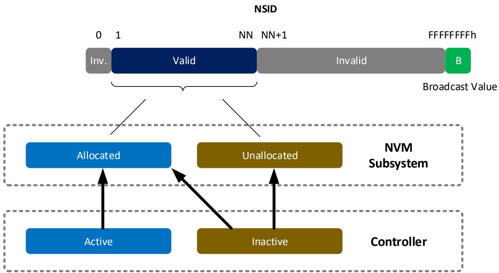

# NSID and Namespace Usage

If Namespace Management (refer to section 8.1.15), ANA Reporting (refer to section 8.1.1), or NVM Sets (refer to section 3.2.2) capabilities are supported, then NSIDs shall be unique within the NVM subsystem (e.g., NSID of 3 shall refer to the same physical namespace regardless of the accessing controller). If the Namespace Management, ANA Reporting, and NVM Sets capabilities are not supported, then NSIDs: 

a) for shared namespaces shall be unique within the NVM subsystem; and 

b) for private namespaces are not required to be unique within the NVM subsystem. 

The Identify command (refer to section 5.1.13) may be used to determine the active NSIDs for a controller and the allocated NSIDs in the NVM subsystem. 

If the MNAN field (refer to Figure 312) is cleared to 0h, then the maximum number of allocated NSIDs is the same as the value reported in the NN field (refer to Figure 312). If the MNAN field is non-zero, then the maximum number of allocated NSIDs may be less than the number of namespaces (e.g., an NVM subsystem may support a maximum valid NSID value (i.e., the NN field) set to 1,000,000 but support a maximum of 10 allocated NSID values). 

To determine the active NSIDs for a particular controller, the host may follow either of the following methods: 

1. Issue an Identify command with the CNS field cleared to 0h for each valid NSID (based on the Number of Namespaces value (i.e., MNAM field or NN field) in the Identify Controller data structure). If a non-zero data structure is returned for a particular NSID, then that is an active NSID; or 

2. Issue an Identify command with a CNS field set to 2h to retrieve a list of up to 1,024 active NSIDs. If there are more than 1,024 active NSIDs, continue to issue Identify commands with a CNS field set to 2h until all active NSIDs are retrieved. 

To determine the allocated NSIDs in the NVM subsystem, the host may issue an Identify command with the CNS field set to 10h to retrieve a list of up to 1,024 allocated NSIDs. If there are more than 1,024 allocated NSIDs, continue to issue Identify commands with a CNS field set to 10h until all allocated NSIDs are retrieved. 

Namespace IDs may change across power off conditions. However, it is recommended that namespace IDs remain static across power off conditions to avoid issues with host software. To determine if the same namespace has been encountered, the host may use the: 

a) UUID field in the Namespace Identification Descriptor (refer to Figure 315), if present; 

b) NGUID field in the Identify Namespace data (refer to the applicable I/O Command Set specification) or in the Namespace Identification Descriptor, if present; or 

c) EUI64 field in the Identify Namespace data or in the Namespace Identification Descriptor, if present. 

UIDREUSE bit in the NSFEAT field (refer to Figure 319 or the Identify Namespace data structure in the NVM Command Set Specification, if applicable) indicates NGUID and EUI64 reuse characteristics. 

If Asymmetric Namespace Access Reporting is supported (i.e., the Asymmetric Namespace Access Reporting Support (ANARS) bit is set to ‘1’ in the CMIC field in the Identify Controller data structure (refer to Figure 312)), refer to the applicable I/O Command Set specification for additional detail, if any. 

A namespace may or may not have a relationship to a Submission Queue; this relationship is determined by the host software implementation. The controller shall support access to any attached namespace from any I/O Submission Queue. 

# I/O Command Set Associations

A namespace is associated with exactly one I/O Command Set. For I/O commands and I/O Command Set specific Admin commands, the I/O Command Set with which a submission queue entry is associated is determined by the Namespace Identifier (NSID) field in the command. 

An NVM subsystem may contain namespaces each of which is associated with a different I/O Command Set. A controller may support attached namespaces that use any of the I/O Command Sets that the controller simultaneously supports as indicated in the I/O Command Set Profile (refer to section 5.1.25.1.17). 

# NVM Sets

An NVM Set is a collection of NVM that is separate (logically and potentially physically) from NVM in other NVM Sets. One or more namespaces that contain formatted storage may be created within an NVM Set and those namespaces inherit the attributes of the NVM Set. A namespace that contains formatted storage is wholly contained within a single NVM Set and shall not span more than one NVM Set. 

Figure 67 shows an example of three NVM Sets. NVM Set A contains three namespaces (NS A1, NS A2, and NS A3). NVM Set B contains two namespaces (NS B1 and NS B2). NVM Set C contains one namespace (NS C1). Each NVM Set shown also contains ‘Unallocated’ regions that consist of NVM that is not yet allocated to a namespace. 

Figure 67: NVM Sets and Associated Namespaces

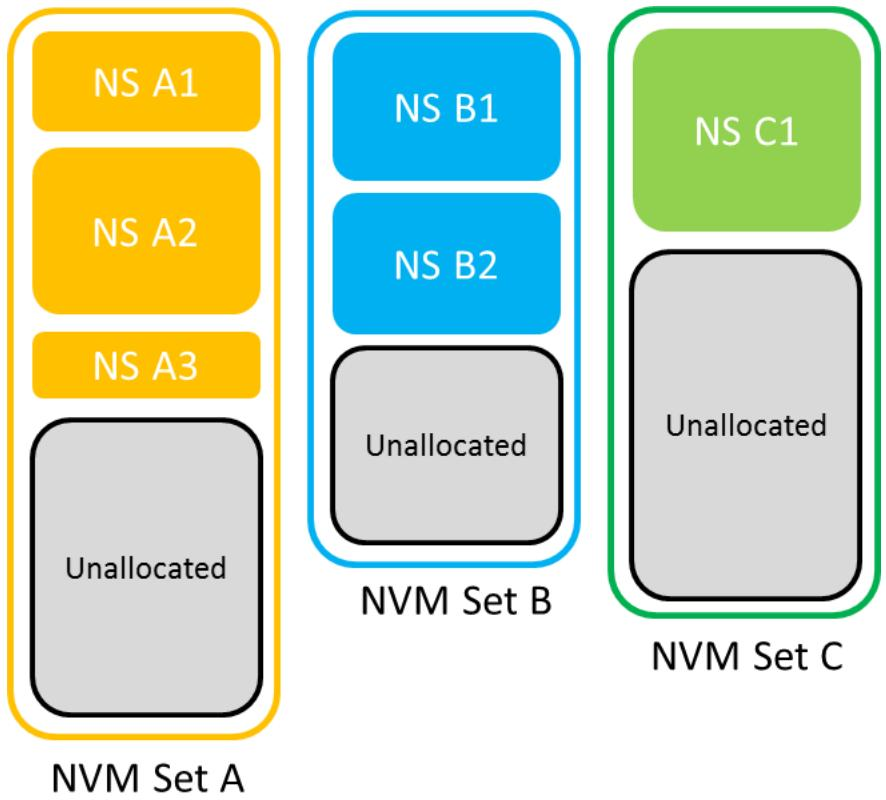

There is a subset of Admin commands that are NVM Set aware as described in Figure 68. 

Figure 68: NVM Set Aware Admin Commands

<table><tr><td>Admin Command</td><td>Details</td></tr><tr><td>Identify</td><td>·The Identify Namespace data structure includes the associated NVM Set Identifier.
·The NVM Set List data structure includes attributes for each NVM Set.</td></tr><tr><td>Capacity Management</td><td>·The Create NVM Set action returns the NVM Set Identifier of the NVM Set that is created.
·The Delete NVM Set action includes the NVM Set Identifier of the NVM Set that is to be deleted.</td></tr><tr><td>Namespace Management</td><td>·The create action includes the NVM Set Identifier as a host specified field.</td></tr><tr><td>Get Features and Set Features</td><td>·The Read Recovery Level Feature specifies the associated NVM Set Identifier.
·The Predictable Latency Mode Config Feature specifies the associated NVM Set Identifier.
·The Predictable Latency Mode Window Feature specifies the associated NVM Set Identifier.</td></tr><tr><td>Connect</td><td>·The Connect command includes the associated NVM Set Identifier.</td></tr><tr><td>Create I/O Submission Queue</td><td>·The Create I/O Submission Queue command includes the associated NVM Set Identifier.</td></tr><tr><td>Get Log Page</td><td>·The Predictable Latency Per NVM Set log page specifies the associated NVM Set Identifier.</td></tr></table>

The host determines the NVM Sets present and their attributes using the Identify command with CNS value of 04h to retrieve the NVM Set List (refer to Figure 317). For each NVM Set, the attributes include: 

an identifier associated with the NVM Set; 

• the optimal size for writes to the NVM Set; 

• the total capacity of the NVM Set; and 

• the unallocated capacity for the NVM Set. 

An NVM Set Identifier is a 16-bit value that specifies the NVM Set with which an action is associated. An NVM Set Identifier is unique with the NVM subsystem. An NVM Set Identifier may be specified in NVM Set aware Admin commands (refer to Figure 68). An NVM Set Identifier value of 0h is reserved and is not a valid NVM Set Identifier. Unless otherwise specified, if the host specifies an NVM Set Identifier cleared to 0h for a command that requires an NVM Set Identifier, then that command shall abort with a status code of Invalid Field in Command. 

Each NVM Set is associated with exactly one Endurance Group (refer to section 3.2.3). 

The NVM Set with which a namespace that contains formatted storage is associated is reported in the Identify Namespace data structure (refer to the applicable NVMe I/O Command Set specification). When a host creates a namespace that contains formatted storage using the Namespace Management command, the host specifies the NVM Set Identifier of the NVM Set that the namespace is to be created in. The namespace that is created inherits attributes from the NVM Set (e.g., the optimal write size to the NVM). 

If NVM Sets are supported, then all controllers in the NVM subsystem shall: 

Indicate support for NVM Sets in the Controller Attributes field in the Identify Controller data structure; 

Support the NVM Set Identifier in all commands that use the NVM Set Identifier; 

• Support the NVM Set List for the Identify command; 

Indicate the NVM Set Identifier with which any namespace that contains formatted storage is associated in the Identify Namespace data structure for that namespace; 

• Support Endurance Groups; and 

• For each NVM Set, indicate the associated Endurance Group as an attribute. 

If support for NVM Sets is not reported (i.e., the NVM Sets bit is cleared to $\scriptstyle { \mathrm { ' 0 ' } }$ in the CTRATT field; refer to Figure 312), then the NVM Set Identifier field shall be cleared to 0h in all commands and data structures that support an NVM Set Identifier field. 

# Endurance Groups

Endurance may be managed within a single NVM Set (refer to section 3.2.2) or across a collection of NVM Sets. Each NVM Set is associated with an Endurance Group (refer to Figure 317). If two or more NVM Sets have the same Endurance Group Identifier, then endurance is managed by the NVM subsystem across that collection of NVM Sets. If only one NVM Set is associated with a specific Endurance Group Identifier, then endurance is managed locally to that NVM Set. 

If NVM Sets are not supported, then endurance is managed by the NVM subsystem: 

within each Endurance Group if Endurance Groups are supported; or 

within the domain if Endurance Groups are not supported. 

An Endurance Group shall be part of only one domain (refer to section 3.2.5). 

An Endurance Group Identifier is a 16-bit value that specifies the Endurance Group with which an action is associated. An Endurance Group Identifier is unique within the NVM subsystem. An Endurance Group Identifier value of 0h is reserved and is not a valid Endurance Group Identifier. Unless otherwise specified, if the host specifies an Endurance Group Identifier cleared to 0h for a command that requires an Endurance Group Identifier, then that command shall abort with a status code of Invalid Field in Command. 

The information that describes an Endurance Group is indicated in the Endurance Group Information log page (refer to section 5.1.12.1.10). 

Figure 69 shows Endurance Groups added to the example in Figure 67. In this example, the endurance of NVM Set A and NVM Set B are managed together as part of Endurance Group Y, while the endurance of NVM Set C is managed only within NVM Set C which is the only NVM Set that is part of Endurance Group Z. 

Figure 69: NVM Sets and Associated Namespaces

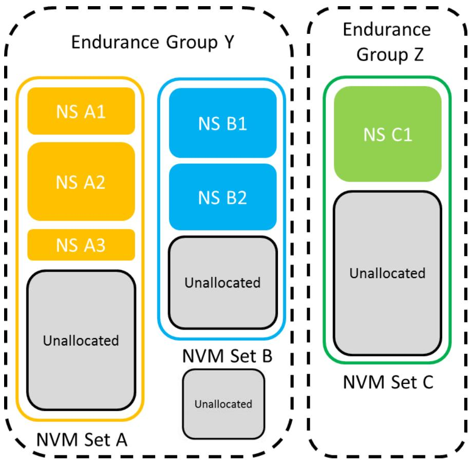

If Endurance Groups are supported, then the NVM subsystem and all controllers shall: 

indicate support for Endurance Groups in the Controller Attributes field in the Identify Controller data structure; 

indicate the Endurance Group Identifier with which the namespace is associated in the Identify Namespace data structure; 

• support the Endurance Group Information log page; and 

support the Endurance Group Event Aggregate log page if more than one Endurance Group is supported in the NVM subsystem. 

If Endurance Groups are not supported and the host sends a command in which an Endurance Group Identifier field is defined (e.g., Get Log Page), then that field shall be ignored by the controller. 

If Endurance Groups are not supported and the controller returns information to the host that contains an Endurance Group Identifier field, then that field shall be cleared to 0h. 

# Configuring and Managing Endurance Group Events

The host may configure asynchronous events to be triggered when certain events occur for an Endurance Group. The host submits a Set Features command specifying the Endurance Group Event Configuration feature (refer to section 5.1.25.1.16), the Endurance Group, and the specific event(s) that shall trigger adding an entry to the Endurance Group Event Aggregate log page (refer to section 5.1.12.1.15). 

The host configures events using a Set Features command for each Endurance Group. 

The host submits a Set Features command specifying the Asynchronous Event Configuration feature (refer to section 5.1.25.1.5) with the Endurance Group Event Aggregate Log Change Notices bit set to ‘1’ to specify that adding an entry to the Endurance Group Event Aggregate log page shall trigger an Endurance Group Event Aggregate Log Page Change Notice event to the host (refer to Figure 409). 

The host determines the Endurance Groups that have outstanding events by reading the Endurance Group Event Aggregate log page. An entry is returned for each Endurance Group that has an event outstanding. The host may use the Endurance Group Identifier Maximum value reported in the Identify Controller data structure to determine the maximum size of this log page. 

To determine the specific event(s) that have occurred for a reported Endurance Group, the host reads the Endurance Group Information log page (refer to Figure 218) for that Endurance Group. The Critical Warning field indicates the event(s) that have occurred (e.g., that all namespaces in the Endurance Group have been placed in read-only mode). All events for an Endurance Group are cleared if the controller successfully processes a read for the Endurance Group Information log page for that Endurance Group, where the Get Log Page command has the Retain Asynchronous Event bit cleared to $\scriptstyle { \mathrm { ~ \displaystyle ~ } } ^ { \prime } 0 ^ { \prime }$ . If the Critical Warning field in the Endurance Group Information log page is cleared to 0h, then events for that Endurance Group are not reported in the Endurance Group Event Aggregate log page. 

# Reclaim Groups, Reclaim Unit Handles, and Reclaim Units

If Flexible Data Placement is enabled in an Endurance Group (refer to section 5.1.25.1.20), then the logical view of the non-volatile storage capacity in that Endurance Group is shown in Figure 70 and consists of: 

a set of one or more Reclaim Groups numbered from 0 to $P - 1$ where $P$ is the value of the Number of Reclaim Groups field in the FDP Configuration Descriptor (refer to Figure 280). A Reclaim Group consists of one or more Reclaim Units; and 

one or more Reclaim Unit Handles numbered from 0 to N -1 where N is the value of the Number of Reclaim Unit Handles field in the FDP Configuration Descriptor (refer to Figure 280). 

A Reclaim Unit Handle consists of a reference to a Reclaim Unit in each Reclaim Group where user data from a write command is placed. A Reclaim Unit referenced by the Reclaim Unit Handle is only allowed to be referenced by at most one Reclaim Unit Handle. However, a specific Reclaim Unit is referenced by the same or different Reclaim Unit Handles as the Reclaim Unit is cycled from erased and back into use. When a Reclaim Unit is written to capacity, the controller updates that Reclaim Unit Handle to reference a different Reclaim Unit that is available for writing user data (e.g., non-volatile storage media that has been erased which is required prior to writing for program in place memories) and has not been written with any user data (i.e., an empty Reclaim Unit). Refer to section 8.1.10 for the details of how a host is able to issue a write command and place the user data into a Reclaim Unit. 

Figure 70: Flexible Data Placement Logical View of Non-Volatile Storage

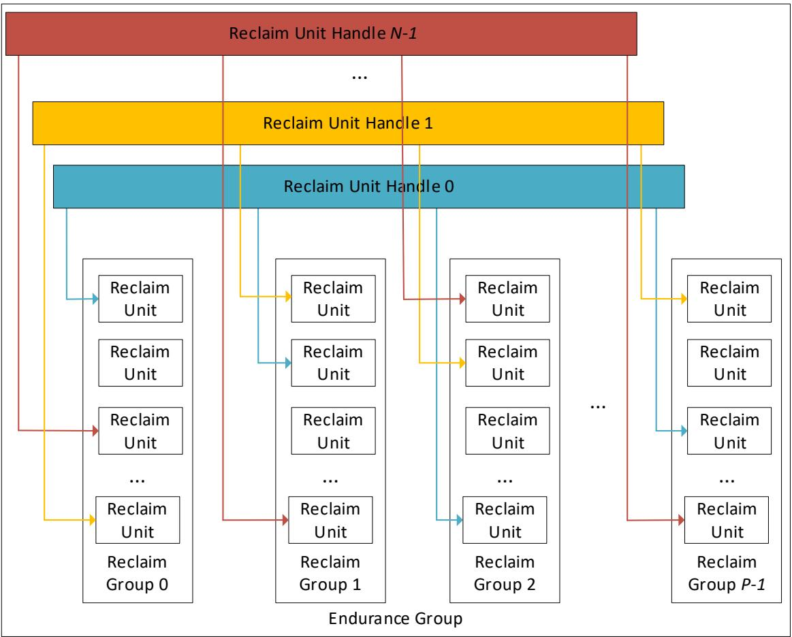

# Domains and Divisions

# Overview

An NVM subsystem may be made up of a single domain or multiple domains (i.e., two or more). A domain is the smallest indivisible unit that shares state (e.g., power state, capacity information). An NVM subsystem that supports multiple domains shall support Asymmetric Namespace Access Reporting (refer to section 8.1.1). 

A common example of a simple implementation of an NVM subsystem is one that consists of a single domain (i.e., multiple domains are not supported). 

Each domain is independent, and the boundaries between domains are communication boundaries (e.g., fault boundaries, management boundaries). If multiple domains are present in an NVM subsystem, then those domains cooperate in the operation of that NVM subsystem. If a domain is unable to cooperate in the operation of the NVM subsystem, then the NVM subsystem has become divided. 

A division is an event (e.g., failure of a domain) or action (e.g., management action or reconfiguration) within the NVM subsystem that affects communication between the domains contained in the NVM subsystem (refer to Figure 71 and Figure 72). If a division exists, global state within the NVM subsystem may be impacted (e.g., a controller may only have information about the state of the domains with which the controller is able to communicate). A division event or action may: 

affect access to namespaces (refer to section 8.1.1); or 

impact operations that have NVM subsystem scope (e.g., TNVMCAP, sanitize, format, SMART information). 

# A domain is comprised of:

• zero or more controllers; and 

• zero or more NVM Endurance Groups. 

If an NVM subsystem supports multiple domains, then all controllers in that NVM subsystem shall: 

set the MDS bit to ‘1’ in the CTRATT field in the Identify Controller data structure (refer to Figure 312); 

set the Domain Identifier in each Endurance Group descriptor, if supported, to a non-zero value; and 

• set the Domain Identifier in each Identify Controller data structure to a non-zero value. 

If an NVM subsystem supports multiple domains, then controllers in that NVM subsystem may: 

support Endurance Groups (refer to Endurance Groups bit in the CTRATT field of Identify Controller data structure). 

For an NVM subsystem that supports multiple domains, each domain shall be assigned a domain identifier that is unique within the NVM subsystem (refer to the Domain Identifier field in Figure 312 and section 3.2.5.3). For an NVM subsystem that does not support multiple domains, Domain Identifier fields are cleared to 0h. 

Figure 71 shows an example of an NVM subsystem that consists of three domains. Domain 1 contains two controllers and some amount of NVM storage capacity which has been allocated to two private namespaces (i.e., NS A and NS C) and a shared namespace (i.e., NS B). Domain 2 contains two controllers and some amount of NVM storage capacity which has been allocated to two shared namespaces (i.e., NS D and NS E). Domain 3 contains one controller, and no NVM storage capacity. 

Figure 71: Example 1 Domain Structure

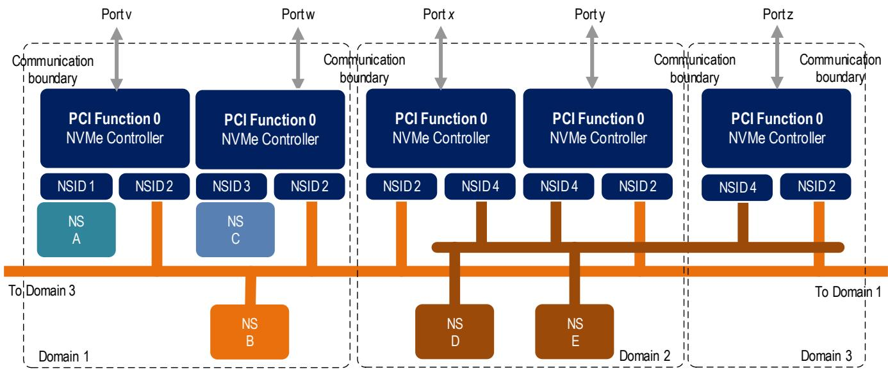

If, in the example shown in Figure 71, a division event occurs that results in Domain 1 no longer being able to communicate with Domain 2 and Domain 3, then the NVM subsystem would consist of two parts. The first part consists of Domain 1 and the second part consists of Domain 2 and Domain 3. 

Figure 72 shows an example of an NVM subsystem that consists of six domains, of which, three are domains that contain controllers. Domain 1 is a domain that contains two controllers and some amount of NVM storage capacity from which NVM Endurance Groups have been created that contain a private namespace (i.e., NS A) and a shared namespace (i.e., NS C). Domain 2 is a domain that contains no controllers and contains some amount of NVM storage capacity from which NVM Endurance Groups have been created that contain a shared namespace (i.e., NS B). Domain 3 is a domain that contains two 

controllers and no NVM storage capacity. Domain 4 is a domain that contains no controllers and contains some amount of NVM storage capacity from which NVM Endurance Groups have been created that contain two shared namespaces (i.e., NS D and NS E). Domain 5 is a domain that contains one controller and no NVM storage capacity. Domain 6 is a domain that contains no controllers and no NVM storage capacity allocated to an NVM Endurance Group (i.e., an empty domain). 

Figure 72: Example 2 Domain Structure

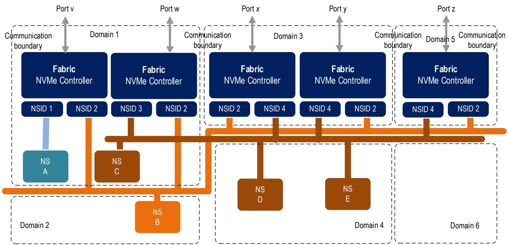

Key: ---- (Dashed Line)- Communication Boundary

# Domains and Reservations

If an NVM subsystem supports multiple domains and Persistent Reservations (refer to section 8.1.22), then resumption after a division event (e.g., resumption of operation, resumption of communication) requires that all persistent reservation state within the domains in the NVM subsystem that are no longer divided be synchronized (i.e., updated). 

If the reservation state for a namespace is not synchronized, then the ANA Group that contains that namespace shall transition to the ANA Inaccessible state (refer to section 8.1.1.6) and remain in that state until the Persistent Reservation state is synchronized. If the Persistent Reservation state is not able to be synchronized, then: 

a transition to the ANA Persistent Loss state occurs and commands are processed as described in section 8.1.1.7; or 

the controller may stop processing commands and set the Controller Fatal Status (CSTS.CFS) bit to ‘1’ (refer to section 9.5). 

# Domain Identifier Use (Informative)

Domain Identifier values indicate the parts of the NVM subsystem that comprise a domain. 

The host may use these values to determine which Endurance Groups (refer to section 3.2.3) are contained in the same domain and which are contained in a different domain. Examples of host use of the domain identifier include: 

host data redundancy software (e.g., RAID) that may use the Endurance Group’s Domain Identifier to determine which Endurance Groups may fail together (e.g., Endurance Groups in the same domain) and which Endurance Groups may fail independently (e.g., Endurance Groups in different domains); and 

host application software may use the controller’s Domain Identifier to determine which controllers share domains (e.g., controllers that may fail together) and which controllers are a part of different domains (e.g., controllers that may fail independently). 

# 3.3 NVM Queue Models

The NVM Express interface is based on a paired Submission and Completion Queue mechanism. Commands are placed by host software into a Submission Queue. Completions are placed into the associated Completion Queue by the controller. When using a memory-based transport queue model (refer to section 3.3.1), multiple Submission Queues may utilize the same Completion Queue. When using a message-based transport queue model (refer to section 3.3.2) each Submission Queue maps to a single Completion Queue. 

# Memory-based Transport Queue Model (PCIe)

# Queue Setup and Initialization

To setup and initialize I/O Submission Queues and I/O Completion Queues for use, host software follows these steps: 

1. Configures the Admin Submission Queue and the Admin Completion Queues by initializing the Admin Queue Attributes (AQA), Admin Submission Queue Base Address (ASQ), and Admin Completion Queue Base Address (ACQ) properties appropriately; 

2. Configures the size of the I/O Submission Queues (CC.IOSQES) and I/O Completion Queues (CC.IOCQES); 

3. Submits a Set Features command with the Number of Queues attribute set to the requested number of I/O Submission Queues and I/O Completion Queues. The completion queue entry for this Set Features command indicates the number of I/O Submission Queues and I/O Completion Queues allocated by the controller; 

4. Determines the maximum number of entries supported per queue (CAP.MQES) and whether the queues are required to be physically contiguous (CAP.CQR); 

5. Creates I/O Completion Queues within the limitations of the number allocated by the controller and the queue attributes supported (maximum entries and physically contiguous requirements) by using the Create I/O Completion Queue command; and 

6. Creates I/O Submission Queues within the limitations of the number allocated by the controller and the queue attributes supported (maximum entries and physically contiguous requirements) by using the Create I/O Submission Queue command. 

At the end of this process, I/O Submission Queues and I/O Completion Queues have been setup and initialized and may be used to complete I/O commands. 

# Queue Usage

The submitter of entries to a memory-based transport queue uses the current Tail entry pointer to identify the next open queue slot. The submitter increments the Tail entry pointer after placing the new entry to the open queue slot. If the Tail entry pointer increment exceeds the queue size, the Tail entry shall roll to zero. The submitter may continue to place entries in free queue slots as long as the Full queue condition is not met (refer to section 3.3.1.5). 

Note: The submitter shall take queue wrap conditions into account. 

The consumer of entries on a memory-based transport queue uses the current Head entry pointer to identify the slot containing the next entry to be consumed. The consumer increments the Head entry pointer after consuming the next entry from the queue. If the Head entry pointer increment exceeds the queue size, the Head entry pointer shall roll to zero. The consumer may continue to consume entries from the queue as long as the Empty queue condition is not met (refer to section 3.3.1.4). 

Note: The consumer shall take queue wrap conditions into account. 

Creation and deletion of memory-based transport Submission Queue and associated Completion Queues are required to be ordered correctly by host software. Host software creates the Completion Queue before creating any associated Submission Queue. Submission Queues may be created at any time after the associated Completion Queue is created. Host software deletes all associated Submission Queues prior to deleting a Completion Queue. To abort all commands submitted to the Submission Queue host software issues a Delete I/O Submission Queue command for that queue (refer to section 3.3.1.3). 

Host software writes the Submission Queue Tail Doorbell and the Completion Queue Head Doorbell (refer to the Transport Specific Controller Properties section in the NVMe over PCIe Transport Specification) to communicate new values of the corresponding entry pointers to the controller. If host software writes an invalid value to the Submission Queue Tail Doorbell or Completion Queue Head Doorbell property and an Asynchronous Event Request command is outstanding, then an asynchronous event is posted to the Admin Completion Queue with a status code of Invalid Doorbell Write Value. The associated queue is then deleted and recreated by host software. For a Submission Queue that experiences this error, the controller may complete previously consumed commands; no additional commands are consumed. This condition may be caused by host software attempting to add an entry to a full Submission Queue or remove an entry from an empty Completion Queue. 

Host software checks completion queue entry Phase Tag (P) bits in memory to determine whether new completion queue entries have been posted (refer to section 4.2.4). The Completion Queue Tail pointer is only used internally by the controller and is not visible to the host. The controller uses the SQ Head Pointer (SQHD) field in completion queue entries to communicate new values of the Submission Queue Head Pointer to the host. A new SQHD value indicates that submission queue entries have been consumed, but does not indicate either execution or completion of any command. Refer to section 4.2. 

A submission queue entry is submitted to the controller when the host writes the associated Submission Queue Tail Doorbell with a new value that indicates that the Submission Queue Tail Pointer has moved to or past the slot in which that submission queue entry was placed. A Submission Queue Tail Doorbell write may indicate that one or more submission queue entries have been submitted. 

A submission queue entry has been consumed by the controller when a completion queue entry is posted that indicates that the Submission Queue Head Pointer has moved past the slot in which that submission queue entry was placed. A completion queue entry may indicate that one or more submission queue entries have been consumed. 

A completion queue entry is posted to the Completion Queue when the controller write of that completion queue entry to the next free Completion Queue slot inverts the Phase Tag (P) bit from its previous value in memory (refer to section 4.2.4). The controller may generate an interrupt to the host to indicate that one or more completion queue entries have been posted. 

A completion queue entry has been consumed by the host when the host writes the associated Completion Queue Head Doorbell with a new value that indicates that the Completion Queue Head Pointer has moved past the slot in which that completion queue entry was placed. A Completion Queue Head Doorbell write may indicate that one or more completion queue entries have been consumed. 

Once a submission queue entry or a completion queue entry has been consumed, the slot in which it was placed is free and available for reuse. Altering a submission queue entry after that entry has been submitted but before that entry has been consumed results in undefined behavior. Altering a completion queue entry after that entry has been posted but before that entry has been consumed results in undefined behavior. 

# 3.3.1.2.1 Completion Queue Flow Control

If there are no free slots in a Completion Queue, then the controller shall not post status to that Completion Queue until slots become available. In this case, the controller may stop processing additional submission queue entries associated with the affected Completion Queue until slots become available. The controller shall continue processing for other Submission Queues not associated with the affected Completion Queue. 

# Queue Abort

To abort a large number of commands, the host may use: 

• the Cancel command (refer to section 7.1); or 

• delete and recreate the I/O Submission Queue (refer to section 3.7.3). 

Specifically, to abort all commands that are submitted to an I/O Submission Queue, host software should: 

issue a Cancel command to that queue with the Cancel Action set to Multiple Command Cancel and the NSID field set to FFFFFFFFh; or 

• issue a Delete I/O Submission Queue command for that queue. After that submission queue has been successfully deleted, indicating that all commands have been completed or aborted, then host software should recreate the queue by submitting a Create I/O Submission Queue command. Host software may then re-submit commands to the associated I/O Submission Queue. 

If the host is no longer able to communicate with the controller before that host receives either: 

completions for all outstanding commands submitted on that I/O Submission Queue (refer to section 3.4.5); or 

a successful completion for the Delete I/O Submission Queue command for that I/O Submission Queue, 

then it is strongly recommended that the host take the steps described in section 9.6 to avoid possible data corruption caused by interaction between outstanding commands and subsequent commands submitted by that host to another controller. 

# Empty Queue

The queue is Empty when the Head entry pointer equals the Tail entry pointer. Figure 73 defines the Empty Queue condition. 

Figure 73: Empty Queue Definition

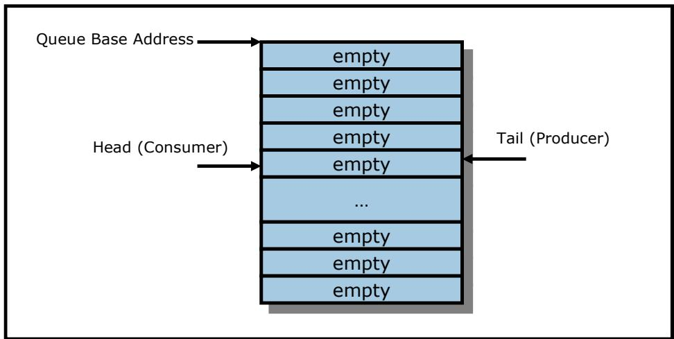

# Full Queue

The queue is Full when the Head equals one more than the Tail. The number of entries in a queue when full is one less than the queue size. Figure 74 defines the Full Queue condition. 

Note: Queue wrap conditions shall be taken into account when determining whether a queue is Full. 

Figure 74: Full Queue Definition

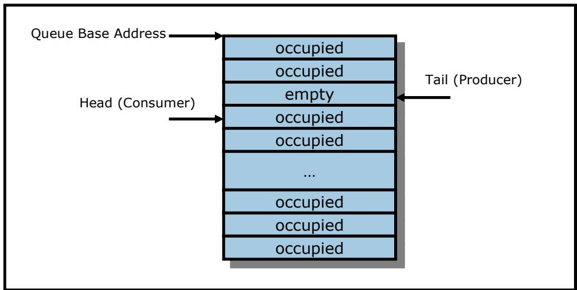

# Message-based Transport Queue Model (Fabrics)

For NVMe over Fabrics, a queue is a unidirectional communication channel that is used to send capsules between a host and a controller. A host uses Submission Queues to send command capsules (refer to section 3.3.2.1.1) to a controller. A controller uses Completion Queues to send response capsules (refer to section 3.3.2.1.2) to a host. Submission and Completion Queues are created in pairs using the Connect command (refer to section 3.3.2.2). 

The NVMe Transport is responsible for delivering command capsules to the controller and notifying the controller of capsule arrival in a transport-specific fashion. 

Altering a command capsule between host submission to the Submission Queue and transport delivery of that capsule to the controller results in undefined behavior. 

NVMe Transports are not required to provide any additional end-to-end flow control. Specific NVMe Transports may require low level flow control for congestion avoidance and reliability; any such additional NVMe Transport flow control is outside the scope of this specification. 

Flow control differs for Submission Queues (refer to section 3.3.2.1.1, section 3.3.2.6, and section 3.3.2.7) and Completion Queues (refer to section 3.3.2.1.2, section 3.3.2.8, and section 3.3.1.2.1). 

# Capsules and Data Transfers

This section describes capsules and data transfer mechanisms necessary to support message-based transport queues. These mechanisms are used for Fabrics commands, Admin commands, and I/O commands when using the message-based transport queue model. 

A capsule is an NVMe unit of information exchanged between a host and a controller. A capsule may contain commands, responses, SGLs, and/or data. The data may include user data (e.g., logical block data and metadata that is transferred as a contiguous part of the logical block) and data structures associated with the command. 

The capsule size for the Admin Queue commands and responses is fixed and defined in the NVMe Transport binding specification. The controller indicates in the Identify Controller data structure the capsule command and response sizes that the host shall use with I/O commands. 

The controller shall support SGL based data transfers for commands on both the Admin Queue and I/O Queues. Data may be transferred within the capsule or through memory transactions based on the underlying NVMe Transport as indicated in the SGL descriptors associated with the command capsule. The SGL types supported by an NVMe Transport are specified in the NVMe Transport binding specification. 

The value of unused and not reserved capsule fields (e.g., the capsule is larger than the command / response and associated data) is undefined and shall not be interpreted by the recipient. 

# 3.3.2.1.1 Command Capsules

A command capsule is sent from a host to a controller. It contains a submission queue entry (SQE) and may optionally contain data or SGLs. The SQE is 64 bytes in size and contains the Admin command, I/O command, or Fabrics command to be executed. 

Figure 75: Command Capsule

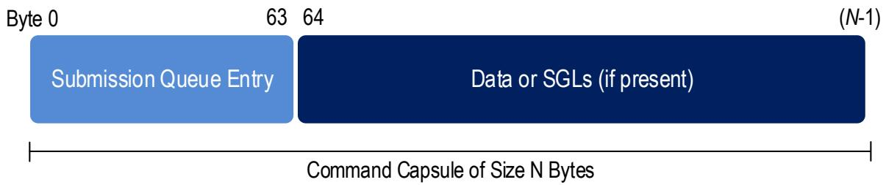

The Command Identifier field in the SQE shall be unique among all outstanding commands associated with that queue. If there is data or additional SGLs to be transferred within the capsule, then the SGL descriptor in the SQE contains a Data Block, Segment Descriptor, or Last Segment Descriptor specifying an appropriate Offset address. The definition for the submission queue entry when the command is a Fabrics command is shown in section 4.1.2. The definition for the submission queue entry when the command is an Admin command or I/O command is shown in section 4.1.1. Bytes 03:00 share a common format across commands. 

# 3.3.2.1.2 Response Capsules

A response capsule is sent from the NVM subsystem to the host. It contains a completion queue entry (CQE) and may optionally contain data. The CQE is the completion queue entry associated with a previously issued command capsule. 

If a command requests data and the SGL in the associated command capsule specifies a Data Block descriptor with an Offset, the data is included in the response capsule. If the SGL(s) in the command capsule specify a region in host memory, then data is transferred via memory transactions. 

Figure 76: Response Capsule

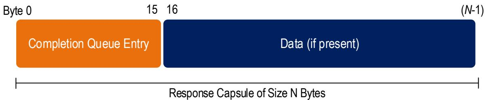

The completion queue entry is 16 bytes in size and contains a two byte status field. 

The definition for the completion queue entry for a Fabrics command is shown in section 4.2.2. The definition for the completion queue entry when the command is an Admin command or I/O command is defined in section 4.2.1, where the SQ Identifier and Phase Tag fields are reserved because they are not used in NVMe over Fabrics. Use of the SQHD field depends on whether SQ flow control is disabled for the queue pair, refer to section 6.3. 

# 3.3.2.1.3 Data Transfers

Data may be transferred within capsules or by memory transfers. SGLs are used to specify the location of data. Metadata, if transferred, is a contiguous part of the user data with which that metadata is associated. The SGL descriptor(s) (refer to section 4.3.2) specify whether the command’s data is transferred through memory or within the capsule. The capsule may contain either SGLs or data (not a mixture of both) following 

the SQE. If additional SGLs are required, then the SGLs are included in the capsule immediately after the SQE. If an invalid offset is specified in an SGL descriptor, then a status code of SGL Offset Invalid shall be returned. 

SGLs shall be supported within a capsule. The NVMe Transport binding specification defines the SGL Descriptor Types and Sub Types that are supported for the corresponding NVMe Transport. The NVMe Transport binding specification also specifies if SGLs may be supported in host memory. 

# Data and SGL Locations within a Command Capsule

The submission queue entry within the command capsule includes one SGL entry. If there are additional SGL entries to be transferred in the command capsule, then those entries shall be contiguous and located immediately after the submission queue entry. 

An NVMe Transport binding specification defines the support for data as part of the command capsule. The controller indicates the starting location of data within a command capsule via the In Capsule Data Offset (ICDOFF) field in the Identify Controller data structure. 

There are restrictions for SGLs that the host should follow: 

if the ICDOFF field is a non-zero value, then all SGL descriptors following the submission queue entry shall not have a total size greater than (ICDOFF * 16); 

if the SGL descriptors following the submission queue entry have a total size greater than (ICDOFF * 16), then the controller shall abort the command with a status code of Invalid Number of SGL Descriptors; 

the host shall not place more SGL Data Block or Keyed SGL Data Block descriptors within a capsule than the maximum indicated in the Identify Controller data structure; and 

if the host places more SGL Data Block of Keyed SGL Data Block descriptors in a capsule than the maximum indicated in the Maximum SGL Data Block Descriptors field in the Identify Controller data structure, then the controller shall abort the command with a status code of Invalid Number of SGL Descriptors. 

The host shall start data (if present) in command capsules at byte offset (ICDOFF * 16) from the end of the submission queue entry. 

Figure 77: Data and SGL Locations within a Command Capsule

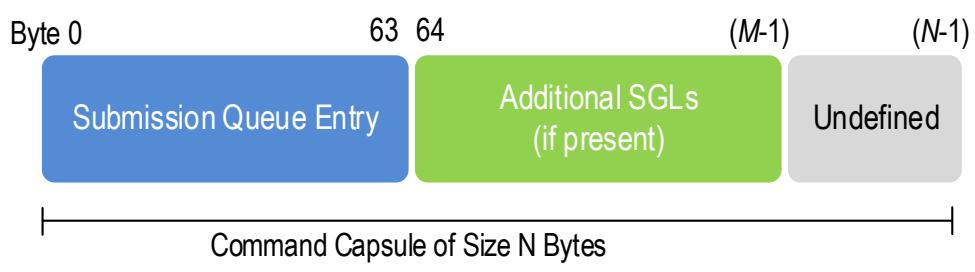

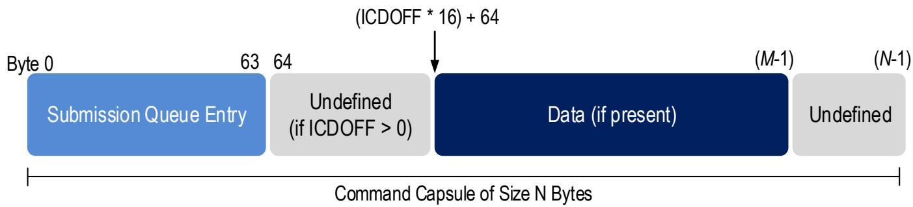

# Data Transfer Examples

The data transfer examples in Figure 78 and Figure 79 show SGL examples for a Write command where data is transferred via a memory transaction or within the capsule. The SGL may use a key as part of the data transfer depending on the requirements of the NVMe Transport used. 

The first example shows an 8KiB write where all of the data is transferred via memory transactions. In this case, there is one SGL descriptor that is contained within the submission queue entry at CMD.SGL1. The SGL descriptor is a Keyed SGL Data Block descriptor. If more SGLs are required to complete the command, the additional SGLs are contained in the command capsule. 

Figure 78: SGL Example Using Memory Transactions

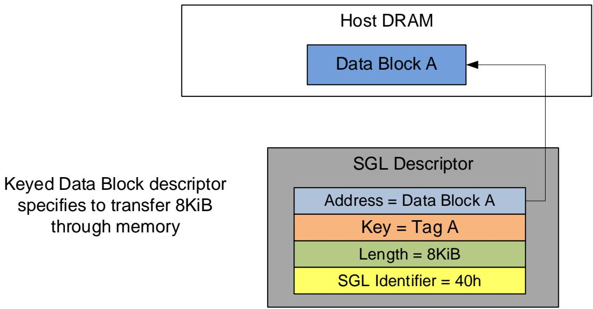

The second example shows an 8KiB write where all of the data is transferred within the capsule. In this case, the SGL descriptor is an SGL Data Block descriptor specifying an Offset of 20h based on an ICDOFF value of 2h. 

Figure 79: SGL Example Using In Capsule Data Transfer

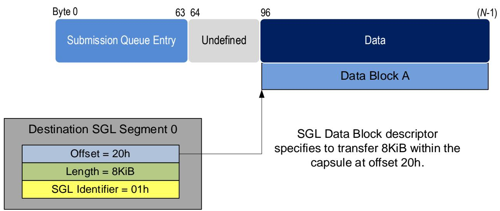

# Queue Creation

Message-based controllers use the Connect command (refer to section 6.3) to create Admin Queues or I/O Queues. The creation of an Admin Queue establishes an association between a host and the corresponding controller. The message-based transport queue model does not support the Admin Submission Queue Base Address (ASQ), Admin Completion Queue Base Address (ACQ), and Admin Queue Attributes (AQA) properties as all information necessary to establish an Admin Queue is contained in the Connect command. The message-based transport queue model does not support the Admin commands associated with I/O Queue creation and deletion (i.e., Create I/O Completion Queue, Create I/O Submission Queue, Delete I/O Completion Queue, Delete I/O Submission Queue). 

An NVMe Transport connection is established between a host and an NVM subsystem prior to the transfer of any capsules or data. The mechanism used to establish an NVMe Transport connection is NVMe Transport specific and defined by the corresponding NVMe Transport binding specification. The NVMe Transport may require a separate NVMe Transport connection for each Admin Queue or I/O Queue or may utilize the same NVMe Transport connection for all Admin and I/O Queues associated with a particular controller. An NVMe Transport may also require that NVMe layer information be passed between the host and controller in the process of establishing an NVMe Transport connection (e.g., exchange queue size to appropriately size send and receive buffers). 

The Connect command specifies the Queue ID and type (Admin or I/O), the size of the Submission and Completion Queues, queue attributes, Host NQN, NVM Subsystem NQN, and Host Identifier. The Connect command may specify a particular controller if the NVM subsystem supports a static controller model. The Connect response indicates whether the connection was successfully established as well as whether NVMe in-band authentication is required. 

The Connect command is submitted to the same Admin Queue or I/O Queue that the Connect command creates. The underlying NVMe Transport connection that is used for that queue is created first and the Connect command and response capsules are sent over that NVMe Transport connection. The Connect command shall be sent once to a queue. 

When a Connect command successfully completes, the corresponding Submission and Completion Queues are created. If NVMe in-band authentication is required as indicated in the Connect response, then 

NVMe in-band authentication shall be performed before the queues may be used to perform other Fabrics commands, Admin commands, or I/O commands. 

Once a Connect command for an Admin Queue has completed successfully (and NVMe in-band authentication, if required, has succeeded), only Fabrics commands may be submitted until the controller is ready $( \mathsf { C S T S . R D Y } = 1 _ { . }$ ). Both Fabrics commands and Admin commands may be submitted to the Admin Queue while the controller is ready. A Connect command for an I/O Queue may be submitted after the controller is ready. Once a Connect command for an I/O Queue has completed successfully (and NVMe inband authentication, if required, has succeeded), I/O commands may be submitted to the queue. 

The Connect response contains the controller ID allocated to the host. 

After an Admin Queue is created on a controller, all subsequent Connect commands sent from the same host to that controller, to create an I/O Queue, are required to: 

utilize the same NVMe Transport; 

• have the same Host NQN; 

• have the same NVM Subsystem NQN; and 

either have the: 

o same Host Identifier value; or 

o a Host Identifier value of 0h, if supported (refer to section 5.1.12.3.1). 

# Queue Initialization and Queue State

When a Connect command successfully completes, the corresponding Admin Submission and Completion Queue or I/O Submission and Completion Queues are created. If the host sends a Connect command specifying the Queue ID of a queue which already exists, then the controller shall abort the command with a status code of Command Sequence Error. 

The Authentication Requirements (AUTHREQ) field in the Connect response indicates if NVMe in-band authentication is required. If AUTHREQ is cleared to 0h, the created queue is ready for use after the Connect command completes successfully. If AUTHREQ is set to a non-zero value, the created queue is ready for use after NVMe in-band authentication has been performed successfully using the Authentication Send and Authentication Receive Fabrics commands. 

If a controller requires or is undergoing NVMe in-band authentication for a queue pair, then a controller shall abort all commands received on that queue other than authentication commands with a status code of Authentication Required. After the NVMe in-band authentication has been performed successfully on a queue, then a controller shall abort all authentication commands on that queue with a status code of Command Sequence Error. 

When an Admin Queue is first created, the associated controller is disabled (i.e., CC.EN is initialized to $\scriptstyle { \mathrm { ~ \displaystyle ~ } } ^ { \prime } 0 ^ { \prime }$ ). A disabled controller shall abort all commands other than Fabrics commands on the Admin Queue with a status code of Command Sequence Error. After the controller is enabled, it shall accept all supported Admin commands in addition to Fabrics commands. 

A created I/O queue shall abort all commands with a status code of Command Sequence Error if the associated controller is disabled. 

# I/O Queue Deletion

NVMe over Fabrics deletes an individual I/O Queue and may delete the associated NVMe Transport connection as a result of: 

the exchange of a Disconnect command and response (refer to section 6.4) between a host and controller; or 

• the detection and processing of a transport error on an NVMe Transport connection. 

The host indicates support for the deletion of an individual I/O Queue by setting the Individual I/O Queue Deletion Support (INDIVIOQDELS) bit to ‘1’ in the CATTR field in the Connect command (refer to Figure 545) used to create the Admin Queue. The controller indicates support for the deletion of an individual I/O 

Queue by setting the Disconnect Command Support (DCS) bit to ‘1’ in the OFCS field of the Identify Controller data structure (refer to Figure 312). 

If both the host and the controller support deletion of an individual I/O Queue, then the termination of an individual I/O Queue impacts only that I/O Queue (i.e., the association and all other I/O Queues and their associated NVMe Transport connections are not impacted). If either the host or the controller does not support deletion of an individual I/O Queue, then the deletion of an individual I/O Queue or the termination of an NVMe Transport connection causes the association to be terminated. 

NVMe over Fabrics uses the Disconnect command to delete an Individual I/O Queue. This command is sent on the I/O Submission Queue to be deleted and affects only that I/O Submission Queue and its associated I/O Completion Queue (i.e., other I/O Queues are not affected). To delete an I/O Queue, the NVMe Transport connection for that I/O Queue is used. If all Queues associated with an NVMe Transport connection are deleted, then the NVMe Transport connection may be deleted after completion of the Disconnect command. Actions necessary to delete the NVMe Transport connection are transport specific. The association between the host and the controller is not affected. 

If a Disconnect command returns a status code other than success, the host may delete an I/O Queue using other methods including: 

waiting a vendor specific amount of time and retry the Disconnect command; 

• deleting the NVMe Transport connection (note: this may impact other I/O Queues); 

• performing a Controller Level Reset (note: this impacts other I/O Queues); or 

ending the host to controller association. 

If the transport requires a separate NVMe Transport connection for each Admin and I/O Queue (refer to section 3.3.2.2), then the host should not delete an NVMe Transport connection until after: 

• a Disconnect command has been submitted to the I/O Submission Queue; and 

the response for that Disconnect command has been received by the host on the corresponding I/O Completion Queue or a vendor specific timeout (refer to section 3.9) has occurred while waiting for that response. 

If the transport requires a separate NVMe Transport connection for each Admin and I/O Queue, then the controller should not delete an NVMe Transport connection until after: 

a Disconnect command has been received on the I/O Submission Queue and processed by the controller; 

the responses for commands received by the controller on that I/O Submission Queue prior to receiving the Disconnect command have been sent to the host on the corresponding I/O Completion Queue; and 

the resulting response for that Disconnect command has been sent to the host on the corresponding I/O Completion queue (i.e., this response is the last response sent). It is recommended that the controller delay destroying the NVMe Transport connection to allow time for the Disconnect command response to be received by the host (e.g., a transport specific event occurs or a transport specific time period elapses). 

If the transport utilizes the same NVMe Transport connection for all Admin and I/O Queues associated with a particular controller (refer to section 3.3.2.2), then the deletion of an individual I/O Queue has no impact on the NVMe Transport connection. 

A Disconnect command is the last I/O Submission Queue entry processed by the controller for an I/O Queue. Controller processing of the Disconnect command completes or aborts all commands on the I/O Queue on which the Disconnect command was received. The controller determines whether to complete or abort each of those commands. Until the controller sends a successful completion for a Disconnect command, outstanding commands may continue being processed by the controller. The controller ensures that there is no further processing of any command sent on that I/O Queue after posting the completion queue entry for the Disconnect command as described in section 6.4. 

The response to the Disconnect command is the last I/O Completion Queue entry processed by the host for an I/O Queue. To avoid command aborts, the host should wait for all outstanding commands on an I/O Queue to complete before sending the Disconnect command. 

If the controller terminates an NVMe Transport connection or detects an NVMe Transport connection loss, then the controller shall stop processing all commands received on I/O Queues associated with that NVMe Transport connection within the time reported in the CQT field (refer to Figure 312), if non-zero. 

If the host terminates an NVMe Transport connection or detects an NVMe Transport connection loss before the responses are received for all outstanding commands submitted to the associated I/O Queue (refer to section 3.4.5), then it is strongly recommended that the host take the steps described in section 9.6 to avoid possible data corruption caused by interaction between outstanding commands and subsequent commands submitted by that host to another controller. 

# Submission Queue Flow Control Negotiation

Use of Submission Queue (SQ) flow control is negotiated for each queue pair by the Connect command and the controller response to the Connect command. SQ flow control shall be used unless it is disabled as a result of that negotiation. If SQ flow control is disabled, then the Submission Queue Head Pointer (SQHD) field is reserved in all Fabrics response capsules for that queue pair after the response to the Connect command (i.e., in all subsequent response capsules for that queue pair, the controller shall clear the SQHD field to 0h and the host should ignore the SQHD field). 

If the host requests that SQ flow control be disabled for a queue pair, then the host should size each Submission Queue to support the maximum number of commands that the host could have outstanding at one time for that Submission Queue. 

The maximum size of the Admin Submission Queue is specified in the Admin Max SQ Size (ASQSZ) field of the Discovery Log Page Entry for the NVM subsystem (refer to section 5.1.12.3.1). 

The maximum size of an I/O Submission Queue is specified in the Maximum Queue Entries Supported (MQES) field of the Controller Capabilities (CAP) property for the controller (refer to section 3.1.4.1). 

The value of the Maximum Outstanding Commands (MAXCMD) field in the Identify Controller data structure indicates the maximum number of commands that the controller processes at one time for a particular I/O Queue. The host may use this value to size I/O Submission Queues and optimize the number of commands submitted at one time per queue to achieve the best performance. 

If SQ flow control is disabled, then the host should limit the number of outstanding commands for a queue pair to be less than the size of the Submission Queue. If the controller detects that the number of outstanding commands for a queue pair is greater than or equal to the size of the Submission Queue, then the controller shall: 

a) stop processing commands and set the Controller Fatal Status (CSTS.CFS) bit to ‘1’ (refer to section 9.5); and 

b) terminate the NVMe Transport connection and end the association between the host and the controller. 

# Submission Queue Flow Control

This section applies only to Submission Queues that use SQ flow control. 

The Submission Queue has a Head entry pointer and a Tail entry pointer that are used to manage the queue and determine the number of Submission Queue capsules available to the host for new submissions. The Head and Tail entry pointers are initialized to 0h when a queue is created. All arithmetic operations and comparisons on entry pointers are performed modulo the queue size with queue wrap conditions taken into account. The host increments the Tail entry pointer when the host adds a capsule to a queue. The controller increments the Head entry pointer when that controller removes a capsule from the queue. 

The Submission Queue Head entry pointer is maintained by the controller and is communicated to the host in the SQHD field of completion queue entries. The host uses the received SQHD values for Submission Queue management (e.g., to determine whether the Submission Queue is full). 

The Submission Queue Tail entry pointer is local to the host and is not communicated to the controller. 

The Submission Queue is full when the Head entry pointer equals one more than the Tail entry pointer (i.e., incrementing the Tail entry pointer has caused it to wrap around to just behind the Head entry pointer). A full Submission Queue contains one less capsule than the queue size. A host may continue to submit commands to a Submission Queue as long as the queue is not full. 

If the controller detects that the host has submitted a command capsule to a full Submission Queue, then the controller shall: 

a) stop processing commands and set the Controller Fatal Status (CSTS.CFS) bit to ‘1’ (refer to section 9.5); and 

b) terminate the NVMe Transport connection and end the association between the host and the controller. 

The Submission Queue is empty when the Head entry pointer equals the Tail entry pointer. 

# Submission Queue Head Pointer Update Optimization

Submission Queue Head Pointer update optimization does not apply to queue pairs for which Submission Queue (SQ) flow control is disabled, as the SQHD field is reserved if SQ flow control is disabled, refer to section 3.3.2.5 and to section 6.3. 

The NVMe Transport may omit transmission of the SQHD value for a response capsule that: 

a) contains a Generic Command status (i.e., Status Code Type 0h) indicating successful completion of a command (i.e., Status Code 00h); 

b) is not a Connect response capsule; and 

c) is not a Disconnect response capsule. 

If a new SQHD value is not received in a response capsule, the host continues to use its previous SQHD value. Thus, at the NVMe layer there is a logical progression of SQHD values despite the fact that the NVMe Transport may not actually transfer the SQHD value in each response capsule. 

The NVMe Transport may deliver response capsules that do not contain an SQHD value to the host in any order. The applicable NVMe Transport binding specification defines how presence versus absence of an SQHD value in a response capsule is indicated by the NVMe Transport. 

Periodic SQHD updates at the host are required to avoid Submission Queue (SQ) starvation as SQHD value transmission in responses is the only means of releasing SQ slots for host reuse. 

An NVMe Transport may transmit an SQHD value in every response capsule. If an NVMe Transport does not transmit an SQHD value in every response capsule, then an SQHD value should be transmitted periodically (e.g., in at least one of every n response capsules on a CQ, where n is $10 \%$ of the size of the associated SQ) or more often. An SQHD value should always be transmitted if $90 \%$ or more of the slots in the associated SQ are occupied at the subsystem. 

# Completion Queue Considerations

Completion Queue flow control (refer to section 3.3.1.2.1) is not used in the message-based transport queue model. Message-based transport Completion Queues do not use either Head entry pointers or Tail entry pointers. 

The host should size each Completion Queue to support the maximum number of commands that the host could have outstanding at one time for a particular Submission Queue. The Completion Queue size may be larger than the size of the corresponding Submission Queue to accommodate responses for commands that are being processed by the controller in addition to responses for commands that are still in the Submission Queue. 

If the size of a Completion Queue is too small for the number of outstanding commands and the controller submits a response capsule to a full Completion Queue, then the results are undefined. 

The value of the Maximum Outstanding Commands (MAXCMD) field in the Identify Controller data structure indicates the maximum number of commands that the controller processes at one time for a particular I/O Queue. The host may use this value to size I/O Completion Queues and optimize the number of commands submitted at one time per queue to achieve the best performance. 

Altering a response capsule between controller submission to the Completion Queue and transport delivery of that capsule to the host results in undefined behavior. 

# Transport Requirements

This section defines requirements that all NVMe Transports that support an NVMe over Fabrics implementation shall meet. 

The NVMe Transport may support NVMe Transport error detection and report errors to the NVMe layer in command status values. The controller may record NVMe Transport specific errors in the Error Information log page (refer to section 5.1.12.1.2). Transport errors that cause loss of a message or loss of data in a way that the low-level NVMe Transport cannot replay or recover should cause: 

the deletion of the individual I/O Queues (refer to section 3.3.2.4) and the associated NVMe Transport connection on which that NVMe Transport level error occurred; or 

• termination of the NVMe Transport connection and the association between the host and controller. 

The NVMe Transport shall provide reliable delivery of capsules between a host and NVM subsystem (and allocated controller) over each connection. The NVMe Transport may deliver command capsules in any order on each queue except for I/O commands that are part of fused operations (refer to section 3.4.2). 

For command capsules that are part of fused operations for I/O commands, the NVMe Transport: 

1. shall deliver the first and second command capsules for each fused operation to the queue inorder; and 

2. shall not deliver any other command capsule for the same Submission Queue between delivery of the two command capsules for a fused operation. 

The NVMe Transport shall provide reliable delivery of response capsules from an NVMe subsystem to a host over each connection. The NVMe Transport shall deliver response capsules that include an SQ Head Pointer (SQHD) value to the host in-order; this includes all Connect response capsules and all Disconnect response capsules. 

# Queueing Attributes

# Queue Size

The Queue Size is indicated in a 16-bit 0’s based field that indicates the number of slots in the queue. The minimum size for a queue is two slots. The maximum size for either an I/O Submission Queue or an I/O Completion Queue is defined as 65,536 slots, limited by the maximum queue size supported by the controller that is reported in the CAP.MQES field. The maximum size for the Admin Submission Queue and Admin Completion Queue is defined as 4,096 slots. One slot in each queue is not available for use due to Head and Tail entry pointer definition. 

For Message-based controllers, the maximum size for the Admin Submission Queue is limited by the value indicated in the ASQSZ field in the Discovery Log Page Entry data structure (refer to Figure 294). 

# Queue Identifier

Each queue is identified through a 16-bit ID value that is assigned to the queue when it is created. Both I/O Submission Queue identifiers and I/O Completion Queue identifiers are a value from 1 to 65,535. 

# Queue Priority

If the weighted round robin with urgent priority class arbitration mechanism is supported, then host software may assign a queue priority service class of Urgent, High, Medium, or Low. If the weighted round robin with 

urgent priority class arbitration mechanism is not supported, then the priority setting is not used and is ignored by the controller. 

# Queue Coordination

There is one Admin Queue pair associated with multiple I/O queue pairs. The Admin Submission Queue and Completion Queue are used to carry out functions that impact the entire controller. An I/O Submission Queue and Completion Queue may be used to carry out I/O (read/write) operations and may be distributed across CPU cores and threads. 

An Admin command may impact one or more I/O queue pairs. The host should ensure that Admin actions are coordinated with threads that are responsible for the I/O queue pairs to avoid unnecessary error conditions. The details of this coordination are outside the scope of this specification. 

# 3.4 Command Processing

This section describes the command issue and completion mechanism. It also describes how commands are built by host software and command completion processing. 

Commands shall only be submitted by the host when the controller is ready as indicated in the Controller Status property (CSTS.RDY) and after appropriate I/O Submission Queue(s) and I/O Completion Queue(s) have been created. 

# Command Ordering Requirements

Commands which are not part of a fused operation (refer to section 3.4.2) and which comply with atomic operations requirements (refer to section 3.4.3), are processed as independent entities without reference to other commands submitted to the same I/O Submission Queue or to commands submitted to other I/O Submission Queues. For example, the controller is not responsible for checking the LBA of an NVM Command Set Read command or Write command to ensure any type of ordering between commands. If a Read command is submitted for LBA x and there is a Write command also submitted for LBA x, there is no guarantee of the order of completion for those commands (the Read command may finish first or the Write command may finish first). If there are ordering requirements between these commands, host software or the associated application is required to enforce that ordering above the level of the controller. 

# Fused Operations

Fused operations enable a more complex command by “fusing” together two simpler commands. This feature is optional; support for this feature is indicated in the FUSES field in the Identify Controller data structure in Figure 312. 

Whether a command is part of a fused operation is specified by the Fused Operation (FUSE) field of Command Dword 0 shown in Figure 91. The FUSE field also specifies whether the command is the first command in the fused operation or the second command in the fused operation. If the FUSE field is set to a non-zero value and the controller does not support the requested fused operation, then the controller should abort the command with a status code of Invalid Field in Command. 

In a fused operation, the requirements are: 

The commands shall be executed in sequence as an atomic unit. The controller shall behave as if no other operations have been executed between these two commands; 

The operation ends at the point an error is encountered in either command. If the first command in the sequence failed, then the second command in the sequence shall be aborted. If the second command in the sequence failed, then the completion status of the first command is sequence specific and is defined within the Fused Operation section of the applicable I/O Command Set specification; 

• The commands shall be inserted next to each other in the same Submission Queue. If the controller processes a command violating this condition (e.g., a command with the FUSE field cleared to 00b (i.e., Normal operation) is inserted immediately after a command specifying the FUSE field set to 01b (i.e., Fused operation, first command), or is inserted immediately before a command specifying 

the FUSE field set to 10b (i.e., Fused operation, second command)), then the controller shall abort the command specifying non-zero values of the FUSE field with a status code of Command Aborted due to Missing Fused Command. If the first command is in the last slot in the Submission Queue, then the second command shall be in the first slot in the Submission Queue as part of wrapping around. In the memory-based transport queue model, the Submission Queue Tail doorbell pointer update shall indicate both commands as part of one doorbell update. In the message-based transport queue model, the command capsules shall be submitted in-order; 

• To abort the fused operation, the host submits an Abort command separately for each of the commands; and 

• A completion queue entry is posted by the controller for each of the commands. 

Refer to each I/O Command Set specification for applicability and additional details, if any. 

# Atomic Operations

The definition for atomic operations is command set specific. Refer to each I/O Command Set specification for applicability and additional details, if any. 

# Command Arbitration

After a command has been submitted to the controller (refer to section 1.5.19), the controller transfers submitted commands into the controller for subsequent processing using a vendor specific algorithm. 

A command is being processed when the controller and/or namespace state is being accessed or modified by the command such as: 

• a Feature setting is being accessed; 

a Feature setting is being modified; 

user data (e.g., a logical block as defined by the NVM Command Set Specification) is being accessed; or 

user data is being modified. 

A command is completed when a completion queue entry for the command has been posted to the corresponding Completion Queue. Upon completion, all controller state and/or namespace state modifications made by that command are globally visible to all subsequently submitted commands. 

A candidate command is a submitted command which has been transferred into the controller that the controller deems ready for processing. The controller selects command(s) for processing from the pool of submitted commands for each Submission Queue. The commands that comprise a fused operation shall be processed together and in order by the controller. The controller may select candidate commands for processing in any order. The order in which commands are selected for processing does not imply the order in which commands are completed. 

Arbitration is the method used to determine the Submission Queue from which the controller starts processing the next candidate command(s). Once a Submission Queue is selected using arbitration, the Arbitration Burst setting determines the maximum number of commands that the controller may start processing from that Submission Queue before arbitration shall again take place. A fused operation may be considered as one or two commands by the controller. 

All controllers shall support the round robin command arbitration mechanism. A controller may optionally implement weighted round robin with urgent priority class and/or a vendor specific arbitration mechanism. The Arbitration Mechanism Supported field in the Controller Capabilities property (CC.AMS) indicates optional arbitration mechanisms supported by the controller. 

In order to make efficient use of the non-volatile memory, it is often advantageous to execute multiple commands from a Submission Queue in parallel. For Submission Queues that are using weighted round robin with urgent priority class or round robin arbitration, host software may configure an Arbitration Burst setting. The Arbitration Burst setting indicates the maximum number of commands that the controller may launch at one time from a particular Submission Queue. It is recommended that host software configure the Arbitration Burst setting as close to the recommended value by the controller as possible (specified in 

the Recommended Arbitration Burst field of the Identify Controller data structure in Figure 312), taking into consideration any latency requirements. Refer to section 5.1.25.1.1. 

# Round Robin Arbitration

If the round robin arbitration mechanism is selected, the controller shall implement round robin command arbitration amongst all Submission Queues, including the Admin Submission Queue. In this case, all Submission Queues are treated with equal priority. The controller may select multiple candidate commands for processing from each Submission Queue per round based on the Arbitration Burst setting. 

Figure 80: Round Robin Arbitration

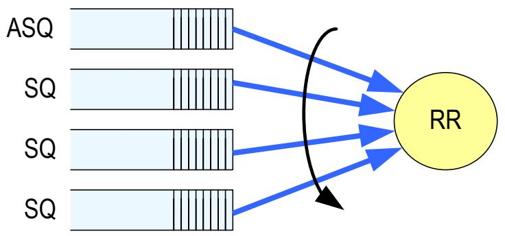

# Weighted Round Robin with Urgent Priority Class Arbitration

In this arbitration mechanism, there are three strict priority classes and three weighted round robin priority levels. If Submission Queue A is of higher strict priority than Submission Queue B, then all candidate commands in Submission Queue A shall start processing before candidate commands from Submission Queue B start processing. 

The highest strict priority class is the Admin class that includes any command submitted to the Admin Submission Queue. This class has the highest strict priority above commands submitted to any other Submission Queue. 

The next highest strict priority class is the Urgent class. Any I/O Submission Queue assigned to the Urgent priority class is serviced next after commands submitted to the Admin Submission Queue, and before any commands submitted to a weighted round robin priority level. Host software should use care in assigning any Submission Queue to the Urgent priority class since there is the potential to starve I/O Submission Queues in the weighted round robin priority levels as there is no fairness protocol between Urgent and non Urgent I/O Submission Queues. 

The lowest strict priority class is the Weighted Round Robin class. This class consists of the three weighted round robin priority levels (High, Medium, and Low) that share the remaining bandwidth using weighted round robin arbitration. Host software controls the weights for the High, Medium, and Low service classes via the Set Features command. Round robin is used to arbitrate within multiple Submission Queues assigned to the same weighted round robin level. The number of candidate commands that may start processing from each Submission Queue per round is either the Arbitration Burst setting or the remaining weighted round robin credits, whichever is smaller. 

Figure 81: Weighted Round Robin with Urgent Priority Class Arbitration

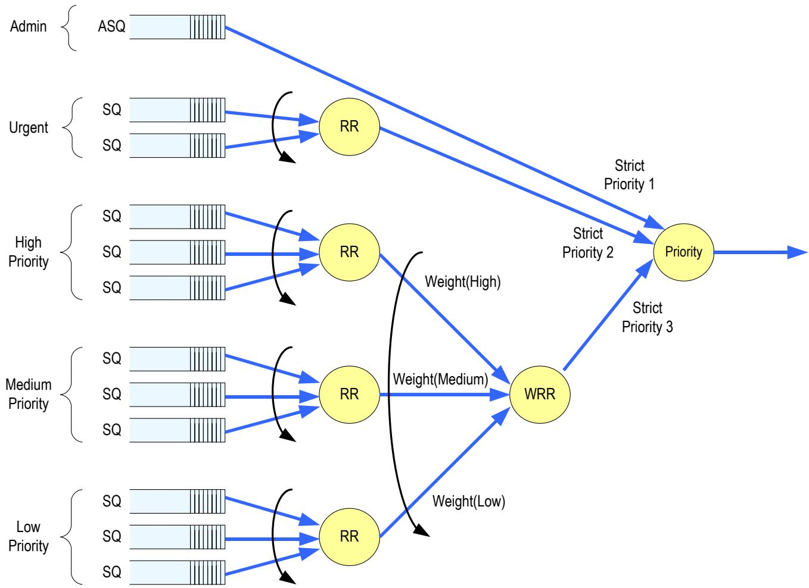

In Figure 81, the Priority decision point selects the highest priority candidate command selected next to start processing.

# Vendor Specific Arbitration

A vendor may choose to implement a vendor specific arbitration mechanism. The mechanism(s) are outside the scope of this specification. 

# Outstanding Commands

A command is outstanding if: 

• the host has submitted that command to the controller; 

the host has not received a completion for that command; and 

as described in this section: 

o the host has not performed an action that causes that command to no longer be outstanding; and 

o the host has not otherwise determined that that command is no longer outstanding. 

A submitted command is no longer outstanding after the host: 

receives a completion for that command; 

receives a successful completion with Immediate Abort Not Performed bit cleared to $\scriptstyle { \mathrm { ~ \displaystyle ~ } } ^ { \prime } 0 ^ { \prime }$ in Dword 0 of the completion queue entry for an Abort command specifying that outstanding command (refer to section 5.1.1); 

receives a successful completion with the Commands Aborted field set to 1h for a Cancel command with an Action Code of Single Command Cancel and specifying that outstanding command (refer to section 7.1); 

reads a CSTS.RDY bit value that indicates a controller is not able to process commands except for Fabrics commands (i.e., a value of $\mathbf { \vec { \nabla } } 0 ^ { \prime }$ ), if that outstanding command is not a Fabrics command (refer to section 3.7.2); 

reads a CSTS.SHST field value that indicates that the controller shutdown is complete (i.e., a value of 10b), if that outstanding command is not a Fabrics command (refer to section 3.6.1 for memorybased transports and section 3.6.2 for message-based transports); 

if using a memory-based transport, receives a successful completion for a Delete I/O Submission Queue command if that outstanding command was sent on the deleted I/O Submission queue (refer to section 3.3.1.3); 

• if using a message-based transport: 

o receives a successful completion for a Disconnect command if that outstanding command was sent on the same I/O queue as the Disconnect command (refer to section 3.3.2.4); or 

o restores communication to the same controller after losing communication to that controller (refer to section 3.9.5). 

If an outstanding command ceases to be outstanding for one of these reasons, then further controller processing of that command is no longer possible. 

# 3.5 Controller Initialization

This section describes the recommended procedure for initializing a controller. 

# Memory-based Controller Initialization (PCIe)

Upon completion of the transport-specific controller initialization steps defined within the relevant NVMe Transport binding specification, the host should perform the following sequence of actions to initialize the controller to begin executing commands: 

1. The host waits for the controller to indicate that any previous reset is complete by waiting for CSTS.RDY to become $\scriptstyle { \mathrm { ' 0 ' } }$ ; 

2. The host configures the Admin Queue by setting the Admin Queue Attributes (AQA), Admin Submission Queue Base Address (ASQ), and Admin Completion Queue Base Address (ACQ) to appropriate values; 

3. The host determines the supported I/O Command Sets by checking the state of CAP.CSS and appropriately initializing CC.CSS as follows: 

a. If the CAP.CSS.NOIOCSS bit is set to ‘1’, then the CC.CSS field should be set to 111b; 

b. If the CAP.CSS.IOCSS bit is set to ‘1’, then the CC.CSS field should be set to 110b; and 

c. If the CAP.CSS.IOCSS bit is cleared to $ { \mathbf { \ell } } _ { 0 } \cdot  { \mathbf { \ell } }$ and the CAP.CSS.NCSS bit is set to ‘1’, then the CC.CSS field should be set to 000b; 

4. The controller settings should be configured. Specifically: 

a. The arbitration mechanism should be selected in CC.AMS; and 

b. The memory page size should be initialized in CC.MPS; 

5. The host enables the controller by setting CC.EN to ‘1’; 

6. The host waits for the controller to indicate that the controller is ready to process commands. The controller is ready to process commands when CSTS.RDY is set to ‘1’; 

7. The host determines the configuration of the controller by issuing the Identify command specifying the Identify Controller data structure (i.e., CNS 01h); 

8. The host determines any I/O Command Set specific configuration information as follows: 

a. If the CAP.CSS.IOCSS bit is set to ‘1’, then the host does the following: 

i. Issue the Identify command specifying the Identify I/O Command Set data structure (CNS 1Ch); and 

ii. Issue the Set Features command with the I/O Command Set Profile Feature Identifier (FID 19h) specifying the index of the I/O Command Set Combination (refer to Figure 327) to be enabled; 

and 

b. For each I/O Command Set that is enabled (Note: the NVM Command Set is enabled if the CC.CSS field is set to 000b): 

i. Issue the Identify command specifying the I/O Command Set specific Active Namespace ID list (CNS 07h) with the appropriate Command Set Identifier (CSI) value of that I/O Command Set; and 

ii. For each NSID that is returned: 

1. If the enabled I/O Command Set is the NVM Command Set or an I/O Command Set based on the NVM Command Set (e.g., the Zoned Namespace Command Set) issue the Identify command specifying the Identify Namespace data structure (CNS 00h); and 

2. Issue the Identify command specifying each of the following data structures (refer to Figure 310): the I/O Command Set specific Identify Namespace data structure, the I/O Command Set specific Identify Controller data structure, and the I/O Command Set independent Identify Namespace data structure; 

9. If the controller implements I/O queues, then the host should determine the number of I/O Submission Queues and I/O Completion Queues supported using the Set Features command with the Number of Queues feature identifier. After determining the number of I/O Queues, the NVMe Transport specific interrupt registers (e.g., MSI and/or MSI-X registers) should be configured; 

10. If the controller implements I/O queues, then the host should allocate the appropriate number of I/O Completion Queues based on the number required for the system configuration and the number supported by the controller. The I/O Completion Queues are allocated using the Create I/O Completion Queue command; 

11. If the controller implements I/O queues, then the host should allocate the appropriate number of I/O Submission Queues based on the number required for the system configuration and the number supported by the controller. The I/O Submission Queues are allocated using the Create I/O Submission Queue command; and 

12. To enable asynchronous notification of optional events, the host should issue a Set Features command specifying the events to enable. To enable asynchronous notification of events, the host should submit an appropriate number of Asynchronous Event Request commands. This step may be done at any point after the controller signals that the controller is ready (i.e., CSTS.RDY is set to ‘1’). 

After performing these steps, the controller shall be ready to process Admin or I/O commands issued by the host. 

For exit of the D3 power state (refer to the PCI Express Base Specification), the initialization steps outlined should be followed. 

# Message-based Controller Initialization (Fabrics)

The host selects the NVM subsystem with which to create a host to controller association. The host first establishes an NVMe Transport connection with the NVM subsystem. Next the host forms an association with a controller and creates the Admin Queue using the Fabrics Connect command. Finally, the host configures the controller and creates I/O Queues. Figure 82 is a ladder diagram that describes the queue creation process for an Admin Queue or an I/O Queue. 

Figure 82: Queue Creation Flow

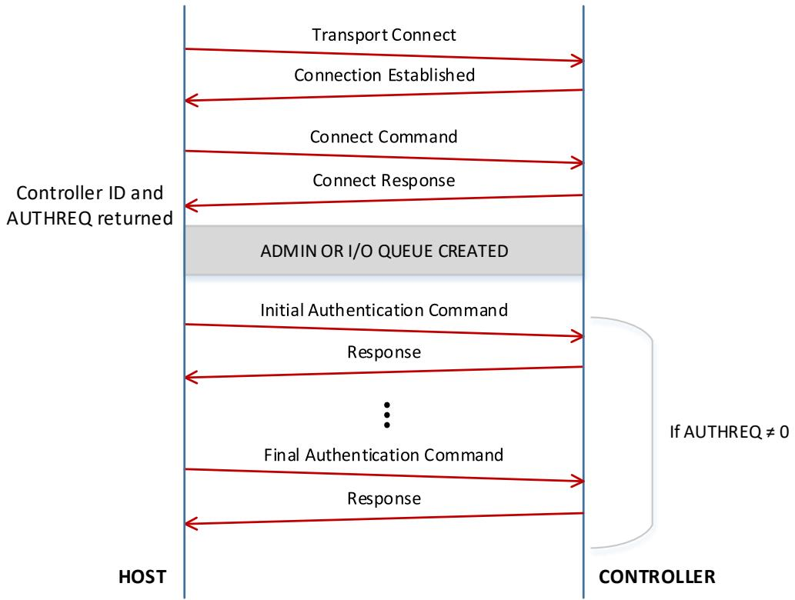

The controller initialization steps after an association is established are described below. For determining capabilities or configuring properties, the host uses the Property Get command and Property Set command, respectively. 

1. NVMe in-band authentication is performed if required (refer to section 8.3.4.2); 

2. The host determines the controller capabilities; 

3. The host determines the supported I/O Command Sets by checking the state of CAP.CSS and appropriately initializing CC.CSS as follows: 

a. If the CAP.CSS.NOIOCSS bit is set to ‘1’, then the CC.CSS field should be set to 111b; 

b. If the CAP.CSS.IOCSS bit is set to ‘1’, then the CC.CSS field should be set to 110b; and 

c. If the CAP.CSS.IOCSS bit is cleared to $ { \mathbf { \ell } } _ { 0 } \cdot  { \mathbf { \ell } }$ and the CAP.CSS.NCSS bit is set to ‘1’, then the CC.CSS field should be set to 000b; 

4. The host configures controller settings. Specific settings include: 

a. The arbitration mechanism should be selected in CC.AMS; and 

b. The memory page size should be initialized in CC.MPS; 

5. The controller should be enabled by setting CC.EN to ‘1’; 

6. The host should wait for the controller to indicate the controller is ready to process commands. The controller is ready to process commands when CSTS.RDY is set to ‘1’; 

7. The host determines the configuration of the controller by issuing the Identify command specifying the Identify Controller data structure (i.e., CNS 01h); 

8. The host determines any I/O Command Set specific configuration information as follows: 

a. If the CAP.CSS.IOCSS bit is set to ‘1’, then the host does the following: 

i. Issue the Identify command specifying the Identify I/O Command Set data structure (CNS 1Ch); and 

ii. Issue the Set Features command with the I/O Command Set Profile Feature Identifier (FID 19h) specifying the index of the I/O Command Set Combination (refer to Figure 327) to be enabled; 

and 

b. For each I/O Command Set that is enabled (Note: the NVM Command Set is enabled if the CC.CSS field is set to 000b): 

i. Issue the Identify command specifying the I/O Command Set specific Active Namespace ID list (CNS 07h) with the appropriate Command Set Identifier (CSI) value of that I/O Command Set; and 

ii. For each NSID that is returned: 

1. If the enabled I/O Command Set is the NVM Command Set or an I/O Command Set based on the NVM Command Set (e.g., the Zoned Namespace Command Set) issue the Identify command specifying the Identify Namespace data structure (CNS 00h); and 

2. Issue the Identify command specifying each of the following data structures (refer to Figure 311): the I/O Command Set specific Identify Namespace data structure, the I/O Command Set specific Identify Controller data structure, and the I/O Command Set independent Identify Namespace data structure; 

9. The host should determine: 

a. the maximum I/O Queue size using CAP.MQES; and 

b. the number of I/O Submission Queues and I/O Completion Queues supported using the response from the Set Features command with the Number of Queues feature identifier; 

10. The host should use the Connect command (refer to section 6.3) to create I/O Submission and Completion Queue pairs; and 

11. To enable asynchronous notification of optional events, the host should issue a Set Features command specifying the events to enable. The host may submit one or more Asynchronous Event Request commands to be notified of asynchronous events as described by section 5.1.2. This step may be done at any point after the controller signals that the controller is ready (i.e., CSTS.RDY is set to ‘1’). 

The association may be removed if step 5 (i.e., setting CC.EN to ‘1’) is not completed within 2 minutes after establishing the association. 

# Discovery Controller Initialization

The initialization process for Discovery controllers is described in Figure 83. 

Figure 83: Discovery Controller Initialization process flow

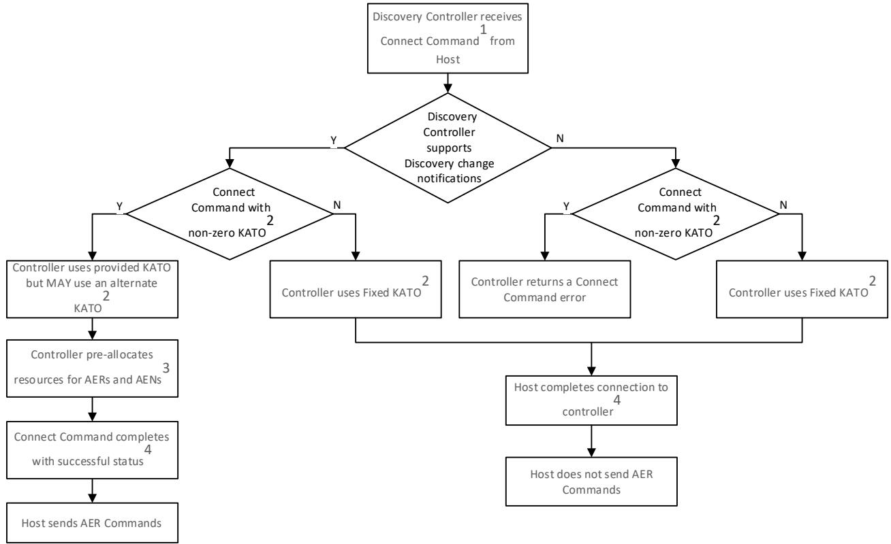

# Notes:

1. Refer to section 6.3. 

2. Refer to the Keep Alive command in section 5.1.14. 

3. Refer to the Asynchronous Event Request command in section 5.1.2. 

4. Refer to the following steps in this section. 

After the Connect command completes with a status of Successful Completion, the host performs the following steps: 

1. NVMe authentication is performed if required (refer to section 8.3.4.2); 

2. The host determines the controller’s capabilities by reading the Controller Capabilities property; 

3. The host configures the controller’s settings by writing the Controller Configuration property, including setting CC.EN to ‘1’ to enable command processing; 

4. The host waits for the controller to indicate that the controller is ready to process commands. The controller is ready to process commands when CSTS.RDY is set to ‘1’ in the Controller Status property; and 

5. The host determines the features and capabilities of the controller by issuing an Identify command, specifying each applicable Controller data structure. 

After initializing the Discovery controller, the host reads the Discovery log page. Refer to section 5.1.12.3.1. 

# Controller Ready Modes During Initialization

There are two controller ready modes: 

Controller Ready With Media: By the time the controller becomes ready (i.e., by the time that CSTS.RDY transitions from $\mathbf { \vec { \nabla } } 0 ^ { \prime }$ to ‘1’) after the controller is enabled (i.e., CC.EN transitions from $ { \mathbf { \vec { \mathbf { \rho } } } } _ { 0 } ,$ to ‘1’), then: 

a) the controller shall be able to process all commands without error as described in section 3.5.4.1; and 

b) all namespaces attached to the controller and all media required to process Admin commands shall be ready (i.e., commands are not permitted to be aborted with a status code of Namespace Not Ready with the Do Not Retry bit cleared to $\mathbf { \vec { \nabla } } 0 ^ { \prime }$ or Admin Command Media Not Ready with the Do Not Retry bit cleared to $ { \mathbf { \ell } } _ { 0 } \cdot  { \mathbf { \ell } }$ ). 

Controller Ready Independent of Media: After the controller is enabled, all namespaces attached to the controller and media required to process Admin commands may or may not become ready by the time the controller becomes ready. Any Admin command or I/O command that specifies one or more namespaces attached to the controller is permitted to be aborted with a status code of Namespace Not Ready with the Do Not Retry bit cleared to $\mathbf { \vec { \nabla } } 0 ^ { \prime }$ until CRTO.CRWMT amount of time after the controller is enabled. 

Admin commands that require access to the media are permitted to be aborted with a status code of Admin Command Media Not Ready with the Do Not Retry bit cleared to $\scriptstyle { \mathrm { ~ \displaystyle ~ } } ^ { \prime } 0 ^ { \prime }$ until CRTO.CRWMT amount of time after the controller is enabled. Refer to Figure 84 for a list of Admin commands that are permitted to be aborted with a status code of Admin Command Media Not Ready. 

The controller shall be able to process without error as described in section 3.5.4.1: 

a) all Admin commands not listed in Figure 84 by the time the controller is ready; 

b) all Admin commands listed in Figure 84 no later than CRTO.CRWMT amount of time after the controller is enabled; and 

c) all I/O commands no later than CRTO.CRWMT amount of time after the controller is enabled. 

Figure 84: Admin Commands Permitted to Return a Status Code of Admin Command Media Not Ready

<table><tr><td>Admin Command</td><td>Additional Restrictions</td></tr><tr><td>Capacity Management</td><td></td></tr><tr><td>Device Self-test</td><td>If the Device Self-Test would result in testing one or more namespaces, then returning a status code of Admin Command Media Not Ready is permitted. If the Device Self-Test would not result in testing any namespaces, then returning a status code of Admin Command Media Not Ready is not permitted.</td></tr><tr><td>Firmware Commit</td><td></td></tr><tr><td>Firmware Image Download</td><td></td></tr><tr><td>Get LBA Status</td><td></td></tr><tr><td>Get Log Page</td><td>Get Log Page is only permitted to return a status code of Admin Command Media Not Ready for the following log pages:
·Device Self-test
·Firmware Slot Information
·Telemetry Controller-Initiated
·Telemetry Host-Initiated
·Predictable Latency Per NVM Set
·Predictable Latency Event Aggregate
·Persistent Event Log
·LBA Status Information
·Endurance Group Event Aggregate
·Media Unit Status
·Supported Capacity Configuration List
·Boot Partition
·Reservation Notification
·Rotational Media Information
·Vendor Specific</td></tr><tr><td>Namespace Attachment</td><td></td></tr><tr><td>Namespace Management</td><td></td></tr><tr><td>Format NVM</td><td></td></tr><tr><td>Sanitize</td><td></td></tr></table>

Figure 84: Admin Commands Permitted to Return a Status Code of Admin Command Media Not Ready

<table><tr><td>Admin Command</td><td>Additional Restrictions</td></tr><tr><td>Security Receive1</td><td></td></tr><tr><td>Security Send1</td><td></td></tr><tr><td>Vendor Specific</td><td></td></tr><tr><td colspan="2">Notes:1. A host may require discovery operations performed via Security Send/Receive (e.g., TCG Level 0 Discovery) to be processed prior to media being ready. Therefore, it is recommended that controllers not return Admin Command Media Not Ready for such discovery operations.</td></tr></table>

The Controller Ready Modes Supported (CAP.CRMS) field (refer to Figure 36) indicates which controller ready modes are supported. The CAP.CRMS field consists of two bits: 

• the Controller Ready With Media Support (CAP.CRMS.CRWMS) bit; and 

• the Controller Ready Independent of Media Support (CAP.CRMS.CRIMS) bit. 

Controllers shall set the CAP.CRMS.CRWMS bit to ‘1’ (i.e., set the CAP.CRMS field to 01b or 11b). The CAP.CRMS.CRWMS bit was not defined prior to NVM Express Base Specification, Revision 2.0. Controllers compliant with revisions earlier than NVM Express Base Specification, Revision 2.0 may clear the CAP.CRMS.CRWMS field to 00b. 

The Controller Ready Independent of Media Enable (CC.CRIME) bit (refer to Figure 41) controls the controller ready mode based on the value of the CAP.CRMS field as follows: 

a) If the CAP.CRMS field is cleared to 00b, the controller ready mode is not able to be selected. In this case, the read-only CC.CRIME bit shall be cleared to $ { \mathbf { \ell } } _ { 0 } \cdot  { \mathbf { \ell } }$ and should be ignored by host software; 

b) If the CAP.CRMS field is set to 01b (i.e., the CAP.CRMS.CRIMS bit is cleared to $\mathbf { \vec { \mathbf { \rho } } } ^ { 0 }$ and the CAP.CRMS.CRWMS bit is set to ‘1’), then the controller is in Controller Ready With Media mode and the read-only CC.CRIME bit shall be cleared to $\mathbf { \vec { \nabla } } 0 ^ { \prime }$ ; and 

c) If the CAP.CRMS field is set to 11b, then both controller ready modes are supported, and the host may select the controller ready mode by modifying the value of the CC.CRIME bit. In this situation, the host should set the controller ready mode by writing to the CC.CRIME bit before the controller is enabled (e.g., as part of the initialization sequence of actions described in section 3.5). 

# Controller Ready Timeouts During Initialization

The CAP.CRMS field was not defined prior to NVM Express Base Specification, Revision 2.0. Controllers compliant with revisions earlier than NVM Express Base Specification, Revision 2.0 may clear the CAP.CRMS field to 00b. This section is applicable to controllers that clear the CAP.CRMS field to 00b and controllers that set CAP.CRMS to a non-zero value. 

There are three controller ready timeout fields: 

1. CAP.TO (refer to Figure 36); 

2. CRTO.CRWMT (refer to Figure 57); and 

3. CRTO.CRIMT (refer to Figure 57). 

The details regarding these timeouts during controller initialization are as follows: 

a) The CAP.TO field shall be set as described in Figure 36; 

b) If the CAP.CRMS field is cleared to $0 0 \boldsymbol { \mathrm { b } } '$ , then the worst-case time the host should wait after the controller is enabled (i.e., CC.EN transitions from $\mathbf { \vec { \nabla } } 0 ^ { \prime }$ to ‘1’) for the controller to become ready (CSTS.RDY transitions from $\mathbf { \vec { \nabla } } 0 ^ { \prime }$ to ‘1’) is indicated by CAP.TO; 

c) If the controller is in Controller Ready With Media mode (i.e., the CC.CRIME bit is cleared to $ { \mathbf { \ell } } _ { 0 } \cdot  { \mathbf { \ell } }$ then: 

i. the Controller Ready Independent of Media Timeout (CRTO.CRIMT) field is not applicable; and 

ii. the Controller Ready With Media Timeout (CRTO.CRWMT) indicates the worst-case time the host should wait after the controller is enabled for: 

1. the controller to become ready and be able to process all commands without error as described in section 3.5.4.1; and 

2. all attached namespaces and media required to process Admin commands to become ready, 

and 

d) If the controller is in Controller Ready Independent of Media mode (i.e., the CC.CRIME bit is set to ‘1’), then 

i. the Controller Ready With Media Timeout (CRTO.CRWMT) field indicates the worst-case time that host software should wait for all attached namespaces and media required to process Admin commands to become ready after the controller is enabled; and 

ii. the Controller Ready Independent of Media Timeout (CRTO.CRIMT) field indicates the worst-case time the host should wait after the controller is enabled for the controller to become ready and be able to process: 

1. all commands that do not access attached namespaces; and 

2. Admin commands that do not require access to media, 

without error as described in section 3.5.4.1. 

Changes to the value of the CC.CRIME bit shall have no effect on the values of the CRTO.CRWMT and CRTO.CRIMT fields. Changes to the value of the CC.CRIME bit may have an effect on the value of the CAP.TO field (refer to Figure 36). 

# Handling Errors During Initialization

If the CAP.CRMS field is non-zero and the controller has been enabled by transitioning CC.EN from $ { \mathbf { \vec { \mathbf { \rho } } } } _ { 0 } ,$ to ‘1’ and the controller encounters a failure that prevents: 

a) at least one: 

• command that does not access attached namespaces; or 

• Admin command that does not require access to media (refer to Figure 84), 

from being able to be processed without error by the amount of time indicated by the: 

• Controller Ready Independent of Media Timeout (CRTO.CRIMT) field since the controller was enabled if the controller is in Controller Ready Independent of Media mode (i.e., the CC.CRIME bit is set to ‘1’); or 

• Controller Ready With Media Timeout (CRTO.CRWMT) field since the controller was enabled if the controller is in Controller Ready With Media mode (i.e., the CC.CRIME bit is cleared to ‘0’); 

b) at least one namespace attached to the controller from becoming ready by the amount of time indicated by the Controller Ready With Media Timeout (CRTO.CRWMT) field since the controller was enabled; or 

c) media required by at least one Admin command from becoming ready by the amount of time indicated by the Controller Ready With Media Timeout (CRTO.CRWMT) field since the controller was enabled, 

then: 

a) if the controller has not become ready, then the controller shall become ready (i.e., set CSTS.RDY to ‘1’) no later than CRTO.CRWMT amount of time after the controller was enabled; and 

b) if the Persistent Event log page is supported, then the controller shall record an NVM Subsystem Hardware Error Event with the NVM Subsystem Hardware Error Event code set to a value of Controller Ready Timeout Exceeded in the Persistent Event log page (refer to Figure 236). 

# 3.6 Shutdown Processing

This section describes the recommended procedure for shutdown processing prior to a power-off condition. 

There are two shutdown processing mechanisms, controller shutdown (refer to sections 3.6.1 and 3.6.2) and NVM Subsystem Shutdown (refer to section 3.6.3). The CSTS.ST bit indicates the shutdown mechanism that is in progress, if any (refer to Figure 42). A host requests a controller shutdown by modifying the CC.SHN field (refer to Figure 41). A host requests an NVM Subsystem Shutdown by modifying the NSSD property (refer to section 3.1.4.20) or by issuing an NVMe-MI Shutdown command to a Management Endpoint (refer to the NVM Express Management Interface Specification). 

At most one shutdown processing mechanism is able to be in progress for a controller at any time. If an NVM Subsystem Shutdown is requested while a controller shutdown is in progress, then the NVM Subsystem Shutdown overrides the controller shutdown. The progress and completion of shutdown processing is indicated by the CSTS.SHST field (refer to Figure 42). 

NVM Subsystem Shutdown should not be supported by any NVM subsystem that does not support more than one controller, without counting virtual controllers (e.g., NVM Subsystem Shutdown should not be supported by an NVM subsystem that supports one primary controller and multiple secondary controllers) (refer to section 8.2.6). 

Figure 85 describes the interactions of the shutdown processing state indicated by the CSTS.SHST field with the state of the controller indicated by the CC.EN bit (refer to Figure 41) and by the CSTS.RDY bit (refer to Figure 42). The four possible media states in Figure 85 are: shutdown, shutdown in progress, usable, and initialization in progress. 

Figure 85: Shutdown Processing Interactions

<table><tr><td>CC.EN</td><td>CSTS.RDY</td><td>CSTS.SHST</td><td>Controller able to process Admin and I/O commands4</td><td>Media state</td><td>Controller ready to be powered off</td></tr><tr><td>0</td><td>0</td><td>00b</td><td>no</td><td>any</td><td>implementation specific1</td></tr><tr><td>0</td><td>0</td><td>01b</td><td>no3</td><td>shutdown in progress</td><td>no</td></tr><tr><td>0</td><td>0</td><td>10b</td><td>no</td><td>shutdown</td><td>yes</td></tr><tr><td>1</td><td>1</td><td>00b</td><td>yes</td><td>initialization in progress or usable2</td><td>no</td></tr><tr><td>1</td><td>1</td><td>01b</td><td>no3</td><td>shutdown in progress</td><td>no</td></tr><tr><td>1</td><td>1</td><td>10b</td><td>no</td><td>shutdown</td><td>yes</td></tr><tr><td colspan="6">Notes:1. In some cases (e.g., following initial application of power, or following a Controller Level Reset that occurred while shutdown processing was reported as complete), the controller is permitted to initialize the media and cease being ready to be powered off as a consequence.2. If the CC.CRIME bit is cleared to ‘0’, then the media is usable. If the CC.CRIME bit is set to ‘1’, then either media initialization is in progress or the media is usable (refer to Figure 41).3. While shutdown processing is in progress, the controller may abort any command with a status code of Commands Aborted due to Power Loss Notification.4. I/O commands are only able to be processed by a controller that supports I/O commands. Fabrics commands are always able to be processed by a controller that supports Fabrics commands.</td></tr></table>

Figure 85 does not include transition conditions for a controller that is becoming ready or is undergoing reset. During these transitions, the CC.EN bit and the CSTS.RDY bit have different values (refer to Figure 41 and Figure 42). The media may or may not be usable during these transitions. 

Figure 85 does not include the NVMe-MI effects of processing an Admin command that requires access to the media (refer to Figure 84) and specifies the Ignore Shutdown bit set to ‘1’ is processed by the controller via the out-of-band mechanism (refer to the NVM Express Management Interface Specification). Processing of such a command causes the media to become usable, after which the media may or may not be returned to its previous condition. 

# Memory-based Controller Shutdown (PCIe)

It is recommended that the host perform an orderly shutdown of the controller by following the procedure in this section when a power-off or shutdown condition is imminent. 

The host should perform the following actions in sequence for a normal controller shutdown: 

1. If the controller is enabled (i.e., CC.EN (refer to Figure 41) is set to ‘1’): 

a. Stop submitting any new I/O commands to the controller and allow any outstanding commands to complete; 

b. If the controller implements I/O queues, then the host should delete all I/O Submission Queues, using the Delete I/O Submission Queue command (refer to section 5.2.4). A result of the successful completion of the Delete I/O Submission Queue command is that any remaining commands outstanding are aborted; 

c. If the controller implements I/O queues, then the host should delete all I/O Completion Queues, using the Delete I/O Completion Queue command (refer to section 5.2.3); 

and 

2. The host should set the Shutdown Notification (CC.SHN) field (refer to Figure 41) to 01b to indicate a normal controller shutdown operation. The controller indicates when shutdown processing is completed by updating the Shutdown Status (CSTS.SHST) field to 10b and the Shutdown Type (CSTS.ST) field (refer to Figure 42) is cleared to ‘0’. 

The host should perform the following actions in sequence for an abrupt shutdown: 

1. If the controller is enabled (i.e., CC.EN is set to ‘1’), then stop submitting any new I/O commands to the controller; and 

2. The host should set the Shutdown Notification (CC.SHN) field (refer to Figure 41) to 10b to indicate an abrupt shutdown operation. The controller indicates when shutdown processing is completed by updating the Shutdown Status (CSTS.SHST) field (refer to Figure 42) to 10b and CSTS.ST (refer to Figure 42) is cleared to $\mathbf { \vec { \mathbf { \rho } } } ^ { 0 }$ . 

For entry to the D3 power state (refer to the PCI Express Base Specification), the shutdown steps outlined for a normal controller shutdown should be followed. 

It is recommended that the host wait a minimum of the RTD3 Entry Latency reported in the Identify Controller data structure (refer to Figure 312) for the shutdown operations to complete; if the value reported in RTD3 Entry Latency is 0h, then the host should wait for a minimum of one second. While shutdown processing is in progress on a controller, it is not recommended to disable that controller via the CC.EN bit. This causes a Controller Reset which may impact the time required to complete shutdown processing. While shutdown processing is in progress on a controller, that controller may abort any command with a status code of Commands Aborted due to Power Loss Notification. 

The controller is ready to be powered off (e.g., the media is in the shutdown state (refer to Figure 85)) when the CSTS.ST bit is cleared to $\scriptstyle { \mathrm { ~ \displaystyle ~ } } ^ { \prime } 0 ^ { \prime }$ , and the CSTS.SHST field indicates that controller shutdown processing is complete (i.e., the CSTS.SHST field is set to 10b), regardless of the value of the CC.EN bit. The controller remains ready to be powered off (e.g., the media remains in the shutdown state) until: 

A. the controller is enabled (i.e., the CC.EN bit transitions from $\scriptstyle { \mathrm { ' 0 ' } }$ to ‘1’); 

B. the controller is reset by a Controller Level Reset; or 

C. an Admin command that requires access to the media (refer to Figure 84) and specifies the Ignore Shutdown bit set to ‘1’ is processed by the controller via the out-of-band mechanism (refer to the NVM Express Management Interface Specification). 

If a Controller Level Reset occurs while controller shutdown processing is reported as complete (i.e., the CSTS.ST bit is cleared to $\scriptstyle { \mathrm { ~ \displaystyle ~ } } ^ { \prime } 0 ^ { \prime }$ and the CSTS.SHST field is set to 10b), then the controller may remain ready to be powered off (e.g., the media remains in the shutdown state) or the controller may cease being ready to be powered off (e.g., because the controller is preparing the media for use (refer to section 3.7.2)). 

If the power scope for the controller includes multiple controllers (e.g., the CAP.CPS field is set to 10b or is set to 11b), and any controller included in that power scope is not ready to be powered off, then the portion of the NVM subsystem included in that power scope is not ready to be powered off. 

To start executing commands on the controller after that controller reports controller shutdown processing complete (i.e., the CSTS.ST bit is cleared to $\scriptstyle { \mathrm { ' 0 ' } }$ and the CSTS.SHST field is set to 10b) utilizing the CC.EN bit: 

if the CC.EN bit is set to ‘1’, then a Controller Level Reset is required to clear the CC.EN bit to $ { \mathbf { \ell } } _ { 0 } \cdot  { \mathbf { \ell } }$ on that controller and the CC.EN bit is subsequently required to be set to ‘1’ as part of the initialization sequence (refer to section 3.5); and 

• if the CC.EN bit is cleared to ‘0’, then: 

o a Controller Level Reset is required and the CC.EN bit is subsequently required to be set to ‘1’ as part of the initialization sequence (refer to section 3.5); or 

o the CC.EN bit is required to be set to ‘1’ and the CC.SHN field is required to be cleared to 00b with the same write to the CC property (refer to Figure 41). The controller clears the CSTS.SHST field to 00b in response to that write. 

The initialization sequence (refer to section 3.5) should then be executed on that controller. 

It is an implementation choice whether the host aborts all outstanding commands to the Admin Queue prior to the controller shutdown. The only commands that should be outstanding to the Admin Queue when the controller reports shutdown processing complete are Asynchronous Event Request commands. 

If the host is no longer able to communicate with the controller before that host receives either: 

• completions for all outstanding commands submitted to that controller (refer to section 3.4.5); or 

• a CSTS.SHST field value that indicates that the controller shutdown is complete, 

then it is strongly recommended that the host take the steps described in section 9.6 to avoid possible data corruption caused by interaction between outstanding commands and subsequent commands submitted by that host to another controller. 

# Message-based Controller Shutdown (Fabrics)

To initiate a shutdown of a controller, the host should use the Property Set command (refer to section 6.6) to set the Shutdown Notification (CC.SHN) field to: 

• 01b to initiate a normal shutdown operation; or 

10b to initiate an abrupt shutdown. 

After the host initiates a controller shutdown, the host may either disconnect at the NVMe Transport level or the host may choose to poll CSTS.SHST to determine when the controller shutdown is complete (i.e., the controller should not initiate a disconnect at the NVMe Transport level). It is an implementation choice whether the host aborts all outstanding commands prior to initiating the shutdown. 

If the host is no longer able to communicate with the controller before that host receives either: 

• completions for all outstanding commands submitted to that controller (refer to section 3.4.5); or 

• a CSTS.SHST field value that indicates that the controller shutdown is complete, 

then it is strongly recommended that the host take the steps described in section 9.6 to avoid possible data corruption caused by interaction between outstanding commands and subsequent commands submitted by that host to another controller. 

The CC.EN field is not used to shutdown the controller (i.e., it is used for Controller Reset). 

From the time a controller shutdown is initiated until: 

• a Controller Level Reset occurs; or 

• the controller, if dynamic, is removed from the NVM subsystem, 

the controller shall: 

• process only Fabrics commands (refer to Figure 540); and 

• disable the Keep Alive timer, if supported. 

After the CC.EN bit transitions to $\scriptstyle { \mathrm { ' 0 ' } }$ (i.e., due to Controller Level Reset), the association between the host and controller shall be preserved for at least 2 minutes. After this time, the association may be removed if the controller has not been re-enabled. 

To start executing commands on the controller after that controller reports controller shutdown processing complete (i.e., the CSTS.ST bit is cleared to $\scriptstyle { \mathrm { ' 0 ' } }$ and the CSTS.SHST field is set to 10b) utilizing the CC.EN bit: 

if the CC.EN bit is set to ‘1’, then a Controller Level Reset is required to clear the CC.EN bit to ‘0’ on that controller and the CC.EN bit is subsequently required to be set to ‘1’ as part of the initialization sequence (refer to section 3.5); and 

• if the CC.EN bit is cleared to $\scriptstyle { \mathrm { ~ \displaystyle ~ } } ^ { \prime } 0 ^ { \prime }$ , then: 

o a Controller Level Reset is required and the CC.EN bit is subsequently required to be set to ‘1’ as part of the initialization sequence (refer to section 3.5); or 

o the CC.EN bit is required to be set to ‘1’ and the CC.SHN field is required to be cleared to 00b with a single Property Set command (refer to section 6.6) that changes the CC property (refer to Figure 41). The controller clears the CSTS.SHST field to 00b in response to that write. 

The initialization sequence (refer to section 3.5) should then be executed on that controller. 

# NVM Subsystem Shutdown

An NVM Subsystem Shutdown initiates a shutdown of all controllers in a domain or NVM subsystem from a single controller. 

Interactions between NVM Subsystem Shutdown and Power Loss Signaling processing are described in section 8.2.5. 

A controller indicates support for the NVM Subsystem Shutdown Feature by setting the CAP.NSSS bit to ‘1’ (refer to Figure 36). 

The NVM Subsystem Shutdown Feature defined in this revision of the NVM Express Base Specification includes some functionality that differs from the functionality of the NVM Subsystem Shutdown Feature defined in revision 2.0 of the NVM Express Base Specification. A controller indicates support for these functionality differences by setting the NVM Subsystem Shutdown Enhancements Supported (CAP.NSSES) bit to ‘1’ (refer to Figure 36). 

If a controller sets the CAP.NSSES bit to ‘1’, then while an NVM Subsystem Shutdown is reported as in progress or is reported as complete (i.e., while the CSTS.ST bit is set to ‘1’ and the CSTS.SHST field is set to 01b or is set to 10b): 

a. a Controller Reset initiates a Controller Level Reset (CLR) (refer to section 3.7.2); and 

b. the values of both the CSTS.ST bit and the CSTS.SHST field (refer to Figure 40) are not changed by a CLR initiated by any method other than an NVM Subsystem Reset. 

If a controller clears the CAP.NSSES bit to ‘0’, then, as defined in revision 2.0 of the NVM Express Base Specification: 

a. while an NVM Subsystem Shutdown is reported as in progress or is reported as complete, a Controller Reset does not initiate a CLR (i.e., Controller Reset is disabled); and 

b. while an NVM Subsystem Shutdown is reported as complete, any CLR initiated by any transportspecific reset type may clear the value of the CSTS.ST bit to $\mathbf { \vec { \nabla } } 0 ^ { \prime }$ and may clear the value of the CSTS.SHST field to 00b. 

A host is able to support NVM Subsystem Shutdown functionality both on controllers that set the CAP.NSSES bit to ‘1’ and on controllers that clear the CAP.NSSES bit to $\mathbf { \vec { \nabla } } 0 ^ { \prime }$ by ensuring that any NVM Subsystem Shutdown is followed by an NVM Subsystem Reset regardless of the value of the CSTS.ST bit and the value of the CSTS.SHST field. 

# NVM Subsystem Shutdown in a Single Domain NVM Subsystem

A normal shutdown on all controllers within the NVM subsystem (i.e., normal NVM Subsystem Shutdown) is initiated by: 

• a host writing the value 4E726D6Ch ("Nrml") to NSSD.NSSC when CAP.CPS is set to 11b; or 

issuing an NVMe-MI Shutdown command to a Management Endpoint (refer to the NVM Express Management Interface Specification) specifying a normal shutdown. 

For each controller in the NVM subsystem for this normal NVM Subsystem Shutdown, if: 

• CSTS.SHST is set to 00b; and 

• An outstanding Asynchronous Event Request command exists, 

then the controller shall issue a Normal NVM Subsystem Shutdown event prior to shutting down the controller. 

An abrupt shutdown on all controllers within the NVM subsystem (i.e., abrupt NVM Subsystem Shutdown) is initiated by: 

• a host writing the value 41627074h ("Abpt") to NSSD.NSSC when CAP.CPS is set to 11b; or 

issuing an NVMe-MI Shutdown command to a Management Endpoint (refer to the NVM Express Management Interface Specification) specifying an abrupt shutdown. 

While NVM Subsystem Shutdown processing is in progress, any controller in the NVM subsystem may abort any command with a status code of Commands Aborted due to Power Loss Notification. 

It is recommended that the host wait a minimum of the NVM Subsystem Shutdown Latency reported in the Identify Controller data structure (refer to Figure 312) for NVM Subsystem Shutdown processing to complete; if the reported NVM Subsystem Shutdown Latency value is 0h, then the host should wait for a minimum of 30 seconds. While an NVM Subsystem Shutdown is reported as in progress, it is not recommended to reset the NVM subsystem via an NVM Subsystem Reset or a power cycle (which causes an NVM Subsystem Reset). This aborts the NVM Subsystem Shutdown which may impact the subsequent time required for the NVM subsystem to become ready to perform I/O (e.g., after power is reapplied following a power cycle). 

For either a normal or an abrupt NVM Subsystem Shutdown, the NVM subsystem is ready to be powered off (e.g., the media is in the shutdown state (refer to Figure 85)) when the CSTS.ST bit is set to ‘1’ and the CSTS.SHST field indicates that shutdown processing is complete (i.e., the CSTS.SHST field is set to 10b) on any controller in the NVM subsystem. The NVM subsystem shall not set the CSTS.SHST field to 10b on any controller in the NVM subsystem until the entire NVM subsystem is ready to be powered off. The NVM Subsystem shall indicate that NVM Subsystem Shutdown processing is complete by setting the CSTS.SHST field to 10b on all controllers in the NVM subsystem. The NVM subsystem remains ready to be powered off (e.g., the media remains in the shutdown state) until: 

A. an NVM Subsystem Reset; or 

B. an Admin command that requires access to the media (refer to Figure 84) and specifies the Ignore Shutdown bit set to ‘1’ is processed by any controller via the out-of-band mechanism (refer to the NVM Express Management Interface Specification). 

If a normal or an abrupt NVM Subsystem Shutdown is reported as in progress or is reported as complete within the NVM subsystem (i.e., the CSTS.ST bit is set to ‘1’ and the CSTS.SHST field is set to either 01b or 10b on all controllers in the NVM subsystem, indicating that an NVM Subsystem Reset has not occurred since initiation of that NVM Subsystem Shutdown), then: 

an NVM Subsystem Reset: 

o shall abort any in progress NVM Subsystem Shutdown; 

o clears the CSTS.SHST field to 00b in all controllers in the NVM subsystem; and 

o clears the CSTS.ST bit to $\scriptstyle { \mathrm { ~ \displaystyle ~ } } ^ { \prime } 0 ^ { \prime }$ in all controllers in the NVM subsystem; 

and 

a Controller Level Reset of any controller in the NVM subsystem that is initiated by any other method (refer to section 3.7.2): 

o shall not abort any in progress NVM Subsystem Shutdown; 

o does not change the values of the CSTS.ST bit and the CSTS.SHST field, as described in Figure 40; and 

o shall not cause that NVM subsystem to cease being ready to be powered off (e.g., shall not transition the media out of the shutdown state) if that NVM Subsystem was ready to be powered off when that Controller Level Reset was initiated. 

To start executing commands on the controller after that controller reports NVM Subsystem Shutdown processing complete (i.e., the CSTS.ST bit is set to ‘1’ and the CSTS.SHST field is set to 10b): 

• regardless of the value of the CC.EN bit, an NVM Subsystem Reset is required; and 

the CC.EN bit is subsequently required to be set to ‘1’ as part of the initialization sequence (refer to section 3.5). 

The initialization sequence (refer to section 3.5) should then be executed on that controller. 

# Domain Shutdown in a Multiple Domain NVM Subsystem

A normal NVM Subsystem Shutdown on this controller and all controllers within the associated domain is initiated by: 

• a host writing the value 4E726D6Ch ("Nrml") to NSSD.NSSC when CAP.CPS is set to 10b; or 

issuing an NVMe-MI Shutdown command to a Management Endpoint (refer to the NVM Express Management Interface Specification) specifying a normal shutdown. 

For each controller in the domain for this normal NVM subsystem shutdown, if: 

• CSTS.SHST is cleared to 00b; and 

• An outstanding Asynchronous Event Request command exists, 

then the controller shall issue a Normal NVM Subsystem Shutdown event prior to shutting down the controller. 

An abrupt NVM Subsystem Shutdown to this controller and all controllers within the associated domain is initiated by: 

• a host writing the value 41627074h ("Abpt") to NSSD.NSSC when CAP.CPS is set to 10b; or 

issuing an NVMe-MI Shutdown command to a Management Endpoint (refer to the NVM Express Management Interface Specification) specifying an abrupt shutdown. 

While NVM Subsystem Shutdown processing is in progress, any controller in the domain may abort any command with a status code of Commands Aborted due to Power Loss Notification. 

It is recommended that the host wait a minimum of the NVM Subsystem Shutdown Latency reported in the Identify Controller data structure (refer to Figure 312) for NVM Subsystem Shutdown processing on a domain to complete; if the reported NVM Subsystem Shutdown Latency value is 0h, then the host should wait for a minimum of 30 seconds. While an NVM Subsystem Shutdown is reported as in progress, it is not recommended to reset the domain via either an NVM Subsystem Reset on the domain or power cycling the domain (which causes an NVM Subsystem Reset on the domain). This aborts the NVM Subsystem Shutdown which may impact the subsequent time required for the domain to become ready to perform I/O (e.g., after power is reapplied following a power cycle). 

For either a normal or an abrupt NVM Subsystem Shutdown on the domain, the domain is ready to be powered off (e.g., the media is in the shutdown state (refer to Figure 85)) when the CSTS.ST bit is set to ‘1’ and the CSTS.SHST field indicates that shutdown processing is complete (i.e., the CSTS.SHST field is set to 10b) on any controller in the domain. The NVM subsystem shall not set the CSTS.SHST field to 10b on any controller in the domain until the entire domain is ready to be powered off. The NVM Subsystem shall indicate that NVM Subsystem Shutdown processing is complete by setting the CSTS.SHST field to 10b on all controllers in the domain. The domain remains ready to be powered off (e.g., the media remains in the shutdown state) until: 

A. an NVM Subsystem Reset occurs on that domain; or 

B. an Admin command that requires access to the media (refer to Figure 84) and specifies the Ignore Shutdown bit set to ‘1’ is processed by any controller in the domain via the out-of-band mechanism (refer to the NVM Express Management Interface Specification). 

If a normal or an abrupt NVM Subsystem Shutdown is reported as in progress or is reported as complete within a domain (i.e., the CSTS.ST bit is set to ‘1’ and the CSTS.SHST field is set to either 01b or 10b on all controllers in the domain, indicating that an NVM Subsystem Reset on the domain has not occurred since initiation of that NVM Subsystem Shutdown), then: 

an NVM Subsystem Reset on the domain: 

o shall abort any in progress NVM Subsystem Shutdown on the domain; and 

o clears the CSTS.SHST field to 00b in all controllers in the domain; and 

o clears the CSTS.ST bit to $\scriptstyle { \mathrm { ~ \displaystyle ~ } } ^ { \prime } 0 ^ { \prime }$ in all controllers in the domain; 

and 

a Controller Level Reset of any controller in the domain that is initiated by any other method (refer to section 3.7.2) 

o shall not abort any in progress NVM Subsystem Shutdown on the domain; 

o does not change the values of the CSTS.ST bit and the CSTS.SHST field, as described in Figure 42; and 

o shall not cause the domain to cease being ready to be powered off (e.g., shall not transition the media out of the shutdown state) if the domain was ready to be powered off when that Controller Level Reset was initiated. 

To start executing commands on the controller after that controller reports NVM Subsystem Shutdown processing complete (i.e., the CSTS.ST bit is set to ‘1’ and the CSTS.SHST field is set to 10b): 

• regardless of the value of CC.EN, an NVM Subsystem Reset on that domain is required; and 

the CC.EN bit is subsequently required to be set to ‘1’ as part of the initialization sequence (refer to section 3.5). 

The initialization sequence (refer to section 3.5) should then be executed on that controller. 

# 3.7 Resets

# NVM Subsystem Reset

Interactions between NVM Subsystem Reset and Power Loss Signaling processing are described in section 8.2.5. 

# Single Domain NVM Subsystems

The scope of an NVM Subsystem Reset depends on whether the NVM subsystem supports multiple domains. In an NVM subsystem that does not support multiple domains, the scope of the NVM Subsystem Reset is the entire NVM subsystem. 

An NVM Subsystem Reset is initiated when: 

Main power is applied to the NVM subsystem; 

• A value of 4E564D65h (“NVMe”) is written to the NSSR.NSSRC field; 

• Requested using a method defined in the NVM Express Management Interface Specification; or 

• A vendor specific event occurs. 

When an NVM Subsystem Reset occurs, the entire NVM subsystem is reset. This includes the initiation of a Controller Level Reset on all controllers that make up the NVM subsystem, disabling of the Persistent Memory Region associated with all controllers that make up the NVM subsystem, and any transport specific actions defined in the applicable NVMe transport specification. 

The occurrence of an NVM Subsystem Reset while power is applied to the NVM subsystem is reported by the initial value of the CSTS.NSSRO field following the NVM Subsystem Reset. This field may be used by host software to determine if the sudden loss of communication with a controller was due to an NVM Subsystem Reset or some other condition. 

The ability for host software to initiate an NVM Subsystem Reset by writing to the NSSR.NSSRC field is an optional capability of a controller indicated by the state of the CAP.NSSRS field. An implementation may protect the NVM subsystem from an inadvertent NVM Subsystem Reset by not providing this capability to one or more controllers that make up the NVM subsystem. 

The occurrence of a vendor specific event that results in an NVM Subsystem Reset is intended to allow implementations to recover from a severe NVM subsystem internal error that prevents continued normal operation (e.g., fatal hardware or firmware error). 

# Multiple Domain NVM Subsystems

The scope of an NVM Subsystem Reset depends on whether the NVM subsystem supports multiple domains. In an NVM subsystem that supports multiple domains, the scope of the NVM Subsystem Reset is either the controllers that are in a domain or the entire NVM subsystem. 

An NVM Subsystem Reset on a domain is initiated when: 

• Power is applied to that domain; 

A value of 4E564D65h (i.e., “NVMe”) is written to the NSSR.NSSRC field of one of the controllers in that domain; or 

• A vendor specific event occurs within that domain. 

When an NVM Subsystem Reset occurs the entire domain is reset. This includes the initiation of a Controller Level Reset on all controllers that are in the domain, disabling of the Persistent Memory Region associated with all controllers that are in the domain, and any transport specific actions defined in the applicable NVMe transport specification. 

Alternatively, an NVM Subsystem Reset in an NVM subsystem that supports multiple domains may reset the entire NVM subsystem. 

The occurrence of an NVM Subsystem Reset while power is applied to the domain is reported by the initial value of the CSTS.NSSRO field following the NVM Subsystem Reset. This field may be used by host software to determine if the sudden loss of communication with a controller was due to an NVM Subsystem Reset or some other condition. 

The ability for host software to initiate an NVM Subsystem Reset by writing to the NSSR.NSSRC field is an optional capability of a controller indicated by the state of the CAP.NSSRS field. An implementation may protect the domain from an inadvertent NVM Subsystem Reset by not providing this capability to one or more controllers that are in the domain. 

# Controller Level Reset

The following methods initiate a Controller Level Reset: 

• NVM Subsystem Reset; 

• Controller Reset (i.e., host clears the CC.EN bit from ‘1’ to ‘0’); and 

• Transport specific reset types (refer to the applicable NVMe Transport binding specification), if any. 

A Controller Level Reset consists of the following actions: 

• The controller stops processing any outstanding Admin or I/O commands; 

• All I/O Submission Queues are deleted; 

• All I/O Completion Queues are deleted; 

The controller is brought to an idle state. When this is complete, the CSTS.RDY bit is cleared to $ { \mathbf { \ell } } _ { 0 } \cdot  { \mathbf { \ell } }$ ; and 

All NVMe controller properties defined in either section 3.1.4 or the applicable NVMe Transport binding specification and all internal controller state are reset, with the following exceptions: 

o for memory-based controllers: 

▪ the following are not reset as part of a Controller Level Reset caused by a Controller Reset: 

• Admin Queue properties (i.e., AQA, ASQ, and ACQ); 

Persistent Memory Region properties (i.e., PMRCAP, PMRCTL, PMRSTS, PMREBS, PMRSWTP, PMRMSCU, and PMRMSCL); and 

The Controller Memory Buffer Memory Space Control property (CMBMSC) (refer to the NVM Express NVMe over PCIe Transport Specification); and 

the following are not reset as part of a Controller Level Reset caused by a Function Level Reset: 

• the Controller Memory Buffer Memory Space Control property (CMBMSC); d 

o for message-based controllers: 

▪ there are no exceptions. 

In all Controller Level Reset cases except a Controller Reset, the controller properties defined by the transport (e.g., the PCIe registers defined by the PCIe Base Specification) are reset as defined by the applicable NVMe Transport binding specification (e.g., the NVM Express NVMe over PCIe Transport Specification). 

In all Controller Level Reset cases, if the media is not usable and an NVM Subsystem Shutdown that includes the controller is neither reported as in progress nor reported as complete (i.e., the CSTS.ST bit is cleared to $ { \mathbf { \hat { \rho } } } _ { 0 } ,$ or the CSTS.SHST field is cleared to 00b), then the controller is permitted to initialize the media for use upon completion of the Controller Level Reset. 

To continue after a Controller Level Reset, the host should: 

• update transport specific state and controller property state as appropriate; 

• set the CC.EN bit to ‘1’; 

wait for the CSTS.RDY bit to be set to ‘1’; 

• configure the controller using Admin commands as needed; 

• create I/O Completion Queues and I/O Submission Queues as needed; and 

• proceed with normal I/O operations. 

Note that all Controller Level Reset cases except a Controller Reset result in the controller immediately losing communication with the host. In all these cases, the controller is unable to indicate any aborts or update any completion queue entries. 

If the host is no longer able to communicate with the controller before that host receives either: 

• completions for all outstanding commands submitted to that controller (refer to section 3.4.5); or 

• a CSTS.RDY bit value cleared to ‘0’, 

then it is strongly recommended that the host take the steps described in section 9.6 to avoid possible data corruption caused by interaction between outstanding commands and subsequent commands submitted by that host to another controller. 

# Queue Level Reset

The host may reset and/or reconfigure the I/O Submission and I/O Completion Queues by resetting them. A queue level reset is performed by deleting and then recreating the queue. In this process, the host should wait for all pending commands to the appropriate I/O Submission Queue(s) to complete. 

To perform the queue level reset on a controller using the memory-based transport model, the host submits the Delete I/O Submission Queue or Delete I/O Completion Queue command to the Admin Queue specifying the identifier of the queue to be deleted. After successful command completion of the queue delete operation, the host then recreates the queue by submitting the Create I/O Submission Queue or Create I/O Completion Queue command. As part of the creation operation, the host may modify the attributes of the queue. Note that if a queue level reset is performed on an I/O Completion Queue, the I/O Submission Queues that are utilizing the I/O Completion Queue should be deleted before the I/O Completion Queue is reset and recreated after the I/O Completion Queue is recreated. The behavior of an I/O Submission Queue without a corresponding I/O Completion Queue is undefined. 

To perform the queue level reset on a controller using the message-based transport model, the host sends a Disconnect command to the I/O Queue which is to be deleted. After successful command completion of the Disconnect command, the host then recreates the I/O Submission Queue and I/O Completion Queue by submitting the Connect command with a QID specified that is not 00h. As part of the Connect command, the host may modify the attributes of the I/O queues. 

The host should ensure that the appropriate I/O Submission Queue or I/O Completion Queue is idle before deleting that queue. Submitting a queue deletion command causes any pending commands to be aborted by the controller; this may or may not result in a completion queue entry being posted for the aborted command(s). 

# 3.8 NVM Capacity Model

# Overview

NVM subsystems may report capacity-related information for multiple entities within the NVM subsystem. This capacity reporting model includes capacity reporting for the NVM subsystem, the domain (refer to section 3.2.5), the Endurance Group (refer to section 3.2.3), the NVM Set (refer to section 3.2.2), namespaces that contain formatted storage (refer to section 3.2.1), and the Media Unit (refer to section 1.5.54). Some, all, or none of this reporting may be supported by an NVM subsystem. 

Figure 14 shows the hierarchical relationships of the entities within an NVM subsystem which are used to manage NVM capacity. 

The capacity in an NVM Set is able to be allocated to one or more namespaces, and each namespace that contains formatted storage exists entirely in that NVM Set (refer to section 3.2.2). Not all of the capacity in the NVM Set is required to be allocated to a namespace. 

If the controller supports NVM Sets, then the capacity in an Endurance Group is able to be allocated to one or more NVM Sets and each NVM Set exists entirely in that Endurance Group (refer to section 3.2.3). Not all of the capacity in an Endurance Group is required to be allocated to an NVM Set. 

If the controller supports Endurance Groups and does not indicate support for NVM Sets, then in all data structures that contain an NVMSETID field, the NVMSETID field shall be cleared to 0h. 

If the controller does not support Endurance Groups, then in all data structures that contain an ENDGID field, the ENDGID field shall be cleared to 0h. 

If the controller supports Endurance Groups, then the capacity in a domain is able to be allocated to one or more Endurance Groups, and each Endurance Group exists entirely in that domain (refer to section 3.2.5). Not all of the capacity in a domain is required to be allocated to an Endurance Group. 

NVM subsystems may report the composition of Endurance Groups and NVM Sets in terms of Media Units. Each Media Unit is allocated to exactly one Endurance Group. If NVM Sets are supported, each Media Unit is allocated to exactly one NVM Set. Data is transferred to and from Media Units via Channels. Each Media Unit is connected to one or more Channels. Each Channel is connected to one or more Media Units. 

A host uses Capacity Management (refer to section 8.1.4) to allocate: 

a) Domain capacity to Endurance Groups; 

b) Endurance Group capacity to NVM Sets; 

c) Media Units to Endurance Groups; and 

d) Media Units to NVM Sets, 

as part of creating those entities. 

A host uses the Namespace Management create operation (refer to section 8.1.15) to allocate capacity to namespaces that contain formatted storage. 

# Media Unit Organization Examples

Allocation of Media Units is used to organize the physical NVM resources in an NVM subsystem to meet particular performance goals. 

The following examples show an NVM subsystem with all resources in a single domain. The domain has four Channels, with four Media Units attached to each Channel. 

# Simple NVM Subsystem

Figure 86 shows an example of a single domain NVM subsystem where endurance is managed across all media units. The performance goal is maximum bandwidth, which is achieved by allowing each read or write operation to simultaneously access all Media Units. All Media Units are in the same Endurance Group and in the same NVM Set. 

Figure 86: Simple NVM Subsystem

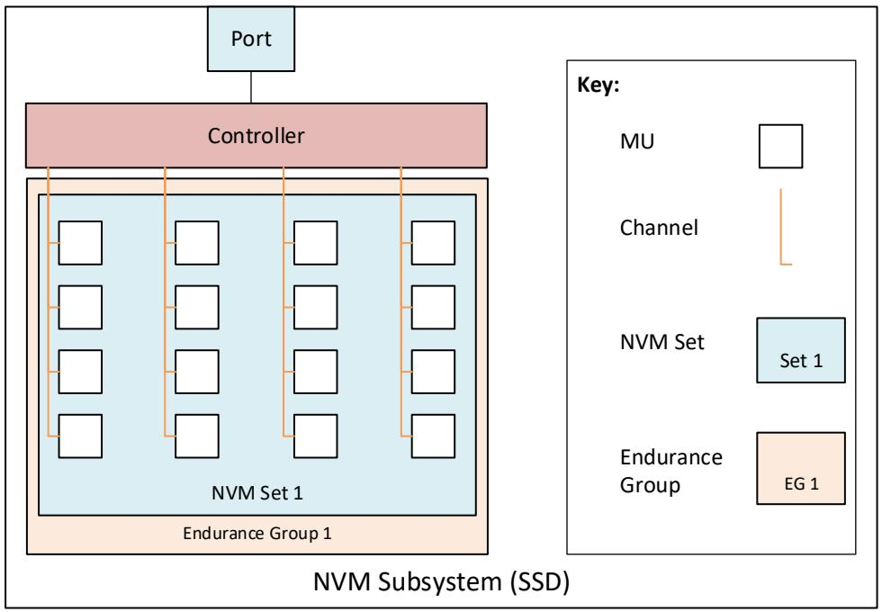

The Capacity Configuration Descriptor for this example contains one Endurance Group Configuration Descriptor. The Endurance Group Configuration Descriptor contains one NVM Set Identifier and four Channel Configuration Descriptors. Each Channel Configuration Descriptor contains four Media Unit Configuration Descriptors. 

# Vertically-Organized NVM Subsystem

Figure 87 shows an example of a single domain NVM subsystem where the performance goal is isolation among four NVM Sets at the cost of bandwidth. Endurance is managed separately for each set. Media Units sharing a Channel are allocated to the same Endurance Group. All Media Units in an Endurance Group are allocated to the same NVM Set. The bandwidth for any NVM Set is likely to be less than or equal to the bandwidth of the Channel of that NVM Set. 

Figure 87: Vertically-Organized NVM Subsystem

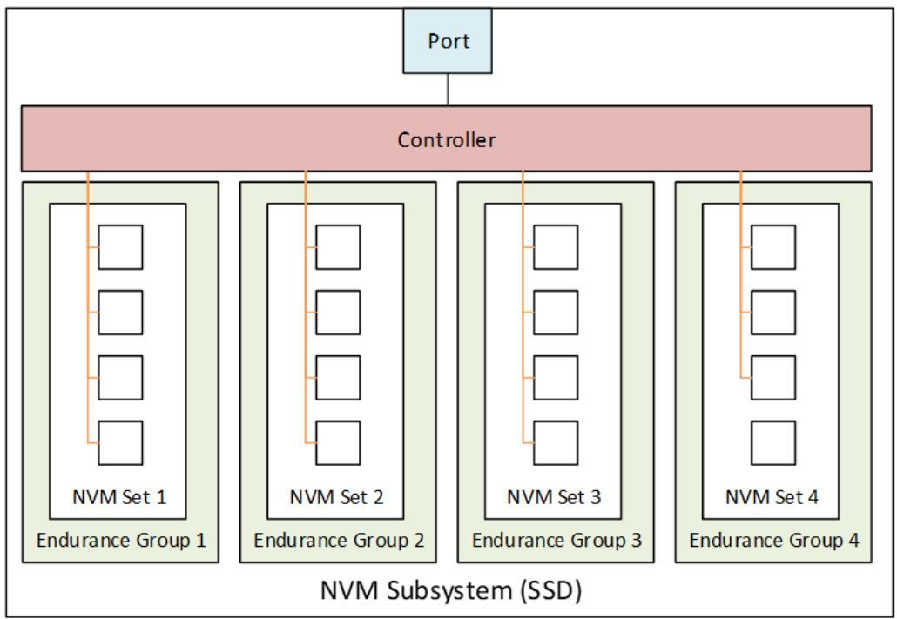

The Capacity Configuration Descriptor for this example contains four Endurance Group Configuration Descriptors. Each Endurance Group Configuration Descriptor contains one NVM Set Identifier and one Channel Configuration Descriptor. Each Channel Configuration Descriptor contains four Media Unit Configuration Descriptors. 

# Horizontally-Organized Dual NAND NVM Subsystem

Figure 88 shows an example of a single domain NVM subsystem where the Media Units are NAND which is capable of being operated as QLC or at a lower density. The performance goal is for maximum bandwidth to a small NVM Set operating as SLC and to a larger NVM Set operating as QLC. 

Figure 88: Horizontally-Organized Dual NAND NVM Subsystem

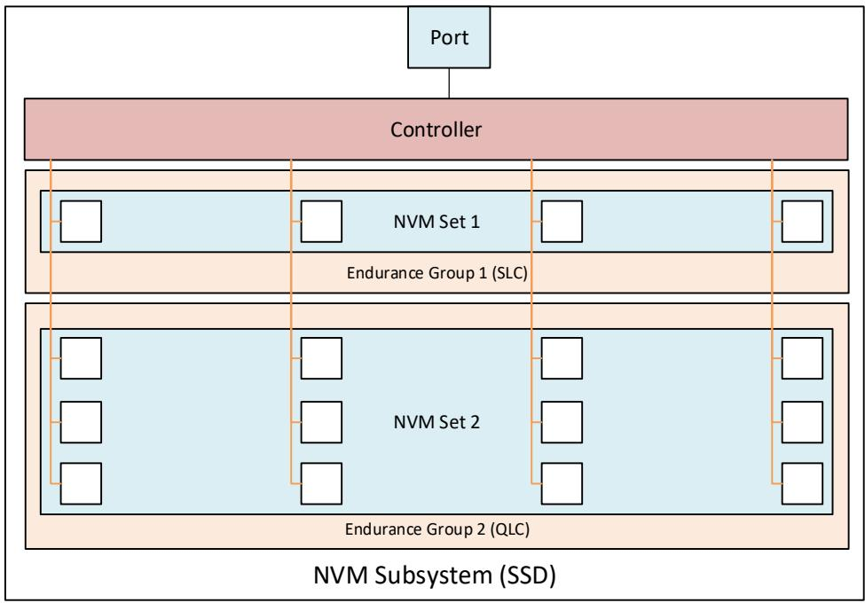

The Capacity Configuration Descriptor for this example contains two Endurance Group Configuration Descriptors. The first Endurance Group Configuration Descriptor for this example: 

• indicates a Capacity Adjustment Factor of approximately 400; 

contains one NVM Set Identifier; and 

contains four Channel Configuration Descriptors. Each Channel Configuration Descriptor contains one Media Unit Configuration Descriptor. 

The second Endurance Group Configuration Descriptor for this example: 

• indicates a Capacity Adjustment Factor of 100; 

contains one NVM Set Identifier; and 

contains four Channel Configuration Descriptors. Each Channel Configuration Descriptor contains three Media Unit Configuration Descriptors. 

# Capacity Reporting

For an NVM subsystem that does not support multiple domains, the capacity information reported in the Identify Controller data structure (i.e., the TNVMCAP field and the UNVMCAP field in Figure 312) describes the capacity for the NVM subsystem. If the MEGCAP field is non-zero, that field indicates the largest entity (e.g., Endurance Group, NVM Set, namespace that contains formatted storage) that may be created in the NVM subsystem. 

For an NVM subsystem that supports multiple domains, the capacity information reported in the Identify Controller data structure describes the capacity accessible by the controller processing the Identify command. The host may use the Identify command to access the Domain List data structure (refer to section 5.1.13.2.15) to determine the domains that are accessible by the controller and the capacity information for each of those domains. If the Max Endurance Group Domain Capacity field is non-zero, then the field describes the largest entity (e.g., Endurance Group, namespace that contains formatted storage) that may be created by this controller in the domain described by that Domain Attributes Entry. 

For an NVM subsystem that supports Endurance Groups (refer to section 3.2.3), the host may use the Identify command to access the Endurance Group List data structure (refer to section 5.1.13.2.16) to determine the Endurance Groups that are accessible by the controller. To determine the capacity 

information for each Endurance Group, the host uses the Get Log Page command to access the Endurance Group Information log page (refer to section 5.1.12.1.10). 

For an NVM subsystem that supports NVM Sets (refer to section 3.2.2), the host may use the Identify command to access the NVM Set List data structure (refer to section 5.1.13.2.4) to determine the NVM Sets that are accessible by the controller and the capacity information for each of those NVM Sets. 

For the management of Endurance Groups, NVM Sets, and namespaces that contain formatted storage, Figure 89 describes the effects of the support of NVM Sets, Endurance Groups, and domains on which capacity information is used for each management operation. 

Figure 89: Capacity Information Field Usage

<table><tr><td>Entity being created / deleted</td><td>NVM Sets supported</td><td>Endurance Groups supported</td><td>Domains supported</td><td>Capacity information used5</td></tr><tr><td rowspan="2">Endurance Group11</td><td rowspan="2">n/a</td><td rowspan="2">Yes</td><td>No</td><td>NVM subsystem7</td></tr><tr><td>Yes</td><td>Domain8</td></tr><tr><td>NVM Set11</td><td>Yes</td><td>Yes6</td><td>n/a</td><td>Endurance Group9</td></tr><tr><td rowspan="4">Namespace that contains formatted storage12</td><td rowspan="3">No</td><td rowspan="2">No</td><td>No</td><td>NVM subsystem7</td></tr><tr><td>Yes</td><td>Domain8</td></tr><tr><td>Yes</td><td>n/a</td><td>Endurance Group9</td></tr><tr><td>Yes</td><td>Yes6</td><td>n/a</td><td>NVM Set10</td></tr><tr><td colspan="5">Notes:5. This information described in this column is used by the host for creating the entity (e.g., to determine if there is sufficient available capacity) and this information is altered by the controller as a result of the creation or deletion of the entity (e.g., unallocated capacity decreased as a result of entity creation, or unallocated capacity increased as a result of entity deletion).6. NVM Set support requires support for Endurance Groups as described in section 3.2.2.7. Capacity information in the Identify Controller data structure (i.e., TNVMCAP field, UNVMCAP field, and MEGCAP fields (refer to Figure 312)).8. Capacity information in the Domain Attributes Entry (i.e., Total Domain Capacity field, Unallocated Domain Capacity field, and Max Endurance Group Domain Capacity field (refer to Figure 324)).9. Capacity information in the Endurance Group Information log page (i.e., TEGCAP field, UEGCAP field (refer to Figure 218)).10. Capacity information in the NVM Set Attributes Entry (i.e., Total NVM Set Capacity field, and Unallocated NVM Set Capacity field (refer to Figure 318)).11. Endurance Groups and NVM Sets are created and deleted using the Capacity Management command (refer to section 5.1.3)12. Namespaces are created and deleted using the Namespace Management command (refer to section 8.1.15).Namespaces are deleted using the Capacity Management command.</td></tr></table>

# 3.9 Keep Alive

The Keep Alive capability uses the Keep Alive Timer on a controller as a watchdog timer to detect communication failures (e.g., transport failure, host failure, or controller failure) between a host and a controller. If the Keep Alive Timer feature is supported (i.e., the KAS field is set to a non-zero value (refer to Figure 312)), the controller shall support the Keep Alive command. 

The term Keep Alive Timeout Time (KATT) refers to the time indicated by the value of the Keep Alive Timeout field on a controller (refer to Figure 397). 

The NVMe Transport binding specification for the associated NVMe Transport defines: 

• the minimum Keep Alive Timeout value, if any; 

the maximum Keep Alive Timeout value, if any; and 

• if the Keep Alive Timer feature is required to be supported and enabled. 

NVMe Transports that do not detect a connection loss in a timely manner shall require that the Keep Alive Timer feature be supported and enabled. 

# Keep Alive Timer Configuration

A host configures the Keep Alive Timer feature by specifying a Keep Alive Timeout value in: 

• the KATO field of a Fabric Connect command (refer to section 6.3); or 

the KATO field of a Set Features command specifying the Keep Alive Timer feature (refer to section 5.1.25.1.8). 

If an NVMe Transport binding specification requires the use of the Keep Alive Timer feature, and a command attempts to disable the Keep Alive Timer by clearing the Keep Alive Timeout value to 0h, then the controller shall abort that command with a status code of Keep Alive Timeout Invalid and the Keep Alive Timeout value at the controller shall not be changed. If a command attempts to set the Keep Alive Timeout value to a value that exceeds the maximum allowed by the associated NVMe Transport binding specification, then the controller shall abort that command with a status code of Keep Alive Timeout Invalid and the Keep Alive Timeout value at the controller shall not be changed. If a command sets the Keep Alive Timeout value to a non-zero value that is less than the minimum supported by the NVMe Transport or less than the minimum supported by the specific implementation, then the controller sets the Keep Alive Timeout value to that minimum value. 

As described in section 5.1.25.1.8, the controller rounds any Keep Alive Timeout value set by the host up to the nearest granularity as reported in the Keep Alive Support (KAS) field (refer to Figure 312). To retrieve the Keep Alive Timeout value being used by the controller, a host may issue a Get Features command for the Keep Alive Timer feature. 

# Keep Alive Timer Activation

The Keep Alive Timer is active if: 

• CC.EN is set to ‘1’; 

• CSTS.RDY is set to ‘1’; 

• CC.SHN is cleared to $\mathfrak { o o b }$ ; 

• CSTS.SHST is cleared to $\mathsf { \tilde { O } 0 b } \ '$ ; and 

the Keep Alive Timer feature is enabled as a result of the KATO field being set to a non-zero value (refer to section 3.9.1). 

Otherwise, the Keep Alive Timer is inactive, and a Keep Alive Timeout as described in sections 3.9.3.1 and 3.9.4.1 shall not occur on the controller. Activating an inactive Keep Alive Timer (e.g., a Set Features command successfully setting the Keep Alive Timeout value to a non-zero value from a value of 0h, or the host enabling a controller that supports NVMe over Fabrics where the Connect command specified a nonzero Keep Alive Timeout value (refer to Figure 545)) shall initialize the Keep Alive Timer to the Keep Alive Timeout value. 

While the Keep Alive Timer is active, the host should ensure that the Admin Submission Queue has space for a Keep Alive command. 

# Command Based Keep Alive

For Command Based Keep Alive, the Keep Alive command is sent periodically from the host to the controller on the Admin Queue. The completion of the Keep Alive command indicates that the host and controller are able to communicate. For message-based transports, the Keep Alive Timeout is the maximum time an association remains established without processing a Keep Alive command. 

# Command Based Keep Alive on the Controller

The controller is using Command Based Keep Alive if the controller supports the Keep Alive Timer feature and the TBKAS bit is cleared to $\mathbf { \vec { \nabla } } 0 ^ { \prime }$ in the Controller Attributes field in the Identify Controller data structure (refer to Figure 312). 

For Command Based Keep Alive: 

• The controller shall start the Keep Alive Timer if the Keep Alive Timer becomes active (refer to section 3.9.2). 

• The controller shall restart the Keep Alive Timer if the Keep Alive Timer is active, and: 

o a Keep Alive command completes successfully; or 

o a Set Features command specifying the Keep Alive Timer feature and a non-zero KATO field (refer to section 5.1.25.1.8) completes successfully. 

• The controller shall expire the Keep Alive Timer if: 

o the Keep Alive Timer is active in the controller; and 

o KATT has elapsed since the Keep Alive Timer was most recently started or restarted. 

If the Keep Alive Timer on the controller expires, then the controller shall consider a Keep Alive Timeout to have occurred. Upon the occurrence of a Keep Alive Timeout, the controller shall perform the cleanup actions described in section 3.9.5. 

# Command Based Keep Alive on the Host

The host may use Command Based Keep Alive regardless of the Keep Alive mode used by the controller. To prevent the controller from detecting a Keep Alive Timeout during the use of Command Based Keep Alive on the host, the host should send Keep Alive commands at KATT/2 to account for delays (e.g., transport round-trip times, transport delays, command processing times, and the Keep Alive Timer granularity) while the Keep Alive Timer is active on the controller. If the host receives a successful completion to a Set Features command for the Keep Alive feature, then the host should adjust the time at which the host sends the next Keep Alive command because the controller restarts the Keep Alive Timer. 

If a host detects a Keep Alive Timeout and has outstanding commands for which that host has not received completions (refer to section 3.4.5), then it is strongly recommended that the host take the steps described in section 9.6 to avoid possible data corruption caused by interaction between outstanding commands and subsequent commands submitted by that host to another controller. 

For an example host implementation of Command Based Keep Alive, the host maintains a Keep Alive Send Timer for each controller to which the host is connected. The host uses the Keep Alive Send Timer to track when the host sends a Keep Alive command to the corresponding controller. The host does not know when the controller fetches the Keep Alive command. Conservatively, the host assumes the controller fetches the Keep Alive command immediately upon the host sending the Keep Alive command. The host tracks this time as the last expired timestamp of the Keep Alive Send Timer, for use when starting or restarting the Keep Alive Send Timer. While the host does restart the Keep Alive Send Timer after a successful Set Features command for the KATO feature, the host does not change the last expired timestamp when sending that Set Features command because at that point in time the host does not know the results of that command. 

This example host implementation of Command Based Keep Alive behaves as follows: 

The host enables the Keep Alive Send Timer if the host requests activation of the Keep Alive Timer on the controller (e.g., the host enables the controller (refer to section 3.9.2)). The host records the current time as the last expired timestamp when the Keep Alive Send Timer becomes enabled. 

The host disables the Keep Alive Send Timer if the host requests deactivation of the Keep Alive Timer on the controller and the host receives a successful response from the controller (e.g., the host disables the controller (refer to section 3.9.2)). 

• The host starts a Keep Alive Send Timer if: 

o the Keep Alive Send Timer becomes enabled; or 

o a successful Keep Alive command completion is processed by the host. 

The host restarts a Keep Alive Send Timer if: 

o the Keep Alive Send Timer is enabled; 

o a Keep Alive command is not outstanding; and, 

o a successful Set Features command completion is processed by the host where the command specified the Keep Alive Timer feature (i.e., Feature Identifier 0Fh) and a nonzero KATO field. 

• If a Keep Alive Send Timer starts or restarts, the host sets the Keep Alive Send Timer to: 

o KATT/2 minus the time elapsed since the last expired timestamp; or 

o zero, if the time elapsed since the last expired timestamp is greater than KATT/2. 

• The host stops a Keep Alive Send Timer if the Keep Alive Send Timer becomes disabled. 

If a Keep Alive Send Timer expires, (i.e., the Keep Alive Send Timer is still enabled and time has elapsed equal to the value to which the Keep Alive Send Timer was set since the host most recently started or restarted the Keep Alive Send Timer), then the host records the current time as the last expired timestamp and sends a Keep Alive command. 

The host detects a Keep Alive Timeout if the host sends a Keep Alive command and does not receive a completion for the Keep Alive command before KATT elapses from when the Keep Alive command was sent. 

# Traffic Based Keep Alive

Traffic Based Keep Alive allows the host and controller to avoid a Keep Alive Timeout in the presence of Admin or I/O command processing without sending Keep Alive commands. 

# Traffic Based Keep Alive on the Controller

If the controller supports the Keep Alive Timer feature, then support for Traffic Based Keep Alive is indicated by the TBKAS bit in the Controller Attributes field in the Identify Controller data structure (refer to Figure 312). If the Controller does not support Traffic Based Keep Alive (i.e., the TBKAS bit is cleared to $ { \mathbf { \vec { \mathbf { \rho } } } } _ { 0 } ,$ ), then the operation of the Keep Alive Timer feature is described in section 3.9.3. 

For Traffic Based Keep Alive: 

The controller shall start a Keep Alive Timeout Interval if the Keep Alive Timer becomes active (refer to section 3.9.2). 

• The controller shall consider a Keep Alive Timeout to have occurred if: 

o the Keep Alive Timer is active; 

o KATT has elapsed since the start of the most recent Keep Alive Timeout Interval; and 

o no Admin command or I/O command was fetched by the controller during the Keep Alive Timeout Interval. 

• The controller shall end a Keep Alive Timeout Interval and: 

o not start a new Keep alive Timeout Interval if: 

▪ a Keep Alive Timeout occurs; or 

▪ the Keep Alive Timer becomes inactive (refer to section 3.9.2). 

o start a new Keep Alive Timeout Interval if the Keep Alive Timer is active, and: 

▪ a Keep Alive command completes successfully; 

a Set Features command specifying the Keep Alive Timer feature and a non-zero KATO field (refer to section 5.1.25.1.8) completes successfully; or 

KATT has elapsed since the start of the Keep Alive Timeout Interval and a Keep Alive Timeout did not occur during the Keep Alive Timeout Interval (e.g., an Admin command or an I/O command was fetched by the controller during the Keep Alive Timeout Interval). 

Upon the occurrence of a Keep Alive Timeout, the controller shall perform the cleanup actions described in section 3.9.5. 

A controller using Traffic Based Keep Alive may require up to $2 ^ { \star }$ KATT after the controller fetches the most recent command to detect a Keep Alive Timeout as shown in Figure 90. 

Figure 90: Detecting Timeout Takes up to 2 * KATT

Figure 90 shows that periodic check 3, not periodic check 2, detects the Keep Alive Timeout. Therefore, the time between fetching the most recent command and the check that detects the timeout (i.e., periodic

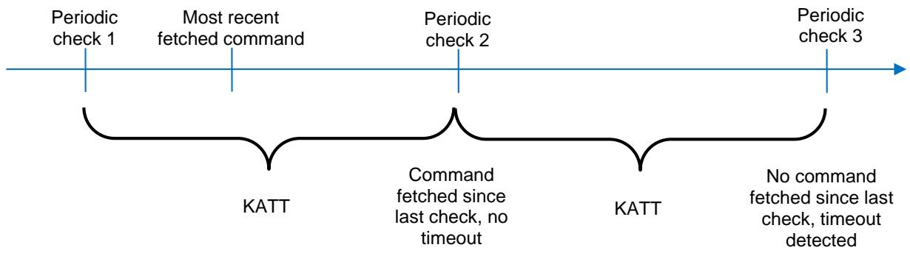

check 3 in Figure 90) is up to 2 * KATT.

# Traffic Based Keep Alive on the Host

The host is able to use Traffic Based Keep Alive only if the controller is also using Traffic Based Keep Alive. The host should not use Traffic Based Keep Alive if the controller is not using Traffic Based Keep Alive because a controller that uses Command Based Keep Alive detects a Keep Alive Timeout based on the absence of Keep Alive commands, not the absence of all commands. 

Traffic Based Keep Alive on the host is the same as Command Based Keep Alive on the host (refer to section 3.9.3.2), with two exceptions: 

The host is not required to submit a Keep Alive command if the host submitted an Admin command or I/O command and the host processed the completion for that command since the most recent time the host checked whether sending a Keep Alive command was necessary. 

To prevent the controller from detecting a Keep Alive Timeout during the use of Traffic Based Keep Alive on the host, the host should check for sending a Keep Alive command at a rate of KATT/4, instead of sending a Keep Alive command at a rate of KATT/2, while the Keep Alive Timer is active on the controller. 

Like Command Based Keep Alive, if the host receives a successful completion to a Set Features command for the Keep Alive feature, then the host should adjust the time at which the host checks for sending the next Keep Alive command because the controller restarted the Keep Alive Timer. 

If a host detects a Keep Alive Timeout and has outstanding commands for which that host has not received completions (refer to section 3.4.5), then it is strongly recommended that the host take the steps described in section 9.6 to avoid possible data corruption caused by interaction between outstanding commands and subsequent commands submitted by that host to another controller. 

For an example host implementation of Traffic Based Keep Alive, the host maintains a Keep Alive Send Timer for each controller to which that host is connected. The host uses the Keep Alive Send Timer to track when the host checks for sending a Keep Alive command to the corresponding controller. The host does not know when the controller fetches the Keep Alive command. Conservatively, the host assumes the controller fetches the Keep Alive command immediately upon the host sending the Keep Alive command. Whether or not the host sends a Keep Alive command after the Keep Alive Send Timer expires, the host tracks this time as the last expired timestamp of the Keep Alive Send Timer, for use when starting or restarting the Keep Alive Send Timer. While the host does restart the Keep Alive Send Timer after a successful Set Features command for the KATO feature, the host does not change the last expired timestamp when sending that Set Features command because at that point in time the host does not know the results of that command. 

This example host implementation of Traffic Based Keep Alive behaves as follows: 

The host enables the Keep Alive Send Timer if the host requests activation of the Keep Alive Timer on the controller (e.g., the host enables the controller (refer to section 3.9.2)). The host records the current time as the last expired timestamp when the Keep Alive Send Timer becomes enabled. 

The host disables the Keep Alive Send Timer if the host requests deactivation of the Keep Alive Timer on the controller and the host receives a successful response from the controller (e.g., the host disables the controller (refer to section 3.9.2)). 

• The host starts a Keep Alive Send Timer if: 

o the Keep Alive Send Timer becomes enabled; or 

o a successful Keep Alive command completion is processed by the host. 

• The host restarts a Keep Alive Send Timer if: 

o the Keep Alive Send Timer is enabled; 

o a Keep Alive command is not outstanding; and 

o a successful Set Features command completion is processed by the host where the command specified the Keep Alive Timer feature (i.e., Feature Identifier 0Fh) and a nonzero KATO field. 

• If a Keep Alive Send Timer starts or restarts, the host sets the Keep Alive Send Timer to: 

o KATT/4 minus the time elapsed since the last expired timestamp; or 

o zero, if the time elapsed since the last expired timestamp is greater than KATT/4. 

• The host stops a Keep Alive Send Timer if the Keep Alive Send Timer becomes disabled 

If a Keep Alive Send Timer expires, (i.e., the Keep Alive Send Timer is still enabled and time has elapsed equal to the value to which the Keep Alive Send Timer was set since the host most recently started or restarted the Keep Alive Send Timer), then the host records the current time as the last expired timestamp and the host either: 

o starts a new Keep Alive Send Timer, if at least one Admin command or I/O command was submitted to the controller and the completion of that command was processed by the host since the last Keep Alive Send Timer started (not restarted); or 

o sends a Keep Alive command. 

The host detects a Keep Alive Timeout if the host sends a Keep Alive command and does not receive a completion for that Keep Alive command before KATT elapses from when the Keep Alive command was submitted. 

# Keep Alive Timeout Cleanup

If a controller detects a Keep Alive Timeout, then the controller shall perform the following actions within the time specified by the CQT field (refer to Figure 312): 

• record an Error Information Log Entry with the status code Keep Alive Timeout Expired; 

stop processing commands; 

set the Controller Fatal Status (CSTS.CFS) bit to ‘1’; and 

• for message-based transports: 

o terminate the NVMe Transport connections for this association; and 

o break the host to controller association. 

For message-based transports, after completing these steps, a controller may accept a Connect command (refer to section 6.3) for the Admin Queue from the same or another host in order to form a new association. 

If a host detects a Keep Alive Timeout and has outstanding commands for which that host has not received completions (refer to section 3.4.5), then it is strongly recommended that the host takes steps described in 

section 9.6 to avoid possible data corruption caused by interaction between outstanding commands and subsequent commands submitted by that host to another controller. 

# 3.10 Privileged Actions

Privileged actions are actions (e.g., command, property write) that affect or have the potential to affect the state beyond the controller and attached namespaces. 

Examples of privileged actions are: 

Admin commands including Namespace Management, Namespace Attachment, Virtualization Management, Format NVM, Set Features with Feature Identifier 17h (i.e., Sanitize Config, refer to section 5.1.25.1.15), Sanitize, Capacity Management, Controller Data Queue, Migration Receive, Migration Send, Track Send, and Track Receive; 

• Property Writes including NVM Subsystem Reset; and 

• Some Vendor specific commands and properties. 

# 3.11 Firmware Update Process

The process for a firmware update to be activated in a domain (refer to section 3.2.5) by a reset is: 

1. The host issues a Firmware Image Download command to download the firmware image to a controller. There may be multiple portions of the firmware image to download, thus the offset for each portion of the firmware image being downloaded on that controller is specified in the Firmware Image Download command. The data provided in the Firmware Image Download command should conform to the Firmware Update Granularity indicated in the Identify Controller data structure or the firmware update may fail; 

2. After the firmware is downloaded to that controller, the next step is for the host to submit a Firmware Commit command to that controller. The Firmware Commit command verifies that the last firmware image downloaded is valid and commits that firmware image to the firmware slot indicated for future use. A firmware image that does not start at offset zero, contains gaps, or contains overlapping regions is considered invalid. A controller may employ additional vendor specific means (e.g., checksum, CRC, cryptographic hash, or a digital signature) to determine the validity of a firmware image: 

a. The Firmware Commit command may also be used to activate a firmware image associated with a previously committed firmware slot; 

3. The host performs an action that results in a Controller Level Reset (refer to section 3.7.2) on that controller to cause the firmware image specified in the Firmware Slot field in the Firmware Commit command to be activated: 

a. In some cases, a Conventional Reset (refer to the NVM Express NVMe over PCIe Transport Specification) or NVM Subsystem Reset is required to activate a firmware image. This requirement is indicated by Firmware Commit command specific status (refer to section 5.1.8.1); 

and 

4. After the reset has completed, host software re-initializes the controller. This includes re-allocating I/O Submission and Completion Queues. Refer to sections 3.5.1 and 3.5.2. 

The process for a firmware update to be activated on a domain without a reset is: 

1. The host issues a Firmware Image Download command to download the firmware image to a controller. There may be multiple portions of the firmware image to download, thus the offset for each portion of the firmware image being downloaded on that controller is specified in the Firmware Image Download command. The data provided in the Firmware Image Download command should conform to the Firmware Update Granularity indicated in the Identify Controller data structure or the firmware update may fail; 

2. The host submits a Firmware Commit command on that controller with a Commit Action of 011b which specifies that the firmware image should be activated immediately without reset. The downloaded firmware image shall replace the firmware image in the firmware slot. If no firmware image was downloaded since the last reset or Firmware Commit command, (i.e., the first step was skipped), then that controller shall verify and activate the firmware image in the specified slot. If that controller starts to activate the firmware image, any controllers affected by the new firmware image send a Firmware Activation Starting asynchronous event to the host if Firmware Activation Notices are enabled (refer to Figure 391): 

a. The Firmware Commit command may also be used to activate a firmware image associated with a previously committed firmware slot; 

3. The controller completes the Firmware Commit command. The following actions are taken in certain error scenarios: 

a. If the firmware image is invalid, then the controller aborts the command with an appropriate status code (e.g., Invalid Firmware Image); 

b. If the firmware activation was not successful because a Controller Level Reset is required to activate this firmware image, then the controller aborts the command with a status code of Firmware Activation Requires Controller Level Reset and the firmware image is applied at the next Controller Level Reset; 

c. If the firmware activation was not successful because an NVM Subsystem Reset is required to activate this firmware image, then the controller aborts the command with a status code of Firmware Activation Requires NVM Subsystem Reset and the firmware image is applied at the next NVM Subsystem Reset; 

d. If the firmware activation was not successful because a Conventional Reset is required to activate this firmware image, then the controller aborts the command with a status code of Firmware Activation Requires Conventional Reset and the firmware image is applied at the next Conventional Reset; and 

e. If the firmware activation was not successful because the firmware activation time requires more time than the time reported by the MTFA field in the Identify Controller data structure, then the controller aborts the command with a status code of Firmware Activation Requires Maximum Time Violation. In this case, the firmware image was committed to the specified firmware slot. To activate that firmware image, the host may issue a Firmware Commit command that specifies: 

i. a Commit Action set to 010b (i.e., activate using a Controller Level Reset); and ii. the same firmware slot. 

If the controller transitions to the D3cold state (refer to the PCI Express Base Specification) after the submission of a Firmware Commit command that attempts to activate a firmware image and before the completion of that command, then the controller may resume operation with either the firmware image active at the time the Firmware Commit command was submitted or the firmware image that was activated by that command. 

If the firmware image is not able to be successfully loaded, then the controller shall revert to the firmware image present in the most recently activated firmware slot or the baseline read-only firmware image, if available, and indicate the failure as an asynchronous event with a Firmware Image Load Error. If the controller changes (e.g., reverts) the firmware image while a sanitize operation is in progress, then that sanitize operation fails (refer to section 8.1.24.3). 

If a host overwrites (i.e., updates) the firmware image in the active firmware slot, then the previously active firmware image may no longer be available. As a result, any action (e.g., power cycling the controller) that requires the use of that firmware slot may instead use the firmware image that is currently in that firmware slot. If the firmware image that is currently in that firmware slot would be activated by such an action replacing the currently active firmware, then: 

• this is a pending firmware activation with reset; and 

a controller aborts subsequent Sanitize commands with a status code indicating the appropriate reset required to activate the pending activation as defined in section 5.1.22. 

Host software should not overlap firmware/boot partition image update command sequences (refer to section 1.5.41). During a firmware image update command sequence, if a Firmware Image Download command or a Firmware Commit command is submitted for another firmware/boot partition image update command sequence, the results of both that command and the in-progress firmware image update are undefined. 

Host software should use the same controller or Management Endpoint (refer to the NVM Express Management Interface Specification) for all commands that are part of a firmware image update command sequence. If the commands for a single firmware/boot partition image update command sequence are submitted to more than one controller and/or Management Endpoint, the controller may abort the Firmware Commit command with Invalid Firmware Image status. 

After downloading a firmware image, host software issues a Firmware Commit command before downloading additional firmware images. Processing of the first Firmware Image Download command after completion of a Firmware Commit command shall cause the controller to discard remaining portions, if any, of downloaded images. If a reset occurs between a firmware download and completion of the Firmware Commit command, then the controller shall discard all portion(s), if any, of downloaded images. 

# 4 Data Structures

This section describes data structures used by the NVM Express Interface. 

# 4.1 Submission Queue Entry

# Admin Command and I/O Command Common SQE

Each Common Command Format command is 64 bytes in size. 

Command Dword 0, Namespace Identifier, Metadata Pointer, PRP Entry 1, PRP Entry 2, SGL Entry 1, and Metadata SGL Segment Pointer have common definitions for all Admin commands and I/O commands for all I/O Command Sets. Metadata Pointer, PRP Entry 1, PRP Entry 2, and Metadata SGL Segment Pointer are not used by all commands. Command Dword 0 is defined in Figure 91. 

Figure 91: Command Dword 0

<table><tr><td>Bits</td><td colspan="2">Description</td></tr><tr><td>31:16</td><td colspan="2">Command Identifier (CID): This field specifies a unique identifier for the command when combined with the Submission Queue identifier.
The value of FFFFh should not be used as the Error Information log page (refer to section 5.1.12.1.2) uses this value to indicate an error is not associated with a particular command.</td></tr><tr><td rowspan="7">15:14</td><td colspan="2">PRP or SGL for Data Transfer (PSDT): This field specifies whether PRPs or SGLs are used for any data transfer associated with the command. PRPs shall be used for all Admin commands for NVMe over PCIe implementations. SGLs shall be used for all Admin and I/O commands for NVMe over Fabrics implementations (i.e., this field set to 01b). An NVMe Transport may support only specific values (refer to the applicable NVMe Transport binding specification for details).</td></tr><tr><td>Value</td><td>Definition</td></tr><tr><td>00b</td><td>PRPS Used: PRPs are used for this transfer.</td></tr><tr><td>01b</td><td>SGLs Used MPTR Address: SGLs are used for this transfer. If used, Metadata Pointer (MPTR) contains an address of a single contiguous physical buffer.
Refer to the Metadata Buffer Alignment (MBA) bit of the SGLS field in the Identify Controller data structure (refer to Figure 312) for alignment requirements.</td></tr><tr><td>10b</td><td>SGLs Used MPTR SGL Segment: SGLs are used for this transfer. If used, Metadata Pointer (MPTR) contains an address of an SGL segment containing exactly one SGL Descriptor that is qword aligned.</td></tr><tr><td>11b</td><td>Reserved</td></tr><tr><td colspan="2">If there is metadata that is not interleaved with the user data, as specified in the Format NVM command, then the Metadata Pointer (MPTR) field is used to point to the metadata. The definition of the Metadata Pointer field is dependent on the setting in this field. Refer to Figure 92.</td></tr><tr><td>13:10</td><td colspan="2">Reserved</td></tr><tr><td rowspan="6">09:08</td><td colspan="2">Fused Operation (FUSE): In a fused operation, a complex command is created by “fusing” together two simpler commands. Refer to section 3.4.2. This field specifies whether this command is part of a fused operation and if so, which command it is in the sequence.</td></tr><tr><td>Value</td><td>Definition</td></tr><tr><td>00b</td><td>Normal operation</td></tr><tr><td>01b</td><td>First command of Fused operation</td></tr><tr><td>10b</td><td>Second command of Fused operation</td></tr><tr><td>11b</td><td>Reserved</td></tr></table>

Figure 91: Command Dword 0

<table><tr><td>Bits</td><td colspan="2">Description</td><td></td></tr><tr><td rowspan="9">07:00</td><td colspan="2">Opcode (OPC): This field specifies the opcode of the command to be executed as shown here:</td><td></td></tr><tr><td>Bits</td><td>Description</td><td></td></tr><tr><td>07:02</td><td>Function (FN): This field contains a value that, in combination with the other fields in the Opcode data structure, creates a unique combined opcode value.</td><td></td></tr><tr><td rowspan="6">01:00</td><td>Data Transfer Direction (DTD): This field indicates the direction of a data transfer, if any. All options of the command shall transfer data as specified or transfer no data. All commands, including vendor specific commands, shall follow this convention.</td><td></td></tr><tr><td>Value</td><td>Definition</td></tr><tr><td>00b</td><td>No Data Transfer: No data is transferred.</td></tr><tr><td>01b</td><td>Host to Controller Transfer: Data is transferred from the host to the controller.</td></tr><tr><td>10b</td><td>Controller to Host Transfer: Data is transferred from the controller to the host.</td></tr><tr><td>11b</td><td>Bi-Directional Transfer: Data is transferred from the host to the controller and from the controller to the host.</td></tr></table>

The Common Command Format is defined in Figure 92. Any additional I/O Command Set defined in the future may use an alternate command size or format. 

SGLs shall not be used for Admin commands in NVMe over PCIe implementations. 

Figure 92: Common Command Format

<table><tr><td>Bytes</td><td>Description</td></tr><tr><td>03:00</td><td>Command Dword 0 (CDW0): This field is common to all commands and is defined in Figure 91.</td></tr><tr><td>07:04</td><td>Namespace Identifier (NSID): This field specifies the namespace that this command applies to. If the namespace identifier is not used for the command, then this field shall be cleared to 0h. The value FFFFFFFH in this field is a broadcast value (refer to section 3.2.1.2), where the scope (e.g., the NVM subsystem, all attached namespaces, or all namespaces in the NVM subsystem) is dependent on the command. Refer to Figure 141 and Figure 555 for commands that support the use of the value FFFFFFFH in this field.Specifying an inactive namespace identifier (refer to section 3.2.1.4) in a command that uses the namespace identifier shall cause the controller to abort the command with a status code of Invalid Field in Command, unless otherwise specified. Specifying an invalid namespace identifier (refer to section 3.2.1.2) in a command that uses the namespace identifier shall cause the controller to abort the command with a status code of Invalid Namespace or Format, unless otherwise specified.If the namespace identifier is used for the command (refer to Figure 141), the value FFFFFFFH is not supported for that command, and the host specifies a value of FFFFFFFH, then the controller shall abort the command with a status code of Invalid Field in Command, unless otherwise specified.If the namespace identifier is not used for the command and the host specifies a value from 1h to FFFFFFFH, then the controller shall abort the command with a status code of Invalid Field in Command, unless otherwise specified.</td></tr><tr><td>11:08</td><td>Command Dword 2 (CDW2): This field is command specific Dword2.</td></tr><tr><td>15:12</td><td>Command Dword 3 (CDW3): This field is command specific Dword3.</td></tr></table>

Figure 92: Common Command Format

<table><tr><td>Bytes</td><td>Description</td></tr><tr><td rowspan="3">23:16</td><td>Metadata Pointer (MPTR): If CDW0.PSDT (refer to Figure 91 is cleared to 00b, then this field shall contain the address of a contiguous physical buffer of metadata and that address shall be dword aligned (i.e., bits 1:0 cleared to 00b). The controller is not required to check that bits 1:0 are cleared to 00b. The controller may report an error of Invalid Field in Command if bits 1:0 are not cleared to 00b. If the controller does not report an error of Invalid Field in Command, then the controller shall operate as if bits 1:0 are cleared to 00b.</td></tr><tr><td>If CDW0.PSDT is set to 01b, then this field shall contain the address of a contiguous physical buffer of metadata. Refer to the Metadata Buffer Alignment (MBA) bit of the SGLS field in the Identify Controller data structure for alignment requirements.</td></tr><tr><td>If CDW0.PSDT is set to 10b, then this field shall contain the address of an SGL segment that contains exactly one SGL Descriptor. The address of that SGL segment shall be qword aligned (i.e., bits 2:0 cleared to 000b). The SGL Descriptor contained in that SGL segment is the first SGL Descriptor of the metadata for the command. If the SGL Descriptor contained in that SGL segment is an SGL Data Block descriptor, then that SGL Data Block Descriptor is the only SGL Descriptor and therefore describes the entire metadata data transfer. Refer to section 4.3.2. The controller is not required to check that bits 2:0 are cleared to 000b. The controller may report an error of Invalid Field in Command if bits 2:0 are not cleared to 000b. If the controller does not report an error of Invalid Field in Command, then the controller shall operate as if bits 2:0 are cleared to 000b.</td></tr></table>

Figure 92: Common Command Format

<table><tr><td>Bytes</td><td colspan="2">Description</td></tr><tr><td rowspan="3">39:24</td><td colspan="2">Data Pointer (DPTR): This field specifies the data used in the command.
If CDW0.PSDT is cleared to 00b, then the definition of this field is:</td></tr><tr><td>39:32</td><td>PRP Entry 2 (PRP2): This field:
• is reserved if the data transfer does not cross a memory page boundary;
• specifies the Page Base Address of the second memory page if the data transfer crosses exactly one memory page boundary. E.g.,:
○ the command data transfer length is equal in size to one memory page and the offset portion of the PBAO field of PRP1 is non-zero; or
○ the Offset portion of the PBAO field of PRP1 is equal to 0h and the command data transfer length is greater than one memory page and less than or equal to two memory pages in size;
and
• is a PRP List pointer if the data transfer crosses more than one memory page boundary. E.g.,:
○ the command data transfer length is greater than or equal to two memory pages in size but the offset portion of the PBAO field of PRP1 is non-zero; or
○ the command data transfer length is equal in size to more than two memory pages and the Offset portion of the PBAO field of PRP1 is equal to 0h.</td></tr><tr><td>31:24</td><td>PRP Entry 1 (PRP1): This field contains:
• the first PRP entry for the command; or
• a PRP List pointer,
depending on the command (e.g., the Create I/O Completion Queue command (refer to Figure 473)).</td></tr><tr><td colspan="3">If CDW0.PSDT is set to 01b or 10b, then the definition of this field is:</td></tr><tr><td></td><td>39:24</td><td>SGL Entry 1 (SGL1): This field contains the first SGL segment for the command. If the SGL segment is an SGL Data Block or Keyed SGL Data Block or Transport SGL Data Block descriptor, then it describes the entire data transfer. If more than one SGL segment is needed to describe the data transfer, then the first SGL segment is a Segment, or Last Segment descriptor. Refer to section 4.3.2 for the definition of SGL segments and descriptor types.
The NVMe Transport may support a subset of SGL Descriptor types and features as defined in the NVMe Transport binding specification.</td></tr><tr><td>43:40</td><td colspan="2">Command Dword 10 (CDW10): This field is command specific Dword 10.</td></tr><tr><td>47:44</td><td colspan="2">Command Dword 11 (CDW11): This field is command specific Dword 11.</td></tr><tr><td>51:48</td><td colspan="2">Command Dword 12 (CDW12): This field is command specific Dword 12.</td></tr><tr><td>55:52</td><td colspan="2">Command Dword 13 (CDW13): This field is command specific Dword 13.</td></tr><tr><td>59:56</td><td colspan="2">Command Dword 14 (CDW14): This field is command specific Dword 14.</td></tr><tr><td>63:60</td><td colspan="2">Command Dword 15 (CDW15): This field is command specific Dword 15.</td></tr></table>

In addition to the fields commonly defined for the Common Command Format, Vendor Specific commands may support the Number of Dwords in Data Transfer and Number of Dwords in Metadata Transfer fields. If supported, the command format for the Vendor Specific commands are defined in Figure 93. For more details, refer to section 8.1.26. 

Figure 93: Common Command Format – Vendor Specific Commands (Optional)

<table><tr><td>Bytes</td><td>Description</td></tr><tr><td>03:00</td><td>Command Dword 0 (CDW0): This field is common to all commands and is defined in Figure 91.</td></tr><tr><td>07:04</td><td>Namespace Identifier (NSID): This field indicates the namespace ID that this command applies to. If the namespace ID is not used for the command, then this field shall be cleared to 0h. Setting this value to FFFFFFFh causes the command to be applied to all namespaces attached to the controller processing the command, unless otherwise specified.The behavior of a controller in response to an inactive namespace ID for a vendor specific command is vendor specific. Specifying an invalid namespace ID in a command that uses the namespace ID shall cause the controller to abort the command with a status code of Invalid Namespace or Format, unless otherwise specified.</td></tr><tr><td>15:08</td><td>Reserved</td></tr><tr><td>39:16</td><td>Meatadata and Data Pointers (MDPTR): Refer to Figure 92 for the definition of these fields.</td></tr><tr><td>43:40</td><td>Number of Dwords in Data Transfer (NDT): This field indicates the number of droids in the data transfer.</td></tr><tr><td>47:44</td><td>Number of Dwords in Metadata Transfer (NDM): This field indicates the number of droids in the metadata transfer.</td></tr><tr><td>51:48</td><td>Command Dword 12 (CDW12): This field is command specific Dword 12.</td></tr><tr><td>55:52</td><td>Command Dword 13 (CDW13): This field is command specific Dword 13.</td></tr><tr><td>59:56</td><td>Command Dword 14 (CDW14): This field is command specific Dword 14.</td></tr><tr><td>63:60</td><td>Command Dword 15 (CDW15): This field is command specific Dword 15.</td></tr></table>

# Fabrics Command Common SQE

The common submission queue entry for Fabrics commands is shown in Figure 94. 

Figure 94: Fabrics Command – Submission Queue Entry Format

<table><tr><td>Bytes</td><td colspan="2">Description</td><td></td></tr><tr><td>03:00</td><td colspan="2">Command Dword 0 (CDW0): Refer to Figure 95.</td><td></td></tr><tr><td rowspan="9">04</td><td colspan="2">Fabrics Command Type (FCTYPE): This field specifies the Fabrics command transferred in the capsule. The Fabrics command types are defined in Figure 540. If this field is set to a reserved value, then the command shall be aborted with a status code of Invalid Field in Command. The format of the FCTYPE field is shown here:</td><td></td></tr><tr><td>Bits</td><td>Description</td><td></td></tr><tr><td>07:02</td><td>Function (FN): This field contains a value that, in combination with the other fields in the Fabrics Command Type data structure, creates a unique Combined Fabrics Command Type.</td><td></td></tr><tr><td rowspan="6">01:00</td><td>Data Transfer Direction (DTD): This field indicates the direction of a data transfer, if any. All options of the command shall transfer data as specified or transfer no data. All commands, including vendor specific commands, shall follow this convention.</td><td></td></tr><tr><td>Value</td><td>Definition</td></tr><tr><td>00b</td><td>No Data Transfer: No data is transferred.</td></tr><tr><td>01b</td><td>Host to Controller Transfer: Data is transferred from the host to the controller.</td></tr><tr><td>10b</td><td>Controller to Host Transfer: Data is transferred from the controller to the host.</td></tr><tr><td>11b</td><td>Reserved</td></tr><tr><td>23:05</td><td colspan="2">Reserved</td><td></td></tr><tr><td>39:24</td><td colspan="2">SGL Descriptor 1 (SGL1): This field contains a Transport SGL Data Block descriptor or a Keyed SGL Data Block descriptor that describes the entire data transfer. Refer to section 4.3.2 for the definition of SGL descriptors. This field is used for Fabrics commands that transfer data. If a Fabrics command does not transfer data, then this field is reserved.</td><td></td></tr></table>

Figure 94: Fabrics Command – Submission Queue Entry Format

<table><tr><td>Bytes</td><td>Description</td></tr><tr><td>63:40</td><td>Fabrics Command Type Specific (FCTS): This field is Fabrics command type specific.</td></tr></table>

Figure 95: Fabrics Command – Command Dword 0

<table><tr><td>Bits</td><td colspan="2">Description</td></tr><tr><td>31:16</td><td colspan="2">Command Identifier (CID): Refer to Figure 91.</td></tr><tr><td rowspan="6">15:14</td><td colspan="2">PRP or SGL for Data Transfer (PSDT):</td></tr><tr><td>Value</td><td>Description</td></tr><tr><td>00b</td><td>No Data Transferred: This value is used for Fabrics commands that do not transfer data.
If this value is used for Fabrics commands that transfer data, then SGLs are used for this transfer. A host should use the value 10b rather than 00b for Fabrics commands that transfer data.</td></tr><tr><td>01b</td><td>Reserved</td></tr><tr><td>10b</td><td>Data Transferred: This value is used for Fabrics commands that transfer data. SGLs are used for this transfer.</td></tr><tr><td>11b</td><td>Reserved</td></tr><tr><td>13:10</td><td colspan="2">Reserved</td></tr><tr><td>09:08</td><td colspan="2">Fused Operation (FUSE): Refer to Figure 91. There are no fused Fabrics commands and as a result this field is cleared to 00b.</td></tr><tr><td>07:00</td><td colspan="2">Opcode (OPC): This field is set to 7Fh to specify a Fabrics command.</td></tr></table>

# 4.2 Completion Queue Entry

# Admin Command and I/O Command Common CQE

The Common Completion Queue Entry Layout is at least 16 bytes in size. Figure 96 describes the layout of the first 16 bytes of the completion queue entry data structure which follows the Common Completion Queue Entry Layout. The contents of Dword 0 and Dword 1 are command specific. If a command uses Dword 0 or Dword 1, then the definition of these dwords is contained within the associated command definition. If a command does not use Dword 0 or Dword 1, then the unused field(s) are reserved. Dword 2 is defined in Figure 97 and Dword 3 is defined in Figure 98. 

If a completion queue entry is constructed via multiple writes, the Phase Tag bit shall be updated in the last write of that completion queue entry. 

Figure 96: Common Completion Queue Entry Layout – Admin and All I/O Command Sets

<table><tr><td></td><td>31</td><td>23</td><td>15</td><td>7</td><td>0</td></tr><tr><td>DW0</td><td colspan="5">Command Specific</td></tr><tr><td>DW1</td><td colspan="5">Command Specific</td></tr><tr><td>DW2</td><td colspan="2">SQ Identifier</td><td colspan="3">SQ Head Pointer</td></tr><tr><td>DW3</td><td>Status</td><td>P</td><td colspan="3">Command Identifier</td></tr></table>

Figure 97: Completion Queue Entry: DW 2

<table><tr><td>Bits</td><td>Description</td></tr><tr><td>31:16</td><td>SQ Identifier (SQID): Indicates the Submission Queue to which the associated command was issued. This field is used by host software when more than one Submission Queue shares a single Completion Queue to uniquely determine the command completed in combination with the Command Identifier (CID). This is a reserved field in NVMe over Fabrics implementations.</td></tr></table>

Figure 97: Completion Queue Entry: DW 2

<table><tr><td>Bits</td><td>Description</td></tr><tr><td>15:00</td><td>SQ Head Pointer (SQHD): Indicates the current Submission Queue Head pointer for the Submission Queue indicated in the SQ Identifier field. This is used to indicate to the host the submission queue entries that have been consumed and may be re-used for new entries.Note: The value returned is the value of the SQ Head pointer when the completion queue entry was created. By the time host software consumes the completion queue entry, the controller may have an SQ Head pointer that has advanced beyond the value indicated.</td></tr></table>

Figure 98: Completion Queue Entry: DW 3

<table><tr><td>Bits</td><td>Description</td></tr><tr><td>31:17</td><td>Status (STATUS): Indicates the status for the command that is being completed. Refer to section 4.2.3.</td></tr><tr><td>16</td><td>Phase Tag (P): Identifies whether a completion queue entry is new. Refer to section 4.2.4.
This is a reserved bit in NVMe over Fabrics implementations.</td></tr><tr><td>15:00</td><td>Command Identifier (CID): Indicates the identifier of the command that is being completed. This identifier is assigned by host software when the command is submitted to the Submission Queue. The combination of the SQ Identifier and Command Identifier uniquely identifies the command that is being completed. The maximum number of requests outstanding for a Submission Queue at one time is 65,535.</td></tr></table>

# Fabrics Command Common CQE

The common completion queue entry for Fabrics commands is shown in Figure 99. 

Figure 99: Fabrics Response – Completion Queue Entry Format

<table><tr><td>Bytes</td><td colspan="2">Description</td></tr><tr><td>07:00</td><td colspan="2">Fabrics Response Type Specific (FRTS): The definition of this field is Fabrics response type specific.</td></tr><tr><td>09:08</td><td colspan="2">SQ Head Pointer (SQHD): This field indicates the current Submission Queue Head pointer for the associated Submission Queue. This field is reserved if SQ flow control is disabled for the queue pair (refer to section 6.3).</td></tr><tr><td>11:10</td><td colspan="2">Reserved</td></tr><tr><td>13:12</td><td colspan="2">Command Identifier (CID): This field indicates the identifier of the command that is being completed.</td></tr><tr><td rowspan="4">15:14</td><td colspan="2">Status Info (STS): This field indicates the status for the associated Fabrics command.</td></tr><tr><td>Bits</td><td>Description</td></tr><tr><td>15:01</td><td>Status (STATUS): This field as defined in section 4.2.3.</td></tr><tr><td>00</td><td>Reserved</td></tr></table>

# Status Field Definition

The Status field defines the status for the command indicated in the completion queue entry, defined in Figure 100. 

A value of 0h for the Status field indicates a successful command completion, with no fatal or non-fatal error conditions. Unless otherwise noted, if a command fails to complete successfully for multiple reasons, then the particular status code returned is chosen by the vendor. 

Figure 100: Completion Queue Entry: Status Field

<table><tr><td>Bits</td><td>Description</td></tr><tr><td>31</td><td>Do Not Retry (DNR): If this bit is set to &#x27;1&#x27;, then this bit indicates that if the same command is re-submitted to any controller in the NVM subsystem, then that re-submitted command is expected to fail. If this bit is cleared to &#x27;0&#x27;, then this bit indicates that the same command may succeed if retried. If a command is aborted due to time limited error recovery (refer to the Error Recovery section in the NVM Command Set Specification), this bit should be cleared to &#x27;0&#x27;. If the SCT and SC fields are cleared to 0h, then this bit should be cleared to &#x27;0&#x27;.</td></tr><tr><td>30</td><td>More (M): If this bit is set to &#x27;1&#x27;, then there is more status information for this command as part of the Error Information log page that may be retrieved with the Get Log Page command. If this bit is cleared to &#x27;0&#x27;, then there is no additional status information for this command. Refer to section 5.1.12.1.2.</td></tr><tr><td>29:28</td><td>Command Retry Delay (CRD): If the DNR bit is cleared to &#x27;0&#x27; and the host has set the Advanced Command Retry Enable (ACRE) field to 1h in the Host Behavior Support feature (refer to section 5.1.25.1.14), then:a) a 00b CRD value indicates a command retry delay time of zero (i.e., the host may retry the command immediately); andb) a non-zero CRD value selects a field in the Identify Controller data structure (refer to Figure 312) that indicates the command retry delay time:a 01b CRD value selects the Command Retry Delay Time 1 (CRDT1) field;a 10b CRD value selects the Command Retry Delay Time 2 (CRDT2) field; anda 11b CRD value selects the Command Retry Delay Time 3 (CRDT3) field.The host should not retry the command until at least the amount of time indicated by the selected field has elapsed. It is not an error for the host to retry the command prior to that time.If the DNR bit is set to &#x27;1&#x27; in the Status field or the ACRE field is cleared to 0h in the Host Behavior Support feature, then this field is reserved.If the SCT and SC fields are cleared to 0h, then this field should be cleared to 00b.</td></tr><tr><td>27:25</td><td>Status Code Type (SCT): Indicates the status code type of the completion queue entry. This indicates the type of status code the controller is returning.</td></tr><tr><td>24:17</td><td>Status Code (SC): Indicates a status code identifying any error or status information for the command indicated.</td></tr></table>

Completion queue entries indicate a Status Code Type (SCT) for the type of completion being reported. Figure 101 specifies the status code type values and descriptions. 

<table><tr><td colspan="3">Figure 101: Status Code – Status Code Type Values</td></tr><tr><td>Value</td><td>Description</td><td>Reference</td></tr><tr><td>0h</td><td>Generic Command Status: Indicates that the command specified by the Command and Submission Queue identifiers in the completion queue entry has completed. These status values are generic across all command types, and include such conditions as success, opcode not supported, and invalid field.</td><td>4.2.3.1</td></tr><tr><td>1h</td><td>Command Specific Status: Indicates a status value that is specific to a particular command opcode. These values may indicate additional processing is required. Status values such as invalid firmware image or exceeded maximum number of queues is reported with this type.</td><td>4.2.3.2</td></tr><tr><td>2h</td><td>Media and Data Integrity Errors: Any media specific errors that occur in the NVM or data integrity type errors shall be of this type.</td><td>4.2.3.3</td></tr><tr><td>3h</td><td>Path Related Status: Indicates that the command specified by the Command and Submission Queue identifier in the completion queue entry has completed. These status values are generic across all command types. These values may indicate that additional process is required and indicate a status value that is specific to:
a) the connection between the host and the controller processing the command; or
b) the characteristics that support Asymmetric Namespace Access Reporting (refer to section 8.1.1), the characteristics of the relationship between the controller processing the command and the specified namespace.</td><td>4.2.3.4</td></tr><tr><td>4h to 6h</td><td>Reserved</td><td></td></tr><tr><td>7h</td><td>Vendor Specific</td><td></td></tr></table>

The Status Code (SC) field in the completion queue entry indicates more detailed status information about the completion being reported. 

Each Status Code set of values is split into three ranges: 

• 00h to 7Fh: Applicable to Admin Command Set, or across multiple command sets; 

80h to BFh: I/O Command Set specific status codes; and 

• C0h to FFh: Vendor Specific status codes. 

Unless otherwise specified, if multiple status codes apply, then the controller selects the status code that is returned. 

# Generic Command Status Definition

Completion queue entries with a Status Code Type (SCT) of Generic Command Status indicate a status value associated with the command that is generic across many different types of commands. 

Figure 102: Status Code – Generic Command Status Values

<table><tr><td>Value</td><td>Description</td><td>I/O Command Set(s)1</td></tr><tr><td>00h</td><td>Successful Completion: The command completed without error.</td><td></td></tr><tr><td>01h</td><td>Invalid Command Opcode: A reserved coded value or an unsupported value in the command opcode field.</td><td></td></tr><tr><td>02h</td><td>Invalid Field in Command: A reserved coded value or an unsupported value in a defined field (other than the opcode field). This status code should be used unless another status code is explicitly specified for a particular condition. The field may be in the command parameters as part of the submission queue entry or in data structures pointed to by the command parameters.</td><td></td></tr><tr><td>03h</td><td>Command ID Conflict: The command identifier is already in use. Note: It is implementation specific how many commands are searched for a conflict.</td><td></td></tr><tr><td>04h</td><td>Data Transfer Error: Transferring the data or metadata associated with a command had an error.</td><td></td></tr><tr><td>05h</td><td>Commands Aborted due to Power Loss Notification: Indicates that the command was aborted due to a power loss notification.</td><td></td></tr><tr><td>06h</td><td>Internal Error: The command was not completed successfully due to an internal error. Details on the internal device error should be reported as an asynchronous event. Refer to Figure 149 for Internal Error Asynchronous Event Information.</td><td></td></tr><tr><td>07h</td><td>Command Abort Requested: The command was aborted due to:
• an Abort command being received that specified this command (refer to section 5.1); or
• a Cancel command being received that specified this command (refer to section 7.1).</td><td></td></tr><tr><td>08h</td><td>Command Aborted due to SQ Deletion: The command was aborted due to a Delete I/O Submission Queue request received for the Submission Queue to which the command was submitted.</td><td></td></tr><tr><td>09h</td><td>Command Aborted due to Failed Fused Command: The command was aborted due to the other command in a fused operation failing.</td><td></td></tr><tr><td>0Ah</td><td>Command Aborted due to Missing Fused Command: The fused command was aborted due to the adjacent submission queue entry not containing a fused command that is the other command in a supported fused operation (refer to section 3.4.2).</td><td></td></tr><tr><td>0Bh</td><td>Invalid Namespace or Format: The namespace or the format of that namespace is invalid.</td><td></td></tr></table>

Figure 102: Status Code – Generic Command Status Values

<table><tr><td>Value</td><td>Description</td><td>I/O Command Set(s)1</td></tr><tr><td>0Ch</td><td>Command Sequence Error: The command was aborted due to a protocol violation in a multi-command sequence (e.g., a violation of the Security Send and Security Receive sequencing rules in the TCG Storage Synchronous Interface Communications protocol (refer to TCG Storage Architecture Core Specification)).</td><td></td></tr><tr><td>0Dh</td><td>Invalid SGL Segment Descriptor: The command includes an invalid SGL Last Segment or SGL Segment descriptor. This may occur under various conditions, including:a) the SGL segment pointed to by an SGL Last Segment descriptor contains an SGL Segment descriptor or an SGL Last Segment descriptor;b) an SGL Last Segment descriptor contains an invalid length (i.e., a length of 0h or 1h that is not a multiple of 16); orc) an SGL Segment descriptor or an SGL Last Segment descriptor contains an invalid address (e.g., an address that is not qword aligned).</td><td></td></tr><tr><td>0Eh</td><td>Invalid Number of SGL Descriptors: There is an SGL Last Segment descriptor or an SGL Segment descriptor in a location other than the last descriptor of a segment based on the length indicated. This is also used for invalid SGLs in a command capsule.</td><td></td></tr><tr><td>0Fh</td><td>Data SGL Length Invalid: This may occur if the length of a data SGL is too short. This may occur if the length of a data SGL is too long and the controller does not support SGL transfers longer than the amount of data to be transferred as indicated in the SGL Support field of the Identify Controller data structure.</td><td></td></tr><tr><td>10h</td><td>Metadata SGL Length Invalid: This may occur if the length of a metadata SGL is too short. This may occur if the length of a metadata SGL is too long and the controller does not support SGL transfers longer than the amount of data to be transferred as indicated in the SGL Support field of the Identify Controller data structure.</td><td></td></tr><tr><td>11h</td><td>SGL Descriptor Type Invalid: The type of an SGL Descriptor is a type that is not supported by the controller, or the combination of type and subtype is not supported by the controller.</td><td></td></tr><tr><td>12h</td><td>Invalid Use of Controller Memory Buffer: The attempted use of the Controller Memory Buffer is not supported by the controller. Refer to section 8.2.1.</td><td></td></tr><tr><td>13h</td><td>PRP Offset Invalid: The Offset field for a PRP entry is invalid. This may occur when there is a PRP entry with a non-zero offset after the first entry or when the Offset field in any PRP entry is not dword aligned (i.e., bits 1:0 are not cleared to 00b).</td><td></td></tr><tr><td>14h</td><td>Atomic Write Unit Exceeded: See the applicable I/O Command Set specification for the description.</td><td>NVM, ZNS</td></tr><tr><td>15h</td><td>Operation Denied: The command was denied due to lack of access rights. Refer to the appropriate security specification (e.g., TCG Storage Interface Interactions specification). For media access commands, the Access Denied status code should be used instead.</td><td></td></tr><tr><td>16h</td><td>SGL Offset Invalid: The offset specified in an SGL descriptor is invalid. This may occur when using capsules for data transfers in NVMe over Fabrics implementations and an invalid offset in the capsule is specified.</td><td></td></tr><tr><td>17h</td><td>Reserved</td><td></td></tr><tr><td>18h</td><td>Host Identifier Inconsistent Format: The NVM subsystem detected the simultaneous use of 64-bit and 128-bit Host Identifier values on different controllers.</td><td></td></tr><tr><td>19h</td><td>Keep Alive Timer Expired: The Keep Alive Timer expired.</td><td></td></tr><tr><td>1Ah</td><td>Keep Alive Timeout Invalid: The Keep Alive Timeout value specified is invalid. This may be due to an attempt to specify a value of 0h on a transport that requires the Keep Alive Timer feature to be enabled. This may be due to the value specified being too large for the associated NVMe Transport as defined in the NVMe Transport binding specification.</td><td></td></tr><tr><td>1Bh</td><td>Command Aborted due to Preempt and Abort: The command was aborted due to a Reservation Acquire command with the Reservation Acquire Action (RACQA) set to 010b (Preempt and Abort).</td><td></td></tr><tr><td>1Ch</td><td>Sanitize Failed: The most recent sanitize operation failed and no recovery action has been successfully completed.</td><td></td></tr></table>

Figure 102: Status Code – Generic Command Status Values

<table><tr><td>Value</td><td>Description</td><td>I/O Command Set(s)\(^1\)</td></tr><tr><td>1Dh</td><td>Sanitize In Progress: The requested function (e.g., command) is prohibited while a sanitize operation is in progress. Refer to section 8.1.24.3.</td><td></td></tr><tr><td>1Eh</td><td>SGL Data Block Granularity Invalid: See the applicable I/O Command Set specification for the description.</td><td>NVM, ZNS</td></tr><tr><td>1Fh</td><td>Command Not Supported for Queue in CMB: The implementation does not support submission of the command to a Submission Queue in the Controller Memory Buffer or command completion to a Completion Queue in the Controller Memory Buffer. Note: NVM Express revision 1.3 and later use this status code only for Sanitize commands.</td><td></td></tr><tr><td>20h</td><td>Namespace is Write Protected: The command is prohibited while the namespace is write protected as a result of a change in the namespace write protection state as defined by the Namespace Write Protection State Machine (refer to Figure 622).</td><td></td></tr><tr><td>21h</td><td>Command Interrupted: Command processing was interrupted and the controller is unable to successfully complete the command. The host should retry the command. If this status code is returned, then the controller shall clear the Do Not Retry bit to ‘0’ in the Status field of the CQE (refer to Figure 100). The controller shall not return this status code unless the host has set the Advanced Command Retry Enable (ACRE) field to 1h in the Host Behavior Support feature (refer to section 5.1.25.1.14).</td><td></td></tr><tr><td>22h</td><td>Transient Transport Error: A transient transport error was detected. If the command is retriied on the same controller, the command is likely to succeed. A command that fails with a transient transport error four or more times should be treated as a persistent transport error that is not likely to succeed if retriied on the same controller.</td><td></td></tr><tr><td>23h</td><td>Command Prohibited by Command and Feature Lockdown: The command was aborted due to command execution being prohibited by the Command and Feature Lockdown (refer to section 8.1.5).</td><td></td></tr><tr><td>24h</td><td>Admin Command Media Not Ready: The Admin command requires access to media and the media is not ready. The Do Not Retry bit indicates whether re-issuing the command at a later time may succeed. This status code shall only be returned:a) for Admin commands; andb) if the controller is in Controller Ready Independent of Media mode (i.e., CC.CRIME bit is set to ‘1’).This status code shall not be returned with the Do Not Retry bit cleared to ‘0’ after the amount of time indicated by the Controller Ready With Media Timeout (CRTO.CRWMT) field after the controller is enabled (i.e., CC.EN transitions from ‘0’ to ‘1’).Refer to Figure 84 for the list of Admin commands permitted to return this status code.</td><td></td></tr><tr><td>25h</td><td>Invalid Key Tag: The command was aborted due to an invalid KEYTAG field value (refer to Figure 620) as:a) the value of the specified KEYTAG field is greater than the Maximum Key Tag (MAXKT) field in the I/O Command Set Independent Identify Namespace data structure (refer to Figure 319); orb) defined by the appropriate security specification (e.g., TCG Storage Interface Interactions specification).</td><td></td></tr><tr><td>26h</td><td>Host Dispersed Namespace Support Not Enabled: The command is prohibited while the Host Dispersed Namespace Support (HDISNS) field is not set to 1h in the Host Behavior Support feature (refer to Figure 407).</td><td></td></tr><tr><td>27h</td><td>Host Identifier Not Initialized</td><td></td></tr><tr><td>28h</td><td>Incorrect Key: The command was aborted due to the key associated with the KEYTAG field being incorrect.The specific conditions under which a key is considered incorrect are defined by the appropriate security specification (e.g., TCG Storage Interface Interactions specification).</td><td></td></tr></table>

Figure 102: Status Code – Generic Command Status Values

<table><tr><td>Value</td><td>Description</td><td>I/O Command Set(s)1</td></tr><tr><td>29h</td><td>FDP Disabled: The command is not allowed when Flexible Data Placement is disabled.</td><td></td></tr><tr><td>2Ah</td><td>Invalid Placement Handle List: The Placement Handle List is invalid due to:
· a Claim Unit Handle Identifier that is:
○ valid but restricted to be used by the command; or
○ invalid;
or
· the Placement Handle List number of entries exceeded the maximum number allowed.</td><td></td></tr><tr><td>2Bh to 7Fh</td><td>Reserved</td><td></td></tr><tr><td>80h</td><td>LBA Out of Range: See the applicable I/O Command Set specification for the description.</td><td>NVM, ZNS</td></tr><tr><td>81h</td><td>Capacity Exceeded: The command attempted an operation that exceeds the capacity of the namespace.</td><td></td></tr><tr><td>82h</td><td>Namespace Not Ready: The namespace is not ready to be accessed as a result of a condition other than a condition that is reported as an Asymmetric Namespace Access condition. The Do Not Retry bit indicates whether re-issuing the command at a later time may succeed.</td><td></td></tr><tr><td>83h</td><td>Reservation Conflict: The command was aborted due to a conflict with a reservation held on the accessed namespace. Refer to section 8.1.22.</td><td></td></tr><tr><td>84h</td><td>Format In Progress: A Format NVM command is in progress on the namespace. The Do Not Retry bit shall be cleared to ‘0’ to indicate that the command may succeed if resubmitted.</td><td>NVM, ZNS</td></tr><tr><td>85h</td><td>Invalid Value Size: See the applicable I/O Command Set specification for the description.</td><td>KV</td></tr><tr><td>86h</td><td>Invalid Key Size: See the applicable I/O Command Set specification for the description.</td><td>KV</td></tr><tr><td>87h</td><td>KV Key Does Not Exist: See the applicable I/O Command Set specification for the description.</td><td>KV</td></tr><tr><td>88h</td><td>Unrecovered Error: See the applicable I/O Command Set specification for the description.</td><td>KV</td></tr><tr><td>89h</td><td>KeyExists: See the applicable I/O Command Set specification for the description.</td><td>KV</td></tr><tr><td>90h to BFh</td><td>Reserved</td><td></td></tr><tr><td>C0h to FFh</td><td>Vendor Specific</td><td></td></tr><tr><td colspan="3">Key:
NVM - NVM Command Set
ZNS - Zoned Namespace Command Set
KV - Key Value Command Set
Notes:
1. This column is blank unless the value is I/O Command Set specific</td></tr></table>

# Command Specific Status Definition

Completion queue entries with a Status Code Type (SCT) of Command Specific Errors indicate an error that is specific to a particular command opcode. Status codes of 00h to 7Fh are for Admin command errors. Status codes of 80h to BFh are specific to the selected I/O command sets. 

Figure 103: Status Code – Command Specific Status Values

<table><tr><td>Value</td><td>Description</td><td>Commands Affected</td></tr><tr><td>00h</td><td>Completion Queue Invalid</td><td>Create I/O Submission Queue</td></tr></table>

Figure 103: Status Code – Command Specific Status Values

<table><tr><td>Value</td><td>Description</td><td>Commands Affected</td></tr><tr><td>01h</td><td>Invalid Queue Identifier</td><td>Create I/O Submission Queue, Create I/O Completion Queue, Delete I/O Completion Queue, Delete I/O Submission Queue</td></tr><tr><td>02h</td><td>Invalid Queue Size</td><td>Create I/O Submission Queue, Create I/O Completion Queue</td></tr><tr><td>03h</td><td>Abort Command Limit Exceeded</td><td>Abort</td></tr><tr><td>04h</td><td>Reserved</td><td></td></tr><tr><td>05h</td><td>Asynchronous Event Request Limit Exceeded</td><td>Asynchronous Event Request</td></tr><tr><td>06h</td><td>Invalid Firmware Slot</td><td>Firmware Commit</td></tr><tr><td>07h</td><td>Invalid Firmware Image</td><td>Firmware Commit</td></tr><tr><td>08h</td><td>Invalid Interrupt Vector</td><td>Create I/O Completion Queue</td></tr><tr><td>09h</td><td>Invalid Log Page</td><td>Get Log Page</td></tr><tr><td>0Ah</td><td>Invalid Format</td><td>Format NVM, Namespace Management</td></tr><tr><td>0Bh</td><td>Firmware Activation Requires Conventional Reset</td><td>Firmware Commit, Sanitize</td></tr><tr><td>0Ch</td><td>Invalid Queue Deletion</td><td>Delete I/O Completion Queue</td></tr><tr><td>0Dh</td><td>Feature Identifier Not Saveable</td><td>Set Features</td></tr><tr><td>0Eh</td><td>Feature Not Changeable</td><td>Set Features</td></tr><tr><td>0Fh</td><td>Feature Not Namespace Specific</td><td>Set Features</td></tr><tr><td>10h</td><td>Firmware Activation Requires NVM Subsystem Reset</td><td>Firmware Commit, Sanitize</td></tr><tr><td>11h</td><td>Firmware Activation Requires Controller Level Reset</td><td>Firmware Commit, Sanitize</td></tr><tr><td>12h</td><td>Firmware Activation Requires Maximum Time Violation</td><td>Firmware Commit</td></tr><tr><td>13h</td><td>Firmware Activation Prohibited</td><td>Firmware Commit</td></tr><tr><td>14h</td><td>Overlapping Range</td><td>Firmware Commit, Firmware Image Download, Set Features</td></tr><tr><td>15h</td><td>Namespace Insufficient Capacity</td><td>Namespace Management</td></tr><tr><td>16h</td><td>Namespace Identifier Unavailable</td><td>Namespace Management</td></tr><tr><td>17h</td><td>Reserved</td><td></td></tr><tr><td>18h</td><td>Namespace Already Attached</td><td>Namespace Attachment</td></tr><tr><td>19h</td><td>Namespace Is Private</td><td>Namespace Attachment</td></tr><tr><td>1Ah</td><td>Namespace Not Attached</td><td>Namespace Attachment</td></tr><tr><td>1Bh</td><td>Thin Provisioning Not Supported</td><td>Namespace Management</td></tr><tr><td>1Ch</td><td>Controller List Invalid</td><td>Namespace Attachment</td></tr><tr><td>1Dh</td><td>Device Self-test In Progress</td><td>Device Self-test</td></tr><tr><td>1Eh</td><td>Boot Partition Write Prohibited</td><td>Firmware Commit</td></tr><tr><td>1Fh</td><td>Invalid Controller Identifier</td><td>Virtualization Management, Track Send, Track Receive, Migration Send, Migration Receive,Controller Data Queue</td></tr><tr><td>20h</td><td>Invalid Secondary Controller State</td><td>Virtualization Management</td></tr><tr><td>21h</td><td>Invalid Number of Controller Resources</td><td>Virtualization Management</td></tr><tr><td>22h</td><td>Invalid Resource Identifier</td><td>Virtualization Management</td></tr><tr><td>23h</td><td>Sanitize Prohibited While Persistent Memory Region is Enabled</td><td>Sanitize</td></tr><tr><td>24h</td><td>ANA Group Identifier Invalid</td><td>Namespace Management</td></tr><tr><td>25h</td><td>ANA Attach Failed</td><td>Namespace Attachment</td></tr><tr><td>26h</td><td>Insufficient Capacity</td><td>Capacity Management</td></tr><tr><td>27h</td><td>Namespace Attachment Limit Exceeded</td><td>Namespace Attachment</td></tr><tr><td>28h</td><td>Prohibition of Command Execution Not Supported</td><td>Lockdown</td></tr><tr><td>29h</td><td>I/O Command Set Not Supported</td><td>Namespace Attachment, Namespace Management</td></tr><tr><td>2Ah</td><td>I/O Command Set Not Enabled</td><td>Namespace Attachment</td></tr><tr><td>2Bh</td><td>I/O Command Set Combination Rejected</td><td>Set Features</td></tr><tr><td>2Ch</td><td>Invalid I/O Command Set</td><td>Identify</td></tr><tr><td>2Dh</td><td>Identifier Unavailable</td><td>Capacity Management</td></tr></table>

Figure 103: Status Code – Command Specific Status Values

<table><tr><td>Value</td><td>Description</td><td>Commands Affected</td></tr><tr><td>2Eh</td><td>Namespace Is Dispersed</td><td>Reservation Acquire, Reservation Register, Reservation Release, Reservation Report</td></tr><tr><td>2Fh</td><td>Invalid Discovery Information</td><td>Discovery Information Management</td></tr><tr><td>30h</td><td>Zoning Data Structure Locked</td><td>Fabric Zoning Lookup, Fabric Zoning Send, Fabric Zoning Receive</td></tr><tr><td>31h</td><td>Zoning Data Structure Not Found</td><td>Fabric Zoning Lookup, Fabric Zoning Send, Fabric Zoning Receive</td></tr><tr><td>32h</td><td>Insufficient Discovery Resources</td><td>Discovery Information Management</td></tr><tr><td>33h</td><td>Requested Function Disabled</td><td>Fabric Zoning Lookup, Fabric Zoning Send, Fabric Zoning Receive</td></tr><tr><td>34h</td><td>ZoneGroup Originator Invalid</td><td>Fabric Zoning Send</td></tr><tr><td>35h</td><td>Invalid Host</td><td>Manage Exported NVM Subsystem</td></tr><tr><td>36h</td><td>Invalid NVM Subsystem</td><td>Manage Exported NVM Subsystem</td></tr><tr><td>37h</td><td>Invalid Controller Data Queue</td><td>Set Features, Get Features, Track Send, Controller Data Queue</td></tr><tr><td>38h</td><td>Not Enough Resources</td><td>Track Send, Controller Data Queue</td></tr><tr><td>39h</td><td>Controller Suspended</td><td>Track Send, Sanitize</td></tr><tr><td>3Ah</td><td>Controller Not Suspended</td><td>Track Send</td></tr><tr><td>3Bh</td><td>Controller Data Queue Full</td><td>Track Send</td></tr><tr><td>3Ch to 6Fh</td><td>Reserved</td><td></td></tr><tr><td>70h to 7Fh</td><td>Directive Specific</td><td>NOTE 1</td></tr><tr><td>80h to BFh</td><td>I/O Command Set Specific</td><td>Refer to Figure 104</td></tr><tr><td>C0h to FFh</td><td>Vendor Specific</td><td></td></tr><tr><td colspan="3">Notes: 
1. The Directives Specific range defines Directives specific status values. Refer to section 8.1.8.</td></tr></table>

Figure 104: Status Code – Command Specific Status Values, I/O Commands

<table><tr><td>Value</td><td>Description</td></tr><tr><td>80h</td><td>Conflicting Attributes</td></tr><tr><td>81h</td><td>Invalid Protection Information</td></tr><tr><td>82h</td><td>Attempted Write to Read Only Range</td></tr><tr><td>83h</td><td>Command Size Limit Exceeded</td></tr><tr><td>84h</td><td>Invalid Command ID</td></tr><tr><td>85h</td><td>Incompatible Namespace or Format</td></tr><tr><td>86h</td><td>Fast Copy Not Possible</td></tr><tr><td>87h</td><td>Overlapping I/O Range</td></tr><tr><td>88h</td><td>Namespace Not Reachable</td></tr><tr><td>89h</td><td>Insufficient Resources</td></tr><tr><td>8Ah</td><td>Insufficient Program Resources</td></tr><tr><td>8Bh</td><td>Invalid Memory Namespace</td></tr><tr><td>8Ch</td><td>Invalid Memory Range Set</td></tr><tr><td>8Dh</td><td>Invalid Memory Range Set Identifier</td></tr><tr><td>8Eh</td><td>Invalid Program Data</td></tr><tr><td>8Fh</td><td>Invalid Program Index</td></tr><tr><td>90h</td><td>Invalid Program Type</td></tr><tr><td>91h</td><td>Maximum Memory Ranges Exceeded</td></tr><tr><td>92h</td><td>Maximum Memory Range Sets Exceeded</td></tr><tr><td>93h</td><td>Maximum Programs Activated</td></tr><tr><td>94h</td><td>Maximum Program Bytes Exceeded</td></tr><tr><td>95h</td><td>Memory Range Set In Use</td></tr><tr><td>96h</td><td>No Program</td></tr><tr><td>97h</td><td>Overlapping Memory Ranges</td></tr></table>

Figure 104: Status Code – Command Specific Status Values, I/O Commands

<table><tr><td>Value</td><td>Description</td></tr><tr><td>98h</td><td>Program Not Activated</td></tr><tr><td>99h</td><td>Program In Use</td></tr><tr><td>9Ah</td><td>Program Index Not Downloadable</td></tr><tr><td>9Bh</td><td>Program Too Big</td></tr><tr><td>9Ch</td><td>Successful Media Verification Read</td></tr><tr><td>9Dh to B7h</td><td>Reserved</td></tr><tr><td>B8h</td><td>Zoned Boundary Error</td></tr><tr><td>B9h</td><td>Zone Is Full</td></tr><tr><td>BAh</td><td>Zone Is Read Only</td></tr><tr><td>BBh</td><td>Zone Is Offline</td></tr><tr><td>BCh</td><td>Zone Invalid Write</td></tr><tr><td>BDh</td><td>Too Many Active Zones</td></tr><tr><td>BEh</td><td>Too Many Open Zones</td></tr><tr><td>BFh</td><td>Invalid Zone State Transition</td></tr></table>

Figure 105: Status Code – Command Specific Status Values, Fabrics Commands

<table><tr><td>Value</td><td>Description</td><td>Commands Affected</td></tr><tr><td>80h</td><td>Incompatible Format: The NVM subsystem does not support the record format specified by the host.</td><td>Connect, Disconnect</td></tr><tr><td>81h</td><td>Controller Busy: The controller is already associated with a host (Connect command). This value is also returned if there is no available controller (Connect command).The controller is not able to disconnect the I/O Queue at the current time (Disconnect command).</td><td>Connect, Disconnect</td></tr><tr><td>82h</td><td>Connect Invalid Parameters: One or more of the command parameters (e.g., Host NQN, NVM Subsystem NQN, Host Identifier, Controller ID, Queue ID) specified are not valid.</td><td>Connect</td></tr><tr><td>83h</td><td>Connect Restart Discovery: The NVM subsystem requested is not available. The host should restart the discovery process.</td><td>Connect</td></tr><tr><td>84h</td><td>Connect Invalid Host: The host is not allowed to establish an association to any controller in the NVM subsystem or the host is not allowed to establish an association to the specified controller.</td><td>Connect</td></tr><tr><td>85h</td><td>Invalid Queue Type: The command was sent on the wrong queue type (e.g., a Disconnect command was sent on the Admin queue).</td><td>Disconnect</td></tr><tr><td>86h to 8Fh</td><td colspan="2">Reserved</td></tr><tr><td>90h</td><td>Discover Restart: The snapshot of the records is now invalid or out of date. If the Discovery log page was requested, then the host or Discovery controller should re-read the Discovery log page. If the Host Discovery log page was requested, then the host or Discovery controller should re-read the Host Discovery log page.</td><td>Get Log Page</td></tr><tr><td>91h</td><td>Authentication Required: NVMe in-band authentication is required and the queue has not yet been authenticated.</td><td>NOTE 1</td></tr><tr><td>92h to AFh</td><td colspan="2">Reserved</td></tr><tr><td>B0h to BFh</td><td colspan="2">Transport Specific: The status values in this range are NVMe Transport specific. Refer to the appropriate NVMe Transport binding specification for the definition of these status values.</td></tr><tr><td colspan="3">Notes:1. All commands other than Connect, authenticate Send, and authenticate Receive.</td></tr></table>

# Media and Data Integrity Errors Definition

Completion queue entries with a Status Code Type (SCT) of Media and Data Integrity Errors indicate an error associated with the command that is due to an error associated with the NVM media or a data integrity type error. 

Figure 106: Status Code – Media and Data Integrity Error Values

<table><tr><td>Value</td><td>Description</td><td>Command Set(s)1</td></tr><tr><td>00h to 7Fh</td><td>Reserved</td><td></td></tr><tr><td>80h</td><td>Write Fault: The write data could not be committed to the media.</td><td></td></tr><tr><td>81h</td><td>Unrecovered Read Error: The read data could not be recovered from the media.</td><td></td></tr><tr><td>82h</td><td>End-to-end Guard Check Error: The command was aborted due to an end-to-end guard check failure.</td><td></td></tr><tr><td>83h</td><td>End-to-end Application Tag Check Error: The command was aborted due to an end-to-end application tag check failure.</td><td></td></tr><tr><td>84h</td><td>End-to-end Reference Tag Check Error: The command was aborted due to an end-to-end reference tag check failure.</td><td></td></tr><tr><td>85h</td><td>Compare Failure: See the NVM Command Set Specification for the description.</td><td>NVM</td></tr><tr><td>86h</td><td>Access Denied: Access to the namespace and/or user data is denied due to lack of access rights. Refer to the appropriate security specification (e.g., TCG Storage Interface Interactions Specification).</td><td></td></tr><tr><td>87h</td><td>Deallocated or Unwritten Logical Block: See the NVM Command Set Specification for the description.</td><td>NVM</td></tr><tr><td>88h</td><td>End-to-End Storage Tag Check Error: The command was aborted due to an end-to-end storage tag check failure.</td><td></td></tr><tr><td>89h to BFh</td><td>Reserved</td><td></td></tr><tr><td>C0h to FFh</td><td>Vendor Specific</td><td></td></tr><tr><td colspan="3">Key:NVM – NVM Command SetNotes:1. This column is blank unless the value is I/O Command Set specific.</td></tr></table>

# Path Related Status Definition

Completion queue entries with a Status Code Type (SCT) of Path Related Status (refer to Figure 107) indicate a status value associated with the command that is generic across many different types of commands and applies to a specific connection between the host and controller processing the command or between the controller and the namespace. The command for which this status is returned may be retried on a different controller in the same NVM subsystem if more than one controller is available to the host. 

In a multipath environment, unless otherwise specified, errors of this type should be retried using a different path, if one is available. 

Figure 107: Status Code – Path Related Status Values

<table><tr><td>Value</td><td>Description</td></tr><tr><td>00h</td><td>Internal Path Error: The command was not completed as the result of a controller internal error that is specific to the controller processing the command. Retries for the request function should be based on the setting of the DNR bit (refer to Figure 100).</td></tr><tr><td>01h</td><td>Asymmetric Access Persistent Loss: The requested function (e.g., command) is not able to be performed as a result of the relationship between the controller and the namespace, NVM Set, or Endurance Group being in the ANA Persistent Loss state (refer to section 8.1.1.7). The command should not be re-submitted to the same controller.</td></tr><tr><td>02h</td><td>Asymmetric Access Inaccessible: The requested function (e.g., command) is not able to be performed as a result of the relationship between the controller and the namespace, NVM Set, or Endurance Group being in the ANA Inaccessible state (refer to section 8.1.1.6). The command should not be re-submitted to the same controller.</td></tr><tr><td>03h</td><td>Asymmetric Access Transition: The requested function (e.g., command) is not able to be performed as a result of the relationship between the controller and the namespace, NVM Set, or Endurance Group transitioning between Asymmetric Namespace Access states (refer to section 8.1.1.8). The requested function should be retracted after the transition is complete.</td></tr></table>

Figure 107: Status Code – Path Related Status Values

<table><tr><td>Value</td><td>Description</td></tr><tr><td>04h to 5Fh</td><td>Reserved</td></tr><tr><td colspan="2">Controller detected Pathing errors</td></tr><tr><td>60h</td><td>Controller Pathing Error: A pathing error was detected by the controller.</td></tr><tr><td>61h to 6Fh</td><td>Reserved</td></tr><tr><td colspan="2">Host detected Pathing errors</td></tr><tr><td>70h</td><td>Host Pathing Error: A pathing error was detected by the host.</td></tr><tr><td>71h</td><td>Command Aborted By Host: The command was aborted as a result of host action (e.g., the host disconnected the fabric connection).</td></tr><tr><td>72h to 7Fh</td><td>Reserved</td></tr><tr><td colspan="2">Other Pathing errors</td></tr><tr><td>80h to BFh</td><td>I/O Command Set Specific</td></tr><tr><td>C0h to FFh</td><td>Vendor Specific</td></tr></table>

# Phase Tag

The Phase Tag bit indicates whether a completion queue entry is new. The Phase Tag bit for each completion queue entry in: 

the Admin Completion Queue shall be initialized to $ { \mathbf { \ell } } _ { 0 } \cdot  { \mathbf { \ell } }$ by the host prior to setting CC.EN (refer to Figure 41) to ‘1’; and 

an I/O Completion Queue shall be initialized to $\mathbf { \vec { \nabla } } 0 ^ { \prime }$ by the host prior to submitting the Create I/O Completion Queue command for that queue. 

When the controller posts a new completion queue entry to the Completion Queue, the controller shall invert the Phase Tag bit in that completion queue entry (i.e., the inverting of the Phase Tag bit enables the host to detect the new completion queue entry). 

When a completion queue entry is posted to a completion queue slot in: 

the Admin Queue for the first time after CC.EN is set to ‘1’, the Phase Tag bit for that completion queue entry is set to ‘1’; and 

an I/O Completion Queue for the first time after the Create I/O Completion Queue command completed for that queue, the Phase Tag bit for that completion queue entry is set to ‘1’. 

This continues for each completion queue entry that is posted until the controller posts a completion queue entry to the highest numbered completion queue slot and wraps to completion queue slot number 0 as described in section 3.3.1.2. When that queue wrap condition occurs, the Phase Tag bit is then cleared to $ { \mathbf { \ell } } _ { 0 } \cdot  { \mathbf { \ell } }$ in each completion queue entry that is posted. This continues until another queue wrap condition occurs. Each time a queue wrap condition occurs, the value of the Phase Tag bit is inverted (i.e., changes from ‘1’ to $\scriptstyle { \mathrm { ~ \displaystyle ~ } } ^ { \prime } 0 ^ { \prime }$ or changes from $\mathbf { \vec { \mathbf { \rho } } } ^ { 0 }$ to ‘1’). 

# Phase Tag Example

Figure 108 shows an example of how the Phase Tag bit changes over time as a memory-based controller completes commands and the host processes those completions. This example shows a Completion Queue consisting of 6 entries. 

Figure 108: Phase Tag bit Transition Example

<table><tr><td rowspan="2">T1</td><td rowspan="2">Condition</td><td colspan="6">Completion Queue Entry/Slot number</td></tr><tr><td>0</td><td>1</td><td>2</td><td>3</td><td>4</td><td>5</td></tr><tr><td>0</td><td>Admin Queue: Host initializes Completion Queue and sets CC.EN to &#x27;1&#x27;I/O Queue: Host initializes Completion Queue and submits Create I/O Completion Queue command</td><td>P(0) (E)HEAD-&gt;TAIL-&gt;</td><td>P(0)(E)</td><td>P(0)(E)</td><td>P(0)(E)</td><td>P(0)(E)</td><td>P(0)(E)</td></tr><tr><td>1</td><td>Controller has completed 1 command and the host has consumed 0 completions</td><td>P(1)HEAD-&gt;</td><td>P(0) (E)TAIL-&gt;</td><td>P(0)(E)</td><td>P(0)(E)</td><td>P(0)(E)</td><td>P(0)(E)</td></tr><tr><td>2</td><td>Controller has completed 6 commands and the host has consumed 2 completions</td><td>P(1) (E)TAIL-&gt;</td><td>P(1)(E)</td><td>P(1)HEAD-&gt;</td><td>P(1)</td><td>P(1)</td><td>P(1)</td></tr><tr><td>3</td><td>Controller has completed 7 commands and the host has consumed 2 completions</td><td>P(0)</td><td>P(1) (E)TAIL-&gt;</td><td>P(1)HEAD-&gt;</td><td>P(1)</td><td>P(1)</td><td>P(1)</td></tr><tr><td>4</td><td>Controller has completed 7 commands and the host has consumed 4 completions</td><td>P(0)</td><td>P(1) (E)TAIL-&gt;</td><td>P(1)(E)</td><td>P(1)(E)</td><td>P(1)HEAD-&gt;</td><td>P(1)</td></tr><tr><td>5</td><td>Controller has completed 11 commands and the host has consumed 8 completions</td><td>P(0)(E)</td><td>P(0)(E)</td><td>P(0)HEAD-&gt;</td><td>P(0)</td><td>P(0)</td><td>P(1) (E)TAIL-&gt;</td></tr><tr><td>6</td><td>Controller has completed 11 commands and the host has consumed 11 completions</td><td>P(0)(E)</td><td>P(0)(E)</td><td>P(0)(E)</td><td>P(0)(E)</td><td>P(0)(E)</td><td>P(1) (E)HEAD-&gt;TAIL-&gt;</td></tr><tr><td colspan="8">Key: 
P(0) = Phase Tag bit for this completion queue entry is cleared to the value &#x27;0&#x27;. 
P(1) = Phase Tag bit for this completion queue entry is set to the value &#x27;1&#x27;. 
(E) = The Entry/Slot is empty. 
HEAD-&gt; = Completion Queue Head Pointer for this completion queue is set to indicate this slot. 
TAIL-&gt; = Completion Queue Tail Pointer for this completion queue is used within the controller to indicate this slot. 
Note: 
1. T = Time sequence.</td></tr></table>

At time 0, the host initializes the Completion queue (i.e., clearing the Phase Tag bit to $\mathfrak { v }$ in each completion queue entry in the completion queue). For the Admin Completion Queue, the host then sets CC.EN to ‘1’ to enable the controller. For an I/O Completion Queue, the host then sends the Create I/O Completion Queue command. The queue, at this time, is in the Empty condition (refer to section 3.3.1.4). 

At time 1, the controller has completed a command, but the host has not consumed that completion queue entry. As a result of the command completion, the Phase Tag bit in completion queue entry 0 has been inverted to ‘1’. Since no completion queue entries have been consumed, the Completion Queue Head pointer still indicates completion queue entry 0. The controller has updated the internal Completion Queue Tail Pointer to indicate that completion queue slot 1 is the next completion queue slot into which the controller posts a completion queue entry. 

At time 2, the controller has completed 5 additional commands (i.e., 6 commands have been completed) and the host has consumed 2 of the completion queue entries. As a result of the 5 additional commands having been completed, the Phase Tag bit has been inverted to ‘1’ in completion queue entry 1 through completion queue entry 5. As a result of 2 completion queue entries having been consumed, the host has updated the Completion Queue Head Pointer to indicate that completion queue entry 0 and completion queue entry 1 have been consumed (i.e., completion queue entry 2 is the next completion queue entry for the host to consume). The controller has updated the internal Completion Queue Tail Pointer to indicate 

that completion queue slot 0 is the next completion queue slot into which the controller posts a completion queue entry. 

At time 3, the controller has completed 1 additional command (i.e., 7 commands have been completed) and no additional completion queue entries have been consumed by the host (i.e., 2 completion queue entries have been consumed). As a result of the additional command having been completed, the Phase Tag bit has been inverted to $\scriptstyle { \mathrm { ~ \displaystyle ~ } } ^ { \prime } 0 ^ { \prime }$ in completion queue entry 0 (i.e., accounting for the queue wrap condition). The controller has updated the internal Completion Queue Tail Pointer to indicate that completion queue slot 1 is the next completion queue slot into which the controller posts a completion queue entry. The queue, at this time, is in the Full condition (refer to section 3.3.1.5). 

At time 4, the controller has completed no additional commands (i.e., 7 commands have been completed) and the host has consumed 2 additional completion queue entries (i.e., 4 completion queue entries have been consumed). As a result of 2 additional completion queue entries having been consumed, the host has updated the Completion Queue Head Pointer to indicate that completion queue entry 2 and completion queue entry 3 have now been consumed (i.e., completion queue entry 4 is the next completion queue entry for the host to consume). The controller internal Completion Queue Tail Pointer has not changed. 

At time 5, the controller has completed 11 commands and the host has consumed 8 of the completion queue entries. As a result of the 4 additional commands having been completed, the Phase Tag bit has been inverted to $\scriptstyle { \mathrm { ~ \displaystyle ~ } } ^ { \prime } 0 ^ { \prime }$ in completion queue entry 1 through completion queue entry 4. As a result of the 4 additional completion queue entries having been consumed, the host has updated the Completion Queue Head Pointer to indicate that completion queue entry 5 through completion queue entry 1 (i.e., accounting for the queue wrap condition) have now been consumed (i.e., completion queue entry 2 is the next completion queue entry for the host to consume). The controller has updated the internal Completion Queue Tail Pointer to indicate that completion queue slot 5 is the next completion queue slot into which the controller posts a completion queue entry. 

At time 6, the controller has completed 11 commands and the host has consumed all 11 of the completion queue entries. As a result of no new command completions, there are no changes to the Phase Tag bit values. As a result of the 3 additional completion queue entries having been consumed, the host has updated the Completion Queue Head Pointer to indicate that completion queue entry 2 through completion queue entry 4 have now been consumed (i.e., completion queue slot 5 is the next completion queue slot from which the host consumes a completion queue entry). The queue, at this time, is in the Empty condition (refer to section 3.3.1.4). 

# 4.3 Data Pointer Layouts (PRPs and SGLs)

This section describes the data structures used to describe the layout of data that can be understood by the controller and the host. 

# Physical Region Page Entry and List

A physical region page (PRP) entry is a pointer to a physical memory page. PRPs are used as a scatter/gather mechanism for data transfers between the controller and memory. To enable efficient out of order data transfers between the controller and the host, PRP entries are a fixed size. 

The size of the physical memory page is configured by host software in CC.MPS. Figure 109 shows the layout of a PRP entry that consists of a Page Base Address and an Offset. The size of the Offset field is determined by the physical memory page size configured in CC.MPS. 

Figure 109: PRP Entry Layout 

<table><tr><td>63</td><td>n+1</td><td>n</td><td>0</td></tr><tr><td colspan="2">Page Base Address</td><td colspan="2">Offset</td></tr></table>

The definition of a PRP entry is described in Figure 110. 

Figure 110: PRP Entry – Page Base Address and Offset

<table><tr><td>Bits</td><td>Description</td></tr><tr><td>63:00</td><td>Page Base Address and Offset (PBAO): This field indicates the 64-bit physical memory page address. The least significant bits (n:0) of this field indicate the offset within the memory page (e.g., if the memory page size is 4 KiB, then bits 11:00 form the Offset; if the memory page size is 8 KiB, then bits 12:00 form the Offset). If this entry is not the first PRP entry in the command or a PRP List pointer in a command, then the Offset portion of this field shall be cleared to 0h. The Offset shall be dword aligned, indicated by bits 1:0 being cleared to 00b.
Note: The controller is not required to check that bits 1:0 are cleared to 00b. The controller may report an error of PRP Offset Invalid if bits 1:0 are not cleared to 00b. If the controller does not report an error of PRP Offset Invalid, then the controller shall operate as if bits 1:0 are cleared to 00b.</td></tr></table>

A physical region page list (PRP List) is a set of PRP entries in a single page of contiguous memory. A PRP List describes additional PRP entries that could not be described within the command itself. Any PRP entries described within the command are not duplicated in a PRP List. If the amount of data to transfer requires multiple PRP List memory pages, then the last PRP entry before the end of the memory page shall be a pointer to the next PRP List, indicating the next segment of the PRP List. Figure 111 shows the layout of a PRP List where each PRP entry identifies memory pages that are physically contiguous. Figure 112 shows the layout of a PRP List where each PRP entry identifies a different memory page (i.e., the memory pages are not physically contiguous). 

Figure 111: PRP List Layout for Physically Contiguous Memory Pages

<table><tr><td>63</td><td>n+1</td><td>n</td><td>0</td></tr><tr><td colspan="2">Page Base Address p</td><td colspan="2">0h</td></tr><tr><td colspan="2">Page Base Address p+1</td><td colspan="2">0h</td></tr><tr><td colspan="4">...</td></tr><tr><td colspan="2">Page Base Address p+q</td><td colspan="2">0h</td></tr><tr><td colspan="2">Page Base Address p+q+1</td><td colspan="2">0h</td></tr></table>

Figure 112: PRP List Layout for Physically Non-Contiguous Memory Pages

<table><tr><td>63</td><td>n+1</td><td>n</td><td>0</td></tr><tr><td></td><td>Page Base Address p</td><td>0h</td><td></td></tr><tr><td></td><td>Page Base Address q</td><td>0h</td><td></td></tr><tr><td colspan="4">...</td></tr><tr><td></td><td>Page Base Address r</td><td>0h</td><td></td></tr><tr><td></td><td>Page Base Address s</td><td>0h</td><td></td></tr></table>

Dependent on the command definition, the first PRP entry contained within the command may have a nonzero offset within the memory page. The first PRP List entry (i.e., the first pointer to a memory page containing additional PRP entries) that if present is typically contained in the PRP Entry 2 location within the command, shall be qword aligned and may also have a non-zero offset within the memory page. 

PRP entries contained within a PRP List shall have a memory page offset of 0h. If a second PRP entry is present within a command, it shall have a memory page offset of 0h. In both cases, the entries are memory page aligned based on the value in CC.MPS. If the controller receives a non-zero offset for these PRP entries the controller should return an error of PRP Offset Invalid. 

PRP Lists shall be minimally sized with packed entries starting with entry 0. If more PRP List pages are required, then the last entry of the PRP List contains the Page Base Address of the next PRP List page. The next PRP List page shall be memory page aligned. The total number of PRP entries required by a command is implied by the command parameters and memory page size. 

# Scatter Gather List (SGL)

A Scatter Gather List (SGL) is a data structure in memory address space used to describe a data buffer. The controller indicates the SGL types that the controller supports in the Identify Controller data structure. A data buffer is either a source buffer or a destination buffer. An SGL contains one or more SGL segments. The total length of the Data Block and Bit Bucket descriptors in an SGL shall be equal to or exceed the amount of data requested to be transferred. If the amount of data requested to be transferred exceeds the total length of the Data Block and Bit Bucket descriptors in an SGL, data shall not be transferred to or from locations that are not described by the SGL. 

An SGL segment is a qword aligned data structure in a contiguous region of physical memory describing all, part of, or none of a data buffer and the next SGL segment, if any. An SGL segment consists of an array of one or more SGL descriptors. Only the last descriptor in an SGL segment may be an SGL Segment descriptor or an SGL Last Segment descriptor. 

A last SGL segment is an SGL segment that does not contain an SGL Segment descriptor, or an SGL Last Segment descriptor. 

A controller may support byte or dword alignment and granularity of Data Blocks. If a controller supports only dword alignment and granularity as indicated in the SGL Support field of the Identify Controller data structure (refer to Figure 312), then the values in the Address and Length fields of all Data Block descriptors shall have their two least significant bits cleared to 00b. This requirement applies to Data Block descriptors that indicate data and/or metadata memory regions. 

The SGL Descriptor Threshold (SDT) field in the Identify Controller data structure (refer to Figure 312) indicates the recommended maximum number of SGL descriptors for a command. If the SDT field is set to a non-zero value, and a command is submitted for which the sum of: 

a) the number of SGL Bit Bucket descriptors with non-zero Length field contents; and 

b) the number of SGL Data Block descriptors with a non-zero Length field contents, 

exceeds the value of the SDT field, then the performance of the controller may be reduced. 

The value of the SDT field shall be less than or equal to the value of the Maximum SGL Data Block Descriptors (MSDBD) field in the Identify Controller data structure (refer to Figure 312 for the definition of the MSDBD field). 

A Keyed SGL Data Block descriptor is a Data Block descriptor that includes a key that is used as part of the host memory access. The maximum length that may be specified in a Keyed SGL Data Block descriptor is (16 MiB – 1). 

A Transport SGL Data Block descriptor is a Data Block descriptor that specifies a data block that is transferred by the NVMe Transport using a transfer mechanism and data buffers that are specific to the NVMe Transport. 

The SGL Identifier Descriptor Sub Type field may indicate additional information about a descriptor. As an example, the Sub Type may indicate that the Address field is an offset rather than an absolute address. The Sub Type may also indicate NVMe Transport specific information. 

The controller shall abort a command if: 

an SGL segment contains an SGL Segment descriptor or an SGL Last Segment descriptor in other than the last descriptor in the segment; 

• a last SGL segment contains an SGL Segment descriptor, or an SGL Last Segment descriptor; or 

• an SGL descriptor has an unsupported format. 

The controller should abort a command if: 

an SGL Data Block descriptor contains Address or Length fields with either of the two least significant bits set to 1b and the controller supports only dword alignment and granularity as indicated in the SGL Support field of the Identify Controller data structure. Refer to Figure 312. 

Figure 113 defines the SGL segment. 

Figure 113: SGL Segment

<table><tr><td>Bytes</td><td>Description</td></tr><tr><td colspan="2">SGL Descriptor List</td></tr><tr><td>15:00</td><td>SGL Descriptor 0: This field is the first SGL descriptor.</td></tr><tr><td>31:16</td><td>SGL Descriptor 1: This field is the second SGL descriptor.</td></tr><tr><td>...</td><td>...</td></tr><tr><td>((n*16)+15):(n*16)</td><td>SGL Descriptor n: This field is the last SGL descriptor.</td></tr></table>

An SGL segment contains one or more SGL descriptors. Figure 114 defines the generic SGL descriptor format. 

Figure 114: Generic SGL Descriptor Format

<table><tr><td>Bytes</td><td colspan="2">Description</td></tr><tr><td>14:00</td><td colspan="2">Descriptor Type Specific (DTS): This field is descriptor type specific.</td></tr><tr><td rowspan="4">15</td><td colspan="2">SGL Identifier (SGLID): The definition of this field is described in the table below.</td></tr><tr><td>Bits</td><td>Description</td></tr><tr><td>07:04</td><td>SGL Descriptor Type (SGLDT): Refer to Figure 115.</td></tr><tr><td>03:00</td><td>SGL Descriptor Sub Type (SGLDST): Refer to Figure 116.</td></tr></table>

The SGL Descriptor Type field defined in Figure 115 specifies the SGL descriptor type. If the SGL Descriptor Type field is set to a reserved value or an unsupported value, then the SGL descriptor shall be processed as having an SGL Descriptor Type error. If the SGL Descriptor Sub Type field is set to a reserved value or an unsupported value, then the descriptor shall be processed as having an SGL Descriptor Type error. 

An SGL descriptor set to all zeroes is an SGL Data Block descriptor with the Address field cleared to 0h and the Length field cleared to 0h may be used as a NULL descriptor. 

Figure 115: SGL Descriptor Type

<table><tr><td>Value</td><td>Descriptor</td></tr><tr><td>0h</td><td>SGL Data Block descriptor</td></tr><tr><td>1h</td><td>SGL Bit Bucket descriptor</td></tr><tr><td>2h</td><td>SGL Segment descriptor</td></tr><tr><td>3h</td><td>SGL Last Segment descriptor</td></tr><tr><td>4h</td><td>Keyed SGL Data Block descriptor</td></tr><tr><td>5h</td><td>Transport SGL Data Block descriptor</td></tr><tr><td>6h to Eh</td><td>Reserved</td></tr><tr><td>Fh</td><td>Vendor specific</td></tr></table>

Figure 116 defines the SGL Descriptor Sub Type values and indicates the SGL Descriptor Types to which each SGL Descriptor Sub Type applies. 

Figure 116: SGL Descriptor Sub Type Values

<table><tr><td>SGL Descriptor Sub Type</td><td>SGL Descriptor Types</td><td>Sub Type Description</td></tr><tr><td rowspan="3">0h</td><td>0h, 2h, 3h, 4h</td><td>Address: The Address field specifies the starting 64-bit memory byte address of the Data Block, Segment, or Last Segment descriptor.</td></tr><tr><td>1h</td><td>For Type 1h, the Sub Type field shall be cleared to 0h.</td></tr><tr><td>All other values</td><td>Reserved</td></tr><tr><td>1h</td><td>0h, 2h, 3h</td><td>Offset: The Address field contains an offset from the beginning of the location where data may be transferred. For NVMe over PCIe implementations, this Sub Type is reserved. For NVMe over Fabrics implementations, refer to section 3.3.2.1.3.1.</td></tr></table>

Figure 116: SGL Descriptor Sub Type Values

<table><tr><td>SGL Descriptor Sub Type</td><td>SGL Descriptor Types</td><td>Sub Type Description</td></tr><tr><td rowspan="3"></td><td>1h</td><td>The controller shall abort the command with the status code of SGL Descriptor Type Invalid.</td></tr><tr><td>4h</td><td>The controller shall abort the command with the status code of SGL Descriptor Type Invalid.</td></tr><tr><td>All other values</td><td>Reserved</td></tr><tr><td>Ah to Fh</td><td>All</td><td>NVMe Transport Specific: The definitions for this range of Sub Types are defined by the binding section for the associated NVMe Transport.</td></tr><tr><td>All other values</td><td>All</td><td>Reserved</td></tr></table>

The SGL Data Block descriptor, defined in Figure 117, describes a data block. 

Figure 117: SGL Data Block descriptor

<table><tr><td>Bytes</td><td>Description</td></tr><tr><td>07:00</td><td>Address (ADDR): If the SGL Identifier Descriptor Sub Type field is cleared to 0h, then this field specifies the starting 64-bit memory byte address of the data block. If the SGL Identifier Descriptor Sub Type field is set to 1h, then this field contains an offset from the beginning of the location where data may be transferred. If the controller requires dword alignment and granularity as indicated in the SGL Support (SGLS) field of the Identify Controller data structure (refer to Figure 312), then the two least significant bits shall be cleared to 00b.If dword alignment and granularity is required, the controller may report an error of Invalid Field in Command if bits 1:0 are not cleared to 00b. If the controller does not report an error of Invalid Field in Command, then the controller shall operate as if bits 1:0 are cleared to 00b.</td></tr><tr><td>11:08</td><td>Length (LEN): This field specifies the length in bytes of the data block. This field cleared to 0h specifies that no data is transferred. An SGL Data Block descriptor specifying that no data is transferred is a valid SGL Data Block descriptor. If the controller requires dword alignment and granularity as specified in the SGL Support (SGLS) field the of Identify Controller data structure, then the two least significant bits shall be cleared to 00b.If dword alignment and granularity is required, the controller may report an error of Invalid Field in Command if bits 1:0 are not cleared to 00b. If the controller does not report an error of Invalid Field in Command, then the controller shall operate as if bits 1:0 are cleared to 00b.If the value in the Address field plus the value in this field is greater than 1_00000000_00000000h, then the SGL Data Block descriptor shall be processed as having a Data SGL Length Invalid or Metadata SGL Length Invalid error.</td></tr><tr><td>14:12</td><td>Reserved</td></tr><tr><td>15</td><td>SGL Identifier (SGLID): The definition of this field is described in the table below.Bits Description07:04 SGL Descriptor Type (SGLDT): 0h as specified in Figure 115.03:00 SGL Descriptor Sub Type (SGLDST): Valid values are specified in Figure 116.</td></tr></table>

The SGL Bit Bucket descriptor, defined in Figure 118, is used to ignore parts of source data. 

Figure 118: SGL Bit Bucket descriptor

<table><tr><td>Bytes</td><td>Description</td></tr><tr><td>07:00</td><td>Reserved</td></tr></table>

Figure 118: SGL Bit Bucket descriptor

<table><tr><td>Bytes</td><td>Description</td><td></td></tr><tr><td>11:08</td><td>Length (LEN): This field specifies the amount of source data that is discarded. An SGL Bit Bucket descriptor specifying that no source data be discarded (i.e., this field cleared to 0h) is a valid SGL Bit Bucket descriptor.
If the SGL Bit Bucket descriptor describes a destination data buffer (e.g., a read from the controller to host memory), then this field specifies the number of bytes of the source data which the controller shall discard (i.e., not transfer to the destination data buffer).
If the SGL Bit Bucket descriptor describes a source data buffer (e.g., a write from host memory to the controller), then the Bit Bucket Descriptor shall be treated as if this field were cleared to 0h (i.e., the Bit Bucket Descriptor has no effect).
If SGL Bit Bucket descriptors are supported, their length in a destination data buffer shall be included in the specified length of data to be transferred (e.g., their length in a source data buffer is not included in the transfer length specified by the NLB parameter).</td><td></td></tr><tr><td>14:12</td><td>Reserved</td><td></td></tr><tr><td rowspan="3">15</td><td>SGL Identifier (SGLID): The definition of this field is described in the table below.
Bits</td><td>Description</td></tr><tr><td>07:04</td><td>SGL Descriptor Type (SGLDT): 1h as specified in Figure 115.</td></tr><tr><td>03:00</td><td>SGL Descriptor Sub Type (SGLDST): Valid values are specified in Figure 116.</td></tr></table>

The SGL Segment descriptor, defined in Figure 119, describes the next SGL segment, which is not the last SGL segment. 

Figure 119: SGL Segment descriptor

<table><tr><td>Bytes</td><td colspan="2">Description</td></tr><tr><td>07:00</td><td colspan="2">Address (ADDR): If the SGL Descriptor Sub Type field is cleared to 0h in the SGL Identifier field, then this field specifies the starting 64-bit memory byte address of the next SGL segment, which is an SGL segment. If the SGL Descriptor Sub Type field is set to 1h in the SGL Identifier field, then this field contains an offset from the beginning of the location where data may be transferred.</td></tr><tr><td>11:08</td><td colspan="2">Length (LEN): This field specifies the length in bytes of the next SGL segment. This field shall be a non-zero value and a multiple of 16.
If the value in the Address field plus the value in this field is greater than 1_00000000_00000000h, then the SGL Segment descriptor shall be processed as having a Data SGL Length Invalid or Metadata SGL Length Invalid error.</td></tr><tr><td>14:12</td><td colspan="2">Reserved</td></tr><tr><td rowspan="4">15</td><td colspan="2">SGL Identifier (SGLID): The definition of this field is described in the table below.</td></tr><tr><td>Bits</td><td>Description</td></tr><tr><td>07:04</td><td>SGL Descriptor Type (SGLDT): 2h as specified in Figure 115.</td></tr><tr><td>03:00</td><td>SGL Descriptor Sub Type (SGDST): Valid values are specified in Figure 116.</td></tr></table>

The SGL Last Segment descriptor, defined in Figure 120, describes the next and last SGL segment. A last SGL segment that contains an SGL Segment descriptor or an SGL Last Segment descriptor is processed as an error. 

Figure 120: SGL Last Segment descriptor

<table><tr><td>Bytes</td><td>Description</td></tr><tr><td>07:00</td><td>Address (ADDR): If the SGL Identifier Descriptor Sub Type field is cleared to 0h, then this field specifies the starting 64-bit memory byte address of the next and last SGL segment, which is an SGL segment. If the SGL Identifier Descriptor Sub Type field is set to 1h, then this field contains an offset from the beginning of the location where data may be transferred.</td></tr></table>

Figure 120: SGL Last Segment descriptor

<table><tr><td>Bytes</td><td colspan="2">Description</td></tr><tr><td>11:08</td><td colspan="2">Length (LEN): This field specifies the length in bytes of the next and last SGL segment. This field shall be a non-zero value and a multiple of 16.
If the value in the Address field plus the value in this field is greater than 1_00000000_00000000h, then the SGL Last Segment descriptor shall be processed as having a Data SGL Length Invalid or Metadata SGL Length Invalid error.</td></tr><tr><td>14:12</td><td colspan="2">Reserved</td></tr><tr><td rowspan="4">15</td><td colspan="2">SGL Identifier (SGLID): The definition of this field is described in the table below.</td></tr><tr><td>Bits</td><td>Description</td></tr><tr><td>07:04</td><td>SGL Descriptor Type (SGLDT): 3h as specified in Figure 115.</td></tr><tr><td>03:00</td><td>SGL Descriptor Sub Type (SGLDST): Valid values are specified in Figure 116.</td></tr></table>

The Keyed SGL Data Block descriptor, defined in Figure 121, describes a keyed data block. 

Figure 121: Keyed SGL Data Block descriptor

<table><tr><td>Bytes</td><td colspan="2">Description</td></tr><tr><td>07:00</td><td colspan="2">Address (ADDR): This field specifies the starting 64-bit memory byte address of the data block.</td></tr><tr><td>10:08</td><td colspan="2">Length (LEN): This field specifies the length in bytes of the data block. This field cleared to 0h specifies that no data is transferred. An SGL Data Block descriptor specifying that no data is transferred is a valid SGL Data Block descriptor.
If the value in the Address field plus the value in this field is greater than 1_00000000_00000000h, then the SGL Data Block descriptor shall be processed as having a Data SGL Length Invalid or Metadata SGL Length Invalid error.</td></tr><tr><td>14:11</td><td colspan="2">Key (KEY): Specifies a 32-bit key that is associated with the data block.</td></tr><tr><td rowspan="4">15</td><td colspan="2">SGL Identifier (SGLID): The definition of this field is described in the table below.</td></tr><tr><td>Bits</td><td>Description</td></tr><tr><td>07:04</td><td>SGL Descriptor Type (SGLDT): 4h as specified in Figure 115.</td></tr><tr><td>03:00</td><td>SGL Descriptor Sub Type (SGLDST): Valid values are specified in Figure 116.</td></tr></table>

Figure 122: Transport SGL Data Block descriptor

<table><tr><td>Bytes</td><td colspan="2">Description</td></tr><tr><td>07:00</td><td colspan="2">Reserved</td></tr><tr><td>11:08</td><td colspan="2">Length (LEN): This field specifies the length in bytes of the data block. This field cleared to 0h specifies that no data is transferred. A Transport SGL Data Block descriptor specifying that no data is transferred is a valid Transport SGL Data Block descriptor. If the controller requires dword alignment and granularity as specified in the SGL Support field of Identify Controller (refer to Figure 312), then the two least significant bits shall be cleared to 00b.The data transfer mechanism and data buffers for data specified by a Transport SGL Data Block descriptor are defined by the binding section for the associated NVMe Transport.</td></tr><tr><td>14:12</td><td colspan="2">Reserved</td></tr><tr><td rowspan="4">15</td><td colspan="2">SGL Identifier (SGLID): The definition of this field is described in the table below.</td></tr><tr><td>Bits</td><td>Description</td></tr><tr><td>07:04</td><td>SGL Descriptor Type (SGLDT): 5h as specified in Figure 115.</td></tr><tr><td>03:00</td><td>SGL Descriptor Sub Type (SGLDST): Valid values are specified in Figure 116.</td></tr></table>

# SGL Example

Figure 123 shows an example of a data read request using SGLs. In the example, the logical block size is 512B. The total length of the logical blocks accessed is 13 KiB, of which only 11 KiB is transferred to the host. The Number of Logical Blocks (NLB) field in the command shall specify 26, indicating the total length 

of the logical blocks accessed on the controller is 13 KiB. There are three SGL segments describing the locations in memory where the logical block data is transferred. 

The three SGL segments contain a total of three Data Block descriptors with lengths of 3 KiB, 4 KiB, and 4 KiB respectively. Segment 1 of the Destination SGL contains a Bit Bucket descriptor with a length of 2 KiB that specifies to not transfer (i.e., ignore) 2 KiB of logical block data from the NVM. Segment 1 of the destination SGL also contains a Last Segment descriptor specifying that the segment pointed to by the descriptor is the last SGL segment. 

Figure 123: SGL Read Example

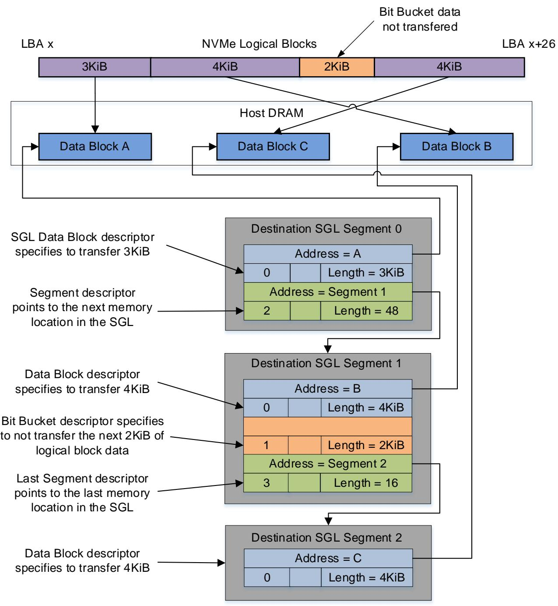

# Metadata Region (MR)

The definition for the Metadata Region is command set specific. Refer to each I/O Command Set specification for applicability and additional details, if any. 

# 4.4 Feature Values

The Get Features command (refer to section 5.1.11) and Set Features command (refer to section 5.1.25) may be used to read and modify operating parameters of the controller. The operating parameters are grouped and identified by Feature Identifiers. Each Feature Identifier contains one or more attributes that may affect the behavior of the Feature. 

If the Save and Select Feature Support (SSFS) bit is set to ‘1’ in the Optional NVM Command Support (ONCS) field of the Identify Controller data structure in Figure 312, then for each Feature, there are three settings: default, saved, and current. If the SSFS bit is cleared to $\mathbf { \vec { \mathbf { \rho } } } ^ { 0 }$ , then the controller only supports a current and default value for each Feature. In this case, the current value may be persistent across power cycles and resets based on the information specified in Figure 385. 

If the SSFS bit is set to ‘1’, then each Feature has supported capabilities (refer to Figure 195), which are discovered using the Supported Capabilities value in the Select field in Get Features (refer to Figure 192). 

The default value for each Feature is vendor specific and set by the manufacturer unless otherwise specified. The default value is not changeable. 

The current value for a Feature is the value in active use by the controller for that Feature. 

A Set Features command uses the value specified by the command to set: 

a) the current value for that Feature; or 

b) the current value for that Feature and the saved value for that Feature, if that Feature is saveable. 

A Feature may be saveable. If a Feature is saveable (i.e., the controller supports the Save field in the Set Features command and the Select field in the Get Features command), then any Feature Identifier that is namespace specific may be saved on a per namespace basis. 

If a Feature is not saveable, or does not have a saved value, then a Get Features command to read the saved value returns the default value. 

If a Feature is not saveable and is persistent as specified in Figure 385, then the current value of that Feature shall be persistent across power cycles and resets. 

The current value for a Feature, as a result of a Controller Level Reset, is indicated in Figure 124 for an NVM subsystem that supports only a single controller (i.e., the Multiple Ports bit of the CMIC field (refer to Figure 311) is cleared to ‘0’). 

The current value for a Feature, as a result of an NVM Subsystem Reset, is indicated in Figure 124, for an NVM subsystem: 

• that is able to support two or more controllers and does not support multiple domains; or 

supports multiple domains where the NVM Subsystem Reset results in a reset of the entire NVM subsystem. 

Figure 124: Current Value after Reset with Scope of Entire NVM Subsystem

<table><tr><td>Feature Capability</td><td>Controller scope or Namespace per controller scope</td><td>NVM subsystem scope</td><td>Endurance Group scope</td><td>NVM Set scope</td><td>Namespace scope</td></tr><tr><td>Saveable</td><td colspan="5">Set to: 
• the saved value if a saved value is set; or 
• the default value if a saved value is not set, unless otherwise specified.</td></tr><tr><td>Non saveable and non-persistent</td><td colspan="5">Set to the default value, unless otherwise specified.</td></tr></table>

The current value for a Feature, as a result of a Controller Level Reset, is indicated in Figure 125 for an NVM subsystem that is able to support two or more controllers (i.e., the Multiple Ports bit is set to ‘1’ in the CMIC field). 

The current value for a Feature, as a result of an NVM Subsystem Reset, is indicated in Figure 125 for an NVM subsystem that supports: 

multiple domains where an NVM Subsystem Reset does not reset the entire NVM subsystem as defined in section 3.7.1.2. 

Figure 125: Current Value after Reset with Scope of Subset of the NVM Subsystem

<table><tr><td>Feature Capability</td><td>Controller scope or Namespace per controller scope</td><td>NVM subsystem scope</td><td>Endurance Group scope</td><td>NVM Set scope</td><td>Namespace scope</td></tr><tr><td>Saveable</td><td>Set to: 
• the saved value if a saved value is set; or 
• the default value if a saved value is not set, unless otherwise specified.</td><td rowspan="2" colspan="4">Unchanged, unless otherwise specified.</td></tr><tr><td>Non-saveable and non-persistent</td><td>Set to the default value, unless otherwise specified.</td></tr></table>

Concurrent access to Feature values by multiple hosts, for features with a scope other than controller scope, requires some form of coordination between hosts. The procedure used to coordinate these hosts is outside the scope of this specification. 

Feature settings apply based on the feature scope (e.g., a feature is namespace specific if that feature has a namespace scope) as defined in Figure 385. 

For feature values that apply to the controller scope: 

a) if the NSID field is cleared to 0h or set to FFFFFFFFh, then: 

• the Set Features command shall set the specified feature value for the controller; and 

the Get Features command shall return the current setting of the requested feature value for the controller; 

and 

b) if the NSID field is set to a valid namespace identifier (refer to section 3.2.1.2), then: 

• the Set Features command shall abort with a status code of Feature Not Namespace Specific; and 

the Get Features command shall return the current setting of the requested feature value for the controller. 

For feature values that apply to the namespace scope: 

a) if the NSID field is set to an active namespace identifier (refer to section 3.2.1.4), then: 

• the Set Features command shall set the specified feature value of the specified namespace; and 

the Get Features command shall return the current setting of the requested feature value for the specified namespace; 

b) if the NSID field is set to FFFFFFFFh, then: 

• for the Set Features command, the controller shall: 

o if the MDS bit is set to ‘1’ in the Identify Controller data structure, abort the command with Invalid Field in Command; or 

o if the MDS bit is cleared to $\scriptstyle { \mathrm { ~ \displaystyle ~ } } ^ { \prime } 0 ^ { \prime }$ in the Identify Controller data structure, unless otherwise specified, set the specified feature value for all namespaces attached to the controller processing the command; 

and 

for the Get Features command, the controller shall, unless otherwise specified in section 5.1.25, abort the command with a status code of Invalid Namespace or Format; and 

c) if the NSID field is set to any other value, then the Set Features command and the Get Features command is aborted by the controller as described in Figure 92. 

For feature values that apply to NVM subsystem scope, Domain scope, NVM Set scope, or Endurance Group scope: 

a) the NSID field should be cleared to 0h; and 

b) if the NSID field is set to a non-zero value, then the Set Features command and the Get Features command are aborted by the controller as described in Figure 92. 

There are mandatory and optional Feature Identifiers defined in section 3.1.3.6. If a Get Features command or Set Features command is processed that specifies a Feature Identifier that is not supported, then the controller shall abort the command with a status code of Invalid Field in Command. 

# 4.5 Identifier Format and Layout (Informative)

This section provides guidance for proper implementation of various identifiers defined in the Identify Controller, Identify Namespace, and Namespace Identification Descriptor data structures. 

# PCI Vendor ID (VID) and PCI Subsystem Vendor ID (SSVID)

The PCI Vendor ID (VID, bytes 01:00) and PCI Subsystem Vendor ID (SSVID, bytes 03:02) are defined in the Identify Controller data structure. The values are assigned by the PCI SIG. Each identifier is a 16-bit number in little endian format. 

Example: 

• VID = ABCDh; and 

SSVID $=$ 1234h. 

Figure 126: PCI Vendor ID (VID) and PCI Subsystem Vendor ID (SSVID)

<table><tr><td>Bytes</td><td>00</td><td>01</td><td>02</td><td>03</td></tr><tr><td>Value</td><td>CDh</td><td>ABh</td><td>34h</td><td>12h</td></tr></table>

# Serial Number (SN) and Model Number (MN)

The Serial Number (SN, bytes 23:04) and Model Number (MN, bytes 63:24) are defined in the Identify Controller data structure. The values are ASCII strings assigned by the vendor. Each identifier is in big endian format. 

Example (Value shown as ASCII characters): 

$\mathsf { S N } = \mathsf { \ " S N } 1 \mathsf { \ " }$ ; and 

${ \mathsf { M N } } = { } ^ { \circ } { \mathsf { M } } 2 ^ { \prime \prime }$ 

Figure 127: Serial Number (SN) and Model Number (MN)

<table><tr><td>Bytes</td><td>04</td><td>05</td><td>06</td><td>23 to 07</td><td>24</td><td>25</td><td>63 to 26</td></tr><tr><td>Value</td><td>53h (&#x27;S&#x27;)</td><td>4Eh (&#x27;N&#x27;)</td><td>31h (&#x27;1&#x27;)</td><td>20h (&#x27;&#x27;)</td><td>4Dh (&#x27;M&#x27;)</td><td>32h (&#x27;2&#x27;)</td><td>20h (&#x27;&#x27;)</td></tr></table>

# IEEE OUI Identifier (IEEE)

The IEEE OUI Identifier (OUI, bytes 75:73) is defined in the Identify Controller data structure. The value is assigned by the IEEE Registration Authority. The identifier is in little endian format. 

Example: 

• OUI $=$ ABCDEFh. 

Figure 128: IEEE OUI Identifier (IEEE)

<table><tr><td>Bytes</td><td>73</td><td>74</td><td>75</td></tr><tr><td>Value</td><td>EFh</td><td>CDh</td><td>ABh</td></tr></table>

# IEEE Extended Unique Identifier (EUI64)

The IEEE Extended Unique Identifier (EUI64, bytes 127:120) is defined in the Identify Namespace data structure. Tutorials are available at https://standards.ieee.org/develop/regauth/tut/index.html. IEEE defines three formats that may be used in this field: MA-L, MA-M, and MA-S. The examples in this section use the MA-L format. 

The MA-L format is defined as a string of eight octets: 

Figure 129: IEEE Extended Unique Identifier (EUI64), MA-L Format

<table><tr><td>EUI[0]</td><td>EUI[1]</td><td>EUI[2]</td><td>EUI[3]</td><td>EUI[4]</td><td>EUI[5]</td><td>EUI[6]</td><td>EUI[7]</td></tr><tr><td colspan="3">OUI</td><td colspan="5">Extension Identifier</td></tr></table>

EUI64 is defined in big endian format. The OUI field differs from the OUI Identifier which is in little endian format as described in section 4.5.3. 

Example: 

• OUI Identifier $=$ ABCDEFh; and 

• Extension Identifier $=$ 0123456789h. 

Figure 130: IEEE Extended Unique Identifier (EUI64), OUI Identifier

<table><tr><td>Bytes</td><td>120</td><td>121</td><td>122</td><td>123</td><td>124</td><td>125</td></tr><tr><td>Value</td><td>ABh</td><td>CDh</td><td>EFh</td><td>01h</td><td>23h</td><td>45h</td></tr><tr><td>Field</td><td colspan="3">OUI</td><td colspan="3">Extension Identifier</td></tr></table>

Figure 131: IEEE Extended Unique Identifier (EUI64), Ext. ID (cont)

<table><tr><td>Bytes</td><td>126</td><td>127</td></tr><tr><td>Value</td><td>67h</td><td>89h</td></tr><tr><td>Field</td><td colspan="2">Ext ID (cont)</td></tr></table>

The MA-L format is similar to the World Wide Name (WWN) format defined as IEEE Registered designator $( { \mathsf { N A A } } { \mathsf { A } } = 5 )$ ) as shown below. 

Figure 132: MA-L similarity to WWN

<table><tr><td>Bytes</td><td colspan="2">0</td><td>1</td><td>2</td><td colspan="2">3</td><td>4</td><td>5</td><td>6</td><td>7</td></tr><tr><td>EUI64</td><td colspan="4">OUI</td><td colspan="6">Extension Identifier</td></tr><tr><td>WWN (NAA = 5)</td><td>5h</td><td colspan="4">OUI</td><td colspan="5">Vendor Specific Identifier</td></tr></table>

# Namespace Globally Unique Identifier (NGUID)

The Namespace Globally Unique Identifier (NGUID, bytes 119:104) is defined in the Identify Namespace data structure. The NGUID is composed of an IEEE OUI, an extension identifier, and a vendor specific extension identifier. The extension identifier and vendor specific extension identifier are both assigned by the vendor and may be considered as a single field. NGUID is defined in big endian format. The OUI field differs from the OUI Identifier which is in little endian format as described in section 4.5.3. 

# Example:

• OUI Identifier $=$ ABCDEFh; 

• Extension Identifier = 0123456789h; and 

• Vendor Specific Extension Identifier $=$ FEDCBA9876543210h. 

Figure 133: Namespace Globally Unique Identifier (NGUID)

<table><tr><td>Bytes</td><td>104</td><td>105</td><td>106</td><td>107</td><td>108</td><td>109</td></tr><tr><td>Value</td><td>FEh</td><td>DCh</td><td>BAh</td><td>98h</td><td>76h</td><td>54h</td></tr><tr><td>Field</td><td colspan="6">Vendor Specific Extension Identifier</td></tr></table>

Figure 134: Namespace Globally Unique Identifier (NGUID), OUI

<table><tr><td>Bytes</td><td>110</td><td>111</td><td>112</td><td>113</td><td>114</td><td>115</td></tr><tr><td>Value</td><td>32h</td><td>10h</td><td>ABh</td><td>CDh</td><td>EFh</td><td>01h</td></tr><tr><td>Field</td><td colspan="2">VSP Ex ID (cont)</td><td colspan="3">OUI</td><td>Ex ID</td></tr></table>

Figure 135: Namespace Globally Unique Identifier (NGUID), Extension Identifier (continued)

<table><tr><td>Bytes</td><td>116</td><td>117</td><td>118</td><td>119</td></tr><tr><td>Value</td><td>23h</td><td>45h</td><td>67h</td><td>89h</td></tr><tr><td>Field</td><td colspan="4">Extension Identifier (continued)</td></tr></table>

The NGUID format is similar to the World Wide Name (WWN) format as IEEE Registered Extended designator $( \mathsf { N A A } ) = 6 )$ as shown below. 

Figure 136: Namespace Globally Unique Identifier (NGUID), NGUID similarity to WWN

<table><tr><td>Bytes</td><td>0</td><td>1</td><td>2</td><td>3</td><td>4</td><td>5</td><td>6</td><td>7</td><td>8</td><td>9</td><td>10</td><td>11</td><td>12</td><td>13</td><td>14</td><td>15</td></tr><tr><td>NGUID</td><td colspan="8">Vendor Specific Extension Identifier</td><td colspan="3">OUI</td><td colspan="5">Extension Identifier</td></tr><tr><td>WWN (NAA = 6)</td><td>6h</td><td colspan="3">OUI</td><td colspan="4">Vendor Specific Identifier</td><td colspan="8">Vendor Specific Identifier Extension</td></tr></table>

# Universally Unique Identifier (UUID)

The Universally Unique Identifier is defined in RFC 9562 and contained in the Namespace Identification Descriptor (refer to Figure 315). Byte ordering requirements for a UUID are described in RFC 9562. 

For historical reasons, UUID subtypes are called UUID versions. Multiple UUID versions are able to be used in the same implementation. 

RFC 9562 defines UUID version 8 (i.e., UUIDv8) for experimental or vendor-specific use cases. Uniqueness of UUIDv8 values is implementation specific. NVM Express UUID use cases assume uniqueness within the set of hosts, NVM subsystems, and fabrics that are connected or accessible by a common instance of an administrative tool. For UUIDv8 values, that uniqueness is the responsibility of all of the implementations in that set. RFC 9562 Appendix B provides examples of UUIDv8 generation algorithms that produce unique UUIDs if all implementations in that set generate UUIDv8 values with the same algorithm. 

# 4.6 List Data Structures

This section describes list data structures used in this specification. 

# Controller List

A Controller List, defined in Figure 137, is an ordered list of ascending controller identifiers. The controller identifier of a controller is the value indicated in the CNTLID field of the Identify Controller data structure in Figure 312. Unused entries are zero filled. 

Figure 137: Controller List Format

<table><tr><td>Bytes</td><td>Description</td></tr><tr><td colspan="2">Header</td></tr><tr><td>01:00</td><td>Number of Controller Identifiers (NUMCIDS): This field contains the number of controller entries in the list. There may be up to 2,047 identifiers in the list. A value of 0h indicates there are no controllers in the list.</td></tr><tr><td colspan="2">Controller Identifier List</td></tr><tr><td>03:02</td><td>Controller Identifier 0: This field contains the NVM subsystem unique controller identifier for the first controller in the list, if present.</td></tr><tr><td>05:04</td><td>Controller Identifier 1: This field contains the NVM subsystem unique controller identifier for the second controller in the list, if present.</td></tr><tr><td>...</td><td>...</td></tr><tr><td>(NUMCIDS*2+1): (NUMCIDS*2)</td><td>Controller Identifier NUMCIDS-1: This field contains the NVM subsystem unique controller identifier for the last controller in the list, if present.</td></tr></table>

# Namespace List

A Namespace List, defined in Figure 138, is an ordered list of namespace IDs. Unused entries are zero filled. 

Figure 138: Namespace List Format

<table><tr><td>Bytes</td><td>Description</td></tr><tr><td colspan="2">Namespace Identifier List</td></tr><tr><td>03:00</td><td>Namespace Identifier 0: This field contains the lowest namespace ID in the list or 0h if the list is empty.</td></tr></table>

Figure 138: Namespace List Format

<table><tr><td>Bytes</td><td>Description</td></tr><tr><td colspan="2">Namespace Identifier List</td></tr><tr><td>07:04</td><td>Namespace Identifier 1: This field contains the second lowest namespace ID in the list or 0h if the list contains less than two entries.</td></tr><tr><td>...</td><td>...</td></tr><tr><td>(N*4+3):(N*4)</td><td>Namespace Identifier N: This field contains the largest namespace ID in the list or 0h if the list contains less than N+1 entries.</td></tr></table>

# 4.7 NVMe Qualified Names

NVMe Qualified Names (NQNs) are used to uniquely describe a host or NVM subsystem for the purposes of identification and authentication. The NVMe Qualified Name for the NVM subsystem is specified in the Identify Controller data structure. An NQN is permanent for the lifetime of the host or NVM subsystem. 

An NVMe Qualified Name is encoded as a UTF-8 string of Unicode characters (refer to section 1.4.2) with the following properties: 

• The encoding is UTF-8 (refer to RFC 3629); 

• The following characters are used in formatting: 

o dash $( \therefore \therefore = \cup \sl + 0 0 2 \mathsf { d } )$ 

o dot ( $\therefore = \cup + 0 0 2 \in )$ ; and 

o colon $( \because = \mathsf { U } + 0 0 3 \mathsf { a } )$ ; 

• The maximum name is 223 bytes in length; and 

• The string is null terminated. 

There are two supported NQN formats. The first format may be used by any organization that owns a domain name. This naming format may be used to create a human interpretable string to describe the host or NVM subsystem. This format consists of: 

• The string “nqn”; 

• The string “.” (i.e., the ASCII period character); 

A date code, in “yyyy-mm” format. This date shall be during a time interval when the naming authority owned the domain name used in this format. The date code uses the Gregorian calendar. All digits and the dash shall be included; 

• The string “.” (i.e., the ASCII period character); 

• The reverse domain name of the naming authority that is creating the NQN; and 

A colon (:) prefixed string that the owner of the domain name assigns that does not exceed the maximum length. The naming authority is responsible to ensure that the NQN is worldwide unique. 

The reverse domain name in an NQN that uses this format shall not be “org.nvmexpress”. 

The following are examples of NVMe Qualified Names that may be generated by “Example NVMe, Inc.” 

• The string “nqn.2014-08.com.example:nvme:nvm-subsystem-sn-d78432”; and 

• The string “nqn.2014-08.com.example:nvme.host.sys.xyz”. 

The second format may be used to create a unique identifier when there is not a naming authority or there is not a requirement for a human interpretable string. This format consists of: 

• The string “nqn”; 

• The string “.” (i.e., the ASCII period character); 

• The string “2014-08.org.nvmexpress:uuid:”; and 

A 128-bit UUID based on the definition in RFC 9562 represented as a string formatted as “11111111-2222-3333-4444-555555555555”. 

The following is an example of an NVMe Qualified Name using the UUID-based format: 

• The string “nqn.2014-08.org.nvmexpress:uuid:f81d4fae-7dec-11d0-a765-00a0c91e6bf6”. 

NVMe hosts, controllers and NVM subsystems process (e.g., compare for equality) UTF-8 NVMe Qualified Names without any text processing or text comparison logic that is specific to the Unicode character set or locale (refer to section 4.8). 

# Unique Identifier

# Unique Identifier Overview

Unique identifiers include the following: 

a) NVM subsystem unique identifiers (refer to section 4.7.1.2); 

b) controller unique identifiers (refer to section 4.7.1.3); and 

c) namespace unique identifiers (refer to section 4.7.1.4). 

Unique identifiers are either globally unique or unique only within the NVM subsystem. NVM subsystem unique identifiers are globally unique. Controller unique identifiers (i.e., the CNTLID) are unique only within the NVM subsystem. Namespace unique identifiers are globally unique. 

# NVM Subsystem Unique Identifier

The NVM Subsystem NVMe Qualified Name specified in the Identify Controller data structure (refer to Figure 312) should be used (e.g., by host software) as the unique identifier for the NVM subsystem. If the controller is compliant with an NVM Express Specification prior to revision 1.2.1 (i.e., revisions where the NVM Subsystem NQN was not defined), then the PCI Vendor ID, Serial Number, and Model Number fields in the Identify Controller data structure and the NQN Starting String “nqn.2014.08.org.nvmexpress:” may be combined by the host to form a globally unique value that identifies the NVM subsystem (e.g., for host software that uses NQNs). The method shown in Figure 139 should be used by the host to construct an NVM Subsystem NQN for older NVM subsystems that do not provide an NQN in the Identify Controller data structure. The mechanism used by the vendor to assign Serial Number and Model Number values to ensure uniqueness is outside the scope of this specification. 

Figure 139: NQN Construction for Older NVM Subsystems

<table><tr><td>Bytes</td><td>Description</td></tr><tr><td>26:00</td><td>NQN Starting String (NSS): Contains the 27 letter ASCII string &quot;nqn.2014-08.org.nvmexpress:&quot; .</td></tr><tr><td>30:27</td><td>PCI Vendor ID (VID): Contains the company vendor identifier that is assigned by the PCI SIG as a hexadecimal ASCII string.</td></tr><tr><td>34:31</td><td>PCI Subsystem Vendor ID (SSVID): Contains the company vendor identifier that is assigned by the PCI SIG for the subsystem as a hexadecimal ASCII string.</td></tr><tr><td>54:35</td><td>Serial Number (SN): Contains the serial number for the NVM subsystem that is assigned by the vendor as an ASCII string.</td></tr><tr><td>94:55</td><td>Model Number (MN): Contains the model number for the NVM subsystem that is assigned by the vendor as an ASCII string.</td></tr><tr><td>222:95</td><td>Padding (PAD): Contains spaces (ASCII character 20h).</td></tr></table>

# Controller Unique Identifier

An NVM subsystem may contain multiple controllers. All controllers contained in the NVM subsystem share the same NVM subsystem unique identifier. The Controller ID (CNTLID) value returned in the Identify Controller data structure may be used to uniquely identify a controller within an NVM subsystem. The Controller ID value when combined with the NVM subsystem identifier forms a globally unique value that identifies the controller. The mechanism used by the vendor to assign Controller ID values is outside the scope of this specification. 

# Namespace Unique Identifier

The Identify Namespace data structure (refer to the applicable I/O Command Set specification) contains the IEEE Extended Unique Identifier (EUI64) and the Namespace Globally Unique Identifier (NGUID) fields. The Namespace Identification Descriptor data structure (refer to Figure 315) contains the Namespace 

UUID. EUI64 is an 8-byte EUI-64 identifier (refer to section 4.5.4), NGUID is a 16-byte identifier based on EUI-64 (refer to section 4.5.5), and Namespace UUID is a 16-byte identifier described in RFC 9562 (refer to section 4.5.6). 

When creating a namespace, the controller shall indicate a globally unique namespace identifier in one or more of the following: 

a) the EUI64 field; 

b) the NGUID field; or 

c) a Namespace Identification Descriptor with the Namespace Identifier Type field set to 3h (i.e., a UUID). 

Refer to section 8.1.9.2 for additional globally unique namespace identifier requirements related to dispersed namespaces. 

If the EUI64 field is cleared to 0h and the NGUID field is cleared to 0h, then the namespace shall support a valid Namespace UUID in the Namespace Identification Descriptor data structure. 

If the UIDREUSE bit in the NSFEAT field is cleared to $\mathfrak { v }$ , then a controller may reuse a non-zero NGUID/EUI64 value for a new namespace after the original namespace using the value has been deleted. If the UIDREUSE bit is set to ‘1’, then a controller shall not reuse a non-zero NGUID/EUI64 for a new namespace after the original namespace using the value has been deleted. 

# 4.8 UTF-8 String Processing

NVMe hosts, controllers and NVM subsystems process (e.g., store, compare) UTF-8 strings used by NVMe as binary strings without any text processing or text comparison logic that is specific to the Unicode character set or locale (e.g., check for byte values not used by UTF-8, Unicode normalization, etc.). Any such text processing: 

a) may occur as part of entry of UTF-8 strings into NVMe hosts and NVM subsystems as shown at points 1 and 3 in Figure 140; and 

b) should not occur as part of receiving UTF-8 strings via NVMe, as shown at points 2 and 4 in Figure 140. 

Upon entry into the NVMe host (e.g., via a configuration interface at point 1 in Figure 140, described as “input” in RFC 9562), NVMe host software may process a UTF-8 string (e.g., perform Unicode normalization). Upon entry into the NVM subsystem (e.g., via a configuration interface at point 3 in Figure 140, described as “input” in RFC 9562), a controller may process a UTF-8 string (e.g., perform Unicode normalization). Upon receipt by the host (e.g., at point 2 in Figure 140) of a UTF-8 string from the controller, text processing (e.g., Unicode normalization) should not occur. Upon receipt by the controller (e.g., at point 4 in Figure 140) of a UTF-8 string from the host, text processing (e.g., Unicode normalization) should not occur. 

Figure 140: UTF-8 Input Processing

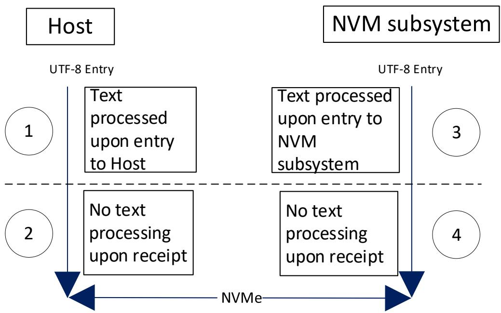

# 5 Admin Command Set

The Admin Command Set defines the commands that may be submitted to the Admin Submission Queue. Section 5.1 describes Admin commands that are common to all transport models. Section 5.2 describes Admin commands that are specific to the Memory-based transport model. Section 5.3 describes Admin commands that are specific to the Message-based transport model. 

The submission queue entry (SQE) structure and the fields that are common to all Admin commands are defined in section 4.1. The completion queue entry (CQE) structure and the fields that are common to all Admin commands are defined in section 4.2. The command specific fields in the SQE and CQE structures (i.e., SQE Command Dwords 10 to 15, CQE Dword 0, and CQE Dword 1) for the Admin Command Set are defined in this section. 

Admin commands should not be impacted by the state of I/O queues (e.g., a full I/O Completion Queue should not delay or stall the Delete I/O Submission Queue command). 

Figure 141 defines all Admin commands. Refer to Figure 28 for mandatory, optional, and prohibited commands for the various controller types. 

Figure 141: Opcodes for Admin Commands

<table><tr><td colspan="2">Opcode by Field</td><td rowspan="3">Combined Opcode 1</td><td rowspan="3">Namespace Identifier Used 2</td><td rowspan="3">Command</td><td rowspan="3">Reference 8</td></tr><tr><td>(07:02)</td><td>(01:00)</td></tr><tr><td>Function</td><td>Data Transfer3</td></tr><tr><td>0000 00b</td><td>00b</td><td>00h</td><td>No</td><td>Delete I/O Submission Queue</td><td>5.2.4</td></tr><tr><td>0000 00b</td><td>01b</td><td>01h</td><td>No</td><td>Create I/O Submission Queue</td><td>5.2.2</td></tr><tr><td>0000 00b</td><td>10b</td><td>02h</td><td>Yes 11</td><td>Get Log Page</td><td>5.1.12</td></tr><tr><td>0000 01b</td><td>00b</td><td>04h</td><td>No</td><td>Delete I/O Completion Queue</td><td>5.2.3</td></tr><tr><td>0000 01b</td><td>01b</td><td>05h</td><td>No</td><td>Create I/O Completion Queue</td><td>5.2.1</td></tr><tr><td>0000 01b</td><td>10b</td><td>06h</td><td>NOTE 6</td><td>Identify</td><td>5.1.13</td></tr><tr><td>0000 10b</td><td>00b</td><td>08h</td><td>No</td><td>Abort</td><td>5.1.1</td></tr><tr><td>0000 10b</td><td>01b</td><td>09h</td><td>Yes</td><td>Set Features</td><td>5.1.25</td></tr><tr><td>0000 10b</td><td>10b</td><td>0Ah</td><td>Yes</td><td>Get Features</td><td>5.1.11</td></tr><tr><td>0000 11b</td><td>00b</td><td>0Ch</td><td>No</td><td>Asynchronous Event Request</td><td>5.1.2</td></tr><tr><td>0000 11b</td><td>01b</td><td>0Dh</td><td>Yes</td><td>Namespace Management</td><td>5.1.21</td></tr><tr><td>0001 00b</td><td>00b</td><td>10h</td><td>No</td><td>Firmware Commit</td><td>5.1.8</td></tr><tr><td>0001 00b</td><td>01b</td><td>11h</td><td>No</td><td>Firmware Image Download</td><td>5.1.9</td></tr><tr><td>0001 01b</td><td>00b</td><td>14h</td><td>Yes</td><td>Device Self-test</td><td>5.1.4</td></tr><tr><td>0001 01b</td><td>01b</td><td>15h</td><td>Yes 4</td><td>Namespace Attachment</td><td>5.1.20</td></tr><tr><td>0001 10b</td><td>00b</td><td>18h</td><td>No</td><td>Keep Alive</td><td>5.1.14</td></tr><tr><td>0001 10b</td><td>01b</td><td>19h</td><td>Yes 5</td><td>Directive Send</td><td>5.1.7</td></tr><tr><td>0001 10b</td><td>10b</td><td>1Ah</td><td>Yes 5</td><td>Directive Receive</td><td>5.1.6</td></tr><tr><td>0001 11b</td><td>00b</td><td>1Ch</td><td>No</td><td>Virtualization Management</td><td>5.2.6</td></tr><tr><td>0001 11b</td><td>01b</td><td>1Dh</td><td>No</td><td>NVMe-MI Send</td><td>5.1.19</td></tr><tr><td>0001 11b</td><td>10b</td><td>1Eh</td><td>No</td><td>NVMe-MI Receive</td><td>5.1.18</td></tr><tr><td>0010 00b</td><td>00b</td><td>20h</td><td>No</td><td>Capacity Management</td><td>5.1.3</td></tr><tr><td>0010 00b</td><td>01b</td><td>21h</td><td>No</td><td>Discovery Information Management</td><td>5.3.3</td></tr><tr><td>0010 00b</td><td>10b</td><td>22h</td><td>No</td><td>Fabric Zoning Receive</td><td>5.3.5</td></tr><tr><td>0010 01b</td><td>00b</td><td>24h</td><td>No</td><td>Lockdown</td><td>5.1.15</td></tr><tr><td>0010 01b</td><td>01b</td><td>25h</td><td>No</td><td>Fabric Zoning Lookup</td><td>5.3.4</td></tr><tr><td>0010 10b</td><td>00b</td><td>28h</td><td>No</td><td>Clear Exported NVM Resource Configuration 10</td><td>5.3.1</td></tr><tr><td>0010 10b</td><td>01b</td><td>29h</td><td>No</td><td>Fabric Zoning Send</td><td>5.3.6</td></tr><tr><td>0010 10b</td><td>10b</td><td>2Ah</td><td>No</td><td>Create Exported NVM Subsystem 10</td><td>5.3.2</td></tr></table>

Figure 141: Opcodes for Admin Commands

<table><tr><td colspan="2">Opcode by Field</td><td rowspan="3">Combined Opcode1</td><td rowspan="3">Namespace Identifier Used2</td><td rowspan="3">Command</td><td rowspan="3">Reference8</td></tr><tr><td>(07:02)</td><td>(01:00)</td></tr><tr><td>Function</td><td>Data Transfer3</td></tr><tr><td>0010 11b</td><td>01b</td><td>2Dh</td><td>No</td><td>Manage Exported NVM Subsystem10</td><td>5.3.8</td></tr><tr><td>0011 00b</td><td>01b</td><td>31h</td><td>Yes</td><td>Manage Exported Namespace10</td><td>5.3.7</td></tr><tr><td>0011 01b</td><td>01b</td><td>35h</td><td>No</td><td>Manage Exported Port10</td><td>5.3.9</td></tr><tr><td>0011 10b</td><td>01b</td><td>39h</td><td>No</td><td>Send Discovery Log Page</td><td>5.3.10</td></tr><tr><td>0011 11b</td><td>01b</td><td>3Dh</td><td>No</td><td>Track Send</td><td>5.1.27</td></tr><tr><td>0011 11b</td><td>10b</td><td>3Eh</td><td>No</td><td>Track Receive</td><td>5.1.26</td></tr><tr><td>0100 00b</td><td>01b</td><td>41h</td><td>No</td><td>Migration Send</td><td>5.1.17</td></tr><tr><td>0100 00b</td><td>10b</td><td>42h</td><td>No</td><td>Migration Receive</td><td>5.1.16</td></tr><tr><td>0100 01b</td><td>01b</td><td>45h</td><td>No</td><td>Controller Data Queue</td><td>5.1.4</td></tr><tr><td>0111 11b</td><td>00b</td><td>7Ch</td><td>No</td><td>Doorbell Buffer Config</td><td>5.2.5</td></tr><tr><td>0111 11b</td><td>11b9</td><td>7Fh</td><td>No</td><td>Fabrics Commands9</td><td>6</td></tr><tr><td>1000 00b</td><td>00b</td><td>80h</td><td>Yes</td><td>Format NVM</td><td>5.1.10</td></tr><tr><td>1000 00b</td><td>01b</td><td>81h</td><td>NOTE 7</td><td>Security Send</td><td>5.1.24</td></tr><tr><td>1000 00b</td><td>10b</td><td>82h</td><td>NOTE 7</td><td>Security Receive</td><td>5.1.23</td></tr><tr><td>1000 01b</td><td>00b</td><td>84h</td><td>No</td><td>Sanitize</td><td>5.1.22</td></tr><tr><td>1000 01b</td><td>01b</td><td>85h</td><td>Yes</td><td>Load Program</td><td>CP</td></tr><tr><td>1000 01b</td><td>10b</td><td>86h</td><td>Yes4</td><td>Get LBA Status</td><td>NVM, ZNS</td></tr><tr><td>1000 10b</td><td>00b</td><td>88h</td><td>Yes</td><td>Program Activation Management</td><td>CP</td></tr><tr><td>1000 10b</td><td>01b</td><td>89h</td><td>Yes</td><td>Memory Range Set Management</td><td>CP</td></tr><tr><td colspan="6">Vendor Specific</td></tr><tr><td>11xx xxb</td><td>NOTE 3</td><td>C0h to FFh</td><td></td><td>Vendor specific</td><td></td></tr><tr><td colspan="6">Notes:1. Opcode not listed are reserved.2. A subset of commands use the Namespace Identifier (NSID) field. If the Namespace Identifier field is used, then the value FFFFFFFH is supported in this field unless otherwise indicated in footnotes in this figure that a specific command does not support that value or supports that value only under specific conditions. When this field is not used, the field is cleared to 0h as described in Figure 92.3.00b = no data transfer; 01b = host to controller; 10b = controller to host; 11b = bidirectional. Refer to the Data Transfer Direction field in Figure 91. This command does not support the use of the Namespace Identifier (NSID) field set to FFFFFFFH. Support for the Namespace Identifier field set to FFFFFFFH depends on the Directive Operation (refer to section 8.1.8). Use of the Namespace Identifier field depends on the CNS value in the Identify Command as described in Figure 310. The use of the Namespace Identifier is Security Protocol specific. Section 5.1 contains commands common to all transport models, section 5.2 contains commands specific to the Memory-based transport model, and section 5.3 contains commands specific to the Message-based transport model. NVM = NVM Command Set specific, ZNS = Zoned Namespace Command Set specific, CP = Computational Programs Command Set specific. All Fabrics commands use the opcode 7Fh with the data transfer direction specified as shown in Figure 540. Refer to section 6 for details. Support for this command is prohibited in NVM subsystems that use a Memory-Based Transport Model (e.g., the PCIe transport) for any controller. Use of the Namespace Identifier field is specified further in section 5.1.12.1 and Figure 202.</td></tr></table>

Figure 142 lists the Admin commands that are allowed while a sanitize operation is in progress and the Admin commands that should be allowed during the processing of a Format NVM command. 

If a Format NVM command is in progress, then an Admin command not listed in Figure 142 that is submitted for any namespace affected by that Format NVM command may be aborted. If aborted for that reason, then a status code of Format in Progress should be returned. 

If there are Admin commands not listed in Figure 142 being processed for a namespace, then a Format NVM command which is submitted that affects that namespace may be aborted. If aborted for that reason, then a status code of Command Sequence Error should be returned. 

Figure 142: Sanitize Operations and Format NVM Command – Admin Commands Allowed

<table><tr><td>Admin Command</td><td colspan="2">Additional Restrictions for a Format NVM Command</td><td>Additional Restrictions for a Sanitize Operation</td></tr><tr><td>Abort</td><td colspan="2"></td><td></td></tr><tr><td>Asynchronous Event Request</td><td colspan="2"></td><td></td></tr><tr><td>Create I/O Completion Queue</td><td colspan="2"></td><td></td></tr><tr><td>Create I/O Submission Queue</td><td colspan="2"></td><td></td></tr><tr><td>Device Self-test</td><td colspan="2">Only Controller DST should be allowed</td><td>Prohibited</td></tr><tr><td>Delete I/O Completion Queue</td><td colspan="2"></td><td></td></tr><tr><td>Delete I/O Submission Queue</td><td colspan="2"></td><td></td></tr><tr><td>Get Features</td><td colspan="2"></td><td></td></tr><tr><td rowspan="11">Get Log Page</td><td colspan="3">The log pages allowed for both Format NVM command and sanitize operations are listed below.</td></tr><tr><td colspan="2">Log Pages</td><td>Additional Restrictions for both Format NVM command and sanitize operations</td></tr><tr><td colspan="2">Error Information</td><td>Return 0h in the LBA field.</td></tr><tr><td colspan="2">SMART / Health Information</td><td></td></tr><tr><td colspan="2">Changed Attached Namespace List</td><td></td></tr><tr><td colspan="2">Reservation Notification</td><td></td></tr><tr><td colspan="2">Asymmetric Namespace Access</td><td></td></tr><tr><td colspan="2">Sanitize Status</td><td></td></tr><tr><td colspan="2">Vendor specific</td><td>Prohibited for Sanitize</td></tr><tr><td colspan="2">Persistent Event Log</td><td>Prohibited for Sanitize</td></tr><tr><td colspan="2">Boot Partition</td><td></td></tr><tr><td>Identify</td><td colspan="2"></td><td></td></tr><tr><td>Keep Alive</td><td colspan="2"></td><td></td></tr><tr><td>NVMe-MI Receive</td><td rowspan="2" colspan="3">Allowed unless explicitly prohibited in the NVM Express Management Interface Specification.</td></tr><tr><td>NVMe-MI Send</td></tr><tr><td>Sanitize</td><td colspan="2"></td><td>Prohibited during sanitize operations if the SANACT field is set to a value other than 101b (i.e., Exit Media Verification State). Sanitize operations are described in section 8.1.24.</td></tr><tr><td>Set Features</td><td colspan="3">Namespace Write Protection Config Feature is not allowed.</td></tr><tr><td rowspan="9">Opcode 7Fh</td><td colspan="3">The Fabrics commands allowed are listed below. Refer to section 6.</td></tr><tr><td>Fabrics command</td><td colspan="2">Additional Restrictions for a Format NVM Command and a Sanitize Operation</td></tr><tr><td>Property Set</td><td colspan="2"></td></tr><tr><td>Connect</td><td colspan="2"></td></tr><tr><td>Disconnect</td><td colspan="2"></td></tr><tr><td>Property Get</td><td colspan="2"></td></tr><tr><td>Authentication Send</td><td colspan="2"></td></tr><tr><td>Authentication Receive</td><td colspan="2"></td></tr><tr><td>Vendor Specific</td><td colspan="2">Commands are allowed that do not affect or retrieve user data.</td></tr><tr><td>Vendor Specific</td><td colspan="3">Commands are allowed that do not affect or retrieve user data.</td></tr></table>

# 5.1 Common Admin Commands

This section describes Admin commands that are common to all transport models. 

# Abort command

The Abort command is used to request an abort of a specific command previously submitted to the Admin Submission Queue or an I/O Submission Queue. An Abort command may or may not abort the command that was requested to be aborted. For example, the command to abort may have already completed, currently be in execution, or may be deeply queued. 

The controller should process the Abort command as soon as the command is fetched. 

To abort a large number of commands (e.g., a larger number of commands than the limit listed in the ACL field), the host should: 

use the Cancel command (refer to section 7.1), if supported, to abort all commands submitted to an I/O Submission Queue or to abort all commands submitted to an I/O Submission Queue for a specific namespace; or 

follow the procedures described in section 3.3.1.3 to delete the I/O Submission Queue and recreate the I/O Submission Queue. 

If an abort action is performed on the command to abort, that action may be: 

an immediate abort (i.e., the abort action occurs prior to posting the completion queue entry for the Abort command); or 

a deferred abort (i.e., the abort action occurs after posting the completion queue entry for the Abort command). 

If an immediate abort is performed, then the controller shall either: 

post the completion queue entry for the command to abort to the appropriate Admin Completion Queue or I/O Completion Queue with a status code of Command Abort Requested before the completion queue entry for the Abort command is posted to the Admin Completion Queue; or 

ensure that there are no subsequent effects of the command to abort, as described in section 5.1.1.1, prior to posting the completion queue entry for the Abort command and post the completion queue entry for the command to abort to the appropriate Admin Completion Queue or I/O Completion Queue with a status code of Command Abort Requested. The completion queue entry for the Abort command and the completion queue entry for the command to abort are allowed to be posted in any order. 

If an immediate abort is not performed, then the controller may or may not perform a deferred abort. 

The Abort command uses the Command Dword 10 field. All other command specific fields are reserved. 

The Abort Command Limit field in the Identify Controller data structure (refer to Figure 312) indicates the controller limit on concurrent execution of Abort commands. A host should not allow the number of outstanding Abort commands to exceed this value. The controller may complete any excess Abort commands with the status code set to Abort Command Limit Exceeded. 

Figure 143: Abort – Command Dword 10

<table><tr><td>Bits</td><td>Description</td></tr><tr><td>31:16</td><td>Command Identifier (CID): This field specifies the command identifier of the command to be aborted, that was specified in the CDW0.CID field within the command itself.</td></tr><tr><td>15:00</td><td>Submission Queue Identifier (SQID): This field specifies the identifier of the Submission Queue that the command to be aborted is associated with.</td></tr></table>

# Immediate Abort requirements

If the controller performs an immediate abort, then the controller shall ensure that, other than the posting of the completion queue entry for the command to abort, there are no effects of that command (e.g., no 

host memory access, command processing does not modify: NVM media, NVM Set state, Endurance Group state, namespace state, controller state, domain state, or NVM subsystem state) subsequent to the posting of the CQE for the command that requested the abort. If the controller is not able to ensure there are no effects of the command to abort subsequent to the posting of the CQE for the command that requested the abort, then the controller shall not perform an immediate abort on that command. 

For example, if a command: 

requests a data transfer; 

• the data transfer has been initiated and not completed; and 

the CQE for that command was not posted prior to the posting of the CQE for the command that requested the abort, 

then the controller is prohibited from performing an immediate abort. 

Performing an immediate abort effects the information returned in the CQE for the command that requested the abort as described in section 5.1.1.2 for an Abort command and in section 7.1.1 for a Cancel command. 

# Command Completion

Upon completion of the Abort command, the controller posts a completion queue entry to the Admin Completion Queue indicating the status for the Abort command. Dword 0 of the completion queue entry indicates information about the command to abort as shown in Figure 144. 

Figure 144: Abort Command – Completion Queue Entry Dword 0

<table><tr><td>Bits</td><td>Description</td></tr><tr><td>31:01</td><td>Reserved</td></tr><tr><td>00</td><td>Immediate Abort Not Performed (IANP): Indicates whether or not an immediate abort was performed. If this bit is set to ‘1’, then an immediate abort was not performed (i.e., the command to abort was not aborted prior to posting the CQE for the Abort command) for any reason (e.g., the immediate abort requirements were not met, the requested command to abort was not found). If this bit is cleared to ‘0’, then an immediate abort was performed (i.e., the command to abort was aborted prior to posting the CQE for the Abort command).</td></tr></table>

If the Immediate Abort Not Performed bit in Dword 0 (refer to Figure 144) is set to ‘1’ in the completion queue entry for the Abort command and a deferred abort is performed, then the controller shall set the status code for the command to abort to Command Abort Requested. The host should examine the status in the completion queue entry of the command to abort to determine if the command was aborted. 

Command specific status code values associated with the Abort command are defined in Figure 145. 

Figure 145: Abort – Command Specific Status Values

<table><tr><td>Value</td><td>Description</td></tr><tr><td>3h</td><td>Abort Command Limit Exceeded: The number of concurrently outstanding Abort commands has exceeded the limit indicated in the Identify Controller data structure.</td></tr></table>

# Asynchronous Event Request command

Asynchronous events are used to notify a host of status, error, and health information as these events occur. To enable asynchronous events to be reported by the controller, a host needs to submit one or more Asynchronous Event Request commands to the controller. The controller specifies an event to the host by completing an Asynchronous Event Request command. A host should expect that the controller may not execute the command immediately; the command should be completed when there is an event to be reported. 

The Asynchronous Event Request command is submitted by a host to enable the reporting of asynchronous events from the controller. This command has no timeout. The controller posts a completion queue entry for this command when there is an asynchronous event to report to the host. If Asynchronous Event 

Request commands are outstanding when the controller is reset, then each of those commands is aborted and shall not return a CQE. 

All command specific fields are reserved. 

A host may submit multiple Asynchronous Event Request commands to reduce event reporting latency. The total number of simultaneously outstanding Asynchronous Event Request commands is limited by the value indicated in the Asynchronous Event Request Limit field in the Identify Controller data structure in Figure 312. 

Asynchronous events are grouped into event types. The event type is indicated in the Asynchronous Event Type field in Dword 0 of the completion queue entry for the Asynchronous Event Request command. When the controller posts a completion queue entry for an outstanding Asynchronous Event Request command and thus reports an asynchronous event, then, except for immediate events, subsequent events of that event type are automatically masked by the controller until the host clears that event. Unless otherwise stated (e.g., for immediate events), an event is cleared by reading the log page associated with that event (refer to section 5.1.12). If that log page is not accessible because media is not ready (i.e., the controller aborts the Get Log Page command with a status code of Admin Command Media Not Ready), then the controller shall not post a completion queue entry for that asynchronous event until the controller is able to successfully return the log page that is required to be read to clear the asynchronous event. 

The following event types are defined: 

a) Error event: Indicates a general error that is not associated with a specific command (refer to Figure 149). The controller shall set the Log Page Identifier field to the identifier of the Error Information log page (i.e., 01h).To clear this event, a host reads that log page (i.e., the Error Information log page (refer to section 5.1.12.1.2)) using the Get Log Page command with the Retain Asynchronous Event bit cleared to $\scriptstyle { \mathrm { ~ \displaystyle ~ } } ^ { \prime } 0 ^ { \prime }$ ; 

b) SMART / Health Status event: Indicates a SMART or health status event (refer to Figure 150). The controller shall set the Log Page Identifier field to the identifier of the SMART/Health Information log page (i.e., 02h).To clear this event, a host reads the SMART / Health Information log (refer to section 5.1.12.1.3) using the Get Log Page command with the Retain Asynchronous Event bit cleared to ‘0’. The SMART / Health conditions that trigger asynchronous events may be configured in the Asynchronous Event Configuration feature using the Set Features command (refer to section 5.1.25.1.5); 

c) Notice event: Indicates a general event (refer to Figure 151). The controller shall set the Log Page Identifier field to the log page identifier of the appropriate log page as described in Figure 151. To clear this event, a host reads that log page (i.e., the appropriate log page as described in Figure 151). The conditions that trigger asynchronous events may be configured in the Asynchronous Event Configuration feature using the Set Features command (refer to section 5.1.25.1.5); 

d) I/O Command Specific Status events: Events that are specific to an I/O command (refer to Figure 152); 

e) Immediate events: Events that are only reported when an outstanding Asynchronous Event Request command exists at the time the event occurs (refer to Figure 153). If the event occurs and there is no outstanding Asynchronous Event Request command, then the event shall not be reported; 

f) One-Shot events: Events that are only reported once and the event is cleared by the controller when that event is reported in the completion of an Asynchronous Event Request command. Refer to the description of each event to determine how to clear any pending events (e.g., refer to the Controller Data Queue feature in section 5.1.25.1.23); and 

g) Vendor Specific event: Indicates a vendor specific event. To clear this event, a host reads the indicated vendor specific log page using the Get Log Page command with the Retain Asynchronous Event bit cleared to $\scriptstyle { \mathrm { ~ \displaystyle ~ } } ^ { \prime } 0 ^ { \prime }$ . 

The Sanitize Operation Completed With Unexpected Deallocation asynchronous event shall be supported if the controller supports the Sanitize Config feature (refer to section 5.1.25.1.15). 

Asynchronous events are reported due to a new entry being added to a log page (e.g., Error Information log page), a status change (e.g., status in the SMART / Health log page), or occurrence of a defined 

condition (e.g., Firmware Activation Starting, NVM Subsystem Normal Shutdown). A status change may be permanent (e.g., the media has become read only) or transient (e.g., the temperature reached or exceeded a threshold for a period of time). A host should modify the event threshold or mask the event for transient and permanent status changes before clearing that event to avoid repeated reporting of asynchronous events caused by clearing an asynchronous event in the absence of change to the status that caused that event to be reported. 

If an event occurs for which reporting is enabled and there are no Asynchronous Event Request commands outstanding, the controller should retain the event information for that Asynchronous Event Type (i.e., a pending event) and use that information as a response to the next Asynchronous Event Request command that is received. If a Get Log Page command clears the event prior to receiving the Asynchronous Event Request command or if a Controller Level Reset occurs, then a notification is not sent. If multiple events of the same type occur that have identical responses to the Asynchronous Event Request command, then those events may be reported as a single response to an Asynchronous Event Request command. If multiple events occur that are of different types or have different responses to the Asynchronous Event Request command, then the controller should retain a queue of those events for reporting in responses to subsequent Asynchronous Event Request commands. 

# Command Completion

A completion queue entry is posted to the Admin Completion Queue if there is an asynchronous event to report to the host. Command specific status values associated with Asynchronous Event Request are defined in Figure 146. 

Figure 146: Status Code – Command Specific Status Values

<table><tr><td>Value</td><td>Definition</td></tr><tr><td>05h</td><td>Asynchronous Event Request Limit Exceeded: The number of concurrently outstanding Asynchronous Event Request commands has been exceeded.</td></tr></table>

Dword 0 and Dword 1 of the completion queue entry contains information about the asynchronous event. The definition of Dword 0 of the completion queue entry is in Figure 147. The definition of Dword 1 of the completion queue entry is in Figure 148. 

Figure 147: Asynchronous Event Request – Completion Queue Entry Dword 0

<table><tr><td>Bits</td><td colspan="3">Description</td></tr><tr><td>31:24</td><td colspan="3">Reserved</td></tr><tr><td>23:16</td><td colspan="3">Log Page Identifier (LID): Indicates the log page associated with the asynchronous event. This log page needs to be read by the host to clear the event.For asynchronous events not associated with a log page (refer to section 5.1.2), this field should be ignored by the host.</td></tr><tr><td>15:08</td><td colspan="3">Asynchronous Event Information (AEI): This field indicates additional information about the asynchronous event for the event indicated in the Asynchronous Event Type field.</td></tr><tr><td>07:03</td><td colspan="3">Reserved</td></tr><tr><td rowspan="10">02:00</td><td colspan="3">Asynchronous Event Type (AET): Indicates the event type of the asynchronous event.</td></tr><tr><td>Value</td><td>Definition</td><td>Reference</td></tr><tr><td>000b</td><td>Error status</td><td>Figure 149</td></tr><tr><td>001b</td><td>SMART / Health status</td><td>Figure 150</td></tr><tr><td>010b</td><td>Notice</td><td>Figure 151</td></tr><tr><td>011b</td><td>Immediate</td><td>Figure 153</td></tr><tr><td>100b</td><td>One-Shot</td><td>Figure 154</td></tr><tr><td>101b</td><td>Reserved</td><td></td></tr><tr><td>110b</td><td>I/O Command specific status</td><td>Figure 152</td></tr><tr><td>111b</td><td>Vendor specific</td><td></td></tr></table>

Figure 148: Asynchronous Event Request – Completion Queue Entry Dword 1

<table><tr><td>Bits</td><td>Description</td></tr><tr><td>31:00</td><td>Event Specific Parameter (EVNTSP): This field specifies information for a specific event. If this field is not defined by a specific event, then this field is reserved for that specific event.</td></tr></table>

Figure 149: Asynchronous Event Information – Error Status

<table><tr><td>Value</td><td>Definition</td></tr><tr><td>00h</td><td>Write to Invalid Doorbell Register: Host software wrote the doorbell of a queue that was not created.</td></tr><tr><td>01h</td><td>Invalid Doorbell Write Value: Host software attempted to write an invalid doorbell value. Some possible causes of this error are:
• the value written was out of range of the corresponding queue&#x27;s base address and size;
• the value written is the same as the previously written doorbell value;
• the number of commands that would be added as part of a doorbell write would exceed the number of available entries;
• host software attempts to add a command to a full Submission Queue; and
• host software attempts to remove a completion queue entry from an empty Completion Queue.</td></tr><tr><td>02h</td><td>Diagnostic Failure: A diagnostic failure was detected. This may include a self-test operation.</td></tr><tr><td>03h</td><td>Persistent Internal Error: A failure occurred that is persistent and the controller is unable to isolate to a specific set of commands. If this error is indicated, then the CSTS.CFS bit may be set to ‘1’ and the host should perform a reset as described in section3.7.</td></tr><tr><td>04h</td><td>Transient Internal Error: A transient error occurred that is specific to a particular set of commands; controller operation may continue without a reset.</td></tr><tr><td>05h</td><td>Firmware Image Load Error: The firmware image could not be loaded. The controller reverted to the previously active firmware image or a baseline read-only firmware image.</td></tr><tr><td>06h to FFh</td><td>Reserved</td></tr></table>

Figure 150: Asynchronous Event Information – SMART / Health Status

<table><tr><td>Value</td><td>Definition</td></tr><tr><td>00h</td><td>NVM subsystem Reliability: NVM subsystem reliability has been compromised. This may be due to significant media errors, an internal error, the media being placed in read only mode, or a volatile memory backup device failing. This status value shall not be used if the read-only condition on the media is due to a change in the write protection state of a namespace (refer to section 8.1.16.1).</td></tr><tr><td>01h</td><td>Temperature Threshold: A temperature is greater than or equal to an over temperature threshold or less than or equal to an under temperature threshold (refer to section 5.1.25.1.3).</td></tr><tr><td>02h</td><td>Spare Below Threshold: Available spare capacity has fallen below the threshold.</td></tr><tr><td>03h to FFh</td><td>Reserved</td></tr></table>

Figure 151: Asynchronous Event Information – Notice

<table><tr><td>Value</td><td>Definition</td></tr><tr><td>00h</td><td>Attached Namespace Attribute Changed: Indicates a change to one or more of the following:Identify Namespace data structures (refer to section 1.5.49) that are associated with an attached namespace;the Active Namespace ID list (i.e., CNS 02h);the I/O Command Set specific Active Namespace ID list (i.e., CNS 07h); orother data structures as specified in applicable NVMe I/O Command Set specifications.This event shall be reported for any of the changes in the preceding list to namespaces that are attached to the controller, unless otherwise specified. This event may be reported by controllers compliant to previous versions of this specification for changes to namespaces that are not attached to the controller.To clear this event, a host issues a Get Log Page command for the Changed Attached Namespace List log page (refer to section 5.1.12.1.5) with the Retain Asynchronous Event bit cleared to &#x27;0&#x27;.A controller shall not send this event if:a) Namespace Status (refer to Figure 319) has changed and shutdown processing is either reported as in progress (i.e., CSTS.SHST is set to 01b) or is reported as complete (i.e.,CSTS.SHST is set to 10b);b) that controller receives a command (e.g., a Namespace Management command or Capacity Management command) on the Admin Submission Queue (e.g., not via a Management Endpoint, refer to the NVM Express Management Interface Specification) that requests a delete operation for a namespace;c) the ANAGRPID field (refer to Figure 319) has changed;d) the RGRPID field (refer to Figure 319) has changed; ore) an I/O Command Set specific change occurs (refer to the applicable I/O Command Set specification).A controller shall only send this event for changes to the Remaining Format NVM (RFNVM) field in the Format Progress Indicator field transition from a non-zero value to 0h, or from 0h to a non-zero value.</td></tr><tr><td>01h</td><td>Firmware Activation Starting: The controller is starting a firmware activation process during which command processing is paused. The host may use CSTS.PP to determine when command processing has resumed. To clear this event, the host reads the Firmware Slot Information log page with the Retain Asynchronous Event bit cleared to &#x27;0&#x27;.</td></tr><tr><td>02h</td><td>Telemetry Log Changed: The controller has saved the controller internal state in the Telemetry Controller-Initiated log page and set the Telemetry Controller-Initiated Data Available field to 1h in that log page. To clear this event, the host issues a Get Log Page command with Retain Asynchronous Event bit cleared to &#x27;0&#x27; for the Telemetry Controller-Initiated log.</td></tr><tr><td>03h</td><td>Asymmetric Namespace Access Change: The Asymmetric Namespace Access information (refer to section 5.1.12.1.13) related to an ANA Group that contains namespaces attached to this controller has changed (e.g., an ANA state has changed, an ANAGRPID has changed). The current Asymmetric Namespace Access information for attached namespaces is indicated in the Asymmetric Namespace Access log page (refer to section 5.1.12.1.13). To clear this event, the host issues a Get Log Page command (refer to section 5.1.12) with the Retain Asynchronous Event bit cleared to &#x27;0&#x27; for the Asymmetric Namespace Access log.A controller shall not send this event if an Attached Namespace Attribute Changed asynchronous event or an Allocated Namespace Attribute Changed asynchronous event is sent for the same event, such as a change due to:a) the attachment of a namespace (refer to section 5.1.20);b) the deletion of a namespace (refer to section 8.1.15.2); orc) the detachment of a namespace (refer to section 5.1.20).</td></tr><tr><td>04h</td><td>Predictable Latency Event Aggregate Log Change: Indicates that event pending entries for one or more NVM Sets (refer to section 5.1.12.1.12) have been added to the Predictable Latency Event Aggregate log. To clear this event, the host reads the Predictable Latency Event Aggregate log page with the Retain Asynchronous Event bit cleared to &#x27;0&#x27;.</td></tr></table>

Figure 151: Asynchronous Event Information – Notice

<table><tr><td>Value</td><td>Definition</td></tr><tr><td>05h1</td><td>LBA Status Information Alert: I/O Command Set specific definition.</td></tr><tr><td>06h</td><td>Endurance Group Event Aggregate Log Page Change: Indicates that event entries for one or more Endurance Groups (refer to section 5.1.12.1.10) have been added to the Endurance Group Event Aggregate log. To clear this event, the host issues a Get Log Page command with the Retain Asynchronous Event bit cleared to ‘0’ for the Endurance Group Event Aggregate log.</td></tr><tr><td>07h</td><td>Reachability Group Change: The Reachability Group information (refer to section 5.1.12.1.25) related to a Reachability Group that contains namespaces attached to this controller has changed (e.g., a member was added to or deleted from a Reachability Group). The current Reachability Group information for attached namespaces is indicated in the Reachability Groups log page. To clear this event, the host issues a Get Log Page command (refer to section 5.1.12) with the Retain Asynchronous Event bit cleared to ‘0’ for the Reachability Groups log.A controller shall not send this event if an Attached Namespace Attribute Changed asynchronous event or an Allocated Namespace Attribute Changed asynchronous event is sent for the same event, such as a change due to:a) the attachment of a namespace (refer to section 5.1.20);b) the deletion of a namespace (refer to section 5.1.21);orc) the detachment of a namespace (refer to section 5.1.20).</td></tr><tr><td>08h</td><td>Reachability Association Change: The Reachability Association information (refer to section 5.1.12.1.26) related to a Reachability Association that contains namespaces attached to this controller has changed (e.g., a member was added to or deleted from a Reachability Association). The current Reachability Association information for attached namespaces is indicated in the Reachability Associations log page. To clear this event, the host issues a Get Log Page command (refer to section 5.1.12) with the Retain Asynchronous Event bit cleared to ‘0’ for the Reachability Associations log.A controller shall not send this event if an Attached Namespace Attribute Changed asynchronous event or an Allocated Namespace Attribute Changed asynchronous event is sent for the same event, such as a change due to:a) the attachment of a namespace (refer to section 5.1.20);b) the deletion of a namespace (refer to section 5.1.21); orc) the detachment of a namespace (refer to section 5.1.20).</td></tr></table>

Figure 151: Asynchronous Event Information – Notice

<table><tr><td>Value</td><td>Definition</td></tr><tr><td>09</td><td>Allocated Namespace Attribute Changed: Indicates a change to one or more of the following:Identify Namespace data structures (refer to section 1.5.49) that are associated with an allocated namespace (refer to section 1.5.6);the Active Namespace ID list (i.e., CNS 02h);the I/O Command Set specific Active Namespace ID list (i.e., CNS 07h);the Allocated Namespace ID list (i.e., CNS 10h);the I/O Command Set specific Allocated Namespace ID list (i.e., CNS 1Ah); orother data structures as specified in the applicable NVMe I/O Command Set specifications.This event shall be reported for any of the changes in the preceding list to namespaces that are either attached to the controller or not attached to the controller, unless otherwise specified.To clear this event, a host issues a Get Log Page command for the Changed Allocated Namespace List log page (refer to section 5.1.12.1.27) with the Retain Asynchronous Event bit cleared to &#x27;0&#x27;.A controller shall not send this event if:a) Namespace Status (refer to Figure 319) has changed and shutdown processing is either occurring (i.e., CSTS.SHST is set to 01b) or complete (i.e., CSTS.SHST is set to 10b);b) that controller receives a command (e.g., a Namespace Management command or Capacity Management command) on the Admin Submission Queue (e.g., not via a Management Endpoint, refer to the NVM Express Management Interface Specification) that requests a delete operation for a namespace;c) the ANAGRPID field (refer to Figure 319) has changed;d) the RGRPID field (refer to Figure 319) has changed; ore) an I/O Command Set specific change occurs (refer to the applicable I/O Command Set specification).A controller shall only send this event for changes to the Format Progress Indicator (FPI) field when the Remaining Format NVM field of that FPI field transition from a non-zero value to 0h, or from 0h to a non-zero value.</td></tr><tr><td>0Ah to EEH</td><td>Reserved</td></tr><tr><td>EFh2</td><td>Zone Descriptor Changed: I/O Command Set specific definition.</td></tr><tr><td>F0h</td><td>Discovery Log Page Change: A change has occurred to one or more of the Discovery log pages. To clear this event, the host or Discovery controller reads the Discovery log page with the Retain Asynchronous Event bit cleared to &#x27;0&#x27;.</td></tr><tr><td>F1h</td><td>Host Discovery Log Page Change: A change has occurred to one or more of the Host Discovery log pages. The host or Discovery controller should submit a Get Log Page command to receive updated Host Discovery log pages.</td></tr><tr><td>F2h</td><td>AVE Discovery Log Page Change: A change has occurred to the AVE Discovery log page. The host or controller should submit a Get Log Page command to receive an updated AVE Discovery log page.</td></tr><tr><td>F3h</td><td>Pull Model DDC Request: A pull model DDC is requesting a CDC to perform an operation.</td></tr><tr><td>F4h to FFh</td><td>Reserved for future NVMe over Fabrics Asynchronous Event Notifications</td></tr><tr><td colspan="2">Notes:1. Refer to the NVM Command Set Specification.2. Refer to the Zoned Namespace Command Set Specification.</td></tr></table>

Figure 152: Asynchronous Event Information – I/O Command Specific Status

<table><tr><td>Value</td><td>Definition</td></tr><tr><td>00h</td><td>Reservation Log Page Available: Indicates that one or more Reservation Notification log pages (refer to section 5.1.12.1.32) have been added to the Reservation Notification log. To clear this event, the host reads the Reservation log page with the Retain Asynchronous Event bit cleared to ‘0’.</td></tr></table>

Figure 152: Asynchronous Event Information – I/O Command Specific Status

<table><tr><td>Value</td><td>Definition</td></tr><tr><td>01h</td><td>Sanitize Operation Completed: Indicates that a sanitize operation has completed (including any associated additional media modification, refer to the No-Deallocate Modifies Media After Sanitize field in Figure 312) without unexpected deallocation of all media allocated for user data (refer to section 5.1.25.1.15) and status is available in the Sanitize Status log page (refer to section 5.1.12.1.33). To clear this event, the host reads the Sanitize Status log page with the Retain Asynchronous Event bit cleared to ‘0’.</td></tr><tr><td>02h</td><td>Sanitize Operation Completed With Unexpected Deallocation: Indicates that a sanitize operation for which No-Deallocate After Sanitize (refer to Figure 372) was requested has completed with the unexpected deallocation of all media allocated for user data (refer to section 5.1.25.1.15) and status is available in the Sanitize Status log page (refer to section 5.1.12.1.33). To clear this event, the host reads the Sanitize Status log page with the Retain Asynchronous Event bit cleared to ‘0’.</td></tr><tr><td>03h</td><td>Sanitize Operation Entered Media Verification State: Indicates that sanitize processing was successful, the sanitize operation entered the Media Verification state (refer to section 8.1.24), and status is available in the Sanitize Status log page (refer to section 5.1.12.1.33).</td></tr><tr><td>04h to FFh</td><td>Reserved</td></tr></table>

Figure 153: Asynchronous Event Information – Immediate

<table><tr><td>Value</td><td>Description</td></tr><tr><td>00h</td><td>NVM Subsystem Normal Shutdown: This controller has started performing a normal NVM Subsystem Shutdown that is due to: 
• the value 4E726D6Ch (&quot;Nrml&quot;) has been written to the NSSD.NSSC field within the NVM subsystem or Domain; or 
• an NVMe-MI Shutdown command (refer to the NVM Express Management Interface Specification) being processed. 
Refer to section 3.6.3.</td></tr><tr><td>01h</td><td>Temperature Threshold Hysteresis Recovery: Indicates the end of a temperature threshold hysteresis event (Refer to section 5.1.25.1.3.1).</td></tr><tr><td>02h to FFh</td><td>Reserved</td></tr></table>

Figure 154: Asynchronous Event Information – One Shot

<table><tr><td>Value</td><td>Definition</td></tr><tr><td>00h</td><td>Controller Data Queue Tail Pointer: Indicates that an entry in a Controller Data Queue was posted at the tail pointer location specified by the Controller Data Queue feature (refer to section 5.1.25.1.23). Figure 155 defines the Event Specific Parameter field in completion queue entry Dword 1 field for this event.</td></tr><tr><td>01h</td><td>Controller Data Queue Full Error: The controller detected that a Controller Data Queue became full. Figure 155 defines the Event Specific Parameter field in Completion Queue Entry Dword 1 for this event.</td></tr><tr><td>02h to FFh</td><td>Reserved</td></tr></table>

Figure 155: Controller Data Queue Tail Pointer – Event Specific Parameter

<table><tr><td>Bits</td><td>Description</td></tr><tr><td>31:16</td><td>Reserved</td></tr><tr><td>15:00</td><td>Controller Data Queue Identifier (CDQID): This field indicates the identifier for the Controller Data Queue associated with this event (refer to Figure 168).</td></tr></table>

# Capacity Management command

Host software uses the Capacity Management command to configure Endurance Groups and NVM Sets in an NVM subsystem by either selecting one of a set of supported configurations (i.e., Fixed Capacity Management; refer to section 8.1.4.2) or by specifying the capacity of the Endurance Group or NVM Set to be created (i.e., Variable Capacity Management; refer to section 8.1.4.3). The Capacity Management command specifies the operations defined in Figure 156. 

The Capacity Management command uses the Command Dword 10, Command Dword 11, and Command Dword 12 fields. All other command specific fields are reserved. 

For requirements to support the operations in Figure 156, refer to section 8.1.4. 

Figure 156: Capacity Management – Command Dword 10

<table><tr><td>Bits</td><td colspan="3">Description</td></tr><tr><td>31:16</td><td colspan="3">Element Identifier (ELID): This field contains a value specific to the value of the Operation field.1</td></tr><tr><td>15:04</td><td colspan="3">Reserved</td></tr><tr><td rowspan="8">03:00</td><td colspan="3">Operation (OPER): Specifies the operation to be performed by the controller:</td></tr><tr><td>Value</td><td>Description</td><td>Element Identifier Field</td></tr><tr><td>0h</td><td>Select Capacity Configuration: Endurance Groups and NVM Sets are configured as indicated by the Capacity Configuration Descriptor specified by this command (refer to section 5.1.3.1).</td><td>Capacity Configuration Identifier (refer to Figure 257).</td></tr><tr><td>1h</td><td>Create Endurance Group: An Endurance Group is created (refer to section 8.1.4.3) with the capacity specified by the Capacity Lower field (refer to Figure 157) and the Capacity Upper field (refer to Figure 158).</td><td>Domain Identifier (refer to section 3.2.5.3) of the domain in which the Endurance Group is to be created. A value of 0h specifies that the controller selects the domain in which the Endurance Group is created.</td></tr><tr><td>2h</td><td>Delete Endurance Group: The Endurance Group specified by this command is deleted (refer to section 8.1.4.3). All namespaces and NVM Sets contained by the Endurance Group are deleted.</td><td>Endurance Group Identifier of the Endurance Group to be deleted.</td></tr><tr><td>3h</td><td>Create NVM Set: An NVM Set is created (refer to section 8.1.4.3) in the specified Endurance Group with the capacity specified by the Capacity Lower field and the Capacity Upper field. If the controller does not support NVM Sets, then this operation is not supported.</td><td>Endurance Group Identifier of the Endurance Group in which the NVM Set is to be created. A value of 0h specifies that the controller selects the Endurance Group in which the NVM Set is created.</td></tr><tr><td>4h</td><td>Delete NVM Set: The NVM Set specified by this command is deleted (refer to section 8.1.4.3). All namespaces in the NVM Set are deleted. If the controller does not support NVM Sets, then this operation is not supported.</td><td>NVM Set identifier of the NVM Set to be deleted.</td></tr><tr><td>5h to Fh</td><td>Reserved</td><td></td></tr><tr><td colspan="4">Notes:1. If the Element Identifier field specifies a non-zero value which does not correspond to an existing capacity entity, then the controller shall abort the command with a status code of Invalid Field in Command.</td></tr></table>

Figure 157: Capacity Management – Command Dword 11

<table><tr><td>Bits</td><td>Description</td></tr><tr><td>31:00</td><td>Capacity Lower (CAPL): This field specifies the least significant 32 bits of the capacity in bytes of the Endurance Group or NVM Set to be created.</td></tr></table>

Figure 158: Capacity Management – Command Dword 12

<table><tr><td>Bits</td><td>Description</td></tr><tr><td>31:00</td><td>Capacity Upper (CAPU): This field specifies the most significant 32 bits of the capacity in bytes of the Endurance Group or NVM Set to be created.</td></tr></table>

If the Operation field specifies the Create Endurance Group operation or the Create NVM Set operation, then the Capacity Upper and Capacity Lower fields specify the capacity of the Endurance Group or NVM Set to be created. If the Operation field specifies any other operation, then the Capacity Upper field and the Capacity Lower field are reserved. 

# Media Unit Configuration Selection

If: 

a) the Operation field specifies the Select Capacity Configuration operation; 

b) the Element Identifier field specifies a Capacity Configuration Descriptor in the Supported Capacity Configuration List; and 

c) the Selected Configuration field of the Media Unit Status log page (refer to Figure 254) is cleared to 0h, 

then the controller shall perform all of the following actions in sequence: 

1) Create an Endurance Group for each Endurance Group Configuration Descriptor in the selected Capacity Configuration Descriptor. 

2) Create an NVM Set for each NVM Set Identifier specified in each Endurance Group Configuration Descriptor, if any. 

If the Operation field specifies the Select Capacity Configuration operation and the Element Identifier field is cleared to $\scriptstyle { \mathrm { ~ \displaystyle ~ } } ^ { \prime } 0 ^ { \prime }$ , then the controller shall clear the configuration by performing all of the following actions in sequence: 

1) Delete all namespaces in the domain that contains the controller processing the command, as described in section 8.1.15. 

2) Delete all NVM Sets in the domain that contains the controller processing the command, if any. 

3) Delete all Endurance Groups in the domain that contains the controller processing the command. 

4) Clear the Selected Configuration field to 0h in the Media Unit Status log page. 

If the Operation field specifies the Select Capacity Configuration operation and the Element Identifier field specifies the value reported in the Selected Configuration field of the Media Unit Status log page (i.e., the currently-selected configuration), then the controller shall complete the command without error and shall make no change to the capacity configuration. 

If the Operation field specifies the Select Capacity Configuration operation and: 

a) the Element Identifier field does not specify either a value of 0h or the Capacity Configuration Identifier of a Capacity Configuration Descriptor in the Capacity Configuration List; or 

b) the Selected Configuration field of the Media Unit Status log page (refer to Figure 254) is not cleared to 0h, 

then the controller shall abort the command with a status code of Invalid Field in Command and no changes shall be made to the configuration of any Media Unit. 

# Endurance Group Operations

If the Operation field specifies the Create Endurance Group operation, the controller shall select a non-zero Endurance Group Identifier not assigned to an existing Endurance Group in the specified domain (refer to Figure 156) and indicate that value in Dword 0 of the completion queue entry (refer to Figure 160). If a nonzero unassigned Endurance Group Identifier is unavailable, then the controller shall abort the command with a status code of Identifier Unavailable. 

If the Operation field specifies the Create Endurance Group operation and Media Units are supported, then the controller selects Media Units from the specified domain to be allocated to the Endurance Group. 

If the Operation field specifies the Create Endurance Group operation and Media Units are not supported, then the controller selects NVM capacity from the specified domain to be allocated to the Endurance Group. 

If the Operation field specifies the Create Endurance Group operation and the Capacity Lower and Capacity Upper fields specify a value that requires allocation of NVM capacity that is greater than the value in: 

a) the Max Endurance Group Capacity (MEGCAP) field in the Identify Controller data structure; 

b) the Unallocated NVM Capacity (UNVMCAP) field in the Identify Controller data structure; or 

c) the Max Endurance Group Capacity (MEGCAP) field in the Domain Attributes Entry for the domain in which the Endurance Group is being created, 

then the controller: 

a) shall abort the command with Insufficient Capacity status; and 

b) if the Error Information log page is supported, shall indicate in the Command Specific Information field in the Error Information Log Entry data structure (refer to Figure 205) the total amount of NVM capacity in bytes of the largest Endurance Group that is able to be created. 

If the Operation field specifies the Delete Endurance Group operation and the Element Identifier field specifies a value of 0h or the identifier of an Endurance Group that does not exist, then the controller shall abort the command with a status code of Invalid Field in Command. 

# NVM Set Operations

If the Operation field specifies the Create NVM Set operation, the controller shall select a non-zero NVM Set Identifier not assigned to an existing NVM Set in the specified Endurance Group (refer to Figure 156) and indicate that value in the completion queue entry. If a non-zero unassigned NVM Set Identifier is unavailable, then the controller shall abort the command with a status code of Identifier Unavailable. 

If the Operation field specifies the Create NVM Set operation and the Capacity Lower and Capacity Upper fields specify a value that requires allocation of NVM capacity that is greater than the value in the Unallocated Endurance Group Capacity (UEGCAP) field in the Endurance Group Information log page (refer to Figure 218) for the specified Endurance Group, then the controller: 

a) if the Error Information log page is supported, shall indicate in the Command Specific Information field in the Error Information Log Entry data structure (refer to Figure 205) the total amount of NVM capacity in bytes of the largest NVM Set that is able to be created; and 

b) shall abort the command with Insufficient Capacity status. 

If the Operation field specifies the Create NVM Set operation and the Element Identifier field is cleared to 0h, then the controller shall choose an existing Endurance Group in an existing domain in which to create the NVM Set. 

If the Operation field specifies the Create NVM Set operation and Media Units are supported, then the controller selects Media Units from the Endurance Group to be allocated to the NVM Set. 

If the Operation field specifies the Create NVM Set operation and Media Units are not supported, then the controller selects NVM capacity from the Endurance Group to be allocated to the NVM Set. 

If the Operation field specifies the Delete NVM Set operation and the Element Identifier field specifies a value of 0h or the identifier of an NVM Set that does not exist, then the controller shall abort the command with a status code of Invalid Field in Command. 

If the controller does not support NVM Sets and the Operation field specifies either the Create NVM Set operation or the Delete NVM Set operation, then the controller shall abort the command with a status code of Invalid Field in Command. 

# Command Completion

Upon completion of the Capacity Management command, the controller posts a completion queue entry to the Admin Completion Queue. Capacity Management command specific status values are defined in Figure 159. 

Figure 159: Capacity Management – Command Specific Status Values

<table><tr><td>Value</td><td>Description</td></tr><tr><td>26h</td><td>Insufficient Capacity: The requested operation requires more free space than is currently available. The Command Specific Information field in the Error Information Log Entry data structure (refer to Figure 205) specifies the total amount of NVM capacity in bytes required to create the Endurance Group or NVM Set.</td></tr><tr><td>2Dh</td><td>Identifier Unavailable: The number of Endurance Groups or NVM Sets supported has been exceeded.</td></tr></table>

Dword 0 of the completion queue entry contains the identifier of the Endurance Group or NVM Set created, if any. Completion queue entry Dword 0 is defined in Figure 160. 

Figure 160: Capacity Management – Completion Queue Entry Dword 0

<table><tr><td>Bits</td><td>Description</td></tr><tr><td>31:16</td><td>Reserved</td></tr><tr><td>15:00</td><td>Created Element Identifier (CELID): This field indicates the identifier of the NVM Set that was created if the Create NVM Set operation was used. 
This field indicates the identifier of the Endurance Group Identifier if the Create Endurance Group operation was used. 
This field is reserved for all other operations.</td></tr></table>

# Controller Data Queue command

The Controller Data Queue command is used to manage queues in host memory that a controller posts a specific type of data (refer to section 8.1.6). 

The Controller Data Queue command uses the Command Dword 10 field. The use of the PRP1 field, Command Dword 11 field, and Command Dword 12 field is specific to the management operation specified by the Select field. All other command specific fields are reserved. 

The Select field defined in Figure 161 determines which management operation is to be performed by this command and refer to section 5.1.4.1 for a description of each management operation. 

Figure 161: Controller Data Queue – Command Dword 10

<table><tr><td>Bits</td><td colspan="3">Description</td></tr><tr><td>31:16</td><td colspan="3">Management Operation Specific (MOS): The definition of this field is specific to a management operation (refer to the Select field). If a management operation does not define the use of this field, then this field is reserved.</td></tr><tr><td>15:08</td><td colspan="3">Reserved</td></tr><tr><td rowspan="6">07:00</td><td colspan="3">Select (SEL): This field specifies the type of management operation to perform.</td></tr><tr><td>Value</td><td>Management Operation</td><td>Reference Section</td></tr><tr><td>0h</td><td>Create Controller Data Queue</td><td>5.1.4.1.1</td></tr><tr><td>1h</td><td>Delete Controller Data Queue</td><td>5.1.4.1.2</td></tr><tr><td>2h to BFh</td><td colspan="2">Reserved</td></tr><tr><td>C0h to FFh</td><td colspan="2">Vendor Specific</td></tr></table>

# Controller Data Queue Management Operations

# 5.1.4.1.1 Create Controller Data Queue (Management Operation 0h)

The Create Controller Data Queue management operation of the Controller Data Queue command is used to create a queue in host memory to which a controller posts the information specified by the Queue Type field (refer to Figure 165). 

The Create Controller Data Queue management operation uses the PRP Entry 1 field, Command Dword 11 field, and Command Dword 12 field. 

If a PRP List is provided to describe the Controller Data Queue, then the PRP List shall be maintained by the host at the same location in host physical memory and the values in the PRP List shall not be modified until the Controller Data Queue is deleted (refer to section 5.1.4.1.2) or the controller is reset. If the PRP List values are modified, then the behavior is undefined. 

If the number of memory ranges specified by the PRP Entry 1 field is greater than the value defined by the Maximum CDQ Memory Ranges (MCMR) field in the Identify Controller data structure (refer to Figure 312), then the controller shall abort the command with a status code of Invalid Field in Command. 

If the number of memory ranges specified by the PRP Entry 1 field plus the number of memory ranges that exists for all of the Controller Data Queues in the NVM subsystem is greater than the value defined by the NVM Subsystem Maximum Controller CDQ Memory Ranges (NMCMR) field in the Identify Controller data structure (refer to Figure 312), then the controller shall abort the command with a status code of Invalid Field in Command. 

If the current number of User Data Migration Queues that exist in the controller is equal to the value in the Maximum Controller User Data Migration Queues (MCUDMQ) field in the Identify Controller data structure, then the controller shall abort the command with a status code of Invalid Field in Command. 

If the current number of User Data Migration Queues that exist in the NVM subsystem is equal to the value in the Maximum NVM Subsystem User Data Migration Queues (MNSUDMQ) field in the Identify Controller data structure, then the controller shall abort the command with a status code of Invalid Field in Command. 

Figure 162: Create Controller Data Queue – PRP Entry 1

<table><tr><td>Bits</td><td>Description</td></tr><tr><td>63:00</td><td>PRP Entry 1 (PRP1): If the PC bit is set to ‘1’, then this field specifies a 64-bit base host memory (refer to section 1.5.46) address pointer of the Controller Data Queue that is physically contiguous. The address pointer is memory page aligned (based on the value in CC.MPS field) unless otherwise specified. If the PC bit (refer to Figure 163) is cleared to ‘0’, then this field specifies a PRP List pointer that describes the list of pages that constitute the Controller Data Queue. The list of pages is host memory (refer to section 1.5.46) that is page aligned (based on the value in CC.MPS field) unless otherwise specified. In both cases the PRP Entry shall have an offset of 0h. In a non-contiguous Controller Data Queue, each PRP Entry in the PRP List shall have an offset of 0h. If there is a PRP Entry with a non-zero offset, then the controller shall return an error of PRP Offset Invalid.
If the memory specified by this field is not host memory (e.g., CMB or PMR), then the controller shall abort the command with a status code of Invalid Field in Command.</td></tr></table>

Figure 163: Create Controller Data Queue – Command Dword 11

<table><tr><td>Bits</td><td>Description</td></tr><tr><td>31:16</td><td>Create Queue Specific (CQS): The definition of this field is specific to the type of queue being created (refer to Queue Type (QT) field in Figure 165). If the type of queue being created does not define the use of this field, then this field is reserved.</td></tr><tr><td>15:01</td><td>Reserved</td></tr><tr><td>00</td><td>Physically Contiguous (PC): If set to ‘1’, then the Controller Data Queue is physically contiguous and PRP Entry 1 (PRP1) is the address of a contiguous physical buffer. If cleared to ‘0’, then the Controller Data Queue is not physically contiguous and PRP Entry 1 (PRP1) is a PRP List pointer.</td></tr></table>

Figure 164: Create Queue – Command Dword 12

<table><tr><td>Bits</td><td>Description</td></tr><tr><td>31:00</td><td>Controller Data Queue Size (CDQSIZE): This field specifies the size of the queue to be created in dwords.</td></tr></table>

If the Controller Data Queue Size field value is not a multiple of the size of the entries for the type of Controller Data Queue as specified by the Queue Type field (refer to Figure 165), then the controller shall abort the command with a status code of Invalid Field in Command. 

The Management Operation Specific field (refer to Figure 161) for the Create Controller Data Queue management operation is specified in Figure 165. 

Figure 165: Create Controller Data Queue – Management Operation Specific

<table><tr><td>Bits</td><td colspan="3">Description</td></tr><tr><td>15:08</td><td colspan="3">Reserved</td></tr><tr><td rowspan="5">07:00</td><td colspan="3">Queue Type (QT): This field specifies the type of queue to be created which defines the information that the controller posts into the entries of the queue.</td></tr><tr><td>Value</td><td>Definition</td><td>Reference Section</td></tr><tr><td>0h</td><td>User Data Migration Queue</td><td>5.1.4.1.1.1</td></tr><tr><td>1h to BFh</td><td colspan="2">Reserved</td></tr><tr><td>C0h to FFh</td><td colspan="2">Vendor Specific</td></tr></table>

If the PRP Entry 1 field has a non-zero PRP offset, then the controller shall abort the command with a status code of PRP Offset Invalid. 

# User Data Migration Queue (Queue Type 0h)

The User Data Migration Queue of the Controller Data Queue command is used to create a queue for logging of user data modified during the migration of the controller specified by the Controller Identifier field as defined by Figure 166. 

If a User Data Migration Queue is associated with the same controller specified by the Controller Identifier field (refer to Figure 166), then the controller shall abort the command with a status code of Invalid Field in Command. 

If the number of User Data Migration Queues that exist in the controller is equal to the value defined in the Maximum Controller User Data Migration Queues (MCUDMQ) field in the Identify Controller data structure (refer to Figure 312), then the controller shall abort this command with a status code of Not Enough Resources. 

If the number of User Data Migration Queues that exist in the NVM subsystem is equal to the value defined in the Maximum NVM Subsystem User Data Migration Queues (MNSUDMQ) field in the Identify Controller data structure (refer to Figure 312), then the controller shall abort this command with a status code of Not Enough Resources. 

Figure 166: User Data Migration Queue – Create Queue Specific

<table><tr><td>Bits</td><td>Description</td></tr><tr><td>15:00</td><td>Controller Identifier (CNTLID): This field specifies the controller associated with the information contained in the User Data Migration Queue.</td></tr></table>

Refer to the applicable I/O Command Set specification for the requirements and formats of the entries for the User Data Migration Queue. 

# 5.1.4.1.2 Delete Controller Data Queue (Management Operation 1h)

The Delete Controller Data Queue management operation of the Controller Data Queue command is used to delete a CDQ. 

The Delete Controller Data Queue management operation uses the Command Dword 11 field. 

Figure 167: Delete Controller Data Queue – Command Dword 11

<table><tr><td>Bits</td><td>Description</td></tr><tr><td>31:16</td><td>Reserved</td></tr><tr><td>15:00</td><td>Controller Data Queue Identifier (CDQID): This field specifies the identifier (refer to Figure 168) of the existing User Data Migration Queue to delete.</td></tr></table>

If the value in the Controller Data Queue Identifier field specifies a CDQ that does not exist in the controller processing the command, then the controller shall abort the command with a status code of Invalid Controller Data Queue. 

# Command Completion

Upon completion of the Controller Data Queue command, the controller posts a completion queue entry to the Admin Completion Queue indicating the status for the command. Section 5.1.4.1 describes completion details for each management operation. 

If a status code of Successful Completion is returned for the Create Controller Data Queue management operation, then Dword 0 of the completion queue entry contains the identifier of the Controller Data Queue created as defined in Figure 168. The indicated identifier is unique to the controller that processed the command. 

Figure 168: Controller Data Queue – Completion Queue Entry Dword 0

<table><tr><td>Bits</td><td>Description</td></tr><tr><td>31:16</td><td>Reserved</td></tr><tr><td>15:00</td><td>Controller Data Queue Identifier (CDQID): This field indicates the identifier for the Controller Data Queue created (refer to section 8.1.6).</td></tr></table>

Controller Data Queue command specific status values (i.e., SCT field set to 1h) are shown in Figure 169. 

Figure 169: Controller Data Queue – Command Specific Status Values

<table><tr><td>Value</td><td>Definition</td></tr><tr><td>1Fh</td><td>Invalid Controller Identifier: The Controller Identifier field contains an invalid value.</td></tr><tr><td>37h</td><td>Invalid Controller Data Queue: This error indicates that the specified Controller Data Queue Identifier is invalid for the controller processing the command.</td></tr></table>

# Device Self-test command

The Device Self-test command is used to start a device self-test operation or abort a device self-test operation (refer to section 8.1.7). The Device Self-test command is used specifically to: 

a) start a short device self-test operation; 

b) start an extended device self-test operation; 

c) start a Host-Initiated Refresh operation; 

d) start a vendor specific device self-test operation; or 

e) abort a device self-test operation already in process. 

A Host-Initiated Refresh operation is a device self-test operation. 

The device self-test operation is performed by the controller that the Device Self-test command was submitted to. The Namespace Identifier field controls which namespaces are included in the device selftest operation as specified in Figure 170. For a Host-Initiated Refresh operation, the Namespace Identifier field shall be ignored by the controller. 

Figure 170: Device Self-test Namespace Test Action

<table><tr><td>NSID Value</td><td>Description</td></tr><tr><td>00000000h</td><td>Specifies that the device self-test operation shall not include any namespaces, and only the controller is included as part of the device self-test operation.</td></tr><tr><td>00000001h to FFFFFFFEh</td><td>Specifies that the device self-test operation shall include the specified namespace. If this field specifies an invalid namespace ID, then the controller shall abort the command with a status code of Invalid Namespace or Format. If this field specifies an inactive namespace ID, then the controller shall abort the command with a status code of Invalid Field in Command.</td></tr><tr><td>FFFFFFFh</td><td>Specifies that the device self-test operation shall include all attached namespaces accessible through the controller at the time the device self-test operation is started.</td></tr></table>

The Device Self-test command uses the Command Dword 10 field and the Command Dword 15 field. All other command specific fields are reserved. 

Figure 171: Device Self-test – Command Dword 10

<table><tr><td>Bits</td><td>Description</td></tr><tr><td>31:04</td><td>Reserved</td></tr></table>

Figure 171: Device Self-test – Command Dword 10

<table><tr><td>Bits</td><td colspan="2">Description</td></tr><tr><td rowspan="9">03:00</td><td colspan="2">Self-test Code (STC): This field specifies the action taken by the Device Self-test command.</td></tr><tr><td>Value</td><td>Definition</td></tr><tr><td>0h</td><td>Reserved</td></tr><tr><td>1h</td><td>Start a short device self-test operation</td></tr><tr><td>2h</td><td>Start an extended device self-test operation</td></tr><tr><td>3h</td><td>Start a Host-Initiated Refresh operation</td></tr><tr><td>4h to Dh</td><td>Reserved</td></tr><tr><td>Eh</td><td>Vendor specific. Additional information may be provided in Command Dword 15 (refer to Figure 172).</td></tr><tr><td>Fh</td><td>Abort device self-test operation</td></tr></table>

Figure 172: Device Self-test – Command Dword 15

<table><tr><td>Bits</td><td>Description</td></tr><tr><td>31:00</td><td>Device Self-test Parameter (DSTP): If the Self-test Code field is set to Eh (refer to Figure 171), then this field is vendor specific; otherwise this field is reserved.</td></tr></table>

The processing of a Device Self-test command and interactions with a device self-test operation already in progress is defined in Figure 173. 

Figure 173: Device Self-test – Command Processing

<table><tr><td>Self-test in Progress1</td><td>Self-test Code value in new Drive Self-test command</td><td>Controller Action</td></tr><tr><td rowspan="5">Yes</td><td>1h – Short device self-test</td><td rowspan="3">Abort the new Device Self-test command with a status code of Device Self-test in Progress.</td></tr><tr><td>2h – Extended device self-test</td></tr><tr><td>3h – Host-Initiated Refresh</td></tr><tr><td>Eh – Vendor specific</td><td>Vendor specific</td></tr><tr><td>Fh – Abort device self-test</td><td>The controller takes the following actions in order:1. Abort device self-test operation in progress;2. Create log entry in the Newest Self-test Result Data Structure in the Device Self-test log page;3. Set the Device Selt-test Result field of the current Device Self-test Status field in the Device Self-test log page to 0h; and4. Completes command successfully.</td></tr><tr><td>No</td><td>1h – Short device self-test</td><td>The controller takes the following actions in order:1. Validate the command parameters;2. Set the Device Selt-test Result field of the current Device Self-test Status field in the Device Self-test log page to 1h;3. Start a device self-test operation; and4. Completes command successfully.</td></tr></table>

Figure 173: Device Self-test – Command Processing

<table><tr><td>Self-test in Progress1</td><td>Self-test Code value in new Drive Self-test command</td><td>Controller Action</td></tr><tr><td rowspan="4"></td><td>2h – Extended device self-test</td><td>The controller takes the following actions in order:1. Validate the command parameters;2. Set the Device Selt-test Result field of the current Device Self-test Status field in the Device Self-test log page to 2h;3. Start a device self-test operation; and4. Completes command successfully.</td></tr><tr><td>3h – Host-Initiated Refresh</td><td>The controller takes the following actions in order:1. Validate the command parameters;2. Set the Device Selt-test Result field of the current Device Self-test Status field in the Device Self-test log page to 3h;3. Start a Host-Initiated Refresh operation; and Complete the command successfully.</td></tr><tr><td>Eh – Vendor specific</td><td>Vendor specific</td></tr><tr><td>Fh – Abort device self-test</td><td>Completes command successfully. The Device Self-test log page is not modified.</td></tr><tr><td colspan="3">Notes:1. If the Single Device Self-test Operation (SDSO) bit is cleared to ‘0’ in the Device Self-test Options (DSTO) of the Identify Controller data structure (refer to Figure 312), then the Self-test in Progress column represents that a device self-test operation is in progress on the controller that the new Device Self-test command was received on. If the SDSO bit is set to ‘1’, then the Self-test in Progress column represents that a device self-test operation is in progress on the NVM subsystem.</td></tr></table>

# Command Completion

A completion queue entry is posted to the Admin Completion Queue after the appropriate actions are taken as specified in Figure 173. Device Self-test command specific status values are defined in Figure 174. 

Figure 174: Device Self-test – Command Specific Status Values

<table><tr><td>Value</td><td>Description</td></tr><tr><td>1Dh</td><td>Device Self-test in Progress: The controller or NVM subsystem already has a device self-test operation in process.</td></tr></table>

# Directive Receive command

The Directive Receive command returns a data buffer that is dependent on the Directive Type. Refer to section 8.1.8. 

The Directive Receive command uses the Data Pointer, Command Dword 10, and Command Dword 11 fields. Command Dword 12 and Dword 13 may be used based on the Directive Type field and the Directive Operation field. All other command specific fields are reserved. 

If the Number of Dwords (NUMD) field corresponds to a length that is less than the size of the data structure to be returned, then only that specified portion of the data structure is transferred. If the NUMD field corresponds to a length that is greater than the size of the associated data structure, then the entire contents of the data structure are transferred and no additional data is transferred. 

Figure 175: Directive Receive – Data Pointer

<table><tr><td>Bits</td><td>Description</td></tr><tr><td>127:00</td><td>Data Pointer (DPTR): This field specifies the start of the data buffer. Refer to Figure 92 for the definition of this field.</td></tr></table>

Figure 176: Directive Receive – Command Dword 10

<table><tr><td>Bits</td><td>Description</td></tr><tr><td>31:00</td><td>Number of Dwords (NUMD): This field specifies the number of dwords to transfer. This is a 0&#x27;s based value.</td></tr></table>

Figure 177: Directive Receive – Command Dword 11

<table><tr><td>Bits</td><td>Description</td></tr><tr><td>31:16</td><td>Directive Specific (DSPEC): The interpretation of this field is Directive Type dependent. Refer to section 8.1.8.</td></tr><tr><td>15:08</td><td>Directive Type (DTYPE): This field specifies the Directive Type. Refer to Figure 597 for the list of Directive Types.</td></tr><tr><td>07:00</td><td>Directive Operation (DOPER): This field specifies the Directive Operation to perform. The interpretation of this field is Directive Type dependent. Refer to section 8.1.8.</td></tr></table>

# Command Completion

When the command is completed, the controller posts a completion queue entry to the Admin Completion Queue indicating the status for the command. Command specific status values that may be returned are dependent on the Directive Type, refer to section 8.1.8. 

# Directive Send command

The Directive Send command transfers a data buffer that is dependent on the Directive Type to the controller. Refer to section 8.1.8. 

The Directive Send command uses the Data Pointer, Command Dword 10, and Command Dword 11 fields. Command Dword 12 and Command Dword 13 may be used based on the Directive Type field and the Directive Operation field. All other command specific fields are reserved. 

Figure 178: Directive Send – Data Pointer

<table><tr><td>Bits</td><td>Description</td></tr><tr><td>127:00</td><td>Data Pointer (DPTR): This field specifies the start of the data buffer. Refer to Figure 92 for the definition of this field.</td></tr></table>

Figure 179: Directive Send – Command Dword 10

<table><tr><td>Bits</td><td>Description</td></tr><tr><td>31:00</td><td>Number of Dwords (NUMD): This field specifies the number of dwords to transfer. This is a 0&#x27;s based value.</td></tr></table>

Figure 180: Directive Send – Command Dword 11

<table><tr><td>Bits</td><td>Description</td></tr><tr><td>31:16</td><td>Directive Specific (DSPEC): The interpretation of this field is Directive Type dependent. Refer to section 8.1.8.</td></tr><tr><td>15:08</td><td>Directive Type (DTYPE): This field specifies the Directive Type. Refer to Figure 597 for the list of Directive Types.</td></tr><tr><td>07:00</td><td>Directive Operation (DOPER): This field specifies the Directive Operation to perform. The interpretation of this field is Directive Type dependent. Refer to section 8.1.8.</td></tr></table>

# Command Completion

When the command is completed, the controller posts a completion queue entry to the Admin Completion Queue indicating the status for the command. Command specific status values that may be returned are dependent on the Directive Type, refer to section 8.1.8. 

# Firmware Commit command

Note: This command was known in NVM Express Base Specification revisions prior to revision 1.2 as “Firmware Activate.” 

The Firmware Commit command is used to modify the firmware image or Boot Partitions. 

When modifying a firmware image, the Firmware Commit command verifies that a valid firmware image has been downloaded and commits that revision to a specific firmware slot. The host may select the firmware image to activate on the next Controller Level Reset as part of this command. The host may determine the currently executing firmware revision by examining the Firmware Revision field in the Identify Controller data structure in Figure 312. The host may determine the firmware revision to be executed on the next Controller Level Reset by examining the Firmware Slot Information log page. All controllers in a domain share firmware slots and the same firmware image is applied to all controllers in that domain (i.e., all the controllers in the NVM subsystem if multiple domains are not supported or all the controllers in that domain if multiple domains are supported). 

Activation of a firmware image may result in a change in controller behavior that is not expected by the host (e.g., an incompatible change in the UUID List (refer to section 8.1.28.2)). In this case, if the Commit Action field is set to 011b, then the controller shall abort the command with a status code of Firmware Activation Requires Conventional Reset. 

When modifying Boot Partitions, the host may select the Boot Partition to mark as active or to replace. A Boot Partition is only able to be written when write unlocked (refer to section 8.1.3). 

The Firmware Commit command uses the Command Dword 10 field. All other command specific fields are reserved. 

Figure 181: Firmware Commit – Command Dword 10

<table><tr><td>Bits</td><td colspan="2">Description</td></tr><tr><td>31</td><td colspan="2">Boot Partition ID (Bpid): Specifies the Boot Partition that shall be used for the Commit Action, if applicable.</td></tr><tr><td>30:06</td><td colspan="2">Reserved</td></tr><tr><td rowspan="9">05:03</td><td colspan="2">Commit Action (CA): This field specifies the action that is taken (refer to section 3.11) on the image downloaded with the Firmware Image Download command or on a previously downloaded and placed image. The actions are indicated in the following table.</td></tr><tr><td>Value</td><td>Definition</td></tr><tr><td>000b</td><td>Downloaded image replaces the existing image, if any, in the specified Firmware Slot. The newly placed image is not activated.</td></tr><tr><td>001b</td><td>Downloaded image replaces the existing image, if any, in the specified Firmware Slot. The newly placed image is activated at the next Controller Level Reset.</td></tr><tr><td>010b</td><td>The existing image in the specified Firmware Slot is activated at the next Controller Level Reset.</td></tr><tr><td>011b</td><td>Downloaded image replaces the existing image, if any, in the specified Firmware Slot and is then activated immediately. If there is not a newly downloaded image, then the existing image in the specified firmware slot is activated immediately. The Firmware Commit command remains in progress until image activation has completed successfully or unsuccessfully (i.e., the Firmware Commit command is not a background operation).</td></tr><tr><td>100b to 101b</td><td>Reserved</td></tr><tr><td>110b</td><td>Downloaded image replaces the Boot Partition specified by the Boot Partition ID field.</td></tr><tr><td>111b</td><td>Mark the Boot Partition specified in the Bpid field as active and update BPINFO.ABpid.</td></tr></table>

Figure 181: Firmware Commit – Command Dword 10

<table><tr><td>Bits</td><td>Description</td></tr><tr><td>02:00</td><td>Firmware Slot (FS): Specifies the firmware slot that shall be used for the Commit Action, if applicable.
If the value specified is 0h, then the controller shall choose the firmware slot (i.e., slot 1 to slot 7) to use for the operation.</td></tr></table>

# Command Completion

Upon completion of the Firmware Commit command, the controller posts a completion queue entry to the Admin Completion Queue indicating the status for the command. 

For Firmware Commit commands that specify activation of a new firmware image at the next Controller Level Reset (i.e., the CA field was set to 001b or 010b) and complete with a status code value of 0h (i.e., Success Completion), a Controller Level Reset initiated by any of the methods defined in section 3.7.2 activates the specified firmware. 

If the controller detects overlapping firmware/boot partition image update command sequences (refer to section 1.5.41) of more than one firmware image and/or Boot Partition or the use of more than one controller and/or Management Endpoint to update a single firmware image, then the results of that detection are reported in Dword 0 of the completion queue entry as defined in Figure 182. Refer to section 3.11 and section 8.1.3.2. 

If: 

a) the Commit Action field is cleared to 000b (i.e., update the firmware image in the specified firmware slot but do not activate); 

b) the Firmware Slot field is set to the active firmware slot (refer to Figure 208); and 

c) the controller supports greater than one firmware slot for a host to store firmware images, 

then the controller may abort the command with a status code of Command Sequence Error. A host may avoid this result by using a different firmware slot. 

Figure 182: Firmware Commit – Completion Queue Entry Dword 0

<table><tr><td>Bits</td><td>Description</td><td></td></tr><tr><td>31:02</td><td>Reserved</td><td></td></tr><tr><td rowspan="4">01:00</td><td>Multiple Update Detected (MUD): This field indicates if a controller detected overlapping firmware/boot partition image update command sequences of Boot Partitions and/or firmware images (refer to section 3.11 and section 8.1.3.2). If the SMUD bit in the Firmware Update field of the Identify Controller data structure is cleared to ‘0’, then this field shall be cleared to 00b.
This field is valid if the command is successful or aborted.</td><td></td></tr><tr><td>Bits</td><td>Description</td></tr><tr><td>1</td><td>Management Endpoint FW Overlap (MEFWO): If this bit is set to ‘1’, then the controller detected an overlapping firmware/boot partition image update command sequence due to processing a command from a Management Endpoint. If this bit is cleared to ‘0’, then the controller did not detect an overlapping firmware/boot partition image update command sequence due to processing a command from a Management Endpoint.</td></tr><tr><td>0</td><td>Admin Submission Queue FW Overlap (ASQFWO): If this bit is set to ‘1’, then the controller detected an overlapping firmware/boot partition image update command sequence due to processing a command from an Admin Submission Queue on a controller. If this bit is cleared to ‘0’, then the controller did not detect an overlapping firmware/boot partition image update command sequence due to processing a command from an Admin Submission Queue on a controller.</td></tr></table>

Firmware Commit command specific status values (i.e., SCT field set to 1h) are shown in Figure 183. 

Figure 183: Firmware Commit – Command Specific Status Values

<table><tr><td>Value</td><td>Description</td></tr><tr><td>06h</td><td>Invalid Firmware Slot: The firmware slot indicated is invalid or read only. This error is indicated if the firmware slot exceeds the number supported.</td></tr><tr><td>07h</td><td>Invalid Firmware Image: The firmware image specified for activation is: · invalid and not loaded by the controller; or · the specified firmware slot does not contain a firmware image.</td></tr><tr><td>0Bh</td><td>Firmware Activation Requires Conventional Reset: The firmware commit was successful; however, activation of the firmware image requires a Conventional Reset. (refer to the NVM Express NVMe over PCIe Transport Specification). If a Function Level Reset (refer to the NVM Express NVMe over PCIe Transport Specification) or Controller Reset occurs prior to a Conventional Reset, the controller shall continue operation with the currently executing firmware image.</td></tr><tr><td>10h</td><td>Firmware Activation Requires NVM Subsystem Reset: The firmware commit was successful; however, activation of the firmware image requires an NVM Subsystem Reset. If any other type of Controller Level Reset occurs prior to an NVM Subsystem Reset, the controller shall continue operation with the currently executing firmware image.</td></tr><tr><td>11h</td><td>Firmware Activation Requires Controller Level Reset: The firmware commit was successful; however, the firmware image specified does not support being activated without a Controller Level Reset. The firmware image shall be activated at the next Controller Level Reset. This status code should be returned only if the Commit Action field in the Firmware Commit command is set to 011b (i.e., activate immediately).</td></tr><tr><td>12h</td><td>Firmware Activation Requires Maximum Time Violation: The firmware commit was successful; however, the firmware image was not activated. Activation of the specified firmware image requires more time than the amount indicated in the Maximum Time for Firmware Activation (MTFA) field in the Identify Controller data structure (refer to Figure 312). To activate the firmware image committed to the specified firmware slot, a Firmware Commit command specifying a Commit Action set to 010b may be issued as described in section 3.11.</td></tr><tr><td>13h</td><td>Firmware Activation Prohibited: The image specified is being prohibited from activation by the controller for vendor specific reasons (e.g., controller does not support down revision firmware).</td></tr><tr><td>14h</td><td>Overlapping Range: This error is indicated if the controller detects that the firmware image has overlapping ranges.</td></tr><tr><td>1Eh</td><td>Boot Partition Write Prohibited: This error is indicated if a command attempts to modify a Boot Partition while write locked (refer to section 8.1.3.3).</td></tr></table>

# Firmware Image Download command

The Firmware Image Download command is used to download all or a portion of an image for a future update to the controller. The Firmware Image Download command may be submitted while other commands on the Admin Submission Queue or I/O Submission Queues are outstanding. The Firmware Image Download command downloads a new image (in whole or in part) to the controller. 

The image may be constructed of multiple pieces that are individually downloaded with separate Firmware Image Download commands. Each Firmware Image Download command includes a Dword Offset and Number of Dwords that specify a dword range. The host software should ensure that image pieces do not have dword ranges that overlap and that the NUMD field and OFST field meet the alignment and granularity requirements indicated in the FWUG field (refer to Figure 312). Firmware portions may be submitted out of order to the controller. Host software shall submit image portions in order when updating a Boot Partition. If ranges overlap, the controller may return an error of Overlapping Range. 

The new firmware image is not activated as part of the Firmware Image Download command. Refer to section 3.11 for details on the firmware update process. The firmware update process does not modify the contents of Boot Partitions. Refer to section 8.1.3.2 for details on the Boot Partition update process. 

Host software should not overlap command sequences that update Boot Partitions and/or firmware images (refer to section 3.11 and section 8.1.3.2). 

After downloading an image, host software issues a Firmware Commit command before downloading another image. Processing of the first Firmware Image Download command after completion of a Firmware Commit command shall cause the controller to discard all remaining portion(s), if any, of downloaded 

images. If a Controller Level Reset occurs between a firmware download and completion of the Firmware Commit command, then the controller shall discard all portion(s), if any, of downloaded images. 

The Firmware Image Download command uses the Data Pointer, Command Dword 10, and Command Dword 11 fields. All other command specific fields are reserved. 

Figure 184: Firmware Image Download – Data Pointer

<table><tr><td>Bits</td><td>Description</td></tr><tr><td>127:00</td><td>Data Pointer (DPTR): This field specifies the location where data should be transferred from. Refer to Figure 92 for the definition of this field.</td></tr></table>

Figure 185: Firmware Image Download – Command Dword 10

<table><tr><td>Bits</td><td>Description</td></tr><tr><td>31:00</td><td>Number of Dwords (NUMD): This field specifies the number of dwords to transfer for this portion of the firmware. This is a 0&#x27;s based value. If the value specified in this field does not meet the requirement indicated by the FWUG field (refer to Figure 312), then the controller may abort the command with a status code of Invalid Field in Command.</td></tr></table>

Figure 186: Firmware Image Download – Command Dword 11

<table><tr><td>Bits</td><td>Description</td></tr><tr><td>31:00</td><td>Offset (OFST): This field specifies the number of dwords offset from the start of the firmware image being downloaded to the controller. The offset is used to construct the complete firmware image when the firmware is downloaded in multiple pieces. The piece corresponding to the start of the firmware image shall have an Offset of 0h. If the value specified in this field does not meet the requirement indicated by the FWUG field (refer to Figure 312), then the controller may abort the command with a status code of Invalid Field in Command.</td></tr></table>

# Command Completion

Upon completion of the Firmware Image Download command, the controller posts a completion queue entry to the Admin Completion Queue. Firmware Image Download command specific status values are defined in Figure 187. 

Figure 187: Firmware Image Download – Command Specific Status Values

<table><tr><td>Value</td><td>Description</td></tr><tr><td>14h</td><td>Overlapping Range: This error is indicated if the controller detects that the firmware image has overlapping ranges. This error may indicate that the granularity or alignment of the firmware image downloaded does not conform to the Firmware Update Granularity field indicated in the Identify Controller data structure.</td></tr></table>

If the controller detects overlapping firmware/boot partition image update command sequences (refer to section 1.5.41) of more than one firmware image and/or Boot Partition or the use of more than one controller and/or Management Endpoint to update a single firmware image, then the results of that detection are reported in Dword 0 of the completion queue entry as defined in Figure 182. Refer to section 3.11 and section 8.1.3.2. 

# Format NVM command

The Format NVM command is used to low level format the NVM media. This command is used by the host to change the attributes of the NVM media (e.g., the LBA data size and/or metadata size for the NVM Command Set). A low level format may destroy all data and metadata associated with all namespaces that contain formatted storage or only the specific namespace associated with the command (refer to the Format NVM Attributes field in the Identify Controller data structure, Figure 312). After the Format NVM command successfully completes, the controller shall not return any user data that was previously contained in an affected namespace. 

As part of the Format NVM command, the host requests a format operation and may request a secure erase of the contents of the NVM (refer to the SES field in Figure 189). There are two types of secure erase. The User Data Erase erases all user content present in the NVM subsystem. The Cryptographic Erase erases all user content present in the NVM subsystem by deleting the encryption key with which the user data was previously encrypted. 

The scope of the format operation and the scope of the format with secure erase depend on the attributes that the controller supports for the Format NVM command and the Namespace Identifier specified in the command as described in Figure 188. The type of secure erase, if applicable, is based on the setting of the Secure Erase Settings field in Command Dword 10 as defined in Figure 189. 

The scope of the entire Format NVM command is determined by the value of the SES field (refer to Figure 188) and the setting of either the Format Namespace Scope (FNS) bit or the Secure Erase Namespace Scope (SENS) bit (refer to Figure 312) as follows: 

a) If the Format NVM command does not specify Secure Erase (i.e., the SES field is cleared to 000b), then the scope of the Format NVM command is indicated by the value of FNS bit and the value of SENS bit is not applicable to this command. 

b) If the Format NVM command specifies Secure Erase (i.e., the SES field is set to a non-zero value), then the scope of the Format NVM command is indicated by the value of SENS bit and the value of FNS bit is not applicable to this command. 

Figure 188: Format NVM – Operation Scope

<table><tr><td>SES</td><td>SENS Bit</td><td>FNS Bit</td><td>NSID</td><td>Format Operation</td></tr><tr><td rowspan="3">000b (i.e., not a secure erase)</td><td>0</td><td rowspan="3">N/A</td><td>FFFFFFH1</td><td>All namespaces attached to the controller. Other namespaces are not affected.</td></tr><tr><td>0</td><td>Any allocated value (refer to section 3.2.1.3)</td><td>The specified namespace. Other namespaces are not affected.</td></tr><tr><td>1</td><td>Any allocated value (refer to section 3.2.1.3) or FFFFFFFH</td><td>All namespaces that exist in the NVM subsystem.</td></tr><tr><td rowspan="3">001b or 010b (i.e., secure erase)</td><td rowspan="3">N/A</td><td>0</td><td>FFFFFFH1</td><td>All namespaces attached to the controller. Other namespaces are not affected.</td></tr><tr><td>0</td><td>Any allocated value (refer to section 3.2.1.3)</td><td>The specified namespace. Other namespaces are not affected.</td></tr><tr><td>1</td><td>Any allocated value (refer to section 3.2.1.3) or FFFFFFFH</td><td>All namespaces that exist in the NVM subsystem.</td></tr><tr><td colspan="4">All others</td><td>The controller shall abort the command with a status code of Invalid Field in Command</td></tr><tr><td colspan="5">Notes:1. If the Format NVM Broadcast Support (FNVMBS) bit in the FNA field is set to ‘1’, then this value is not supported, and the command is aborted as described in this section.</td></tr></table>

If the NVM subsystem supports multiple domains and the Format NVM command is not able to format the specified namespaces as a result of the NVM subsystem being divided (refer to section 3.2.5), then the Format NVM command shall be aborted with a status code of Asymmetric Access Inaccessible or Asymmetric Access Persistent Loss. 

The Format NVM command may be aborted with a status code defined in this specification under circumstances defined by a security specification (e.g., invalid security state as specified in TCG Storage Interface Interactions specification). If there are I/O commands being processed for a namespace, then a Format NVM command that is submitted affecting that namespace may be aborted; if aborted, then a status code of Command Sequence Error shall be returned. If a Format NVM command is in progress, then an I/O command that is submitted for any namespace affected by that Format NVM command may be aborted; 

if aborted, then a status code of Format in Progress shall be returned. Refer to section 5 for further information about restrictions on Admin commands during Format NVM. 

For a Format NVM command with the NSID field set to FFFFFFFFh that specifies secure erase: 

a) if the Secure Erase Namespace Scope (SENS) bit is set to ‘1’ in the FNA field (refer to Figure 312) and there are no namespaces in the NVM subsystem, then that Format NVM command shall complete without error; and 

b) if the SENS bit is cleared to $ { \mathbf { \vec { \mathbf { \rho } } } } _ { 0 } ,$ in the FNA field and there are no attached namespaces, then that Format NVM command shall complete without error. 

For a Format NVM command with an NSID field set to FFFFFFFFh that does not specify a secure erase: 

a) if the Format Namespace Scope (FNS) bit is set to ‘1’ in the FNA field and there are no namespaces in the NVM subsystem, then that Format NVM command shall complete without error; and 

b) if the FNS bit is cleared to $ { \mathbf { \ell } } _ { 0 } \cdot  { \mathbf { \ell } }$ in the FNA field and there are no attached namespaces, then that Format NVM command shall complete without error. 

If a host does not set the LBA Format Extension Enable (LBAFEE) field to 1h in the Host Behavior Support feature (refer to section 5.1.25.1.14), then the 0h value of the LBAFEE field disables any I/O Command Set specific format that requires the LBAFEE field to be set to 1h (refer to the applicable I/O Command Set specification). If a Format NVM command specifies a format that is disabled (e.g., the LBAFEE field is cleared to 0h), then the controller shall abort that Format NVM command with a status code of Invalid Namespace or Format. 

If the format operation scope (refer to Figure 188) for a Format NVM command includes any namespace that is write protected (refer to section 8.1.16), then the controller aborts that Format NVM command with a status code of Namespace is Write Protected. 

If the Format NVM Broadcast Support (FNVMBS) bit in the FNA field is set to ‘1’ and a Format NVM command has the NSID field set to FFFFFFFFh, then the controller shall abort the command with a status code of Invalid Field in Command. 

After successful completion of a Format NVM command, the settings specified in the Format NVM command (e.g., PI, MSET, LBAF) are reported as part of the Identify Namespace data structures (refer to section 1.5.49). 

The Format NVM command uses the Command Dword 10 field. All other command specific fields are reserved. 

Figure 189: Format NVM – Command Dword 10

<table><tr><td>Bits</td><td>Description</td></tr><tr><td>31:14</td><td>Reserved</td></tr><tr><td>13:12</td><td>LBA Format Upper (LBAFU): This field specifies the most significant 2 bits of the Format Index of the User Data Format to apply to the NVM media. This corresponds to the User Data Formats indicated in the Identify command, refer to the Identify Namespace data structure and the LBA Format data structure in the applicable I/O Command Set specification. If an unsupported User Data Format is selected, the controller shall abort the command with a status code of Invalid Format.
This field shall be ignored by the controller if the LBA Format Extension Enable (LBAFEE) field is cleared to 0h in the Host Behavior Support feature (refer to section 5.1.25.1.14).
NOTE: This field applies to all User Data Formats. The original name has been retained for historical continuity.</td></tr></table>

Figure 189: Format NVM – Command Dword 10

<table><tr><td>Bits</td><td colspan="2">Description</td></tr><tr><td rowspan="6">11:09</td><td colspan="2">Secure Erase Settings (SES): This field specifies whether a secure erase should be performed as part of the format and the type of the secure erase operation. The erase applies to all user data, regardless of location (e.g., within an exposed LBA (refer to the NVM Express NVM Command Set Specification), within a cache, within deallocated logical blocks, etc.).</td></tr><tr><td>Value</td><td>Definition</td></tr><tr><td>000b</td><td>No secure erase operation requested</td></tr><tr><td>001b</td><td>User Data Erase: All user data shall be erased, contents of the media allocated for user data after the erase is indeterminate (e.g., the user data may be zero filled, one filled, etc.). If a User Data Erase is requested and all affected user data is encrypted, then the controller is allowed to use a cryptographic erase to perform the requested User Data Erase.</td></tr><tr><td>010b</td><td>Cryptographic Erase: All user data shall be erased cryptographically. This is accomplished by deleting the encryption key.</td></tr><tr><td>011b to 111b</td><td>Reserved</td></tr><tr><td>08</td><td colspan="2">Protection Information Location (PIL): I/O Command Set specific definition.1</td></tr><tr><td>07:05</td><td colspan="2">Protection Information (PI): I/O Command Set specific definition.1</td></tr><tr><td>04</td><td colspan="2">Metadata Settings (MSET): I/O Command Set specific definition.1</td></tr><tr><td>03:00</td><td colspan="2">LBA Format Lower (LBAFL): This field specifies the least significant 4 bits of the Format Index of the User Data Format to apply to the NVM media. This corresponds to the User Data Formats indicated in the Identify Namespace data structure, refer to the Identify Namespace data structure and the I/O Command Set specific Format data structure in the applicable I/O Command Set specification. If an unsupported User Data Format is selected, the controller shall abort the command with a status code of Invalid Format.Note: This field applies to all User Data Formats. The original name has been retained for historical continuity.</td></tr><tr><td colspan="3">Note:1. I/O Command Set specific fields are described in the applicable I/O Command Set specification.</td></tr></table>

# Command Completion

A completion queue entry is posted to the Admin Completion Queue when the NVM media format is complete. Format NVM command specific status values (i.e., SCT field set to 1h) are shown in Figure 190. 

Figure 190: Format NVM – Command Specific Status Values

<table><tr><td>Value</td><td>Description</td></tr><tr><td>0Ah</td><td>Invalid Format: The format specified is invalid. This may be due to various conditions, including:specifying an invalid User Data Format number;enabling protection information when there are not sufficient metadata resources; orthe specified format is not available in the current configuration.</td></tr></table>

# Get Features command

The Get Features command retrieves the attributes of the Feature specified. 

The Get Features command uses the Data Pointer, Command Dword 10 and Command Dword 14 fields. The use of the Command Dword 11 field is Feature specific. If not used by a Feature, then Command Dword 11 is reserved unless otherwise stated. All other command specific fields are reserved. 

The mandatory, optional, and prohibited Feature Identifiers for each type of controller are defined in section 3.1.3.6. 

Figure 191: Get Features – Data Pointer

<table><tr><td>Bits</td><td>Description</td></tr><tr><td>127:00</td><td>Data Pointer (DPTR): This field specifies the start of the data buffer. Refer to Figure 92 for the definition of this field. If no data structure is used as part of the specified feature (refer to the FID field), then this field shall be ignored by the controller.</td></tr></table>

Figure 192: Get Features – Command Dword 10

<table><tr><td>Bits</td><td colspan="2">Description</td></tr><tr><td>31:11</td><td colspan="2">Reserved</td></tr><tr><td rowspan="8">10:08</td><td colspan="2">Select (SEL): This field specifies the attribute of the value requested in the returned data:</td></tr><tr><td>Select</td><td>Description</td></tr><tr><td>000b</td><td>Current</td></tr><tr><td>001b</td><td>Default</td></tr><tr><td>010b</td><td>Saved</td></tr><tr><td>011b</td><td>Supported Capabilities</td></tr><tr><td>100b to 111b</td><td>Reserved</td></tr><tr><td colspan="2">Refer to section 5.1.11.1 and section 4.4 for details on the data returned in each case.The controller indicates in the Save and Select Feature Support (SSFS) bit of the Optional NVM Command Support field of the Identify Controller data structure in Figure 312 whether this field is supported.If a Get Features command is received with the Select field set to 010b (i.e., saved) and the controller does not support the Feature Identifier being saved or does not currently have any saved values, then the controller shall operate as if the Select field is set to 001b (i.e., default).</td></tr><tr><td>07:00</td><td colspan="2">Feature Identifier (FID): This field specifies the identifier of the Feature for which to provide data.</td></tr></table>

If the controller supports selection of a UUID by the Get Features command (refer to Figure 385 and section 8.1.28) and the controller supports selection of a UUID for the specified vendor specific Feature Identifier (refer to Figure 385), then Command Dword 14 is used to specify a UUID Index value (refer to Figure 193). If the controller does not support selection of a UUID by the Get Features command or the controller does not support selection of a UUID for the specified vendor specific Feature Identifier, then Command Dword 14 does not specify a UUID Index value. 

Figure 193: Get Features – Command Dword 14

<table><tr><td>Bits</td><td>Description</td></tr><tr><td>31:07</td><td>Reserved</td></tr><tr><td>06:00</td><td>UUID Index (UIDX): Refer to Figure 658.</td></tr></table>

Figure 194 describes the Feature Identifiers whose attributes may be retrieved using the Get Features command. The definition of the attributes returned and the associated format is specified in the section indicated. 

Figure 194: Get Features – Feature Identifiers

<table><tr><td>Description</td><td>Feature Identifier</td><td>Section Defining Format of Attributes Returned</td></tr><tr><td>Arbitration</td><td>01h</td><td>5.1.25.1.1</td></tr><tr><td>Power Management</td><td>02h</td><td>5.1.25.1.2</td></tr><tr><td>Temperature Threshold</td><td>04h</td><td>5.1.25.1.3</td></tr><tr><td>Volatile Write Cache</td><td>06h</td><td>5.1.25.1.4</td></tr><tr><td>Number of Queues</td><td>07h</td><td>5.1.25.2.1</td></tr></table>

Figure 194: Get Features – Feature Identifiers

<table><tr><td>Description</td><td>Feature Identifier</td><td>Section Defining Format of Attributes Returned</td></tr><tr><td>Interrupt Coalescing</td><td>08h</td><td>5.1.25.2.2</td></tr><tr><td>Interrupt Vector Configuration</td><td>09h</td><td>5.1.25.2.3</td></tr><tr><td>Asynchronous Event Configuration</td><td>0Bh</td><td>5.1.25.1.5</td></tr><tr><td>Autonomous Power State Transition</td><td>0Ch</td><td>5.1.25.1.6</td></tr><tr><td>Host Memory Buffer</td><td>0Dh</td><td>5.1.25.2.4</td></tr><tr><td>Timestamp</td><td>0Eh</td><td>5.1.25.1.7</td></tr><tr><td>Keep Alive Timer</td><td>0Fh</td><td>5.1.25.1.8</td></tr><tr><td>Host Controlled Thermal Management</td><td>10h</td><td>5.1.25.1.9</td></tr><tr><td>Non-Operational Power State Config</td><td>11h</td><td>5.1.25.1.10</td></tr><tr><td>Read Recovery Level Config</td><td>12h</td><td>5.1.25.1.11</td></tr><tr><td>Predictable Latency Mode Config</td><td>13h</td><td>5.1.25.1.12</td></tr><tr><td>Predictable Latency Mode Window</td><td>14h</td><td>5.1.25.1.13</td></tr><tr><td>Host Behavior Support</td><td>16h</td><td>5.1.25.1.14</td></tr><tr><td>Sanitize Config</td><td>17h</td><td>5.1.25.1.15</td></tr><tr><td>Endurance Group Event Configuration</td><td>18h</td><td>5.1.25.1.16</td></tr><tr><td>I/O Command Set Profile</td><td>19h</td><td>5.1.25.1.17</td></tr><tr><td>Spinup Control</td><td>1Ah</td><td>5.1.25.1.18</td></tr><tr><td>Power Loss Signaling Config</td><td>1Bh</td><td>5.1.25.1.19</td></tr><tr><td>Flexible Data Placement</td><td>1Dh</td><td>5.1.25.1.20</td></tr><tr><td>Flexible Data Placement Events</td><td>1Eh</td><td>5.1.25.1.21</td></tr><tr><td>Namespace Admin Label</td><td>1Fh</td><td>5.1.25.1.22</td></tr><tr><td>Controller Data Queue</td><td>21h</td><td>5.1.25.1.23</td></tr><tr><td>Embedded Management Controller Address</td><td>78h</td><td>5.1.25.1.24</td></tr><tr><td>Host Management Agent Address</td><td>79h</td><td>5.1.25.1.25</td></tr><tr><td>Enhanced Controller Metadata1</td><td>7Dh</td><td>5.1.25.1.26.1</td></tr><tr><td>Controller Metadata1</td><td>7Eh</td><td>5.1.25.1.26.2</td></tr><tr><td>Namespace Metadata1</td><td>7Fh</td><td>5.1.25.1.26.3</td></tr><tr><td>Software Progress Marker</td><td>80h</td><td>5.1.25.1.27</td></tr><tr><td>Host Identifier</td><td>81h</td><td>5.1.25.1.28</td></tr><tr><td>Reservation Notification Mask</td><td>82h</td><td>5.1.25.1.29</td></tr><tr><td>Reservation Persistence</td><td>83h</td><td>5.1.25.1.30</td></tr><tr><td>Namespace Write Protection Config</td><td>84h</td><td>5.1.25.1.31</td></tr><tr><td>Boot Partition Write Protection Config</td><td>85h</td><td>5.1.25.1.32</td></tr><tr><td>I/O Command Set specific features</td><td></td><td>I/O Command Set specification</td></tr><tr><td colspan="3">Notes:</td></tr><tr><td colspan="3">1. Information that is common to all Host Metadata features is described in section 5.1.25.1.26.</td></tr></table>

# Select field

A Select field cleared to 000b (i.e., current) returns the current operating attribute value for the Feature Identifier specified. 

A Select field set to 001b (i.e., default) returns the default attribute value for the Feature Identifier specified. 

A Select field set to 010b (i.e., saved) returns the last saved attribute value for the Feature Identifier specified (i.e., the last Set Features command completed without error, with the Save bit set to ‘1’ for the Feature Identifier specified). 

A Select field set to 011b (i.e., supported capabilities) returns the capabilities supported for this Feature Identifier. The capabilities supported are returned in Dword 0 of the completion queue entry of the Get Features command (refer to Figure 195). 

# Command Completion

Upon completion of the Get Features command, the controller posts a completion queue entry to the Admin Completion Queue. If the Select field is not set to 011b, then Dword 0 of the completion queue entry may contain feature-dependent information (refer to section 5.1.25). 

If the Select field is set to 011b, then Figure 195 describes the contents of Dword 0 of the completion queue entry. 

Figure 195: Completion Queue Entry Dword 0 when Select is set to 11b

<table><tr><td>Bits</td><td>Description</td></tr><tr><td>31:3</td><td>Reserved</td></tr><tr><td>2</td><td>Changeable (CHANG): If this bit is set to ‘1’, then the feature values are changeable. If this bit is cleared to ‘0’, then the feature values are not changeable. Changing a feature value is described in section 5.1.25.</td></tr><tr><td>1</td><td>NS Specific (NSSPEC): If this bit is set to ‘1’, then the Feature Identifier has a namespace scope. If this bit is cleared to ‘0’, then the Feature Identifier has a scope as defined in Figure 385.</td></tr><tr><td>0</td><td>Saveable (SVBL): If this bit is set to ‘1’, then the feature values are saveable. If this bit is cleared to ‘0’, then the feature values are not saveable.</td></tr></table>

If the controller supports any changeable value of any attribute of a feature, then the controller reports that feature as changeable (i.e., the controller sets the Changeable bit to '1' in Completion Queue Entry Dword 0 for a Get Features command that specifies that feature and has the Select field set to 011b), even if the feature has been set to a value or values that are not changeable. 

For some features (e.g., Namespace Write Protection Config (refer to section 5.1.25.1.31), Boot Partition Write Protection Config (refer to section 5.1.25.1.32)), the changeability of feature values is valuedependent (e.g., the Permanent Write Protect (i.e., 011b) value of the Write Protection State in the Namespace Write Protection Config feature is not changeable). 

# Get Log Page command

The Get Log Page command returns a data buffer containing the log page requested. The Get Log Page command may be impacted by the ANA state (refer to section 8.1.1.10). 

The Get Log Page command uses the Data Pointer, Command Dword 10, Command Dword 11, Command Dword 12, Command Dword 13, and Command Dword 14 fields. All other command specific fields are reserved. 

There are mandatory and optional Log Page Identifiers defined in section 3.1.3.5. If a Get Log Page command is processed that specifies a Log Page Identifier that is not supported, then the controller shall abort the command with a status code of Invalid Log Page with the exception defined in Figure 305. 

The controller indicates support for the Log Page Offset and extended Number of Dwords (32 bits rather than 12 bits) in the Log Page Attributes field of the Identify Controller data structure. If extended data is not supported, then bits 27:16 of the Number of Dwords Lower field specify the Number of Dwords to transfer. 

If the Log Page Offset is supported, then 

• a byte offset shall be supported (i.e., Offset Type field cleared to $\mathbf { \vec { \mathbf { \rho } } } ^ { 0 }$ ) for all log pages; and 

for each log page that has the IOS bit set to ‘1’ in the LID Supported and Effects data structure (refer to Figure 204) for the specified LID in the Supported Log Pages log page an index offset shall be supported (i.e., Offset Type field set to ‘1’). 

If the IOS bit is cleared to $\scriptstyle { \mathrm { ~ \displaystyle ~ } } ^ { \prime } 0 ^ { \prime }$ in the LID Supported and Effects data structure for the specified LID in the Supported Log Pages log page and a Get Log Page command specifies Offset Type field set to ‘1’, then that command shall be aborted with a status code of Invalid Field in Command. 

Figure 196: Get Log Page – Data Pointer

<table><tr><td>Bits</td><td>Description</td></tr><tr><td>127:00</td><td>Data Pointer (DPTR): This field specifies the start of the data buffer. Refer to Figure 92 for the definition of this field.</td></tr></table>

Figure 197: Get Log Page – Command Dword 10

<table><tr><td>Bits</td><td>Description</td></tr><tr><td>31:16</td><td>Number of Dwords Lower (NUMDL): This field specifies the least significant 16 bits of the number of dwords to return unless otherwise specified. If host software specifies a size larger than the log page requested, the controller returns the complete log page with undefined results for dwords beyond the end of the log page. The combined NUMDL and NUMDU fields form a 0&#x27;s based value.</td></tr><tr><td>15</td><td>Retain Asynchronous Event (RAE): This bit specifies whether to retain or clear an Asynchronous Event. If this bit is cleared to ‘0’, then the corresponding Asynchronous Event is cleared by the controller upon successful command completion. If this bit is set to ‘1’, then the corresponding Asynchronous Event is retained (i.e., not cleared) by the controller upon command completion.
If the command does not complete successfully, the Asynchronous Event shall be retained by the controller.
Host software should clear this bit to ‘0’ for log pages that are not used with Asynchronous Events. Refer to section 5.1.2.
Refer to the NVM Express Admin Command Set section of the NVM Express Management Interface Specification for the behavior associated with this bit when the Get Log Page command is received on a Management Endpoint.</td></tr><tr><td>14:08</td><td>Log Specific Parameter (LSP): If not defined for the log specified by the Log Page Identifier field, this field is reserved.</td></tr><tr><td>07:00</td><td>Log Page Identifier (LID): This field specifies the identifier of the log page to retrieve (refer to Figure 202).</td></tr></table>

Figure 198: Get Log Page – Command Dword 11

<table><tr><td>Bits</td><td>Description</td></tr><tr><td>31:16</td><td>Log Specific Identifier (LSI): This field specifies an identifier that is required for a particular log page. If not defined for the log page specified by the Log Page Identifier field, this field is reserved.</td></tr><tr><td>15:00</td><td>Number of Dwords (NUMDU): This field specifies the most significant 16 bits of the number of dwords to return unless otherwise specified.</td></tr></table>

Figure 199: Get Log Page – Command Dword 12

<table><tr><td>Bits</td><td>Description</td></tr><tr><td rowspan="10">31:00</td><td>Log Page Offset Lower (LPOL): The log page offset specifies the location within a log page to start returning data from unless otherwise specified.</td></tr><tr><td>If the OT bit is cleared to ‘0’, then:</td></tr><tr><td>a) This field specifies the least significant 32 bits of the log page offset. The offset shall be dword aligned, indicated by bits 1:0 being cleared to 00b;</td></tr><tr><td>b) The controller is not required to check that bits 1:0 are cleared to 00b. The controller may report an error of Invalid Field in Command if bits 1:0 are not cleared to 00b. If the controller does not report an error of Invalid Field in Command, then the controller shall operate as if bits 1:0 are cleared to 00b; and</td></tr><tr><td>c) If the host specifies an offset (i.e., LPOL and LPOU) that is greater than the size of the log page requested (e.g., a log page containing 100 bytes is requested starting at offset 200), then the controller shall abort the command with a status of Invalid Field in Command.</td></tr><tr><td>If the OT bit is set to ‘1’, then:</td></tr><tr><td>a) This field specifies the least significant 32 bits of the index into the list of data structures in the log page;</td></tr><tr><td>b) If the host specifies an index (i.e., LPOL and LPOU) that is greater than the number of entries in the list of data structures in the log page requested (e.g., a log page containing 100 data structures is requested starting at index 200), then the controller shall abort the command with a status code of Invalid Field in Command;</td></tr><tr><td>c) If the IOS bit is cleared to ‘0’ in the LID Supported and Effects data structure for the specified LID in the Supported Log Pages log page, then the controller shall abort the command with a status code of Invalid Field in Command; and</td></tr><tr><td>d) Each log page that supports the use of an index offset value defines the contents of an entry for the purposes of indexing into that log page.</td></tr></table>

Figure 200: Get Log Page – Command Dword 13

<table><tr><td>Bits</td><td>Description</td></tr><tr><td>31:00</td><td>Log Page Offset Upper (LPOU): This field specifies the most significant 32 bits of either the log page offset or the index into the list of data structures unless otherwise specified. Refer to the Log Page Offset Lower definition.</td></tr></table>

If the controller supports selection of a UUID by the Get Log Page command (refer to Figure 202 and section 8.1.28), then Command Dword 14 is used to specify a UUID Index value (refer to Figure 201). 

Figure 201: Get Log Page – Command Dword 14

<table><tr><td>Bits</td><td>Description</td></tr><tr><td>31:24</td><td>Command Set Identifier (CSI): This field specifies the I/O Command Set (refer to Figure 311) to be used by the command. This field is log page specific; refer to Figure 202 for log pages that use this field. This field shall be ignored by the controller if the specified log page does not support the use of this field (refer to Figure 202) or if the CC.CSS field is not set to 110b.</td></tr><tr><td>23</td><td>Offset Type (OT): If this bit is set to ‘1’, then the Log Page Offset Lower field and the Log Page Offset Upper field specify the index into the list of data structures in the log page to be returned. If this bit is cleared to ‘0’, then the Log Page Offset Lower field and the Log Page Offset Upper field specify the byte offset into the log page to be returned.</td></tr><tr><td>22:07</td><td>Reserved</td></tr><tr><td>06:00</td><td>UUID Index (UIDX): Refer to Figure 658.</td></tr></table>

Figure 202 defines the log pages that are able to be retrieved with the Get Log Page command and the scope of the information that is returned in those log pages. Section 5.1.12.1 describes log pages that are common to all transport models. Section 5.1.12.2 describes log pages that are specific to the Memorybased transport model. Section 5.1.12.3 describes log pages that are specific to the Message-based transport model. 

Figure 202: Get Log Page – Log Page Identifiers

<table><tr><td>Log Page Identifier</td><td>\(CSI^8\)</td><td>Scope</td><td>Log Page Name</td><td>Reference Section</td></tr><tr><td>00h</td><td>Y</td><td>Controller</td><td>Supported Log Pages</td><td>5.1.12.1.1</td></tr><tr><td>01h</td><td>N</td><td>Controller</td><td>Error Information</td><td>5.1.12.1.2</td></tr><tr><td>02h</td><td>N</td><td>\(Controller / Namespace ^{1, 2}\)</td><td>SMART / Health Information</td><td>5.1.12.1.3</td></tr><tr><td>03h</td><td>N</td><td>\(Domain / NVM subsystem ^6\)</td><td>Firmware Slot Information</td><td>5.1.12.1.4</td></tr><tr><td>04h</td><td>N</td><td>Controller</td><td>Changed Attached Namespace List</td><td>5.1.12.1.5</td></tr><tr><td>05h</td><td>Y</td><td>Controller</td><td>Commands Supported and Effects</td><td>5.1.12.1.6</td></tr><tr><td>06h</td><td>N</td><td>\(Controller / Domain / NVM subsystem ^{3, 4, 6}\)</td><td>Device Self-test5</td><td>5.1.12.1.7</td></tr><tr><td>07h</td><td>N</td><td>\(Controller / NVM subsystem ^7\)</td><td>Telemetry Host-Initiated5</td><td>5.1.12.1.8</td></tr><tr><td>08h</td><td>N</td><td>\(Controller / NVM subsystem ^7\)</td><td>Telemetry Controller-Initiated5</td><td>5.1.12.1.9</td></tr><tr><td>09h</td><td>N</td><td>\(Domain / NVM subsystem ^6\)</td><td>Endurance Group Information</td><td>5.1.12.1.10</td></tr><tr><td>0Ah</td><td>N</td><td>\(Domain / NVM subsystem ^6\)</td><td>Predictable Latency Per NVM Set</td><td>5.1.12.1.11</td></tr><tr><td>0Bh</td><td>N</td><td>\(Domain / NVM subsystem ^6\)</td><td>Predictable Latency Event Aggregate</td><td>5.1.12.1.12</td></tr><tr><td>0Ch</td><td>N</td><td>Controller</td><td>Asymmetric Namespace Access</td><td>5.1.12.1.13</td></tr><tr><td>0Dh</td><td>N</td><td>NVM subsystem</td><td>Persistent Event Log5</td><td>5.1.12.1.14</td></tr><tr><td>0Eh</td><td colspan="4">Refer to the NVM Command Set Specification</td></tr><tr><td>0Fh</td><td>N</td><td>\(Domain / NVM subsystem ^6\)</td><td>Endurance Group Event Aggregate</td><td>5.1.12.1.15</td></tr><tr><td>10h</td><td>N</td><td>\(Domain / NVM subsystem ^{5, 6}\)</td><td>Media Unit Status</td><td>5.1.12.1.16</td></tr><tr><td>11h</td><td>N</td><td>\(Domain / NVM subsystem ^6\)</td><td>Supported Capacity Configuration List</td><td>5.1.12.1.17</td></tr><tr><td>12h</td><td>Y</td><td>Controller</td><td>Feature Identifiers Supported and Effects</td><td>5.1.12.1.18</td></tr><tr><td>13h</td><td>N</td><td>Controller</td><td>NVMe-MI Commands Supported and Effects</td><td>5.1.12.1.19</td></tr><tr><td>14h</td><td>Y</td><td>NVM subsystem</td><td>Command and Feature Lockdown5</td><td>5.1.12.1.20</td></tr><tr><td>15h</td><td>N</td><td>Controller</td><td>Boot Partition</td><td>5.1.12.1.21</td></tr><tr><td>16h</td><td>N</td><td>Endurance Group</td><td>Rotational Media Information</td><td>5.1.12.1.22</td></tr><tr><td>17h</td><td>N</td><td>Namespace</td><td>Dispersed Namespace Participating NVM Subsystems</td><td>5.1.12.1.23</td></tr><tr><td>18h</td><td>N</td><td>NVM subsystem</td><td>Management Address List</td><td>5.1.12.1.24</td></tr><tr><td>19h</td><td colspan="4">Refer to the applicable NVM Express transport specification</td></tr><tr><td>1Ah</td><td>N</td><td>Controller</td><td>Reachability Groups</td><td>5.1.12.1.25</td></tr><tr><td>1Bh</td><td>N</td><td>Controller</td><td>Reachability Associations</td><td>5.1.12.1.26</td></tr><tr><td>1Ch</td><td>N</td><td>Controller</td><td>Changed Allocated Namespace List</td><td>5.1.12.1.27</td></tr><tr><td>1Dh to 1Fh</td><td colspan="4">Reserved</td></tr><tr><td>20h</td><td>N</td><td>Endurance Group</td><td>FDP Configurations</td><td>5.1.12.1.28</td></tr><tr><td>21h</td><td>N</td><td>Endurance Group</td><td>Reclaim Unit Handle Usage</td><td>5.1.12.1.29</td></tr><tr><td>22h</td><td>N</td><td>Endurance Group</td><td>FDP Statistics</td><td>5.1.12.1.30</td></tr><tr><td>23h</td><td>N</td><td>Endurance Group</td><td>FDP Events</td><td>5.1.12.1.31</td></tr><tr><td>24h to 6Fh</td><td colspan="4">Reserved</td></tr><tr><td>70h</td><td>N</td><td>Controller</td><td>Discovery</td><td>5.1.12.3.1</td></tr><tr><td>71h</td><td>N</td><td>Controller</td><td>Host Discovery</td><td>5.1.12.3.2</td></tr><tr><td>72h</td><td>N</td><td>Controller</td><td>AVE Discovery</td><td>5.1.12.3.3</td></tr><tr><td>73h</td><td>N</td><td>Controller</td><td>Pull Model DDC Request</td><td>5.1.12.3.4</td></tr><tr><td>74h to 7Fh</td><td colspan="4">Reserved</td></tr><tr><td>80h</td><td>N</td><td>Controller</td><td>Reservation Notification</td><td>5.1.12.1.32</td></tr><tr><td>81h</td><td>N</td><td>NVM subsystem</td><td>Sanitize Status</td><td>5.1.12.1.33</td></tr></table>

Figure 202: Get Log Page – Log Page Identifiers

<table><tr><td>Log Page Identifier</td><td>CSI8</td><td>Scope</td><td>Log Page Name</td><td>Reference Section</td></tr><tr><td>82h to BEh</td><td colspan="4">I/O Command Set Specific</td></tr><tr><td>BFh</td><td colspan="4">Refer to the Zoned Namespace Command Set Specification</td></tr><tr><td>C0h to FFh</td><td colspan="4">Vendor specific5</td></tr><tr><td colspan="5">Notes:1. For namespace identifiers of 0h or FFFFFFFFh.2. For namespace identifiers other than 0h or FFFFFFFFh.3. The Single Device Self-test Operation (SDSO) bit is cleared to ‘0’ in the DSTO field in the Identify Controller data structure (refer to Figure 312).4. The SDSO bit is set to ‘1’.5. Selection of a UUID may be supported. Refer to section 8.1.28.6. For NVM subsystems that support multiple domains (refer to the MDS bit in the Identify Controller data structure, Figure 312), Domain scope information is returned.7. The scope is defined in the header of the log page (refer to the Telemetry Host-Initiated Scope field and the Telemetry Controller-Initiated Scope field).8. If multiple I/O Command Sets are supported, then the CDW14.CSI field (refer to Figure 201) is used by the log page: Y = Yes, N = No. If Yes, then refer to the definition of the log page for details on usage.</td></tr></table>

# Common Log Specific Information

Refer to section 3.1.3.5 for mandatory, optional, and prohibited log pages for the various controller types. 

Log pages that indicate a scope of NVM subsystem return information that is global to the NVM subsystem. Log pages that indicate a scope of Domain return information that is global to the Domain. Log pages that indicate a scope of controller return information that is specific to the controller that is processing the command. Log pages that indicate a scope of Namespace return information that is specific to the specified namespace. For log pages that indicate multiple scopes, support for multiple domains or the namespace identifier that is specified determines which information is returned. The definition of any individual field within a log page may indicate a different scope that is specific to that individual field. 

For log pages with a scope of NVM subsystem or controller (as shown in Figure 202), the controller shall abort commands that specify namespace identifiers other than 0h or FFFFFFFFh with a status code of Invalid Field in Command. Otherwise, the rules for namespace identifier usage in Figure 92 apply. 

# 5.1.12.1.1 Supported Log Pages (Log Page Identifier 00h)

An NVM subsystem may support several interfaces for submitting a Get Log Page command such as an Admin Submission Queue, PCIe VDM Management Endpoint, or 2-Wire Management Endpoint (refer to the NVM Express Management Interface Specification for details on Management Endpoints) and may have zero or more instances of each of those interfaces. The log pages supported on each instance of each interface may be different. This log page is used to describe the log pages that are supported on the interface to which the Get Log Page command was submitted and attributes specific to each log page. The log page is defined in Figure 203. The attributes of each log page are described in a LID Supported and Effects data structure defined in Figure 204. 

If the UUID Selection Supported bit is set to ‘1’ for the Get Log Page command in the Commands Supported and Effects log page (refer to section 5.1.12.1.6), then the log page data reflects the log pages that are supported based on the value of the UUID Index field (refer to section 8.1.28). 

For controllers that implement I/O Queues, the log pages that the controller supports are dependent on the I/O Command Set that is based on: 

• the I/O Command Set selected in CC.CSS, if CC.CSS is not set to 110b; and 

• the Command Set Identifier (CSI) field in CDW 14, if CC.CSS is set to 110b. 

Figure 203: Supported Log Pages Log Page

<table><tr><td>Bytes</td><td>Description</td></tr><tr><td>3:0</td><td>Log Page Identifier Supported 0 (LIDS0): Contains the LID Supported and Effects data structure (refer to Figure 204) for the LID 0h.</td></tr><tr><td>7:4</td><td>Log Page Identifier Supported 1 (LIDS1): Contains the LID Supported and Effects data structure (refer to Figure 204) for the LID 1h.</td></tr><tr><td>...</td><td>...</td></tr><tr><td>1019:1016</td><td>Log Page Identifier Supported 254 (LIDS254): Contains the LID Supported and Effects data structure (refer to Figure 204) for the LID FEh.</td></tr><tr><td>1023:1020</td><td>Log Page Identifier Supported 255 (LIDS255): Contains the LID Supported and Effects data structure (refer to Figure 204) for the LID FFh.</td></tr></table>

Figure 204: LID Supported and Effects Data Structure

<table><tr><td>Bits</td><td>Description</td></tr><tr><td>31:16</td><td>LID Specific Parameter (LIDSP): This field is specific to the log page identifier and if not defined for the log specified by the Log Page Identifier field, this field is reserved.</td></tr><tr><td>15:2</td><td>Reserved</td></tr><tr><td>1</td><td>Index Offset Supported (IOS): If this bit is set to ‘1’, then the controller supports an index offset for this LID in a Get Log Page command (i.e., the OT bit in the Get Log Page command is allowed to be set to ‘1’). If this bit is cleared to ‘0’, then the controller does not support an index offset for this LID in a Get Log Page command (i.e., the OT bit in the Get Log Page command is only allowed to be cleared to ‘0’).If the controller does not support extended data for the Get Log Page command (refer to the Log Page Extended Data Support (SPEDS) bit in the LPA field in Figure 312), then this bit shall be cleared to ‘0’.</td></tr><tr><td>0</td><td>LID Supported (LSUPP): If this bit is set to ‘1’, then the controller supports this LID for a Get Log Page command. If this bit is cleared to ‘0’, then the controller does not support this LID for a Get Log Page command, and the host should ignore other fields in this data structure.Refer to section 3.1.3.5 for the LID support requirements for each controller type.</td></tr></table>

# 5.1.12.1.2 Error Information (Log Page Identifier 01h)

This log page is used to describe extended error information for a command that completed with error or report an error that is not specific to a particular command. Extended error information is provided when the More (M) bit is set to ‘1’ in the Status field for the completion queue entry associated with the command that completed with error or as part of an asynchronous event with an Error status type. This log page is global to the controller. 

This error log may return the last n errors. If host software specifies a data transfer of the size of n error logs, then the error logs for the most recent n errors are returned. The ordering of the entries is based on the time when the error occurred, with the most recent error being returned as the first log entry. 

Each entry in the log page returned is defined in Figure 205. The log page is a set of 64-byte entries; the maximum number of entries supported is indicated in the ELPE field in the Identify Controller data structure (refer to Figure 312). If the log page is full when a new entry is generated, the controller should insert the new entry into the log and discard the oldest entry. 

The controller should clear this log page by removing all entries on power cycle and Controller Level Reset. 

Figure 205: Error Information Log Entry Data Structure

<table><tr><td>Bytes</td><td colspan="2">Description</td></tr><tr><td>07:00</td><td colspan="2">Error Count (ECNT): This is a 64-bit incrementing error count, indicating a unique identifier for this error. The error count starts at 1h, is incremented for each unique error log entry, and is retained across power off conditions. A value of 0h indicates an invalid entry; this value is used when there are lost entries or when there are fewer errors than the maximum number of entries the controller supports.If the value of this field is FFFFFFF_FFFFFFFH, then the field shall be set to 1h when incremented (i.e., rolls over to 1h). Prior to NVMe 1.4, processing of incrementing beyond FFFFFFFH is unspecified.</td></tr><tr><td>09:08</td><td colspan="2">Submission Queue ID (SQID): This field indicates the Submission Queue Identifier of the command that the error information is associated with. If the error is not specific to a particular command, then this field shall be set to FFFFh.</td></tr><tr><td>11:10</td><td colspan="2">Command ID (CID): This field indicates the Command Identifier of the command that the error is associated with. If the error is not specific to a particular command, then this field shall be set to FFFFh.</td></tr><tr><td rowspan="4">13:12</td><td colspan="2">Status Info (STS):</td></tr><tr><td>Bits</td><td>Description</td></tr><tr><td>15:1</td><td>Status (STATUS): This field contains the Status field from the completion queue entry (refer to Figure 100) of the command that completed. If the error is not specific to a particular command, then this field reports the most applicable status value.</td></tr><tr><td>0</td><td>Phase Tag (P): This bit may indicate the Phase Tag posted for the command.</td></tr><tr><td rowspan="6">15:14</td><td colspan="2">Parameter Error Location (PEL): This field indicates the byte and bit of the command parameter that the error is associated with, if applicable. If the parameter spans multiple bytes or bits, then the location indicates the least-significant byte and bit of the parameter.</td></tr><tr><td>Bits</td><td>Description</td></tr><tr><td>15:11</td><td>Reserved</td></tr><tr><td>10:08</td><td>Bit Location (BITLOC): The offset in the byte specified by the Byte Location field to the bit in that byte that contained the error.</td></tr><tr><td>07:00</td><td>Byte Location (BYTLOC): The offset in the submission queue entry to the byte in the command that contained the error. Valid values are based on the SQES field (refer to Figure 312) (e.g., a value of 6 in SQES indicates that the valid values for this field are 0 to 63).</td></tr><tr><td colspan="2">If the error is not specific to a particular command, then this field shall be set to FFFFh.</td></tr></table>

Figure 205: Error Information Log Entry Data Structure

<table><tr><td>Bytes</td><td colspan="2">Description</td></tr><tr><td>23:16</td><td colspan="2">Logical Block Address (LBA): This field indicates I/O Command Set specific data about the error condition, if applicable. The description is described in the applicable I/O Command Set specification.NOTE: The original field name has been retained for historical continuity.</td></tr><tr><td>27:24</td><td colspan="2">Namespace Identifier (NSID): This field indicates the NSID of the namespace that the error is associated with, if applicable.</td></tr><tr><td>28</td><td colspan="2">Vendor Specific Information Available (VSIA): If there is additional vendor specific error information available, this field provides the log page identifier associated with that page. A value of 0h indicates that no additional information is available. Valid values are in the range of 80h to FFh.</td></tr><tr><td>29</td><td colspan="2">Transport Type (TRTYPE): This field indicates the Transport Type of the transport associated with the error. The values in this field are the same as the TRTYPE values in the Discovery Log Page Entry (refer to section 5.1.12.3.1). If the error is not transport related, this field shall be cleared to 0h. If the error is transport related, this field shall be set to the type of the transport as defined in the TRTYPE field within Figure 294.</td></tr><tr><td>30</td><td colspan="2">Command Set Indicator (CSI): This field contains command set indicator for the command that the error is associated with. This field is valid if the Log Page Version field is greater than or equal to 1h.</td></tr><tr><td>31</td><td colspan="2">Opcode (OPC): This field contains opcode for the command that the error is associated with. This field is valid if the Log Page Version field is greater than or equal to 1h.This field, the CSI field, and the Submission Queue ID field uniquely indicate the command and the command set.</td></tr><tr><td>39:32</td><td colspan="2">Command Specific Information (CSINFO): This field contains the command specific information. If used, the command definition specifies the information returned.</td></tr><tr><td rowspan="4">41:40</td><td colspan="2">Transport Type Specific Information (TTSI): This field indicates additional transport type specific error information. If multiple errors exist, then this field indicates additional information about the first error. This field is transport type dependent (refer to TRTYPE) as follows:</td></tr><tr><td>TransportType</td><td>Description</td></tr><tr><td>All other values</td><td>Reserved</td></tr><tr><td>3h</td><td>This field indicates, the offset, in bytes, from the start of the Transport Header to the start of the field that is in error. If multiple errors exist, then this field indicates the lowest offset that is in error.</td></tr><tr><td>62:42</td><td colspan="2">Reserved</td></tr><tr><td>63</td><td colspan="2">Log Page Version (LPVER): This field shall be set to 1h.</td></tr></table>

# 5.1.12.1.3 SMART / Health Information (Log Page Identifier 02h)

This log page is used to provide SMART and general health information. The information provided is over the life of the controller and is retained across power cycles unless otherwise specified. To request the controller log page, the namespace identifier specified is FFFFFFFFh or 0h. For compatibility with implementations compliant with NVM Express Base Specification, Revision 1.4 and earlier, hosts should use a namespace identifier of FFFFFFFFh to request the controller log page. The controller may also support requesting the log page on a per namespace basis, as indicated by the SMART Support bit of the LPA field in the Identify Controller data structure in Figure 312. 

If the log page is not supported on a per namespace basis and: 

if a namespace identifier other than 0h or FFFFFFFFh is specified by the host, then the controller shall abort the command with a status code of Invalid Field in Command; and 

if a namespace identifier of 0h or FFFFFFFFh is specified by the host, then the controller returns the controller log page. 

There is no namespace specific information defined in the SMART / Health Information log page in this revision of the specification, thus the controller log page and namespaces specific log page contain identical information. 

Critical warnings regarding the health of the NVM subsystem may be indicated via an asynchronous event notification to the host. The warnings that results in an asynchronous event notification to the host are configured using the Set Features command; refer to section 5.1.25.1.5. 

Performance may be calculated using parameters returned as part of the SMART / Health Information log. Specifically, the number of Read or Write commands, the amount of data read or written, and the amount of controller busy time enables both I/Os per second and bandwidth to be calculated. 

The log page returned is defined in Figure 206. 

Figure 206: SMART / Health Information Log Page

<table><tr><td>Bytes</td><td>Description</td><td></td></tr><tr><td rowspan="9">00</td><td>Critical Warning (CW): This field indicates critical warnings for the state of the controller. Each bit corresponds to a critical warning type; multiple bits may be set to &#x27;1&#x27;. If a bit is cleared to &#x27;0&#x27;, then that critical warning does not apply. Critical warnings may result in an asynchronous event notification to the host. Bits in this field represent the state at the time the Get Log Page command is processed and may not reflect the state at the time a related asynchronous event notification, if any, occurs or occurred.</td><td></td></tr><tr><td>Bits</td><td>Description</td></tr><tr><td>7:6</td><td>Reserved</td></tr><tr><td>5</td><td>Persistent Memory Region Read-Only (PMRRO): If this bit is set to &#x27;1&#x27;, then the Persistent Memory Region has become read-only or unreliable (refer to section 8.2.4).</td></tr><tr><td>4</td><td>Volatile Memory Backup Failed (VMBF): If this bit is set to &#x27;1&#x27;, then the volatile memory backup device has failed. This field is only valid if the controller has a volatile memory backup solution.</td></tr><tr><td>3</td><td>All Media Read-Only (AMRO): If this bit is set to &#x27;1&#x27;, then all of the media has been placed in read only mode. The controller shall not set this bit to &#x27;1&#x27; if the read-only condition on the media is a result of a change in the write protection state of a namespace (refer to section 8.1.16.1).</td></tr><tr><td>2</td><td>NVM Subsystem Degraded Reliability (NDR): If this bit is set to &#x27;1&#x27;, then the NVM subsystem reliability has been degraded due to significant media related errors or any internal error that degrades NVM subsystem reliability.</td></tr><tr><td>1</td><td>Temperature Threshold Condition (TTC): If this bit is set to &#x27;1&#x27;, then a temperature is: 
a) greater than or equal to an over temperature threshold; or 
b) less than or equal to an under temperature threshold, 
(refer to section 5.1.25.1.3).</td></tr><tr><td>0</td><td>Available Spare Capacity Below Threshold (ASCBT): If this bit is set to &#x27;1&#x27;, then the available spare capacity has fallen below the threshold.</td></tr><tr><td>02:01</td><td>Composite Temperature (CTEMP): Contains a value corresponding to a temperature in Kelvins that represents the current composite temperature of the controller and namespace(s) associated with that controller. The manner in which this value is computed is implementation specific and may not represent the actual temperature of any physical point in the NVM subsystem. The value of this field may be used to trigger an asynchronous event (refer to section 5.1.25.1.3). 
Warning and critical overheating composite temperature threshold values are reported by the WCTEMP and CCTEMP fields in the Identify Controller data structure in Figure 312.</td><td></td></tr><tr><td>03</td><td>Available Spare (AVSP): Contains a normalized percentage (0% to 100%) of the remaining spare capacity available.</td><td></td></tr><tr><td>04</td><td>Available Spare Threshold (AVSPT): When the Available Spare falls below the threshold indicated in this field, an asynchronous event completion may occur. The value is indicated as a normalized percentage (0% to 100%). The values 101 to 255 are reserved.</td><td></td></tr><tr><td>05</td><td>Percentage Used (PUSED): Contains a vendor specific estimate of the percentage of NVM subsystem life used based on the actual usage and the manufacturer&#x27;s prediction of NVM life. A value of 100 indicates that the estimated endurance of the NVM in the NVM subsystem has been consumed, but may not indicate an NVM subsystem failure. The value is allowed to exceed 100. Percentages greater than 254 shall be represented as 255. This value shall be updated once per power-on hour (when the controller is not in a sleep state). 
Refer to the JEDEC JESD218B-02 standard for SSD device life and endurance measurement techniques.</td><td></td></tr></table>

Figure 206: SMART / Health Information Log Page

<table><tr><td>Bytes</td><td>Description</td></tr><tr><td rowspan="7">06</td><td>Endurance Group Critical Warning Summary (EGCWS): This field indicates critical warnings for the state of Endurance Groups. Each bit corresponds to a critical warning type, multiple bits may be set to &#x27;1&#x27;. If a bit is cleared to &#x27;0&#x27;, then that critical warning does not apply to any Endurance Group. Critical warnings may result in an asynchronous event notification to the host. Bits in this field represent the current associated state and are not persistent.If a bit is set to &#x27;1&#x27; in one or more Endurance Groups, then the corresponding bit shall be set to &#x27;1&#x27; in this field.</td></tr><tr><td>Bits Description</td></tr><tr><td>7:4 Reserved</td></tr><tr><td>3 Endurance Group Read-Only (EGRO): If this bit is set to &#x27;1&#x27;, then the namespaces in one or more Endurance Groups have been placed in read only mode not as a result of a change in the write protection state of a namespace (refer to section 8.1.16.1).</td></tr><tr><td>2 Endurance Group Degraded Reliability (EGDR): If this bit is set to &#x27;1&#x27;, then the reliability of one or more Endurance Groups has been degraded due to significant media related errors or any internal error that degrades NVM subsystem reliability.</td></tr><tr><td>1 Reserved</td></tr><tr><td>0 Endurance Group Available Spare Capacity Below Threshold (EGASCBT): If this bit is set to &#x27;1&#x27;, then the available spare capacity of one or more Endurance Groups has fallen below the threshold.</td></tr><tr><td>31:07</td><td>Reserved</td></tr><tr><td>47:32</td><td>Data Units Read (DUR): Contains the number of 512 byte data units the host has read from the controller as part of processing a SMART Data Units Read Command; this value does not include metadata. This value is reported in thousands (i.e., a value of 1 corresponds to 1,000 units of 512 bytes read) and is rounded up (e.g., one indicates the that number of 512 byte data units read is from 1 to 1,000, three indicates that the number of 512 byte data units read is from 2,001 to 3,000).Refer to the specific I/O Command Set specification for the list of SMART Data Units Read Commands that affect this field.A value of 0h in this field indicates that the number of SMART Data Units Read is not reported.</td></tr><tr><td>63:48</td><td>Data Units Written (DUW): Contains the number of 512 byte data units the host has written to the controller as part of processing a User Data Out Command; this value does not include metadata. This value is reported in thousands (i.e., a value of 1 corresponds to 1,000 units of 512 bytes written) and is rounded up (e.g., one indicates that the number of 512 byte data units written is from 1 to 1,000, three indicates that the number of 512 byte data units written is from 2,001 to 3,000).Refer to the specific I/O Command Set specification for the list of User Data Out Commands that affect this field.A value of 0h in this field indicates that the number of Data Units Written is not reported.</td></tr><tr><td>79:64</td><td>Host Read Commands (HRC): Contains the number of SMART Host Read Commands completed by the controller.Refer to the specific I/O Command Set specification for the list of SMART Host Read Commands that affect this field.</td></tr><tr><td>95:80</td><td>Host Write Commands (HWC): Contains the number of User Data Out Commands completed by the controller.Refer to the specific I/O Command Set specification for the list of User Data Out Commands that affect this field.</td></tr><tr><td>111:96</td><td>Controller Busy Time (CBT): Contains the amount of time the controller is busy with I/O commands. The controller is busy when there is a command outstanding to an I/O Queue (specifically, a command was issued via an I/O Submission Queue Tail doorbell write and the corresponding completion queue entry has not been posted yet to the associated I/O Completion Queue). This value is reported in minutes.</td></tr><tr><td>127:112</td><td>Power Cycles (PWRC): Contains the number of power cycles.</td></tr><tr><td>143:128</td><td>Power On Hours (POH): Contains the number of power-on hours. This may not include time that the controller was powered and in a non-operational power state.</td></tr></table>

Figure 206: SMART / Health Information Log Page

<table><tr><td>Bytes</td><td>Description</td></tr><tr><td>159:144</td><td>Unexpected Power Losses (UPL): Contains a count of the number of unexpected power losses. This count shall be incremented if, and only if, main power is lost when:a) the controller does not report it is ready to be powered off (i.e., the CSTS.SHST field is not set to 10b); orb) media is not in the shutdown state (refer to Figure 85) because an Admin command that accesses media as defined by Figure 84 was processed via the out-of-band mechanism with the Ignore Shutdown bit set to ‘1’ (refer to the NVM Express Management Interface Specification) while shutdown processing was reported as in progress or was reported as complete (i.e., the CSTS.SHST field was set to 01b or set to 10b).Note that this field was previously named Unsafe Shutdowns.If power is lost when the CSTS.SHST field is not set to 10b, then subsequent controller initialization (i.e., the amount of time from when the CC.EN bit transitions from ‘0’ to ‘1’ until the CSTS.RDY bit transitions from ‘0’ to ‘1’) may take longer for any NVM subsystem, and data corruption may occur for any NVM subsystem that is not protected against power loss.If the Controller Power Scope (i.e., CAP.CPS) field is cleared to 00b (i.e., Not Reported) or set to 01b (i.e., Controller scope), then the controller reports that the controller is ready to be powered off when the controller is shutdown (i.e., CSTS.SHST field is set to 10b).If the CAP.CPS field is set to 10b (i.e., Domain scope), then the controller reports that the domain is ready to be powered off when all the controllers in that domain are shutdown (e.g., NVM Subsystem Shutdown processing is complete).If the CAP.CPS field is set to 11b (i.e., NVM subsystem scope), then the controller reports that the NVM subsystem is ready to be powered off when all controllers in the NVM subsystem are shutdown (e.g., NVM Subsystem Shutdown processing is complete).</td></tr><tr><td>175:160</td><td>Media and Data Integrity Errors (MDIE): Contains the number of occurrences where the controller detected an unrecovered data integrity error. Errors such as uncorrectable ECC, CRC checksum failure, or LBA tag mismatch are included in this field. Errors introduced as a result of a Write Uncorrectable command (refer to the NVM Command Set Specification) may or may not be included in this field.</td></tr><tr><td>191:176</td><td>Number of Error Information Log Entries (NEILE): Contains the number of Error Information Log Entries over the life of the controller.</td></tr><tr><td>195:192</td><td>Warning Composite Temperature Time (WCTT): If the Temperature Threshold Hysteresis Attributes (TMPTHHA) field cleared to 0h (refer to Figure 312), then this field contains the amount of time in minutes that the controller is operational and the Composite Temperature is greater than or equal to the Warning Composite Temperature Threshold (WCTEMP) field and less than the Critical Composite Temperature Threshold (CCTEMP) field in the Identify Controller data structure in Figure 312.If the Temperature Threshold Maximum Hysteresis (TMPTHMH) and Temperature Threshold Hysteresis (TMPTHH) fields are non-zero, then hysteresis time is included in the time specified in this field (refer to section 5.1.25.1.3.1).If the value of the WCTEMP or CCTEMP field is 0h, then this field is always cleared to 0h regardless of the Composite Temperature value.</td></tr><tr><td>199:196</td><td>Critical Composite Temperature Time (CCTT): Contains the amount of time in minutes that the controller is operational and the Composite Temperature is greater than or equal to the Critical Composite Temperature Threshold (CCTEMP) field in the Identify Controller data structure in Figure 312.If the value of the CCTEMP field is 0h, then this field is always cleared to 0h regardless of the Composite Temperature value.</td></tr><tr><td>201:200</td><td>Temperature Sensor 1 (TSEN1): Contains the current temperature reported by temperature sensor 1. This field is defined by Figure 207.</td></tr><tr><td>203:202</td><td>Temperature Sensor 2 (TSEN2): Contains the current temperature reported by temperature sensor 2. This field is defined by Figure 207.</td></tr><tr><td>205:204</td><td>Temperature Sensor 3 (TSEN3): Contains the current temperature reported by temperature sensor 3. This field is defined by Figure 207.</td></tr></table>

Figure 206: SMART / Health Information Log Page

<table><tr><td>Bytes</td><td>Description</td></tr><tr><td>207:206</td><td>Temperature Sensor 4 (TSEN4): Contains the current temperature reported by temperature sensor 4. This field is defined by Figure 207.</td></tr><tr><td>209:208</td><td>Temperature Sensor 5 (TSEN5): Contains the current temperature reported by temperature sensor 5. This field is defined by Figure 207.</td></tr><tr><td>211:210</td><td>Temperature Sensor 6 (TSEN6): Contains the current temperature reported by temperature sensor 6. This field is defined by Figure 207.</td></tr><tr><td>213:212</td><td>Temperature Sensor 7 (TSEN7): Contains the current temperature reported by temperature sensor 7. This field is defined by Figure 207.</td></tr><tr><td>215:214</td><td>Temperature Sensor 8 (TSEN8): Contains the current temperature reported by temperature sensor 8. This field is defined by Figure 207.</td></tr><tr><td>219:216</td><td>Thermal Management Temperature 1 Transition Count (TMT1TC): Contains the number of times the controller transitioned to lower power active power states or performed vendor specific thermal management actions while minimizing the impact on performance in order to attempt to reduce the Composite Temperature because of the host controlled thermal management feature (refer to section 8.1.17.5) (i.e., the Composite Temperature rose above the Thermal Management Temperature 1). This counter shall not wrap once the value FFFFFFFh is reached. A value of 0h, indicates that this transition has never occurred or this field is not implemented.</td></tr><tr><td>223:220</td><td>Thermal Management Temperature 2 Transition Count (TMT2TC): Contains the number of times the controller transitioned to lower power active power states or performed vendor specific thermal management actions regardless of the impact on performance (e.g., heavy throttling) in order to attempt to reduce the Composite Temperature because of the host controlled thermal management feature (refer to section 8.1.17.5) (i.e., the Composite Temperature rose above the Thermal Management Temperature 2). This counter shall not wrap once the value FFFFFFFh is reached. A value of 0h, indicates that this transition has never occurred or this field is not implemented.</td></tr><tr><td>227:224</td><td>Total Time For Thermal Management Temperature 1 (TTTMT1): Contains the number of seconds that the controller had transitioned to lower power active power states or performed vendor specific thermal management actions while minimizing the impact on performance in order to attempt to reduce the Composite Temperature because of the host controlled thermal management feature (refer to section 8.1.17.5). This counter shall not wrap once the value FFFFFFFh is reached. A value of 0h, indicates that this transition has never occurred or this field is not implemented.</td></tr><tr><td>231:228</td><td>Total Time For Thermal Management Temperature 2 (TTTMT2): Contains the number of seconds that the controller had transitioned to lower power active power states or performed vendor specific thermal management actions regardless of the impact on performance (e.g., heavy throttling) in order to attempt to reduce the Composite Temperature because of the host controlled thermal management feature (refer to section 8.1.17.5). This counter shall not wrap once the value FFFFFFFh is reached. A value of 0h, indicates that this transition has never occurred or this field is not implemented.</td></tr><tr><td>511:232</td><td>Reserved</td></tr></table>

Figure 207: Temperature Sensor Data Structure

<table><tr><td>Bits</td><td>Description</td></tr><tr><td rowspan="2">15:00</td><td>Temperature Sensor Temperature (TST): Contains the current temperature in Kelvins reported by the temperature sensor.</td></tr><tr><td>The physical point in the NVM subsystem whose temperature is reported by the temperature sensor and the temperature accuracy is implementation specific. An implementation that does not implement the temperature sensor reports a value of 0h. The temperature reported by a temperature sensor may be used to trigger an asynchronous event (refer to section 5.1.25.1.3).</td></tr></table>

# 5.1.12.1.4 Firmware Slot Information (Log Page Identifier 03h)

This log page is used to describe the firmware revision stored in each firmware slot supported. The firmware revision is indicated as an ASCII string. The log page also indicates the active slot number. The log page returned is defined in Figure 208. 

Figure 208: Firmware Slot Information Log Page

<table><tr><td>Bytes</td><td>Description</td><td></td></tr><tr><td rowspan="6">00</td><td>Active Firmware Info (AFI): Specifies information about the active firmware revision.</td><td></td></tr><tr><td>Bits</td><td>Description</td></tr><tr><td>7</td><td>Reserved</td></tr><tr><td>6:4</td><td>Next Active Firmware Slot (NAFS): This field indicates the firmware slot that is going to be activated at the next Controller Level Reset. If this field is cleared to 0h, then the controller does not indicate the firmware slot that is going to be activated at the next Controller Level Reset.</td></tr><tr><td>3</td><td>Reserved</td></tr><tr><td>2:0</td><td>Current Active Firmware Slot (CAFS): This field indicates the firmware slot from which the actively running firmware revision was loaded</td></tr><tr><td>07:01</td><td>Reserved</td><td></td></tr><tr><td>15:08</td><td>Firmware Revision for Slot 1 (FRS1): Contains the revision of the firmware downloaded to firmware slot 1. If no valid firmware revision is present or if this slot is unsupported, this field shall be cleared to 0h.</td><td></td></tr><tr><td>23:16</td><td>Firmware Revision for Slot 2 (FRS2): Contains the revision of the firmware downloaded to firmware slot 2. If no valid firmware revision is present or if this slot is unsupported, this field shall be cleared to 0h.</td><td></td></tr><tr><td>31:24</td><td>Firmware Revision for Slot 3 (FRS3): Contains the revision of the firmware downloaded to firmware slot 3. If no valid firmware revision is present or if this slot is unsupported, this field shall be cleared to 0h.</td><td></td></tr><tr><td>39:32</td><td>Firmware Revision for Slot 4 (FRS4): Contains the revision of the firmware downloaded to firmware slot 4. If no valid firmware revision is present or if this slot is unsupported, this field shall be cleared to 0h.</td><td></td></tr><tr><td>47:40</td><td>Firmware Revision for Slot 5 (FRS5): Contains the revision of the firmware downloaded to firmware slot 5. If no valid firmware revision is present or if this slot is unsupported, this field shall be cleared to 0h.</td><td></td></tr><tr><td>55:48</td><td>Firmware Revision for Slot 6 (FRS6): Contains the revision of the firmware downloaded to firmware slot 6. If no valid firmware revision is present or if this slot is unsupported, this field shall be cleared to 0h.</td><td></td></tr><tr><td>63:56</td><td>Firmware Revision for Slot 7 (FRS7): Contains the revision of the firmware downloaded to firmware slot 7. If no valid firmware revision is present or if this slot is unsupported, this field shall be cleared to 0h.</td><td></td></tr><tr><td>511:64</td><td>Reserved</td><td></td></tr></table>

# 5.1.12.1.5 Changed Attached Namespace List (Log Page Identifier 04h)

This log page is used to describe changes to attached namespaces for this controller, since the last time that this log page was read, that: 

a) have changed information in their Identify Namespace data structures (refer to section 1.5.49); 

b) were previously unattached to the controller and have since been attached to the controller; 

c) were previously attached to the controller and have since been detached from the controller; and 

d) were deleted. 

The log page contains a Namespace List with up to 1,024 entries. If more than 1,024 namespaces have changed attributes since the last time the log page was read, the first entry in the log page shall be set to FFFFFFFFh and the remainder of the list shall be zero filled. 

# 5.1.12.1.6 Commands Supported and Effects (Log Page Identifier 05h)

This log page is used to describe the commands that the controller supports and the effects of those commands on the state of the NVM subsystem. The log page is 4,096 bytes in size. There is one Commands Supported and Effects data structure per Admin command opcode value. For controllers that implement I/O Queues, there is one Commands Supported and Effects data structure per I/O command opcode value for a specified I/O Command Set based on: 

a) the I/O Command Set selected in CC.CSS, if CC.CSS is not set to 110b; and 

b) the Command Set Identifier field in CDW 14, if CC.CSS is set to 110b. 

Figure 209: Commands Supported and Effects Log Page

<table><tr><td>Bytes</td><td>Description</td></tr><tr><td>03:00</td><td>Admin Command Supported 0 (ACS0): Contains the Commands Supported and Effects data structure (refer to Figure 210) for the Admin command with an opcode value of 0h.</td></tr><tr><td>07:04</td><td>Admin Command Supported 1 (ACS1): Contains the Commands Supported and Effects data structure (refer to Figure 210) for the Admin command with an opcode value of 1h.</td></tr><tr><td>...</td><td>...</td></tr><tr><td>1019:1016</td><td>Admin Command Supported 254 (ACS254): Contains the Commands Supported and Effects data structure (refer to Figure 210) for the Admin command with an opcode value of 254.</td></tr><tr><td>1023:1020</td><td>Admin Command Supported 255 (ACS255): Contains the Commands Supported and Effects data structure (refer to Figure 210) for the Admin command with an opcode value of 255.</td></tr><tr><td>1027:1024</td><td>I/O Command Supported 0 (IOCS0): Contains the Commands Supported and Effects data structure (refer to Figure 210) for the I/O command with an opcode value of 0h.</td></tr><tr><td>1031:1028</td><td>I/O Command Supported 1 (IOCS1): Contains the Commands Supported and Effects data structure (refer to Figure 210) for the I/O command with an opcode value of 1h.</td></tr><tr><td>...</td><td>...</td></tr><tr><td>2043:2040</td><td>I/O Command Supported 254 (IOCS254): Contains the Commands Supported and Effects data structure (refer to Figure 210) for the I/O command with an opcode value of 254.</td></tr><tr><td>2047:2044</td><td>I/O Command Supported 255 (IOCS255): Contains the Commands Supported and Effects data structure (refer to Figure 210) for the I/O command with an opcode value of 255.</td></tr><tr><td>4095:2048</td><td>Reserved</td></tr></table>

The Commands Supported and Effects data structure describes the overall possible effect of a command, including any optional features of the command. 

Host software may take command effects into account when determining how to submit commands and actions to take after the command is complete. It is recommended that if a command may change a particular capability that host software re-enumerate and/or re-initialize the associated capability after the command is complete. For example, if a namespace capability change may occur, then host software is recommended to pause the use of the associated namespace, submit the command that may cause a namespace capability change and wait for its completion, and then re-issue the Identify command. 

If the namespace is attached to multiple controllers, the host(s) associated with those controllers should coordinate their commands to meet the Command Submission and Execution requirements (refer to Figure 210). The details of this coordination are outside the scope of this specification. 

Figure 210: Commands Supported and Effects Data Structure

<table><tr><td>Bits</td><td>Description</td><td></td></tr><tr><td rowspan="9">31:20</td><td>Command Scope (CSP): This field defines the scope for the associated command. If the value of this field is 0h then no scope is reported. A command may have multiple scopes depending on the effects of the command based on the parameters passed to that command. For a command that supports multiple scopes, multiple bits may set to &#x27;1&#x27;.</td><td></td></tr><tr><td>Bits</td><td>Description</td></tr><tr><td>11:6</td><td>Reserved</td></tr><tr><td>5</td><td>NVM Subsystem Scope (NSSCPE): If this bit is set to &#x27;1&#x27;, then the command performs actions that may impact the whole NVM subsystem. If this bit is cleared to &#x27;0&#x27; and the CSP field is non-zero, then the command performs actions that does not impact the whole NVM subsystem.</td></tr><tr><td>4</td><td>Domain Scope (DSCPE): If this bit is set to &#x27;1&#x27;, then the command performs actions that may impact a single Domain. If this bit is cleared to &#x27;0&#x27; and the CSP field is non-zero, then the command performs actions that does not impact a single Domain.</td></tr><tr><td>3</td><td>Endurance Group Scope (EGSCPE): If this bit is set to &#x27;1&#x27;, then the command performs actions that may impact Endurance Groups. If this bit is cleared to &#x27;0&#x27; and the CSP field is non-zero, then the command performs actions that does not impact a single Endurance Group.</td></tr><tr><td>2</td><td>NVM Set Scope (NSSCPE): If this bit is set to &#x27;1&#x27;, then the command performs actions that may impact NVM Sets. If this bit is cleared to &#x27;0&#x27; and the CSP field is non-zero, then the command performs actions that do not impact NVM Sets.</td></tr><tr><td>1</td><td>Controller Scope (CSCPE): If this bit is set to &#x27;1&#x27;, then the command performs actions that may impact controllers. If this bit is cleared to &#x27;0&#x27; and the CSP field is non-zero, then the command performs actions that do not impact controllers.</td></tr><tr><td>0</td><td>Namespace Scope (NSCPE): If this bit is set to &#x27;1&#x27;, then the command performs actions that may impact namespaces. If this bit is cleared to &#x27;0&#x27; and the CSP field is non-zero, then the command performs actions that do not impact namespaces.</td></tr><tr><td>19</td><td>UUID Selection Supported (USS): If this bit is set to &#x27;1&#x27;, then the controller supports selection of a UUID by this command (refer to section 8.1.28). If this bit is cleared to &#x27;0&#x27;, then the controller does not support selection of a UUID by this command.</td><td></td></tr><tr><td rowspan="6">18:16</td><td>Command Submission and Execution (CSE): This field defines the command submission and execution recommendations for the associated command.
If the CSER field contains a non-zero value and the host supports the value in that field, then this field should be ignored by the host. If the CSER field is set to 01b, then this field shall be set to 001b.</td><td></td></tr><tr><td>Value</td><td>Definition</td></tr><tr><td>000b</td><td>No command submission or execution restriction</td></tr><tr><td>001b</td><td>The command associated with this structure should only be submitted when there is no other outstanding command affecting the same namespace and another command should not be submitted that affects the same namespace until this command is complete.</td></tr><tr><td>010b</td><td>The command associated with this structure should only be submitted when there is no other outstanding command that affects any namespace and another command should not be submitted that affects any namespace until this command is complete.</td></tr><tr><td>011b to 111b</td><td>Reserved</td></tr></table>

Figure 210: Commands Supported and Effects Data Structure

<table><tr><td>Bits</td><td colspan="2">Description</td></tr><tr><td rowspan="5">15:14</td><td colspan="2">Command Submission and Execution Relaxations (CSER): This field defines relaxed command submission and execution recommendations for the associated command. If this field is cleared to 00b, then the CSE field defines the command submission and execution recommendations for the associated command and this field has no effect. If this field is set to a non-zero value, then: 
• if the host supports the value in this field, then the host should ignore the CSE field and use the value in this field as the command submission and execution recommendation; and 
• if the host does not support the value in this field, then the host should ignore this field and use the value in the CSE field as the command submission and execution recommendation.</td></tr><tr><td>Value</td><td>Definition</td></tr><tr><td>00b</td><td>No relaxed command submission and execution recommendation is defined. The host should use the value in the CSE field as the command submission and execution recommendation.</td></tr><tr><td>01b</td><td>The command associated with this structure should only be submitted when there is no outstanding Admin command that affects any namespace and no Admin command should be submitted that affects any namespace until this command is complete.</td></tr><tr><td>10b to 11b</td><td>Reserved</td></tr><tr><td>13:05</td><td colspan="2">Reserved</td></tr><tr><td>04</td><td colspan="2">Controller Capability Change (CCC): If this bit is set to ‘1’, then this command may change controller capabilities. If this bit is cleared to ‘0’, then this command does not modify controller capabilities. Controller capability changes include a firmware update that changes the capabilities reported in the CAP property.</td></tr><tr><td>03</td><td colspan="2">Namespace Inventory Change (NIC): If this bit is set to ‘1’, then this command may change the number of namespaces or capabilities for multiple namespaces. If this bit is cleared to ‘0’, then this command does not modify the number of namespaces or capabilities for multiple namespaces. Namespace inventory changes include adding or removing namespaces.</td></tr><tr><td>02</td><td colspan="2">Namespace Capability Change (NCC): If this bit is set to ‘1’, then this command may change the capabilities of a single namespace. If this bit is cleared to ‘0’, then this command does not modify any namespace capabilities for the specified namespace. Namespace capability changes include a logical format change.</td></tr><tr><td>01</td><td colspan="2">Logical Block Content Change (LBCC): If this bit is set to ‘1’, then this command may modify user data content in one or more namespaces that contain formatted storage. If this bit is cleared to ‘0’, then this command does not modify user data content in any namespace. User data content changes include a write to user data. 
NOTE: This field applies to all user data content changes. The original name has been retained for historical continuity.</td></tr><tr><td>00</td><td colspan="2">Command Supported (CSUPP): If this bit is set to ‘1’, then this command is supported by the controller. If this bit is cleared to ‘0’, then this command is not supported by the controller and all other fields in this structure shall be cleared to 0h.</td></tr></table>

# 5.1.12.1.7 Device Self-test (Log Page Identifier 06h)

This log page is used to indicate: 

a) the status of any device self-test operation in progress and the percentage complete of that operation; and 

b) the results of the last 20 device self-test operations. 

The Self-test Result data structure (refer to Figure 212) contained in the Result Data Structure 1 field is always the result of the most recently completed or aborted self-test operation. The next entry in the Device Self-test Result list in the Device Self-test log page contains the results of the second most recent self-test 

operation and so on. If fewer than 20 self-test operations have completed or been aborted, then the Device Self-test Result field shall be set to Fh (i.e., Entry is empty) and the Self-test Code field shall be cleared to 0h (i.e., Entry is empty) in the Device Self-test Status field in the unused Self-test Result Data Structure fields and all other fields in that Self-test Result data structure should be ignored by the host. 

Figure 211: Device Self-test Log Page

<table><tr><td>Bytes</td><td colspan="2">Description</td><td></td></tr><tr><td rowspan="11">00</td><td colspan="2">Current Device Self-Test Operation (CDSTO): This field defines the current device self-test operation.</td><td></td></tr><tr><td>Bits</td><td>Description</td><td></td></tr><tr><td>7:4</td><td>Reserved</td><td></td></tr><tr><td rowspan="8">3:0</td><td>Device Self-test Operation Status (DSTOS): This field indicates the status of the current device self-test operation as defined in the following table. If a device self-test operation is in process (i.e., this field is set to 1h or 2h), then the controller shall not set this field to 0h until a new Self-test Result Data Structure is created (i.e., if a device self-test operation completes or is aborted, then the controller shall create a Self-test Result Data Structure prior to setting this field to 0h).</td><td></td></tr><tr><td>Value</td><td>Definition</td></tr><tr><td>0h</td><td>No device self-test operation in progress</td></tr><tr><td>1h</td><td>Short device self-test operation in progress</td></tr><tr><td>2h</td><td>Extended device self-test operation in progress</td></tr><tr><td>3h to Dh</td><td>Reserved</td></tr><tr><td>Eh</td><td>Vendor specific</td></tr><tr><td>Fh</td><td>Reserved</td></tr><tr><td rowspan="4">01</td><td colspan="2">Current Device Self-Test Completion (CDSTC): This field defines the completion status of the current device self-test.</td><td></td></tr><tr><td>Bits</td><td>Description</td><td></td></tr><tr><td>7</td><td>Reserved</td><td></td></tr><tr><td>6:0</td><td>Device Self-test Completion Status (DSTCS): This field indicates the percentage of the device self-test operation that is complete (e.g., a value of 25 indicates that 25% of the device self-test operation is complete and 75% remains to be tested). If the Device Self-test Operation Status (DSTOS) field in the Current Device Self-Test Operation field is cleared to 0h (i.e., there is no device self-test operation in progress), then this field should be ignored by the host.</td><td></td></tr><tr><td>03:02</td><td colspan="2">Reserved</td><td></td></tr><tr><td colspan="3">Device Self-test Result List</td><td></td></tr><tr><td>31:04</td><td colspan="2">Result Data Structure 1 (RDS1): The newest Self-test Result data structure (refer to Figure 212)</td><td></td></tr><tr><td>59:32</td><td colspan="2">Result Data Structure 2 (RDS2): The 2nd newest Self-test Result data structure (refer to Figure 212)</td><td></td></tr><tr><td>...</td><td colspan="2">...</td><td></td></tr><tr><td>535:508</td><td colspan="2">Result Data Structure 19 (RDS19): The 19th newest Self-test Result data structure (refer to Figure 212)</td><td></td></tr><tr><td>563:536</td><td colspan="2">Result Data Structure 20 (RDS20): The 20th newest Self-test Result data structure (refer to Figure 212)</td><td></td></tr></table>

Figure 212: Self-test Result Data Structure

<table><tr><td>Bytes</td><td colspan="2">Description</td><td></td></tr><tr><td rowspan="25">00</td><td colspan="2">Device Self-test Status (DSTS): This field indicates the device self-test code and the status of that operation.</td><td></td></tr><tr><td>Bits</td><td>Description</td><td></td></tr><tr><td rowspan="9">7:4</td><td>Self-test Code (DSTC): This field indicates the Self-test Code value that was specified in the Device Self-test command that started the device self-test operation that this Self-test Result Data Structure describes.</td><td></td></tr><tr><td>Value</td><td>Definition</td></tr><tr><td>0h</td><td>Entry is empty</td></tr><tr><td>1h</td><td>Short device self-test operation</td></tr><tr><td>2h</td><td>Extended device self-test operation</td></tr><tr><td>3h</td><td>Host-Initiated Refresh operation</td></tr><tr><td>4h to Dh</td><td>Reserved</td></tr><tr><td>Eh</td><td>Vendor specific</td></tr><tr><td>Fh</td><td>Reserved</td></tr><tr><td rowspan="14">3:0</td><td colspan="2">Device Self-test Result (DSTR): This field indicates the result of the device self-test operation that this Self-test Result Data Structure describes.</td></tr><tr><td>Value</td><td>Definition</td></tr><tr><td>0h</td><td>Operation completed without error</td></tr><tr><td>1h</td><td>Operation was aborted by a Device Self-test command</td></tr><tr><td>2h</td><td>Operation was aborted by a Controller Level Reset</td></tr><tr><td>3h</td><td>Operation was aborted due to a removal of a namespace from the namespace inventory</td></tr><tr><td>4h</td><td>Operation was aborted due to the processing of a Format NVM command</td></tr><tr><td>5h</td><td>A fatal error or unknown test error occurred while the controller was executing the device self-test operation and the operation did not complete</td></tr><tr><td>6h</td><td>Operation completed with a segment that failed and the segment that failed is not known</td></tr><tr><td>7h</td><td>Operation completed with one or more failed segments and the first segment that failed is indicated in the Segment Number field</td></tr><tr><td>8h</td><td>Operation was aborted for unknown reason</td></tr><tr><td>9h</td><td>Operation was aborted due to a sanitize operation</td></tr><tr><td>Ah to Eh</td><td>Reserved</td></tr><tr><td>Fh</td><td>Entry is empty (i.e., does not contain a test result)</td></tr><tr><td>01</td><td colspan="2">Segment Number (SEGN): This field indicates the segment number (refer to section 8.1.7) where the first self-test failure occurred. If Device Self-test Status field bits [3:0] are not set to 7h, then this field should be ignored by the host.</td><td></td></tr><tr><td rowspan="7">02</td><td colspan="2">Valid Diagnostic Information (VDINFO): This field indicates the diagnostic failure information that is reported.</td><td></td></tr><tr><td>Bits</td><td>Description</td><td></td></tr><tr><td>7:4</td><td>Reserved</td><td></td></tr><tr><td>3</td><td>SC Valid (SCVLDL): If this bit is set to &#x27;1&#x27;, then the contents of Status Code field are valid. If this bit is cleared to &#x27;0&#x27;, then the contents of the Status Code field are invalid.</td><td></td></tr><tr><td>2</td><td>SCT Valid (SCTVLDL): If this bit is set to &#x27;1&#x27;, then the contents of the Status Code Type field are valid. If this bit is cleared to &#x27;0&#x27;, then the contents of the Status Code Type field are invalid.</td><td></td></tr><tr><td>1</td><td>FLBA Valid (FVLDL): If this bit is set to &#x27;1&#x27;, then the contents of the Failing LBA field are valid. If this bit is cleared to &#x27;0&#x27;, then the contents of the Failing LBA field are invalid.</td><td></td></tr><tr><td>0</td><td>NSID Valid (NSIDVLDL): If this bit is set to &#x27;1&#x27;, then the contents of the Namespace Identifier field are valid. If this bit is cleared to &#x27;0&#x27;, then the contents of the Namespace Identifier field are invalid.</td><td></td></tr><tr><td>03</td><td colspan="2">Reserved</td><td></td></tr></table>

Figure 212: Self-test Result Data Structure

<table><tr><td>Bytes</td><td colspan="2">Description</td></tr><tr><td>11:04</td><td colspan="2">Power On Hours (POH): This field indicates the number of power-on hours at the time the device self-test operation was completed or aborted. This does not include time that the controller was powered and in a low power state condition.</td></tr><tr><td>15:12</td><td colspan="2">Namespace Identifier (NSID): This field indicates the namespace that the Failing LBA occurred on. The contents of this field are valid only when the NSID Valid bit is set to ‘1’.</td></tr><tr><td>23:16</td><td colspan="2">Failing LBA (FLBA): This field is I/O Command Set specific and is described in the applicable I/O Command Set specification.NOTE: The original field name has been retained for historical continuity.</td></tr><tr><td rowspan="4">24</td><td colspan="2">Status Code Type (STCT): This field may contain additional information related to errors or conditions.</td></tr><tr><td>Bits</td><td>Description</td></tr><tr><td>7:3</td><td>Reserved</td></tr><tr><td>2:0</td><td>Additional Status Code Info (ASTCI): This field may contain additional information relating to errors or conditions that occurred during the device self-test operation represented in the same format used in the Status Code Type field of the completion queue entry (refer to Figure 101). The contents of this field are valid only when the SCT Valid bit is set to ‘1’.</td></tr><tr><td>25</td><td colspan="2">Status Code (STC): This field may contain additional information relating to errors or conditions that occurred during the device self-test operation represented in the same format used in the Status Code field of the completion queue entry (refer to section 4.2.3). The contents of this field are valid only when the SC Valid bit is set to ‘1’.</td></tr><tr><td>27:26</td><td colspan="2">Vendor Specific (VS): This field is vendor specific.</td></tr></table>

# 5.1.12.1.8 Telemetry Host-Initiated (Log Page Identifier 07h)

This log page consists of a header (i.e., bytes 511:0 of the log page) describing the log and zero or more Telemetry Data Blocks (refer to section 8.1.27). The header shall always be available even if there is no Telemetry Host-Initiated Data available. All Telemetry Data Blocks are 512 bytes in size. The controller shall initiate a capture of the internal controller state or internal NVM subsystem state to this log page if the controller processes a Get Log Page command for this log with the Create Telemetry Host-Initiated Data bit set to ‘1’ in the Log Specific Parameter field. If the host specifies a Log Page Offset Lower value that is not a multiple of 512 bytes in the Get Log Page command for this log, then the controller shall abort the command with a status code of Invalid Field in Command. 

The Log Specific Parameter field in Command Dword 10 (refer to Figure 197) for this log page is defined in Figure 213. 

Figure 213: Telemetry Host-Initiated Log Specific Parameter Field

<table><tr><td>Bits</td><td colspan="2">Description</td></tr><tr><td>14:12</td><td colspan="2">Reserved</td></tr><tr><td rowspan="9">11:09</td><td colspan="2">Maximum Created Data Area (MCDA): If the MCDAS bit is set to ‘1’ in the LID Specific Parameter field (refer to Figure 215) and the Create Telemetry Host-Initiated Data bit is set to ‘1’, then this field specifies the data areas the host is requesting to be created in the log page. Data areas not requested shall not be created.</td></tr><tr><td>Values</td><td>Description</td></tr><tr><td>000b</td><td>The controller determines the data areas to be created in the log page.</td></tr><tr><td>001b</td><td>Data Area 1</td></tr><tr><td>010b</td><td>Data Area 1 through Data Area 2</td></tr><tr><td>011b</td><td>Data Area 1 through Data Area 3</td></tr><tr><td>100b</td><td>Data Area 1 through Data Area 4</td></tr><tr><td>101b to 111b</td><td>Reserved</td></tr><tr><td colspan="2">If the MCDAS bit is cleared to ‘0’ or the Create Telemetry Host-Initiated Data bit is cleared to ‘0’, then this field shall be ignored by the controller.</td></tr></table>

Figure 213: Telemetry Host-Initiated Log Specific Parameter Field

<table><tr><td>Bits</td><td>Description</td></tr><tr><td>08</td><td>Create Telemetry Host-Initiated Data (CTHID): If this bit is set to ‘1’, then the controller shall capture the Telemetry Host-Initiated Data representing the internal state of the controller at the time the associated Get Log Page command is processed. If this bit is cleared to ‘0’, then the controller shall not update the Telemetry Host-Initiated Data. The Host-Initiated Data shall not change until the controller processes: 
a) a subsequent Telemetry Host-Initiated Log with this bit set to ‘1’; 
b) a Firmware Commit command; or 
c) a power on reset.</td></tr></table>

The Telemetry Host-Initiated Data consists of: 

a) Three areas, if the Data Area 4 Support (DA4S) bit is cleared to $\mathbf { \vec { \mathbf { \rho } } } ^ { 0 }$ in the Log Page Attributes field: Telemetry Host-Initiated Data Area 1, Telemetry Host-Initiated Data Area 2, and Telemetry Host-Initiated Data Area 3; or 

b) Four areas, if the DA4S bit is set to ‘1’ in the Log Page Attributes field: Telemetry Host-Initiated Data Area 1, Telemetry Host-Initiated Data Area 2, Telemetry Host-Initiated Data Area 3 and Telemetry Host-Initiated Data Area 4. 

All areas start at Telemetry Host-Initiated Data Area Block 1. The last block of each area is indicated in Telemetry Host-Initiated Data Area y Last Block, respectively. The telemetry data captured and the size of that data is implementation dependent. 

The size of the log page is variable and: 

If the DA4S bit is cleared to $\scriptstyle { \mathrm { ~ \displaystyle ~ } } ^ { \prime } 0 ^ { \prime }$ in the Log Page Attributes field, the size may be calculated using the Telemetry Host-Initiated Data Area 3 Last Block field. 

If the DA4S bit is set to ‘1’ in the Log Page Attributes field and the Extended Telemetry Data Area 4 Supported (ETDAS) field is set to 1h in the Host Behavior Support feature (refer to section 5.1.25.1.14), then the size of the log page may be calculated using the Telemetry Host-Initiated Data Area 4 Last Block field. 

If the DA4S bit is set to ‘1’ in the Log Page Attributes field and the Extended Telemetry Data Area 4 Supported (ETDAS) field is cleared to 0h in the Host Behavior Support feature (refer to section 5.1.25.1.14), then the size of the log page may be calculated using the Telemetry Host-Initiated Data Area 3 Last Block field. 

The controller shall return data for all blocks requested: 

If the DA4S bit is cleared to $ { \mathbf { \ell } } _ { 0 } \cdot  { \mathbf { \ell } }$ in the Log Page Attributes field, then the data beyond the last block in Telemetry Host-Initiated Data Area 3 Last Block is undefined. 

If the DA4S bit is set to ‘1’ in the Log Page Attributes field and the Extended Telemetry Data Area 4 Supported (ETDAS) field is set to 1h in the Host Behavior Support feature, then the data beyond the last block in Telemetry Host-Initiated Data Area 4 Last Block is undefined. 

If the DA4S bit is set to ‘1’ in the Log Page Attributes field and the Extended Telemetry Data Area 4 Supported (ETDAS) field is cleared to 0h in the Host Behavior Support feature, then the data beyond the last block in Telemetry Host-Initiated Data Area 3 Last Block is undefined. 

If the host requests a data transfer that is not a multiple of 512 bytes, then the controller shall return an error of Invalid Field in Command. 

If the MCDAS bit (refer to Figure 215) is set to ‘1’ and a Get Log Page command with the Create Telemetry Host-Initiated Data bit is set to ‘1’, then the maximum data area to be created in the Telemetry Host-Initiated log page shall be less than or equal to the MCDA field in the Log Specific Parameter field in Command Dword 10 (refer to Figure 213). 

Figure 214: Telemetry Host-Initiated Log Page

<table><tr><td>Bytes</td><td colspan="2">Description</td></tr><tr><td>00</td><td colspan="2">Log Page Identifier (LID): This field shall be set to 07h.</td></tr><tr><td>04:01</td><td colspan="2">Reserved</td></tr><tr><td>07:05</td><td colspan="2">IEEE OUI Identifier (IEEE): Contains the Organization Unique Identifier (OUI) for the controller vendor that is able to interpret the data. If this field is cleared to 0h, then no IEEE OUI Identifier is present. The OUI shall be a valid IEEE/RAC assigned identifier that is registered at http://standards.ieee.org/develop/regauth/oui/public.html.</td></tr><tr><td rowspan="2">09:08</td><td colspan="2">Telemetry Host-Initiated Data Area 1 Last Block (THDA1LB): Contains the value of the last block of Telemetry Host-Initiated Data Area 1. If the Telemetry Host-Initiated Data Area 1 does not contain data, then this field shall be cleared to 0h.</td></tr><tr><td colspan="2">If this field is not 0h, then Telemetry Host-Initiated Data Area 1 begins at block 1h and ends at the block indicated in this field.</td></tr><tr><td rowspan="2">11:10</td><td colspan="2">Telemetry Host-Initiated Data Area 2 Last Block (THDA2LB): Contains the value of the last block of Telemetry Host-Initiated Data Area 2. This value shall be greater than or equal to the value in the Telemetry Host-Initiated Data Area 1 Last Block field.</td></tr><tr><td colspan="2">If this field is not 0h, then Telemetry Host-Initiated Data Area 2 begins at block 1h and ends at the block indicated in this field.</td></tr><tr><td rowspan="2">13:12</td><td colspan="2">Telemetry Host-Initiated Data Area 3 Last Block (THDA3LB): Contains the value of the last block of Telemetry Host-Initiated Data Area 3. This value shall be greater than or equal to the value in the Telemetry Host-Initiated Data Area 2 Last Block field.</td></tr><tr><td colspan="2">If this field is not 0h, then Telemetry Host-Initiated Data Area 3 begins at block 1h and ends at the block contained in this field.</td></tr><tr><td>15:14</td><td colspan="2">Reserved</td></tr><tr><td rowspan="2">19:16</td><td colspan="2">Telemetry Host-Initiated Data Area 4 Last Block (THDA4LB): Contains the value of the last block of Telemetry Host-Initiated Data Area 4. If the Data Area 4 Support (DA4S) bit is set to ‘1’ in the Log Page Attributes field is set to ‘1’, then this value shall be greater than or equal to the value in the Telemetry Host-Initiated Data Area 3 Last Block field.</td></tr><tr><td colspan="2">If this field is not 0h, then Telemetry Host-Initiated Data Area 4 begins at block 1h and ends at the block contained in this field.</td></tr><tr><td>379:20</td><td colspan="2">Reserved</td></tr><tr><td rowspan="6">380</td><td colspan="2">Telemetry Host-Initiated Scope (THS): This field shall indicate the scope of the Telemetry Host-Initiated log page. Implementations compliant with versions of this specification later than 2.0 shall not set this field to a value of 0h.</td></tr><tr><td>Value</td><td>Scope</td></tr><tr><td>00h</td><td>Not reported</td></tr><tr><td>01h</td><td>Controller</td></tr><tr><td>02h</td><td>NVM subsystem</td></tr><tr><td>03h to FFh</td><td>Reserved</td></tr><tr><td>381</td><td colspan="2">Telemetry Host-Initiated Data Generation Number (THDGN): Contains a value that is incremented each time the internal controller state or internal NVM subsystem state for this log page is captured. If the value of this field is FFh, then the field shall be cleared to 0h when incremented (i.e., rolls over to 0h).</td></tr><tr><td>382</td><td colspan="2">Telemetry Controller-Initiated Data Available (TCDA): Contains the value of Telemetry Controller-Initiated Data Available field in the Telemetry Controller-Initiated log (refer to Figure 216).</td></tr><tr><td>383</td><td colspan="2">Telemetry Controller-Initiated Data Generation Number (TCDGN): Contains the value of the Telemetry Controller-Initiated Data Generation Number field in the Telemetry Controller-Initiated log (refer to Figure 216).</td></tr><tr><td>511:384</td><td colspan="2">Reason Identifier (RID): Contains a vendor specific identifier that describes the operating conditions of the controller at the time of capture. The Reason Identifier field should provide an identification of unique operating conditions of the controller.</td></tr><tr><td>1023:512</td><td colspan="2">Telemetry Host-Initiated Data Block 1 (THDB1): Contains Telemetry Data Block 1 for the Telemetry Host-Initiated Log.</td></tr><tr><td>1535:1024</td><td colspan="2">Telemetry Host-Initiated Data Block 2 (THDB2): Contains Telemetry Data Block 2 for the Telemetry Host-Initiated Log.</td></tr></table>

Figure 214: Telemetry Host-Initiated Log Page

<table><tr><td>Bytes</td><td>Description</td></tr><tr><td>...</td><td>...</td></tr><tr><td>(n*512)+511:(n*512)</td><td>Telemetry Host-Initiated Data Block n (THDBN): Contains Telemetry Data Block n for the Telemetry Host-Initiated Log.</td></tr></table>

# Telemetry Host-Initiated LID Specific Parameter Field

Figure 215 specifies the format for the LID Specific Parameter field in the Supported Log Pages log page (refer to section 5.1.12.1.1) for the Telemetry Host-Initiated log page. 

Figure 215: Telemetry Host-Initiated Log Page - LID Specific Parameter Field

<table><tr><td>Bits</td><td>Description</td></tr><tr><td>15:1</td><td>Reserved</td></tr><tr><td>0</td><td>Maximum Created Data Area Support (MCDAS): If this bit is set to ‘1’, then the controller supports the Maximum Created Data Area field in Log Specific Parameter field for a Telemetry Host-Initiated log page. If this bit is cleared to ‘0’, then the controller does not support the Maximum Created Data Area field in Log Specific Parameter field for a Telemetry Host-Initiated log page.</td></tr></table>

# 5.1.12.1.9 Telemetry Controller-Initiated (Log Page Identifier 08h)

This log page consists of a header (i.e., bytes 511:0 of the log page) describing the log and zero or more Telemetry Data Blocks (refer to section 8.1.27). The header shall always be available even if there is no Telemetry Controller-Initiated Data available. All Telemetry Data Blocks are 512 bytes in size. This log is a controller-initiated capture of the controller’s internal state or NVM subsystem’s internal state. The Telemetry Controller-Initiated Data for Data Area 1 through Data Area 3 shall persist across all resets. The Telemetry Controller-Initiated Data for Data Area 4 may persist across Controller Level Resets. If the host specifies a Log Page Offset Lower value that is not a multiple of 512 bytes in the Get Log Page command for this log, then the controller shall return an error of Invalid Field in Command. 

The Telemetry Controller-Initiated Data consists of: 

a) three areas, if the Data Area 4 Support (DA4S) bit is cleared to $\scriptstyle { \mathrm { ~ \displaystyle ~ } } ^ { \prime } 0 ^ { \prime }$ in the Log Page Attributes field: Telemetry Controller-Initiated Data Area 1, Telemetry Controller-Initiated Data Area 2, and Telemetry Controller-Initiated Data Area 3; or 

b) four areas, if the DA4S bit is set to ‘1’ in the Log Page Attributes field: Telemetry Controller-Initiated Data Area 1, Telemetry Controller-Initiated Data Area 2, Telemetry Controller-Initiated Data Area 3 and Telemetry Controller-Initiated Data Area 4. 

All areas start at Telemetry Controller-Initiated Data Area Block 1. The last block of each area is indicated in the Telemetry Controller-Initiated Data Area y Last Block, respectively. The telemetry data captured and its size is implementation dependent. 

The size of the log page is variable and: 

If the DA4S bit is cleared to $ { \mathbf { \hat { \rho } } } _ { 0 } ,$ in the Log Page Attributes field, the size may be calculated using the Telemetry Controller-Initiated Data Area 3 Last Block field. 

If the DA4S bit is set to ‘1’ in the Log Page Attributes field and the Extended Telemetry Data Area 4 Supported (ETDAS) field is set to 1h in the Host Behavior Support feature (refer to section 5.1.25.1.14), then the size of the log page may be calculated using the Telemetry Controller-Initiated Data Area 4 Last Block field. 

If the DA4S bit is set to ‘1’ in the Log Page Attributes field and the Extended Telemetry Data Area 4 Supported (ETDAS) field is cleared to 0h in the Host Behavior Support feature (refer to section 5.1.25.1.14), then the size of the log page may be calculated using the Telemetry Controller-Initiated Data Area 3 Last Block field. 

The controller shall return data for all blocks requested: 

If the DA4S bit is cleared to $ { \mathbf { \ell } } _ { 0 } \cdot  { \mathbf { \ell } }$ in the Log Page Attributes field, then the data beyond the last block in Telemetry Controller-Initiated Data Area 3 Last Block is undefined. 

If the DA4S bit is set to ‘1’ in the Log Page Attributes field, then the data beyond the last block in Telemetry Controller-Initiated Data Area 4 Last Block is undefined. 

If the DA4S bit is set to ‘1’ in the Log Page Attributes field and the Extended Telemetry Data Area 4 Supported (ETDAS) field is cleared to 0h in the Host Behavior Support feature, then the data beyond the last block in Telemetry Controller-Initiated Data Area 3 Last Block is undefined. 

If the host requests a data transfer that is not a multiple of 512 bytes, then the controller shall abort the command with the status code of Invalid Field in Command. 

Figure 216: Telemetry Controller-Initiated Log Page

<table><tr><td>Bytes</td><td colspan="2">Description</td></tr><tr><td>00</td><td colspan="2">Log Page Identifier (LID): This field shall be set to 08h.</td></tr><tr><td>04:01</td><td colspan="2">Reserved</td></tr><tr><td>07:05</td><td colspan="2">IEEE OUI Identifier (IEEE): Contains the Organization Unique Identifier (OUI) for the controller vendor that is able to interpret the data. If this field is cleared to 0h, then no IEEE OUI Identifier is present. The OUI shall be a valid IEEE/RAC assigned identifier that is registered at http://standards.ieee.org/develop/regauth/oui/public.html.</td></tr><tr><td>09:08</td><td colspan="2">Telemetry Controller-Initiated Data Area 1 Last Block (TCDA1LB): Contains the value of the last block of Telemetry Controller-Initiated Data Area 1. If the Telemetry Controller-Initiated Data Area 1 does not contain data, then this field shall be cleared to 0h.
If this field is not 0h, then Telemetry Controller-Initiated Data Area 1 begins at block 1 and ends at the block indicated in this field.</td></tr><tr><td>11:10</td><td colspan="2">Telemetry Controller-Initiated Data Area 2 Last Block (TCDA2LB): Contains the value of the last block of Telemetry Controller-Initiated Data Area 2. This value shall be greater than or equal to the value in the Telemetry Controller-Initiated Data Area 1 Last Block field.
If this field is not 0h, then Telemetry Controller-Initiated Data Area 2 begins at block 1h and ends at the block indicated in this field.</td></tr><tr><td>13:12</td><td colspan="2">Telemetry Controller-Initiated Data Area 3 Last Block (TCDA3LB): Contains the value of the last block of Telemetry Controller-Initiated Data Area 3. This value shall be greater than or equal to the value in the Telemetry Controller-Initiated Data Area 2 Last Block field.
If this field is not 0h, then Telemetry Controller-Initiated Data Area 3 begins at block 1h and ends at the block indicated in this field.</td></tr><tr><td>15:14</td><td colspan="2">Reserved</td></tr><tr><td>19:16</td><td colspan="2">Telemetry Controller-Initiated Data Area 4 Last Block (TCDA4LB): Contains the value of the last block of Telemetry Controller-Initiated Data Area 4. If the DA4S bit is set to ‘1’ in the Log Page Attributes field, then this value shall be greater than or equal to the value in the Telemetry Controller-Initiated Data Area 3 Last Block field.
If this field is not 0h, then Telemetry Controller-Initiated Data Area 4 begins at block 1h and ends at the block contained in this field.</td></tr><tr><td>380:20</td><td colspan="2">Reserved</td></tr><tr><td rowspan="6">381</td><td colspan="2">Telemetry Controller-Initiated Scope (TCS): This field shall indicate the scope of the Telemetry Controller-Initiated log page. Implementations compliant with versions of this specification later than 2.0 shall not set this field to a value of 0h.</td></tr><tr><td>Value</td><td>Scope</td></tr><tr><td>00h</td><td>Not reported</td></tr><tr><td>01h</td><td>Controller</td></tr><tr><td>02h</td><td>NVM subsystem</td></tr><tr><td>03h to FFh</td><td>Reserved</td></tr></table>

Figure 216: Telemetry Controller-Initiated Log Page

<table><tr><td>Bytes</td><td>Description</td></tr><tr><td>382</td><td>Telemetry Controller-Initiated Data Available (TCDA): If this field is cleared to 0h, then the log page consists of only the 512-byte header and does not contain saved internal controller state or saved internal NVM subsystem state available to be reported in response to a Get Log Page command issued to the Admin Submission Queue. If this field is set to 1h, then the log page contains saved internal controller state or saved internal NVM subsystem state to be reported in response to a Get Log Page command issued to the Admin Submission Queue. If this field is set to 1h, then it shall not be cleared to 0h until a Get Log Page command with Retain Asynchronous Event bit cleared to ‘0’ for the Telemetry Controller-Initiated log page completes successfully. This value is persistent across power states and reset. Regardless of the value of this field, the log page may contain saved internal controller state or saved internal NVM subsystem state available to be reported in response to a Get Log Page command issued out-of-band to a Management Endpoint (refer to the NVM Express Management Interface Specification). Other values are reserved.</td></tr><tr><td>383</td><td>Telemetry Controller-Initiated Data Generation Number (TCDGN): Contains a value that is incremented each time the internal controller state or the NVM subsystem state for this log page is captured. If the value of this field is FFh, then the field shall be cleared to 0h when incremented (i.e., rolls over to 0h). This field is persistent across power cycles.</td></tr><tr><td>511:384</td><td>Reason Identifier (RID): Contains a vendor specific identifier that describes the operating conditions of the controller at the time of capture. The Controller-Initiated Reason Identifier field should provide an identification of unique operating conditions of the controller.</td></tr><tr><td>1023:512</td><td>Telemetry Controller-Initiated Data Block 1 (TCDB1): Contains Telemetry Data Block 1 for the Telemetry Controller -Initiated Log captured at a vendor specific time.</td></tr><tr><td>1535:1024</td><td>Telemetry Controller-Initiated Data Block 2 (TCDB2): Contains Telemetry Data Block 2 for the Telemetry Controller -Initiated Log captured at a vendor specific time.</td></tr><tr><td>...</td><td>...</td></tr><tr><td>(n*512)+511:(n*512)</td><td>Telemetry Controller-Initiated Data Block n (TCDBN): Contains Telemetry Data Block n for the Telemetry Controller-Initiated log captured at a vendor specific time.</td></tr></table>

# 5.1.12.1.10 Endurance Group Information (Log Page Identifier 09h)

This log page is used to provide endurance information based on the Endurance Group (refer to section 3.2.3). An Endurance Group contains capacity that may be allocated to zero or more NVM Sets. Capacity that has not been allocated to an NVM Set is unallocated Endurance Group capacity. The information provided is over the life of the Endurance Group. The Endurance Group Identifier is specified in the Log Specific Identifier field in Command Dword 11 of the Get Log Page command as defined in Figure 217. The log page is 512 bytes in size. 

Figure 217: Endurance Group Identifier - Log Specific Identifier

<table><tr><td>Bits</td><td>Description</td></tr><tr><td>15:00</td><td>Endurance Group Identifier (ENDGID): This field specifies the identifier for the Endurance Group (refer to section 3.2.3) used for this log page.</td></tr></table>

Figure 218: Endurance Group Information Log Page

<table><tr><td>Bytes</td><td>Description</td></tr><tr><td rowspan="7">00</td><td>Endurance Group Critical Warning (EGCW): This field indicates critical warnings for the state of the Endurance Group. Each bit corresponds to a critical warning type; multiple bits may be set to &#x27;1&#x27;. If a bit is cleared to &#x27;0&#x27;, then that critical warning does not apply. Critical warnings may result in an asynchronous event notification to the host. Bits in this field represent the state at the time the Get Log Page command is processed and may not reflect the state at the time a related asynchronous event notification, if any, occurs or occurred.If a bit is set to &#x27;1&#x27; in all Endurance Groups in the NVM subsystem, then the corresponding bit shall be set to &#x27;1&#x27; in the Critical Warning field of the SMART / Health Information log page (refer to Figure 206).</td></tr><tr><td>Bits Description</td></tr><tr><td>7:4 Reserved</td></tr><tr><td>3 Endurance Group Read-Only (EGRO): If this bit is set to &#x27;1&#x27;, then all namespaces in the Endurance Group have been placed in read only mode for reasons other than a change in the write protect state of the namespace. The controller shall not set this bit to &#x27;1&#x27; if the read-only condition on the Endurance Group is a result of a change in the write protection state of all namespaces in the Endurance Group.</td></tr><tr><td>2 Endurance Group Degraded Reliability (EGDR): If this bit is set to &#x27;1&#x27;, then the Endurance Group reliability has been degraded due to significant media related errors or any internal error that degrades NVM subsystem reliability.</td></tr><tr><td>1 Reserved</td></tr><tr><td>0 Endurance Group Available Spare Below (EGASB): If this bit is set to &#x27;1&#x27;, then the available spare capacity of the Endurance Group has fallen below the threshold.</td></tr><tr><td rowspan="4">01</td><td>Endurance Group Features (EGFEAT): This field defines features of the Endurance Group.</td></tr><tr><td>Bits Description</td></tr><tr><td>7:1 Reserved</td></tr><tr><td>0 Endurance Group Media (EGRMEDIA): If this bit is set to &#x27;1&#x27;, then the Endurance Group stores data on rotational media (refer to section 8.1.23). If this bit is cleared to &#x27;0&#x27;, then the Endurance Group does not store data on rotational media.</td></tr><tr><td>02</td><td>Reserved</td></tr><tr><td>03</td><td>Available Spare (AVSP): Contains a normalized percentage (0% to 100%) of the remaining spare capacity available for the Endurance Group.</td></tr><tr><td>04</td><td>Available Spare Threshold (AVSPT): If the Available Spare falls below the threshold indicated in this field, an asynchronous event completion may occur. The value is indicated as a normalized percentage (0% to 100%). The values 101 to 255 are reserved.</td></tr><tr><td>05</td><td>Percentage Used (PUSED): Contains a vendor specific estimate of the percentage of life used for the Endurance Group based on the actual usage and the manufacturer&#x27;s prediction of NVM life. A value of 100 indicates that the estimated endurance of the NVM in the Endurance Group has been consumed, but may not indicate an NVM failure. The value is allowed to exceed 100. Percentages greater than 254 shall be represented as 255. This value shall be updated once per power-on hour when the controller is not in a sleep state.Refer to the JEDEC JESD218B-02 standard for SSD device life and endurance measurement techniques.</td></tr><tr><td>07:06</td><td>Domain Identifier (DID): This field indicates the identifier of the domain that contains this Endurance Group. If the NVM subsystem supports multiple domains, this field shall be set to a non-zero value. If this field is cleared to 0h, then the NVM subsystem does not support multiple domains.</td></tr><tr><td>31:08</td><td>Reserved</td></tr><tr><td>47:32</td><td>Endurance Estimate (EE): This field is an estimate of the total number of data bytes that may be written to the Endurance Group over the lifetime of the Endurance Group assuming a write amplification of 1 (i.e., no increase in the number of write operations performed by the device beyond the number of write operations requested by a host). This value is reported in billions (i.e., a value of 1 corresponds to 1,000,000,000 bytes written) and is rounded up (e.g., one indicates the number of bytes written is from 1 to 1,000,000,000, three indicates the number of bytes written is from 2,000,000,001 to 3,000,000,000).A value of 0h indicates that the controller does not report an Endurance Estimate.</td></tr></table>

Figure 218: Endurance Group Information Log Page

<table><tr><td>Bytes</td><td>Description</td></tr><tr><td>63:48</td><td>Data Units Read (DUR): Contains the total number of data bytes that have been read from the Endurance Group. This value does not include controller reads due to internal operations such as garbage collection. This value is reported in billions (i.e., a value of 1 corresponds to 1,000,000,000 bytes read) and is rounded up (e.g., one indicates the number of bytes read is from 1 to 1,000,000,000, three indicates the number of bytes read is from 2,000,000,001 to 3,000,000,000). A value of 0h indicates that the controller does not report the number of Data Units Read.</td></tr><tr><td>79:64</td><td>Data Units Written (DUW): Contains the total number of data bytes that have been written to the Endurance Group. This value does not include controller writes due to internal operations such as garbage collection. This value is reported in billions (i.e., a value of 1 corresponds to 1,000,000,000 bytes written) and is rounded up (e.g., one indicates the number of bytes written is from 1 to 1,000,000,000, three indicates the number of bytes written is from 2,000,000,001 to 3,000,000,000). A value of 0h indicates that the controller does not report the number of Data Units Written.</td></tr><tr><td>95:80</td><td>Media Units Written (MUW): Contains the total number of data bytes that have been written to the Endurance Group including both host and controller writes (e.g., garbage collection). This value is reported in billions (i.e., a value of 1 corresponds to 1,000,000,000 bytes written) and is rounded up (e.g., one indicates the number of bytes written is from 1 to 1,000,000,000, three indicates the number of bytes written is from 2,000,000,001 to 3,000.000,000). A value of 0h indicates that controller does not report the number of Media Units Written.</td></tr><tr><td>111:96</td><td>Host Read Commands (HRC): Contains the number of Endurance Group Host Read Commands completed by the controller.Refer to the specific I/O Command Set specification for the list of Endurance Group Host Read Commands that affect this field.</td></tr><tr><td>127:112</td><td>Host Write Commands (HWC): Contains the number of User Data Out Commands completed by the controller.Refer to the specific I/O Command Set specification for the list of User Data Out Commands that affect this field.</td></tr><tr><td>143:128</td><td>Media and Data Integrity Errors (MDIE): Contains the number of occurrences where the controller detected an unrecovered data integrity error for the Endurance Group. Errors such as uncorrectable ECC, CRC checksum failure, or LBA tag mismatch are included in this field.</td></tr><tr><td>159:144</td><td>Number of Error Information Log Entries (NEILE): Contains the number of Error Information Log Entries over the life of the controller for the Endurance Group.</td></tr><tr><td>175:160</td><td>Total Endurance Group Capacity (TEGCAP): This field indicates the total NVM capacity in this Endurance Group. The value is in bytes. If this field is cleared to 0h, then the NVM subsystem does not report the total NVM capacity in this Endurance Group.</td></tr><tr><td>191:176</td><td>Unallocated Endurance Group Capacity (UEGCAP): This field indicates the unallocated NVM capacity in this Endurance Group. The value is in bytes. If this field is cleared to 0h, then the NVM subsystem does not report the unallocated NVM capacity in this Endurance Group.</td></tr><tr><td>511:192</td><td>Reserved</td></tr></table>

# 5.1.12.1.11 Predictable Latency Per NVM Set (Log Page Identifier 0Ah)

This log page may be used to determine the current window for the specified NVM Set when Predictable Latency Mode is enabled and any events that have occurred for the specified NVM Set. There is one log page for each NVM Set when Predictable Latency Mode is supported. The NVM Set for which the log page is to be returned is specified in the Log Specific Identifier field in Command Dword 11 of the Get Log Page command as defined in Figure 219. The log page is 512 bytes in size. 

Figure 219: NVM Set Identifier – Log Specific Identifier

<table><tr><td>Bits</td><td>Description</td></tr><tr><td>15:00</td><td>NVM Set Identifier (NVMSSETID): This field specifies the identifier for the NVM Set (refer to section 3.2.2) used for this log page.</td></tr></table>

The log page indicates typical values and reliable estimates for attributes associated with the Deterministic Window and the Non-Deterministic Window of the specified NVM Set. The Typical, Maximum, and Minimum values are static and worst-case values over the lifetime of the NVM subsystem. 

After the controller successfully completes a read of this log page with Retain Asynchronous Event bit cleared to $\mathbf { \vec { \nabla } } 0 ^ { \prime }$ ’, then reported events are cleared to $\scriptstyle { \mathrm { ~ \displaystyle ~ } } ^ { \prime } 0 ^ { \prime }$ for the specified NVM Set and the field corresponding to the specified NVM Set is cleared to $\mathbf { \vec { \mathbf { \rho } } } ^ { 0 }$ in the Predictable Latency Event Aggregate log page. Coordination between two or more hosts is beyond the scope of this specification. 

Figure 220: Predictable Latency Per NVM Set Log Page

<table><tr><td>Bytes</td><td colspan="2">Description</td><td></td></tr><tr><td rowspan="9">00</td><td colspan="2">Status (STSNVMS): This field indicates the status of the specified NVM Set.</td><td></td></tr><tr><td>Bits</td><td>Description</td><td></td></tr><tr><td>7:3</td><td>Reserved</td><td></td></tr><tr><td rowspan="6">2:0</td><td>Predictable Latency Mode Window (PLMW): This field indicates the window for the NVM Set when Predictable Latency Mode is enabled.</td><td></td></tr><tr><td>Value</td><td>Definition</td></tr><tr><td>000b</td><td>Not used (Predictable Latency Mode not enabled)</td></tr><tr><td>001b</td><td>Deterministic Window (DTWIN)</td></tr><tr><td>010b</td><td>Non-Deterministic Window (NDWIN)</td></tr><tr><td>011b to 111b</td><td>Reserved</td></tr><tr><td>01</td><td colspan="2">Reserved</td><td></td></tr><tr><td rowspan="8">03:02</td><td colspan="2">Event Type (ETYP): This field specifies the event(s) that occurred for the NVM Set indicated. Multiple bits may be set to &#x27;1&#x27;. All bits are cleared to &#x27;0&#x27; after the log page is read with Retain Asynchronous Event bit cleared to &#x27;0&#x27;.</td><td></td></tr><tr><td>Bits</td><td>Description</td><td></td></tr><tr><td>15</td><td>Deterministic Excursion Autonomous Transition (DEAT): Autonomous transition from DTWIN to NDWIN due to Deterministic Excursion</td><td></td></tr><tr><td>14</td><td>Max Value Exceeded Autonomous Transition (MVEAT): Autonomous transition from DTWIN to NDWIN due to typical or maximum value exceeded</td><td></td></tr><tr><td>13:03</td><td>Reserved</td><td></td></tr><tr><td>02</td><td>DTWIN Time Warning (DTTW)</td><td></td></tr><tr><td>01</td><td>DTWIN Writes Warning (DTWW)</td><td></td></tr><tr><td>00</td><td>DTWIN Reads Warning (DTRW)</td><td></td></tr><tr><td>31:04</td><td colspan="2">Reserved</td><td></td></tr><tr><td colspan="3">Typical, Maximum, and Minimum Values</td><td></td></tr><tr><td>39:32</td><td colspan="2">DTWIN Reads Typical (DTWRT): Indicates the typical number of 4 KiB random reads that may be performed in the Deterministic Window. Refer to section 8.1.18.</td><td></td></tr><tr><td>47:40</td><td colspan="2">DTWIN Writes Typical (DTWWT): Indicates the typical number of writes in units of the Optimal Write Size that may be performed in the Deterministic Window. Refer to section 8.1.18.</td><td></td></tr><tr><td>55:48</td><td colspan="2">DTWIN Time Maximum (DTWTM): Indicates the maximum time in milliseconds that the NVM Set is able to remain in a Deterministic Window before entering a Non-Deterministic Window. Refer to section 8.1.18.</td><td></td></tr><tr><td>63:56</td><td colspan="2">NDWIN Time Minimum High (NTWTMH): Indicates the minimum time in milliseconds that the NVM Set needs to remain in the Non-Deterministic Window before entering a Deterministic Window. This is the time necessary to prepare for remaining in the Deterministic Window for DTWIN Time Maximum. Refer to section 8.1.18.</td><td></td></tr><tr><td>71:64</td><td colspan="2">NDWIN Time Minimum Low (NTWML): Indicates the minimum time in milliseconds that the NVM Set needs to remain in the Non-Deterministic Window before entering a Deterministic Window. This is regardless of the amount of time spent in the previous Deterministic Window. Refer to section 8.1.18.</td><td></td></tr><tr><td>127:72</td><td colspan="2">Reserved</td><td></td></tr><tr><td colspan="3">Reliable Estimates</td><td></td></tr><tr><td>135:128</td><td colspan="2">DTWIN Reads Estimate (DTWRE): Indicates a reliable estimate of the number of 4 KiB random reads remaining in the current Deterministic Window, if applicable. This value decrements from DTWIN Reads Typical to 0h based on host read activity and operating conditions. Refer to section 8.1.18.1.</td><td></td></tr></table>

Figure 220: Predictable Latency Per NVM Set Log Page

<table><tr><td>Bytes</td><td>Description</td></tr><tr><td>143:136</td><td>DTWIN Writes Estimate (DTWWE): Indicates a reliable estimate of the number of writes in units of the Optimal Write Size remaining in the current Deterministic Window, if applicable. This value decrements from DTWIN Writes Typical to 0h based on host write activity and operating conditions. Refer to section 8.1.18.1.</td></tr><tr><td>151:144</td><td>DTWIN Time Estimate (DTWTE): Indicates a reliable estimate of the time in milliseconds remaining in the current Deterministic Window, if applicable. Refer to section 8.1.18.1.</td></tr><tr><td>511:152</td><td>Reserved</td></tr></table>

# 5.1.12.1.12 Predictable Latency Event Aggregate (Log Page Identifier 0Bh)

This log page indicates if a Predictable Latency Event (refer to section 8.1.18) has occurred for a particular NVM Set. If a Predictable Latency Event has occurred, the details of the particular event are included in the Predictable Latency Per NVM Set log page for that NVM Set. An asynchronous event is generated when an entry for an NVM Set is newly added to this log page. 

This log page shall not contain an entry (i.e., an NVM Set Identifier) that is cleared to 0h. 

If there is an enabled Predictable Latency Event pending for an NVM Set, then the Predictable Latency Event Aggregate log page includes an entry for that NVM Set. The log page is an ordered list by NVM Set Identifier. For example, if Predictable Latency Events are pending for NVM Set 27, 13, and 17, then the log page shall have entries in numerical order of 13, 17, and 27. A particular NVM Set is removed from this log page after the Get Log Page command with the Retain Asynchronous Event bit cleared to $\mathbf { \vec { \mathbf { \rho } } } ^ { 0 }$ for the Predictable Latency Per NVM Set log page for that NVM Set is completed successfully. 

The log page size is limited by the NVM Set Identifier Maximum value reported in the Identify Controller data structure (refer to Figure 312). If the host reads beyond the end of the log page, zeroes are returned. The log page is defined in Figure 221. 

Figure 221: Predictable Latency Event Aggregate Log Page

<table><tr><td>Bytes</td><td>Description</td></tr><tr><td colspan="2">Header</td></tr><tr><td>07:00</td><td>Number of Entries (NUMENT): This field indicates the number of entries in the list. The maximum number of entries in the list corresponds to the NVM Set Identifier Maximum field reported in the Identify Controller data structure. A value of 0h indicates there are no entries in the list.</td></tr><tr><td colspan="2">NVM Set Identifier List</td></tr><tr><td>09:08</td><td>Entry 1: Indicates the NVM Set that has a Predictable Latency Event pending that has the numerically smallest NVM Set Identifier, if any.</td></tr><tr><td>11:10</td><td>Entry 2: Indicates the NVM Set that has a Predictable Latency Event pending that has the second numerically smallest NVM Set Identifier, if any.</td></tr><tr><td>...</td><td>...</td></tr><tr><td>(NUMENT*2) + 9: (NEMENT*2) + 8</td><td>Entry NUMENT: Indicates the NVM Set that has a Predictable Latency Event pending that has the numerically largest NVM Set Identifier, if any.</td></tr></table>

# 5.1.12.1.13 Asymmetric Namespace Access (Log Page Identifier 0Ch)

This log page consists of a header describing the log and descriptors containing the asymmetric namespace access information for ANA Groups (refer to section 8.1.1.2) that contain namespaces that are attached to the controller processing the command. If ANA Reporting (refer to section 8.1.1) is supported, this log page is supported. ANA Group Descriptors shall be returned in ascending ANA Group Identifier order. 

If the Index Offset Supported bit is cleared to $\scriptstyle { \bf \vec { 0 } } ^ { , }$ in the LID Support and Effects data structure for this log page (refer to Figure 204), then: 

if the RGO bit is cleared to $\mathbf { \vec { \nabla } } 0 ^ { \prime }$ in Command Dword 10, then the LPOL field in Command Dword 12 and the LPOU field in Command Dword 13 of the Get Log Page command should be cleared to 0h. 

If the Index Offset Supported bit is set to ‘1’ in the LID Supported and Effects data structure for this log page (refer to Figure 204) and the OT bit is set to ‘1’, then an index value specified in the Log Page Offset Lower (LPOL) field (refer to Figure 199) and the Log Page Offset Upper (LPOU) field (refer to Figure 200) in the Get Log Page command shall be used to index to the header or an ANA Group Descriptor within the list of ANA Group Descriptors as shown in Figure 223 (e.g., specifying an index offset of 0 returns this log page starting at byte offset 0h, specifying an index offset of 1 returns this log page starting at the offset of ANA Group Descriptor 0, specifying an index offset of 2 returns this log page starting at the offset of ANA Group Descriptor 1, etc.). Due to the complexity of using a byte offset with a variable sized ANA Group Descriptor, the host should use an index offset by setting the OT bit to ‘1’ in Command Dword 14 of the Get Log Page command. 

If the host performs multiple Get Log Page commands to read the ANA log page (e.g., using the LPOL field or the LPOU field), the host should re-read the header of the log page and ensure that the Change Count field in the Asymmetric Namespace Access log matches the original value read. If it does not match, then the data captured is not consistent and the ANA log page should be re-read. 

The Log Specific Parameter field in Command Dword 10 (refer to Figure 197) for this log page is defined in Figure 222. 

Figure 222: Asymmetric Namespace Access Log Specific Parameter Field

<table><tr><td>Bits</td><td>Description</td></tr><tr><td>14:09</td><td>Reserved</td></tr><tr><td>08</td><td>Return Groups Only (RGO): If this bit is set to ‘1’, then the controller shall return ANA Group Descriptors with the Number of NSID Values field in each ANA Group Descriptor cleared to 0h (i.e., no Namespace Identifiers are returned). If this bit is cleared to ‘0’, then the controller shall return ANA Group Descriptors that contain the Namespace Identifiers of attached namespaces that are members of the ANA Group described by that ANA Group Descriptor and the Number of NSID Values field set to the number of Namespace Identifier values in that ANA Group Descriptor.</td></tr></table>

Figure 223: Asymmetric Namespace Access Log Page

<table><tr><td>Bytes</td><td>Description</td></tr><tr><td colspan="2">Header</td></tr><tr><td>07:00</td><td>Change Count (CHGC): This field contains a 64-bit incrementing Asymmetric Namespace Access log change count, indicating an identifier for this set of asymmetric namespace access information. The count starts at 0h following a Controller Level Reset and is incremented each time the contents of the log page change (e.g., not only if an Asymmetric Namespace Access Change Asynchronous Event Notification is generated). If the value of this field is FFFFFFF_FFFFFFFH, then the field shall be cleared to 0h when incremented (i.e., rolls over to 0h).</td></tr><tr><td>09:08</td><td>Number of ANA Group Descriptors (NAGD): This field indicates the number of ANA Group Descriptors available in the log page. The log page shall contain one ANA Group Descriptor for each ANA Group that contains namespaces that are attached to the controller. If, for an ANA Group, there are no namespaces attached to the controller processing the command, then no ANA Group Descriptor is returned for that ANA Group (i.e., an ANA Group Descriptor is returned only if that ANA Group contains namespaces that are attached to the controller processing the command). If no namespaces are attached to the controller, then the log page does not contain any ANA Group Descriptors and this field is cleared to 0h.</td></tr><tr><td>15:10</td><td>Reserved</td></tr><tr><td colspan="2">List of ANA Group Descriptors</td></tr><tr><td>n:16</td><td>ANA Group Descriptor 0: This if the first ANA Group Descriptor (refer to Figure 224), if any.</td></tr><tr><td>m:n+1</td><td>ANA Group Descriptor 1: This if the second ANA Group Descriptor (refer to Figure 224), if any.</td></tr><tr><td>...</td><td>...</td></tr><tr><td>x:y</td><td>ANA Group Descriptor NAGD-1: This if the last ANA Group Descriptor (refer to Figure 224), if any.</td></tr></table>

The format of the ANA Group Descriptor is defined in Figure 224. Namespace Identifiers shall be listed in ascending NSID order. 

Figure 224: ANA Group Descriptor format

<table><tr><td>Bytes</td><td colspan="3">Description</td><td></td></tr><tr><td colspan="4">Header</td><td></td></tr><tr><td>03:00</td><td colspan="3">ANA Group ID (AGID): The ANA Group Identifier associated with all namespaces in the ANA Group (refer to section 8.1.1.2) described by this ANA Group Descriptor.</td><td></td></tr><tr><td>07:04</td><td colspan="3">Number of NSID Values (NNV): This field indicates the number of Namespace Identifier values in this ANA Group Descriptor.
If the RGO bit is set to ‘1’, then this field is cleared to 0h.</td><td></td></tr><tr><td>15:08</td><td colspan="3">Change Count (CHGC): This field contains a 64-bit incrementing count, indicating an identifier for the information contained in this ANA Group Descriptor. A value of 0h indicates that the controller does not report a Change Count for this ANA Group Descriptor. If a Change Count is reported, then the count starts at 1h following a Controller Level Reset and is incremented each time the data in this ANA Group Descriptor change. If the value of this field is FFFFFFF_FFFFFFFH, then the field shall be set to 1h when incremented (i.e., rolls over to 1h).
If this field contains 0h, the host should examine this ANA Group Descriptor for any changes and not use this field as an indicator that a change has occurred.</td><td></td></tr><tr><td rowspan="11">16</td><td colspan="3">Asymmetric Namespace Access State Attributes (ANASA):</td><td></td></tr><tr><td>Bits</td><td colspan="2">Description</td><td></td></tr><tr><td>07:04</td><td colspan="2">Reserved</td><td></td></tr><tr><td rowspan="8">03:00</td><td colspan="2">Asymmetric Namespace Access State (ANAS): This field indicates the Asymmetric Namespace Access state for all namespaces in this ANA Group when accessed through this controller.</td><td></td></tr><tr><td>Value</td><td>Asymmetric Namespace Access State</td><td>Reference</td></tr><tr><td>01h</td><td>ANA Optimized state</td><td>8.1.1.4</td></tr><tr><td>02h</td><td>ANA Non-Optimized state</td><td>8.1.1.5</td></tr><tr><td>03h</td><td>ANA Inaccessible state</td><td>8.1.1.6</td></tr><tr><td>04h</td><td>ANA Persistent Loss state</td><td>8.1.1.7</td></tr><tr><td>0Fh</td><td>ANA Change state</td><td>8.1.1.8</td></tr><tr><td>All other values</td><td colspan="2">Reserved</td></tr><tr><td>31:17</td><td colspan="3">Reserved</td><td></td></tr><tr><td colspan="4">Namespace Identifier List</td><td></td></tr><tr><td>35:32</td><td colspan="3">Namespace Identifier 0: The Namespace Identifier of the first namespace that is a member of this ANA Group.</td><td></td></tr><tr><td>39:36</td><td colspan="3">Namespace Identifier 1: The Namespace Identifier of the second namespace, if any, that is a member of this ANA Group.</td><td></td></tr><tr><td>...</td><td colspan="3">...</td><td></td></tr><tr><td>((NNV-1)*4) + 35): 
((NNV-1)*4) + 32)</td><td colspan="3">Namespace Identifier NNV-1: The Namespace Identifier of the last namespace that is a member of this ANA Group.</td><td></td></tr></table>

# 5.1.12.1.14 Persistent Event (Log Page Identifier 0Dh)

The Persistent Event log page contains information about significant events not specific to a particular command. The information in this log page shall be retained across power cycles and resets. NVM subsystems should be designed for minimal loss of event information upon power failure. This log page consists of a header describing the log and zero or more Persistent Events (refer to section 5.1.12.1.14.1). 

This log page is global to the NVM subsystem. 

The Log Specific Parameter field in Command Dword 10 (refer to Figure 197) for this log page is defined in Figure 225. 

A sanitize operation may alter this log page (e.g., remove or modify events to prevent derivation of user data from log page information, refer to section 8.1.24). The events removed from this log page by a sanitize operation are unspecified. 

Persistent Event Log events specified in this section should be reported in an order such that more recent events are generally reported earlier in the log data than older events. The method by which the NVM subsystem determines the order in which events occurred is vendor specific. 

The number of events supported is vendor specific. The supported maximum size for the Persistent Event Log is indicated in the PELS field of the Identify Controller data structure (refer to Figure 312). The number of events supported and the supported maximum size should be large enough that the number of events or the size of the Persistent Event Log data does not reach the maximum supported size over the usable life of the NVM subsystem. 

The controller shall log all supported events at each event occurrence unless the controller determines that the same event is occurring at a frequency that exceeds a vendor specific threshold for the frequency of event creation. If the same event is occurring at a frequency that exceeds a vendor specific threshold then the vendor may suppress further entries for the same event. A controller may indicate if events have been suppressed in vendor specific event data. 

It is vendor specific which events are deleted (e.g., important events may be retained and events that are newer than an important event that was retained may be deleted) to make room for future events if: 

a) the size of the Persistent Event Log data reaches the maximum supported size; 

b) the number of events reaches the largest reportable number of events; or 

c) an event category reaches the largest reportable number of events for that category (e.g., information regarding 1,000 occurrences of changes to the timestamp is stored in internal data structures and extracted for reporting as Timestamp Change events in the Persistent Event Log and more than 1,000 Timestamp Change events have occurred). 

Events that affect multiple controllers (e.g., an NVM Subsystem Reset) should be logged once by a controller selected by the vendor and not logged by any other controllers. 

The Action field in the Log Specific Parameter field (refer to Figure 225) specifies whether: 

a) A persistent event log reporting context is created at the start of processing this Get Log Page command and log page data, if any, is read from the log page data associated with that log reporting context; 

b) Log page data is read from the log page data associated with a preexisting log reporting context; or 

c) The persistent event log reporting context, if any, is released. 

The persistent event log reporting context is vendor specific information that the controller creates for determining what information is included in the persistent event log page data (e.g., the persistent event log reporting context may be the persistent event log page data or may contain a set of pointers to the events to report). 

The controller should retain the persistent event log reporting context: 

a) Until the controller processes: 

a) a Get Log Page command requesting the Persistent Event log page with the Action field set to 02h (i.e., Release Context); 

b) an NVM Subsystem Reset; or 

c) a Controller Level Reset; 

or 

b) For a vendor specific time long enough to allow retrieval of the Persistent Event log page data. 

Persistent Event Log events that occur while a persistent event log reporting context exists shall not be reported in the existing reporting context but shall be logged. 

The host is expected to issue a Get Log Page command with the Action field set to 02h to release the persistent event log reporting context after reading the persistent event log page data. 

If the Persistent Event Log is not read with a single Get Log Page command, then host software should read the Generation Number field in the Persistent Event Log header after establishing a reporting context but before reading the remainder of the log and then re-read the Generation Number field after it has read the entire log. If the generation numbers do not match, then: 

the reporting context may have been lost while reading the log; 

• the Persistent Event Log contents read may be invalid; and 

• host software should re-read the log. 

Figure 225: Persistent Event Log Specific Parameter Field

<table><tr><td>Bits</td><td>Description</td><td></td></tr><tr><td>14:10</td><td>Reserved</td><td></td></tr><tr><td rowspan="6">09:08</td><td>Action (ACT): This field specifies the action the controller shall take during processing this Get Log Page command.</td><td></td></tr><tr><td>Value</td><td>Definition</td></tr><tr><td>00b</td><td>Read Log Data: Return Persistent Event log page data starting at the address indicated by the LPOU field and the LPOL field in the Get Log Page command. If the controller does not have a persistent event log reporting context, then the controller shall abort the command with a status code of Command Sequence Error.</td></tr><tr><td>01b</td><td>Establish Context and Read Log Data: The controller shall:a) determine the length of the Persistent Event log page data;b) determine the set of events to report in the Persistent Event log page data;andc) establish a persistent event log reporting context to store information describing the Persistent Event log page data to be reported and track Persistent Event log page data accesses.After establishing a persistent event log reporting context, the controller shall return Persistent Event log page data starting at the address indicated by the LPOU field and the LPOL field in the Get Log Page command.If a persistent event log reporting context already exists, then the controller shall abort the command with a status code of Command Sequence Error.</td></tr><tr><td>10b</td><td>Release Context: The controller shall:release the persistent event log reporting context, if any. It is not an error if the controller does not have a persistent event log reporting context; andnot return any Persistent Event log page data (i.e., the controller ignores the NUMDU field, NUMDL field, LPOL field, and the LPOU field).</td></tr><tr><td>11b</td><td>Establish Context and Read 512 Bytes of Header: The controller shall:a) determine the length of the Persistent Event log page data;b) determine the set of events to report in the Persistent Event log page data;andc) if a reporting context does not already exist, then establish a persistent event log reporting context to store information describing the Persistent Event log page data to be reported and track Persistent Event log page data accesses.If a persistent event log reporting context did not already exist when the Get Log Page command was processed, then the controller shall:a) establish a persistent event log reporting context; andb) after establishing the context, return 512 bytes of the Persistent Event Log Header starting at offset 0h with the Reporting Context EXISTS bit cleared to‘0’ with a status code of Successful Completion.If a persistent event log reporting context already existed when the Get Log Page command was processed, then the controller shall return 512 bytes of the Persistent Event Log Header starting at offset 0h with the Reporting Context EXISTS bit set to ‘1’ with a status code of Successful Completion.The 512 bytes of the Persistent Event Log Header shall be returned regardless of the values in the LPOL, LPOU, NUMDL, and NUMDU fields (i.e., the controller shall ignore the LPOL, LPOU, NUMDL, and NUMDU fields). Hosts should ensure allocation of at least 512 bytes in the data buffer to avoid possible data corruption.</td></tr></table>

The log page returned is defined in Figure 226. 

Figure 226: Persistent Event Log Page

<table><tr><td>Bytes</td><td>Description</td></tr><tr><td colspan="2">Persistent Event Log Header</td></tr><tr><td>00</td><td>Log Page Identifier (LID): This field shall be set to 0Dh.</td></tr><tr><td>03:01</td><td>Reserved</td></tr><tr><td>07:04</td><td>Total Number of Events (TNEV): Contains the number of event entries in this log page.</td></tr><tr><td>15:08</td><td>Total Log Length (TLL): Contains the total number of bytes of persistent event log page data available, including the header.</td></tr><tr><td>16</td><td>Log Revision (LREV): Contains a number indicating the revision of the Get Log Page data structure that this log page data complies with. Shall be set to 03h. This revision applies to the Persistent Event Log and the Persistent Event Format (refer to Figure 227). This revision does not apply to the contents of the Event Data field in the Persistent Event Format as that field is covered by the Event Type Revision (refer to Figure 227).</td></tr><tr><td>17</td><td>Reserved</td></tr><tr><td>19:18</td><td>Log Header Length (LHL): This field contains the length in bytes of the log header information that follows. The total length of the log header in bytes is the value in this field plus 20.</td></tr><tr><td>27:20</td><td>Timestamp (TSTMP): Shall contain a timestamp of the time at which the persistent event log reporting context was established. The value returned shall use the Timestamp data structure defined in Figure 396.</td></tr><tr><td>43:28</td><td>Power on Hours (POH): This field indicates the number of power-on hours at the time the Persistent Event log was retrieved. This may not include time that the controller was powered and in a non-operational state.</td></tr><tr><td>51:44</td><td>Power Cycle Count (PWRCC): Contains the number of power cycles for this controller.</td></tr><tr><td>53:52</td><td>PCI Vendor ID (VID): This is the same value as reported in the Identify Controller data structure PCI Vendor ID field (i.e., bytes 01:00).</td></tr><tr><td>55:54</td><td>PCI Subsystem Vendor ID (SSVID): This is the same value as reported in the Identify Controller data structure PCI Subsystem Vendor ID field (i.e., bytes 03:02).</td></tr><tr><td>75:56</td><td>Serial Number (SN): This field contains the same value as reported in the Serial Number field of the Identify Controller data structure, bytes 23:04.</td></tr><tr><td>115:76</td><td>Model Number (MN): This field contains the same value as reported in the Model Number field of the Identify Controller data structure, bytes 63:24.</td></tr><tr><td>371:116</td><td>NVM Subsystem NVMe Qualified Name (SUBNQN): This field contains the same value as reported in the NVM Subsystem NVMe Qualified Name field of the Identify Controller data structure, bytes 1023:768. If the NVM Subsystem NVMe Qualified Name field of the Identify Controller data structure is not supported, then all bytes of this field shall be cleared to 0h.</td></tr><tr><td>373:372</td><td>Generation Number (GNUM): Contains a value that is incremented each time a persistent event log reporting context is established and the log page returns different data than when this log page last established a reporting context. If the value of this field is FFFFh, then the field shall be cleared to 0h when incremented (i.e., rolls over to 0h).</td></tr></table>

Figure 226: Persistent Event Log Page

<table><tr><td>Bytes</td><td colspan="2">Description</td><td></td></tr><tr><td rowspan="16">377:374</td><td colspan="2">Reporting Context Information (RCI): This field contains information about the persistent event log reporting context.</td><td></td></tr><tr><td>Bits</td><td>Description</td><td></td></tr><tr><td>31:19</td><td>Reserved</td><td></td></tr><tr><td>18</td><td>Reporting ContextExists (RCE): This bit indicates the persistent event log reporting context. If this bit is set to &#x27;1&#x27;, then a persistent event log reporting context already existed when the Get Log Page command that requested this log page was processed. If this bit is cleared to &#x27;0&#x27;, then a persistent event log reporting context did not already exist when the Get Log Page command that requested this log page was processed.</td><td></td></tr><tr><td rowspan="6">17:16</td><td>Reporting ContextPort Identifier Type (RCPIT): If the RCE bit is set to &#x27;1&#x27;, then this field indicates the type of port identifier reported in the Reporting Context Port Identifier (RCPID) field. If the RCE bit is cleared to &#x27;0&#x27;, then this field shall be cleared to 00b.</td><td></td></tr><tr><td>Value</td><td>Definition</td></tr><tr><td>00b</td><td>A persistent event log reporting context does not already exist.</td></tr><tr><td>01b</td><td>The reporting context was established by an NVM subsystem port.</td></tr><tr><td>10b</td><td>The reporting context was established by a Management Endpoint (refer to the NVM Express Management Interface Specification).</td></tr><tr><td>11b</td><td>Reserved</td></tr><tr><td rowspan="6">15:00</td><td>ReportingContextPort Identifier (RCPID): If the RCE bit is cleared to &#x27;0&#x27;, then this field shall be cleared to 0h.</td><td></td></tr><tr><td>If the RCE bit is set to &#x27;1&#x27;, then this field contains a Port Identifier of the type indicated in the RCPIT field.</td><td></td></tr><tr><td>If the RCPIT field is set to 01b, then this field shall contain the Port Identifier of the NVM subsystem port that established the reporting context as defined in the Primary Controller Capabilities data structure (refer to section 5.1.13.3.1).</td><td></td></tr><tr><td>If the RCPIT field is set to 10b, then:</td><td></td></tr><tr><td>• the least-significant byte of this field shall contain the Port Identifier of the Management Endpoint (refer to the NVM Express Management Interface Specification); and</td><td></td></tr><tr><td>• the most-significant byte of this field shall be cleared to 0h.</td><td></td></tr><tr><td>479:378</td><td colspan="2">Reserved</td><td></td></tr></table>

Figure 226: Persistent Event Log Page

<table><tr><td>Bytes</td><td colspan="3">Description</td></tr><tr><td rowspan="21">511:480</td><td colspan="3">Supported Events Bitmap (SEB): This field contains a bitmap indicating support for the persistent event log events. Each bit in the bitmap corresponds to the value for the event type (refer to Figure 229) (e.g., bit 222 decimal, DEh, corresponds to event type value DEh, Vendor Specific Event). A bit set to &#x27;1&#x27; indicates that the corresponding event is supported. A bit cleared to &#x27;0&#x27; indicates that the corresponding event is not supported.</td></tr><tr><td>Bits</td><td>Description</td><td>Reference</td></tr><tr><td>255:224</td><td>Reserved</td><td></td></tr><tr><td>223</td><td>TCG Defined</td><td>TCG Storage Interface Interactions Specification</td></tr><tr><td>222</td><td>Vendor Specific Event Supported (VSES)</td><td>5.1.12.1.14.2.15</td></tr><tr><td>221:15</td><td>Reserved</td><td></td></tr><tr><td>14</td><td>Sanitize Media Verification Event Support (SMVES)</td><td>5.1.12.1.14.2.14</td></tr><tr><td>13</td><td>Thermal Excursion Event Support (TEES)</td><td>5.1.12.1.14.2.13</td></tr><tr><td>12</td><td>Telemetry Log Create Event Support (TLCES)</td><td>5.1.12.1.14.2.12</td></tr><tr><td>11</td><td>Set Feature Event Support (SFES)</td><td>5.1.12.1.14.2.11</td></tr><tr><td>10</td><td>Sanitize Completion Event Support (SCES)</td><td>5.1.12.1.14.2.10</td></tr><tr><td>09</td><td>Sanitize Start Event Support (SSES)</td><td>5.1.12.1.14.2.9</td></tr><tr><td>08</td><td>Format NVM Completion Event Support (FNCES)</td><td>5.1.12.1.14.2.8</td></tr><tr><td>07</td><td>Format NVM Start Event Support (FNSES)</td><td>5.1.12.1.14.2.7</td></tr><tr><td>06</td><td>Change Namespace Event Support (CNES)</td><td>5.1.12.1.14.2.6</td></tr><tr><td>05</td><td>NVM Subsystem Hardware Error Event Support (NSHEES)</td><td>5.1.12.1.14.2.5</td></tr><tr><td>04</td><td>Power-on or Reset Event Supported (PRES)</td><td>5.1.12.1.14.2.4</td></tr><tr><td>03</td><td>Timestamp Change Event Supported (TCES)</td><td>5.1.12.1.14.2.3</td></tr><tr><td>02</td><td>Firmware Commit Event Supported (FCES)</td><td>5.1.12.1.14.2.2</td></tr><tr><td>01</td><td>SMART / Health Log Snapshot Event Supported (SHLSES)</td><td>5.1.12.1.14.2.1</td></tr><tr><td>00</td><td>Reserved</td><td></td></tr><tr><td colspan="4">Persistent Event Log Events</td></tr><tr><td>(M-1)+512:512</td><td colspan="3">Persistent Event 0: This field contains the first persistent event log entry (refer to Figure 227) where M is the length of this persistent event.</td></tr><tr><td>...</td><td colspan="3">...</td></tr><tr><td>(TLL-1):(TLL-K)</td><td colspan="3">Persistent Event N: This field contains the last persistent event log entry (refer to Figure 227) where K is the length of this persistent event, TLL is the size specified in the Total Log Length field, and N is the value of the TNEV field minus 1h.</td></tr></table>

The format of the Persistent Events in the Persistent Event log is shown in Figure 227. 

Figure 227: Persistent Event Format

<table><tr><td>Bytes</td><td>Description</td></tr><tr><td colspan="2">Persistent Event Log Event Header</td></tr><tr><td>00</td><td>Event Type (ET): This field indicates the event type for this entry. Refer to section 5.1.12.1.14.1 for the definition of the event types.</td></tr><tr><td>01</td><td>Event Type Revision (ETR): This field contains a number indicating the revision of the event data structure for the event indicated by the Event Type field that this event data complies with.</td></tr><tr><td>02</td><td>Event Header Length (EHL): This field contains the length in bytes of the event header information that follows. The total length of the event header in bytes is the value in this field plus 3. The host should use the value in this field to calculate the offset to the start of the Vendor Specific Information field.</td></tr></table>

Figure 227: Persistent Event Format

<table><tr><td>Bytes</td><td colspan="2">Description</td><td></td></tr><tr><td rowspan="9">03</td><td colspan="2">Event Header Additional Information (EHAI): This field indicates if additional information is present in this event header.</td><td></td></tr><tr><td>Bits</td><td>Description</td><td></td></tr><tr><td>7:2</td><td>Reserved</td><td></td></tr><tr><td rowspan="6">1:0</td><td>Port Identifier Type (PIT): This field indicates the type of port identifier reported in the Port Identifier (PELPID) field. Implementations that are compliant with NVM Express Base Specification Revision 2.0 and later shall set this field to a non-zero value.</td><td></td></tr><tr><td>Value</td><td>Definition</td></tr><tr><td>00b</td><td>The Port Identifier Type is not reported and the Port Identifier (PELPID) field does not apply.</td></tr><tr><td>01b</td><td>This event is associated with an NVM subsystem port.</td></tr><tr><td>10b</td><td>This event is associated with a Management Endpoint (refer to the NVM Express Management Interface Specification).</td></tr><tr><td>11b</td><td>This event is not associated with any port.</td></tr><tr><td>05:04</td><td colspan="2">Controller Identifier (CNTLID): This field contains the NVM subsystem unique controller identifier for the controller that created this event. If the event is controller specific, then the event data is associated with that controller. If the event is not controller specific, then this is the controller that the NVM subsystem selected for creating the event.</td><td></td></tr><tr><td>13:06</td><td colspan="2">Event Timestamp (ETSTP): This field contains a timestamp of the time when this event occurred using the Timestamp data structure defined in Figure 395.</td><td></td></tr><tr><td>15:14</td><td colspan="2">Port Identifier (PELPID): If the PIT field in the EHAI field is cleared to 00b or set to 11b, then this field shall be cleared to 0h.If the PIT field in the EHAI field is not cleared to 00b or set to 11b, then this field contains a Port Identifier of the type indicated in the PIT field.If the PIT field in the EHAI field is set to 01b, then this field shall contain the Port Identifier of the NVM subsystem port associated with this event as defined in the Primary Controller Capabilities data structure (refer to section 5.1.13.3.1).If the PIT field in the EHAI field is set to 10b, then:the least-significant byte of this field shall contain the Port Identifier of the Management Endpoint associated with this event (refer to the NVM Express Management Interface Specification); andthe most-significant byte of this field shall be cleared to 0h.</td><td></td></tr><tr><td>19:16</td><td colspan="2">Reserved</td><td></td></tr><tr><td>21:20</td><td colspan="2">Vendor Specific Information Length (VSIL): This field indicates the length in bytes of the Vendor Specific Information. If no Vendor Specific Information is present, then this field shall be cleared to 0h. The length of the Vendor Specific Information is included in the Event Length field (bytes 23:22). Information associated with this event that is not able to be described in the event data structure fields may be reported in Vendor Specific Information fields in this event.</td><td></td></tr><tr><td>23:22</td><td colspan="2">Event Length (EL): This field indicates the length in bytes of the vendor specific information, if any, and the persistent event log event data that follows. The total length of the event in bytes is the value in this field plus the value in the Event Header Length field plus 3.</td><td></td></tr><tr><td colspan="3">Vendor Specific Information, if any</td><td></td></tr><tr><td>EHL+2+VSIL:EHL+3</td><td colspan="2">Vendor Specific Information (VSI): This field contains the vendor specific information, if any. This field is omitted if there is no vendor specific information (i.e., if VSIL is cleared to 0h).</td><td></td></tr><tr><td colspan="3">Persistent Event Log Event Data</td><td></td></tr><tr><td>EHL+EL+2:EHL+3+VSIL</td><td colspan="2">Event Data (ED): This field contains persistent event log event data, if any (refer to section 5.1.12.1.14.1).</td><td></td></tr></table>

# Persistent Event Log Page LID Specific Parameter Field

Figure 228 specifies the format for the LID Specific Parameter field in the Supported Log Pages log page (refer to section 5.1.12.1.1) for the Persistent Event log page. 

Figure 228: Persistent Event LID Specific Parameter Field

<table><tr><td>Bits</td><td>Description</td></tr><tr><td>15:1</td><td>Reserved</td></tr><tr><td>0</td><td>Establish Context and Read 512 Bytes of Header Supported (ECRH): If this bit is cleared to ‘0’, then the controller does not support the Establish Context and Read 512 Bytes of Header action (refer to Figure 225).If this bit is set to ‘1’, then the controller supports:the Establish Context and Read 512 Bytes of Header action; andthe Generation Number field in the Persistent Event log page.If the Persistent Event log page is supported by the controller, then implementations compliant with NVM Express Base Specification, Revision 2.0 and later shall set this bit to ‘1’.</td></tr></table>

# Persistent Event Log Events

The values that may be reported in the Event Type field (refer to section 5.1.12.1.14) of the event header for events in the Persistent Event log are defined in Figure 229. 

Figure 229: Persistent Event Log Event Types

<table><tr><td>Type</td><td>\(O/M^1\)</td><td>Event</td><td>Reference Section</td></tr><tr><td>00h</td><td></td><td colspan="2">Reserved</td></tr><tr><td>01h</td><td>NOTE 2</td><td>SMART / Health Log Snapshot</td><td>5.1.12.1.14.2.1</td></tr><tr><td>02h</td><td>M</td><td>Firmware Commit</td><td>5.1.12.1.14.2.2</td></tr><tr><td>03h</td><td>M</td><td>Timestamp Change</td><td>5.1.12.1.14.2.3</td></tr><tr><td>04h</td><td>M</td><td>Power-on or Reset</td><td>5.1.12.1.14.2.4</td></tr><tr><td>05h</td><td>M</td><td>NVM Subsystem Hardware Error</td><td>5.1.12.1.14.2.5</td></tr><tr><td>06h</td><td>NOTE 3</td><td>Change Namespace</td><td>5.1.12.1.14.2.6</td></tr><tr><td>07h</td><td>NOTE 3</td><td>Format NVM Start</td><td>5.1.12.1.14.2.7</td></tr><tr><td>08h</td><td>NOTE 3</td><td>Format NVM Completion</td><td>5.1.12.1.14.2.8</td></tr><tr><td>09h</td><td>NOTE 3</td><td>Sanitize Start</td><td>5.1.12.1.14.2.9</td></tr><tr><td>0Ah</td><td>NOTE 3</td><td>Sanitize Completion</td><td>5.1.12.1.14.2.10</td></tr><tr><td>OBh</td><td>O</td><td>Set Feature</td><td>5.1.12.1.14.2.11</td></tr><tr><td>OCh</td><td>O</td><td>Telemetry Log Created</td><td>5.1.12.1.14.2.12</td></tr><tr><td>ODh</td><td>O</td><td>Thermal Excursion</td><td>5.1.12.1.14.2.13</td></tr><tr><td>OEh</td><td>O</td><td>Sanitize Media Verification Event</td><td>5.1.12.1.14.2.14</td></tr><tr><td>OFh to DDh</td><td></td><td colspan="2">Reserved</td></tr><tr><td>DEh</td><td>O</td><td>Vendor Specific Event</td><td>5.1.12.1.14.2.15</td></tr><tr><td>DFh</td><td>O</td><td>TCG Defined</td><td>5.1.12.1.14.2.16</td></tr><tr><td>EOh to FFh</td><td></td><td colspan="2">Reserved</td></tr><tr><td colspan="4">Notes:1. O/M definition: O = Optional, M = Mandatory.2. Mandatory for NVMe over PCIe implementations, Optional for NVMe over Fabrics implementations.3. Mandatory if the command used to initiate the activity reported by the event is supported.</td></tr></table>

# 5.1.12.1.14.2.1 SMART / Health Log Snapshot Event (Event Type 01h)

NVM subsystems that support the Persistent Event Log shall create a SMART / Health Log Snapshot Event: 

a) If virtualization management is not implemented, then for every controller in the NVM subsystem; or 

b) If virtualization management is implemented, then for every primary controller, 

at least once every 24 power on hours at a time determined by the controller. 

The SMART / Health Log Snapshot Event shall set the Persistent Event Log Event Header: 

a) Event Type field to 01h; and 

b) Event Type Revision field to 01h. 

The SMART / Health Log Snapshot Event data is specified in Figure 230. 

Figure 230: SMART / Health Log Snapshot Event Data Format (Event Type 01h)

<table><tr><td>Bytes</td><td>Description</td></tr><tr><td>511:00</td><td>Event Data (ED): Contains a snapshot of the SMART/Health Information Log data specified in Figure 206.</td></tr></table>

# 5.1.12.1.14.2.2 Firmware Commit Event (Event Type 02h)

A firmware commit event shall be recorded in the Persistent Event Log when a Firmware Commit command is completed. The Firmware Commit Event shall set the Persistent Event Log Event Format Header: 

a) Event Type field to 02h; and 

b) Event Type Revision field to 01h. 

The Firmware Commit Event data is specified in Figure 231. 

Figure 231: Firmware Commit Event Data Format (Event Type 02h)

<table><tr><td>Bytes</td><td>Description</td></tr><tr><td>07:00</td><td>Old Firmware Revision (OFR): Contains the firmware revision of the active firmware before this firmware commit event.</td></tr><tr><td>15:08</td><td>New Firmware Revision (NFR): Contains the firmware revision for the firmware that was requested to become active.</td></tr><tr><td>16</td><td>Firmware Commit Action (FCA): Contains the value from the Commit Action field in the Firmware Commit command.</td></tr><tr><td>17</td><td>Firmware Slot (FSLT): Contains the value from the Firmware Slot field in the Firmware Commit command.</td></tr><tr><td>18</td><td>Status Code Type for Firmware Commit Command (STCTFCC): Contains the status code type from the completion queue entry for the Firmware Commit command.</td></tr><tr><td>19</td><td>Status Returned for Firmware Commit Command (SRFCC): Contains the status code from the completion queue entry for the Firmware Commit command.</td></tr><tr><td>21:20</td><td>Vendor Assigned Firmware Commit Result Code (VAFCRC): Contains a vendor specific value that provides more information about the result of the firmware commit. A value of 0h indicates that no vendor assigned firmware commit result code is provided.</td></tr></table>

# 5.1.12.1.14.2.3 Timestamp Change Event (Event Type 03h)

The Timestamp Change Event (refer to Figure 232) contains the current timestamp, reported in the event header, and the timestamp from the time at which the timestamp was changed (i.e., the old timestamp). 

The Timestamp Change Event shall set the Persistent Event Log Event Format Header: 

a) Event Type field to 03h; and 

b) Event Type Revision field to 01h. 

The Timestamp Change Event data is specified in Figure 232. 

Figure 232: Timestamp Change Event Format (Event Type 03h)

<table><tr><td>Bytes</td><td>Description</td></tr><tr><td>07:00</td><td>Previous Timestamp (PTSTP): Contains a timestamp of the time immediately before the timestamp was changed (i.e., the old timestamp) using the Timestamp data structure as defined in Figure 395.</td></tr><tr><td>15:08</td><td>Millisecond Since Reset (MSR): Contains the time since the last Controller Level Reset reported in milliseconds.</td></tr></table>

# 5.1.12.1.14.2.4 Power-on or Reset Event (Event Type 04h)

A Power-on or Reset event shall be recorded in the Persistent Event Log when an NVM Subsystem Reset (e.g., due to a power-on) or a Controller Level Reset is completed. The Power-on or Reset Event reports information about resets due to power-on or other events that cause resets (refer to section 3.7) followed by descriptors reporting information about the controller at the time the reset occurred, including timestamp values for all controllers for use in synchronization of timestamp values across controllers. 

The controller shall set the Persistent Event Log Event Format Header: 

a) Event Type field to 04h; and 

b) Event Type Revision field to 01h. 

The Power-on or Reset Event data is specified in Figure 233. 

Figure 233: Power-on or Reset Event (Event Type 04h)

<table><tr><td>Bytes</td><td>Description</td></tr><tr><td>07:00</td><td>Firmware Revision (FREV): Contains the firmware revision that becomes effective when CC.EN transitions from ‘0’ to ‘1’.</td></tr><tr><td>EL-VSIL-1:081</td><td>Reset Information List (RIL): Contains a list of one or more Controller Reset Information descriptors (refer to Figure 234). If virtualization management is not implemented, then the list shall contain a Controller Reset Information descriptor for every controller in the NVM subsystem. If virtualization management is implemented, then the list shall contain a Controller Reset Information descriptor for every primary controller.
The Controller Reset Information descriptor is shown in Figure 234.</td></tr><tr><td colspan="2">Notes:
1. Refer to Figure 227 for the definitions of EL and VSIL.</td></tr></table>

Figure 234: Controller Reset Information descriptor

<table><tr><td>Bytes</td><td colspan="2">Description</td></tr><tr><td>01:00</td><td colspan="2">Controller ID (CNTLID): Contains the Controller ID for the controller with the timestamp in the Controller Timestamp field.</td></tr><tr><td rowspan="6">02</td><td colspan="2">Firmware Activation (FA): Contains a code indicating if this event triggered a firmware activation.</td></tr><tr><td>Value</td><td>Definition</td></tr><tr><td>00h</td><td>Indicates that this event did not trigger a firmware activation on the controller.</td></tr><tr><td>01h</td><td>Indicates that new firmware was activated on the controller due to this power on or reset.</td></tr><tr><td>02h</td><td>Indicates that an attempt to activate new firmware on the controller due to this power-on or reset failed.</td></tr><tr><td>03h to FFh</td><td>Reserved</td></tr><tr><td rowspan="4">03</td><td colspan="2">Operation in Progress (OIP):</td></tr><tr><td>Bits</td><td>Description</td></tr><tr><td>7:1</td><td>Reserved</td></tr><tr><td>0</td><td>Reset During NVM Format (RDNF): If this bit is set to &#x27;1&#x27;, then a Format NVM command was in progress for a namespace attached to the controller when this reset event occurred. If this bit is cleared to &#x27;0&#x27;, then no Format NVM command was in progress for any namespace attached to the controller when this reset event occurred.</td></tr><tr><td>15:04</td><td colspan="2">Reserved</td></tr><tr><td>19:16</td><td colspan="2">Controller Power Cycle (CPWRC): Contains the power cycle count for the controller indicated in the Controller ID field.</td></tr><tr><td>27:20</td><td colspan="2">Power on milliseconds (POM): Contains the power on hours in milliseconds since being manufactured. This may not include time that the controller was powered and in a non-operational power state. The resolution of this field is vendor specific (e.g., an NVM subsystem that only counts power on time in hours only reports values corresponding to whole hours).</td></tr><tr><td>35:28</td><td colspan="2">Controller Timestamp (CTSTP): Contains a timestamp for the controller specified in the Controller ID field at the time when this event occurred using the Timestamp data structure defined in Figure 395.</td></tr></table>

# 5.1.12.1.14.2.5 NVM Subsystem Hardware Error Event (Event Type 05h)

An NVM Subsystem Hardware Error event shall be recorded in the Persistent Event Log when a supported NVM subsystem hardware error event is detected. Which of the NVM subsystem hardware error events are supported is vendor specific. The NVM subsystem hardware error event shall set the Persistent Event Log Event Format Header: 

Event Type field to 05h; and 

• Event Type Revision Field to 02h. 

All detected NVM Subsystem Hardware Error events supported by the NVM subsystem shall be logged unless otherwise specified (e.g., suppressed due to reoccurrence frequency (refer to section 5.1.12.1.14)). NVM Subsystem Hardware Error event fields reporting information that is not available (e.g., due to a PCIe optional feature that is not implemented) shall be cleared to 0h unless otherwise specified in the NVM Subsystem Hardware Error Event code description. 

The NVM Subsystem Hardware Error Event data is specified in Figure 235. 

Figure 235: NVM Subsystem Hardware Error Event Format (Event Type 05h)

<table><tr><td>Bytes</td><td>Description</td></tr><tr><td>01:00</td><td>NVM Subsystem Hardware Error Event Code (NSHEEC): This field contains a code (refer to Figure 236) indicating the type of NVM subsystem hardware error that is being reported.</td></tr><tr><td>03:02</td><td>Reserved</td></tr><tr><td>M+3:04</td><td>Additional Hardware Error Information (AHEI): This field contains additional information about the hardware error event indicated in the NVM Subsystem Hardware Error Event Code field (refer to Figure 236). Where M is the number of bytes of additional hardware error information.
This field is omitted if the subsystem hardware error being reported does not contain additional hardware error information (i.e., if the number of bytes of additional hardware error information, M, is 0h).</td></tr></table>

Figure 236: NVM Subsystem Hardware Error Event Codes

<table><tr><td>Value</td><td>Definition</td></tr><tr><td>00h</td><td>Reserved</td></tr><tr><td>01h</td><td>PCIe Correctable Error: Indicates that the NVM subsystem has detected that a PCIe correctable error occurred.Refer to Figure 238 for the format of the Additional Hardware Error Information field.</td></tr><tr><td>02h</td><td>PCIe Uncorrectable Non fatal Error: Indicates that the NVM subsystem has detected that a PCIe uncorrectable non-fatal error occurred.Refer to Figure 238 for the format of the Additional Hardware Error Information field.</td></tr><tr><td>03h</td><td>PCIe Uncorrectable Fatal Error: Indicates that the NVM subsystem has detected that a PCIe uncorrectable fatal error occurred.Refer to Figure 238 for the format of the Additional Hardware Error Information field.</td></tr><tr><td>04h</td><td>PCIe Link Status Change: Indicates that a change in the values reported in the PCI Express Link Status register (refer to the PCI Express Link Status section in the NVMe over PCIe Transport Specification) have changed due to an attempt to correct unreliable link operation.The Additional Hardware Error Information field shall be set to the contents of the PCI Express Link Status register at the time of the event.</td></tr><tr><td>05h</td><td>PCIe Link Not Active: Indicates that the Data Link Control and Management State Machine (refer to PCI Express Base Specification) has transitioned out of the DL_Active state without a corresponding event (e.g., without an indication from the host that the link is to be disabled).This NVM subsystem hardware error event does not contain additional hardware error information.</td></tr></table>

Figure 236: NVM Subsystem Hardware Error Event Codes

<table><tr><td>Value</td><td>Definition</td></tr><tr><td>06h</td><td>Critical Warning Condition: Indicates the NVM subsystem has detected a condition that causes a bit in the Critical Warning field of the SMART / Health Information log (refer to section 5.1.12.1.3) to be set to ‘1’.Bits in this field represent the associated state at the time of this event.The Additional Hardware Error Information field shall be set at the time of the event using the same format as is specified for the Critical Warning field of the SMART / Health Information log.</td></tr><tr><td rowspan="5">07h</td><td>Endurance Group Critical Warning Condition: Indicates that the NVM subsystem has detected a condition that causes a bit in the Critical Warning field of an Endurance Group Information log page (refer to section 5.1.12.1.10) to be set to ‘1’.Bits in this field represent the state at the time this event is added to the Persistent Event log page.The Additional Hardware Error Information field shall be four bytes long and contain the following information:</td></tr><tr><td>Bytes Description</td></tr><tr><td>0 Endurance Group Critical Warning (EGCW): This field shall be set at the time this event is added to the Persistent Event log page using the same format as is specified for the Critical Warning field of the Endurance Group Information log page.</td></tr><tr><td>1 Reserved</td></tr><tr><td>3:2 Endurance Group Identifier (EGID): This field shall be set to the Endurance Group Identifier for the associated Endurance Group.</td></tr><tr><td>08h</td><td>Unexpected Power Loss: Indicates that the controller incremented the Unexpected Power Losses field value in the SMART / Health Information Log.Note that this field was previously named Unsafe Shutdown.Refer to Figure 237 for the format of the Additional Hardware Error Information field.</td></tr><tr><td>09h</td><td>Controller Fatal Status: Indicates that the Controller Fatal Status (CSTS.CFS) bit has been set to ‘1’.This NVM subsystem hardware error event does not contain additional hardware error information.</td></tr><tr><td>0Ah</td><td>Media and Data Integrity Status: Indicates that a completion queue entry contained a Media and Data Integrity status code (refer to Figure 106) other than 86h (i.e., Access Denied) or 87h (i.e., Deallocated or Unwritten logical Block).The Additional Hardware Error Information field shall be set to the contents of the completion queue entry.</td></tr><tr><td>0Bh</td><td>Controller Ready Timeout Exceeded: Indicates that:a) the controller was not ready to process at least one command without error as described in section 3.5.4.1 within the amount of time indicated by:The Controller Ready With Media Timeout (CRTO.CRWMT) field in Controller Ready With Media mode (CC.CRIME is cleared to ‘0’); orThe Controller Ready Independent of Media Timeout (CRTO.CRIMT) field in Controller Ready Independent of Media mode (CC.CRIME is set to ‘1’)since the controller was enabled; orb) at least one namespace attached to the controller or media required to process at least one Admin command was not ready within the amount of time indicated by the Controller Ready With Media Timeout (CRTO.CRWMT) field since the controller was enabled by transitioning CC.EN from ‘0’ to ‘1’.Refer to Figure 239 for the format of the Additional Hardware Error Information field.</td></tr><tr><td>0Ch to FFh</td><td>Reserved</td></tr></table>

Figure 237: Additional Hardware Error Information for Unexpected Power Loss Errors

<table><tr><td>Bytes</td><td colspan="2">Description</td></tr><tr><td>15:0</td><td colspan="2">Unexpected Power Loss (UPL): This field shall indicate the value from the Unexpected Power Losses field in the SMART / Health Information log at the time of the event.</td></tr><tr><td rowspan="4">16</td><td colspan="2">Unexpected Power Loss Information (UPLI): This field contains additional information about the unexpected power loss.</td></tr><tr><td>Bits</td><td>Description</td></tr><tr><td>7:1</td><td>Reserved</td></tr><tr><td>0</td><td>Unexpected Power Loss Due to Out-Of-Band Activity (UPLOA): If the shutdown was unsafe because media was not in a shutdown state when main power was lost because an Admin command that accesses media as defined by Figure 84 was processed via the out-of-band mechanism with the Ignore Shutdown bit set to ‘1’ (refer to the NVM Express Management Interface Specification) while shutdown processing was reported as in progress or was reported as complete (i.e., while the value of the CSTS.SHST field was set to 01b or 10b), then this bit shall be set to ‘1’; otherwise, this bit shall be cleared to ‘0’.</td></tr></table>

Figure 238: Additional Hardware Error Information for correctable and uncorrectable PCIe errors

<table><tr><td>Bytes</td><td>Description</td><td></td></tr><tr><td>01:00</td><td>PCIe Device Status Register (PCIEDSR): Contains the contents of the PCI Device Status Register (refer to the PCI Express Base Specification) at the time of the event.</td><td></td></tr><tr><td rowspan="4">02</td><td>PCIe AER Support (PCIEAS):</td><td></td></tr><tr><td>Bits</td><td>Description</td></tr><tr><td>7:1</td><td>Reserved</td></tr><tr><td>0</td><td>PCIe AER Supported (PCIEAERS): If this bit is set to &#x27;1&#x27;, then the PCIe AER (refer to the PCI Express specification) is supported and that the PCIe AER Error Status field, PCIe AER Error Mask field, PCIe AER Header Log Register field, and the PCIe AER TLP Prefix Log Register field are reported. If this bit is cleared to &#x27;0&#x27;, then the PCIe AER is not supported and that the PCIe AER Error Status field, PCIe AER Error Mask field, PCIe AER Header Log Register field, and PCIe AER TLP Prefix Log Register field are not reported (i.e., bytes 79:16 are not reported).</td></tr><tr><td>15:03</td><td>Reserved</td><td></td></tr><tr><td>31:16</td><td>PCIe AER Error Status (PCIEAES): Contains the contents of: 
a) the PCIe AER Correctable Error Status Register (refer to the Advanced Error Reporting Capability section in the NVMe over PCIe Transport Specification) at the time of the event if the error is a correctable error; or 
b) The PCIe AER Uncorrectable Error Status Register (refer to the Advanced Error Reporting Capability section in the NVMe over PCIe Transport Specification), at the time of the event if the error is an uncorrectable error.</td><td></td></tr><tr><td>47:32</td><td>PCIe AER Error Mask (PCIEAEM): Contains the contents of: 
a) the PCIe AER Correctable Error Mask Register (refer to the Advanced Error Reporting Capability section in the NVMe over PCIe Transport Specification) at the time of the event if the error is a correctable error; or 
b) the PCIe AER Uncorrectable Error Mask Register (refer to the Advanced Error Reporting Capability section in the NVMe over PCIe Transport Specification) at the time of the event if the error is an uncorrectable error.</td><td></td></tr><tr><td>63:48</td><td>PCIe AER Header Log Register (PCIEAHLR): Contains the contents of the PCIe AER Header Log Register (refer to the Advanced Error Reporting Capability section in the NVMe over PCIe Transport Specification), if supported, at the time of the event.</td><td></td></tr></table>

Figure 238: Additional Hardware Error Information for correctable and uncorrectable PCIe errors

<table><tr><td>Bytes</td><td>Description</td></tr><tr><td>79:64</td><td>PCIe AER TLP Prefix Log Register (PCIEATPLR): Contains the contents of the PCIe AER TLP Prefix Log Register (refer to the Advanced Error Reporting Capability section in the NVMe over PCIe Transport Specification), if supported, at the time of the event.</td></tr></table>

Figure 239: Additional Hardware Error Information for Controller Ready Timeout Exceeded errors

<table><tr><td>Bytes</td><td>Description</td><td></td></tr><tr><td rowspan="7">0</td><td>Controller State (CST): Indicates the state of the controller at the time the Controller Ready Timeout Exceeded error occurred.</td><td></td></tr><tr><td>Bits</td><td>Description</td></tr><tr><td>7:4</td><td>Reserved</td></tr><tr><td>3</td><td>Controller Not Ready (CNR): Indicates the controller was not ready to process at least one command without error as described in section 3.5.4.1 within the amount of time indicated by:a) the Controller Ready With Media Timeout (CRTO.CRWMT) field in Controller Ready With Media mode (CC.CRIME is cleared to ‘0’); orb) the Controller Ready Independent of Media Timeout (CRTO.CRIMT) field in Controller Ready Independent of Media mode (CC.CRIME is set to ‘1’), since the controller was enabled.</td></tr><tr><td>2</td><td>Admin Command Media Not Ready (ACMNR): Indicates media required to process at least one Admin command was not ready within the amount of time indicated by the Controller Ready With Media Timeout (CRTO.CRWMT) field since the controller was enabled by transitioning CC.EN from ‘0’ to ‘1’.</td></tr><tr><td>1</td><td>Namespace Not Ready (NNR): Indicates at least one namespace attached to the controller was not ready within the amount of time indicated by the Controller Ready With Media Timeout (CRTO.CRWMT) field since the controller was enabled by transitioning CC.EN from ‘0’ to ‘1’.</td></tr><tr><td>0</td><td>Controller Ready Independent of Media Enable (CRIME): Indicates the value of the CC.CRIME bit when the Controller Ready Timeout Exceeded error occurred.</td></tr><tr><td>3:1</td><td>Reserved</td><td></td></tr></table>

# 5.1.12.1.14.2.6 Change Namespace Event (Event Type 06h)

The Changed Namespace Event (refer to Figure 240) persists the host parameters used for successful Namespace Management commands. This event type is specific to namespaces that are associated with I/O Command Sets that specify logical blocks (e.g., the NVM Command Set and the Zoned Namespace Command Set). The event contains a Persistent Event Log Event header and the Change Namespace Event data. 

The Changed Namespace Event shall set the Persistent Event Log Event Format Header: 

• Event Type field to 06h; and 

• Event Type Revision Field to 02h. 

Figure 240: Change Namespace Event Data Format (Event Type 06h)

<table><tr><td>Bytes</td><td>Description</td></tr><tr><td>03:00</td><td>Namespace Management CDW10 (NMCDW10): Contains the value from command Dword 10 of the Namespace Management command that initiated the namespace change event (refer to Figure 367).</td></tr><tr><td>07:04</td><td>Reserved</td></tr></table>

Figure 240: Change Namespace Event Data Format (Event Type 06h)

<table><tr><td>Bytes</td><td>Description</td></tr><tr><td>15:08</td><td>Namespace Size (NSZE): For a create operation, contains the NSZE value from the Identify Namespace data structure in the Namespace Management command (refer to Figure 369). For a delete operation that specifies a single namespace this field contains the value from the NSZE field of the Identify Namespace data structure (refer to the I/O Command Set specific Identify Namespace data structure in the applicable I/O Command Set specification) for the namespace being deleted. For a delete operation that specifies all namespaces this field is reserved.</td></tr><tr><td>23:16</td><td>Reserved</td></tr><tr><td>31:24</td><td>Namespace Capacity (NCAP): For a creation operation, contains the NCAP value from the Identify Namespace data structure in the Namespace Management command (refer to Figure 369). For a delete operation that specifies a single namespace this field contains the value from the NCAP field of the Identify Namespace data structure (refer to the I/O Command Set specific Identify Namespace data structure in the applicable I/O Command Set specification) for the namespace being deleted. For a delete operation that specifies all namespaces this field is reserved. For I/O Command Sets that do not define this field, this field is considered reserved.</td></tr><tr><td>32</td><td>Formatted LBA Size (FLBAS): Refer to the applicable I/O Command Set specification for details. For I/O Command Sets that do not define this field, this field is considered reserved. 
NOTE: This field applies to all User Data Formats. The original name has been retained for historical continuity.</td></tr><tr><td>33</td><td>End-to-end Data Protection Type Settings (DPS): Refer to the applicable I/O Command Set specification for details. For I/O Command Sets that do not define this field, this field is considered reserved.</td></tr><tr><td>34</td><td>Namespace Multi-path I/O and Namespace Sharing Capabilities (NMIC): For a create operation, contains the NMIC value from the Namespace Management - Host Software Specified Fields data structure defined in the applicable I/O Command Set specification. For a delete operation that specifies a single namespace this field contains the value from the NMIC field of the I/O Command Set Independent Identify Namespace data (refer to Figure 3191) for the namespace being deleted. For a delete operation that specifies all namespaces this field is reserved.</td></tr><tr><td>35</td><td>Reserved</td></tr><tr><td>39:36</td><td>ANA Group Identifier (ANAGRPID): For a create operation, contains the ANAGRPID value from the Namespace Management - Host Software Specified Fields data structure defined in the applicable I/O Command Set specification, if specified, or contains the ANAGRPID value from the I/O Command Set Independent Identify Namespace data (refer to Figure 3191) after the namespace was created if an ANA Group Identifier was not specified in the command. For a delete operation that specifies a single namespace this field contains the value from the ANAGRPID field of the I/O Command Set Independent Identify Namespace data (refer to Figure 3191) for the namespace being deleted. For a delete operation that specifies all namespaces this field is reserved. 
If ANA Groups are not supported, then the ANAGRPID field shall be cleared to 0h.</td></tr><tr><td>41:40</td><td>NVM Set Identifier (NVMSETID): For a create operation, contains the NVMSETID value from the Namespace Management - Host Software Specified Fields data structure defined in the applicable I/O Command Set specification. For a delete operation that specifies a single namespace this field contains the value from the NVMSETID field of the Identify Namespace data (refer to Figure 3191) for the namespace being deleted. For a delete operation that specifies all namespaces this field is reserved.</td></tr><tr><td>43:42</td><td>Endurance Group Identifier (ENDGID): For a create operation, contains the ENDGID value from the Namespace Management - Host Software Specified Fields data structure defined in the applicable I/O Command Set specification. For a delete operation that specifies a single namespace, this field contains the value from the ENDGID field of the Identify Namespace data structure (refer to Figure 3191) for the namespace being deleted. For a delete operation that specifies all namespaces this field is reserved.</td></tr><tr><td>47:44</td><td>Namespace ID (NSID): For a create operation, contains the NSID for the namespace that was created. For a delete operation, contains the NSID for the namespace being deleted or FFFFFFFh for a delete operation specifying all namespaces.</td></tr></table>

Figure 240: Change Namespace Event Data Format (Event Type 06h)

<table><tr><td>Bytes</td><td>Description</td></tr><tr><td colspan="2">Notes:1. For controllers that implement the NVM Command Set, this field contains the value of the associated field from the Identify Namespace data structure (refer to the NVM Command Set Identify Namespace data structure in the NVM Command Set Specification).</td></tr></table>

# 5.1.12.1.14.2.7 Format NVM Start Event (Event Type 07h)

A Format NVM Start event shall be recorded in the Persistent Event Log after successfully validating the command parameters of a Format NVM command (refer to section 5.1.10) and before modifying any of the contents of the NVM. 

The Format NVM Start event shall set the Persistent Event Log Event Format Header: 

• Event Type field to 07h; and 

• Event Type Revision field to 01h. 

Figure 241: Format NVM Start Event Data Format (Event Type 07h)

<table><tr><td>Bytes</td><td>Description</td></tr><tr><td>03:00</td><td>Namespace Identifier (NSID): Contains the namespace identifier specified in the Format NVM command.</td></tr><tr><td>04</td><td>Format NVM Attributes (FNA): Contains the value from the identify controller FNA field.</td></tr><tr><td>07:05</td><td>Reserved</td></tr><tr><td>11:08</td><td>Format NVM CDW10 (FMCDW10): Contains the value from command Dword 10 of the Format NVM command (refer to Figure 189).</td></tr></table>

# 5.1.12.1.14.2.8 Format NVM Completion Event (Event Type 08h)

A Format NVM Completion event shall be recorded in the Persistent Event Log at the completion of a Format NVM command that resulted in modification of the contents of the NVM. 

The Format NVM Completion event shall set the Persistent Event Log Event Format Header: 

• Event Type field to 08h; and 

• Event Type Revision field to 02h. 

Figure 242: Format NVM Completion Event Data Format (Event Type 08h)

<table><tr><td>Bytes</td><td colspan="2">Description</td></tr><tr><td>03:00</td><td colspan="2">Namespace Identifier (NSID): Contains the namespace identifier specified in the Format NVM command.</td></tr><tr><td>04</td><td colspan="2">Smallest Format Progress Indicator (SFPI): For a Format NVM command that formats a single namespace, this field contains the smallest numerical value that was available for reporting in the Remaining Format NVM (RFNVM) field of the FPI field of the I/O Command Set Independent Identify Namespace data structure (i.e., if the format did not complete successfully and the FPI field is supported, then this field contains the percentage of the namespace that remained to be formatted at the time the Format NVM command completed, refer to Figure 319) during the format operation. For a Format NVM command that formats all namespaces this field shall be cleared to 0h.</td></tr><tr><td rowspan="5">05</td><td colspan="2">Format NVM Status (FNVMS): Contains the status of the format operation.</td></tr><tr><td>Bits</td><td>Description</td></tr><tr><td>7:2</td><td>Reserved</td></tr><tr><td>1</td><td>Incomplete Format (INCPLTF): If this bit is set to ‘1’, then the format operation modified some or all of the user data but did not complete successfully. If this bit is set to ‘1’, then the Format NVM Error bit shall be set to ‘1’. If this bit is cleared to ‘0’, then the format operation either did not modify any user data or the format operation completed successfully.</td></tr><tr><td>0</td><td>Format NVM Error (FNVME): If this bit is set to ‘1’, then the format operation did not complete successfully. If this bit is cleared to ‘0’, then the format operation completed successfully.</td></tr></table>

Figure 242: Format NVM Completion Event Data Format (Event Type 08h)

<table><tr><td>Bytes</td><td colspan="2">Description</td></tr><tr><td>07:06</td><td colspan="2">Completion Information (CINFO): Contains a vendor specific value that may provide more information about the completion of the format operation (e.g., if the format operation did not complete successfully, then this field may contain a vendor specific code that indicates a vendor specific reason).</td></tr><tr><td rowspan="4">09:08</td><td colspan="2">Status Info (INFO): Identifies the status for the NVM Format command.</td></tr><tr><td>Bits</td><td>Description</td></tr><tr><td>15:1</td><td>Status (STATUS): This field indicates the value that was reported in the Status field for the completion queue entry (refer to Figure 100), if any, for the Format NVM command associated with this event. If no completion queue entry was reported, then this field shall be cleared to 0h.</td></tr><tr><td>0</td><td>Phase Tag (P): This field may indicate the Phase Tag posted for the command.</td></tr><tr><td>11:10</td><td colspan="2">Reserved</td></tr></table>

# 5.1.12.1.14.2.9 Sanitize Start Event (Event Type 09h)

A Sanitize Start event shall be recorded in the Persistent Event Log at the start of a sanitize operation (i.e., the sanitization target transitions to the Restricted Processing state or the Unrestricted Processing state, as described in section 8.1.24.3). 

The Sanitize Start event shall set the Persistent Event Log Event Format Header: 

• Event Type field to 09h; and 

• Event Type Revision field to 01h. 

Figure 243: Sanitize Start Event Data Format (Event Type 09h)

<table><tr><td>Bytes</td><td>Description</td></tr><tr><td>03:00</td><td>Sanitize Capabilities (SANICAP): Contains the contents of the SANICAP field from the Identify Controller data structure.</td></tr><tr><td>07:04</td><td>Sanitize CDW10 (SCDW10): Contains the value from command Dword 10 of the Sanitize command (refer to Figure 372).</td></tr><tr><td>11:08</td><td>Sanitize CDW11 (SCDW11): Contains the value from command Dword 11 of the Sanitize command (refer to Figure 373).</td></tr></table>

# 5.1.12.1.14.2.10 Sanitize Completion Event (Event Type 0Ah)

A Sanitize Completion event shall be recorded in the Persistent Event Log at the completion of a sanitize operation (i.e., the sanitization target transitions to the Idle state, the Restricted Failure state, or the Unrestricted Failure state, as described in section 8.1.24.3). 

The Sanitize Completion event shall set the Persistent Event Log Event Format Header: 

• Event Type field to 0Ah; and 

• Event Type Revision field to 01h. 

Figure 244: Sanitize Completion Event Data Format (Event Type 0Ah)

<table><tr><td>Bytes</td><td>Description</td></tr><tr><td>1:0</td><td>Sanitize Progress (SPROG): Contains the sanitize progress at the time of this event using the format specified for the SPROG field in the Sanitize Status log page (refer to section 5.1.12.1.33).</td></tr><tr><td>3:2</td><td>Sanitize Status (SSTAT): Contains the sanitize status for the time of this event using the format specified for the SSTAT field in the Sanitize Status log page. (e.g., the Global Data Erase bit indicates the status at the time of this event).</td></tr><tr><td>5:4</td><td>Completion Information (CINFO): Contains a vendor specific value that may provide more information about the completion of the sanitize operation (e.g., if the sanitize operation did not complete successfully, then this field may contain a vendor specific code that indicates a vendor specific reason).</td></tr><tr><td>7:6</td><td>Reserved</td></tr></table>

# 5.1.12.1.14.2.11 Set Feature Event (Event Type 0Bh)

The Set Feature Event persists the data of a successful Set Features command. The event contains a Persistent Event Log Event header and the Set Feature Event data (refer to Figure 246). 

The Set Feature Event shall set the Persistent Event Log Event Format Header: 

• Event Type field to 0Bh; and 

• Event Type Revision Field to 01h. 

A Set Feature Event shall be recorded in the Persistent Event Log when the following criteria are met: 

a) A Set Features command completes successfully; 

b) The Feature Identifier in that Set Features command is supported to be logged in the Persistent Event Log; and 

c) There is a change to the controller settings for the Feature Identifier in that Set Features command (i.e., the same setting is not set again). 

A Set Feature Event may be recorded in the Persistent Event Log when there is no change to the controller settings for the Feature Identifier in that Set Features command if the following criteria are met: 

a) A Set Features command completes successfully; and 

b) The Feature Identifier in that Set Features command is supported to be logged in the Persistent Event Log. 

The Feature Identifiers that may be supported to be logged in the Persistent Event Log are shown in Figure 245. 

Figure 245: Feature Persistent Event Logging Requirements

<table><tr><td rowspan="2">Feature Name</td><td rowspan="2">Feature Identifier</td><td colspan="3">Controller PE Logging Requirements1</td></tr><tr><td>I/O</td><td>Admin</td><td>Discovery</td></tr><tr><td>Arbitration</td><td>01h</td><td>O</td><td>P</td><td>P</td></tr><tr><td>Power Management</td><td>02h</td><td>NR</td><td>NR</td><td>P</td></tr><tr><td></td><td>03h</td><td colspan="3">Refer to the applicable I/O Command Set specification</td></tr><tr><td>Temperature Threshold</td><td>04h</td><td>O</td><td>O</td><td>P</td></tr><tr><td></td><td>05h</td><td colspan="3">Refer to the applicable I/O Command Set specification</td></tr><tr><td>Volatile Write Cache</td><td>06h</td><td>O</td><td>P</td><td>P</td></tr><tr><td>Number of Queues</td><td>07h</td><td>O</td><td>P</td><td>P</td></tr><tr><td>Interrupt Coalescing</td><td>08h</td><td>O</td><td>O</td><td>P</td></tr><tr><td>Interrupt Vector Configuration</td><td>09h</td><td>O</td><td>O</td><td>P</td></tr><tr><td></td><td>0Ah</td><td colspan="3">Refer to the applicable I/O Command Set specification</td></tr><tr><td>Asynchronous Event Configuration</td><td>0Bh</td><td>NR</td><td>NR</td><td>NR</td></tr><tr><td>Autonomous Power State Transition</td><td>0Ch</td><td>O</td><td>O</td><td>P</td></tr><tr><td>Host Memory Buffer</td><td>0Dh</td><td>O</td><td>O</td><td>P</td></tr><tr><td>Timestamp</td><td>0Eh</td><td>P</td><td>P</td><td>P</td></tr><tr><td>Keep Alive Timer</td><td>0Fh</td><td>O</td><td>O</td><td>O</td></tr><tr><td>Host Controlled Thermal Management</td><td>10h</td><td>O</td><td>O</td><td>P</td></tr><tr><td>Non-Operational Power State Config</td><td>11h</td><td>O</td><td>O</td><td>P</td></tr><tr><td>Read Recovery Level Config</td><td>12h</td><td>O</td><td>O</td><td>P</td></tr><tr><td>Predictable Latency Mode Config</td><td>13h</td><td>O</td><td>P</td><td>P</td></tr><tr><td>Predictable Latency Mode Window</td><td>14h</td><td>P</td><td>O</td><td>P</td></tr><tr><td></td><td>15h</td><td colspan="3">Refer to the applicable I/O Command Set specification</td></tr><tr><td>Host Behavior Support</td><td>16h</td><td>O</td><td>O</td><td>P</td></tr><tr><td>Sanitize Config</td><td>17h</td><td>O</td><td>O</td><td>P</td></tr><tr><td>Endurance Group Event Configuration</td><td>18h</td><td>O</td><td>O</td><td>P</td></tr><tr><td>I/O Command Set Profile</td><td>19h</td><td>O</td><td>P</td><td>P</td></tr><tr><td>Spinup Control</td><td>1Ah</td><td>O</td><td>P</td><td>P</td></tr><tr><td>Power Loss Signaling Config</td><td>1Bh</td><td>?</td><td>?</td><td>?</td></tr><tr><td></td><td>1Ch</td><td colspan="3">Refer to the applicable I/O Command Set specification</td></tr></table>

Figure 245: Feature Persistent Event Logging Requirements

<table><tr><td rowspan="2">Feature Name</td><td rowspan="2">Feature Identifier</td><td colspan="3">Controller PE Logging Requirements1</td></tr><tr><td>I/O</td><td>Admin</td><td>Discovery</td></tr><tr><td>Flexible Data Placement</td><td>1Dh</td><td>O</td><td>P</td><td>P</td></tr><tr><td>Flexible Data Placement Events</td><td>1Eh</td><td>O</td><td>P</td><td>P</td></tr><tr><td>Namespace Admin Label</td><td>1Fh</td><td>O</td><td>O</td><td>P</td></tr><tr><td></td><td>20h</td><td colspan="3">Refer to the applicable I/O Command Set specification</td></tr><tr><td>Embedded Management Controller Address</td><td>78h</td><td>O</td><td>O</td><td>O</td></tr><tr><td>Host Management Agent Address</td><td>79h</td><td>O</td><td>O</td><td>O</td></tr><tr><td>Enhanced Controller Metadata</td><td>7Dh</td><td>O</td><td>O</td><td>O</td></tr><tr><td>Controller Metadata</td><td>7Eh</td><td>O</td><td>O</td><td>O</td></tr><tr><td>Namespace Metadata</td><td>7Fh</td><td>O</td><td>O</td><td>O</td></tr><tr><td>Software Progress Marker</td><td>80h</td><td>NR</td><td>NR</td><td>P</td></tr><tr><td>Host Identifier</td><td>81h</td><td>O</td><td>O</td><td>P</td></tr><tr><td>Reservation Notification Mask</td><td>82h</td><td>O</td><td>P</td><td>P</td></tr><tr><td>Reservation Persistence</td><td>83h</td><td>O</td><td>P</td><td>P</td></tr><tr><td>Namespace Write Protection Config</td><td>84h</td><td>O</td><td>O</td><td>P</td></tr><tr><td>Boot Partition Write Protection Config</td><td>85h</td><td>O</td><td>O</td><td>P</td></tr><tr><td colspan="5">Notes: 
1. O/M/P/NR definition: O = Optional, M = Mandatory, P = Prohibited, NR = Not Recommended</td></tr></table>

The Command Dwords and Memory Buffer logged in the Set Feature Event data use the same formats as the formats defined by the Set Features and Get Features commands. 

Figure 246: Set Feature Event Data Format

<table><tr><td>Bytes</td><td colspan="2">Description</td></tr><tr><td rowspan="6">03:00</td><td colspan="2">Set Feature Event Layout (SFEL): Defines the number of Command Dwords and the amount of data in the Memory Buffer from the Set Features command associated with this event.</td></tr><tr><td>Bits</td><td>Description</td></tr><tr><td>31:16</td><td>Memory Buffer Count (MBC): Defines the number of bytes from the memory buffer that are logged in the Memory Buffer field. A value of 0h indicates that the Memory Buffer field does not exist.</td></tr><tr><td>15:04</td><td>Reserved</td></tr><tr><td>03</td><td>Logged Command Completion Dword 0 (LCCDW0): If this bit is set to ‘1’, then Dword 0 of the command completion for the Set Features command is included in the log. If this bit is cleared to ‘0’, then Dword 0 of the command completion command for the Set Features command is not included in the log.</td></tr><tr><td>02:00</td><td>Dword Count (DWC): contains the number of consecutive Dwords starting with Dword 10 from the Set Features command that are reported in the Command Dwords field. The values 0h and 7h are reserved.</td></tr><tr><td>(Dword Count * 4)+3:4</td><td colspan="2">Command Dwords (CDWS): Contains a sequential list of Command Dwords from the Set Features command starting with Command Dword 10. The number of entries in the list is specified by the DWC field. All non-reserved Command Dwords specified by the Set Features command for the Feature Identifier shall be logged. The Command Dwords are ordered as defined by the Common Command Format in Figure 92.</td></tr><tr><td>(Memory Buffer Count) + (Dword Count * 4) + 3: (Dword Count * 4) + 4</td><td colspan="2">Memory Buffer (MBUF): Contains the data in the memory buffer for the Set Features command. If the Memory Buffer Count field is cleared to 0h, then this field does not exist in the logged event.</td></tr></table>

Figure 246: Set Feature Event Data Format

<table><tr><td>Bytes</td><td>Description</td></tr><tr><td>Memory Buffer Count + (Dword Count * 4) + 7: Memory Buffer Count + (Dword Count * 4) + 4</td><td>Command Completion Dword 0 (CCDW0): If the Logged Command Completion Dword 0 bit is set to ‘1’, then this field contains the Dword 0 value from the Set Features command completion. If the Logged Command Completion Dword 0 bit is cleared to ‘0’, then this field is not logged.</td></tr></table>

# 5.1.12.1.14.2.12 Telemetry Log Create Event (Event Type 0Ch)

A Telemetry Log Create event may be created if the controller determines that a Telemetry Host-Initiated log page (refer to section 5.1.12.1.8) or that a Telemetry Controller-Initiated log page (refer to section 5.1.12.1.9) has been generated. 

The Telemetry Log Create Event shall set the Persistent Event Log Event Format Header: 

• Event Type field to 0Ch; and 

• Event Type Revision Field to 01h. 

Figure 247: Telemetry Log Create Event Data Format (Event Type 0Ch)

<table><tr><td>Bytes</td><td>Description</td></tr><tr><td>511:00</td><td>Telemetry Initiated Log (TIL): Contains a copy of the values from the first 512 bytes of the Telemetry Host-Initiated log page (refer to Figure 214) or the first 512 bytes of the Telemetry Controller-Initiated log page (refer to Figure 216).</td></tr></table>

# 5.1.12.1.14.2.13 Thermal Excursion Event (Event Type 0Dh)

A Thermal Excursion event shall be recorded in the Persistent Event Log if the Composite Temperature has transitioned from a temperature that is less than: 

a) the WCTEMP, if any, (refer to Figure 312) to a temperature that is greater than or equal to the WCTEMP, if any; or 

b) the CCTEMP, if any, (refer to Figure 312), to a temperature that is greater than or equal to the CCTEMP, if any, 

unless recording of the event causes a vendor specific frequency of threshold reports for this threshold to be exceeded. 

A Thermal Excursion event may be recorded in the Persistent Event Log if the Composite Temperature has transitioned from a temperature: 

a) that is less than TMT1 (refer to section 5.1.25.1.9), if any, to a temperature that is greater than or equal to TMT1, if any (i.e., light throttling has started); 

b) that is less than TMT2 (refer to section 5.1.25.1.9), if any, to a temperature that is greater than or equal to TMT2, if any (i.e., heavy throttling has started); 

c) that is less than a vendor specific temperature where thermal throttling occurs due to self-throttling to a temperature that is greater than that vendor specific temperature (i.e., self-throttling has started); 

d) outside of a temperature threshold to a value that is within all temperature thresholds (i.e., the temperature returns to normal); 

e) at which thermal throttling is occurring to a temperature at which thermal throttling is stopped; or 

f) that is greater than an under temperature threshold (refer to section 5.1.25.1.3) to a temperature that is less than or equal to an under temperature threshold, 

unless recording of the event causes a vendor specific frequency of threshold reports for this threshold to be exceeded. 

The Thermal Excursion event shall set the Persistent Event Log Event Format Header; 

• Event Type field to 0Dh; and 

• Event Type Revision field to 01h. 

Figure 248: Thermal Excursion Event Data Format (Event Type 0Dh)

<table><tr><td>Bytes</td><td colspan="2">Description</td></tr><tr><td>0</td><td colspan="2">Over Temperature (OTMP): Contains the absolute value of the difference (i.e., delta) in Kelvins between the temperature indicated in the threshold field and temperature measured at the time of the event.</td></tr><tr><td rowspan="15">1</td><td colspan="2">Threshold (THRESH): Contains an indicator for the temperature threshold crossing that is being reported.</td></tr><tr><td>Value</td><td>Definition</td></tr><tr><td colspan="2">High Temperature Transitions</td></tr><tr><td>1h</td><td>The Composite Temperature has transitioned from a temperature that is less than WCTEMP to a temperature that is greater than or equal to WCTEMP.</td></tr><tr><td>2h</td><td>The Composite Temperature has transitioned from a temperature that is less than CCTEMP to a temperature that is greater than or equal to CCTEMP.</td></tr><tr><td>3h</td><td>The Composite Temperature has transitioned from a temperature that is less than TMT1 to a temperature is greater than or equal to TMT1 (i.e., vendor specific thermal management actions that minimize the impact on performance, such as light throttling, have started).</td></tr><tr><td>4h</td><td>The Composite Temperature has transitioned from a temperature that is less than TMT2 to a temperature that is greater than or equal to TMT2 (i.e., vendor specific thermal management actions that may impact performance, such as heavy throttling, have started).</td></tr><tr><td>5h</td><td>The Composite Temperature has transitioned from a temperature where no vendor specific thermal management actions are taken to a temperature that is greater than or equal to a vendor specific temperature at which vendor specific thermal management actions have started (e.g., self-throttling).</td></tr><tr><td colspan="2">Normal Temperature Transitions</td></tr><tr><td>88h</td><td>The Composite Temperature has transitioned from a temperature that is greater than or equal to WCTEMP or is less than or equal to an under temperature threshold to a temperature that is between WCTEMP and that under temperature threshold (i.e., the temperature has transitioned to a normal temperature).</td></tr><tr><td>89h</td><td>The Composite Temperature has transitioned from a temperature that is greater than a temperature where thermal management actions are being performed and that is not greater than or equal to WCTEMP to a temperature where thermal management actions are stopped.</td></tr><tr><td colspan="2">Low Temperature Transitions</td></tr><tr><td>B0h</td><td>The Composite Temperature has transition from a temperature that is greater than an under temperature threshold to a temperature that is less than or equal to an under temperature threshold.</td></tr><tr><td>F0h to FFh</td><td>Vendor specific</td></tr><tr><td>All other values</td><td>Reserved</td></tr></table>

# 5.1.12.1.14.2.14 Sanitize Media Verification Event (Event Type 0Eh)

A Sanitize Media Verification event shall be recorded in the Persistent Event log page upon transition to the Media Verification state (refer to section 8.1.24.3.6). 

No Event Data (refer to Figure 227) is defined for this event. 

The Sanitize Media Verification event shall set the Persistent Event Log Event Format Header: 

• Event Type field to 0Eh; 

• Event Type Revision field to 01h; and 

• Event Length field to 0h. 

# 5.1.12.1.14.2.15 Vendor Specific Event (Event Type DEh)

The Vendor Specific Event (refer to Figure 249) contains a set of Vendor Specific Event Descriptors that describe an event that the vendor has determined is a significant event which should be reported to a host in the persistent event log and that is not described by any of the other persistent event log events. 

The Vendor Specific Event Descriptors follow the format shown in Figure 250 and contain vendor specific data of the type indicated in the Vendor Specific Event Data Type field of the Vendor Specific Event Descriptor. 

If a UUID Index is specified in the Get Log Page command (refer to section 5.1.12), then the controller shall return: 

a) Vendor specific events based on that UUID index; and 

b) Vendor specific events defined by the NVM subsystem manufacturer. 

The controller shall set the Vendor Specific Event Format Header: 

a) Event Type field to DEh; and 

b) Event Type Revision field to 01h. 

The Vendor Specific Event data is specified in Figure 249. 

Figure 249: Vendor Specific Event Format (Event Type DEh)

<table><tr><td>Bytes</td><td>Description</td></tr><tr><td colspan="2">Vendor Specific Event Descriptor List</td></tr><tr><td>M-1:0</td><td>Vendor Specific Event Descriptor 0: Contains the first vendor specific event descriptor (refer to Figure 250). Where M is the length of this vendor specific event descriptor.</td></tr><tr><td>...</td><td>...</td></tr><tr><td>EL-VSIL-1: EL-VSIL-K1</td><td>Vendor Specific Event Descriptor N: Contains the last vendor specific event descriptor (refer to Figure 250). Where K is the length of this vendor specific event descriptor (refer to Figure 250).</td></tr><tr><td colspan="2">Notes:1. Refer to Figure 227 for the definitions of EL and VSIL.</td></tr></table>

The format of the Vendor Specific Event Descriptor is shown in Figure 250. 

Figure 250: Vendor Specific Event Descriptor Format

<table><tr><td>Bytes</td><td>Description</td></tr><tr><td>01:00</td><td>Vendor Specific Event Code (VSEC): Contains a vendor specific code that uniquely identifies the type of event that is described in the data that follows. All vendor specific events of the same type should report the same Vendor Specific Event Code field value.</td></tr><tr><td>02</td><td>Vendor Specific Event Data Type (VSEDT): Contains a code indicating the type of data reported in the Vendor Specific Event Data field (refer to Figure 251).</td></tr><tr><td>03</td><td>UUID Index (UIDX): UUID Index (refer to Figure 658) at the time of this event for the vendor that defined this event.</td></tr><tr><td>05:04</td><td>Vendor Specific Event Data Length (VSEDL): Contains the length in bytes of the Vendor Specific Event Data field.</td></tr><tr><td colspan="2">Vendor Specific Event Data, if any (i.e., VSEDL &gt; 0)</td></tr><tr><td>VSEDL+5:06</td><td>Vendor Specific Event Data (VSED): Contains vendor specific data that is associated with this event and is of the type specified in the Vendor Specific Event Data Type field.</td></tr></table>

The Vendor Specific Event Data Types that are able to be reported in a Vendor Specific Event Descriptor are shown in Figure 251. 

Figure 251: Vendor Specific Event Data Type Codes

<table><tr><td>Value</td><td>Description</td></tr><tr><td>00h</td><td>Reserved</td></tr></table>

Figure 251: Vendor Specific Event Data Type Codes

<table><tr><td>Value</td><td>Description</td></tr><tr><td>01h</td><td>Event Name: The Vendor Specific Event Data field contains a null terminated ASCII string with a vendor specific name for the value in the Vendor Specific Event Code field.The value reported in this field shall be the same for every vendor specific event containing a vendor specific event code that is the same as the value in the Vendor Specific Event Code field in this event.If a Vendor Specific Event Descriptor specifying this data type is reported, then that descriptor shall be the first Vendor Specific Event Descriptor in that event.</td></tr><tr><td>02h</td><td>ASCII String: The Vendor Specific Event Data field contains a null terminated ASCII string.</td></tr><tr><td>03h</td><td>Binary: The Vendor Specific Event Data field contains binary data. The byte ordering in the binary data is determined by the NVM subsystem vendor.</td></tr><tr><td>04h</td><td>Signed Integer: The Vendor Specific Event Data field contains a 64-bit signed integer in two&#x27;s complement form.</td></tr><tr><td>05h to FFh</td><td>Reserved</td></tr></table>

# 5.1.12.1.14.2.16 TCG Defined Event (Event Type DFh)

The TCG Defined Event shall set the Persistent Event Log Event Format Header: 

• Event Type field to DFh. 

The Event Type Revision Field and the TCG Defined Event data are reserved for TCG. 

# 5.1.12.1.15 Endurance Group Event Aggregate (Log Page Identifier 0Fh)

This log page indicates if an Endurance Group Event (refer to section 3.2.3) has occurred for a particular Endurance Group. If an Endurance Group Event has occurred, the details of the particular event are included in the Endurance Group Information log page for that Endurance Group. An asynchronous event is generated when an entry for an Endurance Group is newly added to this log page. 

If there is an enabled Endurance Group Event pending for an Endurance Group, then the Endurance Group Event Aggregate log page includes an entry for that Endurance Group. The log page is an ordered list by Endurance Group Identifier. For example, if Endurance Group Events are pending for Endurance Group 2, 1, and 7, then the log page shall have entries in numerical order of 1, 2, and 7. A particular Endurance Group entry is removed from this log page after the Get Log Page command is completed successfully with the Retain Asynchronous Event bit cleared to $\mathfrak { v }$ for the Endurance Group Information log page for that Endurance Group. 

The log page size is limited by the Endurance Group Identifier Maximum value reported in the Identify Controller data structure (refer to Figure 312). If the host reads beyond the end of the log page, zeroes are returned. The log page is defined in Figure 252. 

Figure 252: Endurance Group Event Aggregate Log Page

<table><tr><td>Bytes</td><td>Description</td></tr><tr><td colspan="2">Header</td></tr><tr><td>07:00</td><td>Number of Entries (NUMENT): This field indicates the number of entries in the list. The maximum number of entries in the list corresponds to the Endurance Group Identifier Maximum field reported in the Identify Controller data structure. A value of 0h indicates there are no entries in the list.</td></tr><tr><td colspan="2">Endurance Group Identified List</td></tr><tr><td>09:08</td><td>Entry 1: Indicates the Endurance Group that has an Endurance Group Event pending that has the numerically smallest Endurance Group Identifier, if any.</td></tr><tr><td>11:10</td><td>Entry 2: Indicates the Endurance Group that has an Endurance Group Event pending that has the second numerically smallest Endurance Group Identifier, if any.</td></tr><tr><td>...</td><td>...</td></tr><tr><td>2*NUMENT+7:2*NUMENT+6</td><td>Entry NUMENT: Indicates the Endurance Group that has an Endurance Group Event pending that has the numerically largest Endurance Group Identifier, if any.</td></tr></table>

# 5.1.12.1.16 Media Unit Status (Log Page Identifier 10h)

This log page is used to describe the configuration and wear of Media Units (refer to section 8.1.4). The log page contains one Media Unit Status Descriptor for each Media Unit accessible by the specified domain. Each Media Unit Status Descriptor (refer to Figure 255) indicates the configuration of the Media Unit (e.g., to which Endurance Group the Media Unit is assigned, to which NVM Set the Media Unit is assigned, to which Channels the Media Unit is attached) and indications of wear (e.g., the Available Spare field and the Percentage Used field). The indications of wear change as the Media Unit is written and read. 

If the NVM subsystem supports multiple domains, then the controller reports the Media Unit Status log page for the domain specified in the Log Specific Identifier field (refer to Figure 253), if accessible. If the information is not accessible, then the log page is not available (refer to section 8.1.1.10). If the Log Specific Identifier field is cleared to 0h, then the specified domain is the domain containing the controller that is processing the command. 

Media Unit Identifier values (refer to Figure 255) begin with 0h and increase sequentially. If the NVM subsystem supports multiple domains, then the Media Unit Identifier values are unique within the specified domain. If the NVM subsystem does not support multiple domains, then the Media Unit Identifier values are unique within the NVM subsystem. 

Media Unit Status Descriptors are listed in ascending order by Media Unit Identifier. 

Requirements for supporting the Media Unit Status log page are defined in section 8.1.4. 

Figure 253: Domain Identifier – Log Specific Identifier

<table><tr><td>Bits</td><td>Description</td></tr><tr><td>15:00</td><td>Domain Identifier (DID): This field specifies the identifier for the domain (refer to section 3.2.5) used for this log page.
If the NVM subsystem does not support multiple domains, then this field is reserved.
If this field specifies a non-zero Domain Identifier that is not reported in the Domain List (refer to section 5.1.13.2.15), then the controller shall abort the command with a status code of Invalid Field in Command.</td></tr></table>

Figure 254: Media Unit Status Log Page

<table><tr><td>Bytes</td><td>Description</td></tr><tr><td colspan="2">Header</td></tr><tr><td>01:00</td><td>Number of Media Unit Status Descriptors (NMU): This field indicates the number of Media Unit Status Descriptors in the log page. If this field is cleared to 0h, then no Media Unit Status Descriptors are reported.</td></tr><tr><td>03:02</td><td>Number of Channels (CCHANS): This field indicates the number of Channels accessible by the controller. A value of 0h indicates that the number of Channels accessible by the controller is not reported.</td></tr><tr><td>05:04</td><td>Selected Configuration (SELC): This field indicates the Configuration Identifier selected by the most recent successful completion of the Capacity Management command Select Capacity Configuration operation. If a Select Capacity Configuration operation has not been completed, this field may indicate a non-zero value (i.e., a configuration was selected by default). If a Configuration Identifier is not selected, then this field shall be cleared to 0h.</td></tr><tr><td>15:06</td><td>Reserved</td></tr><tr><td colspan="2">Media Unit Status Descriptor List</td></tr><tr><td>NOTE 1</td><td>Media Unit Status Descriptor 0: This field contains the first Media Unit Status Descriptor (refer to Figure 255), if any.</td></tr><tr><td>NOTE 1</td><td>Media Unit Status Descriptor 1: This field contains the second Media Unit Status Descriptor, if any.</td></tr><tr><td colspan="2">...</td></tr><tr><td>NOTE 1</td><td>Media Unit Status Descriptor NMU-1: This field contains the last Media Unit Status Descriptor, if any.</td></tr><tr><td colspan="2">Notes:1. Media Unit Status Descriptors may be different lengths.</td></tr></table>

The Media Unit Status Descriptor is defined in Figure 255. 

If the Selected Configuration field is cleared to 0h, then the following fields in each Media Unit Status Descriptor shall be cleared to 0h: 

a) Endurance Group Identifier (ENDGID); 

b) NVM Set Identifier (NVMSETID); 

c) Capacity Adjustment Factor; and 

d) Number of Channels (MUCS). 

Channel Identifier values begin with 0h and increase sequentially. If the NVM subsystem supports multiple domains, then Channel Identifier values are unique within the specified domain. If the NVM subsystem does not support multiple domains, then Channel Identifier values are unique within the NVM subsystem. 

In the Media Unit Status Descriptor, Channel Identifiers are listed in ascending order by value, and each Channel Identifier shall appear only once. 

Figure 255: Media Unit Status Descriptor

<table><tr><td>Bytes</td><td>Description</td></tr><tr><td colspan="2">Header</td></tr><tr><td>01:00</td><td>Media Unit Identifier (MUID): This field indicates the identifier of the Media Unit.</td></tr><tr><td>03:02</td><td>Domain Identifier (DID): This field indicates the identifier of the domain that contains this Media Unit. Refer to section 3.2.5.3. A value of 0h indicates that a Domain Identifier is not reported. If multiple domains are not supported, then this field shall be cleared to 0h.</td></tr><tr><td>05:04</td><td>Endurance Group Identifier (ENDGID): This field indicates the identifier of the Endurance Group that contains this Media Unit. Refer to section 3.2.3. The value shall be less than or equal to the value of the Endurance Group Identifier Maximum field (refer to Figure 312). A value of 0h indicates that this Media Unit is not part of an Endurance Group.</td></tr><tr><td>07:06</td><td>NVM Set Identifier (NVMSETID): This field indicates the identifier of the NVM Set that contains this Media Unit. Refer to section 3.2.2. This field shall indicate a value less than or equal to the value of the NVM Set Identifier Maximum field (refer to Figure 312).If the controller does not support NVM Sets, then this field shall be cleared to 0h.</td></tr><tr><td>09:08</td><td>Capacity Adjustment Factor (CAF): This field indicates the capacity adjustment factor (refer to section 8.1.4.1) for this Endurance Group.A value of FFFFh indicates that value and all higher values.A value of 0h indicates that the Capacity Adjustment Factor is not reported.All Media Unit Status Descriptors which indicate the same Endurance Group Identifier shall indicate the same value in their Capacity Adjustment Factor fields.</td></tr><tr><td>10</td><td>Available Spare (AVSP): Contains a normalized percentage (0 to 100%) of the remaining spare capacity available for the Media Unit. The relationship between this value and the value in the Available Spare field in the Endurance Group Information log page (refer to section 5.1.12.1.10) is outside the scope of this specification.</td></tr><tr><td>11</td><td>Percentage Used (PUSED): Contains a vendor specific estimate of the percentage of life used for the Media Unit based on the actual usage and the manufacturer&#x27;s prediction of NVM life. A value of 100 indicates that the estimated endurance of the NVM in the Media Unit has been consumed, but may not indicate an NVM failure. The value is allowed to exceed 100.Percentages greater than 254 shall be represented as 255. This value shall be updated once per power-on hour when the controller is not in a sleep state.Refer to the JEDEC JESD218B-02 standard for SSD device life and endurance measurement techniques.The relationship between this value and the value in the Percentage Used field in the Endurance Group Information log page is outside the scope of this specification.</td></tr><tr><td>12</td><td>Number of Channels (MUCS): This field indicates the number of Channels attached to this Media Unit. If this field is cleared to 0h, then no Channel Identifiers are reported for this Media Unit.</td></tr><tr><td>13</td><td>Channel Identifiers Offset (CIO): This field indicates the offset of the Channel 0 Identifier field from the beginning of the Media Unit Status Descriptor. This field shall be a non-zero value and a multiple of 16.</td></tr><tr><td>CIO-1:14</td><td>Reserved</td></tr></table>

Figure 255: Media Unit Status Descriptor

<table><tr><td>Bytes</td><td>Description</td></tr><tr><td colspan="2">Channel Identifier List</td></tr><tr><td>CIO+1 : CIO</td><td>Channel 0 Identifier: This field contains the identifier for the first Channel attached to this Media Unit, if any.</td></tr><tr><td>CIO+3 : CIO+2</td><td>Channel 1 Identifier: This field contains the identifier for the second Channel attached to this Media Unit, if reported, if any.</td></tr><tr><td>...</td><td>...</td></tr><tr><td>(MUCS*2)+CIO-1 : (MUCS*2)+CIO-2</td><td>Channel MUCS-1 Identifier: This field contains the identifier for the last Channel attached to this Media Unit, if any.</td></tr></table>

# 5.1.12.1.17 Supported Capacity Configuration List (Log Page Identifier 11h)

This log page is used to provide a list of Supported Capacity Configuration Descriptors (refer to Figure 256). Each entry in the list defines a different configuration of Endurance Groups supported by the domain specified in the Log Specific Identifier field in Command Dword 11 of the Get Log Page command as defined in Figure 253. 

If the NVM subsystem supports multiple domains, then the controller reports the Supported Capacity Configuration List log page for the domain specified in the Log Specific Identifier field (refer to Figure 198), if accessible. If the information is not accessible, then the log page is not available (refer to section 8.1.1.3). If the Log Specific Identifier field is cleared to 0h, then the specified domain is the domain containing the controller that is processing the command. 

If the NVM subsystem supports multiple domains, then Capacity Configuration Identifier values are unique within the specified domain. If the NVM subsystem does not support multiple domains, then Capacity Configuration Identifier values are unique within the NVM subsystem. 

In the Supported Capacity Configuration List (refer to Figure 256), Capacity Configuration Descriptors shall be listed in ascending order by Capacity Configuration Identifier, and each Capacity Configuration Identifier shall appear only once. 

Figure 256: Supported Capacity Configuration List Log Page

<table><tr><td>Bytes</td><td>Description</td></tr><tr><td colspan="2">Header</td></tr><tr><td>0</td><td>Number of Supported Capacity Configurations (SCCN): This field indicates the number of Capacity Configuration Descriptors in the list. If this field is cleared to 0h, then no Capacity Configuration Descriptors are reported.</td></tr><tr><td>15:1</td><td>Reserved</td></tr><tr><td colspan="2">Capacity Configuration Descriptor List</td></tr><tr><td>NOTE 1</td><td>Capacity Configuration 0 Descriptor: This field indicates the first Capacity Configuration Descriptor (refer to Figure 257) in the list, if any.</td></tr><tr><td>NOTE 1</td><td>Capacity Configuration 1 Descriptor: This field indicates the second Capacity Configuration Descriptor in the list, if any.</td></tr><tr><td colspan="2">...</td></tr><tr><td>NOTE 1</td><td>Capacity Configuration SCCN-1 Descriptor: This field indicates the last Capacity Configuration Descriptor in the list, if any.</td></tr><tr><td colspan="2">Notes:1. Capacity Configuration Descriptors may be different lengths.</td></tr></table>

The Capacity Configuration Descriptor (refer to Figure 257) indicates the details of a particular configuration of Endurance Groups and contains one Endurance Group Configuration Descriptor for each Endurance Group accessible by the controller processing the command. 

In the Capacity Configuration Descriptor (refer to Figure 257), Endurance Group Configuration Descriptors shall be listed in ascending order by Endurance Group Identifier, and each Endurance Group Identifier shall appear only once. 

Figure 257: Capacity Configuration Descriptor

<table><tr><td>Bytes</td><td>Description</td></tr><tr><td colspan="2">Header</td></tr><tr><td>1:0</td><td>Capacity Configuration Identifier (CCID): This field indicates the identifier for this Capacity Configuration.</td></tr><tr><td>3:2</td><td>Domain Identifier (DID): This field indicates the identifier of the domain (refer to section 3.2.5.3) containing the Endurance Group configurations described by this Capacity Configuration Descriptor. A value of 0h indicates that a Domain Identifier is not reported. If multiple domains are not supported, then this field shall be cleared to 0h.</td></tr><tr><td>5:4</td><td>Number of Endurance Group Configuration Descriptors (EGCN): This field indicates the number of Endurance Group Configuration Descriptors in the list. If this field is cleared to 0h, then no Endurance Group Configuration Descriptors are reported.</td></tr><tr><td>31:6</td><td>Reserved</td></tr><tr><td colspan="2">Endurance Group Configuration Descriptor List</td></tr><tr><td>NOTE 1</td><td>Endurance Group Configuration 0 Descriptor: This field indicates the first Endurance Group Configuration Descriptor (refer to Figure 258) in the list, if any.</td></tr><tr><td>NOTE 1</td><td>Endurance Group Configuration 1 Descriptor: This field indicates the second Endurance Group Configuration Descriptor in the list, if any.</td></tr><tr><td colspan="2">...</td></tr><tr><td>NOTE 1</td><td>Endurance Group Configuration EGCN-1 Descriptor: This field indicates the last Endurance Group Configuration Descriptor in the list, if any.</td></tr><tr><td colspan="2">Notes:1. Endurance Group Configuration Descriptors may be different lengths.</td></tr></table>

The Endurance Group Configuration Descriptor is defined in Figure 258. 

In the Endurance Group Configuration Descriptor (refer to Figure 258), NVM Set Identifiers shall be listed in ascending order by value, and each NVM Set Identifier shall appear only once. 

In the Endurance Group Configuration Descriptor, Channel Configuration Descriptors shall be listed in ascending order by Channel Identifier value, and each Channel Identifier shall appear only once. 

Figure 258: Endurance Group Configuration Descriptor

<table><tr><td>Bytes</td><td>Description</td></tr><tr><td colspan="2">Header</td></tr><tr><td>1:0</td><td>Endurance Group Identifier (ENDGID): This field indicates the identifier of the Endurance Group (refer to section 3.2.3) described by this Endurance Group Configuration Descriptor. This field shall indicate a value greater than or equal to 1h and less than or equal to the value of the Endurance Group Identifier Maximum field (refer to Figure 312).</td></tr><tr><td>3:2</td><td>Capacity Adjustment Factor (CADJF): This field indicates the capacity adjustment factor (refer to section 8.1.4.1) for this Endurance Group.A value of FFFFh indicates that value and all higher values.A value of 0h indicates that the Capacity Adjustment Factor is not reported.</td></tr><tr><td>15:4</td><td>Reserved</td></tr><tr><td>31:16</td><td>Total Endurance Group Capacity (TEGCAP): This field indicates the total NVM capacity in this Endurance Group. The value is in bytes. If this field is cleared to 0h, then the NVM subsystem does not report the total NVM capacity in this Endurance Group.</td></tr><tr><td>47:32</td><td>Spare Endurance Group Capacity (SEGCAP): This field indicates the spare NVM capacity in this Endurance Group. The value is in bytes. If this field is cleared to 0h, then the NVM subsystem does not report the unallocated NVM capacity in this Endurance Group.</td></tr></table>

Figure 258: Endurance Group Configuration Descriptor

<table><tr><td>Bytes</td><td>Description</td></tr><tr><td>63:48</td><td>Endurance Estimate (EE): This field is an estimate of the total number of data bytes that may be written to the Endurance Group over the lifetime of the Endurance Group assuming a write amplification of 1 (i.e., no increase in the number of write operations performed by the device beyond the number of write operations requested by a host). This value is reported in billions (i.e., a value of 1h corresponds to 1,000,000,000 bytes written) and is rounded up (e.g., a value of 1h indicates the number of bytes written is from 1 to 1,000,000,000, 2h indicates the number of bytes written is from 1,000,000,001 to 2,000,000,000).A value of FFFFFFF_FFFFFFF_FFFFFFF_FFFFFFFFh means that value and all higher values.A value of 0h indicates that the Endurance Estimate is not reported.The relationship between this value and the value in the Endurance Estimate field in the Endurance Group Information log page (refer to section 5.1.12.1.10) is outside the scope of this specification.</td></tr><tr><td>79:64</td><td>Reserved</td></tr><tr><td colspan="2">NVM Set Information</td></tr><tr><td>81:80</td><td>Number of NVM Sets (EGSETS): This field indicates the number of NVM Set Identifiers in this Endurance Group Configuration Descriptor. A value of 0h indicates that no NVM Set Identifiers are reported for this Endurance Group.</td></tr><tr><td colspan="2">NVM Set Identifier List</td></tr><tr><td>83:82</td><td>NVM Set 0 Identifier: This field indicates the identifier of the first NVM Set assigned to this Endurance Group, if reported. Refer to section 3.2.2.</td></tr><tr><td>85:84</td><td>NVM Set 1 Identifier: This field indicates the identifier of the second NVM Set assigned to this Endurance Group, if reported.</td></tr><tr><td>...</td><td>...</td></tr><tr><td>(EGSETS*2)+81 : (EGSETS*2)+80</td><td>NVM Set EGSETS-1 Identifier: This field indicates the identifier of the last NVM Set assigned to this Endurance Group, if reported.</td></tr><tr><td colspan="2">Channel Configuration Information</td></tr><tr><td>(EGSETS*2)+83 : (EGSETS*2)+82</td><td>Number of Channels (EGCHANS): This field indicates the number of Channel Configuration Descriptors in this Endurance Group Configuration Descriptor. If this field is cleared to 0h, then no Channel Configuration Descriptors are reported for this Endurance Group.</td></tr><tr><td colspan="2">Channel Configuration Descriptor List</td></tr><tr><td>NOTE 1</td><td>Channel 0 Configuration Descriptor: This field contains the Channel Configuration Descriptor (refer to Figure 259) for the first Channel in this Endurance Group, if any.</td></tr><tr><td>NOTE 1</td><td>Channel 1 Configuration Descriptor: This field contains the Channel Configuration Descriptor for the second Channel in this Endurance Group, if any.</td></tr><tr><td>...</td><td>...</td></tr><tr><td>NOTE 1</td><td>Channel EGCHANS-1 Configuration Descriptor: This field contains the Channel Configuration Descriptor for the last Channel in this Endurance Group, if any.</td></tr><tr><td colspan="2">Notes:1. Channel Configuration Descriptors may be different lengths.</td></tr></table>

The Channel Configuration Descriptor (refer to Figure 259) lists the Media Units attached to a Channel. Media Unit Configuration Descriptors (refer to Figure 260) shall be listed in ascending order by Media Unit Identifier, and each Media Unit Identifier shall appear only once. 

Figure 259: Channel Configuration Descriptor

<table><tr><td>Bytes</td><td>Description</td></tr><tr><td colspan="2">Header</td></tr><tr><td>1:0</td><td>Channel Identifier (CHID): This field indicates the identifier of this Channel. A value of FFFFh indicates that the Channel Identifier is not specified.</td></tr><tr><td>3:2</td><td>Number of Channel Media Units (CHMUS): This field indicates the number of Media Units that are attached to this Channel. If this field is cleared to 0h, then no Media Unit Configuration Descriptors are reported for this Channel.</td></tr></table>

Figure 259: Channel Configuration Descriptor

<table><tr><td>Bytes</td><td>Description</td></tr><tr><td colspan="2">Media Unit Configuration Descriptor List</td></tr><tr><td>NOTE 1</td><td>Media Unit 0 Configuration Descriptor: This field contains the Media Unit Configuration Descriptor (refer to Figure 260) for the first Media Unit attached to this Channel, if any.</td></tr><tr><td>NOTE 1</td><td>Media Unit 1 Configuration Descriptor: This field contains the Media Unit Configuration Descriptor for the second Media Unit attached to this Channel, if reported.</td></tr><tr><td>...</td><td>...</td></tr><tr><td>NOTE 1</td><td>Media Unit CHMUS-1 Configuration Descriptor: This field contains the Media Unit Configuration Descriptor for the last Media Unit attached to this Channel, if any.</td></tr><tr><td colspan="2">Notes:1. Media Unit Configuration Descriptors may be different lengths.</td></tr></table>

The Media Unit Configuration Descriptor is defined in Figure 260. 

Figure 260: Media Unit Configuration Descriptor

<table><tr><td>Bytes</td><td>Description</td></tr><tr><td>1:0</td><td>Media Unit Identifier (MUID): This field indicates the identifier of this Media Unit.</td></tr><tr><td>5:2</td><td>Reserved</td></tr><tr><td>7:6</td><td>Media Unit Descriptor Length (MUDL): This field contains the length in bytes of the descriptor information that follows. The total length of the Media Unit Configuration Descriptor in bytes is the value in this field plus 8.
This field shall be cleared to 0h.</td></tr></table>

# 5.1.12.1.18 Feature Identifiers Supported and Effects (Log Page Identifier 12h)

An NVM subsystem may support several interfaces for submitting a Get Log Page command such as an Admin Submission Queue, PCIe VDM Management Endpoint, or 2-Wire Management Endpoint (refer the NVM Express Management Interface Specification for details on Management Endpoints) and may have zero or more instances of each of those interfaces. The feature identifiers (FIDs) supported on each instance of each interface may be different. This log page describes the FIDs that are supported on the interface to which the Get Log Page command was submitted and the effects of those features on the state of the NVM subsystem. The log page is defined in Figure 261. Each Feature Identifier’s effects are described in a FID Supported and Effects data structure defined in Figure 262. 

If the UUID Selection Supported bit is set to ‘1’ for the Get Log Page command in the Commands Supported and Effects log page (refer to section 5.1.12.1.6), then the log page data reflects the FIDs that are supported based on the value of the UUID Index field (refer to section 8.1.28). 

If the Feature Identifiers Supported and Effects log page is supported and the Feature is supported, then the scope, as defined in Figure 385, shall be indicated in the FID Scope field (FSP) for that Feature (refer to Figure 262). 

For controllers that implement I/O Queues, the features that the controller supports are dependent on the I/O Command Set that is based on: 

• the I/O Command Set selected in CC.CSS, if CC.CSS is not set to 110b; and 

• the Command Set Identifier (CSI) field in CDW 14, if CC.CSS is set to 110b. 

If CC.CSS is set to 110b, I/O Command Sets that have not been enabled by the I/O Command Set Profile (FID 19h) (refer to section 5.1.25.1.17) are treated as unsupported. 

Figure 261: Feature Identifiers Effects Log Page

<table><tr><td>Bytes</td><td>Description</td></tr><tr><td>03:00</td><td>Feature Identifier Supported 0 (FIS0): Contains the FID Supported and Effects data structure (refer to Figure 262) for FID 0h.</td></tr></table>

Figure 261: Feature Identifiers Effects Log Page

<table><tr><td>Bytes</td><td>Description</td></tr><tr><td>07:04</td><td>Feature Identifier Supported 1 (FIS1): Contains the FID Supported and Effects data structure (refer to Figure 262) for FID 1h.</td></tr><tr><td>...</td><td>...</td></tr><tr><td>1019:1016</td><td>Feature Identifier Supported 254 (FIS254): Contains the FID Supported and Effects data structure (refer to Figure 262) for FID FEh.</td></tr><tr><td>1023:1020</td><td>Feature Identifier Supported 255 (FIS255): Contains the FID Supported and Effects data structure (refer to Figure 262) for FID FFh.</td></tr></table>

The FID Supported and Effects data structure describes the effect of a Set Features command for the FID, including any optional features of the FID. 

Figure 262: FID Supported and Effects Data Structure

<table><tr><td>Bits</td><td>Description</td><td></td></tr><tr><td rowspan="10">31:20</td><td>FID Scope (FSP): This field defines the scope for the associated feature identifier. If the value of this field is 0h, then no scope is reported. If this field is non-zero, then only one bit shall be set to &#x27;1&#x27;.</td><td></td></tr><tr><td>Bits</td><td>Description</td></tr><tr><td>11:7</td><td>Reserved</td></tr><tr><td>6</td><td>Controller Data Queue (CDQSCP): If set to &#x27;1&#x27;, then modifying the attributes of the feature identified by this FID may impact a Controller Data Queue (refer to 8.1.6). If cleared to &#x27;0&#x27; and the FSP field is non-zero, then modifying the attributes of the feature identified by this FID does not impact a Controller Data Queue.</td></tr><tr><td>5</td><td>NVM Subsystem Scope (NSSCPE): If this bit is set to &#x27;1&#x27;, then modifying the attributes of the feature identified by this FID may impact the whole NVM subsystem. If this bit is cleared to &#x27;0&#x27; and the FSP field is non-zero, then modifying the attributes of the feature identified by this FID does not impact the whole NVM subsystem.</td></tr><tr><td>4</td><td>Domain Scope (DSCPE): If this bit is set to &#x27;1&#x27;, then modifying the attributes of the feature identified by this FID may impact a single Domain. If this bit is cleared to &#x27;0&#x27; and the FSP field is non-zero, then modifying the attributes of the feature identified by this FID does not impact a single Domain.</td></tr><tr><td>3</td><td>Endurance Group Scope (EGSCPE): If this bit is set to &#x27;1&#x27;, then modifying the attributes of the feature identified by this FID may impact Endurance Groups. If this bit is cleared to &#x27;0&#x27; and the FSP field is non-zero, then modifying the attributes of the feature identified by this FID does not impact Endurance Groups.</td></tr><tr><td>2</td><td>NVM Set Scope (NSSCPE): If this bit is set to &#x27;1&#x27;, then modifying the attributes of the feature identified by this FID may impact NVM Sets. If this bit is cleared to &#x27;0&#x27; and the FSP field is non-zero, then modifying the attributes of the feature identified by this FID does not impact NVM Sets.</td></tr><tr><td>1</td><td>Controller Scope (CSCPE): If this bit is set to &#x27;1&#x27;, then modifying the attributes of the feature identified by this FID may impact the controller. If this bit is cleared to &#x27;0&#x27; and the FSP field is non-zero, then the feature identified by this FID does not have controller scope.</td></tr><tr><td>0</td><td>Namespace Scope (NSCPE): If this bit is set to &#x27;1&#x27;, then modifying the attributes of the feature identified by this FID may impact namespaces. If this bit is cleared to &#x27;0&#x27; and the FSP field is non-zero, then modifying the attributes of the feature identified by this FID does not impact namespaces.</td></tr><tr><td rowspan="2">19</td><td>UUID Selection Supported (USS): If this bit is this bit is set to &#x27;1&#x27;, then the controller supports the selection of a UUID (refer to section 8.1.28) by a Get Features command or a Set Features command using this FID.</td><td></td></tr><tr><td colspan="2">If this bit is cleared to &#x27;0&#x27;, then the controller does not support the selection of a UUID by a Get Features command or a Set Features command using this FID.</td></tr><tr><td>18:05</td><td>Reserved</td><td></td></tr></table>

Figure 262: FID Supported and Effects Data Structure

<table><tr><td>Bits</td><td>Description</td></tr><tr><td>04</td><td>Controller Capability Change (CCC): If this bit is set to ‘1’, then changing the attributes of the feature identified by this FID may change controller capabilities. Controller capability changes include a firmware update that changes the capabilities reported in the CAP property.If this bit is cleared to ‘0’, then changing the attributes of the feature identified by this FID does not modify controller capabilities.</td></tr><tr><td>03</td><td>Namespace Inventory Change (NIC): If this bit is set to ‘1’, then changing the attributes of the feature identified by this FID may change the number of namespaces or capabilities for multiple namespaces. Namespace inventory changes include adding or removing namespaces.If this bit is cleared to ‘0’, then changing the attributes of the feature identified by this FID does not modify the number of namespaces or capabilities for multiple namespaces.</td></tr><tr><td>02</td><td>Namespace Capability Change (NCC): If this bit is set to ‘1’, then changing the attributes of the feature identified by this FID may change the capabilities of a single namespace. Namespace capability changes include a logical format change.If this bit is cleared to ‘0’, then changing the attributes of the feature identified by this FID does not modify any namespace capabilities for the specified namespace.</td></tr><tr><td>01</td><td>User Data Content Change (UDCC): If this bit is set to ‘1’, then changing the attributes of the feature identified by this FID may modify user data content in one or more namespaces.If this bit is cleared to ‘0’, then changing the attributes of the feature identified by this FID does not modify user data content in any namespace.</td></tr><tr><td>00</td><td>FID Supported (FSUPP): If this bit is set to ‘1’, then this FID is supported by the controller.If this bit is cleared to ‘0’, then this FID is not supported by the controller and all other fields in this structure shall be cleared to 0h.Refer to section 3.1.3.6 for the FID support requirements for each controller type.</td></tr></table>

# 5.1.12.1.19 NVMe-MI Commands Supported and Effects (Log Page Identifier 13h)

This log page describes the Management Interface Command Set commands (refer to the NVM Express Management Interface Specification) that the controller supports using the NVMe-MI Send and NVMe-MI Receive commands and the effects of those Management Interface Command Set commands on the state of the NVM subsystem. The log page is defined in Figure 263. 

Figure 263: NVMe-MI Commands Supported and Effects Log Page

<table><tr><td>Bytes</td><td>Description</td></tr><tr><td>03:00</td><td>Management Interface Command Supported 0 (MICS0): Contains the NVMe-MI Commands Supported and Effects data structure (refer to Figure 264) for the Management Interface command with an opcode value of 0h.</td></tr><tr><td>07:04</td><td>Management Interface Command Supported 1 (MICS1): Contains the NVMe-MI Commands Supported and Effects data structure (refer to Figure 264) for the Management Interface command with an opcode value of 1h.</td></tr><tr><td>...</td><td>...</td></tr><tr><td>1019:1016</td><td>Management Interface Command Supported 254 (MICS254): Contains the NVMe-MI Commands Supported and Effects data structure (refer to Figure 264) for the Management Interface command with an opcode value of 254.</td></tr><tr><td>1023:1020</td><td>Management Interface Command Supported 255 (MICS255): Contains the NVMe-MI Commands Supported and Effects data structure (refer to Figure 264) for the Management Interface command with an opcode value of 255.</td></tr><tr><td>4095:1024</td><td>Reserved</td></tr></table>

The NVMe-MI Commands Supported and Effects data structure describes the overall possible effect of a Management Interface command using the using the NVMe-MI Send command, including any optional features of the command. 

Figure 264: NVMe-MI Commands Supported and Effects Data Structure

<table><tr><td>Bits</td><td>Description</td><td></td></tr><tr><td rowspan="9">31:20</td><td>Command Scope (CSP): This field defines the scope for the associated NVMe-MI Send command that specifies the Management Interface command opcode for this data structure. If the value of this field is 0h, then no scope is reported. If this field is non-zero, then only one bit shall be set to &#x27;1&#x27;.</td><td></td></tr><tr><td>Bits</td><td>Description</td></tr><tr><td>11:6</td><td>Reserved</td></tr><tr><td>5</td><td>NVM Subsystem Scope (NSSCPE): If this bit is set to &#x27;1&#x27;, then the command performs actions that may impact the whole NVM subsystem. If this bit is cleared to &#x27;0&#x27; and the CSP field is non-zero, then the command performs actions that do not impact the whole NVM subsystem.</td></tr><tr><td>4</td><td>Domain Scope (DSCPE): If this bit is set to &#x27;1&#x27;, then the command has Domain scope. If this bit is cleared to &#x27;0&#x27; and the CSP field is non-zero, then the command does not have Domain scope.</td></tr><tr><td>3</td><td>Endurance Group Scope (EGSCPE): If this bit is set to &#x27;1&#x27;, then the command has Endurance Group scope. If this bit is cleared to &#x27;0&#x27; and the CSP field is non-zero, then the command does not have Endurance Group scope.</td></tr><tr><td>2</td><td>NVM Set Scope (NSSCPE): If this bit is set to &#x27;1&#x27;, then the command has NVM Set scope. If this bit is cleared to &#x27;0&#x27; and the CSP field is non-zero, then the command does not have NVM Set scope.</td></tr><tr><td>1</td><td>Controller Scope (CSCPE): If this bit is set to &#x27;1&#x27;, then the command has controller scope. If this bit is cleared to &#x27;0&#x27; and the CSP field is non-zero, then the command does not have controller scope.</td></tr><tr><td>0</td><td>Namespace Scope (NSCPE): If this bit is set to &#x27;1&#x27;, then the command has namespace scope. If this bit is cleared to &#x27;0&#x27; and the CSP field is non-zero, then the command does not have namespace scope.</td></tr><tr><td>19:05</td><td>Reserved</td><td></td></tr><tr><td>04</td><td>Controller Capability Change (CCC): If this bit is set to &#x27;1&#x27;, then this command may change controller capabilities. If this bit is cleared to &#x27;0&#x27;, then this command does not modify controller capabilities. Controller capability changes include a firmware update that changes the capabilities reported in the CAP property.</td><td></td></tr><tr><td>03</td><td>Namespace Inventory Change (NIC): If this bit is set to &#x27;1&#x27;, then this command may change the number of namespaces or capabilities for multiple namespaces. If this bit is cleared to &#x27;0&#x27;, then this command does not modify the number of namespaces or capabilities for multiple namespaces. Namespace inventory changes include adding or removing namespaces.</td><td></td></tr><tr><td>02</td><td>Namespace Capability Change (NCC): If this bit is set to &#x27;1&#x27;, then this command may change the capabilities of a single namespace. If this bit is cleared to &#x27;0&#x27;, then this command does not modify any namespace capabilities for the specified namespace. Namespace capability changes include a logical format change.</td><td></td></tr><tr><td>01</td><td>User Data Content Change (UDCC): If this bit is set to &#x27;1&#x27;, then this command may modify user data content in one or more namespaces. If this bit is cleared to &#x27;0&#x27;, then this command does not modify user data content in any namespace. User data content changes include a write operation.</td><td></td></tr><tr><td>00</td><td>Command Supported (CSUPP): If this bit is set to &#x27;1&#x27;, then this command is supported by the controller. If this bit is cleared to &#x27;0&#x27;, then this command is not supported by the controller and all other fields in this structure shall be cleared to 0h.</td><td></td></tr></table>

# 5.1.12.1.20 Command and Feature Lockdown (Log Page Identifier 14h)

This log page is used to indicate which commands and Set Features Feature Identifiers are supported to be prohibited from execution using the Command and Feature Lockdown capability (refer to section 8.1.5) and which commands are currently prohibited if received on an Admin Submission Queue or received outof-band on a Management Endpoint (refer to the NVM Express Management Interface Specification). This log page uses the Log Specific Parameter field in Command Dword 10 (refer to Figure 197) as defined in Figure 265. This log page may use the UUID Index field in the Get Log Page command to specify the scope and content of the list returned in the Command and Feature Identifier List field of this log page. The UUID Index field may be used if the Scope field is set to 2h, allowing returning of vendor specific Set Features Feature Identifier lockdown information. 

Figure 265: Command and Feature Lockdown Log Specific Parameter Field

<table><tr><td>Bits</td><td colspan="2">Description</td></tr><tr><td>14</td><td colspan="2">Reserved</td></tr><tr><td rowspan="6">13:12</td><td colspan="2">Contents (CNTTS): This field in combination with the Scope field specifies the contents of the Command and Feature Identifier List field in the log page.</td></tr><tr><td>Value</td><td>Command and Feature Identifier List Definition</td></tr><tr><td>00b</td><td>List of command opcodes or Feature Identifiers specified by the Scope field that are able to be prohibited.</td></tr><tr><td>01b</td><td>List of command opcodes or Feature Identifiers specified by the Scope field that are currently prohibited if received on an Admin submission queue.</td></tr><tr><td>10b</td><td>List of command opcodes or Feature Identifiers specified by the Scope field that are currently prohibited if received out-of-band on a Management Endpoint.</td></tr><tr><td>11b</td><td>Reserved</td></tr><tr><td rowspan="8">11:08</td><td colspan="2">Scope (SCP): This field in combination with the Contents field specifies the contents of the Command and Feature Identifier List field in the log page.</td></tr><tr><td>Value</td><td>Command and Feature Identifier List Definition</td></tr><tr><td>0h</td><td>List of Admin Command Set opcodes</td></tr><tr><td>1h</td><td>Reserved</td></tr><tr><td>2h</td><td>List of Feature Identifiers</td></tr><tr><td>3h</td><td>List of Management Interface Command Set opcodes (refer to the NVM Express Management Interface Specification)</td></tr><tr><td>4h</td><td>List of PCIe Command Set opcodes (refer to the NVM Express Management Interface Specification)</td></tr><tr><td>5h to Fh</td><td>Reserved</td></tr></table>

If a UUID Index is specified in the Get Log Page command (refer to section 5.1.12) and the Scope field is set to 2h, then the controller should return vendor specific Set Features lockdown information based on that UUID index. If the Scope field is not set to 2h, then the controller ignores the UUID index field. 

If a controller processes this command with the Contents field set to 10b and the NVM subsystem does not contain a Management Endpoint, then the command shall be aborted with a status code of Invalid Field in Command. 

The log page returned is defined in Figure 266. 

Figure 266: Command and Feature Lockdown Log Page

<table><tr><td>Bytes</td><td colspan="2">Description</td><td></td></tr><tr><td rowspan="17">0</td><td colspan="2">Command and Feature Identifier List Attributes (CFILA): This field indicates the contents of the Command and Feature Identifier List field in the log page.</td><td></td></tr><tr><td>Bits</td><td>Description</td><td></td></tr><tr><td>7:6</td><td>Reserved</td><td></td></tr><tr><td rowspan="6">5:4</td><td>Contents Selected (CS): This field in combination with the Scope Selected field indicates the contents of the Command and Feature Identifier List field in the log page. The Content Selected field is specified by the contents of the Contents field in the Log Specific Parameter field of the Get Log Page command.</td><td></td></tr><tr><td>Value</td><td>Description</td></tr><tr><td>00b</td><td>List contains command opcodes or Set Features Feature Identifiers based on the Scope Selected field that are supported to be prohibited</td></tr><tr><td>01b</td><td>List contains command opcodes or Set Features Feature Identifiers based on the Scope Selected field that are currently prohibited if received on an Admin submission queue</td></tr><tr><td>10b</td><td>List contains command opcodes or Set Features Feature Identifiers based on the Scope field that are currently prohibited if received out-of-band on a Management Endpoint</td></tr><tr><td>11b</td><td>Reserved</td></tr><tr><td rowspan="8">3:0</td><td colspan="2">Scope Selected (SS): This field in combination with the Contents Selected field indicates what the Command and Feature Identifier List field contains in the log page. The Scope Selected field is specified by the contents of the Scope field in the Log Specific Parameter field of the Get Log Page command.</td></tr><tr><td>Value</td><td>Definition</td></tr><tr><td>0h</td><td>List contains Admin Command Set opcodes</td></tr><tr><td>1h</td><td>Reserved</td></tr><tr><td>2h</td><td>List contains Set Features Feature Identifiers</td></tr><tr><td>3h</td><td>List contains Management Interface Command Set opcodes</td></tr><tr><td>4h</td><td>List contains PCIe Command Set opcodes</td></tr><tr><td>5h to Fh</td><td>Reserved</td></tr><tr><td>2:1</td><td colspan="2">Reserved</td><td></td></tr><tr><td>3</td><td colspan="2">Length (LNGTH): This field indicates the length in bytes (n) of the Command and Feature Identifier List field that follow in the log page. If the Command and Feature Identifier List field contains no coded values, then this field shall be cleared to 0h.</td><td></td></tr><tr><td>n+3:4</td><td colspan="2">Command and Feature Identifier List (CFIL): The contents of this field are dependent on the setting of the Contents Selected field and Scope Selected field. This field contains a list of coded values identified by the Scope Selected field and the Content Selected field. The list shall be in order from lowest numerical value to highest numerical value.</td><td></td></tr><tr><td>511:n+4</td><td colspan="2">Reserved</td><td></td></tr></table>

# 5.1.12.1.21 Boot Partition (Log Page Identifier 15h)

The Boot Partition log page provides read only access to the Boot Partition (refer to section 8.1.3) accessible by this controller through the BPRSEL register (refer to section 3.1.4.14). 

This log page consists of a header describing the Boot Partition and Boot Partition data as defined by Figure 268. The Boot Partition Identifier bit in the Log Specific Parameter field determines the Boot Partition. 

A host reading this log page has no effects on the BPINFO (refer to section 3.1.4.13), BPRSEL, and BPMBL (refer to section 3.1.4.15) registers. 

The Log Specific Parameter field in Command Dword 10 (refer to Figure 197) for this log page is defined in Figure 267. 

Figure 267: Boot Partition Log Specific Parameter Field

<table><tr><td>Bits</td><td>Description</td></tr><tr><td>14:09</td><td>Reserved</td></tr><tr><td>08</td><td>Boot Partition Identifier (BPID): This bit specifies the Boot Partition identifier for the Boot Partition to return.</td></tr></table>

Figure 268: Boot Partition Log Page

<table><tr><td>Bytes</td><td colspan="2">Description</td></tr><tr><td colspan="3">Boot Partition Header</td></tr><tr><td>00</td><td colspan="2">Log Page Identifier (LID): This field shall be set to 15h.</td></tr><tr><td>03:01</td><td colspan="2">Reserved</td></tr><tr><td rowspan="5">07:04</td><td colspan="2">Boot Partition Information (BPINFO): Contains defines the characteristics of Boot Partitions.</td></tr><tr><td>Bits</td><td>Description</td></tr><tr><td>31</td><td>Active Boot Partition ID (ABPID): This bit indicates the identifier of the active Boot Partition.</td></tr><tr><td>30:15</td><td>Reserved</td></tr><tr><td>14:00</td><td>Boot Partition Size (BPSZ): This field defines the size of the Boot Partition Data field in multiples of 128 KiB.</td></tr><tr><td>15:08</td><td colspan="2">Reserved</td></tr><tr><td colspan="3">Boot Partition Data</td></tr><tr><td>BPSZ*128 KiB + 15:16</td><td colspan="2">Boot Partition Data (BPD): Contains the contents of the specified Boot Partition.</td></tr></table>

# 5.1.12.1.22 Rotational Media Information Log (Log Page Identifier 16h)

This log page provides rotational media information (refer to section 8.1.23) for Endurance Groups that store data on rotational media. The information provided is retained across power cycles and resets. 

The Endurance Group Identifier is specified in the Log Specific Identifier field in Command Dword 11 of the Get Log Page command as defined in Figure 217. 

If the NVM subsystem does not contain any Endurance Groups that store data on rotational media, then the Rotational Media Information Log should not be supported. 

Figure 269: Rotational Media Information Log Page

<table><tr><td>Bytes</td><td colspan="2">Description</td></tr><tr><td>1:0</td><td colspan="2">Endurance Group Identifier (ENDGID): The Endurance Group Identifier specified by the Get Log Page command.</td></tr><tr><td>3:2</td><td colspan="2">Number of Actuators (NUMA): Contains the number of actuators in this Endurance Group.</td></tr><tr><td rowspan="6">5:4</td><td colspan="2">Nominal Rotational Speed (NRS):</td></tr><tr><td>Value</td><td>Definition</td></tr><tr><td>0000h</td><td>Not reported</td></tr><tr><td>0001h</td><td>This value is prohibited to maintain backward compatibility with other standards. This value shall not be used.</td></tr><tr><td>FFFFh</td><td>Reserved</td></tr><tr><td>All other values</td><td>Nominal rotational speed in revolutions per minute while the current Power State is 0 (refer to section 5.1.25.1.2).</td></tr><tr><td>7:6</td><td colspan="2">Reserved</td></tr><tr><td>11:8</td><td colspan="2">Spinup Count (SPINC): Contains the total number of successful spinup events for this Endurance Group over the lifetime of the Endurance Group. If the Spinup Count is less than FFFFFFFH, then the controller shall increment this count by one for each successful spinup event.A successful spinup event occurs when the controller power state transitions from a non-operational power state to an operational power state.</td></tr></table>

Figure 269: Rotational Media Information Log Page

<table><tr><td>Bytes</td><td>Description</td></tr><tr><td>15:12</td><td>Failed Spinup Count (FSPINC): Contains the total number of failed spinup events for this Endurance Group over the lifetime of the Endurance Group. If the Failed Spinup Count is less than FFFFFFFh, then the controller shall increment this count by one for each failed spinup event.A failed spinup event occurs when the controller fails an attempt to transition from a non-operational power state to an operational power state.</td></tr><tr><td>19:16</td><td>Load Count (LDC): Contains the total number successful actuator load events for this Endurance Group over the lifetime of the Endurance Group. If the Load Count is less than FFFFFFFh, then the controller shall increment this count by one for each successful actuator load event.A successful actuator load event occurs if an actuator transitions from a non-operational state to an operational state.</td></tr><tr><td>23:20</td><td>Failed Load Count (FLDC): Contains the number of failed actuator load events for this Endurance Group over the lifetime of the Endurance Group. If the Failed Load Count is less than FFFFFFFh, then the controller shall increment this count by one for each failed actuator load event.A failed actuator load event occurs if an actuator fails an attempt to transition from a non-operational state to an operational state.</td></tr><tr><td>511:24</td><td>Reserved</td></tr></table>

# 5.1.12.1.23 Dispersed Namespace Participating NVM Subsystems (Log Page Identifier 17h)

This log page is used to provide a list of NQNs for all participating NVM subsystems which contain controllers that are able to provide access to the dispersed namespace for the specified NSID. A typical Dispersed Namespace implementation uses Fabrics based NVM subsystems. 

If an NSID of 0h or FFFFFFFFh is specified by the host in the Get Log Page command, then the controller shall abort that command with a status code of Invalid Namespace or Format as described in Figure 92. If the NSID specified by the host in the Get Log Page command is associated with a namespace that is not a dispersed namespace (i.e., the Dispersed Namespace (DISNS) bit is cleared to $\scriptstyle { \mathrm { ' 0 ' } }$ in the Namespace Multi-path I/O and Namespace Sharing Capabilities (NMIC) field of the I/O Command Set Independent Identify Namespace data structure (refer to Figure 319) or the Identify Namespace data structure associated with that namespace), then the controller shall abort that command with a status code of Invalid Field in Command as described in section 5.1.12. 

The method used by the NVM subsystem containing the controller processing the command to discover the NQNs of separate participating NVM subsystems which contain controllers that are able to provide access to the same dispersed namespace is outside the scope of this specification. 

The log page returned is defined in Figure 270. Each entry in the Participating NVM Subsystems List shall contain an NQN that matches the NQN contained in the NVM Subsystem NVMe Qualified Name (SUBNQN) field of that participating NVM subsystem’s Identify Controller data structure (refer to Figure 312). The Participating NVM Subsystem Entry 0 field (i.e., first entry in the Participating NVM Subsystems List) shall contain the NQN of the NVM subsystem containing the controller processing the command. 

Figure 270: Dispersed Namespace Participating NVM Subsystems Log Page

<table><tr><td>Bytes</td><td>Description</td></tr><tr><td colspan="2">Header</td></tr><tr><td>07:00</td><td>Generation Counter (GENCTR): This field contains a value that is incremented each time the participating NVM subsystem information for the specified NSID changes (i.e., each time participating NVM subsystems are added or removed for the specified NSID) since the last time the host read this log page. If the value of this field is FFFFFFF_FFFFFFFH, then the field shall be cleared to 0h when incremented (i.e., rolls over to 0h).</td></tr><tr><td>15:08</td><td>Number of Participating NVM Subsystems (NUMPSUB): This field indicates the number of participating NVM subsystems contained in the log page.</td></tr><tr><td>255:16</td><td>Reserved</td></tr><tr><td colspan="2">Participating NVM Subsystems List</td></tr></table>

Figure 270: Dispersed Namespace Participating NVM Subsystems Log Page

<table><tr><td>Bytes</td><td>Description</td></tr><tr><td>511:256</td><td>Participating NVM Subsystem Entry 0: This field contains the NQN of the NVM subsystem containing the controller processing the command.</td></tr><tr><td>767:512</td><td>Participating NVM Subsystem Entry 1: This field contains the NQN of a participating NVM subsystem that contains controllers that are able to provide access to the dispersed namespace.</td></tr><tr><td>...</td><td>...</td></tr><tr><td>((N + 2) * 256) - 1): ((N + 1) * 256)</td><td>Participating NVM Subsystem Entry N: This field contains the NQN of a participating NVM subsystem that contains controllers that are able to provide access to the dispersed namespace.</td></tr></table>

# 5.1.12.1.24 Management Address List (Log Page Identifier 18h)

This log consists of a Management Address List (refer to Figure 271) of up to eight Management Address Descriptors (refer to Figure 272). Management addresses are described in section 8.1.14. 

Figure 271: Management Address List – Log Page

<table><tr><td>Bytes</td><td>Description</td></tr><tr><td>511:00</td><td>Management Address Descriptor 0 (MAD0): This field contains the first Management Address Descriptor (refer to Figure 272), if any. If the Management Address Type field is set to FFh, then subsequent Management Address Descriptors are reserved.</td></tr><tr><td>1023:512</td><td>Management Address Descriptor 1 (MAD1): This field contains the second Management Address Descriptor (refer to Figure 272), if any. If the Management Address Type field is set to FFh, then subsequent Management Address Descriptors are reserved.</td></tr><tr><td>...</td><td>...</td></tr><tr><td>4095:3584</td><td>Management Address Descriptor 7 (MAD7): This field contains the last Management Address Descriptor (refer to Figure 272), if any.</td></tr></table>

Figure 272 describes the Management Address Descriptor. 

Figure 272: Management Address Descriptor

<table><tr><td>Bytes</td><td colspan="2">Description</td></tr><tr><td rowspan="7">00</td><td colspan="2">Management Address Type (MAT): This field describes the contents of the Management Address field:</td></tr><tr><td>Value</td><td>Definition</td></tr><tr><td>0h</td><td>The Management Address field is reserved.</td></tr><tr><td>1h</td><td>The Management Address field contains the address of a management agent in the NVM subsystem (e.g., in an Ethernet-attached SSD).</td></tr><tr><td>2h</td><td>The Management Address field contains the address of a fabric interface manager (e.g., a Service URI for the Simple Network Management Protocol (SNMPv3) agent as defined in RFC 4088).</td></tr><tr><td>FFh</td><td>The Management Address field is reserved and all subsequent Management Address Descriptors, if any, are reserved.</td></tr><tr><td>Other values</td><td>Reserved</td></tr><tr><td>03:01</td><td colspan="2">Reserved</td></tr><tr><td>511:04</td><td colspan="2">Management Address (MADRS): A uniform resource indicator (URI; refer to RFC 3986) as a UTF-8 null-terminated string, containing the address of a management entity of the type indicated by the MAT field.</td></tr></table>

Because the list is able to contain from zero to eight Management Address Descriptors with a MAT field less than FFh, a host scans the list starting with Management Address Descriptor 0, and ending with either Management Address Descriptor 7 or a Management Address Descriptor having a MAT field set to FFh. 

# 5.1.12.1.25 Reachability Groups (Log Identifier 1Ah)

This log page consists of a header describing the log page and a list of descriptors containing the Reachability Groups (refer to section 8.1.19) that contain namespaces attached to the controller processing this command that all have the same reachability attributes. 

If the Index Offset Supported bit is cleared to $\scriptstyle { \mathrm { ~ \displaystyle ~ } } ^ { \prime } 0 ^ { \prime }$ in the LID Support and Effects data structure for this log page (refer to Figure 204), then: 

if the RGO bit is cleared to $\mathbf { \vec { \nabla } } 0 ^ { \prime }$ in Command Dword 10, then the LPOL field in Command Dword 12 and the LPOU field in Command Dword 13 of the Get Log Page command should be cleared to 0h. 

If the Index Offset Supported bit is set to ‘1’ in the LID Supported and Effects data structure for this log page (refer to Figure 204), then: 

for indexes greater than 0, the entry data structure that is indexed is a Reachability Group descriptor (e.g., specifying an index offset of 2 returns this log page starting at the second descriptor (i.e., Reachability Group Descriptor 1)); and 

• for index 0, the data structure starting from the beginning of the log page is returned. 

If the host performs multiple Get Log Page commands to read this log page (e.g., using the LPOL field or the LPOU field), then the host should re-read the header of the log page and ensure that the Change Count field in the log page matches the original value read. If it does not match, then the data captured is not consistent and this log page should be re-read. 

The Log Specific Parameter field in Command Dword 10 (refer to Figure 197) for this log page is defined in Figure 273. 

Figure 273: Reachability Groups Log Specific Parameter Field

<table><tr><td>Bits</td><td>Description</td></tr><tr><td>14:09</td><td>Reserved</td></tr><tr><td>08</td><td>Return Groups Only (RGO): If this bit is set to ‘1’, then the controller shall return Reachability Group Descriptors with the Number of NSID Values field in each Reachability Group Descriptor cleared to 0h (i.e., no Namespace Identifiers are returned). If this bit is cleared to ‘0’, then the controller shall return Reachability Group Descriptors that contain the Namespace Identifiers of attached namespaces that are members of the Reachability Group described by that Reachability Group Descriptor and the Number of NSID Values field set to the number of Namespace Identifier values in that Reachability Group Descriptor.</td></tr></table>

Figure 274: Reachability Groups Log Page

<table><tr><td>Bytes</td><td>Description</td></tr><tr><td colspan="2">Header</td></tr><tr><td>07:00</td><td>Change Count (CHNGC): This field contains a 64-bit incrementing Reachability Groups log page change count, indicating an identifier for this set of reachability groups information. The count starts at 0h following a Controller Level Reset and is incremented each time the contents of the log page change. If the value of this field is FFFFFFF_FFFFFFFH, then the field shall be set to 0h when incremented (i.e., rolls over to 0h).</td></tr><tr><td>09:08</td><td>Number of Reachability Group Descriptors (NRGD): This field indicates the number of Reachability Group Descriptors available in the log page. The log page shall contain one Reachability Group Descriptor for each Reachability Group that contains namespaces that are attached to the controller. If, for a Reachability Group, there are no namespaces attached to the controller processing the command, then no Reachability Group Descriptor is returned for that Reachability Group (i.e., a Reachability Group Descriptor is returned only if that Reachability Group contains namespaces that are attached to the controller processing the command). If no namespaces are attached to the controller, then the log page does not contain any Reachability Group Descriptors and this field is cleared to 0h.</td></tr><tr><td>15:10</td><td>Reserved</td></tr></table>

Figure 274: Reachability Groups Log Page

<table><tr><td>Bytes</td><td>Description</td></tr><tr><td colspan="2">Reachability Group Descriptor List</td></tr><tr><td>n:16</td><td>Reachability Group Descriptor 0: The first Reachability Group Descriptor (refer to Figure 275), if any.</td></tr><tr><td>m:n+1</td><td>Reachability Group Descriptor 1: The second Reachability Group Descriptor (refer to Figure 275), if any.</td></tr><tr><td>...</td><td>...</td></tr><tr><td>x:y</td><td>Reachability Group Descriptor NRGD-1: The last Reachability Group Descriptor (refer to Figure 275), if any.</td></tr></table>

The format of the Reachability Group Descriptor is defined in Figure 275. Namespace Identifiers shall be listed in ascending NSID order. 

Figure 275: Reachability Group Descriptor format

<table><tr><td>Bytes</td><td>Description</td></tr><tr><td colspan="2">Header</td></tr><tr><td>03:00</td><td>Reachability Group ID (RGID): The Reachability Group Identifier associated with namespaces in the Reachability Group (refer to section 8.1.19) described by this Reachability Group Descriptor.</td></tr><tr><td>07:04</td><td>Number of NSID Values (NNID): This field indicates the number of Namespace Identifier values in this Reachability Group Descriptor.
If the RGO bit is set to ‘1’, then this field shall be cleared to 0h.</td></tr><tr><td>15:08</td><td>Change Count (CHNGC): This field contains a 64-bit incrementing count, indicating an identifier for the information contained in this Reachability Group Descriptor. A value of 0h indicates that the controller does not report a Change Count for this Reachability Group Descriptor. If a Change Count is reported, then the count starts at 1h following a Controller Level Reset and is incremented each time the data in this Reachability Group Descriptor changes. If the value of this field is FFFFFFF_FFFFFFFH, then the field shall be set to 1h when incremented (i.e., rolls over to 1h).
If this field contains 0h, the host should examine this Reachability Group Descriptor for any changes and not use this field as an indicator that a change has occurred.</td></tr><tr><td>31:16</td><td>Reserved</td></tr><tr><td colspan="2">Namespace Identifier List</td></tr><tr><td>35:32</td><td>Namespace Identifier 0: The Namespace Identifier of the first attached namespace, if any, that is a member of this Reachability Group.</td></tr><tr><td>39:36</td><td>Namespace Identifier 1: The Namespace Identifier of the second attached namespace, if any, that is a member of this Reachability Group.</td></tr><tr><td>...</td><td>...</td></tr><tr><td>((NNID-1)*4) + 35): (((NNID-1)*4) + 32)</td><td>Namespace Identifier NNID-1: The Namespace Identifier of the NNID attached namespace, if any, that is a member of this Reachability Group.</td></tr></table>

# 5.1.12.1.26 Reachability Associations (Log Identifier 1Bh)

This log page consists of a header describing the log page and a list of descriptors containing the Reachability Associations (refer to section 8.1.19), for the controller processing the Get Log Page command requesting the Reachability Associations log page, that contain Reachability Groups (refer 5.1.12.1.25) that all have the same reachability attributes. 

If the Index Offset Supported bit is cleared to $\scriptstyle { \mathrm { ~ \displaystyle ~ } } ^ { \prime } 0 ^ { \prime }$ in the LID Support and Effects data structure for this log page (refer to Figure 204), then: 

if the RAO bit is cleared to ‘0’ in Command Dword 10, then the LPOL field in Command Dword 12 and the LPOU field in Command Dword 13 of the Get Log Page command should be cleared to 0h. 

If the Index Offset Supported bit is set to ‘1’ in the LID Supported and Effects data structure for this log page (refer to Figure 204), then: 

for indexes greater than 0, the entry data structure that is indexed is a Reachability Association descriptor (e.g., specifying an index offset of 2 returns this log page starting at the second descriptor (i.e., Reachability Association Descriptor 1)). 

If the host performs multiple Get Log Page commands to read this log page (e.g., using the LPOL field or the LPOU field), then the host should re-read the header of the log page and ensure that the Change Count field in this log page matches the original value read. If it does not match, then the data captured is not consistent and this log page should be re-read. 

The Log Specific Parameter field in Command Dword 10 (refer to Figure 197) for this log page is defined in Figure 276. 

Figure 276: Reachability Associations Log Specific Parameter Field

<table><tr><td>Bits</td><td>Description</td></tr><tr><td>14:09</td><td>Reserved</td></tr><tr><td>08</td><td>Return Associations Only (RAO): If this bit is set to ‘1’, then the controller shall return Reachability Association Descriptors with the Number of RGID Values field in each Reachability Association Descriptor cleared to 0h (i.e., no Reachability Group Identifiers are returned). If this bit is cleared to ‘0’, then the controller shall return Reachability Association Descriptors that contain the RGIDs of reachability groups that are members of the Reachability Association described by that Reachability Association Descriptor and the Number of RGID Values field set to the number of Reachability Group Identifier values in that Reachability Association Descriptor.</td></tr></table>

Figure 277: Reachability Associations Log Page

<table><tr><td>Bytes</td><td>Description</td></tr><tr><td colspan="2">Header</td></tr><tr><td>07:00</td><td>Change Count (CHNGC): This field contains a 64-bit incrementing Reachability Associations log change count, indicating an identifier for this set of reachability associations information. The count starts at 0h following a Controller Level Reset and is incremented each time the contents of the log page change. If the value of this field is FFFFFFF_FFFFFFFH, then the field shall be set to 0h when incremented (i.e., rolls over to 0h).</td></tr><tr><td>09:08</td><td>Number of Reachability Association Descriptors (NRAD): This field indicates the number of Reachability Association Descriptors available in the log page. The log page shall contain one Reachability Association Descriptor for each Reachability Association that contains a Reachability Group that contains namespaces that are attached to the controller.
If, for a Reachability Association, there are no Reachability Groups that contains namespaces that are attached to the controller processing the command, then no Reachability Association Descriptor shall be returned for that Reachability Association (i.e., a Reachability Association Descriptor is returned only if that Reachability Association contains Reachability Groups associated with the controller processing the command.
If no namespaces are attached to the controller, then the log page does not contain any Reachability Association Descriptors and this field shall be cleared to 0h.</td></tr><tr><td>15:10</td><td>Reserved</td></tr><tr><td colspan="2">Reachability Association Descriptor List</td></tr><tr><td>n:16</td><td>Reachability Association Descriptor 0: This is the first Reachability Association Descriptor (Figure 278), if any.</td></tr><tr><td>m:n+1</td><td>Reachability Association Descriptor 1: This is the second Reachability Association Descriptor (Figure 278), if any.</td></tr><tr><td>...</td><td>...</td></tr><tr><td>x:y</td><td>Reachability Association Descriptor NRAD-1: This is the last Reachability Association Descriptor (Figure 278), if any.</td></tr></table>

The format of the Reachability Association Descriptor is defined in Figure 278. Reachability Group Identifiers shall be listed in ascending order. 

Figure 278: Reachability Association Descriptor format

<table><tr><td>Bytes</td><td colspan="3">Description</td></tr><tr><td colspan="4">Header</td></tr><tr><td>03:00</td><td colspan="3">Reachability Association ID (RASID): The Reachability Association Identifier associated with Reachability Groups in the Reachability Association (refer to section 8.1.19) described by this Reachability Association Descriptor.</td></tr><tr><td>07:04</td><td colspan="3">Number of RGID Values (NRID): This field indicates the number of Reachability Group Identifier values in this Reachability Association Descriptor. If the RAO bit is set to &#x27;1&#x27;, then this field shall be cleared to 0h.</td></tr><tr><td>15:08</td><td colspan="3">Change Count (CHNGC): This field contains a 64-bit incrementing count, indicating an identifier for the information contained in this Reachability Association Descriptor. A value of 0h indicates that the controller does not report a Change Count for this Reachability Association Descriptor. If a Change Count is reported, then the count starts at 1h following a Controller Level Reset and is incremented each time the data in this Reachability Association Descriptor changes. If the value of this field is FFFFFFF_FFFFFFFH, then the field shall be set to 1h when incremented (i.e., rolls over to 1h).If this field contains 0h, the host should examine this Reachability Group Descriptor for any changes and not use this field as an indicator that a change has occurred.</td></tr><tr><td rowspan="6">16</td><td colspan="3">Reachability Association Characteristics (RAC): This field indicates the Access characteristics for all Reachability Groups in this Reachability Association Descriptor for operations between the namespaces represented by the Reachability Groups.</td></tr><tr><td>Value</td><td>Definition</td><td>Reference</td></tr><tr><td>01h</td><td>Reachable with no performance characteristics specified</td><td>8.1.19</td></tr><tr><td>02h</td><td>Fast copy operations are supported</td><td>The Fast copy operations section in the NVM Command Set Specification</td></tr><tr><td>03h</td><td>Fast copy operations are not supported</td><td>The Fast copy operations section in the NVM Command Set Specification</td></tr><tr><td>All other values</td><td colspan="2">Reserved</td></tr><tr><td>31:17</td><td colspan="3">Reserved</td></tr><tr><td colspan="4">Reachability Group Identifier List</td></tr><tr><td>35:32</td><td colspan="3">Reachability Group Identifier 0: The Reachability Group Identifier of the first Reachability Group, if any, that is a member of this Reachability Association.</td></tr><tr><td>39:36</td><td colspan="3">Reachability Group Identifier 1: The Reachability Group Identifier of the second Reachability Group, if any, that is a member of this Reachability Association.</td></tr><tr><td>...</td><td colspan="3">...</td></tr><tr><td>((NRID-1)*4)+35):((NRID-1)*4)+32)</td><td colspan="3">Reachability Group Identifier NRID-1: The Reachability Group Identifier of the last Reachability Group, if any, that is a member of this Reachability Association.</td></tr></table>

# 5.1.12.1.27 Changed Allocated Namespace List (Log Identifier 1Ch)

This log page is used to describe changes to allocated namespaces (refer to section 1.5.6), since the last time that this log page was read, that: 

a) have changed information in their Identify Namespace data structures (refer to section 1.5.49); 

b) were previously unattached to the controller and have since been attached to the controller; 

c) were previously attached to the controller and have since been unattached from the controller; 

d) were created; and 

e) were deleted. 

The log page contains a Namespace List with up to 1,024 entries. If more than 1,024 namespaces have changed attributes since the last time the log page was read, the first entry in the log page shall be set to FFFFFFFFh and the remainder of the list shall be zero filled. 

# 5.1.12.1.28 Flexible Data Placement (FDP) Configurations (Log Page Identifier 20h)

The FDP Configurations log page (refer to Figure 279) identifies a list of static FDP configurations that are allowed to be applied to the specified Endurance Group. The Endurance Group Identifier in the Log Specific Identifier field as defined in Figure 217 specifies the Endurance Group. The creation of an Endurance Group or the enablement of an FDP configuration in an Endurance Group within the NVM subsystem may affect which FDP configurations are currently allowed (refer to the FDP Configuration Valid bit in Figure 280). Refer to section 8.1.10 for the usage of this log page by the host. 

Figure 279: FDP Configurations Log Page

<table><tr><td>Bytes</td><td>Description</td></tr><tr><td colspan="2">Header</td></tr><tr><td>01:00</td><td>Number of FDP Configurations (NUMFDPC): This field indicates the number of FDP Configuration Descriptors contained in this log page. This is a 0&#x27;s based number.</td></tr><tr><td>02</td><td>Version (VER): This field indicates the version of the log page that includes the header and the FDP Configuration Descriptor List. This field shall be cleared to 0h.</td></tr><tr><td>03</td><td>Reserved</td></tr><tr><td>07:04</td><td>Size (SIZE): This field identifies the size of this log page in bytes.</td></tr><tr><td>15:08</td><td>Reserved</td></tr><tr><td colspan="2">FDP Configuration Descriptor List</td></tr><tr><td>Variable Sized:16</td><td>FDP Configuration Descriptor 0: The FDP Configuration Descriptor (refer to Figure 280) of the first configuration.</td></tr><tr><td>Variable Sized</td><td>FDP Configuration Descriptor 1: The FDP Configuration Descriptor (refer to Figure 280) of the second configuration, if any.</td></tr><tr><td>...</td><td>...</td></tr><tr><td>Variable Sized</td><td>FDP Configuration Descriptor NUMFDPC-1: The FDP Configuration Descriptor (refer to Figure 280) of the last configuration, if any.</td></tr></table>

Figure 280 defines the format of an FDP Configuration Descriptor. The Reclaim Unit Handles in the Reclaim Unit Handle list shall be listed in ascending order of Reclaim Unit Handle Identifier. 

Figure 280: FDP Configuration Descriptor

<table><tr><td>Bytes</td><td colspan="2">Description</td></tr><tr><td>01:00</td><td colspan="2">Descriptor Size (DSZE): This field indicates the size in bytes of this FDP Configuration Descriptor.</td></tr><tr><td rowspan="6">02</td><td colspan="2">FDP Attributes (FDPA): This field identifies attributes of this FDP configuration.</td></tr><tr><td>Bits</td><td>Description</td></tr><tr><td>7</td><td>FDP Configuration Valid (FDPCV): This bit is set to ‘1’ to indicate that this FDP configuration is valid. This bit is cleared to ‘0’ to indicate that this entry is not currently available and the host should ignore this FDP configuration.</td></tr><tr><td>6:5</td><td>Reserved</td></tr><tr><td>4</td><td>FDP Volatile Write Cache (FDPVWC): If this bit is set to ‘1’, then a volatile write cache is present for this FDP configuration. If this bit is cleared to ‘0’, then a volatile write cache is not present for this FDP configuration. Refer to section 5.1.25.1.4. If the controller reports one or more FDP configurations with this bit set to ‘1’, then the Volatile Write Cache Present (VWCP) bit in the Identify Controller data structure (refer to Figure 312) shall be set to ‘1’. This results in the VWCP bit being set to ‘1’ even though there is no volatile write cache in the controller to support hosts not aware of the Flexible Data Placement capability (refer to section 8.1.10). Refer to section 7.2 to determine if a volatile write cache is present if a namespace exists in an Endurance Group that has Flexible Data Placement enabled.</td></tr><tr><td>3:0</td><td>Reclaim Group Identifier Format (RGIF): This field identifies the number of most-significant bits in the Placement Identifier that contain the Reclaim Group Identifier (refer to Figure 282 and Figure 283). If the NRG field in this data structure is set to 1h (i.e., there is a single Reclaim Group), then this field may be cleared to 0h. If the NRG field is greater than 1h, then this field shall be a non-zero value.</td></tr></table>

Figure 280: FDP Configuration Descriptor

<table><tr><td>Bytes</td><td>Description</td></tr><tr><td>03</td><td>Vendor Specific Size (VSS): This field identifies the size in bytes of the Vendor Specific field.</td></tr><tr><td>07:04</td><td>Number of Reclaim Groups (NRG): This field indicates the number of Reclaim Groups in this FDP configuration. This field shall be a non-zero value.</td></tr><tr><td>09:08</td><td>Number of Reclaim Unit Handles (NRUH): This field identifies the number of Reclaim Unit Handle Descriptors in the Reclaim Unit Handle List. This field shall be a non-zero value.</td></tr><tr><td>11:10</td><td>Max Placement Identifiers (MAXPIDS): This field indicates the maximum value allowed in the Number of Placement Identifiers (NPID) field (refer to Figure 566) in an I/O Management Send command for the Reclaim Unit Handle Update Operation (refer to section 7.4.1.1) for this FDP configuration. This is a 0&#x27;s based number.The value of this field shall be less than the product of the NRG field and the NRUH field.</td></tr><tr><td>15:12</td><td>Number of Namespaces Supported (NNS): This field indicates the number of namespaces allowed to be created in the Endurance Group if Flexible Data Placement is enabled utilizing this FDP configuration.If the MNAN field is set to a value greater than 0h (refer to Figure 312), then this field shall be less than or equal to the value in the MNAN field. If the MNAN field is cleared to 0h, then this field shall be less than or equal to the value in the NN field (refer to Figure 312).</td></tr><tr><td>23:16</td><td>Reclaim Unit Nominal Size (RUNS): This field indicates the nominal size, in bytes, of each Reclaim Unit of non-volatile storage within each Reclaim Group.</td></tr><tr><td>27:24</td><td>Estimated Reclaim Unit Time Limit (ERUTL): This field indicates the estimated maximum time in seconds that a Reclaim Unit is allowed to be referenced by a Reclaim Unit Handle (refer to section 3.2.4 and section 8.1.10) before the controller is allowed to modify the Reclaim Unit Handle to reference a different Reclaim Unit. If this field is cleared to 0h, then the Estimated Reclaim Unit Time Limit is not reported.</td></tr><tr><td>63:28</td><td>Reserved</td></tr><tr><td colspan="2">Reclaim Unit Handle Descriptor List</td></tr><tr><td>67:64</td><td>Reclaim Unit Handle Descriptor 0: This field contains the Reclaim Unit Handle Descriptor (refer to Figure 281) for Reclaim Unit Handle 0 (refer to Figure 70).</td></tr><tr><td>71:68</td><td>Reclaim Unit Handle Descriptor 1: This field contains the Reclaim Unit Handle Descriptor (refer to Figure 281) for Reclaim Unit Handle 1 (refer to Figure 70), if any.</td></tr><tr><td>...</td><td>...</td></tr><tr><td>((NRUH-1)*4)+67: ((NRUH-1)*4)+64</td><td>Reclaim Unit Handle Descriptor NRUH-1: This field contains the Reclaim Unit Handle Descriptor (refer to Figure 281) for Reclaim Unit Handle NRUH-1 (refer to Reclaim Unit Handle N-1 in Figure 70), if any.</td></tr><tr><td>(NRUH*4)+63+VSS: (NRUH*4)+64</td><td>Vendor Specific (VS): This field is valid if the VSS field is greater than 0h.</td></tr><tr><td>(NRUH*4)+64+VSS</td><td>Pad (PAD): Padding to align the size of this descriptor to the next 8-byte boundary, if necessary. This field shall be cleared to 0h.</td></tr></table>

Figure 281: Reclaim Unit Handle Descriptor

<table><tr><td>Bytes</td><td colspan="2">Description</td></tr><tr><td rowspan="4">00</td><td colspan="2">Reclaim Unit Handle Type (RUHT): This field indicates the Reclaim Unit Handle type of the Reclaim Unit Handle.</td></tr><tr><td>Value</td><td>Definition</td></tr><tr><td>0h</td><td>Reserved</td></tr><tr><td>1h</td><td>Initially Isolated: The user data from a write command that utilizes this type of Reclaim Unit Handle is originally isolated in the referenced Reclaim Unit from other user data in write commands that utilize a different Reclaim Unit Handle in the same Reclaim Group. If the controller moves the user data due to vendor specific operations (i.e., garbage collection), then the controller is allowed to move that user data to a Reclaim Unit in the same Reclaim Group that contains other user data moved by the controller that was written by the host utilizing any Reclaim Unit Handle of the same type. Refer to section 8.1.10.</td></tr></table>

Figure 281: Reclaim Unit Handle Descriptor

<table><tr><td>Bytes</td><td colspan="2">Description</td></tr><tr><td rowspan="3"></td><td>2h</td><td>Persistently Isolated: The user data from a write command that utilizes this type of Reclaim Unit Handle is originally isolated in the referenced Reclaim Unit from other user data in write commands that utilize a different Reclaim Unit Handle. If the controller moves the user data due to vendor specific operations (i.e., garbage collection), then the controller shall move that user data to a Reclaim Unit in the same Reclaim Group that only contains user data that was written by the host utilizing the same Reclaim Unit Handle. Refer to section 8.1.10.</td></tr><tr><td>3h to BFh</td><td>Reserved</td></tr><tr><td>C0h to FFh</td><td>Vendor Specific</td></tr><tr><td>03:01</td><td colspan="2">Reserved</td></tr></table>

The format of the Placement Identifier used in the Data Placement Directive (refer to section 8.1.8.4) for a specific FDP configuration is dependent on the number of Reclaim Groups supported by the FDP configuration in use and the number of bits allocated for the Reclaim Group Identifier field. If the NRG field (refer to Figure 280) is set to 1h indicating that there is only one Reclaim Group and zero bits are allocated to the Reclaim Group Identifier (i.e., the RGIF field (refer to Figure 280) is cleared to 0h), then the format of the Placement Identifier is defined in Figure 282. If one or more bits are allocated to the Reclaim Group Identifier (i.e., the RGIF field is non-zero), then the format of the Placement Identifier is defined in Figure 283. 

Figure 282: Placement Identifier Format without Reclaim Group Identifier

<table><tr><td>Bits</td><td>Description</td></tr><tr><td>15:00</td><td>Placement Handle (PHNDL): This field specifies a Placement Handle associated with the namespace that is used by the controller to determine the Reclaim Unit Handle.</td></tr></table>

Figure 283: Placement Identifier Format with a non-zero RGIF

<table><tr><td>Bits</td><td>Description</td></tr><tr><td>15:(16-RGIF)</td><td>Reclaim Group Identifier (RGID): This field specifies the Reclaim Group used by the write command.
If the NRG field (refer to Figure 280) is set to 1h (i.e., there is only one Reclaim Group), then this field shall be ignored by the controller.</td></tr><tr><td>(15-RGIF):00</td><td>Placement Handle (PHNDL): This field specifies a Placement Handle associated with the namespace that is used by the controller to determine the Reclaim Unit Handle.</td></tr></table>

# 5.1.12.1.29 Reclaim Unit Handle Usage (Log Page Identifier 21h)

The Reclaim Unit Handle Usage log page (refer to Figure 284) is used to provide information about the Reclaim Unit Handles associated with the Placement Handles of the namespaces in the specified Endurance Group. The Endurance Group is specified by the Endurance Group Identifier field in the Log Specific Identifier field as defined in Figure 217). 

If Flexible Data Placement is enabled in the Endurance Group specified by the Endurance Group Identifier field and a Get Log Page command specifies the Reclaim Unit Handle Usage log page, then the NSID field in that command is reserved. 

If Flexible Data Placement is disabled in the specified Endurance Group and the Get Log Page command specifying this log page, then the controller shall abort the command with a status code of FDP Disabled. 

Figure 284: Reclaim Unit Handle Usage Log Page

<table><tr><td>Bytes</td><td>Description</td></tr><tr><td colspan="2">Header</td></tr><tr><td>01:00</td><td>Number of Reclaim Unit Handles (NRUH): This field identifies the number of Reclaim Unit Handle Usage Descriptors in the Reclaim Unit Handle Usage Descriptor List. This field shall be a non-zero value.
This field shall be set to the value of the NRUH field in the current FDP configuration (refer to Figure 280) for the specified Endurance Group.</td></tr><tr><td>07:02</td><td>Reserved</td></tr><tr><td colspan="2">Reclaim Unit Handle Usage Descriptor List</td></tr><tr><td>15:08</td><td>Reclaim Unit Handle Usage Descriptor 0: Contains the Reclaim Unit Handle Usage Descriptor (refer to Figure 285) for Reclaim Unit Handle 0.</td></tr><tr><td>23:16</td><td>Reclaim Unit Handle Usage Descriptor 1: Contains the Reclaim Unit Handle Usage Descriptor (refer to Figure 285) for Reclaim Unit Handle 1.</td></tr><tr><td colspan="2">...</td></tr><tr><td>(NRUH-1)*8+15: (NRUH-1)*8+8</td><td>Reclaim Unit Handle Usage Descriptor NRUH-1: Contains the Reclaim Unit Handle Usage Descriptor (refer to Figure 285) for Reclaim Unit Handle NRUH-1.</td></tr></table>

The Reclaim Unit Handle Usage Descriptor is defined in Figure 285. 

Figure 285: Reclaim Unit Handle Usage Descriptor

<table><tr><td>Bytes</td><td colspan="2">Description</td></tr><tr><td rowspan="6">00</td><td colspan="2">Reclaim Unit Handle Attributes (RUHA): This field identifies attributes associated with the Reclaim Unit Handle Usage.</td></tr><tr><td>Value</td><td>Definition</td></tr><tr><td>0h</td><td>Not used by a namespace.</td></tr><tr><td>1h</td><td>Host Specified: The Reclaim Unit Handle Identifier is used by a namespace created with a Namespace Management command explicitly requesting the usage of this Reclaim Unit Handle (i.e., specifying a Placement Handle List).</td></tr><tr><td>2h</td><td>Controller Specified: The Reclaim Unit Handle Identifier is used by a namespace created with a Namespace Management command requesting the controller to select the one and only Reclaim Unit Handle (i.e., not specifying a Placement Handle List).</td></tr><tr><td>3h to FFh</td><td>Reserved</td></tr><tr><td>07:01</td><td colspan="2">Reserved</td></tr></table>

In the list of Reclaim Unit Handle Usage Descriptors, no more than one entry shall have the Reclaim Unit Handle Attributes field set to Controller Specified (i.e., 2h). 

# 5.1.12.1.30 Flexible Data Placement (FDP) Statistics (Log Page Identifier 22h)

The FDP Statistics log page (refer to Figure 286) is used to provide information about the FDP configuration over the life of the FDP configuration in an Endurance Group. The Endurance Group is specified by the Endurance Group Identifier field in the Log Specific Identifier field as defined in Figure 217). 

If Flexible Data Placement is enabled in the specified Endurance Group and the Get Log Page command specifies this log page, then the NSID field in that command is reserved. 

If Flexible Data Placement is disabled in the specified Endurance Group and the Get Log Page command specifies this log page, then the controller shall abort the command with a status code of FDP Disabled. 

Figure 286: FDP Statistics Log Page

<table><tr><td>Bytes</td><td>Description</td></tr><tr><td>15:00</td><td>Host Bytes with Metadata Written (HBMW): Contains the total number of bytes of user data the host has written to the specified Endurance Group as part of processing I/O commands as defined in the appropriate I/O Command Set specification. This value does not include controller writes due to internal operations such as garbage collection.
This field shall not wrap once the valueFFFFFFFFFFFFFFFFFFFFFFFFFFFFFFFFH is reached.
If the Flexible Data Placement Feature value is modified by a Set Features command, then this field shall be cleared to 0h.</td></tr><tr><td>31:16</td><td>Media Bytes with Metadata Written (MBMW): Contains the total number of bytes of user data that have been written to the specified Endurance Group including both host and controller writes (e.g., garbage collection and background media scan operations) as part of processing as defined in the appropriate I/O Command Set specification.
This field shall not wrap once the valueFFFFFFFFFFFFFFFFFFFFFFFFFFFFFFFFH is reached.
If the Flexible Data Placement Feature value is modified by a Set Features command, then this field shall be cleared to 0h.</td></tr><tr><td>47:32</td><td>Media Bytes Erased (MBE): Contains the total number of bytes of data that have been erased in the specified Endurance Group.
This field shall not wrap once the valueFFFFFFFFFFFFFFFFFFFFFFFFFFFFFFFFH is reached.
If the Flexible Data Placement Feature value is modified by a Set Features command, then this field shall be cleared to 0h.</td></tr><tr><td>63:48</td><td>Reserved</td></tr></table>

The values reported in this log page are not cleared to 0h by a firmware update. 

The values reported in this log page include operations on all namespaces that existed in the specified Endurance Group since the Flexible Data Placement was last enabled in that Endurance Group (refer to section 5.1.25.1.20). 

# 5.1.12.1.31 Flexible Data Placement (FDP) Events (Log Page Identifier 23h)

The FDP Events log page is used to provide information about events affecting Reclaim Units and media usage in an Endurance Group that has Flexible Data Placement enabled. The log page is 4 KiB bytes in size. The Endurance Group is specified by the Endurance Group Identifier in the Log Specific Identifier field as defined in Figure 217. 

FDP events are associated with Reclaim Unit Handles. An FDP event shall only be reported if the FDP event occurs and that FDP event is enabled for that Reclaim Unit Handle (refer to section 5.1.25.1.21). 

If: 

an FDP event occurs; 

that event is enabled; and 

• the number of events recorded is the maximum supported, 

then the oldest event shall be discarded. 

The FDP Event Type bit (refer to Figure 287) specifies whether the controller reports host events or controller events in the log page. The controller shall not report both host events and controller events in the log page. 

If Flexible Data Placement is enabled in the specified Endurance Group and a Get Log Page command specifies this log page, then the NSID field in that command is reserved. 

If Flexible Data Placement is disabled in the specified Endurance Group, then a Get Log Page command that specifies this log page shall be aborted with a status code of FDP Disabled. 

Figure 287: Command Dword 10 – Log Specific Field

<table><tr><td>Bits</td><td>Description</td></tr><tr><td>14:09</td><td>Reserved</td></tr><tr><td>08</td><td>FDP Event Type (FDPET): This bit specifies the type of events to be reported in the log page. If this bit is set to ‘1’, then the controller shall report host events. If this bit is cleared to ‘0’, then the controller shall report controller events.</td></tr></table>

Figure 288: FDP Events Log Page

<table><tr><td>Bytes</td><td>Description</td></tr><tr><td colspan="2">Header</td></tr><tr><td>03:00</td><td>Number of FDP Events (NUMFDPE): This field indicates the number of FDP events (refer to Figure 289) contained in this log.
If Flexible Data Placement transitions from disabled to enabled in an Endurance Group, then this field shall be cleared to 0h for that Endurance Group.</td></tr><tr><td>63:04</td><td>Reserved</td></tr><tr><td colspan="2">FDP Event List</td></tr><tr><td>127:64</td><td>FDP Event 1: The oldest FDP event, if any.</td></tr><tr><td>...</td><td>...</td></tr><tr><td>( NUMFDPC*64)+63: ( NUMFDPC*64)</td><td>FDP Event NUMFDPC: The most recent FDP event, if any.</td></tr></table>

The FDP events shall be listed in ascending order of occurrence. Because the Timestamp feature may or may not have been set by the host after each Controller Level Reset and because the Event Timestamp field is the time at which the event was created, the FDP events may or may not be in order of ascending value of the Event Timestamp field. 

The number of FDP events reported in the log page is equal to the value of the Number of FDP Events field. The values of the bytes in this log page which follow the FDP Event List is implementation specific. 

The format of the FDP event is described in Figure 289. 

Figure 289: FDP Event

<table><tr><td>Bytes</td><td colspan="5">Description</td></tr><tr><td rowspan="15">00</td><td colspan="5">Event Type (ETYP): This field indicates the type of event:</td></tr><tr><td>Value</td><td>O/M1</td><td>ETS2</td><td>Definition</td><td>Reference</td></tr><tr><td colspan="5">Host Events</td></tr><tr><td>0h</td><td>O</td><td>No</td><td>Reclaim Unit Not Fully Written To Capacity</td><td>5.1.12.1.31.1.1</td></tr><tr><td>1h</td><td>O</td><td>No</td><td>Reclaim Unit Time Limit Exceeded</td><td>5.1.12.1.31.1.2</td></tr><tr><td>2h</td><td>O</td><td>No</td><td>Controller Level Reset Modified Reclaim Unit Handles</td><td>5.1.12.1.31.1.3</td></tr><tr><td>3h</td><td>O</td><td>No</td><td>Invalid Placement Identifier</td><td>5.1.12.1.31.1.4</td></tr><tr><td>4h to 6Fh</td><td></td><td colspan="3">Reserved</td></tr><tr><td>70h to 7Fh</td><td>O</td><td></td><td colspan="2">Vendor Specific Host Events</td></tr><tr><td colspan="5">Controller Events</td></tr><tr><td>80h</td><td>O</td><td>Yes</td><td>Media Reallocated</td><td>5.1.12.1.31.2.1</td></tr><tr><td>81h</td><td>O</td><td>No</td><td>Implicitly Modified Reclaim Unit Handle</td><td>5.1.12.1.31.2.2</td></tr><tr><td>82h to EFh</td><td></td><td colspan="3">Reserved</td></tr><tr><td>F0h to FFh</td><td>O</td><td></td><td colspan="2">Vendor Specific Controller Events</td></tr><tr><td colspan="5">Notes:1. O/M definition: O = Optional, M = Mandatory.2. Event Type Specific field: Yes = the field is utilized, No = the field is not utilized.</td></tr></table>

Figure 289: FDP Event

<table><tr><td>Bytes</td><td>Description</td></tr><tr><td rowspan="6">01</td><td>FDP Event Flags (FDPEF):</td></tr><tr><td>Bits Description</td></tr><tr><td>07:03 Reserved</td></tr><tr><td>02 Location Valid (LV): If this bit is set to &#x27;1&#x27;, then the Reclaim Group Identifier field and the Reclaim Unit Handle Identifier field contain a reported value. If this bit is cleared to &#x27;0&#x27;, then the Reclaim Group Identifier field and the Reclaim Unit Handle Identifier field do not contain a reported value.</td></tr><tr><td>01 NSID Valid (NSIDV): If this bit is set to &#x27;1&#x27;, then the NSID field contains a reported value. If this bit is cleared to &#x27;0&#x27;, then the NSID field does not contain a reported value.</td></tr><tr><td>00 Placement Identifier Valid (PIV): If this bit is set to &#x27;1&#x27;, then the Placement Identifier field contains a reported value. If this bit is cleared to &#x27;0&#x27;, then the Placement Identifier field does not contain a reported value.</td></tr><tr><td>03:02</td><td>Placement Identifier (PID): This field indicates the Placement Identifier associated with the FDP event. This field is reserved if the PIV bit is cleared to &#x27;0&#x27;.If the FDP event is an Invalid Placement Identifier event (i.e., Event Type 03h), then this field is Placement Identifier from the write command submitted by the host.</td></tr><tr><td>11:04</td><td>Event Timestamp (ETMSP): This field indicates a timestamp indicating the current value of the Timestamp feature (refer to section 5.1.25.1.7) when this FDP event occurred. The format of this field is as defined in Figure 396).</td></tr><tr><td>15:12</td><td>Namespace Identifier (NSID): This field indicates the identifier of the namespace associated with the FDP event. If the NSIDV bit is cleared to &#x27;0&#x27;, then this field shall be cleared to 0h and the host should ignore this field.</td></tr><tr><td>31:16</td><td>Event Type Specific (ETSP): Each Event Type indicates the use of this field and the format of this field.</td></tr><tr><td>33:32</td><td>Reclaim Group Identifier (RGICD): This field indicates the Reclaim Group associated with the event. If the LV bit is cleared to &#x27;0&#x27;, then this field shall be cleared to 0h and the host should ignore this field.If the FDP event is an Invalid Placement Identifier event (i.e., Event Type 03h), then this field indicates the Reclaim Group selected by the controller.</td></tr><tr><td>35:34</td><td>Reclaim Unit Handle Identifier (RUHID): This field indicates the Reclaim Unit Handle associated with the FDP event. If the LV bit is cleared to &#x27;0&#x27;, then this field shall be cleared to 0h and the host should ignore this field.If the FDP event is an Invalid Placement Identifier event (i.e., Event Type 03h), then this field indicates the Reclaim Unit Handle selected by the controller.</td></tr><tr><td>39:36</td><td>Reserved</td></tr><tr><td colspan="2">Vendor Specific Information</td></tr><tr><td>63:40</td><td>Vendor Specific (VS): This field may be used by any Event Type (i.e., this field is not only for Vendor specific Event Types).</td></tr></table>

If the controller is not able to report the namespace identifier associated with the event, then the NSIDV bit shall be cleared to ‘0’. 

If the controller is not able to report the specific Reclaim Unit Handle, then: 

the PIV bit shall be cleared to $\mathbf { \vec { \nabla } } 0 ^ { \prime }$ ; and 

the LV bit shall be cleared to $\mathbf { \vec { \nabla } } 0 ^ { \prime }$ . 

# Host Events

# 5.1.12.1.31.1.1 Reclaim Unit Not Fully Written To Capacity (Event Type 0h)

This FDP event indicates that the Reclaim Unit Handle reported in the Placement Identifier (refer to Figure 282 and Figure 283) was modified to reference a different Reclaim Unit due to an I/O Management Send command issued by the host prior to the previously referenced Reclaim Unit being written to capacity. 

# 5.1.12.1.31.1.2 Reclaim Unit Time Limit Exceeded (Event Type 1h)

This FDP event indicates that the capacity of a Reclaim Unit was not completely written within the time period defined in the Estimated Reclaim Unit Time Limit field (refer to Figure 280) due to the controller modifying the Reclaim Unit Handle to reference a different Reclaim Unit. 

# 5.1.12.1.31.1.3 Controller Level Reset Modified Reclaim Unit Handles (Event Type 2h)

This FDP event indicates that one or more Reclaim Unit Handles were modified to reference a different Reclaim Unit due to a Controller Level Reset. 

In the FDP event, the NSID field is reserved and the Placement Identifier field is reserved. 

# 5.1.12.1.31.1.4 Invalid Placement Identifier (Event Type 3h)

This FDP event indicates that a write command specified an invalid Placement Identifier (refer to Figure 282 and Figure 283) due to an invalid Placement Handle or an invalid Reclaim Group Identifier. 

# Controller Events

# 5.1.12.1.31.2.1 Media Reallocated (Event Type 80h)

This FDP event indicates that user data contained in a Reclaim Unit was written by the host specifying a Reclaim Unit Handle with a Reclaim Unit Handle type of Initially Isolated and was moved by the controller to a different Reclaim Unit (e.g., controller performed garbage collection). 

The Event Type Specific field is I/O Command Set specific. Refer to the applicable I/O Command Set specification to determine if this log page is supported and the definition of the Event Type Specific field for this FDP event. 

# 5.1.12.1.31.2.2 Implicitly Modified Reclaim Unit Handle (Event Type 81h)

This FDP event indicates that the controller modified a Reclaim Unit Handle to reference a different Reclaim Unit where that modification was not due to any host action (e.g., a write command that has a size greater than the remaining capacity of the initial Reclaim Unit being written). 

# 5.1.12.1.32 Reservation Notification (Log Page Identifier 80h)

The Reservation Notification log page reports one log page from a time ordered queue of Reservation Notification log pages, if available. A new Reservation Notification log page is created and added to the end of the queue of reservation notifications whenever an unmasked reservation notification occurs on any namespace that is attached to the controller. The Get Log Page command: 

returns a data buffer containing a log page corresponding to the oldest log page in the reservation notification queue (i.e., the log page containing the lowest Log Page Count field; accounting for wrapping); and 

removes that Reservation Notification log page from the queue. 

If there are no available Reservation Notification log page entries when a Get Log Page command is issued, then an empty log page (i.e., all fields in the log page cleared to 0h) shall be returned. 

If the controller is unable to store a reservation notification in the Reservation Notification log page due to the size of the queue, that reservation notification is lost. If a reservation notification is lost, then the controller shall increment the Log Page Count field of the last reservation notification in the queue (i.e., the Log Page Count field in the last reservation notification in the queue shall contain the value associated with the most recent reservation notification that has been lost). 

The format of the log page is defined in Figure 290. 

Figure 290: Reservation Notification Log Page

<table><tr><td>Bytes</td><td colspan="2">Description</td></tr><tr><td>07:00</td><td colspan="2">Log Page Count (LPC): This is a 64-bit incrementing Reservation Notification log page count, indicating a unique identifier (modulo 64 bit) for this notification. The count starts at 0h following a Controller Level Reset and is incremented for every event that causes a reservation notification regardless of whether that notification is added to the queue. If the value of this field is FFFFFFF_FFFFFFFH, then the field is set to 1h when incremented (i.e., rolls over to 1h) and a new log page is created.
If there are no Reservation Notification log pages to return (i.e., the queue of Reservation Notification log pages is empty), then this field shall return the value 0h. Subsequent reservation notifications continue incrementing this unique identifier from the last non-zero value (i.e., the value that identified the previous Reservation Notification log page). A value of 0h indicates the log page is empty.</td></tr><tr><td rowspan="7">08</td><td colspan="2">Reservation Notification Log Page Type (RNLPT): This field indicates the Reservation Notification type described by this log page.</td></tr><tr><td>Value</td><td>Definition</td></tr><tr><td>0h</td><td>Empty Log Page: Get Log Page command was processed when no unread Reservation Notification log pages were available. All the fields of an empty log page shall have a value of 0h.</td></tr><tr><td>1h</td><td>Registration Preempted</td></tr><tr><td>2h</td><td>Reservation Released</td></tr><tr><td>3h</td><td>Reservation Preempted</td></tr><tr><td>4h to FFh</td><td>Reserved</td></tr><tr><td>09</td><td colspan="2">Number of Available Log Pages (NALP): This field indicates the number of additional available Reservation Notification log pages (i.e., the number of unread log pages not counting this one). If there are more than 255 additional available log pages, then a value of 255 is returned. A value of 0h indicates that there are no additional available log pages.</td></tr><tr><td>11:10</td><td colspan="2">Reserved</td></tr><tr><td>15:12</td><td colspan="2">Namespace ID (NSID): This field indicates the namespace ID of the namespace associated with the Reservation Notification described by this log page.</td></tr><tr><td>63:16</td><td colspan="2">Reserved</td></tr></table>

# 5.1.12.1.33 Sanitize Status (Log Page Identifier 81h)

The Sanitize Status log page is used to report sanitize operation time estimates and information about the most recent sanitize operation (refer to section 8.1.24). The Get Log Page command returns a data buffer containing a log page formatted as defined in Figure 291. This log page shall be retained across power cycles and resets. This log page shall contain valid data whenever CSTS.RDY is set to ‘1’. 

If the Sanitize Capabilities (SANICAP) field in the Identify Controller data structure is not cleared to 0h (i.e., the Sanitize command is supported), then this log page shall be supported. If the Sanitize Capabilities field in the Identify Controller data structure is cleared to 0h, then this log page is reserved. 

Figure 291: Sanitize Status Log Page

<table><tr><td>Bytes</td><td>Description</td></tr><tr><td rowspan="2">01:00</td><td>Sanitize Progress (SPROG): This field indicates the fraction complete of the: 
• sanitize processing state (i.e., the Restricted Processing state or the Unrestricted Processing state); or 
• Post-Verification Deallocation state, if the Post-Verification Deallocation state is entered as part of the sanitize operation.</td></tr><tr><td>The value is the numerator of the fraction complete that has 65,536 (10000h) as its denominator. This value shall be set to FFFFh if the Sanitize Operation Status (SOS) field is set to a value other than 010b (i.e., Sanitizing) or if the sanitization target is in the Media Verification state. Refer to section 8.1.24.3 for the effects of state changes that change the value of this field.</td></tr></table>

<table><tr><td rowspan="13">03:02</td><td colspan="2">Sanitize Status (SSTAT): This field indicates the status associated with the most recent sanitize operation.</td></tr><tr><td>Bits</td><td>Description</td></tr><tr><td>15:10</td><td>Reserved</td></tr><tr><td>09</td><td>Media Verification Canceled (MVCNCLD): This bit indicates whether the Media Verification state is canceled.If the most recent sanitize operation was started by a Sanitize command with the EMVS bit set to &#x27;1&#x27; and during the Restricted Processing state, the Unrestricted Processing state, or the Media Verification state:a) a change in the composition of the NVM subsystem prevents media verification;orb) a Controller Level Reset of any controller in the NVM subsystem occurs that is caused by:a transport-specific reset type (refer to the applicable NVMe Transport specification); oran NVM Subsystem Reset, then this bit is set to &#x27;1&#x27;. Otherwise, this bit is cleared to &#x27;0&#x27;.Refer to the Sanitize Operation State Machine defined in section 8.1.24.3 for conditions that affect the setting of this bit.</td></tr><tr><td>08</td><td>Global Data Erased (GDE): If no user data has been written to the NVM subsystem and no Persistent Memory Region in the NVM subsystem has been enabled:a) since being manufactured and the NVM subsystem has never been sanitized;orb) since the most recent successful sanitize operation, then this bit shall be set to &#x27;1&#x27;. Otherwise, this bit shall be cleared to &#x27;0&#x27;.</td></tr><tr><td>07:03</td><td>Overwrite Passes Completed (OPC): This field shall indicate the number of completed passes if the most recent sanitize operation was an Overwrite. This field shall be cleared to 0h if the most recent sanitize operation was not an Overwrite.</td></tr><tr><td rowspan="7">02:00</td><td>Sanitize Operation Status (SOS): This field indicates the status of the most recent sanitize operation as shown below. Sanitize states are described in section 8.1.24.3.</td></tr><tr><td>Value State</td></tr><tr><td>000b Sanitize Never Started: If a sanitize operation has never been started in the NVM subsystem, then this value shall be reported. Otherwise, this value shall not be reported.</td></tr><tr><td>001b Sanitized: If:a) the most recent sanitize operation completed successfully; andb) the Sanitize Operation State Machine is in the Idle state, then this value shall be reported. Otherwise, this value shall not be reported.</td></tr><tr><td>010b Sanitizing: If a sanitize operation is currently in progress (i.e., in the Restricted Processing state, the Unrestricted Processing state, the Media Verification state, or the Post-Verification Deallocation state), then this value shall be reported. Otherwise, this value shall not be reported.</td></tr><tr><td>011b Sanitize Failed: If the most recent sanitize operation failed, then this value shall be reported. Otherwise, this value shall not be reported.This value shall be reported when the Sanitize Operation State Machine is in the Restricted Failure state or the Unrestricted Failure state.This value is able to be reported when the Sanitize Operation State Machine is in the Idle state.</td></tr><tr><td>100b Sanitized Unexpected Deallocate: If:</td></tr></table>

Figure 291: Sanitize Status Log Page

<table><tr><td>Bytes</td><td colspan="5">Description</td></tr><tr><td rowspan="2"></td><td rowspan="2"></td><td rowspan="2"></td><td></td><td colspan="2">a) the most recent sanitize operation for which No-Deallocate After Sanitize (refer to section 5.1.22) was requested has completed successfully with deallocation of all media allocated for user data (refer to section 5.1.25.1.15); and b) the Sanitize Operation State Machine is in the Idle state, then this value shall be reported. Otherwise, this value shall not be reported.</td></tr><tr><td>101b to 111b</td><td colspan="2">Reserved</td></tr><tr><td>07:04</td><td colspan="5">Sanitize Command Dword 10 Information (SCDW10): This field shall indicate the value of the Command Dword 10 field of the Sanitize command that started the sanitize operation whose status is reported in the SSTAT field. Refer to Figure 372.</td></tr><tr><td>11:08</td><td colspan="5">Estimated Time For Overwrite (ETO): This field shall indicate the number of seconds required to complete sanitize processing (i.e., the time difference between entering and exiting the Restricted Processing state or the Unrestricted Processing state) of an Overwrite sanitize operation with 16 passes in the background (refer to section 5.1.22) when the No-Deallocate Modifies Media After Sanitize field (refer to Figure 312) is set to a value other than 10b.A value of 0h indicates that the sanitize processing is expected to be completed in the background when the Sanitize command that started that operation is completed. A value of FFFFFFFh indicates that no time period is reported.</td></tr><tr><td rowspan="2">15:12</td><td rowspan="2" colspan="5">Estimated Time For Block Erase (ETBE): This field shall indicate the number of seconds required to complete sanitize processing (i.e., the time difference between entering and exiting the Restricted Processing state or the Unrestricted Processing state) of a Block Erase sanitize operation in the background (refer to section 5.1.22) when the No-Deallocate Modifies Media After Sanitize field (refer to Figure 312) is set to a value other than 10b.A value of 0h indicates that the sanitize processing is expected to be completed in the background when the Sanitize command that started that operation is completed. A value of FFFFFFFh indicates that no time period is reported.</td></tr><tr></tr><tr><td>19:16</td><td rowspan="2" colspan="3">Estimated Time For Crypto Erase (ETCE): This field shall indicate the number of seconds required to complete sanitize processing (i.e., the time difference between entering and exiting the Restricted Processing state or the Unrestricted Processing state) of a Crypto Erase sanitize operation in the background (refer to section 5.1.22) when the No-Deallocate Modifies Media After Sanitize field (refer to Figure 312) is set to a value other than 10b.A value of 0h indicates that the sanitize processing is expected to be completed in the background when the Sanitize command that started that operation is completed. A value of FFFFFFFh indicates that no time period is reported.</td><td rowspan="2" colspan="2">Estimated Time For Overwrite With No-Deallocate Media Modification (ETODMM): This field shall indicate the number of seconds required to complete sanitize processing (i.e., the time difference between entering and exiting the Restricted Processing state or the Unrestricted Processing state) of an Overwrite sanitize operation, including associated additional media modification, in the background (refer to section 5.1.22) when:a) the No-Deallocate After Sanitize bit was set to &#x27;1&#x27; in the Sanitize command that requested the Overwrite sanitize operation; andb) the No-Deallocate Modifies Media After Sanitize field (refer to Figure 312) is set to 10b.A value of 0h indicates that the sanitize processing is expected to be completed in the background when the Sanitize command that started that operation is completed. A value of FFFFFFFh indicates that no time period is reported.</td></tr><tr><td>23:20</td></tr></table>

Figure 291: Sanitize Status Log Page

<table><tr><td>Bytes</td><td colspan="3">Description</td><td></td></tr><tr><td>27:24</td><td colspan="3">Estimated Time For Block Erase With No-Deallocate Media Modification (ETBENMM): This field shall indicate the number of seconds required to complete sanitize processing (i.e., the time difference between entering and exiting the Restricted Processing state or the Unrestricted Processing state) of a Block Erase sanitize operation, including associated additional media modification, in the background (refer to section 5.1.22) when:a) the No-Deallocate After Sanitize bit was set to ‘1’ in the Sanitize command that requested the Block Erase sanitize operation; andb) the No-Deallocate Modifies Media After Sanitize field (refer to Figure 312) is set to 10b.A value of 0h indicates that the sanitize processing is expected to be completed in the background when the Sanitize command that started that operation is completed. A value of FFFFFFFh indicates that no time period is reported.</td><td></td></tr><tr><td>31:28</td><td colspan="3">Estimated Time For Crypto Erase With No-Deallocate Media Modification (ETCENMM): This field shall indicate the number of seconds required to complete sanitize processing (i.e., the time difference between entering and exiting the Restricted Processing state or the Unrestricted Processing state) of a Crypto Erase sanitize operation, including associated additional media modification, in the background (refer to section 5.1.22) when:a) the No-Deallocate After Sanitize bit was set to ‘1’ in the Sanitize command that requested the Crypto Erase sanitize operation; andb) the No-Deallocate Modifies Media After Sanitize field (refer to Figure 312) is set to 10b.A value of 0h indicates that the sanitize processing is expected to be completed in the background when the Sanitize command that started that operation is completed. A value of FFFFFFFh indicates that no time period is reported.</td><td></td></tr><tr><td>35:32</td><td colspan="3">Estimated Time For Post-Verification Deallocation State (ETPVDS): This field shall indicate the number of seconds required to deallocate all media allocated for user data after exiting the Media Verification state (i.e., the time difference between entering and exiting the Post-Verification Deallocation state), if that state is entered as part of the sanitize operation. A value of FFFFFFFh indicates that no time period is reported.</td><td></td></tr><tr><td rowspan="13">36</td><td colspan="3">Sanitize State Information (SSI): This field indicates additional information about the state of sanitization.</td><td></td></tr><tr><td>Bits</td><td colspan="2">Description</td><td></td></tr><tr><td>7:4</td><td colspan="2">Failure State (FAILS): If the SOS field is set to 011b (i.e., Sanitize Failed), then this field shall indicate the state of the Sanitize Operation State Machine (refer to Figure 648) in which the failure occurred.The values of this field are sanitize states, defined in the description of the SANS field.If the VERS bit is cleared to ‘0’, then this field shall be cleared to 0h.If the SOS field is set to a value other than 011b (i.e., Sanitize Failed), then this field shall be cleared to 0h.</td><td></td></tr><tr><td rowspan="10">3:0</td><td colspan="2">Sanitize State (SANS): This field shall indicate the current state of the Sanitize Operation State Machine (refer to Figure 648).If the VERS bit is cleared to ‘0’, then this field shall be cleared to 0h.</td><td></td></tr><tr><td>Value</td><td>State</td><td>Reference</td></tr><tr><td>0h</td><td>Idle</td><td>8.1.24.3.1</td></tr><tr><td>1h</td><td>Restricted Processing</td><td>8.1.24.3.2</td></tr><tr><td>2h</td><td>Restricted Failure</td><td>8.1.24.3.3</td></tr><tr><td>3h</td><td>Unrestricted Processing</td><td>8.1.24.3.4</td></tr><tr><td>4h</td><td>Unrestricted Failure</td><td>8.1.24.3.5</td></tr><tr><td>5h</td><td>Media Verification</td><td>8.1.24.3.6</td></tr><tr><td>6h</td><td>Post-Verification Deallocation</td><td>8.1.24.3.7</td></tr><tr><td>All other values</td><td>Reserved</td><td></td></tr><tr><td>511:37</td><td colspan="3">Reserved</td><td></td></tr></table>

# Memory-Based Log Specific Information (PCIe)

There are no log pages that are specific to the Memory-based transport model. 

# Message-Based Log Specific Information (Fabrics)

This section describes log pages that are specific to the Message-based transport model. 

# 5.1.12.3.1 Discovery (Log Page Identifier 70h)

The Discovery log page shall only be supported by Discovery controllers. The Discovery log page shall not be supported by controllers that expose namespaces for NVMe over PCIe or NVMe over Fabrics. The Discovery log page provides an inventory of NVM subsystems with which a host may attempt to form an association. Depending on the parameters specified in a Get Log Page command, the Discovery log page may contain entries for: 

all known NVM subsystems; or 

• a subset of entries specific to the host or Discovery controller requesting the log page. 

The Discovery log page is persistent across power cycles. 

Figure 292 specifies the format for the LID Specific Parameter field in the Supported Log Pages log page (refer to section 5.1.12.1.1) for the Discovery log page. 

Figure 292: Discovery Log Page – LID Specific Parameter Field

<table><tr><td>Bits</td><td>Description</td></tr><tr><td>15:3</td><td>Reserved</td></tr><tr><td>2</td><td>All NVM Subsystem Entries Supported (ALLSUBES): If this bit is set to ‘1’, then the Discovery controller supports returning records for all NVM subsystem ports that are registered without filtering the list of returned records based upon the requesting HOSTNQN. If this bit is cleared to ‘0’, then the Discovery controller does not support returning records for all NVM subsystem ports that are registered.</td></tr><tr><td>1</td><td>Port Local Entries Only Supported (PLEOS): If this bit is set to ‘1’, then the Discovery controller supports returning only port local Discovery Log Page Entries or port local Extended Discovery Log Page Entries. If this bit is cleared to ‘0’, then the Discovery controller does not support returning only port local Discovery Log Page Entries or port local Extended Discovery Log Page Entries. If the Discovery controller is not a DDC, then this bit should be ignored.</td></tr><tr><td>0</td><td>Extended Discovery Log Page Entry Supported (EXTDLPES): If this bit is set to ‘1’, then the Discovery controller supports returning Extended Discovery Log Page Entries. If this bit is cleared to ‘0’, then the Discovery controller does not support returning Extended Discovery Log Page Entries. If the Discovery controller is a CDC, then that CDC shall support returning Extended Discovery Log Page Entries.</td></tr></table>

If a Discovery controller supports returning Extended Discovery Log Page Entries (i.e., the Extended Discovery Log Page Entries Supported (EXTDLPES) bit is set to ‘1’ in the LID Specific Parameter field as defined in Figure 292) and that Discovery controller processes a Get Log Page command for this log page with the Extended Discovery Log Page Entries (EXTDLPE) bit set to ‘1’ in the Log Specific Parameter (LSP) field (refer to Figure 293), then each entry returned by that Discovery controller may be either a Discovery Log Page Entry or an Extended Discovery Log Page Entry. Extended Discovery Log Page Entries may contain zero or more extended attributes. If a Discovery controller returns records that include Extended Discovery Log Page Entries, then that Discovery controller shall set the Extended (EXTEND) bit to ‘1’ in the Discovery Log Page Flags (DLPF) field. A Centralized Discovery controller (CDC) shall support returning Extended Discovery Log Page Entries. 

If a Discovery controller supports returning only port local Discovery Log Page Entries or port local Extended Discovery Log Page Entries (i.e., the Port Local Entries Only Supported (PLEOS) bit is set to ‘1’ in the LID Specific Parameter field as defined in Figure 292) and that Discovery controller processes a Get Log Page command for this log page with the Port Local Entries Only (PLEO) bit set to ‘1’ in the LSP field (refer to Figure 293), then that Discovery controller shall return records for only NVM subsystem ports that are presented through the same NVM subsystem port that received the Get Log Page command. If a Discovery controller returns records for only NVM subsystem ports that are presented through the same NVM subsystem port that received the Get Log Page command, then that Discovery controller shall set the Port 

Local (PORTLCL) bit to ‘1’ in the DLPF field. Only a Direct Discovery controller (DDC) may support returning only port local Discovery Log Page Entries or port local Extended Discovery Log Page Entries. 

If a Discovery controller supports returning records for all NVM subsystem ports that are registered (i.e., the All NVM Subsystems Entries Supported (ALLSUBES) bit is set to ‘1’ in the LID Specific Parameter field as defined in Figure 292) and that Discovery controller processes a Get Log Page command for this log page with the All NVM Subsystem Entries (ALLSUBE) bit set to ‘1’ in the LSP field (refer to Figure 293), then that Discovery controller shall return records for all NVM subsystem ports that are registered. The list of records returned by that Discovery controller shall not be filtered based upon the requesting HOSTNQN. If a Discovery controller returns records for all NVM subsystem ports that are registered, then that Discovery controller shall set the All Subsystems (ALLSUB) bit to ‘1’ in the DLPF field. A Discovery controller may require authentication before reporting the ALLSUBES bit being set to ‘1’ or may require configuration outside the scope of this specification. 

The Log Page Offset may be used to retrieve specific records. If the Discovery controller supports an index offset for this log page (i.e., the Index Offset Supported (IOS) bit is set to ‘1’ in the Supported Log Pages log page (refer to section 5.1.12.1.1) for this log page), then the index values specified in the Log Page Offset Lower (LPOL) field (refer to Figure 199) and Log Page Offset Upper (LPOU) field (refer to Figure 200) in the Get Log Page command shall be used to index into the header and list of entries within this log page (e.g., specifying an index offset of 0 returns this log page starting at the header, specifying an index offset of 1 returns this log page starting at the offset of Entry 0, etc.). The number of records is returned in the header of the log page. The format for a Discovery Log Page Entry is defined in Figure 294. The format for an Extended Discovery Log Page Entry is defined in Figure 295. The format for an extended attribute is defined in Figure 499. The format for the Discovery log page is defined in Figure 296. 

A single Get Log Page command used to read the Discovery log page shall be atomic. If the Discovery log page is read using multiple Get Log Page commands, then the reader should validate the Generation Counter field to ensure that there has not been a change in the contents of the data. The Discovery log page contents should be processed in the following sequence: 

1. read the Discovery log page contents in order (i.e., with increasing Log Page Offset values); 

2. re-read the Generation Counter field after the entire log page is transferred; and 

3. if the Generation Counter field does not match the original value read, then discard the log page read, as the entries may be inconsistent, and restart the sequence.; or 

4. if the Generation Counter field does match the original value read, then process the returned data. 

If the log page contents change during this command sequence, then the controller may return a status code of Discover Restart. 

Every record indicates via the SUBTYPE field if that record is describing the current Discovery Service, referring to another Discovery Service, or if the record indicates an NVM subsystem composed of controllers that may expose namespaces. A referral to another Discovery Service (i.e., SUBTYPE field set to 01h) is a mechanism to find additional Discovery subsystems. An NVM subsystem entry (i.e., SUBTYPE field set to 02h) is a mechanism to find NVM subsystems that contain controllers that may expose namespaces. An entry that describes the current Discovery Service (i.e., SUBTYPE field set to 03h) is a mechanism to find additional access information (e.g., other NVM subsystem ports) for the current Discovery service. Hosts or Discovery controllers are not required to process referral entries deeper than eight levels. 

For entries that describe the current Discovery Service, the DUPRETINFO bit set to ‘1’ in the Entry Flags field indicates those ports that return duplicate information. A host need not retrieve the Discovery Log Page from all NVM subsystem ports described by a Discovery Log Page Entry that contains the DUPRETINFO bit set to ‘1’ (refer to Figure 294), as each of those ports return the same information. A host may retrieve the Discovery Log Page from multiple ports with the DUPRETINFO bit set to ‘1’ to act as redundant access to the same information. A host may choose to enable the Discovery Log Page Change AEN on one of the connections associated with an entry with the DUPRETINFO bit set to ‘1’. If the Discovery Log Page Change AEN is enabled on multiple ports represented by entries with the DUPRETINFO bit set to ‘1’, then the host may process a Discovery Log Page Change AEN for one connection as applying to all ports represented by entries that also have the DUPRETINFO bit set to ‘1’. 

If an NVM subsystem supports the dynamic controller model, then all entries for that NVM subsystem shall have the Controller ID field set to FFFFh. For a particular NVM subsystem port and NVMe Transport address in an NVM subsystem, there shall be no more than one entry with the Controller ID field set to: 

• FFFFh if that NVM subsystem supports the dynamic controller model; or 

• FFFEh if that NVM subsystem supports the static controller model. 

Figure 293: Discovery Log Specific Parameter Field

<table><tr><td>Bits</td><td>Description</td></tr><tr><td>14:11</td><td>Reserved</td></tr><tr><td>10</td><td>All NVM Subsystem Entries (ALLSUBE): If this bit is set to ‘1’, then the Discovery controller shall return records for all NVM subsystem ports that are registered without filtering the list of returned records based upon the requesting HOSTNQN. If this bit is cleared to ‘0’, then this bit has no effect.</td></tr><tr><td>09</td><td>Port Local Entries Only (PLEO): If this bit is set to ‘1’, then the Discovery controller shall return records for only NVM subsystem ports that are presented through the same NVM subsystem port that received the Get Log Page command. If this bit is cleared to ‘0’, then this bit has no effect.</td></tr><tr><td>08</td><td>Extended Discovery Log Page Entries (EXTDLPE): If this bit is set to ‘1’, then each record returned by the Discovery controller may be either a Discovery Log Page Entry or an Extended Discovery Log Page Entry. If this bit is cleared to ‘0’, then this bit has no effect.</td></tr></table>

Figure 294: Discovery Log Page Entry Data Structure

<table><tr><td>Bytes</td><td colspan="2">Description</td></tr><tr><td rowspan="9">00</td><td colspan="2">Transport Type (TRTYPE): Specifies the NVMe Transport type.</td></tr><tr><td>Value</td><td>Definition</td></tr><tr><td>00</td><td>Reserved</td></tr><tr><td>01</td><td>RDMA Transport (refer to the NVMe RDMA Transport specification)</td></tr><tr><td>02</td><td>Fibre Channel Transport (refer to INCITS 556)</td></tr><tr><td>03</td><td>TCP Transport (refer to the NVMe TCP Transport specification)</td></tr><tr><td>04 to 253</td><td>Reserved</td></tr><tr><td>254</td><td>Intra-host Transport (i.e., loopback) (NOTE: This is a reserved value for use by host software.)</td></tr><tr><td>255</td><td>Reserved</td></tr><tr><td rowspan="10">01</td><td colspan="2">Address Family (ADRFAM): Specifies the address family.</td></tr><tr><td>Value</td><td>Definition</td></tr><tr><td>00</td><td>Reserved</td></tr><tr><td>01</td><td>AF_INET: IPv4 address family. IPv4address format syntax specified in section 3.2.2 of IETF RFC 3986.</td></tr><tr><td>02</td><td>AF_INET6: IPv6 address family. IPv6address format syntax specified in section 3.2.2 of IETF RFC 3986.</td></tr><tr><td>03</td><td>AF_IB: InfiniBand address family.</td></tr><tr><td>04</td><td>Fibre Channel address family.</td></tr><tr><td>05 to 253</td><td>Reserved</td></tr><tr><td>254</td><td>Intra-host Transport (i.e., loopback) (NOTE: This is a reserved value for use by host software.)</td></tr><tr><td>255</td><td>Reserved</td></tr></table>

Figure 294: Discovery Log Page Entry Data Structure

<table><tr><td>Bytes</td><td colspan="2">Description</td><td></td></tr><tr><td rowspan="7">02</td><td colspan="2">Subsystem Type (SUBTYPE): Specifies the type of the NVM subsystem that is indicated in this entry.</td><td></td></tr><tr><td>Value</td><td>Definition</td><td></td></tr><tr><td>00</td><td>Reserved</td><td></td></tr><tr><td>01</td><td>Referral: The entry describes a referral to another Discovery Service composed of Discovery controllers that provide additional discovery records. Multiple Referral entries may be reported for each Discovery Service (e.g., if that Discovery Service has multiple NVM subsystem ports or supports multiple protocols).</td><td></td></tr><tr><td>02</td><td>NVM Subsystem: The entry describes an NVM subsystem whose controllers may have attached namespaces (i.e., an NVM subsystem that is not composed of Discovery controllers). Multiple NVM Subsystem entries may be reported for each NVM subsystem if that NVM subsystem has multiple NVM subsystem ports.</td><td></td></tr><tr><td>03</td><td>Current Discovery Subsystem: The entry describes this Discovery subsystem (i.e., the Discovery Service that contains the controller processing the Get Log Page command). Multiple Current Discovery Subsystem entries may be reported for this Discovery subsystem if the current Discovery subsystem has multiple NVM subsystem ports.</td><td></td></tr><tr><td>04 to 255</td><td>Reserved</td><td></td></tr><tr><td rowspan="17">03</td><td colspan="2">Transport Requirements (TREQ): Indicates requirements for the NVMe Transport.</td><td></td></tr><tr><td>Bits</td><td>Description</td><td></td></tr><tr><td>7:6</td><td>Reserved</td><td></td></tr><tr><td rowspan="6">5:4</td><td>Transport Authentication and Secure Channel (TASC): Indicates whether an authentication transaction (refer to section 8.3.4.2) or an authentication transaction concatenated to a secure channel establishment (refer to section 8.3.4.3) is required upon completion of the Connect command. These bits do not override the AUTHREQ bits in the Connect response; these bits apply only when the AUTHREQ bits specify no requirements (refer to Figure 548).</td><td></td></tr><tr><td>Value</td><td>Definition</td></tr><tr><td>00b</td><td>Not specified</td></tr><tr><td>01b</td><td>Authentication required</td></tr><tr><td>10b</td><td>Authentication concatenated to secure channel establishment required</td></tr><tr><td>11b</td><td>Reserved</td></tr><tr><td>3</td><td>Zero Host ID Support (ZHIDS): If this bit is set to &#x27;1&#x27;, then the controller supports a Host Identifier value of 0h in a Connect command. If this bit is cleared to &#x27;0&#x27;, then the controller does not support a Host Identifier value of 0h in a Connect command.</td><td></td></tr><tr><td>2</td><td>SQ Flow Control Disable (SQFCD): If this bit is set to &#x27;1&#x27;, then the controller is capable of disabling SQ flow control. A controller that is capable of disabling SQ flow control may accept or reject a host request to disable SQ flow control. If this bit is cleared to &#x27;0&#x27;, then the controller requires use of SQ flow control.</td><td></td></tr><tr><td rowspan="6">1:0</td><td>Transport Secure Channel (TSC): Indicates whether connections shall be made over a fabric secure channel (refer to section 8.3.4.1).</td><td></td></tr><tr><td>Value</td><td>Definition</td></tr><tr><td>00b</td><td>Not specified</td></tr><tr><td>01b</td><td>Required</td></tr><tr><td>10b</td><td>Not required (i.e., not supported or supported but not required)</td></tr><tr><td>11b</td><td>Reserved</td></tr><tr><td>05:04</td><td colspan="2">Port ID (PORTID): Specifies a particular NVM subsystem port. Different NVMe Transports or address families may utilize the same Port ID value (e.g., a Port ID may support both iWARP and RoCE).</td><td></td></tr></table>

Figure 294: Discovery Log Page Entry Data Structure

<table><tr><td>Bytes</td><td>Description</td><td></td></tr><tr><td>07:06</td><td>Controller ID (CNTLID): Specifies the controller ID. If the NVM subsystem uses a dynamic controller model, then this field shall be set to FFFFh. If the NVM subsystem uses a static controller model, then this field may be set to a specific controller ID (values 0h to FFEH are valid). If the NVM subsystem uses a static controller model and the value indicated is FFFEh, then the host should remember the Controller ID returned as part of the Fabrics Connect command in order to re-establish an association in the future with the same controller.</td><td></td></tr><tr><td>09:08</td><td>Admin Max SQ Size (ASQSZ): Specifies the maximum size of an Admin Submission Queue. This applies to all controllers in the NVM subsystem. The value shall be a minimum of 32 entries.</td><td></td></tr><tr><td rowspan="6">11:10</td><td>Entry Flags (EFLAGS): This field Indicates additional information related to the current entry.</td><td></td></tr><tr><td>Bits</td><td>Description</td></tr><tr><td>15:3</td><td>Reserved</td></tr><tr><td>2</td><td>No CDC Connectivity (NCC): If this bit is set to &#x27;1&#x27;, then no DDC that describes this entry is currently connected to the CDC. If this bit is cleared to &#x27;0&#x27;, then at least one DDC that describes this entry is currently connected to the CDC. If the Discovery controller returning this log page is not a CDC, then this bit shall be cleared to &#x27;0&#x27; and should be ignored by the host.</td></tr><tr><td>1</td><td>Explicit Persistent Connection Support for Discovery (EPCSD): If this bit is set to &#x27;1&#x27;, then Explicit Persistent Connections are supported for the Discovery controller described by this entry. If this bit is cleared to &#x27;0&#x27;, then support for Explicit Persistent Connections is not reported. For entries with the SUBTYPE field set to 2h, this bit shall be cleared to &#x27;0&#x27;.</td></tr><tr><td>0</td><td>Duplicate Returned Information (DUPRETINFO): If this bit is set to &#x27;1&#x27;, then using the content of this entry to access this Discovery Service returns the same information that is returned by using the content of other entries in this log page that also have this bit set to &#x27;1&#x27;. If this bit is cleared to &#x27;0&#x27;, then using the content of this entry to access this Discovery Service may or may not return different information than is returned by using the content of any other entry in this log page. For entries with the SUBTYPE field set to a value other than 3h, this bit shall be cleared to &#x27;0&#x27;.</td></tr><tr><td>31:12</td><td>Reserved</td><td></td></tr><tr><td>63:32</td><td>Transport Service Identifier (TRSVCID): Specifies the NVMe Transport service identifier as an ASCII string. The NVMe Transport service identifier is specified by the associated NVMe Transport binding specification.</td><td></td></tr><tr><td>255:64</td><td>Reserved</td><td></td></tr><tr><td>511:256</td><td>NVM Subsystem Qualified Name (SUBNQN): NVMe Qualified Name (NQN) that uniquely identifies the NVM subsystem. Refer to section 4.7. For a Discovery subsystem, if that Discovery subsystem has a unique Discovery Service NQN (i.e., the NVM Subsystem NVMe Qualified Name (SUBNQN) field in that Discovery subsystem&#x27;s Identify Controller data structure contains a unique Discovery Service NQN value), then the value returned shall be that unique Discovery Service NQN. If the Discovery subsystem does not have a unique Discovery Service NQN, then the value returned shall be the well-known Discovery Service NQN (i.e., nqn.2014-08.org.nvmexpress.discovery).</td><td></td></tr><tr><td>767:512</td><td>Transport Address (TRADDR): Specifies the address of the NVM subsystem that may be used for a Connect command as an ASCII string. The Address Family field describes the reference for parsing this field. Refer to section 1.4.2 for ASCII string requirements. For the definition of this field, refer to the appropriate NVMe Transport binding specification.</td><td></td></tr><tr><td>1023:768</td><td>Transport Specific Address Subtype (TSAS): Specifies NVMe Transport specific information about the address. For the definition of this field, refer to the appropriate NVMe Transport binding specification.</td><td></td></tr></table>

Figure 295: Extended Discovery Log Page Entry

<table><tr><td>Bytes</td><td>Description</td></tr><tr><td colspan="2">Header</td></tr><tr><td>00</td><td>Transport Type (TRTYPE): This field indicates the transport type as defined in the Transport Type (TRTYPE) field in Figure 294.</td></tr><tr><td>01</td><td>Address Family (ADRFAM): This field indicates the address family as defined in the Address Family (ADRFAM) field in Figure 294.</td></tr><tr><td>02</td><td>Subsystem Type (SUBTYPE): This field indicates the type of the NVM subsystem that is indicated in this entry as defined in the Subsystem Type (SUBTYPE) field in Figure 294.</td></tr><tr><td>03</td><td>Transport Requirements (TREQ): This field indicates requirements for the NVMe Transport as defined in the Transport Requirements (TREQ) field in Figure 294.</td></tr><tr><td>05:04</td><td>Port ID (PORTID): This field indicates a particular NVM subsystem port as defined in the Port ID (PORTID) field in Figure 294.</td></tr><tr><td>07:06</td><td>Controller ID (CNTLID): This field indicates the controller ID as defined in the Controller ID (CNTLID) field in Figure 294.</td></tr><tr><td>09:08</td><td>Admin Max SQ Size (ASQSZ): This field indicates the maximum size of an Admin Submission Queue as defined in the Admin Max SQ Size (ASQSZ) field in Figure 294.</td></tr><tr><td>11:10</td><td>Entry Flags (EFLAGS): This field indicates additional information related to the current entry as defined in the Entry Flags (EFLAGS) field in Figure 294.</td></tr><tr><td>31:12</td><td>Reserved</td></tr><tr><td>63:32</td><td>Transport Service Identifier (TRSVCID): This field indicates the NVMe Transport service identifier as an ASCII string as defined in the Transport Service Identifier (TRSVCID) field in Figure 294.</td></tr><tr><td>255:64</td><td>Reserved</td></tr><tr><td>511:256</td><td>NVM Subsystem Qualified Name (NQN): This field indicates the NVMe Qualified Name (NQN) that uniquely identifies the NVM subsystem as defined in the NVM Subsystem Qualified Name (SUBNQN) field in Figure 294.</td></tr><tr><td>767:512</td><td>Transport Address (TRADDR): This field indicates the address of the NVM subsystem that may be used for a Connect command as an ASCII string as defined in the Transport Address (TRADDR) field in Figure 294.</td></tr><tr><td>1023:768</td><td>Transport Specific Address Subtype (TSAS): This field indicates NVMe Transport specific information about the address as defined in the Transport Specific Address Subtype (TSAS) field in Figure 294.</td></tr><tr><td>1027:1024</td><td>Total Entry Length (TEL): This field indicates the length in bytes of the entire Extended Discovery Log Page Entry.</td></tr><tr><td>1029:1028</td><td>Number of Extended Attributes (NUMEXAT): This field indicates the number of extended attributes contained in the Extended Discovery Log Page Entry.</td></tr><tr><td>1031:1030</td><td>Reserved</td></tr><tr><td colspan="2">Extended Attribute List</td></tr><tr><td>((EXATLEN - 1) + 4) + 1032:1032</td><td>Extended Attribute 0: This field contains the first extended attribute as defined in Figure 499 (if present), where EXATLEN is the size specified in the Extended Attribute Length (EXATLEN) field of the extended attribute.</td></tr><tr><td>...</td><td>...</td></tr><tr><td>TEL - 1:TEL - (EXATLEN + 4)</td><td>Extended Attribute N: This field contains the Nth extended attribute as defined in Figure 499 (if present), where EXATLEN is the size specified in the Extended Attribute Length (EXATLEN) field of the extended attribute and TEL is the size specified in the Total Entry Length (TEL) field.</td></tr></table>

Figure 296: Discovery Log Page

<table><tr><td>Bytes</td><td colspan="2">Description</td></tr><tr><td colspan="3">Header</td></tr><tr><td>07:00</td><td colspan="2">Generation Counter (GENCTR): Indicates the version of the discovery information, starting at a value of 0h. For each change in the Discovery log page, this counter is incremented by one. If the value of this field is FFFFFFF_FFFFFFFH, then the field shall be cleared to 0h when incremented (i.e., rolls over to 0h).</td></tr><tr><td>15:08</td><td colspan="2">Number of Records (NUMREC): Indicates the number of records contained in the log page.</td></tr><tr><td>17:16</td><td colspan="2">Record Format (RECFMT): Specifies the format of the Discovery log page. If a new format is defined, this value is incremented by one. The format of the record specified in this definition shall be 0h.</td></tr><tr><td rowspan="6">18</td><td colspan="2">Discovery Log Page Flags (DLPF): This field indicates additional information related to the Discovery log page.</td></tr><tr><td>Bits</td><td>Description</td></tr><tr><td>7:3</td><td>Reserved</td></tr><tr><td>2</td><td>All Subsystems (ALLSUB): If this bit is set to &#x27;1&#x27;, then the records contained in the log page are for all NVM subsystem ports. If this bit is cleared to &#x27;0&#x27;, then the records contained in the log page may or may not be for all NVM subsystem ports.</td></tr><tr><td>1</td><td>Port Local (PORTLCL): If this bit is set to &#x27;1&#x27;, then the records contained in the log page are only for NVM subsystem ports that are presented through the same NVM subsystem port that is returning this log. If this bit is cleared to &#x27;0&#x27;, then the records contained in the log page may be for NVM subsystem ports that are presented through any NVM subsystem port on that NVM subsystem.</td></tr><tr><td>0</td><td>Extended (EXTEND): If this bit is set to &#x27;1&#x27;, then the records contained in the log page may include Extended Discovery Log Page Entries. If this bit is cleared to &#x27;0&#x27;, then the records contained in the log page do not include Extended Discovery Log Page Entries.</td></tr><tr><td>19</td><td colspan="2">Reserved</td></tr><tr><td>23:20</td><td colspan="2">Total Discovery Log Page Length (TDLPL): This field indicates the length in bytes of the entire Discovery log page. If the value in this field is cleared to 0h, then this field is not reported.</td></tr><tr><td>1023:24</td><td colspan="2">Reserved</td></tr><tr><td colspan="3">Discovery Log Page Entry List</td></tr><tr><td>(TEL - 1) + 1024:1024</td><td colspan="2">Entry 0: Contains either the first Discovery Log Page Entry as defined in Figure 294 or the first Extended Discovery Log Page Entry as defined in Figure 295. TEL is the size indicated in the Total Entry Length (TEL) field of the Extended Discovery Log Page Entry. For Discovery Log Page Entries, TEL shall be 1,024 bytes.</td></tr><tr><td>...</td><td colspan="2">...</td></tr><tr><td>TDLPL - 1:TDLPL - TEL</td><td colspan="2">Entry N: Contains either the Nth Discovery Log Page Entry as defined in Figure 294 (if present) or the Nth Extended Discovery Log Page Entry as defined in Figure 295 (if present). TEL is the size indicated in the Total Entry Length (TEL) field of the Extended Discovery Log Page Entry and TDLPL is the size indicated in the Total Discovery Log Page Length (TDLPL) field. For Discovery Log Page Entries, TEL shall be 1,024 bytes. If the TDLPL field is reserved (i.e., this log page does not contain any Extended Discovery Log Page Entries), then the byte position of the Nth Discovery Log Page Entry shall be: ((N + 2) * 1024) - 1):((N + 1) * 1024).</td></tr></table>

# 5.1.12.3.2 Host Discovery (Log Page Identifier 71h)

The Host Discovery log page shall only be supported by Discovery controllers. The Host Discovery log page shall not be supported by controllers that expose namespaces for NVMe over PCIe or NVMe over Fabrics. The Host Discovery log page provides an inventory of hosts that have registered discovery information with the Discovery controller. A host or a Discovery controller may obtain the host inventory from this log page. Depending on the parameters specified in a Get Log Page command, the Host Discovery log page may contain entries for: 

all known hosts; or 

• a subset of entries specific to the host or Discovery controller requesting the log page. 

Each Host Extended Discovery Log Page Entry shall contain at least one extended attribute containing a Host Identifier. 

Figure 297 specifies the format for the LID Specific Parameter field in the Supported Log Pages log page (refer to section 5.1.12.1.1) for the Host Discovery log page. 

Figure 297: Host Discovery – LID Specific Parameter Field

<table><tr><td>Bits</td><td>Description</td></tr><tr><td>15:1</td><td>Reserved</td></tr><tr><td>0</td><td>All Host Entries Supported (ALLHOSTES): If this bit is set to ‘1’, then the Discovery controller supports returning records for all hosts that are registered without filtering the list of returned records based upon the requesting HOSTNQN. If this bit is cleared to ‘0’, then the Discovery controller does not support returning records for all hosts that are registered.</td></tr></table>

If a Discovery controller supports returning records for all hosts that are registered (i.e., the All Host Entries Supported (ALLHOSTES) bit is set to ‘1’ in the LID Specific Parameter field as defined in Figure 297) and that Discovery controller processes a Get Log Page command for this log page with the All Host Entries (ALLHOSTE) bit set to ‘1’ in the Log Specific Parameter field (refer to Figure 298), then that Discovery controller shall return records for all hosts that are registered. The list of records returned by the Discovery controller shall not be filtered based upon the requesting HOSTNQN. If a Discovery controller returns records for all hosts that are registered, then that Discovery controller shall set the All Hosts (ALLHOST) bit to ‘1’ in the Host Discovery Log Page Flags (HDLPF) field. A Discovery controller may require authentication before reporting the ALLHOSTES bit being set to ‘1’ or may require configuration outside the scope of this specification. 

The Log Page Offset may be used to retrieve specific records. If the Discovery controller supports an index offset for this log page (i.e., the Index Offset Supported (IOS) bit is set to ‘1’ in the Supported Log Pages log page (refer to section 5.1.12.1.1) for this log page), then the index values specified in the Log Page Offset Lower (LPOL) field (refer to Figure 199) and Log Page Offset Upper (LPOU) field (refer to Figure 200) in the Get Log Page command shall be used to index into the header and list of entries within this log page (e.g., specifying an index offset of 0 returns this log page starting at the header, specifying an index offset of 1 returns this log page starting at the offset of Entry 0, etc.). The number of records is returned in the header of the log page. The format for a Host Extended Discovery Log Page Entry is defined in Figure 299. The format for an extended attribute is defined in Figure 499. The format for the Host Discovery log page is defined in Figure 300. 

A single Get Log Page command used to read the Host Discovery log page shall be atomic. If the Host Discovery log page is read using multiple Get Log Page commands, then the reader should validate the Generation Counter field to ensure that there has not been a change in the contents of the data. The Host Discovery log page contents should be processed in the following sequence: 

1. read the Host Discovery log page contents in order (i.e., with increasing Log Page Offset values); 

2. re-read the Generation Counter field after the entire log page is transferred; and 

3. if the Generation Counter field does not match the original value read, then discard the log page read, as the entries may be inconsistent, and restart the sequence; or 

4. if the Generation Counter field does match the original value read, then process the returned data. 

If the log page contents change during this command sequence, then the Discovery controller may return a status code of Discover Restart. 

Figure 298: Host Discovery Log Specific Parameter Field

<table><tr><td>Bits</td><td>Description</td></tr><tr><td>14:9</td><td>Reserved</td></tr><tr><td>08</td><td>All Host Entries (ALLHOSTE): If this bit is set to ‘1’, then the Discovery controller shall return records for all hosts that are registered without filtering the list of returned records based upon the requesting HOSTNQN. If this bit is cleared to ‘0’, then this bit has no effect.</td></tr></table>

Figure 299: Host Extended Discovery Log Page Entry

<table><tr><td>Bytes</td><td colspan="2">Description</td></tr><tr><td colspan="3">Header</td></tr><tr><td>00</td><td colspan="2">Transport Type (TRTYPE): This field indicates the transport type as defined in the Transport Type (TRTYPE) field in Figure 294.</td></tr><tr><td>01</td><td colspan="2">Address Family (ADRFAM): This field indicates the address family as defined in the Address Family (ADRFAM) field in Figure 294.</td></tr><tr><td>09:02</td><td colspan="2">Reserved</td></tr><tr><td rowspan="5">11:10</td><td colspan="2">Entry Flags (EFLAGS): This field indicates additional information related to the current entry.</td></tr><tr><td>Bits</td><td>Description</td></tr><tr><td>15:3</td><td>Reserved</td></tr><tr><td>2</td><td>No CDC Connectivity (NCC): If this bit is set to ‘1’, then the host that describes this entry is not currently connected to the CDC. If this bit is cleared to ‘0’, then the host that describes this entry is currently connected to the CDC. If the Discovery controller returning this log page is not a CDC, then this bit shall be cleared to ‘0’ and should be ignored by the host.</td></tr><tr><td>1:0</td><td>Reserved</td></tr><tr><td>255:12</td><td colspan="2">Reserved</td></tr><tr><td>511:256</td><td colspan="2">Host NVMe Qualified Name (HOSTNQN): This field indicates the NVMe Qualified Name (NQN) that uniquely identifies the host. Refer to section 4.7 for the formatting requirements for NQNs.</td></tr><tr><td>767:512</td><td colspan="2">Transport Address (TRADDR): This field indicates the address of the host that may be used for a Connect command as an ASCII string. The Address Family field describes the reference for parsing this field. Refer to section 1.4.2 for ASCII string requirements. For the definition of this field, refer to the appropriate NVMe Transport binding specification.</td></tr><tr><td>1023:768</td><td colspan="2">Transport Specific Address Subtype (TSAS): This field indicates NVMe Transport specific information about the address as defined in the Transport Specific Address Subtype (TSAS) field in Figure 294.</td></tr><tr><td>1027:1024</td><td colspan="2">Total Entry Length (TEL): This field indicates the length in bytes of the entire Host Extended Discovery Log Page Entry.</td></tr><tr><td>1029:1028</td><td colspan="2">Number of Extended Attributes (NUMEXAT): This field indicates the number of extended attributes contained in the Host Extended Discovery Log Page Entry. This field shall be non-zero (i.e., the Host Extended Discovery Log Page Entry contains at least one extended attribute containing a Host Identifier as described in this section).</td></tr><tr><td>1031:1030</td><td colspan="2">Reserved</td></tr><tr><td colspan="3">Extended Attributes List</td></tr><tr><td>((EXATLEN - 1) + 4) + 1032:1032</td><td colspan="2">Extended Attribute 0: This field contains the first extended attribute as defined in Figure 499, where EXATLEN is the size specified in the Extended Attribute Length (EXATLEN) field of the extended attribute.</td></tr><tr><td>...</td><td colspan="2">...</td></tr><tr><td>TEL - 1:TEL - (EXATLEN + 4)</td><td colspan="2">Extended Attribute N: This field contains the Nth extended attribute as defined in Figure 499 (if present), where EXATLEN is the size specified in the Extended Attribute Length (EXATLEN) field of the extended attribute and TEL is the size specified in the Total Entry Length (TEL) field.</td></tr></table>

Figure 300: Host Discovery Log Page

<table><tr><td>Bytes</td><td>Description</td></tr><tr><td colspan="2">Header</td></tr><tr><td>07:00</td><td>Generation Counter (GENCTR): This field indicates the version of the discovery information, starting at a value of 0h. For each change in the Host Discovery log page, this counter is incremented by one. If the value of this field is FFFFFFF_FFFFFFFH, then the field shall be cleared to 0h when incremented (i.e., rolls over to 0h).</td></tr><tr><td>15:08</td><td>Number of Records (NUMREC): Indicates the number of records contained in the log page.</td></tr></table>

Figure 300: Host Discovery Log Page

<table><tr><td>Bytes</td><td>Description</td><td></td></tr><tr><td>17:16</td><td>Record Format (RECFMT): This field indicates the format of the Host Discovery log page. If a new format is defined, this value is incremented by one. The format of the record specified in this definition shall be 0h.</td><td></td></tr><tr><td rowspan="4">18</td><td>Host Discovery Log Page Flags (HDLPF): This field indicates additional information related to the Host Discovery log page.</td><td></td></tr><tr><td>Bits</td><td>Description</td></tr><tr><td>7:1</td><td>Reserved</td></tr><tr><td>0</td><td>All Hosts (ALLHOST): If this bit is set to ‘1’, then the records contained in the log page are for all hosts. If this bit is cleared to ‘0’, then the records contained in the log page may or may not be for all hosts.</td></tr><tr><td>19</td><td>Reserved</td><td></td></tr><tr><td>23:20</td><td>Total Host Discovery Log Page Length (THDLPL): This field indicates the length in bytes of the entire Host Discovery log page.</td><td></td></tr><tr><td>1023:24</td><td>Reserved</td><td></td></tr><tr><td colspan="2">Host Extended Discovery Log Page Entry List</td><td></td></tr><tr><td>(TEL - 1) + 1024:1024</td><td>Host Extended Discovery Log Page Entry 0: This field contains the first Host Extended Discovery Log Page Entry as defined in Figure 299. TEL is the size indicated in the Total Entry Length (TEL) field of the Host Extended Discovery Log Page Entry.</td><td></td></tr><tr><td>...</td><td>...</td><td></td></tr><tr><td>THDLPL - 1:THDLPL - TEL</td><td>Host Extended Discovery Log Page Entry N: This field contains the Nth Host Extended Discovery Log Page Entry as defined in Figure 299 (if present). TEL is the size indicated in the Total Entry Length (TEL) field of the Host Extended Discovery Log Page Entry and THDLPL is the size indicated in the Total Host Discovery Log Page Length (THDLPL) field.</td><td></td></tr></table>

# 5.1.12.3.3 AVE Discovery Log Page (Log Page Identifier 72h)

The format of the AVE Discovery Log Page is shown in Figure 301. 

Figure 301: Get Log Page – AVE Discovery Log Page

<table><tr><td>Bytes</td><td>Description</td></tr><tr><td colspan="2">Header</td></tr><tr><td>07:00</td><td>Generation Counter (GENCTR): This field indicates the version of the discovery information, starting at a value of 0h. For each change in the AVE Discovery log page, this field shall be incremented by one. If the value of this field is FFFFFFF_FFFFFFFH, then the field shall be cleared to 0h when incremented (i.e., rolls over to 0h).</td></tr><tr><td>15:08</td><td>Number of Records (NUMREC): Indicates the number of records contained in the log page.</td></tr><tr><td>17:16</td><td>Record Format (RECFMT): This field indicates the format of the AVE Discovery log page. If a new format is defined, this value is incremented by one. The format of the record specified in this definition shall be 0h.</td></tr><tr><td>19:18</td><td>Reserved</td></tr><tr><td>23:20</td><td>Total AVE Discovery Log Page Length (TADLPL): This field indicates the length in bytes of the entire AVE Discovery log page.</td></tr><tr><td>1023:24</td><td>Reserved</td></tr><tr><td colspan="2">AVE Discovery Log Page Entry List</td></tr><tr><td>TEL + 1023:1024</td><td>AVE Discovery Log Page Entry 0: This field contains the first AVE Discovery Log Page Entry as defined in Figure 302. TEL is the size indicated in the Total Entry Length (TEL) field of the AVE Discovery Log Page Entry.</td></tr><tr><td>...</td><td>...</td></tr><tr><td>TADLPL - 1: TADLPL - TEL</td><td>AVE Discovery Log Page Entry NUMREC-1: This field contains the NUMREC-1 AVE Discovery Log Page Entry as defined in Figure 302 (if present). TEL is the size indicated in the Total Entry Length (TEL) field of the AVE Discovery Log Page Entry and TADLPL is the size indicated in the Total AVE Log Page Length (TADLPL) field.</td></tr></table>

The format of the AVE Discovery Log Page Entry is shown in Figure 302. 

Figure 302: Get Log Page – AVE Discovery Log Page Entry

<table><tr><td>Bytes</td><td>Description</td></tr><tr><td colspan="2">Header</td></tr><tr><td>03:00</td><td>Total Entry Length (TEL): This field indicates the length in bytes of the AVE Discovery Log Page Entry.</td></tr><tr><td>227:04</td><td>AVE NQN (AVENQN): This field indicates the NQN (represented as a null-terminated string, NULL padded as necessary to the 224-byte maximum length) of the AVE.</td></tr><tr><td>228</td><td>Number of AVE Transport Records (NUMATR): This field indicates the number of subsequent AVE transport records.</td></tr><tr><td>231:229</td><td>Reserved</td></tr><tr><td colspan="2">AVE Transport Record List</td></tr><tr><td>251:232</td><td>AVE Transport Record 1: The first AVE Transport Record (refer to Figure 303), if any.</td></tr><tr><td>271:252</td><td>AVE Transport Record 2: The second AVE Transport Record (refer to Figure 303), if any.</td></tr><tr><td>...</td><td>...</td></tr><tr><td>(NUMATR*20)+231: (NUMATR*20)+212</td><td>AVE Transport Record NUMATR: The last AVE Transport Record (refer to Figure 303), if any.</td></tr></table>

The format of the AVE Transport Record is shown in Figure 303. 

Figure 303: AVE Transport Record

<table><tr><td>Bytes</td><td>Description</td></tr><tr><td>00</td><td>AVE Address Family (AVEADRFAM): This field identifies the IP address family. This field shall be set to one of the following values:1h: IPv4 address family; or2h: IPv6 address family.</td></tr><tr><td>01</td><td>Reserved</td></tr><tr><td>03:02</td><td>AVE Transport Service Identifier (AVETRSVCID): This field identifies the TCP port.</td></tr><tr><td rowspan="6">19:04</td><td>AVE Transport Address (AVETRADDR): This field identifies the IP address. An IPv6 address is encoded in binary as follows:An IPv4 address is encoded in binary as follows:</td></tr><tr><td>Bytes Description</td></tr><tr><td>15:00 IPv6 Address (IPV6ADDR): This field contains an IPv6 address.</td></tr><tr><td>Description</td></tr><tr><td>03:00 IPv4 Address (IPV4ADDR): This field contains an IPv4 address.</td></tr><tr><td>15:04 Reserved</td></tr></table>

# 5.1.12.3.4 Pull Model DDC Request Log Page (Log Page Identifier 73h)

The format of the Pull Model DDC Request log page is shown in Figure 304. 

Figure 304: Pull Model DDC Request Log Page

<table><tr><td>Bytes</td><td colspan="2">Description</td></tr><tr><td colspan="3">Header</td></tr><tr><td rowspan="8">00</td><td colspan="2">Operation Request Identifier (ORI): This field indicates the operation that a pull model DDC is requesting a CDC to perform. Defined values are:</td></tr><tr><td>Value</td><td>Definition</td></tr><tr><td>0</td><td>Reserved</td></tr><tr><td>1</td><td>Get Active ZoneGroup (GAZ) operation</td></tr><tr><td>2</td><td>Add or Replace Active ZoneGroup (AAZ) operation</td></tr><tr><td>3</td><td>Remove Active ZoneGroup (RAZ) operation</td></tr><tr><td>4</td><td>Discovery Log Page Request operation</td></tr><tr><td>All others</td><td>Reserved</td></tr><tr><td>03:01</td><td colspan="2">Reserved</td></tr><tr><td>07:04</td><td colspan="2">Total Pull Model DDC Request Log Page Length (TPDRL): This field indicates the length in bytes of the entire Pull Model DDC Request log page.</td></tr><tr><td>TPDRL-1:08</td><td colspan="2">Operation Specific Parameters (OSP)</td></tr></table>

# Command Completion

Upon completion of the Get Log Page command, the controller posts a completion queue entry to the Admin Completion Queue. Get Log Page command specific status values are defined in Figure 305. 

Figure 305: Get Log Page – Command Specific Status Values

<table><tr><td>Value</td><td>Description</td></tr><tr><td>9h</td><td>Invalid Log Page: The log page indicated is invalid or not supported. This error condition is also returned if a reserved log page is requested. Controllers compliant with NVM Express Base Specification revision 2.0 and earlier may return Invalid Field in Command for this condition.</td></tr><tr><td>29h</td><td>I/O Command Set Not Supported: The specified I/O Command Set is not supported by the controller.</td></tr></table>

# Identify command

# Identify command overview

The Identify command returns a data buffer that describes information about the NVM subsystem, the domain, the controller or the namespace(s). The data structure is 4,096 bytes in size. 

The Identify command uses the Data Pointer, Command Dword 10, Command Dword 11, and Command Dword 14 fields. All other command specific fields are reserved. 

Figure 306: Identify – Data Pointer

<table><tr><td>Bits</td><td>Description</td></tr><tr><td>127:00</td><td>Data Pointer (DPTR): This field specifies the start of the data buffer. Refer to Figure 92 for the definition of this field. If using PRPs, this field shall not be a pointer to a PRP List as the data buffer may not cross more than one page boundary.</td></tr></table>

Figure 307: Identify – Command Dword 10

<table><tr><td>Bits</td><td>Description</td></tr><tr><td>31:16</td><td>Controller Identifier (CNTID): This field specifies the controller identifier used as part of some Identify operations. Whether the CNTID field is used for a particular Identify operation is indicated in Figure 310. If this field is not used as part of the Identify operation, then: 
• host software shall clear this field to 0h for backwards compatibility (0h is a valid controller identifier); and 
• the controller shall ignore this field. 
Controllers that support the Namespace Management capability (refer to section 8.1.15) shall support this field.</td></tr><tr><td>15:08</td><td>Reserved</td></tr><tr><td>07:00</td><td>Controller or Namespace Structure (CNS): This field specifies the information to be returned to the host. Refer to Figure 310.</td></tr></table>

Figure 308: Identify – Command Dword 11

<table><tr><td>Bits</td><td>Description</td></tr><tr><td>31:24</td><td>Command Set Identifier (CSI): This field is CNS value specific. This field specifies the I/O Command Set to be used by the command for CNS values that require a Command Set Identifier. Refer to Figure 310 for Identify command CNS values that use this field. This field shall be cleared to 0h for Identify operations with CNS values that do not use this field.Values for this field are defined by Figure 311.</td></tr><tr><td>23:16</td><td>Reserved</td></tr><tr><td>15:00</td><td>CNS Specific Identifier (CNSSID): This field is dependent on the specified CNS value and if not defined by that CNS value, then this field is reserved.</td></tr></table>

If the controller supports selection of a UUID by the Identify command (refer to section 8.1.28), then Command Dword 14 is used to specify a UUID Index value (refer to Figure 309). 

Figure 309: Identify – Command Dword 14

<table><tr><td>Bits</td><td>Description</td></tr><tr><td>31:07</td><td>Reserved</td></tr><tr><td>06:00</td><td>UUID Index (UIDX): Refer to Figure 658.</td></tr></table>

The data structure returned is based on the Controller or Namespace Structure (CNS) field as shown in Figure 310. If there are fewer entries to return for the data structure indicated based on CNS value, then the unused portion of the returned data is zero filled. If a controller does not support the specified CNS value, then the controller shall abort the command with a status code of Invalid Field in Command. 

When issuing the Identify command, if the specified namespace is not associated with an I/O Command Set that supports the specified Identify CNS value (refer to Figure 310), then the controller shall abort the command with a status code of Invalid I/O Command Set. 

Note: The CNS field was specified as a one bit field in revision 1.0 and is a two bit field in revision 1.1. Host software should only issue CNS values defined in revision 1.0 to controllers compliant with revision 1.0. Host software should only issue CNS values defined in revision 1.1 to controllers compliant with revision 1.1. The results of issuing other CNS values to controllers compliant with revision 1.0 or revision 1.1, respectively, are indeterminate. 

The Identify Controller data structure, Identify Namespace data structure, and the I/O Command Set specific Identify Namespace data structure include several unique identifiers. The format and layout of these unique identifiers is described in section 4.7.1. 

Section 5.1.13.2 describes Identify data structures that are common to all transport models. Section 5.1.13.3 describes Identify data structures that are specific to the Memory-based transport model. Section 5.1.13.4 describes Identify data structures that are specific to the Message-based transport model. 

Figure 310: Identify – CNS Values

<table><tr><td>CNS Value</td><td>\(O/M^1\)</td><td>Definition</td><td>\(NSID^2\)</td><td>\(CNTID^3\)</td><td>\(CSI^4\)</td><td>Reference Section</td></tr><tr><td colspan="7">Active Namespace Management</td></tr><tr><td>00h</td><td>\(M^{11}\)</td><td>Identify Namespace data structure for the specified NSID or the namespace capabilities for the NVM Command Set.7</td><td>Y</td><td>N</td><td>\(N^8\)</td><td>NVM Command Set Specification</td></tr><tr><td>01h</td><td>M</td><td>Identify Controller data structure for the controller processing the command.7</td><td>N</td><td>N</td><td>N</td><td>5.1.13.2.1</td></tr><tr><td>02h</td><td>M</td><td>Active Namespace ID list.</td><td>Y</td><td>N</td><td>N</td><td>5.1.13.2.2</td></tr><tr><td>03h</td><td>M</td><td>Namespace Identification Descriptor list for the specified NSID.</td><td>Y</td><td>N</td><td>N</td><td>5.1.13.2.3</td></tr><tr><td>04h</td><td>O</td><td>An NVM Set List (refer to Figure 317) is returned to the host for up to 31 NVM Sets. The list contains entries for NVM Set identifiers greater than or equal to the value specified in the NVM Set Identifier (CDW11.NVMSETID) field.</td><td>N</td><td>N</td><td>N</td><td>5.1.13.2.4</td></tr><tr><td>05h</td><td>M</td><td>I/O Command Set specific Identify Namespace data structure for the specified NSID for the I/O Command Set specified in the CSI field.7</td><td>Y</td><td>N</td><td>Y</td><td>5.1.13.2.5</td></tr><tr><td>06h</td><td>M</td><td>I/O Command Set specific Identify Controller data structure for the controller processing the command.7</td><td>N</td><td>N</td><td>Y</td><td>5.1.13.2.6</td></tr><tr><td>07h</td><td>M</td><td>Active Namespace ID list associated with the specified I/O Command Set.</td><td>Y</td><td>N</td><td>Y</td><td>5.1.13.2.7</td></tr><tr><td>08h</td><td>M</td><td>I/O Command Set Independent Identify Namespace data structure.</td><td>Y</td><td>N</td><td>N</td><td>5.1.13.2.8</td></tr><tr><td>09h</td><td>O</td><td>Identify Namespace data structure for the specified Format Index containing the namespace capabilities for the NVM Command Set.7</td><td>N</td><td>N</td><td>Y</td><td>NVM Command Set Specification</td></tr><tr><td>0Ah</td><td>O</td><td>I/O Command Set specific Identify Namespace data structure for the specified Format Index containing the namespace capabilities for the I/O Command Set specified in the CSI field.7</td><td>N</td><td>N</td><td>Y</td><td>I/O Command Set Specification</td></tr><tr><td>0Bh to 0Fh</td><td></td><td>Reserved</td><td></td><td></td><td></td><td></td></tr><tr><td colspan="7">Controller and Namespace Management</td></tr><tr><td>10h</td><td>\(O^5\)</td><td>Allocated Namespace ID list.</td><td>Y</td><td>N</td><td>N</td><td>5.1.13.2.9</td></tr><tr><td>11h</td><td>\(O^5, 11\)</td><td>Identify Namespace data structure for the specified allocated NSID.</td><td>Y</td><td>N</td><td>\(N^8\)</td><td>5.1.13.2.10</td></tr><tr><td>12h</td><td>\(O^5\)</td><td>Controller List of controllers attached to the specified NSID.</td><td>Y</td><td>Y</td><td>N</td><td>5.1.13.2.11</td></tr><tr><td>13h</td><td>\(O^5\)</td><td>Controller List of controllers that exist in the NVM subsystem.</td><td>N</td><td>Y</td><td>N</td><td>5.1.13.2.12</td></tr><tr><td>14h</td><td>\(O^6\)</td><td>Primary Controller Capabilities data structure for the specified primary controller.</td><td>N</td><td>Y</td><td>N</td><td>5.1.13.3.1</td></tr><tr><td>15h</td><td>\(O^6\)</td><td>Secondary Controller list of controllers associated with the primary controller processing the command.</td><td>N</td><td>Y</td><td>N</td><td>5.1.13.3.2</td></tr><tr><td>16h</td><td>\(O^{11}\)</td><td>A Namespace Granularity List (refer to the NVM Command Set Specification) is returned to the host for up to sixteen Namespace Granularity Entries.</td><td>N</td><td>N</td><td>\(N^8\)</td><td>5.1.13.2.13</td></tr><tr><td>17h</td><td>O</td><td>A UUID List (refer to Figure 320) is returned to the host.</td><td>N</td><td>N</td><td>N</td><td>5.1.13.2.14</td></tr></table>

Figure 310: Identify – CNS Values

<table><tr><td>CNS Value</td><td>\(O/M^1\)</td><td>Definition</td><td>\(NSID^2\)</td><td>\(CNTID^3\)</td><td>\(CSI^4\)</td><td>Reference Section</td></tr><tr><td>18h</td><td>\(O^{10}\)</td><td>Domain List</td><td>N</td><td>N</td><td>N</td><td>5.1.13.2.15</td></tr><tr><td>19h</td><td>\(O^9\)</td><td>Endurance Group List</td><td>N</td><td>N</td><td>N</td><td>5.1.13.2.16</td></tr><tr><td>1Ah</td><td>\(O^5\)</td><td>I/O Command Set specific Allocated Namespace ID list</td><td>Y</td><td>N</td><td>Y</td><td>5.1.13.2.17</td></tr><tr><td>1Bh</td><td>\(O^5\)</td><td>I/O Command Set specific Identify Namespace data structure for the specified allocated NSID.</td><td>Y</td><td>N</td><td>Y</td><td>5.1.13.2.18</td></tr><tr><td>1Ch</td><td>O</td><td>I/O Command Set data structure</td><td>N</td><td>Y</td><td>N</td><td>5.1.13.2.19</td></tr><tr><td>1Dh</td><td>O</td><td>Get Underlying Namespace \(List^{12}\)</td><td>Y</td><td>Y</td><td>N</td><td>5.1.13.4.1</td></tr><tr><td>1Eh</td><td>O</td><td>Get Ports List</td><td>N</td><td>N</td><td>N</td><td>5.1.13.4.2</td></tr><tr><td>1Fh</td><td>\(O^{13}\)</td><td>I/O Command Set Independent Identify Namespace data structure for the specified allocated NSID.</td><td>Y</td><td>N</td><td>N</td><td>5.1.13.2.20</td></tr><tr><td>20h</td><td>O</td><td>Supported Controller State Formats</td><td>N</td><td>N</td><td>N</td><td>5.1.13.2.21</td></tr><tr><td colspan="7">Future Definition</td></tr><tr><td>21h to FFh</td><td></td><td colspan="5">Reserved</td></tr><tr><td colspan="7">Notes:1. O/M definition: O = Optional, M = Mandatory.2. The NSID field is used: Y = Yes, N = No.3. The CDW10.CNTID field is used: Y = Yes, N = No.4. The CDW11.CSI field is used: Y = Yes, N = No.5. Mandatory for controllers that support the Namespace Management capability (refer to section 8.1.15).6. Mandatory for controllers that support Virtualization Enhancements (refer to section 8.2.6).7. Selection of a UUID may be supported (refer to section 8.1.28).8. This Identify data structure applies to namespaces that are associated with command sets that specify logical blocks (e.g., Command Set Identifier 0h or Command Set Identifier 2h).9. Mandatory for controllers that support Variable Capacity Management (refer to section 8.1.4.3).10. Mandatory for controllers that support Capacity Management (refer to section 8.1.4) in an NVM subsystem that supports multiple domains (refer to section 3.2.5).11. Only applicable for the NVM Command Set and I/O Command Sets based on the NVM Command Set. Prohibited for all other I/O Command Sets.12. Support for this CNS value is prohibited in NVM subsystems that use a Memory-Based Transport Model (e.g., the PCIe transport) for any controller.13. For controllers compliant with NVM Express Base Specification, Revision TBD and later, mandatory if the Namespace Management capability is supported.</td></tr></table>

The Command Set Identifier values are defined in Figure 311. 

Figure 311: Command Set Identifiers

<table><tr><td>Command Set Identifier Value</td><td>Definition</td><td>Reference</td></tr><tr><td>00h</td><td>NVM Command Set</td><td>Refer to the NVM Command Set Specification</td></tr><tr><td>01h</td><td>Key Value Command Set</td><td>Refer to the Key Value Command Set Specification</td></tr><tr><td>02h</td><td>Zoned Namespace Command Set</td><td>Refer to the Zoned Namespace Command Set Specification</td></tr><tr><td>03h</td><td>Subsystem Local Memory Command Set</td><td>Refer to the Subsystem Local Memory Command Set Specification</td></tr><tr><td>04h</td><td>Computational Programs Command Set</td><td>Refer to the Computational Programs Command Set Specification</td></tr><tr><td>05h to 2Fh</td><td colspan="2">Reserved</td></tr><tr><td>30h to 3Fh</td><td colspan="2">Vendor specific</td></tr><tr><td>40h to FFh</td><td colspan="2">Reserved</td></tr></table>

# Common Identify Data Structures

# 5.1.13.2.1 Identify Controller Data Structure (CNS 01h)

The Identify Controller data structure (refer to Figure 312) is returned to the host for the controller processing the command. 

Figure 312: Identify – Identify Controller Data Structure, I/O Command Set Independent

<table><tr><td>Bytes</td><td>I/O1</td><td>Admin1</td><td>Disc1</td><td>Description</td><td></td></tr><tr><td colspan="5">Controller Capabilities and Features</td><td></td></tr><tr><td>01:00</td><td>M</td><td>M</td><td>R</td><td>PCI Vendor ID (VID): Contains the company vendor identifier that is assigned by the PCI SIG. This is the same value as reported in the ID register in the PCI Header section of the NVMe over PCIe Transport Specification.</td><td></td></tr><tr><td>03:02</td><td>M</td><td>M</td><td>R</td><td>PCI Subsystem Vendor ID (SSVID): Contains the company vendor identifier that is assigned by the PCI SIG for the subsystem. This is the same value as reported in the SS register in the PCI Header section of the NVMe over PCIe Transport Specification.</td><td></td></tr><tr><td>23:04</td><td>M</td><td>M</td><td>O5</td><td>Serial Number (SN): Contains the serial number for the NVM subsystem that is assigned by the vendor as an ASCII string. Refer to section 1.4.2 for ASCII string requirements. For a Discovery subsystem, this field should not be used to construct a unique identifier. For subsystems that are not Discovery subsystems, refer to section 4.7.1 for unique identifier requirements.</td><td></td></tr><tr><td>63:24</td><td>M</td><td>M</td><td>O5</td><td>Model Number (MN): Contains the model number for the NVM subsystem that is assigned by the vendor as an ASCII string. Refer to section 1.4.2 for ASCII string requirements. For a Discovery subsystem, this field should not be used to construct a unique identifier. For subsystems that are not Discovery subsystems, refer to section 4.7.1 for unique identifier requirements.</td><td></td></tr><tr><td>71:64</td><td>M</td><td>M</td><td>M</td><td>Firmware Revision (FR): Contains the currently active firmware revision, as an ASCII string, for the domain of which this controller is a part. This is the same revision information that may be retrieved with the Get Log Page command, refer to section 5.1.12.1.4.</td><td></td></tr><tr><td>72</td><td>M</td><td>M</td><td>R</td><td>Recommended Arbitration Burst (RAB): This is the recommended Arbitration Burst size. The value is in commands and is reported as a power of two (2^n). This is the same units as the Arbitration Burst size. Refer to section 3.4.4.</td><td></td></tr><tr><td>75:73</td><td>M</td><td>M</td><td>R</td><td>IEEE OUI Identifier (IEEE): Contains the Organization Unique Identifier (OUI) for the controller vendor. The OUI shall be a valid IEEE/RAC assigned identifier that may be registered at http://standards.ieee.org/develop/regauth/oui/public.html.</td><td></td></tr><tr><td rowspan="7">76</td><td rowspan="7">O</td><td rowspan="7">O</td><td rowspan="7">R</td><td>Controller Multi-Path I/O and Namespace Sharing Capabilities (CMIC): This field specifies multi-path I/O and namespace sharing capabilities of the controller and NVM subsystem.</td><td></td></tr><tr><td>Bits</td><td>Description</td></tr><tr><td>7:4</td><td>Reserved</td></tr><tr><td>3</td><td>Asymmetric Namespace Access Reporting Support (ANARS): If this bit is set to &#x27;1&#x27;, then the NVM subsystem supports Asymmetric Namespace Access Reporting (refer to section 8.1.1). If this bit is cleared to &#x27;0&#x27;, then the NVM subsystem does not support Asymmetric Namespace Access Reporting.</td></tr><tr><td>2</td><td>Function Type (FT): If this bit is set to &#x27;1&#x27;, then the controller is associated with an SR-IOV Virtual Function. If this bit is cleared to &#x27;0&#x27;, then the controller is associated with a PCI Function or a Fabrics connection.</td></tr><tr><td>1</td><td>Multiple Controllers (MCTRS): If this bit is set to &#x27;1&#x27;, then the NVM subsystem may contain two or more controllers. If this bit is cleared to &#x27;0&#x27;, then the NVM subsystem contains only a single controller. As described in section 2.4.1, an NVM subsystem that contains multiple controllers may be used by multiple hosts, or may provide multiple paths for a single host.</td></tr><tr><td>0</td><td>Multiple Ports (MPORTS): If this bit is set to &#x27;1&#x27;, then the NVM subsystem may contain more than one NVM subsystem port. If this bit is cleared to &#x27;0&#x27;, then the NVM subsystem contains only a single NVM subsystem port.</td></tr></table>

Figure 312: Identify – Identify Controller Data Structure, I/O Command Set Independent

<table><tr><td>Bytes</td><td>I/O1</td><td>Admin1</td><td>Disc1</td><td>Description</td><td></td></tr><tr><td>77</td><td>M</td><td>M</td><td>M</td><td>Maximum Data Transfer Size (MDTS): This field indicates the maximum data transfer size for a command that transfers data between host-accessible memory (refer to section 1.5.44) and the controller. The host should not submit a command that exceeds this maximum data transfer size. If a command is submitted that exceeds this transfer size, then the command is aborted with a status code of Invalid Field in Command. The value is in units of the minimum memory page size (CAP.MPSMIN) and is reported as a power of two (2^n). A value of 0h indicates that there is no maximum data transfer size. If the MEM bit is cleared to &#x27;0&#x27; in the CTRATT field, then this field includes the length of metadata, if metadata is interleaved with the user data. If the MEM bit is set to &#x27;1&#x27;, then this field excludes the length of metadata. This field does not apply to commands that do not transfer data between host-accessible memory and the controller (e.g., the Verify command, the Write Uncorrectable command, and the Write Zeroes command); refer to the ONCS field for restrictions on these commands and other commands that transfer data. If SGL Bit Bucket descriptors are supported, their lengths shall be included in determining if a command exceeds the Maximum Data Transfer Size for destination data buffers. Their length in a source data buffer is not included for a Maximum Data Transfer Size calculation.</td><td></td></tr><tr><td>79:78</td><td>M</td><td>M</td><td>M</td><td>Controller ID (CNTLID): Contains the NVM subsystem unique controller identifier associated with the controller.</td><td></td></tr><tr><td>83:80</td><td>M</td><td>M</td><td>M</td><td>Version (VER): This field contains the value reported in the Version property (i.e., VS property) defined in section 3.1.4.2. Implementations compliant with NVM Express Base Specification, Revision 1.2 or later shall report a non-zero value in this field.</td><td></td></tr><tr><td>87:84</td><td>M</td><td>M</td><td>R</td><td>RTD3 Resume Latency (RTD3R): This field indicates the expected latency in microseconds to resume from Runtime D3 (RTD3). Refer to section 8.1.17.4. A value of 0h indicates RTD3 Resume Latency is not reported.</td><td></td></tr><tr><td>91:88</td><td>M</td><td>M</td><td>R</td><td>RTD3 Entry Latency (RTD3E): This field indicates the typical latency in microseconds to enter Runtime D3 (RTD3). Refer to section 8.1.17.4. A value of 0h indicates RTD3 Entry Latency is not reported.</td><td></td></tr><tr><td rowspan="8">95:92</td><td rowspan="8">M</td><td rowspan="8">M</td><td rowspan="8">M</td><td>Optional Asynchronous Events Supported (OAES): This field indicates the optional asynchronous events supported by the controller. A controller shall not send optional asynchronous events before they are enabled by host software.</td><td></td></tr><tr><td>Bits</td><td>Description</td></tr><tr><td>31</td><td>Discovery Log Page Change Notification (DLPCN): If this bit is set to &#x27;1&#x27;, then the controller supports sending Discovery Log Page Change Notifications. If this bit is cleared to &#x27;0&#x27;, then the controller does not support the Discovery Log Page Change Notification events.</td></tr><tr><td>30:28</td><td>Reserved</td></tr><tr><td>27</td><td>Zone Descriptor Changed Notices (ZDCN): If this bit is set to &#x27;1&#x27;, then the controller supports the Zone Descriptor Changed Notices event and the associated Changed Zone List log page (refer to the Zoned Namespace Command Set specification). If this bit is cleared to &#x27;0&#x27;, then the controller does not support the Zone Descriptor Changed Notices event nor the associated Changed Zone List log page.</td></tr><tr><td>26:20</td><td>Reserved</td></tr><tr><td>19</td><td>Allocated Namespace Attribute Notices (ANSAN): If this bit is set to &#x27;1&#x27;, then the controller supports the Allocated Namespace Attribute Notices event and the associated Allocated Namespace List log page. If this bit is cleared to &#x27;0&#x27;, then the controller does not support the Allocated Namespace Attribute Notices event nor the associated Allocated Namespace List log page.</td></tr><tr><td>18</td><td>Reserved</td></tr></table>

Figure 312: Identify – Identify Controller Data Structure, I/O Command Set Independent

<table><tr><td>Bytes</td><td>I/O1</td><td>Admin1</td><td>Disc1</td><td colspan="2">Description</td></tr><tr><td rowspan="11"></td><td rowspan="11"></td><td rowspan="11"></td><td rowspan="11"></td><td>17</td><td>Reachability Groups Change Notices Support (RGCNS): If this bit is set to &#x27;1&#x27;, then the controller supports the Reachability Groups Change Notices event, and the Reachability Association Change Notices event. If this bit is cleared to &#x27;0&#x27;, then the controller does not support the Reachability Groups Change Notices event, nor the Reachability Association Change Notices event.</td></tr><tr><td>16</td><td>Temperature Threshold Hysteresis Recovery (TTHR): If this bit is set to &#x27;1&#x27;, then the controller supports the Temperature Threshold Hysteresis Recovery event. If this bit is cleared to &#x27;0&#x27;, then the controller does not support the Temperature Threshold Hysteresis Recovery event. No log page is associated with this event.</td></tr><tr><td>15</td><td>Normal NVM Subsystem Shutdown (NNSS): If this bit is set to &#x27;1&#x27;, then the controller supports the Normal NVM Subsystem Shutdown event. If this bit is cleared to &#x27;0&#x27;, then the controller does not support the Normal NVM Subsystem Shutdown event. No log page is associated with this event.</td></tr><tr><td>14</td><td>Endurance Group Event Aggregate Log Page Change Notices (EGEAN): If this bit is set to &#x27;1&#x27;, then the controller supports the Endurance Group Event Aggregate Log Page Change Notices event. If this bit is cleared to &#x27;0&#x27;, then the controller does not support the Endurance Group Event Aggregate Log Page Change Notices event.</td></tr><tr><td>13</td><td>LBA Status Information Alert Notices (LSIAN): If this bit is set to &#x27;1&#x27;, then the controller supports the LBA Status Information Alert Notices event (refer to the NVM Command Set Specification). If this bit is cleared to &#x27;0&#x27;, then the controller does not support the LBA Status Information Alert Notices event.</td></tr><tr><td>12</td><td>Predictable Latency Event Aggregate Log Change Notices (PLEAN): If this bit is set to &#x27;1&#x27;, then controller supports the Predictable Latency Event Aggregate Log Change Notices event. If this bit is cleared to &#x27;0&#x27;, then the controller does not support the Predictable Latency Event Aggregate Log Change Notices event.</td></tr><tr><td>11</td><td>Asymmetric Namespace Access Change Notices (ANACN): If this bit is set to &#x27;1&#x27;, then the controller supports sending Asymmetric Namespace Access Change Notices. If this bit is cleared to &#x27;0&#x27;, then the controller does not support the Asymmetric Namespace Access Change Notices event.</td></tr><tr><td>10</td><td>Reserved</td></tr><tr><td>9</td><td>Firmware Activation Notices (FAN): If this bit is set to &#x27;1&#x27;, then the controller supports the Firmware Activation Notices event. If this bit is cleared to &#x27;0&#x27;, then the controller does not support the Firmware Activation Notices event.</td></tr><tr><td>8</td><td>Attached Namespace Attribute Notices (NSAN): If this bit is set to &#x27;1&#x27;, then the controller supports the Attached Namespace Attribute Notices event and the associated Changed Attached Namespace List log page. If this bit is cleared to &#x27;0&#x27;, then the controller does not support the Attached Namespace Attribute Notices event nor the associated Changed Attached Namespace List log page.</td></tr><tr><td>7:0</td><td>Reserved</td></tr><tr><td rowspan="3">99:96</td><td rowspan="3">M</td><td rowspan="3">M</td><td rowspan="3">O4</td><td colspan="2">Controller Attributes (CTRATT): This field indicates attributes of the controller.</td></tr><tr><td>Bits</td><td>Description</td></tr><tr><td>31:20</td><td>Reserved</td></tr></table>

Figure 312: Identify – Identify Controller Data Structure, I/O Command Set Independent

<table><tr><td>Bytes</td><td>I/O1</td><td>Admin1</td><td>Disc1</td><td colspan="2">Description</td><td></td></tr><tr><td rowspan="9"></td><td rowspan="9"></td><td rowspan="9"></td><td rowspan="9"></td><td>19</td><td>Flexible Data Placement Support (FDPS): If this bit is set to &#x27;1&#x27;, then the controller supports the Flexible Data Placement capability (refer to section 8.1.10). If this bit is cleared to &#x27;0&#x27;, then the controller does not support the Flexible Data Placement capability.
If Fixed Capacity Management is supported (i.e., the FCM bit is set to &#x27;1&#x27;), then this bit shall be cleared to &#x27;0&#x27;.</td><td></td></tr><tr><td rowspan="4">18</td><td>Reservations and Host Identifier Interaction (RHII): This bit indicates the reservations and Host Identifier interaction support for the controller.</td><td></td></tr><tr><td>Value</td><td>Definition</td></tr><tr><td>0b</td><td>Not Reported</td></tr><tr><td>1b</td><td>The Host Identifier is required to be set to a non-zero value for a host to use reservations (refer to section 8.1.22).</td></tr><tr><td>17</td><td>HMB Restrict Non-Operational Power State Access (HMBR): If this bit is set to &#x27;1&#x27;, then the controller supports restricting HMB access in non-operational power states as defined in section 5.1.25.2.4. If this bit is cleared to &#x27;0&#x27;, then the controller does not support restricting HMB access in non-operational power states as defined by section 5.1.25.2.4.</td><td></td></tr><tr><td>16</td><td>MDTS and Size Limits Exclude Metadata (MEM): If this bit is set to &#x27;1&#x27;, then:
· The controller reported MDTS values do not include interleaved metadata.
· The controller reported VSL, WZSL, and WUSL values in the I/O Command Set specific Identify Controller data structure (refer to the NVM Command Set Specification) do not include interleaved metadata.
If this bit is cleared to &#x27;0&#x27;, then:
· The controller reported MDTS values include interleaved metadata.
· The controller reported VSL, WZSL, and WUSL values in the I/O Command Set specific Identify Controller data structure include interleaved metadata.</td><td></td></tr><tr><td>15</td><td>Extended LBA Formats Supported (ELBAS): If this bit is set to &#x27;1&#x27;, then the controller supports the I/O command set specific extended protection information formats (refer to the Protection Information Formats section of the applicable I/O command set specification).
If this bit is cleared to &#x27;0&#x27;, then the controller does not support the I/O command set specific extended protection information formats (refer to the Protection Information Formats section of the NVM Command Set Specification).
Refer to the LBA Format Extension Enable (LBAFEE) field in the Host Behavior Support feature (refer to section 5.1.25.1.14) for details for host software to enable the controller to operate on namespaces using the protection information formats.
NOTE: This bit field applies to all I/O Command Sets. The original name has been retained for historical continuity.</td><td></td></tr><tr><td>14</td><td>Delete NVM Set (DNVMS): If this bit is set to &#x27;1&#x27;, then the controller supports the Delete NVM Set operation (refer to section 8.1.4.3). If this bit is cleared to &#x27;0&#x27;, then the controller does not support the Delete NVM Set operation.</td><td></td></tr></table>

Figure 312: Identify – Identify Controller Data Structure, I/O Command Set Independent

<table><tr><td>Bytes</td><td>I/O1</td><td>Admin1</td><td>Disc1</td><td colspan="2">Description</td></tr><tr><td rowspan="12"></td><td rowspan="12"></td><td rowspan="12"></td><td rowspan="12"></td><td>13</td><td>Delete Endurance Group (DEG): If this bit is set to &#x27;1&#x27;, then the controller supports the Delete Endurance Group operation (refer to section 8.1.4.3). If this bit is cleared to &#x27;0&#x27;, then the controller does not support the Delete Endurance Group operation.</td></tr><tr><td>12</td><td>Variable Capacity Management (VCM): If this bit is set to &#x27;1&#x27;, then the controller supports Variable Capacity Management (refer to section 8.1.4.3). If this bit is cleared to &#x27;0&#x27;, then the controller does not support Variable Capacity Management.</td></tr><tr><td>11</td><td>Fixed Capacity Management (FCM): If this bit is set to &#x27;1&#x27;, then the controller supports Fixed Capacity Management (refer to section 8.1.4.2). If this bit is cleared to &#x27;0&#x27;, then the controller does not support Fixed Capacity Management. If the Flexible Data Placement capability is supported (i.e., the FDPS bit is set to &#x27;1&#x27;), then this bit shall be cleared to &#x27;0&#x27;.</td></tr><tr><td>10</td><td>Multi-Domain Subsystem (MDS): If this bit is set to &#x27;1&#x27;, then the NVM subsystem supports the multiple domains (refer to section 3.2.5). If this bit is cleared to &#x27;0&#x27;, then the NVM subsystem does not support the reporting of multiple domains and the NVM subsystem consists of a single domain.</td></tr><tr><td>9</td><td>UUID List (ULIST): If this bit is set to &#x27;1&#x27;, then the controller supports reporting of a UUID List (refer to Figure 320). If this bit is cleared to &#x27;0&#x27;, then the controller does not support reporting of a UUID List (refer to section 8.1.28).</td></tr><tr><td>8</td><td>SQ Associations (SQA): If this bit is set to &#x27;1&#x27;, then the controller supports SQ Associations (refer to section 8.1.25). If this bit is cleared to &#x27;0&#x27;, then the controller does not support SQ Associations.</td></tr><tr><td>7</td><td>Namespace Granularity (NG): If this bit is set to &#x27;1&#x27;, then the controller supports reporting of Namespace Granularity (refer to section 5.1.13.2.13). If this bit is cleared to &#x27;0&#x27;, then the controller does not support reporting of Namespace Granularity. If the Namespace Management capability (refer to section 8.1.15) is not supported, then this bit shall be cleared to &#x27;0&#x27;.</td></tr><tr><td>6</td><td>Traffic Based Keep Alive Support (TBKAS): If this bit is set to &#x27;1&#x27;, then the controller uses Traffic Based Keep Alive (refer to section 3.9.4.1). If this bit is cleared to &#x27;0&#x27;, then the controller does not use Traffic Based Keep Alive.</td></tr><tr><td>5</td><td>Predictable Latency Mode (PLM): If this bit is set to &#x27;1&#x27;, then the controller supports Predictable Latency Mode (refer to section 8.1.18). If this bit is cleared to &#x27;0&#x27;, then the controller does not support Predictable Latency Mode.</td></tr><tr><td>4</td><td>Endurance Groups (EGS): If this bit is set to &#x27;1&#x27;, then the controller supports Endurance Groups (refer to section 3.2.3). If this bit is cleared to &#x27;0&#x27;, then the controller does not support Endurance Groups.</td></tr><tr><td>3</td><td>Read Recovery Levels (RRLVLS): If this bit is set to &#x27;1&#x27;, then the controller supports Read Recovery Levels (refer to section 8.1.20). If this bit is cleared to &#x27;0&#x27;, then the controller does not support Read Recovery Levels.</td></tr><tr><td>2</td><td>NVM Sets (NSETS): If this bit is set to &#x27;1&#x27;, then the controller supports NVM Sets (refer to section 3.2.2). If this bit is cleared to &#x27;0&#x27;, then the controller does not support NVM Sets.</td></tr></table>

Figure 312: Identify – Identify Controller Data Structure, I/O Command Set Independent

<table><tr><td>Bytes</td><td>I/O1</td><td>Admin1</td><td>Disc1</td><td colspan="3">Description</td><td></td></tr><tr><td rowspan="2"></td><td rowspan="2"></td><td rowspan="2"></td><td rowspan="2"></td><td>1</td><td colspan="2">Non-Operational Power State Permissive Mode (NOPSPM): If this bit is set to ‘1’, then the controller supports host control of whether the controller may temporarily exceed the power of a non-operational power state for the purpose of executing controller-initiated background operations in a non-operational power state (i.e., Non-Operational Power State Permissive Mode supported). If this bit is cleared to ‘0’, then the controller does not support host control of whether the controller may exceed the power of a non-operational state for the purpose of executing controller-initiated background operations in a non-operational state (i.e., Non-Operational Power State Permissive Mode not supported). Refer to section 5.1.25.1.10.</td><td></td></tr><tr><td>0</td><td colspan="2">Host Identifier Support (HIDS): If this bit is set to ‘1’, then the controller supports a 128-bit Host Identifier. If this bit is cleared to ‘0’, then the controller does not support a 128-bit Host Identifier.</td><td></td></tr><tr><td rowspan="19">101:100</td><td rowspan="19">O</td><td rowspan="19">O</td><td rowspan="19">R</td><td colspan="3">Read Recovery Levels Supported (RRLS): If Read Recovery Levels (RRL) are supported, then this field shall be supported. If a bit is set to ‘1’, then the corresponding Read Recovery Level is supported. If a bit is cleared to ‘0’, then the corresponding Read Recovery Level is not supported.</td><td></td></tr><tr><td>Bits</td><td colspan="2">Description</td><td></td></tr><tr><td>15</td><td colspan="2">Read Recovery Level 15 (RRL15): Fast Fail1</td><td></td></tr><tr><td>14</td><td colspan="2">Read Recovery Level 14 (RRL14)</td><td></td></tr><tr><td>13</td><td colspan="2">Read Recovery Level 13 (RRL13)</td><td></td></tr><tr><td>12</td><td colspan="2">Read Recovery Level 12 (RRL12)</td><td></td></tr><tr><td>11</td><td colspan="2">Read Recovery Level 11 (RRL11)</td><td></td></tr><tr><td>10</td><td colspan="2">Read Recovery Level 10 (RRL10)</td><td></td></tr><tr><td>9</td><td colspan="2">Read Recovery Level 9 (RRL9)</td><td></td></tr><tr><td>8</td><td colspan="2">Read Recovery Level 8 (RRL8)</td><td></td></tr><tr><td>7</td><td colspan="2">Read Recovery Level 7 (RRL7)</td><td></td></tr><tr><td>6</td><td colspan="2">Read Recovery Level 6 (RRL6)</td><td></td></tr><tr><td>5</td><td colspan="2">Read Recovery Level 5 (RRL5)</td><td></td></tr><tr><td>4</td><td colspan="2">Read Recovery Level 4 (RRL4): Default1</td><td></td></tr><tr><td>3</td><td colspan="2">Read Recovery Level 3 (RRL3)</td><td></td></tr><tr><td>2</td><td colspan="2">Read Recovery Level 2 (RRL2)</td><td></td></tr><tr><td>1</td><td colspan="2">Read Recovery Level 1 (RRL1)</td><td></td></tr><tr><td>0</td><td colspan="2">Read Recovery Level 0 (RRL0)</td><td></td></tr><tr><td colspan="3">Notes:1. If Read Recovery Levels are supported, then this bit shall be set to ‘1’.</td><td></td></tr></table>

Figure 312: Identify – Identify Controller Data Structure, I/O Command Set Independent

<table><tr><td>Bytes</td><td>I/O1</td><td>Admin1</td><td>Disc1</td><td colspan="2">Description</td></tr><tr><td rowspan="13">102</td><td rowspan="13">M</td><td rowspan="13">R</td><td rowspan="13">R</td><td colspan="2">Boot Partition Capabilities (BPCAP): This field indicates the Boot Partition capabilities supported by the controller.</td></tr><tr><td>Bits</td><td>Description</td></tr><tr><td>07:03</td><td>Reserved</td></tr><tr><td>02</td><td>Set Features Boot Partition Write Protection Support (SFBPWPS): This bit indicates if Set Features Boot Partition Write Protection is supported by the controller. If supported, this capability allows a host to configure Boot Partition write protection states via the Boot Partition Write Protection Config feature in the Set Features command. Refer to section 8.1.3.3.1.</td></tr><tr><td>Value</td><td>Definition</td></tr><tr><td>0b</td><td>Set Features Boot Partition Write Protection is not supported by this controller.</td></tr><tr><td>1b</td><td>Set Features Boot Partition Write Protection is supported by this controller.</td></tr><tr><td>01:00</td><td>RPMB Boot Partition Write Protection Support (RPMBBPWPS): This field indicates if RPMB Boot Partition Write Protection is supported by the controller. If supported, this capability allows a host to configure Boot Partition write protection states via RPMB. Refer to section 8.1.3.3.2.</td></tr><tr><td>Value</td><td>Definition</td></tr><tr><td>00b</td><td>Support for RPMB Boot Partition Write Protection is not specified. Only controllers compliant with NVM Express Base Specification, Revision 2.0 and earlier are allowed to report this value. Refer to section 8.1.3.3 for more details on when a controller may return this value.</td></tr><tr><td>01b</td><td>RPMB Boot Partition Write Protection is not supported by this controller.</td></tr><tr><td>10b</td><td>RPMB Boot Partition Write Protection is supported by this controller.</td></tr><tr><td>11b</td><td>Reserved</td></tr><tr><td>103</td><td></td><td></td><td></td><td colspan="2">Reserved</td></tr><tr><td>107:104</td><td>O</td><td>O</td><td>R</td><td colspan="2">NVM Subsystem Shutdown Latency (NSSL): This field indicates the typical latency in microseconds for an NVM Subsystem Shutdown to complete. Refer to section 3.6.3. A value of 0h indicates that NVM Subsystem Shutdown Latency is not reported.</td></tr><tr><td>109:108</td><td></td><td></td><td></td><td colspan="2">Reserved</td></tr><tr><td rowspan="5">110</td><td rowspan="5">O</td><td rowspan="5">O</td><td rowspan="5">R</td><td colspan="2">Power Loss Signaling Information (PLSI): This field indicates information about Power Loss Signaling processing capabilities.</td></tr><tr><td>Bits</td><td>Description</td></tr><tr><td>7:2</td><td>Reserved</td></tr><tr><td>1</td><td>PLS Forced Quiescence (PLSFQ): If this bit is set to &#x27;1&#x27;, then the controller supports Power Loss Signaling with Forced Quiescence (refer to section 8.2.5.2). If this bit is cleared to &#x27;0&#x27;, then the controller does not support Power Loss Signaling with Forced Quiescence.</td></tr><tr><td>0</td><td>PLS Emergency Power Fail (PLSEPF): If this bit is set to &#x27;1&#x27;, then the controller supports Power Loss Signaling with Emergency Power Fail (refer to section 8.2.5.3). If this bit is cleared to &#x27;0&#x27;, then the controller does not support Power Loss Signaling with Emergency Power Fail.</td></tr></table>

Figure 312: Identify – Identify Controller Data Structure, I/O Command Set Independent

<table><tr><td>Bytes</td><td>I/O1</td><td>Admin1</td><td>Disc1</td><td>Description</td></tr><tr><td rowspan="7">111</td><td rowspan="7">M</td><td rowspan="7">M</td><td rowspan="7">M</td><td>Controller Type (CNTRLTYPE): This field specifies the controller type. A value of 0h indicates that the controller type is not reported.Implementations compliant with NVM Express Base Specification, Revision 1.4 or later shall report a controller type (i.e., the value 0h is reserved and shall not be used).Implementations compliant with an earlier specification version may report a value of 0h to indicate that a controller type is not reported.</td></tr><tr><td>Value Controller Type</td></tr><tr><td>0h Reserved (controller type not reported)</td></tr><tr><td>1h I/O controller</td></tr><tr><td>2h Discovery controller</td></tr><tr><td>3h Administrative controller</td></tr><tr><td>4h to FFh Reserved</td></tr><tr><td>127:112</td><td>O</td><td>O</td><td>R</td><td>FRU Globally Unique Identifier (FGUID): This field contains a 128-bit value that is globally unique for a given Field Replaceable Unit (FRU). Refer to the NVM Express® Management Interface Specification for the definition of a FRU. This field remains fixed throughout the life of the FRU. This field shall contain the same value for each controller associated with a given FRU.This field uses the EUI-64 based 16-byte designator format. Bytes 122:120 contain the 24-bit Organizationally Unique Identifier (OUI) value assigned by the IEEE Registration Authority. Bytes 127:123 contain an extension identifier assigned by the corresponding organization. Bytes 119:112 contain the vendor specific extension identifier assigned by the corresponding organization. Refer to the IEEE EUI-64 guidelines for more information. This field is big endian (refer to section 4.5.4).When not implemented, this field contains a value of 0h.</td></tr><tr><td>129:128</td><td>O</td><td>O</td><td>R</td><td>Command Retry Delay Time 1 (CRDT1): If the Do Not Retry (DNR) bit is cleared to &#x27;0&#x27; in the CQE and the Command Retry Delay (CRD) field is set to 01b in the CQE, then this value indicates the command retry delay time in units of 100 milliseconds.</td></tr><tr><td>131:130</td><td>O</td><td>O</td><td>R</td><td>Command Retry Delay Time 2 (CRDT2): If the DNR bit is cleared to &#x27;0&#x27; in the CQE and the CRD field is set to 10b in the CQE, then this value indicates the command retry delay time in units of 100 milliseconds.</td></tr><tr><td>133:132</td><td>O</td><td>O</td><td>R</td><td>Command Retry Delay Time 3 (CRDT3): If the DNR bit is cleared to &#x27;0&#x27; in the CQE and CRD field is set to 11b in the CQE, then this value indicates the command retry delay time in units of 100 milliseconds.</td></tr><tr><td rowspan="5">134</td><td rowspan="5">O</td><td rowspan="5">R</td><td rowspan="5">R</td><td>Controller Reachability Capabilities (CRCAP): This field specifies reachability capabilities of the controller and NVM subsystem.</td></tr><tr><td>Bits Description</td></tr><tr><td>7:2 Reserved</td></tr><tr><td>1 Reachability Group ID Changeable (RGIDC): If this bit is set to &#x27;1&#x27;, then the RGRPID field in the I/O Command Set Independent Identify Namespace data structure (refer to Figure 319) does not change while the namespace is attached to any controller. If this bit is cleared to &#x27;0&#x27;, then the RGRPID field may change while the namespace is attached to any controller. Refer to section 8.1.19.</td></tr><tr><td>0 Reachability Reporting Supported (RRSUP): If this bit is set to &#x27;1&#x27;, then the NVM subsystem supports Reachability Reporting (refer to section 8.1.19). If this bit is cleared to &#x27;0&#x27;, then the NVM subsystem does not support Reachability Reporting.</td></tr><tr><td>239:135</td><td></td><td></td><td></td><td>Reserved</td></tr><tr><td>252:240</td><td></td><td></td><td></td><td>Reserved for the NVMe Management Interface.</td></tr></table>

Figure 312: Identify – Identify Controller Data Structure, I/O Command Set Independent

<table><tr><td>Bytes</td><td>I/O1</td><td>Admin1</td><td>Disc1</td><td>Description</td><td></td></tr><tr><td rowspan="5">253</td><td rowspan="5">M</td><td rowspan="5">M</td><td rowspan="5">M</td><td>NVM Subsystem Report (NVMSR): This field reports information associated with the NVM subsystem. If the controller is compliant with the NVM Express Management Interface Specification, then at least one bit in this field is set to &#x27;1&#x27;. If the NVM subsystem does not support the NVM Express Management Interface Specification, then this field shall be cleared to 0h. Refer to the NVM Express Management Interface Specification.</td><td></td></tr><tr><td>Bits</td><td>Description</td></tr><tr><td>7:2</td><td>Reserved</td></tr><tr><td>1</td><td>NVMe Enclosure (NVMEE): If this bit is set to &#x27;1&#x27;, then the NVM subsystem is part of an NVMe Enclosure. If this bit is cleared to &#x27;0&#x27;, then the NVM subsystem is not part of an NVMe Enclosure.</td></tr><tr><td>0</td><td>NVMe Storage Device (NVMSD): If this bit is set to &#x27;1&#x27;, then the NVM subsystem is part of an NVMe Storage Device. If this bit is cleared to &#x27;0&#x27;, then the NVM subsystem is not part of an NVMe Storage Device.</td></tr><tr><td rowspan="4">254</td><td rowspan="4">M</td><td rowspan="4">M</td><td rowspan="4">M</td><td>VPD Write Cycle Information (VWCI): This field indicates information about the remaining number of times that VPD contents are able to be updated using the VPD Write command. Refer to the NVM Express Management Interface Specification for details on VPD contents and the VPD Write command.</td><td></td></tr><tr><td>Bits</td><td>Description</td></tr><tr><td>7</td><td>VPD Write Cycles Remaining Valid (VWCRV): If this bit is set to &#x27;1&#x27;, then the VPD Write Cycles Remaining field is valid. If this bit is cleared to &#x27;0&#x27;, then the VPD Write Cycles Remaining field is invalid and cleared to &#x27;0&#x27;.</td></tr><tr><td>6:0</td><td>VPD Write Cycles Remaining (VWCR): If the VPD Write Cycle Remaining Valid bit is set to &#x27;1&#x27;, then this field contains a value indicating the remaining number of times that VPD contents are able to be updated in units of 256 bytes using the VPD Write command. For example, a 1 KiB FRU Information Device that can be updated 8 times would indicate a value of 32 in this field. If this field is set to 7Fh, then the remaining number of times that VPD contents are able to be updated using the VPD Write command is greater than or equal to 7Fh. If the VPD Write Cycle Remaining Valid bit is cleared to &#x27;0&#x27;, then this field is not valid and shall be cleared to a value of 0h.</td></tr><tr><td rowspan="5">255</td><td rowspan="5">M</td><td rowspan="5">M</td><td rowspan="5">M</td><td>Management Endpoint Capabilities (MEC): This field indicates the support for Management Endpoints in the NVM subsystem. Refer to the NVM Express Management Interface Specification for details.</td><td></td></tr><tr><td>Bits</td><td>Description</td></tr><tr><td>7:2</td><td>Reserved</td></tr><tr><td>1</td><td>PCIe Port Management Endpoint (PCIEME): If the NVM subsystem contains one or more Management Endpoints on one or more PCIe ports, then this bit shall be set to &#x27;1&#x27;; otherwise, this bit shall be cleared to &#x27;0&#x27;.</td></tr><tr><td>0</td><td>2-Wire Port Management Endpoint (TWPME): If the NVM subsystem contains one or more Management Endpoints on the 2-Wire port, then this bit shall be set to &#x27;1&#x27;; otherwise, this bit shall be cleared to &#x27;0&#x27;. This bit was formerly named SMBus/I2C Port Management Endpoint (SMBUSME).</td></tr><tr><td colspan="5">Admin Command Set Attributes &amp; Optional Controller Capabilities</td><td></td></tr><tr><td rowspan="3">257:256</td><td rowspan="3">M</td><td rowspan="3">M</td><td rowspan="3">R</td><td>Optional Admin Command Support (OACS): This field indicates the optional Admin commands and features supported by the controller. Refer to section 3.1.3.</td><td></td></tr><tr><td>Bits</td><td>Description</td></tr><tr><td>15:12</td><td>Reserved</td></tr></table>

Figure 312: Identify – Identify Controller Data Structure, I/O Command Set Independent

<table><tr><td>Bytes</td><td>I/O1</td><td>Admin1</td><td>Disc1</td><td colspan="2">Description</td></tr><tr><td rowspan="12"></td><td rowspan="12"></td><td rowspan="12"></td><td rowspan="12"></td><td>11</td><td>Host Managed Live Migration Support (HMLMS): If this bit is set to &#x27;1&#x27;, then the controller supports the Host Managed Live Migration capability (refer to section 8.1.12).If this bit is cleared to &#x27;0&#x27;, then the controller does not support the Host Managed Live Migration capabilitySecondary controllers shall clear this bit to &#x27;0&#x27;.</td></tr><tr><td>10</td><td>Command and Feature Lockdown Supported (CFLS): If this bit is set to &#x27;1&#x27;, then the controller supports the Command and Feature Lockdown capability (refer to section 8.1.5). If this bit is cleared to &#x27;0&#x27;, then the controller does not support the Command and Feature Lockdown capability. The value of this bit shall be the same for all controllers in the NVM subsystem.</td></tr><tr><td>9</td><td>Get LBA Status Supported (GLSS): If this bit is set to &#x27;1&#x27;, then the controller supports the Get LBA Status capability with the Action Type values of 10h and 11h (refer to the NVM Command Set Specification). If this bit is cleared to &#x27;0&#x27;, then the controller does not support the Get LBA Status capability with the Action Type values of 10h and 11h.</td></tr><tr><td>8</td><td>Doorbell Buffer Config Supported (DBCS): If this bit is set to &#x27;1&#x27;, then the controller supports the Doorbell Buffer Config command. If this bit is cleared to &#x27;0&#x27;, then the controller does not support the Doorbell Buffer Config command.</td></tr><tr><td>7</td><td>Virtualization Management Supported (VMS): If this bit is set to &#x27;1&#x27;, then the controller supports the Virtualization Management command. If this bit is cleared to &#x27;0&#x27;, then the controller does not support the Virtualization Management command.</td></tr><tr><td>6</td><td>NVMe-MI Send Receive Supported (NSRS): If this bit is set to &#x27;1&#x27;, then the controller supports the NVMe-MI Send and NVMe-MI Receive commands. If this bit is cleared to &#x27;0&#x27;, then the controller does not support the NVMe-MI Send and NVMe-MI Receive commands.</td></tr><tr><td>5</td><td>Directives Supported (DIRS): If this bit is set to &#x27;1&#x27;, then the controller supports Directives. If this bit is cleared to &#x27;0&#x27;, then the controller does not support Directives. A controller that supports Directives shall support the Directive Send and DirectiveReceive commands. Refer to section 8.1.8.</td></tr><tr><td>4</td><td>Device Self-test Supported (DSTS): If this bit is set to &#x27;1&#x27;, then the controller supports the Device Self-test command. If this bit is cleared to &#x27;0&#x27;, then the controller does not support the Device Self-test command.</td></tr><tr><td>3</td><td>Namespace Management Supported (NMS): If this bit is set to &#x27;1&#x27;, then the controller supports the Namespace Management capability (refer to section 8.1.15). If this bit is cleared to &#x27;0&#x27;, then the controller does not support the Namespace Management capability.</td></tr><tr><td>2</td><td>Firmware Download Supported (FWDS): If this bit is set to &#x27;1&#x27;, then the controller supports the Firmware Commit and Firmware Image Download commands. If this bit is cleared to &#x27;0&#x27;, then the controller does not support the Firmware Commit and Firmware Image Download commands.</td></tr><tr><td>1</td><td>Format NVM Supported (FNVMS): If this bit is set to &#x27;1&#x27;, then the controller supports the Format NVM command. If this bit is cleared to &#x27;0&#x27;, then the controller does not support the Format NVM command.</td></tr><tr><td>0</td><td>Security Send Receive Supported (SSRS): If this bit is set to &#x27;1&#x27;, then the controller supports the Security Send and Security Receive commands. If this bit is cleared to &#x27;0&#x27;, then the controller does not support the Security Send and Security Receive commands.</td></tr><tr><td>258</td><td>M</td><td>M</td><td>R</td><td colspan="2">Abort Command Limit (ACL): This field indicates the maximum number of concurrently executing Abort commands (refer to section 5.1) on the Admin Queue supported by the controller. This is a 0&#x27;s based value. It is recommended that implementations support concurrent execution of a minimum of four Abort commands.</td></tr></table>

Figure 312: Identify – Identify Controller Data Structure, I/O Command Set Independent

<table><tr><td>Bytes</td><td>I/O1</td><td>Admin1</td><td>Disc1</td><td>Description</td><td></td></tr><tr><td>259</td><td>M</td><td>M</td><td>M3</td><td>Asynchronous Event Request Limit (AERL): This field is used to convey the maximum number of concurrently outstanding Asynchronous Event Request commands supported by the controller (refer to section 5.1.2). This is a 0&#x27;s based value. It is recommended that implementations support a minimum of four Asynchronous Event Request commands outstanding simultaneously.</td><td></td></tr><tr><td rowspan="7">260</td><td rowspan="7">M</td><td rowspan="7">M</td><td rowspan="7">R</td><td>Firmware Updates (FRMW): This field indicates capabilities regarding firmware updates. Refer to section 3.11 for more information on the firmware update process.</td><td></td></tr><tr><td>Bits</td><td>Description</td></tr><tr><td>7:6</td><td>Reserved</td></tr><tr><td>5</td><td>Support Multiple Update Detection (SMUD): If this bit is set to &#x27;1&#x27;, then the controller is able to detect overlapping firmware/boot partition image update command sequences (refer to section 3.11 and section 8.1.3.2). If this bit is cleared to &#x27;0&#x27;, then the controller is not able to detect overlapping firmware/boot partition image update command sequences.</td></tr><tr><td>4</td><td>Firmware Activation Without Reset (FAWR): If this bit is set to &#x27;1&#x27;, then the controller supports firmware activation without a reset. If this bit is cleared to &#x27;0&#x27;, then the controller requires a reset for firmware to be activated.</td></tr><tr><td>3:1</td><td>Number Of Firmware Slots (NOFS): This field indicates the number of firmware slots supported by the domain that contains this controller. This field shall specify a value from one to seven, indicating that at least one firmware slot is supported and up to seven maximum. This corresponds to firmware slots 1 through 7</td></tr><tr><td>0</td><td>First Firmware Slot Read Only (FFSRO): If this bit is set to &#x27;1&#x27;, then the first firmware slot (i.e., slot 1) is read only. If this bit is cleared to &#x27;0&#x27;, then the first firmware slot (i.e., slot 1) is read/write. Implementations may choose to have a baseline read only firmware image.</td></tr></table>

Figure 312: Identify – Identify Controller Data Structure, I/O Command Set Independent

<table><tr><td>Bytes</td><td>I/O1</td><td>Admin1</td><td>Disc1</td><td>Description</td><td></td></tr><tr><td rowspan="10">261</td><td rowspan="10">M</td><td rowspan="10">M</td><td rowspan="10">M</td><td>Log Page Attributes (LPA): This field indicates optional attributes for log pages that are accessed via the Get Log Page command.</td><td></td></tr><tr><td>Bits</td><td>Description</td></tr><tr><td>7</td><td>Reserved</td></tr><tr><td>6</td><td>Data Area 4 Support (DA4S): If this bit is set to &#x27;1&#x27;, then the controller supports Data Area 4 for the Telemetry Host-Initiated and Telemetry Controller-Initiated log. If this bit is cleared to &#x27;0&#x27;, then the controller does not support Data Area 4 for the Telemetry Host-Initiated and Telemetry Controller-Initiated log pages.</td></tr><tr><td>5</td><td>Miscellaneous Log Page Support (MLPS): If this bit is set to &#x27;1&#x27;, then the controller supports: 
• the Supported Log Pages log page (Log Page Identifier 0h); 
• returning the scope of each command in the Commands Supported and Effects log page (Log Page Identifier 05h); 
• the Feature Identifiers Supported and Effects log page (Log Page Identifier 12h); and 
• the NVMe-MI Commands Supported and Effects log page (Log Page Identifier 13h). 
If this bit is cleared to &#x27;0&#x27;, then the controller: 
• does not support returning the scope of each command in the Commands Supported and Effects log page; 
• may support the Supported Log Pages log page; 
• may support the Feature Identifiers Supported and Effects log page; and 
• may support the NVMe-MI Commands Supported and Effects log page.</td></tr><tr><td>4</td><td>Persistent Event Support (PES): If this bit is set to &#x27;1&#x27;, then the controller supports the Persistent Event log. If this bit is cleared to &#x27;0&#x27;, then the controller does not support the Persistent Event log page.</td></tr><tr><td>3</td><td>Telemetry Support (TS): If this bit is set to &#x27;1&#x27;, then the controller supports the Telemetry Host-Initiated and Telemetry Controller-Initiated log pages and sending Telemetry Log Notices. If this bit is cleared to &#x27;0&#x27;, then the controller does not support the Telemetry Host-Initiated and Telemetry Controller-Initiated log pages and Telemetry Log Notice events.</td></tr><tr><td>2</td><td>Log Page Extended Data Support (LPEDS): If this bit is set to &#x27;1&#x27;, then the controller supports extended data for the Get Log Page command (including extended Number of Dwords and Log Page Offset fields). If this bit is cleared to &#x27;0&#x27;, then the controller does not support extended data for the Get Log Page command.</td></tr><tr><td>1</td><td>Commands Supported and Effects Support (CSES): If this bit is set to &#x27;1&#x27;, then the controller supports the Commands Supported and Effects log page. If this bit is cleared to &#x27;0&#x27;, then the controller does not support the Commands Supported and Effects log page.</td></tr><tr><td>0</td><td>SMART Support (SMARTS): If this bit is set to &#x27;1&#x27;, then the controller supports the SMART / Health Information log page on a per namespace basis. If this bit is cleared to &#x27;0&#x27;, then the controller does not support the SMART / Health Information log page on a per namespace basis.</td></tr><tr><td>262</td><td>M</td><td>M</td><td>M</td><td>Error Log Page Entries (ELPE): This field indicates the maximum number of Error Information Log Entries that are stored by the controller. This field is a 0&#x27;s based value.</td><td></td></tr></table>

Figure 312: Identify – Identify Controller Data Structure, I/O Command Set Independent

<table><tr><td>Bytes</td><td>I/O1</td><td>Admin1</td><td>Disc1</td><td>Description</td><td></td></tr><tr><td>263</td><td>M</td><td>M</td><td>R</td><td>Number of Power States Support (NPSS): This field indicates the number of NVM Express power states supported by the controller. This is a 0&#x27;s based value. Refer to section 8.1.17. Power states are numbered sequentially starting at power state 0. A controller shall support at least one power state (i.e., power state 0) and may support up to 31 additional power states (i.e., up to 32 total).</td><td></td></tr><tr><td rowspan="4">264</td><td rowspan="4">M</td><td rowspan="4">M</td><td rowspan="4">R</td><td>Admin Vendor Specific Command Configuration (AVSCC): This field indicates the configuration settings for vendor specific Admin command handling. Refer to section 8.1.26.</td><td></td></tr><tr><td>Bits</td><td>Description</td></tr><tr><td>7:1</td><td>Reserved</td></tr><tr><td>0</td><td>Vendor Specific Command Format (VSCF): If this bit is set to &#x27;1&#x27;, then all vendor specific Admin commands use the format defined in Figure 93. If this bit is cleared to &#x27;0&#x27;, then the format of all vendor specific Admin commands is vendor specific.</td></tr><tr><td rowspan="4">265</td><td rowspan="4">O</td><td rowspan="4">O</td><td rowspan="4">R</td><td>Autonomous Power State Transition Attributes (APSTA): This field indicates the attributes of the autonomous power state transition feature. Refer to section 8.1.17.2.</td><td></td></tr><tr><td>Bits</td><td>Description</td></tr><tr><td>7:1</td><td>Reserved</td></tr><tr><td>0</td><td>Autonomous Power Transition Support (APTS): If this bit is set to &#x27;1&#x27;, then the controller supports autonomous power state transitions. If this bit is cleared to &#x27;0&#x27;, then the controller does not support autonomous power state transitions.</td></tr><tr><td>267:266</td><td>M</td><td>M</td><td>R</td><td>Warning Composite Temperature Threshold (WCTEMP): This field indicates the minimum Composite Temperature field value (reported in the SMART / Health Information log page in Figure 206) that indicates an overheating condition during which controller operation continues. Immediate remediation is recommended (e.g., additional cooling or workload reduction). The platform should strive to maintain a composite temperature less than this value.A value of 0h in this field indicates that no warning temperature threshold value is reported by the controller. Implementations compliant with NVM Express Base Specification, Revision 1.2 or later shall report a non-zero value in this field.It is recommended that implementations report a value of 0157h in this field.</td><td></td></tr><tr><td>269:268</td><td>M</td><td>M</td><td>R</td><td>Critical Composite Temperature Threshold (CCTEMP): This field indicates the minimum Composite Temperature field value (reported in the SMART / Health Information log page in Figure 206) that indicates a critical overheating condition (e.g., may prevent continued normal operation, possibility of data loss, automatic device shutdown, extreme performance throttling, or permanent damage).A value of 0h in this field indicates that no critical temperature threshold value is reported by the controller. Implementations compliant with NVM Express Base Specification, Revision 1.2 or later shall report a non-zero value in this field.</td><td></td></tr><tr><td>271:270</td><td>O</td><td>O</td><td>R</td><td>Maximum Time for Firmware Activation (MTFA): This field indicates the maximum time the controller temporarily stops processing commands to activate the firmware image. This field shall be valid if the controller supports firmware activation without a reset. This field is specified in 100 millisecond units. A value of 0h indicates that the maximum time is undefined.For the amount of time to process a Firmware Commit command that specifies a value of 011b in the Commit Action field (i.e., firmware activation without reset), refer to the Maximum Processing Time for Firmware Activation Without Reset field.</td><td></td></tr></table>

Figure 312: Identify – Identify Controller Data Structure, I/O Command Set Independent

<table><tr><td>Bytes</td><td>I/O1</td><td>Admin1</td><td>Disc1</td><td>Description</td></tr><tr><td>275:272</td><td>O</td><td>O</td><td>R</td><td>Host Memory Buffer Preferred Size (HMPRE): This field indicates the preferred size that the host is requested to allocate for the Host Memory Buffer feature in 4 KiB units. This value shall be greater than or equal to the Host Memory Buffer Minimum Size. If this field is non-zero, then the Host Memory Buffer feature is supported. If this field is cleared to 0h, then the Host Memory Buffer feature is not supported.If the Host Managed Live Migration Support (HMLMS) bit is set to ‘1’ in one or more controllers in the NVM subsystem; then this field shall be cleared to 0h.</td></tr><tr><td>279:276</td><td>O</td><td>O</td><td>R</td><td>Host Memory Buffer Minimum Size (HMMIN): This field indicates the minimum size that the host is requested to allocate for the Host Memory Buffer feature in 4 KiB units. If this field is cleared to 0h, then the host is requested to allocate any amount of host memory possible up to the HMPRE value.</td></tr><tr><td>295:280</td><td>O</td><td>O</td><td>R</td><td>Total NVM Capacity (TNVMCAP): This field indicates the total NVM capacity that is accessible by the controller. The value is in bytes. This field shall be supported if the Namespace Management capability (refer to section 8.1.15) is supported or if the Capacity Management capability (refer to section 8.1.4) is supported.Refer to section 3.8.</td></tr><tr><td>311:296</td><td>O</td><td>O</td><td>R</td><td>Unallocated NVM Capacity (UNVMCAP): This field indicates the unallocated NVM capacity that is accessible by the controller. The value is in bytes. This field shall be supported if the Namespace Management capability (refer to section 8.1.15) is supported or if the Capacity Management capability (refer to section 8.1.4) is supported.Refer to section 3.8.</td></tr><tr><td rowspan="7">315:312</td><td rowspan="7">O</td><td rowspan="7">O</td><td rowspan="7">R</td><td>Replay Protected Memory Block Support (RPMBS): This field indicates if the controller supports one or more Replay Protected Memory Blocks (RPMBs) and the capabilities. Refer to section 8.1.21.</td></tr><tr><td>Bits Description</td></tr><tr><td>31:24 Access Size (ASZE): If the Number of RPMB Units field is non-zero, then this field indicates the maximum number of 512B units of data that may be read or written per RPMB access by Security Send or Security Receive commands for the controller. This is a 0&#x27;s based value. A value of 0h indicates support for one unit of 512B of data.If the Number of RPMB Units field is 0h, then this field should be ignored by the host.</td></tr><tr><td>23:16 Total Size (TSZE): If the Number of RPMB Units field is non-zero, then this field indicates the number of 128 KiB units of data in each RPMB supported in the controller. This is a 0&#x27;s based value. A value of 0h indicates support for one unit of 128 KiB of data.If the Number of RPMB Units field is 0h, then this field should be ignored by the host.</td></tr><tr><td>15:06 Reserved</td></tr><tr><td>05:03Authentication Method (AUTHM): This field indicates the authentication method used to access all RPMBs in the controller. The values for this field are:Value Definition000b HMAC SHA-256 (refer to RFC 6234)001b to 111b Reserved</td></tr><tr><td>02:00 Number of RPMB Units (NRPMBU): This field indicates the number of RPMB targets the controller supports. All RPMB targets supported shall have the same capabilities as defined in the RPMBS field. A value of 0h indicates the controller does not support Replay Protected Memory Blocks. If this value is non-zero, then the controller shall support the Security Send and Security Receive commands.</td></tr></table>

Figure 312: Identify – Identify Controller Data Structure, I/O Command Set Independent

<table><tr><td>Bytes</td><td>I/O1</td><td>Admin1</td><td>Disc1</td><td>Description</td><td></td></tr><tr><td>317:316</td><td>O</td><td>O</td><td>R</td><td>Extended Device Self-test Time (EDSTT): If the Device Self-test command is supported, then this field indicates the nominal amount of time in one minute units that the controller takes to complete an extended device self-test operation when in power state 0. If the Device Self-test command is not supported, then this field is reserved.</td><td></td></tr><tr><td rowspan="7">318</td><td rowspan="7">O</td><td rowspan="7">O</td><td rowspan="7">R</td><td>Device Self-test Options (DSTO): This field indicates the optional Device Self-test command or operation behaviors supported by the controller or NVM subsystem.</td><td></td></tr><tr><td>Bits</td><td>Description</td></tr><tr><td>7:2</td><td>Reserved</td></tr><tr><td rowspan="3">1</td><td>Host-Initiated Refresh Support (HIRS): If this bit is set to &#x27;1&#x27;, then the controller supports the Host-Initiated Refresh capability (refer to section 8.1.11). If cleared to &#x27;0&#x27;, then the controller does not support the Host-Initiated Refresh capability.</td></tr><tr><td>This bit shall be cleared to &#x27;0&#x27; if the controller does not support the Device Self-test command (i.e., the Device Self-test Supported (DSTS) bit in the OACS field is cleared to &#x27;0&#x27;).</td></tr><tr><td>If the controller does not support the Device Self-test command (i.e., the DSTS bit in the OACS field is cleared to &#x27;0&#x27;), then This bit shall be cleared to &#x27;0&#x27;.</td></tr><tr><td>0</td><td>Single Device Self-test Operation (SDSO): If this bit is set to &#x27;1&#x27;, then the NVM subsystem supports only one device self-test operation in progress at a time. If this bit is cleared to &#x27;0&#x27;, then the NVM subsystem supports one device self-test operation per controller at a time.</td></tr><tr><td>319</td><td>M</td><td>M</td><td>R</td><td>Firmware Update Granularity (FWUG): This field indicates the granularity and alignment requirement of the firmware image being updated by the Firmware Image Download command (refer to section 5.1.9). If the values specified in the NUMD field or the OFST field in the Firmware Image Download command do not conform to this granularity and alignment requirement, then the firmware update may abort with a status code of Invalid Field in Command. For the broadest interoperability with host software, it is recommended that the controller set this value to the lowest value possible. The value is reported in 4 KiB units (e.g., 1h corresponds to 4 KiB, 2h corresponds to 8 KiB). A value of 0h indicates that no information on granularity is provided. A value of FFh indicates there is no restriction (i.e., any granularity and alignment in dwords is allowed).</td><td></td></tr><tr><td>321:320</td><td>M</td><td>M</td><td>O</td><td>Keep Alive Support (KAS): This field indicates the granularity of the KATO field in 100 millisecond units (refer to section 5.1.25.1.8). If this field is cleared to 0h, then the Keep Alive Timer feature is not supported. The Keep Alive Timer feature is used by the Keep Alive capability as described in section 3.9.</td><td></td></tr><tr><td rowspan="4">323:322</td><td rowspan="4">O</td><td rowspan="4">O</td><td rowspan="4">R</td><td>Host Controlled Thermal Management Attributes (HCTMA): This field indicates the attributes of the host controlled thermal management feature. Refer to section 8.1.17.5.</td><td></td></tr><tr><td>Bits</td><td>Description</td></tr><tr><td>15:1</td><td>Reserved</td></tr><tr><td>0</td><td>Host Controlled Thermal Management Support (HCTMS): If this bit is set to &#x27;1&#x27;, then the controller supports host controlled thermal management. If this bit is cleared to &#x27;0&#x27;, then the controller does not support host controlled thermal management. If this bit is set to &#x27;1&#x27;, then the controller shall support the Set Features command and Get Features command with the Feature Identifier field set to 10h.</td></tr><tr><td>325:324</td><td>O</td><td>O</td><td>R</td><td>Minimum Thermal Management Temperature (MNTMT): This field indicates the minimum temperature, in Kelvins, that the host may request in the Thermal Management Temperature 1 field and Thermal Management Temperature 2 field of a Set Features command with the Feature Identifier field set to 10h. A value of 0h indicates that the controller does not report this field or the host controlled thermal management feature (refer to section 8.1.17.5) is not supported.</td><td></td></tr></table>

Figure 312: Identify – Identify Controller Data Structure, I/O Command Set Independent

<table><tr><td>Bytes</td><td>I/O1</td><td>Admin1</td><td>Disc1</td><td colspan="2">Description</td><td></td></tr><tr><td>327:326</td><td>O</td><td>O</td><td>R</td><td colspan="2">Maximum Thermal Management Temperature (MXTMT): This field indicates the maximum temperature, in Kelvins, that the host may request in the Thermal Management Temperature 1 field and Thermal Management Temperature 2 field of the Set Features command with the Feature Identifier set to 10h. A value of 0h indicates that the controller does not report this field or the host controlled thermal management feature is not supported.</td><td></td></tr><tr><td rowspan="10">331:328</td><td rowspan="10">O</td><td rowspan="10">O</td><td rowspan="10">R</td><td colspan="2">Sanitize Capabilities (SANICAP): This field indicates attributes for sanitize operations. If the Sanitize command is supported, then this field shall be non-zero. If the Sanitize command is not supported, then this field shall be cleared to 0h. Refer to section 8.1.24.</td><td></td></tr><tr><td>Bits</td><td>Description</td><td></td></tr><tr><td rowspan="6">31:30</td><td>No-Deallocate Modifies Media After Sanitize (NODMMAS): This field indicates if media is additionally modified by the controller as part of sanitize processing that had been started by a Sanitize command with the No-Deallocate After Sanitize bit set to ‘1’.</td><td></td></tr><tr><td>Value</td><td>Definition</td></tr><tr><td>00b</td><td>Additional media modification as part of sanitize processing is not defined. Only controllers compliant with NVM Express Base Specification, Revision 1.3 and earlier, or controllers that do not support the Sanitize command are allowed to return this value.</td></tr><tr><td>01b</td><td>Media shall not be additionally modified by the controller as part of sanitize processing.</td></tr><tr><td>10b</td><td>Media shall be additionally modified by the controller as part of sanitize processing that had been started by a Sanitize command with the No-Deallocate After Sanitize bit set to ‘1’.</td></tr><tr><td>11b</td><td>Reserved</td></tr><tr><td>29</td><td>No-Deallocate Inhibited (NDI): If this bit is set to ‘1’ and the No-Deallocate Response Mode bit (refer to Figure 408) is set to ‘1’, then the controller deallocate all media allocated for user data before the Restricted Processing:Idle transition occurs or the Unrestricted Processing:Idle transition occurs (refer to section 8.1.24.3), even if the No-Deallocate After Sanitize bit is set to ‘1’ in a Sanitize command. 
If: 
a) this bit is set to ‘1’; 
b) the No-Deallocate After Sanitize bit is set to ‘1’ in a Sanitize command, and: 
1) the No-Deallocate Response Mode bit is cleared to ‘0’; or 
2) the Sanitize Config Feature (refer to section 5.1.25.1.15) is not supported, then the controller aborts the Sanitize command with a status code of Invalid Field in Command. 
If the No-Deallocate After Sanitize bit is cleared to ‘0’ in a Sanitize command, then the value of this bit has no effect on the processing of that Sanitize command or on the sanitize operation that is started by that Sanitize command. 
If this bit is cleared to ‘0’, then the controller supports the No-Deallocate After Sanitize bit in a Sanitize command.</td><td></td></tr><tr><td>28:04</td><td>Reserved</td><td></td></tr></table>

Figure 312: Identify – Identify Controller Data Structure, I/O Command Set Independent

<table><tr><td>Bytes</td><td>I/O1</td><td>Admin1</td><td>Disc1</td><td colspan="2">Description</td></tr><tr><td rowspan="4"></td><td rowspan="4"></td><td rowspan="4"></td><td rowspan="4"></td><td>03</td><td>Verification Support (VERS): If this bit is set to &#x27;1&#x27;, then the controller supports the Media Verification state and the Post-Verification Deallocation state. If this bit is cleared to &#x27;0&#x27;, then the controller does not support the Media Verification state and does not support the Post-Verification Deallocation state.
If the BES bit is cleared to &#x27;0&#x27; and the CES bit is cleared to &#x27;0&#x27;, then this bit shall be cleared to &#x27;0&#x27;.</td></tr><tr><td>02</td><td>Overwrite Support (OWS): If this bit is set to &#x27;1&#x27;, then the controller supports the Overwrite sanitize operation. If this bit is cleared to &#x27;0&#x27;, then the controller does not support the Overwrite sanitize operation.</td></tr><tr><td>01</td><td>Block Erase Support (BES): If this bit is set to &#x27;1&#x27;, then the controller supports the Block Erase sanitize operation. If this bit is cleared to &#x27;0&#x27;, then the controller does not support the Block Erase sanitize operation.</td></tr><tr><td>00</td><td>Crypto Erase Support (CES): If this bit is set to &#x27;1&#x27;, then the controller supports the Crypto Erase sanitize operation. If this bit is cleared to &#x27;0&#x27;, then the controller does not support the Crypto Erase sanitize operation.</td></tr><tr><td>335:332</td><td>O</td><td>O</td><td>R</td><td colspan="2">Host Memory Buffer Minimum Descriptor Entry Size (HMMINDS): This field indicates the minimum usable size of a Host Memory Buffer Descriptor Entry in 4 KiB units. If this field is cleared to 0h, then the controller does not indicate any limitations on the Host Memory Buffer Descriptor Entry size.</td></tr><tr><td>337:336</td><td>O</td><td>O</td><td>R</td><td colspan="2">Host Memory Maximum Descriptors Entries (HMMAXD): This field indicates the number of usable Host Memory Buffer Descriptor Entries. If this field is cleared to 0h, then the controller does not indicate a maximum number of Host Memory Buffer Descriptor Entries.</td></tr><tr><td>339:338</td><td>O</td><td>O</td><td>R</td><td colspan="2">NVM Set Identifier Maximum (NSETIDMAX): This field defines the maximum value of a valid NVM Set Identifier for any controller in the NVM subsystem. The number of NVM Sets supported by the NVM subsystem is less than or equal to NSETIDMAX.</td></tr><tr><td>341:340</td><td>O</td><td>O</td><td>R</td><td colspan="2">Endurance Group Identifier Maximum (ENDGIDMAX): This field defines the maximum value of a valid Endurance Group Identifier for any controller in the NVM subsystem. The number of Endurance Groups supported by the NVM subsystem is less than or equal to ENDGIDMAX.</td></tr><tr><td>342</td><td>O</td><td>O</td><td>R</td><td colspan="2">ANA Transition Time (ANATT): This field indicates the maximum amount of time, in seconds, for a transition between ANA states or the maximum amount of time, in seconds, that the controller reports the ANA change state. If the controller supports Asymmetric Namespace Access Reporting (refer to the CMIC field in Figure 312), then this field shall be set to a non-zero value. If the controller does not support Asymmetric Namespace Access Reporting, then this field shall be cleared to 0h. Refer to section 8.1.2.4.</td></tr></table>

Figure 312: Identify – Identify Controller Data Structure, I/O Command Set Independent

<table><tr><td>Bytes</td><td>I/O1</td><td>Admin1</td><td>Disc1</td><td>Description</td><td></td></tr><tr><td rowspan="10">343</td><td rowspan="10">O</td><td rowspan="10">O</td><td rowspan="10">R</td><td>Asymmetric Namespace Access Capabilities (ANACAP): This field indicates the capabilities associated with Asymmetric Namespace Access Reporting (refer to section 8.1.1).</td><td></td></tr><tr><td>Bits</td><td>Description</td></tr><tr><td>7</td><td>ANA Group ID Support (ANAGIDS): if this bit is set to &#x27;1&#x27;, then the controller supports a non-zero value in the ANAGRPID field of the Namespace Management command. If this bit is cleared to &#x27;0&#x27;, then the controller does not support a non-zero value in the ANAGRPID field of the Namespace Management command. If the Namespace Management command is not supported, then this bit shall be cleared to &#x27;0&#x27;.</td></tr><tr><td>6</td><td>ANA Group ID Locked When Attached Support (ANAGIDLWAS): if this bit is set to &#x27;1&#x27;, then the ANAGRPID field in the Identify Namespace data structure (refer to the NVM Command Set Specification) does not change while the namespace is attached to any controller. If this bit is cleared to &#x27;0&#x27;, then the ANAGRPID field may change while the namespace is attached to any controller. Refer to section 8.1.1.2.</td></tr><tr><td>5</td><td>Reserved</td></tr><tr><td>4</td><td>Report ANA Change State (RANACS): if this bit is set to &#x27;1&#x27;, then the controller is able to report ANA Change state (refer to section 8.1.1.8). If this bit is cleared to &#x27;0&#x27;, then the controller does not report ANA Change state.</td></tr><tr><td>3</td><td>Report ANA Persistent Loss State (RANAPLS): if this bit is set to &#x27;1&#x27;, then the controller is able to report ANA Persistent Loss state (refer to section 8.1.1.7). If this bit is cleared to &#x27;0&#x27;, then the controller does not report ANA Persistent Loss state.</td></tr><tr><td>2</td><td>Report ANA Inaccessible State (RANAIS): if this bit is set to &#x27;1&#x27;, then the controller is able to report ANA Inaccessible state (refer to section 8.1.1.6). If this bit is cleared to &#x27;0&#x27;, then the controller does not report ANA Inaccessible state.</td></tr><tr><td>1</td><td>Report ANA Non-Optimized State (RANANOS): if this bit is set to &#x27;1&#x27;, then the controller is able to report ANA Non-Optimized state (refer to section 8.1.1.5). If this bit is cleared to &#x27;0&#x27;, then the controller does not report ANA Non-Optimized state.</td></tr><tr><td>0</td><td>Report ANA Optimized State (RANAOIS): if this bit is set to &#x27;1&#x27;, then the controller is able to report ANA Inaccessible state (refer to section 8.1.1.4). If this bit is cleared to &#x27;0&#x27;, then the controller does not report ANA Inaccessible state.</td></tr><tr><td>347:344</td><td>O</td><td>O</td><td>R</td><td>ANA Group Identifier Maximum (ANAGRPMAX): This field indicates the maximum value of a valid ANA Group Identifier for any controller in the NVM subsystem. If the controller supports Asymmetric Namespace Access Reporting (refer to the CMIC field in Figure 312), then this field shall be set to a non-zero value. If the controller does not support Asymmetric Namespace Access Reporting, then this field shall be cleared to 0h.</td><td></td></tr><tr><td>351:348</td><td>O</td><td>O</td><td>R</td><td>Number of ANA Group Identifiers (NANAGRPID): This field indicates the number of ANA groups supported by the controller. If the controller supports Asymmetric Namespace Access Reporting (refer to the CMIC field in Figure 312), then this field shall be set to a non-zero value that is less than or equal to the ANAGRPMAX value. If the controller does not support Asymmetric Namespace Access Reporting, then this field shall be cleared to 0h.</td><td></td></tr><tr><td>355:352</td><td>O</td><td>O</td><td>R</td><td>Persistent Event Log Size (PELS): This field indicates the maximum reportable size for the Persistent Event Log (Refer to section 5.1.12.1.14) in 64 KiB units. If the Persistent Event Log is not supported, then this field is reserved.</td><td></td></tr><tr><td>357:356</td><td>O</td><td>O</td><td>O</td><td>Domain Identifier (DID): This field indicates the identifier of the domain (refer to section 3.2.5.3) that contains this controller. If the MDS bit is set to &#x27;1&#x27;, then this field shall be set to a non-zero value. If the NVM subsystem does not support multiple domains (i.e., the NVM subsystem consists of a single domain), then this field shall be cleared to 0h.</td><td></td></tr></table>

Figure 312: Identify – Identify Controller Data Structure, I/O Command Set Independent

<table><tr><td>Bytes</td><td>I/O1</td><td>Admin1</td><td>Disc1</td><td colspan="2">Description</td></tr><tr><td rowspan="5">358</td><td rowspan="5">O</td><td rowspan="5">P</td><td rowspan="5">P</td><td colspan="2">Key Per I/O Capabilities (KPIOC): This field indicates the attributes for the Key Per I/O capability (refer to section 8.1.11).</td></tr><tr><td>Bits</td><td>Description</td></tr><tr><td>7:2</td><td>Reserved</td></tr><tr><td>1</td><td>Key Per I/O Scope (KPIOSC): If this bit is set to &#x27;1&#x27;, then the Key Per I/O capability applies to all namespaces in the NVM subsystem when the Key Per I/O capability is enabled. If this bit is cleared to &#x27;0&#x27;, then the Key Per I/O capability does not apply to all namespaces in the NVM subsystem and is allowed to be independently enabled and disabled uniquely on each namespace within the NVM subsystem. If the KPIOS bit is cleared to &#x27;0&#x27;, then this bit should be ignored by the host.</td></tr><tr><td>0</td><td>Key Per I/O Supported (KPIOS): If this bit is set to &#x27;1&#x27;, then the controller supports the Key Per I/O capability. If this bit is cleared to &#x27;0&#x27;, then the controller does not support the Key Per I/O capability.</td></tr><tr><td>359</td><td></td><td></td><td></td><td colspan="2">Reserved</td></tr><tr><td>361:360</td><td>O</td><td>O</td><td>R</td><td colspan="2">Maximum Processing Time for Firmware Activation Without Reset (MPTFAWR): This field shall indicate the estimated maximum time in 100 ms units required by the controller to process a Firmware Commit command that specifies a value of 011b in the Commit Action field (i.e., firmware activation without reset).This field applies to Firmware Commit commands received on an NVM Express controller Admin Submission Queue or received out-of-band on a Management Endpoint (refer to the NVM Express Management Interface Specification).If firmware activation without reset is not supported, then this field shall be cleared to 0h. A value of 0h indicates that no time is indicated. This field shall not be cleared to 0h on implementations that support firmware activation without reset and that are compliant with revision 2.1 or later of this specification.</td></tr><tr><td>367:362</td><td></td><td></td><td></td><td colspan="2">Reserved</td></tr><tr><td>383:368</td><td>O</td><td>R</td><td>R</td><td colspan="2">Max Endurance Group Capacity (MEGCAP): This field indicates the maximum capacity of a single Endurance Group. If this field is cleared to 0h, then the NVM subsystem does not report a maximum Endurance Group Capacity value.</td></tr><tr><td rowspan="4">384</td><td rowspan="4">O</td><td rowspan="4">O</td><td rowspan="4">O</td><td colspan="2">Temperature Threshold Hysteresis Attributes (TMPTHHA): This field indicates attributes related to temperature threshold hysteresis. Refer to section 5.1.25.1.3.1.</td></tr><tr><td>Bits</td><td>Description</td></tr><tr><td>7:3</td><td>Reserved</td></tr><tr><td>2:0</td><td>Temperature Threshold Maximum Hysteresis (TMPTHMH): This field indicates the maximum temperature hysteresis value in Kelvins that is supported by the controller. This is the absolute value of the difference.If the controller does not support this attribute, this field shall be cleared to 000b.</td></tr><tr><td>385</td><td></td><td></td><td></td><td colspan="2">Reserved</td></tr><tr><td>387:386</td><td>M</td><td>M</td><td>M</td><td colspan="2">Command Quiesce Time (CQT): This field indicates the expected worst-case time in 1 millisecond units for the controller to quiesce all outstanding commands (i.e., the controller shall satisfy all Immediate Abort requirements for those commands (refer to section 5.1.1.1)) after a Keep Alive Timeout (refer to section 3.9) or other communication loss (refer to section 9.6). If this field is cleared to 0h, then a command quiesce time is not reported. If the controller does not require any time to quiesce, the controller should set this field to 1h (i.e., 1 millisecond).</td></tr><tr><td>511:388</td><td></td><td></td><td></td><td colspan="2">Reserved</td></tr></table>

Figure 312: Identify – Identify Controller Data Structure, I/O Command Set Independent

<table><tr><td>Bytes</td><td>I/O1</td><td>Admin1</td><td>Disc1</td><td colspan="2">Description</td></tr><tr><td colspan="6">NVM Command Set Attributes</td></tr><tr><td rowspan="4">512</td><td rowspan="4">M</td><td rowspan="4">M</td><td rowspan="4">R</td><td colspan="2">Submission Queue Entry Size (SQES): This field defines the required and maximum I/O Submission Queue entry size.</td></tr><tr><td>Bits</td><td>Description</td></tr><tr><td>7:4</td><td>Maximum I/O Submission Queue Entry Size (MAXSQES): This field identifies the maximum I/O Submission Queue entry size when using the NVM Command Set. This value is greater than or equal to the required SQ entry size (i.e., the MIOSQES field). The value is in bytes and is reported as a power of two (2^n). The recommended value is 6, corresponding to a standard SQ entry size of 64 bytes. Controllers that implement proprietary extensions may support a larger value.</td></tr><tr><td>3:0</td><td>Minimum I/O Submission Queue Entry Size (MINSQES): This field identifies the required (i.e., minimum) I/O Submission Queue entry size. This is the minimum entry size that may be used. The value is in bytes and is reported as a power of two (2^n). The required value shall be 6, corresponding to 64.</td></tr><tr><td rowspan="4">513</td><td rowspan="4">M</td><td rowspan="4">M</td><td rowspan="4">R</td><td colspan="2">Completion Queue Entry Size (CQES): This field defines the required and maximum I/O Completion Queue entry size.</td></tr><tr><td>Bits</td><td>Description</td></tr><tr><td>7:4</td><td>Maximum I/O Completion Queue Entry Size (MAXCQES): This field identifies the maximum I/O Completion Queue entry size. This value is greater than or equal to the required CQ entry size (i.e., the MIOCQES field). The value is in bytes and is reported as a power of two (2^n). The recommended value is 4, corresponding to a standard CQ entry size of 16 bytes. Controllers that implement proprietary extensions may support a larger value.</td></tr><tr><td>3:0</td><td>Minimum I/O Completion Queue Entry Size (MINCQES): This field identifies the required (i.e., minimum) I/O Completion Queue entry size. This is the minimum entry size that may be used. The value is in bytes and is reported as a power of two (2^n). The required value shall be 4, corresponding to 16.</td></tr><tr><td>515:514</td><td>M</td><td>M</td><td>M</td><td colspan="2">Maximum Outstanding Commands (MAXCMD): Indicates the maximum number of commands that the controller processes at one time for a particular queue (which may be larger than the size of the corresponding Submission Queue). The host may use this value to size Completion Queues and optimize the number of commands submitted at one time to a particular I/O Queue. This field is mandatory for NVMe over Fabrics implementations and optional for NVMe over PCIe implementations. If the field is not used, it shall be cleared to 0h.</td></tr><tr><td>519:516</td><td>M</td><td>M</td><td>R</td><td colspan="2">Number of Namespaces (NN): This field indicates the maximum value of a valid NSID for the NVM subsystem. Refer to the MNAN field for the number of supported namespaces in the NVM subsystem.</td></tr><tr><td rowspan="10">521:520</td><td rowspan="10">M</td><td rowspan="10">M</td><td rowspan="10">R</td><td>Optional NVM Command Support (ONCS): This field indicates the optional I/O commands and features supported by the controller. Refer to section 3.1.3.If a controller supports more than one I/O Command Set, then the bits in the field associated with command support reflect the aggregate support across all of the I/O Command Sets supported or I/O Command Sets inherited from I/O Command Sets (e.g., Zoned Namespace Command Set). The Commands Supported and Effects log page (refer to section 5.1.12.1.6) may be used to determine the support of commands for a specific I/O Command Set.</td><td></td></tr><tr><td>Bits</td><td>Description</td></tr><tr><td>15:13</td><td>Reserved</td></tr><tr><td>12</td><td>Namespace Zeroes Support (NSZS): If this bit is set to '1', then the controller supports the Namespace Zeroes (NSZ) bit in the NVM Command Set Write Zeroes command. If this bit is cleared to '0', then the controller does not support the Namespace Zeroes (NSZ) bit in the Write Zeroes command. If the Write Zeroes command is not supported, then this bit shall be cleared to '0'</td></tr><tr><td>11</td><td>Maximum Write Zeroes with Deallocate (MAXWZD): If this bit is set to '1', then the maximum data size for the NVM Command Set Write Zeroes command depends on the value of the Deallocate bit in the Write Zeroes command and the value in the WZDSL field in the I/O Command Set specific Identify Controller data structure for the NVM Command Set (refer to the I/O Command Set specific Identify Controller Data Structure (CNS 06h, CSI 00h) section in the NVM Command Set Specification). If this bit is cleared to '0', then this bit has no effect. If the Write Zeroes command is not supported or the WZSL field in that data structure is cleared to 0h, then this bit shall be cleared to '0'.</td></tr><tr><td>10</td><td>NVM All Fast Copy (NVMAFC): If this bit is set to '1', then within this NVM subsystem, all copy operations performed by the controller are fast copy operations (refer to the Fast copy operations section of the NVM Command Set Specification).If this bit is cleared to '0', then within this NVM subsystem, some copy operations performed by the controller may not be fast copy operations.</td></tr><tr><td>9</td><td>NVM Copy Single Atomicity (NVMCSA): If this bit is set to '1', then the write portion of any NVM Command Set Copy command is performed as a single write command to which the atomicity requirements described in the Atomic operation section of the NVM Command Set Specification apply. If this bit is cleared to '0', then the atomicity behavior of the write portion of Copy commands is specified by the Copy atomicity section of the NVM Command Set Specification.This bit should be set to '1' if the controller supports the NVM Command Set Copy command. The Copy atomicity section of the NVM Command Set Specification specifies additional conditions under which this bit shall be set to '1'.This bit is ignored by the host if the controller does not support the NVM Command Set Copy command.</td></tr><tr><td>8</td><td>Copy Support (NVMCPS): If this bit is set to '1', then the controller supports the NVM Command Set Copy command. If this bit is cleared to '0', then the controller does not support the NVM Command Set Copy command.</td></tr><tr><td>7</td><td>Verify Support (NVMFYS): If this bit is set to '1', then the controller supports the NVM Command Set Verify command and the Verify Size Limit (VSL) field indicates the recommended maximum data size for Verify commands. If this bit is cleared to '0', then controller support of the NVM Command Set Verify command is indicated by a non-zero data size limit in the VSL field.</td></tr><tr><td>6</td><td>Timestamp Support (TSS): If this bit is set to '1', then the controller supports the Timestamp feature. If this bit is cleared to '0', then the controller does not support the Timestamp feature. Refer to section 5.1.25.1.7.</td></tr></table>

Figure 312: Identify – Identify Controller Data Structure, I/O Command Set Independent

<table><tr><td>Bytes</td><td>I/O1</td><td>Admin1</td><td>Disc1</td><td colspan="2">Description</td></tr><tr><td rowspan="7"></td><td rowspan="7"></td><td rowspan="7"></td><td rowspan="7"></td><td>5</td><td>Reservations Support (RESERVES): If this bit is set to &#x27;1&#x27;, then the controller supports reservations. If this bit is cleared to &#x27;0&#x27;, then the controller does not support reservations. If the controller supports reservations, then the following commands associated with reservations shall be supported: Reservation Report, Reservation Register, Reservation Acquire, and Reservation Release. Refer to section 8.1.22 for additional requirements.</td></tr><tr><td>4</td><td>Save and Select Feature Support (SSFS): If this bit is set to &#x27;1&#x27;, then the controller supports the Save field set to a non-zero value in the Set Features command and the Select field set to a non-zero value in the Get Features command. If this bit is cleared to &#x27;0&#x27;, then the controller does not support the Save field set to a non-zero value in the Set Features command and does not support the Select field set to a non-zero value in the Get Features command.</td></tr><tr><td>3</td><td>Write Zeroes Support Variants (NVMWZSV): If this bit is set to &#x27;1&#x27;, then the controller supports the NVM Command Set Write Zeroes command and the Write Zeroes Size Limit (WZSL) field indicates the recommended maximum data size for Write Zeroes commands. If this bit is cleared to &#x27;0&#x27;, then controller support of the NVM Command Set Write Zeroes command is indicated by a non-zero data size limit in the WZSL field.</td></tr><tr><td>2</td><td>Dataset Management Support Variants (NVMDSMSV): If this bit is set to &#x27;1&#x27;, then the controller supports the NVM Command Set Dataset Management command and limits, if any, on controller support of the Dataset Management command are indicated by non-zero values in the Dataset Management Ranges Limit (DMRL) field, the Dataset Management Size Limit (DMSL) field and the Dataset Management Range Size Limit (DMRSL) field. If this bit is cleared to &#x27;0&#x27;, then controller support of the NVM Command Set Dataset Management command is indicated by a non-zero data size limit in the DMRL, DMSL, and DMRSL fields.</td></tr><tr><td>1</td><td>Write Uncorrectable Support Variants (NVMWUSV): If this bit is set to &#x27;1&#x27;, then the controller supports the NVM Command Set Write Uncorrectable command and the Write Uncorrectable Size Limit (WUSL) field indicates the recommended maximum data size for Write Uncorrectable commands. If this bit is cleared to &#x27;0&#x27;, then controller support of the NVM Command Set Write Uncorrectable command is indicated by a non-zero data size limit in the WUSL field.</td></tr><tr><td>0</td><td>Compare Command Support (NVMCMPS): If this bit is set to &#x27;1&#x27;, then the controller supports the NVM Command Set Compare command. If this bit is cleared to &#x27;0&#x27;, then the controller does not support the NVM Command Set Compare command.</td></tr><tr><td colspan="2">NOTE: This field applies to all I/O Command Sets. The original name has been retained for historical continuity.</td></tr><tr><td rowspan="4">523:522</td><td rowspan="4">M</td><td rowspan="4">M</td><td rowspan="4">R</td><td colspan="2">Fused Operation Support (FUSES): This field indicates the fused operations that the controller supports. Refer to section 3.4.2.</td></tr><tr><td>Bits</td><td>Description</td></tr><tr><td>7:1</td><td>Reserved</td></tr><tr><td>0</td><td>Fused Compare and Write Supported (FCWS): If this bit is set to &#x27;1&#x27;, then the controller supports the NVM Command Set Compare and Write fused operation. If this bit is cleared to &#x27;0&#x27;, then the controller does not support the NVM Command Set Compare and Write fused operation. Compare shall be the first command in the sequence.</td></tr></table>

Figure 312: Identify – Identify Controller Data Structure, I/O Command Set Independent

<table><tr><td>Bytes</td><td>I/O1</td><td>Admin1</td><td>Disc1</td><td>Description</td><td></td></tr><tr><td rowspan="7">524</td><td rowspan="7">M</td><td rowspan="7">M</td><td rowspan="7">R</td><td>Format NVM Attributes (FNA): This field indicates attributes for the Format NVM command.</td><td></td></tr><tr><td>Bits</td><td>Description</td></tr><tr><td>7:4</td><td>Reserved</td></tr><tr><td>3</td><td>Format NVM Broadcast Support (FNVMBS): This bit indicates whether the Format NVM command supports an NSID value set to FFFFFFFH. If this bit is set to &#x27;1&#x27;, then the Format NVM command does not support an NSID value set to FFFFFFFH. If this bit is cleared to &#x27;0&#x27;, then the Format NVM command supports an NSID value set to FFFFFFFH.</td></tr><tr><td>2</td><td>Cryptographic Erase Supported (CRYES): This bit indicates whether cryptographic erase is supported as part of the secure erase functionality. If this bit is set to &#x27;1&#x27;, then cryptographic erase is supported. If this bit is cleared to &#x27;0&#x27;, then cryptographic erase is not supported.</td></tr><tr><td>1</td><td>Secure Erase Namespace Scope (SENS): This bit indicates whether secure erase functionality applies to all namespaces in the NVM subsystem or is specific to a particular namespace. If this bit is set to &#x27;1&#x27;, then any secure erase performed as part of a format operation results in a secure erase of all namespaces in the NVM subsystem. If this bit is cleared to &#x27;0&#x27;, then any secure erase performed as part of a format results in a secure erase of the particular specified namespace. If the FNVMBS bit is set to &#x27;1&#x27;, then this bit shall be cleared to &#x27;0&#x27;.</td></tr><tr><td>0</td><td>Format Namespace Scope (FNS): This bit indicates whether the format operation (excluding secure erase) applies to all namespaces in the NVM subsystem or is specific to a particular namespace. If this bit is set to &#x27;1&#x27;, then all namespaces in the NVM subsystem shall be configured with the same attributes and a format (excluding secure erase) of any namespace results in a format of all namespaces in the NVM subsystem. If this bit is cleared to &#x27;0&#x27;, then the controller supports format on a per namespace basis. If the FNVMBS bit is set to &#x27;1&#x27;, then this bit shall be cleared to &#x27;0&#x27;.</td></tr></table>

Figure 312: Identify – Identify Controller Data Structure, I/O Command Set Independent

<table><tr><td>Bytes</td><td>I/O1</td><td>Admin1</td><td>Disc1</td><td colspan="2">Description</td></tr><tr><td rowspan="10">525</td><td rowspan="10">M</td><td rowspan="10">M</td><td rowspan="10">R</td><td colspan="2">Volatile Write Cache (VWC): This field indicates attributes related to the presence of a volatile write cache in the controller.</td></tr><tr><td>Bits</td><td>Description</td></tr><tr><td>07:03</td><td>Reserved</td></tr><tr><td>02:01</td><td>Flush Behavior (FB): This field indicates Flush command behavior (refer to section 7.2) if the NSID value is set to FFFFFFFh as follows:</td></tr><tr><td>Value</td><td>Definition</td></tr><tr><td>00b</td><td>Support for the NSID field set to FFFFFFFh is not indicated. Only controllers compliant with NVM Express Base Specification revision 1.3 and earlier shall be allowed to return this value.</td></tr><tr><td>01b</td><td>Reserved</td></tr><tr><td>10b</td><td>The Flush command does not support the NSID field set to FFFFFFFh. The controller shall fail a Flush command with the NSID set to FFFFFFFh with a status code of Invalid Namespace or Format.</td></tr><tr><td>11b</td><td>The Flush command supports the NSID field set to FFFFFFFh.</td></tr><tr><td>00</td><td>Volatile Write Cache Present (VWCP): If this bit is set to &#x27;1&#x27;, then a volatile write cache is present in the controller. If this bit is cleared to &#x27;0&#x27;, then a volatile write cache is not present in the controller. If a volatile write cache is present, then the host controls whether the volatile write cache is enabled with a Set Features command specifying the Volatile Write Cache feature identifier (refer to section 5.1.25.1.4). The Flush command (refer to section 7.2) is used to request that the contents of a volatile write cache be made non-volatile.</td></tr><tr><td>527:526</td><td>M</td><td>R</td><td>R</td><td colspan="2">Atomic Write Unit Normal (AWUN): This field is specific to namespaces that are associated with command sets that specify logical blocks (i.e., Command Set Identifier 0h or 2h), and shall be cleared to 0h for namespaces that are not associated with command sets that specify logical blocks. Refer to the applicable I/O Command Set specification (e.g., the Atomic Operation section of the NVM Command Set Specification).</td></tr><tr><td>529:528</td><td>M</td><td>M</td><td>R</td><td colspan="2">Atomic Write Unit Power Fail (AWUPF): This field is specific to namespaces that are associated with command sets that specify logical blocks (i.e., Command Set Identifier 0h or 2h), and shall be cleared to 0h for namespaces that are not associated with command sets that specify logical blocks. Refer to the applicable I/O Command Set specification (e.g., the Atomic Operation section of the NVM Command Set Specification).</td></tr><tr><td rowspan="4">530</td><td rowspan="4">M</td><td rowspan="4">M</td><td rowspan="4">R</td><td colspan="2">I/O Command Set Vendor Specific Command Configuration (ICSVSCC): This field indicates the configuration settings for vendor specific I/O command handling. Refer to section 8.1.26.</td></tr><tr><td>Bits</td><td>Description</td></tr><tr><td>7:1</td><td>Reserved</td></tr><tr><td>0</td><td>Same NVM Vendor Specific Command Format (SNVSCF): If this bit is set to &#x27;1&#x27;, then all vendor specific I/O commands use the format defined in Figure 93. If this bit is cleared to &#x27;0&#x27;, then the format of all vendor specific I/O commands is vendor specific.</td></tr></table>

Figure 312: Identify – Identify Controller Data Structure, I/O Command Set Independent

<table><tr><td>Bytes</td><td>I/O1</td><td>Admin1</td><td>Disc1</td><td>Description</td><td></td></tr><tr><td rowspan="6">531</td><td rowspan="6">M</td><td rowspan="6">M</td><td rowspan="6">R</td><td>Namespace Write Protection Capabilities (NWPC): This field indicates the optional namespace write protection capabilities supported by the controller. Refer to section 8.1.16.</td><td></td></tr><tr><td>Bits</td><td>Description</td></tr><tr><td>7:3</td><td>Reserved</td></tr><tr><td>2</td><td>Permanent Write Protect Support (PWPS): If this bit is set to &#x27;1&#x27;, then the controller supports the Permanent Write Protect state. If this bit is cleared to &#x27;0&#x27;, then the controller does not support the Permanent Write Protect state. If this bit is set to &#x27;1&#x27;, then the controller shall support the Write Protection Control field (refer to section 8.1.16.1).If the NWPWPS bit is cleared to &#x27;0&#x27;, then this bit shall be cleared to &#x27;0&#x27;.</td></tr><tr><td>1</td><td>Write Protect Until Power Cycle Support (WPUPCS): If this bit is set to &#x27;1&#x27;, then the controller supports the Write Protect Until Power Cycle state. If this bit is cleared to &#x27;0&#x27;, then the controller does not support Write Protect Until Power Cycle state. If this bit is set to &#x27;1&#x27;, then the controller shall support the Write Protection Control field (refer to section 8.1.16.1).If the NWPWPS bit is cleared to &#x27;0&#x27;, then this bit shall be cleared to &#x27;0&#x27;.</td></tr><tr><td>0</td><td>No Write Protect and Write Protect Support (NWPWPS): If this bit is set to &#x27;1&#x27;, then the controller shall support the No Write Protect and Write Protect namespace write protection states and may support the Write Protect Until Power Cycle state and Permanent Write Protect namespace write protection states (refer to section 8.1.16). If this bit is cleared to &#x27;0&#x27;, then the controller does not support Namespace Write Protection.</td></tr><tr><td>533:532</td><td>O</td><td>R</td><td>R</td><td>Atomic Compare &amp; Write Unit (ACWU): This field is specific to namespaces that are associated with command sets that specify logical blocks (i.e., Command Set Identifier 0h or 2h), and shall be cleared to 0h for namespaces that are not associated with command sets that specify logical blocks. Refer to the applicable I/O Command Set specification (e.g., the Atomic Operation section of the NVM Command Set Specification).</td><td></td></tr><tr><td rowspan="8">535:534</td><td rowspan="8">M</td><td rowspan="8">R</td><td rowspan="8">R</td><td>Copy Descriptor Formats Supported (CDFS):</td><td></td></tr><tr><td>Bits</td><td>Description</td></tr><tr><td>15:5</td><td>Reserved</td></tr><tr><td>4</td><td>Copy Descriptor Format 4 Support (CDF4S): If this bit is set to &#x27;1&#x27;, then the controller supports Copy Descriptor Format 4h. If this bit is cleared to &#x27;0&#x27;, then the controller does not support Copy Descriptor Format 4h.</td></tr><tr><td>3</td><td>Copy Descriptor Format 3 Support (CDF3S): If this bit is set to &#x27;1&#x27;, then the controller supports Copy Descriptor Format 3h. If this bit is cleared to &#x27;0&#x27;, then the controller does not support Copy Descriptor Format 3h.</td></tr><tr><td>2</td><td>Copy Descriptor Format 2 Support (CDF2S): If this bit is set to &#x27;1&#x27;, then the controller supports Copy Descriptor Format 2h. If this bit is cleared to &#x27;0&#x27;, then the controller does not support Copy Descriptor Format 2h.</td></tr><tr><td>1</td><td>Copy Descriptor Format 1 Support (CDF1S): If this bit is set to &#x27;1&#x27;, then the controller supports Copy Descriptor Format 1h. If this bit is cleared to &#x27;0&#x27;, then the controller does not support Copy Descriptor Format 1h.</td></tr><tr><td>0</td><td>Copy Descriptor Format 0 Support (CDF0S): If this bit is set to &#x27;1&#x27;, then the controller supports Copy Descriptor Format 0h. If this bit is cleared to &#x27;0&#x27;, then the controller does not support Copy Descriptor Format 0h.</td></tr></table>

Figure 312: Identify – Identify Controller Data Structure, I/O Command Set Independent

<table><tr><td>Bytes</td><td>I/O1</td><td>Admin1</td><td>Disc1</td><td>Description</td><td></td></tr><tr><td rowspan="18">539:536</td><td rowspan="18">O</td><td rowspan="18">O</td><td rowspan="18">M</td><td>SGL Support (SGLS): This field indicates if SGLs are supported and the particular SGL types supported. Refer to section 4.3.2.</td><td></td></tr><tr><td>Bits</td><td>Description</td></tr><tr><td>31:22</td><td>Reserved</td></tr><tr><td>21</td><td>Transport SGL Data Block Descriptor Support (TSDBDS): If this bit is set to &#x27;1&#x27;, then the controller supports the Transport SGL Data Block descriptor. If this bit is cleared to &#x27;0&#x27;, then the controller does not support the Transport SGL Data Block descriptor.</td></tr><tr><td>20</td><td>SGL Address Offset Supported (SAOS): If this bit is set to &#x27;1&#x27;, then the controller supports the Address field in SGL Data Block, SGL Segment, and SGL Last Segment descriptor types specifying an offset. If this bit is cleared to &#x27;0&#x27;, then the Address field specifying an offset is not supported.</td></tr><tr><td>19</td><td>MPTR SGL Descriptor Support (MSDS): If this bit is set to &#x27;1&#x27;, then use of a Metadata Pointer (MPTR) that contains an address of an SGL segment containing exactly one SGL Descriptor that is qword aligned is supported. If this bit is cleared to &#x27;0&#x27;, then use of a MPTR containing an SGL Descriptor is not supported.</td></tr><tr><td>18</td><td>Length Larger than Data Transfer Support (LLDTS): If this bit is set to &#x27;1&#x27;, then the controller supports commands that contain a data or metadata SGL of a length larger than the amount of data to be transferred. If this bit is cleared to &#x27;0&#x27;, then the SGL length shall be equal to the amount of data to be transferred.</td></tr><tr><td>17</td><td>Metadata Buffer Alignment (MBA): This bit indicates metadata buffer alignment requirements when CDW0.PSDT is set to 01b (refer to Figure 91). If set to &#x27;1&#x27;, then use of a byte aligned contiguous physical buffer of metadata (the Metadata Pointer field in Figure 92) is supported. If cleared to &#x27;0&#x27;, then use of a byte aligned contiguous physical buffer of metadata is not supported.</td></tr><tr><td>16</td><td>SGL Bit Bucket Descriptor Supported (SBBDS): If this bit is set to &#x27;1&#x27;, then the SGL Bit Bucket descriptor is supported. If this bit is cleared to &#x27;0&#x27;, then the SGL Bit Bucket descriptor is not supported.</td></tr><tr><td>15:08</td><td>SGL Descriptor Threshold (SDT): This field indicates the recommended maximum number of SGL descriptors in a command (refer to section 4.3.2). If this field is cleared to 0h, then no recommended maximum number of SGL descriptors is reported.</td></tr><tr><td>07:03</td><td>Reserved</td></tr><tr><td>02</td><td>Keyed SGL Data Block Descriptor Support (KSDBDS): If this bit is set to &#x27;1&#x27;, then the controller supports the Keyed SGL Data Block descriptor. If this bit is cleared to &#x27;0&#x27;, then the controller does not support the Keyed SGL Data Block descriptor.</td></tr><tr><td>01:00</td><td>SGL Support (SGLS): This field is used to determine the SGL support. Valid values are shown in the table below.</td></tr><tr><td>Value</td><td>Definition</td></tr><tr><td>00b</td><td>SGLs are not supported.</td></tr><tr><td>01b</td><td>SGLs are supported. There is no alignment nor granularity requirement for Data Blocks.</td></tr><tr><td>10b</td><td>SGLs are supported. There is a dword alignment and granularity requirement for Data Blocks (refer to section 4.3.2).</td></tr><tr><td>11b</td><td>Reserved</td></tr></table>

Figure 312: Identify – Identify Controller Data Structure, I/O Command Set Independent

<table><tr><td>Bytes</td><td>I/O1</td><td>Admin1</td><td>Disc1</td><td>Description</td></tr><tr><td>543:540</td><td>O</td><td>O</td><td>R</td><td>Maximum Number of Allowed Namespaces (MNAN): This field indicates the maximum number of namespaces supported by the NVM subsystem. If this field is cleared to 0h, then the maximum number of namespaces supported by the NVM subsystem is less than or equal to the value in the NN field. If the controller supports Asymmetric Namespace Access Reporting, then this field shall be set to a non-zero value that is less than or equal to the NN value.</td></tr><tr><td>559:544</td><td>O</td><td>R</td><td>R</td><td>Maximum Domain Namespace Attachments (MAXDNA): Indicates the maximum of the sum of the number of namespaces attached to each I/O controller in the Domain. If this field is cleared to 0h, then no maximum is specified.The value of this field shall be the same value for all I/O controllers in the Domain.</td></tr><tr><td>563:560</td><td>O</td><td>R</td><td>R</td><td>Maximum I/O Controller Namespace Attachments (MAXCNA): Indicates the maximum number of namespaces that are allowed to be attached to this I/O controller. If this field is cleared to 0h, then no maximum is specified.The value of this field shall be less than or equal to the number of namespaces supported by the NVM subsystem (refer to the MNAN field).</td></tr><tr><td>567:564</td><td>O</td><td>R</td><td>R</td><td>Optimal Aggregated Queue Depth (OAQD): Indicates the recommended maximum total number of outstanding I/O commands across all I/O queues on the controller for optimal operation. The host may use this value to limit the number of commands outstanding at one time across all I/O queues on the controller.If this field is cleared to 0h, then the Optimal Aggregated Queue Depth is not reported.</td></tr><tr><td>568</td><td>O</td><td>R</td><td>R</td><td>Recommended Host-Initiated Refresh Interval (RHIR): If the Host-Initiated Refresh capability is supported (i.e., the HIRS bit in the DSTO field is set to &#x27;1&#x27;), then this field indicates the recommended time interval in days from last power down to the time at which the host should initiate the Host-Initiated Refresh operation.If this field is cleared to 0h, then this field is not reported.If the HIRS bit in the DSTO field is cleared to &#x27;0&#x27;, then This field shall be cleared to 0h.</td></tr><tr><td>569</td><td>O</td><td>R</td><td>R</td><td>Host-Initiated Refresh Time (HIRT): If the Host-Initiated Refresh capability is supported (i.e., the HIRS bit in the DSTO field is set to &#x27;1&#x27;), then this field indicates the nominal amount of time in minutes that the controller takes to complete the Host-Initiated Refresh operation.If this field is cleared to 0h, then this field is not reported.If the HIRS bit in the DSTO field is cleared to &#x27;0&#x27;, then This field shall be cleared to 0h.</td></tr><tr><td>571:570</td><td>O</td><td>O</td><td>P</td><td>Controller Maximum Memory Range Tracking Descriptors (CMMRTD): This field indicates the maximum number of Memory Range Tracking Descriptors (refer to Figure 469) the controller supports (refer to section 5.1.27.1.2).If the THMCS bit is cleared to &#x27;0&#x27;, then this field shall be cleared to 0h and the host should ignore this field.</td></tr><tr><td>573:572</td><td>O</td><td>O</td><td>P</td><td>NVM Subsystem Maximum Memory Range Tracking Descriptors (NMMRTD): This field indicates the maximum number of Memory Range Tracking Descriptors (refer to Figure 469) the NVM subsystem supports (refer to section 5.1.27.1.2).If the THMCS bit is cleared to &#x27;0&#x27;, then this field shall be cleared to 0h and the host should ignore this field.</td></tr><tr><td>574</td><td>O</td><td>O</td><td>P</td><td>Minimum Memory Range Tracking Granularity (MINMRTG): This field indicates the minimum value supported in the Requested Memory Range Tracking Granularity (RMRTG) field (refer to Figure 469) of the Track Memory Ranges data structure.If the THMCS bit is cleared to &#x27;0&#x27;, then this field shall be cleared to 0h and the host should ignore this field.</td></tr></table>

Figure 312: Identify – Identify Controller Data Structure, I/O Command Set Independent

<table><tr><td>Bytes</td><td>I/O1</td><td>Admin1</td><td>Disc1</td><td>Description</td><td></td></tr><tr><td>575</td><td>O</td><td>O</td><td>P</td><td>Maximum Memory Range Tracking Granularity (MAXMRTG): This field indicates the maximum value supported in the Requested Memory Range Tracking Granularity (RMRTG) field (refer to Figure 469) of the Track Memory Ranges data structure. If the THMCS bit is cleared to &#x27;0&#x27;, then this field shall be cleared to 0h and the host should ignore this field.</td><td></td></tr><tr><td rowspan="6">576</td><td rowspan="6">O</td><td rowspan="6">O</td><td rowspan="6">P</td><td>Tracking Attributes (TRATTR): This field indicates supported attributes for the Track Send command and Track Receive command.</td><td></td></tr><tr><td>Bits</td><td>Description</td></tr><tr><td>7:3</td><td>Reserved</td></tr><tr><td>2</td><td>Memory Range Tracking Length Limit (MRTLL): If this bit is set to &#x27;1&#x27;, then the controller only supports the length as specified by the Requested Memory Range Tracking Granularity field and the Length field in a Track Memory Changes data structure (refer to Figure 469) indicating a value that is a power of 2. If this bit is cleared to &#x27;0&#x27;, then the length indicated by the Requested Memory Range Tracking Granularity field and the Length field in a Track Memory Changes data structure is not required to be a value that is a power of 2.</td></tr><tr><td>1</td><td>Track User Data Changes Support (TUDCS): If this bit is set to &#x27;1&#x27;, then the controller supports tracking user data changes as defined by section 5.1.26.1.1. If this bit is cleared to &#x27;0&#x27;, then the controller does not support tracking user data changes as defined by section 5.1.26.1.1.</td></tr><tr><td>0</td><td>Track Host Memory Changes Support (THMCS): If this bit is set to &#x27;1&#x27;, then the controller supports tracked memory changes as defined by section 5.1.26.1.1 and section 5.1.27.1.2. If this bit is cleared to &#x27;0&#x27;, then the controller does not support the tracked memory changes as defined by section 5.1.26.1.1 and section 5.1.27.1.2.</td></tr><tr><td>577</td><td></td><td></td><td></td><td>Reserved</td><td></td></tr><tr><td>579:578</td><td>O</td><td>O</td><td>P</td><td>Maximum Controller User Data Migration Queues (MCUDMQ): This field indicates the maximum number of User Data Migration Queues supported by the controller (i.e., allowed to be created in this controller). If the TUDCS bit is cleared to &#x27;0&#x27;, then this field shall be cleared to 0h and the host should ignore this field.</td><td></td></tr><tr><td>581:580</td><td>O</td><td>O</td><td>P</td><td>Maximum NVM Subsystem User Data Migration Queues (MNSUDMQ): This field indicates the maximum number of User Data Migration Queues supported by the NVM subsystem (i.e., allowed to be created in this NVM subsystem). If the TUDCS bit is cleared to &#x27;0&#x27;, then this field shall be cleared to 0h and the host should ignore this field.</td><td></td></tr><tr><td>583:582</td><td>O</td><td>O</td><td>P</td><td>Maximum CDQ Memory Ranges (MCMR): This field indicates the maximum number of memory ranges allowed to be specified by the PRP1 field of a Controller Data Queue command. A value of 0h indicates that a maximum is not reported.</td><td></td></tr><tr><td>585:584</td><td>O</td><td>O</td><td>P</td><td>NVM Subsystem Maximum CDQ Memory Ranges (NMCMR): This field indicates the maximum number of memory ranges for all Controller Data Queues in the NVM subsystem. A value of 0h indicates that a maximum is not reported. The value of this field shall be greater than or equal to the value of the MCMR field.</td><td></td></tr><tr><td>587:586</td><td>O</td><td>O</td><td>P</td><td>Maximum Controller Data Queue PRP Count (MCDQPC): This field indicates the maximum number of PRPs allowed to be specified in the PRP list in the Controller Data Queue command. A value of 0h indicates that a maximum is not reported.</td><td></td></tr><tr><td>767:588</td><td></td><td></td><td></td><td>Reserved</td><td></td></tr></table>

Figure 312: Identify – Identify Controller Data Structure, I/O Command Set Independent

<table><tr><td>Bytes</td><td>I/O1</td><td>Admin1</td><td>Disc1</td><td>Description</td></tr><tr><td>1023:768</td><td>M</td><td>M</td><td>R</td><td>NVM Subsystem NVMe Qualified Name (SUBNQN): This field specifies the NVM Subsystem NVMe Qualified Name as a UTF-8 null-terminated string. Refer to section 4.7 for the definition of NVMe Qualified Name.Support for this field is mandatory if the controller supports revision 1.2.1 or later as indicated in the Version property (refer to section 3.1.4.2).For a Discovery controller, if the Discovery subsystem containing the Discovery controller has a unique Discovery Service NQN, then this field shall be set to that unique Discovery Service NQN. If the Discovery subsystem containing the Discovery controller does not have a unique Discovery Service NQN, then this field shall be set to the well-known Discovery Service NQN (i.e., nqn.2014-08.org.nvmexpress.discovery).</td></tr><tr><td>1791:1024</td><td></td><td></td><td></td><td>Reserved</td></tr><tr><td colspan="5">Fabric Specific</td></tr><tr><td>1795:1792</td><td>M2</td><td>R</td><td>R</td><td>I/O Queue Command Capsule Supported Size (IOCCSZ): This field defines the maximum I/O command capsule size in 16 byte units. The minimum value that shall be indicated is 4 corresponding to 64 bytes.</td></tr><tr><td>1799:1796</td><td>M2</td><td>R</td><td>R</td><td>I/O Queue Response Capsule Supported Size (IORCSZ): This field defines the maximum I/O response capsule size in 16 byte units. The minimum value that shall be indicated is 1 corresponding to 16 bytes.</td></tr><tr><td>1801:1800</td><td>M2</td><td>R</td><td>R</td><td>In Capsule Data Offset (ICDOFF): This field defines the offset where data starts within a capsule. This value is applicable to I/O Queues only (the Admin Queue shall use a value of 0h).The value is specified in 16 byte units. The offset is from the end of the submission queue entry within the command capsule (starting at 64 bytes in the command capsule). The minimum value is 0 and the maximum value is FFFFh.</td></tr><tr><td rowspan="5">1802</td><td rowspan="5">M2</td><td rowspan="5">M2</td><td rowspan="5">R</td><td>Fabrics Controller Attributes (FCATT): This field indicates attributes of the controller that are specific to NVMe over Fabrics.</td></tr><tr><td>Bits Description</td></tr><tr><td>7:2 Reserved</td></tr><tr><td>1 Non-Zero NVM Set ID Support (NZNSETIDS): If this bit is cleared to &#x27;0&#x27;, then the NVM controller does not support a non-zero value in the NVMSETID field in the Connect command (refer to section 6.3). If this bit is set to &#x27;1&#x27;, then the NVM controller does support a non-zero value in the NVMSETID field in the Connect command.</td></tr><tr><td>0 Dynamic Controller Model Support (DCMS): If this bit is cleared to &#x27;0&#x27;, then the NVM subsystem uses a dynamic controller model. If this bit is set to &#x27;1&#x27;, then the NVM subsystem uses a static controller model.</td></tr><tr><td>1803</td><td>M2</td><td>M2</td><td>R</td><td>Maximum SGL Data Block Descriptors (MSDBD): This field indicates the maximum number of SGL Data Block or Keyed SGL Data Block descriptors that a host is allowed to place in a capsule. A value of 0h indicates no limit.</td></tr><tr><td rowspan="4">1805:1804</td><td rowspan="4">M2</td><td rowspan="4">M2</td><td rowspan="4">R</td><td>Optional Fabrics Commands Support (OFCS): Indicate whether the controller supports optional Fabrics commands.</td></tr><tr><td>Bits Description</td></tr><tr><td>15:1 Reserved</td></tr><tr><td>0 Disconnect Command Support (DCS): If this bit is cleared to &#x27;0&#x27;, then the controller does not support the Disconnect command. If this bit is set to &#x27;1&#x27;, then the controller supports the Disconnect command and deletion of individual I/O Queues.</td></tr></table>

Figure 312: Identify – Identify Controller Data Structure, I/O Command Set Independent

<table><tr><td>Bytes</td><td>I/O1</td><td>Admin1</td><td>Disc1</td><td colspan="2">Description</td></tr><tr><td rowspan="6">1806</td><td rowspan="6">R</td><td rowspan="6">R</td><td rowspan="6">O</td><td colspan="2">Discovery Controller Type (DCTYPE): This field indicates what type of Discovery controller the controller is.</td></tr><tr><td>Value</td><td>Definition</td></tr><tr><td>0h</td><td>Discovery controller type is not reported</td></tr><tr><td>1h</td><td>DDC</td></tr><tr><td>2h</td><td>CDC</td></tr><tr><td>3h to FFh</td><td>Reserved</td></tr><tr><td>2047:1807</td><td></td><td></td><td></td><td colspan="2">Reserved</td></tr><tr><td colspan="6">Power State Descriptors</td></tr><tr><td>2079:2048</td><td>M</td><td>M</td><td>R</td><td colspan="2">Power State 0 Descriptor (PSD0): This field indicates the characteristics of power state 0. The format of this field is defined in Figure 313.</td></tr><tr><td>2111:2080</td><td>O</td><td>O</td><td>R</td><td colspan="2">Power State 1 Descriptor (PSD1): This field indicates the characteristics of power state 1. The format of this field is defined in Figure 313.</td></tr><tr><td>2143:2112</td><td>O</td><td>O</td><td>R</td><td colspan="2">Power State 2 Descriptor (PSD2): This field indicates the characteristics of power state 2. The format of this field is defined in Figure 313.</td></tr><tr><td colspan="6">...</td></tr><tr><td>3071:3040</td><td>O</td><td>O</td><td>R</td><td colspan="2">Power State 31 Descriptor (PSD31): This field indicates the characteristics of power state 31. The format of this field is defined in Figure 313.</td></tr><tr><td colspan="6">Vendor Specific</td></tr><tr><td>4095:3072</td><td>O</td><td>O</td><td>O</td><td colspan="2">Vendor Specific (VS)</td></tr><tr><td colspan="6">Notes:1. O/M/R definition: O = Optional, M = Mandatory, R = Reserved.2. Mandatory for message-based controllers. For memory-based controllers this field is reserved.3. Mandatory for Discovery controllers that support explicit persistent connections. For Discovery controllers that do not support explicit persistent connections this field is reserved.4. For Discovery controllers, the TBKAS bit is optional, and all other bits are reserved.5. If a Discovery controller returns a non-null value for either the Serial Number (SN) or Model Number (MN) fields, that Discovery controller shall return a non-null value for both of those fields.</td></tr></table>

Figure 313 defines the power state descriptor that describes the attributes of each power state. For more information on how the power state descriptor fields are used, refer to section 8.1.17 on power management.

Figure 313: Identify – Power State Descriptor Data Structure

<table><tr><td>Bits</td><td>Description</td></tr><tr><td>255:220</td><td>Reserved</td></tr><tr><td>219:216</td><td>Emergency Power Fail Vault Time Scale (EPFVTS): This field indicates the scale for the Emergency Power Fail Vault Time field as defined in Figure 314. If the EPFVT field is cleared to 0h, then this field: shall be cleared to 0h; and is ignored by the host.</td></tr><tr><td>215:212</td><td>Forced Quiescence Vault Time Scale (FQVTS): This field indicates the scale for the Forced Quiescence Vault Time field as defined in Figure 314. If the FQVT field is cleared to 0h, then this field: shall be cleared to 0h; and is ignored by the host.</td></tr></table>

Figure 313: Identify – Power State Descriptor Data Structure

<table><tr><td>Bits</td><td colspan="2">Description</td></tr><tr><td>211:208</td><td colspan="2">Emergency Power Fail Recovery Time Scale (EPFRTS): This field indicates the scale for the Emergency Power Fail Recovery Time field as defined in Figure 314.If the EPFRT field is cleared to 0h, then this field: shall be cleared to 0h; and is ignored by the host.</td></tr><tr><td rowspan="5">207:200</td><td colspan="2">Emergency Power Fail Vault Time (EPFVT): This field, with the EPFVTS field, indicates the worst-case time required for the controller to complete Emergency Power Fail Processing (refer to section 8.2.5.3) in the absence of failures. The time is equal to the value in this field multiplied by the scale indicated by the EPFVTS field.If Power Loss Signaling with Emergency Power Fail is not supported (i.e., the PLSEPF bit is cleared to &#x27;0&#x27; in the Power Loss Signaling Information field of the Identify Controller data structure (refer to Figure 312)), then this field shall be cleared to 0h.</td></tr><tr><td>Value</td><td>Definition</td></tr><tr><td>0</td><td>Not reported</td></tr><tr><td>1 to 99</td><td>Time value</td></tr><tr><td>100 to 255</td><td>Reserved</td></tr><tr><td rowspan="5">199:192</td><td colspan="2">Forced Quiescence Vault Time (FQVT): This field, with the FQVTS field, indicates the worst-case time required for the controller to complete Forced Quiescence Processing (refer to section 8.2.5.2). The time is equal to the value in this field multiplied by the scale indicated in the FQVTS field.If Power Loss Signaling with Forced Quiescence is not supported (i.e., the PLSFQ bit is cleared to &#x27;0&#x27; in the Power Loss Signaling Information field of the Identify Controller data structure (refer to Figure 312)), then this field shall be cleared to 0h.</td></tr><tr><td>Value</td><td>Definition</td></tr><tr><td>0</td><td>Not reported</td></tr><tr><td>1 to 99</td><td>Time value</td></tr><tr><td>100 to 255</td><td>Reserved</td></tr><tr><td rowspan="5">191:184</td><td colspan="2">Emergency Power Fail Recovery Time (EPFRT): This field, with the EPFRTS field, indicates the worst-case time required for the controller to complete the first initialization (as described in section 8.2.5.3) after an Emergency Power Fail process which completed before power loss. The time is equal to the value in this field multiplied by the scale indicated in the EPFRTS field.If Power Loss Signaling with Emergency Power Fail is not supported (i.e., the PLSEPF bit is cleared to &#x27;0&#x27; in the Power Loss Signaling Information field of the Identify Controller data structure (refer to Figure 312)), then this field shall be cleared to 0h.</td></tr><tr><td>Value</td><td>Definition</td></tr><tr><td>0</td><td>Not reported</td></tr><tr><td>1 to 99</td><td>Time value</td></tr><tr><td>100 to 355</td><td>Reserved</td></tr><tr><td rowspan="6">183:182</td><td colspan="2">Active Power Scale (APS): This field indicates the scale for the Active Power field. If an Active Power Workload is reported for a power state, then the Active Power Scale shall also be reported for that power state.</td></tr><tr><td>Value</td><td>Definition</td></tr><tr><td>00b</td><td>Not reported for this power state</td></tr><tr><td>01b</td><td>0.0001 W</td></tr><tr><td>10b</td><td>0.01 W</td></tr><tr><td>11b</td><td>Reserved</td></tr><tr><td>181:179</td><td colspan="2">Reserved</td></tr><tr><td>178:176</td><td colspan="2">Active Power Workload (APW): This field indicates the workload used to calculate maximum power for this power state. Refer to section 8.1.17.3 for more details on each of the defined workloads. This field shall not be &quot;No Workload&quot; unless ACTP is 0h.</td></tr></table>

Figure 313: Identify – Power State Descriptor Data Structure

<table><tr><td>Bits</td><td>Description</td><td></td></tr><tr><td>175:160</td><td>Active Power (ACTP): This field indicates the largest average power consumed by the NVM subsystem over a 10 second period in this power state with the workload indicated in the Active Power Workload field. The power in Watts is equal to the value in this field multiplied by the scale indicated in the Active Power Scale field. A value of 0h indicates Active Power is not reported.</td><td></td></tr><tr><td>159:152</td><td>Reserved</td><td></td></tr><tr><td rowspan="6">151:150</td><td>Idle Power Scale (IPS): This field indicates the scale for the Idle Power field.</td><td></td></tr><tr><td>Value</td><td>Definition</td></tr><tr><td>00b</td><td>Not reported for this power state</td></tr><tr><td>01b</td><td>0.0001 W</td></tr><tr><td>10b</td><td>0.01 W</td></tr><tr><td>11b</td><td>Reserved</td></tr><tr><td>149:144</td><td>Reserved</td><td></td></tr><tr><td>143:128</td><td>Idle Power (IDLP): This field indicates the typical power consumed by the NVM subsystem over 30 seconds in this power state when idle (e.g., there are no pending commands, property accesses, background processes, sanitize operation, nor device self-test operations). The measurement starts after the NVM subsystem has been idle for 10 seconds. The power in Watts is equal to the value in this field multiplied by the scale indicated in the Idle Power Scale field. A value of 0h indicates Idle Power is not reported. Refer to section 8.1.17. Note: This value may be used by hosts to manage power versus resume latency. Platform and form factor specifications may have additional power measurement and reporting requirements that are outside the scope of this specification.</td><td></td></tr><tr><td>127:125</td><td>Reserved</td><td></td></tr><tr><td>124:120</td><td>Relative Write Latency (RWL): This field indicates the relative write latency associated with this power state. The value in this field shall be less than the number of supported power states (e.g., if the controller supports 16 power states, then valid values are 0 through 15). A lower value means lower write latency.</td><td></td></tr><tr><td>119:117</td><td>Reserved</td><td></td></tr><tr><td>116:112</td><td>Relative Write Throughput (RWT): This field indicates the relative write throughput associated with this power state. The value in this field shall be less than the number of supported power states (e.g., if the controller supports 16 power states, then valid values are 0 through 15). A lower value means higher write throughput.</td><td></td></tr><tr><td>111:109</td><td>Reserved</td><td></td></tr><tr><td>108:104</td><td>Relative Read Latency (RRL): This field indicates the relative read latency associated with this power state. The value in this field shall be less than the number of supported power states (e.g., if the controller supports 16 power states, then valid values are 0 through 15). A lower value means lower read latency.</td><td></td></tr><tr><td>103:101</td><td>Reserved</td><td></td></tr><tr><td>100:96</td><td>Relative Read Throughput (RRT): This field indicates the relative read throughput associated with this power state. The value in this field shall be less than the number of supported power states (e.g., if the controller supports 16 power states, then valid values are 0 through 15). A lower value means higher read throughput.</td><td></td></tr><tr><td>95:64</td><td>Exit Latency (EXLAT): This field indicates the maximum exit latency in microseconds associated with exiting this power state. A value of 0h indicates Exit Latency is not reported.</td><td></td></tr><tr><td>63:32</td><td>Entry Latency (ENLAT): This field indicates the maximum entry latency in microseconds associated with entering this power state. A value of 0h indicates Entry Latency is not reported.</td><td></td></tr><tr><td>31:26</td><td>Reserved</td><td></td></tr><tr><td>25</td><td>Non-Operational State (NOPS): This bit indicates whether the controller processes I/O commands in this power state. If this bit is cleared to &#x27;0&#x27;, then the controller processes I/O commands in this power state. If this bit is set to &#x27;1&#x27;, then the controller does not process I/O commands in this power state. Refer to section 8.1.17.1.</td><td></td></tr><tr><td>24</td><td>Max Power Scale (MXPS): This bit indicates the scale for the Maximum Power field. If this bit is cleared to &#x27;0&#x27;, then the scale of the Maximum Power field is in 0.01 Watts. If this bit is set to &#x27;1&#x27;, then the scale of the Maximum Power field is in 0.0001 Watts.</td><td></td></tr><tr><td>23:16</td><td>Reserved</td><td></td></tr></table>

Figure 313: Identify – Power State Descriptor Data Structure

<table><tr><td>Bits</td><td>Description</td></tr><tr><td>15:00</td><td>Maximum Power (MP): This field indicates the sustained maximum power consumed by the NVM subsystem in this power state. The power in Watts is equal to the value in this field multiplied by the scale specified in the Max Power Scale bit. A value of 0h indicates Maximum Power is not reported. Refer to section 8.1.17. 
Note: This value is intended to provide an approximate guideline for hosts to manage power versus performance. Platform and form factor specifications may have additional power measurement and reporting requirements that are outside the scope of this specification.</td></tr></table>

Figure 314 describes the time scales indicated by the EPFVTS field, the FQVTS field, and the EPFRTS field (refer to Figure 313). 

Figure 314: Time Scale Values

<table><tr><td>Value</td><td>Definition</td></tr><tr><td>0h</td><td>1 microsecond</td></tr><tr><td>1h</td><td>10 microseconds</td></tr><tr><td>2h</td><td>100 microseconds</td></tr><tr><td>3h</td><td>1 millisecond</td></tr><tr><td>4h</td><td>10 milliseconds</td></tr><tr><td>5h</td><td>100 milliseconds</td></tr><tr><td>6h</td><td>1 second</td></tr><tr><td>7h</td><td>10 seconds</td></tr><tr><td>8h</td><td>100 seconds</td></tr><tr><td>9h</td><td>1,000 seconds</td></tr><tr><td>Ah</td><td>10,000 seconds</td></tr><tr><td>Bh</td><td>100,000 seconds</td></tr><tr><td>Ch</td><td>1,000,000 seconds</td></tr><tr><td>Dh</td><td>Reserved</td></tr><tr><td>Eh</td><td>Reserved</td></tr><tr><td>Fh</td><td>Reserved</td></tr></table>

# 5.1.13.2.2 Active Namespace ID list (CNS 02h)

A list of 1,024 namespace IDs is returned to the host containing active NSIDs in increasing order that are greater than the value specified in the Namespace Identifier (NSID) field of the command. The controller shall abort the command with a status code of Invalid Namespace or Format if the NSID field is set to FFFFFFFEh or FFFFFFFFh. The NSID field may be cleared to 0h to retrieve a Namespace List including the namespace starting with NSID of 1h. The data structure returned is a Namespace List (refer to section 4.6.2). 

# 5.1.13.2.3 Namespace Identification Descriptor list (CNS 03h)

A list of Namespace Identification Descriptor structures (refer to Figure 315) is returned to the host for the specified namespace if the value in the Namespace Identifier (NSID) field is an active NSID. The controller shall abort the command with a status code of Invalid Namespace or Format if the NSID field is set to FFFFFFFEh or is set to FFFFFFFFh.Namespace Identification Descriptor structures consist of one or more Namespace Identifiers (NID) of various types as indicated by the Namespace Identifier Type (NIDT) field in each descriptor. Each NID is assigned to a namespace at namespace creation and remains fixed throughout the life of that namespace. If the NSID field does not specify an active NSID, then refer to section 3.2.1.5 for the status code to return. Textual representations related to Boot of NIDs may be found in the NVM Express Boot Specification. 

The contents of the Namespace Identification Descriptor list is preserved across namespace and controller operations (e.g., Controller Level Reset, namespace format, etc.). 

The controller may return any number of variable length Namespace Identification Descriptor structures that fit into the 4,096 byte Identify payload. All remaining bytes after the Namespace Identification Descriptor structures should be cleared to 0h, and the host shall interpret a Namespace Identifier Descriptor Length (NIDL) value of 0h as the end of the list. The host should ignore any Namespace Identification Descriptor with a Namespace Identifier Type not supported by the host. 

A controller shall not return multiple Namespace Identification Descriptors with the same Namespace Identifier Type (NIDT). A controller shall return: 

at least one Namespace Identification Descriptor identifying the namespace (i.e., NIDT field set to 1h, 2h, or 3h); and 

A Namespace Identification Descriptor identifying the I/O Command Set (i.e., NIDT field set to 4h) if the CAP.CSS.IOCSS bit is set to ‘1’. 

Figure 315: Identify – Namespace Identification Descriptor

<table><tr><td>Bytes</td><td colspan="3">Description</td></tr><tr><td rowspan="8">00</td><td colspan="3">Namespace Identifier Type (NIDT): This field indicates the data type contained in the Namespace Identifier field and the length of that type as defined in the following table.</td></tr><tr><td>Value</td><td>Length (NIDL)</td><td>Definition</td></tr><tr><td>0h</td><td></td><td>Reserved</td></tr><tr><td>1h</td><td>8h</td><td>IEEE Extended Unique Identifier (IEUID): The NID field contains a copy of the EUI64 field in the Identify Namespace data structure (refer to the applicable I/O Command Set specification). If the EUI64 field of the Identify Namespace data structure is not supported, (i.e., EUI64 field is cleared to 0h), the controller shall not report a Namespace Identification Descriptor with a value of type 1h.</td></tr><tr><td>2h</td><td>10h</td><td>Namespace Globally Unique Identifier (NGUID): The NID field contains a copy of the NGUID field in the Identify Namespace data structure (refer to the applicable I/O Command Set specification). If the NGUID field of the Identify Namespace data structure is not supported (i.e., the NGUID field is cleared to 0h), the controller shall not report a Namespace Identification Descriptor with a value of type 2h.</td></tr><tr><td>3h</td><td>10h</td><td>Namespace UUID (NUUID): The NID field contains a 128-bit Universally Unique Identifier (UUID) as specified in RFC 9562. Refer to section 4.5.6. If the namespace does not support an IEEE Extended Unique Identifier (i.e., EUI64 field is cleared to 0h) and does not support a Namespace Globally Unique Identifier (i.e., the NGUID field is cleared to 0h), then the namespace shall report a Namespace Identification Descriptor with a value of type 3h.</td></tr><tr><td>4h</td><td>1h</td><td>Command Set Identifier (CSI): The NID field contains the Command Set Identifier that indicates the I/O Command Set that is associated with this namespace. Refer to Figure 311.</td></tr><tr><td>5h to FFh</td><td></td><td>Reserved</td></tr><tr><td>01</td><td colspan="3">Namespace Identifier Length (NIDL): This field contains the length in bytes of the Namespace Identifier (NID) field. The total length of the Namespace Identification Descriptor in bytes is the value in this field plus four. If this field is cleared to 0h, then the end of the Namespace Identifier Descriptor list.</td></tr><tr><td>03:02</td><td colspan="3">Reserved</td></tr><tr><td>(NIDL + 3):04</td><td colspan="3">Namespace Identifier (NID): For an NIDT field value of 1h, 2h, and 3h, this field contains a value that is globally unique. The type of the value is specified by the Namespace Identifier Type (NIDT) field, and the size is specified by the Namespace Identifier Length (NIDL) field.</td></tr></table>

# 5.1.13.2.4 NVM Set List (CNS 04h)

Figure 317 defines an NVM Set List. The data structure is an ordered list of NVM Set Attribute Entry data structures, sorted by NVM Set Identifier, starting with the first NVM Set Identifier supported by the NVM subsystem that is equal to or greater than the NVM Set Identifier specified by the CNS Specific Identifier 

field as defined in Figure 316 and are accessible by the controller processing the command. The NVM Set List describes the attributes for each NVM Set in the list based on the NVM Set Attributes Entry in Figure 317. 

Figure 316: Command Dword 11 - CNS Specific Identifier

<table><tr><td>Bits</td><td>Description</td></tr><tr><td>15:0</td><td>NVM Set Identifier (NVMSETID): This field specifies the NVM Set Identifier (refer to section 3.2.2) of the first NVM Set of the ordered list of NVM Set Attribute Entry data structures to be returned.</td></tr></table>

The NVM Set List shall not contain an entry cleared to 0h. 

Figure 317: NVM Set List

<table><tr><td>Bytes</td><td>Description</td></tr><tr><td colspan="2">Header</td></tr><tr><td>00</td><td>Number of Entries (NUMENT): This field indicates the number of NVM Set Attributes Entries in the list. There are up to 31 entries in the list. A value of 0h indicates that there are no entries in the list.</td></tr><tr><td>127:01</td><td>Reserved</td></tr><tr><td colspan="2">NVM Set Attributes Entry List</td></tr><tr><td>255:128</td><td>Entry 0: This field contains the first NVM Set Attributes Entry in the list, if present.</td></tr><tr><td>383:256</td><td>Entry 1: This field contains the second NVM Set Attributes Entry in the list, if present.</td></tr><tr><td>...</td><td>...</td></tr><tr><td>((NUMENT-1)*128+255): ((NUMENT-1)*128+128)</td><td>Entry NUMIDS-1: This field contains the last NVM Set Attributes Entry in the list, if present.</td></tr></table>

Figure 318: NVM Set Attributes Entry

<table><tr><td>Bytes</td><td>Description</td></tr><tr><td>01:00</td><td>NVM Set Identifier (NSETID): This field indicates the identifier of the NVM Set in the NVM subsystem that is described by this entry.</td></tr><tr><td>03:02</td><td>Endurance Group Identifier (ENDGID): This field indicates the Endurance Group for this NVM Set. Refer to section 3.2.3.</td></tr><tr><td>07:04</td><td>Reserved</td></tr><tr><td>11:08</td><td>Random 4 KiB Read Typical (R4KRT): This field indicates the typical time to complete a 4 KiB random read in 100 nanosecond units when the NVM Set is in a Predictable Latency Mode Deterministic Window and there is 1 outstanding command per NVM Set.</td></tr><tr><td>15:12</td><td>Optimal Write Size (OWS): This field indicates the size in bytes for optimal write performance. A value of 0h indicates that no Optimal Write Size is specified. This field should be cleared to 0h when namespaces within an NVM Set have different User Data Formats that do not allow an Optimal Write Size to be specified.</td></tr><tr><td>31:16</td><td>Total NVM Set Capacity (TNVMSC): This field indicates the total NVM capacity in this NVM Set. The value is in bytes.</td></tr><tr><td>47:32</td><td>Unallocated NVM Set Capacity (UNVMSC): This field indicates the unallocated NVM capacity in this NVM Set. The value is in bytes.</td></tr><tr><td>127:48</td><td>Reserved</td></tr></table>

# 5.1.13.2.5 I/O Command Set specific Identify Namespace data structure (CNS 05h)

An I/O Command Set specific Identify Namespace data structure (refer to the applicable I/O Command Set specification) is returned to the host for the specified namespace if the value in the Namespace Identifier (NSID) field is an active NSID. If the value in the NSID field specifies an inactive NSID, then the controller returns a zero filled data structure. 

The specific Identify Namespace data structure that is returned by this command is specified by the Command Set Identifier (CSI) field (refer to Figure 311). If the I/O Command Set associated with the specified namespace does not support the Identify Namespace data structure specified by the CSI field, then the controller shall abort the command with a status code of Invalid Field in Command. 

Each I/O Command Set specific Identify Namespace data structure specifies fields that define capabilities used by a host to format or create a namespace. If the NSID field is set to FFFFFFFFh, then the controller shall return an I/O Command Set specific Identify Namespace data structure for the I/O Command Set specified in the CSI field (refer to Figure 311) that has: 

the capability fields as specified by the I/O Command Set specific Identify Namespace data structure that requires a value that is the same value for all namespaces formatted using the User Data Formats associated with the Number of LBA Formats field; and 

• fields that are not capability fields set to the value 0h. 

If the controller supports the Namespace Management capability (refer to section 8.1.15) and the NSID field is set to FFFFFFFFh, then the controller shall return an I/O Command Set specific Identify Namespace data structure for the I/O Command Set specified in the CSI field. 

If the controller does not support the Namespace Management capability and the NSID field is set to FFFFFFFFh, then the controller may abort the command with a status code of Invalid Namespace or Format. 

# 5.1.13.2.6 I/O Command Set specific Identify Controller data structure (CNS 06h)

An I/O Command Set specific Identify Controller data structure is returned to the host for the controller processing the command. The specific Identify Controller data structure that is returned by this command is specified by the Command Set Identifier (CSI) field (refer to Figure 311). Data structures for specific I/O Command Sets are optionally defined by the I/O Command Set specifications. If the I/O Command Set specified by the CSI field does not have an Identify Controller data structure, then the controller shall return a zero filled data structure. If the host requests a data structure for an I/O Command Set that the controller does not support, the controller shall abort the command with a status code of Invalid Field in Command. 

# 5.1.13.2.7 I/O Command Set specific Active Namespace ID list (CNS 07h)

A list of 1,024 namespace IDs is returned to the host containing active NSIDs in increasing order that are greater than the value specified in the Namespace Identifier (NSID) field of the command as specified by the Command Set Identifier (CSI) field of the command. Only namespaces associated with the I/O Command Set specified by the CSI value are returned. For CSI values that are not supported or not enabled the command is aborted with a status code of Invalid Field in Command. 

The controller should abort the command with a status code of Invalid Namespace or Format if the NSID field is set to FFFFFFFEh or FFFFFFFFh. The NSID field may be cleared to 0h to retrieve a Namespace List including the namespace starting with NSID of 1h. The data structure returned is a Namespace List (refer to section 4.6.2). 

# 5.1.13.2.8 I/O Command Set Independent Identify Namespace data structure (CNS 08h)

If the Namespace Identifier (NSID) field specifies an active NSID, then the I/O Command Set Independent Identify Namespace data structure (refer to Figure 319) is returned to the host for that specified namespace. If the value in the NSID field specifies an inactive NSID, then the controller returns a zero filled data structure. 

The Reported column in Figure 319 specifies fields in the I/O Command Set Independent Identify Namespace data structure that define namespace capabilities used by a host to format or create a namespace. If the NSID field is set to FFFFFFFFh, then the controller shall return an I/O Command Set Independent Identify Namespace data structure that: 

for fields in Figure 319 that indicate “Yes” in the Reported column, contain the same value for all namespaces; and 

• for fields in Figure 319 that indicate “No” in the Reported column, contain a value cleared to 0h. 

If the controller supports the Namespace Management capability (refer to section 8.1.15) and the NSID field is set to FFFFFFFFh, then the controller shall return an I/O Command Set Independent Identify Namespace data structure. If the controller does not support the Namespace Management capability and 

the NSID field is set to FFFFFFFFh, then the controller may abort the command with a status code of Invalid Namespace or Format. 

Figure 319: Identify – I/O Command Set Independent Identify Namespace Data Structure

<table><tr><td>Bytes</td><td>\(O/M^1\)</td><td>Description</td><td>Reported2</td></tr><tr><td rowspan="7">00</td><td rowspan="7">M</td><td>Common Namespace Features (NSFEAT): This field defines features of the namespace.</td><td></td></tr><tr><td>Bits</td><td>Description</td></tr><tr><td>7:6</td><td>Reserved</td></tr><tr><td>5</td><td>Volatile Write Cache Not Present (VWCNP): This bit indicates that a volatile write cache is not present for this namespace.If this bit is set to &#x27;1&#x27;, then there is no volatile write cache present for this namespace and the host should ignore the Volatile Write Cache Present bit in the Identify Controller data structure (refer to Figure 312) for this namespace.If this bit is cleared to &#x27;0&#x27;, then the presence of a volatile write cache for this namespace is defined in the Volatile Write Cache bit in the Identify Controller data structure (refer to Figure 312).</td></tr><tr><td>4</td><td>Rotational Media (RMEDIA): If this bit is set to &#x27;1&#x27;, then the namespace stores data on rotational media (refer to section 8.1.23). If this bit is cleared to &#x27;0&#x27;, then the namespace does not store data on rotational media.</td></tr><tr><td>3</td><td>UID Reuse (UIDREUSE): If this bit is set to &#x27;1&#x27;, then the value in the NGUID field for this namespace, if non-zero, is never reused by the controller and that the value in the EUI64 field for this namespace, if non-zero, is never reused by the controller. If this bit is cleared to &#x27;0&#x27;, then the NGUID value may be reused and the EUI64 value may be reused by the controller for a new namespace created after this namespace is deleted. This bit shall be cleared to &#x27;0&#x27; if both NGUID and EUI64 fields are cleared to 0h. Refer to section 4.7.1.</td></tr><tr><td>2:0</td><td>Reserved</td></tr><tr><td rowspan="5">01</td><td rowspan="5">O</td><td>Namespace Multi-path I/O and Namespace Sharing Capabilities (NMIC): This field specifies multi-path I/O and namespace sharing capabilities of the namespace.</td><td></td></tr><tr><td>Bits</td><td>Description</td></tr><tr><td>7:2</td><td>Reserved</td></tr><tr><td>1</td><td>Dispersed Namespace (DISNS): If this bit is set to &#x27;1&#x27;, then the namespace is a dispersed namespace (refer to section 8.1.9). If this bit is set to &#x27;1&#x27;, then the namespace shall be a shared namespace (i.e., the Shared Namespace (SHRNS) bit shall also be set to &#x27;1&#x27;). If this bit is cleared to &#x27;0&#x27;, then the namespace is not a dispersed namespace.</td></tr><tr><td>0</td><td>Shared Namespace (SHRNS): If this bit is set to &#x27;1&#x27;, then the namespace may be attached to two or more controllers in the NVM subsystem concurrently (i.e., may be a shared namespace). If this bit is cleared to &#x27;0&#x27;, then the namespace is a private namespace and is able to be attached to only one controller at a time.</td></tr></table>

Figure 319: Identify – I/O Command Set Independent Identify Namespace Data Structure

<table><tr><td>Bytes</td><td>\(\mathsf{O/M}^{\mathsf{1}}\)</td><td colspan="2">Description</td><td>Reported2</td></tr><tr><td rowspan="10">02</td><td rowspan="10">O</td><td colspan="2">Reservation Capabilities (RESCAP): This field indicates the reservation capabilities of the namespace. A value of 0h in this field indicates that reservations are not supported by this namespace. Refer to section 8.1.22 for more details.</td><td rowspan="10">No</td></tr><tr><td>Bits</td><td>Description</td></tr><tr><td>7</td><td>Ignore Existing Key Support (IEKS): If this bit is set to &#x27;1&#x27;, then the Ignore Existing Key is used as defined in NVM Express Base Specification revision 1.3 or later. If this bit is cleared to &#x27;0&#x27;, then the Ignore Existing Key is used as defined in NVM Express Base Specification revision 1.2.1 or earlier. This bit shall be set to &#x27;1&#x27; if the controller supports revision 1.3 or later as indicated in the Version register.</td></tr><tr><td>6</td><td>Exclusive Access - All Registrants Support (EAARS): If this bit is set to &#x27;1&#x27;, then the namespace supports the Exclusive Access - All Registrants reservation type. If this bit is cleared to &#x27;0&#x27;, then the namespace does not support the Exclusive Access - All Registrants reservation type.</td></tr><tr><td>5</td><td>Write Exclusive - All Registrants Support (WEARS): If this bit is set to &#x27;1&#x27;, then the namespace supports the Write Exclusive - All Registrants reservation type. If this bit is cleared to &#x27;0&#x27;, then the namespace does not support the Write Exclusive - All Registrants reservation type.</td></tr><tr><td>4</td><td>Exclusive Access - Registrants Only Support (EAROS): If this bit is set to &#x27;1&#x27;, then the namespace supports the Exclusive Access - Registrants Only reservation type. If this bit is cleared to &#x27;0&#x27;, then the namespace does not support the Exclusive Access - Registrants Only reservation type.</td></tr><tr><td>3</td><td>Write Exclusive - Registrants Only Support (WEROS): If this bit is set to &#x27;1&#x27;, then the namespace supports the Write Exclusive - Registrants Only reservation type. If this bit is cleared to &#x27;0&#x27;, then the namespace does not support the Write Exclusive - Registrants Only reservation type.</td></tr><tr><td>2</td><td>Exclusive Access Support (EAS): If this bit is set to &#x27;1&#x27;, then the namespace supports the Exclusive Access reservation type. If this bit is cleared to &#x27;0&#x27;, then the namespace does not support the Exclusive Access reservation type.</td></tr><tr><td>1</td><td>Write Exclusive Support (WES): If this bit is set to &#x27;1&#x27;, then the namespace supports the Write Exclusive reservation type. If this bit is cleared to &#x27;0&#x27;, then the namespace does not support the Write Exclusive reservation type.</td></tr><tr><td>0</td><td>Persist Through Power Loss Support (PTPLS): If this bit is set to &#x27;1&#x27;, then the namespace supports the Persist Through Power Loss capability. If this bit is cleared to &#x27;0&#x27;, then the namespace does not support the Persist Through Power Loss capability.</td></tr></table>

Figure 319: Identify – I/O Command Set Independent Identify Namespace Data Structure

<table><tr><td>Bytes</td><td>\(O/M^1\)</td><td colspan="2">Description</td><td>Reported2</td></tr><tr><td rowspan="4">03</td><td rowspan="4">O</td><td colspan="2">Format Progress Indicator (FPI): If a format operation is in progress, this field indicates the percentage of the namespace that remains to be formatted.</td><td rowspan="4">No</td></tr><tr><td>Bits</td><td>Description</td></tr><tr><td>7</td><td>Format Progress Indicator Support (FPIS): If this bit is set to &#x27;1&#x27;, then the namespace supports the Format Progress Indicator defined by the RFNVM field. If this bit is cleared to &#x27;0&#x27;, then the namespace does not support the Format Progress Indicator.</td></tr><tr><td>6:0</td><td>Remaining Format NVM (RFNVM): This field indicates the percentage of the Format NVM command that remains to be completed (e.g., a value of 25 indicates that 75% of the Format NVM command has been completed and 25% remains to be completed). If the FPIS bit is set to &#x27;1&#x27;, then a value of 0h indicates that the namespace is formatted with the format specified by Identify Namespace data structures (refer to section 1.5.49) and there is no Format NVM command in progress.If the FPIS bit is cleared to &#x27;0&#x27;, then this field shall be cleared to 0h.</td></tr><tr><td>07:04</td><td>O</td><td colspan="2">ANA Group Identifier (ANAGRPID): For NSID other than FFFFFFFH, this field indicates the ANA Group Identifier of the ANA group (refer to section 8.1.1.2) of which the namespace is a member. Each namespace that is attached to a controller that supports Asymmetric Namespace Access Reporting (refer to the CMIC field) shall report a valid ANAGRPID. If the controller does not support Asymmetric Namespace Access Reporting, then this field shall be cleared to 0h.If the value in this field changes and Asymmetric Namespace Access Change Notices are supported and enabled, then the controller shall issue an Asymmetric Namespace Access Change Notice.</td><td>No</td></tr><tr><td rowspan="4">08</td><td rowspan="4">O</td><td colspan="2">Namespace Attributes (NSATTR): This field specifies attributes of the namespace.</td><td rowspan="4">No</td></tr><tr><td>Bits</td><td>Description</td></tr><tr><td>7:1</td><td>Reserved</td></tr><tr><td>0</td><td>Currently Write Protected (CWP): If this bit is set to &#x27;1&#x27;, then the namespace is currently write protected due to any condition (e.g., namespace write protection set for the namespace, media errors) and all write access to the namespace shall fail. If this bit is cleared to &#x27;0&#x27;, then the namespace is not currently write protected.</td></tr><tr><td>09</td><td></td><td colspan="2">Reserved</td><td></td></tr><tr><td>11:10</td><td>O</td><td colspan="2">NVM Set Identifier (NVMSETID): For NSID other than FFFFFFFH, this field indicates the NVM Set with which this namespace is associated. If NVM Sets are not supported by the controller, then this field shall be cleared to 0h.For namespaces that do not contain formatted storage this field shall be cleared to 0h.</td><td>No</td></tr><tr><td>13:12</td><td>O</td><td colspan="2">Endurance Group Identifier (ENDGID): For NSID other than FFFFFFFH, this field indicates the Endurance Group with which this namespace is associated. If Endurance Groups are not supported by the controller, then this field shall be cleared to 0h.For namespaces that do not contain formatted storage this field shall be cleared to 0h.</td><td>No</td></tr></table>

Figure 319: Identify – I/O Command Set Independent Identify Namespace Data Structure

<table><tr><td>Bytes</td><td>\(\mathsf{O/M}^1\)</td><td colspan="2">Description</td><td>Reported2</td></tr><tr><td rowspan="10">14</td><td rowspan="10">M</td><td colspan="2">Namespace Status (NSTAT): This field indicates the status of the namespace with the specified NSID.</td><td rowspan="3">No</td></tr><tr><td>Bits</td><td>Description</td></tr><tr><td>7:3</td><td>Reserved</td></tr><tr><td rowspan="6">2:1</td><td colspan="2">I/O Impacted (IOI): This field indicates whether I/O performance is currently degraded (e.g., I/O command processing is delayed or slow).</td></tr><tr><td>Value</td><td>Definition</td></tr><tr><td>00b</td><td>I/O performance degradation is not reported</td></tr><tr><td>01b</td><td>Reserved</td></tr><tr><td>10b</td><td>I/O performance is not currently degraded</td></tr><tr><td>11b</td><td>I/O performance is currently degraded</td></tr><tr><td>0</td><td colspan="2">Namespace Ready (NRDY): A value of ‘1’ indicates that the namespace is ready (refer to section 3.5.3). A value of ‘0’ indicates that the namespace is not ready.</td></tr><tr><td rowspan="5">15</td><td rowspan="5">O</td><td colspan="2">Key Per I/O Status (KPIOS): This field indicates the namespace Key Per I/O capability status.</td><td rowspan="3">Yes</td></tr><tr><td>Bits</td><td>Description</td></tr><tr><td>7:2</td><td>Reserved</td></tr><tr><td>1</td><td colspan="2">Key Per I/O Supported in Namespace (KPIOSNS): If this bit is set to ‘1’, then the Key Per I/O capability is supported by the namespace. If this bit is cleared to ‘0’, then the Key Per I/O capability is not supported by the namespace.</td></tr><tr><td>0</td><td colspan="2">Key Per I/O Enabled in Namespace (KPIOENS): If this bit is set to ‘1’, then the Key Per I/O capability is enabled on the namespace. The mechanism to enable the Key Per I/O capability on the namespace is outside the scope of this specification (refer to section 8.1.11). If this bit is cleared to ‘0’, then the Key Per I/O capability is disabled on the namespace.If the KPIOSNS bit is cleared to ‘0’, then this bit shall be cleared to ‘0’.</td></tr><tr><td>17:16</td><td>O</td><td colspan="2">Maximum Key Tag (MAXKT): This field indicates the maximum Key Tag field value allocated to this namespace in an I/O command that supports a Key Tag field.If the KPIOENS bit is set to ‘1’, then the valid Key Tag field values for this namespace are 0h to the value of this field.If the KPIOENS bit is cleared to ‘0’, then this field is reserved.</td><td>No</td></tr><tr><td>19:18</td><td></td><td colspan="2">Reserved</td><td></td></tr><tr><td>23:20</td><td>O</td><td colspan="2">Reachability Group Identifier (RGRPID): For NSID other than FFFFFFFH, this field indicates the Reachability Group Identifier of the reachability group (refer to section 8.1.19.1) of which the namespace is a member. Each namespace that is attached to a controller that supports Reachability Group Reporting (refer to the RRSUP bit in the CRCAP field in Figure 312)) shall report a valid RGRPID. If the controller does not support Reachability Group Reporting, then this field shall be cleared to 0h.If the value in this field changes and Reachability Group Change Notices are supported and enabled, then the controller shall issue a Reachability Group Change Notice.</td><td>No</td></tr><tr><td>4095:24</td><td></td><td colspan="2">Reserved</td><td></td></tr><tr><td colspan="5">Notes:1. O/M definition: O = Optional, M = Mandatory.2. Identifies fields that report information for the Identify command when querying the capabilities of LBA formats.</td></tr></table>

# 5.1.13.2.9 Allocated Namespace ID list (CNS 10h)

A list of up to 1,024 namespace IDs is returned to the host containing allocated NSIDs in increasing order that are greater than the value specified in the Namespace Identifier (NSID) field of the Identify command. 

The controller shall abort the command with a status code of Invalid Namespace or Format if the NSID field is set to FFFFFFFEh or FFFFFFFFh. The NSID field may be cleared to 0h to retrieve a Namespace List including the namespace starting with NSID of 1h. The data structure returned is a Namespace List (refer to section 4.6.2). 

# 5.1.13.2.10 Identify Namespace data structure for an Allocated Namespace ID (CNS 11h)

The Identify Namespace data structure (refer to the NVM Command Set Specification) is returned to the host for the specified namespace if the value in the Namespace Identifier (NSID) field is an allocated NSID. If the value in the NSID field specifies an unallocated NSID, then the controller returns a zero filled data structure. If the specified namespace is not associated with an I/O Command Set that specifies logical blocks (e.g., the NVM Command Set), then the controller shall abort the command with a status code of Invalid I/O Command Set. 

If the value in the NSID field specifies an invalid NSID, then the controller shall abort the command with a status code of Invalid Namespace or Format. If the NSID field is set to FFFFFFFFh, then the controller shall abort the command with a status code of Invalid Namespace or Format. 

# 5.1.13.2.11 Namespace Attached Controller list (CNS 12h)

A Controller List (refer to section 4.6.1) of up to 2,047 controller identifiers is returned containing a controller identifier greater than or equal to the value specified in the Controller Identifier (CDW10.CNTID) field. The list contains controller identifiers of controllers that have the specified namespace attached. If the NSID field is set to FFFFFFFFh, then the controller shall abort the command with a status code of Invalid Field in Command. 

# 5.1.13.2.12 Controller list (CNS 13h)

A Controller List (refer to section 4.6.1) of up to 2,047 controller identifiers of I/O controllers is returned containing controller identifiers greater than or equal to the value specified in the Controller Identifier (CDW10.CNTID) field. 

# 5.1.13.2.13 Namespace Granularity List (CNS 16h)

If the controller supports reporting of Namespace Granularity refer to the applicable I/O Command Set specification for details. 

The controller shall abort the command with a status code of Invalid I/O Command Set if the Command Set Identifier is not associated with an I/O Command Set that supports the Namespace Granularity List. 

# 5.1.13.2.14 UUID List (CNS 17h)

The format of the UUID List is defined in Figure 320. Each UUID List entry is either 0h, the NVMe Invalid UUID, or a valid UUID. Valid UUIDs are those which are non-zero and are not the NVMe Invalid UUID (refer to section 8.1.28). 

If the UUID List bit is set to ‘1’ in the Controller Attributes (CTRATT) field in the Identify Controller data structure (refer to Figure 312), then: 

• The UUID List shall contain at least one valid UUID (refer to section 8.1.28); 

• The UUID 1 field shall contain a non-zero value; and 

• A UUID field cleared to 0h indicates the end of the UUID List. 

The list may be in any order. 

Figure 320: UUID List

<table><tr><td>Bytes</td><td>Description</td></tr><tr><td>31:00</td><td>Reserved</td></tr><tr><td>63:32</td><td>UUID 1 (UUID1): This field contains the first UUID List Entry in the list.</td></tr><tr><td>95:64</td><td>UUID 2 (UUID2): This field contains the second UUID List Entry in the list, if present, otherwise cleared to 0h.</td></tr><tr><td>...</td><td>...</td></tr><tr><td>4063:4032</td><td>UUID 126 (UUID126): This field contains the last non-zero UUID List Entry in the list, if present, otherwise cleared to 0h.</td></tr><tr><td>4095:4064</td><td>UUID 127 (UUID127): This field shall be cleared to 0h.</td></tr></table>

The format of a UUID List Entry is defined in Figure 321. 

Figure 321: UUID List Entry

<table><tr><td>Bytes</td><td colspan="2">Description</td><td></td></tr><tr><td rowspan="9">00</td><td colspan="2">UUID Lists Entry Header (ULEH):</td><td></td></tr><tr><td>Bits</td><td>Description</td><td></td></tr><tr><td>7:2</td><td>Reserved</td><td></td></tr><tr><td rowspan="6">1:0</td><td>Identifier Association (IDASSOC): This field indicates whether the UUID is associated with a vendor.</td><td></td></tr><tr><td>Value</td><td>Definition</td></tr><tr><td>00b</td><td>No association reported.</td></tr><tr><td>01b</td><td>The UUID is associated with the vendor reported in the PCI Vendor ID field of the Identify Controller data structure (refer to Figure 312).</td></tr><tr><td>10b</td><td>The UUID is associated with the vendor reported in the PCI Subsystem Vendor ID field of the Identify Controller data structure.</td></tr><tr><td>11b</td><td>Reserved</td></tr><tr><td>15:01</td><td colspan="2">Reserved</td><td></td></tr><tr><td>31:16</td><td colspan="2">Universally Unique Identifier (UUID): This field contains a 128-bit Universally Unique Identifier (UUID) as specified in RFC 9562. Refer to section 4.5.6.</td><td></td></tr></table>

# 5.1.13.2.15 Domain List (CNS 18h)

Figure 323 defines a Domain List. The data structure is an ordered list by Domain Identifier, starting with the first Domain Identifier that is greater than or equal to the Domain Identifier specified by the CNS Specific Identifier field as defined in Figure 322 and is accessible by the controller processing the command. The Domain List describes the attributes for each Domain in the list based on the Domain Attributes Entry in Figure 324. 

Figure 322: Command Dword 11 - CNS Specific Identifier

<table><tr><td>Bits</td><td>Description</td></tr><tr><td>15:0</td><td>Domain Identifier (DID): This field specifies the Domain Identifier (refer to section 3.2.5.3) of the first Domain of the ordered list of Domain Attribute Entry data structures to be returned.</td></tr></table>

Figure 323: Domain List

<table><tr><td>Bytes</td><td>Description</td></tr><tr><td colspan="2">Header</td></tr><tr><td>00</td><td>Number of Entries (NUMENT): This field indicates the number of Domain Attributes Entries in the list. There are up to 31 entries in the list. A value of 0h indicates that there are no entries in the list.</td></tr><tr><td>127:01</td><td>Reserved</td></tr></table>

Figure 323: Domain List

<table><tr><td>Bytes</td><td>Description</td></tr><tr><td colspan="2">Domain Attributes Entry List</td></tr><tr><td>255:128</td><td>Entry 0: This field contains the first Domain Attributes Entry in the list, if present.</td></tr><tr><td>383:256</td><td>Entry 1: This field contains the second Domain Attributes Entry in the list, if present.</td></tr><tr><td>...</td><td>...</td></tr><tr><td>((NUMENT-1)*128+255):((NUMENT-1)*128+128)</td><td>Entry NUMENT-1: This field contains the last Domain Attributes Entry in the list, if present.</td></tr></table>

Figure 324: Domain Attributes Entry

<table><tr><td>Bytes</td><td>Description</td></tr><tr><td>01:00</td><td>Domain Identifier (DID): This field indicates the identifier of the Domain accessible by the controller that is described by this entry.</td></tr><tr><td>15:02</td><td>Reserved</td></tr><tr><td>31:16</td><td>Total Domain Capacity (TDC): This field indicates the total NVM capacity in this Domain. The value is in bytes.</td></tr><tr><td>47:32</td><td>Unallocated Domain Capacity (UDC): This field indicates the unallocated NVM capacity in this Domain. The value is in bytes.</td></tr><tr><td>63:48</td><td>Max Endurance Group Domain Capacity (MEGDC): This field indicates the maximum capacity of a single Endurance Group in this Domain. If this field is cleared to 0h, then the NVM subsystem does not report a maximum Endurance Group Domain Capacity value.</td></tr><tr><td>127:64</td><td>Reserved</td></tr></table>

# 5.1.13.2.16 Endurance Group List (19h)

An Endurance Group List (refer to Figure 326) of up to 2,047 Endurance Group Identifiers in increasing order is returned containing an Endurance Group Identifier greater than or equal to the Endurance Group Identifier specified by the CNS Specific Identifier field as defined in Figure 325. The list contains Endurance Group Identifiers of Endurance Groups that are accessible by the controller processing the command. If the value specified in the Endurance Group Identifier is greater than ENDGIDMAX, then the controller shall complete the command with a status code of Successful Completion and return an Endurance Group List containing no Endurance Group Identifiers. 

Figure 325: Command Dword 11 - CNS Specific Identifier

<table><tr><td>Bits</td><td>Description</td></tr><tr><td>15:0</td><td>Endurance Group Identifier (ENGGID): This field specifies the Endurance Group Identifier (refer to section 3.2.3) of the first Endurance Group of the ordered list of Endurance Group Identifiers to be returned.</td></tr></table>

Figure 326: Endurance Group List

<table><tr><td>Bytes</td><td>Description</td></tr><tr><td colspan="2">Header</td></tr><tr><td>01:00</td><td>Number of Endurance Group Identifiers (NEGIDS): This field contains the number of Endurance Group Identifiers in the list. There may be up to 2,047 identifiers in the list. If this field is cleared to 0h, then no Endurance Group Identifiers are in the list.</td></tr><tr><td colspan="2">Endurance Group Identifier List</td></tr><tr><td>03:02</td><td>Identifier 0: This field contains the first Endurance Group Identifier in the list, if any.</td></tr><tr><td>05:04</td><td>Identifier 1: This field contains the second Endurance Group Identifier in the list, if any.</td></tr><tr><td>...</td><td>...</td></tr><tr><td>(NEGIDS*2+1): (NEGIDS *2)</td><td>Identifier NEGIDS-1: This field contains the last Endurance Group Identifier in the list.</td></tr></table>

# 5.1.13.2.17 I/O Command Set specific Allocated Namespace ID list (CNS 1Ah)

A list of up to 1,024 namespace IDs is returned to the host containing allocated NSIDs in increasing order that are greater than the value specified in the Namespace Identifier (NSID) field of the Identify command and as specified by the Command Set Identifier (CSI) field of the command. Only NSIDs for namespaces associated with the I/O Command Set specified in CSI are returned. For CSI values not supported by the controller the command is aborted with a status code of Invalid Field in Command. 

The controller should abort the command with a status code of Invalid Namespace or Format if the NSID field is set to FFFFFFFEh or FFFFFFFFh. The NSID field may be cleared to 0h to retrieve a Namespace List including the namespace starting with NSID of 1h. The data structure returned is a Namespace List (refer to section 4.6.2). 

# 5.1.13.2.18 I/O Command Set specific Identify Namespace data structure for an Allocated Namespace ID (CNS 1Bh)

An I/O Command Set specific Identify Namespace data structure (refer to section 5.1.13.2.5) is returned to the host for the specified namespace if the value in the Namespace Identifier (NSID) field is an allocated NSID. If the value in the NSID field is an unallocated NSID, then the controller returns a zero filled data structure. 

The specific Identify Namespace data structure that is returned by this command is specified by the Command Set Identifier (CSI) field in the command (refer to Figure 311). If the I/O Command Set associated with the specified namespace does not support the specific Identify Namespace data structure specified by the CSI field, then the controller shall abort the command with a status code of Invalid Field in Command. 

If the value in the NSID field is an invalid NSID, then the controller shall abort the command with a status code of Invalid Namespace or Format. If the NSID field is set to FFFFFFFFh, then the controller should abort the command with a status code of Invalid Namespace or Format. 

# 5.1.13.2.19 Identify I/O Command Set data structure (CNS 1Ch)

The Identify I/O Command Set data structure (refer to Figure 327) is returned to the host for the controller specified in the Controller ID (CNTID) field of the command if the CNTID field does not have a value of FFFFh. If the CNTID field has a value of FFFFh, then the Identify I/O Command Set data structure is returned to the host for the controller processing the command. 

This CNS value shall be implemented if the CAP.CSS.IOCSS bit is set to ‘1’. 

The Identify I/O Command Set data structure consists of an array of I/O Command Set Vectors (refer to Figure 328) that describe the I/O Command Sets that the controller supports and the combination of supported I/O Command Sets that may be simultaneously used. The I/O Command Set Profile Feature value indicates the index of the I/O Command Set Combination that is currently selected (refer to section 5.1.25.1.17). I/O Command Set Combination 0 has an index value of 0h, I/O Command Set Combination 1 has an index value of 1h, and so on. Only I/O Command Sets that have a bit set to ‘1’ in the I/O Command Set Vector of the I/O Command Set Combination selected by the I/O Command Set Profile Feature value may be used. All other I/O Command Sets are treated as unsupported I/O Command Sets. 

Figure 327: Identify I/O Command Set Data Structure

<table><tr><td>Bytes</td><td>Description</td></tr><tr><td>7:0</td><td>I/O Command Set Combination 0 (IOCSC0): This field contains an I/O Command Set Vector indicating the first I/O Command Set or combination of I/O Command Sets that are simultaneously supported. If only one I/O Command Set is supported, then this field has only one bit set.</td></tr><tr><td>15:8</td><td>I/O Command Set Combination 1 (IOCSC1): This field contains an I/O Command Set Vector indicating the second I/O Command Set or combination of I/O Command Sets that are simultaneously supported if a second I/O Command Set combination is supported; otherwise, this field is cleared to 0h.
If this field is cleared to 0h, then no further I/O Command Set combinations are supported and subsequent I/O Command Set Combinations shall have a value of 0h.</td></tr></table>

Figure 327: Identify I/O Command Set Data Structure

<table><tr><td>Bytes</td><td>Description</td></tr><tr><td>...</td><td>...</td></tr><tr><td>4095:4088</td><td>I/O Command Set Combination 511 (IOCSC511): This field contains an I/O Command Set Vector indicating the 511th I/O Command Set or combination of I/O Command Sets that are simultaneously supported if a 511th I/O Command Set combination is supported; otherwise, this field is cleared to 0h.</td></tr></table>

Figure 328: I/O Command Set Vector

<table><tr><td>Bits</td><td>Description</td></tr><tr><td>63:5</td><td>Reserved</td></tr><tr><td>4</td><td>Computational Programs Namespace Command Set (CPNCS): This bit is set to ‘1’ if the Computational Programs Command Set is selected. This bit is cleared to ‘0’ if the Zoned Namespace Command Set is not selected.</td></tr><tr><td>3</td><td>Subsystem Local Memory Command Set (SLMCS): This bit is set to ‘1’ if the Subsystem Local Memory Command Set is selected. This bit is cleared to ‘0’ if the Subsystem Local Memory Command Set is not selected.</td></tr><tr><td>2</td><td>Zoned Namespace Command Set (ZNSCS): This bit is set to ‘1’ if the Zoned Namespace Command Set is selected. This bit is cleared to ‘0’ if the Zoned Namespace Command Set is not selected.</td></tr><tr><td>1</td><td>Key Value Command Set (KVCS): This bit is set to ‘1’ if the Key Value Command Set is selected. This bit is cleared to ‘0’ if the Key Value Command Set is not selected.</td></tr><tr><td>0</td><td>NVM Command Set (NVMCS): This bit is set to ‘1’ if the NVM Command Set is selected. This bit is cleared to ‘0’ if the NVM Command Set is not selected.</td></tr></table>

# 5.1.13.2.20 I/O Command Set Independent Identify Namespace data structure for an Allocated Namespace ID (CNS 1Fh)

An I/O Command Set Independent Identify Namespace data structure (refer to section 5.1.13.2.8) is returned to the host for the namespace specified in the Namespace Identifier (NSID) field if it is an allocated NSID. If the specified NSID is an unallocated NSID, then the controller returns a zero filled data structure. 

If the specified NSID is an invalid NSID, then the controller shall abort the command with a status code of Invalid Namespace or Format. If the NSID field is set to FFFFFFFFh, then the controller shall abort the command with a status code of Invalid Namespace or Format. 

# 5.1.13.2.21 Supported Controller State Formats (CNS 20h)

A Supported Controller State Formats data structure (refer to Figure 329) is returned to the host identifying the supported NVMe Controller State data structures (refer to Figure 330) and a list of UUIDs that identifies the vendor specific controller state information. 

A host uses an index into each list to identify the format and information returned by a Migration Receive command specifying the Get Controller State management operation (refer to section 5.1.16.1.1). 

A host uses an index into each list to identify the format and information contained in a Migration Send command specifying the Set Controller State management operation of the Migration Send command (refer to section 5.1.17.1.3). 

Figure 329: Supported Controller State Formats Data Structure

<table><tr><td>Bytes</td><td>Description</td></tr><tr><td colspan="2">Header</td></tr><tr><td>0</td><td>Number of Versions (NV): This field indicates the number of entries in the NVMe Controller State Version list. A value of 0h indicates that no entries exist in the NVMe Controller State Version list.</td></tr><tr><td>1</td><td>Number of UUIDs (NUUID): This field indicates the number of entries in the Vendor Specific Controller State UUID Supported list. A value of 0h indicates that no entries exist in the Vendor Specific Controller State UUID Supported List.</td></tr></table>

Figure 329: Supported Controller State Formats Data Structure

<table><tr><td>Bytes</td><td>Description</td></tr><tr><td colspan="2">NVMe Controller State Version list</td></tr><tr><td>3:2</td><td>NVMe Controller State Data Structure Version 1: This field contains a version of the NVMe Controller State data structure (refer to Version field in Figure 359) that is supported by this controller and is associated with index 1h of this list, if any. This field is the first entry of the NVMe Controller State Version list.</td></tr><tr><td>5:4</td><td>NVMe Controller State Data Structure Version 2: This field contains a version of the NVMe Controller State data structure that is supported by this controller and is associated with index 2h of this list, if any. This field is the second entry of the NVMe Controller State Version list.</td></tr><tr><td colspan="2">...</td></tr><tr><td>(NV*2)+1:(NV*2)</td><td>NVMe Controller State Data Structure Version NV: This field contains a version of the NVMe Controller State data structure that is supported by this controller and is associated with index NV of this list, if any. This field is the last entry of the NVMe Controller State Version list.</td></tr><tr><td colspan="2">Vendor Specific Controller State UUID Supported List</td></tr><tr><td>((NV+1)*2)+15: ((NV+1)*2)</td><td>Vendor Specific Controller State UUID 1: This field contains a 128-bit Universally Unique Identifier (UUID), as specified in RFC 9562 (refer to section 4.5.6), that identifies the format of the Vendor Specific Data field the Controller State data structure (refer to Figure 358) that is supported by this controller and is associated with index 1h of this list, if any. This field is the first entry of the Vendor Specific Controller State UUID Supported list.The value in this field and the associated format of the Vendor Specific Data field the Controller State data structure is out of scope for this specification.</td></tr><tr><td>((NV+1)*2)+31: ((NV+1)*2)+16</td><td>Vendor Specific Controller State UUID 2: This field contains a 128-bit Universally Unique Identifier (UUID), as specified in RFC 9562, that identifies the format of the Vendor Specific Data field the Controller State data structure that is supported by this controller and is associated with index 2h of this list, if any. This field is the second entry of the Vendor Specific Controller State UUID Supported list.The value in this field and the associated format of the Vendor Specific Data field the Controller State data structure is out of scope for this specification.</td></tr><tr><td colspan="2">...</td></tr><tr><td>((NUUID)*16)+(NV+1)*2)-1: ((NUUID-1)*16)+(NV+1)*2)</td><td>Vendor Specific Controller State UUID NUUID: This field contains a 128-bit Universally Unique Identifier (UUID), as specified in RFC 9562, that identifies the format of the Vendor Specific Data field the Controller State data structure that is supported by this controller and is associated with index NUUID of this list, if any. This field is the last entry of the Vendor Specific Controller State UUID Supported list.The value in this field and the associated format of the Vendor Specific Data field the Controller State data structure is out of scope for this specification.</td></tr></table>

# Memory-Based Transport Identify Data Structures (PCIe)

This section describes Identify data structures that are specific to the Memory-based transport model. 

# 5.1.13.3.1 Primary Controller Capabilities data structure (CNS 14h)

The Primary Controller Capabilities Structure (refer to Figure 330) is returned to the host for the primary controller specified. 

Figure 330: Identify – Primary Controller Capabilities Structure

<table><tr><td>Bytes</td><td>Description</td></tr><tr><td>01:00</td><td>Controller Identifier (CNTLID): This field indicates the Controller Identifier of the primary controller.</td></tr><tr><td>03:02</td><td>Port Identifier (PORTID): This field indicates the Port Identifier of the NVM subsystem port associated with the primary controller. The Port Identifier for a PCI Express Port shall be unique within the NVM subsystem.
If the NVM subsystem supports an NVMe-MI Management Endpoint on this PCIe port, then this field shall contain the same value as the Port Identifier field in the Controller Information Data Structure (refer to the NVM Express Management Interface Specification) for this primary controller.</td></tr></table>

Figure 330: Identify – Primary Controller Capabilities Structure

<table><tr><td>Bytes</td><td>Description</td><td></td></tr><tr><td rowspan="5">04</td><td>Controller Resource Types (CRT): This field indicates the controller resources types supported. If a primary controller supports a controller resource type, then all associated secondary controllers shall support that controller resource type.</td><td></td></tr><tr><td>Bits</td><td>Description</td></tr><tr><td>7:2</td><td>Reserved</td></tr><tr><td>1</td><td>VI Resources Support (VIRS): If this bit is set to &#x27;1&#x27;, then VI Resources are supported. If this bit is cleared to &#x27;0&#x27;, then VI Resources are not supported. Refer to section 8.2.6.2.</td></tr><tr><td>0</td><td>VQ Resources Support (VQRS): If this bit is set to &#x27;1&#x27;, then VQ Resources are supported. If this bit is cleared to &#x27;0&#x27;, then VQ Resources are not supported. Refer to section 8.2.6.1.</td></tr><tr><td>31:05</td><td>Reserved</td><td></td></tr><tr><td>35:32</td><td>VQ Resources Flexible Total (VQFRT): This field indicates the total number of VQ Flexible Resources for the primary and its secondary controllers.</td><td></td></tr><tr><td>39:36</td><td>VQ Resources Flexible Assigned (VQRFA): This field indicates the total number of VQ Flexible Resources Assigned to the associated secondary controllers.</td><td></td></tr><tr><td>41:40</td><td>VQ Resources Flexible Allocated to Primary (VQRFAP): This field indicates the total number of VQ Flexible Resources currently allocated to the primary controller. This value may change after a Controller Level Reset other than a Controller Reset, if a new value was set using the Virtualization Management command. The default value of this field is implementation specific.</td><td></td></tr><tr><td>43:42</td><td>VQ Resources Private Total (VQPRT): This field indicates the total number of VQ Private Resources for the primary controller.</td><td></td></tr><tr><td>45:44</td><td>VQ Resources Flexible Secondary Maximum (VQFRSM): This field indicates the maximum number of VQ Flexible Resources that may be assigned to a secondary controller.</td><td></td></tr><tr><td>47:46</td><td>VQ Flexible Resource Preferred Granularity (VQGRAN): This field indicates the preferred granularity of assigning and removing VQ Flexible Resources. Assigning and removing VQ Resources in this granularity minimizes any wasted internal implementation resources.</td><td></td></tr><tr><td>63:48</td><td>Reserved</td><td></td></tr><tr><td>67:64</td><td>VI Resources Flexible Total (VIFRT): This field indicates the total number of VI Flexible Resources for the primary and its secondary controllers.</td><td></td></tr><tr><td>71:68</td><td>VI Resources Flexible Assigned (VIRFA): This field indicates the total number of VI Flexible Resources Assigned to the associated secondary controllers.</td><td></td></tr><tr><td>73:72</td><td>VI Resources Flexible Allocated to Primary (VIRFAP): This field indicates the total number of VI Flexible Resources currently allocated to the primary controller. This value may change after a Controller Level Reset other than a Controller Reset, if a new value was set using the Virtualization Management command. The default value of this field is implementation specific.</td><td></td></tr><tr><td>75:74</td><td>VI Resources Private Total (VIPRT): This field indicates the total number of VI Private Resources for the primary controller.</td><td></td></tr><tr><td>77:76</td><td>VI Resources Flexible Secondary Maximum (VIFRSM): This field indicates the maximum number of VI Flexible Resources that may be assigned to a secondary controller.</td><td></td></tr><tr><td>79:78</td><td>VI Flexible Resource Preferred Granularity (VIGRAN): This field indicates the preferred granularity of assigning and removing VI Flexible Resources. Assigning and removing VI Resources in this granularity minimizes any wasted internal implementation resources.</td><td></td></tr><tr><td>4095:80</td><td>Reserved</td><td></td></tr></table>

# 5.1.13.3.2 Secondary Controller list (CNS 15h)

A Secondary Controller List (refer to Figure 331) is returned to the host for up to 127 secondary controllers associated with the primary controller processing this command. The list contains entries for controller identifiers greater than or equal to the value specified in the Controller Identifier (CDW10.CNTID) field. 

All secondary controllers are represented, including those that are in an Offline state due to SR-IOV configuration settings (e.g., VF Enable is cleared to $\mathbf { \vec { \mathbf { \rho } } } ^ { 0 }$ or NumVFs specifies a value that does not enable the associated secondary controller). 

Figure 331: Secondary Controller List

<table><tr><td>Bytes</td><td>Description</td></tr><tr><td>00</td><td>Number of Entries (NUMENT): This field indicates the number of Secondary Controller Entries in the list. There are up to 127 entries in the list. A value of 0h indicates there are no entries in the list.</td></tr><tr><td>31:01</td><td>Reserved</td></tr><tr><td colspan="2">Secondary Controller Entry List</td></tr><tr><td>63:32</td><td>SC Entry 0: This field contains the first Secondary Controller Entry in the list, if present.</td></tr><tr><td>95:64</td><td>SC Entry 1: This field contains the second Secondary Controller Entry in the list, if present.</td></tr><tr><td>...</td><td>...</td></tr><tr><td>(NUMENT-1)*32+63):((NUMENT-1)*32+32)</td><td>SC Entry NUENT-1: This field contains the last Secondary Controller Entry in the list, if present.</td></tr></table>

Figure 332: Secondary Controller Entry

<table><tr><td>Bytes</td><td colspan="2">Description</td></tr><tr><td>01:00</td><td colspan="2">Secondary Controller Identifier (SCID): This field indicates the Controller Identifier of the secondary controller described by this entry.</td></tr><tr><td>03:02</td><td colspan="2">Primary Controller Identifier (PCID): This field indicates the Controller Identifier of the associated primary controller.</td></tr><tr><td rowspan="4">04</td><td colspan="2">Secondary Controller State (SCS): This field indicates the state of the secondary controller.</td></tr><tr><td>Bits</td><td>Description</td></tr><tr><td>7:1</td><td>Reserved</td></tr><tr><td>0</td><td>Online State (OLS): If this bit is set to ‘1’, then the controller is in the Online state. If this bit is cleared to ‘0’, then the controller is in the Offline state.</td></tr><tr><td>07:05</td><td colspan="2">Reserved</td></tr><tr><td>09:08</td><td colspan="2">Virtual Function Number (VFN): If the secondary controller is an SR-IOV VF, this field indicates its VF Number, where VF Number &gt; 0, and VF Number is no larger than the total number of VFs indicated by the TotalVFs register (refer to Single Root I/O Virtualization and Sharing Specification) in the PF&#x27;s SR-IOV Extended Capability structure. If the secondary controller is not an SR-IOV VF, then this field is cleared to 0h.</td></tr><tr><td>11:10</td><td colspan="2">Number of VQ Flexible Resources Assigned (NVQ): This field indicates the number of VQ Flexible Resources currently assigned to the indicated secondary controller.</td></tr><tr><td>13:12</td><td colspan="2">Number of VI Flexible Resources Assigned (NVI): This field indicates the number of VI Flexible Resources currently assigned to the indicated secondary controller.</td></tr><tr><td>31:14</td><td colspan="2">Reserved</td></tr></table>

# Message-Based Transport Identify Data Structures (Fabrics)

This section describes Identify data structures that are specific to the Message-based transport model. 

# 5.1.13.4.1 Get Underlying Namespace List (CNS 1Dh)

An Underlying Namespace List data structure (refer to Figure 333) is returned containing a list of all Underlying Namespaces spanning all NVM subsystems that are accessible through either a virtual function or a physical function. 

Figure 333: Underlying Namespace List Data Structure

<table><tr><td>Bytes</td><td>Description</td></tr><tr><td>07:00</td><td>Generation Counter (GENCTR): This field indicates the version of Underlying Namespace information. This field shall be cleared to 0h as a result of NVM Subsystem Reset of the Underlying NVM Subsystem. For each change in the Underlying Namespace List, this counter is incremented by one. If the value of this field is FFFFFFF_FFFFFFFH, then the field shall be cleared to 0h when incremented (i.e., rolls over to 0h).</td></tr><tr><td>15:08</td><td>Number Entries (NUMENT): Number of Underlying Namespace Entries.</td></tr></table>

Figure 333: Underlying Namespace List Data Structure

<table><tr><td>Bytes</td><td>Description</td></tr><tr><td colspan="2">Underlying Namespace List</td></tr><tr><td>335:16</td><td>Underlying Namespace Entry 1: The first Underlying Namespace Entry data structure (refer to Figure 334) in the Underlying Namespace List. If any.</td></tr><tr><td>655:336</td><td>Underlying Namespace Entry 2: The second Underlying Namespace Entry data structure (refer to Figure 334) in the Underlying Namespace List. If any.</td></tr><tr><td>...</td><td>...</td></tr><tr><td>320*NUMENT+15: 320*(NUMENT-1)+16</td><td>Underlying Namespace Entry NUMENT: The last Underlying Namespace Entry data structure (refer to Figure 334) in the Underlying Namespace List. If any.</td></tr></table>

Figure 334: Underlying Namespace Entry Data Structure

<table><tr><td>Bytes</td><td>Description</td></tr><tr><td>255:00</td><td>Underlying NVM Subsystem NQN (UNSNQN): The Underlying NVM Subsystem NQN which contains the Underlying Namespace.</td></tr><tr><td>259:256</td><td>Namespace Identifier (NSID): This field indicates the NSID value of the namespace in the Underlying NVM Subsystem identified by the Underlying NVM Subsystem NQN field.
If the value in this field is not an NSID reported in the Underlying Namespace List (refer to 5.1.13.4.1), then the command shall be aborted with a status code set to Invalid Field in Command.</td></tr><tr><td>261:260</td><td>Controller ID (CNTLID): Contains the Underlying NVM Subsystem unique controller identifier associated with the Underlying Namespace. Refer to section 5.1.13.2.1.</td></tr><tr><td>319:262</td><td>Reserved</td></tr></table>

# 5.1.13.4.2 Get Ports List (CNS 1Eh)

A Ports List data structure (refer to Figure 335) is returned containing a list of Underlying Ports that may be used to export NVMe over Fabrics NVM subsystems. 

Figure 335: Ports List Data Structure

<table><tr><td>Bytes</td><td>Description</td></tr><tr><td>07:00</td><td>Generation Counter (GENCTR): This field indicates the version of Port information. This field shall be cleared to 0h as a result of NVM Subsystem Reset of the Underlying NVM Subsystem. For each change in the Ports List, this counter is incremented by one. If the value of this field is FFFFFFF_FFFFFFFH, then the field shall be cleared to 0h when incremented (i.e., rolls over to 0h).</td></tr><tr><td>15:08</td><td>Number Entries (NUMENT): Number of Fabrics Transport Entries in the Ports List.</td></tr><tr><td colspan="2">Ports List</td></tr><tr><td>591:16</td><td>Fabrics Transport Entry 1: The first Underlying Fabrics Transport Entry data structure (refer to Figure 336) in the Ports List, if any.</td></tr><tr><td>1167:592</td><td>Fabrics Transport Entry 2: The second Underlying Fabrics Transport Entry data structure (refer to Figure 336) in the Ports List, if any..</td></tr><tr><td>...</td><td>...</td></tr><tr><td>576*NUMENT+15:576*(NUMENT-1)+16</td><td>Fabrics Transport Entry NUMENT: The last Underlying Fabrics Transport Entry data structure (refer to Figure 336) in the Ports List, if any..</td></tr></table>

Figure 336: Underlying Fabrics Transport Entry Data Structure

<table><tr><td>Bytes</td><td>Description</td></tr><tr><td>255:00</td><td>Transport Address (TRADDR): This field indicates the address of the NVM subsystem that may be used for a Connect command as an ASCII string. The Transport Address Family field describes the reference for parsing this field. Refer to section 1.4 for ASCII string requirements. For the definition of this field, refer to the appropriate NVMe Transport specification.</td></tr><tr><td>511:256</td><td>Transport Specific Address Subtype (TSAS): This field indicates NVMe Transport specific information about the address. For the definition of this field, refer to the appropriate NVMe Transport specification.</td></tr></table>

Figure 336: Underlying Fabrics Transport Entry Data Structure

<table><tr><td>Bytes</td><td>Description</td></tr><tr><td>513:512</td><td>Port ID of the Underlying Port (PIDUP): Refer to the PORTID field in Figure 294.</td></tr><tr><td>514</td><td>Transport Type (TRTYPE): Specifies the NVMe Transport Type. Refer to Figure 294.</td></tr><tr><td>515</td><td>Transport Address Family (ADRFAM): Specifies the Address Family. Refer Figure 294.</td></tr><tr><td>516</td><td>Transport Requirements (TREQ): This field indicates requirements for the NVMe Transport. Refer to Figure 294.</td></tr><tr><td>575:517</td><td>Reserved</td></tr></table>

# Command Completion

Upon completion of the Identify command, the controller posts a completion queue entry to the Admin Completion Queue. 

# Keep Alive command

The Keep Alive command and the Keep Alive Timer feature (refer to section 5.1.25.1.8) are used by the Keep Alive capability (refer to section 3.9). The controller should process the Keep Alive command as soon as the command is fetched. If the Keep Alive Timer is active (refer to section 3.9.2), then upon processing a Keep Alive command, the controller restarts the Keep Alive Timer. 

All command specific fields are reserved. 

# Command Completion

Upon completion of the Keep Alive command, the controller shall post a completion queue entry to the Admin Completion Queue indicating the status for the command. 

# Lockdown command

The Lockdown command is used to control the Command and Feature Lockdown capability (refer to section 8.1.5) which configures the prohibition or allowance of execution of the specified command or Set Features command targeting a specific Feature Identifier. 

After a successful completion of a Lockdown command prohibiting a command or Feature Identifier, all controllers, if applicable, and all management endpoints, if applicable, in the NVM subsystem behave as described in section 8.1.5. 

The Lockdown command uses Command Dword 10 (refer to Figure 337) and Command Dword 14 (refer to Figure 338). All other command specific fields are reserved. 

Figure 337: Lockdown – Command Dword 10

<table><tr><td>Bits</td><td colspan="2">Description</td></tr><tr><td>31:16</td><td colspan="2">Reserved</td></tr><tr><td>15:08</td><td colspan="2">Opcode or Feature Identifier (OFl): This field specifies the command opcode or Set Features Feature Identifier identified by the Scope field.</td></tr><tr><td>07</td><td colspan="2">Reserved</td></tr><tr><td rowspan="6">06:05</td><td colspan="2">Interface (IFC): This field identifies the interfaces affected by this command. The actions of this command apply if a command is received on the specified interfaces.</td></tr><tr><td>Value</td><td>Affected Interfaces</td></tr><tr><td>00b</td><td>Admin Submission Queue</td></tr><tr><td>01b</td><td>Admin Submission Queue and out-of-band on a Management Endpoint</td></tr><tr><td>10b</td><td>Out-of-band on a Management Endpoint</td></tr><tr><td>11b</td><td>Reserved</td></tr></table>

Figure 337: Lockdown – Command Dword 10

<table><tr><td>Bits</td><td colspan="2">Description</td></tr><tr><td>04</td><td colspan="2">Prohibit (PRHBT): This bit specifies whether to prohibit or allow the command opcode or Set Features Feature Identifier specified by this command. If this bit is set to ‘1’, then this command prohibits the execution of the command based on other fields specified in Dword 10. If this bit is cleared to ‘0’, then this command allows the execution of the command based on other fields specified in Dword 10.</td></tr><tr><td rowspan="8">03:00</td><td colspan="2">Scope (SCP): This field specifies the contents of the Opcode or Feature Identifier field.</td></tr><tr><td>Value</td><td>Opcode or Feature Identifier Definition</td></tr><tr><td>0h</td><td>Admin command opcode</td></tr><tr><td>1h</td><td>Reserved</td></tr><tr><td>2h</td><td>A Set Features Feature Identifier</td></tr><tr><td>3h</td><td>Management Interface Command Set opcode (refer to the NVM Express Management Interface Specification)</td></tr><tr><td>4h</td><td>PCIe Command Set opcode (refer to the NVM Express Management Interface Specification)</td></tr><tr><td>5h-Fh</td><td>Reserved</td></tr></table>

If the controller supports selection of a UUID: 

a) by the Lockdown command; and 

b) by the Set Features command (refer to section 5.1.25 and section 8.1.28) and for the vendor specific Feature Identifier specified by the Opcode or Feature Identifier field, if the Scope field is set to 2h, 

then Command Dword 14 (refer to Figure 338) is used to specify a UUID Index value. 

If the controller does not support selection of a UUID: 

a) by the Lockdown command; 

b) by the Set Features command; or 

c) for the vendor specific feature identifier specified by the Opcode or Feature Identifier field, if the Scope field is set to 2h, 

then Command Dword 14 does not specify a UUID Index value. If the Scope field is not set to 2h, then UUID Index field is ignored. 

Figure 338: Lockdown – Command Dword 14

<table><tr><td>Bits</td><td>Description</td></tr><tr><td>31:07</td><td>Reserved</td></tr><tr><td>06:00</td><td>UUID Index (UIDX): Refer to Figure 658.</td></tr></table>

If a controller processes this command specifying a command opcode or Feature Identifier that is not supported as being prohibitable, then the command shall be aborted with a status code of Prohibition of Command Execution Not Supported. 

If a controller processes this command with the Interface field set to 01b or 10b and the NVM subsystem does not contain a Management Endpoint, then the command shall be aborted with a status code of Invalid Field in Command. 

If a controller processes this command with the Interface field set to 00b or 01b and the Scope field is set to 4h, then the command shall be aborted with a status code of Invalid Field in Command. 

It is not an error to attempt to prohibit a command or Feature Identifier that is already prohibited from execution or allow a command or Feature Identifier that is already allowed to be executed. 

# Command Completion

Upon completion of the Lockdown command, the controller posts a completion queue entry to the Admin Completion Queue. 

Lockdown command specific status values are defined in Figure 339. 

Figure 339: Lockdown – Command Specific Status Values

<table><tr><td>Value</td><td>Description</td></tr><tr><td>28h</td><td>Prohibition of Command Execution Not Supported: The command was aborted due to the specified opcode or Feature Identifier not supporting being prohibited from execution by the command.</td></tr></table>

# Migration Receive command

The Migration Receive command is used to obtain information from the controller processing the command that the host may use to manage a migratable controller (refer to section 8.1.12). 

The Migration Receive command uses the Data Pointer field, Command Dword 10 field, Command Dword 12 field, Command Dword 13 field, Command Dword 14 field, and Command Dword 15 field. The use of the Command Dword 11 field is specific to the management operation specified by the Select field. All other command specific fields are reserved. 

The Select field defined in Figure 340 specifies the management operation to be performed. Refer to section 5.1.16.1for a description of each management operation. 

Figure 340: Migration Receive – Command Dword 10

<table><tr><td>Bits</td><td colspan="4">Description</td></tr><tr><td>31:16</td><td colspan="4">Management Operation Specific (MOS): The definition of this field is specific to a management operation (refer to the Select field). If a management operation does not define the use of this field, then this field is reserved.</td></tr><tr><td>15:08</td><td colspan="4">Reserved</td></tr><tr><td rowspan="5">07:00</td><td colspan="4">Select (SEL): This field specifies the type of management operation to perform.</td></tr><tr><td>Value</td><td>M/O1</td><td>Management Operation</td><td>Reference Section</td></tr><tr><td>0h</td><td>M</td><td>Get Controller State</td><td>5.1.16.1.1</td></tr><tr><td>1h to FFh</td><td></td><td colspan="2">Reserved</td></tr><tr><td colspan="4">Notes:1. O/M definition: O = Optional, M = Mandatory</td></tr></table>

Figure 341: Migration Receive – Command Dword 12

<table><tr><td>Bits</td><td>Description</td></tr><tr><td>31:00</td><td>Offset Lower (OL): This field specifies the least-significant 32-bits of the offset, in bytes, within the data available to be returned and specifies the starting point for that data for what is actually returned to the host. The offset is required to be dword aligned and if bits 1:0 are not cleared to 00b, then the controller shall abort the command with a status code of Invalid Field in Command. If the host specifies an offset (i.e., OL field and OU field) that is greater than the size of the returned data requested (e.g., the returned data contains 100 bytes is requested starting at offset 200), then the controller shall abort the command with a status of Invalid Field in Command.</td></tr></table>

Figure 342: Migration Receive – Command Dword 13

<table><tr><td>Bits</td><td>Description</td></tr><tr><td>31:00</td><td>Offset Upper (OU): This field specifies the most-significant 32-bits of the offset, in bytes, within the data available to be returned and specifies the starting point for that data for what is actually returned to the host. Refer to the Offset Lower field definition in Figure 340.</td></tr></table>

If the controller supports selection of a UUID by the Migration Receive command (refer to Figure 210 and section 8.1.28), then Command Dword 14 is used to specify a UUID Index value (refer to Figure 343). 

Figure 343: Migration Receive – Command Dword 14

<table><tr><td>Bits</td><td>Description</td></tr><tr><td>31:07</td><td>Reserved</td></tr><tr><td>06:00</td><td>UUID Index (UIDX): Refer to Figure 658.</td></tr></table>

Figure 344: Migration Receive – Command Dword 15

<table><tr><td>Bits</td><td>Description</td></tr><tr><td>31:00</td><td>Number of Dwords (NUMDL): This field specifies the number of dwords to return. If the host specifies a value that is greater than the number of dwords returned by the specified management operation of the command, then the controller returns the number of dwords defined by the specified management operation of the command with undefined results for the remaining dwords. This is a 0&#x27;s based value.</td></tr></table>

# Migration Receive Management Operations

# 5.1.16.1.1 Get Controller State (Management Operation 0h)

The Get Controller State management operation of the Migration Receive command allows the host to retrieve from the controller processing the command state data for the controller specified in the Controller Identifier field in the Management Operation Specific field (refer to Figure 345). The data returned in the data buffer is the Controller State data structure as defined by Figure 358. 

If the controller specified in the Controller Identifier field in the Management Operation Specific field (i.e., the specified controller): 

• is suspended (refer to section 5.1.17.1.1); and 

• remains suspended during the processing of the Migration Receive command, 

then: 

• the specified controller has stopped processing commands; and 

if: 

o a Controller Level Reset has not occurred on the specified controller during the processing of the Migration Receive command; or 

o the host does not modify controller properties on the specified controller during the processing of the Migration Receive command, 

then the returned Controller State data structure is consistent between each field reported in that data structure. 

If the specified controller: 

• is not suspended during the processing of the Migration Receive command; or 

• has a Controller Level Reset during the processing of the Migration Receive command, 

then the specified controller state may be changing during the processing of the Migration Receive command and: 

each field in the reported Controller State data structure contains the value that reflects the state of the specified controller at the time the value was obtained by the controller processing the Migration Receive command; and 

state of the specified controller may be at a different state when a value is obtained between different fields (i.e., the returned Controller State data structure may or may not be internally consistent between each field). 

The Get Controller State management operation uses the Management Operation Specific field as defined in Figure 345 and the Command Dword 11 field as defined in Figure 346. 

Figure 345: Get Controller State Management Operation – Management Operation Specific

<table><tr><td>Bits</td><td>Description</td></tr><tr><td>15:08</td><td>Reserved</td></tr><tr><td>7:0</td><td>Controller State Version Index (CSVI): A non-zero value in this field specifies the index to a specific entry in the Controller State Version Supported list of the Supported Controller State Formats data structure (refer to section 5.1.13.2.21). The contents of that entry specify the format of the Controller State field in the returned data.
If this field is cleared to 0h, then no Controller State field is returned in the returned data.</td></tr></table>

The Get Controller State management operation of the Migration Receive command uses Command Dword 11 as defined in Figure 346. 

Figure 346: Get Controller State Management Operation – Command Dword 11

<table><tr><td>Bits</td><td>Description</td></tr><tr><td>31:24</td><td>Controller State UUID Index Parameter (CSUIDXP): This field is vendor specific.
If the Controller State UUID Index field is cleared to 0h, then the controller shall ignore this field.</td></tr><tr><td>23:16</td><td>Controller State UUID Index (CSUUIDI): A non-zero value in this field specifies the index to a specific entry in the Vendor Specific Controller State UUID Supported list of the Supported Controller State Formats data structure (refer to section 5.1.13.2.21). The contents of that entry specify the format of the Vendor Specific field in the returned data.
If this field is cleared to 0h, then no Vendor Specific field is returned in the returned data.</td></tr><tr><td>15:00</td><td>Controller Identifier (CNTLID): This field specifies the identifier of the controller on which the management operation is performed.</td></tr></table>

If the CSVI field (refer to Figure 346) specifies a non-zero index that is not defined by the Supported Controller State Formats data structure (refer to Figure 329), then the controller shall abort the command with a status code of Invalid Field in Command. 

If the CSVI field is cleared to 0h, then the Controller State Size field in the returned data shall be cleared to 0h. 

If the CSUUIDI field specifies a non-zero index that is not defined by the Supported Controller State Formats data structure, then the controller shall abort the command with a status code of Invalid Field in Command. 

If the CSUUIDI field is cleared to 0h, then the Vendor Specific Size field in the returned data shall be cleared to 0h. 

If a status code of Successful Completion is returned, then the completion queue entry Dword 0 contains additional information about the command as defined in Figure 347. 

Figure 347: Get Controller State Management Operation – Completion Queue Entry Dword 0

<table><tr><td>Bits</td><td>Description</td></tr><tr><td>31:01</td><td>Reserved</td></tr><tr><td>00</td><td>Controller Suspended (CSUP): If this bit is set to ‘1’, then the controller associated with the returned data structure was suspended for the entire duration of the processing of this command. If this bit is cleared to ‘0’, then the controller associated with this data structure was not suspended for the entire duration of the processing of this command.</td></tr></table>

# 5.1.16.1.2 Command Completion

The Upon completion of the Migration Receive command, the controller posts a completion queue entry to the Admin Completion Queue indicating the status for the command. Section 5.1.16.1 describes completion details for each management operation. 

Migration Receive command specific status values (i.e., SCT field set to 1h) are shown in Figure 348. 

Figure 348: Migration Receive – Command Specific Status Values

<table><tr><td>Value</td><td>Definition</td></tr><tr><td>1Fh</td><td>Invalid Controller Identifier: The specified controller is not in a condition to set the controller state.</td></tr></table>

# Migration Send command

The Migration Send command is used to manage the migration of a controller (refer to section 8.1.12). 

The Migration Send command uses the Command Dword 10 and Command Dword 14. The use of the Data Pointer field, Command Dword 11 field, Command Dword 12 field, Command Dword 13 field, and Command Dword 15 field is specific to the management operation specified by the Select field. All other command specific fields are reserved. 

The Select field defined in Figure 349 specifies the management operation to be performed. Refer to section 5.1.17.1 for a description of each management operation. 

Figure 349: Migration Send – Command Dword 10

<table><tr><td>Bits</td><td colspan="4">Description</td></tr><tr><td>31:16</td><td colspan="4">Management Operation Specific (MOS): The definition of this field is specific to a management operation (refer to the Select field). If a management operation does not define the use of this field, then this field is reserved.</td></tr><tr><td>15:08</td><td colspan="4">Reserved</td></tr><tr><td rowspan="7">07:00</td><td colspan="4">Select (SEL): This field specifies the type of management operation to perform.</td></tr><tr><td>Value</td><td>M/O1</td><td>Management Operation</td><td>Reference Section</td></tr><tr><td>0h</td><td>M</td><td>Suspend</td><td>5.1.17.1.1</td></tr><tr><td>1h</td><td>M</td><td>Resume</td><td>5.1.17.1.2</td></tr><tr><td>2h</td><td>M</td><td>Set Controller State</td><td>5.1.17.1.3</td></tr><tr><td>3h to FFh</td><td></td><td>Reserved</td><td></td></tr><tr><td colspan="4">Notes:1. O/M definition: O = Optional, M = Mandatory</td></tr></table>

If the controller supports selection of a UUID by the Migration Send command (refer to Figure 210 and section 8.1.28), then Command Dword 14 is used to specify a UUID Index value (refer to Figure 350). 

Figure 350: Migration Send – Command Dword 14

<table><tr><td>Bits</td><td>Description</td></tr><tr><td>31:07</td><td>Reserved</td></tr><tr><td>06:00</td><td>UUID Index (UIDX): Refer to Figure 658.</td></tr></table>

# Migration Send Management Operations

# 5.1.17.1.1 Suspend (Management Operation 0h)

The Suspend management operation of the Migration Send command allows a host to specify the type of suspend to be done on the specified controller. 

The Suspend management operation uses the Command Dword 11 field as defined in Figure 351 and does not use the Management Operation Specific field. 

Figure 351: Suspend – Command Dword 11

<table><tr><td>Bits</td><td colspan="2">Description</td></tr><tr><td>31</td><td colspan="2">Delete User Data Migration Queue (DUDMQ): If this bit is set to ‘1’ and the command completes successfully, then the User Data Migration Queue associated with the controller specified in the CNTLID field, if any, is deleted (refer to the applicable I/O Command Set specification). If this bit is cleared to ‘0’, then the User Data Migration Queue associated the controller specified in the CNTLID field is retained after processing the command, if any.</td></tr><tr><td>30:24</td><td colspan="2">Reserved</td></tr><tr><td rowspan="5">23:16</td><td colspan="2">Suspend Type (STYPE): This field specifies the type of suspend.</td></tr><tr><td>Value</td><td>Definition</td></tr><tr><td>0h</td><td>Suspend Notification: The specified controller is going to be suspended in the future with a subsequent Migration Send command specifying a Suspend management operation and a non-zero value in the Suspend Type field.</td></tr><tr><td>1h</td><td>Suspend: Suspend the controller specified in the CNTLID field as defined in this section.</td></tr><tr><td>All Others</td><td>Reserved</td></tr><tr><td>15:00</td><td colspan="2">Controller Identifier (CNTLID): This field specifies the identifier of the controller to which the Suspend management operation is performed.</td></tr></table>

A Suspend Type field value of 0h (i.e., Suspend Notification) allows a host to notify a controller that the controller specified by the Controller Identifier field is going to be requested to suspend with a subsequent Migration Send command specifying a Suspend management operation and a non-zero value in the Suspend Type field. 

A Suspend Type field value of 1h (i.e., Suspend) specifies that the controller specified in the Controller Identifier field (refer to Figure 351) is to be suspended. That controller shall perform the following actions and then stop initiating transport transactions: 

1. Stop fetching commands until the specified controller is no longer suspended (refer to section 8.1.12). 

2. Complete the processing of all previously fetched commands, if any, except any outstanding Asynchronous Event Request commands. 

If: 

• the command causes the specified controller to be suspended; and 

• there is a User Data Migration Queue associated with that specified controller, 

then: 

If the DUDMQ bit is set to ‘1’, then the controller processing the command before posting the completion queue entry to the command shall delete that User Data Migration Queue; and 

after the specified controller completes the processing of all previously fetched commands, if any, except any outstanding Asynchronous Event Request commands, the controller processing the Migration Send command shall, at a vendor specific amount of time, posts an entry in that User Data Migration Queue that indicates the specified controller is suspended as specified by the applicable I/O Command Set specification. 

It is not an error if a suspend operation occurs on a controller that is already suspended with the same Suspend Type value. 

If the result of this command causes the specified controller to be suspended, then the specified controller remains suspended until: 

a Migration Send command specifying the Resume management operation (refer to section 5.1.17.1.2) on the specified controller is completed successfully; or 

• a Controller Level Reset occurs on the controller processing this command. 

If a controller is suspended, then: 

accesses to controller properties for that suspended controller shall behave normally except a host modification of the CC property that sets CC.EN bit from $\mathfrak { v }$ to ‘1’ (i.e., enabling that suspended controller) has implementation specific behavior (i.e., the suspended controller may or may not set the CSTS.RDY bit). A host should avoid modifications to controller properties, CMB, and PMR to a controller that is suspended; 

the Controller Memory Buffer (CMB), if supported, shall behave as defined in section 8.2.1 (i.e., CMB on a suspended controller continues to function normally); and 

the Persistent Memory Region (PMR), if supported, shall behave as defined in section 8.2.4 (i.e., PMR on a suspended controller continues to function normally). 

# 5.1.17.1.2 Resume (Management Operation 1h)

The Resume management operation of the Migration Send command is a request for the controller processing the command to resume the operation of a different controller that is suspended (refer to section 5.1.17.1.1). 

The Resume management operation uses the Command Dword 11 field as defined in Figure 352 and does not use the Management Operation Specific field. 

Figure 352: Resume – Command Dword 11

<table><tr><td>Bits</td><td>Description</td></tr><tr><td>31:16</td><td>Reserved</td></tr><tr><td>15:00</td><td>Controller Identifier (CNTLID): This field specifies the identifier of the controller to resume operations.</td></tr></table>

The Resume management operation shall cause the controller specified by the Controller Identifier field (refer to Figure 351) to start fetching and processing commands. 

If the specified controller is not suspended (refer to section 5.1.17.1.1), then the controller shall abort the command with a status code of Controller Not Suspended. 

If the controller processing the command has received controller state for the specified controller to be resumed and that controller state has not been verified and committed (refer to section 5.1.17.1.3), then the controller shall abort the command with a status code of Command Sequence Error. 

# 5.1.17.1.3 Set Controller State (Management Operation 2h)

The Set Controller State management operation of the Migration Send command allows the host to set the state of the controller specified by the Controller Identifier (CNTLID) field in Command Dword 11 (refer to Figure 354). 

The data buffer contains the Controller State data structure specified in Figure 358 which specifies the state to be set in the specified controller. 

To set the controller state of the specified controller, the specified controller is required to be in one or more of these conditions: 

• Suspended (refer to section 5.1.17.1.1); 

• enabled (i.e., CC.EN bit is set to ‘1’); or 

• offline, if that specified controller is a secondary controller. 

If the specified controller is not in one of these conditions, then the controller processing the command shall abort the command with a status code of Invalid Controller Identifier. 

The host may submit one or more Migration Send commands to transfer the controller state. If more than one Migration Send command is submitted to transfer the controller state, then: 

• The host first submits a Migration Send command with: 

o the Select field set to Set Controller State (i.e., 2h); 

o the Sequence Indicator (SEQIND) field (refer to Figure 353) set to 01b; and 

o the Controller Identifier field set to the controller whose state is being set, 

to specify to the controller that the command is the first of a sequence of Migration Send commands of controller state data being transferred. 

• The host may submit Migration Send commands with: 

o the Select field set to Set Controller State (i.e., 2h); 

o the SEQIND field cleared to 00b; and 

o the Controller Identifier field set to the controller whose state is being set, 

to specify to the controller that the command is not the last of the sequence of Migration Send commands of controller state data being transferred, if any. 

The host is required to wait for the completion queue entries to be posted for the previous submitted Migration Send commands in the sequence of Migration Send commands. 

• Finally, the host submits the last Migration Send command with: 

o the Select field set to Set Controller State (i.e., 2h); 

o the SEQIND field set to 10b; and 

o the Controller Identifier field set to the controller whose state is being set, 

to specify to the controller that this is the last command of the sequence of Migration Send commands of the controller state data being transferred. This last Migration Send command may or may not have the Number of Dwords (NUMD) field cleared to 0h. 

If a sequence of Migration Send commands of the controller state data being transferred and the controller processes a Migration Send command with: 

• the Select field set to Set Controller State (i.e., 2h); 

• the Sequence Indicator (SEQIND) field (refer to Figure 353) set to 01b; and 

• the Controller Identifier field set to the controller whose state is being set, 

then, the command is specifying a new sequence of Migration Send commands of the controller state data is being transferred and the previous sequence of Migration Send commands of the controller state data is discarded. 

If a sequence of Migration Send commands of the controller state data is not being transferred to the specified controller and the controller processes a Migration Send command with the Sequence Indicator (SEQIND) field (refer to Figure 353) not set to 01b, clearer to 0b; the controller shall abort that command with a status code of Command Sequence Error. 

If a single Migration Send command is submitted to transfer the entire controller state, then the host submits a Migration Send command with the SEQIND field set to 11b. 

Figure 353: Set Controller State – Management Operation Specific Field

<table><tr><td>Bits</td><td colspan="2">Description</td></tr><tr><td>15:02</td><td colspan="2">Reserved</td></tr><tr><td rowspan="6">01:00</td><td colspan="2">Sequence Indicator (SEQIND): This field identified the sequences of this Migration Send command in relation to other Migration Send commands.</td></tr><tr><td>Value</td><td>Definition</td></tr><tr><td>00b</td><td>This command is not the first or last of a sequence of two or more Migration Send commands with this management operation used to transfer the controller state from the host to the controller.</td></tr><tr><td>01b</td><td>This command is the first of a sequence of two or more Migration Send commands with this management operation used to transfer the controller state from the host to the controller.</td></tr><tr><td>10b</td><td>This Migration Send command is the last command of a sequence of two or more Migration Send commands with this management operation used to transfer the controller state from the host to the controller.</td></tr><tr><td>11b</td><td>This Migration Send command is the only command and contains the entire controller state for this management operation used to transfer the controller state from the host to the controller.</td></tr></table>

Figure 354: Set Controller State – Command Dword 11

<table><tr><td>Bits</td><td>Description</td></tr><tr><td>31:24</td><td>Controller State UUID Index (CSUUID): A non-zero value in this field specifies the index to a specific entry in the Vendor Specific Controller State UUID Supported list of the Supported Controller State Formats data structure (refer to section 5.1.13.2.21). The contents of that entry specify the format of the Vendor Specific field in the specified Controller State data structure.
If this field is cleared to 0h, then no Vendor Specific field is contained in the Controller State data structure.</td></tr><tr><td>23:16</td><td>Controller State Version Index (CSV): A non-zero value in this field specifies the index to a specific entry in the NVMe Controller State Version list of the Supported Controller State Formats data structure (refer to section 5.1.13.2.21). The contents of that entry specify the format of the Controller State field in the specified Controller State data structure.
If this field is cleared to 0h, then no NVMe Controller State field is specified in the Controller State data structure.</td></tr><tr><td>15:00</td><td>Controller Identifier (CNTLID): This field specifies the identifier of the controller whose state is being set.</td></tr></table>

Figure 355: Set Controller State – Command Dword 12

<table><tr><td>Bits</td><td>Description</td></tr><tr><td>31:00</td><td>Controller State Offset Lower (CSOL): This field specifies the least-significant 32-bits of starting offset within the Controller State data structure that the host is setting.
The offset is required to be dword aligned and if bits 1:0 are not cleared to 00b, then the controller shall abort the command with a status code of Invalid Field in Command.</td></tr></table>

Figure 356: Set Controller State – Command Dword 13

<table><tr><td>Bits</td><td>Description</td></tr><tr><td>31:00</td><td>Controller State Offset Upper (CSOU): This field specifies the most-significant 32-bits of starting offset within the Controller State data that the host is setting. Refer to the CSOL field definition in Figure 355.</td></tr></table>

Figure 357: Set Controller State – Command Dword 15

<table><tr><td>Bits</td><td>Description</td></tr><tr><td>31:00</td><td>Number of Dwords (NUMD): This field specifies the number of dwords being transferred. 
This field is only allowed to be cleared to the value of 0h if the Sequence Indicator field is set to 10b.</td></tr></table>

If the host specifies an offset (i.e., the CSLO field and the CSUO field) that is greater than the size of the Controller State data, then the controller shall abort the command with a status code of Invalid Field in Command. 

Figure 358: Controller State Data Structure

<table><tr><td>Bytes</td><td colspan="2">Description</td></tr><tr><td colspan="3">Header</td></tr><tr><td>01:00</td><td colspan="2">Version (VER): This field indicates the version of this data structure. This field shall be cleared to 0h.</td></tr><tr><td rowspan="4">02</td><td colspan="2">Controller State Attributes (CSATTR): This field specifies attributes associated with the controller state.</td></tr><tr><td>Bits</td><td>Description</td></tr><tr><td>07:01</td><td>Reserved</td></tr><tr><td>00</td><td>Controller Suspended (CP): If this bit is set to ‘1’, then the controller associated with this data structure was suspended for the entire duration of the processing of the Migration Receive command that reported in contents this data structure. If this bit is cleared to ‘0’, then the controller associated with this data structure was not suspended for the entire duration of the processing of the Migration Receive command that reported the contents in this data structure.</td></tr><tr><td>15:03</td><td colspan="2">Reserved</td></tr><tr><td>31:16</td><td colspan="2">NVMe Controller State Size (NVMECSS): This field indicates the number of droids in the NVMe Controller State field.</td></tr><tr><td>47:32</td><td colspan="2">Vendor Specific Size (VSS): This field indicates the number of droids in the Vendor Specific Data field.</td></tr><tr><td colspan="3">Controller State Data</td></tr><tr><td>(NVMECSS*4)+47:48</td><td colspan="2">NVMe Controller State (NVMECS): If the NVMECSS field is non-zero, then this field contains the controller state data as defined in Figure 359. If the NVMECSS field is cleared to 0h, then this field does not exist in the data structure.</td></tr><tr><td>((VSS+NVMECSS)*4)+47: (NVMECSS*4)+48</td><td colspan="2">Vendor Specific Data (VSD): If the VSS field is non-zero, then this field contains vendor specific data. If the VSS field is cleared to 0h, then this field does not exist in the data structure.</td></tr></table>

If the CSVI field (refer to Figure 354) specifies a non-zero index that is not defined by the Supported Controller State Formats data structure (refer to Figure 329), then the controller shall abort the command with a status code of Invalid Field in Command. 

If the CSVI field (refer to Figure 354) is cleared to 0h and the NVMe Controller State Size field is non-zero, then the controller shall abort the command with a status code of Invalid Field in Command. 

If the CSUUIDI field (refer to Figure 354) specifies a non-zero index that is not defined by the Supported Controller State Formats data structure, then the controller shall abort the command with a status code of Invalid Field in Command. 

If the NVMe Controller State field exists (i.e., the NVMECSS field is non-zero) and any I/O Submission Queue or I/O Completion Queue exists in the controller specified by the Controller Identifier (CNTLID) field, then the controller shall abort the command with a status code of Invalid Field in Command. 

Figure 359 defines the NVMe Controller State data structure that identifies the state of the all the I/O Submission Queues and I/O Completion Queues for a controller. Any controller state defined by this specification that is not included in the NVMe Controller State data structure is either included in the Vendor Specific Data field in the Controller State data structure (refer to Figure 358) or is obtained in a vendor specific manner. 

Figure 359: NVMe Controller State Data Structure

<table><tr><td>Bytes</td><td>Description</td></tr><tr><td colspan="2">Header</td></tr><tr><td>01:00</td><td>Version (VER): This field indicates the version of this data structure. This field shall be cleared to 0h.</td></tr><tr><td>03:02</td><td>Number of I/O Submission Queues (NIOSQ): This field indicates the number I/O Submission Queues contained in this data structure.</td></tr><tr><td>05:04</td><td>Number of I/O Completion Queues (NIOCQ): This field indicates the number I/O Completion Queues contained in this data structure.</td></tr><tr><td>07:06</td><td>Reserved</td></tr><tr><td colspan="2">I/O Submission Queue List</td></tr><tr><td>31:08</td><td>I/O Submission Queue State 0: This field contains the state of the first I/O Submission Queue reported, if any. The contents of this field are defined in the I/O Submission Queue State data structure (refer to Figure 360).</td></tr><tr><td>55:32</td><td>I/O Submission Queue State 1: This field contains the state of the second I/O Submission Queue reported, if any. The contents of this field are defined in the I/O Submission Queue State data structure (refer to Figure 360).</td></tr><tr><td colspan="2">...</td></tr><tr><td>((NIOSQ) * 24) + 7: ((NIOSQ-1) * 24) + 8</td><td>I/O Submission Queue State NIOSQ-1: This field contains the state of the last I/O Submission Queue reported, if any. The contents of this field are defined in the I/O Submission Queue State data structure (refer to Figure 360).</td></tr><tr><td colspan="2">I/O Completion Queue List</td></tr><tr><td>((NIOSQ+1) * 24) + 7: ((NIOSQ) * 24) + 8</td><td>I/O Completion Queue State 0: This field contains the state of the first I/O Completion Queue reported, if any. The contents of this field are defined in the I/O Completion Queue State data structure (refer to Figure 361).</td></tr><tr><td>((NIOSQ+2) * 24) + 7: ((NIOSQ+1) * 24) + 8</td><td>I/O Completion Queue State 1: This field contains the state of the second I/O Completion Queue reported, if any. The contents of this field are defined in the I/O Completion Queue State data structure (refer to Figure 361).</td></tr><tr><td colspan="2">...</td></tr><tr><td>((NIOCQ) * 24) + ((NIOSQ) * 24) + 15: ((NIOCQ-1) * 24) + ((NIOSQ) * 24) + 8</td><td>I/O Completion Queue State NIOSQ-1: This field contains the state of the last I/O Completion Queue reported, if any. The contents of this field are defined in the I/O Completion Queue State data structure (refer to Figure 361).</td></tr></table>

The I/O Submission Queue list shall be listed in ascending order by I/O Submission Queue Identifier. 

The I/O Completion Queue list shall be listed in ascending order by I/O Completion Queue Identifier. 

Figure 360: I/O Submission Queue State Data Structure

<table><tr><td>Bytes</td><td>Description</td></tr><tr><td>07:00</td><td>I/O Submission PRP Entry 1 (IOSQPRP1): This field contains the contents of the PRP1 field (refer to Figure 477) from the Create I/O Submission Queue command that created this I/O Submission Queue.</td></tr><tr><td>09:08</td><td>I/O Submission Queue Size (IOSQQSIZE): This field contains the contents of the QSIZE field (refer to Figure 478) from the Create I/O Submission Queue command that created this I/O Submission Queue.</td></tr><tr><td>11:10</td><td>I/O Submission Queue Identifier (IOSQQID): This field contains the contents of the QID field (refer to Figure 478) from the Create I/O Submission Queue command that created this I/O Submission Queue.</td></tr><tr><td>13:12</td><td>I/O Completion Queue Identifier (IOSQCQID): This field contains the contents of the CQID field (refer to Figure 479) from the Create I/O Submission Queue command that created this I/O Submission Queue.</td></tr></table>

Figure 360: I/O Submission Queue State Data Structure

<table><tr><td>Bytes</td><td colspan="2">Description</td></tr><tr><td rowspan="5">15:14</td><td colspan="2">I/O Submission Queue Attributes (IOSQA): This field contains various attributes associated with the I/O Submission Queue.</td></tr><tr><td>Bits</td><td>Description</td></tr><tr><td>15:03</td><td>Reserved</td></tr><tr><td>02:01</td><td>I/O Submission Queue Priority (IOSQQPRIO): This field contains the contents of the QPRIO field (refer to Figure 479) from the Create I/O Submission Queue command that created this I/O Submission Queue.</td></tr><tr><td>00</td><td>I/O Submission Queue Physically Contiguous (IOSQPC): This bit contains the contents of the PC bit (refer to Figure 479) from the Create I/O Submission Queue command that created this I/O Submission Queue.</td></tr><tr><td>17:16</td><td colspan="2">I/O Submission Queue Head Pointer (IOSQHP): This field indicates the value of the I/O Submission Queue head pointer.</td></tr><tr><td>19:18</td><td colspan="2">I/O Submission Queue Tail Pointer (IOSQTP): This field indicates the value of the I/O Submission Queue tail pointer.</td></tr><tr><td>23:20</td><td colspan="2">Reserved</td></tr></table>

Figure 361: I/O Completion Queue State Data Structure

<table><tr><td>Bytes</td><td colspan="2">Description</td></tr><tr><td>07:00</td><td colspan="2">I/O Completion Queue Size PRP Entry 1 (IOCQPRP1): This field contains the contents of the PRP1 field (refer to Figure 473) from the Create I/O Completion Queue command that created this I/O Completion Queue.</td></tr><tr><td>09:08</td><td colspan="2">I/O Completion Queue Size (IOCQQSIZE): This field contains the contents of the QSIZE field (refer to Figure 474) from the Create I/O Completion Queue command that created this I/O Completion Queue.</td></tr><tr><td>11:10</td><td colspan="2">I/O Completion Queue Identifier (IOCQQID): This field contains the contents of the PRP1 field (refer to Figure 474) from the Create I/O Completion Queue command that created this I/O Completion Queue.</td></tr><tr><td>13:12</td><td colspan="2">I/O Completion Queue Head Pointer (IOCQHP): This field indicates the value of the I/O Completion Queue head pointer.</td></tr><tr><td>15:14</td><td colspan="2">I/O Completion Queue Tail Pointer (IOCQTP): This field indicates the value of the I/O Completion Queue tail pointer.</td></tr><tr><td rowspan="7">19:16</td><td colspan="2">I/O Completion Queue Attributes (IOCQA): This field contains various attributes associated with the I/O Completion Queue.</td></tr><tr><td>Bits</td><td>Description</td></tr><tr><td>31:16</td><td>I/O Completion Queue Interrupt Vector (IOCQIV): This field contains the contents of the IV field (refer to Figure 475) from the Create I/O Completion Queue command that created this I/O Completion Queue.</td></tr><tr><td>15:03</td><td>Reserved</td></tr><tr><td>02</td><td>Slot 0 Phase Tag (S0PT): This bit states the value of the Phase Tag bit for slot 0 of this I/O Completion Queue.</td></tr><tr><td>01</td><td>I/O Completion Queue Interrupts Enabled (IOCQIEN): This bit contains the contents of the IEN bit (refer to Figure 475) from the Create I/O Completion Queue command that created this I/O Completion Queue.</td></tr><tr><td>00</td><td>I/O Completion Queue Physically Contiguous (IOCQPC): This bit contains the contents of the PC bit (refer to Figure 475) from the Create I/O Completion Queue command that created this I/O Completion Queue.</td></tr><tr><td>23:20</td><td colspan="2">Reserved</td></tr></table>

If the CSVI field (refer to Figure 354) is cleared to 0h and the NVMe Controller State Size field (refer to Figure 358) is not cleared to 0h, then the controller shall abort the command with a status code of Invalid Field in Command. 

If the CSUUIDI field (refer to Figure 354) is cleared to 0h and the Vendor Specific Size field (refer to Figure 358) is not cleared to 0h, then the controller shall abort the command with a status code of Invalid Field in Command. 

If the CSVI field(refer to Figure 354) is cleared to 0h and the CSUUIDI field (refer to Figure 354) is cleared to 0h, then the controller shall abort the command with a status code of Invalid Field in Command. 

If the Migration Send command for this management operation specifies the SEQIND field set to 10b and that command completes successfully, then the controller state shall be verified and committed to the specified controller which includes: 

Creating any I/O Submission Queues and I/O Completion Queues specified by the NVMe Controller State field; and 

setting the queue state for each I/O Submission Queues and I/O Completion Queues specified by the NVMe Controller State field. 

If any Migration Send command for this management operation is not successful, then the host should attempt to re-transfer the entire controller state data so that any existing controller state is overwritten with the desired controller state. 

# Command Completion

Upon completion of the Migration Send command, the controller posts a completion queue entry to the Admin Completion Queue indicating the status for the command. Section 5.1.17.1 describes completion details for each management operation. 

Migration Send command specific status values (i.e., SCT field set to 1h) are shown in Figure 362. 

Figure 362: Migration Send – Command Specific Status Values

<table><tr><td>Value</td><td>Definition</td></tr><tr><td>1Fh</td><td>Invalid Controller Identifier: The specified controller is not in a condition to set the controller state.</td></tr><tr><td>37h</td><td>Invalid Controller Data Queue: This error indicates that the specified Controller Data Queue Identifier is invalid for the controller processing the command.</td></tr><tr><td>38h</td><td>Not Enough Resources: This error indicates that there is not enough resources in the controller to process the command.</td></tr><tr><td>3Ah</td><td>Controller Not Suspended: The operation requested is not allowed if the specified controller is not suspended (refer to section 5.1.17.1.1).</td></tr></table>

# NVMe-MI Receive command

Refer to the NVM Express Management Interface Specification for details on the NVMe-MI Receive command. 

# NVMe-MI Send command

Refer to the NVM Express Management Interface Specification for details on the NVMe-MI Send command. 

# Namespace Attachment command

The Namespace Attachment command is used to attach and detach controllers from a namespace. The attach and detach operations (refer to section 8.1.15) are persistent across all reset events. Namespace attach and detach operations are persistent across Virtualization Management commands that set a secondary controller offline. 

The Namespace Attachment command uses the Data Pointer and Command Dword 10 fields. All other command specific fields are reserved. 

The Select field determines the data structure used as part of the command. The data structure is 4,096 bytes in size. The data structure used for Controller Attach and Controller Detach is a Controller List (refer to section 4.6.1). The controllers that are to be attached or detached, respectively, are described in the data structure. 

If the SEL field specifies the Controller Attach value, then 

If the Maximum Domain Namespace Attachments (MAXDNA) field in the Identify Controller data structure (refer to Figure 312) is non-zero, then: 

o For each controller specified in the controller list, if attaching the namespace to that I/O controller causes the sum of the number of namespaces attached to each I/O controller in the Domain to be greater than the value specified in the MAXDNA field, then the controller shall abort the command with a status code of Namespace Attachment Limit Exceeded; 

and 

For each I/O controller specified in the controller list, if the Maximum I/O Controller Namespace Attachments (MAXCNA) field in the Identify Controller data structure for that controller is non-zero, then: 

o If attaching the namespace to that I/O controller causes that I/O controller to have the number of attached namespaces to be greater than the value specified in the MAXCNA field, then the controller shall abort the command with a status code of Namespace Attachment Limit Exceeded. 

If an attempt is made to attach a namespace to a controller that does not support the corresponding I/O Command Set, then the command shall be aborted with a status code of I/O Command Set Not Supported. 

If an attempt is made to attach a namespace to a controller that supports the corresponding I/O Command Set and the corresponding I/O Command Set is not enabled by the I/O Command Set profile feature, then the command shall be aborted with a status code of I/O Command Set Not Enabled. 

Figure 363: Namespace Attachment – Data Pointer

<table><tr><td>Bits</td><td>Description</td></tr><tr><td>127:00</td><td>Data Pointer (DPTR): This field specifies the start of the data buffer. Refer to Figure 92 for the definition of this field. If using PRPs, this field shall not be a pointer to a PRP List as the data buffer may not cross more than one page boundary.</td></tr></table>

Figure 364: Namespace Attachment – Command Dword 10

<table><tr><td>Bits</td><td colspan="2">Description</td></tr><tr><td>31:04</td><td colspan="2">Reserved</td></tr><tr><td rowspan="5">03:00</td><td colspan="2">Select (SEL): This field selects the type of attachment to perform.</td></tr><tr><td>Value</td><td>Definition</td></tr><tr><td>0h</td><td>Controller Attach</td></tr><tr><td>1h</td><td>Controller Detach</td></tr><tr><td>2h to Fh</td><td>Reserved</td></tr></table>

# Command Completion

When the command is completed, the controller posts a completion queue entry to the Admin Completion Queue indicating the status for the command. 

Command specific status values associated with the Namespace Attachment command are defined in Figure 365. For failures, the byte offset of the first failing entry is reported in the Command Specific Information field of the Error Information Log Entry. The controller does not process further entries in the Controller List after an error is encountered. 

Figure 365: Namespace Attachment – Command Specific Status Values

<table><tr><td>Value</td><td>Definition</td></tr><tr><td>18h</td><td>Namespace Already Attached: The controller is already attached to the specified namespace.</td></tr><tr><td>19h</td><td>Namespace Is Private: The controller is not attached to the namespace. The request to attach the controller could not be completed because the namespace is private and is already attached to one controller.</td></tr><tr><td>1Ah</td><td>Namespace Not Attached: The controller is not attached to the namespace. The request to detach the controller could not be completed.</td></tr></table>

Figure 365: Namespace Attachment – Command Specific Status Values

<table><tr><td>Value</td><td>Definition</td></tr><tr><td>1Ch</td><td>Controller List Invalid: The controller list provided is invalid or the controller list contains an Administrative controller.</td></tr><tr><td>25h</td><td>ANA Attach Failed: The controller is not attached to the namespace as a result of an ANA condition (e.g., attaching the controller would result in an ANA Persistent Loss state (refer to section 8.1.1.7)).</td></tr><tr><td>27h</td><td>Namespace Attachment Limit Exceeded: Attaching the namespace to a controller causes maximum number of namespace attachments allowed to be exceeded.</td></tr><tr><td>29h</td><td>I/O Command Set Not Supported: The request to attach the controller could not be completed due to the I/O Command Set corresponding to the namespace is not supported by the controller.</td></tr><tr><td>2Ah</td><td>I/O Command Set Not Enabled: The request to attach the controller could not be completed due to the I/O Command Set corresponding to the namespace is restricted by the I/O Command Set profile feature.</td></tr></table>

# Namespace Management command

The Namespace Management command is used to manage namespaces (refer to section 8.1.15), including create and delete operations. 

Note: The controller continues to execute commands submitted to I/O Submission Queues while this operation is in progress. 

If the Namespace Management command supported, then the Namespace Attachment command (refer to section 5.1.20) shall also be supported. The Namespace Management command shall not be supported by controllers in an Exported NVM subsystem. 

The host uses the Namespace Attachment command to attach or detach a namespace to or from a controller. The create operation does not attach the namespace to a controller. As a side effect of the delete operation, the namespace is detached from all controllers as the namespace is no longer present in the system. It is recommended that host software detach all controllers from a namespace prior to deleting the namespace. If the namespace is not detached from all controllers prior to being deleted, then Attached Namespace Attribute Changed asynchronous events are reported as specified in section 8.1.15.2. If a namespace is deleted, then Allocated Namespace Attribute Changed asynchronous events are reported as specified in section 8.1.15.2. 

The data structure used for the create operation is defined in Figure 369 and the CSI field specifies the I/O Command Set specification. There is no data structure transferred for the delete operation. 

The Namespace Management command uses the Data Pointer, Command Dword 10, and Command Dword 11 fields. All other command specific fields are reserved. 

The Namespace Identifier (NSID) field is used as follows for create and delete operations: 

Create: The NSID field is reserved for this operation; host software clears this field to a value of 0h. The controller shall select an available Namespace Identifier to use for the operation; or 

Delete: This field specifies the previously created namespace to delete in this operation. Specifying a value of FFFFFFFFh is used to delete all namespaces in the NVM subsystem. If the value of FFFFFFFFh is specified and there are zero valid namespaces, the command completes successfully. 

Figure 366: Namespace Management – Data Pointer

<table><tr><td>Bits</td><td>Description</td></tr><tr><td>127:00</td><td>Data Pointer (DPTR): This field specifies the start of the data buffer. Refer to Figure 92 for the definition of this field. If using PRPs, this field shall not be a pointer to a PRP List as the data buffer may not cross more than one page boundary.</td></tr></table>

Figure 367: Namespace Management – Command Dword 10

<table><tr><td>Bits</td><td colspan="2">Description</td></tr><tr><td>31:04</td><td colspan="2">Reserved</td></tr><tr><td rowspan="5">03:00</td><td colspan="2">Select (SEL): This field selects the type of management operation to perform.</td></tr><tr><td>Value</td><td>Definition</td></tr><tr><td>0h</td><td>Create</td></tr><tr><td>1h</td><td>Delete</td></tr><tr><td>2h to Fh</td><td>Reserved</td></tr></table>

Figure 368: Namespace Management – Command Dword 11

<table><tr><td>Bits</td><td>Description</td></tr><tr><td>31:24</td><td>Command Set Identifier (CSI): For a create operation (i.e., SEL 0h), this field specifies the I/O Command Set for the created namespace. A CSI value of 0h creates a namespace using the NVM Command Set. For all other operations this field is reserved.Values for this field are defined by Figure 311.</td></tr><tr><td>23:0</td><td>Reserved</td></tr></table>

Figure 369: Namespace Management – Data Structure for Create

<table><tr><td>Bytes</td><td>Description</td></tr><tr><td>511:00</td><td>Specific to the I/O Command Set (SIOCS): Refer to the Namespace Management command section of the applicable I/O Command Set specification.</td></tr><tr><td>1023:512</td><td>Reserved</td></tr><tr><td>4095:1024</td><td>Vendor Specific (VS)</td></tr></table>

# Command Completion

When the command is completed, the controller posts a completion queue entry to the Admin Completion Queue indicating the status for the command. 

Namespace Management command specific status values (i.e., SCT field set to 1h) are shown in Figure 370. 

Figure 370: Namespace Management – Command Specific Status Values

<table><tr><td>Value</td><td>Definition</td></tr><tr><td>0Ah</td><td>Invalid Format: The User Data Format specified is not supported. This may be due to various conditions, including:1) specifying an invalid User Data Format number;2) enabling protection information when there are not sufficient resources (e.g., metadata per LBA); or3) the specified format is not available in the current configuration.</td></tr><tr><td>15h</td><td>Namespace Insufficient Capacity: Creating the namespace requires more unallocated capacity than is currently available. The Command Specific Information field in the Error Information Log Entry data structure (refer to Figure 205) specifies the total amount of unallocated NVM capacity required to create the namespace in bytes.</td></tr><tr><td>16h</td><td>Namespace Identifier Unavailable: The number of namespaces supported has been exceeded.</td></tr><tr><td>1Bh</td><td>Thin Provisioning Not Supported: Thin provisioning is not supported by the controller.</td></tr><tr><td>24h</td><td>ANA Group Identifier Invalid: The specified ANA Group Identifier (ANAGRPID) is not supported in the submitted command. This may be due to various conditions, including:a) specifying an ANAGRPID that does not exist;b) the controller does not allow an ANAGRPID to be specified (i.e., the ANA Group ID Support (ANAGIDS) bit in the ANACAP field is cleared to ‘0’); or</td></tr></table>

Figure 370: Namespace Management – Command Specific Status Values

<table><tr><td>Value</td><td>Definition</td></tr><tr><td></td><td>c) the specified ANAGRPID is not supported by the controller processing the command (e.g., the specified value exceeds ANAGRPMAX (refer to Figure 312)).If the host specified a non-zero ANAGRPID, retrying the command with the ANAGRPID field cleared to 0h may succeed.</td></tr><tr><td>29h</td><td>I/O Command Set Not Supported: The I/O Command Set specified for a create operation is not supported by the controller.</td></tr></table>

Dword 0 of the completion queue entry contains the Namespace Identifier created. The definition of Dword 0 of the completion queue entry is in Figure 371. 

Figure 371: Namespace Management – Completion Queue Entry Dword 0

<table><tr><td>Bits</td><td>Description</td></tr><tr><td>31:00</td><td>Namespace Identifier (NSID): This field specifies the namespace identifier created in a Create operation. This field is reserved for all other operations.</td></tr></table>

# Sanitize command

The Sanitize command is used to start a sanitize operation that targets the NVM subsystem or to recover from a previously failed sanitize operation that targeted the NVM subsystem. The sanitize operation types that may be supported are Block Erase, Crypto Erase, and Overwrite. 

A sanitize operation consists of: 

• sanitize processing (refer to section 8.1.24), which may include: 

o deallocation of all media allocated for user data; and 

o additional media modification; 

optional verification of media allocated for user data; and 

post-verification deallocation of all media allocated for user data following media verification, if any, as described in section 8.1.24. 

All sanitize operations are performed in the background (i.e., completion of the Sanitize command that starts a sanitize operation does not indicate completion of that sanitize operation). Refer to section 8.1.24 for details on the sanitize operation. 

If the NVM subsystem supports multiple domains and the Sanitize command is not able to start a sanitize operation as a result of the NVM subsystem being divided (refer to section 3.2.5), then the controller shall abort the Sanitize command shall be aborted with a status code of Asymmetric Access Inaccessible or Asymmetric Access Persistent Loss. 

The Sanitize command shall not be supported by Exported NVM Subsystems (refer to section 8.1.24.5). 

The Sanitize Capabilities (SANICAP) field in the Identify Controller data structure (refer to Figure 312) indicates: 

a) the sanitize operation types supported; 

b) whether setting the No-Deallocate After Sanitize (NDAS) bit (refer to Figure 372) causes media to be modified as part of sanitize processing; 

c) whether the controller inhibits the functionality of the No-Deallocation After Sanitize bit in the Sanitize command; and 

d) whether the controller supports the Media Verification state and the Post-Verification Deallocation state (refer to the Verification Support (VERS) bit in the SANICAP field in Figure 312). 

If a Sanitize command specifies an unsupported value in the SANACT field (refer to Figure 372), then the controller shall abort the command with a status code of Invalid Field in Command. 

If the Verification Support (VERS) bit is cleared to ‘0’ and a Sanitize command specifies the Enter Media Verification State (EMVS) bit set to ‘1’ (refer to Figure 372), then the controller shall abort the command with a status code of Invalid Field in Command. 

If the Verification Support (VERS) bit is set to ‘1’ and a Sanitize command is processed that specifies: 

a) the Enter Media Verification State (EMVS) bit set to ‘1’, the SANACT field set to a value of 010b (i.e., Block Erase) or a value of 100b (i.e., Crypto Erase), and the No-Deallocate After Sanitize (NDAS) bit cleared to $\scriptstyle { \mathrm { ' 0 ' } }$ , then successful sanitize processing is followed by entry to the Media Verification state; 

b) the Enter Media Verification State (EMVS) bit set to ‘1’ and: 

a) the SANACT field set to 011b (i.e., Overwrite); or 

b) the No-Deallocate After Sanitize (NDAS) bit set to ‘1’; 

then the controller shall abort the command with a status code of Invalid Field in Command; 

c) the SANACT field set to 101b (i.e., Exit Media Verification State) and the sanitization target is in the Media Verification state, then: 

• the controller does not start a new sanitize operation; and 

the sanitization target transitions from the Media Verification state to the Post-Verification Deallocation state, in which all media allocated for user data in the NVM subsystem is deallocated; 

or 

d) the SANACT field set to 101b (i.e., Exit Media Verification State) and the sanitization target is not in the Media Verification state, then the controller shall abort the command with a status code of Invalid Field in Command. 

If any Persistent Memory Region is enabled in an NVM subsystem, then the controller shall abort any Sanitize command with a status code of Sanitize Prohibited While Persistent Memory Region is Enabled. 

If any namespace is write protected in an NVM subsystem (refer to section 8.1.16), then the controller aborts any Sanitize command with a status code of Namespace is Write Protected. 

If a firmware activation with reset is pending, then the controller shall abort any Sanitize command (refer to section 5.1.8.1 and section 3.11). 

If the Firmware Commit command that established the pending firmware activation with reset condition returned a status code of: 

a) Firmware Activation Requires Controller Level Reset; 

b) Firmware Activation Requires Conventional Reset; or 

c) Firmware Activation Requires NVM Subsystem Reset, 

then the controller shall abort the Sanitize command with that same status code. 

If the Firmware Commit command that established the pending firmware activation with reset condition completed successfully or returned a status code other than: 

a) Firmware Activation Requires Controller Level Reset; 

b) Firmware Activation Requires Conventional Reset; or 

c) Firmware Activation Requires NVM Subsystem Reset, 

then the controller shall abort the Sanitize command with a status code of Firmware Activation Requires Controller Level Reset. 

Activation of new firmware is prohibited during a sanitize operation (refer to section 8.1.24.4). 

If one or more controllers in the NVM subsystem is suspended (refer to section 5.1.17.1.1), then the controller shall abort the command with a status code of Controller Suspended. 

Support for Sanitize commands in a Controller Memory Buffer (i.e., submitted to an Admin Submission Queue in a Controller Memory Buffer or specifying an Admin Completion Queue in a Controller Memory Buffer) is implementation specific. If an implementation does not support Sanitize commands in a Controller Memory Buffer and a controller’s Admin Submission Queue or Admin Completion Queue is in the Controller Memory Buffer, then the controller shall abort all Sanitize commands with a status code of Command Not Supported for Queue in CMB. 

All sanitize operations (i.e., Block Erase, Crypto Erase, and Overwrite) are performed in the background (i.e., Sanitize command completion does not indicate sanitize operation completion). If a sanitize operation starts as a result of a Sanitize command, then the controller shall complete that Sanitize command with a status code of Successful Completion. If the controller completes a Sanitize command with any status code other than Successful Completion, then the controller: 

• shall not start the sanitize operation for that command; 

• shall not modify the Sanitize Status log page; and 

shall not alter any user data. 

The Sanitize command uses Command Dword 10 and Command Dword 11. All other command specific fields are reserved. 

Figure 372: Sanitize – Command Dword 10

<table><tr><td>Bits</td><td>Description</td></tr><tr><td>31:11</td><td>Reserved</td></tr><tr><td>10</td><td>Enter Media Verification State (EMVS): If this bit is set to ‘1’, then the Media Verification state shall be entered if sanitize processing completes successfully (i.e., the Global Data Erased (GDE) bit is set to ‘1’ (refer to Figure 291)).If this bit is cleared to ‘0’, then this bit shall have no effect.If the SANACT field does not specify starting a sanitize operation (i.e., is set to any value other than 010b, 011b, or 100b), then this bit shall be ignored by the controller.</td></tr><tr><td>09</td><td>No-Deallocate After Sanitize (NDAS): If this bit is set to ‘1’ and the No-Deallocate Inhibited bit (refer to Figure 312) is cleared to ‘0’, then the controller shall not deallocate any media allocated for user data as a result of successfully completing the sanitize operation. If this bit is:a) cleared to ‘0’; orb) set to ‘1’ and the No-Deallocate Inhibited bit is set to ‘1’,then the controller should deallocate all media allocated for user data as a result of successfully completing the sanitize operation.If the SANACT field does not specify starting a sanitize operation (i.e., is set to any value other than 010b, 011b, or 100b), then this bit shall be ignored by the controller.</td></tr><tr><td>08</td><td>Overwrite Invert Pattern Between Passes (OIPBP): If this bit is set to ‘1’, then the Overwrite Pattern shall be inverted between passes. If this bit is cleared to ‘0’, then the overwrite pattern shall not be inverted between passes. If the Sanitize Action field is set to a value other than 011b (i.e., Overwrite), then this bit shall be ignored by the controller.</td></tr><tr><td>07:04</td><td>Overwrite Pass Count (OWPASS): This field specifies the number of overwrite passes (i.e., how many times the media is to be overwritten) using the data from the Overwrite Pattern field of this command. A value of 0h specifies 16 overwrite passes. If the Sanitize Action field is set to a value other than 011b (i.e., Overwrite), then this field shall be ignored by the controller.</td></tr><tr><td>03</td><td>Allow Unrestricted Sanitize Exit (AUSE): If this bit is set to ‘1’, then the sanitize processing is performed in unrestricted completion mode (i.e., in the Unrestricted Processing state; refer to section 8.1.24.3.4). If this bit is cleared to ‘0’, then the sanitize processing is performed in restricted completion mode (i.e., in the Restricted Processing state; refer to section 8.1.24.3.2).If the SANACT field does not specify starting a sanitize operation (i.e., is set to any value other than 010b, 011b, or 100b), then this bit shall be ignored by the controller.</td></tr></table>

Figure 372: Sanitize – Command Dword 10

<table><tr><td>Bits</td><td colspan="2">Description</td></tr><tr><td rowspan="9">02:00</td><td colspan="2">Sanitize Action (SANACT): This field specifies the sanitize action to perform.</td></tr><tr><td>Value</td><td>Definition</td></tr><tr><td>000b</td><td>Reserved</td></tr><tr><td>001b</td><td>Exit Failure Mode</td></tr><tr><td>010b</td><td>Start a Block Erase sanitize operation</td></tr><tr><td>011b</td><td>Start an Overwrite sanitize operation</td></tr><tr><td>100b</td><td>Start a Crypto Erase sanitize operation</td></tr><tr><td>101b</td><td>Exit Media Verification State</td></tr><tr><td>110b to 111b</td><td>Reserved</td></tr></table>

Figure 373: Sanitize – Command Dword 11

<table><tr><td>Bits</td><td>Description</td></tr><tr><td>31:00</td><td>Overwrite Pattern (OVRPAT): This field specifies a 32-bit pattern that is used for the Overwrite sanitize operation. Refer to section 8.1.24.
If the Sanitize Action field is set to a value other than 011b (i.e., Overwrite), then this field shall be ignored by the controller.</td></tr></table>

# Command Completion

When the command is complete, the controller shall post a completion queue entry to the Admin Completion Queue indicating the status for the command. All sanitize operations are performed in the background (i.e., completion of the Sanitize command that started that sanitize operation does not indicate completion of the sanitize operation). If a sanitize operation starts (refer to section 8.1.24.3), then the Sanitize Status log page shall be updated before posting the completion queue entry for the command that started that sanitize operation. 

Sanitize command specific status values (i.e., SCT field set to 1h) are shown in Figure 374. 

Figure 374: Sanitize – Command Specific Status Values

<table><tr><td>Value</td><td>Definition</td></tr><tr><td>0Bh</td><td>Firmware Activation Requires Conventional Reset: The sanitize operation could not be started because a firmware activation is pending and a Conventional Reset (refer to the NVM Express NVMe over PCIe Transport Specification) is required.</td></tr><tr><td>10h</td><td>Firmware Activation Requires NVM Subsystem Reset: The sanitize operation could not be started because a firmware activation is pending and an NVM Subsystem Reset is required.</td></tr><tr><td>11h</td><td>Firmware Activation Requires Controller Level Reset: The sanitize operation could not be started because a firmware activation is pending and a Controller Level Reset is required.</td></tr><tr><td>23h</td><td>Sanitize Prohibited While Persistent Memory Region is Enabled: A sanitize operation is prohibited while the Persistent Memory Region is enabled.</td></tr><tr><td>39h</td><td>Controller Suspended: One or more controllers in the NVM subsystem have been suspended by a Migration Send command.</td></tr></table>

# Security Receive command

The Security Receive command transfers the status and data result of one or more Security Send commands that were previously submitted to the controller. 

The association between a Security Receive command and previous Security Send commands is dependent on the Security Protocol. The format of the data to be transferred is dependent on the Security Protocol. Refer to SPC-5 for Security Protocol details. 

Each Security Receive command returns the appropriate data corresponding to a Security Send command as defined by the rules of the Security Protocol. The Security Receive command data may not be retained if there is a loss of communication between the controller and host, or if a Controller Level Reset occurs. 

The fields used are Data Pointer, Command Dword 10, and Command Dword 11 fields. All other command specific fields are reserved. 

Figure 375: Security Receive – Data Pointer

<table><tr><td>Bits</td><td>Description</td></tr><tr><td>127:00</td><td>Data Pointer (DPTR): This field specifies the start of the data buffer. Refer to Figure 92 for the definition of this field.</td></tr></table>

Figure 376: Security Receive – Command Dword 10

<table><tr><td>Bits</td><td>Description</td></tr><tr><td>31:24</td><td>Security Protocol (SECP): This field specifies the security protocol as defined in SPC-5. The controller shall abort the command with a status code of Invalid Field in Command if an unsupported value of the Security Protocol is specified.</td></tr><tr><td>23:16</td><td>SP Specific 1 (SPSP1): The value of this field contains bits 15:08 of the Security Protocol Specific field as defined in SPC-5.</td></tr><tr><td>15:08</td><td>SP Specific 0 (SPSP0): The value of this field contains bits 07:00 of the Security Protocol Specific field as defined in SPC-5.</td></tr><tr><td>07:00</td><td>NVMe Security Specific Field (NSSF): Refer to Figure 378 for definition of this field for Security Protocol EAh. For all other Security Protocols this field is reserved.</td></tr></table>

Figure 377: Security Receive – Command Dword 11

<table><tr><td>Bits</td><td>Description</td></tr><tr><td>31:00</td><td>Allocation Length (AL): The value of this field is specific to the Security Protocol In command with the INC_512 field cleared to 0h as defined in SPC-5.</td></tr></table>

# Command Completion

If the command is completed, then the controller shall post a completion queue entry to the Admin Completion Queue indicating the status for the command. 

# Security Protocol 00h

A Security Receive command with the Security Protocol field cleared to 00h shall return information about the security protocols supported by the controller. This command is used in the security discovery process and is not associated with a Security Send command. Refer to SPC-5 for the details of Security Protocol 00h and the SP Specific field. 

# Security Protocol EAh

Security Protocol EAh is assigned for NVMe interface use (refer to ACS-4). This protocol may be used in Security Receive and Security Send commands. The specific usage type is defined by the Security Protocol Specific Field defined in Figure 378. 

Figure 378: Security Protocol EAh – Security Protocol Specific Field Values

<table><tr><td>SP Specific (SPSP) Value</td><td>Definition</td><td>NVMe Security Specific Field (NSSF) Definition</td></tr><tr><td>0001h</td><td>Replay Protected Memory Block</td><td>RPMB Target</td></tr><tr><td>0002h to FFFFh</td><td>Reserved</td><td>Reserved</td></tr></table>

# Security Send command

The Security Send command is used to transfer security protocol data to the controller. The data structure transferred to the controller as part of this command contains security protocol specific commands to be performed by the controller. The data structure transferred may also contain data or parameters associated with the security protocol commands. Status and data that is to be returned to the host for the security 

protocol commands submitted by a Security Send command are retrieved with the Security Receive command defined in section 5.1.23. 

The association between a Security Send command and subsequent Security Receive command is Security Protocol field dependent as defined in SPC-5. 

The fields used are Data Pointer, Command Dword 10, and Command Dword 11 fields. All other command specific fields are reserved. 

Figure 379: Security Send – Data Pointer

<table><tr><td>Bits</td><td>Description</td></tr><tr><td>127:00</td><td>Data Pointer (DPTR): This field specifies the start of the data buffer. Refer to Figure 92 for the definition of this field.</td></tr></table>

Figure 380: Security Send – Command Dword 10

<table><tr><td>Bits</td><td>Description</td></tr><tr><td>31:24</td><td>Security Protocol (SECP): This field specifies the security protocol as defined in SPC-5. The controller shall abort the command with a status code of Invalid Field in Command if a reserved value of the Security Protocol is specified.</td></tr><tr><td>23:16</td><td>SP Specific 1 (SPSP1): The value of this field contains bits 15:08 of the Security Protocol Specific field as defined in SPC-5.</td></tr><tr><td>15:08</td><td>SP Specific 0 (SPSP0): The value of this field contains bits 07:00 of the Security Protocol Specific field as defined in SPC-5.</td></tr><tr><td>07:00</td><td>NVMe Security Specific Field (NSSF): Refer to Figure 378 for definition of this field for Security Protocol EAh. For all other Security Protocols this field is reserved.</td></tr></table>

Figure 381: Security Send – Command Dword 11

<table><tr><td>Bits</td><td>Description</td></tr><tr><td>31:00</td><td>Transfer Length (TL): The value of this field is specific to the Security Protocol Out command with the INC_512 field cleared to 0h as defined in SPC-5.</td></tr></table>

# Command Completion

If the command is completed, then the controller shall post a completion queue entry to the Admin Completion Queue indicating the status for the command. 

# Set Features command

The Set Features command specifies the attributes of the Feature indicated. 

The Set Features command uses the Data Pointer, Command Dword 10, and Command Dword 14. The use of Command Dword 11, Command Dword 12, Command Dword 13, and Command Dword 15 fields is Feature specific. If Command Dword 11, Command Dword 12, Command Dword 13, or Command Dword 15 fields are not used, then the Command Dwords are reserved. 

Figure 382: Set Features – Data Pointer

<table><tr><td>Bits</td><td>Description</td></tr><tr><td>127:00</td><td>Data Pointer (DPTR): This field specifies the start of the data buffer. Refer to Figure 92 for the definition of this field. If using PRPs, this field shall not be a pointer to a PRP List as the data buffer may not cross more than one page boundary. If no data structure is used as part of the specified feature, then this field is not used.</td></tr></table>

Figure 383: Set Features – Command Dword 10

<table><tr><td>Bits</td><td>Description</td></tr><tr><td>31</td><td>Save (SV): This bit specifies that the controller shall save the attribute so that the attribute persists through all power states and resets.The controller indicates in the Save and Select Feature Support (SSFS) bit in the Optional NVM Command Support field of the Identify Controller data structure in Figure 312 whether this bit is supported.If the Feature Identifier specified in the Set Features command is not saveable by the controller and the controller receives a Set Features command with this bit set to ‘1’, then the command shall be aborted with a status code of Feature Identifier Not Saveable.</td></tr><tr><td>30:08</td><td>Reserved</td></tr><tr><td>07:00</td><td>Feature Identifier (FID): This field indicates the identifier of the Feature that attributes are being specified for.</td></tr></table>

If the controller supports selection of a UUID by the Set Features command (refer to Figure 385 and section 8.1.28) and the controller supports selection of a UUID for the specified vendor specific feature identifier (refer to Figure 385), then Command Dword 14 is used to specify a UUID Index value (refer to Figure 384). If the controller does not support selection of a UUID by the Set Features command or the controller does not support selection of a UUID for the specified vendor specific feature identifier, then Command Dword 14 does not specify a UUID Index value. 

Figure 384: Set Features – Command Dword 14

<table><tr><td>Bits</td><td>Description</td></tr><tr><td>31:07</td><td>Reserved</td></tr><tr><td>06:00</td><td>UUID Index (UIDX): Refer to Figure 658.</td></tr></table>

Figure 385 defines the Features that are able to be configured with a Set Features command and retrieved with a Get Features command. 

Section 5.1.25.1 describes features that are common to all transport models. Section 5.1.25.2 describes features that are specific to the Memory-based transport model. Section 5.1.25.3 describes features that are specific to the Message-based transport model. 

Figure 385: Set Features – Feature Identifiers

<table><tr><td>Feature Identifier</td><td>Current Setting Persists Across Power Cycle and Reset2</td><td>Uses Memory Buffer for Attributes</td><td>Feature Name</td><td>Scope6</td></tr><tr><td>00h</td><td colspan="4">Reserved</td></tr><tr><td>01h</td><td>No</td><td>No</td><td>Arbitration</td><td>Controller</td></tr><tr><td>02h</td><td>No</td><td>No</td><td>Power Management</td><td>7 Controller</td></tr><tr><td>03h</td><td colspan="4">Refer to the NVM Command Set Specification</td></tr><tr><td>04h</td><td>No</td><td>No</td><td>Temperature Threshold</td><td>Controller</td></tr><tr><td>05h</td><td colspan="4">Refer to the NVM Command Set Specification</td></tr><tr><td>06h</td><td>No</td><td>No</td><td>Volatile Write Cache</td><td>Controller</td></tr><tr><td>07h</td><td>No</td><td>No</td><td>Number of Queues</td><td>Controller</td></tr><tr><td>08h</td><td>No</td><td>No</td><td>Interrupt Coalescing</td><td>Controller</td></tr><tr><td>09h</td><td>No</td><td>No</td><td>Interrupt Vector Configuration</td><td>Controller</td></tr><tr><td>0Ah</td><td colspan="4">Refer to the NVM Command Set Specification</td></tr><tr><td>0Bh</td><td>No</td><td>No</td><td>Asynchronous Event Configuration</td><td>Controller</td></tr><tr><td>0Ch</td><td>No</td><td>Yes</td><td>Autonomous Power State Transition</td><td>7 Controller</td></tr></table>

Figure 385: Set Features – Feature Identifiers

<table><tr><td>Feature Identifier</td><td>Current Setting Persists Across Power Cycle and Reset2</td><td>Uses Memory Buffer for Attributes</td><td>Feature Name</td><td>Scope6</td></tr><tr><td>0Dh</td><td>No3</td><td>No4</td><td>Host Memory Buffer</td><td>Controller</td></tr><tr><td>0Eh</td><td>No</td><td>Yes</td><td>Timestamp</td><td>Controller</td></tr><tr><td>0Fh</td><td>No</td><td>No</td><td>Keep Alive Timer</td><td>Controller</td></tr><tr><td>10h</td><td>Yes</td><td>No</td><td>Host Controlled Thermal Management</td><td>Controller</td></tr><tr><td>11h</td><td>No</td><td>No</td><td>Non-Operational Power State Config</td><td>Controller</td></tr><tr><td rowspan="2">12h</td><td rowspan="2">Yes</td><td rowspan="2">No</td><td rowspan="2">Read Recovery Level Config</td><td>NVM Set</td></tr><tr><td>NVM subsystem</td></tr><tr><td>13h</td><td>No</td><td>Yes</td><td>Predictable Latency Mode Config</td><td>NVM Set</td></tr><tr><td>14h</td><td>No</td><td>No</td><td>Predictable Latency Mode Window</td><td>NVM Set</td></tr><tr><td>15h</td><td colspan="4">Refer to the NVM Command Set Specification</td></tr><tr><td>16h</td><td>No</td><td>Yes</td><td>Host Behavior Support</td><td>Controller</td></tr><tr><td>17h</td><td>Yes</td><td>No</td><td>Sanitize Config</td><td>NVM subsystem</td></tr><tr><td>18h</td><td>No</td><td>No</td><td>Endurance Group Event Configuration</td><td>Endurance Group</td></tr><tr><td>19h</td><td>Yes</td><td>No</td><td>I/O Command Set Profile</td><td>Controller</td></tr><tr><td>1Ah</td><td>Yes</td><td>No</td><td>Spinup Control</td><td>NVM subsystem</td></tr><tr><td>1Bh</td><td>Yes</td><td>No</td><td>Power Loss Signaling Config</td><td>Domain</td></tr><tr><td>1Ch</td><td colspan="4">Refer to the NVM Command Set Specification</td></tr><tr><td>1Dh</td><td>Yes</td><td>No</td><td>Flexible Data Placement</td><td>Endurance Group</td></tr><tr><td>1Eh</td><td>Yes</td><td>Yes</td><td>Flexible Data Placement Events</td><td>Reclaim Unit Handle</td></tr><tr><td>1Fh</td><td>Yes</td><td>Yes</td><td>Namespace Admin Label</td><td>Namespace</td></tr><tr><td>20h</td><td colspan="4">Refer to the Key Value Command Set Specification</td></tr><tr><td>21h</td><td>No</td><td>Yes</td><td>Controller Data Queue</td><td>Controller Data Queue per controller</td></tr><tr><td>22h to 77h</td><td colspan="4">Reserved</td></tr><tr><td>78h</td><td>Yes</td><td>Yes</td><td>Embedded Management Controller Address</td><td>NVM subsystem</td></tr><tr><td>79h</td><td>Yes</td><td>Yes</td><td>Host Management Agent Address</td><td>NVM subsystem</td></tr><tr><td>7Ah to 7Ch</td><td colspan="4">Reserved for Management Features.</td></tr><tr><td>7Dh</td><td>No</td><td>Yes</td><td>Enhanced Controller Metadata</td><td>Controller</td></tr><tr><td>7Eh</td><td>No</td><td>Yes</td><td>Controller Metadata</td><td>Controller</td></tr><tr><td>7Fh</td><td>No</td><td>Yes</td><td>Namespace Metadata</td><td>Namespace per controller</td></tr><tr><td>80h</td><td>Yes</td><td>No</td><td>Software Progress Marker</td><td>Controller</td></tr><tr><td>81h</td><td>No</td><td>Yes</td><td>Host Identifier</td><td>Controller</td></tr><tr><td>82h</td><td>No</td><td>No</td><td>Reservation Notification Mask</td><td>Namespace</td></tr><tr><td>83h</td><td>Yes</td><td>No</td><td>Reservation Persistence</td><td>Namespace</td></tr><tr><td>84h</td><td>No</td><td>No</td><td>Namespace Write Protection Config</td><td>Namespace</td></tr><tr><td>85h</td><td>No</td><td>No</td><td>Boot Partition Write Protection Config</td><td>Controller</td></tr><tr><td>86h to BFh</td><td colspan="4">Reserved</td></tr></table>

Figure 385: Set Features – Feature Identifiers

<table><tr><td>Feature Identifier</td><td>Current Setting Persists Across Power Cycle and Reset2</td><td>Uses Memory Buffer for Attributes</td><td>Feature Name</td><td>Scope6</td></tr><tr><td>C0h to FFh</td><td colspan="4">Vendor Specific1,5</td></tr><tr><td colspan="5">Notes:1. The behavior of a controller in response to an inactive namespace ID to a vendor specific Feature Identifier is vendor specific.2. This column is only valid if the feature is not saveable (refer to section 4.4). If the feature is saveable, then this column is not used.3. The controller does not save settings for the Host Memory Buffer feature across power states and reset events, however, host software may restore the previous values. Refer to section 8.2.3.4. The feature does not use a memory buffer for Set Features commands and does use a memory buffer for Get Features commands. Refer to section 5.1.25.2.4.5. Selection of a UUID may be supported. Refer to section 8.1.28.6. Refer to Feature Identifiers Supported and Effects log page in section 5.1.12.1.18 for how scope is reported to the host.7. For NVM Subsystems with multiple controllers in the same domain, specifying different power states results in an unspecified power state for that domain.</td></tr></table>

# Common Feature Specific Information

Refer to section 3.1.3.6 for mandatory, optional, and prohibited features for the various controller types. Some Features utilize a memory buffer to configure or return attributes for a Feature, whereas others only utilize a dword in the command or completion queue entry. For more information on Features, including default value definitions, saved value definitions, and current value definitions, refer to section 4.4. 

Upon completion of a Set Features command for a feature, the host should rediscover, re-enumerate and/or re-initialize all capabilities associated with that feature. For example, if a namespace capability change may occur for a feature, then host software should pause the use of any associated namespace, submit the Set Features command for that feature and wait for that command to complete, and then re-issue commands to all namespaces affected by that Set Features command. 

There may be commands in execution when a Feature is changed. The new settings may or may not apply to commands already submitted for execution when the Feature is changed. Any commands submitted to a Submission Queue after a Set Features command is successfully completed shall utilize the new settings for the associated Feature. To ensure that a Features values apply to all subsequent commands, the host should allow commands being processed to complete prior to issuing the Set Features command. 

If the controller does not support a changeable value for a Feature (i.e., the Feature is not changeable, refer to section 5.1.11.2), and a Set Features command for that Feature is processed, then if that command specifies a Feature value that: 

is not the same as the existing value for that Feature, then the controller shall abort that command with a status code of Feature Not Changeable; and 

• is the same as the existing value for that Feature, then the controller may: 

o complete that command successfully; or 

o abort that command with a status code of Feature Not Changeable. 

Refer to each feature description in this section for any additional requirements associated with that feature. 

# 5.1.25.1.1 Arbitration (Feature Identifier 01h)

This Feature controls command arbitration within the controller. Refer to section 3.4.4 for command arbitration details. The attributes are specified in Command Dword 11. 

If a Get Features command is submitted for this Feature, the attributes specified in Figure 386 are returned in Dword 0 of the completion queue entry for that command. 

Figure 386: Arbitration & Command Processing – Command Dword 11

<table><tr><td>Bits</td><td>Description</td></tr><tr><td>31:24</td><td>High Priority Weight (HPW): This field defines the number of commands that may be executed from the high priority service class in each arbitration round. This is a 0&#x27;s based value.</td></tr><tr><td>23:16</td><td>Medium Priority Weight (MPW): This field defines the number of commands that may be executed from the medium priority service class in each arbitration round. This is a 0&#x27;s based value.</td></tr><tr><td>15:08</td><td>Low Priority Weight (LPW): This field defines the number of commands that may be executed from the low priority service class in each arbitration round. This is a 0&#x27;s based value.</td></tr><tr><td>07:03</td><td>Reserved</td></tr><tr><td>02:00</td><td>Arbitration Burst (AB): Indicates the maximum number of commands that the controller may fetch at one time from a particular Submission Queue. The value is expressed as a power of two (e.g., 000b indicates one, 011b indicates eight). A value of 111b indicates no limit.</td></tr></table>

# 5.1.25.1.2 Power Management (Feature Identifier 02h)

This Feature allows the host to configure the controller power state. The attributes are specified in Command Dword 11 (refer to Figure 387). 

Upon successful completion of a Set Features command for this Feature, the controller shall be in the Power State specified. For a transition to a non-operational power state, the device may exceed the power indicated for that non-operational power state as defined in section 8.1.17.1 (e.g., while completing this command). If enabled, autonomous power state transitions continue to occur from the new state. 

If a Get Features command is submitted for this Feature, the attributes described in Figure 388 are returned in Dword 0 of the completion queue entry for that command. 

Figure 387: Power Management – Command Dword 11

<table><tr><td>Bits</td><td>Description</td></tr><tr><td>31:08</td><td>Reserved</td></tr><tr><td>07:05</td><td>Workload Hint (WH): This field indicates the type of workload expected. This hint may be used to optimize performance. Refer to section 8.1.17.3 for more details.</td></tr><tr><td>04:00</td><td>Power State (PS): This field indicates the new power state into which the controller is requested to transition. This power state shall be one supported by the controller as indicated in the Number of Power States Supported (NPSS) field in the Identify Controller data structure. If the power state specified is not supported, the controller shall abort the command and should return an error of Invalid Field in Command.</td></tr></table>

Figure 388: Power Management – Completion Queue Entry Dword 0

<table><tr><td>Bits</td><td>Description</td></tr><tr><td>31:08</td><td>Reserved</td></tr><tr><td>07:05</td><td>Workload Hint (WH): This field indicates the type of workload. Refer to section 8.1.17.3 for more details.</td></tr><tr><td>04:00</td><td>Power State (PS): This field indicates the current power state of the controller, or the power state into which the controller is transitioning.</td></tr></table>

# 5.1.25.1.3 Temperature Threshold (Feature Identifier 04h)

A controller may report up to nine temperature values in the SMART / Health Information log page (i.e., the Composite Temperature and Temperature Sensor 1 through Temperature Sensor 8; refer to Figure 206). Associated with each implemented temperature sensor is an over temperature threshold and an under temperature threshold. When a temperature is greater than or equal to its corresponding over temperature threshold or less than or equal to its corresponding under temperature threshold, then the Temperature Threshold Condition (TTC) bit is set to ‘1’ of the Critical Warning field in the SMART / Health Information log page (refer to section 5.1.12.1.3). This may trigger an asynchronous event. 

The over temperature threshold feature shall be implemented for Composite Temperature. The under temperature threshold Feature shall be implemented for Composite Temperature if a non-zero Warning Composite Temperature Threshold (WCTEMP) field value is reported in the Identify Controller data structure (refer to Figure 312). The over temperature threshold and under temperature threshold features shall be implemented for all implemented temperature sensors (i.e., all Temperature Sensor fields that report a non-zero value). 

The default value of the over temperature threshold feature for Composite Temperature is the value in the WCTEMP field in the Identify Controller data structure if the value of the WCTEMP field is non-zero; otherwise, the default value is implementation specific. The default value of the under temperature threshold feature for Composite Temperature is implementation specific. The default value of the over temperature threshold for all implemented temperature sensors is FFFFh. The default value of the under temperature threshold for all implemented temperature sensors is 0h. 

If a Get Features command is submitted for this Feature, the temperature threshold selected by Command Dword 11 is returned in Dword 0 of the completion queue entry for that command. 

# Temperature Threshold Hysteresis

This feature allows the host to specify the temperature hysteresis that a controller shall use to determine the end of a temperature threshold event. 

If the controller supports the use of the Temperature Threshold Hysteresis feature as indicated by at nonzero value of the TMPTHMH field (refer to Figure 312), then the controller shall: 

support this feature for the Composite Temperature value (refer to Figure 389); and 

• support the Temperature Threshold Hysteresis Recovery event (refer to Figure 312). 

If hysteresis is supported for Threshold Temperature Select values other than Composite Temperature (i.e., 0h) (refer to Figure 389); then, associated with each implemented temperature sensor is an overtemperature threshold and an under-temperature threshold with a hysteresis value. If the host specifies hysteresis for a Threshold Temperature Select that is not supported, the controller shall abort the command with a status of Invalid Field in Command. 

An over-temperature threshold hysteresis event begins when the value of a temperature field (refer to the temperature values reported as described in section 5.1.25.1.3) transitions from less than its corresponding temperature threshold to greater than or equal to that temperature threshold. That over-temperature threshold hysteresis event ends when the value of that temperature field transitions from greater than or equal to that temperature threshold to less than that temperature threshold minus the value of the Temperature Threshold Hysteresis (TMPTHH) field. 

An under-temperature threshold hysteresis event begins when the value of a temperature field transitions from greater than its corresponding temperature threshold to less than or equal to that temperature threshold. That under-temperature threshold hysteresis event ends when the value of that temperature field transitions from less than or equal to that temperature threshold to greater than that temperature threshold plus the value of the Temperature Threshold Hysteresis (TMPTHH) field. 

When a temperature threshold hysteresis event has started, the Temperature Threshold Condition (TTC) is set to ‘1’ of the Critical Warning field in the SMART / Health Information log page (refer to section 5.1.12.1.3) is set to ‘1’. This may trigger an initial asynchronous event. 

At the end of a temperature threshold hysteresis event, a Temperature Threshold Hysteresis Recovery event shall be triggered (refer to Figure 391), the TTC bit (refer to section 5.1.12.1.3) shall be cleared to $\ ' 0 '$ and the Warning Composite Temperature Time field shall stop accumulating the number of minutes. 

If the value of the Temperature Threshold Hysteresis field is larger than the value supported by the controller as specified by the TMPTHMH field in Figure 312, the controller shall abort the command with a status code of Invalid Field in Command. 

Figure 389: Temperature Threshold – Command Dword 11

<table><tr><td>Bits</td><td colspan="2">Description</td></tr><tr><td>31:25</td><td colspan="2">Reserved</td></tr><tr><td>24:22</td><td colspan="2">Temperature Threshold Hysteresis (TMPTH): This field indicates the temperature hysteresis (i.e., the number of kelvins the controller uses to determine the end of the over temperature or under temperature event). If this field is cleared to 000b, then the hysteresis as defined for this Feature does not apply.
If the Temperature Threshold Maximum Hysteresis (TMPTHMH) field in Figure 312 is cleared to 0h, this field shall be cleared to 000b.</td></tr><tr><td rowspan="5">21:20</td><td colspan="2">Threshold Type Select (THSEL): This field selects the threshold type that is modified by a Set Features command and whose threshold value is returned by a Get Features command.</td></tr><tr><td>Value</td><td>Definition</td></tr><tr><td>00b</td><td>Over Temperature Threshold</td></tr><tr><td>01b</td><td>Under Temperature Threshold</td></tr><tr><td>10b to 11b</td><td>Reserved</td></tr><tr><td rowspan="13">19:16</td><td colspan="2">Threshold Temperature Select (TMPSEL): This field selects the temperature whose threshold is modified by a Set Features command and whose threshold value is returned by a Get Features command.</td></tr><tr><td>Value</td><td>Definition</td></tr><tr><td>0h</td><td>Composite Temperature</td></tr><tr><td>1h</td><td>Temperature Sensor 1</td></tr><tr><td>2h</td><td>Temperature Sensor 2</td></tr><tr><td>3h</td><td>Temperature Sensor 3</td></tr><tr><td>4h</td><td>Temperature Sensor 4</td></tr><tr><td>5h</td><td>Temperature Sensor 5</td></tr><tr><td>6h</td><td>Temperature Sensor 6</td></tr><tr><td>7h</td><td>Temperature Sensor 7</td></tr><tr><td>8h</td><td>Temperature Sensor 8</td></tr><tr><td>9h to Eh</td><td>Reserved</td></tr><tr><td>Fh</td><td>All implemented temperature sensors in a Set Features command. Reserved in a Get Features command.</td></tr><tr><td>15:00</td><td colspan="2">Temperature Threshold (TMPTH): Indicates the threshold value for the temperature sensor and threshold type specified in Kelvins.</td></tr></table>

# 5.1.25.1.4 Volatile Write Cache (Feature Identifier 06h)

This Feature controls the volatile write cache, if present, on the controller. If a volatile write cache is present (refer to the VWC field in Figure 312), then this Feature shall be supported. The attributes are specified in Command Dword 11. 

Note: If the controller is able to guarantee that data present in a write cache is written to non-volatile storage media on loss of power, then that write cache is considered non-volatile and this Feature does not apply to that write cache. 

If a Get Features command is submitted for this Feature, the attributes specified in Figure 390 are returned in Dword 0 of the completion queue entry for that command. 

If a volatile write cache is not present, then a Set Features command specifying the Volatile Write Cache feature identifier shall abort with a status code of Invalid Field in Command, and a Get Features command specifying the Volatile Write Cache feature identifier shall abort with a status code of Invalid Field in Command. 

If a volatile write cache is present and the volatile write cache is disabled (i.e., the WCE bit is cleared to ‘0’), then the user data written by any command to a namespace shall be persistent. Refer to the Volatile Write Cache Presence field contained in the Common Namespace Features field in Figure 319. 

Figure 390: Volatile Write Cache – Command Dword 11

<table><tr><td>Bits</td><td>Description</td></tr><tr><td>31:01</td><td>Reserved</td></tr><tr><td>00</td><td>Volatile Write Cache Enable (WCE): If this bit is set to ‘1’, then the volatile write cache is enabled. If this bit is cleared to ‘0’, then the volatile write cache is disabled.</td></tr></table>

# 5.1.25.1.5 Asynchronous Event Configuration (Feature Identifier 0Bh)

This Feature controls the events that trigger an asynchronous event notification to the host. This Feature may be used to disable reporting events by the controller in the case of a persistent condition (refer to section 5.1.2). If the condition for an event is true when the corresponding notice is enabled, then an event is sent to the host. The attributes are specified in Command Dword 11. 

If a Get Features command is submitted for this Feature, the attributes specified in Figure 391 are returned in Dword 0 of the completion queue entry for that command. 

Figure 391: Asynchronous Event Configuration – Command Dword 11

<table><tr><td>Bits</td><td>Description</td></tr><tr><td colspan="2">Fabrics Specific</td></tr><tr><td>31</td><td>Discovery Log Page Change Notification (DLPCN): This bit indicates that the Discovery controller reports Discovery Log Page Change Notifications. If this bit is set to &#x27;1&#x27;, then the Discovery controller shall send a notification if Discovery log page changes occur.</td></tr><tr><td>30</td><td>Host Discovery Log Page Change Notification (HDLPCN): This bit indicates that the Discovery controller reports Host Discovery Log Page Change Notifications. If this bit is set to &#x27;1&#x27;, then the Discovery controller shall send a notification if Host Discovery log page changes occur.</td></tr><tr><td>29</td><td>AVE Discovery Log Page Change Notification (ADLPCN): This bit indicates that the Discovery controller reports AVE Discovery Log Page Change Notifications. If this bit is set to &#x27;1&#x27;, then the Discovery controller shall send a notification if AVE Discovery log page changes occur.</td></tr><tr><td>28</td><td>Pull Model DDC Request Log Page Change Notification (PMDRLPCN): This bit indicates that the Discovery controller reports Pull Model DDC Request log page Change Notifications. If this bit is set to &#x27;1&#x27;, then the Discovery controller shall send a notification if Pull Model DDC Request log page changes occur.</td></tr><tr><td colspan="2">Non-Fabrics Specific</td></tr><tr><td>27</td><td>Zone Descriptor Changed Notices2(ZDCN): I/O Command Set specific definition.</td></tr><tr><td>26:20</td><td>Reserved</td></tr><tr><td>19</td><td>Allocated Namespace Attribute Notices (ANSAN): This bit determines whether an asynchronous event notification is sent to the host for an Allocated Namespace Attribute Changed asynchronous event (refer to Figure 151). If this bit is set to &#x27;1&#x27;, then the Allocated Namespace Attribute Changed asynchronous event is sent to the host when this condition occurs. If this bit is cleared to &#x27;0&#x27;, then the controller shall not send the Allocated Namespace Attribute Changed asynchronous event to the host.</td></tr><tr><td>18</td><td>Reachability Group (RGRP0): This bit determines whether an asynchronous event notification is sent to the host when a Reachability Group change occurs (i.e., the contents of the Reachability Groups log page (refer to section 5.1.12.1.25) changed). If this bit is set to &#x27;1&#x27;, then the Reachability Group Change Notices event is sent to the host when this condition occurs. If this bit is cleared to &#x27;0&#x27;, then the controller shall not send the Reachability Group Change Notices event to the host.</td></tr><tr><td>17</td><td>Reachability Association (RASSN): This bit determines whether an asynchronous event notification is sent to the host when a Reachability Association change occurs (i.e., the contents of the Reachability Associations log page (refer to section 5.1.12.1.26) changed). If this bit is set to &#x27;1&#x27;, then the Reachability Association Change Notices event is sent to the host when this condition occurs. If this bit is cleared to &#x27;0&#x27;, then the controller shall not send the Reachability Association Change Notices event to the host.</td></tr><tr><td>16</td><td>Temperature Threshold Hysteresis Recovery (TTHRY): This bit determines whether an asynchronous event notification is sent to the host at the end of a temperature threshold hysteresis event (refer to section 5.1.25.1.3.1). If this bit is set to &#x27;1&#x27;, then the Temperature Threshold Hysteresis Recovery event is sent to the host if an outstanding Asynchronous Event Request command exists at the time this condition occurs. If this bit is cleared to &#x27;0&#x27;, then the controller shall not send the Temperature Threshold Hysteresis Recovery event to the host.</td></tr></table>

Figure 391: Asynchronous Event Configuration – Command Dword 11

<table><tr><td>Bits</td><td>Description</td></tr><tr><td>15</td><td>Normal NVM Subsystem Shutdown (NNSSHDN): This bit determines whether an asynchronous event notification is sent to the host when the NVM subsystem has started performing a normal shutdown due to an NVM Subsystem Shutdown (refer to Figure 153). If this bit is set to ‘1’, then the Normal NVM Subsystem Shutdown event is sent to the host if an outstanding Asynchronous Event Request command exists at the time this condition occurs. If this bit is cleared to ‘0’, then the controller shall not send the Normal NVM Subsystem Shutdown event to the host.</td></tr><tr><td rowspan="2">14</td><td>Endurance Group Event Aggregate Log Change Notices (EGEALCN): This bit determines whether an asynchronous event notification is sent to the host when an event entry for an Endurance Group (refer to section 3.2.3) has been added to the Endurance Group Event Aggregate log (refer to section 5.1.12.1.15). If this bit is set to ‘1’, then the Endurance Group Event Aggregate Log Change event is sent to the host when this condition occurs. If this bit is cleared to ‘0’, then the controller shall not send the Endurance Group Event Aggregate Log Change event to the host.</td></tr><tr><td>If Endurance Groups are not supported and this bit is set to ‘1’, then the Set Features command shall be aborted with a status of Invalid Field in Command.</td></tr><tr><td>13</td><td>LBA Status Information Alert Notices1 (LSIAN): I/O Command Set specific definition.</td></tr><tr><td>12</td><td>Predictable Latency Event Aggregate Log Change Notices (PLEALCN): This bit determines whether an asynchronous event notification is sent to the host when an event pending entry for an NVM Set (refer to section 5.1.12.1.12) has been added to the Predictable Latency Event Aggregate Log. If this bit is set to ‘1’, then the Predictable Latency Event Aggregate Log Change event is sent to the host when this condition occurs. If this bit is cleared to ‘0’, then the controller shall not send the Predictable Latency Event Aggregate Log Change event to the host.</td></tr><tr><td>11</td><td>Asymmetric Namespace Access Change Notices (ANACN): This bit determines whether an asynchronous event notification is sent to the host when an asymmetric namespace access change occurs (i.e., the contents of the Asymmetric Namespace Access log page (refer to section 5.1.12.1.13) change). If this bit is set to ‘1’, then the Asymmetric Namespace Access Change Notices event is sent to the host when this condition occurs. If this bit is cleared to ‘0’, then the controller shall not send the Asymmetric Namespace Access Change Notices event to the host.</td></tr><tr><td>10</td><td>Telemetry Log Notices (TLN): This bit determines whether an asynchronous event notification is sent to the host when the Telemetry Controller-Initiated Data Available field transitions from 0h to 1h in the Telemetry Controller-Initiated log page. If this bit is set to ‘1’, then the Telemetry Log Changed event is sent to the host when this condition occurs. If this bit is cleared to ‘0’, then the controller shall not send the Telemetry Log Changed event to the host.</td></tr><tr><td>09</td><td>Firmware Activation Notices (FAN): This bit determines whether an asynchronous event notification is sent to the host for a Firmware Activation Starting event (refer to Figure 151). If this bit is set to ‘1’, then the Firmware Activation Starting event is sent to the host when this condition occurs. If this bit is cleared to ‘0’, then the controller shall not send the Firmware Activation Starting event to the host.</td></tr><tr><td>08</td><td>Attached Namespace Attribute Notices (NAN): This bit determines whether an asynchronous event notification is sent to the host for an Attached Namespace Attribute Changed asynchronous event (refer to Figure 151). If this bit is set to ‘1’, then the Attached Namespace Attribute Changed asynchronous event is sent to the host when this condition occurs. If this bit is cleared to ‘0’, then the controller shall not send the Attached Namespace Attribute Changed asynchronous event to the host.</td></tr><tr><td>07:00</td><td>SMART / Health CriticalWarnings (SHCW): This field determines whether an asynchronous event notification is sent to the host for the corresponding Critical Warning specified in the SMART / Health Information log (refer to Figure 206). If a bit is set to ‘1’, then an asynchronous event notification is sent when the corresponding critical warning bit is set to ‘1’ in the SMART / Health Information log. If a bit is cleared to ‘0’, then an asynchronous event notification is not sent when the corresponding critical warning bit is set to ‘1’ in the SMART / Health Information log.</td></tr><tr><td colspan="2">Notes:1. Refer to the NVM Command Set Specification.2. Refer to the Zoned Namespace Command Set Specification.</td></tr></table>

# 5.1.25.1.6 Autonomous Power State Transition (Feature Identifier 0Ch)

This Feature configures the settings for autonomous controller power state transitions, refer to section 8.1.17.2. 

The Autonomous Power State Transition uses Command Dword 11 and specifies the attribute information in the data structure indicated in Figure 392 and the Autonomous Power State Transition data structure consisting of 32 of the entries defined in Figure 393. 

If a Get Features command is issued for this Feature, the attributes specified in Figure 392 are returned in Dword 0 of the completion queue entry and the Autonomous Power State Transition data structure, whose entry structure is defined in Figure 393, is returned in the data buffer for that command. 

Figure 392: Autonomous Power State Transition – Command Dword 11

<table><tr><td>Bits</td><td>Description</td></tr><tr><td>31:01</td><td>Reserved</td></tr><tr><td>00</td><td>Autonomous Power State Transition Enable (APSTE): This bit specifies whether autonomous power state transition is enabled. If this bit is set to ‘1’, then autonomous power state transitions are enabled. If this bit is cleared to ‘0’, then autonomous power state transitions are disabled. This bit is cleared to ‘0’ by default.</td></tr></table>

Each entry in the Autonomous Power State Transition data structure is defined in Figure 393. Each entry is 64 bits in size. There is an entry for each of the allowable 32 power states. For power states that are not supported, the unused Autonomous Power State Transition data structure entries shall be cleared to all zeroes. The entries begin with power state 0 and then increase sequentially (i.e., power state 0 is described in bytes 7:0, power state 1 is described in bytes 15:8, etc.). The data structure is 256 bytes in size and shall be physically contiguous. 

Figure 393: Autonomous Power State Transition – Data Structure Entry

<table><tr><td>Bits</td><td>Description</td></tr><tr><td>63:32</td><td>Reserved</td></tr><tr><td>31:08</td><td>Idle Time Prior to Transition (ITPT): This field specifies the amount of idle time that occurs in this power state prior to transitioning to the Idle Transition Power State. The time is specified in milliseconds. A value of 0h disables the autonomous power state transition feature for this power state.</td></tr><tr><td>07:03</td><td>Idle Transition Power State (ITPS): This field specifies the power state to which the controller autonomously transitions, after there is a continuous period of idle time in the current power state that exceeds the time specified in the Idle Time Prior to Transition (ITPT) field. If the ITPT field is set to a non-zero value, then the state specified in this field shall be a non-operational state as described in Figure 313. This field should not specify a power state with higher reported idle power than the current power state. If the ITPT field is cleared to 0h, then this field should be cleared to 0h.</td></tr><tr><td>02:00</td><td>Reserved</td></tr></table>

The Autonomous Power State Transition feature may interact with the Non-Operational Power State Config feature (refer to section 5.1.25.1.10). Figure 394 shows these interactions. 

Figure 394: Interactions between APSTE and NOPPME

<table><tr><td>\(APSTE^1\)</td><td>\(NOPPME^2\)</td><td>Non-operational power state entry</td><td>Background operations during non-operational power states</td></tr><tr><td>1</td><td>1</td><td>Entered by host \(request^3\) or by ITPT idle timer\(^4\)</td><td>Allowed</td></tr><tr><td>0</td><td>1</td><td>Entered by host \(request^3\)</td><td>Allowed</td></tr><tr><td>1</td><td>0</td><td>Entered by host \(request^3\) or by ITPT idle timer\(^4\)</td><td>Not allowed</td></tr><tr><td>0</td><td>0</td><td>Entered by host \(request^3\)</td><td>Not allowed</td></tr><tr><td colspan="4">Notes:1. Defined in Figure 392.2. Defined in Figure 399.3. Refer to section 5.1.25.1.2.4. Refer to Figure 393.</td></tr></table>

# 5.1.25.1.7 Timestamp (Feature Identifier 0Eh)

This Feature enables the host to set a timestamp value in the controller. A controller indicates support for the Timestamp feature through the Optional NVM Command Support (ONCS) field in the Identify Controller data structure. The Timestamp field value (refer to Figure 395) in a Set Features command sets a timestamp value in the controller. After the current value for this Feature is set, the controller updates that value as time passes. A Get Features command that requests the current value reports the timestamp value in the controller at the time the Get Features command is processed (e.g., the value set with a Set Features command for the current value plus the elapsed time since being set). 

Note: If the Timestamp feature is saveable (refer to Figure 195) and the host saves a value, then the timestamp value restored after a subsequent power on or reset event is the value that was saved (refer to section 4.4). As a result, the timestamp may appear to move backwards in time. 

The accuracy of a Timestamp value after initialization may be affected by vendor specific factors, such as whether the controller continuously counts after the timestamp is initialized, or whether the controller stops counting during certain intervals (e.g., non-operational power states). If the controller stops counting during such intervals, then the Synch bit in the Timestamp – Data Structure for Get Features (refer to Figure 396) shall be set to ‘1’. 

If the controller maintains (i.e., continues to update) the timestamp value across any type of Controller Level Reset (e.g., across a Controller Reset), then the controller shall also preserve the Timestamp Origin field (refer to Figure 396) across that type of Controller Level Reset. 

If the controller does not maintain the value of the timestamp across the most recent Controller Level Reset, then the Timestamp field is cleared to 0h due to that Controller Level Reset. 

Timestamp values should not be used for security applications. Other application use of the Timestamp feature is outside the scope of this specification. 

If a Set Features command is issued for this Feature, the data structure specified in Figure 395 is transferred in the data buffer for that command, specifying the Timestamp value. 

Figure 395: Timestamp – Data Structure for Set Features

<table><tr><td>Bytes</td><td>Description</td></tr><tr><td>05:00</td><td>Timestamp (TSTMP): Number of milliseconds that have elapsed since midnight, 01-Jan-1970, UTC. Refer to ISO 8601 for format requirements.</td></tr><tr><td>07:06</td><td>Reserved</td></tr></table>

If a Get Features command is issued for this Feature, the data structure specified in Figure 396 is returned in the data buffer for that command. 

Figure 396: Timestamp – Data Structure for Get Features

<table><tr><td>Bytes</td><td>Description</td></tr><tr><td>05:00</td><td>Timestamp (TSTMP):If the Timestamp Origin field cleared to 000b, then this field is set to the time in milliseconds since the last Controller Level Reset.If the Timestamp Origin field is set to 001b, then this field is set to the last Timestamp value set by the host, plus the time in milliseconds since the Timestamp was set. If the sum of the Timestamp value set by the host and the elapsed time exceeds 2^48, the value returned should be reduced modulo 2^48.If the Synch bit is set to ‘1’, then the Timestamp value may be reduced by vendor specific time intervals not counted by the controller.</td></tr></table>

Figure 396: Timestamp – Data Structure for Get Features

<table><tr><td>Bytes</td><td colspan="2">Description</td><td></td></tr><tr><td rowspan="12">06</td><td colspan="2">Timestamp Attribute (TSTMPS): This field indicates attributes associated with the timestamp.</td><td></td></tr><tr><td>Bits</td><td>Description</td><td></td></tr><tr><td>07:04</td><td>Reserved</td><td></td></tr><tr><td rowspan="5">03:01</td><td>Timestamp Origin (TSTMPO):</td><td></td></tr><tr><td>Value</td><td>Definition</td></tr><tr><td>000b</td><td>The Timestamp field was initialized to 0h by a Controller Level Reset.</td></tr><tr><td>001b</td><td>The Timestamp field was initialized with a Timestamp value using a Set Features command.</td></tr><tr><td>010b to 111b</td><td>Reserved</td></tr><tr><td rowspan="4">00</td><td>Synch (SYNC):</td><td></td></tr><tr><td>Value</td><td>Definition</td></tr><tr><td>0b</td><td>The controller counted time in milliseconds continuously since the Timestamp value was initialized.</td></tr><tr><td>1b</td><td>The controller may have stopped counting during vendor specific intervals after the Timestamp value was initialized (e.g., non-operational power states).</td></tr><tr><td>07</td><td colspan="2">Reserved</td><td></td></tr></table>

# 5.1.25.1.8 Keep Alive Timer (Feature Identifier 0Fh)

This Feature configures the controller Keep Alive Timer. Refer to section 3.9 for Keep Alive details. The attributes are specified in Command Dword 11. 

If a Get Features command is submitted for this Feature, the attributes specified in Figure 397 are returned in Dword 0 of the completion queue entry for that command. 

Figure 397: Keep Alive Timer – Command Dword 11

<table><tr><td>Bits</td><td>Description</td></tr><tr><td>31:00</td><td>Keep Alive Timeout (KATO): This field specifies the timeout value for the Keep Alive Timer feature in milliseconds. The controller rounds up the value specified to the granularity indicated in the KAS field in the Identify Controller data structure. If this field is cleared to 0h, then the Keep Alive Timer is disabled.
The default value for this field is 0h for NVMe transports that do not require use of the Keep Alive Timer feature (e.g., NVMe over PCIe). For NVMe transports that require use of the Keep Alive Timer feature (e.g., RDMA and TCP), the default value for this field is 1D4C0h (i.e., 120,000 milliseconds or 2 minutes) rounded up to the granularity indicated in the KAS field.
Refer to the applicable NVMe Transport Binding specification for details.</td></tr></table>

# 5.1.25.1.9 Host Controlled Thermal Management (Feature Identifier 10h)

This Feature configures the controller settings for the host controlled thermal management feature, refer to section 8.1.17.5. The host controlled thermal management feature uses Command Dword 11 with the attributes shown in Figure 398. 

If a Get Features command is submitted for this Feature, then the attributes shown in Figure 398 are returned in Dword 0 of the completion queue entry for that command. 

Figure 398: HCTM – Command Dword 11

<table><tr><td>Bits</td><td>Description</td></tr><tr><td>31:16</td><td>Thermal Management Temperature 1 (TMT1): This field specifies the temperature, in Kelvins, when the controller begins to transition to lower power active power states or performs vendor specific thermal management actions while minimizing the impact on performance (e.g., light throttling) in order to attempt to reduce the Composite Temperature.A value cleared to 0h, specifies that this part of the Feature shall be disabled.The range of values that are supported by the controller are indicated in the Minimum Thermal Management Temperature field and Maximum Thermal Management Temperature field in the Identify Controller data structure in Figure 312.If the host attempts to set this field to a value less than the value contained in the Minimum Thermal Management Temperature field or greater than the value contained in the Maximum Thermal Management Temperature field in the Identify Controller data structure in Figure 312, then the command shall abort with a status code of Invalid Field in Command.If the host attempts to set this field to a value greater than or equal to the value contained in the Thermal Management Temperature 2 field, if non-zero, then the command shall abort with a status code of Invalid Field in Command.</td></tr><tr><td>15:00</td><td>Thermal Management Temperature 2 (TMT2): This field specifies the temperature, in Kelvins, when the controller begins to transition to lower power active power states or perform vendor specific thermal management actions regardless of the impact on performance (e.g., heavy throttling) in order to attempt to reduce the Composite Temperature.A value cleared to 0h, specifies that this part of the Feature shall be disabled.The range of values that are supported by the controller are indicated in the Minimum Thermal Management Temperature field and Maximum Thermal Management Temperature field in the Identify Controller data structure in Figure 312.If the host attempts to set this field to a value less than the value contained in the Minimum Thermal Management Temperature field or greater than the value contained in the Maximum thermal Management Temperature field in the Identify Controller data structure in Figure 312, then the command shall abort with a status code of Invalid Field in Command.If the host attempts to set this field to a non-zero value less than or equal to the value contained in the Thermal Management Temperature 1 field, then the command shall abort with a status code of Invalid Field in Command.</td></tr></table>

# 5.1.25.1.10 Non-Operational Power State Config (Feature Identifier 11h)

This Feature configures non-operational power state settings for the controller. The settings are specified in Command Dword 11. 

If a Get Features command is submitted for this Feature, the values in Figure 399 are returned in Dword 0 of the completion queue entry for that command. 

Figure 399: Non-Operational Power State Config – Command Dword 11

<table><tr><td>Bits</td><td>Description</td></tr><tr><td>31:01</td><td>Reserved</td></tr></table>

Figure 399: Non-Operational Power State Config – Command Dword 11

<table><tr><td>Bits</td><td>Description</td></tr><tr><td>00</td><td>Non-Operational Power State Permissive Mode Enable (NOPPME): If this bit is set to ‘1’, then the controller may temporarily exceed the power limits of any non-operational power state, up to the limits of the last operational power state, to run controller-initiated background operations in that state (i.e., Non-Operational Power State Permissive Mode is enabled). If this bit is cleared to ‘0’, then the controller shall not exceed the limits of any non-operational state while running controller-initiated background operations in that state (i.e., Non-Operational Power State Permissive Mode is disabled).If Non-Operational Power State Permissive Mode is disabled, then:a) thermal management that requires power (e.g., cooling fans) may be disabled; andb) performance after resuming from the non-operational power state may be degraded until background activity that was not allowed while in that non-operational power state has completed.If the host attempts to set this bit to ‘1’ and the controller does not support Non-Operational Power State Permissive Mode as indicated in the Controller Attributes (CTRATT) field of the Identify Controller data structure, then the controller shall abort the command with a status code of Invalid Field in Command.</td></tr></table>

The Non-Operational Power State Config feature may interact with the Autonomous Power State Transition feature (refer to section 5.1.25.1.6). Figure 394 shows these interactions. 

# 5.1.25.1.11 Read Recovery Level Config (Feature Identifier 12h)

This Feature is used to configure the Read Recovery Level (refer to section 8.1.20). The attributes are specified in Command Dword 11 and Command Dword 12. Modifying the Read Recovery Level has no effect on the data contained in any associated namespace. 

The scope of this Feature is: 

• NVM Set if NVM Sets are supported; or 

• NVM Subsystem if NVM Sets are not supported. 

If a Get Features command is submitted for this Feature, the attributes specified in Figure 401 are returned in Dword 0 of the completion queue entry for that command. 

Figure 400: Read Recovery Level Config – Command Dword 11

<table><tr><td>Bits</td><td>Description</td></tr><tr><td>31:16</td><td>Reserved</td></tr><tr><td>15:00</td><td>NVM Set Identifier (NVMSETID): This field specifies the NVM Set to be modified. If NVM Sets are not supported, then this field is ignored and the command applies to all namespaces in the NVM subsystem.</td></tr></table>

Figure 401: Read Recovery Level Config – Command Dword 12

<table><tr><td>Bits</td><td>Description</td></tr><tr><td>31:04</td><td>Reserved</td></tr><tr><td>03:00</td><td>Read Recovery Level (RRL): This field sets the Read Recovery Level for the NVM Set specified.</td></tr></table>

# 5.1.25.1.12 Predictable Latency Mode Config (Feature Identifier 13h)

This Feature configures an NVM Set to use Predictable Latency Mode, including warning event thresholds. Predictable Latency Mode and events are disabled by default. The attributes are specified in Command Dword 11, Command Dword 12, and the Deterministic Threshold Configuration data structure. 

The NVM Set has transitioned to Predictable Latency Mode when the controller completes a Set Features command successfully with the Predictable Latency Enable bit in Command Dword 12 set to ‘1’. A transition to the Predictable Latency Mode may be delayed (i.e., the Set Features command completion is delayed) if the NVM subsystem needs to perform background operations on the NVM in order to operate in 

Predictable Latency Mode. Upon successful completion of this command, the controller shall be in the Non-Deterministic Window. 

If a Get Features command is submitted for this Feature, the attributes specified in Figure 403 are returned in Dword 0 of the completion queue entry for that command and the Deterministic Threshold Configuration data structure is returned. 

Figure 402: Predictable Latency Mode Config – Command Dword 11

<table><tr><td>Bits</td><td>Description</td></tr><tr><td>31:16</td><td>Reserved</td></tr><tr><td>15:00</td><td>NVM Set Identifier (NVMSETID): This field specifies the NVM Set to be modified.</td></tr></table>

Figure 403: Predictable Latency Mode Config – Command Dword 12

<table><tr><td>Bits</td><td>Description</td></tr><tr><td>31:01</td><td>Reserved</td></tr><tr><td>00</td><td>Predictable Latency Enable (LPE): If this bit is set to ‘1’, then Predictable Latency Mode (refer to section 8.1.18) is enabled for the NVM Set specified. If this bit is cleared to ‘0’, then Predictable Latency Mode is disabled for the NVM Set specified.</td></tr></table>

Predictable Latency Events (refer to section 5.1.12.1.12) are configured as described in Figure 404. 

Figure 404: Predictable Latency Mode – Deterministic Threshold Configuration Data Structure

<table><tr><td>Bytes</td><td>Description</td><td></td></tr><tr><td rowspan="8">01:00</td><td>Enable Event (ENEV): This field specifies whether an entry shall be added to the Predictable Latency Event Aggregate log page for the associated event. If a bit is set to &#x27;1&#x27;, then an entry shall be added if the specified event occurs. If a bit is cleared to &#x27;0&#x27;, then an entry shall not be added if the specified event occurs.</td><td></td></tr><tr><td>Bits</td><td>Description</td></tr><tr><td>15</td><td>Deterministic Excursion (DTE): Autonomous transition from DTWIN to NDWIN due to Deterministic Excursion.</td></tr><tr><td>14</td><td>Exceeded Value (EXV): Autonomous transition from DTWIN to NDWIN due to typical or maximum value exceeded.</td></tr><tr><td>13:03</td><td>Reserved</td></tr><tr><td>02</td><td>DTWIN Time Warning (DTTW)</td></tr><tr><td>01</td><td>DTWIN Writes Warning (DTWW)</td></tr><tr><td>00</td><td>DTWIN Reads Warning (DTRW)</td></tr><tr><td>31:02</td><td>Reserved</td><td></td></tr><tr><td>39:32</td><td>DTWIN Reads Threshold (DTRT): If the value of DTWIN Reads Estimate falls below this value and the DTWIN Reads Warning is enabled, then the &#x27;DTWIN Reads Warning&#x27; event is set in the Predictable Latency Per NVM Set log page for the affected NVM Set.</td><td></td></tr><tr><td>47:40</td><td>DTWIN Writes Threshold (DTWT): If the value of DTWIN Writes Estimate falls below this value and the DTWIN Writes Warning is enabled, then the &#x27;DTWIN Writes Warning&#x27; event is set in the Predictable Latency Per NVM Set log page for the affected NVM Set.</td><td></td></tr><tr><td>55:48</td><td>DTWIN Time Threshold (DTTT): If the value of DTWIN Time Estimate falls below this value and the DTWIN Time Warning is enabled, then the &#x27;DTWIN Time Warning&#x27; event is set in the Predictable Latency Per NVM Set log page for the affected NVM Set.</td><td></td></tr><tr><td>511:56</td><td>Reserved</td><td></td></tr></table>

# 5.1.25.1.13 Predictable Latency Mode Window (Feature Identifier 14h)

This Feature is used to set the window for the specified NVM Set and its associated namespaces if the NVM Set is configured in Predictable Latency Mode (refer to section 8.1.18). The attributes are specified in Command Dword 11 and Command Dword 12. If Predictable Latency Mode is not enabled, then the controller shall abort the command with a status code of Invalid Field in Command. 

The transition to the window selected is complete when the Set Features command completes successfully. A transition to the Deterministic Window may be delayed (i.e., the Set Features command completion is delayed) if the minimum time has not been spent in the Non-Deterministic Window. 

If a Get Features command is submitted for this Feature, the attributes specified in Figure 406 are returned in Dword 0 of the completion queue entry for that command. If Predictable Latency Mode is not enabled, then the controller shall abort the command with a status code of Invalid Field in Command. 

Figure 405: Predictable Latency Mode Window – Command Dword 11

<table><tr><td>Bits</td><td>Description</td></tr><tr><td>31:16</td><td>Reserved</td></tr><tr><td>15:00</td><td>NVM Set Identifier (NVMSETID): This field specifies the NVM Set to be modified.</td></tr></table>

Figure 406: Predictable Latency Mode Window – Command Dword 12

<table><tr><td>Bits</td><td colspan="2">Description</td></tr><tr><td>31:03</td><td colspan="2">Reserved</td></tr><tr><td rowspan="6">02:00</td><td colspan="2">Window Select (WSEL): This field selects or indicates the window used by all namespaces in the NVM Set.</td></tr><tr><td>Value</td><td>Definition</td></tr><tr><td>000b</td><td>Reserved</td></tr><tr><td>001b</td><td>Deterministic Window (DTWIN)</td></tr><tr><td>010b</td><td>Non-Deterministic Window (NDWIN)</td></tr><tr><td>011b to 111b</td><td>Reserved</td></tr></table>

# 5.1.25.1.14 Host Behavior Support (Feature Identifier 16h)

This Feature enables use of controller functionality that is associated with and depends upon specific host behavior that may or may not be supported by all hosts. A controller does not use such functionality unless the host has indicated that the host supports the specific host behavior upon which the functionality depends. The host indicates that support to the controller by setting a field in this Feature. That host action enables controller use of the associated functionality with that host. A controller shall not use functionality with a host that has not indicated support for the associated specific host behavior upon which that controller functionality depends. The attributes in Figure 407 are transferred in the data buffer. 

For example, the Command Interrupted status code is associated with and depends upon the specific host behavior that the host is expected to retry commands that are aborted with that status code. That command retry behavior may or may not be supported by all hosts (e.g., hosts compliant with versions 1.3 and earlier of the NVM Express Base Specification are unlikely to retry commands aborted with the Command Interrupted status code as that status code was introduced after NVM Express Base Specification, Revision 1.3). A host that supports that command retry behavior indicates its support to the controller by setting a field to 1h in the Host Behavior Support Feature. Setting that field to 1h enables controller use of the Command Interrupted status code, with the result that this status code is used only with hosts that have indicated support for the associated command retry behavior. 

This Feature is not saveable (refer to Figure 195). The default value of this Feature shall be all bytes cleared to 0h. 

After a successful completion of a Set Features command for this Feature, the controller may use controllerto-host functionality that depends on specific host behavior as indicated by the attributes. If multiple Set Features commands for this Feature are processed by the controller, only information from the most recent successful command is retained (i.e., subsequent commands replace information provided by previous commands). 

If a Get Features command is submitted for this Feature, the attributes specified in Figure 407 are returned in the data buffer for that command. 

Figure 407: Host Behavior Support – Data Structure

<table><tr><td>Bytes</td><td>Description</td></tr><tr><td>00</td><td>Advanced Command Retry Enable (ACRE): If this bit is set to 1h, then the Command Interrupted status code is enabled (refer to Figure 102) and command retry delays are enabled. The controller may use the Command Interrupted status code and may indicate a command retry delay by setting the Command Retry Delay (CRD) field to a non-zero value in the Status field of a completion queue entry, refer to Figure 100. A host that sets this field to 1h indicates host support for the command retry behaviors that are specified for both the Command Interrupted status code and non-zero values in the CRD field.If this bit is cleared to 0h, then both the Command Interrupted status code and command retry delays are disabled. The controller shall not use the Command Interrupted status code, and shall clear the CRD field to 0h in all CQEs.All values other than 0h and 1h are reserved.</td></tr><tr><td>01</td><td>Extended Telemetry Data Area 4 Supported (ETDAS): If this bit is set to 1h, then Telemetry Host-Initiated Data Area 4 and Telemetry Controller-Initiated Data Area 4 are supported by the host. If the Data Area 4 Support (DA4S) bit is set to &#x27;1&#x27; of the Log Page Attributes field, then the controller may populate Telemetry Host-Initiated Data Area 4 (refer to section 5.1.12.1.8) and the Telemetry Controller-Initiated Data Area 4 (refer to section 5.1.12.1.9).If this field is cleared to 0h, then Telemetry Host-Initiated Data Area 4 and Telemetry Controller-Initiated Data Area 4 are not supported by the host.All values other than 0h and 1h are reserved.</td></tr><tr><td>02</td><td>LBA Format Extension Enable (LBAFEE): I/O Command Set specific definition. Refer to the applicable I/O Command Set specification for details.All values other than 0h and 1h are reserved.</td></tr><tr><td>03</td><td>Host Dispersed Namespace Support (HDISNS): If this bit is set to 1h, then dispersed namespaces are enabled. A host that sets this field to 1h specifies that globally unique namespace identifiers (refer to section 8.1.9.2) are used for identifying namespaces (e.g., multi-path I/O software does not use the NSID of a namespace as the sole method for detection of multiple paths to that namespace).A host that supports reservations (refer to section 8.1.22) and sets this field to 1h specifies a Host Identifier that is unique across all hosts that connect to any participating NVM subsystem.If this bit is cleared to 0h, then dispersed namespaces are disabled. If the participating NVM subsystem prohibits host access to dispersed namespaces (refer to section 8.1.9.4) when this field is cleared to 0h, then the controller aborts any I/O commands (refer to section 7 in this specification and the I/O Commands section in the appropriate I/O Command Set specification) or any of the Admin commands listed in Figure 615 that the host submits to dispersed namespaces with a status code of Host Dispersed Namespace Support Not Enabled, as described in section 8.1.9.4.All values other than 0h and 1h are reserved.</td></tr></table>

Figure 407: Host Behavior Support – Data Structure

<table><tr><td>Bytes</td><td colspan="2">Description</td></tr><tr><td rowspan="6">05:04</td><td>Bits</td><td>Description</td></tr><tr><td>15:5</td><td>Reserved</td></tr><tr><td>4</td><td>Copy Descriptor Format 4h Enable (CDF4E): If this bit is set to ‘1’ and the controller supports Copy Descriptor Format 4h, then Copy Descriptor Format 4h is enabled. If this bit is cleared to ‘0’, or the controller does not support Copy Descriptor Format 4h, then Copy Descriptor Format 4h is disabled.</td></tr><tr><td>3</td><td>Copy Descriptor Format 3h Enable (CDF3E): If this bit is set to ‘1’ and the controller supports Copy Descriptor Format 3h, then Copy Descriptor Format 3h is enabled. If this bit is cleared to ‘0’, or the controller does not support Copy Descriptor Format 3h, then Copy Descriptor Format 3h is disabled.</td></tr><tr><td>2</td><td>Copy Descriptor Format 2h Enable (CDF2E): If this bit is set to ‘1’ and the controller supports Copy Descriptor Format 2h, then Copy Descriptor Format 2h is enabled. If this bit is cleared to ‘0’, or the controller does not support Copy Descriptor Format 2h, then Copy Descriptor Format 2h is disabled.</td></tr><tr><td>1:0</td><td>Not Used (NUSED): The controller shall ignore these bits when processing a Set Features command that specifies this Feature and shall clear these bits to ‘0’ in the attributes returned in the data buffer for a Get Features command that specifies this Feature.</td></tr><tr><td>511:06</td><td colspan="2">Reserved</td></tr></table>

# 5.1.25.1.15 Sanitize Config (Feature Identifier 17h)

This Feature controls behavior of the Sanitize command and sanitize operations. The scope of this Feature is the NVM subsystem. 

The attributes are specified in Command Dword 11. 

If a Get Features command is submitted for this Feature, the attributes specified in Figure 408 are returned in Dword 0 of the completion queue entry for that command. 

If this Feature is not saveable (refer to Figure 195), then the default value of the NODRM attribute shall be cleared to $\mathbf { \vec { \mathbf { \rho } } } ^ { 0 }$ (i.e., No-Deallocate Error Response Mode). 

If the capabilities of the Sanitize Config Feature Identifier are both changeable and saveable (refer to section 4.4), then the host is able to configure this Feature when initially provisioning a device. 

Figure 408: Sanitize Config – Command Dword 11

<table><tr><td>Bits</td><td>Description</td></tr><tr><td>31:01</td><td>Reserved</td></tr><tr><td>00</td><td>No-Deallocate Response Mode (NODRM): If the No-Deallocate Inhibited bit is set to ‘1’ in the Sanitize Capabilities field of the Identify Controller data structure (refer to Figure 312), then this bit defines the response of the controller to a Sanitize command processed with the No-Deallocate After Sanitize (NDAS) bit set to ‘1’ (refer to Figure 372).If this bit is set to ‘1’ (i.e., No-Deallocate Warning Response Mode), then the controller shall process such Sanitize commands, and if the resulting sanitize operation is completed successfully, then the SOS field shall be set to 100b (i.e., Sanitized Unexpected Deallocate) in the Sanitize Status log page (refer to Figure 291).If this bit is cleared to ‘0’ (i.e., No-Deallocate Error Response Mode), then the controller shall abort such Sanitize commands with a status code of Invalid Field in Command.If the No-Deallocate Inhibited bit in the Sanitize Capabilities field of the Identify Controller data structure (refer to Figure 312) is cleared to ‘0’, then this bit has no effect.</td></tr></table>

# 5.1.25.1.16 Endurance Group Event Configuration (Feature Identifier 18h)

This Feature controls the events that trigger adding an Endurance Group Event Aggregate Log Change Notices event to the Endurance Group Event Aggregate log for the specified Endurance Group. This Feature may be used to disable reporting events in the case of a persistent condition (refer to section 5.1.2). If the condition for an event is true when the corresponding notice is enabled, then an event is sent to the host. The attributes are specified in Command Dword 11. 

If a Get Features command is submitted for this Feature, the Endurance Group Critical Warnings field in Command Dword 11 is not used and the attributes specified in Figure 409 are returned in Dword 0 of the completion queue entry for that command. 

Figure 409: Asynchronous Event Configuration – Command Dword 11

<table><tr><td>Bits</td><td>Description</td></tr><tr><td>31:24</td><td>Reserved</td></tr><tr><td>23:16</td><td>Endurance Group CriticalWarnings (EGCW): This field determines whether an event entry for an Endurance Group (refer to section 3.2.3) is added to the Endurance Group Event Aggregate log page (refer to section 5.1.12.1.15) for the corresponding Critical Warning specified in the Endurance Group Information log page (refer to Figure 218). If a bit is set to ‘1’, then an entry is added when the corresponding critical warning bit is set to ‘1’ in the Endurance Group Information log page. If a bit is cleared to ‘0’, then an entry is not added when the corresponding critical warning bit is set to ‘1’ in the Endurance Group Information log page.</td></tr><tr><td>15:00</td><td>Endurance Group Identifier (ENDGID): This field indicates the Endurance Group for which asynchronous events are being configured. If this field is cleared to 0h, then the Endurance Group CriticalWarnings field is not used.</td></tr></table>

If a bit is set to ‘1’ in the Endurance Group Critical Warnings field which corresponds to a reserved bit in the Critical Warning field of the Endurance Group Information log page (refer to Figure 218), then the Set Features command shall be aborted with a status code of Invalid Field in Command. 

If the Endurance Group Identifier specifies an Endurance Group that does not exist, then the Set Features or Get Features command shall be aborted with a status code of Invalid Field in Command. 

# 5.1.25.1.17 I/O Command Set Profile (Feature Identifier 19h)

This Feature specifies the I/O Command Sets that may be used by the controller when all supported I/O Command Sets (110b) are selected in CC.CSS. This Feature shall be implemented if the CAP.CSS.IOCSS bit is set to ‘1’. When CC.CSS is set to any value other than 110b, then this Feature has no effect and the I/O Command Sets that may be used by the controller are specified by CC.CSS. If CC.CSS is set to any value other than 110b and the controller receives a Set Features command for this Feature, then this command has no effect and returns a status code of Successful Completion. 

When all supported I/O Command Sets (110b) is selected in CC.CSS, the value of this Feature specifies the index of the I/O Command Set Combination in the Identify I/O Command Set data structure that is used. Refer to section 5.1.13.2.19 for more information. The Index is specified in the I/O Command Set Combination Index field of Command Dword 11 (refer to Figure 410). If any namespace attached to the controller uses an I/O Command Set that is not supported by the specified I/O Command Set combination, then the controller shall abort the command with a status code of I/O Command Set Combination Rejected. Upon successful completion of a Set Features command for this Feature, the controller transitions to using the specified I/O Command Set Combination. 

Figure 410: I/O Command Set Profile – Command Dword 11

<table><tr><td>Bits</td><td>Description</td></tr><tr><td>31:09</td><td>Reserved</td></tr></table>

Figure 410: I/O Command Set Profile – Command Dword 11

<table><tr><td>Bits</td><td>Description</td></tr><tr><td>08:00</td><td>I/O Command Set Combination Index (IOCSCI): This field specifies the index of the I/O Command Set Combination that is to be used. This field is used for the Set Features command only and is ignored for the Get Features command for this Feature.
The controller shall abort a command that specifies an index that corresponds to an I/O Command Set Combination that has a value of 0h with a status code of I/O Command Set Combination Rejected.</td></tr></table>

If a Get Features command is submitted for this Feature, then the attributes described in Figure 411 are returned in Dword 0 of the completion queue entry for that command. 

Figure 411: I/O Command Set Profile – Completion Queue Entry Dword 0

<table><tr><td>Bits</td><td>Description</td></tr><tr><td>31:09</td><td>Reserved</td></tr><tr><td>08:00</td><td>I/O Command Set Combination Index (IOCSCI): This field returns the index of the currently selected I/O Command Set Combination.</td></tr></table>

# 5.1.25.1.18 Spinup Control (Feature Identifier 1Ah)

This Feature allows the host to configure the method for initial spinup for Endurance Groups that store data on rotational media (refer to section 8.1.23). 

If the NVM subsystem does not contain any Endurance Groups that store data on rotational media, then the controller shall abort the Set Features command and the Get Features command for this Feature with status code of Invalid Field in Command. 

The method is specified in Command Dword 11 (refer to Figure 412). 

Figure 412: Spinup Control – Command Dword 11

<table><tr><td>Bits</td><td>Description</td></tr><tr><td>31:01</td><td>Reserved</td></tr><tr><td>0</td><td>Spinup Control Enable (SCE): If this bit is set to ‘1’, then the Spinup Control feature is enabled. If this bit is cleared to ‘0’, then the Spinup Control feature is disabled. The setting is persistent.</td></tr></table>

If a Get Features command is submitted for this Feature, the attributes described in (refer to Figure 413) are returned in Dword 0 of the completion queue entry for that command. 

Figure 413: Completion Queue Entry Dword 0

<table><tr><td>Bits</td><td>Description</td></tr><tr><td>31:01</td><td>Reserved</td></tr><tr><td>0</td><td>Spinup Control State (SCS): If this bit is set to ‘1’, then the Spinup Control feature is enabled. If this bit is cleared to ‘0’, then the Spinup Control feature is disabled.</td></tr></table>

# 5.1.25.1.19 Power Loss Signaling Config (Feature Identifier 1Bh)

This Feature configures the behavior of Power Loss Signaling (refer to section 8.2.5). The scope of this Feature is as described in Figure 385. The attributes are specified in Command Dword 11 (refer to Figure 414). 

If a Get Features command is successfully completed for this Feature, then the attribute described in Figure 414 is returned in Dword 0 of the completion queue entry for that command. 

If a Set Features command is submitted for this Feature and the Power Loss Signaling Mode field specifies a Power Loss Signaling mode that is not supported (refer to the Power Loss Signaling Information field in Figure 312), then that command shall be aborted with a status code of Invalid Field in Command. 

If a Set Features command is processed while the controller is in the FQ Processing state, then that command is aborted as described in section 8.2.5.2. 

Figure 414: Power Loss Signaling Config – Command Dword 11

<table><tr><td>Bits</td><td colspan="2">Description</td></tr><tr><td>31:02</td><td colspan="2">Reserved</td></tr><tr><td rowspan="6">01:00</td><td colspan="2">Power Loss Signaling Mode (PLSM): Specifies the Power Loss Signaling mode of operation.</td></tr><tr><td>Value</td><td>Definition</td></tr><tr><td>00b</td><td>Power Loss Signaling not enabled</td></tr><tr><td>01b</td><td>Power Loss Signaling with Emergency Power Fail enabled</td></tr><tr><td>10b</td><td>Power Loss Signaling with Forced Quiescence enabled</td></tr><tr><td>11b</td><td>Reserved</td></tr></table>

# 5.1.25.1.20 Flexible Data Placement (Feature Identifier 1Dh)

This Feature controls operation of the Flexible Data Placement capability (refer to section 8.1.10) in the specified Endurance Group (refer to Figure 415). 

The attribute is specified in Command Dword 12. Effects of enabling and disabling the Flexible Data Placement are described in section 8.1.10. 

If a Get Features command specifying this Feature is successfully completed, then the attributes described in Figure 416 are returned in Dword 0 of the completion queue entry for that command. 

Figure 415: Flexible Data Placement – Command Dword 11

<table><tr><td>Bits</td><td>Description</td></tr><tr><td>31:16</td><td>Reserved</td></tr><tr><td>15:00</td><td>Endurance Group Identifier (ENDGID): If Endurance Groups are supported, then this field specifies the identifier for the Endurance Group (refer to section 3.2.3) used for this Feature.</td></tr></table>

Figure 416: Flexible Data Placement – Command Dword 12

<table><tr><td>Bits</td><td>Description</td></tr><tr><td>31:16</td><td>Reserved</td></tr><tr><td>15:08</td><td>Flexible Data Placement Configuration Index (FDPCIDX): This field specifies the index into the FDP Configuration Descriptor List (refer to Figure 279) identifying a valid FDP configuration to be applied to the Endurance Group when Flexible Data Placement is enabled (refer to section 8.1.10).</td></tr><tr><td>07:01</td><td>Reserved</td></tr><tr><td>00</td><td>Flexible Data Placement Enable (FDPE): This bit specifies if the Flexible Data Placement (i.e., capability) is enabled or disabled. If this bit is set to ‘1’, then Flexible Data Placement is enabled. If this bit is cleared to ‘0’, then Flexible Data Placement is disabled.</td></tr></table>

This Feature shall be saveable (refer to section 4.4). The default value of this Feature shall be 0h. 

The value of this Feature is only allowed to change if the SV bit is set to ‘1’ in the Set Features command. Therefore, if the Save and Select Feature Support (SSFS) bit is set to ‘1’ in the ONCS field in the Identify Controller data structure (refer to Figure 312) and the SV bit is cleared to ’0’, then the controller shall abort the command with a status code of Invalid Field in Command. 

If the value of this Feature changes, then the controller is allowed to modify any fields associated with specifying any User Data Format information accessible using the Identify command (i.e., any field associated with the Format Index (refer to section 1.6.2) that includes CNS values 00h, 05h, 08h, 09h, 0Ah). The host should issue Identify commands in this condition to access the values that may have been modified. 

# 5.1.25.1.21 Flexible Data Placement Events (Feature Identifier 1Eh)

This Feature controls if a controller generates Flexible Data Placement (FDP) events associated with a specific Reclaim Unit Handle. The Reclaim Unit Handle is the Reclaim Unit Handle associated with the specified Placement Handle for the specified namespace. For a Set Features command, the data buffer contains the list of FDP Event Types that are to be enabled or disabled as defined in Figure 420. 

The attribute is specified in Command Dword 12. Effects of enabling and disabling FDP events on the Reclaim Unit Handles are described in section 8.1.10. 

If Flexible Data Placement is disabled, then the controller shall abort any Set Feature command or Get Feature command specifying this Feature with a status code of FDP Disabled. 

If the NSID field is set to FFFFFFFFh, then the controller shall abort the command with a status code of Invalid Field in Command. 

If a Get Features command specifying this Feature is successfully completed, then the attributes for the supported list of FDP Event Types described in Figure 421 is returned in the data buffer and Dword 0 of the completion queue entry contains the value of NOET (i.e., the number of supported FDP Event Types that are contained in the data buffer). Completion queue entry Dword 0 is defined in Figure 417. The supported list of FDP Event Types shall be listed in ascending order of FDP Event Type. 

Figure 417: FDP Events – Completion Queue Entry Dword 0

<table><tr><td>Bits</td><td>Description</td></tr><tr><td>31:08</td><td>Reserved</td></tr><tr><td>07:00</td><td>Number of FDP Event Types (NOET): This field specifies the number of FDP Event Types that are contained in the data buffer (refer to Figure 420).</td></tr></table>

Figure 418: FDP Events – Command Dword 11

<table><tr><td>Bits</td><td>Description</td></tr><tr><td>31:24</td><td>Reserved</td></tr><tr><td>23:16</td><td>Number of FDP Event Types (NOET): This field specifies the number of FDP Event Types that are contained in the data buffer (refer to Figure 420).This field is ignored by the controller on a Get Features command.</td></tr><tr><td>15:00</td><td>Placement Handle (PHNDL): This field specifies the Placement Handle associated with the Reclaim Unit Handle affected by this command.If the specified Placement Handle is not valid for the namespace, then the controller shall abort a Set Feature command or a Get Feature command with a status code of Invalid Field in Command.</td></tr></table>

Figure 419: Flexible Data Placement – Command Dword 12

<table><tr><td>Bits</td><td>Description</td></tr><tr><td>31:01</td><td>Reserved</td></tr><tr><td>00</td><td>FDP Event Enable (FDPEE): If this bit is set to ‘1’, then FDP events are enabled on the Reclaim Unit Handle associated with the Placement Handle. If this bit is cleared to ‘0’, then FDP events are disabled on the Reclaim Unit Handle associated with the Placement Handle.
This field is ignored by the controller on a Get Features command.</td></tr></table>

This Feature shall be saveable (refer to section 4.4). 

If: 

a Reclaim Unit Handle is shared by more than one namespace that exists in the same Endurance Group; and 

• a Set Features command specifies this Feature and one of those namespaces, 

then a modification to this Feature occurs to that shared Reclaim Unit Handle and the Placement Handle that is associated with the shared Reclaim Unit Handle. 

Figure 420: FDP Events – Set Feature Data Structure

<table><tr><td>Bytes</td><td>Description</td></tr><tr><td colspan="2">FDP Event Type List</td></tr><tr><td>00</td><td>FDP Event Type 0: This field contains the first FDP Event Type (refer to Figure 289).</td></tr><tr><td>01</td><td>FDP Event Type 1: This field contains the second FDP Event Type.</td></tr><tr><td colspan="2">...</td></tr><tr><td>NOET-1</td><td>FDP Event Type NOET-1: This field contains the last FDP Event Type.</td></tr></table>

Figure 421: FDP Events – Get Feature Data Structure

<table><tr><td>Bytes</td><td>Description</td></tr><tr><td colspan="2">Supported FDP Event Type List</td></tr><tr><td>01:00</td><td>Supported FDP Event Type 0: This field contains the Supported FDP Event Descriptor for the first Supported FDP Event Type.</td></tr><tr><td>03:02</td><td>Supported FDP Event Type 1: This field contains the Supported FDP Event Descriptor for the second Supported FDP Event Type.</td></tr><tr><td colspan="2">...</td></tr><tr><td>(NOET-1)*2+1: (NOET-1)*2</td><td>Supported FDP Event Type NOET-1: This field contains the Supported FDP Event Descriptor for the last Supported FDP Event Type.</td></tr></table>

Figure 422: Supported FDP Event Descriptor

<table><tr><td>Bytes</td><td colspan="2">Description</td></tr><tr><td>00</td><td colspan="2">FDP Event Type (FDPET): This field contains the FDP Event Type (refer to Figure 289).</td></tr><tr><td rowspan="4">01</td><td colspan="2">FDP Event Type Attributes (FDPETA): This field contains attributes for the FDP Event Type.</td></tr><tr><td>Bits</td><td>Description</td></tr><tr><td>07:01</td><td>Reserved</td></tr><tr><td>00</td><td>FDP Event Enable (FDPEE): If this bit is set to ‘1’ then this FDP Event Type is enabled. If this bit is cleared to ‘0’, then this FDP Event Type is disabled.</td></tr></table>

# 5.1.25.1.22 Namespace Admin Label (Feature Identifier 1Fh)

The Namespace Admin Label feature provides the ability to set and get the Namespace Admin Label for a namespace. This Feature shall be saveable and therefore shall not be supported if the Save and Select Feature Support (SSFS) bit is cleared to $\mathbf { \vec { \nabla } } 0 ^ { \prime }$ in the Optional NVM Command Support (ONCS) field of the Identify Controller data structure (refer to Figure 312). The attributes in Figure 423 are transferred in the data buffer. 

The saved value and current value of this Feature shall be identical. If the SV bit is cleared to $\mathbf { \vec { \nabla } } 0 ^ { \prime }$ in a Set Features command that specifies this Feature, the controller shall abort the command with a status code of Invalid Field in the Command. If the value of the Namespace Admin Label is changed by means outside the scope of this standard, then that change shall affect the results of any subsequent Get Features command that specifies this Feature. 

The default value of this Feature is all nulls (i.e., all bytes cleared to 0h). Sanitize operations (refer to section 8.1.24) affect the values of this Feature; any successful sanitize operation shall modify this Feature by resetting both the saved value and the current value to the default value. 

If a Get Features command is submitted for this Feature, the attributes specified in Figure 423 are returned in the data buffer for that command. 

Figure 423: Namespace Admin Label – Data Structure

<table><tr><td>Bytes</td><td>Description</td></tr><tr><td>255:0</td><td>Namespace Admin Label (NSAL): This field contains the Namespace Admin Label for the namespace as a null-terminated UTF-8 string. A Namespace Admin Label is intended to assist a human administrator in identifying a namespace (e.g., based on the contents of the data stored in the namespace (e.g., “Q4 2018 Financial Records”) or the application intended to use the namespace (e.g., “CRM data”)).</td></tr></table>

# 5.1.25.1.23 Controller Data Queue (Feature Identifier 21h)

This Feature allows a host to update the status of the head pointer of a Controller Data Queue (CDQ) and specify the configuration of a Controller Data Queue Tail event. The CDQ is specified by the Controller Data Queue Identifier (CDQID) field in Command Dword 11 (refer to Figure 424). 

The Head Pointer field specifies the current slot of the head pointer in the queue (refer to section 8.1.6). The controller uses this value to determine if CDQ entries have been freed by the host. 

If the Enable Tail Pointer Trigger (ETPT) bit is set to ‘1’, then when the slot specified by the Tail Pointer Trigger (TPT) field for the specified CDQ is posted with an entry, the controller shall generate a Controller Data Queue Tail Pointer event to the host (refer to section 8.1.6). 

If the Set Features command is successful and there is a pending Controller Data Queue Tail Pointer event for the specified Controller Data Queue specified by the CDQID field, then the controller shall clear that pending event. 

A controller should report Controller Data Queue Tail Pointer events in the order of occurrence to avoid reporting the same Controller Data Queue when a Controller Data Queue Tail Pointer event for that Controller Data Queue is being repeatedly triggered. 

If the Enable Tail Pointer Trigger (ETPT) bit is set to ‘1’ in the current value of this Feature (refer to section 4.4) and the controller processes a Set Features command for this Feature that specifies: 

the Enable Tail Pointer Trigger (ETPT) bit set to ‘1’; and 

a slot in the Tail Pointer Trigger (TPT) field, 

then prior to posting the completion for that Set Features command, the controller may post an entry into the specified CDQ in the slot specified by the value of the TPT field that had been set prior to processing that Set Features command. To detect this condition, after receiving the completion of that Set Features command, a host should examine the CDQ to determine if the requested tail pointer trigger has already occurred. If the requested tail pointer trigger has occurred, then a subsequent Set Features command should be submitted by the host to disable the Tail Pointer Trigger event or request a different tail pointer trigger. 

If a Get Features command is submitted for this Feature, the attributes described in Figure 424 are returned in Dword 0 and the attributes described in Figure 426 are returned in the data buffer for that command. 

Figure 424: Controller Data Queue – Command Dword 11

<table><tr><td>Bits</td><td>Description</td></tr><tr><td>31</td><td>Enable Tail Pointer Trigger (ETPT): If this bit is set to ‘1’, then the controller is to generate a Controller Data Queue Tail Pointer event when that controller posts the entry into the slot specified by the TPT field for the specified CDQ. If this bit is cleared to ‘0’, then there is no request for a Controller Data Queue Tail Pointer event to be sent by the controller.
If a Controller Data Queue Tail Pointer event is generated for the specified Controller Data Queue, then the current value of this bit for this Feature shall be cleared to ‘0’ (i.e., the current value for this bit only enables a single occurrence of a Controller Data Queue Tail Pointer event for the specified Controller Data Queue).
For a Get Features command, this field shall be ignored by the controller.</td></tr><tr><td>30:16</td><td>Reserved</td></tr><tr><td>15:00</td><td>Controller Data Queue Identifier (CDQID): This field contains the identifier associated with the CDQ.</td></tr></table>

Figure 425: Controller Data Queue – Command Dword 12

<table><tr><td>Bits</td><td>Description</td></tr><tr><td>31:00</td><td>Head Pointer (HP): This field specifies the slot of the head pointer for the specified CDQ.</td></tr></table>

Figure 426: Controller Data Queue – Command Dword 13

<table><tr><td>Bits</td><td>Description</td></tr><tr><td>31:00</td><td>Tail Pointer Trigger (TPT): If the ETPT bit is set to ‘1’, then this field specifies a slot in the CDQ that when posted with an entry causes the controller to issue a Controller Data Queue Tail Pointer event.
For a Set Features command, if the ETPT bit is cleared to ‘0’, then this field shall be ignored by the controller.
For a Get Features command, this field shall be ignored by the controller.</td></tr></table>

If the CDQ is empty (refer to section 3.3.1.4) and the Head Pointer field specifies a value that is not the same value as the current value, then the controller shall abort the command with a status code of Invalid Field in Command. 

If the CDQ is not empty and the Head Pointer field specifies a slot not associated with an entry that was posted by the controller within the specified CDQ, then the controller shall abort the command with a status code of Invalid Field in Command. 

If the Enable Tail Pointer Trigger bit is set to ‘1’ and the Tail Pointer Trigger field specifies a slot not associated with an entry within the specified CDQ, then the controller shall abort the command with a status code of Invalid Field in Command. 

If the value in the Controller Data Queue Identifier field specifies a CDQ that does not exist in the controller processing the command, then the controller shall abort the command with a status code of Invalid Controller Data Queue. 

Figure 427: Controller Data Queue – Data Structure

<table><tr><td>Bytes</td><td>Description</td></tr><tr><td>03:00</td><td>Head Pointer (HP): This field indicates the slot of the head pointer for the specified CDQ.</td></tr><tr><td>07:04</td><td>Tail Pointer Trigger (TPT): If the ETPT bit is set to ‘1’, then this field indicates the slot in the CDQ that when posted with an entry causes the controller to issue a Controller Data Queue Tail Pointer event.
If the ETPT bit is cleared to ‘0’, then this field shall be cleared to 0h and should be ignored by the host.</td></tr><tr><td>511:08</td><td>Reserved</td></tr></table>

# 5.1.25.1.24 Embedded Management Controller Address (Feature Identifier 78h)

This Feature configures a URI (refer to RFC 3986) containing the address of a management agent provided by the system (e.g., a Management Controller (refer to the NVM Express Management Interface Specification) or an enclosure manager) for management of the NVM subsystem. 

If a Set Features command is issued for this Feature, the data structure specified in Figure 428 is transferred in the data buffer for that command. 

If a Get Features command is issued for this Feature, the data structure specified in Figure 428 is returned in the data buffer for that command. 

Figure 428: Set Features – Command Specific Status Values

<table><tr><td>Bytes</td><td>Description</td></tr><tr><td>03:00</td><td>Reserved</td></tr><tr><td>511:04</td><td>Embedded Management Controller Address (EMCA): A URI (refer to RFC 3986), containing the address of a management agent provided by the system.</td></tr></table>

The Command and Feature Lockdown log page (refer to section 5.1.12.1.20), if supported, should indicate that this Feature is supported to be prohibited from execution. 

# 5.1.25.1.25 Host Management Agent Address (Feature Identifier 79h)

This Feature configures a URI (refer to RFC 3986) containing the address of a management agent provided by host software for management of the NVM subsystem. 

If a Set Features command is issued for this Feature, the data structure specified in Figure 429 is transferred in the data buffer for that command. 

If a Get Features command is issued for this Feature, the data structure specified in Figure 429 is returned in the data buffer for that command. 

Figure 429: Host Management Agent Address

<table><tr><td>Bytes</td><td>Description</td></tr><tr><td>03:00</td><td>Reserved</td></tr><tr><td>511:04</td><td>Host Management Agent Address (HMAA): A URI (refer to RFC 3986), containing the address of a management agent residing in host software.</td></tr></table>

The Command and Feature Lockdown log page (refer to section 5.1.12.1.20), if supported, should indicate that this Feature is supported to be prohibited from execution. 

# 5.1.25.1.26 Host Metadata (Feature Identifier 7Dh), (Feature Identifier 7Eh), (Feature Identifier 7Fh)

The Host Metadata features are the Enhanced Controller Metadata feature (Feature Identifier 7Dh), the Controller Metadata feature (Feature Identifier 7Eh), and the Namespace Metadata feature (Feature Identifier 7Fh). 

If a Get Features command specifying one of the Host Metadata features with the SEL field set to 011b (i.e., Supported Capabilities) is submitted, then the Saveable bit in Dword 0 of the corresponding completion queue entry shall be cleared to $\mathbf { \vec { \nabla } } 0 ^ { \prime }$ (i.e., refer to section 4.4), and the Changeable bit in Dword 0 of the corresponding completion queue entry shall be set to ‘1’. 

If a Get Features command specifying one of the Host Metadata features, the controller shall perform additional actions specified in Figure 430. 

Figure 430: Get Features – Command Dword 11

<table><tr><td>Bits</td><td>Description</td></tr><tr><td>31:01</td><td>Reserved</td></tr></table>

Figure 430: Get Features – Command Dword 11

<table><tr><td>Bits</td><td>Description</td></tr><tr><td rowspan="4">00</td><td>Generate Default Host Metadata (GDHM): If this bit is set to ‘1’, then the controller shall modify the default value of the specified Host Metadata feature by creating and returning a number of vendor specific strings for the Element Types of the specified Host Metadata feature. The number of vendor specific strings created and returned is implementation specific. The controller is allowed to return: 
• no vendor specific strings;
• vendor specific strings created for a subset of the defined Element Types of the specified Host Metadata feature; or
• vendor specific strings created for each of the defined Element Types of the specified Host Metadata feature.</td></tr><tr><td>These vendor specific strings replace the Metadata Element Descriptors in the default Host Metadata data structure returned by the specified Host Metadata feature, when a Get Features command for a Host Metadata feature with the SEL field set to 001b (i.e., Default) is submitted, until a Controller Level Reset occurs (i.e., the replacement default values are not persistent across a Controller Level Reset).</td></tr><tr><td>If this bit is cleared to ‘0’, then the controller shall not modify the default value of the specified Host Metadata feature.</td></tr><tr><td>If this bit is cleared to ‘0’ and a Get Features command for a Host Metadata feature with the SEL field set to 001b (i.e., Default) is submitted, then the controller shall return the currently existing modified default value, if any, for that Host Metadata feature (i.e., the updated default value that was created by the last Get Features command, with the GDHM bit set to ‘1’, that completed successfully since the last Controller Level Reset).</td></tr></table>

The host issues a Set Features command specifying one of the Host Metadata features containing a Host Metadata data structure (refer to Figure 432). The host receives a Host Metadata data structure via the Get Features command. The content of the strings in the Host Metadata data structure are vendor specific. 

If any Get Features command specifying the GDHM bit set to ‘1’ returned a status code of Successful Completion since the last Controller Level Reset, then for any subsequent Get Features command that specifies a SEL field set to 001b (i.e., Default) and specifies a Host Metadata feature, the controller shall return the replaced default value containing the most recent vendor specific strings for that Host Metadata feature. 

The Action is specified in Command Dword 11 as shown in Figure 431. 

Figure 431: Set Features – Command Dword 11

<table><tr><td>Bits</td><td>Description</td></tr><tr><td>31:15</td><td>Reserved</td></tr></table>

Figure 431: Set Features – Command Dword 11

<table><tr><td>Bits</td><td>Description</td><td></td></tr><tr><td rowspan="13">14:13</td><td>Element Action (EA): This field specifies the action to perform on the specified Host Metadata Feature value for each Metadata Element Descriptor data structure contained in the Host Metadata data structure.</td><td></td></tr><tr><td>Value</td><td>Definition</td></tr><tr><td>00b</td><td>Add or Replace Entry</td></tr><tr><td>01b</td><td>Delete Entry Multiple</td></tr><tr><td>10b</td><td>Add Entry Multiple</td></tr><tr><td>11b</td><td>Reserved</td></tr><tr><td colspan="2">If the Element Action field is cleared to 00b (Add/Replace Entry) and the Metadata Element Descriptor with the specified Element Type (refer to Figure 433) does not exist in the specified Host Metadata Feature value, then the Controller shall create the descriptor in the specified Host Metadata Feature value with the value in the Host Metadata data structure.</td></tr><tr><td colspan="2">If the Element Action field is cleared to 00b (Add/Replace Entry) and one Metadata Element Descriptor with the specified Element Type exists in the specified Host Metadata Feature value, then the Controller shall replace with the value in the specified Host Metadata data structure.</td></tr><tr><td colspan="2">If the Element Action field is cleared to 00b (Add/Replace Entry) and the Feature Identifier field is set to Enhanced Controller Metadata, then the controller shall abort the Set Features command with a status code of Invalid Field in Command and shall not change any Host Metadata Feature value.</td></tr><tr><td colspan="2">If the Element Action field is set to 01b (Delete Entry Multiple), then the Controller shall delete all the specified Metadata Element Descriptors from the specified Host Metadata Feature value, if any. If none of the specified Metadata Element Descriptors are present in the specified Host Metadata Feature value, then the controller shall complete the Set Features command with a status code of Successful Completion and shall not change any Host Metadata Feature value.</td></tr><tr><td colspan="2">If the Element Action field is set to 10b (Add Entry Multiple), the Feature Identifier field is set to Enhanced Controller Metadata, and no Metadata Element Descriptor with the specified Element Type exists in the Enhanced Controller Metadata Feature value, then the controller shall create new Metadata Element Descriptors in the Enhanced Controller Metadata Feature value with the Element Type and the value specified in the Host Metadata data structure.</td></tr><tr><td colspan="2">If the Element Action field is set to 10b (Add Entry Multiple), the Feature Identifier field is set to Enhanced Controller Metadata, and one or more Metadata Element Descriptors with the specified Element Type exists in the Enhanced Controller Metadata Feature value, then the controller shall add the specified Metadata Element to the Enhanced Controller Metadata Feature value and shall not modify any existing Metadata Element Descriptors.</td></tr><tr><td colspan="2">If the Element Action field is set to 10b (Add Entry Multiple) and the Feature Identifier field is not set to Enhanced Controller Metadata, then the controller shall abort the Set Features command with a status code of Invalid Field in Command and shall not change the Host Metadata Feature value.</td></tr><tr><td>12:00</td><td>Reserved</td><td></td></tr></table>

Metadata Element Descriptors may be added, replaced, or deleted based on the action specified in the Element Action field. Modification of the Host Metadata Feature value shall be performed by the controller in an atomic manner. 

If a Set Features command is submitted for a Host Metadata Feature, a Host Metadata data structure, defined in Figure 432, is transferred in the data buffer for the command. The Host Metadata data structure is 4 KiB in size and contains zero or more Metadata Element Descriptors. If host software attempts to add or replace a Metadata Element that causes the Host Metadata Feature value of the specified feature to grow larger than 4 KiB, then the controller shall abort the command with a status code of Invalid Field in Command. 

If the host receives a Host Metadata data structure via the Get Features command, then all of the Metadata Element Descriptors present for the specified feature are added to a Host Metadata data structure (refer to 

Figure 432) and returned in the data buffer for that command. The data buffer size is equal to the size of the Host Metadata data structure that is 4 KiB in size. 

Figure 432: Host Metadata Data Structure

<table><tr><td>Bytes</td><td>Description</td></tr><tr><td colspan="2">Header</td></tr><tr><td>00</td><td>Number of Metadata Element Descriptors (NMED): This field contains the number of Metadata Element descriptors in the data structure.</td></tr><tr><td>01</td><td>Reserved</td></tr><tr><td colspan="2">Metadata Element Descriptor List</td></tr><tr><td>x:02</td><td>Metadata Element Descriptor 0: This field contains the first Metadata Element descriptor or 0h if there are no entries.</td></tr><tr><td>y:x+1</td><td>Metadata Element Descriptor 1: This field contains the second Metadata Element descriptor or 0h if there is only 1 entry.</td></tr><tr><td>...</td><td>...</td></tr><tr><td>4095:z</td><td>Metadata Element Descriptor N: This field contains the last Metadata Element descriptor or 0h if there are less than N+1 entries where N is the value of the NMED field.</td></tr></table>

If the Feature Identifier field specifies Controller Metadata or Namespace Metadata, then the Host Metadata data structure may contain at most one Metadata Element Descriptor of each Element Type. If the Feature Identifier field specifies Enhanced Controller Metadata, then a Host Metadata data structure may contain more than one Metadata Element Descriptor of each Element Type. Each Metadata Element Descriptor contains the data structure shown in Figure 433. 

Figure 433: Metadata Element Descriptor

<table><tr><td>Bits</td><td colspan="2">Description</td></tr><tr><td>31 + (Element Length*8) :32</td><td colspan="2">Element Value (Eval): This field specifies the value for the element.</td></tr><tr><td>31:16</td><td colspan="2">Element Length (ELEN): This field specifies the length of the Element Value field in bytes. This field shall be cleared to 0h when deleting an entry (i.e., the EA field is set to 01b in Command Dword 11). This field should be non-zero when adding/updating an entry (i.e., the EA field is cleared to 00b). If this field is cleared to 0h when adding/updating an entry, then the controller behavior is undefined.</td></tr><tr><td>15:12</td><td colspan="2">Reserved</td></tr><tr><td>11:08</td><td colspan="2">Element Revision (ER): This field specifies the revision of this element value. Unless specified otherwise elsewhere in this specification, all Metadata Element Descriptors shall clear this field to 0h.</td></tr><tr><td>07:05</td><td colspan="2">Reserved</td></tr><tr><td rowspan="5">04:00</td><td colspan="2">Element Type (ET): This field specifies the type of metadata stored in the descriptor.</td></tr><tr><td>Value</td><td>Definition</td></tr><tr><td>00h</td><td>Reserved</td></tr><tr><td>01h to 17h</td><td>Element Types defined by this specification. Enhanced Controller Metadata Element and Controller Metadata Element types are defined in Figure 434. Namespace Metadata Element types are defined in Figure 435.</td></tr><tr><td>18h to 1Fh</td><td>Vendor Specific</td></tr></table>

# Enhanced Controller Metadata (Feature Identifier 7Dh)

This Feature is used to store enhanced controller metadata about the host platform for later retrieval. The metadata element types defined in Figure 434 are used by this Feature. 

Figure 434: Controller Metadata Element Types

<table><tr><td>Value</td><td>Definition</td></tr><tr><td>00h</td><td>Reserved</td></tr><tr><td>01h</td><td>Operating System Controller Name: The name of the controller in the operating system as a UTF-8 string.</td></tr></table>

Figure 434: Controller Metadata Element Types

<table><tr><td>Value</td><td>Definition</td></tr><tr><td>02h</td><td>Operating System Driver Name: The name of the driver in the operating system as a UTF-8 string.</td></tr><tr><td>03h</td><td>Operating System Driver Version: The version of the driver in the operating system as a UTF-8 string.</td></tr><tr><td>04h</td><td>Pre-boot Controller Name: The name of the controller in the pre-boot environment as a UTF-8 string.</td></tr><tr><td>05h</td><td>Pre-boot Driver Name: The name of the driver in the pre-boot environment as a UTF-8 string.</td></tr><tr><td>06h</td><td>Pre-boot Driver Version: The version of the driver in the pre-boot environment as a UTF-8 string.</td></tr><tr><td>07h</td><td>System Processor Model: The model of the processor as a UTF-8 string.</td></tr><tr><td>08h</td><td>Chipset Driver Name: The chipset driver name as a UTF-8 string.</td></tr><tr><td>09h</td><td>Chipset Driver Version: The chipset driver version as a UTF-8 string.</td></tr><tr><td>0Ah</td><td>Operating System Name and Build: The operating system name and build as a UTF-8 string.</td></tr><tr><td>0Bh</td><td>System Product Name: The system product name as a UTF-8 string.</td></tr><tr><td>0Ch</td><td>Firmware Version: The host firmware (e.g., UEFI) version as a UTF-8 string.</td></tr><tr><td>0Dh</td><td>Operating System Driver Filename: The operating system driver filename as a UTF-8 string.</td></tr><tr><td>0Eh</td><td>Display Driver Name: The display driver name as a UTF-8 string.</td></tr><tr><td>0Fh</td><td>Display Driver Version: The display driver version as a UTF-8 string.</td></tr><tr><td>10h</td><td>Host-Determined Failure Record: A failure record (e.g., the reason the host has flagged a failure for an NVMe Storage Device (refer to the NVM Express Management Interface Specification) FRU which may be used for failure analysis) as a UTF-8 string.</td></tr><tr><td>11h to 17h</td><td>Reserved</td></tr><tr><td>18h to 1Fh</td><td>Vendor Specific</td></tr></table>

Refer to section 5.1.25.1.26 for the definitions of Command Dword 11 and the Host Metadata data structure. 

The default value for the Number of Metadata Element Descriptors of the Enhanced Controller Metadata Feature shall be 0h on a Controller Level Reset. 

If a Get Features command with the SEL field set to 011b (i.e., Supported Capabilities) with the Enhanced Controller Metadata Feature value is submitted, then the NS Specific bit in Dword 0 of the corresponding completion queue entry shall be cleared to $ { \mathbf { \ell } } _ { 0 } \cdot  { \mathbf { \ell } }$ . 

# Controller Metadata (Feature Identifier 7Eh)

This Feature is used to store controller metadata about the host platform for later retrieval. 

The Controller Metadata Feature provides backward compatibility with Management Controllers (refer to the NVM Express Management Interface Specification) compliant with version 1.1 and earlier versions of the NVM Express Management Interface Specification. 

If a controller supports both the Enhanced Controller Metadata Feature and the Controller Metadata Feature, then the Controller Metadata Feature should not be used by the host. 

The metadata element types defined in Figure 434 are used by this Feature. 

Refer to section 5.1.25.1.26 for the definitions of Command Dword 11 and the Host Metadata data structure. 

If a Set Features command’s Element Action field of Command Dword 11 is set to 10b (Add Entry Multiple), then the controller shall abort the command with a status code of Invalid Field in Command and shall not change the Host Metadata Feature value. 

The default value for the Number of Metadata Element Descriptors of the Controller Metadata Feature shall be 0h on a Controller Level Reset. 

If a Get Features command with the SEL field set to 011b (i.e., Supported Capabilities) with the Controller Metadata Feature value is submitted, then the NS Specific bit in Dword 0 of the corresponding completion queue entry shall be cleared to $\mathbf { \vec { \mathbf { \rho } } } ^ { 0 }$ . 

# Namespace Metadata (Feature Identifier 7Fh)

This Feature is used to store metadata about a namespace associated with a controller for later retrieval. This Feature is namespace specific and controller specific. The Add Entry Multiple action is prohibited for this Feature. 

Figure 435: Namespace Metadata Element Types

<table><tr><td>Value</td><td>Definition</td></tr><tr><td>00h</td><td>Reserved</td></tr><tr><td>01h</td><td>Operating System Namespace Name: The name of the namespace in the operating system as a UTF-8 string.</td></tr><tr><td>02h</td><td>Pre-boot Namespace Name: The name of the namespace in the pre-boot environment as a UTF-8 string.</td></tr><tr><td>03h</td><td>Operating System Namespace Name Qualifier 1: The first qualifier of the Operating System Namespace Name as a UTF-8 string.</td></tr><tr><td>04h</td><td>Operating System Namespace Name Qualifier 2: The second qualifier of the Operating System Namespace Name as a UTF-8 string.</td></tr><tr><td>05h to 17h</td><td>Reserved</td></tr><tr><td>18h to 1Fh</td><td>Vendor Specific</td></tr></table>

Refer to section 5.1.25.1.26 for the definitions of Command Dword 11 and the Host Metadata data structure. 

If a Get Features command with the SEL field set to 011b (i.e., Supported Capabilities) with the Namespace Metadata Feature value is submitted, then the NS Specific bit in Dword 0 of the corresponding completion queue entry shall be set to ‘1’. 

# 5.1.25.1.27 Software Progress Marker (Feature Identifier 80h)

This Feature is a controller software progress marker. The software progress marker is persistent across power states. This information may be used to indicate to an OS software driver whether there have been issues with the OS successfully loading. The attributes are specified in Command Dword 11. 

If a Get Features command is submitted for this Feature, the attributes specified in Figure 436 are returned in Dword 0 of the completion queue entry for that command. 

Figure 436: Software Progress Marker – Command Dword 11

<table><tr><td>Bits</td><td>Description</td></tr><tr><td>31:08</td><td>Reserved</td></tr><tr><td>07:00</td><td>Pre-boot Software Load Count (PBSLC): Indicates the load count of pre-boot software. After successfully loading and initializing the controller, pre-boot software should set this field to one more than the previous value of the Pre-boot Software Load Count. If the previous value is 255, then the value should not be updated by pre-boot software (i.e., the value does not wrap to 0). OS driver software should set this field to 0h after the OS has successfully been initialized.</td></tr></table>

# 5.1.25.1.28 Host Identifier (Feature Identifier 81h)

This Feature allows the host to register a Host Identifier with the controller. The Host Identifier is used by the controller to determine whether other controllers in the NVM subsystem are associated with the same host. The Host Identifier may be used to designate host elements that access an NVM subsystem independently of each other or for reservations. 

The Host Identifier is contained in the data structure indicated in Figure 438. The attributes are specified in Command Dword 11. If a Get Features command is issued for this Feature, the data structure specified in Figure 438 is returned in the data buffer for that command. 

A Host Identifier value of 0h indicates that the host associated with the controller is not associated with any other controller in the NVM subsystem. For example, two controllers in an NVM subsystem that both have a Host Identifier value of 0h indicates that the controllers are associated with different hosts. NVMe over PCIe implementations may support using a Host Identifier value of 0h for the reservations feature (refer to 

section 8.1.22). However, reservations and registrations associated with a Host Identifier value of 0h do not persist across a Controller Level Reset since a host that uses a Host Identifier value of 0h is treated as a different host after a Controller Level Reset. 

A Set Features command should be used to change a Host Identifier value of 0h to a non-zero value before using streams (refer to section 8.1.8.3) or using reservations (refer to section 8.1.22). Information (i.e., streams or reservations) associated with a Host Identifier value of 0h retain the association to that Host Identifier if the Host Identifier value is changed and are not associated with the host that has the non-zero Host Identifier. 

The NVM subsystem indicates if reservations are supported with a Host Identifier value of 0h with the RHII bit in the Controller Attributes field of the Identify Controller data structure (refer to Figure 312). The NVM subsystem indicates if streams are supported with a Host Identifier value of 0h with the SRNZID bit in the NVM Subsystem Stream Capability field of the streams directive return parameters (refer to Figure 607). 

The Host Identifier feature shall not be a saveable feature. 

The requirements and use of the Host Identifier feature are dependent on whether the NVMe over PCIe implementation or the NVMe over Fabrics implementation is supported. Refer to section 5.1.25.1.28.1 and section 5.1.25.1.28.2. 

Figure 437: Host Identifier – Command Dword 11

<table><tr><td>Bits</td><td>Description</td></tr><tr><td>31:01</td><td>Reserved</td></tr><tr><td>00</td><td>Enable Extended Host Identifier (EXHID): If this bit is set to ‘1’, then the host is requesting the use of an extended 128-bit Host Identifier. If this bit is cleared to ‘0’, then the host is requesting the use of a 64-bit Host Identifier. NVMe over Fabrics implementations shall use an extended 128-bit Host Identifier.
If the controller does not support a 128-bit Host Identifier as indicated in the Controller Attributes field in the Identify Controller data structure and the host sets this bit to ‘1’, then a status code of Invalid Field in Command shall be returned.
If the controller does not support a 64-bit Host Identifier (e.g., the device is an NVMe over Fabrics device) and the host clears this bit to ‘0’, then a status code of Invalid Field in Command shall be returned.
If the NVM subsystem supports a 64-bit Host Identifier, supports a 128-bit Host Identifier and detects that another controller in the NVM subsystem is already using a non-zero Host Identifier of a different size than the size requested in this command, then a status code of Host Identifier Inconsistent Format shall be returned.</td></tr></table>

Figure 438: Host Identifier – Data Structure Entry

<table><tr><td>Bytes</td><td>Description</td></tr><tr><td rowspan="4">15:00</td><td>Host Identifier (HOSTID): This field specifies a 64-bit or 128-bit identifier that uniquely identifies the host associated with the controller within the NVM subsystem. The host provides an 8 byte or 16 byte data structure depending on the value specified in the Enable Extended Host Identifier bit. The value of the Host Identifier used by a host, the method used to select this value, and the method used to ensure uniqueness are outside the scope of this specification. Controllers in an NVM subsystem that have the same Host Identifier are assumed to be associated with the same host and have the same reservation and registration rights.</td></tr><tr><td>If the current Host Identifier value is cleared to 0h, then the current Host Identifier shall be set to the value specified in this field.</td></tr><tr><td>If the current Host Identifier value is set to a non-zero value, then the controller shall abort the command with a status code of Command Sequence Error.</td></tr><tr><td>A Host Identifier value of 0h indicates that the host is not associated with any other controller in the NVM subsystem.</td></tr></table>

# PCIe Transport Implementations

The Host Identifier is an optional feature when implemented on a controller using a PCIe transport. The controller may support a 64-bit Host Identifier and/or an extended 128-bit Host Identifier. It is recommended that implementations support the extended 128-bit Host Identifier as indicated in the Controller Attributes field in the Identify Controller data structure. 

The Host Identifier for PCIe transport implementations shall have a default value of 0h and shall not have a saved value. NVM Express Base Specification, Revision 2.0 and earlier allowed saving a Host Identifier value, if a non-zero Host Identifier value had been saved then that saved value shall be reset to the default value. 

# NVMe over Fabrics Implementations

The Host Identifier is a mandatory feature in NVMe over Fabrics implementations. The Host Identifier shall be an extended 128-bit Host Identifier. 

# 5.1.25.1.29 Reservation Notification Mask (Feature Identifier 82h)

This Feature controls the masking of reservation notifications on a per namespace basis. A Reservation Notification log page is created whenever a reservation notification occurs on a namespace and the corresponding reservation notification type is not masked on that namespace by this Feature. If reservations are supported by the controller, then this Feature shall be supported. The attributes are specified in Command Dword 11. 

A Set Features command that uses a namespace ID other than FFFFFFFFh modifies the reservation notification mask for the corresponding namespace only. A Set Features command that uses a namespace ID of FFFFFFFFh modifies the reservation notification mask of all namespaces that are attached to the controller and that support reservations. A Get Features command that uses a namespace ID other than FFFFFFFFh returns the reservation notification mask for the corresponding namespace. A Get Features command that uses a namespace ID of FFFFFFFFh shall be aborted with status code of Invalid Field in Command. If a Set Features command or a Get Features command attempts to access the Reservation Notification Mask on a namespace that does not support reservations or is invalid, then that command is aborted with status code of Invalid Field in Command. 

If a Get Features command successfully completes for this Feature, the attributes specified in Figure 439 are returned in Dword 0 of the completion queue entry for that command. 

Figure 439: Reservation Notification Configuration – Command Dword 11

<table><tr><td>Bits</td><td>Description</td></tr><tr><td>31:04</td><td>Reserved</td></tr><tr><td>03</td><td>Mask Reservation Preempted Notification (RESPRE): If this bit is set to ‘1’, then mask the reporting of reservation preempted notification by the controller. If this bit is cleared to ‘0’, then the notification is not masked and a Reservation Notification log page is created whenever notification occurs.</td></tr><tr><td>02</td><td>Mask Reservation Released Notification (RESREL): If this bit is set to ‘1’, then mask the reporting of reservation released notification by the controller. If this bit is cleared to ‘0’, then the notification is not masked and a Reservation Notification log page is created whenever the notification occurs.</td></tr><tr><td>01</td><td>Mask Registration Preempted Notification (REGPRE): If this bit is set to ‘1’, then mask the reporting of registration preempted notification by the controller. If this bit is cleared to ‘0’, then the notification is not masked and a Reservation Notification log page is created whenever the notification occurs.</td></tr><tr><td>00</td><td>Reserved</td></tr></table>

# 5.1.25.1.30 Reservation Persistence (Feature Identifier 83h)

Each namespace that supports reservations has a Persist Through Power Loss (PTPL) state that may be modified using either a Set Features command or a Reservation Register command (refer to section 7.6). The Reservation Persistence feature attributes are specified in Command Dword 11. 

The PTPL state is contained in the Reservation Persistence feature that is namespace specific. A Set Features command that uses the namespace ID FFFFFFFFh modifies the PTPL state associated with all 

namespaces that are attached to the controller and that support PTPL (i.e., support reservations). A Set Features command that uses a valid namespace ID other than FFFFFFFFh and corresponds to a namespace that supports reservations, modifies the PTPL state for that namespace. A Get Features command that uses a namespace ID of FFFFFFFFh shall be aborted with a status code of Invalid Field in Command. A Get Features command that uses a valid namespace ID other than FFFFFFFFh and corresponds to a namespace that supports PTPL, returns the PTPL state for that namespace. If a Set Features command or a Get Features command using a namespace ID other than FFFFFFFFh attempts to access the PTPL state for a namespace that does not support this Feature Identifier, then the command is aborted with status code of Invalid Field in Command. 

This feature shall not be saveable (refer to Figure 195). 

If a Get Features command successfully completes for this Feature Identifier, the attributes specified in Figure 440 are returned in Dword 0 of the completion queue entry for that command 

Figure 440: Reservation Persistence Configuration – Command Dword 11

<table><tr><td>Bits</td><td>Description</td></tr><tr><td>31:01</td><td>Reserved</td></tr><tr><td>00</td><td>Persist Through Power Loss (PTPL): If this bit is set to &#x27;1&#x27;, then reservations and registrants persist across a power loss. If this bit is cleared to &#x27;0&#x27;, then reservations are released and registrants are cleared on a power loss.</td></tr></table>

# 5.1.25.1.31 Namespace Write Protection Config (Feature Identifier 84h)

This Feature is used by the host to configure the namespace write protection state or to determine the write protection state of a namespace. Refer to section 8.1.16 for definition and behaviors of the namespace write protection states. The settings are specified in Command Dword 11. 

This Feature is not saveable (refer to Figure 195). There is no default value for this Feature; the value of the Feature after a power cycle or a Controller Level Reset is determined by the write protection state of the namespace prior to the power cycle or Controller Level Reset, except for the Write Protect Until Power Cycle write protection state (refer to section 8.1.16). 

If a Get Features command is submitted for this Feature, the attributes specified in Figure 441 are returned in Dword 0 of the completion queue entry for that command. 

Figure 441: Write Protection – Command Dword 11

<table><tr><td>Bits</td><td colspan="2">Description</td></tr><tr><td>31:03</td><td colspan="2">Reserved</td></tr><tr><td rowspan="7">02:00</td><td colspan="2">Write Protection State (WPS): This field specifies the write protection state of the specified namespace.</td></tr><tr><td>Value</td><td>Definition</td></tr><tr><td>000b</td><td>No Write Protect</td></tr><tr><td>001b</td><td>Write Protect</td></tr><tr><td>010b</td><td>Write Protect Until Power Cycle</td></tr><tr><td>011b</td><td>Permanent Write Protect</td></tr><tr><td>100b to 111b</td><td>Reserved</td></tr></table>

If a Set Features command attempts to change the namespace write protection state of a namespace that is in the Write Protect Until Power Cycle state or in the Permanent Write Protect state, then the controller shall abort the command with a status code of Feature Not Changeable. 

If a Set Features command attempts to change the namespace write protection state of a namespace to the Write Protect Until Power Cycle state and the Write Protect Until Power Cycle Control (WPUPCC) bit of the of the Write Protection Control field is cleared to $\scriptstyle { \mathrm { ' 0 ' } }$ , then the controller shall abort the command with a status code of Feature Not Changeable. 

If a Set Features command attempts to change the namespace write protection state of a namespace to the Write Protect Until Power Cycle state in a multi-domain NVM subsystem (i.e., the MDS bit is set to ‘1’ 

in the CTRATT field of the Identify Controller data structure (refer to Figure 312)), then the controller shall abort the command with a status code of Feature Not Changeable. 

If a Set Features command changes the namespace to a write protected state, then the controller shall commit all volatile write cache data and metadata associated with the specified namespace to non-volatile storage media as part of transitioning to the write protected state. 

# 5.1.25.1.32 Boot Partition Write Protection Config (Feature Identifier 85h)

This Feature is used by the host to configure Boot Partition write protection states and to determine the write protection state of both Boot Partitions supported by a controller. Refer to section 8.1.3.3.1 for definition and behaviors of the Boot Partition write protection states and state transitions. The settings are specified in Command Dword 11. 

This Feature is not saveable (refer to Figure 195). The default value of both the Boot Partition 0 Write Protection State field and the Boot Partition 1 Write Protection State field after a power cycle is Write Locked. 

If a Get Features command is submitted for this Feature, the attributes specified in Figure 442 are returned in Dword 0 of the completion queue entry for that command. A controller shall not return a value of 000b for either the Boot Partition 0 Write Protection State field or the Boot Partition 1 Write Protection State field as a result of the Get Features command for the Boot Partition Write Protection Config feature. 

If a Set Features command is submitted for this Feature with either the Boot Partition 0 Write Protection State field or the Boot Partition 1 Write Protection State field cleared to 000b, then the controller shall not change the Boot Partition write protection state for that Boot Partition as part of the Set Features command completion. 

If the Boot Partition Write Protection Enable bit is set to ‘1’ in the RPMB Device Configuration Block data structure (refer to section 8.1.21), then the controller shall return a value of 100b for both the Boot Partition 0 Write Protection State field and the Boot Partition 1 Write Protection State field as a result of the Get Features command for the Boot Partition Write Protection Config feature. 

If a Set Features command is submitted for this Feature with either the Boot Partition 0 Write Protection State field or the Boot Partition 1 Write Protection State field set to 100b, then the controller shall abort the command with a status code of Invalid Field in Command. 

Figure 442: Boot Partition Write Protection Config - Command Dword 11

<table><tr><td>Bits</td><td colspan="2">Description</td></tr><tr><td>31:06</td><td colspan="2">Reserved</td></tr><tr><td rowspan="8">05:03</td><td colspan="2">Boot Partition 1 Write Protection State (BP1WPS): This field specifies the write protection state of Boot Partition 1.
The default value of this field is Write Locked.</td></tr><tr><td>Value</td><td>Definition</td></tr><tr><td>000b1</td><td>Change in state not requested</td></tr><tr><td>001b</td><td>Write Unlocked</td></tr><tr><td>010b</td><td>Write Locked</td></tr><tr><td>011b</td><td>Write Locked Until Power Cycle</td></tr><tr><td>100b2</td><td>Write Protection controlled by RPMB</td></tr><tr><td>101b to 111b</td><td>Reserved</td></tr></table>

Figure 442: Boot Partition Write Protection Config - Command Dword 11

<table><tr><td>Bits</td><td colspan="2">Description</td></tr><tr><td rowspan="8">02:00</td><td colspan="2">Boot Partition 0 Write Protection State (BP0WPS): This field specifies the write protection state of Boot Partition 0. The default value of this field is Write Locked.</td></tr><tr><td>Value</td><td>Definition</td></tr><tr><td>000b1</td><td>Change in state not requested</td></tr><tr><td>001b</td><td>Write Unlocked</td></tr><tr><td>010b</td><td>Write Locked</td></tr><tr><td>011b</td><td>Write Locked Until Power Cycle</td></tr><tr><td>100b2</td><td>Write Protection controlled by RPMB</td></tr><tr><td>101b to 111b</td><td>Reserved</td></tr><tr><td colspan="3">Notes:1. A value of 000b is not returned by a controller via a Get Features command. This value is only used in the Set Features command.2. A value of 100b is reserved for the Set Features command for both the Boot Partition 0 Write Protection State field and the Boot Partition 1 Write Protection State field. The Boot Partition write protection states transition to this state when RPMB Boot Partition Write Protection is enabled (refer to section 8.1.3.3.2 and section 8.1.21).</td></tr></table>

If a Set Features command is submitted that attempts to change the Boot Partition write protection state of a Boot Partition that is in the Write Locked Until Power Cycle state, then the controller shall abort the command with a status code of Feature Not Changeable. 

If a Set Features command is submitted that attempts to change either Boot Partition write protection state from a value of 100b (i.e., Boot Partition write protection is controlled by RPMB), then the controller shall abort the command with a status code of Feature Not Changeable. 

If a Set Features command attempts to change the Boot Partition write protection state of a Boot Partition shared across multiple controllers to the Write Locked Until Power cycle state in a multi-domain NVM subsystem (i.e., the MDS bit is set to ‘1’ in the CTRATT field of the Identify Controller data structure (refer to Figure 312), then the controller shall abort the command with a status code of Feature Not Changeable. 

# Memory-Based Transport Feature Specific Information (PCIe)

# 5.1.25.2.1 Number of Queues (Feature Identifier 07h)

This Feature indicates the number of queues that the host requests for the controller processing the command. This Feature shall only be issued during initialization prior to creation of any I/O Submission and/or Completion Queues. If a Set Features command is issued for this Feature after creation of any I/O Submission and/or I/O Completion Queues, then the Set Features command shall abort with status code of Command Sequence Error. The controller shall not change the value allocated between resets. For a Set Features command, the attributes are specified in Command Dword 11 (refer to Figure 443). For a Get Features command, Dword 11 is ignored. 

If a Set Features or Get Features command is submitted for this Feature, the attributes specified in Figure 444 are returned in Dword 0 of the completion queue entry for that command. 

Figure 443: Number of Queues – Command Dword 11

<table><tr><td>Bits</td><td>Description</td></tr><tr><td>31:16</td><td>Number of I/O Completion Queues Requested (NCQR): Indicates the number of I/O Completion Queues requested by software. This number does not include the Admin Completion Queue. A minimum of one queue shall be requested, reflecting that the minimum support is for one I/O Completion Queue. This is a 0&#x27;s based value. The maximum value that may be specified is 65,534 (i.e., 65,535 I/O Completion Queues). If the value specified is 65,535, the controller should abort the command with a status code of Invalid Field in Command.</td></tr></table>

Figure 443: Number of Queues – Command Dword 11

<table><tr><td>Bits</td><td>Description</td></tr><tr><td>15:00</td><td>Number of I/O Submission Queues Requested (NSQR): Indicates the number of I/O Submission Queues requested by software. This number does not include the Admin Submission Queue. A minimum of one queue shall be requested, reflecting that the minimum support is for one I/O Submission Queue. This is a 0&#x27;s based value. The maximum value that may be specified is 65,534 (i.e., 65,535 I/O Submission Queues). If the value specified is 65,535, the controller should abort the command with a status code of Invalid Field in Command.</td></tr></table>

Note: The value allocated may be smaller or larger than the number of queues requested, often in virtualized implementations. The controller may not have as many queues to allocate as are requested. Alternatively, the controller may have an allocation unit of queues (e.g., power of two) and may supply more queues to host software to satisfy its allocation unit. 

Figure 444: Number of Queues – Completion Queue Entry Dword 0

<table><tr><td>Bits</td><td>Description</td></tr><tr><td>31:16</td><td>Number of I/O Completion Queues Allocated (NCQA): Indicates the number of I/O Completion Queues allocated by the controller. A minimum of one queue shall be allocated, reflecting that the minimum support is for one I/O Completion Queue. The value may not match the number requested by host software. This is a 0&#x27;s based value.</td></tr><tr><td>15:00</td><td>Number of I/O Submission Queues Allocated (NSQA): Indicates the number of I/O Submission Queues allocated by the controller. A minimum of one queue shall be allocated, reflecting that the minimum support is for one I/O Submission Queue. The value may not match the number requested by host software. This is a 0&#x27;s based value.</td></tr></table>

# 5.1.25.2.2 Interrupt Coalescing (Feature Identifier 08h)

This Feature configures controller configures interrupt coalescing settings. The controller should signal an interrupt when either the Aggregation Time or the Aggregation Threshold conditions are met. If either the Aggregation Time or the Aggregation Threshold fields are cleared to 0h, then an interrupt may be generated (i.e., interrupt coalescing is implicitly disabled). This Feature applies only to the I/O Queues. It is recommended that interrupts for commands that complete in error are not coalesced. The settings are specified in Command Dword 11. 

If the controller detects that interrupts are already being processed for this vector, then the controller may delay additional interrupts. Specifically, if the Completion Queue Head Doorbell property that is associated with a particular interrupt vector is being updated, then the controller has a positive indication that completion queue entries are already being processed. In this case, the aggregation time and/or the aggregation threshold may be reset/restarted upon the associated property write. This may result in interrupts being delayed indefinitely in certain workloads where the aggregation time or aggregation threshold is non-zero. 

If a Get Features command is submitted for this Feature, the attributes specified in Figure 445 are returned in Dword 0 of the completion queue entry for that command. 

This Feature is valid when the controller is configured for Pin Based, MSI, Multiple MSI or MSI-X interrupts. There is no requirement for the controller to persist these settings if interrupt modes are changed. It is recommended that the host re-issue this Feature after changing interrupt modes. 

Figure 445: Interrupt Coalescing – Command Dword 11

<table><tr><td>Bits</td><td>Description</td></tr><tr><td>31:16</td><td>Reserved</td></tr><tr><td>15:08</td><td>Aggregation Time (TIME): Specifies the recommended maximum time in 100 microsecond increments that a controller may delay an interrupt due to interrupt coalescing. A value of 0h corresponds to no delay. The controller may apply this time per interrupt vector or across all interrupt vectors. The reset value of this setting is 0h.</td></tr></table>

Figure 445: Interrupt Coalescing – Command Dword 11

<table><tr><td>Bits</td><td>Description</td></tr><tr><td>07:00</td><td>Aggregation Threshold (THR): Specifies the recommended minimum number of completion queue entries to aggregate per interrupt vector before signaling an interrupt to the host. This is a 0&#x27;s based value. The reset value of this setting is 0h.</td></tr></table>

# 5.1.25.2.3 Interrupt Vector Configuration (Feature Identifier 09h)

This Feature configures settings specific to a particular controller interrupt vector. The settings are specified in Command Dword 11. 

By default, coalescing settings are enabled for each interrupt vector. Interrupt coalescing is not supported for the Admin Completion Queue. 

If a Get Features command is submitted for this Feature, the attributes specified in Figure 446 are returned in Dword 0 of the completion queue entry for that command for the Interrupt Vector specified in Command Dword 11. 

Prior to issuing a Set Features command that specifies this Feature, the host shall configure the specified Interrupt Vector with an I/O Completion Queue (refer to section 5.2.1). If the specified Interrupt Vector is invalid, or not associated with an existing I/O Completion Queue (refer to Figure 475), then the controller should abort the command with a status code of Invalid Field in Command. 

Figure 446: Interrupt Vector Configuration – Command Dword 11

<table><tr><td>Bits</td><td>Description</td></tr><tr><td>31:17</td><td>Reserved</td></tr><tr><td>16</td><td>Coalescing Disable (CD): If this bit is set to ‘1’, then any interrupt coalescing settings shall not be applied for this interrupt vector. If this bit is cleared to ‘0’, then interrupt coalescing settings apply for this interrupt vector.</td></tr><tr><td>15:00</td><td>Interrupt Vector (IV): This field specifies the interrupt vector for which the configuration settings are applied.</td></tr></table>

# 5.1.25.2.4 Host Memory Buffer (Feature Identifier 0Dh)

This Feature controls use of the Host Memory Buffer by the controller. The attributes are specified in Command Dword 11, Command Dword 12, Command Dword 13, Command Dword 14, and Command Dword 15. 

The Host Memory Buffer feature provides a mechanism for the host to allocate a portion of host memory for the exclusive use of the controller. After a successful completion of a Set Features command enabling the host memory buffer, the host shall not write to: 

a) The Host Memory Descriptor List (refer to Figure 452); and 

b) the associated host memory region (i.e., the memory regions described by the Host Memory Descriptor List), 

until the host memory buffer has been disabled. 

If the host memory buffer is enabled, then a Set Features command to enable the host memory buffer (i.e., the EHM bit (refer to Figure 447) set to ‘1’) shall abort with a status code of Command Sequence Error. 

If the host memory buffer is not enabled, then a Set Features command to disable the host memory buffer (i.e., the EHM bit (refer to Figure 447) cleared to $\mathbf { \vec { \nabla } } 0 ^ { \prime }$ ) shall succeed without taking any action. 

After a successful completion of a Set Features command that disables the host memory buffer, the controller shall not access any data in the host memory buffer until the host memory buffer has been enabled. The controller should retrieve any necessary data from the host memory buffer in use before posting the completion queue entry for the Set Features command that disables the host memory buffer. Posting of the completion queue entry for the Set Features command that disables the host memory buffer 

acknowledges that it is safe for the host software to modify the host memory buffer contents. Refer to section 8.2.3. 

A host is able to restrict access to the host memory buffer (HMB) while the controller is in a non-operational power state that was configured by the host (refer to section 5.1.25.1.2). If this HMB non-operational power state access restriction is enabled by the host (refer to Figure 447) and the host configures a nonoperational power state, then the controller does not access the HMB until the controller transitions to an operational power state except for HMB access required to process Admin commands and background operations initiated by Admin commands. Enabling or disabling Non-Operational Power State Permissive Mode (refer to section 5.1.25.1.10) shall have no effect on HMB non-operational power state access restriction. 

Enabling or disabling HMB non-operational power state access restriction should not affect the Entry Latency (ENLAT) for non-operational power states (refer to section 8.1.17) that are reported in the power state descriptors in Identify Controller data structure (e.g., if HMB non-operational power state access restriction is enabled, the controller may consume additional time beyond the applicable Entry Latency value in order to retrieve necessary data from the HMB before the controller transitions to a non-operational power state). 

If HMB non-operational power state access restriction is enabled and the controller autonomously transitions from an operational power state to a non-operational power state, then HMB access by the controller is not restricted and that access should be minimized (e.g., access ceases as soon as possible after that transition and does not resume until after the controller transitions to an operational power state). 

If HMB non-operational power state access restriction is enabled and the host configures a non-operational power state while the controller is in a non-operational power state, then HMB access by the controller is restricted. 

If a Get Features command is issued for this Feature, then the completion queue entry indicates whether HMB non-operational power state access restriction is enabled and whether HMB non-operational power state access restriction is currently restricting controller access to the HMB (refer to Figure 454): 

Figure 447: Host Memory Buffer – Command Dword 11

<table><tr><td>Bits</td><td>Description</td></tr><tr><td>31:04</td><td>Reserved</td></tr><tr><td>03</td><td>Cleared to Zero (CTZ): This bit shall be cleared to &#x27;0&#x27;</td></tr><tr><td>02</td><td>Host Memory Non-operational Access Restriction Enable (HMNARE): If the HMBR bit is set to &#x27;1&#x27; in the Controller Attributes (CTRATT) field in the Identify Controller data structure and:
  this bit is set to &#x27;1&#x27;, then HMB non-operational power state access restriction shall be enabled (i.e., the controller shall not access the HMB after a non-operational power state is configured by the host (refer to section 5.1.25.1.2) until the controller is in an operational power state except for access required to process Admin commands and background operations initiated by Admin commands); and
  this bit is cleared to &#x27;0&#x27;, then HMB non-operational power state access restriction shall be disabled (i.e., the controller may access the HMB while the controller is in any non-operational power state).
If this bit set to &#x27;1&#x27; and the HMBR bit is cleared to &#x27;0&#x27;, then the controller shall abort the command with a status code of Invalid Field in Command.
If this bit is cleared to &#x27;0&#x27; and the HMBR bit is cleared to &#x27;0&#x27;, then this bit has no effect.</td></tr><tr><td>01</td><td>Memory Return (MR): If this bit is set to &#x27;1&#x27;, then the host is returning memory previously allocated to the controller for use as the host memory buffer (HMB). That memory may have been in use for the HMB prior to a reset or entering the Runtime D3 state (e.g., prior to the HMB being disabled). A returned host memory buffer shall have the exact same size, descriptor list address, descriptor list contents, and host memory buffer contents as last seen by the controller before the host memory buffer was disabled (i.e., a Set Features command with the EHM bit cleared to &#x27;0&#x27; was processed). If this bit is cleared to &#x27;0&#x27;, then the host is allocating host memory resources with undefined content.</td></tr></table>

Figure 447: Host Memory Buffer – Command Dword 11

<table><tr><td>Bits</td><td>Description</td></tr><tr><td>00</td><td>Enable Host Memory (EHM): If this bit is set to ‘1’, then the host memory buffer shall be enabled and the controller may use the host memory buffer. If this bit is cleared to ‘0’, then the host memory buffer shall be disabled, and the controller shall not use the host memory buffer.
If a Set Features command is processed with this bit cleared to ‘0’, then the controller shall ignore Command Dword 12, Command Dword 13, Command Dword 14, and Command Dword 15.</td></tr></table>

Figure 448: Host Memory Buffer – Command Dword 12

<table><tr><td>Bits</td><td>Description</td></tr><tr><td>31:00</td><td>Host Memory Buffer Size (HSIZE): This field specifies the size of the host memory buffer allocated in memory page size (CC.MPS) units.</td></tr></table>

Figure 449: Host Memory Buffer– Command Dword 13

<table><tr><td>Bits</td><td>Description</td></tr><tr><td>31:00</td><td>Host Memory Descriptor List Lower Address (HMDLLA): This field specifies the least significant 32 bits of the physical location of the Host Memory Descriptor List (refer to Figure 452) for the Host Memory Buffer. This address shall be 16 byte aligned, indicated by bits 3:0 being cleared to 0h. Note: The controller shall operate as if bits 3:0 are cleared to 0h. However, the controller is not required to check that bits 3:0 are cleared to 0h.</td></tr></table>

Figure 450: Host Memory Buffer – Command Dword 14

<table><tr><td>Bits</td><td>Description</td></tr><tr><td>31:00</td><td>Host Memory Descriptor List Upper Address (HMDLUA): This field specifies the most significant 32 bits of the physical location of the Host Memory Descriptor List for the Host Memory Buffer.</td></tr></table>

The Host Memory Descriptor List Address (HMDLLA/HMDLUA) specifies the address of a physically contiguous data structure in host memory that describes the address and length pairs of the Host Memory Buffer. The number of address and length pairs is specified in the Host Memory Descriptor List Entry Count in Figure 451. The Host Memory Descriptor List is described in Figure 452. 

Figure 451: Host Memory Buffer – Command Dword 15

<table><tr><td>Bits</td><td>Description</td></tr><tr><td>31:00</td><td>Host Memory Descriptor List Entry Count (HMDLEC): This field specifies the number of entries provided in the Host Memory Descriptor List.</td></tr></table>

If the host specifies the Host Memory Descriptor List Entry Count field cleared to 0h, then the controller shall abort the command with a status code of Invalid Field in Command. 

Figure 452: Host Memory Buffer – Host Memory Descriptor List

<table><tr><td>Bytes</td><td>Description</td></tr><tr><td colspan="2">Host Memory Descriptor List</td></tr><tr><td>15:0</td><td>Host Memory Buffer Descriptor Entry 0: This field is the first Host Memory Buffer Descriptor (refer to Figure 453) in the list, if any.</td></tr><tr><td>31:16</td><td>Host Memory Buffer Descriptor Entry 1: This field is the second Host Memory Buffer Descriptor in the list, if any.</td></tr><tr><td colspan="2">...</td></tr><tr><td>16*n+15:16*n</td><td>Host Memory Buffer Descriptor Entry n: This field is the last Host Memory Buffer Descriptor in the list where n = HMDLEC - 1 (refer to Figure 451), if any.</td></tr></table>

Each Host Memory Buffer Descriptor Entry shall describe a host memory address in memory page size units and the number of contiguous memory page size units associated with the host address. 

Figure 453: Host Memory Buffer – Host Memory Buffer Descriptor Entry

<table><tr><td>Bits</td><td>Description</td></tr><tr><td>127:96</td><td>Reserved</td></tr><tr><td>95:64</td><td>Buffer Size (BSIZE): Indicates the number of contiguous memory page size (CC.MPS) units for this descriptor. If this field is cleared to 0h, then the controller shall ignore this descriptor.</td></tr><tr><td>63:00</td><td>Buffer Address (BADD): Indicates the host memory address for this descriptor aligned to the memory page size (CC.MPS). The least significant bits (n:0) of this field indicate the offset within the memory page is 0h (e.g., if the memory page size is 4 KiB, then bits 11:00 shall be 0h; if the memory page size is 8 KiB, then bits 12:00 shall be 0h).</td></tr></table>

If a Get Features command is issued for this Feature, the attributes specified in Figure 454 are returned in Dword 0 of the completion queue entry and the Host Memory Buffer Attributes data structure, whose structure is defined in Figure 455, is returned in the data buffer for that command. 

Figure 454: Host Memory Buffer – Completion Queue Entry Dword 0

<table><tr><td>Bits</td><td>Description</td></tr><tr><td>31:04</td><td>Reserved</td></tr><tr><td>03</td><td>Host Memory Non-operational Access Restricted (HMNAR): If this bit is set to ‘1’, then HMB non-operational power state access restriction is currently restricting the controller from accessing the HMB. If this bit is cleared to ‘0’, then HMB non-operational power state access restriction is not currently restricting the controller from accessing the HMB (e.g., the HMB is not enabled, the controller is currently in an operational power state, HMB non-operational power state access restriction is not supported, or HMB non-operational power state access restriction is not enabled).</td></tr><tr><td>02</td><td>Host Memory Non-operational Access Restriction Enable (HMNARE): If this bit is set to ‘1’, then HMB non-operational power state access restriction is enabled (refer to the HMNARE bit description in Figure 447). If this bit is cleared to ‘0’, then HMB non-operational power state access restriction is not enabled.</td></tr><tr><td>01</td><td>Not Used (NUSED): This bit is not used for a Get Feature command and shall be cleared to ‘0’.</td></tr><tr><td>00</td><td>Enable Host Memory (EHM): If this bit is set to ‘1’, then the host memory buffer is enabled and the controller may use the host memory buffer. If this bit is cleared to ‘0’, then the host memory buffer is disabled, and the controller is not using the host memory buffer.</td></tr></table>

Figure 455: Host Memory Buffer – Attributes Data Structure

<table><tr><td>Bytes</td><td>Description</td></tr><tr><td>3:0</td><td>Host Memory Buffer Size (HSIZE): This field indicates the size of the host memory buffer allocated in memory page size units.</td></tr><tr><td>7:4</td><td>Host Memory Descriptor List Address Lower (HMDLAL): This field indicates the least significant 32 bits of the physical location of the Host Memory Descriptor List (refer to Figure 452) for the host memory buffer. This address shall be 16 byte aligned. The least significant 4 bits shall be cleared to ‘0’.</td></tr><tr><td>11:8</td><td>Host Memory Descriptor List Address Upper (HMDLAU): This field indicates the most significant 32 bits of the physical location of the Host Memory Descriptor List (refer to Figure 452) for the host memory buffer.</td></tr><tr><td>15:12</td><td>Host Memory Descriptor List Entry Count (HMDLEC): This field indicates the number of valid Host Memory Descriptor Entries (refer to Figure 453) in the Host Memory Descriptor List (refer to Figure 452).</td></tr><tr><td>4095:16</td><td>Reserved</td></tr></table>

# Message-Based Transport Feature Specific Information (Fabrics)

There are no features that are specific to the Message-based transport model. 

# 5.1.25.3.1 Asynchronous Event Configuration (Feature Identifier 0Bh) for Fabrics

The Asynchronous Event Configuration feature is not Fabrics specific. Configuration of notifications for Fabrics specific events is described in section 5.1.25.1.5. 

# Command Completion

Upon completion of the Set Features command, the controller posts a completion queue entry to the Admin Completion Queue. If a status code of Successful Completion is returned, the completion queue entry shall not be posted until the controller has completed setting attributes associated with the Feature. Set Features command specific status values are defined in Figure 456. 

Figure 456: Set Features – Command Specific Status Values

<table><tr><td>Value</td><td>Description</td></tr><tr><td>0Dh</td><td>Feature Identifier Not Saveable: The Feature Identifier specified does not support a saveable value.</td></tr><tr><td>0Eh</td><td>Feature Not Changeable: The Feature Identifier specified does not support a changeable value or the value is not changeable at this time.</td></tr><tr><td>0Fh</td><td>Feature Not Namespace Specific: The Feature Identifier does not have namespace scope. The scope is defined in Figure 385. The Feature Identifier settings apply across all namespaces.</td></tr><tr><td>14h</td><td>Overlapping Range: Command Set specific definition. Refer to each I/O Command Set specification for applicability and details.</td></tr><tr><td>15h</td><td>I/O Command Set Combination Rejected: This error indicates that the controller did not accept the request to select the requested I/O Command Set Combination.</td></tr><tr><td>37h</td><td>Invalid Controller Data Queue: This error indicates that the specified Controller Data Queue Identifier is invalid for the controller processing the command.</td></tr></table>

# Track Receive command

The Track Receive command is used to obtain the information being tracked by the controller that was enabled by a Track Send command (refer to section 5.1.27). 

The Track Receive command uses the Data Pointer field, Command Dword 10 field, and Command Dword 12 field. The use of the Command Dword 11 field is specific to the management operation specified by the Select field. All other command specific fields are reserved. 

The Select field defined in Figure 457 specifies the management operation to be performed. Refer to section 5.1.26.1 for a description of each management operation. 

Figure 457: Track Receive – Command Dword 10

<table><tr><td>Bits</td><td colspan="4">Description</td></tr><tr><td>31:08</td><td colspan="4">Reserved</td></tr><tr><td rowspan="5">07:00</td><td colspan="4">Select (SEL): This field specifies the type of management operation to perform.</td></tr><tr><td>Value</td><td>M/O1</td><td>Management Operation</td><td>Reference Section</td></tr><tr><td>Oh</td><td>O</td><td>Tracked Memory Changes</td><td>5.1.26.1.1</td></tr><tr><td>1h to FFh</td><td></td><td>Reserved</td><td></td></tr><tr><td colspan="4">Notes:1. O/M definition: O = Optional, M = Mandatory</td></tr></table>

Figure 458: Track Receive – Command Dword 12

<table><tr><td>Bits</td><td>Description</td></tr><tr><td>31:00</td><td>Number of Dwords (NUMDL): This field specifies the number of dwords to return. If the host specifies a size larger than defined by the specified management operation of the command, then the controller returns the data specified by that management operation with undefined results for dwords beyond the end of the data specified by that management operation. This is a 0&#x27;s based value.</td></tr></table>

# Track Receive Management Operations

# 5.1.26.1.1 Tracked Memory Changes (Management Operation 0h)

The Tracked Memory Changes management operation of the Track Receive command is used to report host memory changes by the controller specified by the Controller Identifier (CNTLID) field (refer to Figure 459) processing any and all commands (e.g., Admin commands, I/O command) as a result of tracking host memory modifications being started by a Tracked Memory Changes management operation of the Track Send command (refer to section 5.1.27.1.2). 

The data returned is a Tracked Memory Change data structure defined by Figure 460. The identifier for the controller that is tracked is specified in the Controller Identifier field in the Command Dword 11 field as defined in Figure 459. 

Figure 459: Tracked Memory Changes – Command Dword 11

<table><tr><td>Bits</td><td>Description</td></tr><tr><td>31:16</td><td>Reserved</td></tr><tr><td>15:00</td><td>Controller Identifier (CNTLID): This field specifies the identifier of the controller for which the tracked memory changes, if any, are to be returned.</td></tr></table>

If the Track Receive command for this management operation completes successfully, then the controller shall remove the tracked memory changes that were reported in the returned data. The reported memory ranges identify the host memory that has changed due to the specified controller processing commands since: 

Track Memory Changes was enabled (refer to 5.1.27.1.2) and no tracked memory changes have been reported by the controller; or 

• the controller last reported tracking change while the memory tracking remained enabled. 

If tracked memory changes occur for the same memory address at a high frequency, the controller reporting of the Tracking Memory Changed Descriptors for that address may be delayed by a vendor specific amount of time so that Tracking Memory Changed Descriptors for other addresses are able to be reported during that vendor specific amount of time. 

If the Suspended bit is set to ‘1’ and the More To Report (MTR) bit is cleared to $\scriptstyle { \mathrm { ' 0 ' } }$ in the returned Track Memory Changed data structure, then all host memory changes have been reported to the host. If the controller specified by the CNTLID field remains suspended, then the controller has no more tracked host memory changes to report to the host until the controller specified by the CNTLID field is resumed. 

If the Suspended bit is cleared to $\mathbf { \vec { \nabla } } 0 ^ { \prime }$ and the More To Report (MTR) bit is cleared to $ { \mathbf { \ell } } _ { 0 } \cdot  { \mathbf { \ell } }$ in the returned Track Memory Changed data structure, then no additional tracked host memory changes are available to report to the host in a subsequent commands at the time of processing this command. 

Figure 460: Tracked Memory Change Data Structure

<table><tr><td>Bytes</td><td>Description</td></tr><tr><td colspan="2">Header</td></tr><tr><td>00</td><td>Version (VER): This field indicates the version of this data structure.
This field shall be cleared to 0h.</td></tr></table>

Figure 460: Tracked Memory Change Data Structure

<table><tr><td>Bytes</td><td colspan="2">Description</td></tr><tr><td rowspan="5">01</td><td colspan="2">Attributes (ATTRB): This field identifies attributes associated with the tracked memory changes.</td></tr><tr><td>Bits</td><td>Description</td></tr><tr><td>7:2</td><td>Reserved</td></tr><tr><td>1</td><td>Suspended (SUSP): If this bit is set to &#x27;1&#x27;, then the controller was suspended during the processing of the command. If this bit is cleared to &#x27;0&#x27;, then the controller was not suspended during the processing of the command.</td></tr><tr><td>0</td><td>More To Report (MTR): If this bit is set to &#x27;1&#x27;, then the controller was not able to report all of the tracked memory changes available to be reported in this returned data structure. The host should issue a subsequent Track Receive command to obtain any tracked memory changes not reported.If this bit is cleared to &#x27;0&#x27;, the controller reported all of the tracked memory changes available to be reported, if any, at the time the Track Receive command was processed.If the NTMCD field is cleared to 0h, then this bit shall be cleared to &#x27;0&#x27;.</td></tr><tr><td>03:02</td><td colspan="2">Controller Identifier (CNTLID): This field indicates the identifier for the controller whose memory modifications are being tracked and reported in the Tracked Memory Changed Descriptor list. (i.e., the same controller identifier as specified by the host in the Management Operation Specific field (refer to Figure 459)).</td></tr><tr><td>07:04</td><td colspan="2">Number of Tracked Memory Changed Descriptors (NTMCD): This field indicates the number of Tracked Memory Changed Descriptors in this data structure. A value of 0h indicates that at the time of processing the Track Receive command, there was no tracked memory changes to report.</td></tr><tr><td>09:08</td><td colspan="2">Reported Memory Range Granularity (RPMPG): This field specifies the granularity unit size of the Length field in each Tracked Memory Changed Descriptor containing in this data structure. The value specified is a power of two (2^n) times 4 KiB. For example, a value of 8h indicates that the granularity of tracking is (2^8) * 4 KiB which is equal to 1 MiB.</td></tr><tr><td>15:10</td><td colspan="2">Reserved</td></tr><tr><td colspan="3">Tracked Memory Changed Descriptor List</td></tr><tr><td>31:16</td><td colspan="2">Tracked Memory Changed Descriptor 1: This field contains the first Tracked Memory Change Descriptor as defined in Figure 463, if any.</td></tr><tr><td>47:32</td><td colspan="2">Tracked Memory Changed Descriptor 2: This field contains the second Tracked Memory Changed Descriptor as defined in Figure 463, if any.</td></tr><tr><td colspan="3">...</td></tr><tr><td>(NTMCD*16)+15: (NTMCD-1)*16+16</td><td colspan="2">Tracked Memory Changed Descriptor NTMCD: This field contains the last Tracked Memory Changed Descriptor as defined in Figure 463, if any.</td></tr><tr><td colspan="3">...</td></tr></table>

Figure 463 defines a Tracked Memory Changed Descriptor.

Figure 461: Tracked Memory Changed Descriptor

<table><tr><td>Bytes</td><td>Description</td></tr><tr><td>07:00</td><td>Start Address (SADDR): This field indicates the 64-bit starting address of a memory range in which one or more bytes of data have been written. The address in this field shall be aligned to the granularity specified by the RPMPG field. For example, if the value in the RPMPG field is 8h, then the value in this field is required to be aligned to 1 MiB (i.e., bits 19:0 are cleared to 0h).</td></tr><tr><td>11:08</td><td>Length (LEN): This field specifies the length of this memory range in units of the tracking granularity as indicated in the RPMPG field. For example, if the value in the RPMPG field is 8h and the value of this field is 4h then the length of this length of this memory range is 1 MiB * 4h which is 4 MiB.</td></tr><tr><td>15:12</td><td>Reserved</td></tr></table>

# 5.1.26.1.2 Command Completion

Upon completion of the Track Receive command, the controller posts a completion queue entry to the Admin Completion Queue indicating the status for the command. Section 5.1.26.1 describes completion details each for management operation. 

Track Receive command specific status values (i.e., SCT field set to 1h) are shown in Figure 462. 

Figure 462: Track Receive – Command Specific Status Values

<table><tr><td>Value</td><td>Definition</td></tr><tr><td>1Fh</td><td>Invalid Controller Identifier: The controller for the specified Controller Identifier is already tracking host memory changes.</td></tr></table>

# Track Send command

The Track Send command is used to manage the tracking of information by a controller (e.g., what to track during the migration of a controller in an NVM subsystem). 

The Track Send command uses the Command Dword 10 field. The use of the Data Pointer field and Command Dword 11 field is specific to the management operation specified by the Select field. All other command specific fields are reserved. 

The Select field defined in Figure 463 specifies the management operation to be performed. Refer to section 5.1.27.1 for a description of each management operation. 

Figure 463: Track Send – Command Dword 10

<table><tr><td>Bits</td><td colspan="4">Description</td></tr><tr><td>31:16</td><td colspan="4">Management Operation Specific (MOS): The definition of this field is specific to a management operation (refer to the Select field). If a management operation does not define the use of this field, then this field is reserved.</td></tr><tr><td>15:08</td><td colspan="4">Reserved</td></tr><tr><td rowspan="6">07:00</td><td colspan="4">Select (SEL): This field specifies the type of management operation to perform.</td></tr><tr><td>Value</td><td>M/O1</td><td>Management Operation</td><td>Reference Section</td></tr><tr><td>0h</td><td>O</td><td>Log User Data Changes</td><td>5.1.27.1.1</td></tr><tr><td>1h</td><td>O</td><td>Track Memory Changes</td><td>5.1.27.1.2</td></tr><tr><td>2h to FFh</td><td></td><td>Reserved</td><td></td></tr><tr><td colspan="4">Notes:1. O/M definition: O = Optional, M = Mandatory</td></tr></table>

# Track Send Management Operations

# 5.1.27.1.1 Log User Data Changes (Management Operation 0h)

The Log User Data Changes management operation of the Track Send command is used to start or stop logging user data changes to namespaces attached to the controller associated with the User Data Migration Queue (refer to section 5.1.4.1.1.1) specified in Controller Data Queue Identifier field in Command Dword 11 (refer to Figure 465). 

Refer to the applicable I/O command Set specification for additional requirements. 

Figure 464: Log User Data Changes – Management Operation Specific Field

<table><tr><td>Bits</td><td colspan="2">Description</td></tr><tr><td>15:04</td><td colspan="2">Reserved</td></tr><tr><td rowspan="5">03:00</td><td colspan="2">Logging Action (LACT): This field specifies the logging action to be performed.</td></tr><tr><td>Value</td><td>Definition</td></tr><tr><td>0h</td><td>Stop Logging: The controller shall stop logging user data changes to namespaces attached to the controller associated with the User Data Migration Queue specified in the Controller Data Queue Identifier field.</td></tr><tr><td>1h</td><td>Start Logging: The controller shall start logging user data changes to namespaces attached to the controller associated with the User Data Migration Queue (refer to the CDQID field in Figure 465) into that User Data Migration Queue where those user data changes are caused by the controller associated with that User Data Migration Queue processing commands.</td></tr><tr><td>2h to Fh</td><td>Reserved</td></tr></table>

The Log User Data Changes management operation uses Command Dword 11 as defined in Figure 465. 

Figure 465: Log User Data Changes – Command Dword 11

<table><tr><td>Bits</td><td>Description</td></tr><tr><td>31:16</td><td>Reserved</td></tr><tr><td>15:00</td><td>Controller Data Queue Identifier (CDQID): This field specifies the Controller Data Queue Identifier of the User Data Migration Queue.</td></tr></table>

Refer to the applicable I/O Command Set specification for any requirements on the posting of entries into the User Data Migration Queue if this command is successful. 

If the value in the Controller Data Queue Identifier field specifies a User Data Migration Queue that does not exist in the controller processing the command, then the controller shall abort the command with a status code of Invalid Controller Data Queue. 

If the LACT field is set to 1h and any controller in the NVM subsystem is already logging user data for the controller associated with the Controller Data Queue specified by the CDQID field, then the controller shall abort the command with a status code of Invalid Controller Data Queue. 

If the controller associated with the User Data Migration Queue specified by the CDQID field is suspended as a result of a Migration Send command (refer to section 5.1.17.1.1), then the controller shall abort the command with a status code of Controller Suspended. 

# 5.1.27.1.2 Track Memory Changes (Management Operation 1h)

The Track Memory Changes management operation of the Track Send command requests the controller processing that Track Send command to: 

start tracking host memory changes described by the specified host memory ranges that are caused by the processing commands in the controller specified by Controller Identifier field (refer to Figure 467); or 

stop tracking the host memory changes that are caused by the processing commands by the controller specified by Controller Identifier field. 

If the TACT bit is set to ‘1’ (refer to Figure 466), then: 

The data buffer contains a Track Memory Changes data structure (refer to Figure 468) that specifies one or more host memory ranges associated with the controller specified by the Controller Identifier field. 

If the value in the Requested Memory Range Tracking Granularity (RMRTG) field is greater than the value in the Maximum Memory Range Tracking Granularity (MAXMRTG) field in the Identify Controller data structure (refer to Figure 312), then the controller shall abort the command with a status code of Invalid Field in Command. 

If the value in the Requested Memory Range Tracking Granularity (RMRTG) field is less than the value in the Minimum Memory Range Granularity (MINMRG) field in the Identify Controller data structure (refer to Figure 312), then the controller shall abort the command with a status code of Invalid Field in Command. 

• If the sum of: 

o the value in the Requested Number of Memory Range Tracking Descriptors (RNMRTD) field; and 

o the number of Memory Range Tracking Descriptors currently being tracked by the controller processing the command for other controllers in the NVM subsystem, 

is greater than the value in the Controller Maximum Memory Range Tracking Descriptors (CMMRTD) field in the Identify Controller data structure (refer to Figure 312), then the controller processing the command shall abort the command with a status code of Invalid Field in Command. 

If the sum of the value in the Requested Number of Memory Range Tracking Descriptors (RNMRTD) field plus the number of Memory Range Tracking Descriptors currently being tracked by all controllers in the NVM subsystem is greater than the value in the NVM subsystem Maximum Memory Range Tracking Descriptors (NMMRTD) field in the Identify Controller data structure (refer to Figure 312), then the controller shall abort the command with a status code of Invalid Field in Command. 

If any controller in the NVM subsystem is already tracking host memory changes for the controller specified by the CNTLID field, then the controller processing the command shall abort the command with a status code of Invalid Controller Identifier. 

If: 

o the Memory Range Tracking Length Limit (MRTLL) bit in the Identify Controller data structure is set to ‘1’; and 

o the length as specified by the Requested Memory Range Tracking Granularity field and any Length field in a Track Memory Changes data structure is not a value that is a power of 2, 

then the controller shall abort the command with a status code of Invalid Field in Command. 

If the TACT bit is cleared to $\scriptstyle { \mathrm { ~ \displaystyle ~ } } ^ { \prime } 0 ^ { \prime }$ , then the data buffer shall be ignored by the controller. 

Figure 466: Track Memory Changes – Management Operation Specific Field

<table><tr><td>Bits</td><td>Description</td></tr><tr><td>15:01</td><td>Reserved</td></tr><tr><td>00</td><td>Tracking Action (TACT): If this bit is set to ‘1’, then the data buffer specifies the host memory ranges associated with the controller specified by the Controller Identifier field. Any writes to those host memory ranges by the controller specified by the Controller Identifier field shall be tracked by the controller processing the command (i.e., tracking starts).If this bit is cleared to ‘0’, then controller processing the command shall stop tracking host memory changes by the controller specified by the Controller Identifier field.</td></tr></table>

Figure 467: Track Memory Changes – Command Dword 11

<table><tr><td>Bits</td><td>Description</td></tr><tr><td>31:16</td><td>Reserved</td></tr><tr><td>15:00</td><td>Controller Identifier (CNTLID): This field specifies the identifier of the controller for which changes to host memory is being tracked. If the value of this field is the controller identifier of the controller processing the command, then the controller processing the command shall abort the command with a status code of Invalid Controller Identifier.</td></tr></table>

If the controller specified by the CNTLID field is suspended (refer to section 5.1.17.1.1), then the controller shall abort the command with a status code of Controller Suspended. 

Figure 468: Track Memory Changes Data Structure

<table><tr><td>Bytes</td><td>Description</td></tr><tr><td colspan="2">Header</td></tr><tr><td>00</td><td>Version (VER): This field specifies the version of this data structure.
If this field is not cleared to 0h, then the controller shall abort this command with a status code of Invalid Field in Command.</td></tr><tr><td>02:01</td><td>Reserved</td></tr><tr><td>03</td><td>Requested Memory Range Tracking Granularity (RMRTG): This field specifies the granularity for the Length field in each Memory Range Tracking Descriptor contained in this data structure. The value specified is a power of two (2^n) times 4 KiB. For example, a value of 8h indicates that the granularity of tracking is (2^8) * 4 KiB which in 1 MiB.</td></tr><tr><td>07:04</td><td>Number of Memory Range Tracking Descriptors (RNMRTD): This field specifies the number of Memory Range Tracking Descriptors in the Memory Range Tracking Descriptor list.
This field is a 1&#x27;s based number.</td></tr><tr><td colspan="2">Memory Range Tracking Descriptor List</td></tr><tr><td>19:08</td><td>Memory Range Tracking Descriptor 0: This field contains the first Memory Range Tracking Descriptor as defined in Figure 469.</td></tr><tr><td>31:20</td><td>Memory Range Tracking Descriptor 1: This field contains the second Memory Range Tracking Descriptor as defined in Figure 469, if any.</td></tr><tr><td colspan="2">...</td></tr><tr><td>(RNMRTD*12)+7: (RNMRTD-1)*12+8</td><td>Memory Range Tracking Descriptor RNMRTD-1: This field contains the last Memory Range Tracking Descriptor as defined in Figure 469, if any.</td></tr></table>

Figure 469 defines a Memory Range Tracking Descriptor. The address range specified by a Memory Range Tracking Descriptor describes addresses specified in an SGL or PRP for a command submitted by a host to the controller specified in the CNTLID field (refer to Figure 467). 

Figure 469: Memory Range Tracking Descriptor

<table><tr><td>Bytes</td><td>Description</td></tr><tr><td>07:00</td><td>Address (SADDR): This field specifies the starting 64-bit address of the memory range where the address is host memory (refer to section 1.5.46) associated with the controller specified by the CNTLID field (refer to Figure 467). The address is aligned to the granularity specified by the RMRTG field. For example, if the value in the RMRTG field is 8h, then the value in this field is required to be aligned to 1 MiB (i.e., bits 19:0 are cleared to 0h).</td></tr><tr><td>11:08</td><td>Length (LEN): This field specifies the length of this host memory range in units of the tracking granularity as defined by RMRTG field. For example, if the value n the RMRTG field is 8h and the value of this field is 4h, then the length of this memory range is 1 MiB * 4h which is 4 MiB.</td></tr></table>

If the controller is unable to track the requested number of Memory Range Tracking Descriptors (i.e., specified in the RNMRTD field) or unable to track the memory changes at the specified granularity (i.e., RMRTG field), then: 

• the controller shall abort the command with a status code of Not Enough Resources; and 

Dword 0 and Dword 1 of the completion queue entry shall be returned as defined in Figure 470 and Figure 471. 

If any Address field is not aligned to the granularity specified by the RMRTG field, then the controller shall abort the command with a status code of Invalid Field in Command. 

If the address range specified by the Address field and the Length field specifies an address that is not host memory (refer to section 1.5.46) associated with the controller specified by the CNTLID field, then the controller processing the command shall abort the command with a status code of Invalid Field in Command. If: 

• the command is successful; and 

the configuration within the controller associated with the controller specified by the CNTLID field changes resulting in that address range is no longer specifying host memory associated with the controller specified by the CNTLID field (e.g., the address range overlaps with PMR or CMB), then the behavior for tracking host memory changes for the controller specified by the CNTLID field is undefined. 

A host should not specify MSI or MSI-X registers in the address range. If the address range specified by the Address field and the Length field contains addresses for MSI or MSI-X registers on the controller specified by the CNTLID field, then the controller may or may not report modification to those MSI or MSI-X register addresses. 

Figure 470: Track Memory Changes – Completion Queue Entry Dword 0

<table><tr><td>Bits</td><td>Description</td></tr><tr><td>31:16</td><td>Reserved</td></tr><tr><td>15:00</td><td>Memory Range Tracking Granularity (MRTG): This field indicates the lowest granularity that the controller is able track the memory changes with the specified Memory Range Tracking Descriptor list (refer to Figure 468).This units for this field is defined by the RMRTG field.</td></tr></table>

Figure 471: Track Memory Changes – Completion Queue Entry Dword 1

<table><tr><td>Bits</td><td>Description</td></tr><tr><td>31:00</td><td>Number of Memory Range Tracking Descriptors (NMRTD): This field indicates the number of Memory Range Tracking Descriptors for which the controller is able to track the memory changes with the requested granularity specified in the RMRTG field (refer to Figure 468).</td></tr></table>

# Command Completion

Upon completion of the Track Send command, the controller posts a completion queue entry to the Admin Completion Queue indicating the status for the command. Section 5.1.27.1 describes completion details each for management operation. 

The use of Dword 0 and Dword 1 of the completion queue entry is specific to the management operation specified in the Select field (refer to Figure 463). Refer to each management operation description in section 5.1.27.1 for details. 

Track Send command specific status values (i.e., SCT field set to 1h) are shown in Figure 482. 

Figure 472: Track Send – Command Specific Status Values

<table><tr><td>Value</td><td>Definition</td></tr><tr><td>1Fh</td><td>Invalid Controller Identifier: The controller for the specified Controller Identifier is already tracking host memory changes.</td></tr><tr><td>37h</td><td>Invalid Controller Data Queue: This error indicates:
• that the specified Controller Data Queue Identifier is invalid for the controller processing the command; or
• the controller associated with the Controller Data Queue specified by the Controller Data Queue Identifier is already logging user data changes.</td></tr><tr><td>38h</td><td>Not Enough Resources: This error indicates that there are not enough resources in the controller to process the command successfully.</td></tr><tr><td>39h</td><td>Controller Suspended: The requested operation is not allowed if the controller specified in the Controller Identifier field is suspended by a Migration Send command (refer to section 5.1.17.1.1).</td></tr></table>

# 5.2 Memory-Based Transport Admin Commands (PCIe)

This section describes Admin commands that are specific to the Memory-based transport model. 

# Create I/O Completion Queue command

The Create I/O Completion Queue command is used to create all I/O Completion Queues with the exception of the Admin Completion Queue. The Admin Completion Queue is created by specifying its base address in the ACQ property. If a PRP List is provided to describe the CQ, then the PRP List shall be maintained by host software at the same location in host physical memory and the values in the PRP List shall not be modified until the corresponding Delete I/O Completion Queue command for this CQ is completed successfully or the controller is reset. If the PRP List values are modified, the behavior is undefined. 

The Create I/O Completion Queue command uses the PRP Entry 1, Command Dword 10, and Command Dword 11 fields. All other command specific fields are reserved. 

Figure 473: Create I/O Completion Queue – PRP Entry 1

<table><tr><td>Bits</td><td>Description</td></tr><tr><td>63:00</td><td>PRP Entry 1 (PRP1): If CDW11.PC is set to ‘1’, then this field specifies a 64-bit base memory address pointer of the Completion Queue that is physically contiguous. The address pointer is memory page aligned (based on the value in CC.MPS) unless otherwise specified. If CDW11.PC is cleared to ‘0’, then this field specifies a PRP List pointer that describes the list of pages that constitute the Completion Queue. The list of pages is memory page aligned (based on the value in CC.MPS) unless otherwise specified. In both cases the PRP Entry shall have an offset of 0h. In a non-contiguous Completion Queue, each PRP Entry in the PRP List shall have an offset of 0h. If there is a PRP Entry with a non-zero offset, then the controller should return an error of PRP Offset Invalid.</td></tr></table>

Figure 474: Create I/O Completion Queue – Command Dword 10

<table><tr><td>Bits</td><td>Description</td></tr><tr><td>31:16</td><td>Queue Size (QSIZE): This field indicates the size of the Completion Queue to be created. If the size is 0h or larger than the controller supports, the controller should return an error of Invalid Queue Size. Refer to section 3.3.3.1. This is a 0&#x27;s based value.</td></tr><tr><td>15:00</td><td>Queue Identifier (QID): This field indicates the identifier to assign to the Completion Queue to be created. This identifier corresponds to the Completion Queue Head Doorbell used for this command (i.e., the value y in the CQyHDBL section of the NVMe over PCIe Transport Specification). This value shall not exceed the value reported in the Number of Queues feature (refer to section 5.1.25.2.1) for I/O Completion Queues. If the value specified is 0h, exceeds the Number of Queues reported, or corresponds to an identifier already in use, the controller should return an error of Invalid Queue Identifier.</td></tr></table>

Figure 475: Create I/O Completion Queue – Command Dword 11

<table><tr><td>Bits</td><td>Description</td></tr><tr><td>31:16</td><td>Interrupt Vector (IV): This field&#x27;s value is transport specific and is described in the applicable NVMe Transport binding specification if required. If not defined by the transport, then this field shall be cleared to 0h.</td></tr><tr><td>15:02</td><td>Reserved</td></tr><tr><td>01</td><td>Interrupts Enabled (IEN): If this bit is set to &#x27;1&#x27;, then interrupts are enabled for this Completion Queue. If this bit is cleared to &#x27;0&#x27;, then interrupts are disabled for this Completion Queue.</td></tr><tr><td rowspan="2">00</td><td>Physically Contiguous (PC): If this bit is set to &#x27;1&#x27;, then the Completion Queue is physically contiguous and PRP Entry 1 (PRP1) is the address of a contiguous physical buffer. If this bit is cleared to &#x27;0&#x27;, then the Completion Queue is not physically contiguous and PRP Entry 1 (PRP1) is a PRP List pointer. If this bit is cleared to &#x27;0&#x27; and CAP.CQR is set to &#x27;1&#x27;, then the controller shall abort the command with a status code of Invalid Field in Command.</td></tr><tr><td>If the: 
• queue is located in the Controller Memory Buffer; 
• PC is cleared to &#x27;0&#x27;; and 
• CMBLOC.CQPDS is cleared to &#x27;0&#x27;, then the controller shall abort the command with a status code of Invalid Use of Controller Memory Buffer.</td></tr></table>

# Command Completion

If the command is completed, then the controller shall post a completion queue entry to the Admin Completion Queue indicating the status for the command. 

Create I/O Completion Queue command specific status values are defined in Figure 476. 

Figure 476: Create I/O Completion Queue – Command Specific Status Values

<table><tr><td>Value</td><td>Description</td></tr><tr><td>1h</td><td>Invalid Queue Identifier: The creation of the I/O Completion Queue failed due to an invalid queue identifier specified as part of the command. An invalid queue identifier is one that identifies the Admin Queue (i.e., 0h), is outside the range supported by the controller, or is a Completion Queue Identifier that is already in use.</td></tr><tr><td>2h</td><td>Invalid Queue Size: The host attempted to create an I/O Completion Queue: 
• with an invalid number of entries (e.g., a value of 0h or a value which exceeds the maximum supported by the controller, specified in CAP.MQES); or 
• before initializing the CC.IOCQES field.</td></tr><tr><td>8h</td><td>Invalid Interrupt Vector: The creation of the I/O Completion Queue failed due to an invalid interrupt vector specified as part of the command.</td></tr></table>

# Create I/O Submission Queue command

The Create I/O Submission Queue command is used to create I/O Submission Queues. The Admin Submission Queue is created by specifying its base address in the ASQ property. If a PRP List is provided to describe the SQ to be created, then the PRP List shall be maintained by host software at the same location in host physical memory and the values in the PRP List shall not be modified until the corresponding Delete I/O Submission Queue command for that SQ is completed or the controller is reset. If the PRP List values are modified, the behavior is undefined. 

The Create I/O Submission Queue command uses the PRP Entry 1, Command Dword 10, Command Dword 11, and Command Dword 12 fields. All other command specific fields are reserved. 

Figure 477: Create I/O Submission Queue – PRP Entry 1

<table><tr><td>Bits</td><td>Description</td></tr><tr><td>63:00</td><td>PRP Entry 1 (PRP1): If CDW11.PC is set to ‘1’, then this field specifies a 64-bit base memory address pointer of the Submission Queue that is physically contiguous. The address pointer is memory page aligned (based on the value in CC.MPS) unless otherwise specified. If CDW11.PC is cleared to ‘0’, then this field specifies a PRP List pointer that describes the list of pages that constitute the Submission Queue. The list of pages is memory page aligned (based on the value in CC.MPS) unless otherwise specified. In both cases, the PRP Entry shall have an offset of 0h. In a non-contiguous Submission Queue, each PRP Entry in the PRP List shall have an offset of 0h. If there is a PRP Entry with a non-zero offset, then the controller should return an error of PRP Offset Invalid.</td></tr></table>

Figure 478: Create I/O Submission Queue – Command Dword 10

<table><tr><td>Bits</td><td>Description</td></tr><tr><td>31:16</td><td>Queue Size (QSIZE): This field specifies the size of the Submission Queue to be created. If the size is 0h or larger than the controller supports, the controller should return an error of Invalid Queue Size. Refer to section 3.3.3.1. This is a 0&#x27;s based value.</td></tr><tr><td>15:00</td><td>Queue Identifier (QID): This field specifies the identifier to assign to the Submission Queue to be created. This identifier corresponds to the Submission Queue Tail Doorbell used for this command (i.e., the value y in SQyTDBL section of the NVMe over PCIe Transport Specification). This value shall not exceed the value reported in the Number of Queues feature (refer to section 5.1.25.2.1) for I/O Submission Queues. If the value specified is 0h, exceeds the Number of Queues reported, or corresponds to an identifier already in use, the controller should return an error of Invalid Queue Identifier.</td></tr></table>

Figure 479: Create I/O Submission Queue – Command Dword 11

<table><tr><td>Bits</td><td>Description</td></tr><tr><td>31:16</td><td>Completion Queue Identifier (CQID): This field specifies the identifier of the I/O Completion Queue to utilize for any command completions entries associated with this Submission Queue. If the value specified:a) is 0h (i.e., the Admin Completion Queue), then the controller shall abort the command with a status code of Invalid Queue Identifier;b) is outside the range supported by the controller, then the controller shall abort the command with a status code of Invalid Queue Identifier; orc) is within the range supported by the controller and does not specify an I/O Completion Queue that has been created, then the controller shall abort the command with a status code of Completion Queue Invalid.</td></tr><tr><td>15:03</td><td>Reserved</td></tr><tr><td>02:01</td><td>Queue Priority (QPRIO): This field specifies the priority class to use for commands within this Submission Queue. This field is only used when the weighted round robin with urgent priority class is the arbitration mechanism selected. This field shall be ignored by the controller if weighted round robin with urgent priority class is not used. Refer to section 3.4.4. Value Definition00bUrgent01bHigh10bMedium11bLow</td></tr><tr><td>00</td><td>Physically Contiguous (PC): If this bit is set to ‘1’, then the Submission Queue is physically contiguous and PRP Entry 1 (PRP1) is the address of a contiguous physical buffer. If this bit is cleared to ‘0’, then the Submission Queue is not physically contiguous and PRP Entry 1 (PRP1) is a PRP List pointer. If this bit is cleared to ‘0’ and CAP.CQR is set to ‘1’, then the controller should return an error of Invalid Field in Command.If the:queue is located in the Controller Memory Buffer;PC is cleared to ‘0’; andCMBLOC.CQPDS is cleared to ‘0’,then the controller shall abort the command with Invalid Use of Controller Memory Buffer status.</td></tr></table>

Figure 480: Create I/O Submission Queue – Command Dword 12

<table><tr><td>Bits</td><td>Description</td></tr><tr><td>31:16</td><td>Reserved</td></tr><tr><td>15:00</td><td>NVM Set Identifier (NVMSETID): This field indicates the identifier of the NVM Set to be associated with this Submission Queue.
If this field is cleared to 0h or the SQ Associations capability is not supported (refer to section 8.1.25), then this Submission Queue is not associated with any specific NVM Set.
If this field is set to a non-zero value that is not specified in the NVM Set List (refer to Figure 317) and the SQ Associations capability is supported (refer to section 8.1.25), then the controller shall abort the command with a status code of Invalid Field in Command.
The host should not submit commands for namespaces associated with other NVM Sets in this Submission Queue (refer to section 8.1.25).</td></tr></table>

# Command Completion

Upon completion of the Create I/O Submission Queue command, the controller posts a completion queue entry to the Admin Completion Queue. 

Create I/O Submission Queue command specific status values are defined in Figure 481. 

Figure 481: Create I/O Submission Queue – Command Specific Status Values

<table><tr><td>Value</td><td>Definition</td></tr><tr><td>0h</td><td>Completion Queue Invalid: The Completion Queue identifier specified in the command has not been created.</td></tr><tr><td>1h</td><td>Invalid Queue Identifier: The creation of the I/O Submission Queue failed due an invalid queue identifier specified as part of the command. An invalid queue identifier is one that identifies the Admin Queue (i.e., 0h), is outside the range supported by the controller, or is a Submission Queue Identifier that is already in use.</td></tr><tr><td>2h</td><td>Invalid Queue Size: The host attempted to create an I/O Submission Queue:
• with an invalid number of entries (e.g., a value of 0h or a value which exceeds the maximum supported by the controller, specified in CAP.MQES); or
• before initializing the CC.IOSQES field.</td></tr></table>

# Delete I/O Completion Queue command

The Delete I/O Completion Queue command is used to delete an I/O Completion Queue. The Delete I/O Completion Queue command uses the Command Dword 10 field. All other command specific fields are reserved. After this command has completed, the PRP List that describes the Completion Queue may be deallocated by host software. 

Host software shall ensure that any associated I/O Submission Queue is deleted prior to deleting a Completion Queue. If there are any associated I/O Submission Queues present, then the Delete I/O Completion Queue command shall abort with a status code of Invalid Queue Deletion. 

Note: It is not possible to delete the Admin Completion Queue. 

Figure 482: Delete I/O Completion Queue – Command Dword 10

<table><tr><td>Bits</td><td>Description</td></tr><tr><td>31:16</td><td>Reserved</td></tr><tr><td>15:00</td><td>Queue Identifier (QID): This field indicates the identifier of the Completion Queue to be deleted. The value of 0h (Admin Completion Queue) shall not be specified.</td></tr></table>

# Command Completion

Upon completion of the Delete I/O command, the controller posts a completion queue entry to the Admin Completion Queue. Delete I/O Completion Queue command specific status values are defined in Figure 483. 

Figure 483: Delete I/O Completion Queue – Command Specific Status Values

<table><tr><td>Value</td><td>Definition</td></tr><tr><td>01h</td><td>Invalid Queue Identifier: The Queue Identifier specified in the command is invalid. This error is also indicated if the Admin Completion Queue identifier is specified.</td></tr><tr><td>0Ch</td><td>Invalid Queue Deletion: This error indicates that it is invalid to delete the I/O Completion Queue specified. The typical reason for this error condition is that there is an associated I/O Submission Queue that has not been deleted.</td></tr></table>

# Delete I/O Submission Queue command

The Delete I/O Submission Queue command is used to delete an I/O Submission Queue. The Delete I/O Submission Queue command uses the Command Dword 10 field. All other command specific fields are reserved. After this command has completed, the PRP List that describes the Submission Queue may be deallocated by host software. 

Upon successful completion of the Delete I/O Submission Queue command, all I/O commands previously submitted to the indicated Submission Queue shall be either explicitly completed or implicitly completed. Prior to returning a completion queue entry for the Delete I/O Submission Queue command, other commands previously submitted to the I/O Submission Queue to be deleted may be completed with appropriate status (e.g., Successful Completion, Command Aborted due to SQ Deletion). After successful 

completion of the Delete I/O Submission Queue command, the controller shall not post completion status for any I/O commands that were submitted to the deleted I/O Submission Queue. The successful completion of the Delete I/O Submission Queue command indicates an implicit completion status of Command Aborted due to SQ Deletion for any previously submitted I/O commands that did not have a completion queue entry posted by the controller. 

Note: It is not possible to delete the Admin Submission Queue. 

Figure 484: Delete I/O Submission Queue – Command Dword 10

<table><tr><td>Bits</td><td>Description</td></tr><tr><td>31:16</td><td>Reserved</td></tr><tr><td>15:00</td><td>Queue Identifier (QID): This field indicates the identifier of the Submission Queue to be deleted. The value of 0h (Admin Submission Queue) shall not be specified.</td></tr></table>

# Command Completion

After all commands submitted to the indicated I/O Submission Queue are either completed or aborted, a completion queue entry is posted to the Admin Completion Queue when the queue has been deleted. Delete I/O Submission Queue command specific status values are defined in Figure 485. 

Figure 485: Delete I/O Submission Queue – Command Specific Status Values

<table><tr><td>Value</td><td>Definition</td></tr><tr><td>1h</td><td>Invalid Queue Identifier: The Queue Identifier specified in the command is invalid. This error is also indicated if the Admin Submission Queue identifier is specified.</td></tr></table>

# Doorbell Buffer Config command

The Doorbell Buffer Config command is used to provide two separate memory buffers that mirror the controller's doorbell properties defined in section 3.1.4. This command is intended for emulated controllers and is not typically supported by a physical NVMe controller. The two buffers are known as “Shadow Doorbell” and “EventIdx”, respectively. Refer to “Updating Controller Doorbell Properties using a Shadow Doorbell Buffer” in section B.5.2 for an example of how these buffers may be used. 

The Doorbell Buffer Config command uses the PRP Entry 1 and PRP Entry 2 fields. All other command specific fields are reserved. The command is not namespace specific, does not support metadata, and does not support SGLs. The settings are not retained across a Controller Level Reset. 

Each buffer supplied with the Doorbell Buffer Config command shall be a single physical memory page as defined by the CC.MPS field. The controller shall ensure that the following condition is satisfied: 

$$
(4 <   <   \text {C A P . D S T R D}) ^ {*} (\max  (\text {N S Q A}, \text {N C Q A}) + 1) <   = (2 ^ {\wedge} (1 2 + \text {C C . M P S}))
$$

Figure 486: Doorbell Buffer Config – Shadow Doorbell and EventIdx

<table><tr><td>Start (Offset in Buffer)1, 2</td><td>End (Offset in Buffer)1, 2</td><td>Description2</td></tr><tr><td>00h</td><td>03h</td><td>Submission Queue 0 Tail Doorbell or EventIdx (Admin)</td></tr><tr><td>00h + (1 * (4 &lt;&lt; CAP.DSTRD))</td><td>03h + (1 * (4 &lt;&lt; CAP.DSTRD))</td><td>Completion Queue 0 Head Doorbell or EventIdx (Admin)</td></tr><tr><td>00h + (2 * (4 &lt;&lt; CAP.DSTRD))</td><td>03h + (2 * (4 &lt;&lt; CAP.DSTRD))</td><td>Submission Queue 1 Tail Doorbell or EventIdx</td></tr><tr><td>00h + (3 * (4 &lt;&lt; CAP.DSTRD))</td><td>03h + (3 * (4 &lt;&lt; CAP.DSTRD))</td><td>Completion Queue 1 Head Doorbell or EventIdx</td></tr><tr><td>...</td><td>...</td><td>...</td></tr><tr><td>00h + (2y * (4 &lt;&lt; CAP.DSTRD))</td><td>03h + (2y * (4 &lt;&lt; CAP.DSTRD))</td><td>Submission Queue y Tail Doorbell or EventIdx</td></tr><tr><td>00h + ((2y + 1) * (4 &lt;&lt; CAP.DSTRD))</td><td>03h + ((2y + 1) * (4 &lt;&lt; CAP.DSTRD))</td><td>Completion Queue y Head Doorbell or EventIdx</td></tr><tr><td colspan="3">Notes:</td></tr></table>

Figure 486: Doorbell Buffer Config – Shadow Doorbell and EventIdx

<table><tr><td>Start
(Offset in Buffer)1, 2</td><td>End
(Offset in Buffer)1, 2</td><td>Description2</td></tr><tr><td colspan="3">1. The offsets in Start and End are referenced to the value provided in PRP1 for the doorbell buffer and to the value provided in PRP2 for the EventIdx buffer.
2. The value of y is equal to max(NSQA, NCQA).</td></tr></table>

Figure 487: Doorbell Buffer Config – PRP Entry 1

<table><tr><td>Bits</td><td>Description</td></tr><tr><td>63:00</td><td>PRP Entry 1 (PRP1): This field specifies a 64-bit base memory address pointer to the Shadow Doorbell buffer with the definition specified in Figure 486. The Shadow Doorbell buffer is updated by the host. This buffer shall be memory page aligned.</td></tr></table>

Figure 488: Doorbell Buffer Config – PRP Entry 2

<table><tr><td>Bits</td><td>Description</td></tr><tr><td>63:00</td><td>PRP Entry 2 (PRP2): This field specifies a 64-bit base memory address pointer to the EventIdx buffer with the definition specified in Figure 486. The EventIdx buffer is updated by the para-virtualized controller. This buffer shall be memory page aligned.</td></tr></table>

# Command Completion

When the command is completed, the controller posts a completion queue entry to the Admin Completion Queue indicating the status for the command. If the Shadow Doorbell buffer or EventIdx buffer memory addresses are invalid, then a status code of Invalid Field in Command shall be returned. 

# Virtualization Management command

The Virtualization Management command is supported by primary controllers that support the Virtualization Enhancements capability. This command is used for several functions: 

• Modifying Flexible Resource allocation for the primary controller; 

• Assigning Flexible Resources for secondary controllers; and 

• Setting the Online and Offline state for secondary controllers. 

Refer to section 8.2.6 for more on the Virtualization Enhancements capability and the Virtualization Management command. 

The Virtualization Management command uses the Command Dword 10 and Command Dword 11 fields. All other command specific fields are reserved. 

If the action requested specifies a range of controller resources that: 

a) does not exist; 

b) is a Private Resource (e.g., VQ resources are requested when VQ resources are not supported, VI resources are requested when VI resources are not supported); or 

c) is currently in use (e.g., the number of Controller Resources (NR) is greater than the number of remaining available flexible resources), 

then the command is aborted with a status code of Invalid Resource Identifier. 

Figure 489: Virtualization Management – Command Dword 10

<table><tr><td>Bits</td><td>Description</td></tr><tr><td>31:16</td><td>Controller Identifier (CNTLID): This field indicates the controller for which controller resources are to be modified.</td></tr><tr><td>15:11</td><td>Reserved</td></tr></table>

Figure 489: Virtualization Management – Command Dword 10

<table><tr><td>Bits</td><td colspan="2">Description</td></tr><tr><td rowspan="5">10:08</td><td colspan="2">Resource Type (RT): This field indicates the type of controller resource to be modified.</td></tr><tr><td>Value</td><td>Definition</td></tr><tr><td>000b</td><td>VQ Resources</td></tr><tr><td>001b</td><td>VI Resources</td></tr><tr><td>010b to 111b</td><td>Reserved</td></tr><tr><td>07:04</td><td colspan="2">Reserved</td></tr><tr><td rowspan="9">03:00</td><td colspan="2">Action (ACT): This field indicates the operation for the command to perform as described below.</td></tr><tr><td>Value</td><td>Definition</td></tr><tr><td>0h</td><td>Reserved</td></tr><tr><td>1h</td><td>Primary Controller Flexible Allocation: Set the number of Flexible Resources allocated to this primary controller following the next Controller Level Reset other than a Controller Reset. If the Controller Identifier field does not correspond to this primary controller, then a status code of Invalid Controller Identifier is returned. This value is persistent across power cycles and resets.</td></tr><tr><td>2h to 6h</td><td>Reserved</td></tr><tr><td>7h</td><td>Secondary Controller Offline: Place the secondary controller in the Offline state and remove all Flexible Resources. If the Controller Identifier field does not correspond to a secondary controller associated with this primary controller, then a status code of Invalid Controller Identifier is returned.It is not an error to request a secondary controller be placed in the offline state if that secondary controller is already in the offline state.</td></tr><tr><td>8h</td><td>Secondary Controller Assign: Assign the number of controller resources specified in Number of Controller Resources to the secondary controller. If the Controller Identifier field does not correspond to a secondary controller associated with this primary controller, then an error of Invalid Controller Identifier is returned. If the secondary controller is not in the Offline state, then a status code of Invalid Secondary Controller State is returned.</td></tr><tr><td>9h</td><td>Secondary Controller Online: Place the secondary controller in the Online state. If the Controller Identifier field does not correspond to a secondary controller associated with this primary controller, then an error of Invalid Controller Identifier is returned. If the secondary controller is not configured appropriately (refer to section 8.2.6) or the primary controller is not enabled, then a status code of Invalid Secondary Controller State is returned.It is not an error to request a secondary controller be placed in the online state if that secondary controller is already in the online state.</td></tr><tr><td>Ah to Fh</td><td>Reserved</td></tr></table>

Figure 490: Virtualization Management – Command Dword 11

<table><tr><td>Bits</td><td>Description</td></tr><tr><td>31:16</td><td>Reserved</td></tr><tr><td>15:00</td><td>Number of Controller Resources (NR): This field indicates a number of controller resources to allocate or assign.</td></tr></table>

# Command Completion

Command specific status values associated with the Virtualization management command are defined in Figure 491. 

Figure 491: Virtualization Management – Command Specific Status Values

<table><tr><td>Value</td><td>Definition</td></tr><tr><td>1Fh</td><td>Invalid Controller Identifier: An invalid Controller Identifier was specified.</td></tr></table>

Figure 491: Virtualization Management – Command Specific Status Values

<table><tr><td>Value</td><td>Definition</td></tr><tr><td>20h</td><td>Invalid Secondary Controller State: The action requested for the secondary controller is invalid based on the current state of the secondary controller and its primary controller.</td></tr><tr><td>21h</td><td>Invalid Number of Controller Resources: The specified number of Flexible Resources is invalid (e.g., the Number of Controller Resources (NR) is greater than VQ Resources Flexible Total (VQFRT) (refer to Figure 330), the Number of Controller Resources (NR) is greater than VQ Resources Flexible Secondary Maximum (VQFRSM) (refer to Figure 330)).</td></tr><tr><td>22h</td><td>Invalid Resource Identifier: At least one of the specified resource identifiers was invalid (e.g., the Number of Controller Resources (NR) is greater than the number of remaining available flexible resources).</td></tr></table>

Dword 0 of the completion queue entry contains information about the controller resources that were modified as part of the Primary Controller Flexible Allocation and Secondary Controller Assign actions. Dword 0 of the completion queue entry is defined in Figure 492. 

Figure 492: Virtualization Management – Completion Queue Entry Dword 0

<table><tr><td>Bits</td><td>Description</td></tr><tr><td>31:16</td><td>Reserved</td></tr><tr><td>15:00</td><td>Number of Controller Resources Modified (NRM): This field indicates the number of controller resources that were allocated or assigned. The value may be smaller or larger than the number requested.</td></tr></table>

# 5.3 Message-Based Transport Admin Commands (Fabrics)

This section describes Admin commands that are specific to the Message-Based transport model. 

# Clear Exported NVM Resource Configuration command

The Clear Exported NVM Resource Configuration command is used to delete all Exported NVM resource configuration information including removing all Exported NVM Resources (refer to section 1.5.35 for a list of Exported NVM Resources). 

All command specific fields are reserved. 

The Clear Exported NVM Resource Configuration command shall not be supported by Exported NVM Subsystems. 

The Clear Exported NVM Resource Configuration command shall not affect Underlying Namespaces or Underlying NVM Subsystems. 

If a Clear Exported NVM Resource Configuration command is issued without first disconnecting all hosts from all Exported NVM Subsystems, then the controller shall abort the command with a status code of Command Sequence Error. 

# Command Completion

Upon completion of the Clear Exported NVM Resource Configuration command, the controller shall post a completion queue entry to the Admin Completion Queue indicating the status for the command. Refer to section 8.3.3 for usages. 

# Create Exported NVM Subsystem command

The Create Exported NVM Subsystem command is used to create a new Exported NVM Subsystem. The Create Exported NVM Subsystem command uses the Data Pointer and Command Dword 10. All other command specific fields are reserved. 

The Create Exported NVM Subsystem command shall not be supported by Exported NVM Subsystems. 

Figure 493: Create Exported NVM Subsystem – Data Pointer

<table><tr><td>Bits</td><td>Description</td></tr><tr><td>127:00</td><td>Data Pointer (DPTR): This field specifies the start of the data buffer. Refer to Figure 92 for the definition of this field.</td></tr></table>

Figure 494: Create Exported NVM Subsystem – Command Dword 10

<table><tr><td>Bits</td><td>Description</td></tr><tr><td>31:09</td><td>Reserved</td></tr><tr><td>08</td><td>Restricted Access (RA): A value of ‘0’ configures this Exported NVM Subsystem for unrestricted access and may be accessed by any host. A value of ‘1’ configures this Exported NVM Subsystem to restrict access to Host NQNs present in this Exported NVM Subsystem’s Allowed Host List.</td></tr><tr><td>07:00</td><td>Reserved</td></tr></table>

The Restricted Access bit defined in Figure 494 specifies the initial access setting for the Exported NVM Subsystem. 

# Command Completion

Upon successful completion of the Create Exported NVM Subsystem command: 

a new Exported NVM Subsystem is created with the Access Control mode specified in the Restricted Access bit of the command: 

a) the newly created Exported NVM Subsystem shall have an empty list of allowed Host NQNs; and 

b) there are no Exported Namespaces linked to the Exported NVM Subsystem; 

the controller posts a completion queue entry to the Admin Completion Queue indicating the status for the command (refer to section 8.3.3 for usages); and 

the SUBNQN for the newly created Exported NVM Subsystem shall be returned in the command data buffer. 

# Discovery Information Management command

The Discovery Information Management command registers, de-registers, or updates discovery information entries. 

The type of task performed by the Discovery Information Management command (i.e., registration, deregistration, or update) is determined by the value set in Task (TAS) field of Command Dword 10 (refer to Figure 496). 

For a register task (i.e., TAS field cleared to 0h), the Discovery Information Management command registers: 

• one or more host discovery information entries; or 

• one or more NVM subsystem discovery information entries. 

For a de-register task (i.e., TAS field set to 1h), the Discovery Information Management command deregisters: 

• one or more host discovery information entries; or 

• one or more NVM subsystem discovery information entries. 

For an update task (i.e., TAS field set to 2h), the Discovery Information Management command updates: 

• one host discovery information entry; or 

• one NVM subsystem discovery information entry. 

Discovery information entries may be one of the following: 

• a basic discovery information entry (refer to Figure 294); or 

• an extended discovery information entry (refer to Figure 498). 

Host discovery information entries shall be extended discovery information entries. 

NVM subsystem discovery information entries may be basic discovery information entries or may be extended discovery information entries. Each NVM subsystem discovery information entry may specify an NVM subsystem that exposes namespaces that hosts may access or may specify a referral to another Discovery subsystem. 

The Discovery Information Management command uses the Data Pointer field as shown in Figure 495 and Command Dword 10 as shown in Figure 496. All other command specific fields are reserved. 

The data portion of the Discovery Information Management command contains a header that identifies the entity performing the register, de-register, or update task. 

If a register task is being performed and the data portion of the Discovery Information Management command does not contain one or more discovery information entries, then the controller shall abort the command with status code of Invalid Field in Command. If the number of discovery information entries contained in the data portion of the Discovery Information Management command exceeds the available capacity for new discovery information entries on the CDC or DDC, then the controller shall abort the command with a status code of Insufficient Discovery Resources. If multiple register tasks are performed by the same entity (i.e., the value set in the Entity Identifier (EID) field of the header is associated with an existing registration record contained in the CDC or DDC), and: 

a) the Entry Key associated with a discovery information entry in the Discovery Information Management command matches the Entry Key associated with an existing registration record, then the existing registration record contained in the CDC or DDC shall be updated with the discovery information entry from the Discovery Information Management command; or 

b) the Entry Key associated with a discovery information entry in the Discovery Information Management command does not match the Entry Key associated with an existing registration record, then the discovery information entry in the Discovery Information Management command shall be registered with the CDC or DDC. 

If a de-register task is being performed and the data portion of the Discovery Information Management command does not contain one or more discovery information entries, then the controller shall abort the command with a status code of Invalid Field in Command. 

If an update task is being performed and the data portion of the Discovery Information Management command does not contain two discovery information entries, then the controller shall abort the command with a status code of Invalid Field in Command. The first discovery information entry identifies the registration record contained in the CDC or DDC that is to be updated. The fields in the first discovery information entry that are not used as part of the Entry Key are ignored. The second discovery information entry replaces the existing registration record identified by the Entry Key from the first discovery information entry. The update task shall be atomic. 

The format for the data portion of the Discovery Information Management command is defined in Figure 497. 

Based upon the value set in the Entity Type (ETYPE) field of the header, the data portion of a Discovery Information Management command shall: 

only contain host extended discovery information entries if the ETYPE field is set to 1h (i.e., a host is performing the register, de-register, or update task); 

only contain host extended discovery information entries if the ETYPE field is set to 3h (i.e., a CDC is performing the register, de-register, or update task); and 

only contain NVM subsystem basic discovery information entries or NVM subsystem extended discovery information entries if the ETYPE field is set to 2h (i.e., a DDC is performing the register, de-register, or update task). The DDC may set the Port Local (PORTLCL) field to 1h if the NVM subsystem discovery information entries being registered, de-registered, or updated are only for NVM subsystem ports that are presented through the same NVM subsystem port on the DDC that is performing the register, de-register, or update task. 

Host extended discovery information entries and NVM subsystem extended discovery information entries each contain the same set of fields, but not all of the fields are used for both extended discovery information entry types. Refer to Figure 500 for the usage of the extended discovery information entry fields for each extended discovery information entry type. If the entity performing a register, de-register, or update task uses any field in an extended discovery information entry that conflicts with the value set in the ETYPE field of the Discovery Information Management command data portion’s header (e.g., a host uses a field intended for only NVM subsystem extended discovery information entries), then the controller shall abort the command with a status code of Invalid Discovery Information. 

Host extended discovery information entries shall contain at least one extended attribute containing a Host Identifier. NVM subsystem extended discovery information entries may contain zero or more extended attributes. The format for an extended attribute is defined in Figure 499. 

Figure 495: Discovery Information Management – Data Pointer

<table><tr><td>Bits</td><td>Description</td></tr><tr><td>127:00</td><td>Data Pointer (DPTR): This field specifies the start of the data buffer. Refer to Figure 92 for the definition of this field.</td></tr></table>

Figure 496: Discovery Information Management – Command Dword 10

<table><tr><td>Bits</td><td colspan="2">Description</td></tr><tr><td>31:04</td><td colspan="2">Reserved</td></tr><tr><td rowspan="6">03:00</td><td colspan="2">Task (TAS): This field selects the type of management task to perform.</td></tr><tr><td>Value</td><td>Definition</td></tr><tr><td>0h</td><td>Register</td></tr><tr><td>1h</td><td>De-Register</td></tr><tr><td>2h</td><td>Update</td></tr><tr><td>3h to Fh</td><td>Reserved</td></tr></table>

Figure 497: Discovery Information Management – Data

<table><tr><td>Bytes</td><td>O/M1</td><td>Description</td></tr><tr><td colspan="3">Header</td></tr><tr><td>03:00</td><td>M</td><td>Total Data Length (TDL): This field specifies the length in bytes of the entire data portion of the command.</td></tr><tr><td>07:04</td><td></td><td>Reserved</td></tr><tr><td>15:08</td><td>M</td><td>Number of Entries (NUMENT): This field specifies the number of discovery information entries being registered, de-registered, or updated. For a register or de-register task, this field shall be non-zero. For an update task, this field shall be set to 2h.</td></tr></table>

Figure 497: Discovery Information Management – Data

<table><tr><td>Bytes</td><td>O/M1</td><td colspan="4">Description</td></tr><tr><td rowspan="6">17:16</td><td rowspan="6">M</td><td colspan="4">Entry Format (ENTFMT): This field specifies the format of the discovery information entries being registered, de-registered, or updated.</td></tr><tr><td>Value</td><td colspan="3">Definition</td></tr><tr><td>0h</td><td colspan="3">Reserved</td></tr><tr><td>1h</td><td colspan="3">Basic discovery information entry</td></tr><tr><td>2h</td><td colspan="3">Extended discovery information entry</td></tr><tr><td>3h to FFFFh</td><td colspan="3">Reserved</td></tr><tr><td rowspan="7">19:18</td><td rowspan="7">M</td><td colspan="4">Entity Type (ETYPE): This field specifies the type of entity performing the register, de-register, or update task.</td></tr><tr><td>Value</td><td colspan="3">Definition</td></tr><tr><td>0h</td><td colspan="3">Reserved</td></tr><tr><td>1h</td><td colspan="3">Host</td></tr><tr><td>2h</td><td colspan="3">Direct Discovery controller</td></tr><tr><td>3h</td><td colspan="3">Centralized Discovery controller</td></tr><tr><td>4h to FFFFh</td><td colspan="3">Reserved</td></tr><tr><td>20</td><td>O2</td><td colspan="4">Port Local (PORTLCL): This field specifies if the NVM subsystem discovery information entries being registered, de-registered, or updated are only for NVM subsystem ports that are presented through the same NVM subsystem port on the DDC that is performing the register, de-register, or update task. If the Entity Type (ETYPE) field is set to any value other than 2h (i.e., an entity other than a DDC is performing the register, de-register, or update task) and this field is not cleared to 0h, then the controller shall abort the command with a status code of Invalid Field in Command. 
If this field is set to 1h, then the NVM subsystem discovery information entries being registered, de-register, or updated are only for NVM subsystem ports that are presented through the same NVM subsystem port on the DDC that is performing the register, de-register, or update task. 
If this field is cleared to 0h, then the NVM subsystem discovery information entries being registered, de-register, or updated may be for NVM subsystem ports that are presented through any NVM subsystem port on that DDC.</td></tr><tr><td>21</td><td></td><td colspan="4">Reserved</td></tr><tr><td rowspan="10">23:22</td><td rowspan="10">M</td><td colspan="4">Entry Key Type (EKTYPE): This field specifies the fields in each discovery information entry that shall be used to determine if the entry matches an existing registration record contained in the CDC or DDC. Host discovery information entries shall use an EKTYPE of 5Fh (i.e., TRADDR Based). NVM subsystem discovery information entries may use an EKTYPE of either 3Fh (i.e., Port ID Based) or 5Fh (i.e., TRADDR Based). All other values are reserved.</td></tr><tr><td>Bits</td><td>Description</td><td>Port ID Based (3Fh)</td><td>TRADDR Based (5Fh)</td></tr><tr><td>15:7</td><td>Reserved</td><td></td><td></td></tr><tr><td>6</td><td>Transport Address (TRADDR)</td><td>Not used</td><td>Used</td></tr><tr><td>5</td><td>Port ID (PORTID)</td><td>Used</td><td>Not used</td></tr><tr><td>4</td><td>Transport Type (TRTYPE)</td><td rowspan="5">Used</td><td rowspan="5">Used</td></tr><tr><td>3</td><td>Address Family (ADRFAM)</td></tr><tr><td>2</td><td>Transport Service Identifier (TRSVCID)</td></tr><tr><td>1</td><td>Transport Specific Address Subtype (TSAS)</td></tr><tr><td>0</td><td>NVMe Qualified Name (NQN)</td></tr></table>

Figure 497: Discovery Information Management – Data

<table><tr><td>Bytes</td><td>\(O/M^1\)</td><td>Description</td></tr><tr><td>279:24</td><td>M</td><td>Entity Identifier (EID): This field specifies an NQN that is used to uniquely identify the entity performing the registration, de-registration, or update task within the fabric in UUID-based format. Refer to section 4.7 for the formatting requirements of UUID-based format NQNs.</td></tr><tr><td>535:280</td><td>O</td><td>Entity Name (ENAME): This field specifies the name associated with the entity as an ASCII string (refer to section 1.4.2 for ASCII string requirements). The value specified in this field is determined by the value set in the Entity Type (ETYPE) field.If the ETYPE field is set to 1h (i.e., a host is performing the register, de-register, or update task), then this field specifies the name associated with the host.If the ETYPE field is set to 2h (i.e., a DDC is performing the register, de-register, or update task), then this field specifies the name associated with the DDC.If the ETYPE field is set to 3h (i.e., a CDC is performing the register, de-register, or update task), then this field specifies the name associated with the CDC.</td></tr><tr><td>599:536</td><td>O</td><td>Entity Version (EVER): This field specifies the entity version as an ASCII string (refer to section 1.4.2 for ASCII string requirements). The value specified in this field is determined by the value set in the Entity Type (ETYPE) field.If the ETYPE field is set to 1h (i.e., a host is performing the register, de-register, or update task), then this field specifies the host entity version (e.g., host operating system name and version).If the ETYPE field is set to 2h (i.e., a DDC is performing the register, de-register, or update task), then this field specifies the Discovery controller entity version (e.g., currently active firmware revision of the DDC).If the ETYPE field is set to 3h (i.e., a CDC is performing the register, de-register, or update task), then this field may specify either:a) the host entity version (e.g., host operating system name and version); orb) the Discovery controller entity version (e.g., currently active firmware revision of the CDC).</td></tr><tr><td>1023:600</td><td></td><td>Reserved</td></tr><tr><td colspan="3">Discovery Information Entry List</td></tr><tr><td>(TEL - 1) + 1024:1024</td><td>M</td><td>Discovery Information Entry 0: This field contains the first discovery information entry as defined in Figure 497 for extended discovery information entries and as defined in Figure 294 for basic discovery information entries, where TEL is the size specified in the Total Entry Length (TEL) field of the extended discovery information entry. For basic discovery information entries, TEL shall be 1,024 bytes.</td></tr><tr><td>...</td><td>O</td><td>...</td></tr><tr><td>TDL - 1:TDL - TEL</td><td>\(M^3\)</td><td>Discovery Information Entry NUMENT-1: This field contains the last discovery information entry as defined in Figure 498 for extended discovery information entries (if present) and as defined in Figure 294 for basic discovery information entries (if present), where TEL is the size specified in the Total Entry Length (TEL) field of the extended discovery information entry and TDL is the size specified in the Total Data Length (TDL) field. For basic discovery information entries, TEL shall be 1,024 bytes.</td></tr><tr><td colspan="3">Notes:1. O/M definition: O = Optional, M = Mandatory.2. This field is optional for a register, de-register, or update task performed by a DDC. For a register, de-register, or update task performed by a host or CDC, this field shall be cleared to 0h.3. This field is mandatory for an update task. For a register or de-register task, this field is optional.</td></tr></table>

Figure 498: Extended Discovery Information Entry

<table><tr><td>Bytes</td><td>\(O/M^1\)</td><td>Description</td></tr><tr><td>00</td><td>M</td><td>Transport Type (TRTYPE): This field specifies the transport type as defined in the Transport Type (TRTYPE) field in Figure 294.</td></tr><tr><td>01</td><td>M</td><td>Address Family (ADRFAM): This field specifies the address family as defined in the Address Family (ADRFAM) field in Figure 294.</td></tr><tr><td>02</td><td>\(M^2\)</td><td>Subsystem Type (SUBTYPE): This field specifies the type of the NVM subsystem that is indicated in this entry as defined in the Subsystem Type (SUBTYPE) field in Figure 294.</td></tr><tr><td>03</td><td>\(M^2\)</td><td>Transport Requirements (TREQ): This field specifies requirements for the NVMe Transport as defined in the Transport Requirements (TREQ) field in Figure 294.</td></tr><tr><td>05:04</td><td>\(M^2\)</td><td>Port ID (PORTID): This field specifies a particular NVM subsystem port as defined in the Port ID (PORTID) field in Figure 294.</td></tr><tr><td>07:06</td><td>\(M^2\)</td><td>Controller ID (CNTLID): This field specifies the controller ID as defined in the Controller ID (CNTLID) field in Figure 294. This field shall specify a controller ID that a host is able to use in a Connect command to the NVM subsystem being registered.</td></tr><tr><td>09:08</td><td>\(M^2\)</td><td>Admin Max SQ Size (ASQSZ): This field specifies the maximum size of an Admin Submission Queue as defined in the Admin Max SQ Size (ASQSZ) field in Figure 294.</td></tr><tr><td>31:10</td><td></td><td>Reserved</td></tr><tr><td>63:32</td><td>\(M^2\)</td><td>Transport Service Identifier (TRSVCID): This field specifies the NVMe Transport service identifier as an ASCII string as defined in the Transport Service Identifier (TRSVCID) field in Figure 294.</td></tr><tr><td>255:64</td><td></td><td>Reserved</td></tr><tr><td>511:256</td><td>M</td><td>NVMe Qualified Name (NQN): If the Entity Type (ETYPE) field in the Discovery Information Management command data portion&#x27;s header is set to 2h (i.e., a DDC is performing the register, de-register, or update task), then this field specifies the NVMe Qualified Name (NQN) that uniquely identifies the NVM subsystem as defined in the NVM Subsystem Qualified Name (SUBNQN) field in Figure 294.If the ETYPE field in the Discovery Information Management command data portion&#x27;s header is set to 1h or 3h (i.e., a host or CDC is performing the register, de-register, or update task), then this field specifies the NQN that uniquely identifies the host as defined in the Host NVMe Qualified Name (HOSTNQN) field in Figure 299.</td></tr><tr><td>767:512</td><td>M</td><td>Transport Address (TRADDR): If the Entity Type (ETYPE) field in the Discovery Information Management command data portion&#x27;s header is set to 2h (i.e., a DDC is performing the registration, de-registration, or update task), then this field specifies the address of a fabric interface on the NVM subsystem that may be used for a Connect command as an ASCII string as defined in the Transport Address (TRADDR) field in Figure 294.If the ETYPE field in the Discovery Information Management command data portion&#x27;s header is set to 1h or 3h (i.e., a host or CDC is performing the registration, de-registration, or update task), then this field specifies the address of a fabric interface on the host that may be used for a Connect command as an ASCII string as defined in the Transport Address (TRADDR) field in Figure 299.If the first byte (i.e., byte 512) of this field is NULL (i.e., cleared to 00h), then the TRADDR value used by the controller shall be the remote IP address associated with the connection used to transport the Discovery Information Management command. If the host attempts to register or de-register multiple discovery information entries with the first byte of this field containing a NULL, then the controller shall abort the command with a status code of Invalid Field in Command.</td></tr></table>

Figure 498: Extended Discovery Information Entry

<table><tr><td>Bytes</td><td>O/M1</td><td>Description</td></tr><tr><td>1023:768</td><td>M</td><td>Transport Specific Address Subtype (TSAS): This field specifies NVMe Transport specific information about the address as defined in the Transport Specific Address Subtype (TSAS) field in Figure 294.</td></tr><tr><td>1027:1024</td><td>M</td><td>Total Entry Length (TEL): This field specifies the length in bytes of the entire extended discovery information entry.</td></tr><tr><td>1029:1028</td><td>M3</td><td>Number of Extended Attributes (NUMEXAT): This field specifies the number of extended attributes contained in the extended discovery information entry.
This field shall be set to a non-zero value (i.e., the extended discovery information entry shall contain at least one extended attribute) if the Entity Type (ETYPE) field in the Discovery Information Registration command data portion&#x27;s header is set to 1h or 3h (i.e., a host or CDC is performing the register, de-register, or update task). If the ETYPE field is set to 1h or 3h and this field is cleared to 0h, then the controller shall abort the command with a status code of Invalid Discovery Information.</td></tr><tr><td>1031:1030</td><td></td><td>Reserved</td></tr><tr><td colspan="3">Extended Attribute List</td></tr><tr><td>((EXATLEN - 1) + 4) + 1032:1032</td><td>M3</td><td>Extended Attribute 0: This field contains the first extended attribute as defined in Figure 499 (if present), where EXATLEN is the size specified in the Extended Attribute Length (EXATLEN) field of the extended attribute.</td></tr><tr><td>...</td><td>O</td><td>...</td></tr><tr><td>TEL - 1:TEL - (EXATLEN + 4)</td><td>O</td><td>Extended Attribute N: This field contains the Nth extended attribute as defined in Figure 499 (if present), where EXATLEN is the size specified in the Extended Attribute Length (EXATLEN) field of the extended attribute and TEL is the size specified in the Total Entry Length (TEL) field.</td></tr><tr><td colspan="3">Notes:
1. O/M definition: O = Optional, M = Mandatory.
2. This field is mandatory for NVM subsystem discovery information entries. For host discovery information entries, this field shall be cleared to 0h.
3. This field is mandatory for host discovery information entries and optional for NVM subsystem discovery information entries.</td></tr></table>

Figure 499: Extended Attribute

<table><tr><td>Bytes</td><td colspan="3">Description</td></tr><tr><td rowspan="8">01:00</td><td colspan="3">Extended Attribute Type (EXATTYPE): This field specifies the type of extended attribute for the extended attribute contained in the extended discovery information entry.</td></tr><tr><td>Value</td><td>O/M1</td><td>Definition</td></tr><tr><td>0h</td><td></td><td>Reserved</td></tr><tr><td>1h</td><td>HM</td><td>Host Identifier</td></tr><tr><td>2h</td><td>O</td><td>Admin label ASCII</td></tr><tr><td>3h</td><td>O</td><td>Admin label UTF-8</td></tr><tr><td>4h to FEFFh</td><td></td><td>Reserved</td></tr><tr><td>FF00h to FFFFh</td><td>O</td><td>Vendor Specific</td></tr></table>

Figure 499: Extended Attribute

<table><tr><td>Bytes</td><td colspan="2">Description</td></tr><tr><td rowspan="5">03:02</td><td colspan="2">Extended Attribute Length (EXATLEN): This field specifies the length of the Extended Attribute Value (EXATVAL) field for the extended attribute contained in the extended discovery information entry. The length specified in this field shall be a non-zero value that is a multiple of four, and is either a fixed length or within a variable range based upon the value set in the Extended Attribute Type (EXATTYPE) field. If the length specified in this field is not a multiple of four, then the controller shall abort the command with a status code of Invalid Field in Command.</td></tr><tr><td>Extended Attribute Type</td><td>Length</td></tr><tr><td>Host Identifier</td><td>16 bytes</td></tr><tr><td>Admin label ASCII</td><td rowspan="2">4 to 256 bytes</td></tr><tr><td>Admin label UTF-8</td></tr><tr><td rowspan="5">(EXATLEN - 1) + 4:04</td><td colspan="2">Extended Attribute Value (EXATVAL): This field specifies the value for the extended attribute contained in the extended discovery information entry. The value specified in this field is based upon the value set in the Extended Attribute Type (EXATTYPE) field. Unused bytes, if any, shall be cleared to 0h.</td></tr><tr><td>Extended Attribute Type</td><td>Definition</td></tr><tr><td>Host Identifier</td><td>This value specifies the Host Identifier of the host, as defined in section 5.1.25.1.28.</td></tr><tr><td>Admin label ASCII</td><td>This value specifies the admin label of the host or NVM subsystem encoded in ASCII. The admin label is used to identify a host or an NVM subsystem.</td></tr><tr><td>Admin label UTF-8</td><td>This value specifies the admin label of the host or NVM subsystem encoded in UTF-8. The admin label is used to identify a host or an NVM subsystem.</td></tr><tr><td colspan="3">Notes:1. O/M definition: O = Optional, M = Mandatory, HM = Mandatory for hosts and prohibited for NVM subsystems.</td></tr></table>

Figure 500: Extended Discovery Information Entry – Applicable Fields

<table><tr><td rowspan="2">Field Name</td><td colspan="2">Extended Discovery Information Entry Type:</td></tr><tr><td>Host</td><td>NVM Subsystem</td></tr><tr><td>Transport Type (TRTYPE)</td><td>Used</td><td>Used</td></tr><tr><td>Address Family (ADRFAM)</td><td>Used</td><td>Used</td></tr><tr><td>Subsystem Type (SUBTYPE)</td><td>Ignored1</td><td>Used</td></tr><tr><td>Transport Requirements (TREQ)</td><td>Ignored1</td><td>Used</td></tr><tr><td>Port ID (PORTID)</td><td>Ignored1</td><td>Used</td></tr><tr><td>Controller ID (CNTLID)</td><td>Ignored1</td><td>Used</td></tr><tr><td>Admin Max SQ Size (ASQSZ)</td><td>Ignored1</td><td>Used</td></tr><tr><td>Transport Service Identifier (TRSVCID)</td><td>Ignored1</td><td>Used</td></tr><tr><td>NVMe Qualified Name (NQN)</td><td>Used</td><td>Used</td></tr><tr><td>Transport Address (TRADDR)</td><td>Used</td><td>Used</td></tr><tr><td>Transport Specific Address Subtype (TSAS)</td><td>Used</td><td>Used</td></tr><tr><td>Total Entry Length (TEL)</td><td>Used</td><td>Used</td></tr><tr><td>Number of Extended Attributes (NUMEXAT)</td><td>Used</td><td>Used</td></tr><tr><td>Extended Attribute 0 (EXAT0)...Extended Attribute N (EXATN)</td><td>Used</td><td>Used</td></tr><tr><td colspan="3">Notes:1. This field shall be cleared to 0h.</td></tr></table>

# Command Completion

Upon completion of the Discovery Information Management command, the controller posts a completion queue entry to the Admin Completion Queue indicating the status of the command. Discovery Information Management command specific status values are defined in Figure 501. 

Figure 501: Discovery Information Management – Command Specific Status Values

<table><tr><td>Value</td><td>Definition</td></tr><tr><td>2Fh</td><td>Invalid Discovery Information: The discovery information provided in one or more extended discovery information entries is not applicable for the type of entity selected in the Entity Type (ETYPE) field of the Discovery Information Management command data portion&#x27;s header. Refer to Figure 500 for restrictions, if any, that apply to each field in the extended discovery information entry based upon the type of extended discovery information entry being registered, de-registered, or updated.</td></tr><tr><td>32h</td><td>Insufficient Discovery Resources: The number of discovery information entries provided in the data portion of the Discovery Information Management command for a registration task (i.e., TAS field cleared to Oh) exceeds the available capacity for new discovery information entries on the CDC or DDC. This may be a transient condition.</td></tr></table>

# Fabric Zoning Lookup command

The Fabric Zoning Lookup (FZL) command is used to lookup a key associated with a Zoning data structure in the CDC. The FZL command uses the Data Pointer field, as shown in Figure 502. 

Figure 502: Fabric Zoning Lookup (FZL) – Data Pointer

<table><tr><td>Bits</td><td>Description</td></tr><tr><td>127:00</td><td>Data Pointer (DPTR): This field specifies the start of the data buffer. Refer to Figure 92 for the definition of this field.</td></tr></table>

# Command Completion

Upon completion of the Fabric Zoning Lookup (FZL) command, the controller posts a completion queue entry to the Admin Completion Queue indicating the status of the command. Command specific status values for the FZL command are defined in Figure 503. 

Figure 503: Fabric Zoning Lookup (FZL) – Command Specific Status Values

<table><tr><td>Value</td><td>Definition</td></tr><tr><td>30h</td><td>Zoning Data Structure Locked: The requested Zoning data structure is locked on the CDC.</td></tr><tr><td>31h</td><td>Zoning Data Structure Not Found: The requested Zoning data structure does not exist on the CDC.</td></tr><tr><td>33h</td><td>Requested Function Disabled: Fabric Zoning is not enabled on the CDC.</td></tr><tr><td>34h</td><td>ZoneGroup Originator Invalid: The DDC is not allowed to access the specified ZoneGroup.</td></tr></table>

The key associated with the Zoning data structure that matches the specified FZL data (refer to section 8.3.2.3.8) is returned in the Completion Queue Entry Dword 0, as shown in Figure 504. 

Figure 504: Fabric Zoning Lookup (FZL) – Completion Queue Entry Dword 0

<table><tr><td>Bits</td><td>Description</td></tr><tr><td>31:00</td><td>Zoning Data Key (ZDK): The key associated with the Zoning data structure that matches the specified FZL data.</td></tr></table>

# Fabric Zoning Receive command

The Fabric Zoning Receive (FZR) command is used to receive a Zoning data structure. The FZR command uses the Data Pointer, Command Dword 10, Command Dword 11, and Command Dword 12 fields, as shown in Figure 505, Figure 506, Figure 507, and Figure 508 respectively. 

Figure 505: Fabric Zoning Receive (FZR) – Data Pointer

<table><tr><td>Bits</td><td>Description</td></tr><tr><td>127:00</td><td>Data Pointer (DPTR): This field specifies the start of the data buffer. Refer to Figure 92 for the definition of this field.</td></tr></table>

Figure 506: Fabric Zoning Receive (FZR) – Command Dword 10

<table><tr><td>Bits</td><td>Description</td></tr><tr><td>31:00</td><td>Zoning Data Key (ZDK): If the FZR command is issued by a DDC, then this field specifies the key identifying a Zoning data structure in the Zoning database of the CDC. If the FZR command is issued by the CDC, then this field specifies the Transaction ID of the current Zoning operation</td></tr></table>

Figure 507: Fabric Zoning Receive (FZR) – Command Dword 11

<table><tr><td>Bits</td><td>Description</td></tr><tr><td rowspan="3">31:00</td><td>Zoning Data Offset (ZDO): This field specifies the byte offset within a Zoning data structure to store the transferred data.</td></tr><tr><td>The offset shall be dword aligned, indicated by bits 1:0 being cleared to 00b. The controller is not required to check that bits 1:0 are cleared to 00b. The controller may return a status code of Invalid Field in Command if bits 1:0 are not cleared to 00b. If the controller does not return a status code of Invalid Field in Command, then the controller shall operate as if bits 1:0 are cleared to 00b.</td></tr><tr><td>If an offset greater than the size of the requested Zoning data structure is specified, then the controller shall abort the command with a status code of Invalid Field in Command.</td></tr></table>

Figure 508: Fabric Zoning Receive (FZR) – Command Dword 12

<table><tr><td>Bits</td><td>Description</td></tr><tr><td>31:29</td><td>Reserved</td></tr><tr><td>28</td><td>ZDK Context (ZDKC): This bit specifies the content of the ZDK field. If this bit is set to ‘1’, then the ZDK field contains a Transaction ID. If this bit is cleared to ‘0’, then the ZDK field contains a Zoning data key. A CDC receiving a FZR command with this bit set to ‘1’ shall abort the command with a status code of Invalid Field in Command. A DDC receiving a FZR command with this bit cleared to ‘0’ shall abort the command with a status code of Invalid Field in Command.</td></tr><tr><td>27:00</td><td>Number of Dwords (NUMD): This field specifies the number of dwords to transfer. If this field is cleared to 0h, then the controller shall abort the command with a status code of Invalid Field in Command.</td></tr></table>

# Command Completion

Upon completion of the Fabric Zoning Receive (FZR) command, the controller posts a completion queue entry to the Admin Completion Queue indicating the status of the command. Command specific status values for the FZR command are defined in Figure 509. 

Figure 509: Fabric Zoning Receive (FZR) – Command Specific Status Values

<table><tr><td>Value</td><td>Definition</td></tr><tr><td>30h</td><td>Zoning Data Structure Locked: The requested Zoning data structure is locked on the CDC.</td></tr><tr><td>31h</td><td>Zoning Data Structure Not Found: The requested Zoning data structure does not exist on the CDC.</td></tr><tr><td>33h</td><td>Requested Function Disabled: Fabric Zoning is not enabled on the CDC.</td></tr><tr><td>34h</td><td>ZoneGroup Originator Invalid: The DDC is not allowed to access the specified ZoneGroup.</td></tr></table>

The last fragment indication is returned in Dword 0 of the completion queue entry, as defined in Figure 510. 

Figure 510: Fabric Zoning Receive (FZR) – Completion Queue Entry Dword 0

<table><tr><td>Bits</td><td>Description</td></tr><tr><td>31</td><td>Last Fragment (LF): This bit specifies if the transferred data buffer contains the last fragment of this Zoning data structure. If this bit is set to ‘1’, then the transferred data buffer contains the last fragment. If this bit is cleared to ‘0’, then the transferred data buffer does not contain the last fragment.</td></tr><tr><td>30:00</td><td>Reserved</td></tr></table>

# Fabric Zoning Send command

The Fabric Zoning Send (FZS) command is used to send a Zoning data structure. The FZS command uses the Data Pointer, Command Dword 10, Command Dword 11, and Command Dword 12 fields, as shown in Figure 511, Figure 512, Figure 513, and Figure 514 respectively. 

Figure 511: Fabric Zoning Send (FZS) – Data Pointer

<table><tr><td>Bits</td><td>Description</td></tr><tr><td>127:00</td><td>Data Pointer (DPTR): This field specifies the start of the data buffer. Refer to Figure 92 for the definition of this field.</td></tr></table>

Figure 512: Fabric Zoning Send (FZS) – Command Dword 10

<table><tr><td>Bits</td><td>Description</td></tr><tr><td>31:00</td><td>Zoning Data Key (ZDK): If the FZS command is issued by a DDC, then this field specifies the key identifying a Zoning data structure in the Zoning database of the CDC. If the FZS command is issued by the CDC, then this field specifies the Transaction ID of the current Zoning operation.</td></tr></table>

Figure 513: Fabric Zoning Send (FZS) – Command Dword 11

<table><tr><td>Bits</td><td>Description</td></tr><tr><td rowspan="2">31:00</td><td>Zoning Data Offset (ZDO): This field specifies the byte offset within a Zoning data structure to store the transferred data.</td></tr><tr><td>The offset shall be dword aligned, indicated by bits 1:0 being cleared to 00b. The controller is not required to check that bits 1:0 are cleared to 00b. The controller may return a status code of Invalid Field in Command if bits 1:0 are not cleared to 00b. If the controller does not return a status code of Invalid Field in Command, then the controller shall operate as if bits 1:0 are cleared to 00b.</td></tr></table>

Figure 514: Fabric Zoning Send (FZS) – Command Dword 12

<table><tr><td>Bits</td><td>Description</td></tr><tr><td>31</td><td>Last Fragment (LF): This bit specifies if the transferred data buffer contains the last fragment of this Zoning data structure. If this bit is set to ‘1’, then the transferred data buffer contains the last fragment. If this bit is cleared to ‘0’, then the transferred data buffer does not contain the last fragment.</td></tr><tr><td>30:29</td><td>Reserved</td></tr><tr><td>28</td><td>ZDK Context (ZDKC): This bit specifies the content of the ZDK field. If this bit is set to ‘1’, then the ZDK field contains a Transaction ID. If this bit is cleared to ‘0’, then the ZDK field contains a Zoning data key. A CDC receiving a FZS command with this bit set to ‘1’ shall abort the command with a status code of Invalid Field in Command. A DDC receiving a FZS command with this bit cleared to ‘0’ shall abort the command with a status code of Invalid Field in Command.</td></tr><tr><td>27:00</td><td>Number of Dwords (NUMD): This field specifies the number of dwords to transfer. If this field is cleared to 0h, then the controller shall abort the command with a status code of Invalid Field in Command.</td></tr></table>

# Command Completion

Upon completion of the Fabric Zoning Send (FZS) command, the controller posts a completion queue entry to the Admin Completion Queue indicating the status of the command. Command specific status values for the FZS command are defined in Figure 515. 

Figure 515: Fabric Zoning Send (FZS) – Command Specific Status Values

<table><tr><td>Value</td><td>Definition</td></tr><tr><td>30h</td><td>Zoning Data Structure Locked: The requested Zoning data structure is locked on the CDC.</td></tr><tr><td>31h</td><td>Zoning Data Structure Not Found: The requested Zoning data structure does not exist on the CDC.</td></tr><tr><td>33h</td><td>Requested Function Disabled: Fabric Zoning is not enabled on the CDC.</td></tr><tr><td>34h</td><td>ZoneGroup Originator Invalid: The DDC is not allowed to access the specified ZoneGroup.</td></tr></table>

# Manage Exported Namespace command

The Manage Exported Namespace command is used to manage associations of Exported Namespaces with Exported NVM Subsystems. The Manage Exported Namespace command uses the Data Pointer and Command Dword 10. All other command specific fields are reserved. 

The Select field defined in Figure 517determines which management operation is to be performed in this command. The specified management operation determines the data structure used as part of the command. The data structure is 4,096 bytes in size (refer to subsections below for description of operation specific data structures). 

The Manage Exported Namespace command shall not be supported by Exported NVM Subsystems. 

Figure 516: Manage Exported Namespace – Data Pointer

<table><tr><td>Bits</td><td>Description</td></tr><tr><td>127:00</td><td>Data Pointer (DPTR): This field specifies the start of the data buffer. Refer to Figure 92 for the definition of this field.</td></tr></table>

Figure 517: Manage Exported Namespace – Command Dword 10

<table><tr><td>Bits</td><td colspan="3">Description</td></tr><tr><td>31:08</td><td colspan="3">Reserved</td></tr><tr><td rowspan="6">07:00</td><td colspan="3">Select (SEL): This field selects the type of management operation to perform.</td></tr><tr><td>Value</td><td>Management Operation</td><td>Reference Section</td></tr><tr><td>00h</td><td>Reserved</td><td></td></tr><tr><td>01h</td><td>Associate Namespace</td><td>5.3.7.1.1</td></tr><tr><td>02h</td><td>Disassociate Namespace</td><td>5.3.7.1.2</td></tr><tr><td>03h to FFh</td><td>Reserved</td><td></td></tr></table>

# Manage Exported Namespace Management Operations

# 5.3.7.1.1 Associate Namespace (Management Operation 01h)

The Associate Namespace operation of the Manage Exported Namespace command is used to create an association between an Exported Namespace ID (ENSID) and an Underlying Namespace; this command also associates the ENSID with an Exported NVM Subsystem identified by the Exported NVM Subsystem NQN. 

The Underlying Namespace to be associated with the Exported Namespace ID is returned in the Underlying Namespace List as an Underlying Namespace List Entry (refer to Figure 334) and identified with an Underlying Controller ID, Underlying NVM Subsystem, and Underlying Namespace ID combination. That information is specified in an Associate Namespace data structure (refer to Figure 518). 

The Manage Exported Namespace command with an Associate Namespace operation does not attach the Exported Namespace to a controller. The Exported Namespace becomes an attached namespace when 

attached to a controller due to the processing of a Namespace Attachment command (refer to section 5.1.20). 

The data pointer shall point to an Associate Namespace data structure (refer to Figure 518). 

Figure 518: Associate Namespace Data Structure

<table><tr><td>Bytes</td><td>Description</td></tr><tr><td>31:00</td><td>Exported Namespace ID (ENSID): A valid and unassociated Exported NSID to be associated to an Underlying Namespace and associated with the specified Exported NVM Subsystem.</td></tr><tr><td>253:32</td><td>Exported NVM Subsystem NQN (ENSNQN): Identifies an existing Exported NVM Subsystem to be associated with the Exported Namespace ID.</td></tr><tr><td>285:254</td><td>Underlying Namespace ID (UNSID): An active Namespace ID to which Exported Namespace ID (ENSID) is to be associated. Refer to Figure 65 for the definition of NSID types and relationship to namespaces.</td></tr><tr><td>287:286</td><td>Underlying Controller ID (UCTRLID): Identifies the Underlying Controller used to access the specified Underlying Namespace.</td></tr><tr><td>543:288</td><td>Underlying NVM Subsystem NQN (UNSNQN): Identifies the Underlying NVM Subsystem which provides the Underlying Namespace to be associated with the Exported Namespace ID.</td></tr><tr><td>575:544</td><td>Reserved</td></tr></table>

The controller shall abort the command with a status code of Invalid Field in Command if: 

• a valid Exported Namespace ID is not specified in the Exported Namespace ID field in Figure 518; 

the Exported NVM Subsystem NQN field in Figure 518 does not refer to an existing Exported NVM Subsystem; 

• the Underlying Namespace ID field in Figure 518 does not refer to an active Underlying Namespace ID; 

the Underlying Controller ID field in Figure 518 does not identify a controller contained in the Underlying NVM Subsystem specified by the Underlying NVM Subsystem NQN field; 

the Underlying Namespace specified by the Underlying Namespace ID field shown in Figure 518 is not attached to the controller specified by the Underlying Controller ID in the Underlying Controller ID field in Figure 518; 

the specified Underlying NVM Subsystem NQN field in Figure 518 does not refer to an existing Underlying NVM Subsystem; or 

the specified Underlying Namespace ID is not an allocated namespace in the Underlying NVM Subsystem NQN field in Figure 518. 

Upon successful completion of a Manage Exported Namespace command with an Associate Namespace operation: 

the Exported NSID which is associated with an attached Underlying Namespace is an allocated namespace to the Exported NVM Subsystem. The Exported Namespace and the Underlying Namespace contain the same user data (e.g., format, read, and write operations on the Exported Namespace affect user data stored in the Underlying Namespace; similarly, format, read and write operations on the Underlying Namespace affect user data stored in the Exported Namespace); and 

• a Namespace Attribute Changed asynchronous event is reported as described in Figure 151. 

# 5.3.7.1.2 Disassociate Namespace (Management Operation 02h)

The Disassociate Namespace operation of the Manage Exported Namespace command is used to remove an association between an Exported Namespace ID (ENSID) and an Exported NVM Subsystem and delete the Exported Namespace ID. 

The data pointer shall point to a Disassociate Namespace data structure (refer to Figure 519). 

Figure 519: Disassociate Namespace Data Structure

<table><tr><td>Bytes</td><td>Description</td></tr><tr><td>31:00</td><td>Exported Namespace ID (ENSID): A specified Exported NSID associated with the specified Exported NVM Subsystem</td></tr><tr><td>287:32</td><td>Exported NVM Subsystem NQN (ENSNQN): Specifies the Exported NVM Subsystem NQN that is associated with the specified Exported Namespace ID specified in the ENSID field.</td></tr><tr><td>319:288</td><td>Reserved</td></tr></table>

If the Exported Namespace is attached to any controller, then the controller processing the command shall abort the command with a status code of Command Sequence Error. 

If the Disassociate Namespace data structure does not contain an Exported NVM Subsystem NQN (SUBNQN) for an existing Exported NVM Subsystem associated with the specified Exported Namespace ID and an Exported NSID associated with the specified Exported NVM Subsystem, then the controller shall abort the command with a status code of Invalid Field in Command. 

Upon successful completion of a Manage Exported Namespace command with a Disassociate Namespace operation: 

the specified Exported Namespace ID has been deleted; and 

• a Namespace Attribute Changed asynchronous event is reported as described in Figure 151. 

# Command Completion

Upon completion of the Manage Exported Namespace command, the controller posts a completion queue entry to the Admin Completion queue indicating the status of the command. Refer to section 8.3.3 for usages. 

# Manage Exported NVM Subsystem command

The Manage Exported NVM Subsystem command is used to configure and manage an Exported NVM Subsystem. 

The Manage Exported NVM Subsystem command uses the Data Pointer and Command Dword 10. All other command specific fields are reserved. 

The Select field defined in Figure 521 determines which management operation is to be performed by this command. The specified management operation determines the data structure used as part of the command. The data structure is 4,096 bytes in size. Refer to section 5.3.8.1 for a description of each management operation. 

The Manage Exported NVM Subsystem command shall not be supported by Exported NVM Subsystems. 

Figure 520: Manage Exported NVM Subsystem – Data Pointer

<table><tr><td>Bits</td><td>Description</td></tr><tr><td>127:00</td><td>Data Pointer (DPTR): This field specifies the start of the data buffer. Refer Figure 92 for the definition of this field.</td></tr></table>

Figure 521: Manage Exported NVM Subsystem– Command Dword 10

<table><tr><td>Bits</td><td colspan="3">Description</td></tr><tr><td>31:16</td><td colspan="3">Reserved</td></tr><tr><td>15:08</td><td colspan="3">Management Operation Specific (MOS): If not defined for the management operation specified by the Select field, this field is reserved.</td></tr><tr><td rowspan="8">07:00</td><td colspan="3">Select (SEL): This field selects the type of management operation to perform.</td></tr><tr><td>Value</td><td>Management Operation</td><td>Reference Section</td></tr><tr><td>00h</td><td colspan="2">Reserved</td></tr><tr><td>01h</td><td>Delete</td><td>5.3.8.1.1</td></tr><tr><td>02h</td><td>Change Access Mode</td><td>5.3.8.1.2</td></tr><tr><td>03h</td><td>Grant Host Access</td><td>5.3.8.1.3</td></tr><tr><td>04h</td><td>Revoke Host Access</td><td>5.3.8.1.4</td></tr><tr><td>05h to FFh</td><td colspan="2">Reserved</td></tr></table>

# Manage Exported NVM Subsystem Management Operations

# 5.3.8.1.1 Delete (Management Operation 01h)

The Delete operation of the Manage Exported NVM Subsystem command is used to delete a specified Exported NVM Subsystem. The data buffer for the Delete operation of the Manage Exported NVM Subsystem command contains an NVM Subsystem NQN specifying the Exported NVM Subsystem to be deleted. 

The Management Operation Specific field in Command Dword 10 is reserved and not used by this operation. 

If a Manage Exported NVM Subsystem command is processed that specifies the Delete operation without specifying an existing Exported NVM Subsystem identified by the NVM Subsystem NQN (SUBNQN) in the data buffer, then the controller shall abort the command with a status code of Invalid Field in Command. 

If there are: 

any active controllers in the specified Exported NVM Subsystem; 

• any associations of Exported Namespaces in the specified Exported NVM Subsystem; or 

any Exported Ports exist in the specified Exported NVM Subsystem, 

then the controller shall abort the command with a status code of Command Sequence Error. 

Upon successful completion of a Manage Exported NVM Subsystem command with a Delete operation the Exported NVM Subsystem identified shall be deleted. 

# 5.3.8.1.2 Change Access Mode (Management Operation 02h)

The Change Access Mode operation of the Manage Exported NVM Subsystem command is used to change the access mode of an Exported NVM Subsystem to: 

allow all hosts access to the specified Exported NVM Subsystem, or 

restrict access to specified hosts listed in the Allowed Host List associated to the specified Exported NVM Subsystem. 

The data buffer for the Change Access Mode operation of the Manage Exported NVM Subsystem command specifies an NVM Subsystem NQN indicating the Exported NVM Subsystem for which the Access Mode is to be changed. The Management Operation Specific field in Command Dword 10 for the Change Access Mode operation is shown in Figure 522. 

Figure 522: Management Operation Specific: Change Access Mode operation

<table><tr><td>Bits</td><td>Description</td></tr><tr><td>15:09</td><td>Reserved</td></tr></table>

Figure 522: Management Operation Specific: Change Access Mode operation

<table><tr><td>Bits</td><td>Description</td></tr><tr><td>08</td><td>Restricted Access (RA): A value of ‘0’ configures this Exported NVM Subsystem for unrestricted access and may be accessed by any host. A value of ‘1’ configures this Exported NVM Subsystem to restrict access to Host NQNs present in the Allowed Host List.</td></tr></table>

The Restricted Access bit defined in Figure 522 specifies the access setting for the Exported NVM Subsystem: 

A value of $\mathbf { \vec { \nabla } } 0 ^ { \prime }$ in the Restricted Access bit configures this Exported NVM Subsystem with Unrestricted Access. This value shall enable all hosts to access the specified Exported NVM Subsystem. 

A value of ‘1’ in the Restricted Access bit shall restrict access of Exported NVM Subsystem to entries in the Allowed Host List associated to the specified Exported NVM Subsystem. Any connected host not in the Allowed Host List associated to the specified Exported NVM Subsystem shall be disconnected from all Exported Namespaces in the Exported NVM Subsystem. 

If a Manage Exported NVM Subsystem command is processed that specifies the Change Access Mode operation without specifying an existing Exported NVM Subsystem in the NVM Subsystem NQN (SUBNQN) field, then the controller shall abort the command with a status code of Invalid Field in Command. 

Upon successful completion of a Manage Exported NVM Subsystem command with a Change Access Mode operation, the access mode for the specified Exported NVM Subsystem shall be set to the value specified in the Restricted Access bit in the Management Operation Specific field. 

# 5.3.8.1.3 Grant Host Access (Management Operation 03h)

The Grant Host Access operation of the Manage Exported NVM Subsystem command is used to grant hosts access to Exported NVM Subsystems by adding the specified hosts to the Allowed Host List associated to the specified Exported NVM Subsystem. The data pointer shall point to a Subsystem Management data structure (refer to Figure 523). The Management Operation Specific field in Command Dword 10 is reserved and not used by this operation. 

The Grant Host Access operation may be used to grant access from a list of hosts (refer to the Host Entry List and “M” in Figure 523) to a list of Exported NVM Subsystems (refer to the Exported NVM Subsystem Entry List and “N” in Figure 523) through specified port(s) (refer to Port ID of the Underlying Port in Figure 523) on each of the Exported NVM Subsystems. 

Figure 523: Subsystem Management Data Structure

<table><tr><td>Bytes</td><td>Description</td></tr><tr><td>63:00</td><td>Reserved</td></tr><tr><td>65:64</td><td>Number of Host Entries (NUMHENT): Specifies the number of Host Entries in this data structure. This field shall be greater than 0h. The value of this field is represented as M.</td></tr><tr><td>67:66</td><td>Number of Exported NVM Subsystem Entries (NUMENSE): Specifies the number of Exported NVM Subsystem Entries in this data structure. This field shall be greater than 0h. The value of this field is represented as N.</td></tr><tr><td>255:68</td><td>Reserved</td></tr><tr><td colspan="2">Host Entry List</td></tr><tr><td>575:256</td><td>Host Entry 1: Contains a Host Entry data structure as defined by Figure 524.</td></tr><tr><td>895:576</td><td>Host Entry 2: Contains a Host Entry data structure as defined by Figure 524, if any.</td></tr><tr><td>...</td><td>...</td></tr><tr><td>320*M+255:320*(M-1)+256</td><td>Host Entry M: Contains a Host Entry data structure as defined by Figure 524, if any.</td></tr><tr><td colspan="2">Exported NVM Subsystem Entry List</td></tr><tr><td>320+(320*M+255):320*(N-1)+(320*M+256)</td><td>Exported NVM Subsystem Entry 1: Contains an Exported NVM Subsystem Entry data structure as defined by Figure 525.</td></tr><tr><td>...</td><td>...</td></tr><tr><td>320*N+(320*M+255):320*(N-1)+(320*M+256)</td><td>Exported NVM Subsystem Entry N: Contains an Exported NVM Subsystem Entry data structure as defined by Figure 525, if any.</td></tr></table>

Figure 524: Host Entry Data Structure

<table><tr><td>Bytes</td><td>Description</td></tr><tr><td>07:00</td><td>Reserved</td></tr><tr><td>23:08</td><td>Host Identifier (HOSTID): This field has the same definition as the Host Identifier defined in Figure 438.</td></tr><tr><td>279:24</td><td>Host NVMe Qualified Name (HOSTNQN): NVMe Qualified Name (NQN) that uniquely identifies the host. Refer to section 4.7.</td></tr><tr><td>319:280</td><td>Reserved</td></tr></table>

Figure 525: Exported NVM Subsystem Entry Data Structure

<table><tr><td>Bytes</td><td>Description</td></tr><tr><td>23:00</td><td>Reserved</td></tr><tr><td>279:24</td><td>NVM Subsystem NVMe Qualified Name (SUBNQN): Uniquely identifies an Exported NVM Subsystem. The Allowed Host List associated to this Exported NVM Subsystem is being modified. Refer to section 4.7.</td></tr><tr><td>281:280</td><td>Port ID of the Underlying Port (PIDUP): Refer to the PORTID field in Figure 294.</td></tr><tr><td>319:282</td><td>Reserved</td></tr></table>

The controller shall abort the command with a status code of Invalid Field in Command if: 

the Number of Host Entries field in the Subsystem Management Data Structure (refer to Figure 523) is cleared to 0h; or 

the Number of Exported NVM Subsystem Entries field in the Subsystem Management Data Structure (refer to Figure 523) is cleared to 0h. 

Command specific status values associated with the Grant Host Access operation of the Manage Exported NVM Subsystem command are defined in Figure 526. For failures, the byte offset of a failing entry shall be reported in the Command Specific Information field of the Error Information Log Entry. 

Figure 526: Modify Host Access – Command Operation Specific Status Values

<table><tr><td>Value</td><td>Definition</td></tr><tr><td>35h</td><td>Invalid Host</td></tr><tr><td>36h</td><td>Invalid NVM Subsystem</td></tr></table>

# 5.3.8.1.4 Revoke Host Access (Management Operation 04h)

The Revoke Host Access operation of the Manage Exported NVM Subsystem command is used to revoke access to the specified Exported NVM Subsystems from a list of specified hosts. The data pointer shall point to a Subsystem Management data structure (refer to Figure 523). The Management Operation Specific field in Command Dword 10 is reserved and not used by this operation. 

The Revoke Host Access operation may be used to revoke 1 to N Hosts access from: 

• a specified Exported NVM Subsystem through 1 to M specified ports; or 

• N different Exported NVM Subsystems through a specified port on each Exported NVM Subsystem. 

Connected Hosts that have access revoked from a specified Exported NVM Subsystem on a specified Exported Port shall be disconnected from the specified Exported NVM Subsystem(s) on the specified Exported port. 

Command specific status values associated with the Revoke Host Access operation of the Manage Exported NVM Subsystem command are defined in Figure 526. For failures, the byte offset of a failing entry shall be reported in the Command Specific Information field of the Error Information Log Entry. 

# Command Completion

Upon completion of the Manage Exported NVM Subsystem command, the controller posts a completion queue entry to the Admin Completion Queue indicating the status for the command. Reference sections 5.3.8.1.1 through 5.3.8.1.4 for operation specific command completion details. Refer to section 8.3.3 for usages. 

# Manage Exported Port command

The Manage Exported Port command is used to manage associations of Exported Ports with Exported NVM Subsystems. The Manage Exported Port command uses the Data Pointer and Command Dword 10. All other command specific fields are reserved. 

The Select field defined in Figure 528 determines which management operation is to be performed in this command. The specified management operation determines the data structure used as part of the command. The data structure is 4,096 bytes in size. 

The Manage Exported Port command shall not be supported by Exported NVM Subsystems. 

Figure 527: Manage Exported Port – Data Pointer

<table><tr><td>Bits</td><td>Description</td></tr><tr><td>127:00</td><td>Data Pointer (DPTR): This field specifies the start of the data buffer. Refer to Figure 92 for the definition of this field.</td></tr></table>

Figure 528: Manage Exported Port Data Structure– Command Dword 10

<table><tr><td>Bits</td><td colspan="3">Description</td></tr><tr><td>31:16</td><td colspan="3">Reserved</td></tr><tr><td>15:08</td><td colspan="3">Management Operation Specific (MOS): If not defined for the management operation specified by the Select field, this field is reserved.</td></tr><tr><td rowspan="6">07:00</td><td colspan="3">Select (SEL): This field selects the type of management operation to perform.</td></tr><tr><td>Value</td><td>Management Operation</td><td>Reference Section</td></tr><tr><td>00b</td><td>Reserved</td><td></td></tr><tr><td>01h</td><td>Create</td><td>5.3.9.1.1</td></tr><tr><td>02h</td><td>Delete</td><td>5.3.9.1.2</td></tr><tr><td>03h to FFh</td><td colspan="2">Reserved</td></tr></table>

# Manage Exported Port Management Operations

# 5.3.9.1.1 Create (Management Operation 01h)

The Create operation of the Manage Exported Port command is used to create an Exported Port in an Exported NVM Subsystem and associate the Exported Port with an Underlying Port in the Ports List. The resulting association enables the specified Exported NVM Subsystem to be accessed by hosts through the specified Exported Port. The Exported Port ID for the Exported Port that is created may be specified by the host or generated by the controller. 

The data pointer shall point to an Create data structure (refer to Figure 530). 

Figure 529: Management Operation Specific: Create operation

<table><tr><td>Bits</td><td>Description</td></tr><tr><td>15:09</td><td>Reserved</td></tr><tr><td>08</td><td>Generate Exported Port ID (GEPID): A value of ‘0’ indicates an Exported Port ID is specified in the data buffer and shall be used to create the new Exported Port. A value of ‘1’ specifies a Port ID shall be generated by the controller and used to identify the Exported Port.</td></tr></table>

Figure 530: Create Data Structure

<table><tr><td>Bytes</td><td>Description</td></tr><tr><td>255:00</td><td>Exported NVM Subsystem NVMe Qualified Name (SUBNQN): NVMe Qualified Name (NQN) that uniquely identifies the Exported NVM subsystem which shall be associated with the created Exported Port. Refer to section 4.7.</td></tr><tr><td>257:256</td><td>Exported Port ID (EPID): If the Generate Exported Port ID bit in the Create operation is cleared to ‘0’, then this field specifies a particular NVM subsystem port to be used for this Exported Transport and associated with the Exported NVM Subsystem identified in the NVM Subsystem NVMe Qualified Name field in this data structure. Different NVMe Transports or address families may utilize the same Port ID value (e.g., a Port ID may support both iWARP and RoCE). If the Generate Exported Port ID bit in the Create operation is set to ‘1’, then this field shall be ignored by the controller.</td></tr><tr><td>259:258</td><td>Port ID of the Underlying Port (PIDUD): Refer to the PORTID field in Figure 294.</td></tr><tr><td>291:260</td><td>Transport Service ID (TRSVCID): Specifies the NVMe Transport service identifier as an ASCII string. The NVMe Transport service identifier is specified by the associated NVMe Transport specification.</td></tr><tr><td>319:292</td><td>Reserved</td></tr></table>

Upon successful completion of a Manage Exported Port command with a Create operation, Dword 0 of the completion queue entry of the Manage Exported Port command contains the Exported Port ID associated with the Exported NVM Subsystem (refer to Figure 531). 

Figure 531: Create Completion Queue Entry Dword 0 Data Structure

<table><tr><td>Bytes</td><td>Description</td></tr><tr><td>01:00</td><td>Exported Port ID (EPID): If the Generate Exported Port ID bit is set to ‘1’ in the Create operation, then this field specifies Exported Port ID to be used for this Exported Transport and associated with the Exported NVM Subsystem identified by the Exported NVM Subsystem NVMe Qualified Name field in the Create data structure. If the Generate Exported Port ID bit is cleared to ‘0’ in the Create operation, this field shall be set to the Exported Port ID provided in the Create data structure.</td></tr><tr><td>03:02</td><td>Reserved</td></tr></table>

If the Exported NVM Subsystem NVMe Qualified Name field specified in the Create Data Structure does not identify an existing Exported NVM Subsystem, then the controller shall abort the command with a status code of Invalid Field in Command. 

If the Generate Exported Port ID bit is cleared to $\mathbf { \vec { \nabla } } 0 ^ { \prime }$ in the Create data structure indicating an Exported Port ID is specified in the Manage Exported Port data structure and used to identify the new Exported Port; and: 

an Exported Port ID is not specified in the Manage Exported Port data structure in the data buffer; or 

an Exported Port ID specified in the data buffer does not uniquely identify an Exported NVM Subsystem Port (i.e., if the specified Exported Port ID is used to identify an already existing Exported NVM Subsystem Port), 

then the controller shall abort the command with a status code of Invalid Field in Command. 

# 5.3.9.1.2 Delete (Management Operation 02h)

The Delete operation of the Manage Exported Port command is used to remove an Exported Port from an Exported NVM Subsystem and delete the Exported Port. 

The Exported Port to be deleted is specified in the Exported Port ID (EPID) field in the Delete operation data structure (refer to Figure 532) in the data buffer. 

The Exported NVM Subsystem NQN to which this Exported Port ID is assigned is specified in the NVM Subsystem NVMe Qualified Name (SUBNQN) field of the Delete operation data structure in the data buffer. 

The Exported Port that is deleted by a Delete operation should not be in use (i.e., there should be no association between any host and a controller through that Exported Port). If the Exported Port is in use, then all associations between any host and a controller through that port are terminated by the Delete operation, and for any association that is terminated, the behavior of outstanding commands submitted via that association and resources underlying that association (e.g., fabric connections) is undefined. 

Figure 532: Delete Data Structure

<table><tr><td>Bytes</td><td>Description</td></tr><tr><td>255:00</td><td>NVM Subsystem NVMe Qualified Name (SUBNQN): NVMe Qualified Name (NQN) that uniquely identifies the Exported NVM subsystem which is associated with the Exported Port to be deleted in command. Refer to section 4.7.</td></tr><tr><td>257:256</td><td>Exported Port ID (EPID): Specifies a particular NVM subsystem port to be deleted in this command.</td></tr><tr><td>319:258</td><td>Reserved</td></tr></table>

If: 

the Exported port ID field in the Delete operation data structure does not contain an Exported Port ID associated with the Exported NVM Subsystem NQN (SUBNQN) specified in the Delete data structure (refer to Figure 532); or 

the NVM Subsystem NVMe Qualified Name field in the Delete data structure (refer to Figure 532) does not contain an NVM Subsystem NQN for an existing Exported NVM Subsystem that is associated with the Exported Port ID specified in the Delete data structure, 

then the controller shall abort the command with a status code of Invalid Field in Command. 

Upon successful completion of a Manage Exported Port command with a Delete operation the specified Exported Port ID has been removed from the specified Exported NVM Subsystem. 

# Command Completion

Upon completion of the Manage Exported Port command, the controller posts a completion queue entry to the Admin Completion queue indicating the status of the command. Refer to section 8.3.3 for usages. 

# Send Discovery Log Page command

The Send Discovery Log Page (SDLP) command is used by a CDC to send a discovery log page to a pull model DDC. This command uses the Data Pointer, Command Dword 10, Command Dword 11, Command Dword 12, and Command Dword 13, as shown in Figure 533, Figure 534, Figure 535, Figure 536, and Figure 537 respectively. 

Figure 533: Send Discovery Log Page (SDLP) – Data Pointer

<table><tr><td>Bits</td><td>Description</td></tr><tr><td>127:00</td><td>Data Pointer (DPTR): This field specifies the start of the data buffer. Refer to Figure 92 for the definition of this field.</td></tr></table>

Figure 534: Send Discovery Log Page (SDLP) – Command Dword 10

<table><tr><td>Bits</td><td colspan="2">Description</td></tr><tr><td rowspan="6">31:30</td><td colspan="2">Requested Log Page Status (RLPS): This field specified the status of the requested log page. Defined values are:</td></tr><tr><td>Value</td><td>Definition</td></tr><tr><td>00b</td><td>Valid Log Page: the requested log page is carried in the command.</td></tr><tr><td>01b</td><td>Invalid Log Page: The requested log page is invalid or not supported.</td></tr><tr><td>10b</td><td>Not Allowed Log Page: The requested log page is not allowed to be transferred by an SDLP command (refer to Figure 538).</td></tr><tr><td>11b</td><td>Not Successful: Retrieving the requested log page failed. Further details are provided in the SCT field and the SC field.</td></tr><tr><td>29:28</td><td colspan="2">Reserved</td></tr><tr><td>27:25</td><td colspan="2">Status Code Type (SCT): Refer to Figure 100.</td></tr><tr><td>24:17</td><td colspan="2">Status Code (SC): Refer to Figure 100.</td></tr><tr><td>16:15</td><td colspan="2">Reserved</td></tr><tr><td>14:08</td><td colspan="2">Transferred Log Specific Parameter (TLSP): If not defined for the log page specified by the Log Page Identifier field, this field is reserved.</td></tr><tr><td>07:00</td><td colspan="2">Transferred Log Page Identifier (TLID): This field specifies the identifier of the sent log page.</td></tr></table>

Figure 535: Send Discovery Log Page (SDLP) – Command Dword 11

<table><tr><td>Bits</td><td>Description</td></tr><tr><td>31:00</td><td>Number of Dwords (NDWS): This field specifies the number of transferred words.</td></tr></table>

Figure 536: Send Discovery Log Page (SDLP) – Command Dword 12

<table><tr><td>Bits</td><td>Description</td></tr><tr><td>31:00</td><td>Transferred Log Page Offset Lower (TLPOL): This field specifies the least-significant 32 bits of the offset of the transferred log page.</td></tr></table>

Figure 537: Send Discovery Log Page (SDLP) – Command Dword 13

<table><tr><td>Bits</td><td>Description</td></tr><tr><td>31:00</td><td>Transferred Log Page Offset Upper (TLPOU): This field specifies the most-significant 32 bits of the offset of the transferred log page.</td></tr></table>

The transferred log page has the same format of the correspondent discovery log page retrieved by a Get Log Page command (refer to section 5.1.12). The discovery log pages allowed to be transferred by a SDLP command are shown in Figure 538. 

Figure 538: Send Discovery Log Page (SDLP) – Allowed Log Page Identifiers

<table><tr><td>Log Page Identifier</td><td>Log Page Name</td></tr><tr><td>70h</td><td>Discovery</td></tr><tr><td>71h</td><td>Host Discovery</td></tr><tr><td>72h</td><td>AVE Discovery</td></tr></table>

If a not allowed log page is requested, the CDC shall set the RLPS field (refer to Figure 534) to 02h (i.e., Not Allowed Log Page) and transfer no log page. 

The pull model DDC receiving a SDLP command may request the CDC to resend the requested log page when that log page is updated on the CDC. This is done through the LPUR bit of the SDLP Completion Queue Entry Dword 0, as shown in Figure 539. 

Figure 539: Send Discovery Log Page (SDLP) – Completion Queue Entry Dword 0

<table><tr><td>Bits</td><td>Description</td></tr><tr><td>31</td><td>Log Page Update Registration (LPUR): This bit specifies if the CDC shall resend the requested log page when that log page is updated on the CDC. If this bit is set to ‘1’, then the CDC shall issue to the requesting pull model DDC a Send Discovery Log Page command including the requested log page when that log page is updated on the CDC. If this bit is cleared to ‘0’, then the CDC is not required to issue a Send Discovery Log Page command when that log page is updated on the CDC. This registration is retained until the CDC issues the subsequent Send Discovery Log Page command to that requesting pull model DDC.</td></tr><tr><td>30:00</td><td>Reserved</td></tr></table>

# 6 Fabrics Command Set

Fabrics commands are used to create queues and initialize a controller. Fabrics commands have an Opcode field of 7Fh and are distinguished by the Fabrics Command Type as shown in Figure 540. Fabrics commands are processed regardless of the state of controller enable (CC.EN). The Fabrics command capsule is defined in section 3.3.2.1.1 and the Fabrics response capsule and status is defined in section 3.3.2.1.2. The common Fabrics Submission Queue entry is shown in Figure 94 and the common Fabrics Completion Queue entry is shown in Figure 99. 

Restrictions on processing commands listed in Figure 540 are defined in the Admin Command Set in section 5 (e.g., while the NVM subsystem is performing a sanitize operation or processing of a Format NVM command). 

Figure 540: Fabrics Command Type

<table><tr><td colspan="2">Some Fabric Command Type by Field</td><td rowspan="3">Combined Fabrics Command Type2</td><td rowspan="3">O/M1</td><td rowspan="3">I/O Queue3</td><td rowspan="3">Command</td></tr><tr><td>(07:02)</td><td>(01:00)</td></tr><tr><td>Function</td><td>Data Transfer4</td></tr><tr><td>0000 00b</td><td>00b</td><td>00h</td><td>M</td><td>No</td><td>Property Set</td></tr><tr><td>0000 00b</td><td>01b</td><td>01h</td><td>M</td><td>Yes</td><td>Connect5</td></tr><tr><td>0000 01b</td><td>00b</td><td>04h</td><td>M</td><td>No</td><td>Property Get</td></tr><tr><td>0000 01b</td><td>01b</td><td>05h</td><td>O</td><td>Yes</td><td>Authentication Send</td></tr><tr><td>0000 01b</td><td>10b</td><td>06h</td><td>O</td><td>Yes</td><td>Authentication Receive</td></tr><tr><td>0000 10b</td><td>00b</td><td>08h</td><td>O</td><td>Yes</td><td>Disconnect</td></tr><tr><td colspan="6">Vendor Specific</td></tr><tr><td>11xx xxb</td><td>Note 4</td><td>C0h to FFh</td><td>O</td><td></td><td>Vendor specific</td></tr><tr><td colspan="6">Notes:3. O/M definition: O = Optional, M = Mandatory.4. Fabrics Command Types not listed are reserved.5. All Fabrics commands, other than the Disconnect command, may be submitted on the Admin Queue. The I/O Queue supports Fabrics commands as specified in this column. If a Fabrics command that is not supported on an I/O Queue is sent on an I/O Queue, that command shall be aborted with a status code of Invalid Field in Command.6. 00b = no data transfer; 01b = host to controller; 10b = controller to host; 11b = reserved. Refer to the Transfer Direction field in Figure 94.7. The Connect command is submitted and completed on the same queue that the Connect command creates. Refer to section 3.3.2.2.</td></tr></table>

# 6.1 Authentication Receive Command and Response

The Authentication Receive command transfers the status and data result of one or more Authentication Send commands that were previously submitted to the controller. 

The association between an Authentication Receive command and previous Authentication Send commands is dependent on the Security Protocol. The format of the data to be transferred is dependent on the Security Protocol. Refer to SPC-5 for Security Protocol details. 

Authentication Receive commands return the appropriate data corresponding to an Authentication Send command as defined by the rules of the Security Protocol. The Authentication Receive command data shall not be retained if there is a loss of communication between the controller and host, or if a Controller Level Reset occurs. 

Figure 541: Authentication Receive Command – Submission Queue Entry

<table><tr><td>Bytes</td><td>Description</td></tr><tr><td>03:00</td><td>Command Dword 0 (CDW0): Refer to Figure 95.</td></tr><tr><td>04</td><td>Fabrics Command Type (FCTYPE): Set to 06h to specify an Authentication Receive command.</td></tr><tr><td>23:05</td><td>Reserved</td></tr></table>

Figure 541: Authentication Receive Command – Submission Queue Entry

<table><tr><td>Bytes</td><td>Description</td></tr><tr><td>39:24</td><td>SGL Descriptor 1 (SGL1): Refer to Figure 94.</td></tr><tr><td>40</td><td>Reserved</td></tr><tr><td>41</td><td>SP Specific 0 (SPSP0): The value of this field contains bits 07:00 of the Security Protocol Specific field as defined in SPC-5.</td></tr><tr><td>42</td><td>SP Specific 1 (SPSP1): The value of this field contains bits 15:08 of the Security Protocol Specific field as defined in SPC-5.</td></tr><tr><td>43</td><td>Security Protocol (SECP): This field specifies the security protocol as defined in SPC-5. The controller shall abort the command with Invalid Parameter indicated if a reserved value of the Security Protocol is specified.</td></tr><tr><td>47:44</td><td>Allocation Length (AL): The value of this field is specific to the Security Protocol as defined in SPC-5 where INC_512 is cleared to ‘0’.</td></tr><tr><td>63:48</td><td>Reserved</td></tr></table>

Figure 542: Authentication Receive Response

<table><tr><td>Bytes</td><td colspan="2">Description</td></tr><tr><td>07:00</td><td colspan="2">Reserved</td></tr><tr><td>09:08</td><td colspan="2">SQ Head Pointer (SQHD): Indicates the current Submission Queue Head pointer for the associated Submission Queue.</td></tr><tr><td>11:10</td><td colspan="2">Reserved</td></tr><tr><td>13:12</td><td colspan="2">Command Identifier (CID): Indicates the identifier of the command that is being completed.</td></tr><tr><td rowspan="4">15:14</td><td colspan="2">Status Info (STS): Indicates status for the command.</td></tr><tr><td>Bits</td><td>Description</td></tr><tr><td>15:01</td><td>Status (STATUS): The Status field for the command. Refer to section 4.2.3.</td></tr><tr><td>00</td><td>Reserved</td></tr></table>

# 6.2 Authentication Send Command and Response

The Authentication Send command is used to transfer security protocol data to the controller. The data structure transferred as part of this command contains security protocol specific commands to be performed by the controller. The data structure may contain data or parameters associated with the security protocol specific commands. Status and data that is to be returned to the host for the security protocol specific commands submitted by an Authentication Send command are retrieved with the Authentication Receive command defined in section 6.1. 

The association between an Authentication Send command and subsequent Authentication Receive commands is Security Protocol field dependent as defined in SPC-5. 

Figure 543: Authentication Send Command – Submission Queue Entry

<table><tr><td>Bytes</td><td>Description</td></tr><tr><td>03:00</td><td>Command Dword 0 (CDW0): Refer to Figure 95.</td></tr><tr><td>04</td><td>Fabrics Command Type (FCTYPE): Set to 05h to specify an Authentication Send command.</td></tr><tr><td>23:05</td><td>Reserved</td></tr><tr><td>39:24</td><td>SGL Descriptor 1 (SGL1): Refer to Figure 94.</td></tr><tr><td>40</td><td>Reserved</td></tr><tr><td>41</td><td>SP Specific 0 (SPSP0): The value of this field contains bits 07:00 of the Security Protocol Specific field as defined in SPC-5.</td></tr><tr><td>42</td><td>SP Specific 1 (SPSP1): The value of this field contains bits 15:08 of the Security Protocol Specific field as defined in SPC-5.</td></tr><tr><td>43</td><td>Security Protocol (SECP): This field specifies the security protocol as defined in SPC-5. The controller shall abort the command with a status code of Invalid Parameter indicated if a reserved value of the Security Protocol is specified.</td></tr></table>

Figure 543: Authentication Send Command – Submission Queue Entry

<table><tr><td>Bytes</td><td>Description</td></tr><tr><td>47:44</td><td>Transfer Length (TL): The value of this field is specific to the Security Protocol as defined in SPC-5 where INC_512 is cleared to ‘0’.</td></tr><tr><td>63:48</td><td>Reserved</td></tr></table>

Figure 544: Authentication Send Response

<table><tr><td>Bytes</td><td colspan="2">Description</td></tr><tr><td>07:00</td><td colspan="2">Reserved</td></tr><tr><td>09:08</td><td colspan="2">SQ Head Pointer (SQHD): Indicates the current Submission Queue Head pointer for the associated Submission Queue.</td></tr><tr><td>11:10</td><td colspan="2">Reserved</td></tr><tr><td>13:12</td><td colspan="2">Command Identifier (CID): Indicates the identifier of the command that is being completed.</td></tr><tr><td rowspan="4">15:14</td><td colspan="2">Status Info (STS): Indicates status for the command.</td></tr><tr><td>Bits</td><td>Description</td></tr><tr><td>15:01</td><td>Status (STATUS): The Status field for the command. Refer to section 4.2.3.</td></tr><tr><td>00</td><td>Reserved</td></tr></table>

# 6.3 Connect Command and Response

The Connect command is used to create a Submission and Completion Queue pair. If the Admin Queue is specified, then the Connect command establishes an association between a host and a controller. The fields for the submission queue entry are defined in Figure 545 and the fields for the data portion are defined in Figure 546. 

A host that uses a single Host NQN may employ multiple Host Identifiers to designate elements of the host that access an NVM subsystem independently of each other (e.g., physical or logical partitions of the host). Alternatively, a host may employ multiple Host NQN values to cause each element to be treated as a separate host by an NVM subsystem. 

If an NVM subsystem supports DH-HMAC-CHAP authentication (refer to section 8.3.4), then the Host NQN and the NVM Subsystem NQN parameters in a Connect command are required to be different. If the Host NQN and the NVM Subsystem NQN parameters in a Connect command are identical and the NVM subsystem supports DH-HMAC-CHAP authentication, then the controller shall abort the command with a status code of Connect Invalid Host. 

The NVM subsystem shall not allocate a Controller ID in the range FFF0h to FFFFh as a valid Controller ID on completion of a Connect command. Controller IDs FFF0h to FFFFh are defined in Figure 27. If the host is not allowed to establish an association to any controller in the NVM subsystem, then the controller shall abort the command with a status code of Connect Invalid Host. 

If the NVM subsystem supports the dynamic controller model, then: 

the Controller ID of FFFFh is specified as the Controller ID in a Connect command for the Admin Queue. If the controller ID is not set to FFFFh, then the controller shall abort the command with a status code of Connect Invalid Parameters; 

• the NVM subsystem shall allocate any available controller to the host; and 

return that allocated Controller ID in the Connect response. 

If the NVM subsystem supports the static controller model, then: 

The host is able to request a specific controller in a Connect command for the Admin Queue. If the host is not allowed to establish an association to the specified controller, then the controller shall abort the command with a status code of Connect Invalid Host; 

The Controller ID of FFFEh on the Admin Queue specifies that any Controller ID may be allocated and returned in the Connect response; and 

If the host specifies a Controller ID value of FFFFh for the Admin Queue, then the controller shall abort the command with a status code of Connect Invalid Parameters. 

The NVM subsystem may allocate specific controllers to particular hosts. If a host requests a controller that is not allocated to that host, then the controller shall abort the command with a status code of Connect Invalid Host. The mechanism for allocating specific controllers to particular hosts is outside the scope of this specification. 

The host shall establish an association with a controller and enable the controller before establishing a connection with an I/O Queue of the controller. If the host sends a Connect command specifying a Queue ID for an Admin Queue or I/O Queue that has already been created, then the controller shall abort the command with a status code of Command Sequence Error. 

The Controller shall abort a Connect command with a status code of Connect Invalid Parameters if: 

• the host sends a Connect command to create an I/O Queue while the controller is disabled; 

the Host NQN, NVM Subsystem NQN, and the Controller ID values specified for an I/O Queue are not the same as the values specified for the associated Admin Queue in which the association between the host and controller was established; 

the Host Identifier for an I/O Queue is not set to a value of 0h and is not set to the same value as the value specified for the associated Admin Queue in which the association between the host and controller was established; 

the Host NQN or NVM Subsystem NQN values do not match the values that the NVM subsystem is configured to support; 

• there is a syntax error in the Host NQN or NVM Subsystem NQN value (refer to section 4.7); or 

• the host specifies a Controller ID value in the range FFF0h to FFFDh. 

If the NVMe Subsystem Port, NVMe Transport Type or NVMe Transport Address used by the NVMe Transport (refer to section 6.3) are not the same as the values used for the associated Admin Queue in which the association between the host and controller was established, then it is possible that the Connect command is not received by an NVM subsystem. If the Connect command is received by an NVM subsystem, then: 

the NVM subsystem that receives the command may not be the same NVM subsystem to which the association between the host and controller was established (i.e., the NVMe Transport Type and NVMe Transport Address are unique to an NVM Subsystem Port); and 

the values of the NVM Subsystem NQN or Controller ID may not be valid at that NVM Subsystem Port (e.g., the NVM Subsystem NQN may specify a different NVM subsystem than the one that received that Connect command, or the Controller ID may specify a controller that is already bound to a different NVM Subsystem Port). 

If this situation occurs and the Connect command is aborted, then the status code shall be set to Connect Invalid Parameters. There is no requirement that such a Connect command be received by an NVM subsystem (e.g., if the NVMe Transport Address is not a valid transport address, or is the address of a fabric endpoint that does not support NVMe over Fabrics, then the resulting error, if any, is specific to the fabric). 

Submission Queue (SQ) flow control based on the SQ Head Pointer (SQHD) field in Fabrics response capsules (refer to section 3.3.2.1.2) shall be supported by all hosts and controllers. Use of SQ flow control is negotiated by the Connect command and response. A host requests that SQ flow control be disabled by setting the Disable SQ Flow Control (DISSQFC) bit of the Connect Attributes field to ‘1’ in a Connect command. A controller that agrees to disable SQ flow control shall set the SQHD field to FFFFh in the response to that Connect command. A controller that does not agree to disable SQ flow control shall set the SQHD field to a value other than FFFFh in the response to that Connect command. 

If the Connect command did not request that SQ flow control be disabled, then the controller shall not set the SQHD field to FFFFh in the response to that Connect command. 

SQ flow control is disabled and shall not be used for a created queue pair only if: 

a) the DISSQFC bit is set to ‘1’ in the Connect command that creates the queue pair; and 

b) the SQHD field is set to FFFFh in the response to that Connect command. 

If SQ flow control is disabled, then the SQHD field is reserved in Fabrics response capsules for all command completions on that queue pair after the response that completes the Connect command. 

SQ flow control is enabled and shall be used for a created queue pair if: 

a) the DISSQFC bit is cleared to $ { \mathbf { \vec { \mathbf { \rho } } } } _ { 0 } ,$ in the Connect command that creates the queue pair; or 

b) the SQHD field is not set to FFFFh in the response to that Connect command. 

If SQ flow control is enabled, then the controller shall use the SQHD field in Fabrics response capsules for all command completions on that queue pair, except for command completions that omit the SQHD value due to use of the SQHD pointer update optimization described in section 3.3.2.7. 

Figure 545: Connect Command – Submission Queue Entry

<table><tr><td>Bytes</td><td>Description</td></tr><tr><td>03:00</td><td>Command Dword 0 (CDW0): Refer to Figure 95.</td></tr><tr><td>04</td><td>Fabrics Command Type (FCTYPE): Set to 01h to specify a Connect command.</td></tr><tr><td>23:05</td><td>Reserved</td></tr><tr><td>39:24</td><td>SGL Descriptor 1 (SGL1): Refer to Figure 94.</td></tr><tr><td>41:40</td><td>Record Format (RECFMT): Specifies the format of the Connect command capsule. The format of the record specified in this definition shall be 0h. If the NVM subsystem does not support the value specified, then a status code of Incompatible Format shall be returned.</td></tr><tr><td>43:42</td><td>Queue ID (QID): Specifies the Queue Identifier for the Admin Queue or I/O Queue to be created. The identifier is used for both the Submission and Completion Queue. The identifier for the Admin Submission Queue and Admin Completion Queue is 0h. The identifier for an I/O Submission and Completion Queue is in the range 1 to 65,534.
If the value in this field specifies the Queue ID of a queue that already exists, then the controller shall abort the command with a status code of Invalid Queue Identifier.</td></tr><tr><td>45:44</td><td>Submission Queue Size (SQSIZE): This field indicates the size of the Submission Queue to be created. If the size is 0h or larger than the controller supports, then a status code of Connect Invalid Parameters shall be returned. The maximum size of the Admin Submission Queue is specified in the Discovery Log Page Entry for the NVM subsystem. Refer to Figure 294. This is a 0&#x27;s based value.</td></tr></table>

Figure 545: Connect Command – Submission Queue Entry

<table><tr><td>Bytes</td><td>Description</td><td></td><td></td></tr><tr><td rowspan="12">46</td><td>Connect Attributes (CATTR): This field indicates attributes for the connection.</td><td></td><td></td></tr><tr><td>Bits</td><td>Description</td><td></td></tr><tr><td>7:5</td><td>Reserved</td><td></td></tr><tr><td>4</td><td>Connecting Entity (CONNENT): Indicates the type of entity performing the Connect command. If this bit is set to &#x27;1&#x27;, then the entity performing the Connect command is a Discovery controller. If this bit is cleared to &#x27;0&#x27;, then the entity performing the Connect command is a host.</td><td></td></tr><tr><td>3</td><td>Individual I/O Queue Deletion Support (INDIVIOQDELS): Indicates support for deleting individual I/O Queues. If this bit is set to &#x27;1&#x27;, then the host supports the deletion of individual I/O Queues. If this bit is cleared to &#x27;0&#x27;, then the host does not support the deletion of individual I/O Queues.</td><td></td></tr><tr><td>2</td><td>Disable SQ Flow Control (DISSQFC): If this bit is set to &#x27;1&#x27;, then the host is requesting that SQ flow control be disabled. If this bit is cleared to &#x27;0&#x27;, then SQ flow control shall not be disabled.</td><td></td></tr><tr><td rowspan="6">1:0</td><td>Priority Class (PRIOClass): Indicates the priority class to use for commands within this Submission Queue. This field is only used when the weighted round robin with urgent priority class is the arbitration mechanism selected (refer to CC.AMS in Figure 41, the field is ignored if weighted round robin with urgent priority class is not used. Refer to section 3.4.4. This field is only valid for I/O Queues and shall be cleared to 00b for Admin Queue connections.</td><td></td></tr><tr><td>Value</td><td>Definition</td></tr><tr><td>00b</td><td>Urgent</td></tr><tr><td>01b</td><td>High</td></tr><tr><td>10b</td><td>Medium</td></tr><tr><td>11b</td><td>Low</td></tr><tr><td>47</td><td>Reserved</td><td></td><td></td></tr><tr><td>51:48</td><td>Keep Alive Timeout (KATO): In the Connect command for the Admin Queue, this field has the same definition as the Keep Alive Timeout (KATO) field of the Keep Alive Timer feature (refer to section 5.1.25.1.8). Upon successful completion of the Connect command, the controller shall set the KATO field in the Keep Alive Timer feature. Refer to section 3.9.2 for a description of activating the Keep Alive Timer. In the Connect command for an I/O Queue, this field is reserved.</td><td></td><td></td></tr><tr><td rowspan="5">53:52</td><td>NVM Set Identifier (NVMSETID): This field indicates the identifier of the NVM Set to be associated with this Submission Queue. This field is only valid for I/O Queues.</td><td></td><td></td></tr><tr><td>In the Connect command for an Admin Queue, the: 
• host should clear this field to 0h; 
• controller shall ignore this field; and 
• Submission Queue is not associated with any NVM Set.</td><td></td><td></td></tr><tr><td>In the Connect command for an I/O queue, if the SQ Associations capability is not supported (refer to section 8.1.25) or this field is cleared to 0h, then this Submission Queue is not associated with any specific NVM Set.</td><td></td><td></td></tr><tr><td>If the SQ Associations capability is supported (refer to section 8.1.25) and this field contains a non-zero value that is not indicated in the NVM Set List (refer to Figure 317), then the controller shall abort the command with a status code of Invalid Field in Command.</td><td></td><td></td></tr><tr><td>The host should not submit commands for namespaces associated with other NVM Sets in this Submission Queue (refer to section 8.1.25).</td><td></td><td></td></tr><tr><td>63:54</td><td>Reserved</td><td></td><td></td></tr></table>

Figure 546: Connect Command – Data

<table><tr><td>Bytes</td><td>Description</td></tr><tr><td>15:00</td><td>Host Identifier (HOSTID): This field has the same definition as the Host Identifier defined in section 5.1.25.1.28.For a Connect command to create an Admin Queue (i.e., the QID field is cleared to 0h) that completes successfully the controller shall set the current Host Identifier (refer to section 5.1.25.1.28.2) to this value.For a Connect command to create an I/O queue (i.e., the QID field is set to a non-zero value):if this field is cleared to 0h, then the controller shall ignore this field; andif this field is set to a non-zero value and the value in this field does not match the value in the Host Identifier feature, then the controller shall abort the command with a status code of Connect Invalid Parameters.</td></tr><tr><td>17:16</td><td>Controller ID (CNTLID): Specifies the controller ID requested. This field corresponds to the Controller ID (CNTLID) value returned in the Identify Controller data structure for a particular controller. If the NVM subsystem uses the dynamic controller model, then the value shall be FFFFh for the Admin Queue and any available controller may be returned. If the NVM subsystem uses the static controller model and the value is FFFEh for the Admin Queue, then any available controller may be returned.</td></tr><tr><td>255:18</td><td>Reserved</td></tr><tr><td>511:256</td><td>NVM Subsystem NVMe Qualified Name (SUBNQN): NVMe Qualified Name (NQN) that uniquely identifies the NVM subsystem. Refer to section 4.7.</td></tr><tr><td>767:512</td><td>Host NVMe Qualified Name (HOSTNQN): NVMe Qualified Name (NQN) that uniquely identifies the host. Refer to section 4.7.</td></tr><tr><td>1023:768</td><td>Reserved</td></tr></table>

The Connect response provides status for the Connect command. If a connection is established, then the Controller ID allocated to the host is returned. The Connect response is defined in Figure 547. 

For a Connect command that fails, the controller shall not: 

return a status code of Invalid Field in Command; and 

• add an entry to the Error Information log page (refer to section 5.1.12.1.2). 

Figure 547: Connect Response

<table><tr><td>Bytes</td><td colspan="2">Description</td></tr><tr><td>03:00</td><td colspan="2">Status Code Specific (SCS): The value is dependent on the status returned. Refer to Figure 548.</td></tr><tr><td>07:04</td><td colspan="2">Reserved</td></tr><tr><td>09:08</td><td colspan="2">SQ Head Pointer (SQHD): If the Connect command requested that SQ flow control be disabled, then a value of FFFFh in this field indicates that SQ flow control is disabled for the created queue pair. Otherwise, this field indicates the current Submission Queue Head pointer for the associated Submission Queue and also indicates that SQ flow control is enabled for the created queue pair.</td></tr><tr><td>11:10</td><td colspan="2">Reserved</td></tr><tr><td>13:12</td><td colspan="2">Command Identifier (CID): Indicates the identifier of the command that is being completed.</td></tr><tr><td rowspan="4">15:14</td><td colspan="2">Status Info (STS): Indicates status for the command.</td></tr><tr><td>Bits</td><td>Description</td></tr><tr><td>15:01</td><td>Status (STATUS): The Status field for the command. Refer to section 4.2.3. Refer to Figure 105 for values specific to the Connect command.</td></tr><tr><td>00</td><td>Reserved</td></tr></table>

Figure 548: Connect Response – Dword 0 Value Based on Status Code

<table><tr><td>Status Code</td><td colspan="2">Definition of Dword 0</td><td></td></tr><tr><td rowspan="8">Successful Completion</td><td>Bytes</td><td>Description</td><td></td></tr><tr><td>01:00</td><td>Controller ID (CNTLID): Specifies the controller ID allocated to the host. If a particular controller was specified in the CNTLID field of the Connect command, then this field shall contain the same value.</td><td></td></tr><tr><td rowspan="6">03:02</td><td>Authentication and Security Requirements (AUTHREQ): Specifies the NVMe in-band authentication and security requirements. The field is bit significant. If all bits are cleared to ‘0’, then no requirements are specified.</td><td></td></tr><tr><td>Bits</td><td>Description</td></tr><tr><td>15:03</td><td>Reserved</td></tr><tr><td>02</td><td>Authentication and Secure Channel Required (ASCR): If this bit is set to ‘1’, then authentication using NVMe over Fabrics Authentication protocols followed by secure channel establishment is required and the ATR bit should be cleared to ‘0’. If this bit is cleared to ‘0’, then authentication using NVMe over Fabrics Authentication protocols followed by secure channel establishment is not required.</td></tr><tr><td>01</td><td>Authentication Transaction Required (ATR): If this bit is set to ‘1’, then authentication using NVMe over Fabrics Authentication protocols is required. If this bit is cleared to ‘0’, then authentication using NVMe over Fabrics Authentication protocols is not required.</td></tr><tr><td>00</td><td>Obsolete.</td></tr><tr><td rowspan="7">Connect Invalid Parameters</td><td>Bytes</td><td>Description</td><td></td></tr><tr><td>01:00</td><td>Invalid Parameter Offset (IPO): If an invalid parameter is reported, then this field specifies the offset in bytes to the invalid parameter from the start of the SQE or the data.</td><td></td></tr><tr><td rowspan="4">02</td><td>Invalid Attributes (IATTR): Specifies attributes of the invalid field parameter.</td><td></td></tr><tr><td>Bits</td><td>Description</td></tr><tr><td>7:1</td><td>Reserved</td></tr><tr><td>0</td><td>Invalid Parameter Start (IPS): If this bit is cleared to ‘0’, then the invalid parameter is specified from the start of the SQE. If this bit is set to ‘1’, then the invalid parameter is specified from the start of the data.</td></tr><tr><td>03</td><td colspan="2">Reserved</td></tr><tr><td rowspan="2">All Other Status Values</td><td>Bytes</td><td>Description</td><td></td></tr><tr><td>03:00</td><td colspan="2">Reserved</td></tr></table>

# 6.4 Disconnect Command and Response

The Disconnect command is used to delete the I/O Queue on which the command is submitted. If a Disconnect command is submitted on an Admin Queue, then the controller shall abort the command with a status code of Invalid Queue Type. If the controller is not able to delete the I/O Queue, then the controller shall abort the command with a status code of Controller Busy. The fields for the submission queue entry are defined in Figure 549. 

The NVMe Transport connection is not deleted upon issuance of a Disconnect command; the host and controller may delete the NVMe Transport connection and associated resources after all NVMe Queues (I/O Queues and/or Admin Queue) associated with that NVMe Transport connection have been deleted (refer to section 3.3.2.4). 

The completion queue entry for the Disconnect command shall be the last entry submitted to the I/O Queue Completion queue by the controller (i.e., no completion queue entries shall be submitted to the I/O Queue Completion Queue after the completion queue entry for the Disconnect command). The controller shall ensure that no further command processing is performed for any command on an I/O queue after sending the completion queue entry for the Disconnect command. 

The host should not submit commands to an I/O Submission Queue after the submission of a Disconnect command to that I/O Submission Queue; submitting commands to an I/O Queue after a Disconnect command is submitted to that I/O Queue results in undefined behavior. 

Figure 549: Disconnect Command – Submission Queue Entry

<table><tr><td>Bytes</td><td>Description</td></tr><tr><td>03:00</td><td>Command Dword 0 (CDW0): Refer to Figure 95. Byte 01 is cleared to 0h.</td></tr><tr><td>04</td><td>Fabrics Command Type (FCTYPE): Set to 08h to specify a Disconnect command.</td></tr><tr><td>39:05</td><td>Reserved</td></tr><tr><td>41:40</td><td>Record Format (RECFMT): Specifies the format of the Disconnect command capsule. The format of the record specified in this definition shall be 0h. If the NVM subsystem does not support the value specified, then a status code of Incompatible Format shall be returned.</td></tr><tr><td>63:42</td><td>Reserved</td></tr></table>

The Disconnect response provides status for the Disconnect command. The Disconnect response is defined in Figure 550. 

Figure 550: Disconnect Response

<table><tr><td>Bytes</td><td colspan="2">Description</td></tr><tr><td>07:00</td><td colspan="2">Reserved</td></tr><tr><td>09:08</td><td colspan="2">SQ Head Pointer (SQHD): Indicates the current Submission Queue Head pointer for the associated Submission Queue.</td></tr><tr><td>11:10</td><td colspan="2">Reserved</td></tr><tr><td>13:12</td><td colspan="2">Command Identifier (CID): Indicates the identifier of the command that is being completed.</td></tr><tr><td rowspan="4">15:14</td><td colspan="2">Status Info (STS): Indicates status for the command.</td></tr><tr><td>Bits</td><td>Description</td></tr><tr><td>15:01</td><td>Status (STATUS): The Status field for the command. Refer to section 4.2.2. Refer to Figure 105 for values specific to the Disconnect command.</td></tr><tr><td>00</td><td>Reserved</td></tr></table>

# 6.5 Property Get Command and Response

The Property Get command is used to specify the property value to return to the host (refer to section 3.1.4). The fields for the Property Get command are defined in Figure 551. If an invalid property or invalid offset is specified, then a status code of Invalid Field in Command shall be returned. 

Figure 551: Property Get Command – Submission Queue Entry

<table><tr><td>Bytes</td><td colspan="2">Description</td><td></td></tr><tr><td>03:00</td><td colspan="2">Command Dword 0 (CDW0): Refer to Figure 95. Byte 01 is cleared to 0h.</td><td></td></tr><tr><td>04</td><td colspan="2">Fabrics Command Type (FCTYPE): Set to 04h to specify a Property Get command.</td><td></td></tr><tr><td>39:05</td><td colspan="2">Reserved</td><td></td></tr><tr><td rowspan="8">40</td><td colspan="2">Attributes (ATTRIB): Specifies attributes for the Property Get command.</td><td></td></tr><tr><td>Bits</td><td>Description</td><td></td></tr><tr><td>7:3</td><td>Reserved</td><td></td></tr><tr><td rowspan="5">2:0</td><td>Property Return Size (PRS): This field specifies the size of the property to return. Valid values are shown in the table below.</td><td></td></tr><tr><td>Value</td><td>Definition</td></tr><tr><td>000b</td><td>4 bytes</td></tr><tr><td>001b</td><td>8 bytes</td></tr><tr><td>010b to 111b</td><td>Reserved</td></tr><tr><td>43:41</td><td colspan="2">Reserved</td><td></td></tr><tr><td>47:44</td><td colspan="2">Offset (OFST): Specifies the offset to the property to get. Refer to section 3.1.4.</td><td></td></tr><tr><td>63:48</td><td colspan="2">Reserved</td><td></td></tr></table>

The Property Get response is used to return the value of the property requested to the host. The Property Get response is defined in Figure 552. 

Figure 552: Property Get Response

<table><tr><td>Bytes</td><td colspan="2">Description</td></tr><tr><td>07:00</td><td colspan="2">Value (VALUE): Indicates the value returned for the property if the Property Get command is successful. If the size of the property is four bytes, then the value is specified in bytes 03:00 and bytes 07:04 are reserved.</td></tr><tr><td>09:08</td><td colspan="2">SQ Head Pointer (SQHD): Indicates the current Submission Queue Head pointer for the associated Submission Queue.</td></tr><tr><td>11:10</td><td colspan="2">Reserved</td></tr><tr><td>13:12</td><td colspan="2">Command Identifier (CID): Indicates the identifier of the command that is being completed.</td></tr><tr><td rowspan="4">15:14</td><td colspan="2">Status Info (STS): Indicates status for the command.</td></tr><tr><td>Bits</td><td>Description</td></tr><tr><td>15:01</td><td>Status (STATUS): The Status field for the command. Refer to section 4.2.2.</td></tr><tr><td>00</td><td>Reserved</td></tr></table>

# 6.6 Property Set Command and Response

The Property Set command is used to set the value of a property (refer to section 3.1.4). The fields for the Property Set command are defined in Figure 553. If an invalid property or invalid offset is specified, then a status code of Invalid Field in Command shall be returned. 

Figure 553: Property Set Command – Submission Queue Entry

<table><tr><td>Bytes</td><td colspan="2">Description</td><td></td></tr><tr><td>03:00</td><td colspan="2">Command Dword 0 (CDW0): Refer to Figure 95. Byte 01 is cleared to 0h.</td><td></td></tr><tr><td>04</td><td colspan="2">Fabrics Command Type (FCTYPE): Cleared to 00h to specify a Property Set command.</td><td></td></tr><tr><td>39:05</td><td colspan="2">Reserved</td><td></td></tr><tr><td rowspan="8">40</td><td colspan="2">Attributes (ATTRIB): Specifies attributes for the Property Set command.</td><td></td></tr><tr><td>Bits</td><td>Description</td><td></td></tr><tr><td>7:3</td><td>Reserved</td><td></td></tr><tr><td rowspan="5">2:0</td><td>Property Update Size (PUS): This field specifies the size of the property to update. Valid values are shown in the table below.</td><td></td></tr><tr><td>Value</td><td>Definition</td></tr><tr><td>000b</td><td>4 bytes</td></tr><tr><td>001b</td><td>8 bytes</td></tr><tr><td>010b to 111b</td><td>Reserved</td></tr><tr><td>43:41</td><td colspan="2">Reserved</td><td></td></tr><tr><td>47:44</td><td colspan="2">Offset (OFST): Specifies the offset to the property to set. Refer to section 3.1.4.</td><td></td></tr><tr><td>55:48</td><td colspan="2">Value (VALUE): Specifies the value used to update the property. If the size of the property is four bytes, then the value is specified in bytes 51:48 and bytes 55:52 are reserved.</td><td></td></tr><tr><td>63:56</td><td colspan="2">Reserved</td><td></td></tr></table>

The Property Set response provides status for the Property Set command. The Property Set response is defined in Figure 554. 

Figure 554: Property Set Response

<table><tr><td>Bytes</td><td>Description</td></tr><tr><td>07:00</td><td>Reserved</td></tr><tr><td>09:08</td><td>SQ Head Pointer (SQHD): Indicates the current Submission Queue Head pointer for the associated Submission Queue.</td></tr><tr><td>11:10</td><td>Reserved</td></tr><tr><td>13:12</td><td>Command Identifier (CID): Indicates the identifier of the command that is being completed.</td></tr></table>

Figure 554: Property Set Response

<table><tr><td>Bytes</td><td colspan="2">Description</td></tr><tr><td rowspan="4">15:14</td><td colspan="2">Status Info (STS): Indicates status for the command.</td></tr><tr><td>Bits</td><td>Description</td></tr><tr><td>15:01</td><td>Status (STATUS): Status field for the command. Refer to section 4.2.2.</td></tr><tr><td>00</td><td>Reserved</td></tr></table>

# 7 I/O Commands

An I/O command is a command submitted to an I/O Submission Queue. Figure 555 lists the I/O commands that are defined for use in all I/O Command Sets. The following subsections provide definitions for each command. Refer to section 3.1.3.4 for mandatory, optional, and prohibited I/O commands for the various controller types. The following subsections describe the definition for each of these commands. 

The user data format and any end-to-end protection information is I/O Command Set specific. Refer to each I/O Command Set specification for applicability and additional details, if any. Refer to the referenced I/O Command Set specification for all I/O Command Set specific commands described in Figure 555. 

Commands shall only be submitted by the host when the controller is ready as indicated in the Controller Status property (CSTS.RDY) and after appropriate I/O Submission Queue(s) and I/O Completion Queue(s) have been created. 

The submission queue entry (SQE) structure and the fields that are common to all I/O commands are defined in section 4.1. The completion queue entry (CQE) structure and the fields that are common to all I/O commands are defined in section 4.2. The command specific fields in the SQE and CQE structures (i.e., SQE Command Dwords 10-15, CQE Dword 0, and CQE Dword 1) for I/O commands supported across all I/O Command Sets are defined in this section. 

Figure 555: Opcodes for I/O Commands

<table><tr><td colspan="2">Opcode by Field</td><td rowspan="3">Combined 
Opcode1</td><td rowspan="3">Command2</td><td rowspan="3">Reference</td></tr><tr><td>(07:02)</td><td>(01:00)</td></tr><tr><td>Function</td><td>Data Transfer3</td></tr><tr><td>0000 00b</td><td>00b</td><td>00h</td><td>Flush4</td><td>7.2</td></tr><tr><td>0000 11b</td><td>01b</td><td>0Dh</td><td>Reservation Register</td><td>7.6</td></tr><tr><td>0000 11b</td><td>10b</td><td>0Eh</td><td>Reservation Report</td><td>7.8</td></tr><tr><td>0001 00b</td><td>01b</td><td>11h</td><td>Reservation Acquire</td><td>7.5</td></tr><tr><td>0001 00b</td><td>10b</td><td>12h</td><td>I/O Management Receive</td><td>7.3</td></tr><tr><td>0001 01b</td><td>01b</td><td>15h</td><td>Reservation Release</td><td>7.7</td></tr><tr><td>0001 10b</td><td>00b</td><td>18h</td><td>Cancel4</td><td>7.1</td></tr><tr><td>0001 11b</td><td>01b</td><td>1Dh</td><td>I/O Management Send</td><td>7.4</td></tr><tr><td>0111 11b</td><td>11b5</td><td>7Fh</td><td>Fabric Commands5</td><td>6</td></tr><tr><td colspan="5">Vendor Specific</td></tr><tr><td>1xxx xxb</td><td>NOTE 3</td><td>80h to FFh</td><td>Vendor specific</td><td></td></tr><tr><td colspan="5">Notes: 
1. Opcode not listed are I/O Command Set specific or reserved. Refer to Figure 91 for Opcode details. 
2. All I/O commands use the Namespace Identifier (NSID) field. The value FFFFFFFH is not supported in this field unless footnote 4 in this figure indicates that a specific command does support that value. 
3. 00b = no data transfer; 01b = host to controller; 10b = controller to host; 11b = bidirectional. Refer to the Transfer Direction field in Figure 91. 
4. This command may support the use of the Namespace Identifier (NSID) field set to FFFFFFFH. 
5. All Fabrics commands use the opcode 7Fh with the direction of data transfer specified as shown in Figure 540. Refer to section 6 for details.</td></tr></table>

# 7.1 Cancel command

The Cancel command is used to request an abort for specified commands submitted on the same I/O Submission Queue to which the Cancel command is submitted. The Cancel command may apply to a single namespace or to multiple namespaces. The Cancel command may be deeply queued. Some of the commands to abort may have already completed, currently be processing, or be deeply queued. As a result, the performance of the Cancel command may be impacted. 

To abort an Admin command, the host uses the Abort command (refer to section 5.1.1). To abort a Cancel command, the host may: 

use the Abort command; 

use a second Cancel command with a Cancel Action set to Single Command Cancel (i.e., 00b) that specifies the CID of the Cancel command to abort; or 

follow the procedure described in section 3.3.1.3 to delete the I/O Submission Queue and recreate the I/O Submission Queue. 

The controller applies the specified Cancel Action (refer to Figure 557) to all outstanding commands that have been fetched prior to the processing of the Cancel command. The controller may or may not apply the specified Cancel Action to commands that are fetched: 

• after the start of processing of the Cancel command; and 

• before the completion of the Cancel command. 

There is no requirement to apply the specified Cancel Action to commands that have not been fetched by the controller. 

If an abort action is performed on a command to abort, that action may be: 

an immediate abort (i.e., the abort action occurs prior to posting the completion queue entry for the Cancel command); or 

a deferred abort (i.e., the abort action may or may not occur prior to posting the completion queue entry for the Cancel command). 

For each command on which an immediate abort is performed, the controller shall meet the immediate abort requirements (refer to section 5.1.1.1) for that command before posting the completion queue entry for the Cancel command. 

For each command on which a deferred abort is performed, there are no requirements on the ordering of posting of the completion queue entry for the Cancel command (refer to section 7.1.1). 

For each command on which an abort action is performed (i.e., immediate abort or deferred abort) the status code shall be set to Command Abort Requested in the completion queue entry for that command. 

If the Cancel command is supported, then the Commands Supported and Effects log page shall be supported. 

The Cancel command uses the Command Dword 10 and Command Dword 11 fields. All other command specific fields are reserved. 

Figure 556: Cancel – Command Dword 10

<table><tr><td>Bits</td><td>Description</td></tr><tr><td>31:16</td><td>Command Identifier (CID): This field specifies the command identifier of the command to be aborted (i.e., the CDW0.CID field within the command to be aborted).If the Action Code field is set to Single Command Cancel and this field is set to the CID for this Cancel command, then the controller shall abort the command with a status code of Invalid Command ID.If the Action Code field is set to Multiple Command Cancel and this field is not set to FFFFh, then the controller shall abort the command with a status code of Invalid Field in Command.</td></tr><tr><td>15:00</td><td>Submission Queue Identifier (SQID): This field specifies the identifier of the Submission Queue that the Cancel command is associated with.If the SQID does not match the Submission Queue Identifier of the submission queue to which the Cancel command is submitted, then the controller shall abort the command with a status code of Invalid Field in Command.</td></tr></table>

Figure 557: Cancel – Command Dword 11

<table><tr><td>Bits</td><td colspan="2">Description</td></tr><tr><td>31:02</td><td colspan="2">Reserved</td></tr><tr><td rowspan="5">01:00</td><td colspan="2">Action Code (ACODE):</td></tr><tr><td>Value</td><td>Cancel Action</td></tr><tr><td>00b</td><td>Single Command Cancel: The hosts requests that the controller abort the specific command submitted to the specified namespace with the specified CID. If the NSID field is set to FFFFFFFh then, the host requests that the controller abort the specific command submitted to any NSID with the specified CID. If the NSID is not set to FFFFFFFh and the specified CID is not associated with the specified NSID then, the controller shall abort the Cancel command with a status code of Invalid Field in Command. If the specified CID is not found, then the controller shall complete the Cancel command with the Commands Eligible for Deferred Abort field cleared to 0h and the Commands Aborted field cleared to 0h.</td></tr><tr><td>01b</td><td>Multiple Command Cancel: The hosts requests that the controller abort all commands, other than this Cancel command, on the I/O Submission Queue to which the Cancel command was submitted that were submitted to the specified NSID. If the NSID is set to FFFFFFFh then the host requests that the controller abort all commands, other than this Cancel command, submitted to the I/O Submission Queue to which the Cancel command was submitted for all namespaces.</td></tr><tr><td>All others</td><td>Reserved</td></tr></table>

# Command Completion

Upon completion of the Cancel command, the controller posts a completion queue entry to the I/O Completion Queue indicating the status for the Cancel command. 

If the Cancel Action (refer to Figure 557) specified a Single Command Cancel Action and the Commands Aborted field is cleared to 0h, then the host should examine the status in the completion queue entry of the command to abort to determine whether the command was aborted or not (i.e., whether a deferred abort was performed or not). 

If the Cancel Action specified a Multiple Command Cancel Action, then the host should examine the status in the completion queue entry of each command to abort to determine whether the command was aborted or not. 

Cancel command specific status code values are defined in Figure 558. 

Figure 558: Cancel – Command Specific Status Values

<table><tr><td>Value</td><td>Description</td></tr><tr><td>84h</td><td>Invalid Command ID: The specified CID matched the CID of this Cancel command.</td></tr></table>

Dword 0 of the completion queue entry contains information about the number of commands that were aborted by this command. Dword 0 of the completion queue entry is defined in Figure 559. 

Figure 559: Cancel – Completion Queue Entry Dword 0

<table><tr><td>Bits</td><td>Description</td></tr><tr><td>31:16</td><td>Commands Eligible for Deferred Abort (CEDA): This field indicates the number of commands that match the specified criteria (refer to Figure 556 and Figure 557) on which a deferred abort may be performed. A value of 0h indicates that no commands are eligible for a deferred abort or that the controller does not support deferred aborts. A value of FFFFh indicates that FFFFh or more commands are eligible for a deferred abort.
If the Cancel Action (refer to Figure 557) specified a Single Command Cancel and an immediate abort was performed on the specified command, then this field shall be cleared to 0h.</td></tr><tr><td>15:00</td><td>Commands Aborted (CMDA): This field indicates the number of commands on which the controller performed an immediate abort as a result of processing this Cancel command. A value of 0h indicates that the controller did not perform an immediate abort on any commands as a result of processing this Cancel command.
If the Cancel Action (refer to Figure 557) specified a Single Command Cancel and an immediate abort was performed on the specified command, then this field shall be set to 1h.</td></tr></table>

# 7.2 Flush command

The Flush command is used to request that the contents of volatile write cache be made non-volatile. 

If a volatile write cache is enabled (refer to section 5.1.25.1.4), then the Flush command shall commit data and metadata associated with the specified namespace(s) to non-volatile storage media. The flush applies to all commands for the specified namespace(s) completed by the controller prior to the submission of the Flush command. The controller may also flush additional data and/or metadata from any namespace. 

If the Flush Behavior (FB) field is set to 11b in the VWC field in the Identify Controller data structure (refer to Figure 312) and the specified NSID is FFFFFFFFh, then the Flush command applies to all namespaces attached to the controller processing the Flush command. If the FB field is set to 10b and the specified NSID is FFFFFFFFh, then the controller aborts the command with a status code of Invalid Namespace or Format. If the FB field is cleared to 00b, then the controller behavior if the specified NSID is FFFFFFFFh is not indicated. Controllers compliant with NVM Express Base Specification, Revision 1.4 and later shall not set the FB field to the value of 00b. 

If a namespace exists in an Endurance Group that has: 

• Flexible Data Placement (refer to section 8.1.10) enabled; and 

the Volatile Write Cache Not Present (VWCNP) bit set to ‘1’ in the I/O Command Set Independent Identify Namespace data structure (refer to Figure 319), 

then, even though the Volatile Write Cache field in the Identify Controller data structure (refer to Figure 312) indicates the presence of a volatile write cache in the controller, this namespace does not have a volatile write cache present. 

A host may use the Volatile Write Cache Not Present (VWCNP) bit in the I/O Command Set Independent Identify Namespace data structure to determine if a Volatile Write Cache is not present for a namespace. 

If a volatile write cache is not present or not enabled, then Flush commands shall have no effect and: 

a) shall complete successfully if a sanitize operation is not in progress; and 

b) may complete successfully if a sanitize operation is in progress. 

All command specific fields are reserved. 

# Command Completion

Upon completion of the Flush command, the controller posts a completion queue entry to the associated I/O Completion Queue. 

# 7.3 I/O Management Receive command

The I/O Management Receive command is used to receive information from the controller used by the host to manage I/O. The behavior of the command is dependent on the specified operation as defined in the Management Operation field in Figure 561. 

The command uses the Data Pointer, Command Dword 10, and Command Dword 11 fields. All other command specific fields are reserved. If the command uses PRPs for the data transfer, then the PRP Entry 1 and PRP Entry 2 fields are used. If the command uses SGLs for the data transfer, then the SGL Entry 1 field is used. All other command specific fields are reserved. 

If the Number of Dwords (NUMD) field corresponds to a length that is less than the size of the data structure to be returned, then only that specified portion of the data structure is transferred. If the NUMD field corresponds to a length that is greater than the size of the associated data structure, then the entire contents of the data structure are transferred and no additional data is transferred. 

Figure 560: I/O Management Receive – Data Pointer

<table><tr><td>Bits</td><td>Description</td></tr><tr><td>127:00</td><td>Data Pointer (DPTR): This field specifies the location of a data buffer where data is transferred from. Refer to Figure 92 for the definition of this field.</td></tr></table>

Figure 561: I/O Management Receive – Command Dword 10

<table><tr><td>Bits</td><td colspan="2">Description</td></tr><tr><td>31:16</td><td colspan="2">Management Operation Specific (MOS): This definition of this field is specific the value of the MO field. If this field is not defined for the management operation specified by the MO field, then this field is reserved.</td></tr><tr><td>15:08</td><td colspan="2">Reserved</td></tr><tr><td rowspan="6">07:00</td><td colspan="2">Management Operation (MO): This field specifies the management operation to perform.</td></tr><tr><td>Value</td><td>Definition</td></tr><tr><td>00h</td><td>No action</td></tr><tr><td>01h</td><td>Reclaim Unit Handle Status: For each Placement Handle of the namespace, the controller shall return a Reclaim Unit Handle Status Descriptor for each Reclaim Group.</td></tr><tr><td>FFh</td><td>Vendor specific</td></tr><tr><td>All others</td><td>Reserved</td></tr></table>

Figure 562: I/O Management Receive – Command Dword 11

<table><tr><td>Bits</td><td>Description</td></tr><tr><td>31:00</td><td>Number of Dwords (NUMD): This field specifies the number of dwords to transfer. This is a 0&#x27;s based value.</td></tr></table>

# I/O Management Receive Operations

# Reclaim Unit Handle Status (Management Operation 01h)

The Reclaim Unit Handle Status management operation is used to provide information about Reclaim Unit Handles (refer to section 1.5.84) that are accessible by the specified namespace. The returned data contains one or more Reclaim Unit Handle Status Descriptor data structures (refer to the applicable I/O Command Set specification). The information contained in each Reclaim Unit Handle Status Descriptor: 

• is the information at the time the controller processes that Reclaim Unit Handle Status Descriptor; and 

may or may not contain the information reflecting any outstanding command that affects the reported Reclaim Unit Handle Status Descriptor. 

If Flexible Data Placement is disabled in the Endurance Group containing the specified namespace, then the command shall be aborted with a status code of FDP Disabled. 

If the NSID field is set to 0h or FFFFFFFFh, then the controller shall abort the command with a status code of Invalid Namespace or Format. 

If the host reads beyond the size of the Reclaim Unit Handle Status data structure (refer to Figure 563), zeroes are returned. 

Figure 563: Reclaim Unit Handle Status

<table><tr><td>Bytes</td><td>Description</td></tr><tr><td colspan="2">Header</td></tr><tr><td>13:00</td><td>Reserved</td></tr><tr><td>15:14</td><td>Number of Reclaim Unit Handle Status Descriptors (NRUHSD): This field indicates the number of Reclaim Unit Handle Status Descriptors in the Reclaim Unit Handle Status Descriptor list.</td></tr><tr><td colspan="2">Reclaim Unit Handle Status Descriptor List</td></tr><tr><td>47:16</td><td>Reclaim Unit Handle Status Descriptor 1: The first Reclaim Unit Handle Status Descriptor (refer to the applicable I/O Command Set specification).</td></tr><tr><td>79:48</td><td>Reclaim Unit Handle Status Descriptor 2: The second Reclaim Unit Handle Status Descriptor (refer to the applicable I/O Command Set specification), if any.</td></tr><tr><td>...</td><td>...</td></tr><tr><td>(NRUHSD *32)+15: (NRUHSD *32)-16</td><td>Reclaim Unit Handle Status Descriptor NRUHSD: The last Reclaim Unit Handle Status Descriptor (refer to the applicable I/O Command Set specification), if any.</td></tr></table>

The Reclaim Unit Handle Status Descriptors are defined in the I/O Command Set specifications, if supported. 

# Command Completion

When the command is completed with success or failure, the controller shall post a completion queue entry to the associated I/O Completion Queue indicating the status for the command. 

# 7.4 I/O Management Send command

The I/O Management Send command is used to manage I/O and the behavior of the command is dependent on the specified operation as defined in the Management Operation field in Figure 565. 

The command uses the Data Pointer and Command Dword 10 field. All other command specific fields are reserved. If the command uses PRPs for the data transfer, then the PRP Entry 1 and PRP Entry 2 fields are used. If the command uses SGLs for the data transfer, then the SGL Entry 1 field is used. All other command specific fields are reserved. 

Figure 564: I/O Management Send – Data Pointer

<table><tr><td>Bits</td><td>Description</td></tr><tr><td>127:00</td><td>Data Pointer (DPTR): This field specifies the location of a data buffer where data is transferred from. Refer to Figure 92 for the definition of this field.</td></tr></table>

Figure 565: I/O Management Send – Command Dword 10

<table><tr><td>Bits</td><td>Description</td></tr><tr><td>31:16</td><td>Management Operation Specific (MOS): The definition of this field is specific to the value of the MO field. If this field is not defined for the management operation specified by the MO field, then this field is reserved.</td></tr><tr><td>15:08</td><td>Reserved</td></tr></table>

Figure 565: I/O Management Send – Command Dword 10

<table><tr><td>Bits</td><td colspan="2">Description</td></tr><tr><td rowspan="6">07:00</td><td colspan="2">Management Operation (MO): This field specifies the management operation to perform.</td></tr><tr><td>Value</td><td>Definition</td></tr><tr><td>00h</td><td>No action</td></tr><tr><td>01h</td><td>Reclaim Unit Handle Update: Update the reference to the Reclaim Unit specified by each entry in the Placement Identifier list to reference an empty Reclaim Unit (refer to section 3.2.4).</td></tr><tr><td>FFh</td><td>Vendor specific</td></tr><tr><td>All others</td><td>Reserved</td></tr></table>

# I/O Management Send Operations

# Reclaim Unit Handle Update (Management Operation 01h)

The Reclaim Unit Handle Update management operation for the I/O Management Send command provides a list of Placement Identifiers (refer to Figure 567). The number of Placement Identifiers is defined in the Management Operation Specific field defined in Figure 566. For each Placement Identifier in the list: 

If the currently referenced Reclaim Unit has been written with user data, then the Placement Identifier shall be modified to reference a different Reclaim Unit that is empty (refer to section 3.2.4); and 

If the currently referenced Reclaim Unit has not been written with any user data (i.e., is already empty), then the Placement Identifier may be modified to reference a different Reclaim Unit that is empty. 

Figure 566: Management Operation Specific – Reclaim Unit Handle Update Operation

<table><tr><td>Bits</td><td>Description</td></tr><tr><td rowspan="2">15:00</td><td>Number of Placement Identifiers (NPID): Indicates the number of Placement Identifiers that are specified in the command. This is a 0&#x27;s based value.</td></tr><tr><td>This field shall not exceed the minimum of: 
• the value in the Max Placement Identifiers (MAXPIDS) field of the enabled FDP configuration (refer to Figure 280); and 
• the product of the Number of Reclaim Groups (NRG) field and the Number of Reclaim Unit Handles (NRUH) field of the enabled FDP configuration (refer to Figure 280);</td></tr></table>

If a specified Placement Identifier is invalid due to: 

the value of the Reclaim Group Identifier field being greater than or equal to the Number of Reclaim Groups field of the FDP Configuration Descriptor (refer to Figure 280) for the Endurance Group associated with the specified namespace; or 

the specified Placement Handle field being greater than or equal to the Number of Placement Handles field specified when the namespace was created, 

then the controller shall abort the command with a status code of Invalid Field in Command. 

If the value represented by the Number of Placement Identifiers (NPID) field is greater than the Max Placement Identifiers (MAXPIDS) field (refer to Figure 280) in the current FDP configuration, then the controller shall abort the command with a status code of Invalid Field in Command. 

If the command is aborted, then Placement Identifiers may or may not have been updated. 

While processing an I/O Management Send command that specifies the Reclaim Unit Handle Update operation, if the controller processes a write command that utilizes a Placement Identifier specified in the Placement Identifier List of that I/O Management Send command, then the controller may write the user data for that write command to the referenced Reclaim Unit: 

• prior to processing that I/O Management Send command; or 

• upon the completion of that I/O Management Send command. 

Figure 567: Reclaim Unit Handle Update – Data Buffer

<table><tr><td>Bytes</td><td>Description</td></tr><tr><td colspan="2">Placement Identifier List</td></tr><tr><td>01:00</td><td>Placement Identifier 1: This field specifies the first Placement Identifier that indicates a Placement Handle and a Reclaim Group Identifier. Refer to Figure 282 and Figure 283.</td></tr><tr><td>03:02</td><td>Placement Identifier 2: This field specifies the second Placement Identifier that indicates a Placement Handle and a Reclaim Group Identifier, if any. Refer to Figure 282 and Figure 283.</td></tr><tr><td colspan="2">...</td></tr><tr><td>(NPID*2)+1: (NPID*2)</td><td>Placement Identifier NPID: This field specifies the last Placement Identifier that indicates a Placement Handle and a Reclaim Group Identifier, if any. Refer to Figure 282 and Figure 283.</td></tr></table>

If Flexible Data Placement is disabled in the Endurance Group containing the specified namespace, then the controller shall abort the command with a status code of FDP Disabled. 

# Command Completion

When the command is completed with success or failure, the controller shall post a completion queue entry to the associated I/O Completion Queue indicating the status for the command. 

# 7.5 Reservation Acquire command

The Reservation Acquire command is used to: 

• acquire a reservation on a namespace; 

• preempt a reservation held on a namespace; or 

• preempt a reservation held on a namespace and abort outstanding commands for that namespace. 

The command uses Command Dword 10 and a Reservation Acquire data structure in memory. If the command uses PRPs for the data transfer, then PRP Entry 1 and PRP Entry 2 fields are used. If the command uses SGLs for the data transfer, then the SGL Entry 1 field is used. All other command specific fields are reserved. 

Figure 568: Reservation Acquire – Data Pointer

<table><tr><td>Bits</td><td>Description</td></tr><tr><td>127:00</td><td>Data Pointer (DPTR): This field specifies the location of a data buffer where data is transferred from. Refer to Figure 92 for the definition of this field.</td></tr></table>

Figure 569: Reservation Acquire – Command Dword 10

<table><tr><td>Bits</td><td>Description</td></tr><tr><td>31:16</td><td>Reserved</td></tr><tr><td>15:08</td><td>Reservation Type (RTYPE): This field specifies the type of reservation to be created. The field is defined in Figure 571.</td></tr><tr><td>07:05</td><td>Reserved</td></tr></table>

Figure 569: Reservation Acquire – Command Dword 10

<table><tr><td>Bits</td><td colspan="3">Description</td></tr><tr><td>04</td><td colspan="3">Dispersed Namespace Reservation Support (DISNSRS): This bit specifies host support for reservations on dispersed namespaces for a host that supports dispersed namespaces (i.e., for a host that has set the Host Dispersed Namespace Support (HDISNS) field to 1h in the Host Behavior Support feature).If this bit is set to ‘1’, then the host supports reservations on dispersed namespaces (i.e., the host supports receiving a value of FFFDh in the Controller ID (CNTLID) field of a Registered Controller data structure or Registered Controller Extended data structure (refer to section 8.1.9.6)).If this bit is cleared to ‘0’, then the host does not support reservations on dispersed namespaces (i.e., the host does not support receiving a value of FFFDh in the Controller ID (CNTLID) field of a Registered Controller data structure or Registered Controller Extended data structure (refer to section 8.1.9.6)). If the HDISNS field is set to 1h in the Host Behavior Support feature and the host submits the command to a dispersed namespace with this bit cleared to ‘0’, then the controller aborts the command with a status code of Namespace Is Dispersed as described in section 8.1.9.6.</td></tr><tr><td>03</td><td colspan="3">Ignore Existing Key (IEKEY): If this bit is set to a ‘1’, then the controller shall return an error of Invalid Field in Command. If this bit is cleared to ‘0’, then the Current Reservation Key is checked.</td></tr><tr><td rowspan="6">02:00</td><td colspan="3">Reservation Acquire Action (RACQA): This field specifies the action that is performed by the command.</td></tr><tr><td>Value</td><td>Definition</td><td>Reference</td></tr><tr><td>000b</td><td>Acquire</td><td>8.1.22.5</td></tr><tr><td>001b</td><td>Preempt</td><td>8.1.22.7</td></tr><tr><td>010b</td><td>Preempt and Abort</td><td>8.1.22.7</td></tr><tr><td>011b to 111b</td><td>Reserved</td><td></td></tr></table>

Figure 570: Reservation Acquire Data Structure

<table><tr><td>Bytes</td><td>Description</td></tr><tr><td>07:00</td><td>Current Reservation Key (CRKEY): The field specifies the current reservation key associated with the host.</td></tr><tr><td>15:08</td><td>Preempt Reservation Key (PRKEY): If the Reservation Acquire Action is set to 001b (i.e., Preempt) or 010b (i.e., Preempt and Abort), then this field specifies the reservation key to be unregistered from the namespace. For all other Reservation Acquire Action values, this field is reserved.</td></tr></table>

Figure 571: Reservation Type Encoding

<table><tr><td>Value</td><td>Definition</td></tr><tr><td>0h</td><td>Reserved</td></tr><tr><td>1h</td><td>Write Exclusive Reservation</td></tr><tr><td>2h</td><td>Exclusive Access Reservation</td></tr><tr><td>3h</td><td>Write Exclusive - Registrants Only Reservation</td></tr><tr><td>4h</td><td>Exclusive Access - Registrants Only Reservation</td></tr><tr><td>5h</td><td>Write Exclusive - All Registrants Reservation</td></tr><tr><td>6h</td><td>Exclusive Access - All Registrants Reservation</td></tr><tr><td>7h to FFh</td><td>Reserved</td></tr></table>

# Command Completion

When the command is completed, the controller shall post a completion queue entry to the associated I/O Completion Queue indicating the status for the command. 

# 7.6 Reservation Register command

The Reservation Register command is used to register, unregister, or replace a reservation key. 

The command uses Command Dword 10 and a Reservation Register data structure in memory (refer to Figure 574). If the command uses PRPs for the data transfer, then PRP Entry 1 and PRP Entry 2 fields are used. If the command uses SGLs for the data transfer, then the SGL Entry 1 field is used. All other command specific fields are reserved. 

Figure 572: Reservation Register – Data Pointer

<table><tr><td>Bits</td><td>Description</td></tr><tr><td>127:00</td><td>Data Pointer (DPTR): This field specifies the location of a data buffer where data is transferred from. Refer to Figure 92 for the definition of this field.</td></tr></table>

Figure 573: Reservation Register – Command Dword 10

<table><tr><td>Bits</td><td colspan="3">Description</td></tr><tr><td rowspan="6">31:30</td><td colspan="3">Change Persist Through Power Loss State (CPTPL): This field allows the Persist Through Power Loss (PTPL) state associated with the namespace to be modified as a side effect of processing this command. If the Reservation Persistence feature (refer to section 5.1.25.1.30) is saveable, then any change to the PTPL state as a result of processing this command shall be applied to both the current value and the saved value of that feature.</td></tr><tr><td>Value</td><td colspan="2">Definition</td></tr><tr><td>00b</td><td colspan="2">No change to PTPL state</td></tr><tr><td>01b</td><td colspan="2">Reserved</td></tr><tr><td>10b</td><td colspan="2">Clear PTPL state to &#x27;0&#x27;. Reservations are released and registrants are cleared on a power on.</td></tr><tr><td>11b</td><td colspan="2">Set PTPL state to &#x27;1&#x27;. Reservations and registrants persist across a power loss.</td></tr><tr><td>29:05</td><td colspan="3">Reserved</td></tr><tr><td>04</td><td colspan="3">Dispersed Namespace Reservation Support (DISNSRS): This bit specifies host support for reservations on dispersed namespaces for a host that supports dispersed namespaces (i.e., for a host that has set the Host Dispersed Namespace Support (HDISNS) field to 1h in the Host Behavior Support feature).If this bit is set to &#x27;1&#x27;, then the host supports reservations on dispersed namespaces (i.e., the host supports receiving a value of FFFDh in the Controller ID (CNTLID) field of a Registered Controller data structure or Registered Controller Extended data structure (refer to section 8.1.9.6)).If this bit is cleared to &#x27;0&#x27;, then the host does not support reservations on dispersed namespaces (i.e., the host does not support receiving a value of FFFDh in the Controller ID (CNTLID) field of a Registered Controller data structure or Registered Controller Extended data structure (refer to section 8.1.9.6)). If the HDISNS field is set to 1h in the Host Behavior Support feature and the host submits the command to a dispersed namespace with this bit cleared to &#x27;0&#x27;, then the controller aborts the command with a status code of Namespace Is Dispersed as described in section 8.1.9.6.</td></tr><tr><td>03</td><td colspan="3">Ignore Existing Key (IEKEY): If this bit is set to a &#x27;1&#x27;, then Reservation Register Action (RREGA) field values that use the Current Reservation Key (CRKEY) shall succeed regardless of the value of the Current Reservation Key field in the command (i.e., the current reservation key, if any, is not checked, and absence of a current reservation key does not cause an error).</td></tr><tr><td rowspan="6">02:00</td><td colspan="3">Reservation Register Action (RREGA): This field specifies the registration action that is performed by the command.</td></tr><tr><td>Value</td><td>Definition</td><td>Reference</td></tr><tr><td>000b</td><td>Register Reservation Key</td><td>8.1.22.3</td></tr><tr><td>001b</td><td>Unregister Reservation Key</td><td>8.1.22.4</td></tr><tr><td>010b</td><td>Replace Reservation Key</td><td>8.1.22.3</td></tr><tr><td>011b to 111b</td><td colspan="2">Reserved</td></tr></table>

Figure 574: Reservation Register Data Structure

<table><tr><td>Bytes</td><td>Description</td></tr><tr><td>07:00</td><td>Current Reservation Key (CRKEY): If the Reservation Register Action is 001b (i.e., Unregister Reservation Key) or 010b (i.e., Replace Reservation Key), then this field contains the current reservation key associated with the host. For all other Reservation Register Action values, this field is reserved.The controller ignores the value of this field when the Ignore Existing Key (IEKEY) bit is set to ‘1’.</td></tr><tr><td>15:08</td><td>New Reservation Key (NRKEY): If the Reservation Register Action field is cleared to 000b (i.e., Register Reservation Key) or 010b (i.e., Replace Reservation Key), then this field contains the new reservation key associated with the host. For all other Reservation Register Action values, this field is reserved.</td></tr></table>

# Command Completion

When the command is completed, the controller shall post a completion queue entry to the associated I/O Completion Queue indicating the status for the command. 

# 7.7 Reservation Release command

The Reservation Release command is used to release or clear a reservation held on a namespace. 

The command uses Command Dword 10 and a Reservation Release data structure in memory. If the command uses PRPs for the data transfer, then PRP Entry 1 and PRP Entry 2 fields are used. If the command uses SGLs for the data transfer, then the SGL Entry 1 field is used. All other command specific fields are reserved. 

Figure 575: Reservation Release – Data Pointer

<table><tr><td>Bits</td><td>Description</td></tr><tr><td>127:00</td><td>Data Pointer (DPTR): This field specifies the location of a data buffer where data is transferred from. Refer to Figure 92 for the definition of this field.</td></tr></table>

Figure 576: Reservation Release – Command Dword 10

<table><tr><td>Bits</td><td>Description</td></tr><tr><td>31:16</td><td>Reserved</td></tr><tr><td>15:08</td><td>Reservation Type (RTYPE): If the Reservation Release Action field is cleared to 000b (i.e., Release), then this field specifies the type of reservation that is being released. The reservation type in this field shall match the current reservation type. If the reservation type in this field does not match the current reservation type, then the controller should return a status code of Invalid Field in Command. This field is defined in Figure 571.</td></tr><tr><td>07:05</td><td>Reserved</td></tr><tr><td>04</td><td>Dispersed Namespace Reservation Support (DISNSRS): This bit specifies host support for reservations on dispersed namespaces for a host that supports dispersed namespaces (i.e., for a host that has set the Host Dispersed Namespace Support (HDISNS) field to 1h in the Host Behavior Support feature).If this bit is set to ‘1’, then the host supports reservations on dispersed namespaces (i.e., the host supports receiving a value of FFFDh in the Controller ID (CNTLID) field of a Registered Controller data structure or Registered Controller Extended data structure (refer to section 8.1.9.6)).If this bit is cleared to ‘0’, then the host does not support reservations on dispersed namespaces (i.e., the host does not support receiving a value of FFFDh in the Controller ID (CNTLID) field of a Registered Controller data structure or Registered Controller Extended data structure (refer to section 8.1.9.6)). If the HDISNS field is set to 1h in the Host Behavior Support feature and the host submits the command to a dispersed namespace with this bit cleared to ‘0’, then the controller aborts the command with a status code of Namespace Is Dispersed as described in section 8.1.9.6.</td></tr><tr><td>03</td><td>Ignore Existing Key (IEKEY): If this bit is set to a ‘1’, then the controller shall return an error of Invalid Field in Command. If this bit is cleared to ‘0’, then the Current Reservation Key is checked.</td></tr></table>

Figure 576: Reservation Release – Command Dword 10

<table><tr><td>Bits</td><td colspan="3">Description</td></tr><tr><td rowspan="5">02:00</td><td colspan="3">Reservation Release Action (RRELA): This field specifies the reservation action that is performed by the command.</td></tr><tr><td>Value</td><td>Definition</td><td>Reference</td></tr><tr><td>000b</td><td>Release</td><td>8.1.22.6</td></tr><tr><td>001b</td><td>Clear</td><td>8.1.22.8</td></tr><tr><td>010b to 111b</td><td colspan="2">Reserved</td></tr></table>

Figure 577: Reservation Release Data Structure

<table><tr><td>Bytes</td><td>O/M</td><td>Description</td></tr><tr><td>7:0</td><td>M</td><td>Current Reservation Key (CRKEY): The field specifies the current reservation key associated with the host.</td></tr></table>

# Command Completion

When the command is completed, the controller shall post a completion queue entry to the associated I/O Completion Queue indicating the status for the command. 

# 7.8 Reservation Report command

The Reservation Report command returns a Reservation Status data structure to memory that describes the registration and reservation status of a namespace. 

If the namespace is not a dispersed namespace, then the size of the Reservation Status data structure is a function of the number of registrants of the namespace (i.e., there is a Registrant data structure and/or Registrant Extended data structure for each such registrant). If the namespace is a dispersed namespace that is able to be accessed by controllers in multiple participating NVM subsystems, then the size of the Reservation Status data structure is a function of the number of registrants of the namespace in the NVM subsystem containing the controller processing the command and the number of registrants of the namespace in each separate participating NVM subsystem. The controller returns the data structure in Figure 581 if the host has selected a 64-bit Host Identifier and the data structure in Figure 582 if the host has selected a 128-bit Host Identifier (refer to section 5.1.25.1.28). 

For controllers compliant with NVM Express Base Specification, Revision 2.0 and earlier, registrants of the namespace that are not associated with any controller in the NVM subsystem may or may not be reported by this command. 

If a 64-bit Host Identifier has been specified and the Extended Data Structure bit is set to ‘1’ in Command Dword 11, then the controller shall abort the command with the status code of Host Identifier Inconsistent Format. If a 128-bit Host Identifier has been specified and the Extended Data Structure bit is cleared to $\scriptstyle { \mathrm { ~ \displaystyle ~ } } ^ { \prime } 0 ^ { \prime }$ in Command Dword 11, then the controller shall abort the command with the status code of Host Identifier Inconsistent Format. 

The command uses Command Dword 10 and Command Dword 11. If the command uses PRPs for the data transfer, then PRP Entry 1 and PRP Entry 2 fields are used. If the command uses SGLs for the data transfer, then the SGL Entry 1 field is used. All other command specific fields are reserved. 

Figure 578: Reservation Report – Data Pointer

<table><tr><td>Bits</td><td>Description</td></tr><tr><td>127:00</td><td>Data Pointer (DPTR): This field specifies the location of a data buffer where data is transferred to. Refer to Figure 92 for the definition of this field.</td></tr></table>

Figure 579: Reservation Report – Command Dword 10

<table><tr><td>Bits</td><td>Description</td></tr><tr><td>31:00</td><td>Number of Dwords (NUMD): This field specifies the number of dwords of the Reservation Status data structure to transfer. This is a 0&#x27;s based value.
If this field corresponds to a length that is less than the size of the Reservation Status data structure, then only that specified portion of the data structure is transferred. If this field corresponds to a length that is greater than the size of the Reservation Status data structure, then the entire contents of the data structure are transferred and no additional data is transferred.</td></tr></table>

Figure 580: Reservation Report – Command Dword 11

<table><tr><td>Bits</td><td>Description</td></tr><tr><td>31:02</td><td>Reserved</td></tr><tr><td>01</td><td>Dispersed Namespace Reservation Support (DISNSRS): This bit specifies host support for reservations on dispersed namespaces for a host that supports dispersed namespaces (i.e., for a host that has set the Host Dispersed Namespace Support (HDISNS) field to 1h in the Host Behavior Support feature).If this bit is set to ‘1’, then the host supports reservations on dispersed namespaces (i.e., the host supports receiving a value of FFFDh in the Controller ID (CNTLID) field of a Registrant data structure or Registrant Extended data structure (refer to section 8.1.9.6)).If this bit is cleared to ‘0’, then the host does not support reservations on dispersed namespaces (i.e., the host does not support receiving a value of FFFDh in the Controller ID (CNTLID) field of a Registrant data structure or Registrant Extended data structure (refer to section 8.1.9.6)). If the HDISNS field is set to 1h in the Host Behavior Support feature and the host submits the command to a dispersed namespace with this bit cleared to ‘0’, then the controller aborts the command with a status code of Namespace Is Dispersed as described in section 8.1.9.6.</td></tr><tr><td>00</td><td>Extended Data Structure (EDS): If this bit is set to ‘1’, then the controller returns the extended data structure defined in Figure 582. If this bit is cleared to ‘0’, then the controller returns the data structure defined in Figure 581.</td></tr></table>

Figure 581: Reservation Status Data Structure

<table><tr><td>Bytes</td><td>Description</td></tr><tr><td colspan="2">Header</td></tr><tr><td>03:00</td><td>Generation (GEN): This field contains a 32-bit wrapping counter that is incremented any time any one the following occurs:
 · a Reservation Register command completes successfully on any controller associated with the namespace;
 · a Reservation Release command with Reservation Release Action (RRELA) set to 001b (i.e., Clear) completes successfully on any controller associated with the namespace; and
 · a Reservation Acquire command with Reservation Acquire Action (RACQA) set to 001b (Preempt) or 010b (Preempt and Abort) completes successfully on any controller associated with the namespace.
 If the value of this field is FFFFFFFh, then the field shall be cleared to 0h when incremented (i.e., rolls over to 0h).</td></tr><tr><td>04</td><td>Reservation Type (RTYPE): This field indicates whether a reservation is held on the namespace. A value of 0h indicates that no reservation is held on the namespace. A non-zero value indicates a reservation is held on the namespace and the reservation type is defined in Figure 571.</td></tr><tr><td>06:05</td><td>Number of Registrants (REGSTRNT): This field indicates the number of registrants of the namespace. This indicates the number of Registrant data structures or Registrant Extended data structures contained in this data structure.
Note: This field was formerly named Number of Registered Controllers (REGCTL).</td></tr><tr><td>08:07</td><td>Reserved</td></tr></table>

Figure 581: Reservation Status Data Structure

<table><tr><td>Bytes</td><td colspan="2">Description</td></tr><tr><td rowspan="4">09</td><td colspan="2">Persist Through Power Loss State (PTPLS): This field indicates the Persist Through Power Loss State associated with the namespace.</td></tr><tr><td>Value</td><td>Definition</td></tr><tr><td>0</td><td>Reservations are released and registrants are cleared on a power on.</td></tr><tr><td>1</td><td>Reservations and registrants persist across a power loss.</td></tr><tr><td>23:10</td><td colspan="2">Reserved</td></tr><tr><td colspan="3">Registered Controller Data Structure List</td></tr><tr><td>47:24</td><td colspan="2">Registrar Data Structure 0
Note: This field was formerly named Registered Controller Data Structure 0.</td></tr><tr><td>...</td><td colspan="2">...</td></tr><tr><td>24*n+47:
24*(n+1)</td><td colspan="2">Registrar Data Structure n</td></tr></table>

Figure 582: Reservation Status Extended Data Structure

<table><tr><td>Bytes</td><td>Description</td></tr><tr><td colspan="2">Header</td></tr><tr><td>23:00</td><td>Reservation Status Header (RSHDR): Refer to the Reservation Status Header in Figure 581 for definition.</td></tr><tr><td>63:24</td><td>Reserved</td></tr><tr><td colspan="2">Registered Controller Extended Data Structure List</td></tr><tr><td>127:64</td><td>Registrant Extended Data Structure 0
Note: This field was formerly named Registered Controller Extended Data Structure 0.</td></tr><tr><td>...</td><td>...</td></tr><tr><td>64*(n+1)+63:64*(n+1)</td><td>Registrant Extended Data Structure n</td></tr></table>

Figure 583: Registered Controller Data Structure

<table><tr><td>Bytes</td><td colspan="2">Description</td></tr><tr><td>01:00</td><td colspan="2">Controller ID (CNTLID): If a registrant of the namespace is associated with a controller in the NVM subsystem, then this field contains the controller ID (i.e., the value of the CNTLID field in the Identify Controller data structure) of the controller that is associated with the registrant whose host identifier is indicated in the Host identifier field of this Registrant data structure.
If a registrant of the namespace is not associated with any controller in the NVM subsystem, then the controller processing the command shall set this field to FFFFh.
If the namespace is a dispersed namespace and the controller is not contained in the same participating NVM subsystem as the controller processing the command, then the Controller ID field is set to FFFDh, as described in section 8.1.9.6.</td></tr><tr><td rowspan="4">02</td><td colspan="2">Reservation Status (RCSTS): This field indicates the reservation status of the registrant associated with this data structure (i.e., the registrant whose host identifier is indicated in the Host Identifier field of this Registrant data structure).</td></tr><tr><td>Bits</td><td>Description</td></tr><tr><td>7:1</td><td>Reserved</td></tr><tr><td>0</td><td>Association with Host Holding Reservation (AHHR): If this bit is set to &#x27;1&#x27;, then the registrant associated with this data structure holds a reservation on the namespace. If this bit is cleared to &#x27;0&#x27;, then the controller is not associated with a host that holds a reservation on the namespace.</td></tr><tr><td>07:03</td><td colspan="2">Reserved</td></tr><tr><td>15:08</td><td colspan="2">Host Identifier (HOSTID): This field contains the 64-bit Host Identifier of the registrant of the namespace described by this data structure.</td></tr></table>

Figure 583: Registered Controller Data Structure

<table><tr><td>Bytes</td><td>Description</td></tr><tr><td>23:16</td><td>Reservation Key (RKEY): This field contains the reservation key of the registrant described by this data structure.</td></tr></table>

Figure 584: Registered Controller Extended Data Structure

<table><tr><td>Bytes</td><td>Description</td></tr><tr><td>01:00</td><td>Controller ID (CNTLID): Refer to Figure 583 for definition.</td></tr><tr><td>02</td><td>Reservation Status (RCSTS): Refer to Figure 583 for definition.</td></tr><tr><td>07:03</td><td>Reserved</td></tr><tr><td>15:08</td><td>Reservation Key (RKEY): Refer to Figure 583 for definition.</td></tr><tr><td>31:16</td><td>Host Identifier (HOSTID): This field contains the 128-bit Host Identifier of the registrant of the namespace described by this data structure.</td></tr><tr><td>63:32</td><td>Reserved</td></tr></table>

# Command Completion

When the command is completed, the controller shall post a completion queue entry to the associated I/O Completion Queue indicating the status for the command. 

# 8 Extended Capabilities

This section describes extended capabilities that are optional. Section 8.1 describes extended capabilities that are common to all transport models. Section 8.2 describes extended capabilities that are specific to the Memory-based transport model. Section 8.3 describes extended capabilities that are specific to the Message-based transport model. 

# 8.1 Common Extended Capabilities

This section describes extended capabilities that are common to all transport models. 

# Asymmetric Namespace Access Reporting

# Asymmetric Namespace Access Reporting Overview

Asymmetric Namespace Access (ANA) occurs in environments where namespace access characteristics (e.g., performance or ability to access the media) may vary based on: 

• the controller used to access the namespace (e.g., Fabrics); and 

the internal configuration of the NVM subsystem. Asymmetric Namespace Access Reporting is used to indicate to the host information about those access characteristics. 

Shared namespaces may be accessed through controllers via multiple PCIe ports or fabric ports (refer to section 2.4.1). The controllers that provide access to a shared namespace may provide identical access characteristics through all controllers (i.e., symmetric access), or may provide different access characteristics through some controllers (i.e., asymmetric access). 

Private namespaces are accessed by only one controller at a time. The access characteristics of the namespace through that controller may be impacted as a result of changes to the internal configuration of the NVM subsystem. If the access characteristics of the namespace through that controller are impacted by the internal configuration of the NVM subsystem, then asymmetric access occurs. 

Symmetric access to a namespace occurs when: 

the access characteristics using one controller are identical to the access characteristics when using a different controller; and 

• changes to the internal configuration of the NVM subsystem do not impact the access characteristics. 

Asymmetric access to a namespace occurs when: 

the access characteristics using one controller may differ from the access characteristics when using a different controller; or 

• changes to the internal configuration of the NVM subsystem may impact the access characteristics. 

While commands may be sent to a shared namespace through any attached controller with asymmetric access, the characteristics (e.g., performance or ability to access the media) may differ based on which controller is used; as a result, the host should consider those characteristics when selecting which controller to use for each command that accesses the namespace. The NVM subsystem may perform autonomous internal reconfiguration that results in a change to the access characteristics. 

If an NVM subsystem supports Asymmetric Namespace Access Reporting, then all controllers in that NVM subsystem shall: 

set the Asymmetric Namespace Access Reporting Support (ANARS) bit to ‘1’ in the Controller Multi-path I/O and Namespace Sharing Capabilities (CMIC) field in the Identify Controller data structure (refer to Figure 312) to indicate support for Asymmetric Namespace Access Reporting; 

set the Report ANA Optimized State (RANAOS) bit to ‘1’ in the Asymmetric Namespace Access Capabilities (ANACAP) field in the Identify Controller data structure to indicate that the ANA Optimized state is able to be reported; 

set the Report ANA Non-Optimized State (RANANOS) bit to ‘1’ in the ANACAP field in the Identify Controller data structure if ANA Non-Optimized state is able to be reported; 

set the Report ANA Inaccessible State (RANAIS) bit to ‘1’ in the ANACAP field in the Identify Controller data structure if ANA Inaccessible state is able to be reported; 

set the Report ANA Persistent Loss State (RANAPLS) bit to ‘1’ in the ANACAP field in the Identify Controller data structure if ANA Persistent Loss state is able to be reported; 

set the Report ANA Change State (RANACS) bit to ‘1’ in the ANACAP field in the Identify Controller data structure if ANA Change state is able to be reported; 

• support Asymmetric Namespace Access Change Notices (refer to section 5.1.25.1.5); and 

• support the Asymmetric Namespace Access log page (refer to section 5.1.12.1.13). 

Namespaces attached to a controller that supports Asymmetric Namespace Access Reporting shall: 

• be members of an ANA Group; and 

supply a valid ANA Group Identifier in the ANA Group Identifier (ANAGRPID) field in the Identify Namespace data structure (refer to the applicable I/O Command Set specification). 

A controller that supports Asymmetric Namespace Access Reporting may also support multiple domains (refer to section 3.2.5). 

Figure 585 shows an example of an NVM subsystem where access characteristics vary as a result of the presence of two independent domains. In this example, the non-volatile storage media for namespace B and for namespace C are contained within the same domain that contains controller 2. As a result, controller 2 provides optimized access to namespace B and to namespace C while controller 1 does not provide optimized access to namespace B or to namespace C. In an NVM subsystem that supports multiple domains (refer to section 3.2.5), the Media Access Boundary shown in Figure 585 may be a Communication boundary as shown in Figure 71 and Figure 72. 

Figure 585: Namespace B and C optimized through Controller 2

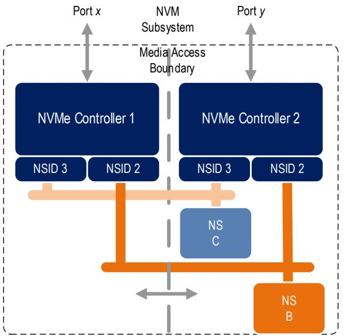

To provide optimized access to namespace B through controller 1, the NVM subsystem may be administratively reconfigured, or may perform autonomous internal reconfiguration actions that change the access characteristics of namespace B when accessed through controller 1 and controller 2 as shown in Figure 586. Controller 2 provides optimized access to namespace C while controller 1 provides optimized access to namespace B. In an NVM subsystem that supports multiple domains (refer to section 3.2.5), the Media Access Boundary shown in Figure 586 may be a Communication boundary as shown in Figure 71 and Figure 72. 

Figure 586: Namespace B optimized through Controller 1

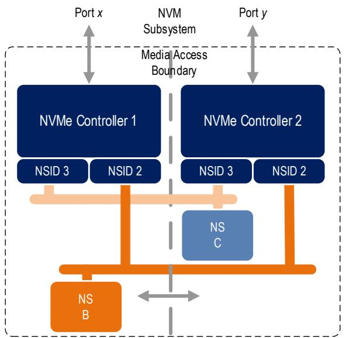

# ANA Groups

Namespaces that are members of the same ANA Group perform identical asymmetric namespace access state transitions. The ANA Group maintains the same asymmetric namespace access state for all namespaces that are members of that ANA Group (i.e., a change in the asymmetric namespace access state of one namespace only occurs as part of a change in the asymmetric namespace access state of all namespaces that are members of that ANA Group). Namespaces that are members of the same ANA Group shall be members of the same domain (refer to section 2.3.1). The method for assigning namespaces to ANA Groups is outside the scope of this specification. 

An ANA Group may contain zero or more namespaces, zero or more NVM Sets, or zero or more Endurance Groups. The mapping of namespaces, NVM Sets, and Endurance Groups to ANA Groups is vendor specific. 

A valid ANA Group Identifier is a non-zero value that is less than or equal to ANAGRPMAX (refer to Figure 312). 

The ANA Group Identifier (ANAGRPID) for each ANA Group shall be unique within the NVM subsystem. If the ANA Group ID Change Support (ANAGIDCS) bit in the ANACAP field in the Identify Controller data structure is set to ‘1’, then the ANA Group Identifier shall not change while the namespace is attached to any controller in the NVM subsystem. If the ANAGIDCS bit is cleared to $\scriptstyle { \mathrm { ~ \displaystyle ~ } } ^ { \prime } 0 ^ { \prime }$ , then the ANA Group Identifier may change while the namespace is attached to any controller in the NVM subsystem. If the ANA Group Identifier changes, the controller shall issue the Asymmetric Namespace Access Change Notice as described in 8.1.1.9. 

If two or more participating NVM subsystems provide access to a dispersed namespace, and that dispersed namespace is a member of an ANA Group on any participating NVM subsystem, then each participating NVM subsystem shall contain an ANA Group whose members include that dispersed namespace. The ANAGRPID for a dispersed namespace may or may not be the same on each participating NVM subsystem. 

Figure 587 shows the following four namespaces: 

the private namespace A in a first ANA Group; 

• namespace B and namespace D, that are in the same second ANA Group; and 

• namespace C that is in a third ANA Group. 

Figure 587: Multiple Namespace groups

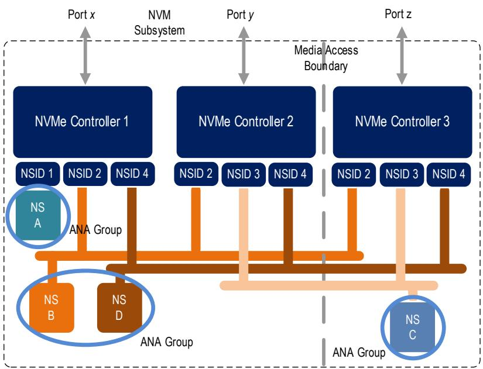

# Asymmetric Namespace Access states

The Asymmetric Namespace Access State indicates information about the characteristics of the relationship between a controller and an ANA Group. The following asymmetric namespace access states are defined: 

• ANA Optimized (refer to section 8.1.1.4); 

• ANA Non-Optimized (refer to section 8.1.1.5); 

• ANA Inaccessible (refer to section 8.1.1.6); 

• ANA Persistent Loss (refer to section 8.1.1.7); and 

• ANA Change (refer to section 8.1.1.8). 

# ANA Optimized state

While the relationship between the controller and an ANA group is in this state, the characteristic of that relationship to each namespace in that group is optimized. Commands processed by a controller that reports this state for an ANA Group provide optimized access characteristics to any namespace in that ANA Group. A controller that supports ANA Reporting shall support reporting this state. 

While in this state, all commands, functions, and operations supported by the namespace shall perform as described in this specification. 

# ANA Non-Optimized state

While the relationship between the controller and an ANA group is in this state, the characteristic of that relationship to each namespace in that group is non-optimized. Commands processed by a controller that reports this state for an ANA Group provide non-optimized access characteristics (e.g., the processing of some commands, especially those involving data transfer, may operate with lower performance or may use NVM subsystem resources less effectively than if a controller is used that reports the optimized state) to any namespace in that ANA Group. Support for reporting this state is optional. 

While in this state, all commands, functions, and operations supported by the namespace shall perform as described in this specification. 

# ANA Inaccessible state

While the relationship between the controller and an ANA group is in this state, the characteristic of that relationship to each namespace in that group is inaccessible. Commands processed by a controller that reports this state for an ANA Group are not able to access user data of namespaces in that ANA Group. The namespaces may become accessible through the controller reporting this state at a future time (i.e., a subsequent ANA state transition may occur). Support for reporting this state is optional. 

While in this state, accurate namespace related capacity information may not be available. As a result, some namespace capacity information returned in the Identify Namespace data structure (e.g., the NUSE field and the NVMCAP field), are cleared to 0h. For that namespace capacity information, hosts should use the Identify Namespace data structure returned from a controller that reports the relationship between the controller and the namespace to be in the ANA Optimized state or in the ANA Non-Optimized state. 

A controller shall abort commands, other than those described in section 8.1.1.10, with a status code of Asymmetric Access Inaccessible if those commands are submitted while the relationship between the specified namespace and the controller processing the command is in this state. 

While ANA Inaccessible state is reported by a controller for the namespace, the host should retry the command on a different controller that is reporting ANA Optimized state or ANA Non-Optimized state. If no controllers are reporting ANA Optimized state or ANA Non-Optimized state, then a transition may be occurring such that a controller reporting the Inaccessible state may become accessible and the host should retry the command on the controller reporting Inaccessible state for at least ANATT seconds (refer to Figure 312). Refer to section 8.1.2.2. 

# ANA Persistent Loss state

While the relationship between the controller and an ANA group is in this state, the characteristic of that relationship to each namespace in that group is persistently inaccessible. Commands processed by a controller that reports this state for an ANA Group are persistently not able to access user data of namespaces in that ANA Group. The relationship between a controller and an ANA Group in this state shall not transition to any other ANA state. Support for reporting this state is optional. 

While in this state, accurate namespace related capacity information may not be available. As a result, some namespace capacity information returned in the Identify Namespace data structure (e.g., the NUSE field and the NVMCAP field), are cleared to 0h. For that namespace capacity information, hosts should use the Identify Namespace data structure returned from a controller that reports the relationship between the controller and the namespace to be in the ANA Optimized state or in the ANA Non-Optimized state. 

A controller shall abort commands, other than those described in section 8.1.1.10, with a status code of Asymmetric Access Persistent Loss if those commands are submitted while the relationship between the specified namespace and the controller processing the command is in this state. 

While ANA Persistent Loss state is reported by a controller for the namespace, the host should retry the command on a different controller that is reporting ANA Optimized state or ANA Non-Optimized state. If no controllers are reporting ANA Optimized state or ANA Non-Optimized state, then a transition may be occurring such that a controller reporting the Inaccessible state may become accessible and the host should retry the command on the controller reporting Inaccessible state for at least ANATT seconds (refer to Figure 312). 

# ANA Change state

The change from one asymmetric namespace access state to another asymmetric namespace access state is called a transition. Transitions may occur in such a way that the ANA Change state is not visible to the host (i.e., the ANA Change state may or may not be reported in the Asymmetric Namespace Access State field in the Asymmetric Namespace Access log page (refer to section 5.1.12.1.13)). Support for reporting this state is optional. 

A controller shall abort commands, other than those described in 8.1.1.10, with a status code of Asymmetric Access Transition if those commands are submitted while the relationship between the specified namespace and the controller processing the command is in this state. 

While ANA Change state is reported by a controller for the namespace, the host should: 

a) after a short delay, retry the command on the same controller for at least ANATT (refer to Figure 312) seconds (e.g., if ANATT is 30, perform 3 retries at 10 s intervals, or 10 retries at 3 s intervals); or 

b) retry the command on a different controller that is reporting ANA Optimized state or ANA Non-Optimized state. 

# Asymmetric Namespace Access Change Notifications

If Asymmetric Namespace Access Change Notices are enabled on a controller, then an Asymmetric Namespace Access Change Notice shall be sent as described in section 5.1.25.1.5 by the controllers where the change occurred: 

a) if an ANA Group Identifier (refer to Figure 312) changes; 

b) if an asymmetric namespace access state transition fails (e.g., a transition begins, but does not complete and the controller returns to the state that existed before the transition began); or 

c) upon entry to the following ANA states, unless the state entry is a result of a namespace attachment: 

• ANA Optimized State; 

• ANA Non-Optimized State; 

• ANA Inaccessible State; and 

• ANA Persistent Loss State. 

# Asymmetric Namespace Access States Command Processing Effects

Processing of Admin commands that: 

are not NVM Command Set specific commands; and 

do not use the Namespace Identifier (i.e., Figure 141 – “Namespace Identifier Used” column indicates “No”), 

are not affected by ANA states, except as specified in Figure 588. 

Figure 588 describes Asymmetric Namespace Access effects on command processing. 

Figure 588: ANA effects on Command Processing

<table><tr><td>Command</td><td>ANA State</td><td>Effects on command processing</td></tr><tr><td>Get Features</td><td>ANA Inaccessible, ANAPersistent Loss, or ANACHange</td><td>The following feature identifiers are not available1:a) Reservation Notification Mask (i.e., 82h);b) Reservation Persistence (i.e., 83h); andc) I/O Command Set specific feature identifiers2.</td></tr><tr><td>Get Log Page</td><td>ANA Inaccessible, ANAPersistent Loss, or ANACHange</td><td>The following log pages are affected:a) Error Information (i.e., 01h): The log page is not required to contain entries for namespaces whose relationship to the controller processing the command is in the:a. ANA Inaccessible state (refer to section 8.1.1.6);b. the ANA Persistent Loss state (refer to section 8.1.1.7); orc. the ANA Change state (refer to section 8.1.1.8).The following log pages are not available1:a) Media Unit Status log page (refer to section 5.1.12.1.16);andb) Supported Capacity Configuration List log page (refer to section 5.1.12.1.17).</td></tr></table>

Figure 588: ANA effects on Command Processing

<table><tr><td>Command</td><td>ANA State</td><td>Effects on command processing</td></tr><tr><td>Identify</td><td>ANA Inaccessible or 
ANA Persistent Loss</td><td>Capacity fields in the Identify Namespace data structure (refer to the applicable I/O Command Set specification) information are cleared to 0h.</td></tr><tr><td rowspan="3">Set Features</td><td>ANA Inaccessible</td><td>The saving of features shall not be supported and the following feature identifiers are not available1: 
a) Reservation Notification Mask (i.e., 82h); 
b) Reservation Persistence (i.e., 83h); and 
I/O Command Set specific feature identifiers2. 
If the NSID is set to FFFFFFFH, then the command shall abort3 with a status code of Asymmetric Access Inaccessible (refer to section 8.1.1.6).</td></tr><tr><td>ANA Change</td><td>The saving of features shall not be supported and the following feature identifiers are not available1: 
a) Reservation Notification Mask (i.e., 82h); 
b) Reservation Persistence (i.e., 83h); and 
c) I/O Command Set specific feature identifiers2. 
If the NSID is set to FFFFFFFH, then the command shall abort3 with a status code of Asymmetric Access Transition (refer to section 8.1.1.8).</td></tr><tr><td>ANA Persistent Loss</td><td>The command shall abort with a status code of Asymmetric Access Persistent Loss (refer to section 8.1.1.7).</td></tr><tr><td colspan="3">Notes: 
1. If the ANA state is ANA Inaccessible State, then commands that use feature identifiers or log pages that are not available shall abort with a status code of Asymmetric Access Inaccessible. If the ANA state is ANA Persistent Loss State, then commands that use feature identifiers or log pages that are not available shall abort with a status code of Asymmetric Access Persistent Loss. If the ANA state is ANA Change State, then commands that use feature identifiers or log pages that are not available shall abort with a status code of Asymmetric Access Transition. 
2. I/O Command Set specific definition. Refer to each I/O Command Set specification for applicability and additional details, if any. 
3. If any namespace that is attached to the controller is in an ANA Group that is in the ANA Inaccessible state, the ANA Persistent Loss state, or the ANA Change state, then the command shall abort with the indicated status. Depending on the ANA state of the ANA Group that contains a namespace (e.g., an ANA state changes during the processing of the command), the specified feature identifier may be altered for some attached namespaces and not altered for other attached namespaces.</td></tr></table>

# Asymmetric Namespace Access Reporting – Host Considerations (Informative)

# Host ANA Normal Operation

The host determines if ANA is supported by examining the Asymmetric Namespace Access Reporting Support (ANARS) bit in the CMIC field in the Identify Controller data structure (refer to Figure 312). The NSID or identifier (refer to section 4.5) is used to determine when multiple paths to the same namespace that is not a dispersed namespace are available. For dispersed namespaces, globally unique namespace identifiers (refer to section 8.1.9.2) are used to determine when multiple paths are available to the same namespace, as described in section 8.1.9.5. The host examines the ANA log page (refer to section 5.1.12.1.13) for each controller to determine the ANA state of each group of namespaces attached to that controller. 

To send a command to a namespace, the host should select a controller that reports the ANA Optimized State (refer to section 8.1.1.4) and send the command to that controller. If more than one controller that 

reports the ANA Optimized state for a namespace are found, then the host may use all of those controllers to send commands. 

If there are no controllers that report the ANA Optimized state for a namespace, then the host should select a controller that reports ANA Non-Optimized State (refer to section 8.1.1.5) for that namespace and send the command to that controller. If more than one controller that reports ANA Non-Optimized state for a namespace are found, then the host may use all of those controllers to send commands. 

If multiple controllers are being used, then the algorithm for determining which controller to use next is outside the scope of this specification (e.g., the host may select a simple round robin algorithm, a queue depth weighted algorithm, a transfer length weighted algorithm, or any other algorithm). 

If there are no controllers that report the ANA Optimized state for a namespace and there are no controllers that report the ANA Non-Optimized state for that namespace, then the host should examine controllers that report the ANA Inaccessible state as described in section 8.1.2.2. 

# Host ANA Inaccessible Operation

If the ANA log page reports an ANA state of ANA Inaccessible State for an ANA Group or a command returns a status code of Asymmetric Access Inaccessible, then the host should: 

• not use that controller to send commands to any namespace in that ANA Group; and 

• select a different controller for sending commands to all namespaces in that ANA Group. 

If there are no controllers that report the ANA Optimized state for a namespace and there are no controllers that report the ANA Non-Optimized state, then a transition may be occurring that also impacts controllers that are reporting the ANA Inaccessible state. As a result, the host should use the methods described for Host ANA Transition operation (refer to section 8.1.2.5) to determine if the controller reporting ANA Inaccessible state transitions during the ANATT time interval to an ANA state that enables commands to be processed by that controller. 

# Host ANA Persistent Loss Operation

If the ANA log page reports an ANA state of ANA Persistent Loss State for an ANA Group or a command returns a status code of Asymmetric Access Persistent Loss, then the host should not use that controller to send commands to any namespace in that ANA Group, and select a different controller for sending commands to any namespace in that ANA Group. If the controller supports the Namespace Management capability (refer to section 8.1.15), then the namespaces in an ANA Group reporting this state should be detached. 

# Host ANA Change Notice Operation

If the ANA log page reports an ANA state of ANA Change State for an ANA Group or a command returns a status code of Asymmetric Access Transition, then the host should temporarily not use that controller to send commands to any namespace in that ANA Group. If only controllers reporting ANA Inaccessible State are available, then the host should follow these procedures to determine which controller to use. To use a controller, the host may: 

a) if Asymmetric Namespace Access Change Notices are enabled (refer to section 5.1.25.1.5) on the controller, wait for an Asymmetric Namespace Access Change Notice from that controller. Upon receipt of that notice, the host should examine the ANA log page to determine the new ANA state and resume sending commands based on the new ANA state. Such notice should occur within the ANATT time (refer to Figure 312); or 

b) delay and retry the command during the ANATT time interval. The host should not immediately retry, but rather, divide the ANATT time into equal intervals for command retry purposes (e.g., if ANATT is 30, perform 3 retries at 10 s intervals, or 10 retries at 3 s intervals). During or upon completion of the ANATT time interval, the new ANA state of the ANA Group should be known (e.g., one of the command retries returned a different status that indicates completion of the transition to a new ANA state). If the retried command did not complete without error, the ANA log 

page should be examined on each controller that provides access to the namespace and the host should resume sending commands based on the new ANA state. 

If the ANATT time interval expires, then the host should use a different controller for sending commands to the namespaces in that ANA Group. The ANATT interval reported by the controller should prevent this type of timer expiration from occurring. 

# Host ANA Transition Operation

Receipt of an Asymmetric Namespace Access Change Notice from a controller may indicate: 

a) that the ANA state reported in one or more ANA Group Descriptors has changed; 

b) a new NSID has been added to one or more of the ANA Group Descriptors; 

c) an NSID has been removed from one or more of the ANA Group Descriptors; and/or 

d) the NSID of a namespace has moved from one ANA Group Descriptor to a different ANA Group Descriptor (i.e., the ANAGRPID field in the Identify Namespace data structure for that namespace has changed), if the ANA Group ID Change Support (ANAGIDCS) bit in the ANACAP field is cleared to $\scriptstyle { \mathrm { ~ \displaystyle ~ } } ^ { \prime } 0 ^ { \prime }$ in the Identify Controller data structure (refer to Figure 312). 

As a result of receiving an Asymmetric Namespace Access Change Notice, the host should read the ANA log page (refer to section 5.1.12.1.13) to check for each of those possible changes. 

# All Paths Down Condition

An all paths down condition occurs when there are no paths available on the host to access the namespaces in an ANA Group (i.e., the NVM media). To determine whether an all paths down condition has occurred, the host may examine the ANA log page on each controller that provides access to the namespaces in a particular ANA Group. All paths that are not in the ANA Persistent Loss state should be checked. If no paths to the namespaces in that ANA Group become available (i.e., transition to the ANA Optimized state or the ANA Non-Optimized state) for the duration of an ANATT time interval, then an all paths down condition has occurred for the namespaces in that ANA Group. 

# Boot Partitions

Boot Partitions provide an optional area of NVM storage that may be read by the host without the host initializing queues or enabling the controller. The simplified interface to access Boot Partitions may be used for platform initialization code (e.g., a bootloader that is executed from host ROM) to boot to a pre-OS environment (e.g., UEFI) instead of storing the image on another non-volatile storage medium (e.g., SPI flash). Refer to section 8.1.3.1 for the procedure to read the contents of a Boot Partition. 

A controller that supports Boot Partitions has two Boot Partitions of equal size using Boot Partition identifiers 0h and 1h. The two Boot Partitions allow the host to update one and verify the contents before marking the Boot Partition active. Controllers in the NVM subsystem may share the same Boot Partitions. 

The contents of Boot Partitions are only modified using the Firmware Image Download and Firmware Commit commands (refer to section 8.1.3.2) and may be secured using either the Boot Partition Write Protection Config feature or the Replay Protected Memory Block to prevent unauthorized modifications (refer to section 8.1.3.3). 

# Reading from a Boot Partition

A Boot Partition is a continuous block of data as shown in Figure 589, that the host may read via NVMe properties. 

Figure 589: Boot Partition Overview

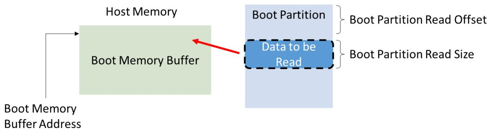

To read the contents of a Boot Partition using NVMe properties, the host allocates a Boot Partition Memory Buffer in host memory for the controller to copy contents from a Boot Partition. The host initializes the Boot Partition Memory Buffer Base Address. The host sets the Boot Partition ID, Boot Partition Read Size, and Boot Partition Read Offset to initiate the Boot Partition read operation. The host may continue reading from the Boot Partition until the entire Boot Partition has been read. 

A portion of the Boot Partition may be read by the host any time the NVM subsystem is powered (i.e., whether or not CC.EN is set to ‘1’). The host shall not modify transport specific properties (described in the applicable NVMe Transport binding specification), reset, or shutdown the controller while a Boot Partition read is in progress. 

To read data from a Boot Partition, the host follows these steps: 

1. Initialize the transport (e.g., PCIe link), if necessary; 

2. Determine if Boot Partitions are supported by the controller (CAP.BPS); 

3. Determine which Boot Partition is active (BPINFO.ABPID) and the size of the Boot Partition (BPINFO.BPSZ); 

4. Allocate a physically contiguous memory buffer in the host to store the contents of a Boot Partition; 

5. Initialize the address (BPMBL.BMBBA) into the memory buffer where the contents should be copied; 

6. Initiate the transfer of data from a Boot Partition by writing to the Boot Partition Read Select (BPRSEL) property. This includes setting the Boot Partition identifier (BPRSEL.BPID), size of Boot Partition Read Size (BPRSEL.BPRSZ) and Boot Partition Read Offset (BPRSEL.BPROF). The controller sets the Boot Read Status (BPINFO.BRS) field while transferring the Boot Partition contents to indicate a Boot Partition read operation is in progress; and 

7. Wait for the controller to completely transfer the requested portion of the Boot Partition, indicated in the status field (BPINFO.BRS). If BPINFO.BRS is set to 10b, the requested Boot Partition data has been transferred to the Boot Partition Memory Buffer. If BPINFO.BRS is set to 11b, there was an error transferring the requested Boot Partition data and the host may request the Boot Partition data again. 

In constrained memory environments, the host may read the contents of a Boot Partition with a small Boot Partition Memory Buffer by reading a small portion of a Boot Partition, moving the data out of the Boot Memory Buffer to another memory location, and then reading another portion of the Boot Partition until the entire Boot Partition has been read. 

If the Boot Partition log page is supported (refer to section 5.1.12.1.1), then the Boot Partition can be accessed through the Boot Partition log page (refer to section 5.1.12.1.21). 

# Writing to a Boot Partition

Boot Partition contents may be modified by the host using the Firmware Image Download and Firmware Commit commands while the controller is enabled (CC.EN set to ‘1’). 

The process for updating a Boot Partition is: 

1. The host issues a Firmware Image Download command to download the contents of the Boot Partition to a controller. There may be multiple portions of the Boot Partition to download, thus the offset for each portion of the Boot Partition being downloaded is specified in the Firmware Image Download command. A host shall send the Boot Partition image in order starting with the beginning of the Boot Partition; 

2. The host transitions the Boot Partition that is to be updated to the Write Unlocked State (refer to section 8.1.3.3); 

3. The host submits a Firmware Commit command (refer to section 5.1.8) on that controller with a Commit Action of 110b which specifies that the downloaded image replaces the contents of the Boot Partition specified in the Boot Partition ID field; 

4. The controller completes the Firmware Commit command. The following actions are taken in certain error scenarios: 

a. If the firmware activation was not successful because the Boot Partition could not be written, then the controller reports an error of Boot Partition Write Prohibited; 

5. (Optional) The host reads the contents of the Boot Partition to verify they are correct (refer to section 8.1.3.1). A host updates the active Boot Partition ID by issuing a Firmware Commit command with a Commit Action of 111b; and 

6. The host transitions the Boot Partition to either the Write Locked State or Write Locked Until Power Cycle State to prevent further modification (refer to section 8.1.3.3). 

If an internal error, reset, or power loss condition occurs while committing the downloaded image to a Boot Partition, the contents of the Boot Partition may contain the old contents, new contents, or a mixture of both. Host software should verify the contents of a Boot Partition before marking that Boot Partition active to ensure the active Boot Partition is stable. 

Host software should not read the contents of a Boot Partition while writing to the Boot Partition. The controller may return a combination of new and old data if the host attempts to perform a Boot Partition read operation while overwriting the contents. 

Host software should not overlap firmware/boot partition image update command sequences (refer to section 1.5.41). During a boot partition image update command sequence, if a Firmware Image Download command or a Firmware Commit command is submitted for another firmware/boot partition image update command sequence, the results of both that command and the in-progress firmware image update are undefined. 

Host software should use the same controller or Management Endpoint (refer to the NVM Express Management Interface Specification) for all commands that are part of a boot partition image update command sequence. If the commands for a single firmware/boot partition image update command sequence are submitted to more than one controller and/or Management Endpoint, the controller may abort the Firmware Commit command with Invalid Firmware Image status. 

# Boot Partition Write Protection

A controller that supports both Boot Partitions and RPMB shall support at least one of the following Boot Partition write protection mechanisms: 

• Set Features Boot Partition Write Protection (refer to section 8.1.3.3.1); or 

• RPMB Boot Partition Write Protection (refer to section 8.1.3.3.2). 

It is not recommended that a controller support both Set Features Boot Partition Write Protection and RPMB Boot Partition Write Protection. 

A controller that supports Boot Partitions and does not support RPMB shall support Set Features Boot Partition Write Protection. 

A host is able to determine whether Set Features Boot Partition Write Protection is supported by checking the value of the Set Features Boot Partition Write Protection Support bit of the Boot Partition Capabilities field in the Identify Controller Data Structure (refer to Figure 312). 

A host is able to determine whether RPMB Boot Partition Write Protection is supported by checking the RPMB Boot Partition Write Protection Support field of the Boot Partition Capabilities field in the Identify 

Controller data structure (refer to Figure 312). Only controllers compliant with NVM Express Base Specification, Revision 2.0 and earlier are allowed to report a value of 00b (i.e., support not specified) in that field. If a controller reports the 00b value, a host is able to determine if RPMB Boot Partition Write Protection is supported by checking whether the controller supports both Boot Partitions (refer to section 3.1.4.1) and RPMB (refer to section 5.1.13.2.1) because a controller compliant with NVM Express Base Specification, Revision 2.0 and earlier is required to support RPMB Boot Partition Write Protection when the controller supports both Boot Partitions and RPMB. 

If Set Features Boot Partition Write Protection is supported and either: 

1) RPMB Boot Partition Write Protection is not supported; or 

2) RPMB Boot Partition Write Protection is not enabled, 

then the Boot Partition write protection states are able to be configured via the Boot Partition Write Protection Config feature. Section 8.1.3.3.1 covers the case when only the Boot Partition Write Protection Config feature is supported. 

If RPMB Boot Partition Write Protection is supported and enabled, then the Boot Partition write protection states are able to be configured using RPMB (refer to section 8.1.21). Section 8.1.3.3.2 covers the case where only RPMB Boot Partition Write Protection is supported. 

Only one mechanism controls the Boot Partition write protection states at a time. Section 8.1.3.3.3 covers considerations when both Boot Partition write protection mechanisms are supported. 

If any Boot Partition is shared across multiple controllers (refer to section 8.1.3), then the write protection state of the Boot Partition shall be enforced by all controllers that share that Boot Partition. 

# 8.1.3.3.1 Set Features Boot Partition Write Protection

Figure 590 shows an overview of the Boot Partition write protection states for each Boot Partition when only Set Features Boot Partition Write Protection is supported. 

Figure 590: Set Features Boot Partition Write Protection State Machine Model

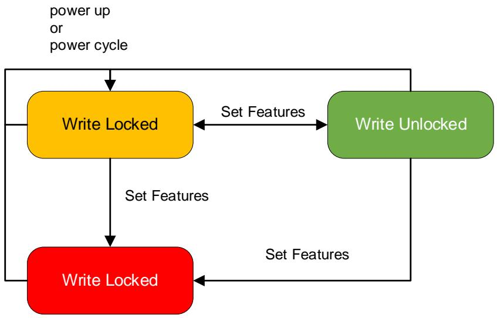

Figure 591 defines the write protection states per Boot Partition if Set Features Boot Partition Write Protection is supported.

Figure 591: Set Features Boot Partition Write Protection State Definitions

<table><tr><td rowspan="2">State</td><td rowspan="2">Definition</td><td colspan="2">Persistent Across</td></tr><tr><td>Power Cycles</td><td>Controller Level Resets</td></tr><tr><td>Write Unlocked</td><td>The Boot Partition is not write locked.</td><td>No</td><td>Yes</td></tr><tr><td>Write Locked</td><td>The Boot Partition is write locked.</td><td>Yes</td><td>Yes</td></tr><tr><td>Write Locked Until Power Cycle</td><td>The Boot Partition is write locked until the next power cycle.</td><td>No</td><td>Yes</td></tr></table>

If Set Features Boot Partition Write Protection is supported, then the default state for all Boot Partitions is the Write Locked state. In this state, a host may read from a Boot Partition but is unable to modify that Boot Partition. To enable modification of a Boot Partition, a host has to first transition the Boot Partition to the Write Unlocked state by setting the appropriate Boot Partition Write Protection State to Write Unlocked using the Boot Partition Write Protection Config feature via the Set Features command. 

In the Write Unlocked state, a host may read from and modify a Boot Partition. Any Boot Partition in a Write Unlocked state transitions to the Write Locked state when the controller undergoes a power cycle. 

If Set Features Boot Partition Write Protection is supported, then both Boot Partitions support a Write Locked Until Power Cycle state. In this state, the Boot Partition can be read from but is prohibited from being modified. Additionally, once a Boot Partition enters the Write Locked Until Power Cycle state, the Boot Partition remains in this state until the controller is power cycled. 

The Write Locked Until Power Cycle state is prohibited in multi-domain NVM subsystems with Boot Partitions shared across controllers (e.g., since clearing that state requires simultaneous power cycle of all controllers that share the Boot Partitions). The result of a command that attempts to use that state in a multi-domain NVM subsystem is specified in section 5.1.25.1.32. 

# 8.1.3.3.2 RPMB Boot Partition Write Protection

Figure 592 shows an overview of the Boot Partition write protection states for each Boot Partition when only RPMB Boot Partition Write Protection is supported. 

Figure 592: RPMB Boot Partition Write Protection State Machine Model

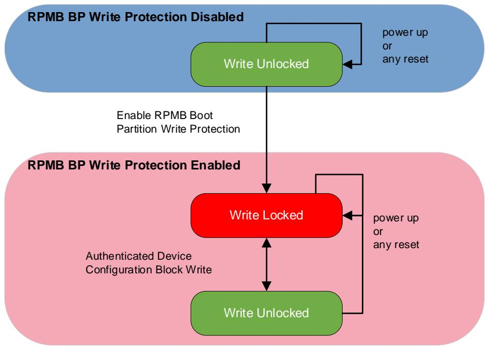

Figure 594 defines the write protection states per Boot Partition if RPMB Boot Partition Write Protection is supported.

Figure 593: RPMB Boot Partition Write Protection State Definitions

<table><tr><td rowspan="2">State</td><td rowspan="2">Definition</td><td colspan="2">Persistent Across</td></tr><tr><td>Power Cycles</td><td>Controller Level Resets</td></tr><tr><td colspan="4">RPMB Boot Partition Write Protection Disabled</td></tr><tr><td>Write Unlocked</td><td>The Boot Partition is not write locked.</td><td>Yes</td><td>Yes</td></tr><tr><td colspan="4">RPMB Boot Partition Write Protection Enabled</td></tr><tr><td>Write Unlocked</td><td>The Boot Partition is not write locked.</td><td>No</td><td>No</td></tr><tr><td>Write Locked</td><td>The Boot Partition is write locked.</td><td>Yes</td><td>Yes</td></tr></table>

If Set Features Boot Partition Write Protection is not supported by the controller, then prior to enabling RPMB Boot Partition Write Protection, the default state for all Boot Partitions is the Write Unlocked state. If Set Features Boot Partition Write Protection is also supported by the controller, then the default state for all Boot Partitions is the Write Locked state, regardless of whether RPMB Boot Partition Write Protection has been enabled or not. Refer to section 8.1.3.3.1 for more details on Boot Partition write protection when RPMB Boot Partition Write Protection is disabled and section 8.1.3.3.3 for additional considerations when both Boot Partition write protection capabilities are supported. 

If Set Features Boot Partition Write Protection is not supported by the controller, then all Boot Partitions remain unlocked until RPMB Boot Partition Write Protection is enabled by the host. A host enables RPMB Boot Partition Write Protection by setting the Boot Partition Write Protection Enabled bit in the RPMB Device Configuration Block data structure (refer to section 8.1.21). Once RPMB Boot Partition Write Protection is enabled, the controller shall reject Authenticated Device Configuration Block Writes that attempt to disable the RPMB Boot Partition Write Protection mechanism (i.e., enabling RPMB Boot Partition Write Protection 

is permanent). Once RPMB Boot Partition Write Protection is enabled, Boot Partitions are able to be modified only after write unlocking the Boot Partition using RPMB. 

After enabling RPMB Boot Partition Write Protection: 

a) The default state for all Boot Partitions is the Write Locked state. In this state, a host may read a Boot Partition. In this state, the controller rejects attempts to write to a Boot Partition using the Firmware Commit command; 

b) Each Boot Partition may be locked or unlocked independently using the corresponding bit in the Device Configuration Block data structure. A Boot Partition may be unlocked in the same command that enables RPMB Boot Partition Write Protection; and 

c) If any Boot Partition has been unlocked, a power cycle or Controller Level Reset event results in that Boot Partition becoming write locked. 

# 8.1.3.3.3 Interactions between Boot Partition Write Protection Mechanism

Figure 594 shows an overview of the Boot Partition write protection states for each Boot Partition when both Boot Partition write protection mechanisms are supported. Supporting both Boot Partition write protection mechanisms is discouraged, as specified in section 8.1.3.3. 

Figure 594: Boot Partition Write Protection State Machine Model

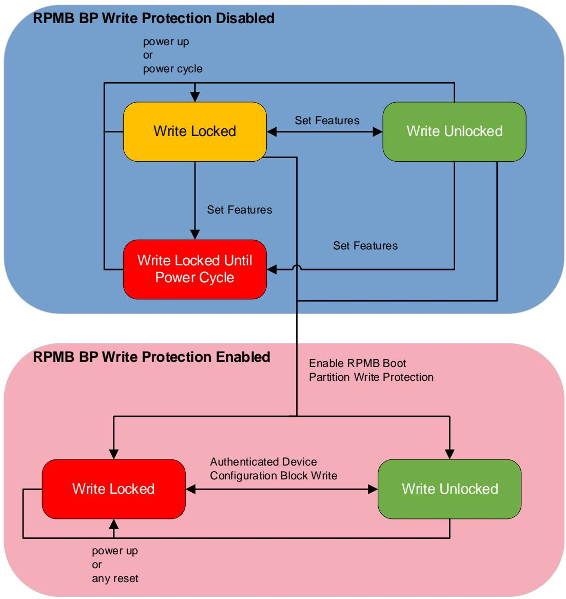

If both Boot Partition write protection mechanisms are supported by the controller, only one Boot Partition write protection mechanism controls the write protection states of the Boot Partitions for the controller at any time. If RPMB Boot Partition Write Protection is enabled, then RPMB Boot Partition Write Protection controls the Boot Partition write protection states (refer to section 8.1.3.3.2 and section 8.1.21). If RPMB Boot Partition Write Protection is disabled, then Set Features Boot Partition Write Protection controls the Boot Partition write protection states (refer to section 8.1.3.3.1 and section 5.1.25.1.32). Control of the Boot Partition write protection states transitions from Set Features Boot Partition Write Protection to RPMB Boot Partition Write Protection by enabling RPMB Boot Partition Write Protection when the Boot Partitions are in either a Write Unlocked or Write Locked state. 

If both Boot Partition write protection capabilities are supported and an RPMB authentication key has not been programmed for RPMB target 0, there is a possibility of malicious bypass of a Boot Partition’s Write Locked Until Power Cycle state. In order to prevent malicious bypass of a Boot Partition's Write Locked Until Power Cycle state, a controller that supports both Boot Partition write protection mechanisms is required to prevent host attempts to enable RPMB Boot Partition Write Protection when either Boot Partition 

is in a Write Locked Until Power Cycle state. Refer to section 8.1.21 for the specific behavior that the controller exhibits under this condition. 

# Capacity Management

# Overview

Capacity Management is a capability for organizing physical media into Endurance Groups and NVM Sets. There are two different forms of Capacity Management, Fixed Capacity Management and Variable Capacity Management. A controller that supports Capacity Management shall support at least one form. 

Capacity Management commands shall not be supported by Exported NVM Subsystems. 

The host uses Fixed Capacity Management to create Endurance Groups and NVM Sets by selecting a configuration which explicitly allocates Media Units (refer to section 8.1.4.2) to Endurance Groups and NVM Sets. 

The host uses Variable Capacity Management to: 

• create a single Endurance Group by specifying the desired capacity; 

• create a single NVM Set by specifying the desired capacity; 

delete a single Endurance Group; and 

delete a single NVM Set. 

The Capacity Adjustment Factor is the ratio between the capacity consumed by an Endurance Group from the Unallocated NVM Capacity field in the Identify Controller data structure and the total NVM capacity in that Endurance Group, i.e.: 

$$
C a p a c i t y A d j u s t m e n t F a c t o r = I N T E G E R \left(\frac {C a p a c i t y C o n s u m e d}{E n d u r a n c e G r o u p C a p a c i t y} * 1 0 0\right)
$$

(E.g., the value 200 indicates that creation of an Endurance Group with a total NVM capacity of 5 GiB consumes 10 GiB of the Unallocated NVM Capacity indicated by the controller). 

If an Endurance Group is created, then the controller performs the following actions as an atomic operation: 

a) the value indicated by the Unallocated NVM Capacity (UNVMCAP) field of the Identify Controller data structure is changed based on the requested capacity, the Capacity Adjustment Factor of the created Endurance Group, and the granularity at which the controller allocates NVM capacity; and 

b) the Endurance Group Identifier is added to the Endurance Group List. 

If an Endurance Group is deleted, then the controller performs the following actions in sequence: 

1) the Endurance Group Identifier is removed from the Endurance Group List; 

2) if the Media Unit Status log page is supported, then the Endurance Group Identifier field is cleared to 0h in all Media Unit Status Descriptors, if any, that indicate the deleted Endurance Group; 

3) every NVM Set in the Endurance Group is deleted; and 

4) the value indicated by the Unallocated NVM Capacity (UNVMCAP) field of the Identify Controller data structure is increased by the value that was indicated by the Total Endurance Group Capacity (TEGCAP) field of the Endurance Group Information log page of the deleted Endurance Group. 

If any of the entities modified by the above sequence are accessed after the sequence begins and before it completes, then the results are indeterminate. 

If an NVM Set is created, then the controller performs the following actions as an atomic operation: 

a) the NVM Set Identifier is added to the NVM Set List; and 

b) the Unallocated Endurance Group Capacity indicated by the Endurance Group Information log page (refer to Figure 218) is decreased by the amount of capacity allocated to the NVM Set; the controller may allocate NVM capacity in units such that the requested size for an NVM Set may be rounded up to the next unit boundary. 

If an NVM Set is deleted, then the following actions are performed in sequence: 

1) the NVM Set Identifier is removed from the NVM Set List; 

2) if the Media Unit Status log page is supported, then the NVM Set Identifier field is cleared to 0h in all Media Unit Status Descriptors, if any, that indicated the deleted NVM Set; 

3) for each namespace in the deleted NVM Set: 

a. all commands targeting the namespace are handled as described for namespace deletion in section 8.1.15; 

b. the namespace identifier is removed from the Allocated Namespace ID list; 

c. the namespace is deleted; 

d. for each controller to which the namespace was attached when that namespace was deleted: 

i. the namespace identifier is added to the Changed Attached Namespace List log page for that controller; and 

ii. an Attached Namespace Attribute Changed asynchronous event is generated by that controller as described in section 8.1.15.2; 

e. the namespace identifier is added to the Changed Allocated Namespace List log page for each controller in the NVM subsystem; and 

f. an Allocated Namespace Attribute Changed asynchronous event is generated for each controller that has Allocated Namespace Attribute Notices enabled as described in section 8.1.15.2; 

and 

4) the Unallocated Endurance Group Capacity indicated by the Endurance Group Information log page is increased by the amount of capacity formerly allocated to the NVM Set. 

If any of the entities modified by the above sequence are accessed after the sequence begins and before it completes, then the results are indeterminate. 

If an NVM Set is created or deleted, the value indicated by the Unallocated NVM Capacity (UNVMCAP) field of the Identify Controller data structure is not changed. 

# Fixed Capacity Management

A Media Unit represents a component of the underlying media in a domain. An implementation may choose to represent each die as a separate Media Unit; however, this is not required. A Media Unit is the smallest media component for which the controller reports wear information (refer to the Available Spare field and the Percentage Used field in the Media Unit Status Descriptor, Figure 255). 

Two or more I/O operations to a Media Unit at the same time may interfere with each other as they contend for resources internal to or shared by that Media Unit. 

A controller supporting Fixed Capacity Management: 

a) shall support the Media Unit Status log page (refer to section 5.1.12.1.16); 

b) shall support Endurance Groups (refer to section 3.2.3); 

c) may support NVM Sets (refer to section 3.2.2); 

d) shall set the Fixed Capacity Management bit to ‘1’ in the CTRATT field of the Identify Controller data structure (refer to Figure 312); 

e) shall support the Supported Capacity Configuration List log page (refer to section 5.1.12.1.17); and 

f) shall support the Select Capacity Configuration operation of the Capacity Management command (refer to section 5.1.3). 

Media Units are accessed by way of Channels that represent communication pathways that may be a source of contention. This information is reported to facilitate the composition of NVM Sets that minimize interference between independent writers competing for this type of resource. 

The host allocates the Media Units in a domain to Endurance Groups and NVM Sets by: 

1) reading the Supported Capacity Configuration List log page (refer to Figure 256) and selecting the desired configuration; and 

2) issuing a Capacity Management command specifying the Select Capacity Configuration operation and the Capacity Configuration Identifier of the desired configuration. 

Following successful completion of the command, each Media Unit is allocated to one Endurance Group and to one NVM Set. The resulting configuration of Media Units is reported by the Media Unit Status log page (refer to section 5.1.12.1.16). 

# Variable Capacity Management

Variable Capacity Management allows the dynamic creation and deletion of Endurance Groups and NVM Sets. 

A controller supporting Variable Capacity Management: 

a) may support the Media Unit Status log page; 

b) shall support Endurance Groups; 

c) may support NVM Sets; 

d) shall set the Variable Capacity Management bit to ‘1’ in the CTRATT field of the Identify Controller data structure (refer to Figure 312); 

e) shall support the Create Endurance Group operation of the Capacity Management command; 

f) may support the Delete Endurance Group operation of the Capacity Management command; and 

g) if NVM Sets are supported: 

a. shall support the Create NVM Set operation of the Capacity Management command; 

b. shall report non-zero values in the Total Endurance Group Capacity field and the Unallocated Endurance Group Capacity field in the Endurance Group Information log page (refer to Figure 218); and 

c. may support the Delete NVM Set operation of the Capacity Management command. 

If a controller supports the Delete Endurance Group operation of the Capacity Management command, then it shall set the Delete Endurance Group bit to ‘1’ in the CTRATT field of the Identify Controller data structure. 

If a controller supports the Delete NVM Set operation of the Capacity Management command, then it shall set the Delete NVM Set bit to ‘1’ in the CTRATT field of the Identify Controller data structure. 

A typical sequence of operations for allocating capacity is: 

1) determine the available capacities in each domain (refer to section 3.2.5); 

2) create Endurance Group with desired capacity (refer to section 5.1.3); 

3) create NVM Set with desired capacity in the Endurance Group (refer to section 5.1.3); and 

4) create namespace with desired capacity in the NVM Set (refer to section 5.1.21). 

A typical sequence of operations for deallocating capacity is: 

1) delete namespace that contains formatted storage, if any, (refer to section 5.1.21); 

2) delete NVM Set, if any, (refer to section 5.1.30); and 

3) delete Endurance Group (refer to section 5.1.3). 

If there is insufficient unallocated capacity in an Endurance Group for the controller to create an NVM Set, then the host can delete one or more NVM Sets in that Endurance Group and create the new NVM Set using some or all of the available capacity. 

If there is insufficient unallocated capacity in a domain for the controller to create an Endurance Group, then the host can delete one or more Endurance Groups in that domain and create a new Endurance Group using some or all of the available capacity. 

# Command and Feature Lockdown

The Command and Feature Lockdown capability is used to prohibit the execution of commands submitted to NVM Express controllers and/or Management Endpoints in an NVM subsystem. Within this feature, commands and Feature Identifiers are defined with the following scopes: 

• Admin Command Set commands defined by the Opcode field; 

• Set Features command features defined by the Feature Identifier field; 

Management Interface Command Set commands defined by the Opcode field (refer to the NVM Express Management Interface Specification); and 

PCIe Command Set commands defined by the Opcode field (refer to the NVM Express Management Interface Specification). 

Admin Command Set commands and Feature Identifiers are defined to be prohibitable by this feature, however it is vendor specific which of the Command Set commands and Feature Identifiers are prohibitable from execution, including the Lockdown command itself. 

The prohibition of commands or Feature Identifiers on an interface is specified in the Interface field of the Lockdown command (refer to section 5.1.15). The prohibition applies to all applicable: 

• NVM Express controllers; and 

• Management Endpoints, 

in the NVM subsystem, as specified in the Interface field. 

The Lockdown command is used to specify commands that are prohibited from execution (i.e., locked down) and may be used further to then again allow that command to be executed. 

The prohibiting of execution of a command as part of this feature shall persist until: 

a) power cycle of the NVM subsystem; or 

b) further being allowed by a follow-on Lockdown command. 

If a prohibited Admin Command Set command or Feature Identifier is processed by a controller in the NVM subsystem, then that command shall be aborted with a status code of Command Prohibited by Command and Feature Lockdown. 

If a prohibited Management Interface Command Set command or PCIe Command Set command is processed by a management endpoint in the NVM subsystem, then that command shall be aborted and send a Response Message with an Access Denied Error Response (refer to the NVM Express Management Interface Specification). 

The prohibition or allowance of the execution of a command is based on the interface on which the command is received (i.e., the Admin Submission Queue, or an out-of-band Management Endpoint). For example, a command is able to be prohibited if received on an Admin Submission Queue but allowed if received on an out-of-band Management Endpoint, if supported. The Interface field in the Lockdown command (refer to 5.1.15) is used to specify this behavior. 

A host may use the Command and Feature Lockdown log page (refer to section 5.1.12.1.20) to determine the commands and Feature Identifiers that are allowed to be prohibited from execution. A Get Log Page command specifying the Command and Feature Lockdown log page returns a list of Admin command opcodes or Feature Identifiers depending on the scope specified in the Get Log Page command. The returned list of opcodes or Feature Identifiers are the opcodes or Feature Identifiers that are: 

a) supported as being prohibitable from execution using the Lockdown command; 

b) currently prohibited from execution if received on an Admin Submission Queue; or 

c) currently prohibited from execution if received out-of-band on a Management Endpoint. 

If the Command and Feature Lockdown capability is supported (i.e., the CFLS bit in the OACS field in Figure 312 is set to ‘1’), then the controller shall support the Lockdown command and the Command and Feature Lockdown log page. 

# Controller Data Queue

A Controller Data Queue (CDQ) is used to post information from the controller to the host that is specific to the type of queue being created (refer to Figure 165) by the Controller Data Queue command that specifies the Create Controller Data Queue management operation (refer to section 5.1.4.1.1). A CDQ is a circular buffer with a fixed slot size with entries posted by a controller. 

# A CDQ is deleted:

by a Controller Data Queue command that specifies the Delete Controller Data Queue management operation (refer to section 5.1.4.1.2); 

on a Controller Level Reset on the controller that processed the Controller Data Queue command that created the CDQ; or 

by a Migration Send command that specifies the Suspend management operation and the Delete User Data Migration Queue (DUDMQ) bit is set to ‘1’ (refer to section 5.1.17.1.1). 

On the successful completion of a Controller Data Queue command, a Controller Data Queue Identifier (CDQID) is returned in the completion queue entry (refer to Figure 168). A CDQID is used to identify the created Controller Data Queue on the controller that processed the command. The returned value for that CDQID is any value except the CDQID values for any Controller Data Queue that exists on the controller that processed the command (i.e., a controller is permitted to return the value of a CDQID value of a Controller Data Queue that was previously deleted). The scope of a CDQID is per controller. 

The CDQ Head pointer is updated by the host by issuing a Set Features command specifying the Controller Data Queue feature and the Controller Data Queue Identifier (refer to section 5.1.25.1.23) after processing an entry indicating the last free CDQ slot. A Controller Data Queue Phase Tag (CDQP) bit is defined in the CDQ entry (refer to the applicable I/O command set specification) to indicate whether an entry has been newly posted without the host relying on the Controller Data Queue Tail Pointer event (refer to Figure 154). The Controller Data Queue Phase Tag bit enables the host to determine whether entries are new or not. 

# Controller Data Queue Usage

The controller uses the current Tail entry pointer to identify the next open CDQ slot. The controller increments the Tail entry pointer after placing the new entry to the next open CDQ slot. If the Tail entry pointer increment exceeds the CDQ size, then the Tail entry pointer shall roll to zero. The controller may continue to place entries in free CDQ slots as long as the Full queue condition is not met (refer to section 3.3.1.5). The controller shall take CDQ wrap conditions into account. 

The host uses the current Head entry pointer to identify the slot containing the next entry to be consumed. The host increments the Head entry pointer after consuming the next entry from the CDQ. If the Head entry pointer increment exceeds the CDQ size, the Head entry pointer shall roll to zero. The host may continue to consume entries from the CDQ as long as the Empty queue condition is not met (refer to section 3.3.1.4). 

Note: The host shall take CDQ wrap conditions into account. 

A host issues a Set Features command specifying the Controller Data Queue feature to communicate a new value of the Head entry pointer to the controller. If the host specifies an invalid value to the Head entry pointer, then that Set Features command is aborted. This condition may be caused by a host attempting to remove an entry from an empty CDQ. 

A host checks a posted entries Controller Data Queue Phase Tag (CDQP) bits in memory to determine whether new CDQ entries have been posted (refer to section 8.1.6.2). The CDQ Tail pointer is only used internally by the controller and is not visible to the host. 

An entry is posted to the CDQ when the controller write of that entry to the next free CDQ slot inverts the Controller Data Queue Phase Tag (CDQP) bit from its previous value in memory (refer to section 8.1.6.2). The controller generates a Controller Data Queue Tail Pointer event (refer to Figure 154) to the host to indicate that the CDQ slot specified by the host in the Controller Data Queue feature (refer to section 5.1.25.1.23) has been posted if in the Controller Data Queue feature associated with the CDQ: 

• the Tail pointer value matches the value in the Tail Pointer Trigger (TPT) field; and 

• the Enable Tail Pointer Trigger (ETPT) bit is set to ‘1’. 

A CDQ entry has been consumed by the host when the host submits a Set Features command specifying the Controller Data Queue feature with a new value that indicates that the CDQ Head Pointer has moved past the slot in which that CDQ entry was placed. A Set Features command specifying the Controller Data Queue feature may indicate that one or more CDQ entries have been consumed. 

Altering a CDQ entry after that entry has been posted but before that entry has been consumed results in undefined behavior. 

Refer to the specific type of CDQ to determine the behavior of a CDQ that has become full. 

Refer to section 3.3.1.4 for the definition of an empty CDQ. Refer to section 3.3.1.5 for the definition of a full CDQ. 

If a CQD entry is constructed via multiple writes, the Controller Data Queue Phase Tag (CDQP) bit shall be updated in the last write of that CDQ entry. 

Refer to the applicable I/O Command Set specifications for any specific requirements on the use of CDQs 

# Controller Data Queue Phase Tag

The Controller Data Queue Phase Tag (CDQP) bit indicates whether a CDQ entry is new. The CDQP bit for each CDQ entry in the CDQ shall be initialized to $\scriptstyle { \mathrm { ~ \displaystyle ~ } } ^ { \prime } 0 ^ { \prime }$ by the host before creating the CDQ by submitting a Controller Data Queue command (refer to section 5.1.4) specifying the Create Queue management operation (refer to section 5.1.4.1.1). 

When the controller posts a new CDQ entry to the CDQ, the controller shall invert the CDQP bit in that CDQ entry (i.e., the inverting of the CDQP bit enables the host to detect the new CDQ entry). 

When a CDQ entry is posted to a CDQ slot in the CDQ for the first time after the CDQ is created, the CDQP bit for that completion queue entry is set to ‘1’. 

This continues for each CDQ entry that is posted until the controller posts a CDQ entry to the highest numbered CDQ slot and wraps to CDQ slot number 0 as described in section 8.1.6.1. When that CDQ wrap condition occurs, the CDQP bit is then cleared to $ { \mathbf { \vec { \mathbf { \rho } } } } _ { 0 } ,$ in each CDQ entry that is posted. This continues until another CDQ wrap condition occurs. Each time a CDQ wrap condition occurs, the value of the CDQP bit is inverted (i.e., changes from ‘1’ to $\mathbf { \vec { \mathbf { \rho } } } ^ { 0 }$ or changes from $\scriptstyle { \mathrm { ' 0 ' } }$ to ‘1’). 

# Device Self-test Operations

A device self-test operation is a diagnostic testing sequence that tests the integrity and functionality of the controller and may include testing of the media associated with namespaces or refresh operations. The operation is broken down into a series of segments, where each segment is a set of vendor specific tests or refresh operations. The segment number in the Self-test Result data structure (refer to section 5.1.12.1.7) is used for reporting purposes to indicate where a test failed, if any. The test performed in each segment may be the same for the short device self-test operation and the extended device self-test operation. 

A device self-test operation is performed in the background allowing concurrent processing of some commands and requiring suspension of the device self-test operation to process other commands. Which commands may be processed concurrently versus require suspension of the device self-test operation is vendor specific. 

If the controller receives any command that requires suspension of the device self-test operation to process and complete, then the controller shall: 

1) suspend the device self-test operation; 

2) process and complete that command; and 

3) resume the device self-test operation. 

During a device self-test operation, the performance of the NVM subsystem may be degraded (e.g., controllers not performing the device self-test operation may also experience degraded performance). 

The following device self-test operations are defined: 

a) short device self-test operation (refer to section 8.1.7.1); 

b) extended device self-test operation (refer to section 8.1.7.2); and 

c) Host-Initiated Refresh operation (refer to section 8.1.11). 

Figure 595 is an informative example of a device self-test operation with the associated segments and tests performed in each segment. 

Figure 595: Example Device Self-test Operation (Informative)

<table><tr><td colspan="2">Segment</td><td>Test Performed</td><td>Failure Criteria</td></tr><tr><td colspan="2">1 - RAM Check</td><td>Write a test pattern to RAM, followed by a read and compare of the original data.</td><td>Any uncorrectable error or data miscompare</td></tr><tr><td colspan="2">2 - SMART Check</td><td>Check SMART or health status for Critical Warning bits set to ‘1’ in SMART / Health Information Log.</td><td>Any Critical Warning bit set to ‘1’ fails this segment</td></tr><tr><td colspan="2">3 - Volatile memory backup</td><td>Validate volatile memory backup solution health (e.g., measure backup power source charge and/or discharge time).</td><td>Significant degradation in backup capability</td></tr><tr><td colspan="2">4 - Metadata validation</td><td>Confirm/validate all copies of metadata.</td><td>Metadata is corrupt and is not recoverable</td></tr><tr><td colspan="2">5 - NVM integrity</td><td>Write/read/compare to reserved areas of each NVM. Ensure also that every read/write channel of the controller is exercised.</td><td>Data miscompare</td></tr><tr><td>Extended only</td><td>6 - Data Integrity</td><td>Perform background housekeeping tasks, prioritizing actions that enhance the integrity of stored data.Exit this segment in time to complete the remaining segments and meet the timing requirements for extended device self-test operation indicated in the Identify Controller data structure.</td><td>Metadata is corrupt and is not recoverable</td></tr><tr><td colspan="2">7 - Media Check</td><td>Perform random reads from every available good physical block.Exit this segment in time to complete the remaining segments. The time to complete is dependent on the type of device self-test operation.</td><td>Inability to access a physical block</td></tr><tr><td colspan="2">8 - Drive Life</td><td>End-of-life condition: Assess the drive&#x27;s suitability for continuing write operations.</td><td>The Percentage Used is set to 255 in the SMART / Health Information Log or an analysis of internal key operating parameters indicates that data is at risk if writing continues</td></tr><tr><td colspan="2">9 - SMART Check</td><td colspan="2">Same as 2 - SMART Check</td></tr></table>

# Short Device Self-Test Operation

A short device self-test operation should complete in two minutes or less. The percentage complete of the short device self-test operation is indicated in the Current Percentage Complete field in the Device Self-test log page (refer to section 5.1.12.1.7). 

A short device self-test operation: 

a) shall be aborted by any Controller Level Reset that affects the controller on which the device selftest is being performed; 

b) shall be aborted by a Format NVM command as described in Figure 596; 

c) shall be aborted when a sanitize operation is started (refer to section 5.1.22); 

d) shall be aborted if a Device Self-test command with the Self-Test Code field set to Fh is processed; and 

e) may be aborted if the specified namespace is removed from the namespace inventory. 

Figure 596: Format NVM command Aborting a Device Self-Test Operation

<table><tr><td>SES</td><td>FNS Bit</td><td>SENS Bit</td><td>NSID in Format NVM command</td><td>NSID in Device Self-test command</td><td>Abort Device Self-Test operation?</td></tr><tr><td rowspan="5">000b (i.e., not a secure erase)</td><td>0</td><td rowspan="5">N/A</td><td>Any allocated NSID value (refer to section 3.2.1.3)</td><td>Any active NSID value (refer to section 3.2.1.4)</td><td>Yes, if the NSID values are the same</td></tr><tr><td>0</td><td>FFFFFFH</td><td>Any active NSID value (refer to section 3.2.1.4)</td><td>Yes</td></tr><tr><td>0</td><td>Any allocated NSID value (refer to section 3.2.1.3)</td><td>FFFFFFH</td><td>Optional</td></tr><tr><td>0</td><td>FFFFFFH</td><td>FFFFFFH</td><td>Yes</td></tr><tr><td>1</td><td>Ignored</td><td>Ignored</td><td>Yes</td></tr><tr><td rowspan="5">001b or 010b (i.e., secure erase)</td><td rowspan="5">N/A</td><td>0</td><td>Any allocated NSID value (refer to section 3.2.1.3)</td><td>Any active NSID value (refer to section 3.2.1.4)</td><td>Yes, if the NSID values are the same</td></tr><tr><td>0</td><td>FFFFFFH</td><td>Any active NSID value (refer to section 3.2.1.4)</td><td>Yes</td></tr><tr><td>0</td><td>Any allocated NSID value (refer to section 3.2.1.3)</td><td>FFFFFFH</td><td>Optional</td></tr><tr><td>0</td><td>FFFFFFH</td><td>FFFFFFH</td><td>Yes</td></tr><tr><td>1</td><td>Ignored</td><td>Ignored</td><td>Yes</td></tr><tr><td colspan="6">Key: 
Optional = The device self-test operation is not required to be aborted but may be aborted.</td></tr></table>

# Extended Device Self-Test Operation

An extended device self-test operation should complete in the time indicated in the Extended Device Selftest Time field in the Identify Controller data structure or less. The percentage complete of the extended device self-test operation is indicated in the Current Percentage Complete field in the Device Self-test log page (refer to section 5.1.12.1.7). 

An extended device self-test operation shall persist across any Controller Level Reset and shall resume after completion of the reset or any restoration of power, if any. The segment where the extended device self-test operation resumes is vendor specific, but implementations should only have to perform tests again within the last segment that was being tested prior to the reset. 

An extended device self-test operation: 

a) shall be aborted by a Format NVM command as described in Figure 596; 

b) shall be aborted when a sanitize operation is started (refer to section 5.1.22); 

c) shall be aborted if a Device Self-test command with the Self-Test Code field set to Fh is processed; and 

d) may be aborted if the specified namespace is removed from the namespace inventory. 

# Directives

Directives is a mechanism to enable host and NVM subsystem or controller information exchange. The Directive Receive command (refer to section 5.1.6) is used to transfer data related to a specific Directive Type from the controller to the host. The Directive Send command (refer to section 5.1.7) is used to transfer data related to a specific Directive Type from the host to the controller. Other commands may include a Directive Specific value specific for a given Directive Type (e.g., the Write command in the NVM Command Set). 

Support for Directives is optional and is indicated by the Directives Supported (DIRS) bit in the Optional Admin Command Support (OACS) field in the Identify Controller data structure (refer to Figure 312). 

If a controller supports Directives, then the controller shall: 

Indicate support for Directives in the Optional Admin Command Support (OACS) field by setting the DIRS bit to ‘1’ in the Identify Controller data structure; 

• Support the Directive Receive command; 

• Support the Directive Send command; and 

Support the Identify Directive (i.e., Type 00h). 

The Directive Types that may be supported by a controller are defined in Figure 597. 

The Directive Specific field and Directive Operation field are dependent on the Directive Type specified in the command (e.g., Directive Send, Directive Receive, or I/O command). 

Figure 597: Directive Types

<table><tr><td>Directive</td><td>Directive Type Value</td><td>Reference</td><td>I/O Command Directive</td></tr><tr><td>Identify</td><td>00h</td><td>8.1.8.2</td><td>No</td></tr><tr><td>Streams</td><td>01h</td><td>8.1.8.3</td><td>Yes</td></tr><tr><td>Data Placement</td><td>02h</td><td>8.1.8.4</td><td>Yes</td></tr><tr><td>Vendor Specific</td><td>0Fh</td><td></td><td>Yes</td></tr></table>

If a Directive is not supported or is supported and disabled, then all Directive Send commands and Directive Receive commands with that Directive Type shall be aborted with a status code of Invalid Field in Command. 

Support for a specific Directive Type is indicated using the Return Parameters operation of the Identify Directive. A specific Directive may be enabled or disabled using the Enable operation of the Identify Directive. Before using a specific Directive, the host should determine if that Directive is supported and should enable that Directive using the Identify Directive. 

# Directive Use in I/O Commands

I/O Command Directives are the subset of Directive Types that may be used as part of I/O commands. For example, a Write command in the NVM Command Set may specify a Directive Type and an associated Directive Specific value. I/O Command Directives shall have a Directive Type value that is less than or equal to 0Fh due to the size of the Directive Type field in I/O commands. When a Directive Type is specified in an I/O command, the most significant four bits are assumed to be 0h. A Directive Type of 00h in an I/O command specifies that the I/O command is not using Directives. 

In an I/O command, if the Directive Type (DTYPE) field is set to an I/O Command Directive, then the Directive Specific (DSPEC) field includes additional information for the associated I/O command (refer to Figure 598). 

Figure 598: Directive Specific Field Interpretation

<table><tr><td>Directive Type Value</td><td>Directive Specific Field Definition</td></tr><tr><td>00h (Directives not in use)</td><td>Field not used.</td></tr><tr><td>01h (Streams)</td><td>Specifies the identifier of the stream associated with the data.</td></tr><tr><td>02h (Data Placement)</td><td>Specifies the Placement Identifier used to determine where to write the user data within non-volatile storage (refer to Figure 282 and Figure 283) of the Endurance Group associated with the namespace.</td></tr><tr><td>03h to 0Eh</td><td>Reserved</td></tr><tr><td>0Fh (Vendor Specific)</td><td>Vendor specific</td></tr></table>

In an I/O command: 

if no I/O Command Directive is enabled or the DTYPE field is cleared to 00h, then the DTYPE field and the DSPEC field are ignored; and 

if one or more I/O Command Directives is enabled and the DTYPE field is set to a value that is not supported or not enabled, then the controller shall abort the command with a status code of Invalid Field in Command. 

For the Streams Directive (i.e., DTYPE field set to 01h), if the DSPEC field is cleared to 0h in an I/O command that supports the Streams Directive, then that I/O command shall be processed normally (i.e., as if DTYPE field is cleared to 00h). 

# Identify (Directive Type 00h)

The Identify Directive is used to determine the Directive Types that the controller supports and to enable use of the supported Directives. If Directives are supported, then this Directive Type shall be supported. 

The Directive operations that shall be supported for the Identify Directive are listed in Figure 599. 

Figure 599: Identify Directive – Directive Operations

<table><tr><td>Directive Command</td><td>Directive Operation Name</td><td>Directive Operation Value</td><td>Reference</td></tr><tr><td rowspan="2">Directive Receive</td><td>Return Parameters</td><td>01h</td><td>8.1.8.2.1.1</td></tr><tr><td>Reserved</td><td>All other values</td><td></td></tr><tr><td rowspan="2">Directive Send</td><td>Enable Directive</td><td>01h</td><td>8.1.8.2.2.1</td></tr><tr><td>Reserved</td><td>All other values</td><td></td></tr></table>

# 8.1.8.2.1 Directive Receive

This section defines operations used with the Directive Receive command for the Identify Directive. 

# Return Parameters (Directive Operation 01h)

This operation returns a data structure that contains a bit vector specifying the Directive Types supported by the controller and a bit vector specifying the Directive Types enabled for the namespace. The data structure returned is defined in Figure 600. If an NSID value of FFFFFFFFh is specified, then the controller shall abort the command with a status code of Invalid Field in Command. The DSPEC field in command Dword 11 is not used for this operation. 

Figure 600: Identify Directive – Return Parameters Data Structure

<table><tr><td>Bytes</td><td>Bits</td><td>Description</td></tr><tr><td colspan="2"></td><td>Directives Supported</td></tr><tr><td rowspan="6">31:00</td><td>255:16</td><td>Reserved</td></tr><tr><td>15</td><td>Vendor Specific Directive (VSDIRS): This bit is set to ‘1’ if the Vendor Specific Directive is supported. This bit is cleared to ‘0’ if the Vendor Specific Directive is not supported.</td></tr><tr><td>14:03</td><td>Reserved</td></tr><tr><td>02</td><td>Data Placement Directive (DPDIRS): This bit is set to ‘1’ if the Data Placement Directive is supported. This bit is cleared to ‘0’ if the Data Placement Directive is not supported.</td></tr><tr><td>01</td><td>Streams Directive (SDIRS): This bit is set to ‘1’ if the Streams Directive is supported. This bit is cleared to ‘0’ if the Streams Directive is not supported.</td></tr><tr><td>00</td><td>Identify Directive (IDIRS): This bit shall be set to ‘1’ to indicate that the Identify Directive is supported.</td></tr><tr><td colspan="2"></td><td>Directives Enabled</td></tr><tr><td rowspan="6">63:32</td><td>255:16</td><td>Reserved</td></tr><tr><td>15</td><td>Vendor Specific Directive (VSDIRE): This bit is set to ‘1’ if the Vendor Specific Directive is enabled. This bit is cleared to ‘0’ if the Vendor Specific Directive is not enabled.</td></tr><tr><td>14:03</td><td>Reserved</td></tr><tr><td>02</td><td>Data Placement Directive (DPDIRE): This bit is set to ‘1’ if the Data Placement Directive is enabled. This bit is cleared to ‘0’ if the Data Placement Directive is not enabled.</td></tr><tr><td>01</td><td>Streams Directive (SDIRE): This bit is set to ‘1’ if the Streams Directive is enabled. This bit is cleared to ‘0’ if the Streams Directive is not enabled.</td></tr><tr><td>00</td><td>Identify Directive (IDIRE): This bit shall be set to ‘1’ to indicate that the Identify Directive is enabled.</td></tr><tr><td colspan="2"></td><td>Directive Persistent Across Controller Level Resets</td></tr></table>

Figure 600: Identify Directive – Return Parameters Data Structure

<table><tr><td>Bytes</td><td>Bits</td><td>Description</td></tr><tr><td rowspan="6">95:64</td><td>255:16</td><td>Reserved</td></tr><tr><td>15</td><td>Vendor Specific Directive (VSDIRCLR): If the Vendor Specific Directive is supported, then this bit is: 
• set to ‘1’ to indicate that the host specified Data Placement Directive state is preserved across Controller Level Resets; or 
• cleared to ‘0’ to indicate that the host specified Data Placement Directive state is not preserved across Controller Level Resets. 
If the Vendor Specific Directive is not supported, then this bit shall be cleared to ‘0’.</td></tr><tr><td>14:03</td><td>Reserved</td></tr><tr><td>02</td><td>Data Placement Directive (DPDIRCLR): If the Data Placement Directive is supported, then this bit shall be set to ‘1’ to indicate that the host specified Data Placement Directive state is preserved across Controller Level Resets. If the Data Placement Directive is not supported, then this bit shall be cleared to ‘0’.</td></tr><tr><td>01</td><td>Streams Directive (SDIRCLR): This bit shall be cleared to ‘0’ to indicate that the Streams Directive state is not preserved across Controller Level Resets.</td></tr><tr><td>00</td><td>Identify Directive (IDIRCLR): This bit shall be set cleared to ‘0’ as the host is not able to change the state of the Identify Directive.</td></tr><tr><td>4095:96</td><td>n/a</td><td>Reserved</td></tr></table>

# 8.1.8.2.2 Directive Send

This section defines operations used with the Directive Send command for the Identify Directive. 

# Enable Directive (Directive Operation 01h)

The Enable Directive operation is used to enable a specific Directive for use within a namespace by all controllers that are associated with the same Host Identifier. The DSPEC field in command Dword 11 is not used for this operation. The Identify Directive is always enabled. The enable state of each Directive on each shared namespace attached to enabled controllers associated with the same non-zero Host Identifier is the same. If the Directive is not the Data Placement Directive and an NSID value of FFFFFFFFh is specified, then the Enable Directive operation applies to the NVM subsystem (i.e., all namespaces and all controllers associated with the NVM subsystem). If the Directive is the Data Placement Directive and an NSID value of FFFFFFFFh is specified, then the controller shall abort the command with a status code of Invalid Namespace or Format. 

# On a Controller Level Reset:

all Directives other than the Identify Directive that have the Directive Persistent Across Controller Level Resets bit cleared to $ { \mathbf { \hat { \rho } } } _ { 0 } ,$ are disabled for that controller; and 

if there is an enabled controller associated with the Host Identifier for the controller that was reset, then for namespaces attached to enabled controllers associated with that Host Identifier, Directives are not disabled. 

If a host sets the Host Identifier of a controller to the same non-zero Host Identifier as one or more other controllers in the NVM subsystem, then setting that Host Identifier shall result in each shared namespace attached to that controller having the same enable state for each Directive as the enable state for each Directive for that namespace attached to other controllers associated with that Host Identifier. 

If a host enables a controller that has the same non-zero Host Identifier as one or more other controllers in the NVM subsystem, then enabling that controller shall result in each shared namespace attached to that controller having the same enable state for each Directive as the enable state for each Directive for that namespace attached to other controllers associated with that Host Identifier. 

For all controllers in an NVM subsystem that have the same non-zero Host Identifier, if a host changes the enable state of any Directive for a shared namespace attached to a controller by a means other than a 

Controller Level Reset, then that change shall be made to the enable state of that Directive for that namespace attached to any other controller associated with that Host Identifier. 

If the Host Identifier value is 0h and the Host Identifier is required to be set to a non-zero value before a host enables a Directive (i.e., the Directive Type is set to Streams and the SRNZID bit in the NVM subsystem Stream Capability field (refer to Figure 607) is set to ‘1’) then the Directive Send command shall be aborted with a status code of Host Identifier Not Initialized. 

Refer to the sections defining each Directive Type for restrictions on enabling that directive. 

Figure 601: Enable Directive – Command Dword 12

<table><tr><td>Bits</td><td>Description</td></tr><tr><td>31:16</td><td>Reserved</td></tr><tr><td>15:08</td><td>Directive Type (DTYPE): This field specifies the Directive Type to enable or disable. If this field specifies the Identify Directive (i.e., 00h), then a status code of Invalid Field in Command shall be returned.</td></tr><tr><td>07:01</td><td>Reserved</td></tr><tr><td>00</td><td>Enable Directive (ENDIR): If this bit is set to ‘1’ and the Directive Type is supported, then the Directive is enabled, unless otherwise specified. If this bit is cleared to ‘0’, then the Directive is disabled. If this bit is set to ‘1’ for a Directive that is not supported, then a status code of Invalid Field in Command shall be returned.</td></tr></table>

Figure 602: Enable Directive – Command Specific Status Values

<table><tr><td>Value</td><td>Description</td></tr><tr><td>7Fh</td><td>Stream Resource Allocation Failed: The controller failed to enable the Streams Directive for the specified namespace and Host Identifier due to insufficient resources.</td></tr></table>

# Streams (Directive Type 01h, Optional)

The Streams Directive enables the host to indicate (i.e., by using the stream identifier) to the controller that the specified user data in a User Data Out command (e.g., logical blocks in a write command) are part of one group of associated data. This information may be used by the controller to store related data in associated locations or for other performance enhancements. 

The controller provides information in response to the Return Parameters operation about the configuration of the controller that indicates Stream Write Size, Stream Granularity Size, and stream resources at the NVM subsystem and namespace levels. 

Data that is aligned to and in multiples of the Stream Write Size (SWS) provides optimal performance of the write commands to the controller. The SWS unit of granularity is defined independently for each I/O Command Set. The Stream Granularity Size indicates the size of the media that is prepared as a unit for future allocation for write commands and is a multiple of the Stream Write Size. The controller may allocate and group together a stream in Stream Granularity Size (SGS) units. Refer to Figure 603. 

Figure 603: Directive Streams – Stream Alignment and Granularity

<table><tr><td>SWS
(first)</td><td>…</td><td>SWS
(last)</td></tr><tr><td colspan="3">Stream Granularity (SGS)</td></tr></table>

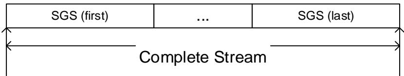

One example of this is if the host issues an NVM Command Set Dataset Management command (refer to the Dataset Management command section of the NVM Command Set Specification) to deallocate logical blocks that are associated with a stream, that host should specify a starting LBA and length that is aligned 

to and in multiples of the Stream Granularity Size. This provides optimal performance and endurance of the media. 

Stream resources are the resources in the NVM subsystem that are necessary to track operations associated with a specified stream identifier. There are a maximum number of stream resources that are available in an NVM subsystem as indicated by the Max Stream Limit (MSL) field in the Return Parameters data structure (refer to Figure 607). 

Available NVM subsystem stream resources are stream resources that are not allocated for exclusive use in any namespace. Available NVM subsystem stream resources are reported in the NVM Subsystem Streams Available (NSSA) field (refer to Figure 607) and may be used by any host in any namespace that: 

• has the Streams Directive enabled; 

has not been allocated exclusive stream resources by that host if the Shared Stream Identifiers (SSID) bit is cleared to $\scriptstyle { \mathrm { ' 0 ' } }$ in the NSSC field; and 

• has not been allocated exclusive stream resources by any host if the SSID bit is set to ‘1’. 

Each time stream resources are allocated for exclusive use in a specified namespace, the available NVM subsystem stream resources reported in the NSSA field are reduced. 

For a given namespace: 

a) a host allocates stream resources to that namespace for the exclusive use of that host(s) by issuing the Allocate Resources operation; 

b) other hosts may concurrently allocate stream resources to that namespace for their exclusive use; and 

c) hosts which have not allocated stream resources to that namespace may use available NVM subsystem stream resources for access to that namespace. 

If an NVM subsystem has streams resources allocated to a host with a Host Identifier value of 0h and the Host Identifier is subsequently changed to a non-zero value, then those streams resources remain associated with the Host with a Host Identifier value of 0h and are not associated with the host with the non-zero Host Identifier. 

The Directive operations that shall be supported if the Streams Directive is supported are listed in Figure 604. The Directive Specific field in a command is referred to as the Stream Identifier when the Directive Type field is set to the Streams Directive. 

Figure 604: Streams – Directive Operations

<table><tr><td>Directive Command</td><td>Directive Operation Name</td><td>Directive Operation Value</td><td>Reference</td></tr><tr><td rowspan="4">Directive Receive</td><td>Return Parameters</td><td>01h</td><td>8.1.8.3.1.1</td></tr><tr><td>Get Status</td><td>02h</td><td>8.1.8.3.1.2</td></tr><tr><td>Allocate Resources</td><td>03h</td><td>8.1.8.3.1.3</td></tr><tr><td>Reserved</td><td>All other values</td><td></td></tr><tr><td rowspan="3">Directive Send</td><td>Release Identifier</td><td>01h</td><td>8.1.8.3.2.1</td></tr><tr><td>Release Resources</td><td>02h</td><td>8.1.8.3.2.2</td></tr><tr><td>Reserved</td><td>All other values</td><td></td></tr></table>

Stream identifiers are assigned by the host and may be in the range 0001h to FFFFh. The host may specify a sparse set of stream identifiers (i.e., there is no requirement for the host to use Stream Identifiers in any particular order). 

The host may access a namespace through multiple controllers in the NVM subsystem. The controllers in an NVM subsystem indicate in the SSID bit (refer to Figure 607) if a stream identifier is unique based on the Host Identifier (i.e., the same stream identifier used to access the same namespace by a host that has registered a different Host Identifier is referencing a different stream), or if a stream identifier may be used by multiple Host Identifiers (i.e., the same stream identifier used to access the same namespace by a host 

that has registered a different Host Identifier is referencing the same stream). All controllers in an NVM subsystem shall report the same value in the NSSC field. 

If multiple controllers receive a registration of a Host Identifier (refer to section 5.1.25.1.28) that has the same non-zero value, then that value represents a single host that is accessing the namespace through those controllers and a stream identifier is used across those controllers to access the same stream on the namespace. If a Host Identifier has a unique non-zero value, then each value represents a unique host that is accessing the namespace and: 

• if the SSID bit is cleared to $\scriptstyle { \mathrm { ~ \displaystyle ~ } } ^ { \prime } 0 ^ { \prime }$ , then the same stream identifier on controllers with different non-zero Host Identifiers does not have the same meaning for a particular namespace (i.e., the stream identifier is not used across controllers with different non-zero Host Identifiers to access the same stream on the namespace); and 

if the SSID bit is set to ‘1’, then the same stream identifier on any controller with a non-zero Host Identifier has the same meaning for a particular namespace (i.e., the stream identifier is used across controllers to access the same stream on the namespace). 

If a Host Identifier is cleared to 0h, then a unique host is accessing the namespace and the stream identifier does not have the same meaning for a particular namespace. 

Figure 605: Example Multi-Stream and NSSC

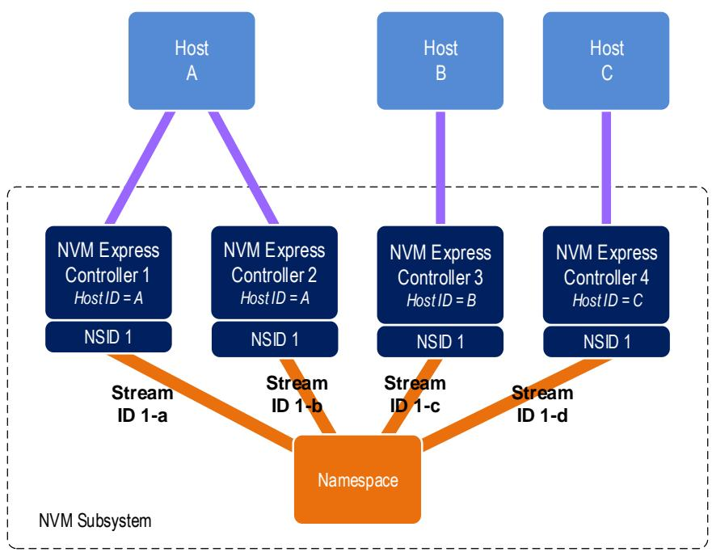

In the example shown in Figure 605, if the SSID bit is cleared to $\scriptstyle { \mathrm { ~ \displaystyle ~ } } ^ { \prime } 0 ^ { \prime }$ , then there are three streams as follows: 

Stream ID 1-a and Stream ID 1-b have the same meaning; 

• Stream ID 1-c has a different meaning; and 

• Stream ID 1-d has a different meaning. 

In the example shown in Figure 605, if the SSID bit is set to ‘1’, then there is one stream as follows: 

• Stream ID 1-a, Stream ID 1-b, Stream ID 1-c, and Stream ID 1-d have the same meaning. 

The controller(s) recognized by the NVM subsystem as being associated with a specific host or hosts and attached to a specific namespace either: 

utilizes a number of stream resources allocated for exclusive use of that namespace as returned in response to an Allocate Resources operation; or 

utilizes resources from the NVM subsystem stream resources. 

The value of Namespace Streams Allocated (NSA) indicates how many resources for individual stream identifiers have been allocated for exclusive use for the specified namespace by the associated controllers. This indicates the maximum number of stream identifiers that may be open at any given time in the specified namespace by the associated controllers. To request a different number of resources than are currently allocated for exclusive use by the associated controllers for a specific namespace, all currently allocated resources are first required to be released using the Release Resources operation. There is no mechanism to incrementally increase or decrease the number of allocated resources for a given namespace. 

Streams are opened by the controller when the host issues a Write command that specifies a stream identifier that is not currently open. While a stream is open the controller maintains context for that stream (e.g., buffers for associated data). The host may determine the streams that are open using the Get Status operation. 

For a namespace that has a non-zero value of Namespace Streams Allocated (NSA), if the host submits a Write command specifying a stream identifier not currently in use and stream resources are exhausted, then an arbitrary stream identifier for that namespace is released by the controller to free the stream resources associated with that stream identifier for the new stream. The host may ensure the number of open streams does not exceed the allocated stream resources for the namespace by explicitly releasing stream identifiers as necessary using the Release Identifier operation. 

For a namespace that has zero namespace stream resources allocated, if the host submits an I/O command specifying a stream identifier not currently in use and: 

NVM subsystem streams available are exhausted, then an arbitrary stream identifier for an arbitrary namespace that is using NVM subsystem stream resources is released by the NVM subsystem to free the stream resources associated with that stream identifier for the new stream; or 

all NVM subsystem stream resources have been allocated for exclusive use for specific namespaces, then the Write command is treated as a normal Write command that does not specify a stream identifier. 

The host determines parameters associated with stream resources using the Return Parameters operation. The host may get a list of open stream identifiers using the Get Status operation. 

If the Streams Directive becomes disabled for use by a host within a namespace, then all stream resources and stream identifiers shall be released for that host for the affected namespace. If the host issues a Format NVM command, then all stream identifiers for all open streams for affected namespaces shall be released. If the host deletes a namespace, then all stream resources and all stream identifiers for that namespace shall be released. If the write protection state of a namespace changes such that the namespace becomes write protected (refer to section 8.1.16), then the controller shall release all stream resources and stream identifiers for that namespace. 

Streams Directive defines the command specific status values specified in Figure 606. 

Figure 606: Streams Directive – Command Specific Status Values

<table><tr><td>Value</td><td>Definition</td></tr><tr><td>7Fh</td><td>Stream Resource Allocation Failed: The controller was not able to allocate stream resources for exclusive use of the specified namespace and no NVM subsystem stream resources are available.</td></tr></table>

The Streams Directive is not allowed to be enabled in any namespace that is contained in an Endurance Group with Flexible Data Placement enabled. If the specified namespace is contained in an Endurance Group that has Flexible Data Placement enabled, then the controller shall not enable the Streams Directive. If: 

a Directive Send command specifies the Streams Directive in the DTYPE field and the Directive Operation field is set to 01h (i.e., Enable Directive); and 

the namespace specified by the NSID field is contained in an Endurance Group that has Flexible Data Placement enabled, 

then the controller shall: 

abort that Directive Send command with a status code of Invalid Field in Command; and 

indicate the Directive Operation field in the Parameter Error Location field (refer to Figure 205) if an entry is added to the Error Information log page due to aborting that Directive Send command. 

# 8.1.8.3.1 Directive Receive

This section defines operations used with the Directive Receive command for the Streams Directive. 

# Return Parameters (Directive Operation 01h)

The Return Parameter operation returns a data structure that specifies the features and capabilities supported by the Streams Directive, including namespace specific values. The DSPEC field in command Dword 11 is not used for this operation. The data structure returned is defined in Figure 607. If an NSID value of FFFFFFFFh is specified, then the controller: 

• returns the NVM subsystem specific values; 

• may return any namespace specific values that are the same for all namespaces (e.g., SWS); and 

• clears all other namespace specific fields to 0h. 

Figure 607: Streams Directive – Return Parameters Data Structure

<table><tr><td>Bytes</td><td colspan="2">Description</td></tr><tr><td colspan="3">NVM Subsystem Specific Fields</td></tr><tr><td>01:00</td><td colspan="2">Max Streams Limit (MSL): This field indicates the maximum number of concurrently open streams that the NVM subsystem supports. This field returns the same value independent of specified namespace.</td></tr><tr><td>03:02</td><td colspan="2">NVM Subsystem Streams Available (NSSA): This field indicates the number of NVM subsystem stream resources available. These are the stream resources that are not allocated for the exclusive use by a host in any specific namespace. This field returns the same value independent of specified namespace.</td></tr><tr><td>05:04</td><td colspan="2">NVM Subsystem Streams Open (NSSO): This field indicates the number of open streams in the NVM subsystem that are not associated with a namespace for which resources were allocated using an Allocate Resources operation. This field returns the same value independent of specified namespace.</td></tr><tr><td rowspan="5">06</td><td colspan="2">NVM Subsystem Stream Capability (NSSC): This field indicates the stream capabilities of the NVM subsystem.</td></tr><tr><td>Bits</td><td>Description</td></tr><tr><td>7:2</td><td>Reserved</td></tr><tr><td>1</td><td>Streams Require Non-Zero Host Identifier (SRNZID): This bit indicates whether the Host Identifier is required to be set to a non-zero value before the Streams Directive is able to be enabled. If this bit is cleared to ‘0’, then the Host Identifier is not required to be set to a non-zero value before the Streams Directive is able to be enabled.</td></tr><tr><td>0</td><td>Shared Stream Identifiers (SSID): This bit indicates whether stream identifiers may be shared by multiple Host Identifiers, or if a stream identifier is associated with a single Host Identifier. If this bit is cleared to ‘0’, then the stream identifier is associated with a single non-zero Host Identifier. If this bit is set to ‘1’, then the stream identifier may be associated with multiple non-zero Host Identifiers.</td></tr><tr><td>15:07</td><td colspan="2">Reserved</td></tr><tr><td colspan="3">Namespace Specific Fields</td></tr><tr><td>19:16</td><td colspan="2">Stream Write Size (SWS): This field indicates the alignment and size of the optimal stream write as a number for the specified namespace where the unit of granularity is specified by the applicable I/O Command Set. The size indicated should be less than or equal to Maximum Data Transfer Size (MDTS) that is specified in units of minimum memory page size. SWS may change if the namespace is reformatted with a different User Data Format. If the NSID value is set to FFFFFFFh, then this field may be cleared to 0h if a single user data size cannot be indicated.Refer to the applicable I/O Command Set specification for how this field is utilized to optimize performance and endurance.</td></tr></table>

Figure 607: Streams Directive – Return Parameters Data Structure

<table><tr><td>Bytes</td><td>Description</td></tr><tr><td>21:20</td><td>Stream Granularity Size (SGS): This field indicates the stream granularity size for the specified namespace in Stream Write Size (SWS) units. If the NSID value is set to FFFFFFFh, then this field may be cleared to 0h.Refer to the applicable I/O Command Set specification for how this field is utilized to optimize performance and endurance.</td></tr><tr><td colspan="2">Namespace and Host Identifier Specific Fields</td></tr><tr><td>23:22</td><td>Namespace Streams Allocated (NSA): This field indicates the number of stream resources allocated for exclusive use of the specified namespace.If the SSID bit is cleared to ‘0’ in the NSSC field, then those exclusive stream resources are shared by the controller processing the Return Parameters operation and by all other controllers that share the same non-zero Host Identifier, and are attached to the specified namespace.If the SSID bit is set to ‘1’, then those exclusive stream resources are shared by all controllers that are associated with any non-zero Host Identifier and are attached to this namespace.If this value is non-zero, then the namespace may have up to NSA number of concurrently open streams. If this field is cleared to 0h, then no stream resources are currently allocated to this namespace and the namespace may have up to NSSA number of concurrently open streams.</td></tr><tr><td>25:24</td><td>Namespace Streams Open (NSO): This field indicates the number of open streams in the specified namespace.If the SSID bit is cleared to ‘0’, then this field indicates the number of streams that were opened by the controller processing the Return Parameters operation and by all other controllers that share the same non-zero Host Identifier, and are attached to this namespace.If the SSID bit is set to ‘1’, then this field indicates the number of streams that were opened by the controller processing the Return Parameters operation and all other controllers that are associated with any non-zero Host Identifier and are attached to this namespace.Note: It is not possible for a host to retrieve the number of open streams using resources allocated to the specified namespace by other hosts.</td></tr><tr><td>31:26</td><td>Reserved</td></tr></table>

# Get Status (Directive Operation 02h)

The Get Status operation returns information about the status of currently open streams for the specified namespace and the host issuing the Get Status operation. The DSPEC field in command Dword 11 is not used for this operation. 

If the SSID bit is cleared to $\mathbf { \vec { \mathbf { \rho } } } ^ { 0 }$ in the NSSC field, then the information returned describes only those resources for the specified namespace that are associated with hosts that are registered with the same non-zero Host Identifier value as the host issuing the Get Status operation. If the SSID bit is set to ‘1’, then the information returned describes the resources for the specified namespace that are associated with hosts that are registered with any non-zero Host Identifier. 

If an NSID value of FFFFFFFFh is specified, then the controller shall return information about the status of currently open streams in the NVM subsystem that use resources which are not allocated for the exclusive use of a particular namespace. If a stream identifier value being returned is in use by different namespaces, then that stream identifier shall be returned only once. 

Stream Identifier 1 (i.e., returned at offset 03:02) contains the value of the open stream of lowest numerical value. Each subsequent field contains the value of the next numerically greater stream identifier of an open stream. 

The data structure returned is defined in Figure 608. All fields are specific to the specified namespace if the NSID value was not set to FFFFFFFFh. 

Figure 608: Streams Directive – Get Status Data Structure

<table><tr><td>Bytes</td><td>Description</td></tr><tr><td>01:00</td><td>Open Stream Count (OSC): This field specifies the number of streams that are currently open.</td></tr><tr><td>03:02</td><td>Stream Identifier 1 (SID1): This field specifies the stream identifier of the first (numerically lowest) open stream.</td></tr><tr><td>05:04</td><td>Stream Identifier 2 (SID2): This field specifies the stream identifier of the second open stream.</td></tr><tr><td>...</td><td>...</td></tr><tr><td>131071: 131070</td><td>Stream Identifier 65,535 (SID655355): This field specifies the stream identifier of the 65,535th open stream.</td></tr></table>

# Allocate Resources (Directive Operation 03h)

The Allocate Resources operation indicates the number of streams that the host requests for the exclusive use for the specified namespace. If the SSID bit is cleared to $\scriptstyle { \mathrm { ' 0 ' } }$ in the NSSC field, then those resources are for the exclusive use of hosts that are registered with the same Host Identifier as the host that made the request. If the SSID bit is set to ‘1’, then those resources are for the exclusive use of any host that is registered with any non-zero Host Identifier. The DSPEC field in command Dword 11 is not used for this operation. The operation returns the number of streams allocated in Dword 0 of the completion queue entry. The value allocated may be less than or equal to the number requested. The allocated resources shall be reflected in the Namespace Streams Allocated field of the Return Parameters data structure. 

If the controller is unable to allocate any stream resources for the exclusive use for the specified namespace, then the controller shall: 

• return a status value of Stream Resource Allocation Failed; or 

if NVM subsystem stream resources are available, then clear NSA to 0h in the completion queue entry to indicate that the host may use stream resources from the NVM subsystem for this namespace. 

If the specified namespace already has stream resources allocated for the exclusive use of the host issuing the Allocate Resources operation, then the controller shall return a status code of Invalid Field in Command. To allocate additional streams resources, the host should release resources and request a complete set of resources. 

No data transfer occurs. 

Figure 609: Allocate Resources – Command Dword 12

<table><tr><td>Bits</td><td>Description</td></tr><tr><td>31:16</td><td>Reserved</td></tr><tr><td>15:00</td><td>Namespace Streams Requested (NSR): This field specifies the number of stream resources the host is requesting be allocated for exclusive use by the specified namespace.</td></tr></table>

Figure 610: Allocate Resources – Completion Queue Entry Dword 0

<table><tr><td>Bits</td><td>Description</td></tr><tr><td>31:16</td><td>Reserved</td></tr><tr><td>15:00</td><td>Namespace Streams Allocated (NSA): This field indicates the number of streams resources that have been allocated for exclusive use by the specified namespace. The allocated resources are available to all controllers associated with that host.</td></tr></table>

# 8.1.8.3.2 Directive Send

This section defines operations used with the Directive Send command for the Streams Directive. 

# Release Identifier (Directive Operation 01h)

The Release Identifier operation specifies that the stream identifier specified in the DSPEC field in command Dword 11 is no longer in use by the host. Specifically, if the host uses that stream identifier in a 

future operation, then that stream identifier is referring to a different stream. If the specified identifier does not correspond to an open stream for the specified namespace, then the Directive Send command should not fail as a result of the specified identifier. If there are stream resources allocated for the exclusive use of the specified namespace, then those exclusive stream resources remain allocated for this namespace and may be re-used in a subsequent write command. If there are no stream resources allocated for the exclusive use of the specified namespace, then the stream resources are returned to the NVM subsystem stream resources for future use by a namespace without exclusive allocated stream resources. If an NSID value of FFFFFFFFh is specified, then the controller shall abort the command with a status code of Invalid Field in Command. 

No data transfer occurs. 

# Release Resources (Directive Operation 02h)

The Release Resources operation is used to release all streams resources allocated for the exclusive use of the namespace attached to all controllers: 

associated with the same non-zero Host Identifier of the controller that processed the operation if the SSID bit is cleared to $\scriptstyle { \mathrm { ~ \displaystyle ~ } } ^ { \prime } 0 ^ { \prime }$ in the NSSC field is cleared to $\mathbf { \vec { \mathbf { \rho } } } ^ { 0 }$ ; and 

• associated with any non-zero Host Identifier if the SSID bit is set to ‘1’. 

On successful completion of this command, the exclusive allocated stream resources are released and the Namespace Streams Allocated (refer to Figure 607) field is cleared to 0h for the specified namespace. If this command is issued when no streams resources are allocated for the exclusive use of the namespace, then the Directive Send command shall take no action and shall not fail as a result of no allocated stream resources. 

No data transfer occurs. 

# Data Placement (Directive Type 02h, Optional)

The Data Placement Directive enables the host to specify to the controller the Reclaim Unit (refer section 8.1.10) to place the user data in I/O commands specified by the appropriate I/O Command Set specification. 

The Data Placement Directive has no Directive Operations defined. Any Directive Receive command or Directive Send command that specifies a Data Placement Directive Type shall be aborted by the controller with a status code of Invalid Field in Command. 

If the specified namespace is not contained in an Endurance Group with Flexible Data Placement enabled, then the controller shall abort the Directive Send command with a status code of FDP Disabled. 

# Dispersed Namespaces

Dispersed namespaces provide hosts with access to the same namespace using multiple participating NVM subsystems. A typical Dispersed Namespace implementation uses Fabrics based NVM subsystems. Two prominent scenarios that require namespace access from multiple participating NVM subsystems are: 

1. online data migration; and 

2. data replication. 

Online data migration is used to transparently move the contents of one or more namespaces across participating NVM subsystems without disrupting host access to those namespaces during the migration. For each namespace whose contents are migrated, one or more paths to the namespace in the destination NVM subsystem are added to the multi-path I/O on the host, in addition to the existing paths to the namespace in the source NVM subsystem. Once the online data migration completes (i.e., all of the contents of all namespaces being migrated has been successfully migrated from the source NVM subsystem to the destination NVM subsystem), all of the paths to the namespace in the source NVM subsystem are subsequently removed from the multi-path I/O on the host. During the online data migration, the host and participating NVM subsystems must manage the paths so that there is no interruption to I/O. Figure 611 shows an example of online data migration, where the contents of namespace B are migrated from one participating NVM subsystem to another participating NVM subsystem. In this figure, the lines 

from the host to the NVMe controllers may represent multiple connections from the host to multiple controllers in each participating NVM subsystem. 

Figure 611: Online Data Migration

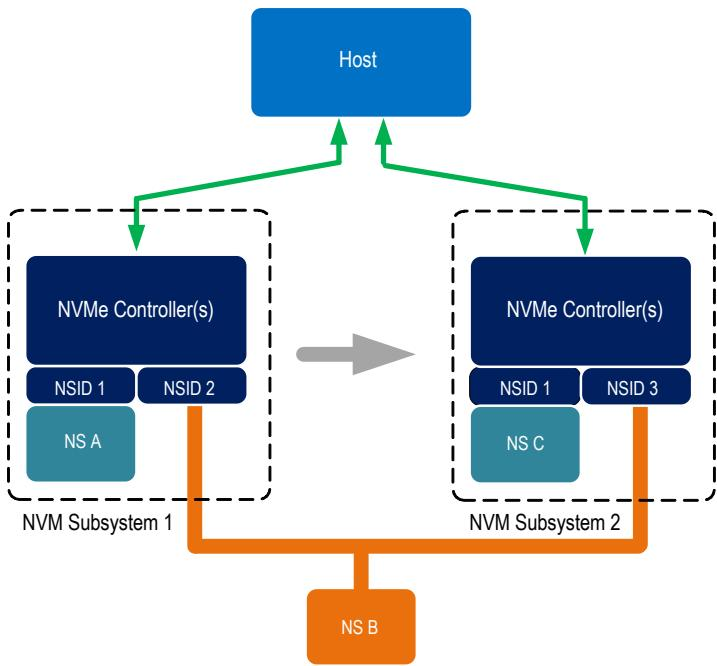

Data replication is used to replicate the contents of one or more dispersed namespaces across participating NVM subsystems such that each participating NVM subsystem is able to provide host access to the same namespace data. Other behavior (e.g., persistent reservations) must also be maintained between hosts and each participating NVM subsystem. Figure 612, Figure 613, and Figure 614 show different examples of data replication, where the contents of namespace B are replicated across two participating NVM subsystems. In these figures, the lines from hosts to NVMe controllers may represent multiple connections from the hosts to multiple controllers in each participating NVM subsystem. Figure 612 shows an example of single NVM subsystem host connectivity, where two hosts access the same dispersed namespace being replicated across two participating NVM subsystems via controllers in only one NVM subsystem. 

Figure 612: Data Replication Example 1

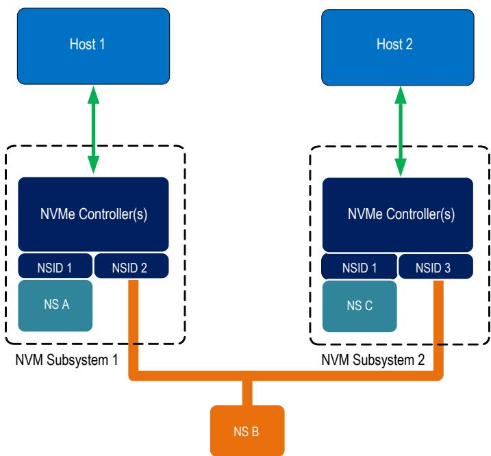

Figure 613 shows another example of single NVM subsystem host connectivity, where two hosts access the same dispersed namespace being replicated across two participating NVM subsystems via controllers in only one NVM subsystem, but the host connected to NVM Subsystem 2 only accesses namespace B in the event of a failure scenario.

Figure 613: Data Replication Example 2

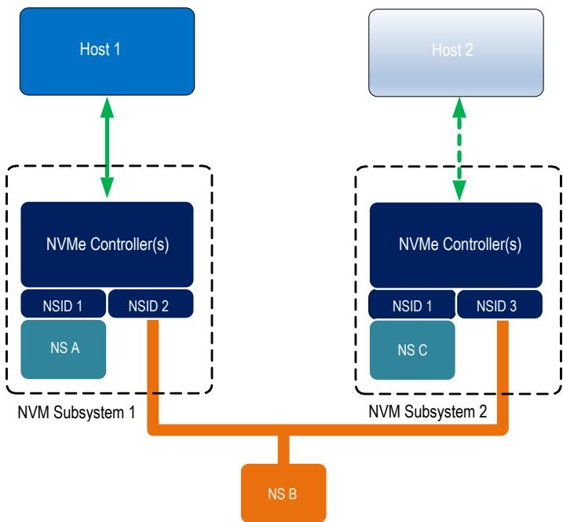

Figure 614 shows an example of multiple NVM subsystem host connectivity, where two hosts access the same dispersed namespace being replicated across two participating NVM subsystem via controllers in both NVM subsystems.

Figure 614: Data Replication Example 3

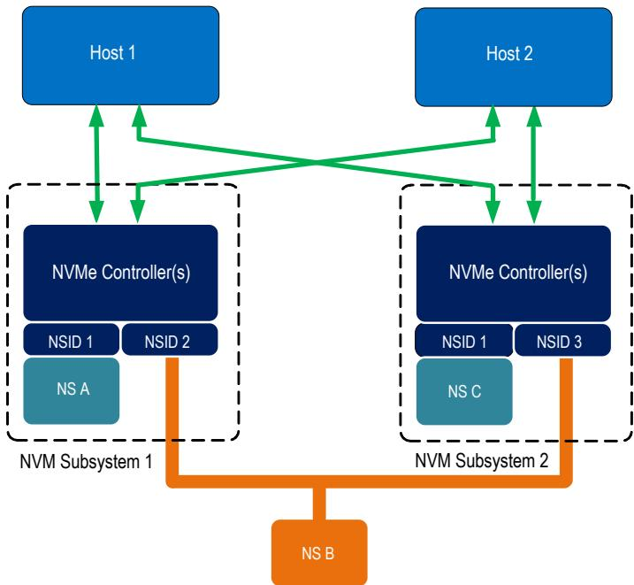

# Dispersed Namespace Management

The Namespace Management command (refer to section 5.1.21) may be used to create a namespace that is capable of being accessed using controllers contained in two or more participating NVM subsystems concurrently (i.e., may be used to create a namespace that is capable of being a dispersed namespace). The methods for dispersing a namespace (e.g., attaching that namespace to controllers contained in separate participating NVM subsystems) are outside the scope of this specification. The Namespace Management or Capacity Management command may be used to delete a dispersed namespace on the participating NVM subsystem containing the controller processing the command. Deleting a dispersed namespace on one participating NVM subsystem may or may not affect that namespace on other participating NVM subsystems (e.g., a deletion from one participating NVM subsystem may have no effect on the namespace on other participating NVM subsystems, or a deletion from one participating NVM subsystem may delete the namespace from all participating NVM subsystems). 

The Namespace Management command may be used to create a shared namespace that is not a dispersed namespace which is later converted to a dispersed namespace. The method of converting a namespace that is not a dispersed namespace to a dispersed namespace is outside the scope of this specification. NVM subsystems should not convert private namespaces to dispersed namespaces. Whenever a namespace that is not a dispersed namespace is converted to a dispersed namespace or a dispersed namespace is converted to a namespace that is not a dispersed namespace, the controller reports a Namespace Attribute Changed event as described in Figure 151. 

The host may attach or detach a dispersed namespace from the controller by using the Namespace Attachment command (refer to section 5.1.20). 

# NSID and Globally Unique Namespace Identifier Usage

The NSID for a dispersed namespace is unique for all controllers in a participating NVM subsystem, as described in section 3.2.1.6. The NSID for a dispersed namespace may be different on different participating NVM subsystems. 

A dispersed namespace has a globally unique namespace identifier (refer to section 4.7.1.4) that uniquely identifies the namespace in all participating NVM subsystems. The globally unique namespace identifier has the same value for that namespace in all participating NVM subsystems and shall be used to determine which NSIDs on different participating NVM subsystems refer to the same namespace. The globally unique 

namespace identifier that uniquely identifies the dispersed namespace in all participating NVM subsystems shall be either: 

a) a Namespace Globally Unique Identifier (NGUID); or 

b) a Universally Unique Identifier (UUID). 

If the dispersed namespace has an NGUID and does not have a UUID, then: 

a) that NGUID shall be the globally unique namespace identifier that uniquely identifies the dispersed namespace in all participating NVM subsystems; 

b) all participating NVM subsystems shall use the same NGUID value for the dispersed namespace; and 

c) the dispersed namespace may have an EUI64 that shall not be the globally unique namespace identifier that uniquely identifies the dispersed namespace in all participating NVM subsystems. 

If the dispersed namespace has a UUID and does not have an NGUID, then: 

a) that UUID shall be the globally unique namespace identifier that uniquely identifies the dispersed namespace in all participating NVM subsystems; 

b) all participating NVM subsystems shall use the same UUID value for the dispersed namespace; and 

c) the dispersed namespace may have an EUI64 that shall not be the globally unique namespace identifier that uniquely identifies the dispersed namespace in all participating NVM subsystems. 

If the dispersed namespace has an NGUID and has a UUID, then: 

a) the NGUID shall be the globally unique namespace identifier that uniquely identifies the dispersed namespace in all participating NVM subsystems; 

b) all participating NVM subsystems shall use the same NGUID value for the dispersed namespace; and 

c) the dispersed namespace may have an EUI64 that shall not be the globally unique namespace identifier that uniquely identifies the dispersed namespace in all participating NVM subsystems. 

# Dispersed Namespace Access

The host may discover if a namespace is capable of being accessed using controllers contained in two or more participating NVM subsystems concurrently (i.e., may discover if a namespace may be a dispersed namespace) by issuing an Identify command (i.e., CNS 00h if supported by the I/O Command Set or CNS 08h) to the controller for the specified NSID. If the namespace is capable of being accessed using controllers contained in two or more participating NVM subsystem concurrently, then the controller shall set the Dispersed Namespace (DISNS) bit to ‘1’ in the Namespace Multi-path I/O and Namespace Sharing Capabilities (NMIC) field of the returned I/O Command Set Independent Identify Namespace data structure (refer to Figure 319) or Identify Namespace data structure (refer to the NVM Command Set Specification). 

All controllers in each participating NVM subsystem that are able to provide access to a specific dispersed namespace shall support the I/O Command Set associated with that dispersed namespace. 

The host may discover the NQNs of participating NVM subsystems which contain controllers that are able to provide access to a dispersed namespace by issuing a Get Log Page command for the Dispersed Namespace Participating NVM Subsystems log page (i.e., the Log Page Identifier (LID) field set to 17h (refer to section 5.1.12.1.23)). 

Hosts specify support for dispersed namespaces by setting the Host Dispersed Namespace Support (HDISNS) field to 1h in the Host Behavior Support feature by issuing a Set Features command with Feature Identifier (FID) set to 16h (refer to Figure 407). 

If the HDISNS field is set to 1h, the host specifies support for: 

treating all instances of a dispersed namespace as the same namespace, based upon the shared globally unique namespace identifier (refer to section 8.1.9.2) when accessing that dispersed namespace through multiple controllers on the same participating NVM subsystem; 

treating all instances of a dispersed namespace as the same namespace, based upon the shared globally unique namespace identifier when accessing that dispersed namespace through controllers on multiple participating NVM subsystems; and 

specifying a Host Identifier that is unique across all hosts that connect to any participating NVM subsystem. 

If the HDISNS field is set to 1h, the controller shall not abort any command that the host submits to dispersed namespaces with a status code of Host Dispersed Namespace Support Not Enabled. 

A participating NVM subsystem shall support prohibiting host access to dispersed namespaces when the HDISNS field is cleared to 0h in the Host Behavior Support feature, as described in section 8.1.9.4. A participating NVM subsystem may either: 

allow host access to a dispersed namespace when the HDISNS field is cleared to 0h in the Host Behavior Support feature if the host associated with the Host NQN in the connection is only able to access the dispersed namespace from a single participating NVM subsystem; or 

prohibit host access to dispersed namespaces when the HDISNS field is cleared to 0h in the Host Behavior Support feature. 

A participating NVM subsystem that allows host access to a dispersed namespace when the HDISNS field is cleared to 0h in the Host Behavior Support feature if the host associated with the Host NQN in the connection is only able to access the dispersed namespace from a single participating NVM subsystem shall implement a method to determine if the host is able to access the dispersed namespace from multiple participating NVM subsystems. The method used to determine if the host is able to access the dispersed namespace from multiple participating NVM subsystems is outside the scope of this specification. If a participating NVM subsystem determines that a Connect command requests a host with the HDISNS field cleared to 0h in the Host Behavior Support feature having access to the same dispersed namespace through multiple participating NVM subsystems, then that participating NVM subsystem shall either: 

a) abort a Connect command with a status code of Connect Invalid Host if that Connect command requests the host associated with the Host NQN in the connection having access to a dispersed namespace through multiple participating NVM subsystems. Aborting a Connect command for this reason may result in the host being unable to access other namespaces (i.e., namespaces that are unrelated to the dispersed namespace) on that NVM subsystem. This enforces the requirement that a host that has not set the HDISNS field to 1h in the Host Behavior Support feature be allowed to access a dispersed namespace on only one participating NVM subsystem by preventing all access to any other participating NVM subsystems (including all other namespaces on those other participating NVM subsystems); or 

b) allow a Connect command that requests the host associated with the Host NQN in the connection having access to a dispersed namespace through multiple participating NVM subsystems, but prohibit host access to that dispersed namespace from multiple participating NVM subsystems (e.g., prohibit host access to that dispersed namespace on the second participating NVM subsystem) as described in section 8.1.9.4. This enforces the requirement that a host that has not set the HDISNS field to 1h in the Host Behavior Support feature be allowed to access a dispersed namespace on only one participating NVM subsystem by, for each dispersed namespace, preventing access to that dispersed namespace on any other participating NVM subsystems (and allowing access to other namespaces that are not dispersed namespaces on those other participating NVM subsystems). 

# Prohibiting Host Access to Dispersed Namespaces

If a participating NVM subsystem prohibits host access to dispersed namespaces when the Host Dispersed Namespace Support (HDISNS) field is cleared to 0h in the Host Behavior Support feature, then the controller shall abort the following commands with a status code of Host Dispersed Namespace Support Not Enabled: 

any I/O commands (refer to section 7 in this specification and the I/O Commands section in the appropriate I/O Command Set specification) that specify the NSID of a dispersed namespace in the command; or 

any of the Admin commands listed in Figure 615 that specify the NSID of a dispersed namespace in the command. 

The Additional Restrictions column in Figure 615 lists additional restrictions that apply while the HDISNS field is cleared to 0h in the Host Behavior Support feature for Admin commands that are capable of affecting dispersed namespaces without specifying the NSID of a dispersed namespace. 

Figure 615: Dispersed Namespaces Command Restrictions - Prohibited Admin Commands

<table><tr><td>Admin Command</td><td>Additional Restrictions</td></tr><tr><td>Directive Receive</td><td>None.</td></tr><tr><td>Directive Send</td><td>None.</td></tr><tr><td>Set Features</td><td>This command is prohibited if a dispersed namespace is attached to the controller and an NSID of FFFFFFFh is specified for a feature capable of affecting all namespaces attached to that controller.</td></tr><tr><td>Format NVM</td><td>This command is prohibited if a dispersed namespace exists in the participating NVM subsystem and the scope of the command includes all namespaces that exist in that NVM subsystem (refer to Figure 188).This command is prohibited if a dispersed namespace is attached to the controller and the scope of the command includes all namespaces attached to that controller (refer to Figure 188).</td></tr></table>

# ANA Considerations

If more than one participating NVM subsystem contains controllers that provide a host with access to a dispersed namespace, then Asymmetric Namespace Access (ANA) and Asymmetric Namespace Access Reporting (refer to section 8.1.1) should be supported in all participating NVM subsystems. If ANA is used with dispersed namespaces, then globally unique namespace identifiers (refer to section 8.1.9.2) are used to determine when multiple paths are available to the same dispersed namespace. Hosts specify to controllers that their host software (e.g., multipath I/O software) uses globally unique namespace identifiers to determine when multiple paths are available to the dispersed namespace by setting the HDISNS field to 1h in the Host Behavior Support feature, as described in section 8.1.9.3. 

ANA Group usage with dispersed namespaces is described in section 8.1.1.2. 

# Reservation Considerations

Reservations for a dispersed namespace that is able to be accessed by controllers in multiple participating NVM subsystems are intended to be coordinated between each participating NVM subsystem. To ensure the uniqueness of a host’s identity and prevent potential data corruption, each host that sets the Host Dispersed Namespace Support (HDISNS) field to 1h in the Host Behavior Support feature specifies a Host Identifier that is unique across all hosts that connect to any participating NVM subsystem, as described in section 8.1.9.3. 

If a host is a reservation registrant on a dispersed namespace, and that host submits a Reservation Report command to that namespace, then for reservations established using controllers that are not contained in the same participating NVM subsystem as the controller processing the Reservation Report command, the Controller ID (CNTLID) field shall be set to FFFDh in the Registered Controller data structure (refer to Figure 583) or Registered Controller Extended data structure (refer to Figure 584). Multiple identical Registered Controller or Registered Controller Extended data structures with the CNTLID field set to FFFDh shall not be returned by a single Reservation Report command; as a result, a Registered Controller or Registered Controller Extended data structure with the CNTLID field set to FFFDh indicates one or more controllers are associated with a host that is a registrant of the dispersed namespace in another participating NVM subsystem. A Registered Controller or Registered Controller Extended data structure with the CNTLID field set to FFFDh is returned for each host (i.e., as identified by the HOSTID field in that data structure) that is a registrant of the dispersed namespace in any other participating NVM subsystem. 

The Dispersed Namespace Reservation Support (DISNSRS) bit in a command is set to ‘1’ by hosts that support reservations on dispersed namespaces (i.e., hosts that support receiving a value of FFFDh in the 

CNTLID field of a Registered Controller data structure or Registered Controller Extended data structure). A controller that supports dispersed namespaces and supports reservations (i.e., a controller that has the Reservations Support (RESERVS) bit set to ‘1’ in the Optional NVM Command Support (ONCS) field of the Identify Controller data structure (refer to Figure 312)) shall support the DISNSRS bit being set to ‘1’ in each command in the following list: 

• Reservation Acquire (refer to section 7.5); 

• Reservation Register (refer to section 7.6); 

• Reservation Release (refer to section 7.7); and 

• Reservation Report (refer to section 7.8). 

If the HDISNS field is set to 1h in the Host Behavior Support feature and the DISNSRS bit is cleared to ‘0’ in any of the commands in the preceding list when submitted to a dispersed namespace, then the controller shall abort that command with a status code of Namespace Is Dispersed. 

# Flexible Data Placement

# Flexible Data Placement Overview

The Flexible Data Placement (FDP) capability is an optional capability which allows the host to reduce write amplification by aligning user data usage to physical media. The controller supports log pages which indicate the status of FDP, statistics about the FDP operation, and information the host uses to detect and correct usage patterns that increase write amplification. 

The scope of the Flexible Data Placement capability is an Endurance Group. 

The host enables or disables Flexible Data Placement by issuing a Set Features command specifying the Flexible Data Placement feature (refer to section 5.1.25.1.20) and the FDP configuration (refer to section 5.1.12.1.28) to be applied to an Endurance Group. The host is required to delete all namespaces associated with the specified Endurance Group before modifying the value of the Flexible Data Placement feature (e.g., transitioning from disabled to enabled). 

If a Set Features command specifies: 

• the Flexible Data Placement feature; 

an Endurance Group in which one or more namespaces exist; and 

• a different value from the current value of that feature for that Endurance Group, 

then the controller shall abort the command with a status code of Command Sequence Error. 

If a Set Features command is successful and changes the Feature value, then: 

• all events in the FDP Events log page (refer to section 5.1.12.1.31) are cleared; and 

• all fields in the FDP Statistics log page (refer to section 5.1.12.1.30) are cleared to 0h. 

Refer to section 3.2.4 for the logical view of the non-volatile storage capacity for the Endurance Group with Flexible Data Placement enabled. 

The Namespace Management command (refer to section 8.1.15) is used to create a namespace within the Endurance Group. All namespaces in an Endurance Group with Flexible Data Placement enabled shall be associated with the NVM Command Set (refer to Figure 311) (i.e., the Command Set Identifier (CSI) field in the Namespace Management command shall be cleared to 00h). The capacity for the user data stored by a write command to a namespace is allocated from the Reclaim Unit referenced by the Reclaim Unit Handle and Reclaim Group specified by that write command. The user data for a namespace is allowed to be in any stored Reclaim Unit within any Reclaim Group within the Endurance Group (refer to Figure 15). 

The Namespace Management command specifies a Placement Handle List (refer to the Namespace Management command in the appropriate I/O Command Set specification). Each entry in that list specifies the Reclaim Unit Handle associated with the Placement Handle for that entry. The Placement Handles are numbered from 0h to the number of entries in the list minus 1. Figure 616 shows an example where Namespace A associates Reclaim Unit Handle 1 with Placement Handle 0. A specific Reclaim Unit Handle 

is not allowed to be associated with more than one Placement Handle per namespace. There are no other requirements on which Reclaim Unit Handle is associated with which Placement Handle. 

Namespaces are allowed to utilize the same (i.e., share) Reclaim Unit Handle but may have restrictions defined in the applicable I/O Command Set specification. 

The host is required to enable the Data Placement Directive (refer to section 8.1.8.4) to submit write commands that specify a Placement Identifier (refer to Figure 282 and Figure 283) in the DSPEC field. That Placement Identifier uniquely specifies the Reclaim Unit in which to place the user data (refer to Figure 616). The controller determines the Reclaim Unit by using the Reclaim Unit Handle associated with the Placement Handle that was specified by the host when the namespace was created. For example, if the write command in Figure 616 specifies a Reclaim Group Identifier value of 2h and a Placement Handle value of 1h, then the host is targeting the user data for that write command to be placed into the Reclaim Unit associated with Reclaim Group 2h and Reclaim Unit Handle NRUH-1. 

A Placement Identifier is invalid if: 

the Reclaim Group Identifier value is greater than or equal to the number of Reclaim Groups supported by the enabled FDP configuration (refer to the NRG field in Figure 280); or 

the Placement Handle is greater than or equal to the number of Placement Handles supported by the Namespace Management command of the applicable I/O Command Set specification. 

If the Placement Identifier in the DSPEC field of a write command is invalid, then the controller shall: 

select the Reclaim Group and Reclaim Unit Handle accessible by the specified namespace to determine the placement of the user data for that write command; and 

generate an Invalid Placement Identifier FDP Event if that event is enabled for the selected Reclaim Unit Handle. To receive the FDP event, the host should enable the Invalid Placement Identifier FDP Event on all Reclaim Unit Handles. 

Any write command to a namespace that exists in an Endurance Group with Flexible Data Placement enabled that does not specify the Data Placement Directive uses the Placement Handle value 0h and the controller selects the Reclaim Group for that command. For example, if the write command does not specify the Data Placement Directive, then, as illustrated in Figure 616, Placement Handle value of 0h is associated with Reclaim Unit Handle 1h and the controller may place the user data into the Reclaim Unit associated any Reclaim Group using Reclaim Unit Handle 1h. 

Figure 616: Flexible Data Placement Model

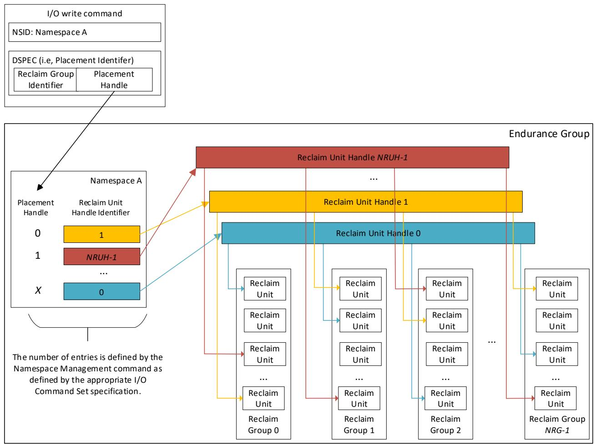

A write command that places user data into a Reclaim Unit causes reduction of the remaining capacity of that Reclaim Unit. If that Reclaim Unit is written to capacity, then the controller modifies the Reclaim Unit Handle referencing that Reclaim Unit to reference a different Reclaim Unit within the same Reclaim Group. 

A controller may modify a Reclaim Unit Handle to reference a different Reclaim Unit as part of performing a sanitize operation (refer to section 8.1.24). 

A Reclaim Unit shall only be referenced by one Reclaim Unit Handle. Therefore, a write command that utilizes a Reclaim Unit Handle results in the user data from that write command being initially isolated from the user data from any other write command that utilizes a different Reclaim Unit Handle. Each Reclaim Unit Handle has a type as defined in Figure 281 that identifies the isolation requirements of the user data moved by the controller to a different Reclaim Unit due to vendor specific controller operations (e.g., garbage collection). 

A controller is allowed to move user data that was written by the host that utilized a Reclaim Unit Handle with an Initially Isolated type (Figure 281) to a different Reclaim Unit within the same Reclaim Group. In addition, the controller is allowed to move user data written by the host that utilized different Reclaim Unit Handles with an Initially Isolated type to that different Reclaim Unit within the same Reclaim Group as shown in Figure 617. 

A controller is allowed to move user data that was written by the host that utilized a Reclaim Unit Handle with a Persistently Isolated type (Figure 281) to a different Reclaim Unit within the same Reclaim Group. However, the controller shall only move user data written by the host that utilized the same Reclaim Unit Handles with a Persistently Isolated type to the different Reclaim Unit within the same Reclaim Group as shown in Figure 618. 

Figure 617: Initially Isolated Reclaim Unit Handles

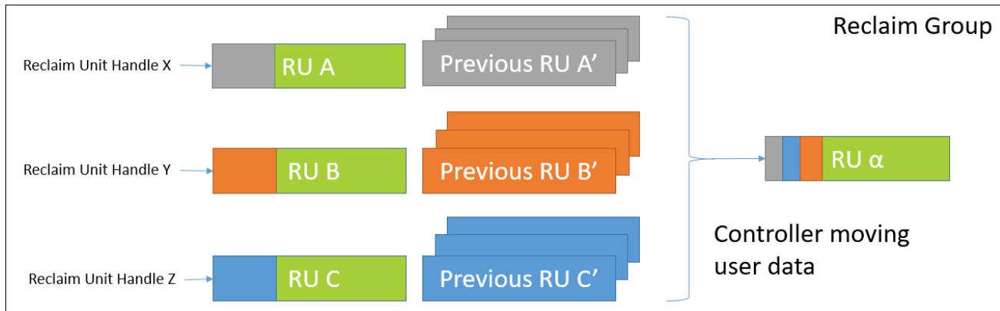

Figure 618: Persistently Isolated Reclaim Unit Handle

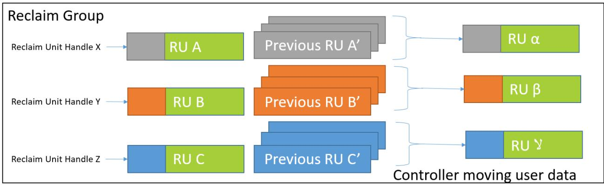

The result of a Namespace Management command that creates a namespace within the Endurance Group is that at least one Placement Handle is defined for that namespace (refer to the Namespace Management section in applicable I/O Command Set specification). 

For any namespace created in an Endurance Group that has Flexible Data Placement enabled, the host may issue an I/O Management Receive command to obtain a list of Placement Handles and the associated Reclaim Unit Handles that are used by the Data Placement Directive in write commands. 

If the Flexible Data Placement capability is supported, then the controller shall support the following: 

a) the Feature Identifiers Supported and Effects log page (refer to section 5.1.12.1.18); 

b) the I/O Management Receive command (refer to section 7.3) and the Reclaim Unit Handle Status Management Operation in that command (refer to Figure 561); 

c) the I/O Management Send command (refer to section 7.4) and the Placement Identifier Update Management Operation in that command (refer to Figure 565); 

d) the Flexible Data Placement feature (refer to section 5.1.25.1.20); 

e) the FDP Configurations log page (refer to section 5.1.12.1.28); 

f) the Reclaim Unit Handle Usage log page (refer to section 5.1.12.1.29); 

g) the FDP Statistics log page (refer to section 5.1.12.1.30); 

h) the Flexible Data Placement Events feature (refer to section 5.1.25.1.21); 

i) the FDP Events log page (refer to section 5.1.12.1.31); and 

j) the Data Placement Directive (refer to section 8.1.8.4). 

# Enabling Flexible Data Placement (Informative)

The host prepares an Endurance Group for operation in Flexible Data Placement using the following process: 

1) Validate that the Flexible Data Placement capability is supported by issuing an Identify command to access the Identify Controller data structure and checking that the Flexible Data Placement Support (FDPS) bit is set to ‘1’. 

2) Delete any existing namespaces that exist in the Endurance Group where Flexible Data Placement is to be enabled. 

3) Issue a Get Log Page command specifying the FDP Configurations log page (refer to section 5.1.12.1.28). Parse the FDP Configurations List in the returned log page to determine the desired FDP configuration. 

4) Enable Flexible Data Placement utilizing that desired FDP configuration by issuing a Set Features command specifying: 

a. the Flexible Data Placement feature; 

b. the Endurance Group Identifier field set to the ENDGID of the Endurance Group in which Flexible Data Placement is to be enabled; 

c. the FDPE bit set to ‘1’ (i.e., enabling Flexible Data Placement); and 

d. the Flexible Data Placement Configuration Index field set to the index of the desired FDP configuration from the FDP Configurations List in the FDP Configurations log page. 

5) Issue Get Features commands for the FDP Events feature (refer to section 5.1.25.1.21) to acquire the list of supported FDP events and the enabled state of each supported FDP event. 

6) Issue Set Features commands for the FDP Events feature (refer to section 5.1.25.1.21) to specify if FDP events are required for Reclaim Unit Handles. 

7) Issue an Identify command specifying the Identify Namespace data structure (i.e., CNS 00h as defined in Figure 273) to identify which LBA formats are supported. 

8) For each namespace to be created in the Endurance Group, issue a Namespace Management command specifying: 

a. the Select field set to the Create operation (refer to the NVM Express Base Specification); 

b. the User Data Format; and 

c. the Placement Handle List used to define the Reclaim Unit Handle associated with each Placement Handle of the namespace (refer to the Namespace Management section of the applicable I/O Command Set specification). 

9) For each namespace created in an Endurance Group in which the Data Placement Directive is to be utilized by the host by write commands specifying that namespace: 

a. Issue a Directive Send command specifying: 

i. the Directive Operation field set to Enable Directive (i.e., 01h); 

ii. the NSID of that namespace; 

iii. the DTYPE field in Command Dword 11 set to Identify (i.e., 00h); 

iv. the DTYPE field in Command Dword 12 set to Data Placement (i.e., 02h); and 

v. the Enable Directive bit set to ‘1’ (i.e., to enable the Data Placement Directive). 

b. Issue an Identify command with CNS value 08h (i.e., the I/O Command Set Independent Identify Namespace data structure) to determine if a volatile write cache is present for the namespace. 

Following a Controller Level Reset, the host performs the following actions before resuming use of Flexible Data Placement in an Endurance Group: 

1) Determine the FDP configuration: 

a. Issue a Get Feature command specifying the Flexible Data Placement feature (i.e., 1Dh) and the ENDGID for the Endurance Group to determine if Flexible Data Placement is enabled and the Flexible Data Placement Configuration Index. 

b. Issue a Get Log Page command specifying the FDP Configurations log page (i.e., Log Page Identifier 20h). 

2) Issue Get Features commands for the FDP Events feature (refer to section 5.1.25.1.21) to acquire the list of supported FDP events and the enabled state of each supported FDP event. 

3) Issue Set Features commands for the FDP Events feature (refer to section 5.1.25.1.21) to specify if supported FDP events are required for Reclaim Unit Handles. 

4) For each namespace in the Endurance Group that the Data Placement Directive is to be utilized by the host by write commands specifying that namespace: 

a. Issue an I/O Management Receive command to determine the Placement Handles for that namespace; and 

b. Issue an Identify command with CNS value 08h (i.e., the I/O Command Set Independent Identify Namespace data structure) to determine if a volatile write cache is present for the namespace. 

# Write Commands using Flexible Data Placement (Informative)

Hosts writing user data to a namespace created in an Endurance Group that has Flexible Data Placement enabled have two mechanisms for specifying the placement of the user data with the Endurance Group to the controller. 

1. Each namespace has a default Placement Handle. If any write command: 

a. has the DTYPE field being ignored by the controller (refer to section 8.1.8.4); or 

b. has the DTYPE field not being ignored by the controller and specifies a DTYPE field value cleared to 00h, 

then the Placement Handle value of 0h for the specified namespace is combined with a Reclaim Group selected by the controller to create the Placement Identifier (refer to Figure 282 and Figure 283) utilized for that write command. 

2. If any write command has the DTYPE field not being ignored by the controller and specifies a DTYPE field set to Data Placement (i.e., 02h) and specifies a namespace in which the Data Placement Directive is enabled, then the Placement Identifier specified by the DSPEC field specifies the Reclaim Group Identifier and Placement Handle used for the write command. 

To reduce write amplification, hosts track the user data written to an entire Reclaim Unit and deallocate that user data by issuing one or more Dataset Management commands specifying the AD bit set to ‘1’ and one or more Range fields specifying the LBA ranges that were written to that Reclaim Unit. 

# Host-Initiated Refresh Operation

The Host-Initiated Refresh operation of the Device Self-test command performs implementation-specific refresh operations that verify the media integrity and ensure access to media (e.g., media in an NVM subsystem that has not been in operation for a long period of time and/or has been subject to extreme environmental conditions). Examples of refresh operations may include read verification, rewrite of underlying media that are exhibiting a high correctable error rate (e.g., to prevent future errors), and other maintenance activities. A Host-Initiated Refresh operation does not change stored user data. 

If the Host-Initiated Refresh operation is supported, then the controller shall set the HIRS bit to ‘1’ in the DSTO field in the Identify Controller data structure (refer to Figure 312). 

The percentage complete of the Host-Initiated Refresh operation is indicated in the Current Percentage Complete field in the Device Self-test log page (refer to section 5.1.12.1.7). 

For Host-Initiated Refresh operation, the NSID field in the Device Self-test command is ignored by the controller and all media in the NVM subsystem is refreshed regardless of whether any portion of the media is or is not part of any namespace. 

A Host-Initiated Refresh operation shall be aborted: 

a) if any Controller Level Reset affects the controller on which the device self-test is being performed; 

b) if a Format NVM command is processed by any controller in the NVM subsystem; 

c) if a sanitize operation is started (refer to section 5.1.22); or 

d) if a Device Self-test command with the Self-Test Code field set to Fh is processed by any controller in the NVM subsystem. 

A Controller Level Reset on a controller that is not performing the Host-Initiated Refresh operation shall not impact that Host-Initiated Refresh operation. 

# Host Managed Live Migration

The migration of a controller, by a host that is using the Host Managed Live Migration capability involves one or more NVM subsystems, multiple hosts, and multiple controllers. In this section, to differentiate between the multiple hosts and controllers, each is given a unique name as illustrated in Figure 619. In an NVM subsystem that supports Host Managed Live Migration, each controller that sets the HMLMS bit to ‘1’ is referred to as a Migration Management Controller (MMC) and each host associated with an MMC is referred to as a Migration Management Host (MMH). In that same NVM subsystem, all other controllers (i.e., those that clear the HMLMS bit to $\scriptstyle { \mathrm { ' 0 ' } }$ ) are referred to as Migratable Controllers. 

The Host Managed Live Migration capability allows an MMH to use an MMC to migrate a Migratable Controller from a Source NVM Subsystem to a Migratable Controller in a Destination NVM Subsystem. During that migration, a host is actively submitting commands to a Migratable Controller in the Source NVM Subsystem and that controller is processing those commands. 

The MMH that is managing the migration of a Migratable Controller from the Source NVM Subsystem is responsible for ensuring that the Migratable Controller in the Destination NVM Subsystem is compatible with controller state of the Migratable Controller from the Source NVM Subsystem. It is also the responsibility of the MMH to transfer the migrating data between the NVM subsystems. 

Figure 619: Host Managed Live Migration Host and Controller Naming

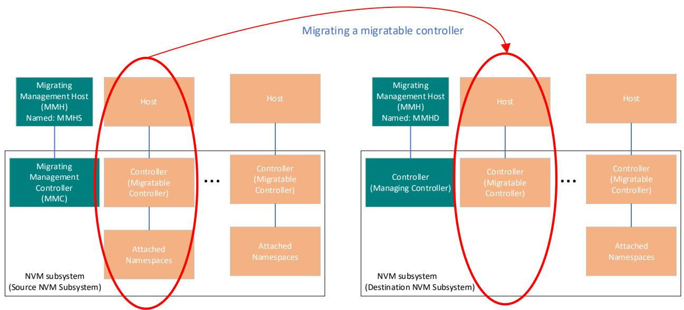

An MMC is an I/O controller or an Administrative controller that supports the Host Managed Live Migration capability and provides the ability for the MMH to use privileged actions (refer to section 3.10 to: 

suspend the processing of commands on the Migratable Controller in the Source NVM Subsystem being migrated (refer to the Migration Send command in section 5.1.17.1.1); 

obtain the state of the Migratable Controller in the Source NVM Subsystem being migrated (refer to the Migration Receive command in section 5.1.16.1.1); 

set that controller state in the Migratable Controller in the Destination NVM Subsystem (refer to the Migration Send command in section 5.1.17.1.3); and 

resume the operation on the Migratable Controller in the Destination NVM Subsystem (refer to the Migration Send command in section 5.1.17.1.2). 

A controller indicates support for the Host Managed Live Migration capability by setting the Host Managed Live Migration Support (HMLMS) bit to ‘1’ in the Optional Admin Command Support (OACS) field in the Identify Controller data structure (refer to Figure 312). 

An MMC is not permitted to be migrated and: 

shall support: 

• the Migration Send command with the Management Operations, 

o Suspend (i.e., 0h); 

o Resume (i.e., 1h); and 

o Set Controller State (i.e., 2h); 

• the Migration Receive command with the Management Operations, 

o Controller State (i.e., 1h); 

and 

the CNS value of 21h in the Identify command (i.e., Supported Controller State Formats data structure (refer to section 5.1.13.2.21)). 

If the NVM subsystem contains one or more Migration Management Controllers, then: 

each controller (i.e., MMC and Migratable Controller) in that NVM subsystem does not support the Host Memory Buffer (refer to the Host Memory Buffer Preferred Size (HMPRE) field in the Identify Controller data structure in Figure 312); and 

• each Migratable Controller in that NVM subsystem is allowed to be migrated and shall not support: 

o the Migration Send command (refer to section 5.1.17); 

o the Migration Receive command (refer to section 5.1.16); 

o the CNS value of 21h in the Identify command (i.e., returning Supported Controller State Formats data structure (refer to section 5.1.13.2.21)); and 

o the Controller Data Queue command with the Create Queue management operation specifying the User Data Migration Queue (refer to section 5.1.4.1.1). 

A Controller Level Reset on an MMC shall cause that MMC to: 

• delete all User Data Migration Queues on that MMC; and 

• stop tracking all host memory changes on that MMC; 

A Controller Level Reset on a Migratable Controller shall cause that Migratable Controller to: 

remove a suspended state if that Migratable Controller is suspended by a Migration Send command specifying the Suspend management operation (refer to section 5.1.17.1.1); and 

retain any persistent controller state that has been committed to that Migratable Controller from a Migration Send command specifying the Set Controller State management operation (refer to section 5.1.17.1.3). 

During the migration of a Migratable Controller in the Source NVM Subsystem while that Migratable Controller is processing commands, it may be necessary for the MMHS to obtain the user data modifications to namespaces attached to that Migratable Controller and modifications made by that Migratable Controller to host memory in the host. The Track Send command (refer to section 5.1.27) and the Track Receive command (refer to section 5.1.26) allows the host to use privileged actions (refer to section 3.10) to: 

• determine user data in namespaces attached to a controller that has changed; and 

• determine host memory that has changed due to commands processed by a controller. 

A controller indicates support for tracking changes to user data in namespaces attached to a controller by setting the Track User Data Changes Support (TUDCS) bit to ‘1’ in the Tracking Attributes (TRATTR) field in the Identify Controller data structure (refer to Figure 312). 

A controller indicates support for tracking changes to host memory (refer to section 1.5.46) due to the processing of commands by a controller by setting the Track Host Memory Changes Support (THMCS) bit to ‘1’ in the TRATTR field. 

# Process for Migrating a Controller

The controller This section provides an example sequence of steps to allow the MMHS to migrate a Migratable Controller in the Source NVM Subsystem and the attached namespaces to a Migratable Controller in the Destination NVM Subsystem (refer to Figure 619). Additionally, the steps include obtaining the host memory modifications made to the host due to the Migratable Controller in the Source NVM Subsystem processing commands during the migration. 

In this example the MMC in the Source NVM Subsystem has: 

the Track User Data Changes Support (TUDCS) bit set to ‘1’ in the Tracking Attributes (TRATTR) field in the Identify Controller data structure (refer to Figure 312); and 

the Track Host Memory Changes Support (THMCS) bit set to ‘1’ in the Tracking Attributes (TRATTR) field in the Identify Controller data structure. 

If attached namespaces are not required to be migrated by the MMHS, then those steps may be ignored. If host memory modifications are not required to be obtained by the MMHS, then those steps may be ignored. 

1. The MMHS copies (i.e., migrates) the user data in namespaces attached to the Migratable Controller in the Source NVM Subsystem while the host is submitting commands and the Migratable Controller is processing those submitted commands. 

a. The MMHS creates a User Data Migration Queue in the MMC in the Source NVM Subsystem by submitting a Controller Data Queue command to that MMC (refer to section 5.1.4) specifying: 

• the Select field set to the Create Queue management operation (i.e., 1h); 

• the Queue Type field set to User Data Migration Queue; and 

the Controller Identifier field (refer to Figure 166) set to the controller identifier for the Migratable Controller in the Source NVM Subsystem. 

b. If the Controller Data Queue command is successful, the completion queue entry contains the Controller Data Queue Identifier for the created User Data Migration Queue. The MMHS causes the MMC in the Source NVM Subsystem to post user data modifications to namespaces attached to the Migratable Controller by submitting a Track Send command to that MMC specifying: 

• the Select field set to Log User Data Changes management operation (i.e., 0h); 

• the Logging Action bit set to ‘1’ (i.e., start logging); and 

the Controller Data Queue Identifier field set to the Controller Data Queue Identifier from the completion queue entry for the Controller Data Queue command. 

It is the responsibility of the MMHS to make sure that the User Data Migration Queue is sized properly and there may be more restrictions on that MMHS as specified by the appropriate I/O command set (e.g., the NVM Command Set requires the MMHS to not allow the User Data Migration Queue to become full). Refer to section 8.1.6 for a description of the User Data Migration Queue (i.e., a Controller Data Queue). 

c. If the Track Send command is successful, then the MMHS starts copying the namespaces attached to the Migratable Controller in the Source NVM Subsystem to the Destination NVM Subsystem. Refer to the applicable I/O Command Set specifications for capabilities that may reduce the amount of user date that is required to copied (e.g., the Get LBA Status command in the NVM Command Set Specification). 

2. The MMHS causes the MMC in the Source NVM Subsystem to start tracking the modifications to host memory in the host due to the Migratable Controller processing submitted commands. 

a. The MMHS submits a Track Send command to the MMC in the Source NVM Subsystem (refer to section 5.1.27) specifying: 

• the Select field set to the Track Memory Changes management operation (i.e., 0h); 

• the Tracking Action (TACT) bit set to ‘1’; 

the Controller Identifier field specifying the identifier for the Migratable Controller in the Source NVM Subsystem being migrated; and 

a Track Memory Changes data structure specifying the host memory to be tracked as described by the set of host memory ranges. 

b. If the Track Send command is successful, then the MMHS may query the host memory modifications that have resulted from the Migratable Controller processing commands by submitting a Track Receive command to the MMC in the Source NVM Subsystem specifying: 

• the Select field set to the Track Memory Changes management operation (i.e., 0h); and 

the Controller Identifier field specifying the identifier for the Migratable Controller in the Source NVM Subsystem being migrated. 

3. Once the MMHS has copied the namespaces attached to the Migratable Controller in the Source NVM Subsystem, that MMHS determines a time to suspend that Migratable Controller. During this period, that MMHS is migrating the user data in the namespaces attached to that Migratable Controller that are identified in the posted entries in the User Data Migration Queue. That MMHS may handle the modified host memory in the host as reported by the Track Receive command. 

4. The MMHS suspends the Migratable Controller in the Source NVM Subsystem by submitting a Migration Send command to the MMC in the Source NVM Subsystem specifying: 

• the Select field set to the Suspend management operation (i.e., 0h); 

the Suspend Type field set to Suspend; 

Delete User Data Migration Queue bit set to ‘1’, if the MMHS desires that the MMC delete the User Data Migration Queue being used to log user data changes of the Migratable Controller being migrated; and 

the Controller Identifier field (refer to Figure 166) set to the controller identifier for the Migratable Controller to be suspended (i.e., the Migratable Controller being migrated). 

Prior to completing that Migration Send command: 

• the specified Migratable Controller being suspended: 

o stops fetching commands (i.e.; from the Admin queue and I/O queues); and 

o completes all previously fetched commands; 

and 

• the MMC processing that Migration Send command: 

o if user data is being logged into a User Data Migration Queue that is associated with the Migratable Controller being migrated, an entry is placed into the User Data Migration Queue that indicates the user data logging has suspended, and then deletes the User Data Migration Queue, if the Delete User Data Migration Queue bit is set to ‘1’. 

5. Since the Migratable Controller in the Source NVM Subsystem is suspended, the MMHS migrates the user data in the namespaces attached to the Migratable Controller that are identified in the posted entries in the User Data Migration Queue. Refer to the appropriate I/O command set specification to determine how the entries identify when entries have completed being posted. That MMHS may handle the modified host memory in the host as reported by the Track Receive command. 

6. The MMHS is able to obtain the controller state of the Migratable Controller in the Source NVM Subsystem by submitting one or more Migration Receive commands to the MMC in the Source NVM Subsystem specifying: 

a. the Select field set to the Get Controller State management operation (i.e., 0h); 

b. the Sequence Indicator field set to the proper sequence value; 

c. the Controller Identifier field set to the controller identifier for the Migratable Controller in the Source NVM Subsystem; 

d. the Controller State Version Index field set to an index into the NVMe Controller State Version list in the Supported Controller State Formats data structure for MMC in the Source NVM Subsystem (refer to Figure 329) if the NVMe defined controller state is required; and 

e. the Controller State UUID Index field set to an index in the Vendor Specific Controller State UUID Supported list in the Supported Controller State Formats Data Structure for MMC in the Source NVM Subsystem (refer to Figure 329), if vendor specific controller state is required. 

7. After the MMHS has transferred the obtained controller state information to the MMHD, the MMHD sets that controller state into a Migratable Controller by submitting a sequence of one or more Migration Send commands to the MMC in the Destination NVM Subsystem specifying: 

• the Select field set to Set Controller State management operation (i.e., 3h); 

• the Sequence Indicator field set to the proper sequence value; 

the Controller Identifier field set to the controller identifier for the Migratable Controller in the Destination NVM Subsystem; 

the Controller State Version Index field set to an index into the NVMe Controller State Version list in the Supported Controller State Formats data structure for MMC in the Destination NVM Subsystem (refer to Figure 329) if value of the NVMe Controller State Size (NVMECSS) field is non-zero (refer to Figure 358); and 

the Controller State UUID Index field set to an index in the Vendor Specific Controller State UUID Supported list in the Supported Controller State Formats Data Structure for MMC in the Source NVM Subsystem (refer to Figure 329), if the value of the Vendor Specific Size (VSS) field is non-zero (refer to Figure 358). 

8. The MMHD resumes operation on the Migratable Controller in the Destination NVM Subsystem (i.e., the migrated controller) by submitting a Migration Send command to the MMC in the Destination NVM Subsystem specifying: 

• the Select field set to Resume management operation (i.e., 2h); 

the Controller Identifier field (refer to Figure 166) set to the controller identifier for the Migratable Controller to be resumed. 

# Key Per I/O

The Key Per I/O capability provides a mechanism to use encryption keys that have been injected into an NVM subsystem by a host. The mechanism to perform activation of the Key Per I/O capability, encryption key injection, management, and association to encryption key tag is outside the scope of this specification. One mechanism is defined in the TCG Storage Security Subsystem Class: Key Per I/O Specification using the NVMe Admin commands Security Send and Security Receive. If the TCG mechanism is used, any additional modifications to the NVM subsystem as a result of activation of the Key Per I/O Security Provider are defined in the TCG Storage Interface Interactions Specification (SIIS). 

Encryption keys injected into the NVM subsystem may be referenced by I/O commands through the use of the encryption key tag (refer to the KEYTAG field in Figure 620) associated with the encryption keys. If an I/O command CETYPE field is set to the KPIOTAG value, then the CEV field (refer to Figure 620) of that I/O command specifies the encryption key tag associated with the encryption key to be used to encrypt or decrypt the data in that I/O command. The association of an encryption key tag to a specific encryption key is outside the scope of this specification. One association mechanism is defined in the TCG Storage Security Subsystem Class: Key Per I/O Specification. 

The Key Per I/O Scope bit (refer to Figure 312) indicates if the Key Per I/O capability: 

• applies to all read and write commands in all namespaces within the NVM subsystem; or 

• independently applies to read and write commands in each namespace within the NVM subsystem. 

The Key Per I/O capability does not have any effect on host accesses to RPMBs and Boot Partitions as these features are not addressed through I/O commands that specify a namespace. 

A controller that supports the Key Per I/O capability shall set the KPIOS bit to ‘1’ in the Identify Controller data structure (refer to Figure 312). 

A namespace that supports the Key Per I/O capability shall set the KPIOSNS bit to ‘1’ in the I/O Command Set Independent Identify Namespace data structure (refer to Figure 319). 

The Key Per I/O capability uses the Command Extension Type (CETYPE) and Command Extension Value (CEV) fields in all read and write commands. Definition of the CETYPE fields are shown in Figure 620. 

Figure 620: CETYPE Definition

<table><tr><td>Value</td><td>Definition</td><td>CEV Field Definition</td></tr><tr><td>0h</td><td colspan="2">Reserved</td></tr><tr><td>1h</td><td>Key Per I/O Tag (KPIOTAG): This command is using the Key Per I/O capability.</td><td>Key Tag (KEYTAG): Specifies a namespace-specific 16-bit encryption key tag that identifies the encryption key used to encrypt or decrypt the data of the command.
The same Key Tag value on different namespaces may or may not identify the same encryption key.
Refer to the Maximum Key Tag field in the I/O Command Set Independent Identify Namespace data structure (refer to Figure 319) for the supported values.</td></tr><tr><td>2h to Eh</td><td colspan="2">Reserved</td></tr><tr><td>Fh</td><td colspan="2">Vendor Specific</td></tr></table>

If: 

• the Key Per I/O capability is enabled in a namespace (i.e., the KPIOENS bit set to ‘1’); 

an I/O command supports the CETYPE field; and 

• the CETYPE field in that I/O command is set to a value that is reserved, 

then the controller shall abort that command with a status code of Invalid Field in Command. 

# Management Addresses

Various entities on a network are able to request a management agent to perform management operations on NVM subsystems. A controller in an NVM subsystem use the Management Addresses capability to indicate the network addresses of those management agents. When an NVM subsystem is provisioned in a storage system, the management addresses are established in the controller. 

Management agents are able to be located in various networked entities, including: 

• NVM subsystems; 

• Fabric interface managers; 

• Embedded management controllers; and 

• Host software. 

Each management address is represented as a uniform resource indicator (URI; refer to RFC 3986). 

The address of a management agent contained in an NVM subsystem (e.g., an Ethernet-attached SSD) is indicated in the Management Address List log page (refer to section 5.1.12.1.24), in a Management Address Descriptor indicating a Management Address Type of 1h. The method by which the address is determined is outside the scope of this specification. 

The address of a management agent contained in a fabric interface manager is indicated in the Management Address List log page (refer to section 5.1.12.1.24), in a Management Address Descriptor indicating a Management Address Type of 2h. The method by which the address is determined is outside the scope of this specification. 

The address of a management agent contained in an embedded management controller (e.g., a BMC) is set and retrieved using the Embedded Management Controller Address feature (refer to section 5.1.25.1.24). The Embedded Management Controller Address feature is intended to be set only by the storage system containing the embedded management controller. The embedded management controller is able to ensure this by issuing a Lockdown command (refer to section 5.1.15) with the OFI field specifying this Feature, and the PRHBT bit set to ‘1’ and the IFC field set to Admin Submission Queue (i.e., 00b). 

The address of a management agent contained in host software is set and retrieved using the Host Management Controller Address feature (refer to section 5.1.25.1.25). The Host Management Agent Address feature is intended to be set only by host software. Host software is able to ensure this by issuing a Lockdown command (refer to section 5.1.15) with the OFI field specifying this Feature, and the PRHBT bit set to ‘1’ and the IFC field set to Out-of-band on a Management Endpoint (i.e., 10b). 

# Namespace Management

The Namespace Management capability consists of the Namespace Management command (refer to section 5.1.21) and the Namespace Attachment command (refer to section 5.1.20). The Namespace Management command is used to create a namespace or delete a namespace. The Namespace Attachment command is used to attach and detach controllers from a namespace. The Namespace Management capability is intended for use during manufacturing or by a system administrator. 

In addition to the Namespace Management capability, there are other events and capabilities that are able to affect the number of namespaces that exist within an NVM subsystem (e.g., the Capacity Management capability as described in section 8.1.4). 

If the Namespace Management capability is supported, then the controller: 

a) shall support the Namespace Management command and the Namespace Attachment command; 

b) shall set the NMS bit to ‘1’ in the OACS field (refer to Figure 312); 

c) shall support the Attached Namespace Attribute Changed asynchronous event (refer to Figure 151 and section 5.1.25.1.5); 

d) should support the Allocated Namespace Attribute Changed asynchronous event (refer to Figure 151 and section 5.1.25.1.5); and 

e) may support Namespace Granularity (refer to the NVM Command Set Specification). 

A controller may support the Namespace Attachment command without supporting the Namespace Management command. Such a controller: 

a) shall not set the Namespace Management Supported (NMS) bit to ‘1’ in the OACS field (refer to Figure 312); and 

b) should support the Namespace Attribute Change asynchronous event. 

If a namespace is detached from a controller, then the NSID that referred to that namespace becomes an inactive NSID (refer to section 3.2.1.4) on that controller. If a namespace is deleted from the NVM subsystem, then the NSID that referred to that namespace becomes an unallocated NSID (refer to section 3.2.1.3) in the NVM subsystem. Previously submitted but uncompleted or subsequently submitted commands to the affected NSID are handled by the controller as if they were issued to an inactive NSID (refer to Figure 92). 

The size of a namespace that contains formatted storage is based on the size requested in a create operation, the format of the namespace, and any characteristics (e.g., endurance). The controller determines the NVM capacity allocated for that namespace. Namespaces may be created with different usage characteristics (e.g., endurance) that utilize differing amounts of NVM capacity. Namespace characteristics and the mapping of these characteristics to NVM capacity usage are outside the scope of this specification. 

Reporting of capacity information for the NVM subsystem, Domain, Endurance Group, and NVM Set are described in section 3.8. For each namespace that contains formatted storage, the NVM Set and the Endurance Group that contain the namespace are reported in the Identify Namespace data structure. The NVM Set to be used for a namespace that contains formatted storage is based on the value in the NVM 

Set Identifier field in a create operation. If the NVM Set Identifier field is cleared to 0h in a create operation for a namespace that contains formatted storage, then the controller shall choose the NVM Set from which to allocate capacity to create that namespace. 

If the NVM Set Identifier field and the Endurance Group Identifier field are both cleared to 0h in a create operation for a namespace that contains formatted storage, then the controller shall choose the Endurance Group and the NVM Set from which to allocate capacity to create that namespace. 

If the NVM Set Identifier field is cleared to 0h and the Endurance Group Identifier field is set to a non-zero value in a create operation for a namespace that contains formatted storage, then the controller shall choose the NVM Set in the specified Endurance Group from which to allocate capacity to create that namespace. 

If the NVM Set Identifier field is set to a non-zero value and the Endurance Group Identifier field is cleared to 0h in a create operation for a namespace that contains formatted storage, then the controller shall abort the command with a status code of Invalid Field in Command. 

If the NVM Set Identifier field and the Endurance Group Identifier field are both set to non-zero values in a create operation for a namespace that contains formatted storage and the specified NVM Set exists in the specified Endurance Group, then the controller shall allocate capacity for that created namespace from the specified NVM Set. 

If the NVM Set Identifier field and the Endurance Group Identifier field are both set to non-zero values in a create operation for a namespace that contains formatted storage and the specified NVM Set does not exist in the specified Endurance Group, then the controller shall abort the command with a status code of Invalid Field in Command. 

For each namespace that contains formatted storage, the NVM capacity used for that namespace is reported in the Identify Namespace data structure (refer to the applicable I/O Command Set specification). The controller may allocate NVM capacity in units such that the requested size for a namespace that contains formatted storage may be rounded up to the next unit boundary. The units in which NVM capacity is allocated are reported in the Namespace Granularity List (refer to the NVM Command Set Specification), if supported. For example, when using the NVM Command Set, if host software requests a namespace of 32 logical blocks with a logical block size of 4 KiB for a total size of 128 KiB and the allocation unit for the implementation is 1 MiB, then the NVM capacity consumed may be rounded up to 1 MiB. The NVM capacity fields may not correspond to the logical block size multiplied by the total number of logical blocks. 

The method of allocating ANA Group identifiers is outside the scope of this specification. If the ANA Group Identifier (refer to Figure 319 and the Identify Namespace data structure in the NVM Command Set Specification) is cleared to 0h, then the controller shall determine the ANAGRPID that is assigned to that namespace. 

# Namespace Management Examples

The following is an example of how a host creates a namespace: 

1. the host requests the Identify Namespace data structure that specifies common namespace capabilities (i.e., using an Identify command with the NSID field set to FFFFFFFFh and the CNS field cleared to 0h); 

2. if the controller supports reporting of I/O Command Set specific Namespace Management content (refer to the Namespace Management section in the applicable I/O Command Set specification), host software optionally requests that information (e.g., Namespace Granularity). 

3. the host determines available resources (e.g., capacity for a namespace that contains formatted storage) (refer to section 3.8); 

4. the host creates the data structure defined in Figure 369 (e.g., taking into account the common namespace capabilities, available capacity); 

5. the host issues the Namespace Management command specifying the Create operation and the data structure. On successful completion of the command, the Namespace Identifier of the new namespace is returned in Dword 0 of the completion queue entry. At this point, the new namespace is not attached to any controller; and 

6. if Allocated Namespace Attribute Notices are enabled on the controller, then the host requests the Identify Namespace data structures (refer to section 1.5.49) for the new namespace to determine all attributes of the namespace upon receiving an Allocated Namespace Attribute Changed asynchronous event from that controller. 

The following is an example of how a host attaches a namespace: 

1. the host issues the Namespace Attachment command specifying the Controller Attach operation to attach the specified namespace to one or more controllers; 

2. the host receives an Attached Namespace Attribute Changed asynchronous event from each controller that has a namespace newly attached to that controller if Attached Namespace Attribute Notices are enabled on that controller; and 

3. the host receives an Allocated Namespace Attribute Changed asynchronous event from each controller that has Allocated Namespace Attribute Notices enabled. 

The following is an example of how a host detaches a namespace: 

1. the host issues the Namespace Attachment command specifying the Controller Detach operation to detach the specified namespace from one or more controllers; 

2. the host receives an Attached Namespace Attribute Changed asynchronous event from each controller that has a namespace newly detached from that controller if Attached Namespace Attribute Notices are enabled on that controller; and 

3. the host receives an Allocated Namespace Attribute Changed asynchronous event from each controller that has Allocated Namespace Attribute Notices enabled. 

The following is an example of how a host deletes a namespace: 

1. the host should detach the namespace from all controllers; 

2. the host issues the Namespace Management command specifying the Delete operation for the specified namespace. On successful completion of the command, the namespace has been deleted; 

3. if the namespace was attached to any controller(s) when deleted: 

a. the host receives an Attached Namespace Attribute Changed asynchronous event from each of those controllers that has Attached Namespace Attribute Notices enabled as described in section 8.1.15.2; and 

b. the host receives an Allocated Namespace Attribute Changed asynchronous event from each of those controllers that has Allocated Namespace Attribute Notices enabled as described in section 8.1.15.2; 

and 

4. if the namespace was not attached to any controller when deleted, the host receives an Allocated Namespace Attribute Changed asynchronous event from each controller that has Allocated Namespace Attribute Notices enabled as described in section 8.1.15.2. 

# Namespace Deletion Asynchronous Event Reporting

If a delete operation is requested for a namespace: 

via a command (e.g., a Namespace Management command or Capacity Management command) received on the Admin Submission Queue (e.g., not via a Management Endpoint, refer to the NVM Express Management Interface Specification), then: 

o each controller, to which the namespace is attached, that has Attached Namespace Attribute Notices enabled (refer to Figure 391) other than the controller processing that delete operation, shall issue an Attached Namespace Attribute Changed asynchronous event as part of the delete operation to indicate a namespace change; and 

o each controller that has Allocated Namespace Attribute Notices enabled (refer to Figure 391) other than the controller processing that delete operation, shall issue an Allocated Namespace Attribute Changed asynchronous event as part of the delete operation to indicate a namespace change; 

or 

via any other method (e.g., a method outside the scope of this specification or via a Management Endpoint, refer to the NVM Express Management Interface Specification), then: 

o each controller, to which the namespace is attached, that has Attached Namespace Attribute Notices enabled (refer to Figure 391) shall issue an Attached Namespace Attribute Changed asynchronous event as part of the delete operation to indicate a namespace change; and 

o each controller that has Allocated Namespace Attribute Notices enabled (refer to Figure 391) shall issue an Allocated Namespace Attribute Changed asynchronous event as part of the delete operation to indicate a namespace change. 

# Namespace Management Considerations for Exported NVM Subsystems (informative)

A host is able to determine whether an Exported NVM Subsystem supports the Namespace Attachment command by reading the Commands Supported and Effects log page (refer to section 5.1.12.1.6). The Namespace Attachment command is used to attach namespaces to controllers and detach namespaces from controllers. The Namespace Management command is not supported by controllers in an Exported NVM subsystem. 

If an Exported Namespace is detached from a controller in the Exported NVM Subsystem, then the NSID that referred to that namespace becomes an inactive NSID (refer to section 3.2.1.4) on that controller. If an Underlying Namespace is disassociated from the Exported NVM Subsystem (refer to section 5.3.7.1.2), then the NSID of the Exported Namespace that referred to that namespace becomes an unallocated NSID (refer to section 3.2.1.3) and is not available to any controller in the Exported NVM Subsystem. Previously submitted but uncompleted or subsequently submitted commands to the namespace that is: 

• detached from a controller; or 

• disassociated from the Exported NVM Subsystem, 

are handled by the controller as if they were issued to an inactive NSID (refer to section 3.2.1.4 and Figure 92). Refer to section 8.1.15 for Host actions to attach or detach a specified Namespace. 

If an Exported NVM Subsystem Exports an Underlying Namespace that becomes unavailable (e.g., detached or deleted) or is affected by a Capacity Management command (e.g., Endurance Group deletion, NVM Set deletion (refer to section 8.1.4)) then: 

Previously submitted but uncompleted or subsequently submitted commands to the Exported Namespace are handled by the controller as if they were issued to an inactive NSID (refer to section 3.2.1.4 and Figure 92); and 

If Namespace Attribute Notices are enabled controllers affected by Underlying Namespace changes report a Namespace Attribute Changed asynchronous event to the host as described in Figure 151. 

# Namespace Write Protection

Namespace Write Protection is an optional configurable controller capability that enables the host to control the write protection state of a namespace or to determine the write protection state of a namespace. Support for this capability is reported in the Namespace Write Protection Capabilities (NWPC) field in the Identify Controller data structure (refer to Figure 312). 

Figure 621 defines the write protection states that may be supported for a namespace. All states persist across power cycles and Controller Level Resets (refer to section 3.7.2) except Write Protect Until Power Cycle state, which transitions to the No Write Protect state on the occurrence of a power cycle. 

Figure 621: Namespace Write Protection State Definitions

<table><tr><td rowspan="2">M/O</td><td rowspan="2">State</td><td rowspan="2">Definition</td><td colspan="2">Persistent Across</td></tr><tr><td>Power Cycles</td><td>Controller Level Resets</td></tr><tr><td>M</td><td>No Write Protect</td><td>The namespace is not write protected.</td><td>Yes</td><td>Yes</td></tr></table>

Figure 621: Namespace Write Protection State Definitions

<table><tr><td rowspan="2">M/O</td><td rowspan="2">State</td><td rowspan="2">Definition</td><td colspan="2">Persistent Across</td></tr><tr><td>Power Cycles</td><td>Controller Level Resets</td></tr><tr><td>M</td><td>Write Protect</td><td>The namespace is write protected.</td><td>Yes</td><td>Yes</td></tr><tr><td>O</td><td>Write Protect Until Power Cycle</td><td>The namespace is write protected until the next power cycle.</td><td>No</td><td>Yes</td></tr><tr><td>O</td><td>Permanent Write Protect</td><td>The namespace is permanently write protected.</td><td>Yes</td><td>Yes</td></tr><tr><td colspan="5">Notes: 
M – If the Namespace Write Protection capability is supported, then support of this state is mandatory. 
O – If the Namespace Write Protection capability is supported, then support of this state is optional.</td></tr></table>

The Write Protect Until Power Cycle state shall not be used in multi-domain NVM subsystems because clearing that state requires simultaneous power cycle of the namespace and all controllers to which that namespace is attached. The result of a command that attempts to use that state in a multi-domain NVM subsystem is specified in section 5.1.25.1.31. 

Figure 622 defines the transition between write protection states. All state transitions are based on Set Features commands unless otherwise specified. The initial state of a namespace at the time of its creation is the No Write Protect state. 

Figure 622: Namespace Write Protection State Machine Model

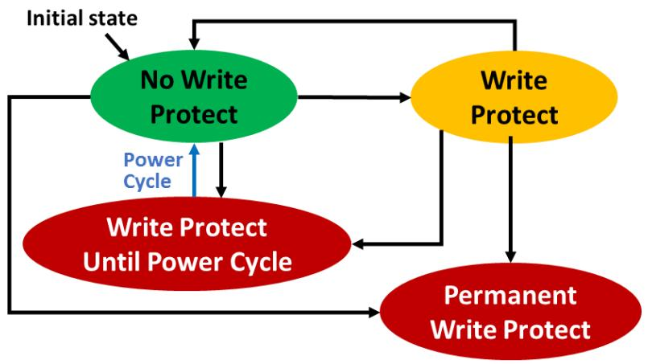

The Write Protect Until Power Cycle and Permanent Write Protect states are subject to the controls defined in the Write Protection Control field (refer to Figure 633), which determines whether the controller processes or aborts Set Features commands which cause a transition into either of these two states (refer to section 8.1.21). 

The results of using Namespace Write Protection in combination with an external write protection system (e.g., TCG Storage Interface Interactions Specification) are outside the scope of this specification. 

# Namespace Write Protection – Theory of Operation

If Namespace Write Protection is supported by the controller, then the controller shall: 

indicate the level of support for Namespace Write Protection capabilities in the Namespace Write Protection Capabilities (NWPC) field in the Identify Controller data structure by: 

o setting the No Write Protect and Write Protect Support bit to ‘1’ in the NWPC field; 

o setting the Write Protect Until Power Cycle Support bit to ‘1’ in the NWPC field, if the Write Protect Until Power Cycle state is supported; and 

o setting the Permanent Write Protect Support bit to ‘1’ in the NWPC field, if the Permanent Write Protect state is supported; 

and 

• support the Namespace Write Protection Config feature (refer to section 5.1.25.1.31). 

If the controller supports the Write Protect Until Power Cycle state or the Permanent Write Protect state, then the controller shall support the Write Protection Control field in the RPMB Device Configuration Block data structure (refer to section 8.1.21). 

The controller shall not set the All Media Read-Only bit to ‘1’ in the Critical Warning field (refer to Figure 206) if the read-only condition on the media is a result of a change in the namespace write protection state as defined by the Namespace Write Protection State Machine (refer to Figure 622), or due to any autonomous namespace write protection state transitions (e.g., power cycle). Host software may check the current namespace write protection state of a namespace using the Get Features command with the Namespace Write Protection Config Feature Identifier. 

If any controller in the NVM subsystem supports Namespace Write Protection, then the write protection state of a namespace shall be enforced by any controller to which that namespace is attached. 

# Namespace Write Protection – Command Interactions

Unless otherwise noted, the commands listed in Figure 623 are processed normally when specifying an NSID for a namespace that is write protected. 

Figure 623: Commands Allowed when Specifying a Write Protected NSID

<table><tr><td>Admin Command Set</td><td>NVM Command Set</td></tr><tr><td>Device Self-test</td><td>Compare</td></tr><tr><td>Directive Send1</td><td>Dataset Management1</td></tr><tr><td>Directive Receive3</td><td>Read</td></tr><tr><td>Get Features</td><td>Reservation Register</td></tr><tr><td>Get Log Page</td><td>Reservation Report</td></tr><tr><td>Identify</td><td>Reservation Acquire</td></tr><tr><td>Namespace Attachment</td><td>Reservation Release</td></tr><tr><td>Security Receive1</td><td>Vendor Specific1</td></tr><tr><td>Security Send1</td><td>Flush2</td></tr><tr><td>Set Features1</td><td>Verify</td></tr><tr><td>Vendor Specific1</td><td></td></tr><tr><td colspan="2">Notes:1. The controller shall fail commands if the specified action attempts to modify the non-volatile storage medium of the specified namespace.2. A Flush command shall complete successfully with no effect. All volatile write cache data and metadata associated with the specified namespace is written to non-volatile storage medium as part of transitioning to the write protected state (refer to section 5.1.25.1.31).3. A Directive Receive command which attempts to allocate streams resources shall be aborted with a status code of Namespace is Write Protected.</td></tr></table>

Commands not listed in Figure 623, and which meet the following conditions, shall be aborted with a status code of Namespace Is Write Protected (refer to Figure 102): 

a) Commands that specify an NSID for a namespace that is write protected; 

b) Commands that specify an NSID for a namespace that is not write protected and the execution of which would modify another namespace that is write protected (e.g., a Format NVM command); and 

c) Commands that do not specify an NSID, and the execution of which would modify a namespace that is write protected (e.g., Sanitize command). 

# Power Management

The power management capability allows the host to manage NVM subsystem power statically or dynamically. Static power management consists of the host determining the maximum power that may be allocated to an NVM subsystem and setting the NVM Express power state to one that consumes this amount of power or less. Dynamic power management is illustrated in Figure 624 and consists of the host modifying the NVM Express power state to best satisfy changing power and performance objectives. This power management mechanism is meant to complement and not replace autonomous power management or thermal management performed by a controller. 

Figure 624: Dynamic Power Management

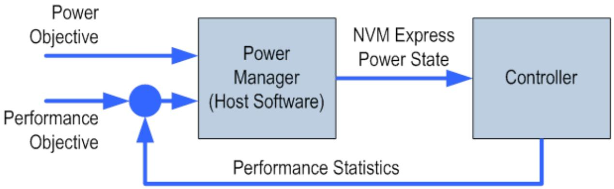

The number of power states implemented by a controller is returned in the Number of Power States Supported (NPSS) field in the Identify Controller data structure. If the controller supports this feature, at least one power state shall be defined and optionally, up to a total of 32 power states may be supported. Power states shall be contiguously numbered starting with zero such that each subsequent power state consumes less than or equal to the maximum power consumed in the previous state. Thus, power state zero indicates the maximum power that the NVM subsystem is capable of consuming. 

Associated with each power state is a Power State Descriptor in the Identify Controller data structure (refer to Figure 313). The descriptors for all implemented power states may be viewed as forming a table as shown in the example in Figure 625 for a controller with seven implemented power states. Note that Figure 625 is illustrative and does not include all fields in the power state descriptor. The Maximum Power (MP) field indicates the sustained maximum power that may be consumed in that state, where power measurement methods are outside the scope of this specification. The controller may employ autonomous power management techniques to reduce power consumption below this level, but under no circumstances is power allowed to exceed this level except for non-operational power states as described in section 8.1.17.1. 

Figure 625: Example Power State Descriptor Table

<table><tr><td>Power State</td><td>Maximum Power (MP)</td><td>Entry Latency (ENLAT)</td><td>Exit Latency (EXLAT)</td><td>Relative Read Throughput (RRT)</td><td>Relative Read Latency (RRL)</td><td>Relative Write Throughput (RWT)</td><td>Relative Write Latency (RWL)</td></tr><tr><td>0</td><td>25 W</td><td>5 μs</td><td>5 μs</td><td>0</td><td>0</td><td>0</td><td>0</td></tr><tr><td>1</td><td>18 W</td><td>5 μs</td><td>7 μs</td><td>0</td><td>0</td><td>1</td><td>0</td></tr><tr><td>2</td><td>18 W</td><td>5 μs</td><td>8 μs</td><td>1</td><td>0</td><td>0</td><td>0</td></tr><tr><td>3</td><td>15 W</td><td>20 μs</td><td>15 μs</td><td>2</td><td>0</td><td>2</td><td>0</td></tr><tr><td>4</td><td>10 W</td><td>20 μs</td><td>30 μs</td><td>1</td><td>1</td><td>3</td><td>0</td></tr><tr><td>5</td><td>8 W</td><td>50 μs</td><td>50 μs</td><td>2</td><td>2</td><td>4</td><td>0</td></tr></table>

Figure 625: Example Power State Descriptor Table

<table><tr><td>Power State</td><td>Maximum Power (MP)</td><td>Entry Latency (ENLAT)</td><td>Exit Latency (EXLAT)</td><td>Relative Read Throughput (RRT)</td><td>Relative Read Latency (RRL)</td><td>Relative Write Throughput (RWT)</td><td>Relative Write Latency (RWL)</td></tr><tr><td>6</td><td>5 W</td><td>20 μs</td><td>5,000 μs</td><td>4</td><td>3</td><td>5</td><td>1</td></tr></table>

The Idle Power (IDLP) field indicates the typical power consumed by the NVM subsystem over 30 seconds in the power state when idle (e.g., there are no pending commands, property accesses, background processes, nor device self-test operations). The measurement starts after the NVM subsystem has been idle for 10 seconds. 

The Active Power (ACTP) field indicates the largest average power of the NVM subsystem over a 10 second window on a particular workload (refer to section 8.1.17.3). Active Power measurement starts when the first command is submitted and ends when the last command is completed. The largest average power over a 10 second window, consumed by the NVM subsystem in that state is reported in the Active Power field. If the workload completes faster than 10 seconds, the average active power should be measured over the period of the workload. Non-operational states shall set Active Power Scale, Active Power Workload, and Active Power fields to 0h. 

The host may dynamically modify the power state using the Set Features command and determine the current power state using the Get Features command. The host may directly transition between any two supported power states. The Entry Latency (ENLAT) field in the Power State Descriptor data structure indicates the maximum amount of time in microseconds to enter that power state and the Exit Latency (EXLAT) field indicates the maximum amount of time in microseconds to exit that state. 

The maximum amount of time to transition between any two power states is equal to the sum of the old state’s exit latency and the new state’s entry latency. The host is not required to wait for a previously submitted power state transition to complete before initiating a new transition. The maximum amount of time for a sequence of power state transitions to complete is equal to the sum of transition times for each individual power state transition in the sequence. 

Associated with each power state descriptor are Relative Read Throughput (RRT), Relative Write Throughput (RWT), Relative Read Latency (RRL) and Relative Write Latency (RWL) fields that provide the host with an indication of relative performance in that power state. Relative performance values provide an ordering of performance characteristics between power states. Relative performance values may repeat, may be skipped, and may be assigned in any order (i.e., increasing power states are not required to have increasing relative performance values). 

A lower relative performance value indicates better performance (e.g., higher throughput or lower latency). For example, in Figure 625 power state 1 has higher read throughput than power state 2, and power states 0 through 3 all have the same read latency. Relative performance ordering is only with respect to a single performance characteristic. Thus, although the relative read throughput value of one power state may equal the relative write throughput value of another power state, this does not imply that the actual read and write performance of these two power states are equal. 

The default NVM Express power state is implementation specific and shall correspond to a state that does not consume more power than the lowest value specified in the applicable form factor specification, if any. Refer to the Power Management section in the applicable NVM Express transport specification for transport specific power requirements impacting NVMe power states, if any. 

# Non-Operational Power States

A power state may be a non-operational power state, as indicated by Non-Operational State (NOPS) field in Figure 313. Non-operational power states allow the following operations: 

• property accesses; 

• PMR accesses, if any; 

• CMB accesses, if any; 

processing of Admin commands and processing background operations, if any, initiated by that command (e.g., Device Self-test command (refer to section 5.1.5), Sanitize command (refer to section 5.1.22)); and 

additional transport-specific accesses as defined in the applicable NVMe Transport binding specification. 

For the operations listed in the preceding paragraph, the controller: 

• may exceed the power advertised by the non-operational power state; 

shall logically remain in the current non-operational power state unless an I/O command is received or if an explicit transition is requested by a Set Features command with the Power Management Feature Identifier; and 

• shall not exceed the maximum power advertised for the most recent operational power state. 

HMB non-operational power state access restriction (refer to section 5.1.25.2.4) does not prohibit the controller from accessing the HMB while processing Admin commands and while performing host-initiated background operations initiated by Admin commands. HMB non-operational power state access restriction does prohibit the controller from accessing the HMB in order to perform controller-initiated activity (i.e., activity not directly associated with a command). 

Execution of controller-initiated background operations may exceed the power advertised by the nonoperational power state, if the Non-Operational Power State Permissive Mode is supported and enabled (refer to section 5.1.25.1.10). 

No I/O commands are processed by the controller while in a non-operational power state. The host should wait until there are no pending I/O commands prior to issuing a Set Features command to change the current power state of the device to a non-operational power state and not submit new I/O commands until the Set Features command completes. Issuing an I/O command in parallel may result in the controller being in an unexpected power state. 

When in a non-operational power state, regardless of whether autonomous power state transitions are enabled, the controller shall autonomously transition back to the most recent operational power state to process an I/O command. 

# Autonomous Power State Transitions

The controller may support autonomous power state transitions, as indicated in the Identify Controller data structure in Figure 312. Autonomous power state transitions provide a mechanism for the host to configure the controller to automatically transition between power states on certain conditions without software intervention. 

The entry condition to transition to the Idle Transition Power State is that the controller has been in idle for a continuous period of time exceeding the Idle Time Prior to Transition time specified. The controller is idle when there are no commands outstanding to any I/O Submission Queue. If a controller has an operation in process (e.g., device self-test operation) that would cause controller power to exceed that advertised for the proposed non-operational power state, then the controller should not autonomously transition to that state. 

The power state to transition to shall be a non-operational power state (a non-operational power state may autonomously transition to another non-operational power state). If an operational power state is specified by a Set Features command specifying the Autonomous Power State Transitions feature (i.e., the Feature Identifier field set to 0Ch (refer to section 5.1.25.1.6), then the controller should abort the command with a status code of Invalid Field in Command. Refer to section 8.1.17.1 for more details. 

# NVM Subsystem Workloads

The workload values described in this section may specify a workload hint in the Power Management Feature (refer to section 5.1.25.1.2) to inform the NVM subsystem or indicate the conditions for the active power level. 

Active power values in the power state descriptors are specified for a particular workload since they may vary based on the workload of the NVM subsystem. The workload field indicates the conditions to observe the energy values. If Active Power is indicated for a power state, a corresponding workload shall also be indicated. 

The workload values are described in Figure 626. 

Figure 626: Workload Hints

<table><tr><td>Value</td><td>Definition</td></tr><tr><td>000b</td><td>No Workload: The workload is unknown or not provided.</td></tr><tr><td>001b</td><td>Workload 1: Extended Idle Period with a Burst of Random Writes. Workload #1 consists of five (5) minutes of idle followed by thirty-two (32) random write commands of size 1 MiB submitted to a single controller while all other controllers in the NVM subsystem are idle, and then thirty (30) seconds of idle.</td></tr><tr><td>010b</td><td>Workload 2: Heavy Sequential Writes. Workload #2 consists of 80,000 sequential write commands of size 128 KiB submitted to a single controller while all other controllers in the NVM subsystem are idle. The submission queue(s) should be sufficiently large allowing the host to ensure there are multiple commands pending at all times during the workload.</td></tr><tr><td>011b to 111b</td><td>Reserved</td></tr></table>

# Runtime D3 (RTD3) Transitions (PCIe only)

In Runtime D3, main power is removed from the controller. Auxiliary power may or may not be provided. RTD3 is used for additional power savings when the controller is expected to be idle for a period of time. 

In this specification, RTD3 refers to the ${ \mathsf { D } } 3 { \mathsf { c o l d } }$ power state described in the PCI Express Base Specification. RTD3 does not include the PCI Express $\mathsf { D } 3 _ { \mathsf { h o t } }$ power state because main power is not removed from the controller in the $\mathsf { D } 3 _ { \mathsf { h o t } }$ power state. Refer to the PCI Express Base Specification for details on the $\mathsf { D } 3 _ { \mathsf { h o t } }$ power state and the ${ \sf D 3 _ { c o l d } }$ power state. 

To enable host software to determine when to use RTD3, the controller reports the RTD3 Entry Latency (RTD3E) field and the RTD3 Resume Latency (RTD3R) field in the Identify Controller data structure in Figure 312. The host may use the sum of these two values to evaluate whether the expected idle period is long enough to benefit from a transition to RTD3. 

The RTD3 Resume Latency is the expected elapsed time from the time power is applied until the controller is able to: 

a) process and complete I/O commands; and 

b) access the resources (e.g., formatted storage) associated with attached namespace(s), if any, as part of I/O command processing. 

The latency reported is based on a normal shutdown with optimal controller settings preceding the RTD3 resume. The latency reported assumes that host software enables and initializes the controller and sends a 4 KiB read operation. 

If CSTS.ST is cleared to $\scriptstyle { \mathrm { ~ \displaystyle ~ } } ^ { \prime } 0 ^ { \prime }$ , then the RTD3 Entry Latency is the expected elapsed time from the time CC.SHN is set to 01b by host software until CSTS.SHST is set to 10b by the controller. When CSTS.SHST is set to 10b, the controller is ready for host software to remove power. 

# Host Controlled Thermal Management

A controller may support host controlled thermal management (HCTM), as indicated in the Host Controlled Thermal Management Attributes of the Identify Controller data structure in Figure 312. Host controlled thermal management provides a mechanism for the host to configure a controller to automatically transition between active power states or perform vendor specific thermal management actions in order to attempt to meet thermal management requirements specified by the host. If active power states transitions are used to attempt to meet these thermal management requirements specified by the host, then those active power states transitions are vendor specific. 

The host specifies and enables the thermal management requirements by setting the Thermal Management Temperature 1 field and/or Thermal Management Temperature 2 field (refer to section 5.1.25.1.9) in a Set Features command to a non-zero value. The supported range of values for the Thermal Management Temperature 1 field and Thermal Management Temperature 2 field are indicated in the Identify Controller data structure in Figure 312. 

The Thermal Management Temperature 1 specifies that if the Composite Temperature (refer to Figure 207) is: 

a) greater than or equal to this value; and 

b) less than the Thermal Management Temperature 2, if non-zero, 

then the controller should start transitioning to lower power active power states or perform vendor specific thermal management actions while minimizing the impact on performance in order to attempt to reduce the Composite Temperature (e.g., transition to an active power state that performs light throttling). 

The Thermal Management Temperature 2 field specifies that if the Composite Temperature is greater than or equal to this value, then the controller shall start transitioning to lower power active power states or perform vendor specific thermal management actions regardless of the impact on performance in order to attempt to reduce the Composite Temperature (e.g., transition to an active power state that performs heavy throttling). 

If the controller is currently in a lower power active power state or performing vendor specific thermal management actions because of this feature (e.g., throttling performance) because the Composite Temperature is: 

a) greater than or equal to the current value of the Thermal Management Temperature 1 field; and 

b) less than the current value of the Thermal Management Temperature 2 field, 

and the Composite Temperature decreases to a value below the current value of the Thermal Management Temperature 1 field, then the controller should return to the active power state that the controller was in prior to going to a lower power active power state or stop performing vendor specific thermal management actions because of this feature, the Composite Temperature and the current value of the Thermal Management Temperature 1 field. 

If the controller is currently in a lower power active power state or performing vendor specific thermal management actions because the Composite Temperature is greater than or equal to the current value of the Thermal Management Temperature 2 field and the Composite Temperature decreases to a value less than the current value of the Thermal Management Temperature 1 field, then the controller should return to the active power state that the controller was in prior to going to a lower power active power state or stop performing vendor specific thermal management actions because of this feature, and the Composite Temperature. 

The temperature at which the controller stops being in a lower power active power state or performing vendor specific thermal management actions because of this feature is vendor specific (i.e., hysteresis is vendor specific). 

Figure 627 shows examples of how the Composite Temperature may be affected by this feature. 

Figure 627: HCTM Example

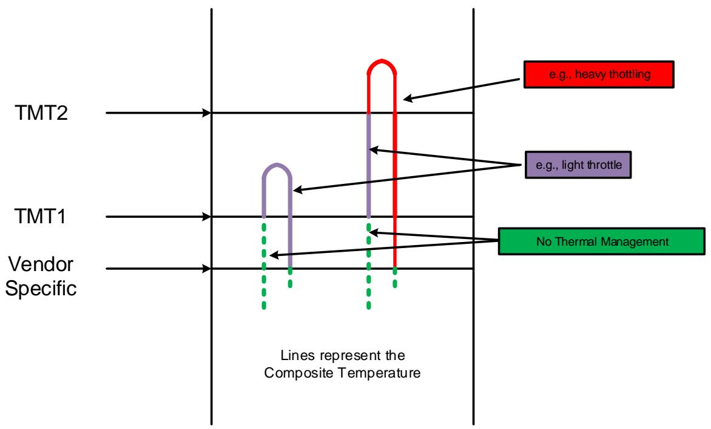

Note: Since the host controlled thermal management (HCTM) feature uses the Composite Temperature, the actual interactions between a platform (e.g., tablet, or laptop) and two different device implementations may vary even with the same Thermal Management Temperature 1 and Thermal Management Temperature 2 temperature settings. The use of this feature requires validation between those devices’ implementations and the platform in order to be used effectively. 

The SMART / Health Information log page (refer to section 5.1.12.1.3) contains statistics related to Host Controller Thermal Management. 

# Predictable Latency Mode

Predictable Latency Mode is used to achieve predictable latency for read and write operations. When configured to operate in this mode using the Predictable Latency Mode Config Feature (refer to section 5.1.25.1.12), the namespaces in an NVM Set (refer to section 3.2.2) provide windows of operation for deterministic operation or non-deterministic operation. 

When Predictable Latency Mode is enabled: 

NVM Sets and their associated namespaces have vendor specific quality of service attributes; 

• I/O commands that access NVM in the same NVM Set have the same quality of service attributes; and 

I/O commands that access NVM in one NVM Set do not impact the quality of service of I/O commands that access NVM in a different NVM Set. 

The quality of service attributes apply within the NVM subsystem and do not include the PCIe or fabric connection. To enhance isolation, the host should submit I/O commands for different NVM Sets to different I/O Submission Queues. 

Read Recovery Levels (refer to section 8.1.20) shall be supported when Predictable Latency Mode is supported. The host configures the Read Recovery Level to specify the tradeoff between the quality of service versus the amount of error recovery to apply for a particular NVM Set. 

The Deterministic Window (DTWIN) is the window of operation during which the NVM Set is able to provide deterministic latency for read and write operations. The Non-Deterministic Window (NDWIN) is the window of operation during which the NVM Set is not able to provide deterministic latency for read and write operations as a result of preparing for a subsequent Deterministic Window. Examples of actions that may be performed in the Non-Deterministic Window include background operations on the non-volatile storage media. The current window that an NVM Set is operating in is configured by the host using the Predictable Latency Mode Window Feature or by the controller as a result of an autonomous action. 

Figure 628: Deterministic and Non-Deterministic Windows

# Legend

Deterministic Window (DTWIN) 

Non-Deterministic Window (NDWIN) 

To remain in the Deterministic Window, the host is required to follow operating rules (refer to section 8.1.18.1) ensuring that certain attributes do not exceed the typical or maximum values indicated in the Predictable Latency Per NVM Set log page. If the attributes exceed any of the typical or maximum values indicated in the Predictable Latency Per NVM Set log page or a Deterministic Excursion occurs, then the associated NVM Set may autonomously transition to the Non-Deterministic Window. A Deterministic Excursion is a rare occurrence in the NVM subsystem that requires immediate action by the controller. 

The host configures Predictable Latency Events to report using the Predictable Latency Mode Config feature. The host may configure a Predictable Latency Event to be triggered when that value exceeds a specific value in order to manage window changes and avoid autonomous transitions by the controller. Refer to section 8.1.18.3. 

If Predictable Latency Mode is supported, then all controllers in the NVM subsystem shall: 

• Support one or more NVM Sets; 

• Support Read Recovery Levels; 

• Support the Predictable Latency Mode log page for each NVM Set; 

• Support the Predictable Latency Event Aggregate log page; 

• Support the Predictable Latency Mode Config Feature; 

• Support the Predictable Latency Mode Window Feature; 

• Support Predictable Latency Event Aggregate Log Change Notices; and 

Indicate support for Predictable Latency Mode in the Controller Attributes field in the Identify Controller data structure. 

# Host Operating Rules to Achieve Determinism

In order to achieve deterministic operation, the host is required to follow operating rules. 

An NVM Set remains in the Deterministic Window while attributes do not exceed any of the typical or maximum values indicated in the Predictable Latency Per NVM Set log page, there is not a Deterministic Excursion, and the host does not request a transition to the Non-Deterministic Window. The attributes 

specified in this specification are the number of random 4 KiB reads, the number of writes in Optimal Write Size, and time in the Deterministic Window. Additional attributes are vendor specific. 

For reads, writes, and time in the Deterministic Window, two values are provided in the Predictable Latency Per NVM Set log page (refer to section 5.1.12.1.11): 

A typical or maximum amount of that attribute that the host may consume during any given DTWIN; and 

• A reliable estimate of the amount of that attribute that remains to be consumed during the current DTWIN. 

Figure 629 shows how the Typical, Maximum, and Reliable Estimates for the DTWIN attributes increase or decrease when the associated NVM Set is in the Deterministic Window or Non-Deterministic Window. 

Figure 629: DTWIN Attributes and Estimates

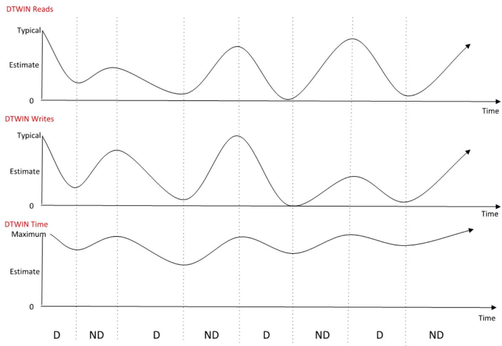

An NVM Set may transition autonomously to the NDWIN if, since entry to the current DTWIN: 

a) the number of reads is greater than the value indicated in the DTWIN Reads Typical field; 

b) the number of writes is greater than the value indicated in the DTWIN Writes Typical field; 

c) the amount of time indicated in the DTWIN Time Maximum field has passed; or 

d) a Deterministic Excursion occurs. 

Figure 630 is an example that shows the relationship between the typical and reliable estimate values for DTWIN Reads. DTWIN Reads Reliable Estimate begins near the DTWIN Reads Typical value at the start of the current DTWIN at time 0. During the first time increment, the host reads x units, and the value of the reliable estimate at time t2 is decremented by approximately x. During the second time increment, the host reads a smaller amount consisting of y units and thus the reliable estimate at t3 is decremented by approximately y. 

Figure 630: Typical and Reliable Estimate Example

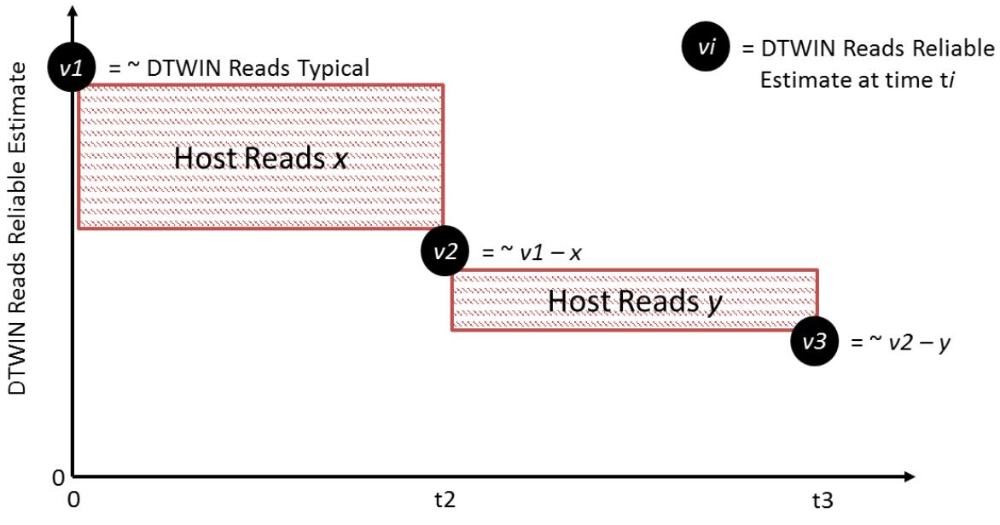

Time in Current Deterministic Window

The host configures the current window to be either DTWIN or NDWIN using a Set Features command with the Predictable Latency Mode Window Feature. The host may use the reliable estimates provided in the Predictable Latency Mode log page to ensure that the host transitions the NVM Set to the NDWIN prior to any reliable estimates exceeding one of the typical or maximum values (e.g., DTWIN Reads Estimate $= 0$ ). 

The reliable estimates provided shall have the following properties when in the Deterministic Window: 

The estimates shall be monotonically decreasing towards 0h for the entirety of the DTWIN, depending on the attribute. For example, DTWIN Reads Reliable Estimate is monotonically decreasing and thus does not increase without transitioning from the DTWIN to the NDWIN; and 

• The estimates shall not change abruptly unless operating conditions have changed abruptly. The estimate should be based on averaging or smoothing of data collected over some period of time. 

# Configuring Periodic Windows

When using the NVM Set in Predictable Latency Mode, the host should transition the controller to NDWIN for periodic maintenance. The maintenance is required in order for the NVM subsystem to reliably provide the amount of time indicated for Deterministic Windows. 

There are three static time based parameters reported in the Predictable Latency Per NVM Set log page (refer to section 5.1.12.1.11) that may be used by the host to configure periodic windows. The values provided are worst-case for the life of the NVM subsystem: 

NDWIN Time Minimum Low is the minimum time that the NVM Set remains in the Non-Deterministic Window. The controller may delay completion of a Set Features command requesting a transition to the Deterministic Window until this time is completed. This time does not account for additional host activity in the Non-Deterministic Window; 

NDWIN Time Minimum High is the minimum time that the host should allow the NVM Set to remain in the Non-Deterministic Window after the NVM Set remained in the previous Deterministic Window for DTWIN Time Maximum. This time does not account for additional host activity in the Non-Deterministic Window; and 

• DTWIN Time Maximum is the maximum time that the NVM Set is able to stay in a Deterministic Window. 

The DTWIN Time Maximum and NDWIN Time Minimum High may provide a ratio of the amount of maintenance that needs to be performed based on the time that the NVM Set remains in the DTWIN, assuming no threshold is exceeded. Any scaling of the time in the Non-Deterministic Window based on the read, write, and time behavior in the previous Deterministic Window is implementation dependent. 

The DTWIN Time Estimate may be used by the host when a Deterministic Excursion has occurred. This estimate allows the host to re-synchronize an NVM Set with other NVM Sets operating in Predictable Latency Mode, if applicable. 

# Configuring and Managing Events

The host may configure events to be triggered when thresholds do not exceed certain levels or when autonomous transitions occur using the Predictable Latency Mode Feature. The host submits a Set Feature command for the particular NVM Set and configures the specific event(s) and threshold(s) values that shall trigger a Predictable Latency Event Aggregate Log Change Notice event for that particular NVM Set to the host. Refer to Figure 404. 

The host determines the NVM Sets that have outstanding events by reading the Predictable Latency Event Aggregate log page (refer to section 5.1.12.1.12). An entry is returned for each NVM Set that has an event outstanding. The host may use the NVM Set Identifier Maximum value reported in the Identify Controller data structure in order to determine the maximum size of this log page. 

To determine the specific event(s) that have occurred for a reported NVM Sets, the host reads the Predictable Latency Per NVM Set log page (refer to section 5.1.12.1.11) for that NVM Set. The Event Type field indicates the event(s) that have occurred (e.g., an autonomous transition to the NDWIN). An event(s) for a particular NVM Set is cleared if the controller successfully processes a read for the Predictable Latency Per NVM Set log page for the affected NVM Set where the Get Log Page command has the Retain Asynchronous Event parameter cleared to ‘0’. If the Event Type field in the Predictable Latency Per NVM Set log page is cleared to 0h, then events for that particular NVM Set are not reported in the Predictable Latency Event Aggregate log page. 

# Reachability Reporting architecture

# Reachability Reporting overview

For some operations that specify multiple namespaces it is necessary to indicate what namespaces are able to be used in those operations (e.g., Copy command that specifies multiple namespaces, Execute command in the Computational Programs command set). This ability is called reachability. Reachability is defined at the controller level (i.e., only namespaces attached to the same controller are reachable). 

A Reachability Group becomes available to a controller if: 

a) a namespace becomes attached to that controller and that namespace is associated with a Reachability Group that did not currently have any namespaces attached to that controller; or 

b) a configuration change in an NVM subsystem changes the membership in a Reachability Group (e.g., a new Reachability Group is present in the Reachability Groups log page (refer to section 5.1.12.1.25)). 

A Reachability Group becomes unavailable to a controller if a namespace is detached that is the only namespace attached to that controller for that Reachability Group (i.e., a Reachability Group that was present in the Reachability Groups log page is no longer present). 

A Reachability Association change occurs if a Reachability Group that is associated with that Reachability Association becomes available or unavailable to that controller. (e.g., a new Reachability Association is present in the Reachability Associations log page (refer to section 5.1.12.1.26) or a Reachability Association that was present in the Reachability Associations log page is no longer present). 

If an NVM subsystem supports Reachability Reporting, then all controllers in that NVM subsystem shall: 

set the RRSUP bit to ‘1’ in the Controller Reachability Capabilities (CRCAP) field in the Identify Controller data structure (refer to Figure 312) to indicate support for Reachability Reporting; 

• support Reachability Groups Change Notices (refer to section 5.1.25.1.5); 

• support Reachability Association Change Notices (refer to section 5.1.25.1.5); 

support the Reachability Groups log page; and 

• support the Reachability Associations log page. 

Namespaces attached to a controller in an NVM subsystem that supports Reachability Reporting shall: 

• be members of a Reachability Group; and 

supply a valid Reachability Group Identifier in the Reachability Group Identifier (RGRPID) field in the I/O Command Set Independent Identify Namespace Data Structure (refer to Figure 319). 

Reachability and characteristics of reachability are indicated in the combination of the Reachability Groups log page (refer to section 5.1.12.1.25) and the Reachability Associations log page (refer to section 5.1.12.1.26). A Reachability Group defines a group of namespaces that are all associated with namespaces in other Reachability Groups defined by a Reachability Association. The method of assigning Reachability Group identifiers and Reachability Association identifiers is outside the scope of this specification. If members of a Reachability Group are able to reach members of that Reachability Group, then a Reachability Association that contains only that Reachability Group specifies the characteristics of that reachability. All Reachability Groups in a Reachability Association have identical access characteristics. All namespaces in a Reachability Group have identical access characteristics. If a Reachability Group is not in any Reachability Association then the members of that Reachability Group are not reachable by any other namespaces, including the members of that Reachability Group. A namespace is always able to reach itself (i.e., a command that has two or more NSIDs as part of the command where those NSIDs are all the same is not constrained by reachability). 

If the Reachability Association Characteristics field (refer to Figure 278) is set to is 01h, then all namespaces in the associated Reachability Groups are able to reach other namespaces in the other Reachability Groups in that Reachability Association without any indication of a performance characteristic (e.g., for the Execute command in the Computational Programs Command Set). If the Reachability Association Characteristics field is set to 02h, then all namespaces in the associated Reachability Groups are reachable and support fast copy operations as defined by the applicable I/O Command Set specification (e.g., the Fast copy operations section in the NVM Command Set Specification). If the Reachability Association Characteristics field is set to 03h, then all namespaces in the associated Reachability Groups are reachable but do not support fast copy operations. 

A namespace is only allowed to be in one Reachability Group. A Reachability Group is in zero or more Reachability Associations with different values of the Reachability Association Characteristics field for each Reachability Association. 

The Reachability Group Identifier (RGRPID) for each Reachability Group shall be unique within the NVM subsystem. If RGIDC bit in the CRCAP field in the Identify Controller data structure is set to ‘1’, then the Reachability Group Identifier shall not change while the namespace is attached to any controller in the NVM subsystem. If RGIDC bit in the CRCAP field is cleared to $ { \mathbf { \vec { \mathbf { \rho } } } } _ { 0 } ,$ , then the Reachability Group Identifier may change while the namespace is attached to any controller in the NVM subsystem. If the Reachability Group Identifier changes, the controller shall issue the Reachability Groups Change Notice as described in this section. 

Figure 631 is an example configuration that shows that: 

• Reachability Association 1 (i.e., RA 1): 

o specifies that: 

▪ NSID 10 and NSID 30 are able to reach each other; and 

▪ NSID 10 and NSID 31 are able to reach each other; 

and 

o does not specify any reachability between NSID 30 and NSID 31; 

Reachability Association 2 (i.e., RA 2) is a self-reference for Reachability Group A (i.e., RG A) that specifies: 

o that NSID 30 and NSID 31 are able to reach each other; 

• Reachability Association 3 (i.e., RA 3): 

o specifies that: 

▪ NSID 11 and NSID 30 are able to reach each other; and 

▪ NSID 11 and NSID 31 are able to reach each other; 

and 

o does not specify any reachability between NSID 30 and NSID 31; 

The lack of a Reachability Association that contains Reachability Group B (i.e., RG B) and Reachability Group D (i.e., RG D) specifies: 

o that NSID 10 and NSID 11 are not able to reach each other; 

The lack of a self-referencing Reachability Association for Reachability Group E (i.e., RG E) specifies: 

o that NSID 22 and NSID 23 are not able to reach each other. 

Figure 631: Reachability Associations Example

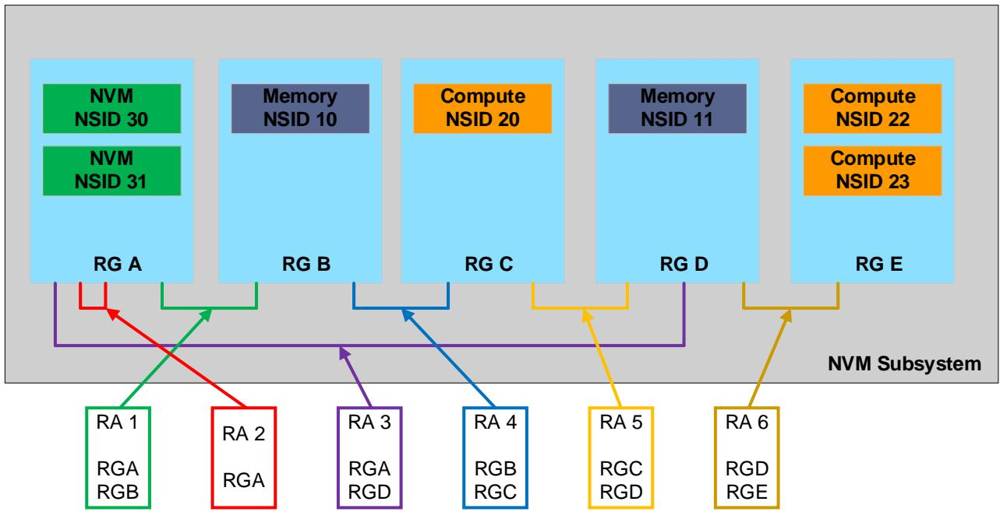

# Reachability event notifications

Reachability may generate a Reachability Group Change notice (refer to section 5.1.2.1) or a Reachability Association Change notice (refer to section 5.1.2.1). 

Receipt of a Reachability Group Change Notice from a controller may indicate: 

a) an NSID has been added to one or more of the Reachability Group Descriptors; 

b) an NSID has been removed from one or more of the Reachability Group Descriptors; 

c) a Reachability Group no longer has any NSIDs attached to this controller as members of that Reachability Group and therefore is no longer reported in the Reachability Groups log page for this controller; or 

d) the NSID of a namespace has moved from one Reachability Group Descriptor to a different Reachability Group Descriptor (i.e., the RGRPID field in the I/O Command Set Independent Identify 

Namespace Data Structure for that namespace has changed), if RGIDC bit in the CRCAP field is cleared to $\mathbf { \vec { \mathbf { \rho } } } ^ { 0 }$ in the Identify Controller data structure (refer to Figure 312). 

As a result of receiving a Reachability Group Change notice, the host should read the Reachability Groups log page (refer to section 5.1.12.1.25) to check for each of those possible changes. 

Receipt of a Reachability Association Change Notice from a controller may indicate: 

a) an RGID has been added to one or more of the Reachability Association Descriptors; 

b) an RGID has been removed from one or more of the Reachability Association Descriptors; and/or 

c) a Reachability Association no longer has any RGIDs associated with this controller as members of that Reachability Association and therefore is no longer reported in the Reachability Associations log page for this controller. 

As a result of receiving a Reachability Association Change notice, the host should read the Reachability Associations log page (refer to section 5.1.12.1.26) to check for each of those possible changes. 

# Read Recovery Level

The Read Recovery Level (RRL) is an NVM Set configurable attribute that balances the completion time for read commands and the amount of error recovery applied to those read commands. The Read Recovery Level applies to an NVM Set with which the Read Recovery Level is associated. A namespace created within an NVM Set inherits the Read Recovery Level of that NVM Set. If NVM Sets are not supported, all namespaces in the NVM subsystem use an identical Read Recovery Level. 

The controller indicates support for Read Recovery Levels in the Controller Attributes field in the Identify Controller data structure (refer to Figure 312). If Read Recovery Levels are supported, then the specific levels supported are indicated in the Read Recovery Levels Supported field in the Identify Controller data structure. There are 16 levels that may be supported. Level 0, if supported, provides the maximum amount of recovery. Level 4 is a mandatory level that provides a nominal amount of recovery and is the default level. Level 15 is a mandatory level that provides the minimum amount of recovery and is referred to as the ‘Fast Fail’ level. The levels are organized based on the amount of recovery supported, such that a higher numbered level provides less recovery than the preceding lower level. 

Interactions between the Read Recovery Level and the Limited Retry (LR) field in I/O commands are implementation specific. 

The Read Recovery Level may be configured using a Set Features command for the Read Recovery Level Config Feature. The Read Recovery Level may be determined using a Get Features command for the Read Recovery Level Config Feature. 

Figure 632: Read Recovery Level Overview 

<table><tr><td>Level</td><td>O/M</td><td>Definition</td></tr><tr><td>0</td><td>O</td><td></td></tr><tr><td>1</td><td>O</td><td></td></tr><tr><td>2</td><td>O</td><td></td></tr><tr><td>3</td><td>O</td><td></td></tr><tr><td>4</td><td>M</td><td>Default</td></tr><tr><td>5</td><td>O</td><td></td></tr><tr><td>6</td><td>O</td><td></td></tr><tr><td>7</td><td>O</td><td></td></tr><tr><td>8</td><td>O</td><td></td></tr><tr><td>9</td><td>O</td><td></td></tr><tr><td>10</td><td>O</td><td></td></tr><tr><td>11</td><td>O</td><td></td></tr><tr><td>12</td><td>O</td><td></td></tr><tr><td>13</td><td>O</td><td></td></tr><tr><td>14</td><td>O</td><td></td></tr><tr><td>15</td><td>M</td><td>Fast Fail</td></tr></table>

If Read Recovery Levels are supported, then the NVM subsystem and all controllers shall: 

Support at least Level 4 and Level 15; 

Indicate support for Read Recovery Levels in the Controller Attributes field in the Identify Controller data structure; 

• Support the Read Recovery Levels Supported field in the Identify Controller data structure; and 

• Support the Read Recovery Level Config Feature. 

# Replay Protected Memory Block

The Replay Protected Memory Block (RPMB) provides a means for the system to store data to a specific memory area in an authenticated and replay protected manner. This is provided by first programming authentication key information to the controller that is used as a shared secret. The system is not authenticated in this phase, therefore the authentication key programming should be done in a secure environment (e.g., as part of the manufacturing process). The authentication key is utilized to sign the read and write accesses made to the replay protected memory area with a Message Authentication Code (MAC). Use of random number (nonce) generation and a write count property provide additional protection against replay of messages where messages could be recorded and played back later by an attacker. 

Any attempt to access the replay protected memory area prior to the Authentication Key being programmed results in an RPMB Operation Result Operation Status field set to 07h (i.e., Authentication Key not yet 

programmed) (refer to Figure 635). Once the key is programmed, the RPMB Operation Result Operation Status field shall not be set to 07h. 

An Authenticated Data Write to the RPMB Device Configuration Block data structure that attempts to set the Boot Partition Write Protection Enabled bit when RPMB Boot Partition Write Protection is not supported results in an RPMB Operation Result Operation Status of 05h (i.e., Write failure in the RPMB Operation Status field) (refer to Figure 635). 

An Authenticated Data Write to the RPMB Device Configuration Block data structure that attempts to set the Boot Partition Write Protection Enabled bit when either Boot Partition is in the Write Locked Until Power Cycle state (refer to section 5.1.25.1.32 and section 8.1.3.3.1) results in an RPMB Operation Result Operation Status of 05h (i.e., Write failure in the RPMB Operation Status field) (refer to Figure 635). 

An Authenticated Data Write to the RPMB Device Configuration Block data structure that attempts to change either the Boot Partition 0 Write Locked bit or the Boot Partition 1 Write Locked bit when the Boot Partition Write Protection Enabled bit is cleared to $ { \mathbf { \vec { \mathbf { \rho } } } } _ { 0 } ,$ results in an RPMB Operation Result Operation Status field set to 05h (i.e., Write failure) (refer to Figure 635). 

If Set Features Boot Partition Write Protection is supported, then an Authenticated Data Write to the RPMB Device Configuration Block data structure that successfully enables RPMB Boot Partition Write Protection shall also result in the controller changing the Boot Partition 0 Write Protection State and Boot Partition 1 Write Protection State values in the Boot Partition Write Protection Config feature to a value of 100b to indicate that Boot Partition write protection is controlled by RPMB. 

The controller may support multiple RPMB targets. RPMB targets are not contained within a namespace. Controllers in the NVM subsystem may share the same RPMB targets. Security Send and Security Receive commands for RPMB do not use the namespace ID field; NSID shall be cleared to 0h. Each RPMB target operates independently – there may be requests outstanding to multiple RPMB targets at once (where the requests may be interleaved between RPMB targets). In order to guarantee ordering the host should issue and wait for completion for one Security Send or Security Receive command at a time. Each RPMB target requires individual authentication and key programming. Each RPMB target may have its own unique Authentication Key. 

The message types defined in Figure 634 are used by the host to communicate with an RPMB target. Request Message Types are sent from the host to the controller using Security Send commands. Response Message Types are retrieved by the host from the controller using Security Receive commands. 

Figure 633 defines the RPMB Device Configuration Block data structure – the non-volatile contents stored within the controller for RPMB target 0. 

Figure 633: RPMB Device Configuration Block Data Structure

<table><tr><td>Bytes</td><td>Type</td><td>Description</td><td></td></tr><tr><td rowspan="4">00</td><td rowspan="4">RW</td><td>Boot Partition Protection Enable (BPPEE): This field specifies whether Boot Partition Protection is enabled.</td><td></td></tr><tr><td>Bits</td><td>Description</td></tr><tr><td>7:1</td><td>Reserved</td></tr><tr><td>0</td><td>Boot Partition Write Protection Enabled (BPPED): If this bit is set to ‘1’, then RPMB Boot Partition Write Protection is enabled. If this bit is cleared to ‘0’, then RPMB Boot Partition Write Protection is disabled or not supported. Once enabled, the controller shall prevent disabling RPMB Boot Partition Write Protection.</td></tr><tr><td rowspan="4">01</td><td rowspan="4">RW</td><td>Boot Partition Protection State (BPLS): This field specifies the current Boot Partition protection state when RPMB Boot Partition Write Protection is enabled. This field shall be cleared to 0h unless RPMB Boot Partition Write Protection is enabled. Refer to section 8.1.3.3.</td><td></td></tr><tr><td>Bits</td><td>Description</td></tr><tr><td>7:2</td><td>Reserved</td></tr><tr><td>1</td><td>Boot Partition 1 Write Locked (BPP1L): If this bit is set to ‘1’, then Boot Partition 1 (i.e., the BPID bit in Figure 181 is set to 1) is write locked. If this bit is cleared to ‘0’, then the Boot Partition 1 is write unlocked.</td></tr></table>

Figure 633: RPMB Device Configuration Block Data Structure

<table><tr><td>Bytes</td><td>Type</td><td colspan="2">Description</td></tr><tr><td></td><td></td><td>0</td><td>Boot Partition 0 Write Locked (BPP0L): If this bit is set to ‘1’, then Boot Partition 0 (i.e., the BPID bit in Figure 181 is cleared to 0) is write locked. If this bit is cleared to ‘0’, then the Boot Partition 0 is write unlocked.</td></tr><tr><td rowspan="5">02</td><td rowspan="5">RW</td><td colspan="2">Write Protection Control (WPC): This field specifies whether the controller processes or aborts Set Features commands which enable certain namespace write protection states (refer to section 8.1.16 and section 5.1.25.1.31). If the controller does not support Namespace Write Protection, then this field shall be cleared to 0h.</td></tr><tr><td>Bits</td><td>Description</td></tr><tr><td>7:2</td><td>Reserved</td></tr><tr><td>1</td><td>Permanent Write Protect Control (PWPC): This bit cleared to ‘0’ specifies that the controller shall fail a Set Features command which attempts to set the namespace write protection state to Permanent Write Protect, as defined in section 8.1.16. This bit set to ‘1’ specifies that the controller shall process a Set Features command which attempts to set the namespace write protection state to Permanent Write Protect. If the controller supports Namespace Write Protection, then this bit shall be cleared to ‘0’ after a power cycle or a Controller Level Reset.</td></tr><tr><td>0</td><td>Write Protect Until Power Cycle Control (WPUPCC): This bit cleared to ‘0’ specifies that the controller shall fail a Set Features command which attempts to set the namespace write protection state to Write Protect Until Power Cycle, as defined in section 8.1.16. This bit set to ‘1’ specifies that the controller shall process a Set Features command which sets the namespace write protection state to Write Protect Until Power Cycle. If the controller supports Namespace Write Protection, then this bit shall be cleared to ‘0’ after a power cycle or a Controller Level Reset.</td></tr><tr><td>511:03</td><td></td><td colspan="2">Reserved</td></tr></table>

Figure 634: RPMB Request and Response Message Types

<table><tr><td colspan="2">Request Message Types</td><td>Description</td><td>Requires Data</td><td>RPMB Frame Length (bytes)</td></tr><tr><td>0001h</td><td>Authentication key programming request</td><td>The host is attempting to program the Authentication Key for the selected RPMB target to the controller.</td><td>No</td><td>256</td></tr><tr><td>0002h</td><td>Reading of the Write Counter value request</td><td>The host is requesting to read the current Write Counter value from the selected RPMB target.</td><td>No</td><td>256</td></tr><tr><td>0003h</td><td>Authentication data write request</td><td>The host is attempting to write data to the selected RPMB target.</td><td>Yes</td><td>M + 256</td></tr><tr><td>0004h</td><td>Authentication data read request</td><td>The host is attempting to read data from the selected RPMB target.</td><td>No</td><td>256</td></tr><tr><td>0005h</td><td>Result read request</td><td>The host is attempting to read the result code for any of the other Message Types.</td><td>No</td><td>256</td></tr><tr><td>0006h</td><td>Authentication Device Configuration Block write request</td><td>The host is attempting to write Device Configuration Block (DCB) to the selected RPMB target. This request message type is only valid for RPMB target 0.</td><td>Yes</td><td>512 + 256</td></tr><tr><td>0007h</td><td>Authentication Device Configuration Block read request</td><td>The host is attempting to read Device Configuration Block (DCB) from the selected RPMB target. This request message type is only valid for RPMB target 0.</td><td>No</td><td>256</td></tr><tr><td>0100h</td><td>Authentication key programming response</td><td>Returned as a result of the host requesting a Result read request Message Type after programming the Authentication Key.</td><td>No</td><td>256</td></tr></table>

Figure 634: RPMB Request and Response Message Types

<table><tr><td colspan="2">Request Message Types</td><td>Description</td><td>Requires Data</td><td>RPMB Frame Length (bytes)</td></tr><tr><td>0200h</td><td>Reading of the Write Counter value response</td><td>Returned as a result of the host requesting a Result read request Message Type after requesting the Write Counter value.</td><td>No</td><td>256</td></tr><tr><td>0300h</td><td>Authentication data write response</td><td>Returned as a result of the host requesting a Result read request Message Type after attempting to write data to an RPMB target.</td><td>No</td><td>256</td></tr><tr><td>0400h</td><td>Authentication data read response</td><td>Returned as a result of the host requesting a Result read request Message Type after attempting to read data from an RPMB target.</td><td>Yes</td><td>M + 256</td></tr><tr><td>0600h</td><td>Authentication Device Configuration data write response</td><td>Returned as a result of the host requesting a Result read request Message Type after attempting to write a Device Configuration Block to an RPMB target.</td><td>No</td><td>256</td></tr><tr><td>0700h</td><td>Authentication Device Configuration data read response</td><td>Returned as a result of the host requesting a Result read request Message Type after attempting to read DCB from an RPMB target.</td><td>Yes</td><td>512 + 256</td></tr></table>

The operation result defined in Figure 635 indicates whether an RPMB request was successful or not. 

Figure 635: RPMB Operation Result

<table><tr><td>Bits</td><td colspan="2">Description</td></tr><tr><td>15:08</td><td colspan="2">Reserved</td></tr><tr><td>07</td><td colspan="2">Write Counter Status (WCS): Indicates if the Write Counter has expired (i.e., reached its maximum value). A value of ‘1’ indicates that the Write Counter has expired. A value of ‘0’ indicates a valid Write Counter.</td></tr><tr><td rowspan="12">06:00</td><td colspan="2">Operation Status (OPSTAT): Indicates the operation status. Valid operation status values are listed below.</td></tr><tr><td>Value</td><td>Definition</td></tr><tr><td>00h</td><td>Operation successful</td></tr><tr><td>01h</td><td>General failure</td></tr><tr><td>02h</td><td>Authentication failure (MAC comparison not matching, MAC calculation failure)</td></tr><tr><td>03h</td><td>Counter failure (counters not matching in comparison, counter incrementing failure)</td></tr><tr><td>04h</td><td>Address failure (address out of range, wrong address alignment)</td></tr><tr><td>05h</td><td>Write failure (data/counter/result write failure)</td></tr><tr><td>06h</td><td>Read failure (data/counter/result read failure)</td></tr><tr><td>07h</td><td>Authentication Key not yet programmed</td></tr><tr><td>08h</td><td>Invalid RPMB Device Configuration Block – this may be used when the target is not 0h.</td></tr><tr><td>09 to 3Fh</td><td>Reserved</td></tr></table>

Figure 636 defines the non-volatile contents stored within the controller for each RPMB target. 

Figure 636: RPMB Contents

<table><tr><td>Content</td><td>Type</td><td>Size</td><td>Description</td></tr><tr><td>Authentication Key</td><td>Write once, not erasable or readable</td><td>Size is dependent on authentication method reported in Identify Controller data structure (e.g., SHA-256 is 32 bytes (refer to RFC 6234))</td><td>Authentication key which is used to authenticate accesses when MAC is calculated.</td></tr></table>

Figure 636: RPMB Contents

<table><tr><td>Content</td><td>Type</td><td>Size</td><td>Description</td></tr><tr><td>Write Counter</td><td>Read only</td><td>4 bytes</td><td>Counter value for the total amount of successful authenticated data write requests made by the host. The initial value of this property after manufacture is 00000000h. The value is incremented by one automatically by the controller with each successful programming access. The value is not resettable. After the counter has reached the maximum value of FFFFFFFh, the controller shall no longer increment to prevent overflow.</td></tr><tr><td>RPMB Data Area</td><td>Readable and writeable, not erasable</td><td>Size is reported in Identify Controller data structure (128 KiB minimum, 32 MiB maximum)</td><td>Data that is able to be read and written only via successfully authenticated read/write access.</td></tr></table>

Each RPMB Data Frame is 256 bytes in size plus the size of the Data field, and is organized as shown in Figure 637. RPMB uses a sector size of 512 bytes. The RPMB sector size is independent and not related to the user data size used for the namespace(s). 

Figure 637: RPMB Data Frame

<table><tr><td>Bytes</td><td>Description</td></tr><tr><td>222-N:00</td><td>Stuff Bytes (STBY): Padding for the frame. Values in this field are not part of the MAC calculation. The size is 223 bytes minus the size of the Authentication Key (N).</td></tr><tr><td>222:222-(N-1)</td><td>Message Authentication Code / Authentication Key (MAC/Key): Size is dependent on authentication method reported in the Identify Controller data structure (e.g., SHA-256 key is 32 bytes (refer to RFC 6234)).</td></tr><tr><td>223</td><td>RPMB Target (RBT): Indicates which RPMB this Request/Response is targeted for. Values 0-6 are supported. If the value in this field is not equal to the NVMe Security Specific Field (NSSF) in the Security Send or Security Receive command, then the controller shall return an error of Invalid Field in Command for the Security Send or Security Receive command.</td></tr><tr><td>239:224</td><td>Nonce (NCE): Random number generated by the host for the requests and copied to the response by the RPMB target.</td></tr><tr><td>243:240</td><td>Write Counter (WCNTR): Total amount of successfully authenticated data write requests.</td></tr><tr><td>247:244</td><td>Address (ADDR): Starting address of data to be programmed to or read from the RPMB.</td></tr><tr><td>251:248</td><td>Sector Count (SCNT): Number of sectors (512 bytes) requested to be read or written.</td></tr><tr><td>253:252</td><td>Result (RSLT): Defined in Figure 635. Note: The Result field is not needed for Requests.</td></tr><tr><td>255:254</td><td>Request or Response Message (RRM): Defined in Figure 634.</td></tr><tr><td>(M-1)+256:256</td><td>Data (DATA): Data to be written or read by signed access where M = 512 * Sector Count. This field is optional.</td></tr></table>

Security Send and Security Receive commands are used to encapsulate and deliver data packets of any security protocol between the host and controller without interpreting, dis-assembling or re-assembling the data packets for delivery. Security Send and Security Receive commands used for RPMB access are populated with the RPMB Data Frame(s) defined in Figure 637. The controller shall not return successful completion of a Security Send or Security Receive command for RPMB access until the requested RPMB Request/Response Message Type indicated is completed. The Security Protocol used for RPMB is defined in section 5.1.23.3. 

# Authentication Method

A controller supports one Authentication Method as indicated in the Identify Controller data structure. 

If the Authentication Method supported is HMAC SHA-256 (refer to RFC 6234), then the message authentication code (MAC) is calculated using HMAC SHA-256 as defined in RFC 6234. The key used to 

generate a MAC using HMAC SHA-256 is the 256-bit Authentication Key stored in the controller for the selected RPMB target. The HMAC SHA-256 calculation takes as input a key and a message. Input to the MAC calculation is the concatenation of the fields in the RPMB Data Frame (request or response) excluding stuff bytes and the MAC itself – i.e., bytes [223:255] and Data of the frame in that order. 

# RPMB Operations

The host sends a Request Message Type to the controller to request an operation by the controller or to deliver data to be written into the RPMB memory block. To deliver a Request Message Type, the host uses the Security Send command. If the data to be delivered to the controller is more than reported in Identify Controller data structure, the host sends multiple Security Send commands to transfer the entire data. 

The host sends a Response Message Type to the controller to read the result of a previous operation request, to read the Write Counter, or to read data from the RPMB memory block. To deliver a Response Message Type, the host uses the Security Receive command. If the data to be read from the controller is more than reported in Identify Controller data structure, the host sends multiple Security Receive commands to transfer the entire data. 

# 8.1.21.2.1 Authentication Key Programming

Authentication Key programming is initiated by a Security Send command to program the Authentication Key to the specified RPMB target, followed by a subsequent Security Send command to request the result, and lastly, the host issues a Security Receive command to retrieve the result. 

Figure 638: RPMB – Authentication Key Data Flow

<table><tr><td>Command</td><td>Bytes in Command</td><td>Field Name</td><td>Value</td><td>Objective</td></tr><tr><td rowspan="10">Security Send 1</td><td colspan="3">Data populated by the host and sent to the controller</td><td rowspan="10">Send Authentication Key to be Programmed to the controller</td></tr><tr><td>222-N:00</td><td>Stuff Bytes</td><td>0...00h</td></tr><tr><td>222:222-(N-1)</td><td>MAC/Key</td><td>Key to be programmed</td></tr><tr><td>223</td><td>RPMB Target</td><td>RPMB target to access</td></tr><tr><td>239:224</td><td>Nonce</td><td>0...00h</td></tr><tr><td>243:240</td><td>Write Counter</td><td>00000000h</td></tr><tr><td>247:244</td><td>Address</td><td>00000000h</td></tr><tr><td>251:248</td><td>Sector Count</td><td>00000000h</td></tr><tr><td>253:252</td><td>Result</td><td>0000h</td></tr><tr><td>255:254</td><td>Request/Response</td><td>0001h (Request)</td></tr><tr><td rowspan="10">Security Send 2</td><td colspan="3">Data populated by the host and sent to the controller</td><td rowspan="10">Request Result of Key Programming</td></tr><tr><td>222-N:00</td><td>Stuff Bytes</td><td>0...00h</td></tr><tr><td>222:222-(N-1)</td><td>MAC/Key</td><td>0...00h</td></tr><tr><td>223</td><td>RPMB Target</td><td>RPMB target to access</td></tr><tr><td>239:224</td><td>Nonce</td><td>0...00h</td></tr><tr><td>243:240</td><td>Write Counter</td><td>00000000h</td></tr><tr><td>247:244</td><td>Address</td><td>00000000h</td></tr><tr><td>251:24B</td><td>Sector Count</td><td>00000000h</td></tr><tr><td>253:252</td><td>Result</td><td>0000h</td></tr><tr><td>255:254</td><td>Request/Response</td><td>0005h (Request)</td></tr><tr><td rowspan="7">Security Receive 1</td><td colspan="3">Data populated by the controller and returned to the host</td><td rowspan="7">Retrieve the Key Programming Result</td></tr><tr><td>222-N:00</td><td>Stuff Bytes</td><td>0...00h</td></tr><tr><td>222:222-(N-1)</td><td>MAC/Key</td><td>0...00h</td></tr><tr><td>223</td><td>RPMB Target</td><td>RPMB target response was sent from</td></tr><tr><td>239:224</td><td>Nonce</td><td>0...00h</td></tr><tr><td>243:240</td><td>Write Counter</td><td>00000000h</td></tr><tr><td>247:244</td><td>Address</td><td>00000000h</td></tr></table>

Figure 638: RPMB – Authentication Key Data Flow

<table><tr><td>Command</td><td>Bytes in Command</td><td>Field Name</td><td>Value</td><td>Objective</td></tr><tr><td rowspan="3"></td><td>251:248</td><td>Sector Count</td><td>00000000h</td><td rowspan="3"></td></tr><tr><td>253:252</td><td>Result</td><td>Result Code</td></tr><tr><td>255:254</td><td>Request/Response</td><td>0100h (Response)</td></tr></table>

# 8.1.21.2.2 Read Write Counter Value

The Read Write Counter Value sequence is initiated by a Security Send command to request the Write Counter value, followed by a Security Receive command to retrieve the Write Counter result. 

Figure 639: RPMB – Read Write Counter Value Flow

<table><tr><td>Command</td><td>Bytes in Command</td><td>Field Name</td><td>Value</td><td>Objective</td></tr><tr><td rowspan="10">Security Send 1</td><td colspan="3">Data populated by the host and sent to the controller</td><td rowspan="10">Request Write Counter Read</td></tr><tr><td>222-N:00</td><td>Stuff Bytes</td><td>0...00h</td></tr><tr><td>222:222-(N-1)</td><td>MAC/Key</td><td>0...00h</td></tr><tr><td>223</td><td>RPMB Target</td><td>RPMB target to access</td></tr><tr><td>239:224</td><td>Nonce</td><td>Nonce generated by the host</td></tr><tr><td>243:240</td><td>Write Counter</td><td>00000000h</td></tr><tr><td>247:244</td><td>Address</td><td>00000000h</td></tr><tr><td>251:248</td><td>Sector Count</td><td>00000000h</td></tr><tr><td>253:252</td><td>Result</td><td>0000h</td></tr><tr><td>255:254</td><td>Request/Response</td><td>0002h (Request)</td></tr><tr><td rowspan="10">Security Receive 1</td><td colspan="3">Data populated by the controller and returned to the host</td><td rowspan="10">Retrieve Write Counter Result</td></tr><tr><td>222-N:00</td><td>Stuff Bytes</td><td>0...00h</td></tr><tr><td>222:222-(N-1)</td><td>MAC/Key</td><td>MAC generated by the controller</td></tr><tr><td>223</td><td>RPMB Target</td><td>RPMB target response was sent from</td></tr><tr><td>239:224</td><td>Nonce</td><td>Copy of the Nonce generated by the host</td></tr><tr><td>243:240</td><td>Write Counter</td><td>Current Write Counter value</td></tr><tr><td>247:244</td><td>Address</td><td>00000000h</td></tr><tr><td>251:248</td><td>Sector Count</td><td>00000000h</td></tr><tr><td>253:252</td><td>Result</td><td>Result Code</td></tr><tr><td>255:254</td><td>Request/Response</td><td>0200h (Response)</td></tr></table>

# 8.1.21.2.3 Authenticated Data Write

The Authenticated Data Write is initiated by a Security Send command. The RPMB Data Frame delivered from the host to the controller includes the Request Message Type $=$ 0003h, Block Count, Address, Write Counter, Data and MAC. 

When the controller receives this RPMB Data Frame, that controller first checks whether the Write Counter has expired. If the Write Counter has expired, then that controller sets the RPMB Operation Result to 0085h (write failure, write counter expired) and no data is written to the RPMB data area. 

After checking the Write Counter is not expired, the Address is checked. If there is an error in the Address (e.g., out of range), then the result is set to 0004h (address failure) and no data is written to the RPMB data area. 

After checking the Address is valid, the controller calculates the MAC (refer to section 8.1.21.1) and compares this with the MAC in the request. If the MAC in the request and the calculated MAC are different, then the controller sets the result to 0002h (authentication failure) and no data is written to the RPMB data area. 

If the MAC in the request and the calculated MAC are equal, then the controller compares the Write Counter in the request with the Write Counter stored in the controller. If the counters are different, then the controller sets the result to 0003h (counter failure) and no data is written to the RPMB data area. 

If the MAC and Write Counter comparisons are successful, then the write request is authenticated. The Data from the request is written to the Address indicated in the request and the Write Counter is incremented by one. 

If the write fails, then the returned result is 0005h (write failure). If another error occurs during the write procedure, then the returned result is 0001h (general failure). 

The controller returns a successful completion for the Security Send command when the Authenticated Data Write operation is completed regardless of whether the Authenticated Data Write was successful or not. 

The success of programming the data should be checked by the host by reading the result property of the RPMB: 

1) The host initiates the Authenticated Data Write verification process by issuing a Security Send command with delivery of a RPMB data frame containing the Request Message Type $= 0 0 0 5 \mathsf { h }$ ; 

2) The controller returns a successful completion of the Security Send command when the verification result is ready for retrieval; 

3) The host should then retrieve the verification result by issuing a Security Receive command; and 

4) The controller returns a successful completion of the Security Receive command and returns the RPMB data frame containing the Response Message Type $= 0 3 0 0 \mathsf { h }$ , the incremented counter value, the data address, the MAC and result of the data programming operation. 

Figure 640: RPMB – Authenticated Data Write Flow

<table><tr><td>Command</td><td>Bytes in Command</td><td>Field Name</td><td>Value</td><td>Objective</td></tr><tr><td rowspan="11">Security Send 1</td><td colspan="3">Data populated by the host and sent to the controller</td><td rowspan="11">Program data request</td></tr><tr><td>222-N:00</td><td>Stuff Bytes</td><td>0...00h</td></tr><tr><td>222:222-(N-1)</td><td>MAC/Key</td><td>MAC generated by the host</td></tr><tr><td>223</td><td>RPMB Target</td><td>RPMB target to access</td></tr><tr><td>239:224</td><td>Nonce</td><td>0...00h</td></tr><tr><td>243:240</td><td>Write Counter</td><td>Current Write Counter value</td></tr><tr><td>247:244</td><td>Address</td><td>Address in the RPMB</td></tr><tr><td>251:248</td><td>Sector Count</td><td>Number of 512B blocks</td></tr><tr><td>253:252</td><td>Result</td><td>0000h</td></tr><tr><td>255:254</td><td>Request/Response</td><td>0003h (Request)</td></tr><tr><td>(M-1)+256:256</td><td>Data</td><td>Data to be written</td></tr><tr><td rowspan="10">Security Send 2</td><td colspan="3">Data populated by the host and sent to the controller</td><td rowspan="10">Request Result of data programming</td></tr><tr><td>222-N:00</td><td>Stuff Bytes</td><td>0...00h</td></tr><tr><td>222:222-(N-1)</td><td>MAC/Key</td><td>0...00h</td></tr><tr><td>223</td><td>RPMB Target</td><td>RPMB target to access</td></tr><tr><td>239:224</td><td>Nonce</td><td>0...00h</td></tr><tr><td>243:240</td><td>Write Counter</td><td>00000000h</td></tr><tr><td>247:244</td><td>Address</td><td>00000000h</td></tr><tr><td>251:248</td><td>Sector Count</td><td>00000000h</td></tr><tr><td>253:252</td><td>Result</td><td>0000h</td></tr><tr><td>255:254</td><td>Request/Response</td><td>0005h (Request)</td></tr><tr><td rowspan="10">Security Receive 1</td><td colspan="3">Data populated by the controller and returned to the host</td><td rowspan="10">Retrieve Result from data programming</td></tr><tr><td>222-N:00</td><td>Stuff Bytes</td><td>0...00h</td></tr><tr><td>222:222-(N-1)</td><td>MAC/Key</td><td>MAC generated by the controller</td></tr><tr><td>223</td><td>RPMB Target</td><td>RPMB target response was sent from</td></tr><tr><td>239:224</td><td>Nonce</td><td>0...00h</td></tr><tr><td>243:240</td><td>Write Counter</td><td>Incremented Write Counter value</td></tr><tr><td>247:244</td><td>Address</td><td>Address in RPMB</td></tr><tr><td>251:248</td><td>Sector Count</td><td>00000000h</td></tr><tr><td>253:252</td><td>Result</td><td>Result Code</td></tr><tr><td>255:254</td><td>Request/Response</td><td>0300h (Response)</td></tr></table>

# 8.1.21.2.4 Authenticated Data Read

The Authenticated Data Read sequence is initiated by a Security Send command. The RPMB data frame delivered from the host to the controller includes the Request Message Type $=$ 0004h, Nonce, Address, and the Sector Count. 

When the controller receives this RPMB Data Frame, that controller first checks the Address. If there is an error in the Address, then the result is set to 0004h (address failure) and the data read is not valid. 

When the host receives a successful completion of the Security Send command from the controller, that host should send a Security Receive command to the controller to retrieve the data. The controller returns an RPMB Data Frame with Response Message Type (0400h), the Sector Count, a copy of the Nonce received in the request, the Address, the Data, the controller calculated MAC, and the Result. Note: It is the responsibility of the host to verify the MAC returned on an Authenticated Data Read Request. 

If the data transfer from the addressed location in the controller fails, the returned Result is 0006h (read failure). If the Address provided in the Security Send command is not valid, then the returned Result is 0004h (address failure). If another error occurs during the read procedure, then the returned Result is 0001h (general failure). 

Figure 641: RPMB – Authenticated Data Read Flow

<table><tr><td>Command</td><td>Bytes in Command</td><td>Field Name</td><td>Value</td><td>Objective</td></tr><tr><td rowspan="10">Security Send 1</td><td colspan="3">Data populated by the host and sent to the controller</td><td rowspan="10">Read Data request</td></tr><tr><td>222-N:00</td><td>Stuff Bytes</td><td>0...00h</td></tr><tr><td>222:222-(N-1)</td><td>MAC/Key</td><td>0...00h</td></tr><tr><td>223</td><td>RPMB Target</td><td>RPMB target to access</td></tr><tr><td>239:224</td><td>Nonce</td><td>Nonce generated by the host</td></tr><tr><td>243:240</td><td>Write Counter</td><td>00000000h</td></tr><tr><td>247:244</td><td>Address</td><td>Address in RPMB</td></tr><tr><td>251:248</td><td>Sector Count</td><td>Number of 512B blocks</td></tr><tr><td>253:252</td><td>Result</td><td>0000h</td></tr><tr><td>255:254</td><td>Request/Response</td><td>0004h (Request)</td></tr><tr><td rowspan="11">Security Receive 1</td><td colspan="3">Data populated by the controller and returned to the host</td><td rowspan="11">Retrieve result and data from read request</td></tr><tr><td>222-N:00</td><td>Stuff Bytes</td><td>0...00h</td></tr><tr><td>222:222-(N-1)</td><td>MAC/Key</td><td>MAC generated by the controller</td></tr><tr><td>223</td><td>RPMB Target</td><td>RPMB target response was sent from</td></tr><tr><td>239:224</td><td>Nonce</td><td>Copy of the Nonce generated by the host</td></tr><tr><td>243:240</td><td>Write Counter</td><td>0000h</td></tr><tr><td>247:244</td><td>Address</td><td>Address in RPMB</td></tr><tr><td>251:248</td><td>Sector Count</td><td>Number of 512B blocks</td></tr><tr><td>253:252</td><td>Result</td><td>Result Code</td></tr><tr><td>255:254</td><td>Request/Response</td><td>0400h (Response)</td></tr><tr><td>(M-1)+256:256</td><td>Data</td><td>Data read from RPMB target</td></tr></table>

# Authenticated Device Configuration Block Write

The Authenticated Device Configuration Block Write is initiated by a Security Send command. The RPMB Data Frame delivered from the host to the controller includes the Request Message Type $= 0 0 0 6 { \mathrm { h } }$ , Sector Count $= \ 0 1 \mathsf { h }$ , MAC, Write Counter set to the current Write Counter value, and the RPMB Device Configuration Block data structure (refer to Figure 642). All other fields are cleared to 0h. 

If the Write Counter has expired, then that controller sets the result to 0005h (write failure, write counter expired) and no data is written to the Device Configuration Block. 

The controller calculates the MAC of Request Type, Block Count, Write Counter, Address and Data, and compares this with the MAC in the request. If the MAC in the request and the calculated MAC are different, then the controller sets the result to 0002h (authentication failure) and no data is written to the RPMB Device Configuration Block. 

If the Data from the RPMB Device Configuration Block attempts to disable Boot Partition Protection, then the controller sets the result to 0008h (Invalid RPMB Device Configuration Block) and no data is written to the RPMB Device Configuration Block. 

If the MAC in the request and the calculated MAC are equal, then the write request is authenticated. The Data from the request is written to the RPMB Device Configuration Block. 

If any other error occurs during the write procedure, then the returned result is 0001h (general failure). 

The controller returns a successful completion for the Security Send command when the Authenticated Data Write operation is completed regardless of whether the Authenticated Device Configuration Block Write was successful or not. 

When the host receives a successful completion of the Security Send command from the controller, that host should send a Security Receive command to the controller to retrieve the data. The controller returns an RPMB Data Frame with Response Message Type (0600h), the incremented counter value, the MAC, and the Result. All other fields are cleared to 0h. 

The Write Counter for the Device Configuration Block is independent of the Write Counter for RPMB target 0. Authenticated Device Configuration Block Writes do not affect the Write Counter for RPMB target 0 since the data is not part of the RPMB data area. The current value of the Write Counter for the Device Configuration Block may be read using an Authenticated Device Configuration Block Read (refer to section 8.1.21.4). 

Figure 642: RPMB – Authenticated Device Configuration Block Write Flow

<table><tr><td>Command</td><td>Bytes in Command</td><td>Field Name</td><td>Value</td><td>Objective</td></tr><tr><td rowspan="11">Security Send 1</td><td colspan="3">Data populated by the host and sent to the controller</td><td rowspan="11">Request Device Configuration Block Write</td></tr><tr><td>222-N:00</td><td>Stuff Bytes</td><td>0...00h</td></tr><tr><td>222:222-(N-1)</td><td>MAC/Key</td><td>MAC generated by the host</td></tr><tr><td>223</td><td>RPMB Target</td><td>00h</td></tr><tr><td>239:224</td><td>Nonce</td><td>0...00h</td></tr><tr><td>243:240</td><td>Write Counter</td><td>Current Write Counter value</td></tr><tr><td>247:244</td><td>Address</td><td>00000000h</td></tr><tr><td>251:248</td><td>Sector Count</td><td>00000001h</td></tr><tr><td>253:252</td><td>Result</td><td>0000h</td></tr><tr><td>255:254</td><td>Request/Response</td><td>0006h (Request)</td></tr><tr><td>767:256</td><td>Data</td><td>RPMB Device Configuration Block data structure</td></tr><tr><td rowspan="10">Security Send 2</td><td colspan="3">Data populated by the host and sent to the controller</td><td rowspan="10">Request Result of data programming</td></tr><tr><td>222-N:00</td><td>Stuff Bytes</td><td>0...00h</td></tr><tr><td>222:222-(N-1)</td><td>MAC/Key</td><td>0...00h</td></tr><tr><td>223</td><td>RPMB Target</td><td>RPMB target to access</td></tr><tr><td>239:224</td><td>Nonce</td><td>0...00h</td></tr><tr><td>243:240</td><td>Write Counter</td><td>00000000h</td></tr><tr><td>247:244</td><td>Address</td><td>00000000h</td></tr><tr><td>251:248</td><td>Sector Count</td><td>00000000h</td></tr><tr><td>253:252</td><td>Result</td><td>0000h</td></tr><tr><td>255:254</td><td>Request/Response</td><td>0005h (Request)</td></tr><tr><td rowspan="10">Security Receive 1</td><td colspan="3">Data populated by the controller and returned to the host</td><td rowspan="10">Retrieve Device Configuration Block Result</td></tr><tr><td>222-N:00</td><td>Stuff Bytes</td><td>0...00h</td></tr><tr><td>222:222-(N-1)</td><td>MAC/Key</td><td>MAC generated by the controller</td></tr><tr><td>223</td><td>RPMB Target</td><td>00h</td></tr><tr><td>239:224</td><td>Nonce</td><td>0...00h</td></tr><tr><td>243:240</td><td>Write Counter</td><td>Incremented Write Counter value</td></tr><tr><td>247:244</td><td>Address</td><td>00000000h</td></tr><tr><td>251:248</td><td>Sector Count</td><td>00000000h</td></tr><tr><td>253:252</td><td>Result</td><td>Result Code</td></tr><tr><td>255:254</td><td>Request/Response</td><td>0600h (Response)</td></tr></table>

# Authenticated Device Configuration Block Read

The Authenticated Device Configuration Block Read sequence is initiated by a Security Send command. The RPMB data frame delivered from the host to the controller includes the Nonce, Request Message Type $= 0 0 0 7 \mathrm { h }$ and the Sector Count $= 0 1 \mathsf { h }$ . All other fields are cleared to 0h. 

When the host receives a successful completion of the Security Send command from the controller, that host should send a Security Receive command to the controller to retrieve the data. The controller returns an RPMB Data Frame with Response Message Type (0700h), the Sector Count $= 0 1 \mathsf { h }$ , a copy of the Nonce 

received in the request, the RPMB Device Configuration Block Data Structure (refer to Figure 633), the MAC, the Write Counter set to the current Write Counter value, and the Result. All other fields are cleared to 0h. 

The Write Counter for the Device Configuration Block is independent of the Write Counter for RPMB target 0. The controller returns the Device Configuration Block Write Counter as shown in Figure 643. 

The MAC is calculated from Response Type, Nonce, Address, Data and Result fields. If the MAC calculation fails, then the returned result is 0002h (authentication failure). If another error occurs during the read procedure, then the returned Result is 0001h (general failure). 

Figure 643: RPMB – Authenticated Device Configuration Block Read Flow

<table><tr><td>Command</td><td>Bytes in Command</td><td>Field Name</td><td>Value</td><td>Objective</td></tr><tr><td rowspan="10">Security Send 1</td><td colspan="3">Data populated by the host and sent to the controller</td><td rowspan="10">Request Device Configuration Block Read</td></tr><tr><td>222-N:00</td><td>Stuff Bytes</td><td>0...00h</td></tr><tr><td>222:222-(N-1)</td><td>MAC/Key</td><td>0...00h</td></tr><tr><td>223</td><td>RPMB Target</td><td>00h</td></tr><tr><td>239:224</td><td>Nonce</td><td>Nonce generated by the host</td></tr><tr><td>243:240</td><td>Write Counter</td><td>00000000h</td></tr><tr><td>247:244</td><td>Address</td><td>00000000h</td></tr><tr><td>251:248</td><td>Sector Count</td><td>00000001h</td></tr><tr><td>253:252</td><td>Result</td><td>0000h</td></tr><tr><td>255:254</td><td>Request/Response</td><td>0007h (Request)</td></tr><tr><td rowspan="11">Security Receive 1</td><td colspan="3">Data populated by the controller and returned to the host</td><td rowspan="11">Retrieve Device Configuration Block Read Result</td></tr><tr><td>222-N:00</td><td>Stuff Bytes</td><td>0...00h</td></tr><tr><td>222:222-(N-1)</td><td>MAC/Key</td><td>MAC generated by the controller</td></tr><tr><td>223</td><td>RPMB Target</td><td>00h</td></tr><tr><td>239:224</td><td>Nonce</td><td>Copy of the Nonce generated by the host</td></tr><tr><td>243:240</td><td>Write Counter</td><td>Current Write Counter value</td></tr><tr><td>247:244</td><td>Address</td><td>00000000h</td></tr><tr><td>251:248</td><td>Sector Count</td><td>00000001h</td></tr><tr><td>253:252</td><td>Result</td><td>Result Code</td></tr><tr><td>255:254</td><td>Request/Response</td><td>0700h (Response)</td></tr><tr><td>767:256</td><td>Data</td><td>RPMB Device Configuration Block data structure</td></tr></table>

# Reservations

NVM Express reservations provide capabilities that may be utilized by two or more hosts to coordinate access to a shared namespace. The protocol and manner in which these capabilities are used is outside the scope of this specification. Incorrect application of these capabilities may corrupt data and/or otherwise impair system operation. 

Reservation operation after a division event (refer to section 3.2.5.1) is described in section 3.2.5.2. 

A reservation on a namespace restricts hosts access to that namespace. If a host submits a command to a namespace in the presence of a reservation and lacks sufficient rights, then the command is aborted by the controller with a status code of Reservation Conflict. If a host submits a command with the NSID set to FFFFFFFFh in the presence of a reservation on any of the namespaces impacted by that command and that host lacks sufficient rights on all the impacted namespaces, then the command is aborted by the controller with a status code of Reservation Conflict. Capabilities are provided that allow recovery from a reservation on a namespace held by a failing or uncooperative host. 

A command is checked for reservation conflict at the time that the controller begins processing that command. If that reservation conflict check allows the command to be performed (i.e., the host has sufficient 

rights for that command with respect to existing reservations, if any), then that command shall not be subsequently aborted by the controller with a status code of Reservation Conflict (e.g., due to a subsequent reservation). 

Figure 644: Example Multi-Host System

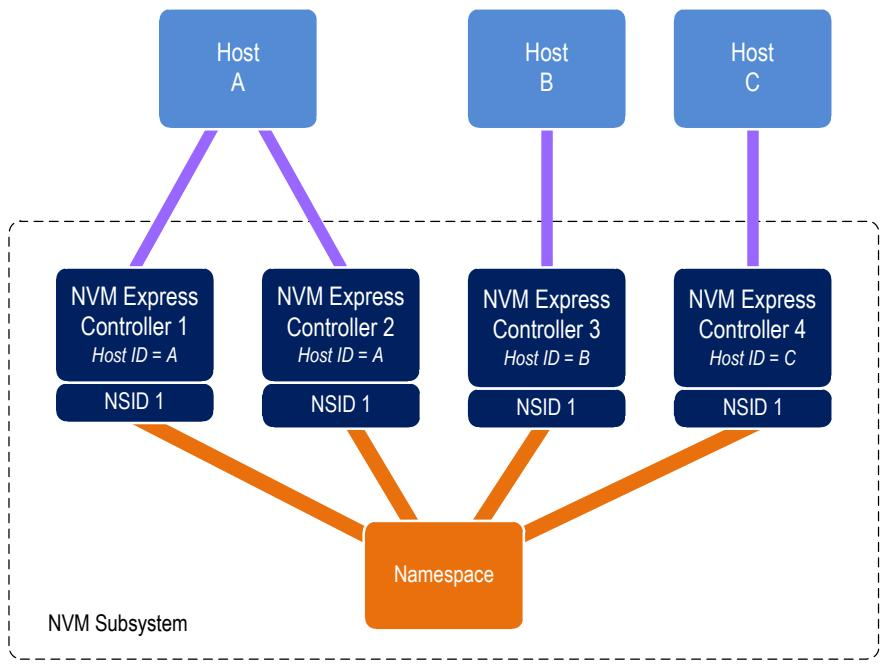

A reservation requires an association between a host and a namespace. As shown in Figure 644, each controller in a multi-path I/O and namespace sharing environment is associated with exactly one host. While it is possible to construct systems where two or more hosts share a single controller, such usage is outside the scope of this specification. 

A host may be associated with multiple controllers. In Figure 644 host A is associated with two controllers while hosts B and C are each associated with a single controller. A host should register a non-zero Host Identifier (refer to section 5.1.25.1.28) with each controller with which that host is associated using a Set Features command (refer to section 5.1.25) prior to performing any operations associated with reservations. The Host Identifier allows the NVM subsystem to identify controllers associated with the same host and preserve reservation properties across these controllers (i.e., a host issued command has the same reservation rights no matter which controller associated with the host processes the command). 

An NVM subsystem may require that the host register a non-zero Host Identifier for a host to use reservations (i.e., the RHII bit is set to ‘1’ in the CTRATT field of the Identify Controller data structure (refer to Figure 312)). If the controller does not support reservations with a Host Identifier value of 0h and a reservation command is received from a host with a Host Identifier value of 0h, then the controller shall abort that reservation command with a status of Host Identifier Not Initialized. 

If an NVM subsystem: 

1. supports reservations with a Host Identifier value of 0h; 

2. registrations or reservations are established by a host with a Host Identifier value of 0h; and 

3. the Host Identifier is changed to a non-zero value, 

then those registrations or reservations remain associated with the Host with a Host Identifier value of 0h and are not associated with the host with the non-zero Host Identifier. 

If the controller does not support reservations with a Host Identifier value of 0h, reservations may have been established by hosts with non-zero Host Identifiers connected to other controllers, and commands from a host with a Host Identifier value of 0h that conflict with a reservation (refer to Figure 645 and Figure 646) are aborted by the controller with a status code of Reservation Conflict. 

Support for reservations by a namespace or controller is optional. A namespace indicates support for reservations by reporting a non-zero value in the Reservation Capabilities (RESCAP) field in the Identify Namespace data structure. A controller indicates support for reservations through the Optional NVM Command Support (ONCS) field in the Identify Controller data structure (refer to Figure 312). If a host submits a command associated with reservations (i.e., Reservation Report, Reservation Register, Reservation Acquire, and Reservation Release) to a controller or a namespace that do not both support reservations, then the command is aborted by the controller with a status code of Invalid Command Opcode. 

Controllers that make up an NVM subsystem shall all have the same support for reservations. Although strongly encouraged, namespaces that make up an NVM subsystem are not all required to have the same support for reservations. For example, some namespaces within a single controller may support reservations while others do not, or the supported reservation types may differ among namespaces. If a controller supports reservations, then the controller shall: 

Indicate support for reservations by returning a '1' in the Reservations Support (RESERVS) bit of the Optional NVM Command Support (ONCS) field in the Identify Controller data structure; 

Support the Reservation Report command (refer to section 7.8), Reservation Register command (refer to section 7.6), Reservation Acquire command (refer to section 7.5), and Reservation Release command (refer to section 7.7); 

• Support the Reservation Notification log page; 

• Support the Reservation Log Page Available asynchronous events; 

Support the Reservation Notification Mask Feature; 

• Support the Host Identifier Feature; and 

• Support the Reservation Persistence Feature. 

If a controller supports dispersed namespaces and supports reservations, then the controller supports the Dispersed Namespace Reservation Support (DISNSRS) bit being set to ‘1’ in the Reservation Report command, Reservation Register command, Reservation Acquire command, and Reservation Release command, as described in section 8.1.9.6. 

If a namespace supports reservations, then the namespace shall: 

Report a non-zero value in the Reservation Capabilities (RESCAP) field in the Identify Namespace data structure; 

• Support Persist Through Power Loss (PTPL) state; and 

Support sufficient resources to allow a host to successfully register a reservation key on every controller in the NVM subsystem with access to the shared namespace (i.e., a Reservation Register command shall never fail due to lack of resources). 

NOTE: The behavior of Ignore Existing Key has been changed to improve compatibility with SCSI based implementations. Conformance to the modified behavior is indicated in the Reservation Capabilities (RESCAP) field of the Identify Namespace data structure. For the previous definition of Ignore Existing Key behavior, refer to NVM Express Base Specification, Revision 1.2.1. 

# Reservation Types

The NVM Express interface supports six types of reservations: 

• Write Exclusive; 

Exclusive Access; 

• Write Exclusive - Registrants Only; 

• Exclusive Access - Registrants Only; 

• Write Exclusive - All Registrants; and 

• Exclusive Access - All Registrants. 

Figure 645: Command Behavior in the Presence of a Reservation

<table><tr><td rowspan="2">Reservation Type</td><td colspan="2">Reservation Holder</td><td colspan="2">Registrar</td><td colspan="2">Non-Registrar</td><td rowspan="2">Reservation Holder Definition</td></tr><tr><td>Read</td><td>Write</td><td>Read</td><td>Write</td><td>Read</td><td>Write</td></tr><tr><td>Write Exclusive</td><td>Y</td><td>Y</td><td>Y</td><td>N</td><td>Y</td><td>N</td><td>One Reservation Holder</td></tr><tr><td>Exclusive Access</td><td>Y</td><td>Y</td><td>N</td><td>N</td><td>N</td><td>N</td><td>One Reservation Holder</td></tr><tr><td>Write Exclusive - Registrants Only</td><td>Y</td><td>Y</td><td>Y</td><td>Y</td><td>Y</td><td>N</td><td>One Reservation Holder</td></tr><tr><td>Exclusive Access - Registrants Only</td><td>Y</td><td>Y</td><td>Y</td><td>Y</td><td>N</td><td>N</td><td>One Reservation Holder</td></tr><tr><td>Write Exclusive - All Registrants</td><td>Y</td><td>Y</td><td>Y</td><td>Y</td><td>Y</td><td>N</td><td>All Registrants are Reservation Holders</td></tr><tr><td>Exclusive Access - All Registrants</td><td>Y</td><td>Y</td><td>Y</td><td>Y</td><td>N</td><td>N</td><td>All Registrants are Reservation Holders</td></tr></table>

The differences between these reservation types are: the type of access that is excluded (i.e., writes or all accesses), whether registrants have the same access rights as the reservation holder, and whether registrants are also considered to be reservation holders. These differences are summarized in Figure 645 and the specific behavior for each NVM Express command is shown in Figure 646. 

Reservations and registrations persist across all Controller Level Resets and all NVM Subsystem Resets except reset due to power loss. A reservation may be optionally configured to be retained across a reset due to power loss using the Persist Through Power Loss State (PTPLS). A Persist Through Power Loss State (PTPLS) is associated with each namespace that supports reservations and may be modified as a side effect of a Reservation Register command (refer to section 7.6) or a Set Features command (refer to section 5.1.25). 

Figure 646: Command Behavior in the Presence of a Reservation

<table><tr><td rowspan="2">NVMe Command</td><td colspan="2">Write Exclusive Reservation</td><td colspan="2">Exclusive Access Reservation</td><td colspan="2">Write Exclusive Registrants Only or Write Exclusive All Registrants Reservation</td><td colspan="2">Exclusive Access Registrants Only or Exclusive Access All Registrants Reservation</td></tr><tr><td>Non-Registrant</td><td>Registrant</td><td>Non-Registrant</td><td>Registrant</td><td>Non-Registrant</td><td>Registrant</td><td>Non-Registrant</td><td>Registrant</td></tr><tr><td colspan="9">Read Command Group</td></tr><tr><td>Security Receive (Admin)I/O Command Set specific Copy Commands (source)\(^{2,3}\)I/O Command Set specific Read Commands\(^{2}\)</td><td>A</td><td>A</td><td>C</td><td>C</td><td>A</td><td>A</td><td>C</td><td>A</td></tr></table>

Figure 646: Command Behavior in the Presence of a Reservation

<table><tr><td rowspan="2">NVMe Command</td><td colspan="2">Write Exclusive Reservation</td><td colspan="2">Exclusive Access Reservation</td><td colspan="2">Write Exclusive Registrants Only or Write Exclusive All Registrants Reservation</td><td colspan="2">Exclusive Access Registrants Only or Exclusive Access All Registrants Reservation</td></tr><tr><td>Non-Registrant</td><td>Registrant</td><td>Non-Registrant</td><td>Registrant</td><td>Non-Registrant</td><td>Registrant</td><td>Non-Registrant</td><td>Registrant</td></tr><tr><td colspan="9">Write Command Group</td></tr><tr><td>Capacity Management (Admin)FlushFormat NVM (Admin)Namespace Attachment (Admin)Namespace Management (Admin)Sanitize (Admin)Security Send (Admin)I/O Command Set specific Copy Commands (destination)\( ^{2,3} \)I/O Command Set specific Write \( Commands^2 \)</td><td>C</td><td>C</td><td>C</td><td>C</td><td>C</td><td>A</td><td>C</td><td>A</td></tr><tr><td colspan="9">Reservation Command Groups</td></tr><tr><td>Reservation Acquire - Acquire</td><td>C</td><td>C</td><td>C</td><td>C</td><td>C</td><td>C</td><td>C</td><td>C</td></tr><tr><td>Reservation Acquire - PreemptReservation Acquire - Preempt and AbortReservation Release</td><td>C</td><td>A</td><td>C</td><td>A</td><td>C</td><td>A</td><td>C</td><td>A</td></tr><tr><td colspan="9">All Other Commands Group</td></tr><tr><td>\( All other commands^1 \)</td><td>A</td><td>A</td><td>A</td><td>A</td><td>A</td><td>A</td><td>A</td><td>A</td></tr><tr><td colspan="9">Key:A definition: A=Allowed, command processed normally by the controllerC definition: C=Conflict, command aborted by the controller with a status code of Reservation ConflictNotes:1. The behavior of a vendor specific command is vendor specific.2. Refer to the applicable I/O Command Set specification3. For an I/O Command Set specific Copy command, each source namespace is checked for reservation conflict as if accessed by a read command and the destination namespace is checked for reservation conflict as if accessed by a write command,as described in the applicable I/O command Set specification.</td></tr></table>

# Reservation Notifications

There are three types of reservation notifications: registration preempted, reservation released, and reservation preempted. Conditions that cause a reservation notification to occur are described in the following sections. A Reservation Notification log page is created whenever an unmasked reservation notification occurs on a namespace associated with the controller (refer to section 5.1.12.1.32). Reservation notifications may be masked from generating a Reservation Notification log page on a per reservation notification type and per namespace ID basis through the Reservation Notification Mask feature (refer to section 5.1.25.1.29). A host may use the Asynchronous Event Request command (refer to section 5.1.2) to be notified of the presence of one or more available Reservation Notification log pages (refer to section 5.1.12.1.32). 

# Registering

Prior to establishing a reservation on a namespace, a host shall become a registrant of that namespace by registering a reservation key. This reservation key may be used by the host as a means of identifying the registrant (host), authenticating the registrant, and preempting a failed or uncooperative registrant. The value of the reservation key used by a host and the method used to select its value is outside the scope of this specification. 

Registering a reservation key with a namespace creates an association between a host and a namespace. A host that is a registrant of a namespace may use any controller with which that host is associated (i.e., that has the same Host Identifier, refer to section 5.1.25.1.28) to access that namespace as a registrant. Thus, a host is only required to register on a single controller to become a registrant of the namespace on all controllers in the NVM subsystem that have access to the namespace and are associated with the host. If a host attempts to access a dispersed namespace that is able to be accessed by controllers in multiple participating NVM subsystems, then that host is only required to register on a single controller in a single participating NVM subsystem to become a registrant of the dispersed namespace on all controllers in all participating NVM subsystems that have access to the dispersed namespace and are associated with the host. 

A host registers a reservation key by executing a Reservation Register command (refer to section 7.6) on the namespace with the Reservation Register Action (RREGA) field cleared to 000b (i.e., Register Reservation Key) and supplying a reservation key in the New Reservation Key (NRKEY) field. 

A host that is a registrant of a namespace may register the same reservation key value multiple times with the namespace on the same or different controllers. For a Reservation Register command with the RREGA field cleared to 000b: 

a) the IEKEY field shall be ignored; and 

b) if a host that is already a registrant of a namespace attempts to register with that namespace using a different reservation key value, then the command shall be aborted with a status code of Reservation Conflict. 

There are no restrictions on the reservation key value used by hosts with different Host Identifiers. For example, multiple hosts may all register with the same reservation key value. 

A host that is a registrant of a namespace may replace the existing reservation key value for that namespace by executing a Reservation Register command on the namespace with the: 

a) RREGA field set to 010b (i.e., Replace Reservation Key); 

b) current reservation key in the Current Reservation Key (CRKEY) field; and 

c) new reservation key in the NRKEY field. 

The current reservation key value shall be replaced by the new reservation key value in all controllers to which the namespace is attached that have the same Host Identifier as the Host Identifier of the controller processing the command. For dispersed namespaces, this requirement includes all participating NVM subsystems. If the contents of the CRKEY field do not match the key currently associated with the host, then the command shall be aborted with a status code of Reservation Conflict. A host may replace its reservation key without regard to its registration status or current reservation key value by setting the Ignore Existing Key (IEKEY) bit to '1' in the Reservation Register command. Replacing a reservation key has no effect on any reservation that may be held on the namespace. 

# Unregistering

A host that is a registrant of a namespace may unregister with the namespace by executing a Reservation Register command (refer to section 7.6) on the namespace with the RREGA field set to 001b (i.e., Unregister Reservation Key) and supplying its current reservation key in the CRKEY field. If the contents of the CRKEY field do not match the key currently associated with the host, then the command is aborted with a status code of Reservation Conflict. If the host is not a registrant, then the command is aborted with a status code of Reservation Conflict. 

Successful completion of an unregister operation causes the host to no longer be a registrant of that namespace. A host may unregister without regard to its current reservation key value by setting the IEKEY bit to '1' in the Reservation Register command. 

Unregistering by a host may cause a reservation held by the host to be released. If a host is the last remaining reservation holder (i.e., the reservation type is Write Exclusive - All Registrants or Exclusive Access - All Registrants) or is the only reservation holder, then the reservation is released when the host unregisters. 

If a reservation is released and the type of the released reservation was Write Exclusive - Registrants Only or Exclusive Access - Registrants Only, then a reservation released notification occurs on all controllers associated with a registered host other than the host that issued the Reservation Register command. 

# Acquiring a Reservation

In order for a host to obtain a reservation on a namespace, that host shall be a registrant of that namespace. A registrant obtains a reservation by executing a Reservation Acquire command (refer to section 7.5), clearing the Reservation Acquire Action (RACQA) field to 000b (Acquire), and supplying the current reservation key associated with the host in the Current Reservation Key (CRKEY) field. The CRKEY value shall match that used by the registrant to register with the namespace. If the CRKEY value does not match, then the command is aborted with a status code of Reservation Conflict. If the host is not a registrant, then the command is aborted with a status code of Reservation Conflict. 

Only one reservation is allowed at a time on a namespace. If a registrant attempts to obtain a reservation on a namespace that already has a reservation holder, then the command is aborted with a status code of Reservation Conflict. If a reservation holder attempts to obtain a reservation of a different type on a namespace for which that host already is the reservation holder, then the command is aborted with a status code of Reservation Conflict. If a reservation holder attempts to obtain a reservation of the same type on a namespace for which that host already is the reservation holder, then it is not a Reservation Conflict and the command is processed. A reservation holder may preempt a reservation to change the reservation type. 

# Releasing a Reservation

Only a reservation holder is able to release a reservation held on a namespace. A host should release a reservation using the following sequence: 

a) executing a Reservation Release command (refer to section 7.7); 

b) clearing the Reservation Release Action (RRELA) field to 000b (i.e., Release); 

c) setting the Reservation Type (RTYPE) field to the type of reservation being released; and 

d) supplying the current reservation key associated with the host in the Current Reservation Key (CRKEY) field. The CRKEY value shall match that used by the host to register with the namespace. 

If the key value does not match, then the command is aborted with a status code of Reservation Conflict. If the RTYPE field does not match the type of the current reservation, then the command completes with a status code of Invalid Field in Command. 

An attempt by a registrant to release a reservation using the Reservation Release command in the absence of a reservation held on the namespace or when the host is not the reservation holder shall cause the command to complete successfully, but shall have no effect on the controller or namespace. 

When a reservation is released as a result of actions described in this section and the reservation type is not Write Exclusive or Exclusive Access, a reservation released notification occurs on all controllers in the NVM subsystem that are associated with hosts that are registrants except for controllers that are associated with the host that issued the Reservation Release command. 

# Preempting a Reservation or Registration

A host that is a registrant may preempt a reservation and/or registration by executing a Reservation Acquire command (refer to section 7.5), specifying: 

the Reservation Acquire Action (RACQA) field set to 001b (i.e., Preempt) or set to 010b (i.e., Preempt and Abort); and 

• the current reservation key associated with the host in the Current Reservation Key (CRKEY) field. 

The CRKEY value shall match that used by the registrant to register with the namespace. If the CRKEY value does not match, then the command is aborted with a status code of Reservation Conflict. The preempt actions that occur are dependent on the type of reservation held on the namespace, if any, and the value of the Preempt Reservation Key (PRKEY) field in the command. If the host is not a registrant, then the command is aborted with a status code of Reservation Conflict. The remainder of this section assumes that the host is a registrant. 

If the existing reservation type is not Write Exclusive - All Registrants and not Exclusive Access - All Registrants, then the actions performed by the command depend on the value of the PRKEY field as follows: 

a) If the PRKEY field value matches the reservation key of the current reservation holder, then the following occur as an atomic operation: 

all registrants with a matching reservation key other than the host that issued the command are unregistered; 

the reservation is released; and 

a new reservation is created of the type specified by the Reservation Type (RTYPE) field in the command for the host that issued the command as the reservation key holder; or 

b) If the PRKEY field value does not match that of the current reservation holder and is not equal to 0h, then registrants whose reservation key matches the value of the PRKEY field are unregistered. If the PRKEY field value does not match that of the current reservation holder and is equal to 0h, then the command is aborted with a status code of Invalid Field in Command. 

If the existing reservation type is Write Exclusive - All Registrants or Exclusive Access - All Registrants, then the actions performed by the command depend on the value of the PRKEY field as follows: 

a) If the PRKEY field value is 0h, then the following occurs as an atomic operation: 

• all registrants other than the host that issued the command are unregistered; 

the reservation is released; and 

a new reservation is created of the type specified by the Reservation Type (RTYPE) field in the command for the host that issued the command as the reservation key holder; or 

b) If the PRKEY value is non-zero, then registrants whose reservation key matches the value of the PRKEY field are unregistered. If the PRKEY value is non-zero and there are no registrants whose reservation key matches the value of the PRKEY field, the controller shall abort the command with a status code of Reservation Conflict. 

If there is no reservation held on the namespace, then execution of the command causes registrants whose reservation key match the value of the PRKEY field to be unregistered. 

If the existing reservation type is not Write Exclusive - All Registrants and not Exclusive Access - All Registrants, then a reservation holder may preempt itself using the above mechanism. When a host preempts itself, the following occurs as an atomic operation: 

registration of the host is maintained; 

the reservation is released; and 

a new reservation is created for the host of the type specified by the RTYPE field. 

A host may abort commands as a side effect of preempting a reservation by executing a Reservation Acquire command (refer to section 7.5) and setting the RACQA field to 010b (Preempt and Abort). The 

behavior of such a command is exactly the same as that described above with the RACQA field set to 001b (Preempt), with two exceptions: 

After the atomic operation changes namespace reservation and registration state, all controllers associated with any host whose reservation or registration is preempted by that atomic operation are requested to abort all commands being processed that were addressed to the specified namespace in the NSID field in the Reservation Acquire command (refer to section 3.4.4 for the definition of “being processed”); and 

Completion of the Reservation Acquire command shall not occur until all commands that are requested to be aborted are completed, regardless of whether or not each command is actually aborted. 

As with the Abort command (refer to section 5.1), aborting a command as a side effect of preempting a reservation is best effort; as a command that is requested to be aborted may currently be at a point in execution where that command is no longer able to be aborted or may have already completed, when a Reservation Acquire or Abort Admin command is submitted. Although prompt execution of abort requests reduces delay in completing the Reservation Acquire command, a command which is requested to be aborted shall either be aborted or otherwise completed before the completion of the Reservation Acquire command. 

When a registrant is unregistered as a result of actions described in this section, then a registration preempted notification occurs on all controllers associated with a host that was unregistered other than the host that issued the Reservation Acquire command. 

When the type of reservation held on a namespace changes as a result of actions described in this section, then a reservation released notification occurs on all controllers associated with hosts that remain registrants of the namespace except the host that issued the Reservation Acquire command. 

# Clearing a Reservation

A host that is a registrant may clear a reservation (i.e., force the release of a reservation held on the namespace and unregister all registrants) by: 

a) executing a Reservation Release command (refer to section 7.7); 

b) setting the Reservation Release Action (RRELA) field to 001b (i.e., Clear); and 

c) supplying the current reservation key associated with the host in the Current Reservation Key (CRKEY) field. 

If the value in the CRKEY field does not match the value used by the host to register with the namespace, then the command shall be aborted with a status code of Reservation Conflict. If the host is not a registrant, then the command is aborted with a status code of Reservation Conflict. When a command to clear a reservation is executed the following occur as an atomic operation: the reservation held on the namespace, if any, is released, and all registrants are unregistered from the namespace. 

A reservation preempted notification occurs on all controllers in the NVM subsystem that are associated with hosts that have their registrations removed as a result of actions taken in this section except those associated with the host that issued the Reservation Release command. 

# Reporting Reservation Status

A host may determine the current reservation status associated with a namespace by executing a Reservation Report command (refer to section 7.8). 

# Rotational Media

Rotational media has different operational, endurance and performance characteristics than non-rotational media (e.g., NAND). Rotational media utilizes electromechanical methods for accessing data. 

Rotational media contains one or more spinning platters containing the media, and one or more actuators that provide physical access to the data on that media (e.g., a hard disk drive or a CD-ROM). 

A controller that supports namespaces that store user data on rotational media shall: 

a) set the Rotational Media bit to ‘1’ in the NSFEAT field of the I/O Command Set Independent Identify Namespace data structure (refer to the NVM Command Set Specification) for any namespace that stores data on rotational media; 

b) support the Rotational Media Information log page (refer to section 5.1.12.1.22); 

c) support the Spinup Control feature (refer to section 5.1.25.1.18); 

d) support Endurance Groups (refer to section 3.2.3); and 

e) set the EG Rotational Media bit to ‘1’ in the EGFEAT field in the Endurance Group Information log page for each Endurance Group that stores data on rotational media. 

If a namespace that stores data on rotational media is attached to a controller, and the spindle used by that namespace is not spinning, then that controller shall be in a non-operational power state (i.e., NOPS is set to ‘1’, refer to Figure 313). 

If: 

a) a domain contains an Endurance Group that stores data on rotational media; 

b) that domain processes an NVM Subsystem Reset; and 

c) the Spinup Control feature (refer to section 5.1.25.1.18) is: 

a. disabled, then initial spinup for all such Endurance Groups in that domain shall be initiated; and 

b. enabled, then initial spinup for all such Endurance Groups in that domain shall be inhibited during processing of the NVM Subsystem Reset until any controller within that domain processes a Set Features (Power Management) command that specifies an operational power state. 

If the PCIe transport is used for a controller, then the PCIe Slot Power Control feature may affect the power states supported (refer to the PCI Express Base Specification). 

# Sanitize Operations

A sanitize operation alters all user data in the sanitization target such that recovery of any previous user data from any cache, the non-volatile storage media, or any Controller Memory Buffer is not possible. It is implementation specific whether Submission Queues and Completion Queues within a Controller Memory Buffer are altered by a sanitize operation; all other data stored in all Controller Memory Buffers is altered by a sanitize operation. If a portion of the user data was not altered and the sanitize operation completed successfully, then the NVM subsystem shall ensure permanent inaccessibility of that portion of the media allocated for user data for any future use within the NVM subsystem (e.g., retrieval from NVM media, caches, or any Controller Memory Buffer) and permanent inaccessibility of that portion of the media allocated for user data via any interface to the NVM subsystem, including management interfaces as defined by the NVM Express Management Interface Specification. 

# Elements of Sanitize Operations

A sanitize operation consists of: 

sanitize processing, which may include: 

o deallocation of all media allocated for user data; and 

o additional media modification; 

optional verification of media allocated for user data; and 

post-verification deallocation of all media allocated for user data following media verification, if any. 

Sanitize processing is performed in either restricted completion mode (i.e., in the Restricted Processing state) or in unrestricted completion mode (i.e., in the Unrestricted Processing state), as specified by the Allow Unrestricted Sanitize Exit (AUSE) bit in the Sanitize command (refer to Figure 372). 

Additional media modification may be performed as part of sanitize processing (i.e., in the Restricted Processing state or the Unrestricted Processing state) to prevent commands that access media after completion of sanitize processing from encountering data integrity errors caused by that sanitize processing. 

Additional media modification shall be performed if the NODMMAS field is set to 10b (refer to Figure 312) and the Sanitize command that started the sanitize operation specifies: 

the Enter Media Verification State (EMVS) bit cleared to ‘0’; and 

• the No-Deallocate After Sanitize (NDAS) bit set to ‘1’. 

Verification of media allocated for user data is able to be performed by the host if the Sanitize Operation State Machine is in the Media Verification state. A Block Erase sanitize operation or Crypto Erase sanitize operation may invalidate error correction codes on the media, causing subsequent reads to fail because of media errors. In the Media Verification state, reads are successful regardless of such invalid error correction codes which enables the host to perform an audit (refer to section 1.5.11) to verify that the media was sanitized. Refer to the applicable I/O Command Set specification for details. Media verification is performed if the Sanitize command that starts a sanitize operation specifies the EMVS bit set to ‘1’ and sanitize processing completes successfully. 

If a sanitize operation includes deallocation of all media allocated for user data, then that deallocation shall be performed in exactly one of the following states: 

• Restricted Processing state; 

Unrestricted Processing state; or 

• Post-Verification Deallocation state. 

If the Sanitize command (refer to Figure 372) that starts a sanitize operation specifies: 

• the Enter Media Verification State (EMVS) bit cleared to $ { \mathbf { \vec { \mathbf { \rho } } } } _ { 0 } ,$ ; 

the AUSE bit cleared to $\scriptstyle { \mathrm { ~ \displaystyle ~ } } ^ { \prime } 0 ^ { \prime }$ ; and 

• the No-Deallocate After Sanitize (NDAS) bit is: 

o cleared to $\mathbf { \vec { \mathbf { \rho } } } ^ { 0 }$ ; or 

o set to ‘1’ and the controller encounters a condition that results in unexpected deallocation of all media allocated for user data (refer to section 5.1.25.1.15), 

then deallocation of all media allocated for user data shall be performed in the Restricted Processing state. If that deallocation fails, then sanitize processing fails. 

If Media Verification state is canceled (i.e., the MVCNCLD bit is set to ‘1’) during the Restricted Processing state, then deallocation of all media allocated for user data shall be performed in the Restricted Processing state. 

If the Sanitize command that starts a sanitize operation specifies: 

the Enter Media Verification State (EMVS) bit cleared to ‘0’; 

the AUSE bit set to $\mathbf { \omega } ^ { \prime } \mathbf { \Xi } \mathbf { \Lambda } ^ { \prime }$ ; and 

• the No-Deallocate After Sanitize (NDAS) bit is: 

o cleared to $\mathbf { \vec { \mathbf { \rho } } } ^ { 0 }$ ; or 

o set to ‘1’ and the controller encounters a condition that results in unexpected deallocation of all media allocated for user data (refer to section 5.1.25.1.15), 

then deallocation of all media allocated for user data shall be performed in the Unrestricted Processing state. If that deallocation fails, then sanitize processing fails. 

If the Media Verification state is canceled (i.e., the MVCNCLD bit is set to ‘1’) during the Unrestricted Processing state, then deallocation of all media allocated for user data shall be performed in the Unrestricted Processing state. 

In the Post-Verification Deallocation state the controller deallocates all user data. 

In the Post-Verification Deallocation state, if the controller: 

successfully completes deallocating all media allocated for user data, then the sanitization target enters the Idle state; or 

fails to deallocate all media allocated for user data, then the sanitization target enters the Restricted Failure state or the Unrestricted Failure state, as described in section 8.1.24.3.7. 

A Controller Level Reset may cause the sanitize operation not to include the Media Verification state and the Post-Verification Deallocation state, as described in section 8.1.24.3. 

# Sanitize Operation Types and Support

The scope of a sanitize operation is all locations in the NVM subsystem that are able to contain user data, including caches, Persistent Memory Regions, and unallocated or deallocated areas of the media. 

If the composition of the NVM subsystem (refer to section 3.2.5) changes (e.g., a new domain is added, or a division event occurs) and that change prevents the successful completion of a sanitize operation, then the sanitize operation shall fail. 

If the composition of the NVM subsystem changes (e.g., a new domain is added, or a division event occurs) and that change prevents verification of media allocated for user data, then the Media Verification state is canceled and the MVCNCLD bit is set to ‘1’. 

Sanitize operations do not affect the Replay Protected Memory Block, boot partitions, or other media and caches that do not contain user data. A sanitize operation also may alter log pages and features as necessary (e.g., to prevent derivation of user data from log page information or feature information). A sanitize operation is only able to be started if the NVM subsystem is not divided (refer to section 3.2.5). A sanitize operation in the Restricted Processing state, the Unrestricted Processing state, the Media Verification state, or the Post-Verification Deallocation state is not able to be aborted and continues after a Controller Level Reset, including across power cycles. Refer to Annex A for further information about sanitize operations. 

The Sanitize command (refer to section 5.1.22) is used to start a sanitize operation, to recover from a previously failed sanitize operation, or to exit the Media Verification state. All sanitize operations are performed in the background (i.e., completion of the Sanitize command that starts a sanitize operation does not indicate completion of that sanitize operation). The completion of a sanitize operation and the optional transition into the Media Verification state are indicated in the Sanitize Status log page, and with: 

• the Sanitize Operation Completed asynchronous event, 

• the Sanitize Operation Completed With Unexpected Deallocation asynchronous event, or 

• the Sanitize Operation Entered Media Verification State asynchronous event. 

If the Sanitize command that started a sanitize operation was submitted to a controller’s Admin Submission Queue, then the asynchronous event shall be reported only by that controller. If the Sanitize command that started a sanitize operation was submitted to a Management Endpoint (refer to the NVM Express Management Interface Specification), then the asynchronous event shall not be reported by any controller in the NVM subsystem. 

The Sanitize Capabilities (SANICAP) field of the Identify Controller data structure (refer to Figure 312) indicates the sanitize operation types supported and controller attributes specific to sanitize operations. 

The sanitize operation types are: 

the Block Erase sanitize operation, which alters user data with a low-level block erase method that is specific to the media for all locations on the media within the sanitization target in which user data may be stored; 

the Crypto Erase sanitize operation, which alters user data by changing the media encryption keys for all locations on the media within the sanitization target in which user data may be stored; and 

the Overwrite sanitize operation, which alters user data by writing a fixed data pattern or related patterns one or more times to all locations on the media within the sanitization target in which user data may be stored. Figure 647 defines the data pattern or patterns that are written. 

Controller attributes specific to sanitize operations include: 

the No-Deallocate Modifies Media After Sanitize (NODMMAS) field, which indicates whether media is modified by the controller as part of sanitize processing that had been requested with the No-

Deallocate After Sanitize (NDAS) bit set to ‘1’ in the Sanitize command that started the sanitize operation; 

the No-Deallocate Inhibited (NDI) bit, which indicates if the controller supports the No-Deallocate After Sanitize bit in the Sanitize command; and 

the Verification Support (VERS) bit, which indicates if the controller supports the Media Verification state and the Post-Verification Deallocation state for sanitization operations that perform block erase or crypto erase. 

If the NODMMAS field indicates a value of 10b in the Identify Controller data structure (refer to Figure 312) and a Sanitize command that starts a sanitize operation specifies the No-Deallocate After Sanitize (NDAS) bit set to ‘1’, then sanitize processing includes additional media modification. Refer to Annex A.3 for further information about sanitize operations and interactions with integrity circuits. 

The Overwrite sanitize operation is media specific and may not be appropriate for all media types. For example, if the media is NAND, multiple pass overwrite operations may have an adverse effect on media endurance. 

If the NVM subsystem supports the Key Per I/O capability (refer to section 8.1.11), then a sanitize operation shall alter all user data such that recovery of any previous user data using the KEYTAG values specified when that previous user data was written (i.e., original KEYTAG values) is infeasible for a given level of effort (refer to ISO/IEC 27040). 

Figure 647: Sanitize Operations – Overwrite Mechanism

<table><tr><td>OIPBP1</td><td>Overwrite Pass Count1</td><td>Overwrite Pass Number</td><td>User Data except PI Metadata</td><td>Protection Information2</td></tr><tr><td>‘0’</td><td>All</td><td>All</td><td>Overwrite Pattern1</td><td>Each byte set to FFh</td></tr><tr><td rowspan="2">‘1’</td><td rowspan="2">Even</td><td>First</td><td>Inversion of Overwrite Pattern1</td><td>Each byte cleared to 00h</td></tr><tr><td>Subsequent</td><td colspan="2">Inversion of Overwrite Pattern1 from previous pass (i.e., each bit XORed with ‘1’)</td></tr><tr><td rowspan="2">‘1’</td><td rowspan="2">Odd</td><td>First</td><td>Overwrite Pattern1</td><td>Each byte set to FFh</td></tr><tr><td>Subsequent</td><td colspan="2">Inversion of Overwrite Pattern1 from previous pass (i.e., each bit XORed with ‘1’)</td></tr><tr><td colspan="5">Notes:1. Parameters are specified in Command Dword 10 and Command Dword 11 of the corresponding Sanitize command that started the Overwrite operation. The Overwrite Invert Pattern Between Passes (OIPBP) field is defined in Command Dword 10. The Overwrite Pass Count field is defined in Command Dword 11. Refer to section 5.1.22.2. If Protection Information is present within the metadata.</td></tr></table>

To start a sanitize operation, the host submits a Sanitize command specifying the SANACT field set to: 

• 010b (i.e., start a Block Erase type sanitize operation); 

• 011b (i.e., start a Overwrite type sanitize operation); or 

• 100b (i.e., start a Crypto Erase type sanitize operation). 

The Sanitize command specifies other parameters, including: 

• the Allow Unrestricted Sanitize Exit (AUSE) bit; 

• the No-Deallocate After Sanitize (NDAS) bit; and 

• the Enter Media Verification State (EMVS) bit. 

After validating the Sanitize command parameters, the controller starts the sanitize operation in the background, updates the Sanitize Status log page and then completes the Sanitize command with Successful Completion status. 

If a Sanitize command is completed with any status code other than Successful Completion, then the controller shall not start the sanitize operation and shall not update the Sanitize Status log page. The controller shall ignore Critical Warning(s) in the SMART / Health Information log page (e.g., read only mode) and shall attempt to complete the sanitize operation requested. Refer to section 5 for further information about restrictions on Admin commands during the processing of a Sanitize command. 

Following a successful sanitize operation, the values of user data (including protection information (PI), if any, and non-PI metadata, if any) that result from an audit (refer to section 1.5.11) of the sanitization target are defined in the I/O command set specifications. 

The Sanitize Status log page (refer to section 5.1.12.1.33) indicates estimated times for sanitize operations and a consistent snapshot of information about the most recently started sanitize operation, including whether a sanitize operation is in progress, the sanitize operation parameters and the status of the most recent sanitize operation. The controller shall report that a sanitize operation is in progress if: 

• sanitize processing is in progress (including additional media modification, if required); 

• the sanitization target is in the Media Verification state; or 

• the sanitization target is in the Post-Verification Deallocation state. 

If a sanitize operation is not in progress, then the Global Data Erased (GDE) bit in the log page indicates whether the sanitization target may contain any user data (i.e., whether the sanitization target has been written to since the most recent successful sanitize operation). 

The Sanitize Status log page shall be: 

initialized before any controller in the NVM subsystem is ready as described in sections 3.5.3 and 3.5.4; and 

• updated when any state transition occurs (refer to section 8.1.24.3). 

The Sanitize Status log page is updated periodically during a sanitize operation to make progress information available to hosts. 

During a sanitize operation, the host may periodically examine the Sanitize Status log page to check for progress, however, the host should limit this polling (e.g., to at most once every several minutes) to avoid interfering with the progress of the sanitize operation itself. 

The Sanitize Progress (SPROG) field in the Sanitize Status log page indicates progress during states that may take long times to complete (i.e., the Restricted Processing state, the Unrestricted Processing state, and the Post-Verification Deallocation state). The SPROG field is cleared to 0h upon entry to any of those states, and while in any of those states is updated as described in Figure 291. The SPROG field shall not be modified under any conditions not explicitly permitted by this specification. 

A sanitize operation completes when the sanitization target enters any of the following states (refer to section 8.1.24.3): 

the Idle state; 

the Restricted Failure state; or 

• the Unrestricted Failure state. 

Upon completion of a sanitize operation or upon entry to the Media Verification state, the host should read the Sanitize Status log page with the Retain Asynchronous Event bit cleared to $ { \mathbf { \hat { \rho } } } _ { 0 } ,$ (which clears the asynchronous event, if one was generated). 

If a sanitize operation fails (i.e., the sanitization target enters the Restricted Failure state or the Unrestricted Failure state), all controllers in the NVM subsystem shall abort any command not allowed during a sanitize operation with a status code of Sanitize Failed (refer to section 8.1.24.3) until a subsequent sanitize operation is started or successful recovery from the failed sanitize operation occurs. A subsequent successful sanitize operation or the Exit Failure Mode action may be used to recover from a failed sanitize operation. Refer to section 5.1.22 for recovery details. 

If the Sanitize command is supported, then all controllers in the NVM subsystem shall: 

support the Sanitize Status log page; 

support the Sanitize Operation Completed asynchronous event; 

support the Sanitize Operation Completed With Unexpected Deallocation asynchronous event, if the Sanitize Config feature is supported; 

support the Exit Failure Mode action for a Sanitize command; 

support at least one of the following sanitize operation types: Block Erase, Overwrite, or Crypto Erase; 

support the same set of sanitize operation types; 

indicate the supported sanitize operation types in the Sanitize Capabilities field in the Identify Controller data structure; and 

if the Verification Support (VERS) bit is set to ‘1’ in the Identify Controller data structure (refer to Figure 312), support: 

o the FAILS field in the Sanitize Status log page (refer to section 5.1.12.1.33); 

o the SANS field in the Sanitize Status log page; 

o the Media Verification state; 

o the Post-Verification Deallocation state; and 

o the Sanitize Operation Entered Media Verification State asynchronous event. 

The Sanitize Config Feature Identifier (refer to section 5.1.25.1.15) contains the No-Deallocate Response Mode (NODRM) bit that specifies the response of the controller to a Sanitize command specifying the No-Deallocate After Sanitize (NDAS) bit (refer to Figure 372) set to ‘1’ if the No-Deallocate Inhibited bit is set to ‘1’ in the Sanitize Capabilities field of the Identify Controller data structure (refer to Figure 312). In the No-Deallocate Error Response Mode, the controller aborts such Sanitize commands with a status code of Invalid Field in Command. In the No-Deallocate Warning Response Mode, the controller processes such Sanitize commands, and if a resulting sanitize operation is completed successfully, then the SOS field is set to 100b (i.e., Sanitized Unexpected Deallocate) in the Sanitize Status log page (refer to Figure 291). 

# Sanitize Operation State Machine

The Sanitize Operation State Machine (refer to Figure 648) defines the state of sanitization of a sanitization target. The label on each transition begins with a letter and may include a number. The letter indicates the condition causing that transition, as described in the section for each state. The number differentiates between different transitions that have the same transition condition. 

Figure 648: Sanitize Operation State Machine

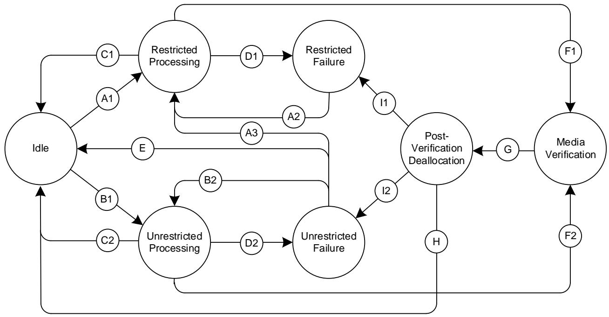

In the state transitions described in this section, asynchronous events are reported as described in section 8.1.24.2. In Completion Queue Entry Dword 0 (refer to Figure 147) for the Asynchronous Event Request command: 

a) the Log Page Identifier field shall be set to 81h (i.e., Sanitize Status log page); 

b) the Asynchronous Event Information field (refer to section 5.1.2.1) shall be set to: 

• 01h (i.e., Sanitize Operation Completed); 

• 02h (i.e., Sanitize Operation Completed With Unexpected Deallocation); or 

• 03h (i.e., Sanitize Operation Entered Media Verification State); 

and 

c) the Asynchronous Event Type field shall be set to 110b (i.e., I/O Command specific status). 

In each state transition described in this section, the controller shall set the Sanitize State (SANS) field to the value corresponding to the state being entered. 

# 8.1.24.3.1 Idle State

In this state, no sanitize operation is in process. This state applies in the following cases: 

a) no sanitize operation has ever been performed on the NVM subsystem since the NVM subsystem was manufactured; 

b) the most recent sanitize operation on the NVM subsystem was successful; and 

c) the most recent sanitize operation failed in unrestricted completion mode (i.e., the Sanitize command specified the AUSE bit set to ‘1’) and then the Sanitize Operation State Machine transitioned from the Unrestricted Failure state to the Idle state when any controller in the NVM subsystem performed an Exit Failure Mode action. 

In this state, any controller in the NVM subsystem processing a Sanitize command specifying the Sanitize Action field set to 001b (i.e., Exit Failure Mode) shall not be considered an error. 

In this state, all controllers in the NVM subsystem are permitted to resume any power management that was suspended by any prior sanitize operation. 

Figure 649: Idle State Transition Conditions

<table><tr><td colspan="3">State Transition</td><td rowspan="2">Transition Condition</td></tr><tr><td>Starting</td><td>Ending</td><td>Label 1</td></tr><tr><td rowspan="2">Idle</td><td>Restricted Processing</td><td>A1</td><td>The controller starts a sanitize operation in restricted completion mode (i.e., the Sanitize command specified the AUSE bit cleared to ‘0’).</td></tr><tr><td>Unrestricted Processing</td><td>B1</td><td>The controller starts a sanitize operation in unrestricted completion mode (i.e., the Sanitize command specified the AUSE bit set to ‘1’).</td></tr><tr><td colspan="4">Notes:1. Refer to Figure 648.</td></tr></table>

# Transition Idle:Restricted Processing:

The controller shall clear the: 

a) Sanitize Progress (SPROG) field to 0h; and 

b) Media Verification Canceled (MVCNCLD) bit to $\mathfrak { v }$ . 

# Transition Idle:Unrestricted Processing:

The controller shall clear the: 

a) Sanitize Progress (SPROG) field to 0h; and 

b) Media Verification Canceled (MVCNCLD) bit to $\mathfrak { v }$ . 

# 8.1.24.3.2 Restricted Processing State

In this state, if the sanitize operation fails, then the sanitization target transitions to the Restricted Failure state. 

In this state: 

a) the controller shall set the Sanitize Progress (SPROG) field as described in Figure 291; 

b) the controller shall perform additional media modification, if required, as described in section 8.1.24.1; 

c) the controller should deallocate all media allocated for user data, if permitted, as described in section 8.1.24.1; 

d) if a change in the composition of the NVM subsystem occurs then the MVCNCLD bit shall be set to ‘1’; 

e) if a Controller Level Reset of any controller in the NVM subsystem occurs that is caused by: 

• a transport-specific reset type (refer to the applicable NVMe Transport specification); or 

• an NVM Subsystem Reset, 

then the MVCNCLD bit shall be set to ‘1; and 

f) all controllers and Management Endpoints in the NVM subsystem shall process commands as described in section 8.1.24.4. 

Figure 650: Restricted Processing State Transition Conditions

<table><tr><td colspan="3">State Transition</td><td rowspan="2">Transition Condition</td></tr><tr><td>Starting</td><td>Ending</td><td>Label1</td></tr><tr><td rowspan="3">Restricted Processing</td><td>Idle</td><td>C1</td><td>Sanitize processing completes successfully and the EMVS bit was: 
a) cleared to ‘0’ in the Sanitize command that started the sanitize operation; or 
b) set to ‘1’ in the Sanitize command that started the sanitize operation, the MVCNCLD bit is set to ‘1’, and deallocation of all media allocated for user data completes successfully.</td></tr><tr><td>Restricted Failure</td><td>D1</td><td>Sanitize processing fails.</td></tr><tr><td>Media Verification</td><td>F1</td><td>The EMVS bit was set to ‘1’ in the Sanitize command that started the sanitize operation, the sanitize processing completes successfully, and the MVCNCLD bit is cleared to ‘0’.</td></tr><tr><td colspan="4">Notes: 
1. Refer to Figure 648.</td></tr></table>

# Transition Restricted Processing:Idle:

The controller shall: 

a) report the Sanitize Operation Completed asynchronous event or the Sanitize Operation Completed With Unexpected Deallocation asynchronous event as described in section 8.1.24.2. 

# Transition Restricted Processing:Restricted Failure:

The controller shall: 

a) set the FAILS field to 1h (i.e., Restricted Processing state); and 

b) report the Sanitize Operation Completed asynchronous event or the Sanitize Operation Completed With Unexpected Deallocation asynchronous event as described in section 8.1.24.2. 

# Transition Restricted Processing:Media Verification:

The controller shall: 

a) report the Sanitize Operation Entered Media Verification State asynchronous event as described in section 8.1.24.2. 

# 8.1.24.3.3 Restricted Failure State

This state is entered if sanitize processing was performed in the Restricted Processing state and: 

a) sanitize processing failed; or 

b) a failure occurred during deallocation of media allocated for user data in the Post-Verification Deallocation state. 

In this state: 

a) all controllers and Management Endpoints in the NVM subsystem shall process commands as described in section 8.1.24.4; 

b) failure recovery requires the host to issue a subsequent Sanitize command specifying the AUSE bit cleared to $\mathbf { \vec { \mathbf { \rho } } } ^ { 0 }$ (i.e., restricted completion mode); 

c) all controllers in the NVM subsystem shall abort a Sanitize command specifying: 

• the SANACT field set to 001b (i.e., Exit Failure Mode), with a status code of Sanitize Failed; 

the SANACT field set to 101b (i.e., Exit Media Verification State), with a status code of Invalid Field in Command; or 

• the USE bit set to ‘1’ (i.e., unrestricted completion mode), with a status code of Sanitize Failed; 

and 

d) the Persistent Memory Region shall behave as described in section 8.1.24.4. 

Figure 651: Restricted Failure State Transition Conditions

<table><tr><td colspan="3">State Transition</td><td rowspan="2">Transition Condition</td></tr><tr><td>Starting</td><td>Ending</td><td>Label 1</td></tr><tr><td>Restricted Failure</td><td>Restricted Processing</td><td>A2</td><td>The controller starts a sanitize operation in restricted completion mode (i.e., the Sanitize command specified the AUSE bit cleared to ‘0’).</td></tr><tr><td colspan="4">Notes:1. Refer to Figure 648.</td></tr></table>

# Transition Restricted Failure:Restricted Processing:

The controller shall start a sanitize operation in the Restricted Processing state. The controller shall: 

a) clear the Sanitize Progress (SPROG) field to 0h; and 

b) clear the Media Verification Canceled (MVCNCLD) bit to $ { \mathbf { \vec { \mathbf { \rho } } } } _ { 0 } ,$ 

# 8.1.24.3.4 Unrestricted Processing State

In this state, if the sanitize operation fails, then the sanitization target transitions to the Unrestricted Failure state, from which it is able to transition to the Idle state without successful sanitization. 

In this state: 

a) the controller shall set the Sanitize Progress (SPROG) field as described in Figure 291; 

b) the controller shall perform additional media modification, if required, as described in section 8.1.24.1; 

c) the controller should deallocate all media allocated for user data, if permitted, as described in section 8.1.24.1; 

d) if a change in the composition of the NVM subsystem occurs, then the MVCNCLD bit shall be set to ‘1; 

e) if a Controller Level Reset of any controller in the NVM subsystem occurs that is caused by: 

• a transport-specific reset type (refer to the applicable NVMe Transport specification); or 

an NVM Subsystem Reset, 

then the MVCNCLD bit shall be set to ‘1; and 

f) all controllers and Management Endpoints in the NVM subsystem shall process commands as described in section 8.1.24.4. 

Figure 652: Unrestricted Processing State Transition Conditions

<table><tr><td colspan="3">State Transition</td><td rowspan="2">Transition Condition</td></tr><tr><td>Starting</td><td>Ending</td><td>Label1</td></tr><tr><td rowspan="3">Unrestricted Processing</td><td>Idle</td><td>C2</td><td>The sanitize processing completes successfully and the EMVS bit was: 
a) cleared to ‘0’ in the Sanitize command that started the sanitize operation; or 
b) set to ‘1’ in the Sanitize command that started the sanitize operation, the MVCNCLD bit is set to ‘1’, and deallocation of all media allocated for user data completes successfully.</td></tr><tr><td>Unrestricted Failure</td><td>D2</td><td>The sanitize processing fails.</td></tr><tr><td>Media Verification</td><td>F2</td><td>The EMVS bit was set to ‘1’ in the Sanitize command that started the sanitize operation, the sanitize processing completes successfully, and the MVCNCLD bit is cleared to ‘0’.</td></tr><tr><td colspan="4">Notes: 
1. Refer to Figure 648.</td></tr></table>

# Transition Unrestricted Processing:Idle:

# The controller shall:

a) report the Sanitize Operation Completed asynchronous event or the Sanitize Operation Completed With Unexpected Deallocation asynchronous event as described in section 8.1.24.2. 

# Transition Unrestricted Processing:Unrestricted Failure:

# The controller shall:

a) set the FAILS field to 3h (i.e., Unrestricted Processing state); and 

b) report the Sanitize Operation Completed asynchronous event or the Sanitize Operation Completed With Unexpected Deallocation asynchronous event as described in section 8.1.24.2. 

# Transition Unrestricted Processing:Media Verification:

# The controller shall:

a) report the Sanitize Operation Entered Media Verification State asynchronous event as described in section 8.1.24.2. 

# 8.1.24.3.5 Unrestricted Failure State

This state is entered if sanitize processing was performed in the Unrestricted Processing state and: 

a) sanitize processing failed; or 

b) a failure occurred during deallocation of media allocated for user data in the Post-Verification Deallocation state. 

# In this state:

a) all controllers and Management Endpoints in the NVM subsystem shall process commands as described in section 8.1.24.4; 

b) all controllers in the NVM subsystem shall abort a Sanitize command specifying the SANACT field set to 101b (i.e., Exit Media Verification State) with a status code of Invalid Field in Command; 

c) all controllers in the NVM subsystem shall abort a Sanitize command specifying the SANACT field set to a value other than: 

• 001b (i.e., Exit Failure Mode); 

• 010b (i.e., Start a Block Erase sanitize operation); 

• 011b (i.e., Start an Overwrite sanitize operation); or 

• 100b (i.e., Start a Crypto Erase sanitize operation), 

with a status code of Sanitize Failed; and 

d) the Persistent Memory Region shall behave as described in section 8.1.24.4. 

Figure 653: Unrestricted Failure State Transition Conditions

<table><tr><td colspan="3">State Transition</td><td rowspan="2">Transition Condition</td></tr><tr><td>Starting</td><td>Ending</td><td>Label1</td></tr><tr><td rowspan="3">Unrestricted Failure</td><td>Restricted Processing</td><td>A3</td><td>The controller starts a sanitize operation in restricted completion mode (i.e., the Sanitize command specified the AUSE bit cleared to ‘0’).</td></tr><tr><td>Unrestricted Processing</td><td>B2</td><td>The controller starts a sanitize operation in unrestricted completion mode (i.e., the Sanitize command specified the AUSE bit set to ‘1’).</td></tr><tr><td>Idle</td><td>E</td><td>Any controller in the NVM subsystem performs an Exit Failure Mode action.</td></tr><tr><td colspan="4">Notes:1. Refer to Figure 648.</td></tr></table>

# Transition Unrestricted Failure:Restricted Processing:

The controller shall start a sanitize operation in the Restricted Processing state. The controller shall: 

a) clear the Sanitize Progress (SPROG) field to 0h; and 

b) clear the Media Verification Canceled (MVCNCLD) bit to $ { \mathbf { \vec { \mathbf { \rho } } } } _ { 0 } ,$ 

# Transition Unrestricted Failure:Unrestricted Processing:

The controller shall start a sanitize operation in the Unrestricted Processing state. The controller shall: 

a) clear the Sanitize Progress (SPROG) field to 0h; and 

b) clear the Media Verification Canceled (MVCNCLD) bit to $ { \mathbf { \vec { \mathbf { \rho } } } } _ { 0 } ,$ 

# Transition Unrestricted Failure:Idle:

If any controller in the NVM subsystem performs an Exit Failure Mode action, then the controller shall recover from the sanitization failure by transitioning the Sanitize Operation State Machine to the Idle state and shall complete the Sanitize command that specified the Exit Failure Mode action with a status code of Successful Completion. 

# 8.1.24.3.6 Media Verification State

In this state, the sanitize processing completed successfully, and all media allocated for user data in the sanitization target is readable by the host for purposes of verifying sanitization. 

In this state: 

a) the Sanitize Operation State Machine shall transition to the Post-Verification Deallocation state if any controller in the NVM subsystem performs an Exit Media Verification State action; 

b) all controllers in the NVM subsystem shall abort a Sanitize command specifying the SANACT field not set to 101b (i.e., Exit Media Verification State) with a status code of Invalid Field in Command; and 

c) all controllers and Management Endpoints in the NVM subsystem shall process commands as described in section 8.1.24.4, with exceptions as described in the appropriate I/O command set specification (e.g., the Read command in the NVM Command Set is processed as described in the Media Verification section of the NVM Command Set Specification). 